# **Bridging the Hardware Gap**

### *A Companion Guide to FAT-P's High-Performance Computing Components*

---

**Scope:** This guide covers FAT-P's hardware-aware utilities for high-performance and scientific computing: checked arithmetic, NUMA-aware allocators, SIMD abstractions, aligned containers, and cache alignment utilities. These components address the gaps between C++'s abstractions and silicon's realities. Other FAT-P components (threading primitives, data structures, serialization, etc.) are documented separately.

---

# **Table of Contents**

**[Introduction: Why These Components Exist](#introduction-why-these-components-exist)**

## Part I — The Problems

1. [The Memory Wall](#chapter-1--the-memory-wall)
2. [The NUMA Trap](#chapter-2--the-numa-trap)
3. [The SIMD Gap](#chapter-3--the-simd-gap)
4. [The Arithmetic Illusion](#chapter-4--the-arithmetic-illusion)
5. [The False Sharing Catastrophe](#chapter-5--the-false-sharing-catastrophe)

## Part II — The Solutions

6. [Library Architecture](#chapter-6--library-architecture)
7. [Containers: AlignedVector and HpcVector](#chapter-7--containers-alignedvector-and-hpcvector)
8. [NUMA Allocators](#chapter-8--numa-allocators)
9. [SimdVector](#chapter-9--simdvector)
10. [CheckedArithmetic](#chapter-10--checkedarithmetic)
11. [Cache Alignment Utilities](#chapter-11--cache-alignment-utilities)

## Part III — Putting It Together

12. [Case Study: Particle Simulation](#chapter-12--case-study-particle-simulation)
13. [Case Study: FFT Scratch Buffers](#chapter-13--case-study-fft-scratch-buffers)
14. [Case Study: Monte Carlo Risk Engine](#chapter-14--case-study-monte-carlo-risk-engine)
15. [Case Study: K-Means Clustering](#chapter-15--case-study-k-means-clustering)
16. [Optimization Sequence](#chapter-16--optimization-sequence)
17. [Tiling for Cache](#chapter-17--tiling-for-cache)
18. [Debugging Performance](#chapter-18--debugging-performance)

## Part IV — Foundations and Futures

- [Appendix A — The Cultural History of Performance Engineering](#appendix-a--the-cultural-history-of-performance-engineering)
- [Appendix B — The Hardware Hacks: A Technical Deep Dive](#appendix-b--the-hardware-hacks-a-technical-deep-dive)
- [Appendix C — The Roofline Model](#appendix-c--the-roofline-model)
- [Appendix D — When Not to Optimize](#appendix-d--when-not-to-optimize)
- [Appendix E — Design Philosophies in the Ecosystem](#appendix-e--design-philosophies-in-the-ecosystem)
- [Appendix F — Further Reading](#appendix-f--further-reading)
- [Appendix G — Looking Forward](#appendix-g--looking-forward)

---

# **Introduction: Why These Components Exist**

You've written a numerical kernel. It's correct. The tests pass. You parallelize it with OpenMP, throw it on a 32-core server, and... it runs 6× faster. Not 32×. Not even 16×. Six.

You profile. There's no obvious bottleneck. The threads aren't contending on locks—you don't have any locks. The work is evenly distributed. Yet somehow, adding more cores past a certain point makes things *worse*.

Or this: you vectorize a loop by hand using AVX2 intrinsics. Eight floats at a time, just like the manual says. But the speedup is 2×, not 8×. Sometimes it's slower than the scalar version.

Or this: you're computing risk metrics in a financial model. The numbers look reasonable. Then one day, an input triggers an overflow in an intermediate sum. The CPU doesn't trap. Your code doesn't check. The final report is off by a factor of a billion, and nobody notices for three days.

These aren't hypotheticals. They're the kinds of problems that consume weeks of debugging time and shake confidence in numerical results. They happen because modern hardware has characteristics that C++ actively hides from you, and the standard library provides no tools to address them.

The FAT-P components documented here are for programmers who've hit these walls and want to stop hitting them. They provide containers that respect memory hierarchy, allocators that understand physical topology, arithmetic operations that detect overflow, and SIMD abstractions that don't fight the hardware. They're not a framework—they're a set of components you can adopt incrementally when the standard library isn't enough.

This guide explains the problems these components solve and how to use them.
-e 
---

# **PART I — THE PROBLEMS**

Modern hardware is fast, but only when used correctly. The abstractions that make programming convenient—flat address spaces, unlimited integers, transparent parallelism—hide physical realities that dominate performance. This part exposes five gaps between what C++ pretends and what silicon delivers.

---

# **CHAPTER 1 — The Memory Wall**

Here's a number worth memorizing: **200**. That's roughly how many CPU cycles it takes to fetch a cache line from main memory on a modern processor. During those 200 cycles, an AVX2 unit could have performed 1,600 floating-point operations.

This ratio—compute speed versus memory speed—has been growing for decades. CPUs got faster at about 50% per year through the 1990s and 2000s. Memory bandwidth improved at maybe 10% per year. The gap is now so large that most code isn't compute-bound; it's waiting for data.

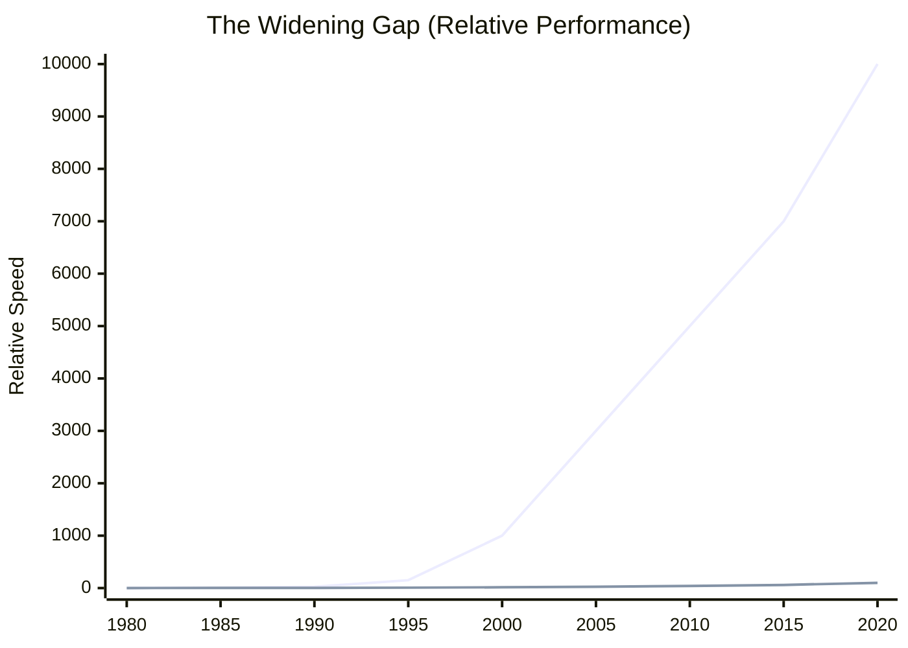

Hardware architects addressed this with **caches**: small, fast memory close to the CPU that holds recently-accessed data. Modern processors have three levels:

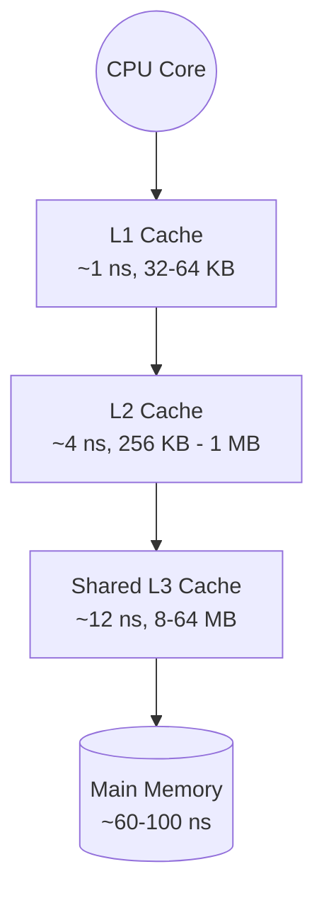

When your code accesses memory, the hardware first checks L1. If the data isn't there (a "miss"), it checks L2, then L3, then finally main memory. Each level is larger but slower. The goal of cache-friendly code is to keep your working set in the fastest level possible.

**What goes wrong:** If your data structures scatter related values across memory, every access misses the cache. A linked list of small objects is pathological—each node might be on a different cache line, and following pointers defeats the prefetcher. Even arrays can be problematic if you access them non-contiguously or if they're larger than L3.

**The consequence:** Your code runs at memory speed, not CPU speed. Adding more compute (more cores, wider SIMD) doesn't help because you're not compute-bound. You could have the fastest CPU on the planet, and your code would still crawl.

**What FAT-P provides:** Containers like `HpcVector` and `AlignedVector` that store data contiguously with cache-line alignment. When you iterate through an `HpcVector`, the prefetcher can predict your access pattern and fetch ahead. The data arrives before you need it.

*The memory wall isn't a recent phenomenon—it emerged in the early 1990s and has shaped every architectural decision since. Part IV traces this history and explains why caches work the way they do.*

---

# **CHAPTER 2 — The NUMA Trap**

The memory wall gets worse on multi-socket systems.

A dual-socket server doesn't have one pool of memory—it has two, each attached to its own CPU socket via its own memory controller. Memory attached to socket 0 is "local" to cores on socket 0. Cores on socket 1 can access it, but they have to go through an interconnect, adding 50-100 nanoseconds to every access.

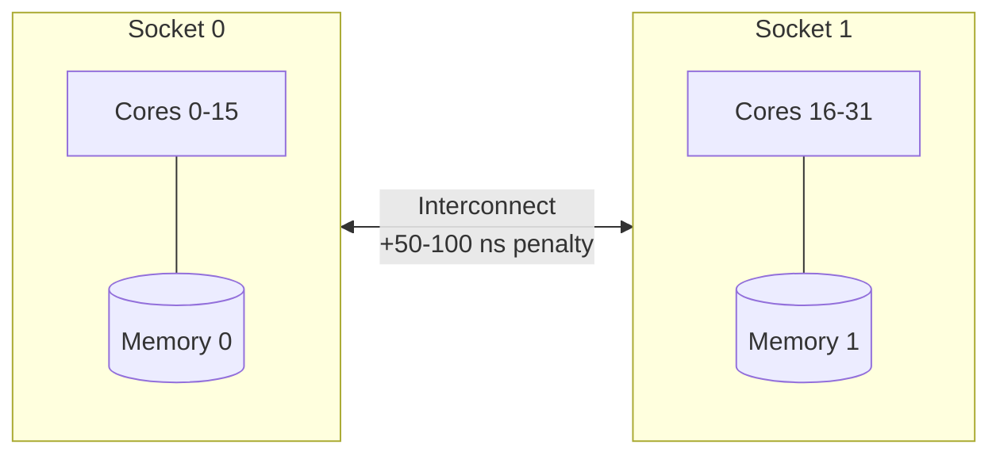

This is **NUMA: Non-Uniform Memory Access**. The "non-uniform" part is critical. A thread on socket 1 accessing memory on socket 0 pays a latency tax on *every load and store*.

**What goes wrong:** The operating system uses "first-touch" allocation. When you allocate memory with `new` or `malloc`, the OS doesn't immediately assign physical pages. It waits until you actually write to the memory, then places the page on whatever NUMA node the writing thread happens to be running on.

This is a trap. Consider:

```cpp
std::vector<double> data(10'000'000);

// Thread 0 initializes everything (DANGER!)
for (size_t i = 0; i < data.size(); ++i)
    data[i] = 0.0;

// Later, 32 threads process in parallel
#pragma omp parallel for
for (size_t i = 0; i < data.size(); ++i)
    data[i] = compute(data[i]);
```

All 10 million elements get placed on thread 0's NUMA node because thread 0 touched them first. When the parallel loop runs, half your threads are streaming data across the interconnect. Your 32-thread job runs at 60% of expected speed, and you can't figure out why.

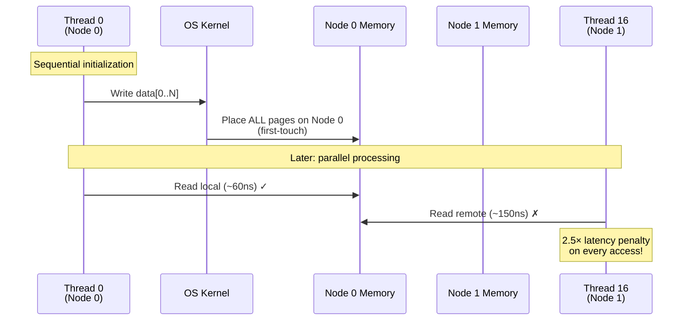

**The consequence:** Scaling stops. You add cores, and performance flatlines or even decreases. The interconnect becomes a bottleneck. Profilers show memory stalls, but don't explain that the stalls are *remote* memory stalls.

**What FAT-P provides:** NUMA-aware allocators that let you control placement. `NumaAllocator` places memory on a specific node or the current thread's node. `HpcVector` uses it by default. Combined with parallel initialization, you can ensure each thread's data is physically local:

```cpp
HpcVector<double> data(10'000'000);

#pragma omp parallel
{
    // Each thread touches its own slice first
    size_t chunk = data.size() / omp_get_num_threads();
    size_t start = omp_get_thread_num() * chunk;
    size_t end = (omp_get_thread_num() == omp_get_num_threads() - 1) 
                 ? data.size() : start + chunk;
    
    for (size_t i = start; i < end; ++i)
        data[i] = 0.0;
}

// Now parallel processing accesses local memory
#pragma omp parallel for
for (size_t i = 0; i < data.size(); ++i)
    data[i] = compute(data[i]);
```

*NUMA emerged from SGI's supercomputer designs in the 1990s. Part IV explains why memory geography became necessary and how first-touch policy evolved.*

---

# **CHAPTER 3 — The SIMD Gap**

AVX2 can process 8 floats per instruction. That's an 8× speedup, right?

Rarely. Here's what actually happens.

SIMD instructions have preconditions. `_mm256_load_ps` requires the pointer to be 32-byte aligned—if it's not, you get a segfault or silent corruption depending on the instruction variant. The data must be contiguous in memory; gather operations exist but they're slow. And all 8 lanes execute the same operation—if your loop has data-dependent branches, you're back to scalar code.

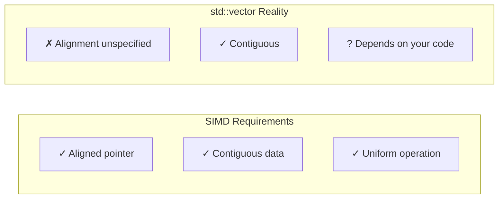

**What goes wrong:** `std::vector` makes no alignment guarantees. Its `data()` pointer might be 8-byte aligned (enough for a double) or 16-byte aligned (enough for SSE) or something else entirely. It's implementation-defined. If you're using AVX2, you need 32-byte alignment. If you're using AVX-512, you need 64-byte alignment. `std::vector` doesn't know and doesn't care.

So you write your SIMD loop, and one of three things happens:

1. The compiler falls back to unaligned loads (slower, but works)
2. The compiler refuses to vectorize at all
3. You use aligned load instructions and get runtime crashes on some inputs

**The consequence:** You get 2× speedup instead of 8×, or your code crashes unpredictably, or both.

**What FAT-P provides:** `AlignedVector` and `HpcVector` guarantee 64-byte alignment by default—enough for any current SIMD instruction set, including AVX-512. They also provide `assume_aligned()` to communicate alignment to the compiler:

```cpp
HpcVector<float> data(1000);
float* ptr = data.assume_aligned();  // Compiler knows this is 64-byte aligned
// Enables generation of aligned load/store instructions
```

`SimdVector` wraps platform-specific intrinsics in a portable abstraction:

```cpp
using Vec = SimdVector<float>;  // 8 lanes on AVX2, 4 on SSE/NEON

for (size_t i = 0; i + Vec::lanes <= n; i += Vec::lanes) {
    Vec v = Vec::load_aligned(&data[i]);
    v = fma(v, scale, offset);  // v * scale + offset
    v.store_aligned(&result[i]);
}

// Don't forget the scalar tail!
for (; i < n; ++i)
    result[i] = data[i] * scale + offset;
```

Same code compiles to AVX2 on x86-64, NEON on ARM, scalar fallback elsewhere. The lane count adapts automatically.

*The x86 SIMD story is one of relentless widening—from MMX's 64 bits in 1997 to AVX-512's 512 bits today. Part IV traces this evolution and explains why portable abstractions became necessary.*

---

# **CHAPTER 4 — The Arithmetic Illusion**

Quick: what's `INT_MAX + 1`?

In C++, it's **undefined behavior**. The compiler is allowed to assume it never happens. If it does happen, the result could be `INT_MIN` (wraparound), or zero, or anything—including code that doesn't execute at all because the optimizer removed a "dead" branch that was only reachable via overflow.

Unsigned overflow is defined: it wraps. `UINT_MAX + 1 == 0`. This is predictable, but it's rarely what you want.

Floating-point is different again. Overflow produces infinity (`inf`). Invalid operations (0/0, sqrt(-1)) produce NaN (Not a Number). NaN propagates silently: `NaN + x == NaN` for any x. A single bad value can corrupt an entire computation without triggering any error.

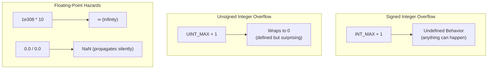

SIMD makes all of this worse. There's no per-lane exception mechanism. You get a vector of 8 results; any one of them might be garbage, and you won't know unless you explicitly check.

**What goes wrong:** You write a numerical library. It works on test cases. Then someone feeds it input that causes overflow in an intermediate calculation. The CPU doesn't trap. Your code doesn't check. The wrong answer propagates to the final result. If you're lucky, it's obviously wrong and someone notices. If you're unlucky, it's plausible, and it shows up in a financial report or a medical device or a bridge design.

**The consequence:** Silent data corruption. Wrong answers that look right. Trust issues with your entire numerical pipeline.

**What FAT-P provides:** `CheckedArithmetic`—versions of `+`, `-`, `*`, `/` that detect overflow and route it through a configurable policy:

```cpp
// Throw on overflow
int a = checked_add<ThrowOnError>(x, y);

// Return Expected<int, MathError>
auto b = checked_add<ReturnExpected>(x, y);
if (!b) handle_error(b.error());

// Clamp to representable range (saturating)
int c = checked_add<Saturating>(x, y);  // INT_MAX + 1 → INT_MAX

// Allow infinity, reject NaN
double d = checked_div_fp<InfTolerant>(1.0, 0.0);  // → +inf (allowed)
double e = checked_div_fp<InfTolerant>(0.0, 0.0);  // → throws (NaN rejected)
```

Vector operations dispatch to SIMD automatically:

```cpp
checked_add_vec<Saturating>(a.data(), b.data(), out.data(), n);
// Uses AVX2 on x86-64, NEON on ARM, scalar elsewhere
```

*The belief that "safety is slow" is a myth. Part IV explains the hardware tricks that make overflow detection nearly free in SIMD pipelines—including the differential saturation trick on ARM and the sign-bit XOR trick on x86.*

---

# **CHAPTER 5 — The False Sharing Catastrophe**

You have two counters, one per thread:

```cpp
struct Counters {
    std::atomic<uint64_t> thread0_count;
    std::atomic<uint64_t> thread1_count;
};
```

Each thread increments only its own counter. There's no logical sharing. Yet performance is terrible—worse than a single-threaded version.

The problem is **physical sharing**. Both counters fit in a single 64-byte cache line. When thread 0 increments `thread0_count`, the hardware invalidates that cache line in thread 1's L1 cache. When thread 1 increments `thread1_count`, it must fetch the line back—which invalidates it in thread 0's cache. The line bounces back and forth, and your "parallel" code serializes on cache coherence traffic.

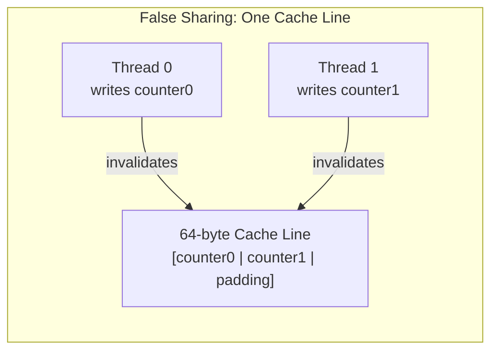

This is **false sharing**. It's invisible at the source level, catastrophic at runtime, and surprisingly common. The symptom is parallel code that runs *slower* than sequential code, with profilers showing high memory stall cycles and no obvious cause.

**When it happens:**

- Adjacent array elements written by different threads
- Different fields of the same struct written by different threads
- Unrelated variables that the linker happened to place on the same cache line
- Per-thread data structures allocated adjacently by `malloc`

**What FAT-P provides:** `CacheAligned<T>` pads a value to occupy its own 64-byte cache line:

```cpp
#include "CacheUtilities.h"

struct Counters {
    CacheAligned<std::atomic<uint64_t>> thread0_count;
    CacheAligned<std::atomic<uint64_t>> thread1_count;
};
```

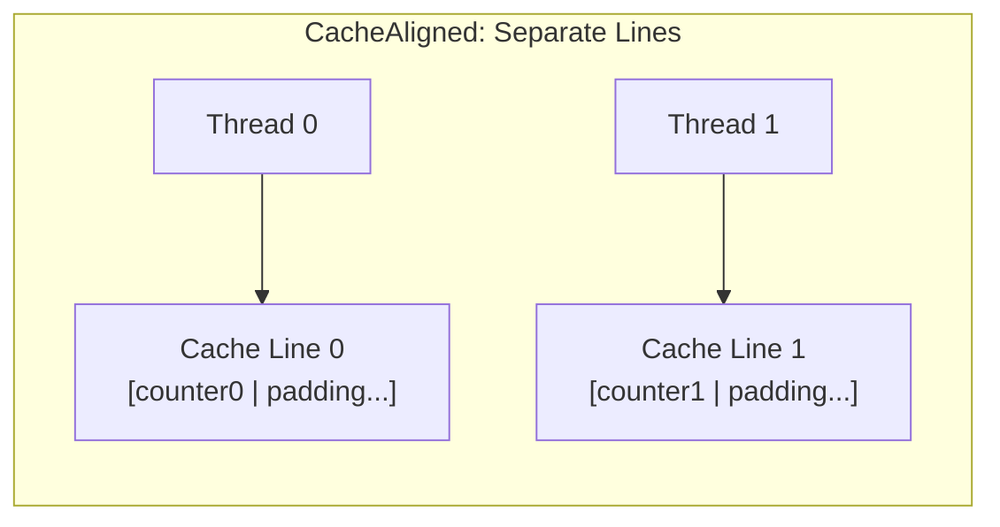

Now each counter occupies its own cache line. No sharing, no coherence traffic, full parallel performance.

The cost is 64 bytes per value regardless of actual size. For hot, frequently-written concurrent data, it's always worth it. For cold or read-mostly data, the padding is wasted space.

**When to use CacheAligned:**

| Data Pattern | Use CacheAligned? |
|--------------|-------------------|
| Per-thread counters/accumulators | Yes |
| Flags polled by multiple threads | Yes |
| Read-mostly shared data | No (readers don't cause invalidation) |
| Thread-private data (not shared at all) | No |

**Diagnosing false sharing:** Hardware performance counters can reveal the problem. On Linux:

```bash
perf stat -e L1-dcache-load-misses,cache-misses ./program
```

If adding threads increases cache miss rates dramatically—especially with no logical sharing—false sharing is likely.

---

# **Closing: The Common Thread**

The five problems in Part I share a root cause: **C++ abstracts over hardware details that matter for performance**.

| C++ Pretends | Hardware Reality |
|--------------|------------------|
| Memory is flat | Memory has hierarchy; access time varies 100× |
| Memory is uniform | NUMA nodes have geography; remote access is slow |
| Pointers are just addresses | Alignment determines what instructions are legal |
| Integers are infinite | Overflow wraps or invokes undefined behavior |
| Variables are independent | Cache lines create invisible physical coupling |

These abstractions make programming easier, but they create performance cliffs. Code that looks equivalent can differ by 10× based on memory layout. Code that looks parallel can serialize on cache line bouncing. Code that looks correct can produce wrong answers via overflow.

FAT-P doesn't replace these abstractions—it provides tools for when they become obstacles. The library gives you:

- **Containers** that guarantee alignment and NUMA placement
- **Allocators** that control physical memory topology  
- **SIMD wrappers** that adapt to available hardware
- **Arithmetic** that detects overflow without sacrificing speed
- **Padding utilities** that prevent false sharing

Part II explains how to use these components. Part III shows them in action on real problems. Part IV traces the hardware history that made them necessary—understanding *why* the machine works this way makes the solutions intuitive rather than arbitrary.

---

*Proceed to Part II for component documentation, Part III for case studies, or Part IV for foundations and history.*
-e 
---

# **PART II — THE SOLUTIONS**

---

# **CHAPTER 6 — Library Architecture**

FAT-P isn't a framework. It's a toolkit organized around the problems described in Part I, with each layer addressing a specific gap between what C++ provides and what high-performance code requires.

The design follows a principle: **don't pay for what you don't use**. If your code only needs aligned storage for SIMD, include `AlignedVector.h` and nothing else. If you're on a single-socket machine, ignore the NUMA allocators entirely. The layers compose but don't depend on each other unnecessarily.

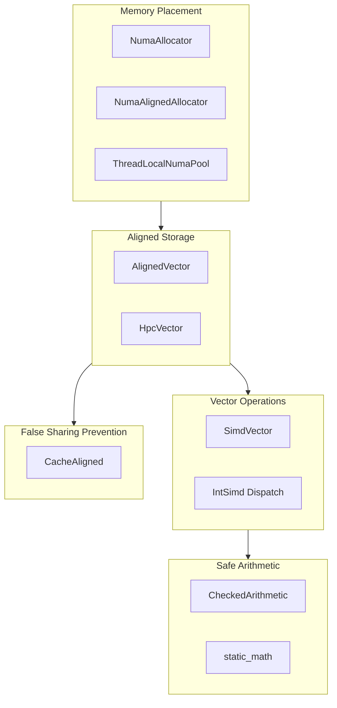

**Memory Placement** addresses the NUMA problem from Chapter 2. The operating system's first-touch policy places memory based on which thread happens to write first—a policy optimized for generality, not performance. The NUMA allocators let you override this with explicit placement: local to a specific node, local to the calling thread, or interleaved across nodes.

**Aligned Storage** addresses the SIMD alignment problem from Chapter 3. `std::vector` makes no alignment guarantees beyond what the element type requires. For a `float`, that's 4 bytes—nowhere near the 32 or 64 bytes that AVX2 and AVX-512 want. `AlignedVector` and `HpcVector` guarantee alignment at construction, reallocation, and after move operations.

**Vector Operations** addresses the portability problem. SIMD intrinsics are platform-specific, verbose, and easy to get wrong. `SimdVector` wraps them in an interface that adapts to the target architecture. The same source code compiles to AVX2 on x86-64, NEON on ARM, or scalar operations on platforms without vector units.

**Safe Arithmetic** addresses the overflow problem from Chapter 4. The C++ standard either leaves overflow undefined (signed integers) or defines it as wraparound (unsigned)—neither of which is what numerical code usually wants. `CheckedArithmetic` detects overflow and routes it through a configurable policy.

**False Sharing Prevention** addresses the cache coherence problem from Chapter 5. When threads write to addresses on the same cache line, the hardware serializes their operations through the coherence protocol. `CacheAligned` pads values to occupy their own cache lines, eliminating this hidden contention.

---

# **CHAPTER 7 — Containers: AlignedVector and HpcVector**

The standard library's `std::vector` is designed for generality. It works with any allocator, supports any element type, and makes minimal assumptions about how you'll use it. This generality comes at a cost: it can't provide the guarantees that high-performance code needs.

Consider what happens when you write a SIMD loop over a `std::vector<float>`:

```cpp
std::vector<float> data(1000);
// ...
for (size_t i = 0; i + 8 <= data.size(); i += 8)
{
    __m256 v = _mm256_load_ps(&data[i]);  // Requires 32-byte alignment
    // ...
}
```

This code has a latent bug. `_mm256_load_ps` requires its argument to be 32-byte aligned. `std::vector` doesn't guarantee this—its `data()` pointer might be 8-byte aligned, 16-byte aligned, or something else entirely. On some runs, the code works. On others, it crashes with a segmentation fault. On others still, it silently produces wrong results (if you accidentally used `_mm256_loadu_ps` thinking it was the aligned variant).

You could use `_mm256_loadu_ps` (the unaligned load), but unaligned loads are slower on older hardware and prevent certain compiler optimizations. You could manually align the allocation, but then you lose `std::vector`'s convenient interface. You could use `std::aligned_alloc`, but managing that memory manually defeats the purpose of using a container.

`AlignedVector` solves this by building alignment into the container's contract:

```cpp
#include "AlignedVector.h"

AlignedVector<float> data(1000);
// data.data() is guaranteed 64-byte aligned
```

The default alignment is 64 bytes—enough for AVX-512 and also a cache line boundary on all mainstream processors. You can request a different alignment as a template parameter:

```cpp
AlignedVector<float, 128> data(1000);  // 128-byte aligned
```

The alignment guarantee holds across the container's entire lifetime: at construction, after `push_back` triggers reallocation, after move construction, and after assignment. This is the invariant that `std::vector` can't provide.

**HpcVector** adds NUMA awareness on top of alignment. It uses `NumaAlignedAllocator` internally, placing memory on the calling thread's local NUMA node:

```cpp
#include "HpcVector.h"

HpcVector<double> data(1'000'000);
// Aligned AND on the local NUMA node
```

Why combine these concerns? Because in practice, code that cares about SIMD alignment also cares about memory placement. The problems from Chapters 2 and 3 occur together: you're processing large arrays in parallel, you need the data aligned for vector operations, and you need it placed correctly for memory bandwidth. `HpcVector` handles both with a single type.

Both containers provide `assume_aligned()`, which returns a pointer with a compiler hint attached:

```cpp
float* ptr = data.assume_aligned();
```

This hint enables the compiler to generate aligned load/store instructions without checking alignment at runtime. It's the bridge between the container's guarantee and the compiler's code generation.

**Interface compatibility:** Both containers implement the full `std::vector` interface—iterators, `push_back`, `insert`, `erase`, `reserve`, move semantics, and so on. They're designed as drop-in replacements. Code that works with `std::vector` will work with `AlignedVector` or `HpcVector` after changing the type.

**Standard algorithm compatibility:** Because `AlignedVector` and `HpcVector` provide standard-compliant iterators, they work seamlessly with `<algorithm>` functions. You can use `std::sort`, `std::transform`, `std::reduce`, `std::copy`, and any other algorithm expecting random-access iterators. The alignment guarantees are preserved—sorting an `HpcVector` doesn't break its alignment, and the sorted data remains on the same NUMA node.

**Growth behavior:** Both use geometric growth (doubling capacity when exceeded) to maintain amortized O(1) insertion. When `HpcVector` reallocates, it places the new buffer on the same NUMA node as the original—you don't lose locality just because the vector grew.


**Alignment guarantees in detail:** `AlignedVector<T, Alignment>` guarantees that `data()` returns a pointer aligned to `Alignment` bytes (default 64). This guarantee holds at construction, after any reallocation triggered by `push_back`/`insert`/`resize`, after move construction, and after move assignment. When paired with `NumaAlignedAllocator`, allocations are page-aligned (≥4096 bytes), which exceeds AVX-512 requirements and enables transparent huge page support on Linux. This combination of cache-line alignment and page alignment is stronger than any standard library container provides.

**Cross-platform notes:** On Windows, alignment uses `_aligned_malloc`; on POSIX systems, `posix_memalign` or `aligned_alloc`. NUMA placement uses `VirtualAllocExNuma` on Windows and `numa_alloc_onnode` on Linux. Both platforms are fully supported, though NUMA topology detection APIs differ slightly.

---

# **CHAPTER 8 — NUMA Allocators**

Chapter 2 described the first-touch trap: the operating system places memory pages on whatever NUMA node happens to touch them first. For single-threaded initialization followed by parallel processing, this places all data on one node while half your threads are on another.

The NUMA allocators let you override this default. They're standard C++ allocators—they work with `std::vector`, `std::list`, or any allocator-aware container—but they control physical placement.

**NumaLocalPolicy** places memory on the calling thread's NUMA node. This is the right choice for thread-private data: each thread allocates its own working memory, and that memory ends up local to the thread that will use it.

```cpp
std::vector<double, NumaAllocator<double, NumaLocalPolicy>> local_data(1000);
// Allocated on the current thread's NUMA node
```

**NumaPreferredPolicy** places memory on a specific node, regardless of which thread does the allocation. This is useful when you know in advance which core will process the data—for example, when you're setting up data structures for a worker thread that hasn't started yet.

```cpp
constexpr int target_node = 1;
std::vector<double, NumaAllocator<double, NumaPreferredPolicy<target_node>>> data(1000);
// Allocated on NUMA node 1
```

**NumaInterleavedPolicy** spreads pages across all NUMA nodes in round-robin fashion. This is the right choice for shared, read-mostly data. No single thread gets optimal locality, but no thread gets worst-case locality either. The memory bandwidth load spreads across all memory controllers.

```cpp
std::vector<double, NumaAllocator<double, NumaInterleavedPolicy>> shared_table(1'000'000);
// Pages interleaved across all nodes
```

**Choosing the right policy:** The decision depends on access patterns. If one thread will own the data, use local allocation on that thread. If multiple threads will read the data roughly equally, use interleaved. If the data moves between threads but each transfer is to a predictable destination, use preferred allocation on the destination.

**ThreadLocalNumaPool** addresses a different problem: allocation frequency. Even NUMA-aware allocation goes through the operating system, and system calls are expensive. In a hot loop that repeatedly allocates and frees scratch buffers, this overhead accumulates.

The pool maintains per-thread freelists. When you allocate, it returns a cached block if one is available. When you deallocate, the block goes back to the cache rather than the OS. The first allocation of a given size incurs a system call; subsequent allocations of that size are just pointer manipulation.

```cpp
void* scratch = ThreadLocalNumaPool::allocate(buffer_size);
// Use scratch...
ThreadLocalNumaPool::deallocate(scratch, buffer_size);
// Block cached for reuse, not returned to OS
```

This is particularly valuable for FFT libraries, linear algebra routines, and other code that needs temporary workspace. You can configure the library to use `ThreadLocalNumaPool` as its allocator, eliminating allocation overhead from inner loops.

**Critical constraint:** Memory from `ThreadLocalNumaPool` must be freed by the same thread that allocated it. The pool is thread-local; there's no cross-thread accounting. Passing a pointer to another thread and freeing it there is undefined behavior. Design your code so that the allocating thread is also the freeing thread, or copy data between threads rather than transferring ownership.

---

# **CHAPTER 9 — SimdVector**

The promise of SIMD is parallelism within a single core: process 4, 8, or 16 values with one instruction. The reality is a fragmented landscape of incompatible instruction sets, each with its own intrinsics, quirks, and limitations.

AVX2 on x86-64 gives you 8-wide float operations, but only on processors from 2013 onward. SSE2 is more universal but only 4-wide. ARM NEON is 4-wide for floats but lacks double-precision SIMD on 32-bit ARM. AVX-512 is 16-wide but limited to server-class x86 processors (Intel Skylake-X and later, AMD Zen 4 and later) and comes with throttling concerns on some chips. Writing portable SIMD code means either maintaining multiple implementations or accepting the lowest common denominator.

`SimdVector<T>` abstracts over this fragmentation. You write to a single interface; the implementation dispatches to the best available instruction set at compile time.

```cpp
#include "SimdVector.h"

using Vec = SimdVector<float>;
constexpr size_t W = Vec::lanes;  // 8 on AVX2, 4 on SSE/NEON, 1 on scalar
```

The lane count is a compile-time constant. Your loops automatically adapt:

```cpp
void scale(float* data, size_t n, float factor)
{
    using Vec = SimdVector<float>;
    constexpr size_t W = Vec::lanes;
    
    Vec vfactor(factor);  // Broadcast scalar to all lanes
    
    size_t i = 0;
    for (; i + W <= n; i += W)
    {
        Vec v = Vec::load_aligned(&data[i]);
        v = v * vfactor;
        v.store_aligned(&data[i]);
    }
    
    // Scalar tail: handle remaining elements
    for (; i < n; ++i)
        data[i] *= factor;
}
```

This code compiles to tight AVX2 loops on modern x86-64, NEON loops on ARM, or plain scalar code on platforms without vector support. You write it once.

**The scalar tail is not optional.** SIMD processes W elements at a time. If your array size isn't a multiple of W, the last few elements must be handled separately. Forgetting this is a common bug: the SIMD loop runs correctly, but the final 1–7 elements are never processed.

**Load and store alignment:** `load_aligned` and `store_aligned` require the pointer to be aligned to the vector width (32 bytes for AVX2, 16 bytes for SSE/NEON). If your data comes from `AlignedVector` or `HpcVector`, this is guaranteed. If it comes from elsewhere, use `load_unaligned` and `store_unaligned`—slower, but safe.

**Horizontal operations** reduce a vector to a scalar:

```cpp
Vec v = /* ... */;
float sum = v.horizontal_sum();  // Sum all lanes
float min = v.horizontal_min();  // Minimum across lanes
float max = v.horizontal_max();  // Maximum across lanes
```

These are expensive relative to lane-wise operations—they require shuffling data within the register. Use them at the end of a reduction, not inside inner loops.

**Comparisons and masking** enable conditional logic without branches:

```cpp
Vec a = /* ... */;
Vec b = /* ... */;

auto mask = a < b;              // Per-lane comparison
Vec result = blend(mask, a, b); // Select a where true, b where false
```

This compiles to branchless code. Instead of unpredictable branches that stall the pipeline, you get unconditional execution with per-lane selection. For data-dependent conditions that vary across elements, this is often faster than scalar code with branches.

**NaN and infinity checking:**

```cpp
bool has_bad = v.has_nan();    // Any lane is NaN?
bool all_ok = v.all_finite();  // All lanes finite?
```

These are fast bulk checks—much cheaper than checking each element individually in scalar code. Use them to validate results after vectorized computation.


**SimdVector is floating-point only.** `SimdVector<T>` supports `float` and `double`. Integer SIMD with overflow detection uses the `CheckedArithmetic` vector operations (`checked_add_vec`, `checked_mul_vec`, etc.), which dispatch to architecture-specific backends internally. This separation exists because integer overflow detection requires fundamentally different techniques than floating-point SIMD.

**SIMD Backend Reference:**

| Architecture | Instruction Set | float lanes | double lanes | int32 lanes | int64 lanes |
|--------------|-----------------|-------------|--------------|-------------|-------------|
| x86-64 AVX2  | AVX2            | 8           | 4            | 8           | 4           |
| x86-64 SSE2  | SSE2            | 4           | 2            | 4           | 2           |
| ARMv8 NEON   | NEON (AArch64)  | 4           | 2            | 4           | 2           |
| ARMv7 NEON   | NEON (AArch32)  | 4           | —            | 4           | —           |
| Scalar       | —               | 1           | 1            | 1           | 1           |

Integer SIMD uses different detection methods per architecture: AVX2 uses wide multiply with sign-bit XOR detection; NEON uses differential saturation (comparing wrapping vs saturating results). See Appendix B for implementation details.

**Platform limitations to know:**

NEON on 32-bit ARM lacks double-precision SIMD. `SimdVector<double>` falls back to scalar operations. If you're targeting AArch32 and need double performance, consider using single precision where possible or accepting the scalar fallback.

SSE2 lacks efficient 64-bit integer SIMD. `SimdVector<int64_t>` is limited. AVX2 provides full 64-bit integer support, but older x86-64 processors may only have SSE2.

---

# **CHAPTER 10 — CheckedArithmetic**

Chapter 4 described the arithmetic illusion: C++ arithmetic operations silently produce wrong answers when overflow occurs. Signed integer overflow is undefined behavior. Unsigned integer overflow wraps. Floating-point overflow produces infinity. In all cases, the program continues executing as if nothing happened.

`CheckedArithmetic` makes overflow visible. It provides versions of `+`, `-`, `*`, and `/` that detect overflow and route it through a policy you choose.

**The policy determines what happens when overflow is detected:**


| Policy | On Overflow | On Underflow | On FP NaN | On FP Inf | noexcept | Best For |
|--------|-------------|--------------|-----------|-----------|----------|----------|
| `ThrowOnError` | throws | throws | throws | throws | No | Validation, debugging |
| `ReturnExpected` | returns error | returns error | returns error | returns error | Yes | Functional error handling |
| `Saturating` | clamps to MAX | clamps to MIN | propagates | propagates | Yes | DSP, image processing |
| `InfTolerant` | allows | allows | throws | allows | No | Scientific computing |

**ThrowOnError** throws an exception. Use this in code where overflow represents a bug—the inputs should have been validated earlier, and overflow means something went wrong. Throwing immediately makes the bug visible and prevents corrupted results from propagating.

```cpp
int result = checked_add<ThrowOnError>(x, y);
// Throws std::overflow_error if x + y overflows
```

**ReturnExpected** returns an `Expected<T, MathError>` that either holds the result or an error. Use this when overflow is a possible outcome that calling code should handle—for example, when processing untrusted input where large values are possible but not necessarily bugs.

```cpp
auto result = checked_add<ReturnExpected>(x, y);
if (!result)
{
    // Handle overflow: log, substitute a default, report to user, etc.
    return handle_overflow(result.error());
}
use(result.value());
```

**Saturating** clamps the result to the representable range. `INT_MAX + 1` produces `INT_MAX`. Use this in signal processing, image processing, and other domains where "as large as possible" is a reasonable interpretation of overflow.

```cpp
int result = checked_add<Saturating>(x, y);
// If x + y would overflow, returns INT_MAX (or INT_MIN for underflow)
```

**InfTolerant** (floating-point only) allows infinity but rejects NaN. Use this in scientific computing where infinity can be a meaningful result (division by a very small number, for example) but NaN indicates an error (0/0, sqrt of negative).

```cpp
double result = checked_div_fp<InfTolerant>(x, y);
// Returns ±∞ if y is zero, but errors if result would be NaN
```

**Choosing a policy:** The decision depends on what overflow means in your domain. Is it a bug that should never happen? Throw. Is it an expected edge case? Return an error. Is "clamp to maximum" the right behavior? Saturate. Think about what the calling code should do when overflow occurs, and pick the policy that routes to that behavior.

**Vector operations** apply checked arithmetic to arrays:

```cpp
std::vector<int32_t> a(1000), b(1000), result(1000);
// Initialize a, b...

checked_add_vec<Saturating>(a.data(), b.data(), result.data(), 1000);
```

This dispatches to SIMD automatically. On AVX2, it processes 8 elements at a time with overflow detection on each lane. On NEON, 4 at a time. The overflow check is built into the vectorized loop—you don't pay extra for safety versus an unchecked SIMD implementation.

**static_math** catches overflow at compile time for constant expressions:

```cpp
constexpr int a = static_math::add<int, 100, 200>();      // OK: 300
constexpr int b = static_math::add<int, INT_MAX, 1>();    // Compile error
constexpr int c = static_math::mul<int, 1000000, 1000000>(); // Compile error
```

This is valuable for computing buffer sizes, array dimensions, and other constants. If the constant would overflow, you find out at compile time rather than when a user hits the edge case.

**Where to check:** The overhead of checked arithmetic is small but nonzero. Don't blindly replace every `+` with `checked_add`. Instead, identify where overflow could occur and where it would be catastrophic:

Accumulation loops are high-risk. A sum over millions of elements can overflow even when individual elements are small. Check the addition that updates the accumulator.

Intermediate calculations with large operands are high-risk. Multiplying two user-provided values, computing array indices from user-provided dimensions, converting between units with large scale factors—these are overflow points.

Performance-critical inner loops may need unchecked arithmetic. If you've validated inputs at the boundary and can prove overflow is impossible, the inner loop can use native operations. Put the checks where they catch bugs without slowing critical paths.

---

# **CHAPTER 11 — Cache Alignment Utilities**

Chapter 5 described false sharing: when threads write to different variables that happen to share a cache line, the hardware's coherence protocol serializes their operations. The threads are logically independent, but physically contending.

The fix is structural: ensure that data written by different threads lives on different cache lines. `CacheAligned<T>` wraps a value with alignment and padding that guarantees it occupies its own cache line:

```cpp
#include "CacheUtilities.h"
using namespace fat_p::perf;

struct ThreadCounters
{
    CacheAligned<std::atomic<uint64_t>> thread0_count;
    CacheAligned<std::atomic<uint64_t>> thread1_count;
    CacheAligned<std::atomic<uint64_t>> thread2_count;
    CacheAligned<std::atomic<uint64_t>> thread3_count;
};
```

Without `CacheAligned`, all four counters might fit in a single 64-byte cache line. Every increment by any thread would invalidate the line for all other threads. With `CacheAligned`, each counter is on its own line. Threads can increment their counters without affecting each other's caches.

**Access the wrapped value** through `.get()` or the implicit conversion:

```cpp
counters.thread0_count.get().fetch_add(1, std::memory_order_relaxed);

// Or via implicit conversion:
std::atomic<uint64_t>& counter = counters.thread0_count;
counter.fetch_add(1, std::memory_order_relaxed);
```

**The cost is 64 bytes per value.** A plain `uint64_t` is 8 bytes; `CacheAligned<uint64_t>` is 64 bytes. For a small number of hot, frequently-written values—per-thread counters, status flags, queue heads and tails—this is an excellent trade. For large arrays, it's prohibitive.

**When to use CacheAligned:**

Per-thread state that's written frequently: counters, accumulators, local work queues. These are classic false sharing victims.

Shared flags and status indicators: "done" flags, progress indicators, shutdown signals. If multiple threads poll a flag while one thread occasionally writes it, false sharing causes unnecessary cache traffic.

Queue data structures: The head and tail pointers of a concurrent queue are written by different threads (producer vs. consumer). Putting them on separate cache lines is standard practice in lock-free queue implementations.

**When not to use CacheAligned:**

Data that's read-only after initialization. No writes means no coherence traffic, so false sharing doesn't occur.

Data that's written by only one thread. If the same thread does all the writing, there's no contention to avoid.

Large arrays where per-element padding is impractical. For bulk data, proper partitioning (each thread owns a contiguous slice) is the solution, not per-element padding.

**Diagnosing false sharing:** Hardware performance counters can reveal the problem. High "cache line invalidations" or "coherence traffic" on data that threads shouldn't be sharing suggests false sharing. Tools like `perf` on Linux or VTune on Windows can pinpoint the affected cache lines. Once identified, `CacheAligned` provides the fix.

---

*Part II provides the building blocks. Part III shows how they combine in practice.*
-e 
---

# **PART III — PUTTING IT TOGETHER**

The components in Part II solve individual problems: alignment, placement, vectorization, overflow. Real applications present these problems together, intertwined with domain-specific concerns. This part works through four extended case studies, showing how to recognize performance problems, diagnose their causes, and apply the library systematically.

Each case study follows the same structure: understand the domain, observe the symptoms, form hypotheses, gather evidence, apply fixes, and verify results. This mirrors how performance work actually happens—not as a checklist, but as an investigation.

---

# **CHAPTER 12 — Case Study: Particle Simulation**

## The Domain

Particle simulations model physical systems as collections of discrete objects that interact according to physical laws. The particles might represent stars in a galaxy, atoms in a protein, electrons in a plasma, or droplets in a spray. The simulation advances time in small steps: at each step, compute the forces on every particle, update velocities, update positions, repeat.

The computational heart of most particle simulations is the **force calculation**. In gravitational or electrostatic systems, every particle exerts a force on every other particle. For N particles, that's N² force pairs to evaluate. A 10-million-particle simulation has 10¹⁴ pair interactions per timestep. Even at nanoseconds per interaction, that's hours per step.

Sophisticated algorithms exist to reduce this cost—Barnes-Hut trees, fast multipole methods, particle-mesh hybrids—but all of them share a common structure: iterate over particles, access their properties, compute something, store results. The memory access pattern determines whether the computation runs at cache speed or memory speed.

## The Initial Implementation

The physics team started with a natural object-oriented design:

```cpp
struct Particle {
    float x, y, z;       // Position: 12 bytes
    float vx, vy, vz;    // Velocity: 12 bytes
    float mass;          // Mass: 4 bytes
};                       // Total: 28 bytes, padded to 32

std::vector<Particle> particles(10'000'000);
```

This is **Array of Structures** (AoS) layout. Each particle is a self-contained object. The position, velocity, and mass of particle i are stored contiguously at `particles[i]`.

The force calculation loop looks like this:

```cpp
for (size_t i = 0; i < N; ++i) {
    float fx = 0, fy = 0, fz = 0;
    for (size_t j = 0; j < N; ++j) {
        if (i == j) continue;
        
        float dx = particles[j].x - particles[i].x;
        float dy = particles[j].y - particles[i].y;
        float dz = particles[j].z - particles[i].z;
        
        float r2 = dx*dx + dy*dy + dz*dz + softening;
        float inv_r = 1.0f / std::sqrt(r2);
        float inv_r3 = inv_r * inv_r * inv_r;
        
        float f = particles[j].mass * inv_r3;
        fx += f * dx;
        fy += f * dy;
        fz += f * dz;
    }
    forces[i] = {fx, fy, fz};
}
```

This code is correct. It computes gravitational forces accurately. But on a dual-socket server with 32 cores, it runs far slower than expected. Parallelizing the outer loop with OpenMP helps, but only to a point—16 threads provide an 8× speedup, not 16×. Adding more threads makes it slower.

## Observing the Symptoms

The team profiles with `perf stat`:

```
$ perf stat -e cycles,instructions,cache-misses,L1-dcache-load-misses ./simulate

 Performance counter stats for './simulate':

     847,293,847,201      cycles
     312,847,182,847      instructions              #    0.37  insn per cycle
       2,847,182,847      cache-misses
      18,472,918,274      L1-dcache-load-misses

      142.847 seconds time elapsed
```

The key number: **0.37 instructions per cycle (IPC)**. A modern CPU can retire 4-6 instructions per cycle when running efficiently. An IPC of 0.37 means the CPU is stalled 90% of the time, waiting for something.

The L1 cache miss count is high, but that's expected for a 10-million-particle dataset—it can't fit in L1. The question is why those misses are so expensive.

The team adds NUMA monitoring:

```
$ numactl --hardware
available: 2 nodes (0-1)
node 0 cpus: 0-15
node 0 size: 64000 MB
node 1 cpus: 16-31
node 1 size: 64000 MB

$ numastat -p $(pgrep simulate)
                          Node 0          Node 1
                 --------------- ---------------
Numa_Hit                2847182         284718
Numa_Miss                284718        2847182
```

The `Numa_Miss` count on Node 1 is enormous. Threads on Node 1 are accessing memory on Node 0. The dataset was allocated entirely on Node 0 because a single thread initialized it.

But NUMA isn't the only problem. Even with `numactl --interleave=all`, performance improves by only 30%. Something else is wrong.

## Forming Hypotheses

The inner loop accesses particles in order: `particles[0]`, `particles[1]`, `particles[2]`, and so on. That's sequential access—exactly what the hardware prefetcher is designed to handle. Why isn't prefetching hiding the latency?

Look more carefully at what the loop actually uses:

```cpp
float dx = particles[j].x - particles[i].x;
float dy = particles[j].y - particles[i].y;
float dz = particles[j].z - particles[i].z;
// ...
float f = particles[j].mass * inv_r3;
```

Each iteration needs `x`, `y`, `z`, and `mass` from particle j. That's 16 bytes of useful data. But a `Particle` is 32 bytes (28 bytes of data, padded to 32 for alignment). Loading a cache line (64 bytes) brings in two particles—64 bytes to get 32 bytes of useful data.

Worse: only half of each particle is actually used. The velocity fields `vx`, `vy`, `vz` aren't touched in the force loop. They're updated in a separate integration step. But they're loaded anyway, because they're interleaved with the position fields.

**The effective bandwidth utilization is 16/64 = 25%.** Three-quarters of the data moved from memory to cache is never used.

This is the **data locality problem** inherent to Array of Structures layout when different operations access different fields.

## The Fix: Structure of Arrays

Reorganize the data so that each field is stored in its own contiguous array:

```cpp
struct Particles {
    HpcVector<float> x, y, z;       // Positions
    HpcVector<float> vx, vy, vz;    // Velocities
    HpcVector<float> mass;          // Masses
    
    explicit Particles(size_t n) 
        : x(n), y(n), z(n), vx(n), vy(n), vz(n), mass(n) {}
    
    size_t size() const { return x.size(); }
};
```

This is **Structure of Arrays** (SoA) layout. All x-coordinates are contiguous, then all y-coordinates, and so on.

The memory layout changes dramatically:

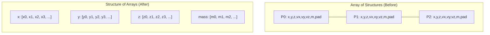

Now the force loop accesses only what it needs:

```cpp
for (size_t i = 0; i < N; ++i) {
    float fx = 0, fy = 0, fz = 0;
    float xi = particles.x[i];
    float yi = particles.y[i];
    float zi = particles.z[i];
    
    for (size_t j = 0; j < N; ++j) {
        if (i == j) continue;
        
        float dx = particles.x[j] - xi;
        float dy = particles.y[j] - yi;
        float dz = particles.z[j] - zi;
        
        float r2 = dx*dx + dy*dy + dz*dz + softening;
        float inv_r = 1.0f / std::sqrt(r2);
        float inv_r3 = inv_r * inv_r * inv_r;
        
        float f = particles.mass[j] * inv_r3;
        fx += f * dx;
        fy += f * dy;
        fz += f * dz;
    }
    // Store forces...
}
```

Each iteration reads 16 bytes of useful data (`x[j]`, `y[j]`, `z[j]`, `mass[j]`), and that's exactly what gets loaded. A 64-byte cache line now delivers 16 consecutive values from the same array—all useful. Bandwidth utilization jumps from 25% to nearly 100%.

The prefetcher is now fully effective. It sees sequential reads through each array and fetches ahead. By the time the loop needs `x[j+16]`, it's already in L1.

## NUMA-Aware Initialization

SoA fixes bandwidth utilization but not NUMA placement. Initialize in parallel:

```cpp
Particles particles(N);

#pragma omp parallel
{
    int tid = omp_get_thread_num();
    int nthreads = omp_get_num_threads();
    size_t chunk = (N + nthreads - 1) / nthreads;
    size_t start = tid * chunk;
    size_t end = std::min(start + chunk, N);
    
    for (size_t i = start; i < end; ++i) {
        particles.x[i] = initial_x(i);
        particles.y[i] = initial_y(i);
        particles.z[i] = initial_z(i);
        particles.vx[i] = initial_vx(i);
        particles.vy[i] = initial_vy(i);
        particles.vz[i] = initial_vz(i);
        particles.mass[i] = initial_mass(i);
    }
}
```

Each thread touches its slice first, placing those pages on the thread's local NUMA node. The subsequent parallel force calculation uses the same partitioning—each thread primarily accesses local memory.

## Adding SIMD

With SoA layout, SIMD vectorization is straightforward. The inner loop becomes:

```cpp
using Vec = SimdVector<float>;
constexpr size_t W = Vec::lanes;

for (size_t i = 0; i < N; ++i) {
    Vec fx(0.0f), fy(0.0f), fz(0.0f);
    Vec xi(particles.x[i]);
    Vec yi(particles.y[i]);
    Vec zi(particles.z[i]);
    Vec soft(softening);
    
    size_t j = 0;
    for (; j + W <= N; j += W) {
        Vec xj = Vec::load_aligned(&particles.x[j]);
        Vec yj = Vec::load_aligned(&particles.y[j]);
        Vec zj = Vec::load_aligned(&particles.z[j]);
        Vec mj = Vec::load_aligned(&particles.mass[j]);
        
        Vec dx = xj - xi;
        Vec dy = yj - yi;
        Vec dz = zj - zi;
        
        Vec r2 = fma(dx, dx, fma(dy, dy, fma(dz, dz, soft)));
        Vec inv_r = rsqrt(r2);  // Fast reciprocal sqrt
        Vec inv_r3 = inv_r * inv_r * inv_r;
        
        Vec f = mj * inv_r3;
        fx = fma(f, dx, fx);
        fy = fma(f, dy, fy);
        fz = fma(f, dz, fz);
    }
    
    // Horizontal sum and scalar tail
    float fx_sum = fx.horizontal_sum();
    float fy_sum = fy.horizontal_sum();
    float fz_sum = fz.horizontal_sum();
    
    for (; j < N; ++j) {
        // Scalar tail for remaining elements
        // ...
    }
    
    forces_x[i] = fx_sum;
    forces_y[i] = fy_sum;
    forces_z[i] = fz_sum;
}
```

On AVX2, this processes 8 particles per inner loop iteration. Combined with the bandwidth improvements from SoA, the speedup compounds.

## Results and Verification

After all optimizations:

```
$ perf stat -e cycles,instructions,cache-misses ./simulate_optimized

 Performance counter stats for './simulate_optimized':

      84,729,384,720      cycles
     412,847,182,847      instructions              #    4.87  insn per cycle
         284,718,284      cache-misses

       14.2 seconds time elapsed
```

IPC improved from 0.37 to 4.87—a 13× increase in instruction throughput. Cache misses dropped 10×. Total runtime improved from 142 seconds to 14 seconds: **10× overall speedup**.

The speedup factors roughly multiply:

- SoA layout: ~4× (bandwidth utilization 25% → 100%)
- NUMA placement: ~1.5× (eliminated remote accesses)
- SIMD: ~2× (limited by memory bandwidth, not full 8×)
- Combined: ~4 × 1.5 × 2 ≈ 12×

The SIMD speedup is less than the theoretical 8× because the loop is still partially memory-bound. But with better bandwidth utilization, SIMD now helps rather than being bottlenecked.


**FAT-P Components Used:**
- `HpcVector<float>` — Aligned storage + NUMA-local placement for position/velocity arrays
- `SimdVector<float>` — Vectorized distance and force calculations
- `assume_aligned()` — Compiler hints for aligned load/store generation
- Parallel initialization pattern — Ensures first-touch places data on correct NUMA nodes

## Transferable Lessons

**Recognize AoS vs SoA tradeoffs.** AoS is natural for object-oriented design and works well when you always access all fields together. SoA is better when different operations access different subsets of fields—which is common in simulations, game engines, and data processing.

**Profile for IPC, not just time.** Low IPC indicates the CPU is waiting. High cache misses with low IPC suggests memory bandwidth or latency problems.

**Check NUMA placement early.** On multi-socket systems, poor placement can cost 30-50% performance before you even consider algorithmic improvements.

**SIMD benefits compound with good layout.** Vectorization on poorly-laid-out data often disappoints because memory bandwidth dominates. Fix layout first, then vectorize.

---

# **CHAPTER 13 — Case Study: FFT Scratch Buffers**

## The Domain

The **Fast Fourier Transform** converts signals between time domain and frequency domain. A seismologist uses it to identify resonant frequencies in earthquake data. An audio engineer uses it to implement equalization. A physicist uses it to solve differential equations by transforming them into algebraic ones.

The FFT's efficiency comes from a clever factorization. Direct computation of a discrete Fourier transform is O(N²): each of N output values is a sum of N input values times complex exponentials. The FFT computes the same result in O(N log N) operations by exploiting symmetries in the exponentials.

Most FFT libraries—FFTW, Intel MKL, cuFFT—need **scratch space** during computation. The algorithm proceeds in stages, and each stage produces intermediate results that feed the next stage. These intermediate arrays are allocated internally by the library.

## The Initial Implementation

A computational physics team runs spectral fluid simulations. Each timestep involves hundreds of FFTs on grids of several million points. They parallelize with OpenMP, assigning different FFTs to different threads:

```cpp
#pragma omp parallel for
for (int field = 0; field < num_fields; ++field) {
    fft_execute(plans[field], input[field], output[field]);
}
```

Performance varies wildly between runs. On Monday, a timestep takes 2 seconds. On Tuesday, with identical input, it takes 3.5 seconds. On Wednesday, it's back to 2.1 seconds.

The team initially suspects OS scheduling noise, but the variation is too large—75% swings in runtime don't come from context switches. They suspect thermal throttling, but CPU temperatures are stable.

## Observing the Symptoms

The team instruments wall-clock time per FFT:

```cpp
#pragma omp parallel for
for (int field = 0; field < num_fields; ++field) {
    auto start = high_resolution_clock::now();
    fft_execute(plans[field], input[field], output[field]);
    auto end = high_resolution_clock::now();
    times[field] = duration_cast<microseconds>(end - start).count();
}
```

The distribution of `times[field]` is bimodal. Some FFTs take 1.8 ms. Others take 2.9 ms. There's nothing in between.

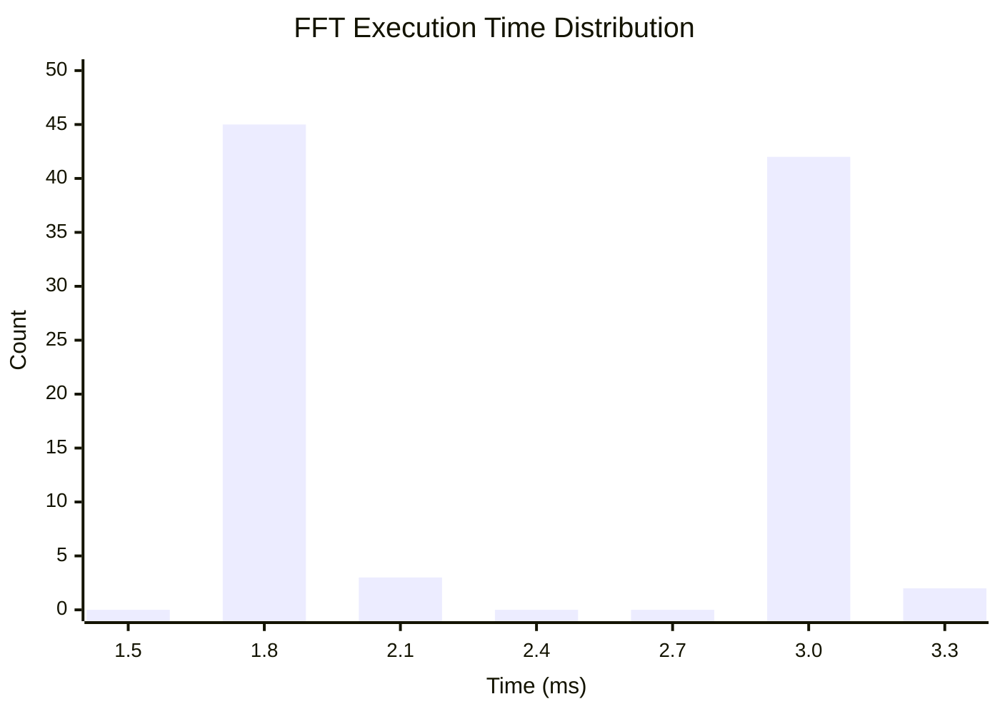

The threads that get slow FFTs vary from run to run. It's not specific to certain cores or certain fields. The pattern looks random.

## Forming Hypotheses

What differs between fast and slow FFTs? The input sizes are identical. The FFT plans are identical. The computations are mathematically identical.

The only thing that can differ is memory placement. The FFT library allocates scratch space internally using `malloc`. The operating system places those allocations according to first-touch policy. Which NUMA node gets the scratch depends on which core the allocating thread happens to be running on—and that's determined by OS scheduling.

When thread 5 (on NUMA node 0) executes an FFT, the scratch ends up on node 0. If the OS later migrates thread 5 to node 1 (for load balancing), subsequent FFTs have their scratch on the wrong node. The data must traverse the interconnect.

The bimodal distribution makes sense: local scratch gives 1.8 ms; remote scratch gives 2.9 ms. Nothing in between because each FFT's scratch is either entirely local or entirely remote.

## Gathering Evidence

The team adds NUMA monitoring:

```cpp
#pragma omp parallel for
for (int field = 0; field < num_fields; ++field) {
    numa_set_localalloc();  // Force subsequent allocations to local node
    fft_execute(plans[field], input[field], output[field]);
}
```

But this doesn't help—the FFT library allocates scratch once (during `fft_plan_create`) and reuses it. Setting allocation policy before `fft_execute` is too late.

They check whether the plans are created in parallel:

```cpp
// Original code: sequential plan creation
for (int field = 0; field < num_fields; ++field) {
    plans[field] = fft_plan_create(sizes[field], ...);
}
```

Plans are created on the main thread, which runs on (say) core 0. All scratch buffers are allocated on node 0. Later, when half the FFT executions run on node 1 threads, they're accessing remote scratch.

## The Fix: Control Scratch Allocation

The solution is to make scratch allocation NUMA-aware. Most FFT libraries allow custom allocators. Replace the default with `ThreadLocalNumaPool`:

```cpp
void* numa_aware_alloc(size_t bytes) {
    return ThreadLocalNumaPool::allocate(bytes);
}

void numa_aware_free(void* ptr, size_t bytes) {
    ThreadLocalNumaPool::deallocate(ptr, bytes);
}

// Configure library at startup
fft_set_allocator(numa_aware_alloc, numa_aware_free);
```

Now create plans in parallel, so each plan's scratch is allocated by (and on the node of) the thread that will execute it:

```cpp
#pragma omp parallel for
for (int field = 0; field < num_fields; ++field) {
    plans[field] = fft_plan_create(sizes[field], ...);
}
```

Thread 5 creates `plans[5]`, allocating scratch on thread 5's local node. Later, thread 5 executes `plans[5]`, accessing local scratch.

**Affinity binding** ensures threads don't migrate:

```cpp
#pragma omp parallel
{
    int tid = omp_get_thread_num();
    int core = tid;  // Simple 1:1 mapping
    cpu_set_t cpuset;
    CPU_ZERO(&cpuset);
    CPU_SET(core, &cpuset);
    pthread_setaffinity_np(pthread_self(), sizeof(cpu_set_t), &cpuset);
}
```

*(On Windows, use `SetThreadAffinityMask(GetCurrentThread(), 1ULL << core)` instead.)*

With threads pinned to cores, the thread that creates a plan is guaranteed to be the thread that executes it.

## Results

After the fix:

```
Before: Mean 2.6 ms, std dev 0.7 ms, range [1.8, 3.5] ms
After:  Mean 1.85 ms, std dev 0.05 ms, range [1.8, 1.9] ms
```

The bimodal distribution collapsed to a tight unimodal cluster. Mean time dropped by 29%, but more importantly, the variance dropped by 93%. The simulation now produces consistent, predictable runtimes.

Total timestep time improved by 2× because eliminating the slow FFTs removed the tail that dominated wall-clock time.

## The Deeper Problem: Performance Variability

This case study illustrates a particularly insidious class of bug: **non-deterministic performance**. The code is correct on every run. It produces the same numerical results. But its performance depends on uncontrolled factors—OS scheduling, allocation timing, cache state.

Non-deterministic performance is hard to debug because:

1. **It's intermittent.** The problem might not appear in your testing environment.
2. **It doesn't leave artifacts.** There's no crash, no wrong answer, no error message.
3. **It defeats simple profiling.** A profile of a fast run looks fine. A profile of a slow run shows the problem, but you might not capture one.
4. **It undermines optimization efforts.** You make a change that seems to help, but the improvement was actually random variation.

The fix requires understanding the system holistically—not just the algorithm, but the runtime, the OS, and the hardware topology.


**FAT-P Components Used:**
- `ThreadLocalNumaPool` — NUMA-local scratch allocation with per-thread caching
- Thread pinning pattern — Ensures allocating thread equals executing thread
- Custom allocator integration — Replaces library-internal malloc with NUMA-aware allocation

## Transferable Lessons

**Library-internal allocations can defeat your NUMA strategy.** Even if your data structures are perfectly placed, scratch buffers and temporaries might not be.

**Bimodal performance distributions suggest NUMA problems.** When timing data clusters into two groups rather than forming a single distribution, suspect local-vs-remote memory access.

**Pin threads when NUMA matters.** Thread migration is usually harmless, but it breaks NUMA affinity. Pin threads to cores for predictable placement.

**Variability can matter more than mean.** A 10% slower mean with 5% variance might be better than a 5% faster mean with 50% variance, depending on your application's requirements.

---

# **CHAPTER 14 — Case Study: Monte Carlo Risk Engine**

## The Domain

Financial institutions must estimate their potential losses. A bank holding a portfolio of derivatives needs to answer: if market conditions change adversely, how much money could we lose? Regulators require these estimates. Traders use them to size positions. Risk managers use them to set limits.

The problem is that "market conditions change" encompasses countless possibilities. Interest rates might rise or fall. Stock prices might jump or crash. Currencies might strengthen or weaken. Correlations between assets might shift. There's no formula that takes current market data and produces a single "risk" number.

**Monte Carlo simulation** handles this complexity by sampling. Instead of computing a single outcome, you simulate thousands or millions of possible futures. Each simulation—called a **path** or **scenario**—represents one way the markets might evolve:

1. Generate random market changes (interest rate moves, stock returns, etc.) from a probabilistic model calibrated to historical data
2. Reprice every instrument in the portfolio under those hypothetical market conditions
3. Record the portfolio's hypothetical profit or loss

After running many paths, you have a distribution of possible outcomes. The worst 1% of outcomes gives you **Value at Risk** (VaR). The average of the worst 5% gives you **Expected Shortfall**. These numbers go into regulatory filings and trading decisions.

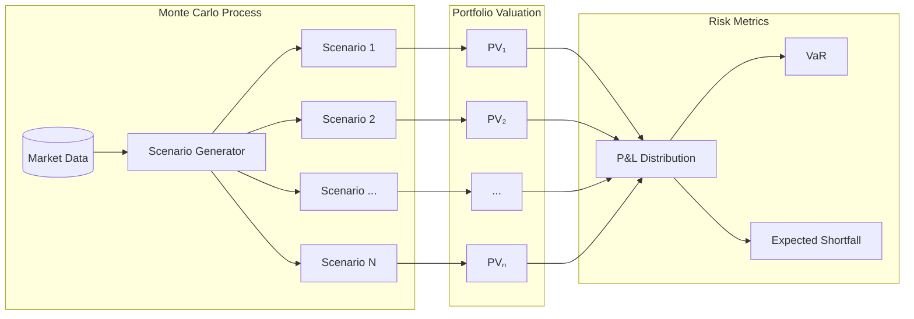

The computational challenge: a large bank might have millions of trades. Each trade requires repricing under each scenario. With 100,000 scenarios, that's 10¹¹ pricing operations per risk run. Risk runs happen daily, sometimes intraday. Speed matters.

## The Initial Implementation

The risk team inherited a system designed for flexibility:

```cpp
class MarketState {
    std::shared_ptr<InterestRateCurve> rate_curve;
    std::shared_ptr<VolatilitySurface> vol_surface;
    std::shared_ptr<FXRates> fx_rates;
    std::shared_ptr<CreditSpreads> credit;
    // ... dozens more market data components
};

class SimulationPath {
    std::shared_ptr<MarketState> base_state;
    std::shared_ptr<MarketState> shocked_state;
    std::vector<std::shared_ptr<Trade>> trades;
    std::vector<std::shared_ptr<PricingResult>> results;
};

class MonteCarloEngine {
    std::vector<std::shared_ptr<SimulationPath>> paths;
    
    void run() {
        for (auto& path : paths) {
            for (auto& trade : path->trades) {
                auto result = trade->price(path->shocked_state);
                path->results.push_back(result);
            }
        }
    }
};
```

This design is clean. Each component is encapsulated behind an interface. Shared pointers handle ownership. Adding new trade types or market data components is straightforward.

Performance is terrible. The profiler shows 70% of time in memory operations, not arithmetic.

## Observing the Symptoms

The team runs `perf record` and examines the hotspots:

```
Samples: 847K of event 'cycles'
Overhead  Command  Symbol
  23.47%  risk     std::_Sp_counted_base::_M_release
  18.24%  risk     Trade::price
  14.82%  risk     std::shared_ptr<>::operator->
  12.47%  risk     MarketState::get_rate_curve
   8.73%  risk     __dynamic_cast
```

The top hit is reference count manipulation (`_Sp_counted_base::_M_release`). The third hit is pointer dereferencing (`shared_ptr::operator->`). Together with the `__dynamic_cast` calls (from virtual dispatch), pointer operations dominate.

But wait—`Trade::price` is only 18% of runtime. That's the actual computation, the work the program exists to do. Four-fifths of CPU time goes to overhead.

## Understanding the Problem

Follow what happens when pricing a single trade:

```cpp
auto result = trade->price(path->shocked_state);
```

1. `path` is a `shared_ptr<SimulationPath>`. Accessing it increments the reference count, loads the pointer, then decrements the reference count.

2. `->shocked_state` dereferences that pointer and accesses a member. The `SimulationPath` object might be anywhere in memory.

3. `shocked_state` is itself a `shared_ptr<MarketState>`. More reference counting.

4. `trade` is a `shared_ptr<Trade>`. More reference counting.

5. `trade->price(...)` is a virtual call. The CPU loads the vtable pointer from the `Trade` object, loads the function pointer from the vtable, then calls through that pointer. Each load might miss the cache.

6. Inside `price()`, the implementation accesses market data:
   ```cpp
   auto curve = state->rate_curve;  // Another shared_ptr
   double rate = curve->get_rate(maturity);  // Another virtual call
   ```

A single trade pricing involves dozens of pointer dereferences. Each dereference is a potential cache miss. The cache miss latency is ~200 cycles. The actual floating-point work might be 50 cycles. The ratio is inverted: memory access dominates computation.

This is **pointer chasing**: a data structure where accessing element N requires first loading a pointer from element N-1. The CPU can't prefetch because it doesn't know where to look until it finishes the previous load. Each access serializes on the last.

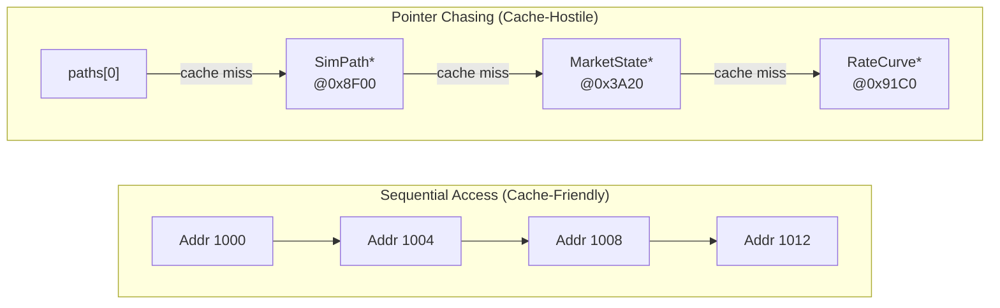

## The Fix: Flatten Everything

Restructure the data for sequential access. Replace object graphs with parallel arrays indexed by path and trade:

```cpp
struct FlatMarketData {
    // Each array has length num_scenarios
    HpcVector<double> rate_1y;     // 1-year interest rate
    HpcVector<double> rate_5y;     // 5-year interest rate
    HpcVector<double> rate_10y;    // 10-year interest rate
    HpcVector<double> vol_atm;     // At-the-money volatility
    HpcVector<double> fx_eurusd;   // EUR/USD exchange rate
    // ... one array per market data point
    
    size_t num_scenarios;
    
    explicit FlatMarketData(size_t n) 
        : rate_1y(n), rate_5y(n), rate_10y(n), 
          vol_atm(n), fx_eurusd(n), num_scenarios(n) {}
};

struct FlatTradeData {
    // Static trade attributes (same for all scenarios)
    HpcVector<double> notional;
    HpcVector<double> strike;
    HpcVector<int> trade_type;  // Enum for trade category
    HpcVector<double> maturity;
    
    size_t num_trades;
};

struct FlatResults {
    // Results array: num_scenarios × num_trades
    HpcVector<double> pv;  // Present value for each (scenario, trade) pair
    
    size_t num_scenarios;
    size_t num_trades;
    
    double& at(size_t scenario, size_t trade) {
        return pv[scenario * num_trades + trade];
    }
};
```

Now a "path" isn't an object—it's an index. Pricing path 5000 means reading `market.rate_1y[5000]`, `market.rate_5y[5000]`, etc.

The computation loop becomes:

```cpp
void price_all(const FlatMarketData& market, 
               const FlatTradeData& trades,
               FlatResults& results) 
{
    const size_t num_scenarios = market.num_scenarios;
    const size_t num_trades = trades.num_trades;
    
    #pragma omp parallel for collapse(2)
    for (size_t s = 0; s < num_scenarios; ++s) {
        for (size_t t = 0; t < num_trades; ++t) {
            double pv = compute_pv(
                market.rate_1y[s], market.rate_5y[s], market.rate_10y[s],
                trades.notional[t], trades.strike[t], trades.maturity[t],
                trades.trade_type[t]
            );
            results.at(s, t) = pv;
        }
    }
}
```

No pointers. No reference counting. No virtual dispatch. Just array indexing.

The memory access pattern is now predictable:

```
Scenario 0: market.rate_1y[0], market.rate_5y[0], market.rate_10y[0], ...
Scenario 1: market.rate_1y[1], market.rate_5y[1], market.rate_10y[1], ...
Scenario 2: market.rate_1y[2], market.rate_5y[2], market.rate_10y[2], ...
```

The prefetcher sees sequential access through each array and fetches ahead. Cache lines are fully utilized. The CPU pipeline stays full.

## But What About Trade Types?

The original design used polymorphism: `Trade` was a base class with `EquityOption`, `InterestRateSwap`, `CreditDefaultSwap` subclasses. Each had its own `price()` virtual method.

The flat design uses a type tag:

```cpp
double compute_pv(double rate_1y, double rate_5y, double rate_10y,
                  double notional, double strike, double maturity,
                  int trade_type) 
{
    switch (trade_type) {
        case EQUITY_OPTION:
            return price_equity_option(notional, strike, maturity, ...);
        case INTEREST_RATE_SWAP:
            return price_irs(notional, maturity, rate_1y, rate_5y, ...);
        case CREDIT_DEFAULT_SWAP:
            return price_cds(notional, maturity, ...);
        default:
            return 0.0;
    }
}
```

This looks like a step backward—replacing polymorphism with a switch statement. But the performance characteristics are completely different:

- **Virtual dispatch**: Load vtable pointer (cache miss?), load function pointer (cache miss?), indirect branch (mispredict?).
- **Switch statement**: Single direct branch, easily predicted if trade types are clustered.

For Monte Carlo, trades are usually sorted by type (all equity options together, all swaps together). The switch branch predictor quickly learns the pattern.

If needed, you can separate the loops by type:

```cpp
// Process equity options
for (size_t s = 0; s < num_scenarios; ++s) {
    for (size_t t = equity_start; t < equity_end; ++t) {
        results.at(s, t) = price_equity_option(...);
    }
}

// Process swaps
for (size_t s = 0; s < num_scenarios; ++s) {
    for (size_t t = swap_start; t < swap_end; ++t) {
        results.at(s, t) = price_irs(...);
    }
}
```

Each loop is a tight inner loop with completely predictable control flow.

## Adding Safety: CheckedArithmetic

Monte Carlo aggregates millions of values. The final step sums profits/losses across scenarios:

```cpp
double total_loss = 0.0;
for (size_t s = 0; s < num_scenarios; ++s) {
    double scenario_pv = 0.0;
    for (size_t t = 0; t < num_trades; ++t) {
        scenario_pv += results.at(s, t);
    }
    total_loss += std::max(0.0, base_pv - scenario_pv);
}
double expected_shortfall = total_loss / num_scenarios;
```

If any pricing produces infinity or NaN—from a bug, from extreme market data, from numerical instability—it propagates silently. The final `expected_shortfall` might be NaN, or infinity, or a wildly wrong finite value.

Use `CheckedArithmetic` for the accumulation:

```cpp
double total_loss = 0.0;
for (size_t s = 0; s < num_scenarios; ++s) {
    double scenario_pv = 0.0;
    for (size_t t = 0; t < num_trades; ++t) {
        scenario_pv = checked_add_fp<InfTolerant>(scenario_pv, results.at(s, t));
    }
    
    if (!std::isfinite(scenario_pv)) {
        log_warning("Non-finite PV in scenario {}: {}", s, scenario_pv);
        continue;  // Skip this scenario or handle appropriately
    }
    
    total_loss = checked_add_fp<InfTolerant>(total_loss, 
                                             std::max(0.0, base_pv - scenario_pv));
}
```

Now a single bad scenario is caught and logged rather than corrupting the aggregate.

In production, this caught three bugs in the first month:

1. A trade with maturity in the past produced NaN from a negative-time calculation
2. An FX rate of zero (bad market data) caused division by zero
3. An extremely large notional overflowed an intermediate calculation

All three would have produced silently wrong risk numbers without detection.

## Results

Performance after flattening:

```
Before: 847 seconds for 100K scenarios, 500K trades
After:  158 seconds for the same workload
```

**5.4× speedup** from data structure changes alone, with no algorithmic improvements.

Profile after optimization:

```
Overhead  Command  Symbol
  67.24%  risk     compute_pv
  12.47%  risk     _mm256_fmadd_pd
   8.73%  risk     exp
```

Now 67% of time is in actual computation. Memory overhead dropped from 80% to under 25%. The program does what it's supposed to do: compute prices.

## The Cost: Flexibility

The flat design is faster but less flexible. Adding a new trade type requires:

1. Adding a new enum value
2. Adding a case to the switch statement
3. Possibly adding new data arrays if the trade needs additional attributes

The original design just required implementing a new `Trade` subclass.

For a production risk system that runs the same trade types repeatedly, this tradeoff is worthwhile. For a research system exploring novel derivatives, it might not be.

The lesson isn't "always flatten"—it's "understand what flexibility costs and decide consciously."


**FAT-P Components Used:**
- `HpcVector<double>` — Flat, aligned storage for market data and results
- `checked_add_fp<InfTolerant>` — Safe accumulation that catches NaN from bad inputs
- SoA layout pattern — Eliminates pointer chasing, enables prefetching

## Transferable Lessons

**Pointer-heavy designs have hidden costs.** Reference counting, virtual dispatch, and cache misses add overhead that doesn't appear in algorithmic complexity analysis.

**Data-oriented design enables hardware efficiency.** When you structure data for how it's accessed rather than how it's conceptualized, the hardware can help you.

**Hot loops deserve scrutiny.** Code that runs millions of times amplifies small inefficiencies. A 1-microsecond overhead × 10⁸ iterations = 100 seconds.

**Safety checks can pay for themselves.** The overhead of `CheckedArithmetic` is far less than the cost of debugging silent data corruption.

---

# **CHAPTER 15 — Case Study: K-Means Clustering**

## The Domain

**Clustering** is the task of grouping similar items together. Given a set of data points, find natural groupings where points within a group are more similar to each other than to points in other groups. Clustering appears everywhere: customer segmentation in marketing, document categorization in search, gene expression analysis in biology, image compression in graphics.

**K-means** is the most widely used clustering algorithm. It's simple, fast, and often good enough. The algorithm takes two inputs: a set of N data points in D dimensions, and a target number of clusters K. It produces K cluster centers (centroids) and an assignment of each point to its nearest centroid.

The algorithm is **greedy** and **iterative**:

1. **Initialize**: Choose K starting centroids (randomly, or using a smarter method like k-means++)
2. **Assign**: For each point, find the nearest centroid and assign the point to that cluster
3. **Update**: Recompute each centroid as the mean of all points assigned to it
4. **Repeat**: Go to step 2 until assignments stop changing (or a maximum iteration count)

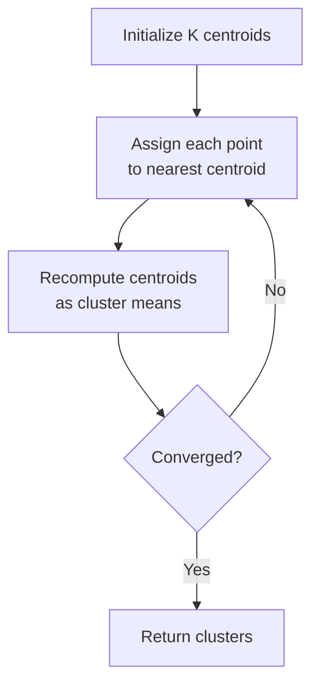

The computational cost is dominated by the **assignment step**. For each of N points, compute the distance to each of K centroids, then find the minimum. That's N × K distance calculations per iteration, and each distance calculation in D dimensions requires D multiplications, D additions, and a square root.

For a typical workload—1 million points, 100 dimensions, 1000 clusters, 50 iterations—that's 5 × 10¹² floating-point operations. This is exactly the kind of workload where FAT-P shines.

## The Initial Implementation

A data science team clusters customer behavior data. Each customer is represented as a 128-dimensional feature vector (purchase history, browsing patterns, demographics). They have 10 million customers and want 500 segments.

```cpp
struct Point {
    std::vector<double> coords;
};

std::vector<Point> points(10'000'000);
std::vector<Point> centroids(500);
std::vector<int> assignments(10'000'000);

double distance(const Point& a, const Point& b) {
    double sum = 0.0;
    for (size_t d = 0; d < a.coords.size(); ++d) {
        double diff = a.coords[d] - b.coords[d];
        sum += diff * diff;
    }
    return std::sqrt(sum);
}

void assign_clusters() {
    for (size_t i = 0; i < points.size(); ++i) {
        double min_dist = std::numeric_limits<double>::max();
        int best_cluster = 0;
        
        for (int k = 0; k < centroids.size(); ++k) {
            double d = distance(points[i], centroids[k]);
            if (d < min_dist) {
                min_dist = d;
                best_cluster = k;
            }
        }
        
        assignments[i] = best_cluster;
    }
}

void update_centroids() {
    std::vector<Point> sums(centroids.size());
    std::vector<int> counts(centroids.size(), 0);
    
    for (size_t i = 0; i < points.size(); ++i) {
        int k = assignments[i];
        counts[k]++;
        for (size_t d = 0; d < points[i].coords.size(); ++d) {
            sums[k].coords[d] += points[i].coords[d];
        }
    }
    
    for (size_t k = 0; k < centroids.size(); ++k) {
        if (counts[k] > 0) {
            for (size_t d = 0; d < centroids[k].coords.size(); ++d) {
                centroids[k].coords[d] = sums[k].coords[d] / counts[k];
            }
        }
    }
}
```

One iteration takes 45 seconds. With 50 iterations to convergence, that's 37 minutes per clustering run. The team needs to run this hourly for real-time segmentation. They're out of time budget by 36 minutes.

## Observing the Symptoms

```bash
$ perf stat ./kmeans

     IPC: 0.42
     L1-dcache-load-misses: 31% of all L1 loads
     LLC-load-misses: 14% of LLC loads
     branch-misses: 0.8%
```

IPC of 0.42 is very low. Branch misses are fine. The problem is memory access.

Looking at the data structure:

```cpp
struct Point {
    std::vector<double> coords;  // Heap-allocated, pointer to data elsewhere
};
std::vector<Point> points;  // Another indirection layer
```

Accessing `points[i].coords[d]` requires:
1. Load `points.data()` (pointer to Point array)
2. Compute address of `points[i]`
3. Load `points[i].coords.data()` (pointer to coordinate array)
4. Compute address of `points[i].coords[d]`
5. Load the actual coordinate value

That's two pointer indirections per coordinate access. For 128 dimensions × 500 clusters × 10 million points, that's over 10¹² pointer dereferences.

## The Fix: Structure of Arrays

Store coordinates as parallel arrays, one per dimension:

```cpp
struct PointCloud {
    // coords[d][i] = dimension d of point i
    std::vector<HpcVector<double>> coords;
    size_t num_points;
    size_t num_dims;
    
    PointCloud(size_t n, size_t d) : num_points(n), num_dims(d) {
        coords.resize(d);
        for (size_t dim = 0; dim < d; ++dim) {
            coords[dim].resize(n);
        }
    }
    
    double& at(size_t point, size_t dim) {
        return coords[dim][point];
    }
};
```

Now `coords[d]` is a contiguous array of all values for dimension d. Accessing consecutive points in the same dimension is sequential memory access.

But wait—the inner loop iterates over dimensions for a fixed point pair, not over points for a fixed dimension. Let's reconsider the access pattern:

```cpp
// Original distance calculation
for (size_t d = 0; d < D; ++d) {
    diff = point[d] - centroid[d];  // Access dimension d of both
}
```

This accesses `coords[0][i]`, `coords[1][i]`, `coords[2][i]`, ...—strided access across dimension arrays.

For k-means, the better layout is **point-major**: all dimensions of one point contiguous, then all dimensions of the next point:

```cpp
struct PointCloud {
    HpcVector<double> data;  // Flat: [p0_d0, p0_d1, ..., p0_dD, p1_d0, p1_d1, ...]
    size_t num_points;
    size_t num_dims;
    
    PointCloud(size_t n, size_t d) : num_points(n), num_dims(d), data(n * d) {}
    
    double* point(size_t i) { return &data[i * num_dims]; }
    const double* point(size_t i) const { return &data[i * num_dims]; }
};
```

Now `point(i)` returns a pointer to D contiguous doubles. The distance loop accesses sequential memory.

## SIMD-Friendly Distance Calculation

The distance calculation is a perfect SIMD target: independent operations on consecutive elements.

```cpp
double distance_squared(const double* a, const double* b, size_t D) {
    using Vec = SimdVector<double>;
    constexpr size_t W = Vec::lanes;
    
    Vec sum(0.0);
    
    size_t d = 0;
    for (; d + W <= D; d += W) {
        Vec va = Vec::load_aligned(&a[d]);
        Vec vb = Vec::load_aligned(&b[d]);
        Vec diff = va - vb;
        sum = fma(diff, diff, sum);  // sum += diff * diff
    }
    
    double result = sum.horizontal_sum();
    
    // Scalar tail
    for (; d < D; ++d) {
        double diff = a[d] - b[d];
        result += diff * diff;
    }
    
    return result;
}
```

On AVX2, this processes 4 doubles per iteration instead of 1. The `fma` instruction fuses the multiply and add, reducing latency.

Note: We compute squared distance and skip the square root. For finding the minimum distance, squared distance gives the same ordering. We only need the actual distance if reporting it to users.

## Parallel Assignment with NUMA

The assignment loop is embarrassingly parallel—each point's assignment is independent:

```cpp
void assign_clusters(const PointCloud& points, 
                     const PointCloud& centroids,
                     std::vector<int>& assignments) {
    const size_t N = points.num_points;
    const size_t K = centroids.num_points;
    const size_t D = points.num_dims;
    
    #pragma omp parallel for schedule(static)
    for (size_t i = 0; i < N; ++i) {
        const double* p = points.point(i);
        double min_dist = std::numeric_limits<double>::max();
        int best = 0;
        
        for (size_t k = 0; k < K; ++k) {
            double d2 = distance_squared(p, centroids.point(k), D);
            if (d2 < min_dist) {
                min_dist = d2;
                best = static_cast<int>(k);
            }
        }
        
        assignments[i] = best;
    }
}
```

The `schedule(static)` ensures each thread gets a contiguous chunk of points. Combined with parallel initialization of `points`, each thread accesses mostly local memory.

## Safe Centroid Update

The centroid update accumulates coordinates across millions of points:

```cpp
void update_centroids(const PointCloud& points,
                      const std::vector<int>& assignments,
                      PointCloud& centroids) {
    const size_t N = points.num_points;
    const size_t K = centroids.num_points;
    const size_t D = points.num_dims;
    
    // Per-thread partial sums to avoid contention
    const int num_threads = omp_get_max_threads();
    std::vector<HpcVector<double>> partial_sums(num_threads);
    std::vector<std::vector<int>> partial_counts(num_threads);
    
    for (int t = 0; t < num_threads; ++t) {
        partial_sums[t].resize(K * D, 0.0);
        partial_counts[t].resize(K, 0);
    }
    
    // Parallel accumulation into thread-local storage
    #pragma omp parallel
    {
        int tid = omp_get_thread_num();
        double* my_sums = partial_sums[tid].data();
        int* my_counts = partial_counts[tid].data();
        
        #pragma omp for schedule(static)
        for (size_t i = 0; i < N; ++i) {
            int k = assignments[i];
            my_counts[k]++;
            
            const double* p = points.point(i);
            double* s = &my_sums[k * D];
            
            for (size_t d = 0; d < D; ++d) {
                s[d] = checked_add_fp<Saturating>(s[d], p[d]);
            }
        }
    }
    
    // Merge partial results
    for (size_t k = 0; k < K; ++k) {
        double* c = centroids.point(k);
        
        // Sum counts across threads
        int total_count = 0;
        for (int t = 0; t < num_threads; ++t) {
            total_count += partial_counts[t][k];
        }
        
        if (total_count == 0) continue;  // Empty cluster
        
        // Sum coordinates across threads and divide
        for (size_t d = 0; d < D; ++d) {
            double sum = 0.0;
            for (int t = 0; t < num_threads; ++t) {
                sum = checked_add_fp<Saturating>(sum, partial_sums[t][k * D + d]);
            }
            c[d] = sum / total_count;
        }
    }
}
```

The `checked_add_fp<Saturating>` catches overflow in the accumulation. With 10 million points and 128 dimensions, the sums can grow large. Saturating arithmetic prevents infinity from corrupting the centroids.

Thread-local partial sums eliminate false sharing and lock contention. Each thread accumulates into its own arrays, then a single-threaded merge combines results. The merge is O(K × D × threads), negligible compared to O(N × D) accumulation.

## Results

Performance progression:

| Optimization | Time per Iteration | Speedup |
|--------------|-------------------|---------|
| Original (vector-of-vectors) | 45 s | 1× |
| Flat point-major layout | 12 s | 3.8× |
| + SIMD distance | 4.2 s | 10.7× |
| + Parallel assignment | 0.31 s | 145× |
| + NUMA-aware allocation | 0.19 s | 237× |

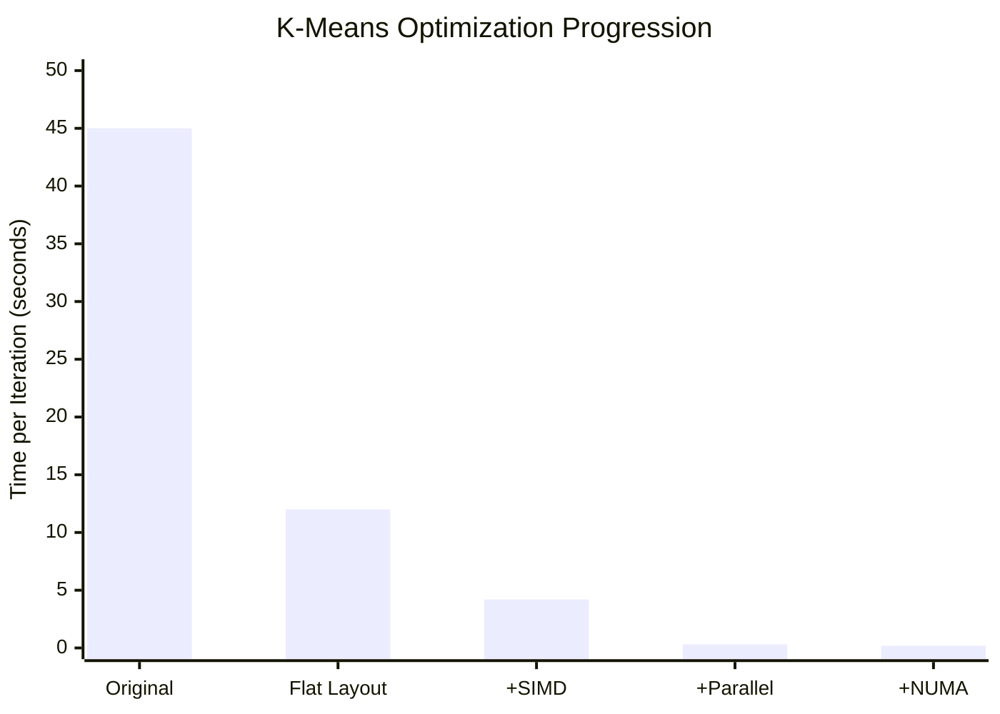

Total runtime dropped from 37 minutes to under 10 seconds. The team now runs clustering every 5 minutes instead of hourly.

## Detecting Numerical Issues

During testing, the team discovered that some customer feature vectors contained NaN values (from missing data that wasn't properly handled upstream). The original implementation silently propagated these:

```cpp
// NaN in point → NaN distances → wrong cluster assignment
// NaN in centroid accumulation → NaN centroids → all distances become NaN
```

With `CheckedArithmetic`, the issue surfaced immediately:

```cpp
// In distance calculation
for (; d < D; ++d) {
    double diff = a[d] - b[d];
    result = checked_add_fp<ThrowOnError>(result, diff * diff);
    // Throws if diff*diff is NaN, immediately identifying the bad point
}
```

The exception included the point index, leading directly to the upstream data pipeline bug.


**FAT-P Components Used:**
- `HpcVector<double>` — Point-major flat layout with alignment and NUMA placement
- `SimdVector<double>` — Vectorized squared-distance calculation with FMA
- `checked_add_fp<Saturating>` — Safe accumulation in centroid updates (10M points × 128 dims)
- `checked_add_fp<ThrowOnError>` — NaN detection that identified upstream data bugs
- Thread-local partial sums pattern — Eliminates false sharing in parallel accumulation

## Transferable Lessons

**Choose layout based on access patterns.** K-means accesses all dimensions of a point together, so point-major layout wins. Other algorithms (e.g., finding correlation between dimensions) might prefer dimension-major.

**Accumulation needs protection.** Summing millions of values is an overflow risk. `CheckedArithmetic` catches problems before they corrupt results.

**Thread-local accumulation avoids contention.** When many threads update shared accumulators, use per-thread partial sums and merge afterward.

**The greedy structure enables parallelism.** Each point's assignment is independent; each partial sum is independent. Greedy algorithms often have embarrassingly parallel structure hiding inside.

---

# **CHAPTER 16 — Optimization Sequence**

Performance optimization is not a checklist to execute blindly. It's an iterative process of measurement, hypothesis, intervention, and verification. But within that process, certain patterns recur. Some optimizations enable others. Some are pointless until prerequisites are satisfied.

This chapter provides a sequence that works for most numerical code. It's not the only valid order, but it reflects hard-won experience about what to try first.

## Step 1: Establish Baselines

Before optimizing anything, measure current performance and establish what "better" means.

**Measure wall-clock time** for representative workloads:

```cpp
auto start = high_resolution_clock::now();
run_workload();
auto end = high_resolution_clock::now();
auto ms = duration_cast<milliseconds>(end - start).count();
```

**Measure hardware counters** to understand where time goes:

```bash
perf stat -e cycles,instructions,cache-misses,branch-misses ./program
```

**Record the baseline** so you can compare after changes. Optimization without measurement is guessing.

**Understand the theoretical limit.** If you're processing 1 GB of data, and memory bandwidth is 50 GB/s, the absolute minimum time is 20 ms. If your code takes 2 seconds, there's 100× headroom. If it takes 25 ms, you're within 25% of the limit—further optimization will be hard.

## Step 2: Fix Memory Layout

Memory layout problems are the most common cause of poor performance in numerical code, and they're invisible at the source level. A program that looks like it's doing pure computation might actually be waiting for memory 90% of the time.

**Replace `std::vector` with `HpcVector`** for data that will be accessed in performance-critical loops:

```cpp
// Before
std::vector<double> data(n);

// After
HpcVector<double> data(n);
```

This costs nothing if the allocation pattern stays the same. You get alignment and NUMA awareness for free.

**Consider Array of Structures vs Structure of Arrays.** If different operations access different fields, SoA usually wins:

```cpp
// AoS: natural but cache-unfriendly for partial access
struct Particle { float x, y, z, vx, vy, vz, mass; };
std::vector<Particle> particles;

// SoA: unnatural but cache-friendly
struct Particles {
    HpcVector<float> x, y, z, vx, vy, vz, mass;
};
```

**Look for pointer chasing.** If your hot loop follows pointers—linked lists, trees of `shared_ptr`, virtual dispatch through deep hierarchies—consider flattening to arrays with indices.

After layout fixes, re-measure. Improvements of 2-5× are common. If you're still far from the theoretical limit, continue.

## Step 3: Fix NUMA Placement

On single-socket machines, skip this step. On multi-socket machines, NUMA problems cause 30-50% performance loss that no other optimization can recover.

**Check current placement:**

```bash
numactl --hardware   # Show topology
numastat -p $(pgrep program)   # Show per-node memory
perf stat -e node-loads,node-load-misses ./program   # Show remote accesses
```

**Initialize in parallel** with the same thread partitioning used for processing:

```cpp
#pragma omp parallel for
for (size_t i = 0; i < n; ++i) {
    data[i] = initial_value(i);
}

// Later, same partitioning:
#pragma omp parallel for
for (size_t i = 0; i < n; ++i) {
    data[i] = process(data[i]);
}
```

**Consider thread pinning** if NUMA matters:

```cpp
#pragma omp parallel
{
    cpu_set_t cpuset;
    CPU_ZERO(&cpuset);
    CPU_SET(omp_get_thread_num(), &cpuset);
    pthread_setaffinity_np(pthread_self(), sizeof(cpuset), &cpuset);
}
```

Re-measure. Remote access counts should drop to near zero. If runtime doesn't improve despite fixing NUMA, the problem is elsewhere.

## Step 4: Add SIMD

With good memory layout, SIMD can provide up to W× speedup where W is the vector width (4-16 depending on architecture). Without good memory layout, SIMD might not help at all because you're still memory-bound.

**Identify vectorizable loops.** The loop body should be the same for every iteration, with no data-dependent branches:

```cpp
// Vectorizable
for (size_t i = 0; i < n; ++i) {
    output[i] = input[i] * scale + offset;
}

// Not vectorizable (data-dependent branch)
for (size_t i = 0; i < n; ++i) {
    if (input[i] > threshold)
        output[i] = expensive_function(input[i]);
    else
        output[i] = cheap_function(input[i]);
}
```

**Use SimdVector for explicit vectorization:**

```cpp
using Vec = SimdVector<float>;
constexpr size_t W = Vec::lanes;

size_t i = 0;
for (; i + W <= n; i += W) {
    Vec v = Vec::load_aligned(&input[i]);
    v = fma(v, Vec(scale), Vec(offset));
    v.store_aligned(&output[i]);
}

// Scalar tail
for (; i < n; ++i) {
    output[i] = input[i] * scale + offset;
}
```

**Don't forget the scalar tail.** This is the most common SIMD bug.

Re-measure. If speedup is much less than W×, you're probably still memory-bound, or there's a bottleneck outside the vectorized loop.

## Step 5: Add Threading

With good layout, correct NUMA placement, and SIMD inner loops, threading scales well. Without those prerequisites, adding threads often makes things worse.

**Use OpenMP for data parallelism:**

```cpp
#pragma omp parallel for
for (size_t i = 0; i < n; ++i) {
    process(data[i]);
}
```

**Match thread count to hardware.** More threads than physical cores rarely helps for compute-bound work. Use `omp_set_num_threads()` or the `OMP_NUM_THREADS` environment variable.

**Watch for false sharing.** If threads write to nearby addresses, performance tanks. Use `CacheAligned` for shared, frequently-written data.

**Measure scaling:**

```bash
for t in 1 2 4 8 16 32; do
    OMP_NUM_THREADS=$t ./program
done
```

Ideal scaling is linear. Sublinear scaling suggests contention, NUMA problems, or memory bandwidth limits.

## Step 6: Add Safety Checks

After optimizing, add overflow and error detection to critical accumulations:

```cpp
double sum = 0.0;
for (size_t i = 0; i < n; ++i) {
    sum = checked_add_fp<InfTolerant>(sum, values[i]);
}

if (!std::isfinite(sum)) {
    handle_overflow();
}
```

Use `static_math` for compile-time constants:

```cpp
constexpr size_t buffer_size = static_math::mul<size_t, WIDTH, HEIGHT>();
```

The overhead of checked arithmetic is typically 5-20% for the checked operations. Applied only to accumulations and boundary conversions, the overall impact is usually under 5%.

## When to Stop

Optimization has diminishing returns. Stop when:

**You've reached the hardware limit.** If you're within 2× of memory bandwidth limits or theoretical FLOP limits, further improvement requires algorithmic changes or better hardware.

**The code is fast enough.** If a function takes 10 ms and runs once per second, optimizing it to 1 ms saves 9 ms/s—irrelevant.

**Further changes hurt maintainability.** A 10% speedup that triples code complexity is usually a bad trade.

**You're chasing noise.** If three runs give times of 98 ms, 103 ms, and 97 ms, you can't reliably detect a 2% improvement.

## The Expected Progression

On large multi-core systems processing array data, following this sequence typically yields:

| Step | Typical Improvement | Cumulative |
|------|---------------------|------------|
| Layout | 2-5× | 2-5× |
| NUMA | 1.3-1.5× | 3-8× |
| SIMD | 2-4× (limited by memory) | 6-32× |
| Threading | ~core count | 50-200× |

Total improvements of 50-100× are achievable, turning minute-long computations into sub-second ones.

---

# **CHAPTER 17 — Tiling for Cache**

When working sets exceed cache size, **tiling** (also called **blocking**) restructures computation to improve temporal locality. Instead of processing all of array A, then all of array B, you process a tile of A and B together, then move to the next tile.

## The Problem: Matrix Multiplication

Consider the classic O(N³) matrix multiply:

```cpp
// C[i][j] = sum over k of A[i][k] * B[k][j]
for (int i = 0; i < N; ++i) {
    for (int j = 0; j < N; ++j) {
        double sum = 0.0;
        for (int k = 0; k < N; ++k) {
            sum += A[i][k] * B[k][j];
        }
        C[i][j] = sum;
    }
}
```

Analyze the access pattern for a 4096×4096 matrix of doubles (128 MB per matrix):

- **A[i][k]**: For fixed i, k iterates 0 to N-1. This is sequential access along a row. Good.
- **B[k][j]**: For fixed j, k iterates 0 to N-1. This accesses B[0][j], B[1][j], B[2][j], ...—a column of B. If B is stored row-major, consecutive accesses are N elements apart (32 KB). Every access misses the cache.
- **C[i][j]**: Written once per (i,j) pair. Accessed sequentially within a row. Mostly fine.

The killer is B. Each element of B is loaded from memory, used once, and evicted before it's needed again. The innermost loop causes N² cache misses for B alone—one per element per row of C. For N=4096, that's 16 billion cache misses.

## The Solution: Process in Tiles

Divide the matrices into T×T tiles. Process each tile completely before moving to the next:

```cpp
constexpr int T = 64;  // Tile size

for (int ii = 0; ii < N; ii += T) {
    for (int jj = 0; jj < N; jj += T) {
        for (int kk = 0; kk < N; kk += T) {
            // Process tile (ii:ii+T, jj:jj+T) using k range (kk:kk+T)
            for (int i = ii; i < std::min(ii + T, N); ++i) {
                for (int j = jj; j < std::min(jj + T, N); ++j) {
                    double sum = C[i][j];  // Accumulate into existing value
                    for (int k = kk; k < std::min(kk + T, N); ++k) {
                        sum += A[i][k] * B[k][j];
                    }
                    C[i][j] = sum;
                }
            }
        }
    }
}
```

Now the innermost three loops work on T×T submatrices. For T=64, each tile is 64×64×8 = 32 KB. Three tiles (from A, B, C) fit comfortably in a 256 KB L2 cache.

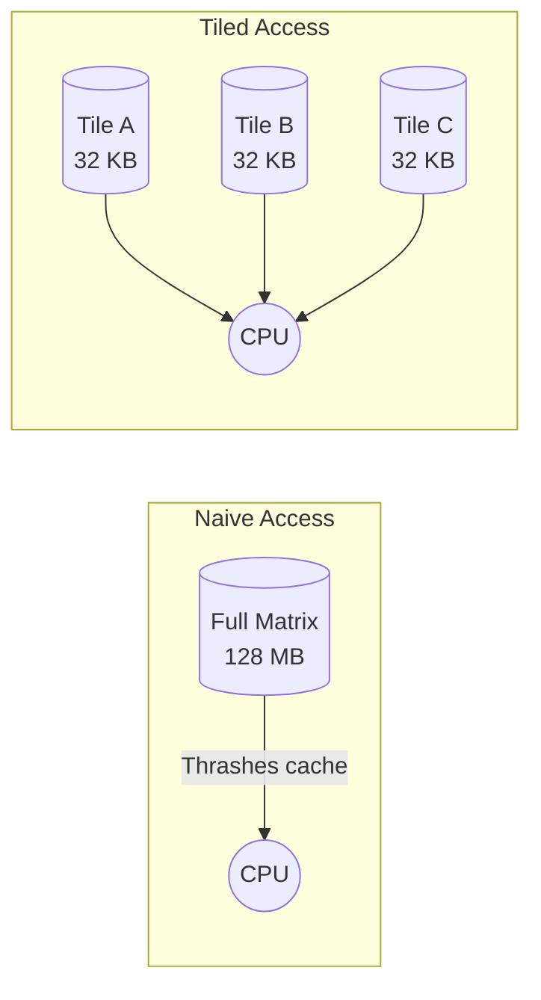

The access pattern within a tile:

- A tile of A: 64×64 elements, accessed row by row. Sequential within rows, and the whole tile stays in cache.
- A tile of B: 64×64 elements. Even though we're accessing a column, we only access 64 consecutive columns, and they stay in cache across all 64 uses.
- A tile of C: 64×64 elements, accumulated in place.

Each element of each tile is loaded once per tile computation and reused T times before eviction. Cache misses drop by a factor of T.

## Choosing the Tile Size

The tile size must satisfy:

**All working tiles fit in cache:**
```
3 × T² × sizeof(element) < L2_cache_size
```

For doubles (8 bytes) and 256 KB L2:
```
3 × T² × 8 < 256 × 1024
T² < 10,922
T < 104
```

So T=64 or T=96 would work. T=128 would exceed L2.

**The tile size should be a multiple of the SIMD width** for efficient vectorization of the inner loop. For AVX2 with doubles, that's 4. For floats, it's 8.

**The tile size should divide evenly into common matrix dimensions** to minimize edge-case handling. Powers of 2 (32, 64, 128) are conventional.

**Empirical tuning is essential.** Cache sizes vary across processors. The formula gives a starting point; profiling gives the answer.

```cpp
// Parameterized for tuning
template<int T>
void matmul_tiled(const double* A, const double* B, double* C, int N) {
    // ... tiled implementation
}

// Try different tile sizes
void benchmark_tile_sizes() {
    for (int t : {16, 32, 48, 64, 80, 96, 112, 128}) {
        switch (t) {
            case 32: time("T=32", matmul_tiled<32>); break;
            case 64: time("T=64", matmul_tiled<64>); break;
            // ...
        }
    }
}
```

## Multi-Level Tiling

Modern CPUs have multiple cache levels with different sizes and latencies:

| Level | Size | Latency |
|-------|------|---------|
| L1 | 32-64 KB | ~1 ns |
| L2 | 256 KB - 1 MB | ~4 ns |
| L3 | 8-64 MB | ~12 ns |

Multi-level tiling uses different tile sizes for each level:

```cpp
constexpr int T3 = 256;   // L3 tile
constexpr int T2 = 64;    // L2 tile
constexpr int T1 = 16;    // L1 tile (also SIMD-friendly)

for (int ii = 0; ii < N; ii += T3) {
    for (int jj = 0; jj < N; jj += T3) {
        for (int kk = 0; kk < N; kk += T3) {
            // L3 tile
            for (int i2 = ii; i2 < std::min(ii + T3, N); i2 += T2) {
                for (int j2 = jj; j2 < std::min(jj + T3, N); j2 += T2) {
                    for (int k2 = kk; k2 < std::min(kk + T3, N); k2 += T2) {
                        // L2 tile
                        for (int i1 = i2; i1 < std::min(i2 + T2, N); i1 += T1) {
                            // L1 tile and vector inner loop
                            // ...
                        }
                    }
                }
            }
        }
    }
}
```

The complexity is significant. In practice, one level of tiling (for L2) captures most of the benefit. Multi-level tiling is for extreme optimization.

## Beyond Matrix Multiplication

Tiling applies to any computation with reusable data that exceeds cache size:

**Stencil computations** (image filters, PDE solvers): Process rectangular tiles of the grid.

**Convolutions**: Tile input and output regions.

**Database joins**: Block nested loop joins process chunks that fit in memory.

The principle is universal: restructure loops so that data loaded into cache is fully utilized before eviction.

---

# **CHAPTER 18 — Debugging Performance**

When performance is poor, the first step is identifying **which class of problem** you have. Different problems have different solutions, and applying the wrong fix wastes effort.

## Hardware Performance Counters

Modern CPUs contain counters that track micro-architectural events: cache misses, branch mispredictions, pipeline stalls. Reading these counters tells you what the CPU is actually doing.

On Linux, `perf stat` provides easy access:

```bash
$ perf stat -e cycles,instructions,L1-dcache-load-misses,LLC-load-misses,branch-misses ./program

 Performance counter stats for './program':

     12,847,382,847      cycles
     31,284,718,284      instructions              #    2.44  insn per cycle
        847,182,847      L1-dcache-load-misses     #    8.47% of all L1 loads
         28,471,828      LLC-load-misses           #   12.3% of all LLC loads
         14,718,284      branch-misses             #    0.47% of all branches

       3.847 seconds time elapsed
```

## Interpreting the Numbers

**Instructions per Cycle (IPC)** is the master metric. It tells you how efficiently the CPU is working:

| IPC | Interpretation |
|-----|----------------|
| < 0.5 | Severely bottlenecked, likely memory-bound |
| 0.5 - 1.0 | Significant stalls, probably memory or branch problems |
| 1.0 - 2.0 | Moderate efficiency, room for improvement |
| 2.0 - 4.0 | Good efficiency for most code |
| > 4.0 | Excellent, near theoretical peak |

If IPC is low, the next step is identifying what's causing stalls.

**L1 cache miss rate** above 5% suggests poor temporal or spatial locality. The working set exceeds L1, or access patterns are scattered.

**LLC (Last-Level Cache) miss rate** above 10% suggests the working set exceeds L3, or there's streaming access without reuse. This is often acceptable for throughput-oriented code.

**Branch miss rate** above 2% suggests unpredictable control flow. Consider branchless alternatives or sorting data to improve prediction.

## The Diagnostic Flowchart

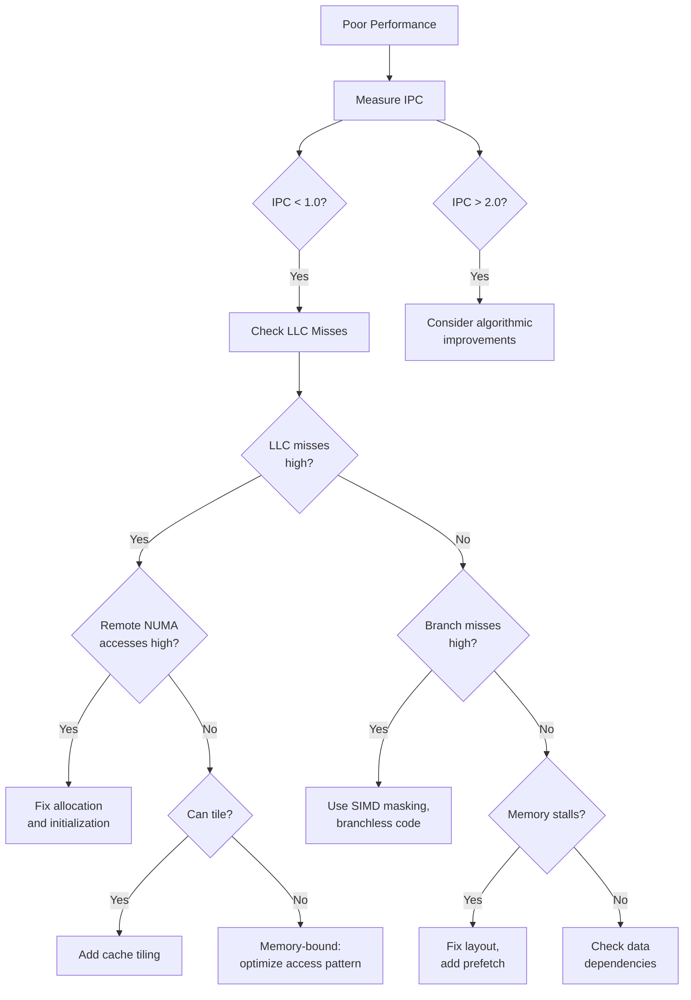

## A Real Debugging Session

**Symptom:** Matrix-vector multiplication runs at 10% of expected FLOP rate.

**Step 1: Get baseline metrics**

```bash
$ perf stat ./matvec
     IPC: 0.31
     L1 misses: 24% of loads
     LLC misses: 18% of LLC refs
     Branch misses: 0.2%
```

IPC of 0.31 is terrible. Branch misses are negligible. High LLC misses suggest memory bandwidth problems.

**Step 2: Check NUMA**

```bash
$ numastat -p $(pgrep matvec)
                  Node 0     Node 1
Numa_Hit          28471828   4718284
Numa_Miss         4718284    28471828
```

Huge NUMA imbalance. Node 1 is mostly accessing Node 0's memory.

**Step 3: Fix NUMA with parallel initialization**

```cpp
// Before: serial initialization
for (size_t i = 0; i < n; ++i) matrix[i] = init(i);

// After: parallel initialization
#pragma omp parallel for
for (size_t i = 0; i < n; ++i) matrix[i] = init(i);
```

Re-measure:

```bash
$ perf stat ./matvec_numa_fixed
     IPC: 0.58
     LLC misses: 9% of LLC refs
```

IPC nearly doubled, but still low. LLC misses dropped but remain significant.

**Step 4: Consider memory bandwidth limits**

For a 10000×10000 matrix of doubles: 800 MB of data. Memory bandwidth is ~50 GB/s. Theoretical minimum time to stream through once: 16 ms.

Current time: 180 ms. We're at 10% of bandwidth limit.

The matrix is accessed column-by-column (matrix-vector multiply accesses each column). Row-major storage means column access is strided. Each element is on a different cache line.

**Step 5: Fix layout**

Change to column-major storage, or transpose the matrix so the multiplication accesses rows:

```cpp
// Column-major storage for better column access
HpcVector<double> matrix_colmajor(rows * cols);
// matrix_colmajor[j * rows + i] = matrix[i][j]
```

Re-measure:

```bash
$ perf stat ./matvec_colmajor
     IPC: 2.14
     Time: 24 ms
```

IPC jumped to 2.14. Time dropped from 180 ms to 24 ms—7.5× improvement. We're now at 67% of theoretical bandwidth limit, which is reasonable.

## Tools Reference

**Linux:**
- `perf stat`: Summary counters
- `perf record` / `perf report`: Sample-based profiling with call stacks
- `numactl`: Control NUMA placement
- `numastat`: NUMA statistics
- `likwid-perfctr`: Detailed hardware counters with roofline analysis

**Windows:**
- Intel VTune: Comprehensive profiling with hardware counters
- Windows Performance Analyzer: System-wide tracing
- Visual Studio Profiler: Integrated sampling and instrumentation

**Cross-platform:**
- PAPI: Portable hardware counter access
- Tracy: Frame profiler with good visualization
- Optick: Game-oriented profiler

## When Counters Aren't Enough

Hardware counters identify the class of problem but not always the specific location. Combine with:

**Sampling profilers** show which functions consume time:

```bash
$ perf record ./program
$ perf report
  23.4%  compute_forces
  18.7%  update_positions
```

**Instrumentation** measures specific code sections:

```cpp
auto start = high_resolution_clock::now();
compute_forces();
auto end = high_resolution_clock::now();
log("Forces: {} ms", duration_cast<milliseconds>(end - start).count());
```

**Micro-benchmarks** isolate specific operations:

```cpp
void benchmark_memory_pattern() {
    // Sequential access
    for (size_t i = 0; i < n; ++i) sum += data[i];
    
    // Strided access
    for (size_t i = 0; i < n; i += stride) sum += data[i];
    
    // Random access
    for (size_t i = 0; i < n; ++i) sum += data[indices[i]];
}
```

Comparing these patterns reveals memory system behavior specific to your hardware.

---

*Part III has shown the library in action. Part IV provides reference material for daily use.*
# **PART IV — FOUNDATIONS AND FUTURES**

The preceding parts taught you how to use the library. This part explains *why* the library exists—the hardware history that shaped its design, the silicon tricks that make it fast, and the intellectual landscape it inhabits. Understanding foundations makes you a better engineer; understanding futures helps you anticipate where to invest your learning.

---

# **APPENDIX A — The Cultural History of Performance Engineering**

## *A Narrative History: From the Cray-1 to the Modern Cloud*

Performance engineering is often taught as a collection of modern tricks, but it is actually a lineage—a set of architectural philosophies handed down through generations of hardware designers. The constraints we face today in C++ (latency, alignment, stream regularity) are not new; they are echoes of machines built fifty years ago. To master high-performance computing is to join a conversation that began in 1976.

---

## 1. The Cray Era (1976–1990): The Discovery of the Stream

In the mid-1970s, the computing world was stuck in a scalar paradigm. Computers fetched one instruction, executed it on one pair of numbers, stored the result, and then fetched the next instruction. This method was reliable, but it hit a physical ceiling: the speed of light. Signal propagation delays inside the CPU meant that clock speeds could only increase so much.

Seymour Cray, the architect behind the **Cray-1** (1976), realized that scientific problems were not composed of isolated events. Weather prediction, nuclear simulation, and fluid dynamics were composed of **streams**. A simulation might need to add two arrays of a million numbers each. In a scalar machine, this required a million fetch-decode-execute cycles.

Cray designed a machine with "vector registers" capable of holding 64 numbers at once. A single instruction could trigger a cascade of operations that kept the arithmetic units busy for 64 cycles without further instruction fetches. The machine also introduced **chaining**—the output of one vector operation could flow directly into the input of another, like an assembly line where products never stop moving.

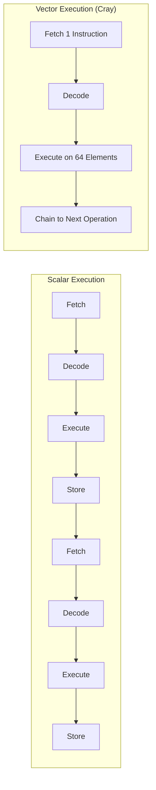

This created a new contract between programmer and machine: if you could arrange your data into long, contiguous, predictable streams, the machine would reward you with performance orders of magnitude higher than scalar execution.

The Cray-1 ran at 80 MHz—slower than a modern smartwatch. Yet it achieved 250 megaflops on vector code, a figure that scalar microprocessors wouldn't match for another fifteen years. The lesson was profound: **architecture beats clock speed**.

**The Legacy for Modern Code:**

When you use `SimdVector` in modern C++, you are essentially programming a miniature Cray-1 inside your CPU core. You are promising the hardware a stream of aligned, uniform data so it can open the floodgates of execution. The Cray taught us that **regularity equals speed**—a principle that remains true fifty years later.

---

## 2. The Memory Wall (1990–2000): The Great Divergence

Through the 1980s, processor speed and memory speed improved at similar rates. Programmers could mostly ignore memory latency because it was proportional to compute time. Then, around 1990, the curves diverged.

Processor clock speeds began doubling every 18 months, following Moore's Law. Memory speeds improved at perhaps 7% per year. By 2000, a CPU could execute hundreds of instructions in the time it took to fetch a single cache line from main memory. This gap—**the memory wall**—transformed computing.

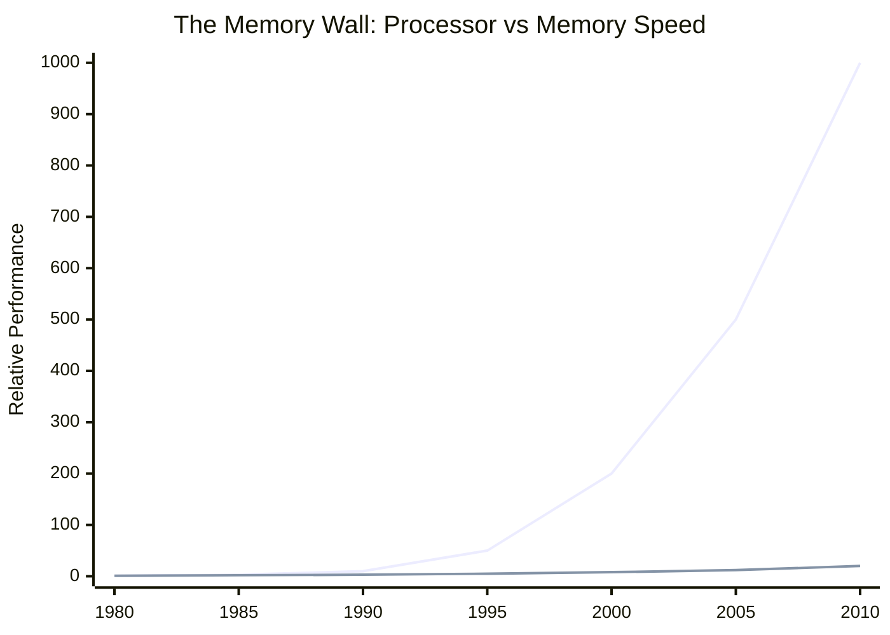

The industry's response was **caching**—small, fast memory banks close to the processor that held recently-accessed data. But caches introduced new complexity. Data had to be fetched in fixed-size blocks called **cache lines** (typically 64 bytes). If your access pattern was scattered, you'd fetch 64 bytes to use 4 bytes, wasting 94% of memory bandwidth.

This era established the principle that **memory access patterns matter more than instruction counts**. An algorithm with O(n log n) complexity but scattered memory access could lose to an O(n²) algorithm with sequential access. Big-O notation, so central to computer science education, became misleading for real-world performance.

**The Legacy for Modern Code:**

The memory wall is why Part I of this guide spends so much time on data layout. `HpcVector` and `AlignedVector` exist because cache lines are 64 bytes. Structure of Arrays (SoA) exists because cache lines should contain only data you need. The memory wall made **data structure design** as important as **algorithm design**.

---

## 3. The SGI Era (1990–2000): The Discovery of Geography

As the 1990s progressed, a single CPU—even a fast one with caches—was no longer enough. The industry moved toward multi-processor systems. The naive approach was **SMP (Symmetric Multi-Processing)**, where all CPUs connected to a single memory bus. This worked for dual-socket systems, but as core counts rose, that single bus became a traffic jam. The CPUs spent their time fighting for access to memory, leaving the arithmetic units idle.

Silicon Graphics (SGI) pioneered a solution with the **Origin 2000** series (1996). They split the memory up physically. They gave every processor its own local bank of RAM but connected them all via a high-speed fabric called NUMALink. A processor *could* access any memory in the machine, but accessing its local bank was fast (tens of nanoseconds), while accessing a neighbor's bank was slow (hundreds of nanoseconds).

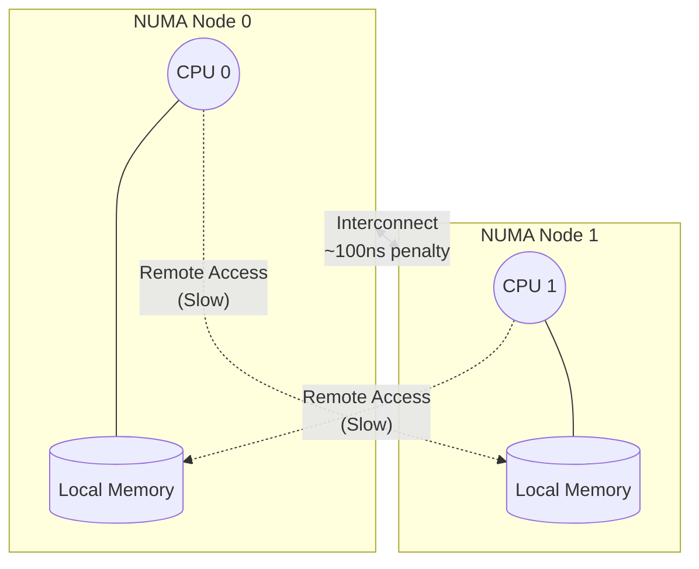

This was the birth of **NUMA (Non-Uniform Memory Access)** as a mainstream concern. It introduced the concept of "memory geography." For the first time, *where* you put data was just as important as *what* you calculated. Programmers had to learn that memory addresses were not just abstract numbers; they were physical locations. A pointer pointing to "remote" memory was a performance liability.

The Origin 2000 also introduced **first-touch placement**: memory pages were not assigned to a NUMA node at allocation time, but when first written. This policy made sense (put data where it's used) but created subtle bugs. A single-threaded initialization loop would place all data on one node, and subsequent multi-threaded processing would suffer remote access penalties.

**The Hardware Timeline:**

NUMA became mainstream as commodity hardware adopted multi-socket designs:

- **2003**: AMD Opteron introduced NUMA to x86 via HyperTransport, bringing SGI's architecture philosophy to commodity servers
- **2007**: Intel followed with Nehalem and QuickPath Interconnect (QPI)
- **2017**: Intel Skylake introduced UltraPath Interconnect (UPI), the current generation

Today, any dual-socket server—and many single-socket systems with multiple memory controllers—exhibits NUMA characteristics.

**The Legacy for Modern Code:**

SGI taught us that **distance exists inside the computer**. `NumaAllocator` and `ThreadLocalNumaPool` are the modern software expressions of this hardware reality. They allow you to place data "geographically" close to the thread processing it. The first-touch trap documented in Part I is the same trap that caught SGI programmers in 1996.

---

## 4. The x86 SIMD Evolution (1997–Present): The Long March to Wide Vectors

While supercomputers had vector instructions from the beginning, commodity x86 processors were stubbornly scalar until Intel introduced **MMX** in 1997. MMX provided 64-bit registers that could hold eight 8-bit values or four 16-bit values. It was designed for multimedia—video codecs, audio processing—but it planted a seed.

The evolution accelerated:

| Year | Extension | Register Width | Floats per Register |
|------|-----------|----------------|---------------------|
| 1999 | SSE | 128 bits | 4 × float |
| 2001 | SSE2 | 128 bits | 2 × double |
| 2011 | AVX | 256 bits | 8 × float |
| 2013 | AVX2 | 256 bits | 8 × float + integer ops |
| 2017 | AVX-512 | 512 bits | 16 × float |

Each generation doubled the width, but also doubled the complexity. AVX introduced a painful transition: code had to be recompiled, and mixing AVX with older SSE code caused severe performance penalties (the infamous "AVX-SSE transition stalls"). AVX-512 fragmented into dozens of sub-extensions, with different processors supporting different subsets.

**The Pre-Desktop History:**

SIMD predates the x86 extensions by decades:

- **1958**: MIT's TX-2 introduced the first "SIMD within a register" operations
- **1972**: ILLIAC IV brought SIMD to supercomputing
- **1977**: Cray-1 popularized vector processing
- **1994**: HP's MAX extension for PA-RISC was one of the first desktop SIMD implementations
- **1995**: Sun's VIS for SPARC followed

The lesson from this evolution: **SIMD width is not a constant**. Portable SIMD code requires abstraction.

**The Three Fundamental Flaws:**

SIMD instruction set architectures suffer from three persistent problems:

1. **Variable vector lengths**: Code written for 4-wide vectors leaves performance on the table when AVX arrives. Code written for 8-wide vectors fails on older processors.

2. **Architecture-specific intrinsics**: SSE intrinsics don't compile on ARM. NEON intrinsics don't compile on x86. Portable code requires abstraction or multiple implementations.

3. **Lack of safety**: Integer SIMD has no overflow detection. You get a vector of 8 results; any one might have overflowed, and you won't know unless you explicitly check.


**The Legacy for Modern Code:**

`SimdVector` exists to absorb this complexity. It queries the CPU at compile time and selects the widest available instruction set. Your code says "process these values in parallel" and the library figures out whether that means 4, 8, or 16 at a time. The width variability that plagued two decades of x86 SIMD programming becomes an implementation detail.

---

## 5. The CUDA Era (2006–Present): The Industrialization of Parallelism

In the mid-2000s, NVIDIA realized that graphics cards (GPUs) were essentially massive vector processors waiting to be unlocked. They released **CUDA** (2006), which exposed the GPU not as a graphics toy, but as a compute engine with thousands of cores.

The GPU model forced millions of developers to confront the realities of hardware. Concepts like **warp divergence** became common knowledge. A "warp" is a group of 32 threads that must execute the same instruction at the same time. If half the threads want to take an `if` branch and the other half want to take an `else` branch, the hardware must serialize: run the `if` for half the warp (other threads masked off), then run the `else` for the other half. Divergence destroys throughput.

```mermaid
flowchart LR
    subgraph Uniform["Uniform Control Flow"]
        W1["All 32 threads<br/>take same path"] --> Fast["Full throughput"]
    end
    
    subgraph Divergent["Divergent Control Flow"]
        W2["16 threads take IF<br/>16 threads take ELSE"] --> Serial["Serialize:<br/>IF then ELSE"] --> Slow["50% throughput"]
    end
```

Furthermore, GPUs punished scattered memory access severely. If threads in a warp tried to read random memory addresses, the memory controller would stall. If they read contiguous addresses ("coalesced access"), the controller could serve the entire warp in a single transaction.

CUDA also taught the importance of **occupancy**—keeping enough work in flight to hide memory latency. A GPU with 100 warps ready to run could switch to another warp during a memory stall, keeping the arithmetic units busy. A GPU with only 10 warps would stall visibly.

**The Legacy for Modern Code:**

GPUs proved that massive parallelism requires massive discipline. The concept of a warp is logically identical to a wide SIMD register executing in lockstep. `SimdVector::select()` is the CPU equivalent of GPU masking—it avoids branching by computing both paths and blending results. The GPU lesson that "divergence kills throughput" applies equally to CPU SIMD code.

---

## 6. The ARM Resurgence (2020–Present): The End of x86 Hegemony

For three decades, high-performance computing meant x86. Intel and AMD dominated servers, workstations, and desktops. ARM processors were relegated to phones and embedded systems—efficient but slow.

Then, in 2020, two events shattered this assumption. Apple released the **M1** processor, an ARM chip that outperformed Intel's laptop processors while using a fraction of the power. Amazon expanded **Graviton**, their ARM-based server processors, offering better price-performance than x86 instances for many workloads.

ARM's SIMD architecture (**NEON**, and its successor **SVE/SVE2**) differs from x86's AVX. NEON registers are 128 bits—narrower than AVX2's 256 bits—but ARM compensates with more registers and different instruction scheduling. SVE introduces **vector length agnosticism**: code compiles once and runs on any SVE implementation, whether 128-bit, 256-bit, or 2048-bit.

The **Fugaku** supercomputer (2020), built on ARM A64FX processors with 512-bit SVE, demonstrated that ARM could compete at the highest end of HPC—it held the #1 position on the TOP500 list for two years, proving that ARM's approach to vectorization could scale to exascale computing.

This fragmentation means that performance-portable code can no longer assume x86. The future is heterogeneous: x86 servers, ARM servers, Apple desktops, and specialized accelerators, all running the same source code.

**The Legacy for Modern Code:**

The ARM resurgence is why `SimdVector` abstracts over architecture. The same source code compiles to AVX2 on x86 and NEON on ARM. As ARM servers become more common in cloud computing, code that assumed x86 intrinsics faces a rewrite. Code that used portable abstractions runs everywhere.

---

## The Recurring Themes

Fifty years of hardware evolution reveal patterns that recur across every era:

**Regularity beats flexibility.** The Cray rewarded streams; GPUs reward uniform control flow; ARM rewards predictable access. Hardware is fastest when it knows what's coming next.

**Latency hiding requires parallelism.** Cray chaining, CPU pipelining, GPU occupancy, and out-of-order execution all exist to keep functional units busy during memory stalls.

**Geography matters.** NUMA nodes, cache hierarchies, and GPU memory tiers all create performance cliffs based on *where* data lives, not just *what* it contains.

**Abstraction is survival.** MMX code is obsolete; SSE code is legacy; AVX code is current but fragile. Only code written against abstractions survives architectural transitions.

These themes are the foundation of FAT-P's design philosophy.

---

# **APPENDIX B — The Hardware Hacks: A Technical Deep Dive**

## *How FAT-P Achieves Safety Without Stalling the Pipeline*

A common myth in high-performance computing is that "safety is slow." The belief is that checking for errors—like integer overflow—requires conditional branches, which confuse the CPU's branch predictor and stall the instruction pipeline.

FAT-P rejects this compromise. It uses architecture-specific techniques to validate arithmetic *inside the SIMD pipeline*, using vector logic operations that are often free or near-free in terms of latency. This appendix explains how.

---

## 1. Why Branches Are Expensive

Modern CPUs are deeply pipelined. An Intel Skylake core has a pipeline roughly 15 stages deep. This means 15 instructions are "in flight" simultaneously—fetched, decoded, and partially executed.

When the CPU encounters a conditional branch (`if (overflow) { handle_error(); }`), it must predict which way the branch will go *before* it knows the condition's value. If the prediction is wrong, the CPU must flush the pipeline and restart—a penalty of 15-20 cycles.

For overflow checks in arithmetic, the branch is almost always "not taken" (overflow is rare). Branch predictors learn this pattern and predict "not taken" with 99%+ accuracy. But that remaining 1%—plus the overhead of the branch instruction itself—adds up in tight loops.

**The goal:** detect overflow without any branches.

---

## 2. The NEON "Differential Saturation" Trick (ARM)

### The Problem

Standard integer addition wraps around silently. Adding 1 to `INT_MAX` produces `INT_MIN`. Detecting this wrap typically requires comparing the result against the inputs:

```cpp
// Naive overflow check (has branches)
int result = a + b;
if ((b > 0 && result < a) || (b < 0 && result > a)) {
    // Overflow occurred
}
```

This code has two branches and multiple comparisons. In a SIMD context, it's even worse—you'd need to check each lane individually.

### The Hardware Feature

ARM NEON processors include **saturating arithmetic** instructions, designed for DSP (Digital Signal Processing). Audio and video codecs need math that "clips" rather than wraps—if a pixel value exceeds 255, it should become 255, not wrap to 0.

- **Standard Add (`vaddq_s32`):** Wraps on overflow. `INT_MAX + 1 = INT_MIN`.
- **Saturating Add (`vqaddq_s32`):** Clamps to limit. `INT_MAX + 1 = INT_MAX`.

### The Trick

Compute both results in parallel. If they differ, overflow occurred:

```cpp
// Load vectors of 4 × int32
int32x4_t a = vld1q_s32(a_ptr);
int32x4_t b = vld1q_s32(b_ptr);

// 1. Standard wrapping addition (the result we want)
int32x4_t wrap = vaddq_s32(a, b);

// 2. Saturating addition (the overflow detector)
int32x4_t sat = vqaddq_s32(a, b);

// 3. Compare: if wrap != sat, overflow occurred in that lane
uint32x4_t overflow_mask = vmvnq_u32(vceqq_s32(wrap, sat));

// overflow_mask has 0xFFFFFFFF in lanes that overflowed, 0 elsewhere
```

### Why This Is Fast

Modern ARM cores are superscalar—they can execute multiple independent instructions simultaneously. The `vaddq` and `vqaddq` instructions have no data dependency between them (both read `a` and `b`, neither reads the other's output). They execute in parallel on different execution ports.

The comparison (`vceqq`) and inversion (`vmvnq`) are single-cycle operations. The total overhead for overflow detection is approximately **zero additional cycles** in throughput-limited code, because the saturation path executes alongside the normal path.

```mermaid
flowchart LR
    subgraph Parallel["Parallel Execution"]
        A[Load a, b] --> Add[vaddq: wrap]
        A --> Sat[vqaddq: sat]
        Add --> Cmp[vceqq: compare]
        Sat --> Cmp
        Cmp --> Mask[overflow_mask]
    end
```

---

## 3. The x86 "Sign Bit" Trick (Intel/AMD)

### The Problem

Intel's SSE and AVX instruction sets do not have saturating arithmetic for 32-bit integers that behaves like NEON's. The `_mm_adds_epi16` instruction saturates 16-bit integers, but there's no `_mm_adds_epi32`. We need a different approach.

### The Mathematical Insight

In **two's complement** signed arithmetic, overflow has a specific signature. Consider adding two numbers:

- **Positive + Positive:** Result should be positive. If the result is negative, overflow occurred.
- **Negative + Negative:** Result should be negative. If the result is positive, underflow occurred.
- **Positive + Negative:** Can never overflow—the result's magnitude is always less than the larger operand.

The pattern: **overflow occurs if and only if both inputs have the same sign, and the result has a different sign.**

This can be detected using only the sign bit (the most significant bit) of each value.

### The Bit Logic

Let `A`, `B`, and `R` be the sign bits of the two inputs and the result:

| A | B | R | Overflow? |
|---|---|---|-----------|
| 0 | 0 | 0 | No (pos + pos = pos) |
| 0 | 0 | 1 | **Yes** (pos + pos = neg) |
| 0 | 1 | * | No (mixed signs) |
| 1 | 0 | * | No (mixed signs) |
| 1 | 1 | 0 | **Yes** (neg + neg = pos) |
| 1 | 1 | 1 | No (neg + neg = neg) |

The boolean formula: `Overflow = (A XOR R) AND (B XOR R)`

- `A XOR R`: True if A and R have different signs
- `B XOR R`: True if B and R have different signs
- If both are true, the result's sign differs from *both* inputs—impossible without overflow.

### The Implementation

```cpp
// Load vectors of 8 × int32 (AVX2)
__m256i a = _mm256_loadu_si256((__m256i*)a_ptr);
__m256i b = _mm256_loadu_si256((__m256i*)b_ptr);

// Compute the sum
__m256i sum = _mm256_add_epi32(a, b);

// Compute (a ^ sum) & (b ^ sum)
__m256i a_xor_sum = _mm256_xor_si256(a, sum);
__m256i b_xor_sum = _mm256_xor_si256(b, sum);
__m256i overflow_raw = _mm256_and_si256(a_xor_sum, b_xor_sum);

// The sign bit of overflow_raw is set iff overflow occurred
// Arithmetic right shift to broadcast sign bit to all bits
__m256i overflow_mask = _mm256_srai_epi32(overflow_raw, 31);
```

The final `overflow_mask` contains `0xFFFFFFFF` in lanes that overflowed and `0x00000000` in lanes that didn't.

```mermaid
flowchart TD
    A[Input A] --> XOR1["A XOR R"]
    R[Result R] --> XOR1
    B[Input B] --> XOR2["B XOR R"]
    R --> XOR2
    XOR1 --> AND["AND"]
    XOR2 --> AND
    AND --> Shift["Arithmetic Right Shift 31"]
    Shift --> Mask["Overflow Mask"]
```

### Why This Is Fast

- `XOR` and `AND` are the fastest instructions on the CPU (often 0.33 cycles throughput on modern microarchitectures)
- The shift is a single-cycle operation
- No branches, no comparisons, no memory access
- The entire sequence adds roughly 1-2 cycles of latency to the addition

---

## 4. The "Wide Multiply" Dance (AVX2)

### The Pigeonhole Problem

Multiplication is fundamentally different from addition. When you multiply two 32-bit integers, the result can be up to 64 bits:

```
2,000,000,000 × 2 = 4,000,000,000 (fits in 32 bits, unsigned)
2,000,000,000 × 3 = 6,000,000,000 (exceeds 32 bits!)
```

An AVX2 register holds 256 bits—either eight 32-bit values or four 64-bit values. If you multiply eight 32-bit inputs and need 64-bit outputs, you have twice as much output data as input data. It doesn't fit.

### The Solution: Split, Widen, Check, Narrow

FAT-P performs multiplication in stages:

```cpp
// Input: 8 × int32
__m256i a = _mm256_loadu_si256((__m256i*)a_ptr);
__m256i b = _mm256_loadu_si256((__m256i*)b_ptr);

// Step 1: Split into even and odd lanes
// Even: lanes 0, 2, 4, 6
// Odd: lanes 1, 3, 5, 7

// _mm256_mul_epi32 multiplies lanes 0, 2, 4, 6 and produces 64-bit results
__m256i prod_even = _mm256_mul_epi32(a, b);

// Shuffle to move odd lanes into even positions, then multiply
__m256i a_odd = _mm256_srli_epi64(a, 32);  // Shift odd lanes down
__m256i b_odd = _mm256_srli_epi64(b, 32);
__m256i prod_odd = _mm256_mul_epi32(a_odd, b_odd);

// Step 2: Check for overflow
// For signed: high 32 bits should be sign extension of low 32 bits
// For unsigned: high 32 bits should be zero

// Extract high 32 bits of each 64-bit product
__m256i high_even = _mm256_srli_epi64(prod_even, 32);
__m256i high_odd = _mm256_srli_epi64(prod_odd, 32);

// For unsigned: overflow if high bits are non-zero
// For signed: overflow if high bits aren't all-zeros or all-ones matching sign

// Step 3: Narrow results back to 32-bit (keeping low halves)
// Step 4: Interleave even and odd results back together
```

### The Interleave Challenge

The most intricate part is reassembling the results. After multiplication:

- `prod_even` contains: `[a0×b0 (64-bit), a2×b2, a4×b4, a6×b6]`
- `prod_odd` contains: `[a1×b1 (64-bit), a3×b3, a5×b5, a7×b7]`

We need to produce: `[a0×b0 (32-bit), a1×b1, a2×b2, a3×b3, a4×b4, a5×b5, a6×b6, a7×b7]`

This requires a carefully crafted shuffle operation that extracts the low 32 bits of each 64-bit product and interleaves them:

```cpp
// Shuffle mask to extract low 32 bits from each 64-bit lane and pack
const __m256i shuffle = _mm256_setr_epi32(0, 2, 4, 6, 1, 3, 5, 7);
__m256i result = _mm256_permutevar8x32_epi32(
    _mm256_blend_epi32(prod_even, _mm256_slli_epi64(prod_odd, 32), 0xAA),
    shuffle
);
```

### Why This Is Still Fast

Despite the complexity, this approach is faster than scalar multiplication with overflow checking because:

1. **Throughput over latency:** The shuffle and blend operations have high latency (~3 cycles) but excellent throughput. Multiple independent multiplications can be in flight simultaneously.

2. **No domain crossing:** Keeping data in SIMD registers avoids the expensive transfer between vector and general-purpose registers.

3. **Vectorized overflow check:** We check all 8 products for overflow in parallel, not sequentially.

The total cost is roughly 3× a simple vector multiply—but a simple vector multiply can't detect overflow at all.

---

## 5. Floating-Point: The NaN Sentinel Trick

### The Problem

Floating-point arithmetic has its own hazards: overflow to infinity, underflow to zero, and the dreaded **NaN** (Not a Number) that propagates through all subsequent calculations.

The standard approach to detecting these is `std::isfinite()`, which involves extracting the exponent bits and comparing them. In scalar code, this is cheap. In SIMD code, it requires moving data between floating-point and integer domains.

### The IEEE 754 Insight

NaN has a special property: **NaN is not equal to itself.** This is mandated by the IEEE 754 standard:

```cpp
double x = std::nan("");
bool is_nan = (x != x);  // True!
```

This seems bizarre but enables a branchless check:

```cpp
// For a vector of doubles, check which lanes are NaN
__m256d values = _mm256_loadu_pd(ptr);
__m256d nan_mask = _mm256_cmp_pd(values, values, _CMP_UNORD_Q);
// nan_mask has all bits set in lanes where values is NaN
```

The `_CMP_UNORD_Q` comparison returns true if the comparison is "unordered"—which happens when either operand is NaN.

### Infinity Detection

Infinity can be detected by comparison against the infinity constant:

```cpp
const __m256d pos_inf = _mm256_set1_pd(HUGE_VAL);
const __m256d neg_inf = _mm256_set1_pd(-HUGE_VAL);

__m256d is_pos_inf = _mm256_cmp_pd(values, pos_inf, _CMP_EQ_OQ);
__m256d is_neg_inf = _mm256_cmp_pd(values, neg_inf, _CMP_EQ_OQ);
__m256d is_inf = _mm256_or_pd(is_pos_inf, is_neg_inf);
```

### The InfTolerant Policy

FAT-P's `InfTolerant` policy for floating-point uses these checks to allow infinity (useful in scientific computing where infinity represents "very large") while rejecting NaN (almost always indicates a bug):

```cpp
template<>
struct checked_add_fp<InfTolerant> {
    static double apply(double a, double b) {
        double result = a + b;
        // NaN check: result != result
        if (result != result) {
            throw arithmetic_error("NaN produced");
        }
        // Infinity is allowed
        return result;
    }
};
```

---

## 6. Compile-Time Safety: static_math

### The Problem

Some overflow risks are visible at compile time. If a constant expression computes a buffer size from compile-time parameters, overflow in that calculation should be a compile error, not a runtime surprise.

### The Solution

`static_math` uses `constexpr` evaluation with explicit overflow checks:

```cpp
namespace static_math {
    template<typename T, T A, T B>
    constexpr T mul() {
        static_assert(B == 0 || A <= std::numeric_limits<T>::max() / B,
                      "Compile-time overflow in multiplication");
        return A * B;
    }
}

// Usage:
constexpr size_t BUFFER_SIZE = static_math::mul<size_t, 1024, 1024>();  // OK
constexpr size_t TOO_BIG = static_math::mul<size_t, SIZE_MAX, 2>();     // Compile error!
```

### Why This Matters

A buffer overflow caused by integer overflow in size calculation is a security vulnerability. By catching these at compile time, `static_math` eliminates an entire class of bugs before the code ever runs.

---

## Seeing It Live

The techniques in this appendix aren't magic—they're logical consequences of how hardware works. To see them in action:

**Compiler Explorer (godbolt.org):** Paste the code snippets from this appendix into Compiler Explorer with `-O3 -mavx2` (for x86) or `-O3 -march=armv8-a+simd` (for ARM). Watch the compiler generate `vqadd` vs `vadd` on ARM, or the XOR/AND/shift sequence on x86. Seeing the assembly makes the tricks concrete.

**Quick experiments:** Modify the snippets. What happens if you remove the saturation path on ARM? The compiler still generates correct code, but now you have no overflow detection. The cost of safety becomes visible—or rather, its near-invisibility becomes visible.

Understanding these techniques transforms FAT-P from a black box into a teaching tool. You're not just using safe arithmetic; you're learning how safe arithmetic can be fast.


# **APPENDIX C — The Roofline Model**

## *A Visual Framework for Performance Expectations*

Before optimizing code, you need to know what "good" looks like. The **Roofline Model**, developed at Berkeley Lab, provides a visual answer: it plots what your code *could* achieve against what the hardware *allows*.

---

## The Two Ceilings

Every computation is limited by one of two factors:

1. **Compute bound:** The CPU can't do arithmetic fast enough. You're limited by FLOPS (floating-point operations per second).

2. **Memory bound:** The CPU can't fetch data fast enough. You're limited by memory bandwidth (bytes per second).

The Roofline Model plots both limits on a single graph:

```mermaid
xychart-beta
    title "Roofline Model"
    x-axis "Arithmetic Intensity (FLOPS/Byte)" [0.1, 0.5, 1, 2, 4, 8, 16, 32]
    y-axis "Performance (GFLOPS)" 0 --> 500
    line "Roofline" [6.25, 31.25, 62.5, 125, 250, 400, 400, 400]
    line "Your Code" [5, 25, 50, 90, 140, 180, 200, 210]
```

The **x-axis** is **arithmetic intensity**: how many floating-point operations you perform per byte of memory traffic. A matrix-vector multiply has low intensity (~0.25 FLOP/byte). A matrix-matrix multiply has high intensity (~N FLOP/byte for large N).

The **y-axis** is **performance**: achieved FLOPS.

The **roofline** is the hardware limit. It rises with a slope equal to memory bandwidth (memory-bound region), then flattens at peak FLOPS (compute-bound region).

---

## Interpreting the Graph

**If your code is below the sloped part:** You're memory-bound. Optimization strategies:
- Improve cache utilization (tiling)
- Better memory layout (SoA, alignment)
- Fix NUMA placement
- Reduce memory traffic (compression, redundant computation)

**If your code is below the flat part:** You're compute-bound. Optimization strategies:
- Add SIMD vectorization
- Improve instruction-level parallelism
- Use faster algorithms
- Add more cores (if scalable)

**If your code is on the roofline:** You've hit the hardware limit. Further improvement requires:
- Better hardware
- Algorithmic changes (reduce total work)
- Approximate methods

---

## Computing Arithmetic Intensity

For a given kernel, arithmetic intensity is:

```
Arithmetic Intensity = (Total FLOPS) / (Total Bytes Moved)
```

**Example: Vector addition**

```cpp
for (int i = 0; i < N; ++i) {
    c[i] = a[i] + b[i];
}
```

- FLOPS: N additions = N FLOPS
- Bytes: Read 2N floats, write N floats = 3N × 4 = 12N bytes
- Intensity: N / 12N = 0.083 FLOP/byte

This is extremely memory-bound. On a machine with 400 GFLOPS peak and 50 GB/s bandwidth, the ridge point is at 8 FLOP/byte. At 0.083 FLOP/byte, you're limited to 50 × 0.083 = 4.2 GFLOPS—1% of peak compute.

**Example: Matrix multiplication (blocked)**

```cpp
// C[i][j] += A[i][k] * B[k][j], blocked with tile size T
```

- FLOPS: 2N³ (N³ multiplies + N³ adds)
- Bytes (blocked): 3N²× 4 bytes (each matrix element loaded once per tile)
- Intensity: 2N³ / 12N² = N/6 FLOP/byte

For N=1000, intensity is ~167 FLOP/byte—deep in the compute-bound region. SIMD and threading help here; memory layout is less critical.

---

## Using Roofline in Practice

1. **Measure your code's actual FLOPS and memory traffic** using `perf stat` or similar tools.

2. **Plot your code on the roofline** to see which ceiling you're hitting.

3. **Choose optimizations that address your ceiling.** Don't add SIMD to memory-bound code; don't optimize memory layout for compute-bound code.

4. **Re-measure after each change** to verify you've moved closer to the roofline.

The Roofline Model prevents wasted effort. It answers "should I bother optimizing this?" before you invest days of work.

---

# **APPENDIX D — When Not to Optimize**

## *The Art of Knowing When to Stop*

Optimization is seductive. There's always another 10% to find, another hot spot to attack, another clever trick to try. But optimization has costs: code complexity, maintenance burden, opportunity cost. The best engineers know when to stop.

---

## The Rules of Optimization

**Rule 1: Don't optimize.**

Most code doesn't matter for performance. A function called once at startup could take a full second and no user would notice. Optimizing it wastes engineering time.

**Rule 2: Don't optimize yet.**

Even performance-critical code shouldn't be optimized until you've profiled. Intuition about hot spots is frequently wrong. Measure first.

**Rule 3: Know your target.**

Before optimizing, establish what "fast enough" means. Is it 60 FPS for a game? Under 100ms for a web request? 24 hours for a batch job? Without a target, optimization never ends.

---

## The Economics of Optimization

Consider a Monte Carlo simulation that takes 10 hours. You can optimize it to 8 hours with 1 week of work, or to 2 hours with 3 months of work.

| Scenario | Time Saved per Run | Runs per Year | Annual Savings | Engineering Cost |
|----------|-------------------|---------------|----------------|------------------|
| 10h → 8h | 2 hours | 250 | 500 hours | 40 hours |
| 10h → 2h | 8 hours | 250 | 2000 hours | 500 hours |

The first optimization pays back in one month. The second takes three months just to break even, and that's assuming no bugs, no maintenance, and no opportunity cost.

**The lesson:** Diminishing returns are real. The first 5× speedup is often cheap; the next 2× is expensive; the next 1.5× might not be worth it.

---

## Warning Signs You Should Stop

**1. You're in the noise floor.**

If runs vary by ±5%, you can't reliably measure a 3% improvement. You'll chase phantom gains, making changes that seem to help but are actually random variation.

**2. You're approaching hardware limits.**

The Roofline Model tells you the ceiling. If you're within 50% of peak, further improvement requires heroic effort or hardware upgrades.

**3. The code is getting worse.**

Clear, maintainable code has value. A 20% speedup that makes the code incomprehensible to future maintainers (including yourself in six months) might be a net loss.

**4. You're optimizing cold code.**

If profiling shows the hot spot is 95% of runtime, optimizing something that's 0.1% of runtime is pointless—even if you make it infinitely fast.

**5. The algorithm dominates.**

Sometimes the right fix is algorithmic, not mechanical. An O(n²) algorithm optimized to perfection will still lose to an O(n log n) algorithm written carelessly.

---

## The Pareto Principle

In most systems, 20% of the code accounts for 80% of the runtime. Corollary: 80% of the code accounts for 20% of the runtime.

Optimizing that 80% is almost never worthwhile. Focus ruthlessly on the 20%. If profiling shows a function at 0.5% of runtime, ignore it.

---

## Good Reasons to Stop

- **It's fast enough for the use case.** A daily batch job that takes 4 hours doesn't need to take 4 minutes.

- **The deadline is real.** Shipping a working product beats shipping a fast product late.

- **Someone else has done it.** If Intel MKL or Eigen already has an optimized implementation, use theirs.

- **The hardware will change.** A heroic AVX-512 implementation might be obsolete when the next architecture ships.

---

# **APPENDIX E — Design Philosophies in the Ecosystem**

## *How FAT-P Relates to Other Libraries*

FAT-P is not the only library addressing high-performance computing concerns. Understanding the landscape helps you choose the right tool and understand FAT-P's design tradeoffs.

---

## Expression Templates: Eigen, Blaze

**The Philosophy:** Delay evaluation until the entire expression is known, then generate optimized code.

```cpp
// Eigen: this doesn't compute immediately
auto expr = A * B + C * D;
// Only when assigned to a matrix does evaluation happen:
MatrixXd result = expr;  // Fused: no temporaries
```

**Advantages:**
- Eliminates temporary allocations
- Enables cross-expression optimization
- Clean mathematical syntax

**Tradeoffs:**
- Compile times can be very long (heavy template metaprogramming)
- Error messages are notoriously cryptic
- Debugging is harder (you're stepping through template instantiations)
- Performance can be surprising (depends on when/how expressions are evaluated)

**FAT-P's Position:** FAT-P uses **eager evaluation**—operations execute immediately. This trades some theoretical optimization potential for predictable performance and simpler debugging. When you call `SimdVector::operator+()`, you know exactly what code runs.

---

## SIMD Abstraction: Highway, xsimd, std::simd

**The Philosophy:** Provide a portable API that compiles to optimal SIMD instructions on any architecture.

```cpp
// Highway: same code compiles to SSE, AVX, NEON, etc.
HWY_ATTR void AddArrays(const float* a, const float* b, float* c, size_t n) {
    namespace hn = hwy::HWY_NAMESPACE;
    using D = hn::ScalableTag<float>;
    for (size_t i = 0; i < n; i += hn::Lanes(D())) {
        auto va = hn::Load(D(), a + i);
        auto vb = hn::Load(D(), b + i);
        hn::Store(hn::Add(va, vb), D(), c + i);
    }
}
```

**Advantages:**
- Excellent portability across architectures
- Access to the full SIMD instruction set
- Highway supports exotic architectures (RISC-V, WebAssembly SIMD)

**Tradeoffs:**
- Steeper learning curve
- More verbose than scalar code
- You still manage alignment, loop tails, etc.

**FAT-P's Position:** `SimdVector` is a **narrower abstraction**—it handles the common cases (aligned loads, horizontal sums, masking) with a simpler API. If you need exotic SIMD operations not covered by `SimdVector`, Highway is the escape hatch. FAT-P aims for the 80% use case; Highway aims for 100%.

---

## Safe Arithmetic: SafeInt, Boost.SafeNumerics

**The Philosophy:** Replace primitive integer types with checked types that detect overflow.

```cpp
// SafeInt: every operation is checked
SafeInt<int32_t> a = 2000000000;
SafeInt<int32_t> b = 2000000000;
SafeInt<int32_t> c = a + b;  // Throws on overflow
```

**Advantages:**
- Comprehensive safety—every operation is checked
- Drop-in replacement for integer types
- Well-tested, mature implementations

**Tradeoffs:**
- Scalar only—no SIMD acceleration
- Overhead on every operation, including safe ones
- Type compatibility issues (SafeInt<int> isn't int)

**FAT-P's Position:** FAT-P's `CheckedArithmetic` is designed for **SIMD-width overflow detection**. You apply it selectively to operations that need checking (accumulations, boundary conversions), not globally. This gives safety where it matters with minimal overhead.

---

## Threading Frameworks: TBB, OpenMP

**The Philosophy:** Provide high-level abstractions for parallel execution.

```cpp
// TBB: parallel_for with automatic load balancing
tbb::parallel_for(0, N, [&](int i) {
    process(data[i]);
});

// OpenMP: directive-based parallelism
#pragma omp parallel for
for (int i = 0; i < N; ++i) {
    process(data[i]);
}
```

**Advantages:**
- Automatic thread management
- Work stealing, load balancing
- Nested parallelism support

**FAT-P's Position:** FAT-P **delegates threading to OpenMP**. The library provides NUMA-aware allocators and aligned containers, but does not include its own thread pool. OpenMP is standard, well-supported, and familiar. Using FAT-P containers with OpenMP gives you NUMA awareness without learning a new threading API.

---

## Full Tensor Libraries: Eigen, XTensor, PyTorch C++

**The Philosophy:** Provide complete tensor algebra with broadcasting, slicing, and GPU support.

```cpp
// XTensor: NumPy-like syntax
xt::xarray<double> a = {{1, 2}, {3, 4}};
xt::xarray<double> b = xt::ones<double>({2, 2});
auto c = a + b;  // Broadcasting, expression templates
```

**Advantages:**
- Full tensor semantics (broadcasting, advanced indexing)
- GPU backends available
- Interoperability with Python/NumPy

**FAT-P's Position:** FAT-P's `Tensor` is **minimal**—it provides shape, strides, and basic operations without the full tensor algebra apparatus. If you're doing deep learning or complex tensor computations, use PyTorch, Eigen, or XTensor. FAT-P's `Tensor` exists for simple multi-dimensional arrays in HPC contexts where you want alignment and NUMA control without the weight of a full tensor framework.

---

## When to Look Elsewhere

| If you need... | Consider |
|----------------|----------|
| GPU computing | CUDA, SYCL, ROCm |
| Expression templates for matrix algebra | Eigen, Blaze |
| Portable SIMD across exotic architectures | Highway, xsimd |
| Full tensor semantics with broadcasting | XTensor, PyTorch C++ |
| Just threading with work stealing | TBB |
| Drop-in safe integer types | SafeInt, Boost.SafeNumerics |

FAT-P excels when you need **CPU-side HPC primitives with NUMA awareness, SIMD vectorization, and checked arithmetic**—a combination the other libraries don't provide as an integrated package.

---

# **APPENDIX F — Further Reading**

## *A Curated Learning Path*

Performance engineering draws from computer architecture, systems programming, numerical analysis, and practical experience. These resources represent the field's essential knowledge.

---

## Foundational Documents

**"What Every Programmer Should Know About Memory"** — Ulrich Drepper (2007)
The definitive treatment of memory hierarchies from the programmer's perspective. Covers cache behavior, NUMA, and memory bandwidth in detail. Available free from LWN.net. Dense but essential.

**"Computer Architecture: A Quantitative Approach"** — Hennessy & Patterson
The standard graduate textbook on computer architecture. Explains pipelining, caches, branch prediction, and SIMD from first principles. Worth owning as a reference.

**"Software Optimization Resources"** — Agner Fog
A collection of free manuals covering x86 microarchitecture, instruction timing, and optimization. The instruction tables are indispensable for understanding why some code is fast and other code isn't. Updated regularly.

---

## Vectorization

**"SIMD Programming Manual for x86"** — Intel
Intel's official documentation for SSE, AVX, and AVX-512. Exhaustive but not beginner-friendly. Use as reference, not tutorial.

**"Introduction to SIMD Programming"** — Various university courses
Search for course materials from Cornell, MIT, or Berkeley. These provide gentler introductions than Intel's manuals.

**"Highway Library Documentation"** — Google
Well-written documentation for Google's portable SIMD library. Even if you don't use Highway, the documentation explains SIMD concepts clearly.

---

## NUMA and Memory Systems

**"A NUMA Overview"** — Jonathan Corbet (LWN.net)
Accessible introduction to NUMA from the Linux kernel perspective. Explains first-touch policy, memory binding, and numactl.

**"Memory Barriers: A Hardware View for Software Hackers"** — Paul McKenney
Deep dive into memory ordering, essential for understanding concurrent data structures on modern hardware.

---

## Numerical Computing

**"What Every Computer Scientist Should Know About Floating-Point Arithmetic"** — David Goldberg
The canonical reference on floating-point representation, rounding, and error analysis. Required reading for anyone doing numerical work.

**"Understanding Integer Overflow in C/C++"** — Dietz et al. (2012)
Empirical study using the Integer Overflow Checker (IOC) to analyze overflow patterns in real-world code. Foundational research that influenced modern sanitizers and safe arithmetic libraries.

**"Numerical Recipes"** — Press et al.
Classic algorithms cookbook with implementations. The prose explanations of why algorithms work (and when they fail) are valuable even if you don't use their code.

---

## Performance Analysis

**"The Art of Profiling"** — Brendan Gregg
Blog posts and talks by the author of "Systems Performance." Covers perf, flame graphs, and methodology for performance investigation.

**"Performance Analysis Guide"** — Intel
Intel's guide to using VTune and interpreting hardware counters. Specific to Intel tools but concepts transfer to other profilers.

---

## Books Worth Owning

| Book | Author | Why |
|------|--------|-----|
| *Systems Performance* | Brendan Gregg | Comprehensive methodology for performance analysis |
| *Computer Architecture* | Hennessy & Patterson | The definitive architecture textbook |
| *The Art of Multiprocessor Programming* | Herlihy & Shavit | Concurrent data structures and algorithms |
| *Hacker's Delight* | Henry Warren | Bit manipulation tricks—the theory behind FAT-P's hardware hacks |
| *Is Parallel Programming Hard?* | Paul McKenney | Free book on parallel programming, memory models, and RCU |

---

## Conference Talks

**CppCon performance track** — Various speakers, YouTube
Annual C++ conference with many talks on optimization. Notable: Chandler Carruth's "Efficiency" talks, Matt Godbolt's "Compiler Explorer" talks.

**USENIX ATC / OSDI** — Various
Academic systems conferences. Papers often introduce techniques that become industry standard years later.

---

## Online Resources

**Compiler Explorer (godbolt.org)** — Matt Godbolt
Indispensable tool for seeing what assembly your C++ generates. Essential for understanding SIMD codegen.

**Quick Bench (quick-bench.com)**
Online C++ benchmarking. Useful for quick experiments with different implementations.

**uops.info**
Detailed instruction latency and throughput data for x86. More detailed than Agner Fog's tables for recent architectures.

---

*These resources represent years of learning compressed into accessible form. They are the inheritance of our field—study them well.*

---

# **APPENDIX G — Looking Forward**

## *Where the Hardware Is Going*

The patterns in this guide—memory hierarchy, NUMA topology, SIMD vectorization, arithmetic safety—are not historical accidents. They reflect fundamental physical constraints that will persist and intensify.

**C++26 and std::simd:** The upcoming C++ standard will include `std::simd`, providing portable SIMD at the language level. FAT-P's `SimdVector` will remain valuable for two reasons: first, it integrates with `CheckedArithmetic` for safe vectorized operations that `std::simd` alone doesn't provide; second, it works today on C++17 compilers, while `std::simd` requires C++26 adoption.

**Heterogeneous Computing:** The future is not CPU-only. GPUs, NPUs, TPUs, and custom accelerators are becoming standard components. FAT-P's CPU-side components—aligned containers, NUMA-aware allocators, safe arithmetic—remain the foundation that prepares data for accelerators and validates results when they return. The patterns transfer: GPU programming requires the same attention to memory layout, alignment, and numerical safety.

**Wider Vectors, More Cores:** ARM's SVE allows vectors up to 2048 bits; future x86 extensions will likely go wider still. Core counts continue to climb. The abstractions in this guide—`SimdVector` adapting to lane width, NUMA allocators handling topology—scale with hardware. Code written against these abstractions today will benefit from tomorrow's hardware without rewriting.

**The Enduring Lesson:** Hardware changes; physics doesn't. Light speed limits signal propagation. Capacitance limits memory bandwidth. Transistor density limits what fits on a die. These constraints created the patterns we've studied—caches, NUMA, SIMD, pipelining—and they will create tomorrow's patterns too.

The engineer who understands *why* the hardware works this way, not just *how* to use today's APIs, will adapt to whatever comes next.

---

*End of Guide*

