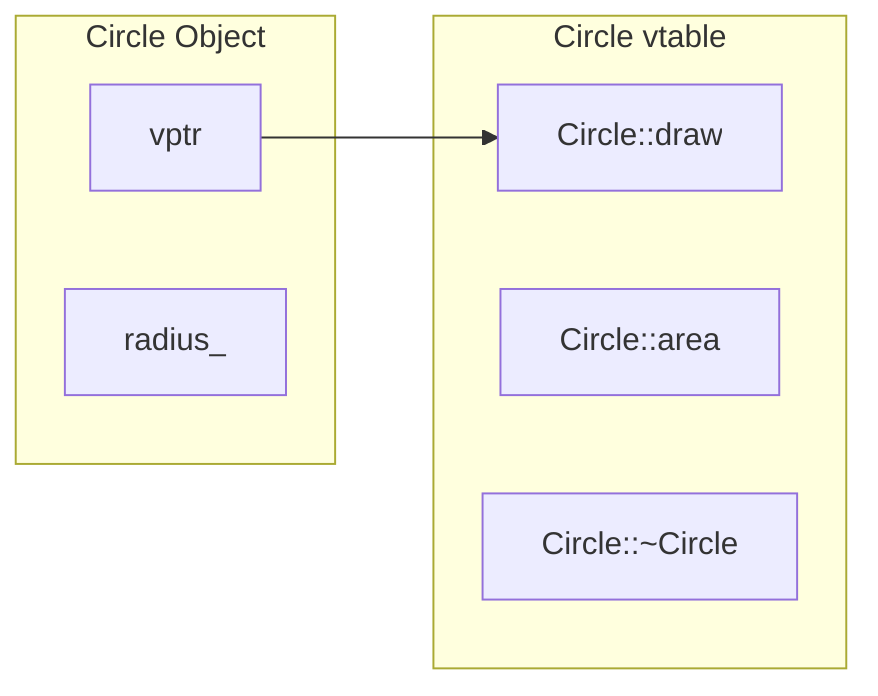

# **C++ Historical Context**

### *Why the Language Is the Way It Is*

*FAT-P Library — December 2025*

---

**Scope:** This document explains *why* C++ features exist—the problems they solved, the alternatives they replaced, and the historical context that shaped their design. It's not a tutorial. It's the story behind the syntax.

**Audience:** Engineers who know what classes and templates are but wonder why they work the way they do. Engineers who encounter legacy code and need to understand the historical layers. Engineers who want to understand C++ as an evolving response to real problems, not a fixed set of rules to memorize.

---

# **Why This Document Exists**

C++ is a 40-year-old language that carries its history with it. Features that seem arbitrary often made perfect sense when introduced. Limitations that frustrate modern programmers often prevented disasters in 1985.

Understanding the history helps you:
- Recognize why legacy code was written that way
- Understand the design constraints that shaped the language
- Make better decisions about which features to use
- See where the language is heading

This is not a defense of C++'s design. Some decisions were mistakes. But even mistakes are easier to work around when you understand why they were made.

---

# **Part I — From C to C++**

## The Problem C Solved (1972)

Before C, systems programming meant assembly language. Each CPU had its own instruction set. Porting an operating system meant rewriting it.

Dennis Ritchie created C at Bell Labs to write Unix. C was "portable assembly"—low-level enough to manipulate hardware, high-level enough to compile on different machines. The key insight: abstract the machine just enough that programs can move between systems, but not so much that you lose control of what the machine actually does.

C's philosophy:
- Trust the programmer
- Don't prevent the programmer from doing what needs to be done
- Keep the language small and simple
- Make it easy to write a compiler

This philosophy explains why C has no bounds checking, no garbage collection, no built-in string type. These features add overhead. C trusts you to manage your own memory.

## The Problems C Created

By the early 1980s, C programs were getting large. The Unix kernel was manageable. A million-line business application was not.

C's limitations:
- **No encapsulation.** Any code can modify any struct's fields. Changing a data structure requires finding every place that touches it.
- **No polymorphism.** To handle different types uniformly, you use `void*` and lose type checking.
- **No automatic resource management.** Every `malloc` needs a `free`. Every `fopen` needs a `fclose`. Miss one, and you have a leak. Call one twice, and you have corruption.
- **Name collisions.** Every function name is global. Large programs develop elaborate naming conventions (`mylib_module_function`) to avoid conflicts.

## Stroustrup's Solution: C with Classes (1979)

Bjarne Stroustrup, working at Bell Labs, wanted Simula's abstraction mechanisms with C's performance. Simula (1967) had classes, inheritance, and virtual functions—the foundations of object-oriented programming. But Simula was slow and not suitable for systems programming.

"C with Classes" (1979) added:
- **Classes:** Structs with access control and member functions
- **Constructors and destructors:** Automatic initialization and cleanup
- **Inheritance:** Code reuse without copy-paste

The first design decision that shaped C++: **zero-overhead abstraction**. If you don't use a feature, you don't pay for it. A class with no virtual functions compiles to the same code as a C struct.

## From C with Classes to C++ (1983)

The language was renamed C++ in 1983 (the ++ operator meaning "increment"). Key additions:
- **Virtual functions:** Runtime polymorphism
- **Operator overloading:** User-defined types that work like built-in types
- **References:** An alias for an object, enabling pass-by-reference without pointer syntax
- **`const`:** A promise that a value won't be modified

Each feature addressed a specific pain point from large C projects. Virtual functions eliminated switch statements on type tags. Operator overloading let math libraries feel natural. References eliminated the confusion between pointers-as-parameters and pointers-as-nullable-handles.

---

# **Part II — Why Classes Exist**

## The Struct's Limitation

A C struct is public by default. Anyone can modify any field:

```c
struct BankAccount {
    char owner[100];
    double balance;
};

void withdraw(struct BankAccount* account, double amount) {
    account->balance -= amount;  // No validation
}

// Anyone can do this:
account.balance = -1000000;  // Invariant violated
```

There's no way to enforce invariants. The struct is just data. The functions that operate on it are disconnected—nothing stops you from bypassing them.

## Classes: Data + Invariants

A class bundles data with the operations that maintain its invariants:

```cpp
class BankAccount {
    std::string owner_;
    double balance_;
    
public:
    explicit BankAccount(std::string owner, double initial)
        : owner_(std::move(owner))
        , balance_(initial >= 0 ? initial : 0) 
    {}
    
    void withdraw(double amount) {
        if (amount > 0 && amount <= balance_) {
            balance_ -= amount;
        }
    }
    
    double balance() const { return balance_; }
};
```

The `private` keyword makes `balance_` inaccessible except through member functions. The member functions enforce the invariant (balance ≥ 0). There's no way to corrupt the object without going through the interface.

## Why This Matters at Scale

With 10 functions touching a struct, you can audit them all. With 1000 functions, you can't. Classes reduce the audit surface: only member functions can modify private data. If the invariant is broken, the bug is in one of the member functions.

This is **encapsulation**: hiding implementation details behind an interface. It's not about secrecy—it's about limiting the blast radius of changes and bugs.

## Historical Note: The struct/class Distinction

In C++, `struct` and `class` are almost identical. The only difference is default access: `struct` defaults to public, `class` defaults to private.

```cpp
struct S { int x; };     // x is public
class C { int x; };      // x is private
```

This was a pragmatic choice for C compatibility. Existing C code with structs would compile unchanged. But C++ style guides generally recommend `class` for types with invariants and `struct` for plain-old-data aggregates.

---

# **Part III — Why Templates Exist**

## The Problem: Code Duplication

Before templates, you had three options for generic code:

**Option 1: Copy and paste**
```cpp
class IntVector { ... };
class DoubleVector { ... };
class StringVector { ... };
// Maintain three nearly-identical implementations
```

**Option 2: Preprocessor macros**
```cpp
#define DECLARE_VECTOR(T) \
    class T##Vector { \
        T* data_; \
        /* ... */ \
    };

DECLARE_VECTOR(int)
DECLARE_VECTOR(double)
```
Macros have no type checking, terrible error messages, and don't respect namespaces.

**Option 3: void* and casts**
```cpp
class GenericVector {
    void** data_;
public:
    void* get(size_t i) { return data_[i]; }
};

int* value = (int*)vec.get(0);  // No type safety
```

All three options had serious problems: maintenance burden, no type checking, or runtime overhead from indirection.

## The Template Solution (1988)

Templates let you write code once with type parameters:

```cpp
template <typename T>
class vector {
    T* data_;
    size_t size_;
public:
    T& operator[](size_t i) { return data_[i]; }
};

vector<int> vi;      // Compiler generates int-specific code
vector<double> vd;   // Compiler generates double-specific code
```

The compiler generates a new class for each type used. `vector<int>` and `vector<double>` are unrelated types at runtime—no overhead from type erasure.

## Why Templates Look Strange

Templates have unusual syntax because they were retrofitted into C++, which already had a complex grammar. The `<>` syntax was chosen because `()` was already used for function calls and `[]` for array access.

The `typename` keyword exists because of parsing ambiguity:

```cpp
template <typename T>
void f() {
    T::iterator* p;  // Is iterator a type or a static member?
}
```

The compiler can't know until `T` is substituted. `typename` tells it to treat `T::iterator` as a type:

```cpp
typename T::iterator* p;  // p is a pointer to T::iterator
```

This is a wart, but it's a wart with a reason.

## The Two-Phase Compilation Model

Templates are compiled in two phases:

1. **Definition time:** Syntax is checked, but type-dependent operations are deferred
2. **Instantiation time:** The template is instantiated with specific types, and type-dependent operations are checked

This explains why template error messages are so bad. Errors often appear at instantiation time, deep in a call stack of template specializations.

## Historical Note: Concepts (C++20)

For decades, templates had no way to express constraints. You'd get cryptic errors when a type didn't support required operations:

```cpp
template <typename T>
T add(T a, T b) { return a + b; }

add(std::string("a"), std::string("b"));  // Works
add(std::mutex{}, std::mutex{});          // Pages of error messages
```

C++20 added concepts—named constraints on template parameters:

```cpp
template <typename T>
concept Addable = requires(T a, T b) { a + b; };

template <Addable T>
T add(T a, T b) { return a + b; }

add(std::mutex{}, std::mutex{});  // Error: mutex doesn't satisfy Addable
```

Concepts were proposed in the 1990s but took decades to standardize. The delay was due to disagreement about syntax and semantics, not lack of desire.

---

# **Part IV — Why Destructors and RAII Exist**

## The C Problem: Forgetting to Clean Up

In C, resources must be manually released:

```c
FILE* f = fopen("data.txt", "r");
// ... use f ...
fclose(f);  // Don't forget!
```

This seems simple, but consider early returns and error paths:

```c
int process_file(const char* path) {
    FILE* f = fopen(path, "r");
    if (!f) return -1;
    
    char* buffer = malloc(1024);
    if (!buffer) {
        fclose(f);  // Must remember to close f
        return -1;
    }
    
    if (read_data(f, buffer) < 0) {
        free(buffer);  // Must free buffer
        fclose(f);     // Must close f
        return -1;
    }
    
    // Success path
    free(buffer);
    fclose(f);
    return 0;
}
```

Every error path must clean up every resource acquired before the error. Miss one, and you have a leak. C programs are littered with `goto cleanup` patterns:

```c
int process_file(const char* path) {
    int result = -1;
    FILE* f = NULL;
    char* buffer = NULL;
    
    f = fopen(path, "r");
    if (!f) goto cleanup;
    
    buffer = malloc(1024);
    if (!buffer) goto cleanup;
    
    if (read_data(f, buffer) < 0) goto cleanup;
    
    result = 0;  // Success
    
cleanup:
    free(buffer);  // free(NULL) is safe
    if (f) fclose(f);
    return result;
}
```

This is error-prone and verbose.

## Stroustrup's Insight: Destructors

Constructors initialize objects. What if there was a matching function that ran automatically when an object was destroyed?

```cpp
class File {
    FILE* f_;
public:
    File(const char* path) : f_(fopen(path, "r")) {}
    ~File() { if (f_) fclose(f_); }  // Runs automatically
};
```

When a `File` goes out of scope, its destructor runs. No explicit cleanup needed:

```cpp
void process() {
    File f("data.txt");
    // ... use f ...
}  // ~File() runs here, file is closed
```

This pattern—tying resource acquisition to object lifetime—was later named **RAII** (Resource Acquisition Is Initialization) by Stroustrup.

## Why RAII Is C++'s Killer Feature

RAII makes resource management composable. A class can own multiple RAII objects:

```cpp
class DataProcessor {
    File input_;
    File output_;
    DatabaseConnection db_;
    
public:
    DataProcessor(const char* in, const char* out, const char* db_conn)
        : input_(in)
        , output_(out)
        , db_(db_conn)
    {}
    // ~DataProcessor() destroys all three in reverse order
};
```

When `DataProcessor` is destroyed, all its resources are released. No cleanup code needed.

Compare to Java or C#, where finalizers exist but can't be relied upon. Those languages use `try-finally` or `using` statements for deterministic cleanup. C++ destructors run at a well-defined point—when scope exits—making them reliable for resource management.

## Historical Note: The Exception Connection

Destructors become essential with exceptions. Without RAII:

```cpp
void process() {
    Resource* r = acquire();
    do_work();  // Throws exception - r is leaked!
    release(r);
}
```

With RAII:

```cpp
void process() {
    ResourceHandle r(acquire());
    do_work();  // Throws exception - r's destructor still runs
}
```

Stack unwinding during exception propagation calls destructors for all local objects. This is why C++ exception safety depends on RAII.

---

# **Part V — Why Virtual Functions Exist**

## The C Approach: Function Pointers

In C, polymorphism uses function pointers:

```c
struct Shape {
    void (*draw)(struct Shape*);
    void (*area)(struct Shape*);
};

struct Circle {
    struct Shape base;
    double radius;
};

void circle_draw(struct Shape* s) {
    struct Circle* c = (struct Circle*)s;
    // Draw circle...
}

double circle_area(struct Shape* s) {
    struct Circle* c = (struct Circle*)s;
    return 3.14159 * c->radius * c->radius;
}

struct Circle* make_circle(double r) {
    struct Circle* c = malloc(sizeof(struct Circle));
    c->base.draw = circle_draw;
    c->base.area = circle_area;
    c->radius = r;
    return c;
}
```

This works but has problems:
- You must manually initialize the function pointers
- The cast from `Shape*` to `Circle*` is unchecked
- Each instance carries its own function pointers (memory overhead)

## The Virtual Function Solution

Virtual functions automate this pattern:

```cpp
class Shape {
public:
    virtual void draw() = 0;
    virtual double area() const = 0;
    virtual ~Shape() = default;
};

class Circle : public Shape {
    double radius_;
public:
    explicit Circle(double r) : radius_(r) {}
    void draw() override { /* ... */ }
    double area() const override { return 3.14159 * radius_ * radius_; }
};
```

The compiler generates a **vtable** (virtual table) containing function pointers. Each object contains a **vptr** (virtual pointer) pointing to its class's vtable. The vptr is set automatically by the constructor.



## Why Virtual Destructors Matter

If you delete a derived object through a base pointer without a virtual destructor:

```cpp
class Base {
public:
    ~Base() { /* ... */ }  // Non-virtual
};

class Derived : public Base {
    Resource* resource_;
public:
    ~Derived() { delete resource_; }  // Never called!
};

Base* p = new Derived();
delete p;  // Calls Base::~Base(), not Derived::~Derived()
           // resource_ is leaked
```

A virtual destructor ensures the derived destructor is called:

```cpp
class Base {
public:
    virtual ~Base() = default;  // Virtual
};
```

Rule: If a class has any virtual functions, its destructor should be virtual.

## Historical Note: The Cost of Virtuals

Virtual function calls have overhead:
- One vptr per object (typically 8 bytes on 64-bit systems)
- Indirect call through vtable (can't be inlined)
- Potential cache miss on vtable access

For HPC and embedded systems, this matters. C++ lets you choose: use virtual functions when you need polymorphism, avoid them when you don't. A class with no virtual functions compiles to equivalent C code.

This is the zero-overhead principle: you don't pay for what you don't use.

---

# **Part VI — The Evolution of C++**

## C++98: The First Standard

After years of de facto standardization through Stroustrup's books, ISO standardized C++ in 1998. The standard library included the STL (Standard Template Library), bringing containers (`vector`, `map`, `list`) and algorithms (`sort`, `find`, `transform`).

The STL was revolutionary. Before it, every project had its own container implementations. After it, there was a common vocabulary.

## C++03: Bug Fixes

C++03 was a "bug fix" release with no new features. It clarified ambiguities in C++98.

## C++11: The Modern Era

C++11 was the biggest update since the original language. Key additions:

**Move semantics and rvalue references:** Efficient transfer of resources without copying.

**`auto` and range-based for:** Less typing, fewer type errors.
```cpp
auto x = compute();  // Type inferred
for (auto& item : container) { /* ... */ }
```

**Lambda expressions:** Anonymous functions.
```cpp
auto f = [](int x) { return x * 2; };
```

**`nullptr`:** A proper null pointer constant (replacing `NULL`, which was just `0`).

**`constexpr`:** Compile-time computation.

**Smart pointers in the standard library:** `unique_ptr`, `shared_ptr`, `weak_ptr`.

**Threading support:** `std::thread`, `std::mutex`, `std::atomic`.

C++11 was called "C++0x" during development, expected to ship in the 2000s. It took until 2011.

## C++14: Polish

C++14 added:
- Generic lambdas: `[](auto x) { return x * 2; }`
- `std::make_unique`
- Relaxed `constexpr` restrictions

## C++17: More Features

- Structured bindings: `auto [x, y] = get_pair();`
- `std::optional`, `std::variant`, `std::any`
- `if constexpr` for compile-time branching
- Parallel algorithms

## C++20: The Big One

C++20 is another landmark release:
- **Concepts:** Named constraints on template parameters
- **Ranges:** Composable view-based operations on sequences
- **Coroutines:** Stackless coroutines for async programming
- **Modules:** Alternative to header files (finally!)
- **Three-way comparison (`<=>`):** Simplifies comparison operators

## C++23 and Beyond

C++23 adds:
- `std::expected`: Error handling without exceptions
- `std::print`: Type-safe formatted output
- More `constexpr` everything

The language continues to evolve. Each version adds features requested by practitioners and standardizes patterns that proved useful in practice.

---

# **Part VII — Understanding the Archaeology**

## When You See `NULL`

```cpp
int* p = NULL;
```

This is C++98 code. Modern code uses `nullptr`:

```cpp
int* p = nullptr;
```

`NULL` was typically defined as `0`, causing ambiguity:

```cpp
void f(int);
void f(int*);
f(NULL);  // Calls f(int) - NULL is 0!
f(nullptr);  // Calls f(int*) - correct
```

## When You See Raw `new` and `delete`

```cpp
Widget* w = new Widget();
// ...
delete w;
```

This is pre-C++11 code (or code that hasn't been modernized). Modern code uses smart pointers:

```cpp
auto w = std::make_unique<Widget>();
// Destructor runs automatically
```

## When You See `boost::`

Before C++11, Boost filled the gaps in the standard library. Many C++11/14/17 features were Boost libraries first:
- `boost::shared_ptr` → `std::shared_ptr`
- `boost::thread` → `std::thread`
- `boost::optional` → `std::optional`
- `boost::variant` → `std::variant`

Legacy code using Boost often predates the standard version.

## When You See `typedef`

```cpp
typedef std::vector<std::pair<int, std::string>> PairVector;
```

This is C++98 syntax. C++11 added `using`, which is more readable with templates:

```cpp
using PairVector = std::vector<std::pair<int, std::string>>;
```

## When You See `virtual` Without `override`

```cpp
class Derived : public Base {
    virtual void foo();  // Overriding? Maybe?
};
```

Pre-C++11, you couldn't mark a function as intending to override. If the base signature changed, the derived function would silently become a new function instead of an override. C++11 added `override`:

```cpp
class Derived : public Base {
    void foo() override;  // Compiler error if not actually overriding
};
```

## When You See `register` or `auto` (Old Style)

```cpp
register int i;  // Hint to use a register
auto int j;      // Automatic storage duration (default)
```

In C and C++98, `register` was a hint for optimization (now ignored), and `auto` meant automatic storage (now used for type inference).

---

# **Summary: Why C++ Is the Way It Is**

1. **C compatibility:** C++ started as "C with Classes." It must compile C code (mostly). This constrains syntax and semantics.

2. **Zero-overhead abstraction:** Features shouldn't cost anything if you don't use them. This rules out garbage collection, mandatory bounds checking, and universal reflection.

3. **Trust the programmer:** C++ assumes you know what you're doing. It lets you write dangerous code because sometimes you need to.

4. **Backwards compatibility:** Old code must keep working. Features can be added, rarely removed. The language accumulates layers.

5. **Evolution through practice:** Features standardize what practitioners discovered. `std::unique_ptr` encoded the RAII pattern. `std::optional` encoded the "maybe" pattern. The standard follows usage.

6. **Committee design:** Standards take years and involve compromise. Some features are awkward because different factions wanted different things.

Understanding these forces helps you navigate the language. When C++ seems strange, ask: "What problem was this solving? What constraints existed?"

The answer usually makes the design understandable, if not always ideal.

---

*FAT-P Library Documentation — December 2025*
