# **The Discipline of Class Design**

### *Correctness, Testability, and Performance — Without Dogma*

*FAT-P Library — December 2025*

---

**Scope:** This document teaches class design for C++17/20 in scientific computing and HPC contexts. It is not a pattern catalog. It is not about elegance. Every rule exists because breaking it caused production failures, subtle bugs, or maintenance nightmares. The document assumes you write code that must work correctly for years, not code that must impress in a code review.

**Audience:** Engineers who have debugged memory corruption at 2 AM. Engineers who have inherited code where "it works if you call init() first." Engineers who have watched performance degrade over months with no single commit to blame. Engineers who want to write classes that future maintainers will not curse.

---

# **Table of Contents**

## Foundations

- [Why This Document Exists](#why-this-document-exists)
- [The Shape of Class Design Failures](#the-shape-of-class-design-failures)

## Part I — Core Class Design

1. [The Rule of Zero](#chapter-1--the-rule-of-zero)
2. [Move Semantics: Ownership Transfer](#chapter-2--move-semantics-ownership-transfer)
3. [RAII or Regret](#chapter-3--raii-or-regret)
4. [Exception Safety: Guarantees Under Fire](#chapter-4--exception-safety-guarantees-under-fire)
5. [Initialization Is Not Assignment](#chapter-5--initialization-is-not-assignment)
6. [Explicit Conversions](#chapter-6--explicit-conversions)
7. [Making Misuse Impossible](#chapter-7--making-misuse-impossible)
8. [The Const Contract](#chapter-8--the-const-contract)
9. [Nodiscard and Ignored Errors](#chapter-9--nodiscard-and-ignored-errors)
10. [Composition Over Inheritance](#chapter-10--composition-over-inheritance)
11. [Virtual Destructors and Polymorphic Deletion](#chapter-11--virtual-destructors-and-polymorphic-deletion)
12. [Member Layout and Cache Effects](#chapter-12--member-layout-and-cache-effects)

## Part II — Designing for Testability

13. [Testability Is a Design Property](#chapter-13--testability-is-a-design-property)
14. [Construction Must Be Cheap](#chapter-14--construction-must-be-cheap)
15. [Dependencies at Boundaries](#chapter-15--dependencies-at-boundaries)
16. [Return Values Over Side Effects](#chapter-16--return-values-over-side-effects)
17. [Determinism Enables Testing](#chapter-17--determinism-enables-testing)
18. [Testing Invariants, Not Implementation](#chapter-18--testing-invariants-not-implementation)

## Part III — Global State and Singletons

19. [The Taxonomy of Global State](#chapter-19--the-taxonomy-of-global-state)
20. [Category 1: Immutable Facts](#chapter-20--category-1-immutable-facts)
21. [Category 2: Mutable Shared State](#chapter-21--category-2-mutable-shared-state)
22. [Category 3: Behavioral Services](#chapter-22--category-3-behavioral-services)
23. [Legacy C Refactoring: The Context Pattern](#chapter-23--legacy-c-refactoring-the-context-pattern)

## Part IV — Concurrency and Thread Safety

24. [Thread Safety Levels](#chapter-24--thread-safety-levels)
25. [Designing Thread-Safe Interfaces](#chapter-25--designing-thread-safe-interfaces)
26. [Lock Hierarchies and Deadlock Prevention](#chapter-26--lock-hierarchies-and-deadlock-prevention)
27. [Atomics and Lock-Free Design](#chapter-27--atomics-and-lock-free-design)
28. [Const and Thread Safety](#chapter-28--const-and-thread-safety)

## Part V — Performance as Design

29. [Performance Invariants (Bridge)](#chapter-29--performance-invariants)

## Part VI — Worked Examples

30. [Case Study: The Dangling Handle Problem (SlotMap)](#chapter-30--case-study-the-dangling-handle-problem)
31. [Case Study: Errors Without Exceptions (Expected)](#chapter-31--case-study-errors-without-exceptions)
32. [Case Study: Transactional State Changes](#chapter-32--case-study-transactional-state-changes)

## Part VII — Deep Dive: Designing ScopeGuard

33. [The Problem ScopeGuard Solves](#chapter-33--the-problem-scopeguard-solves)
34. [Failed Attempts](#chapter-34--failed-attempts)
35. [The Design](#chapter-35--the-design)
36. [Why Every Decision Was Made](#chapter-36--why-every-decision-was-made)
37. [The Final Implementation](#chapter-37--the-final-implementation)

## Appendices

- [Appendix A — Quick Reference](#appendix-a--quick-reference)
- [Appendix B — When Rules Don't Apply](#appendix-b--when-rules-dont-apply)
- [Appendix C — Further Reading](#appendix-c--further-reading)

---

# **FOUNDATIONS**

---

# **Why This Document Exists**

You're debugging a crash in production. The stack trace points to a destructor—but not the destructor of the class that owns the resource. It's a destructor three layers up, in code that "just" holds a pointer. The pointer was valid when it was stored. It's invalid now. Nothing in the code tells you when or why it became invalid.

Or this: you're reviewing a pull request. The new class has a constructor, a destructor, and a copy constructor. No move constructor, no move assignment. The reviewer asks why. The author says "we don't need move semantics." Six months later, you're debugging a use-after-move because someone put the class in a `std::vector` and the vector resized.

Or this: you've inherited a simulation codebase. There are 47 global variables. The code works—if you call `initialize_simulation()` before `run_simulation()`, and if you call `cleanup_simulation()` after, and if you never call `run_simulation()` twice without `cleanup_simulation()` in between. None of this is documented. You learn it by reading the code, asking the original author (who left), and watching tests fail.

These are not edge cases. These are the predictable consequences of undisciplined class design. The code compiles. The tests pass. The code review approves. And then reality happens.

This document exists because **class design failures are expensive**. Not expensive like "we had to refactor"—expensive like "the Mars Climate Orbiter crashed because of a unit conversion error that the type system could have caught." Expensive like "the simulation ran for three weeks with a memory leak, and we have to throw away the results." Expensive like "the new hire spent two months understanding the initialization order before they could make their first change."

The rules in this document are not aesthetic preferences. They are engineering constraints derived from failure analysis. Each one exists because someone, somewhere, learned it the hard way.

---

# **The Shape of Class Design Failures**

Class design failures cluster into recognizable patterns. Understanding the patterns helps you recognize the early warning signs.

## Pattern 1: The Resource Leak

A class acquires a resource—memory, file handle, socket, mutex lock. The resource is released in a cleanup function. Someone forgets to call the cleanup function. Or an exception is thrown before the cleanup. Or the cleanup is called twice.

**Root cause:** Cleanup is manual instead of automatic.

**Solution:** RAII. Resources are released in destructors, not cleanup functions.

## Pattern 2: The Zombie Object

A class has a "valid" and "invalid" state. After construction, it might be in either state depending on whether construction succeeded. Users must check before use. Someone forgets to check. Or the check is wrong. Or the object transitions from valid to invalid and nobody notices.

**Root cause:** Objects can exist in invalid states.

**Solution:** Constructors establish invariants or throw. Objects are always valid after construction.

## Pattern 3: The Hidden Coupling

A class depends on global state that isn't visible in its interface. The class works in production because the global state is initialized. The class fails in tests because the global state isn't initialized. Or the class works in one test but fails in another because the first test modified the global state.

**Root cause:** Dependencies are implicit instead of explicit.

**Solution:** Dependency injection at architectural boundaries. Explicit context objects instead of globals.

## Pattern 4: The Copy Catastrophe

A class manages a resource but uses the compiler-generated copy operations. Copying creates two objects that both think they own the resource. The first destructor releases it. The second destructor releases it again—or uses it after it's released.

**Root cause:** Resource-managing classes didn't define or delete copy operations.

**Solution:** Rule of Zero, Rule of Five, or explicit deletion.

## Pattern 5: The Initialization Order Fiasco

Global objects depend on each other. Object A's constructor uses object B. Object B's constructor uses object A. The program works on Monday and crashes on Tuesday because the linker reordered the translation units.

**Root cause:** Global objects with non-trivial constructors.

**Solution:** Function-local statics with `call_once`, or explicit initialization phases.

## Pattern 6: The Performance Cliff

A class is "fast enough" when written. Over months, changes accumulate. No single change is measurably slower. But the class is now 3× slower than it was, and nobody knows which commits caused it.

**Root cause:** Performance was measured, not guaranteed.

**Solution:** Performance invariants. See *Designing Performance Invariants*.

---

These patterns are not exhaustive, but they cover the majority of class design failures in production C++ code. The rest of this document teaches how to avoid them.

---

# **PART I — CORE CLASS DESIGN**

These rules apply to every class unless you can articulate why they don't. "We've always done it this way" is not an articulation. "The deadline is Friday" is not an articulation. "It works" is not an articulation.

---

# **CHAPTER 1 — The Rule of Zero**

## The Wound

Consider this class from a real codebase (names changed):

```cpp
class DataBuffer {
public:
    DataBuffer(size_t size) : data_(new double[size]), size_(size) {}
    
    ~DataBuffer() { delete[] data_; }
    
    DataBuffer(const DataBuffer& other) 
        : data_(new double[other.size_]), size_(other.size_) {
        std::copy(other.data_, other.data_ + size_, data_);
    }
    
    // No move constructor
    // No copy assignment
    // No move assignment
    
    double* data() { return data_; }
    size_t size() const { return size_; }
    
private:
    double* data_;
    size_t size_;
};
```

The author wrote the copy constructor carefully. The tests pass. Code review approves.

Six months later, a colleague writes:

```cpp
std::vector<DataBuffer> buffers;
buffers.push_back(DataBuffer(1024));
buffers.push_back(DataBuffer(1024));  // Vector resizes here
// First buffer is now corrupted
```

What happened? When the vector resized, it needed to move existing elements to new storage. `DataBuffer` has no move constructor, so the compiler used the copy constructor. But `DataBuffer` also has no copy assignment operator, so after the copy... the compiler tried to destroy the old object. The destructor deleted `data_`. But the new object still points to the same `data_`. Use-after-free.

The bug is invisible in the code. The class looks correct. The author wrote a destructor and a copy constructor—they were being responsible! But they wrote *some* of the special member functions without writing *all* of them.

## The Rule

If your class does not directly manage a raw resource (raw pointer, file descriptor, mutex lock), do not write any of the special member functions:

- Destructor
- Copy constructor
- Copy assignment operator
- Move constructor
- Move assignment operator

Let the compiler generate them. The compiler-generated versions are correct if your members have correct implementations.

```cpp
class DataBuffer {
public:
    DataBuffer(size_t size) : data_(size) {}
    
    double* data() { return data_.data(); }
    size_t size() const { return data_.size(); }
    
private:
    std::vector<double> data_;  // Manages the resource
};
// No destructor. No copy operations. No move operations.
// All are compiler-generated and correct.
```

This is the **Rule of Zero**: prefer classes that manage no resources directly and need no special member functions.

## When You Must Manage Resources

Sometimes you must manage a resource directly—perhaps you're writing the `std::vector` equivalent for your domain. Then you must write all five special member functions (the **Rule of Five**):

```cpp
class RawBuffer {
public:
    RawBuffer(size_t size) : data_(new double[size]), size_(size) {}
    
    ~RawBuffer() { delete[] data_; }
    
    RawBuffer(const RawBuffer& other)
        : data_(new double[other.size_]), size_(other.size_) {
        std::copy(other.data_, other.data_ + size_, data_);
    }
    
    RawBuffer& operator=(const RawBuffer& other) {
        if (this != &other) {
            double* new_data = new double[other.size_];
            std::copy(other.data_, other.data_ + other.size_, new_data);
            delete[] data_;
            data_ = new_data;
            size_ = other.size_;
        }
        return *this;
    }
    
    RawBuffer(RawBuffer&& other) noexcept
        : data_(other.data_), size_(other.size_) {
        other.data_ = nullptr;
        other.size_ = 0;
    }
    
    RawBuffer& operator=(RawBuffer&& other) noexcept {
        if (this != &other) {
            delete[] data_;
            data_ = other.data_;
            size_ = other.size_;
            other.data_ = nullptr;
            other.size_ = 0;
        }
        return *this;
    }
    
private:
    double* data_;
    size_t size_;
};
```

This is tedious, error-prone, and exactly why you should prefer the Rule of Zero. Let `std::vector` or `std::unique_ptr` manage the resource so your class doesn't have to.

## The Decision

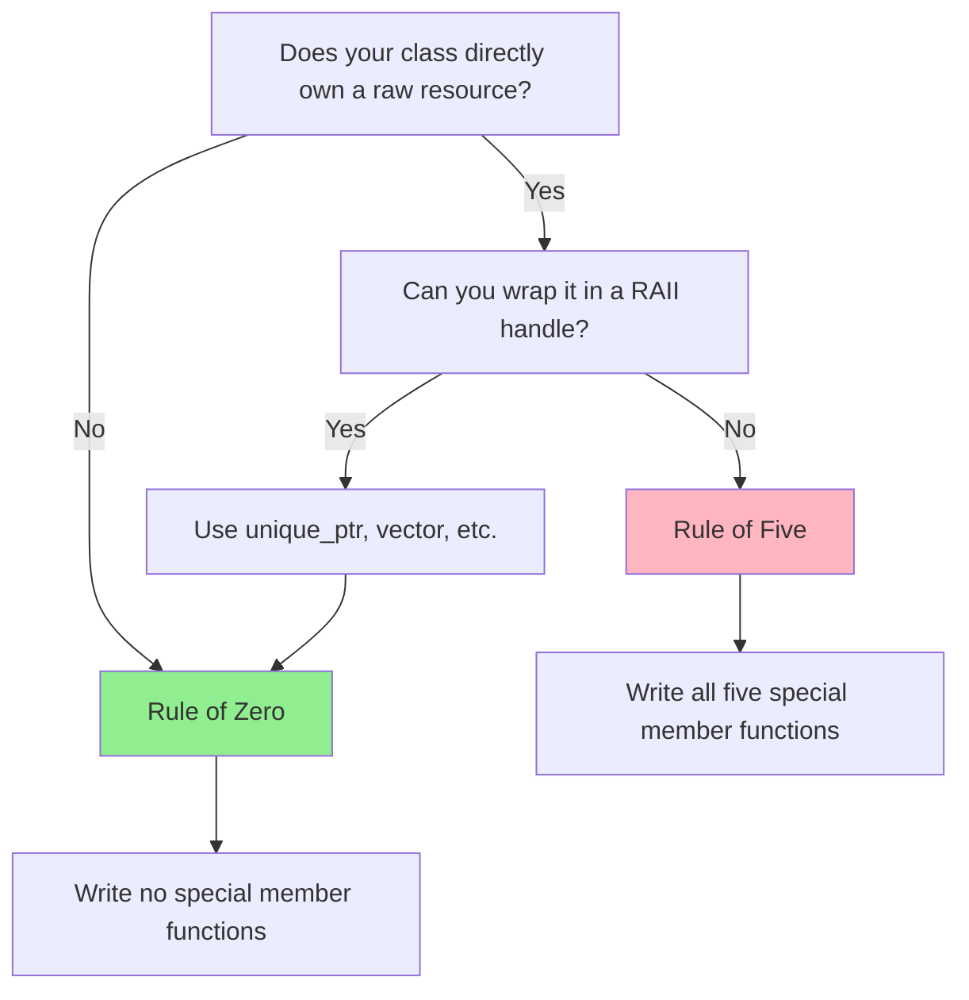

Ask whether your class directly owns a raw resource. If not, apply the Rule of Zero and write no special member functions. If it does own a raw resource, ask whether you can wrap that resource in a RAII handle like `unique_ptr` or `vector`. If you can, do that, and then apply the Rule of Zero. Only if you cannot use an existing RAII wrapper should you write all five special member functions yourself.

There is no valid middle ground. Writing some but not all is how you get the `DataBuffer` bug.

---

# **CHAPTER 2 — Move Semantics: Ownership Transfer**

The Rule of Five mentions move constructor and move assignment. But what are they, and why do they exist?

## The Problem Move Solves

Before C++11, returning a large object from a function was expensive:

```cpp
std::vector<double> compute_results() {
    std::vector<double> results;
    results.reserve(1000000);
    // ... fill results ...
    return results;  // Copy 1 million doubles?
}
```

The compiler might elide the copy (RVO), but couldn't guarantee it. Passing objects to functions had the same problem—you either copied (expensive) or used pointers (error-prone).

Move semantics solves this by distinguishing objects you're done with from objects you still need. An object you're done with can have its resources *transferred* rather than *copied*.

## The Two Value Categories That Matter

C++ categorizes expressions by whether they have identity (a name, an address) and whether they can be moved from:

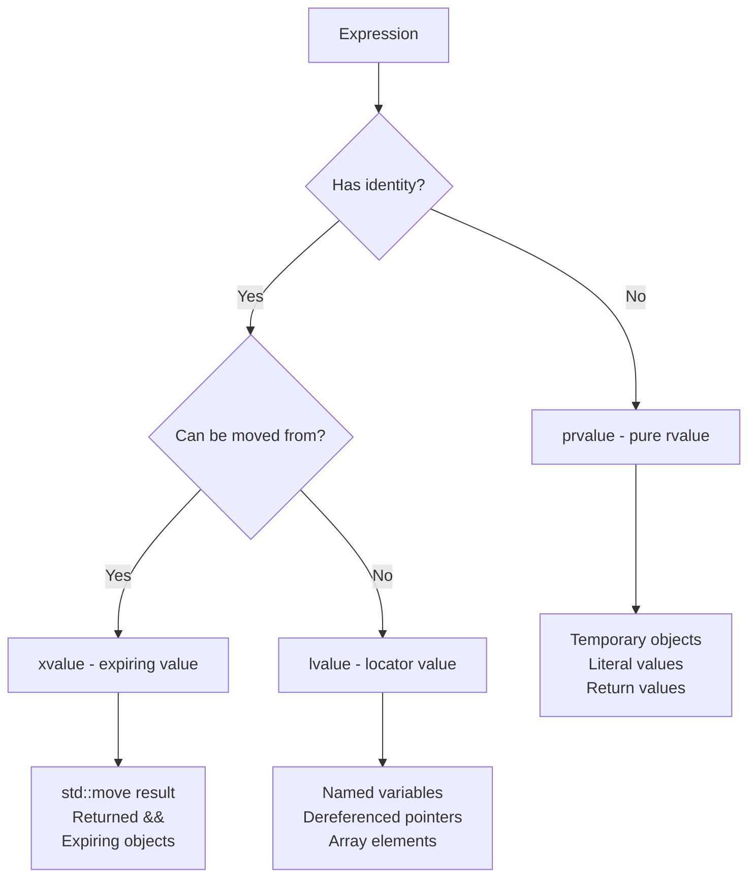

For practical purposes:

- **lvalue:** Has a name. You probably still need it. `x`, `*ptr`, `arr[0]`
- **rvalue:** Temporary or explicitly abandoned. You're done with it. `42`, `x + y`, `std::move(x)`

## What Move Operations Do

A move constructor/assignment transfers ownership of resources from source to destination:

```cpp
class Buffer {
    double* data_;
    size_t size_;
    
public:
    // Move constructor: steal from source
    Buffer(Buffer&& other) noexcept
        : data_(other.data_)
        , size_(other.size_) 
    {
        other.data_ = nullptr;  // Source no longer owns
        other.size_ = 0;
    }
    
    // Move assignment: release ours, steal theirs
    Buffer& operator=(Buffer&& other) noexcept {
        if (this != &other) {
            delete[] data_;         // Release our resource
            data_ = other.data_;    // Steal their resource
            size_ = other.size_;
            other.data_ = nullptr;  // Source no longer owns
            other.size_ = 0;
        }
        return *this;
    }
};
```

After a move, the source object is in a *valid but unspecified* state. For most types, this means empty or null. The source must still be destructible.

## When Move Happens Automatically

The compiler uses move automatically when:

1. **Returning a local variable:** `return local_vector;`
2. **Passing a temporary:** `process(create_buffer());`
3. **Initializing from a temporary:** `Buffer b = create_buffer();`

```cpp
std::vector<double> compute() {
    std::vector<double> result(1000000);
    // ... fill ...
    return result;  // Moved (or elided entirely)
}

void caller() {
    auto data = compute();  // No copy—moved or elided
}
```

## When You Must Request Move: std::move

`std::move` doesn't move anything. It casts an lvalue to an rvalue, *enabling* a move:

```cpp
std::vector<double> source = get_data();
std::vector<double> dest = std::move(source);  // Now source is empty
// source is valid but unspecified—don't use its values
```

Use `std::move` when:
- You're done with an object and want to transfer its resources
- You're implementing move operations and forwarding members

```cpp
class Widget {
    std::string name_;
    std::vector<int> data_;
    
public:
    Widget(Widget&& other) noexcept
        : name_(std::move(other.name_))      // Move each member
        , data_(std::move(other.data_))
    {}
};
```

## The noexcept Contract

Move operations should be `noexcept` whenever possible:

```cpp
Buffer(Buffer&& other) noexcept;             // Promise: won't throw
Buffer& operator=(Buffer&& other) noexcept;  // Promise: won't throw
```

Why this matters: `std::vector` needs to move elements when resizing. If the move might throw, the vector can't safely move elements—a throw mid-resize would leave the vector in an inconsistent state. So `std::vector` checks `is_nothrow_move_constructible`. If true, it moves. If false, it copies.

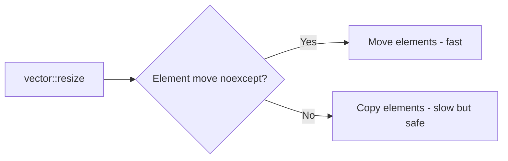

This is why a missing `noexcept` on move operations silently kills performance.

## Moved-From State

After move, the source object must be:
1. **Destructible:** The destructor will be called
2. **Assignable:** You can assign a new value to it

The source need not be usable in any other way. Standard library types leave moved-from objects empty:

```cpp
std::string s = "hello";
std::string t = std::move(s);
// s is now empty (guaranteed by the standard)
// s.size() == 0, s.empty() == true

std::vector<int> v = {1, 2, 3};
std::vector<int> w = std::move(v);
// v is now empty
// v.size() == 0, v.capacity() is unspecified
```

For your own types, document what moved-from means.

## The Universal Reference Trap

When `&&` appears with a deduced type, it's not an rvalue reference—it's a *forwarding reference* (also called universal reference):

```cpp
template <typename T>
void wrapper(T&& arg) {  // Forwarding reference, not rvalue reference
    // arg binds to both lvalues and rvalues
}

void fixed_type(std::string&& arg) {  // Rvalue reference
    // arg only binds to rvalues
}
```

With forwarding references, use `std::forward` to preserve value category:

```cpp
template <typename T>
void wrapper(T&& arg) {
    inner(std::forward<T>(arg));  // Preserves lvalue/rvalue-ness
}
```

This is advanced territory. If you're not writing generic library code, you rarely need forwarding references.

## The Five Special Operations Revisited

Now the Rule of Five makes more sense:

| Operation | Purpose | Should be noexcept? |
|-----------|---------|---------------------|
| Destructor | Release resources | Yes (always) |
| Copy constructor | Duplicate resources | Usually no (allocation may throw) |
| Copy assignment | Release + duplicate | Usually no |
| Move constructor | Transfer resources | **Yes** (critical for performance) |
| Move assignment | Release + transfer | **Yes** (critical for performance) |

If you write one, write all five. If you write move operations, make them `noexcept`.

## Move-Only Types

Some types cannot be copied—only moved. File handles, thread handles, unique ownership:

```cpp
class UniqueFile {
    int fd_;
    
public:
    explicit UniqueFile(const char* path) : fd_(open(path, O_RDONLY)) {}
    ~UniqueFile() { if (fd_ >= 0) close(fd_); }
    
    // Delete copy operations
    UniqueFile(const UniqueFile&) = delete;
    UniqueFile& operator=(const UniqueFile&) = delete;
    
    // Enable move operations
    UniqueFile(UniqueFile&& other) noexcept : fd_(other.fd_) {
        other.fd_ = -1;
    }
    UniqueFile& operator=(UniqueFile&& other) noexcept {
        if (this != &other) {
            if (fd_ >= 0) close(fd_);
            fd_ = other.fd_;
            other.fd_ = -1;
        }
        return *this;
    }
};
```

`std::unique_ptr` is the canonical move-only type. If you find yourself writing move-only classes, consider whether `unique_ptr<T, CustomDeleter>` would suffice.

---

# **CHAPTER 3 — RAII or Regret**

## The Wound

You're reading code from a physics simulation:

```cpp
void run_simulation(const Config& config) {
    Mesh* mesh = load_mesh(config.mesh_file);
    if (!mesh) {
        log_error("Failed to load mesh");
        return;
    }
    
    Solver* solver = create_solver(config.solver_type);
    if (!solver) {
        log_error("Failed to create solver");
        delete mesh;  // Remember to clean up
        return;
    }
    
    OutputWriter* writer = open_output(config.output_file);
    if (!writer) {
        log_error("Failed to open output");
        delete solver;  // Remember to clean up
        delete solver;  // Remember to clean up
        delete mesh;    // Remember to clean up
        return;
    }
    
    try {
        for (int step = 0; step < config.num_steps; ++step) {
            solver->advance(mesh);
            writer->write(mesh, step);
        }
    } catch (const std::exception& e) {
        log_error("Simulation failed: ", e.what());
        delete writer;  // Remember to clean up
        delete solver;  // Remember to clean up
        delete mesh;    // Remember to clean up
        return;
    }
    
    delete writer;
    delete solver;
    delete mesh;
}
```

Count the places where cleanup happens. Four. Count the ways to get it wrong. Infinite.

This function has been in production for two years. Last month, someone added a new early-return path. They forgot to delete `mesh`. The simulation runs for three weeks. The memory leak accumulates. Eventually the job is killed by the cluster scheduler for exceeding memory limits. Three weeks of compute time, lost.

## The Pattern

The problem is manual resource management. Every resource acquisition is paired with a release, but the pairing is enforced by programmer discipline, not by the language.

Manual cleanup fails because:

1. **Multiple exit paths.** Every `return`, `throw`, or `goto` needs its own cleanup.
2. **Cleanup order matters.** Resources must be released in reverse order of acquisition.
3. **Partial acquisition.** If you acquire three resources and the third fails, you must release the first two.
4. **Exceptions.** Any function call can throw, and you must clean up correctly.

## The Solution: RAII

RAII (Resource Acquisition Is Initialization) binds resource lifetime to object lifetime:

```cpp
void run_simulation(const Config& config) {
    auto mesh = load_mesh_raii(config.mesh_file);
    if (!mesh) {
        log_error("Failed to load mesh");
        return;  // Nothing to clean up
    }
    
    auto solver = create_solver_raii(config.solver_type);
    if (!solver) {
        log_error("Failed to create solver");
        return;  // mesh cleaned up automatically
    }
    
    auto writer = open_output_raii(config.output_file);
    if (!writer) {
        log_error("Failed to open output");
        return;  // solver and mesh cleaned up automatically
    }
    
    for (int step = 0; step < config.num_steps; ++step) {
        solver->advance(mesh.get());
        writer->write(mesh.get(), step);
    }
    // Everything cleaned up automatically, in reverse order
}
```

No explicit cleanup. No forgetting. Exceptions handled automatically. The compiler enforces correctness.

## Wrapping Non-RAII Resources

For resources without standard handles, write your own:

```cpp
class FileHandle {
public:
    explicit FileHandle(const char* path) : fd_(open(path, O_RDONLY)) {
        if (fd_ < 0) throw std::system_error(errno, std::system_category());
    }
    
    ~FileHandle() { if (fd_ >= 0) close(fd_); }
    
    // Non-copyable
    FileHandle(const FileHandle&) = delete;
    FileHandle& operator=(const FileHandle&) = delete;
    
    // Movable
    FileHandle(FileHandle&& other) noexcept : fd_(other.fd_) { other.fd_ = -1; }
    FileHandle& operator=(FileHandle&& other) noexcept {
        if (this != &other) {
            if (fd_ >= 0) close(fd_);
            fd_ = other.fd_;
            other.fd_ = -1;
        }
        return *this;
    }
    
    int get() const { return fd_; }
    
private:
    int fd_;
};
```

## The Invariant

After construction, a RAII object is in a valid state. Its destructor will release resources correctly. There is no "forgot to clean up" failure mode.

This is what Chapter 1 meant by "let `std::vector` manage the resource." RAII handles are the building blocks of the Rule of Zero.

---

# **CHAPTER 4 — Exception Safety: Guarantees Under Fire**

Exceptions complicate everything. Code that looks correct can leave objects in invalid states, leak resources, or corrupt data structures when an exception interrupts execution.

## The Four Guarantee Levels

The C++ community recognizes four levels of exception safety, defined by David Abrahams in the late 1990s:

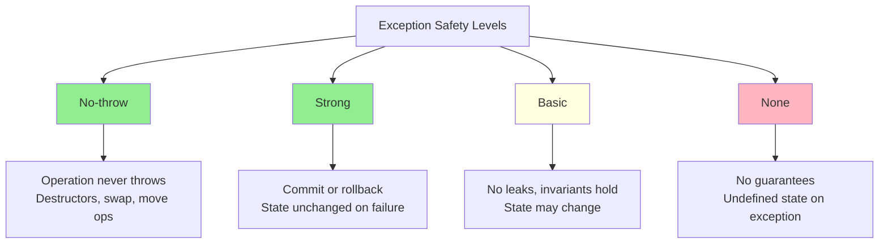

**No-throw guarantee:** The operation never throws exceptions. It either succeeds or handles errors internally. Destructors must provide this guarantee—a throwing destructor during stack unwinding calls `std::terminate`.

**Strong guarantee (commit-or-rollback):** If the operation throws, the program state is unchanged. Either the operation completes entirely, or it's as if it never started. This is the transactional model.

**Basic guarantee (no-leak guarantee):** If the operation throws, invariants are preserved and no resources leak. The object is in *some* valid state, but not necessarily the original state.

**No guarantee:** If the operation throws, the state is undefined. This is a bug.

## Why This Matters: A Broken Assignment

Consider this assignment operator:

```cpp
class Document {
    std::string title_;
    std::vector<Page> pages_;
    
public:
    Document& operator=(const Document& other) {
        title_ = other.title_;      // Step 1: might throw
        pages_ = other.pages_;      // Step 2: might throw
        return *this;
    }
};
```

If step 2 throws, `title_` has the new value but `pages_` has the old value (or is in an inconsistent state). The object is corrupted—half old, half new.

## The Copy-and-Swap Idiom

The standard solution for strong exception safety in assignment:

```cpp
class Document {
    std::string title_;
    std::vector<Page> pages_;
    
public:
    Document(const Document& other)
        : title_(other.title_)
        , pages_(other.pages_) 
    {}
    
    Document(Document&& other) noexcept
        : title_(std::move(other.title_))
        , pages_(std::move(other.pages_))
    {}
    
    friend void swap(Document& a, Document& b) noexcept {
        using std::swap;
        swap(a.title_, b.title_);
        swap(a.pages_, b.pages_);
    }
    
    Document& operator=(Document other) {  // Note: by value
        swap(*this, other);
        return *this;
    }
};
```

How it works:
1. Copy `other` into the parameter `other` (by-value pass). If this throws, `*this` is unchanged.
2. Swap `*this` with `other`. This is `noexcept`.
3. Destructor cleans up `other` (which now holds our old data). This is `noexcept`.

If step 1 throws, we haven't touched `*this`. Strong guarantee achieved.

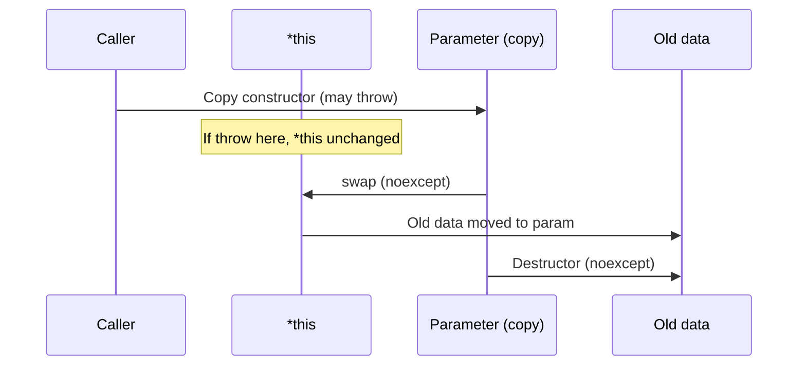

## Exception Safety in Containers

Container operations have varying guarantees:

| Operation | Guarantee | Notes |
|-----------|-----------|-------|
| `push_back` | Strong | If element copy/move throws, vector unchanged |
| `insert` | Strong | Same |
| `erase` | No-throw | If destructor is noexcept (it should be) |
| `clear` | No-throw | Same |
| `operator[]` | No-throw | No bounds checking |
| `at()` | Strong | Throws `out_of_range` on bounds violation |

The key insight: containers provide strong guarantees when element operations don't throw, or when they can detect failure before modifying state.

## Writing Exception-Safe Code

**Rule 1: Destructors must not throw**

```cpp
~Resource() noexcept {  // Implicit, but be explicit
    cleanup();  // If cleanup fails, log but don't throw
}
```

A throwing destructor during stack unwinding terminates the program.

**Rule 2: Move operations should be noexcept**

```cpp
Buffer(Buffer&& other) noexcept;
Buffer& operator=(Buffer&& other) noexcept;
```

This enables containers to provide strong guarantees efficiently.

**Rule 3: Do all work that might throw before modifying state**

```cpp
// Bad: modify then allocate
void add_item(const Item& item) {
    count_++;                    // Modified state
    items_[count_] = item;       // Might throw - now count_ is wrong
}

// Good: allocate then modify
void add_item(const Item& item) {
    Item copy = item;            // Might throw - state unchanged
    items_[count_ + 1] = std::move(copy);  // noexcept
    count_++;                    // noexcept
}
```

**Rule 4: Use RAII for resources**

```cpp
// Bad: manual cleanup
void process() {
    Resource* r = acquire();
    do_work();  // Might throw - resource leaked
    release(r);
}

// Good: RAII
void process() {
    ResourceHandle r(acquire());
    do_work();  // Might throw - r's destructor releases
}
```

## The Two-Phase Commit Pattern

For complex operations, separate "prepare" from "commit":

```cpp
void transfer(Account& from, Account& to, Money amount) {
    // Phase 1: Prepare (may throw)
    from.prepare_withdrawal(amount);  // Validates, doesn't modify
    to.prepare_deposit(amount);       // Validates, doesn't modify
    
    // Phase 2: Commit (noexcept)
    from.commit_withdrawal();         // Actually modifies
    to.commit_deposit();              // Actually modifies
}
```

If either prepare fails, no state has changed. Once we reach phase 2, nothing can fail.

## Exception Safety and Performance

The strong guarantee sometimes costs performance:

```cpp
// Strong guarantee via copy-and-swap
void Container::resize(size_t new_size) {
    Container temp(*this);     // Full copy
    temp.resize_impl(new_size);
    swap(*this, temp);
}

// Basic guarantee, faster
void Container::resize(size_t new_size) {
    resize_impl(new_size);     // In-place modification
}
```

Choose based on requirements. Database transactions need strong guarantees. High-frequency trading might accept basic guarantees for speed.

## Documenting Exception Safety

Every public function should document its exception guarantee:

```cpp
/// @brief Inserts an element at the specified position.
/// @exception std::bad_alloc If memory allocation fails.
/// @exception_safety Strong guarantee. If an exception is thrown,
///                   the container is unchanged.
iterator insert(const_iterator pos, const T& value);
```

If a function has no guarantee, that's a bug to be fixed, not a feature to document.

---

# **CHAPTER 5 — Initialization Is Not Assignment**

## The Wound

A junior engineer writes:

```cpp
class Simulation {
public:
    Simulation(const std::string& name, const Config& config) {
        name_ = name;
        config_ = config;
        mesh_ = Mesh(config.mesh_file);
        solver_ = Solver(config.solver_type);
    }
    
private:
    std::string name_;
    Config config_;
    Mesh mesh_;
    Solver solver_;
};
```

The code looks reasonable. It compiles. It runs. But there are two problems.

**Problem 1: Double work.** Every member is constructed twice. First, the members are default-constructed (before the constructor body runs). Then, they're assigned new values (inside the constructor body). For `std::string`, this means: allocate an empty string, then allocate a new string and copy, then deallocate the empty string. Triple the allocation work.

**Problem 2: Some types can't be default-constructed.** If `Mesh` requires a filename in its constructor, the code won't compile. The engineer "fixes" it by adding a default constructor to `Mesh` that creates an invalid mesh. Now there are zombie objects in the codebase.

## The Mechanism

C++ member initialization happens in two phases:

1. **Member initialization:** Before the constructor body runs, each member is initialized. If you don't specify how, default construction is used.

2. **Constructor body:** Your code runs. Any `member_ = value;` is assignment, not initialization.

The initializer list performs initialization:

```cpp
Simulation(const std::string& name, const Config& config)
    : name_(name),                    // Direct initialization
      config_(config),                // Direct initialization
      mesh_(config.mesh_file),        // Direct initialization
      solver_(config.solver_type) {}  // Direct initialization
```

No default construction. No assignment. Each member is constructed exactly once with the correct value.

## In-Class Member Initializers

C++11 added in-class member initializers, which are even clearer:

```cpp
class Simulation {
public:
    Simulation(const std::string& name, const Config& config)
        : name_(name), config_(config), 
          mesh_(config.mesh_file), solver_(config.solver_type) {}
    
private:
    std::string name_ = "";            // Default if not in initializer list
    Config config_ = Config{};         // Default if not in initializer list
    Mesh mesh_;                        // No default—must be in initializer list
    Solver solver_;                    // No default—must be in initializer list
};
```

In-class initializers provide defaults. The initializer list overrides them. This is the most readable style for classes with many members and multiple constructors.

## The Rule

1. **Prefer in-class member initializers** for defaults.
2. **Use the initializer list** to override defaults or for members without defaults.
3. **Use the constructor body** only for logic that can't be expressed as initialization.

The constructor body is for *work*, not *setup*.

---

# **CHAPTER 4 — Explicit Conversions**

## The Wound

A networking library has:

```cpp
class TcpConnection {
public:
    TcpConnection(const std::string& address);  // Connect to address
    void send(const std::string& data);
};
```

Someone writes:

```cpp
void broadcast(const std::vector<TcpConnection>& connections, 
               const std::string& message) {
    for (const auto& conn : connections) {
        conn.send(message);
    }
}

// Later, in calling code:
std::vector<TcpConnection> servers;
servers.push_back("192.168.1.1:8080");  // Oops
servers.push_back("192.168.1.2:8080");
broadcast(servers, "hello");
```

The code compiles. The `push_back` accepts a `const char*`, which implicitly converts to `std::string`, which implicitly converts to `TcpConnection`. Each "push" opens a network connection. The programmer thought they were building a list of addresses. They were building a list of open connections.

The bug is invisible. Nothing looks wrong. The implicit conversion chain is legal C++.

## The Pattern

Single-argument constructors are implicit conversion operators. `TcpConnection(const std::string&)` tells the compiler: "Whenever you need a `TcpConnection` and have a `std::string`, just construct one."

This is occasionally useful:

```cpp
class BigInt {
public:
    BigInt(int value);  // Implicit: BigInt x = 42; is natural
};
```

But it's usually dangerous. `TcpConnection` is not a "kind of string." It's a resource that happens to be configured by a string.

## The Rule

Mark single-argument constructors `explicit` unless implicit conversion is intentional and documented:

```cpp
class TcpConnection {
public:
    explicit TcpConnection(const std::string& address);
};
```

Now:

```cpp
servers.push_back("192.168.1.1:8080");  // Compiler error
servers.push_back(TcpConnection("192.168.1.1:8080"));  // OK
```

The programmer must explicitly construct the connection. The intent is visible. The bug is impossible.

## What About Multi-Argument Constructors?

Before C++11, only single-argument constructors could participate in implicit conversions. C++11 added brace initialization, which enables implicit conversions for multi-argument constructors too:

```cpp
class Point {
public:
    Point(double x, double y);
};

void draw(Point p);
draw({3.0, 4.0});  // Implicit conversion from initializer list
```

This is sometimes convenient. But if the conversion is surprising, use `explicit`:

```cpp
class DatabaseConnection {
public:
    explicit DatabaseConnection(const std::string& host, int port);
};
```

## The Decision

Ask: "Would a reader be surprised if this conversion happened silently?"

If yes, use `explicit`. When in doubt, use `explicit`.

---

# **CHAPTER 5 — Making Misuse Impossible**

## The Wound

An API for file operations:

```cpp
void copy_file(const std::string& source, const std::string& dest, 
               bool overwrite, bool preserve_metadata);
```

Calling code:

```cpp
copy_file("input.dat", "output.dat", true, false);
copy_file("input.dat", "output.dat", false, true);
copy_file("input.dat", "output.dat", true, true);
```

Which call overwrites existing files? Which preserves metadata? You can't tell without checking the function signature. And if someone swaps the boolean arguments, the code compiles and runs—just incorrectly.

This is called **boolean blindness**. The booleans are meaningless at the call site.

## The Pattern

Boolean parameters hide intent. Multiple boolean parameters multiply the problem. The reader must remember the parameter order and meaning. The compiler cannot help—`true, false` and `false, true` are both valid.

## The Solution: Strong Types

Replace booleans with types that express intent:

```cpp
enum class Overwrite { No, Yes };
enum class PreserveMetadata { No, Yes };

void copy_file(const std::string& source, const std::string& dest,
               Overwrite overwrite, PreserveMetadata preserve);
```

Now:

```cpp
copy_file("input.dat", "output.dat", Overwrite::Yes, PreserveMetadata::No);
copy_file("input.dat", "output.dat", PreserveMetadata::No, Overwrite::Yes);  // Compiler error
```

The code is self-documenting. The compiler catches argument-order mistakes.

## Beyond Booleans

The same principle applies to other primitive types:

```cpp
// Bad: What's what?
void transfer(Account& a, Account& b, int amount);
transfer(savings, checking, 500);  // Which direction?

// Good: Types encode direction
void transfer(Account& from, Account& to, Dollars amount);
transfer(savings, checking, Dollars{500});  // Clear

// Even better: Make illegal states unrepresentable
class Transfer {
public:
    Transfer(Account& from, Account& to, Dollars amount);
    void execute();
};
```

## The Strong Type Library

FAT-P provides `StrongId` and related utilities for creating strong types without boilerplate:

```cpp
using UserId = StrongId<struct UserIdTag>;
using ProductId = StrongId<struct ProductIdTag>;

void purchase(UserId user, ProductId product);

UserId alice{42};
ProductId widget{42};

purchase(alice, widget);    // OK
purchase(widget, alice);    // Compiler error: types don't match
```

The underlying value is the same. The types are incompatible. Misuse is impossible.

---

# **CHAPTER 6 — The Const Contract**

## The Wound

A matrix class with a lazy-computation optimization:

```cpp
class Matrix {
public:
    double determinant() {
        if (!determinant_cached_) {
            cached_determinant_ = compute_determinant();
            determinant_cached_ = true;
        }
        return cached_determinant_;
    }
    
private:
    std::vector<double> data_;
    double cached_determinant_;
    bool determinant_cached_ = false;
    
    double compute_determinant();
};
```

Someone writes:

```cpp
double check_invertibility(const Matrix& m) {
    return m.determinant();  // Compiler error: determinant() is not const
}
```

The engineer "fixes" it by removing `const` from the parameter:

```cpp
double check_invertibility(Matrix& m) {  // Lost const-correctness
    return m.determinant();
}
```

Now `check_invertibility` can't be called on temporary matrices or const references. The constness has "infected" the codebase—every function that calls `check_invertibility` must also take non-const references. Eventually, nothing is const.

## The Pattern

`const` is not about immutability—it's about **contracts**. A `const` method promises it won't modify the *logical state* of the object. Caching is an implementation detail, not a logical state change.

## The Solution: Mutable

Use `mutable` for implementation-detail state that can change in const methods:

```cpp
class Matrix {
public:
    double determinant() const {  // Now const-correct
        if (!determinant_cached_) {
            cached_determinant_ = compute_determinant();
            determinant_cached_ = true;
        }
        return cached_determinant_;
    }
    
private:
    std::vector<double> data_;
    mutable double cached_determinant_;        // Can change in const methods
    mutable bool determinant_cached_ = false;  // Can change in const methods
    
    double compute_determinant() const;
};
```

The method is logically const—it returns the same value every time for the same matrix. The caching is invisible to callers.

## When to Use Const

**Function parameters:** Use `const&` for input parameters that won't be modified:

```cpp
void process(const std::vector<double>& data);  // Won't modify data
```

**Member functions:** Mark methods `const` if they don't change logical state:

```cpp
size_t size() const;           // Obviously const
double determinant() const;    // Logically const (caching is hidden)
void print() const;            // Doesn't modify the object
```

**Return values:** Return `const&` to prevent modification of internal state:

```cpp
const std::string& name() const { return name_; }  // Can't modify name_
```

## Const and Concurrency

`const` enables safe concurrent access. If a method is `const`, multiple threads can call it simultaneously without synchronization (assuming no internal mutation without synchronization).

This is why `mutable` members that are modified in `const` methods often need protection:

```cpp
class Matrix {
public:
    double determinant() const {
        std::lock_guard<std::mutex> lock(cache_mutex_);  // Thread-safe caching
        if (!determinant_cached_) {
            cached_determinant_ = compute_determinant();
            determinant_cached_ = true;
        }
        return cached_determinant_;
    }
    
private:
    mutable std::mutex cache_mutex_;
    mutable double cached_determinant_;
    mutable bool determinant_cached_ = false;
};
```

## The Contract

`const` is a promise to callers: "This operation does not change what you can observe about this object." Honor the promise. Use `mutable` for hidden implementation state. The alternative—spreading non-const through the codebase—is worse.

---

# **CHAPTER 7 — Nodiscard and Ignored Errors**

## The Wound

A memory allocation function:

```cpp
void* allocate(size_t size);
void deallocate(void* ptr);
```

Someone writes:

```cpp
void process_data(size_t n) {
    allocate(n * sizeof(double));  // Oops: return value ignored
    // ... use the memory somehow? No pointer was stored.
}
```

The allocation succeeded (or failed—we don't know), but the pointer was discarded. Memory leak guaranteed.

Or a different kind of ignored return value:

```cpp
bool save_to_file(const Data& data, const std::string& path);

void export_results(const Data& data) {
    save_to_file(data, "/results/output.dat");  // Did it work? Who knows.
    std::cout << "Export complete!" << std::endl;  // Lie.
}
```

The function returns a success/failure indicator. The caller ignores it and assumes success.

## The Pattern

Ignored return values are a rich source of bugs:

- **Ignored allocations:** Memory leaks
- **Ignored error codes:** Silent failures
- **Ignored ownership transfers:** Use-after-free
- **Ignored computations:** Logic errors

The compiler doesn't care if you ignore a return value. The bugs are silent.

## The Solution: [[nodiscard]]

C++17 added `[[nodiscard]]` to mark return values that must be used:

```cpp
[[nodiscard]] void* allocate(size_t size);

[[nodiscard]] bool save_to_file(const Data& data, const std::string& path);
```

Now:

```cpp
allocate(n * sizeof(double));  // Compiler warning: ignoring return value
save_to_file(data, path);      // Compiler warning: ignoring return value
```

The warnings become errors with `-Werror`.

## When to Use [[nodiscard]]

**Factory functions:** The caller needs the created object.

```cpp
[[nodiscard]] std::unique_ptr<Widget> create_widget();
```

**Error indicators:** The caller needs to know if the operation succeeded.

```cpp
[[nodiscard]] bool try_connect();
[[nodiscard]] std::error_code write(const Data& data);
```

**Ownership transfers:** The caller receives ownership and must manage the resource.

```cpp
[[nodiscard]] FileHandle open_file(const std::string& path);
```

**Computed values:** The function exists to compute something; ignoring it is pointless.

```cpp
[[nodiscard]] double compute_checksum(const Data& data);
```

## [[nodiscard]] on Types

You can apply `[[nodiscard]]` to types, affecting all functions that return them:

```cpp
class [[nodiscard]] ErrorCode {
    int code_;
public:
    explicit ErrorCode(int code) : code_(code) {}
    bool ok() const { return code_ == 0; }
};

ErrorCode process();  // Automatically [[nodiscard]] because ErrorCode is
```

FAT-P's `Expected<T, E>` is `[[nodiscard]]` for this reason—you should never ignore a value that might be an error.

---

# **CHAPTER 8 — Composition Over Inheritance**

## The Wound

A logging system built with inheritance:

```cpp
class Logger {
public:
    virtual void log(const std::string& message) = 0;
    virtual ~Logger() = default;
};

class FileLogger : public Logger {
public:
    void log(const std::string& message) override { /* write to file */ }
};

class TimestampedLogger : public Logger {
public:
    void log(const std::string& message) override {
        // Add timestamp and... delegate to what?
    }
};
```

How does `TimestampedLogger` add timestamps and then write to a file? It can't inherit from both `FileLogger` and `Logger`—that's the diamond problem. The design has painted itself into a corner.

The team "solves" it with multiple inheritance:

```cpp
class TimestampedFileLogger : public FileLogger, public TimestampedLogger {
    // Which log() is called? Neither works correctly.
};
```

Now they have a different, worse problem.

## The Pattern

Inheritance creates tight coupling. The derived class depends on the base class's implementation, not just its interface. Changes to the base class can break derived classes in subtle ways (the fragile base class problem). And inheritance hierarchies are rigid—you can't mix and match behaviors.

## The Solution: Composition

Compose behaviors instead of inheriting them:

```cpp
class Logger {
public:
    virtual void log(const std::string& message) = 0;
    virtual ~Logger() = default;
};

class FileLogger : public Logger {
public:
    void log(const std::string& message) override { /* write to file */ }
};

class TimestampedLogger : public Logger {
public:
    explicit TimestampedLogger(std::unique_ptr<Logger> inner)
        : inner_(std::move(inner)) {}
    
    void log(const std::string& message) override {
        inner_->log(add_timestamp(message));
    }
    
private:
    std::unique_ptr<Logger> inner_;
    std::string add_timestamp(const std::string& msg);
};
```

Now you can compose arbitrarily:

```cpp
auto logger = std::make_unique<TimestampedLogger>(
    std::make_unique<FileLogger>("app.log"));

// Or add more decorators:
auto logger = std::make_unique<AsyncLogger>(
    std::make_unique<TimestampedLogger>(
        std::make_unique<FileLogger>("app.log")));
```

## When Inheritance Is Appropriate

Use inheritance for **polymorphism**, not code reuse:

```cpp
class Shape {
public:
    virtual double area() const = 0;
    virtual void draw(Canvas& c) const = 0;
    virtual ~Shape() = default;
};

class Circle : public Shape { /* ... */ };
class Rectangle : public Shape { /* ... */ };
```

`Circle` "is-a" `Shape`. The inheritance represents a type relationship, not a code-sharing mechanism.

## The Rule

Ask: "Is this an is-a relationship, or am I sharing code?"

If it's code sharing, use composition. If it's a type relationship with polymorphic behavior, use inheritance.

---

# **CHAPTER 9 — Virtual Destructors and Polymorphic Deletion**

## The Wound

A plugin system:

```cpp
class Plugin {
public:
    virtual void execute() = 0;
    // Note: no virtual destructor
};

class ConcretePlugin : public Plugin {
public:
    ConcretePlugin() : buffer_(new char[1024]) {}
    ~ConcretePlugin() { delete[] buffer_; }  // Clean up resources
    void execute() override { /* ... */ }
    
private:
    char* buffer_;
};
```

Plugin management code:

```cpp
std::vector<Plugin*> plugins;
plugins.push_back(new ConcretePlugin());
// ... later ...
for (Plugin* p : plugins) {
    delete p;  // Undefined behavior: non-virtual destructor
}
```

The `delete p` calls `Plugin::~Plugin()`, not `ConcretePlugin::~ConcretePlugin()`. The buffer is never freed. Memory leak—or worse, undefined behavior.

## The Rule

If a class is designed to be used polymorphically (deleted through a base pointer), its destructor must be virtual:

```cpp
class Plugin {
public:
    virtual void execute() = 0;
    virtual ~Plugin() = default;  // Virtual destructor
};
```

Now `delete p` correctly calls the derived class destructor.

## When You Don't Need Virtual Destructors

If the class is not designed for polymorphic use, you don't need a virtual destructor:

```cpp
class Point {  // Value type, never used polymorphically
    double x_, y_;
public:
    // No virtual destructor needed—no one inherits from Point
};
```

And if the base class destructor is protected, polymorphic deletion is impossible:

```cpp
class NonPolymorphicBase {
protected:
    ~NonPolymorphicBase() = default;  // Can't delete through base pointer
public:
    void do_something();
};
```

## The Decision

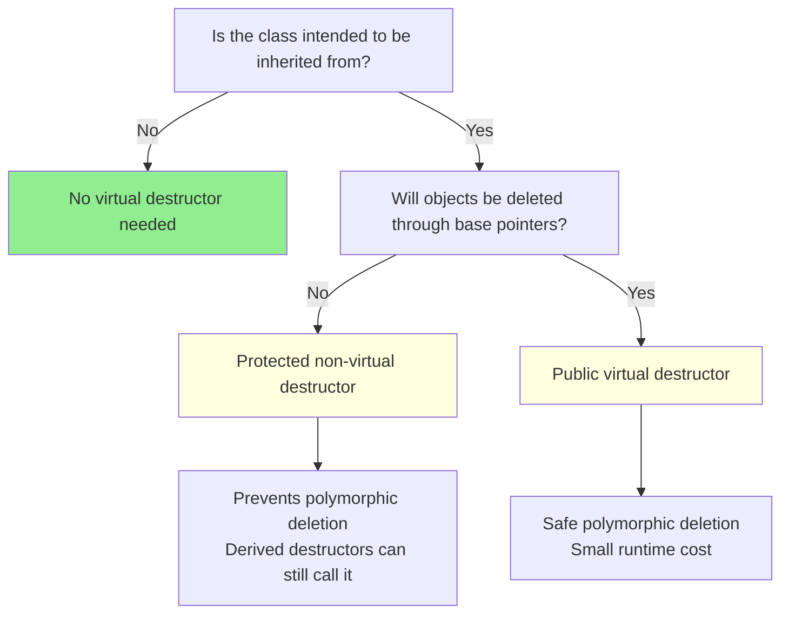

Ask whether the class is intended to be inherited from. If not, no virtual destructor is needed. If it is intended to be inherited from, ask whether objects will be deleted through base pointers. If not, make the destructor protected and non-virtual—this prevents polymorphic deletion while still allowing derived class destructors to call it. If objects will be deleted through base pointers, make the destructor public and virtual.

---

# **CHAPTER 10 — Member Layout and Cache Effects**

## The Wound

A particle system in a physics simulation:

```cpp
struct Particle {
    bool active;           // 1 byte
    double x, y, z;        // 24 bytes
    bool collided;         // 1 byte
    double vx, vy, vz;     // 24 bytes
    bool needs_update;     // 1 byte
    double mass;           // 8 bytes
};
```

`sizeof(Particle)` is... 72 bytes. But the actual data is only 59 bytes. Where did 13 bytes go?

## The Mechanism: Alignment and Padding

C++ requires objects to be aligned to their natural alignment. `double` requires 8-byte alignment. After `active` (1 byte), the compiler inserts 7 bytes of padding so `x` starts at an 8-byte boundary:

```
Offset  Field         Size  Padding After
0       active        1     7 bytes
8       x             8     0
16      y             8     0
24      z             8     0
32      collided      1     7 bytes
40      vx            8     0
48      vy            8     0
56      vz            8     0
64      needs_update  1     7 bytes
72      mass          8     0
80      (end)
```

Actually 80 bytes, not 72. 21 bytes of padding—26% waste.

## The Solution: Order by Size

Group members by size, largest first:

```cpp
struct Particle {
    double x, y, z;        // 24 bytes
    double vx, vy, vz;     // 24 bytes
    double mass;           // 8 bytes
    bool active;           // 1 byte
    bool collided;         // 1 byte
    bool needs_update;     // 1 byte + 5 padding
};
```

Now `sizeof(Particle)` is 64 bytes—the actual data (59 bytes) plus 5 bytes of padding at the end. 20% smaller.

## Cache Line Effects

The layout matters beyond just struct size. CPUs load data in cache lines (typically 64 bytes). If your hot data is scattered across the struct, you load cold data too.

A common pattern in game development:

```cpp
// Bad: Hot and cold data mixed
struct Entity {
    Transform transform;     // Updated every frame (hot)
    std::string name;        // Rarely used (cold)
    Physics physics;         // Updated every frame (hot)
    std::string description; // Rarely used (cold)
    Collision collision;     // Updated every frame (hot)
};

// Good: Separate hot and cold data
struct Entity {
    Transform transform;     // Hot
    Physics physics;         // Hot
    Collision collision;     // Hot
    // Cold data accessed through pointer or separate array
    EntityMetadata* metadata;
};
```

## The Rules

1. **Order members by decreasing alignment** to minimize padding.
2. **Group hot data together** to maximize cache utilization.
3. **Consider data-oriented design** for performance-critical systems: arrays of structs vs. structs of arrays.

Use `sizeof()` and `offsetof()` to verify your assumptions. Compilers can show padding with warnings (`-Wpadded` in GCC/Clang).

---

# **PART II — DESIGNING FOR TESTABILITY**

A class that is hard to test is usually poorly designed. The difficulty is a symptom, not the disease.

Testability problems are design problems. Global hidden state, work in constructors, hidden side effects, order-dependent behavior, reliance on time or threads—these make testing hard because they make *reasoning* hard. Fix the design, and testability follows.

---

# **CHAPTER 11 — Testability Is a Design Property**

## The Wound

A data processing class:

```cpp
class DataProcessor {
public:
    DataProcessor() {
        config_ = GlobalConfig::instance().processing_settings();
        db_ = DatabasePool::instance().get_connection();
        logger_ = LogManager::instance().get_logger("DataProcessor");
        cache_ = CacheManager::instance().get_cache("processing");
        
        logger_->info("DataProcessor initialized");
    }
    
    Result process(const Input& input) {
        logger_->debug("Processing input: {}", input.id());
        
        if (auto cached = cache_->get(input.id())) {
            logger_->debug("Cache hit");
            return *cached;
        }
        
        auto raw = db_->query("SELECT * FROM data WHERE id = ?", input.id());
        Result result = transform(raw, config_);
        
        cache_->put(input.id(), result);
        db_->execute("INSERT INTO results ...", result);
        
        return result;
    }
    
private:
    ProcessingConfig config_;
    std::shared_ptr<DatabaseConnection> db_;
    std::shared_ptr<Logger> logger_;
    std::shared_ptr<Cache> cache_;
    
    Result transform(const RawData& raw, const ProcessingConfig& config);
};
```

Now write a unit test for `process()`.

You can't. To construct a `DataProcessor`, you need:
- `GlobalConfig` initialized with valid settings
- `DatabasePool` initialized with a real or mock database
- `LogManager` initialized
- `CacheManager` initialized

Each of these singletons has its own initialization requirements. Some connect to external services. Some read configuration files. Some spawn threads.

Your "unit test" requires standing up half the application. It's not a unit test—it's an integration test wearing a unit test's clothing.

## The Pattern

The symptoms of poor testability:

1. **Global hidden state.** The class depends on singletons or global variables that aren't visible in its interface.

2. **Work in constructors.** Construction has side effects—network connections, file I/O, thread spawning.

3. **Hidden side effects.** Methods modify state that isn't passed as a parameter or returned as a result.

4. **Order-dependent behavior.** The class behaves differently depending on what happened before.

5. **Non-determinism.** Behavior depends on time, random numbers, thread scheduling, or external services.

These aren't testing problems. They're design problems. The class is tightly coupled to its environment, making it impossible to reason about in isolation.

## The Principle

**Testability is a design property.** A well-designed class is testable by construction. If you have to "make it testable" as a separate step, the design is wrong.

The fix isn't mock frameworks or test utilities. The fix is better design:

- Replace hidden dependencies with explicit parameters
- Move work out of constructors
- Make side effects visible in the interface
- Eliminate order dependence
- Isolate non-determinism at the boundaries

The rest of Part II shows how.

---

# **CHAPTER 12 — Construction Must Be Cheap**

## The Wound

A simulation component:

```cpp
class FluidSolver {
public:
    FluidSolver(const MeshFile& mesh_path, const Config& config) {
        // Load mesh from disk (500MB file, 30 seconds)
        mesh_ = Mesh::load_from_file(mesh_path);
        
        // Allocate working memory (2GB)
        velocity_field_ = allocate_field(mesh_.num_cells() * 3);
        pressure_field_ = allocate_field(mesh_.num_cells());
        temp_buffers_ = allocate_temp_storage(mesh_.num_cells() * 10);
        
        // Precompute matrices (60 seconds of CPU time)
        stiffness_matrix_ = compute_stiffness_matrix(mesh_);
        mass_matrix_ = compute_mass_matrix(mesh_);
        
        // Connect to visualization server
        viz_client_ = VisualizationClient::connect(config.viz_server());
        
        // Spawn worker threads
        for (int i = 0; i < config.num_threads(); i++) {
            workers_.emplace_back(&FluidSolver::worker_loop, this);
        }
    }
    
    void solve_timestep(double dt);
    
private:
    // ... many members ...
};
```

To test `solve_timestep()`, you must:
- Have a 500MB mesh file available
- Wait 30 seconds for mesh loading
- Allocate 2GB of memory
- Wait 60 seconds for matrix precomputation
- Have a visualization server running
- Spawn threads (which might race with your test)

A test that should take milliseconds takes 90+ seconds and requires external resources. Developers stop running tests. Tests become stale. Bugs slip through.

## The Pattern

Expensive constructors cause:

1. **Slow tests.** Each test pays the construction cost.
2. **Resource requirements.** Tests need files, servers, memory that might not be available.
3. **Non-determinism.** Thread spawning, network connections introduce races.
4. **All-or-nothing testing.** You can't test one method without paying for everything.

## The Solution: Separate Construction from Initialization

Split the expensive work into explicit phases:

```cpp
class FluidSolver {
public:
    // Cheap construction: just store references
    FluidSolver(Mesh& mesh, 
                VelocityField& velocity,
                PressureField& pressure,
                StiffnessMatrix& stiffness,
                MassMatrix& mass)
        : mesh_(mesh)
        , velocity_(velocity)
        , pressure_(pressure)
        , stiffness_(stiffness)
        , mass_(mass) {}
    
    void solve_timestep(double dt);
    
private:
    Mesh& mesh_;
    VelocityField& velocity_;
    PressureField& pressure_;
    StiffnessMatrix& stiffness_;
    MassMatrix& mass_;
};

// Factory for production use
class FluidSolverFactory {
public:
    struct Resources {
        std::unique_ptr<Mesh> mesh;
        std::unique_ptr<VelocityField> velocity;
        std::unique_ptr<PressureField> pressure;
        std::unique_ptr<StiffnessMatrix> stiffness;
        std::unique_ptr<MassMatrix> mass;
    };
    
    static Resources load_resources(const MeshFile& path, const Config& config) {
        Resources r;
        r.mesh = Mesh::load_from_file(path);
        r.velocity = allocate_field(r.mesh->num_cells() * 3);
        r.pressure = allocate_field(r.mesh->num_cells());
        r.stiffness = compute_stiffness_matrix(*r.mesh);
        r.mass = compute_mass_matrix(*r.mesh);
        return r;
    }
    
    static FluidSolver create(Resources& r) {
        return FluidSolver(*r.mesh, *r.velocity, *r.pressure, 
                          *r.stiffness, *r.mass);
    }
};
```

Now testing is cheap:

```cpp
TEST(FluidSolver, SingleTimestep) {
    // Create minimal test fixtures—no file I/O, no 2GB allocation
    Mesh tiny_mesh = create_test_mesh(10);  // 10 cells
    VelocityField velocity(30);
    PressureField pressure(10);
    StiffnessMatrix stiffness = create_test_stiffness(tiny_mesh);
    MassMatrix mass = create_test_mass(tiny_mesh);
    
    FluidSolver solver(tiny_mesh, velocity, pressure, stiffness, mass);
    
    solver.solve_timestep(0.01);
    
    // Assert on results
}
```

The test runs in milliseconds, uses kilobytes of memory, and needs no external resources.

## The Rule

**Constructors should be cheap and deterministic.** They should:

- Store parameters
- Initialize simple state
- Establish invariants

They should NOT:

- Open files or network connections
- Allocate large memory
- Perform expensive computation
- Spawn threads
- Have observable side effects

Make expensive operations explicit methods that callers invoke when ready.

---

# **CHAPTER 13 — Dependencies at Boundaries**

## The Wound

A report generator:

```cpp
class ReportGenerator {
public:
    Report generate(const Data& data) {
        // Get current time for the report header
        auto now = std::chrono::system_clock::now();
        
        // Format using the system locale
        auto locale = std::locale("");
        
        // Get the current user for the "generated by" field
        std::string user = std::getenv("USER") ? std::getenv("USER") : "unknown";
        
        // Read the report template from disk
        std::ifstream template_file("/etc/myapp/report_template.html");
        std::string template_content((std::istreambuf_iterator<char>(template_file)),
                                      std::istreambuf_iterator<char>());
        
        Report report;
        report.timestamp = format_time(now, locale);
        report.author = user;
        report.content = render_template(template_content, data);
        
        // Write to the standard output directory
        std::ofstream out("/var/reports/" + report.id() + ".html");
        out << report.to_html();
        
        return report;
    }
};
```

Testing this requires:
- Controlling system time (somehow)
- Controlling system locale (modifying global state)
- Setting environment variables (affects other tests)
- Having a template file at the exact path (deployment dependency)
- Having write access to `/var/reports/` (permissions)
- Cleaning up generated files (test pollution)

The function is a dependency magnet. Every environmental dependency is hidden inside the implementation.

## The Pattern

Hidden dependencies make testing hard because:

1. **State is implicit.** The function depends on time, locale, environment variables, filesystem—none visible in the signature.

2. **Dependencies are hard to substitute.** You can't pass a "fake clock" because the function creates its own.

3. **Tests affect each other.** Setting `$USER` for one test affects all tests in the process.

4. **Tests are environment-specific.** The test passes on your machine, fails on CI, because `/etc/myapp/report_template.html` doesn't exist.

## The Solution: Inject at Boundaries

Make dependencies explicit and inject them at architectural boundaries:

```cpp
// Dependencies as interfaces
class Clock {
public:
    virtual ~Clock() = default;
    virtual std::chrono::system_clock::time_point now() const = 0;
};

class TemplateLoader {
public:
    virtual ~TemplateLoader() = default;
    virtual std::string load(const std::string& name) const = 0;
};

class ReportWriter {
public:
    virtual ~ReportWriter() = default;
    virtual void write(const Report& report) = 0;
};

// The generator with explicit dependencies
class ReportGenerator {
public:
    ReportGenerator(const Clock& clock,
                    const TemplateLoader& templates,
                    ReportWriter& writer,
                    std::string author)
        : clock_(clock)
        , templates_(templates)
        , writer_(writer)
        , author_(std::move(author)) {}
    
    Report generate(const Data& data) {
        auto now = clock_.now();
        auto template_content = templates_.load("report");
        
        Report report;
        report.timestamp = format_time(now);
        report.author = author_;
        report.content = render_template(template_content, data);
        
        writer_.write(report);
        return report;
    }
    
private:
    const Clock& clock_;
    const TemplateLoader& templates_;
    ReportWriter& writer_;
    std::string author_;
};
```

Testing is now trivial:

```cpp
class FakeClock : public Clock {
public:
    std::chrono::system_clock::time_point now() const override {
        return fixed_time_;
    }
    std::chrono::system_clock::time_point fixed_time_;
};

class FakeTemplateLoader : public TemplateLoader {
public:
    std::string load(const std::string& name) const override {
        return "<html>{{content}}</html>";
    }
};

class FakeWriter : public ReportWriter {
public:
    void write(const Report& report) override {
        written_reports_.push_back(report);
    }
    std::vector<Report> written_reports_;
};

TEST(ReportGenerator, IncludesTimestamp) {
    FakeClock clock;
    clock.fixed_time_ = make_time(2025, 1, 15, 10, 30, 0);
    FakeTemplateLoader templates;
    FakeWriter writer;
    
    ReportGenerator gen(clock, templates, writer, "test_user");
    
    Data data = make_test_data();
    Report report = gen.generate(data);
    
    EXPECT_EQ(report.timestamp, "2025-01-15 10:30:00");
    EXPECT_EQ(report.author, "test_user");
    EXPECT_EQ(writer.written_reports_.size(), 1);
}
```

No filesystem. No environment variables. No system clock. Fully deterministic.

## The Balance: Not Everything Needs Injection

Dependency injection can be taken too far. Not every function needs interfaces for all dependencies:

```cpp
// TOO MUCH: Injecting basic utilities
class Calculator {
public:
    Calculator(const MathLibrary& math,  // Overkill
               const MemoryAllocator& alloc)  // Overkill
        : math_(math), alloc_(alloc) {}
    
    double compute(double x) {
        return math_.sin(x) + math_.cos(x);  // Just use std::sin!
    }
};
```

Inject at **architectural boundaries**:
- External services (databases, APIs, message queues)
- System resources (filesystem, clock, network)
- Configuration (settings that vary between environments)
- Expensive resources (thread pools, connection pools)

Don't inject:
- Standard library utilities (`std::sin`, `std::vector`)
- Pure computations with no side effects
- Internal implementation details

The goal is testability, not purity.

---

# **CHAPTER 14 — Return Values Over Side Effects**

## The Wound

A data validation function:

```cpp
class DataValidator {
public:
    void validate(Record& record) {
        if (record.name.empty()) {
            record.errors.push_back("Name is required");
            record.is_valid = false;
        }
        
        if (record.age < 0 || record.age > 150) {
            record.errors.push_back("Age is invalid");
            record.is_valid = false;
        }
        
        if (record.email.find('@') == std::string::npos) {
            record.errors.push_back("Email is invalid");
            record.is_valid = false;
        }
        
        if (record.errors.empty()) {
            record.is_valid = true;
            record.validated_at = std::chrono::system_clock::now();
            audit_log_.record("Validated record: " + record.id);
        }
    }
    
private:
    AuditLog& audit_log_;
};
```

To test this, you must:
- Create a `Record` with specific initial state
- Call `validate()`
- Inspect the `Record` to see what changed
- Mock `audit_log_` to verify logging

The function modifies its input. The input is also the output. State flows in two directions, tangled together.

What if you want to validate without modifying? What if you want to see what errors *would* occur? You can't—validation and mutation are fused.

## The Pattern

Side-effect-heavy code is hard to test because:

1. **State setup is complex.** You must construct objects in the right initial state.
2. **Observation is indirect.** You check for changes rather than receiving results.
3. **Side effects accumulate.** Each call modifies state, affecting subsequent calls.
4. **Mocking is required.** External side effects (logging, databases) need mocks.

## The Solution: Return Values

Refactor to return results instead of modifying inputs:

```cpp
struct ValidationResult {
    bool is_valid;
    std::vector<std::string> errors;
};

class DataValidator {
public:
    ValidationResult validate(const Record& record) const {
        ValidationResult result;
        result.is_valid = true;
        
        if (record.name.empty()) {
            result.errors.push_back("Name is required");
            result.is_valid = false;
        }
        
        if (record.age < 0 || record.age > 150) {
            result.errors.push_back("Age is invalid");
            result.is_valid = false;
        }
        
        if (record.email.find('@') == std::string::npos) {
            result.errors.push_back("Email is invalid");
            result.is_valid = false;
        }
        
        return result;
    }
};
```

Now testing is straightforward:

```cpp
TEST(DataValidator, RejectsEmptyName) {
    DataValidator validator;
    Record record;
    record.name = "";
    record.age = 25;
    record.email = "test@example.com";
    
    ValidationResult result = validator.validate(record);
    
    EXPECT_FALSE(result.is_valid);
    EXPECT_THAT(result.errors, Contains("Name is required"));
}

TEST(DataValidator, AcceptsValidRecord) {
    DataValidator validator;
    Record record;
    record.name = "Alice";
    record.age = 25;
    record.email = "alice@example.com";
    
    ValidationResult result = validator.validate(record);
    
    EXPECT_TRUE(result.is_valid);
    EXPECT_TRUE(result.errors.empty());
}
```

The validator is a pure function: same input, same output. No mocks. No state setup beyond the input. No side effects to verify.

## Separating Validation from Application

What about the original requirements—updating the record and logging?

Separate them:

```cpp
class RecordProcessor {
public:
    void process(Record& record) {
        ValidationResult validation = validator_.validate(record);
        
        record.is_valid = validation.is_valid;
        record.errors = std::move(validation.errors);
        
        if (validation.is_valid) {
            record.validated_at = clock_.now();
            audit_log_.record("Validated record: " + record.id);
        }
    }
    
private:
    DataValidator validator_;
    Clock& clock_;
    AuditLog& audit_log_;
};
```

Now you have:
- `DataValidator`: Pure validation logic, trivially testable
- `RecordProcessor`: Coordination logic with side effects, tested separately

The pure core is easy to test exhaustively. The side-effect shell is tested for coordination, not logic.

## The Rule

**Prefer functions that return results over functions that modify state.**

When you must have side effects:
1. Push them to the outer layers
2. Keep the core logic pure
3. Test the pure core thoroughly
4. Test the side-effect layer for coordination

---

# **CHAPTER 15 — Determinism Enables Testing**

## The Wound

A scheduling algorithm:

```cpp
class TaskScheduler {
public:
    void schedule(std::vector<Task>& tasks) {
        // Shuffle for fairness
        std::random_shuffle(tasks.begin(), tasks.end());
        
        // Assign to workers based on current load
        for (auto& task : tasks) {
            Worker* w = find_least_loaded_worker();
            w->assign(task);
        }
        
        // Record scheduling time
        for (auto& task : tasks) {
            task.scheduled_at = std::chrono::system_clock::now();
        }
    }
    
private:
    std::vector<Worker*> workers_;
    Worker* find_least_loaded_worker();
};
```

Write a test that verifies tasks are assigned to the least-loaded worker.

You can't—not reliably. The random shuffle changes the order each run. The "least loaded" worker depends on current load, which depends on previous operations. The timestamps depend on when the test runs.

Run the test twice, get different results. The test is flaky by design.

## The Pattern

Non-determinism makes testing impossible because:

1. **Results vary between runs.** The same test can pass or fail randomly.
2. **Failures aren't reproducible.** "It failed on CI" but passes locally.
3. **Coverage is probabilistic.** You might never hit certain code paths.
4. **Debugging is guesswork.** You can't reproduce the failing state.

Sources of non-determinism:
- Random number generators
- Current time
- Thread scheduling
- Hash table iteration order (in some implementations)
- Filesystem ordering
- Network timing

## The Solution: Inject or Isolate Non-Determinism

**Pattern 1: Inject the source of randomness**

```cpp
class TaskScheduler {
public:
    explicit TaskScheduler(std::function<void(std::vector<Task>&)> shuffler)
        : shuffler_(std::move(shuffler)) {}
    
    void schedule(std::vector<Task>& tasks) {
        shuffler_(tasks);  // Injected shuffle behavior
        // ... rest of scheduling ...
    }
    
private:
    std::function<void(std::vector<Task>&)> shuffler_;
};

// Production: real shuffle
auto scheduler = TaskScheduler([](auto& tasks) {
    std::shuffle(tasks.begin(), tasks.end(), std::random_device{}());
});

// Test: deterministic order
auto scheduler = TaskScheduler([](auto& tasks) {
    // No shuffle—predictable order
});

// Test: specific order for edge case
auto scheduler = TaskScheduler([](auto& tasks) {
    std::reverse(tasks.begin(), tasks.end());  // Test reverse order
});
```

**Pattern 2: Seed the randomness**

```cpp
class TaskScheduler {
public:
    explicit TaskScheduler(unsigned int seed = std::random_device{}())
        : rng_(seed) {}
    
    void schedule(std::vector<Task>& tasks) {
        std::shuffle(tasks.begin(), tasks.end(), rng_);
        // ...
    }
    
private:
    std::mt19937 rng_;
};

// Test: fixed seed for reproducibility
TaskScheduler scheduler(12345);
// Same seed → same shuffle → deterministic test
```

**Pattern 3: Isolate time**

```cpp
class TaskScheduler {
public:
    TaskScheduler(Clock& clock, /* other deps */)
        : clock_(clock) {}
    
    void schedule(std::vector<Task>& tasks) {
        auto now = clock_.now();  // Injected time
        for (auto& task : tasks) {
            task.scheduled_at = now;
        }
    }
    
private:
    Clock& clock_;
};

// Test with controlled time
FakeClock clock;
clock.set(make_time(2025, 1, 15, 12, 0, 0));
TaskScheduler scheduler(clock);
// All tasks get the same, predictable timestamp
```

## The Architecture

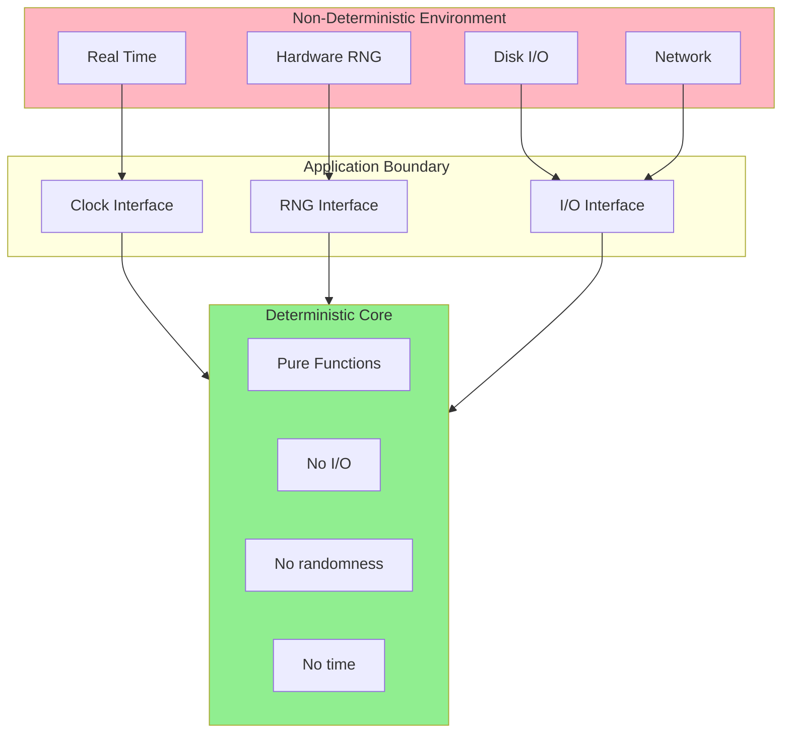

Push non-determinism to the edges of your system. At the center is your deterministic core logic—pure functions with no I/O, no randomness, no time dependencies. This core is wrapped by an application boundary that receives injected dependencies: the clock, the random number generator, I/O handles. Outside the boundary is the non-deterministic environment: real time, hardware RNG, disk.

The core is deterministic and testable. The boundary is thin and injects non-determinism. Tests replace the boundary with controlled implementations.

---

# **CHAPTER 16 — Testing Invariants, Not Implementation**

## The Wound

A hash table implementation with tests:

```cpp
class HashTable {
public:
    void insert(const std::string& key, int value);
    int get(const std::string& key) const;
    void remove(const std::string& key);
    
    // Exposed for testing
    size_t bucket_count() const { return buckets_.size(); }
    size_t bucket_size(size_t i) const { return buckets_[i].size(); }
    
private:
    std::vector<std::list<std::pair<std::string, int>>> buckets_;
};

// Tests
TEST(HashTable, HasCorrectBucketCount) {
    HashTable ht;
    EXPECT_EQ(ht.bucket_count(), 16);  // Implementation detail!
}

TEST(HashTable, UsesChaining) {
    HashTable ht;
    // Insert keys that hash to the same bucket
    ht.insert("a", 1);
    ht.insert("q", 2);  // Assume 'a' and 'q' collide
    EXPECT_EQ(ht.bucket_size(0), 2);  // Implementation detail!
}

TEST(HashTable, ResizesAtLoadFactor) {
    HashTable ht;
    for (int i = 0; i < 13; i++) {  // 13 > 16 * 0.75
        ht.insert(std::to_string(i), i);
    }
    EXPECT_EQ(ht.bucket_count(), 32);  // Implementation detail!
}
```

These tests pass. Then you optimize the hash table—switch from chaining to open addressing, change the initial size, change the load factor. All the tests break. Not because you introduced bugs, but because the tests tested *implementation*, not *behavior*.

You spend a day updating tests. The tests now pass. But do they actually verify anything useful? Or do they just verify that the new implementation does what the new implementation does?

## The Pattern

Tests coupled to implementation:

1. **Break when implementation changes.** Refactoring requires test rewriting.
2. **Don't catch real bugs.** They verify "the code does what the code does."
3. **Discourage improvement.** Developers avoid changes that break tests.
4. **Provide false confidence.** Tests pass, but invariants aren't verified.

## The Solution: Test Invariants and Contracts

Test what the class *promises*, not how it *works*:

```cpp
TEST(HashTable, StoresAndRetrievesValues) {
    HashTable ht;
    ht.insert("key", 42);
    EXPECT_EQ(ht.get("key"), 42);  // Contract: get returns what was inserted
}

TEST(HashTable, OverwritesExistingKeys) {
    HashTable ht;
    ht.insert("key", 1);
    ht.insert("key", 2);
    EXPECT_EQ(ht.get("key"), 2);  // Contract: last insert wins
}

TEST(HashTable, RemovesKeys) {
    HashTable ht;
    ht.insert("key", 42);
    ht.remove("key");
    EXPECT_THROW(ht.get("key"), KeyNotFound);  // Contract: removed keys don't exist
}

TEST(HashTable, HandlesCollisions) {
    HashTable ht;
    // Insert many keys—some will collide regardless of implementation
    for (int i = 0; i < 1000; i++) {
        ht.insert("key" + std::to_string(i), i);
    }
    // Verify all are retrievable
    for (int i = 0; i < 1000; i++) {
        EXPECT_EQ(ht.get("key" + std::to_string(i)), i);
    }
}

TEST(HashTable, MaintainsInvariantsUnderStress) {
    HashTable ht;
    std::mt19937 rng(12345);
    std::set<std::string> expected_keys;
    
    for (int op = 0; op < 10000; op++) {
        if (rng() % 2 == 0 || expected_keys.empty()) {
            // Insert
            std::string key = "key" + std::to_string(rng());
            ht.insert(key, op);
            expected_keys.insert(key);
        } else {
            // Remove random existing key
            auto it = expected_keys.begin();
            std::advance(it, rng() % expected_keys.size());
            ht.remove(*it);
            expected_keys.erase(it);
        }
        
        // Invariant: size matches expected
        EXPECT_EQ(ht.size(), expected_keys.size());
    }
}
```

These tests verify:
- The contract (insert/get/remove behave correctly)
- The invariants (size is consistent)
- The behavior under stress (many operations, collisions)

They don't verify:
- Bucket count
- Chaining vs. open addressing
- Load factor
- Resize threshold

Switch implementations, and the tests still pass—*if the new implementation is correct*.

## What About Performance Tests?

Performance is also an invariant, but requires different testing. See *Designing Performance Invariants* for how to test that your hash table doesn't degrade under sustained churn.

The key insight: test *properties* (lookup doesn't degrade), not *mechanisms* (there are no tombstones). The mechanism is how you achieve the property; the property is what users depend on.

```cpp
// Good: tests the property
TEST(HashTable, LookupDoesNotDegradeUnderChurn) {
    HashTable fresh_table = create_table(1000);
    HashTable aged_table = create_table(1000);
    apply_churn(aged_table, 100000);  // Many insert/remove cycles
    
    double fresh_time = measure_lookups(fresh_table);
    double aged_time = measure_lookups(aged_table);
    
    EXPECT_LT(aged_time / fresh_time, 1.25);
}

// Less good: tests the mechanism
TEST(HashTable, HasNoTombstones) {
    HashTable ht;
    // ... operations ...
    EXPECT_EQ(ht.tombstone_count(), 0);  // Assumes tombstones exist as a concept
}
```

The first test works regardless of whether your implementation uses tombstones, robin hood hashing, or any other technique. The second test assumes a specific implementation.

---

# **PART III — GLOBAL STATE AND SINGLETONS**

Global state exists in every large codebase. The question is not whether to have it, but how to manage it. The mistake engineers make is treating all global state identically—using the same singleton pattern for a CPU topology query as for a memory allocator. These are fundamentally different problems requiring fundamentally different designs.

---

# **CHAPTER 17 — The Taxonomy of Global State**

Before deciding how to manage global state, classify it. Not all global state is created equal.

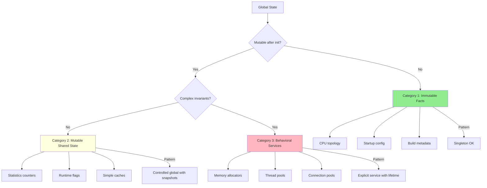

## Category 1: Immutable Facts

**Properties:**
- Loaded or computed once, at startup
- Never modified after initialization
- Represents facts about the environment, not program state
- No test isolation concerns—facts are the same in all tests

**Examples:**
- CPU topology (core count, cache sizes, NUMA layout)
- Startup configuration (loaded from file or command line)
- Physical constants (speed of light, Avogadro's number)
- Build metadata (version string, commit hash, build date)
- License information

**Appropriate pattern:** Singleton with lazy initialization

**Why singleton is correct here:** The data is immutable, so there's no state to corrupt. The data is the same in all contexts, so there's no need for test isolation. Global access is convenient and causes no harm.

## Category 2: Mutable Shared State

**Properties:**
- Mutable—can change during execution
- Shared across the program
- Limited or no complex invariants (counters, flags, simple caches)
- May need test isolation (tests shouldn't see each other's state)

**Examples:**
- Statistics and counters (allocations, cache hits, operations performed)
- Runtime configuration flags (debug mode, verbosity level)
- Diagnostic state (last error, profiling data)
- Simple caches with no correctness requirements

**Appropriate pattern:** Controlled global with snapshot/restore for testing

**Why singleton is problematic here:** The state is mutable, so tests can interfere with each other. The "reset for testing" anti-pattern leads to race conditions and order-dependent test failures. But the state has no complex invariants, so a full service architecture is overkill.

## Category 3: Behavioral Services

**Properties:**
- Complex invariants that must be maintained across operations
- Lifecycle management (startup, use, shutdown)
- Concurrency concerns (thread safety, lock ordering)
- Algorithmic meaning—not just data storage, but behavior

**Examples:**
- Memory allocators and pools
- Thread pools and task schedulers
- Domain decomposition managers
- Caches with coherence requirements
- Connection pools
- Event dispatchers

**Appropriate pattern:** Service with explicit lifetime, passed as dependency

**Why singleton is wrong here:** The state has invariants that must be maintained across operations. The state has a lifecycle that doesn't map to "first access." Testing requires isolated instances with known state. Concurrency requires careful design that a singleton interface hides.

## The Decision Table

| Question | Category 1 | Category 2 | Category 3 |
|----------|-----------|-----------|-----------|
| Mutates after init? | No | Yes | Yes |
| Complex invariants? | No | No | Yes |
| Lifecycle matters? | No | No | Yes |
| Tests need isolation? | No | Sometimes | Yes |
| Concurrency concerns? | No | Maybe | Yes |
| **Appropriate Pattern** | **Singleton** | **Controlled Global** | **Service** |

Most global state problems come from using Category 1 patterns (singleton) for Category 3 problems (behavioral services). A memory allocator is not a fact about the environment—it's a service with complex invariants.

---

# **CHAPTER 18 — Category 1: Immutable Facts**

## When Singleton Is Correct

Singletons have a bad reputation, but that reputation comes from misuse. For truly immutable facts about the environment, a singleton is the right pattern.

Consider CPU topology. The number of cores doesn't change during execution. The cache sizes are fixed. This information is the same whether you're in production or in a test, whether you've run one operation or a million. It's a fact.

```cpp
class CpuTopology {
public:
    static const CpuTopology& instance() {
        static CpuTopology instance;  // Thread-safe in C++11
        return instance;
    }
    
    int physical_cores() const noexcept { return physical_cores_; }
    int logical_cores() const noexcept { return logical_cores_; }
    size_t l1_cache_size() const noexcept { return l1_cache_size_; }
    size_t l2_cache_size() const noexcept { return l2_cache_size_; }
    size_t l3_cache_size() const noexcept { return l3_cache_size_; }
    bool has_avx2() const noexcept { return has_avx2_; }
    bool has_avx512() const noexcept { return has_avx512_; }
    
    // Non-copyable, non-movable
    CpuTopology(const CpuTopology&) = delete;
    CpuTopology& operator=(const CpuTopology&) = delete;
    
private:
    CpuTopology() {
        // Detect once at first access
        physical_cores_ = detect_physical_cores();
        logical_cores_ = detect_logical_cores();
        l1_cache_size_ = detect_l1_cache();
        l2_cache_size_ = detect_l2_cache();
        l3_cache_size_ = detect_l3_cache();
        has_avx2_ = detect_avx2();
        has_avx512_ = detect_avx512();
    }
    
    int physical_cores_;
    int logical_cores_;
    size_t l1_cache_size_;
    size_t l2_cache_size_;
    size_t l3_cache_size_;
    bool has_avx2_;
    bool has_avx512_;
};
```

This singleton is correct because:

1. **Immutable:** All data is set in the constructor and never modified.
2. **Factual:** CPU topology is a fact about the execution environment, not program state.
3. **No test isolation needed:** Tests don't need to mock the CPU—they run on a real CPU.
4. **No lifecycle complexity:** The singleton lives for the program's duration.

## The Immutability Contract

The defining characteristic of Category 1 is **true immutability**. This means:

- All member functions are `const`
- No `mutable` members (except perhaps for thread-safe caching)
- No returning non-const references or pointers to internal state
- **No `reset()` or `set_*()` methods**

The moment you're tempted to add a method that modifies the singleton's state, you no longer have a Category 1 singleton. Reclassify it as Category 2 or Category 3.

## Startup Configuration as Category 1

Configuration loaded at startup is a borderline case. It's mutable during loading, but immutable after:

```cpp
class StartupConfig {
public:
    static const StartupConfig& instance() {
        assert(initialized_);  // Must be initialized before use
        return instance_;
    }
    
    // Called exactly once, at program startup, before any threads
    static void initialize(int argc, char** argv) {
        assert(!initialized_);
        instance_ = StartupConfig(argc, argv);
        initialized_ = true;
    }
    
    int thread_count() const noexcept { return thread_count_; }
    const std::string& data_directory() const noexcept { return data_dir_; }
    LogLevel log_level() const noexcept { return log_level_; }
    
private:
    StartupConfig(int argc, char** argv);  // Parse command line
    
    static StartupConfig instance_;
    static bool initialized_;
    
    int thread_count_;
    std::string data_dir_;
    LogLevel log_level_;
};
```

This is acceptable as Category 1 because:

- `initialize()` is called exactly once, before any concurrent access
- After initialization, the state is truly immutable
- No test needs different configuration values (if they do, this is Category 2)

The key is that initialization is a separate, explicit phase that happens before normal operation begins.

---

# **CHAPTER 19 — Category 2: Mutable Shared State**

## The Middle Ground

Category 2 state is mutable but has no complex invariants. It's too simple to justify a full service architecture, but too mutable for a pure immutable singleton.

The classic example is statistics collection:

```cpp
class RuntimeStats {
public:
    static RuntimeStats& instance() {
        static RuntimeStats stats;
        return stats;
    }
    
    void record_allocation(size_t bytes) {
        total_allocated_.fetch_add(bytes, std::memory_order_relaxed);
        allocation_count_.fetch_add(1, std::memory_order_relaxed);
    }
    
    void record_cache_hit() {
        cache_hits_.fetch_add(1, std::memory_order_relaxed);
    }
    
    void record_cache_miss() {
        cache_misses_.fetch_add(1, std::memory_order_relaxed);
    }
    
    // Accessors
    size_t total_allocated() const { 
        return total_allocated_.load(std::memory_order_relaxed); 
    }
    size_t allocation_count() const {
        return allocation_count_.load(std::memory_order_relaxed);
    }
    double cache_hit_rate() const {
        size_t hits = cache_hits_.load();
        size_t misses = cache_misses_.load();
        return (hits + misses) > 0 
            ? static_cast<double>(hits) / (hits + misses) 
            : 0.0;
    }
    
private:
    RuntimeStats() = default;
    
    std::atomic<size_t> total_allocated_{0};
    std::atomic<size_t> allocation_count_{0};
    std::atomic<size_t> cache_hits_{0};
    std::atomic<size_t> cache_misses_{0};
};
```

The state is mutable (counters change), but there are no complex invariants. The counters don't need to be consistent with each other—they're independent observations.

## Test Isolation via Snapshots

Tests need isolation. A test that allocates 1000 objects shouldn't affect the allocation count seen by the next test. But resetting the global state is dangerous—other code might be using it concurrently.

The solution is snapshots:

```cpp
class RuntimeStats {
public:
    // ... existing code ...
    
    struct Snapshot {
        size_t total_allocated;
        size_t allocation_count;
        size_t cache_hits;
        size_t cache_misses;
    };
    
    Snapshot take_snapshot() const {
        return {
            total_allocated_.load(),
            allocation_count_.load(),
            cache_hits_.load(),
            cache_misses_.load()
        };
    }
    
    void restore_snapshot(const Snapshot& s) {
        total_allocated_.store(s.total_allocated);
        allocation_count_.store(s.allocation_count);
        cache_hits_.store(s.cache_hits);
        cache_misses_.store(s.cache_misses);
    }
};
```

Tests use snapshots for isolation:

```cpp
TEST(Allocator, TracksAllocations) {
    auto& stats = RuntimeStats::instance();
    auto before = stats.take_snapshot();
    
    // Test code that allocates
    void* p = allocator.allocate(1024);
    allocator.deallocate(p, 1024);
    
    // Check delta, not absolute value
    EXPECT_EQ(stats.allocation_count() - before.allocation_count, 1);
    
    // Restore for next test
    stats.restore_snapshot(before);
}
```

Each test sees its own deltas. Tests don't depend on execution order.

## Why Reset Is Wrong

You might think: "Why not just add a `reset()` method?"

```cpp
// DON'T DO THIS
void reset() {
    total_allocated_ = 0;
    allocation_count_ = 0;
    cache_hits_ = 0;
    cache_misses_ = 0;
}
```

Problems with reset:

1. **Race conditions.** Other threads might be recording stats while you reset. You'll lose data or see inconsistent state.

2. **Unclear semantics.** When should reset happen—before the test? After? What about nested test fixtures?

3. **Hidden dependencies.** Tests that call reset depend on being the first to run, or depend on no other test calling reset.

4. **Production contamination.** Reset methods in production code invite accidental misuse.

Snapshots are explicit and composable. Each test documents exactly what state it captures and restores. Reset is a foot-gun.

---

# **CHAPTER 20 — Category 3: Behavioral Services**

## When Singleton Is Wrong

Consider a memory pool—a common optimization in HPC code that reuses allocations to avoid heap overhead:

```cpp
// WRONG: Singleton for a behavioral service
class MemoryPool {
public:
    static MemoryPool& instance() {
        static MemoryPool pool;
        return pool;
    }
    
    void* allocate(size_t size);
    void deallocate(void* ptr, size_t size);
    
private:
    MemoryPool() : arena_(1024 * 1024) {}
    
    Arena arena_;
    std::mutex mutex_;
    FreeList free_lists_[16];
};
```

This looks reasonable—there's one memory pool, accessed globally. But there are deep problems.

**Problem 1: Lifecycle mismatch.**

The pool is constructed on first access. But "first access" might be from a static initializer, which has undefined order. Object A's constructor calls `MemoryPool::instance()`. Object B's constructor also calls it. Which runs first? Depends on link order—undefined behavior.

And the pool is destroyed during static destruction. But other static objects might still be using it. Use-after-free in the destructor.

**Problem 2: Testing is impossible.**

The pool is global. Every test shares it. A test that exhausts the pool breaks subsequent tests. A test that corrupts the free list corrupts all future tests. A test that measures allocation performance sees results polluted by previous tests.

You cannot test pool behavior because you cannot control pool state.

**Problem 3: Invariants can't be defended.**

The pool has invariants: free list pointers are valid, no double-free, all allocations come from the arena. But any code anywhere can call `instance().deallocate()` with a garbage pointer. The pool cannot defend itself—it has no control over who calls it or when.

**Problem 4: Concurrency is hidden.**

The pool must be thread-safe—hence the mutex. But callers don't know this. Is the pool lock-free? Do they need to batch allocations to reduce lock contention? The interface doesn't say, and the singleton pattern encourages callers to ignore the question.

## The Solution: Explicit Service

Category 3 state should be an explicit service with explicit lifetime:

```cpp
class MemoryPool {
public:
    explicit MemoryPool(size_t arena_size);
    ~MemoryPool();
    
    // Non-copyable, non-movable
    MemoryPool(const MemoryPool&) = delete;
    MemoryPool& operator=(const MemoryPool&) = delete;
    
    void* allocate(size_t size);
    void deallocate(void* ptr, size_t size);
    
    // Diagnostics
    size_t bytes_allocated() const;
    size_t bytes_available() const;
    size_t fragmentation_ratio() const;
    
private:
    Arena arena_;
    std::mutex mutex_;
    FreeList free_lists_[16];
};
```

The differences are fundamental:

- **Explicit construction:** You create a `MemoryPool`, deciding when and with what configuration.
- **Explicit ownership:** Something owns the pool and controls its lifetime. The owner ensures it outlives all users.
- **Testable:** Each test creates its own pool with known state.
- **Defensible:** The owner can enforce usage patterns (e.g., pool is always passed by reference, never stored).

## Passing Services to Users

If the pool isn't global, how does code get access to it? Three patterns, in order of preference:

**Pattern A: Direct parameter passing**

```cpp
void process_particles(ParticleData& data, MemoryPool& pool) {
    auto* buffer = pool.allocate(data.count() * sizeof(double));
    // ... compute ...
    pool.deallocate(buffer, data.count() * sizeof(double));
}
```

Simple. Explicit. The function signature documents the dependency. Testing is trivial—pass a test pool.

Use this when the call chain is shallow (2-3 levels) or the service is used in few places.

**Pattern B: Context object**

When multiple services are needed together, group them:

```cpp
struct SimulationContext {
    MemoryPool& memory_pool;
    ThreadPool& thread_pool;
    Logger& logger;
    const SimulationConfig& config;
};

void run_timestep(SimulationState& state, SimulationContext& ctx) {
    auto* temp = ctx.memory_pool.allocate(state.size() * sizeof(double));
    ctx.thread_pool.parallel_for(0, state.size(), [&](size_t i) {
        // ... compute ...
    });
    ctx.memory_pool.deallocate(temp, state.size() * sizeof(double));
}
```

The context groups related services. Functions take one context parameter instead of five service parameters. The context is still explicit—you can see exactly what services a function uses.

**Pattern C: Thread-local context (use sparingly)**

For deeply nested code where parameter passing is impractical:

```cpp
class SimulationContext {
public:
    static SimulationContext& current() {
        assert(current_ != nullptr && "No context set for this thread");
        return *current_;
    }
    
    static void set_current(SimulationContext* ctx) {
        current_ = ctx;
    }
    
    MemoryPool& pool() { return *pool_; }
    ThreadPool& threads() { return *threads_; }
    
private:
    static thread_local SimulationContext* current_;
    MemoryPool* pool_;
    ThreadPool* threads_;
};
```

Usage:

```cpp
void run_simulation() {
    MemoryPool pool(1024 * 1024);
    ThreadPool threads(8);
    SimulationContext ctx(&pool, &threads);
    
    SimulationContext::set_current(&ctx);  // Set for this thread
    
    run_timesteps();  // Deeply nested code can access context
    
    SimulationContext::set_current(nullptr);  // Clear
}

// Deeply nested:
void some_leaf_function() {
    auto& pool = SimulationContext::current().pool();
    // ... use pool ...
}
```

This is a controlled form of global state. The "global" is thread-local, set explicitly at well-defined points, and the set/clear happens in RAII style. Use it only when the parameter-passing cost is genuinely prohibitive.

---

# **CHAPTER 21 — Legacy C Refactoring: The Context Pattern**

## The Situation

You've inherited a 200,000-line scientific simulation written in C, now being migrated to C++. The codebase has 47 global variables:

```c
// simulation_globals.h
extern int g_num_particles;
extern double* g_positions_x;
extern double* g_positions_y;
extern double* g_positions_z;
extern double* g_velocities_x;
extern double* g_velocities_y;
extern double* g_velocities_z;
extern double* g_forces_x;
extern double* g_forces_y;
extern double* g_forces_z;
extern double* g_masses;
extern double g_timestep;
extern double g_cutoff_radius;
extern double g_box_size;
extern int g_iteration;
extern int g_max_iterations;
extern FILE* g_trajectory_file;
extern FILE* g_energy_file;
extern int g_checkpoint_interval;
// ... 28 more ...
```

Functions access globals freely:

```c
void compute_forces(void) {
    for (int i = 0; i < g_num_particles; i++) {
        g_forces_x[i] = 0.0;
        g_forces_y[i] = 0.0;
        g_forces_z[i] = 0.0;
        
        for (int j = 0; j < g_num_particles; j++) {
            if (i == j) continue;
            double dx = g_positions_x[j] - g_positions_x[i];
            // ... compute pairwise forces ...
        }
    }
}

void advance_positions(void) {
    for (int i = 0; i < g_num_particles; i++) {
        g_velocities_x[i] += g_forces_x[i] / g_masses[i] * g_timestep;
        g_positions_x[i] += g_velocities_x[i] * g_timestep;
        // ... y and z ...
    }
    g_iteration++;
}
```

The code works. It has run production simulations for a decade. But:

- **Testing is impossible.** Every test shares the same global state. Tests must run sequentially. A test that corrupts a global breaks all subsequent tests.
- **Multiple simulations impossible.** You can't run two simulations concurrently—there's one set of globals.
- **Dependencies invisible.** Any function might read or write any global. Understanding data flow requires reading every line.
- **Parallelization dangerous.** Which globals are shared? Which need synchronization? Nobody knows.

## The Wrong Refactor

The temptation is to inject dependencies everywhere:

```cpp
// DON'T DO THIS
void compute_forces(
    int num_particles,
    const double* positions_x, const double* positions_y, const double* positions_z,
    double* forces_x, double* forces_y, double* forces_z,
    double cutoff_radius, double box_size
) {
    // ...
}

void advance_positions(
    int num_particles,
    double* positions_x, double* positions_y, double* positions_z,
    double* velocities_x, double* velocities_y, double* velocities_z,
    const double* forces_x, const double* forces_y, const double* forces_z,
    const double* masses, double timestep, int& iteration
) {
    // ...
}
```

Now every function has a dozen parameters. Call sites are unreadable. You've moved complexity from globals to function signatures—the coupling is still there, just more verbose. And you have to modify every function and every call site simultaneously.

This refactor is so painful that teams abandon it halfway, leaving the codebase with inconsistent styles and the worst of both worlds.

## The Right Refactor: Context Struct

The insight is that the 47 globals are not 47 independent values—they're a small number of *conceptual groups*:

```cpp
// Group 1: Particle data (mutable simulation state)
struct ParticleState {
    int count;
    std::vector<double> positions_x, positions_y, positions_z;
    std::vector<double> velocities_x, velocities_y, velocities_z;
    std::vector<double> forces_x, forces_y, forces_z;
    std::vector<double> masses;
};

// Group 2: Simulation parameters (immutable configuration)
struct SimulationParams {
    double timestep;
    double cutoff_radius;
    double box_size;
    int max_iterations;
    int checkpoint_interval;
};

// Group 3: Runtime state (mutable bookkeeping)
struct RuntimeState {
    int iteration;
};

// Group 4: I/O handles (resources)
struct OutputHandles {
    std::unique_ptr<std::ofstream> trajectory;
    std::unique_ptr<std::ofstream> energy;
};

// The unified context
struct SimulationContext {
    ParticleState particles;
    SimulationParams params;
    RuntimeState runtime;
    OutputHandles output;
};
```

Functions take the context:

```cpp
void compute_forces(SimulationContext& ctx) {
    const auto& p = ctx.particles;
    for (int i = 0; i < p.count; i++) {
        p.forces_x[i] = 0.0;
        p.forces_y[i] = 0.0;
        p.forces_z[i] = 0.0;
        
        for (int j = 0; j < p.count; j++) {
            if (i == j) continue;
            double dx = p.positions_x[j] - p.positions_x[i];
            // ... compute pairwise forces using ctx.params.cutoff_radius ...
        }
    }
}

void advance_positions(SimulationContext& ctx) {
    auto& p = ctx.particles;
    for (int i = 0; i < p.count; i++) {
        p.velocities_x[i] += p.forces_x[i] / p.masses[i] * ctx.params.timestep;
        p.positions_x[i] += p.velocities_x[i] * ctx.params.timestep;
    }
    ctx.runtime.iteration++;
}
```

## What This Achieves

**Testability:**

```cpp
TEST(Forces, PairwiseInteraction) {
    SimulationContext ctx;
    ctx.params.cutoff_radius = 2.5;
    ctx.particles.count = 2;
    ctx.particles.positions_x = {0.0, 1.0};
    ctx.particles.positions_y = {0.0, 0.0};
    ctx.particles.positions_z = {0.0, 0.0};
    ctx.particles.masses = {1.0, 1.0};
    ctx.particles.forces_x.resize(2);
    ctx.particles.forces_y.resize(2);
    ctx.particles.forces_z.resize(2);
    
    compute_forces(ctx);
    
    EXPECT_NE(ctx.particles.forces_x[0], 0.0);  // Particles should attract/repel
}
```

Each test creates its own context. Tests are independent. No global state to corrupt.

**Multiple instances:**

```cpp
void run_parameter_sweep() {
    std::vector<SimulationContext> contexts(100);
    // Initialize each with different parameters
    
    #pragma omp parallel for
    for (size_t i = 0; i < contexts.size(); i++) {
        run_simulation(contexts[i]);  // Each has its own state
    }
}
```

**Visible dependencies:**

A function's signature tells you what state it can access. `compute_forces(SimulationContext& ctx)` has access to everything, but we could narrow it:

```cpp
void compute_forces(ParticleState& particles, const SimulationParams& params);
```

Now we know forces computation doesn't touch runtime state or output files.

## The Migration Process

The migration is incremental. You don't have to convert everything at once.

**Step 1: Create the context struct.** Initially, it just holds pointers to the existing globals:

```cpp
struct SimulationContext {
    int* num_particles;      // Points to g_num_particles
    double** positions_x;    // Points to g_positions_x
    // ... etc ...
};

// Global instance that wraps globals
SimulationContext g_context = {
    &g_num_particles,
    &g_positions_x,
    // ...
};
```

**Step 2: Modify functions one at a time.** Start with leaf functions (those that don't call other simulation functions):

```cpp
// Before:
void write_checkpoint(void);

// After:
void write_checkpoint(SimulationContext& ctx);
```

Update call sites to pass `g_context`. The behavior is identical—`g_context` points to the same globals.

**Step 3: Move data into the context.** Once all functions take the context, move actual storage into the context struct and remove globals:

```cpp
struct SimulationContext {
    int num_particles;                    // Actual storage, not pointer
    std::vector<double> positions_x;      // Actual storage
    // ...
};

// Delete: extern int g_num_particles;
// Delete: extern double* g_positions_x;
```

**Step 4: Push context creation to entry points.** Eventually, `main()` creates the context:

```cpp
int main(int argc, char** argv) {
    SimulationContext ctx = initialize_from_config(argc, argv);
    run_simulation(ctx);
    return 0;
}
```

No more global context. Tests create their own contexts. Multiple simulations can run concurrently.

This process takes months for a large codebase. But each step is safe—the code remains functional throughout. And you can stop partway through if priorities change.

---

# **PART IV — CONCURRENCY AND THREAD SAFETY**

Concurrency is where class design gets hard. An interface that's perfectly correct in single-threaded code can be fundamentally broken under concurrency. Data races cause undefined behavior—not just wrong results, but compiler optimizations that make debugging impossible.

This part covers class design for concurrent access. It's not a comprehensive threading tutorial. It's about making classes that survive in a multi-threaded world.

---

# **CHAPTER 22 — Thread Safety Levels**

Thread safety isn't binary. Different classes provide different guarantees, and using a class correctly requires understanding what guarantee it provides.

## The Three Levels

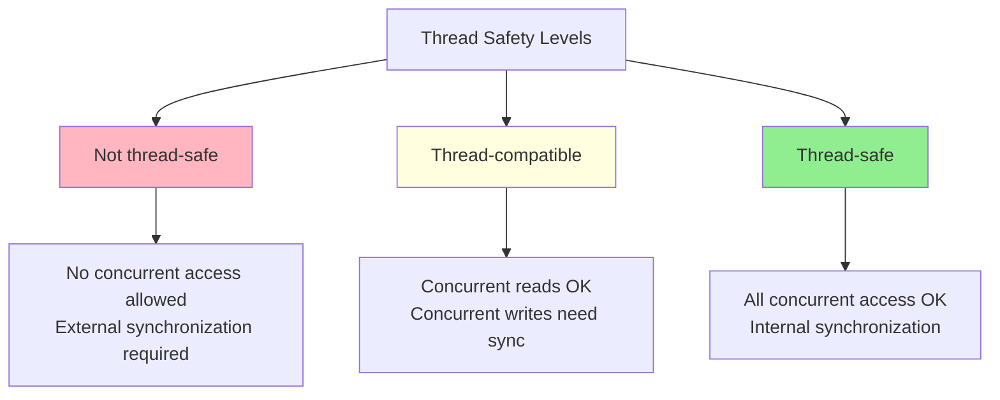

**Not thread-safe:** No concurrent access is allowed. If multiple threads might access the object, you must synchronize externally. Most standard library containers are in this category when mutated.

**Thread-compatible (basic thread safety):** Concurrent reads are safe. Concurrent writes, or reads during writes, require external synchronization. This is the most common level. Standard library containers provide this: you can read from a `std::vector` concurrently, but concurrent modification requires a lock.

**Thread-safe (fully synchronized):** All operations can be called concurrently without external synchronization. The class handles synchronization internally. `std::atomic`, `std::mutex`, and concurrent data structures provide this.

## Why "Thread-Compatible" Is the Default

Making everything fully thread-safe sounds appealing, but it's expensive:

```cpp
class ThreadSafeCounter {
    mutable std::mutex mutex_;
    int value_ = 0;
    
public:
    int get() const {
        std::lock_guard<std::mutex> lock(mutex_);
        return value_;
    }
    
    void increment() {
        std::lock_guard<std::mutex> lock(mutex_);
        ++value_;
    }
};

class Counter {  // Thread-compatible
    int value_ = 0;
    
public:
    int get() const { return value_; }
    void increment() { ++value_; }
};
```

The thread-safe version pays for a mutex on every operation, even when used single-threaded. The thread-compatible version is zero-cost when no synchronization is needed.

The C++ philosophy: don't pay for what you don't use. Most objects don't need concurrent access. Those that do can be wrapped in synchronization at a higher level.

## Documenting Thread Safety

Every class should document its thread safety level. The standard library uses this documentation pattern:

```cpp
/// @brief A simple FIFO queue.
/// 
/// Thread safety: Thread-compatible. Concurrent reads (empty, size, front)
/// are safe. Concurrent modifications require external synchronization.
/// A single writer with concurrent readers requires external synchronization.
template <typename T>
class Queue {
    // ...
};
```

If undocumented, assume "not thread-safe."

---

# **CHAPTER 23 — Designing Thread-Safe Interfaces**

Thread safety isn't just about adding locks. Some interfaces are fundamentally incompatible with thread safety.

## The Time-of-Check-to-Time-of-Use Problem

Consider this interface:

```cpp
class ThreadSafeQueue {
public:
    bool empty() const;
    T& front();
    void pop();
};
```

Even if each method is internally synchronized, this code has a race:

```cpp
if (!queue.empty()) {      // Thread A checks: not empty
    // Thread B: pops the last element
    auto& item = queue.front();  // Thread A: undefined behavior - queue is empty!
    process(item);
    queue.pop();
}
```

The problem is check-then-act: the condition checked by `empty()` can become invalid before `front()` executes.

## Solution: Combined Operations

Design interfaces where the check and the action are atomic:

```cpp
class ThreadSafeQueue {
public:
    std::optional<T> try_pop() {
        std::lock_guard<std::mutex> lock(mutex_);
        if (queue_.empty()) return std::nullopt;
        T item = std::move(queue_.front());
        queue_.pop();
        return item;
    }
    
    bool try_pop(T& result) {
        std::lock_guard<std::mutex> lock(mutex_);
        if (queue_.empty()) return false;
        result = std::move(queue_.front());
        queue_.pop();
        return true;
    }
};
```

Now there's no window between check and action. The lock is held across both.

## The Monitor Pattern

A **monitor** is an object that combines data with synchronization:

```cpp
template <typename T>
class Monitor {
    T data_;
    mutable std::mutex mutex_;
    
public:
    template <typename F>
    auto with_lock(F&& f) const {
        std::lock_guard<std::mutex> lock(mutex_);
        return f(data_);
    }
    
    template <typename F>
    auto with_lock(F&& f) {
        std::lock_guard<std::mutex> lock(mutex_);
        return f(data_);
    }
};

// Usage
Monitor<std::vector<int>> protected_vec;

protected_vec.with_lock([](auto& vec) {
    vec.push_back(42);
    vec.push_back(43);
});  // Lock released here

auto size = protected_vec.with_lock([](const auto& vec) {
    return vec.size();
});
```

The monitor pattern ensures the lock is always acquired correctly. Users can't accidentally access data without holding the lock.

## Returning References Is Dangerous

```cpp
class ThreadSafeBad {
    std::mutex mutex_;
    std::string data_;
    
public:
    std::string& get() {
        std::lock_guard<std::mutex> lock(mutex_);
        return data_;  // Returns reference, lock released!
    }
};
```

The caller receives a reference, but the lock is released when `get()` returns. The reference is now unprotected.

**Solution:** Return by value, or use the monitor pattern.

```cpp
class ThreadSafeGood {
    std::mutex mutex_;
    std::string data_;
    
public:
    std::string get() const {
        std::lock_guard<std::mutex> lock(mutex_);
        return data_;  // Copy while holding lock
    }
    
    void set(std::string value) {
        std::lock_guard<std::mutex> lock(mutex_);
        data_ = std::move(value);
    }
};
```

---

# **CHAPTER 24 — Lock Hierarchies and Deadlock Prevention**

When multiple locks exist, deadlock becomes possible. Two threads each hold one lock and wait for the other.

## The Lock Ordering Rule

If you always acquire locks in the same order, deadlock is impossible:

```cpp
class Account {
    std::mutex mutex_;
    int balance_;
    int id_;  // Unique identifier
    
public:
    static void transfer(Account& from, Account& to, int amount) {
        // Always lock lower ID first
        Account& first = (from.id_ < to.id_) ? from : to;
        Account& second = (from.id_ < to.id_) ? to : from;
        
        std::lock_guard<std::mutex> lock1(first.mutex_);
        std::lock_guard<std::mutex> lock2(second.mutex_);
        
        from.balance_ -= amount;
        to.balance_ += amount;
    }
};
```

The order must be consistent across the entire program. This is fragile—one violation causes intermittent deadlocks.

## std::lock and std::scoped_lock

C++11 provides `std::lock` to acquire multiple locks without deadlock:

```cpp
static void transfer(Account& from, Account& to, int amount) {
    std::lock(from.mutex_, to.mutex_);  // Acquires both, deadlock-free
    std::lock_guard<std::mutex> lock1(from.mutex_, std::adopt_lock);
    std::lock_guard<std::mutex> lock2(to.mutex_, std::adopt_lock);
    
    from.balance_ -= amount;
    to.balance_ += amount;
}
```

C++17 simplifies this with `std::scoped_lock`:

```cpp
static void transfer(Account& from, Account& to, int amount) {
    std::scoped_lock lock(from.mutex_, to.mutex_);  // Deadlock-free
    from.balance_ -= amount;
    to.balance_ += amount;
}
```

`std::scoped_lock` is the preferred way to acquire multiple locks in modern C++.

## Lock Hierarchy by Design

A more robust approach: design your system with a lock hierarchy. Higher-level components lock before lower-level components.

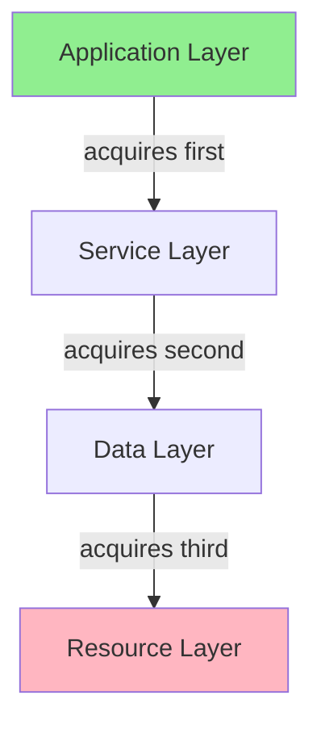

Document the hierarchy. Enforce it with assertions in debug builds:

```cpp
class LockHierarchy {
    static thread_local int current_level_;
    int level_;
    std::mutex mutex_;
    
public:
    explicit LockHierarchy(int level) : level_(level) {}
    
    void lock() {
        assert(level_ < current_level_ && "Lock hierarchy violation");
        mutex_.lock();
        current_level_ = level_;
    }
    
    void unlock() {
        current_level_ = INT_MAX;
        mutex_.unlock();
    }
};
```

---

# **CHAPTER 25 — Atomics and Lock-Free Design**

Sometimes locks are too slow. High-contention scenarios can benefit from lock-free data structures using atomic operations.

## What Atomics Provide

`std::atomic<T>` provides:
- **Atomicity:** Operations complete without interruption
- **Visibility:** Changes become visible to other threads
- **Ordering:** Control over how operations are ordered across threads

```cpp
std::atomic<int> counter{0};

void increment() {
    counter++;  // Atomic increment - no lock needed
}

int get() {
    return counter.load();  // Atomic read
}
```

## When to Use Atomics

Atomics are appropriate for:
- Simple counters and flags
- Single-value publication (writer sets once, readers observe)
- Reference counting
- Simple state machines

Atomics are *not* appropriate for:
- Complex invariants spanning multiple variables
- Operations that need to read-modify-write multiple fields
- Most business logic

## The ABA Problem

Lock-free programming has subtleties. The ABA problem:

```cpp
std::atomic<Node*> head;

void push(Node* new_node) {
    Node* old_head = head.load();
    new_node->next = old_head;
    while (!head.compare_exchange_weak(old_head, new_node)) {
        new_node->next = old_head;
    }
}
```

Problem: Another thread could pop `old_head`, free it, allocate a new node at the same address, and push it. The compare-exchange succeeds (address matches), but the list structure is corrupted.

Solutions involve tagged pointers, hazard pointers, or epoch-based reclamation. These are beyond class design—they're concurrent algorithm design.

## The Advice: Prefer Locks

Lock-free programming is hard to get right. Bugs are subtle and intermittent. Unless you have measured that lock contention is a bottleneck, use locks:

```cpp
// Simple, correct, fast enough
class Counter {
    std::mutex mutex_;
    int64_t value_ = 0;
    
public:
    void increment() {
        std::lock_guard<std::mutex> lock(mutex_);
        ++value_;
    }
    
    int64_t get() const {
        std::lock_guard<std::mutex> lock(mutex_);
        return value_;
    }
};
```

If profiling shows the lock is a bottleneck, *then* consider `std::atomic`:

```cpp
class AtomicCounter {
    std::atomic<int64_t> value_{0};
    
public:
    void increment() { value_.fetch_add(1, std::memory_order_relaxed); }
    int64_t get() const { return value_.load(std::memory_order_relaxed); }
};
```

---

# **CHAPTER 26 — Const and Thread Safety**

In C++11 and later, `const` has a thread-safety implication.

## The Standard Library Contract

The standard library documents that `const` member functions can be called concurrently on the same object. This means `const` functions must not have data races.

```cpp
class ThreadCompatibleWidget {
    std::string name_;
    mutable std::mutex cache_mutex_;
    mutable std::optional<int> cached_hash_;
    
public:
    // Safe to call concurrently - it's const
    const std::string& name() const { return name_; }
    
    // Also const, but modifies cache - must synchronize
    int hash() const {
        std::lock_guard<std::mutex> lock(cache_mutex_);
        if (!cached_hash_) {
            cached_hash_ = compute_hash(name_);
        }
        return *cached_hash_;
    }
};
```

## mutable and Thread Safety

`mutable` members in a thread-compatible class must be protected:

```cpp
class BadCache {
    mutable int cached_value_;  // Data race!
    mutable bool valid_ = false;
    
public:
    int get() const {
        if (!valid_) {
            cached_value_ = compute();  // Two threads can race here
            valid_ = true;
        }
        return cached_value_;
    }
};

class GoodCache {
    mutable std::mutex mutex_;
    mutable std::optional<int> cached_value_;
    
public:
    int get() const {
        std::lock_guard<std::mutex> lock(mutex_);
        if (!cached_value_) {
            cached_value_ = compute();
        }
        return *cached_value_;
    }
};
```

If your `const` method modifies `mutable` state, protect it with synchronization.

## Summary: Concurrency Design Rules

1. **Document thread safety level** for every class
2. **Design interfaces to avoid TOCTOU races** - combine check and action
3. **Return by value, not reference** from thread-safe classes
4. **Use std::scoped_lock** for multiple locks
5. **Protect mutable members** with synchronization in const methods
6. **Prefer locks to atomics** unless profiling shows contention
7. **Test with ThreadSanitizer** - data races are hard to find otherwise

---

# **PART V — PERFORMANCE AS DESIGN**

---

# **CHAPTER 27 — Performance Invariants**

Performance is not an afterthought. It is a design property, like correctness or testability.

The full treatment of performance invariants—what they are, how to design them, how to test them—is in the companion document *Designing Performance Invariants*. This chapter provides a bridge.

## The Core Problem

Benchmarks measure what happened. They don't guarantee what will happen.

You benchmark your hash table. Lookups take 30 nanoseconds. You ship. Six months later, lookups take 200 nanoseconds. No single commit caused the regression—each change was "within noise." But accumulated, the performance has degraded 6×.

This happens because performance was *measured*, not *guaranteed*.

## The Solution: Performance Invariants

A performance invariant is a property of your design that guarantees performance characteristics. It is checkable, testable, and enforced in CI.

**Structural invariant:**
> "There are no tombstones in the hash table."

If this property holds, lookup performance cannot degrade due to tombstone accumulation. The invariant explains *why* performance is stable.

**Behavioral invariant:**
> "Lookup latency after 10M operations is within 25% of lookup latency on a fresh table."

This measures the consequence. If the ratio exceeds 1.25, something is wrong.

## The Pipeline

```
Claim → Invariant → Test → CI Failure
```

- **Claim:** "Our hash table has stable lookup performance."
- **Invariant:** "Occupied slots == logical size (no tombstones)."
- **Test:** White-box test that checks `occupied_slots() == size()` after every erase.
- **CI Failure:** If the test fails, the build fails.

Skip any step and the guarantee evaporates.

## Where to Learn More

*Designing Performance Invariants* covers:

- Why benchmarks are insufficient (Part I)
- How to design structural and behavioral invariants (Part II)
- How to test invariants without flaky tests (Part III)
- Patterns and anti-patterns (Part IV)

The document uses StableHashMap as its primary example, showing how "no tombstones" leads to provably stable performance.

---

# **PART V — WORKED EXAMPLES**

These case studies show class design principles applied to real problems. Each starts with a problem that seems simple, discovers why naive approaches fail, and arrives at a design that embodies the principles from Parts I-III.

---

# **CHAPTER 23 — Case Study: The Dangling Handle Problem (SlotMap)**

## The Problem

You're building an entity-component system for a game engine. Entities are created and destroyed frequently. Other systems hold references to entities:

```cpp
class Entity {
public:
    int id;
    Transform transform;
    Physics physics;
    // ...
};

class EntityManager {
public:
    Entity* create_entity();
    void destroy_entity(Entity* e);
    
private:
    std::vector<std::unique_ptr<Entity>> entities_;
};
```

The physics system holds pointers to entities:

```cpp
class PhysicsSystem {
    std::vector<Entity*> dynamic_bodies_;  // Entities with physics
    
    void update(float dt) {
        for (Entity* e : dynamic_bodies_) {
            e->physics.velocity += e->physics.acceleration * dt;
            e->transform.position += e->physics.velocity * dt;
        }
    }
};
```

When an entity is destroyed, its pointer becomes invalid. But `PhysicsSystem` still holds the pointer. The next `update()` call dereferences a dangling pointer. Crash—or worse, silent corruption.

## Failed Attempt 1: Notify on Destruction

Add a callback system:

```cpp
class EntityManager {
public:
    void destroy_entity(Entity* e) {
        for (auto& callback : destruction_callbacks_) {
            callback(e);
        }
        // Actually delete
    }
    
    void on_entity_destroyed(std::function<void(Entity*)> callback) {
        destruction_callbacks_.push_back(callback);
    }
    
private:
    std::vector<std::function<void(Entity*)>> destruction_callbacks_;
};
```

Problems:
- Every system must register callbacks. Easy to forget.
- Callbacks must search their data structures to remove the pointer. O(n) per destruction.
- Callback ordering is undefined. System A's callback might access System B's data before System B's callback runs.
- Memory overhead of callback storage.

## Failed Attempt 2: Shared Pointers

Use `std::shared_ptr`:

```cpp
class EntityManager {
    std::vector<std::shared_ptr<Entity>> entities_;
    
public:
    std::shared_ptr<Entity> create_entity() {
        entities_.push_back(std::make_shared<Entity>());
        return entities_.back();
    }
};

class PhysicsSystem {
    std::vector<std::shared_ptr<Entity>> dynamic_bodies_;
};
```

Now entities live as long as anyone references them. But:
- **Entities don't die when you want.** `destroy_entity()` removes from `entities_`, but the entity lives on in `PhysicsSystem`. The physics system processes "dead" entities.
- **Ownership is unclear.** Who owns the entity? Everyone? No one?
- **Memory fragmentation.** Shared pointers allocate control blocks. Entities are scattered in memory.
- **Performance overhead.** Reference counting on every copy.

## Failed Attempt 3: Weak Pointers

Use `std::weak_ptr` in systems:

```cpp
class PhysicsSystem {
    std::vector<std::weak_ptr<Entity>> dynamic_bodies_;
    
    void update(float dt) {
        for (auto& weak : dynamic_bodies_) {
            if (auto e = weak.lock()) {
                // Use e
            }
        }
    }
};
```

Better—dead entities are detected. But:
- **Still keeps control blocks alive.** Memory isn't fully reclaimed.
- **Check on every access.** `lock()` is not free.
- **Dead entries accumulate.** `dynamic_bodies_` fills with expired weak pointers. Must periodically clean.
- **Same memory fragmentation.** Still using `shared_ptr` allocation.

## The Insight: Generational Indices

The problem is that raw pointers and indices can't distinguish between "slot 5, first occupant" and "slot 5, third occupant after two deletions."

**Solution:** Pair the slot index with a generation counter. When an entity is destroyed, increment the generation. Old handles become invalid because their generation doesn't match.

```cpp
struct EntityHandle {
    uint32_t index;       // Which slot
    uint32_t generation;  // Which occupant of that slot
};

struct Slot {
    Entity entity;
    uint32_t generation;  // Current generation of this slot
    bool occupied;
};

class SlotMap {
public:
    EntityHandle insert(Entity e) {
        size_t idx = find_free_slot();
        slots_[idx].entity = std::move(e);
        slots_[idx].occupied = true;
        // Generation was incremented when previous occupant was removed
        return {static_cast<uint32_t>(idx), slots_[idx].generation};
    }
    
    Entity* get(EntityHandle h) {
        if (h.index >= slots_.size()) return nullptr;
        Slot& slot = slots_[h.index];
        if (!slot.occupied || slot.generation != h.generation) {
            return nullptr;  // Stale handle
        }
        return &slot.entity;
    }
    
    void remove(EntityHandle h) {
        if (h.index >= slots_.size()) return;
        Slot& slot = slots_[h.index];
        if (!slot.occupied || slot.generation != h.generation) return;
        
        slot.occupied = false;
        slot.generation++;  // Invalidate all existing handles to this slot
        free_list_.push_back(h.index);
    }
    
private:
    std::vector<Slot> slots_;
    std::vector<size_t> free_list_;
};
```

## Why This Works

**Stale handles are detected, not dereferenced:**
```cpp
EntityHandle h = slot_map.insert(entity);
slot_map.remove(h);
EntityHandle h2 = slot_map.insert(other_entity);  // Reuses same slot

Entity* e1 = slot_map.get(h);   // Returns nullptr—generation mismatch
Entity* e2 = slot_map.get(h2);  // Returns valid pointer
```

**No callbacks needed.** Systems don't need to know when entities die. They just check their handles.

**O(1) validity check.** Compare two integers. No pointer chasing.

**Cache-friendly.** Entities are stored contiguously in `slots_`. Iteration is fast.

**No memory fragmentation.** Slots are reused. No per-entity allocation.

## The Design Applied

| Principle | Application |
|-----------|-------------|
| Rule of Zero | `SlotMap` holds a `vector` and a free list—no manual memory management |
| RAII | Entity lifetime is managed by the slot map |
| Explicit over implicit | Handles are distinct types, not raw pointers |
| Make misuse impossible | Can't dereference a handle directly—must call `get()` |
| Return values over side effects | `get()` returns pointer-or-null, doesn't throw |

## FAT-P's SlotMap

The actual `SlotMap` in FAT-P adds:

- **Versioned iteration:** Iterate only over occupied slots, efficiently
- **Type safety:** `SlotMap<Entity>` produces `Handle<Entity>`, not generic handles
- **Compaction:** Optional defragmentation for better cache behavior
- **Exception safety:** Strong guarantee on insert

See `SlotMap.h` for the full implementation.

---

# **CHAPTER 24 — Case Study: Errors Without Exceptions (Expected)**

## The Problem

You're writing a parser for a configuration file format:

```cpp
Config parse_config(const std::string& text);
```

What happens when parsing fails? The text might be malformed, missing required fields, or have type errors. You need to report these errors to the caller.

## Failed Attempt 1: Exceptions

```cpp
Config parse_config(const std::string& text) {
    if (text.empty()) {
        throw ParseError("Empty input");
    }
    // ... parsing ...
    if (missing_required_field) {
        throw ParseError("Missing field: name");
    }
    return config;
}
```

Problems in HPC/embedded contexts:
- **Exceptions are slow on the error path.** Stack unwinding is expensive.
- **Exceptions are unpredictable.** Hard to reason about timing.
- **Many codebases disable exceptions.** `-fno-exceptions` is common.
- **Error information is type-erased.** You catch `ParseError`, but lose context.

Problems in all contexts:
- **Easy to ignore.** Nothing forces the caller to handle the exception.
- **Control flow is hidden.** Any line might throw; you can't see it.
- **Composability is awkward.** Combining multiple fallible operations requires try-catch nesting.

## Failed Attempt 2: Error Codes

```cpp
enum class ParseResult { Ok, EmptyInput, MissingField, InvalidType };

ParseResult parse_config(const std::string& text, Config& out);
```

Problems:
- **Output parameter is awkward.** Must declare `Config` before calling.
- **Output might be partially initialized.** If parsing fails partway, what's in `out`?
- **Easy to ignore.** Nothing forces checking `ParseResult`.
- **Value and error are separate.** Can't return them together cleanly.

## Failed Attempt 3: std::optional

```cpp
std::optional<Config> parse_config(const std::string& text);
```

Better—value and "no value" are unified. But:
- **No error information.** Why did it fail? `nullopt` doesn't say.
- **Caller can't distinguish error types.** Empty input vs. invalid type vs. missing field—all are `nullopt`.

## The Insight: Sum Types

You need a type that holds *either* a value *or* an error, with full type information for both:

```cpp
Expected<Config, ParseError> parse_config(const std::string& text);
```

If parsing succeeds, the `Expected` holds a `Config`. If it fails, it holds a `ParseError`. The caller *must* check which state it's in before accessing either.

## The Design

```cpp
template <typename T, typename E>
class Expected {
public:
    // Construct with value
    Expected(const T& value) : has_value_(true) {
        new (&storage_) T(value);
    }
    Expected(T&& value) : has_value_(true) {
        new (&storage_) T(std::move(value));
    }
    
    // Construct with error
    Expected(const E& error) : has_value_(false) {
        new (&storage_) E(error);
    }
    Expected(E&& error) : has_value_(false) {
        new (&storage_) E(std::move(error));
    }
    
    // Destructor must destroy the right type
    ~Expected() {
        if (has_value_) {
            reinterpret_cast<T*>(&storage_)->~T();
        } else {
            reinterpret_cast<E*>(&storage_)->~E();
        }
    }
    
    // Check state
    bool has_value() const noexcept { return has_value_; }
    explicit operator bool() const noexcept { return has_value_; }
    
    // Access value (precondition: has_value())
    T& value() & {
        if (!has_value_) throw BadExpectedAccess{};
        return *reinterpret_cast<T*>(&storage_);
    }
    const T& value() const& {
        if (!has_value_) throw BadExpectedAccess{};
        return *reinterpret_cast<const T*>(&storage_);
    }
    
    // Access error (precondition: !has_value())
    E& error() & {
        if (has_value_) throw BadExpectedAccess{};
        return *reinterpret_cast<E*>(&storage_);
    }
    
    // Value or default
    T value_or(T default_value) const& {
        return has_value_ ? value() : default_value;
    }
    
private:
    std::aligned_storage_t<
        (sizeof(T) > sizeof(E)) ? sizeof(T) : sizeof(E),
        (alignof(T) > alignof(E)) ? alignof(T) : alignof(E)
    > storage_;
    bool has_value_;
};
```

## Using Expected

**Basic usage:**

```cpp
Expected<Config, ParseError> result = parse_config(text);

if (result) {
    use_config(result.value());
} else {
    log_error(result.error().message());
}
```

**Value or default:**

```cpp
Config config = parse_config(text).value_or(default_config);
```

**Monadic chaining (C++23 style):**

```cpp
Expected<ProcessedConfig, Error> result = 
    parse_config(text)
    .and_then(validate_config)
    .and_then(process_config);
```

Each step only runs if the previous succeeded. Errors propagate automatically.

## Why Expected Is [[nodiscard]]

The type itself is marked `[[nodiscard]]`:

```cpp
template <typename T, typename E>
class [[nodiscard]] Expected { ... };
```

This means:

```cpp
parse_config(text);  // Warning: ignoring return value of [[nodiscard]] type
```

You *cannot* silently ignore the result. The compiler warns if you do.

## The Design Applied

| Principle | Application |
|-----------|-------------|
| Rule of Five | `Expected` manages a union; must handle copy/move/destroy |
| Make misuse harder | `[[nodiscard]]` prevents ignoring results |
| Explicit over implicit | Must check `has_value()` before accessing |
| Return values over side effects | Error returned, not thrown |
| No zombie objects | `Expected` is always in a valid state—either value or error |

## Exception Safety

What if constructing `T` or `E` throws? The implementation must handle this carefully:

```cpp
Expected(const T& value) : has_value_(true) {
    try {
        new (&storage_) T(value);
    } catch (...) {
        has_value_ = false;  // Leave in error state? No—rethrow.
        throw;
    }
}
```

Actually, if the constructor throws, the `Expected` object is never fully constructed. The exception propagates. This is the correct behavior—construction failure means no object.

The tricky case is assignment:

```cpp
Expected& operator=(const Expected& other) {
    if (this == &other) return *this;
    
    // Must destroy current contents first
    if (has_value_) {
        reinterpret_cast<T*>(&storage_)->~T();
    } else {
        reinterpret_cast<E*>(&storage_)->~E();
    }
    
    // Now copy other's contents
    has_value_ = other.has_value_;
    if (has_value_) {
        new (&storage_) T(other.value());  // Might throw!
    } else {
        new (&storage_) E(other.error());
    }
    return *this;
}
```

If the copy constructor throws, we've already destroyed our contents. The object is in an invalid state. This is a bug.

**Fix:** Copy-and-swap idiom, or construct the new value before destroying the old.

## FAT-P's Expected

The actual `Expected` in FAT-P adds:

- **Strong exception safety:** Assignment never leaves the object invalid
- **Monadic operations:** `and_then`, `or_else`, `transform`
- **Reference support:** `Expected<T&, E>` for non-owning results
- **Void support:** `Expected<void, E>` for operations with no return value

See `Expected.h` for the full implementation.

---

# **CHAPTER 25 — Case Study: Transactional State Changes**

## The Problem

You're implementing a container that must maintain invariants during complex operations. Consider `SmallVector`'s growth operation:

```cpp
template <typename T, size_t N>
class SmallVector {
    // Inline storage for small sizes
    alignas(T) char inline_storage_[N * sizeof(T)];
    
    // Heap storage for large sizes
    T* heap_ptr_ = nullptr;
    size_t size_ = 0;
    size_t capacity_ = N;
    
public:
    void push_back(const T& value) {
        if (size_ == capacity_) {
            grow();  // Must maintain invariants even if this throws
        }
        new (data() + size_) T(value);  // Might throw!
        ++size_;
    }
};
```

The `grow()` operation must:
1. Allocate new storage
2. Move elements from old storage to new storage
3. Destroy elements in old storage
4. Deallocate old storage (if heap)
5. Update pointers and capacity

If step 2 throws (moving an element throws), what happens? We've allocated new storage but haven't fully populated it. Old storage still has elements. The object is in an inconsistent state.

## Failed Attempt: Hope It Doesn't Throw

```cpp
void grow() {
    size_t new_cap = capacity_ * 2;
    T* new_storage = static_cast<T*>(::operator new(new_cap * sizeof(T)));
    
    // Move elements (might throw!)
    for (size_t i = 0; i < size_; ++i) {
        new (new_storage + i) T(std::move(data()[i]));
    }
    
    // Destroy old
    for (size_t i = 0; i < size_; ++i) {
        data()[i].~T();
    }
    
    // Update state
    if (heap_ptr_) ::operator delete(heap_ptr_);
    heap_ptr_ = new_storage;
    capacity_ = new_cap;
}
```

If the move constructor throws at element 5:
- Elements 0-4 are in `new_storage` (moved-from state in old storage)
- Elements 5+ are still in old storage
- `new_storage` is allocated but partially initialized
- Memory leak of `new_storage`
- Object state is inconsistent

## The Insight: Transactional Operations with ScopeGuard

Use RAII to ensure cleanup on failure, and only "commit" when everything succeeds:

```cpp
void grow() {
    size_t new_cap = capacity_ * 2;
    T* new_storage = static_cast<T*>(::operator new(new_cap * sizeof(T)));
    
    // Guard: deallocate new_storage if we exit early
    auto storage_guard = make_scope_guard([&] {
        ::operator delete(new_storage);
    });
    
    // Track how many elements we've constructed in new storage
    size_t constructed = 0;
    
    // Guard: destroy constructed elements if we exit early
    auto elements_guard = make_scope_guard([&] {
        for (size_t i = 0; i < constructed; ++i) {
            new_storage[i].~T();
        }
    });
    
    // Move elements
    for (; constructed < size_; ++constructed) {
        new (new_storage + constructed) T(std::move(data()[constructed]));
    }
    
    // Success! Dismiss guards and commit.
    elements_guard.dismiss();
    storage_guard.dismiss();
    
    // Now safe to modify state
    for (size_t i = 0; i < size_; ++i) {
        data()[i].~T();
    }
    if (heap_ptr_) ::operator delete(heap_ptr_);
    
    heap_ptr_ = new_storage;
    capacity_ = new_cap;
}
```

If any move throws:
- `elements_guard` destroys the elements we already moved to `new_storage`
- `storage_guard` deallocates `new_storage`
- The original storage is untouched (elements in moved-from state, but valid)
- No memory leak
- Object state is consistent (though elements are moved-from)

## Stronger Guarantee: Copy, Don't Move

For types with throwing move constructors, copy instead:

```cpp
void grow() {
    size_t new_cap = capacity_ * 2;
    T* new_storage = static_cast<T*>(::operator new(new_cap * sizeof(T)));
    
    auto storage_guard = make_scope_guard([&] {
        ::operator delete(new_storage);
    });
    
    size_t constructed = 0;
    auto elements_guard = make_scope_guard([&] {
        for (size_t i = 0; i < constructed; ++i) {
            new_storage[i].~T();
        }
    });
    
    // Copy (not move) for strong exception safety
    for (; constructed < size_; ++constructed) {
        if constexpr (std::is_nothrow_move_constructible_v<T>) {
            new (new_storage + constructed) T(std::move(data()[constructed]));
        } else {
            new (new_storage + constructed) T(data()[constructed]);  // Copy
        }
    }
    
    elements_guard.dismiss();
    storage_guard.dismiss();
    
    // Destroy old elements
    for (size_t i = 0; i < size_; ++i) {
        data()[i].~T();
    }
    if (heap_ptr_) ::operator delete(heap_ptr_);
    
    heap_ptr_ = new_storage;
    capacity_ = new_cap;
}
```

If copying throws:
- New elements are destroyed and deallocated (guards)
- Old elements are untouched (we copied, didn't move)
- Object is in exactly its original state
- **Strong exception guarantee**

## The Pattern: Two-Phase Commit

```
Phase 1: Prepare
  - Allocate resources
  - Build new state in temporary storage
  - Track what needs cleanup if we fail
  - If anything throws, guards clean up

Phase 2: Commit
  - Dismiss guards
  - Atomically swap to new state
  - Clean up old state (now safe—new state is ready)
```

This pattern appears throughout FAT-P:
- `SmallVector::grow()` uses it for reallocation
- `StableHashMap::rehash()` uses it for table resizing
- `ObjectPool::expand()` uses it for pool growth

## The Design Applied

| Principle | Application |
|-----------|-------------|
| RAII | ScopeGuards ensure cleanup on all exit paths |
| Strong exception safety | Original state preserved if operation fails |
| Make invariants explicit | Guards document what needs cleanup |
| Testable | Can inject throwing allocators to test failure paths |

---

This section walks through the design of `ScopeGuard`, a FAT-P utility class that embodies the principles from Part I. We'll see why simpler approaches fail, what decisions the design requires, and how each rule applies.

---

# **CHAPTER 26 — The Problem ScopeGuard Solves**

## The Scenario

You're writing code that must perform cleanup regardless of how the function exits:

```cpp
void process_file(const std::string& path) {
    FILE* f = fopen(path.c_str(), "r");
    if (!f) throw std::runtime_error("Cannot open file");
    
    // ... process file contents ...
    // ... might throw exceptions ...
    // ... might return early ...
    
    fclose(f);  // Must happen!
}
```

If an exception is thrown during processing, `fclose` never runs. File handle leak.

You could wrap the file in a RAII class (and you should for files). But what about arbitrary cleanup actions?

```cpp
void execute_transaction(Database& db) {
    db.begin_transaction();
    
    // ... execute queries ...
    // ... might throw ...
    // ... might return early ...
    
    if (success) {
        db.commit();
    } else {
        db.rollback();  // Must happen if we didn't commit!
    }
}
```

You don't want to write a RAII wrapper for every possible cleanup action. You want a general mechanism: "When I leave this scope, run this code."

## The Desire

```cpp
void execute_transaction(Database& db) {
    db.begin_transaction();
    
    SCOPE_EXIT { db.rollback(); };  // Run on scope exit, unless dismissed
    
    // ... execute queries ...
    
    if (success) {
        // Dismiss the rollback guard—we're committing instead
        // commit...
    }
    // If we throw or return without dismissing, rollback runs
}
```

This is `ScopeGuard`: a class that holds an arbitrary cleanup action and executes it when destroyed, unless explicitly dismissed.

## Why This Is Harder Than It Looks

A naive implementation:

```cpp
template <typename F>
class NaiveScopeGuard {
public:
    NaiveScopeGuard(F f) : f_(f), active_(true) {}
    ~NaiveScopeGuard() { if (active_) f_(); }
    void dismiss() { active_ = false; }
    
private:
    F f_;
    bool active_;
};
```

This has several problems we'll discover in the next chapter.

---

# **CHAPTER 27 — Failed Attempts**

## Attempt 1: The Naive Implementation

```cpp
template <typename F>
class NaiveScopeGuard {
public:
    NaiveScopeGuard(F f) : f_(f), active_(true) {}
    ~NaiveScopeGuard() { if (active_) f_(); }
    void dismiss() { active_ = false; }
    
private:
    F f_;
    bool active_;
};
```

**Problem 1: Implicit conversion.**

The constructor takes `F` by value. If `F` is `void(*)()`, then any function pointer implicitly converts:

```cpp
void foo();
void bar();

NaiveScopeGuard<void(*)()> guard = foo;  // OK
guard = bar;  // Compiles! Replaces the cleanup action!
```

The guard can be reassigned, changing the cleanup action. This is never intended.

**Fix:** Make the constructor `explicit`. Mark the class non-copyable.

**Problem 2: Copy semantics are wrong.**

What does it mean to copy a `ScopeGuard`? Both copies think they own the cleanup action. Both destructors will run it. Double rollback. Double close. Double free.

**Fix:** Delete copy operations. `ScopeGuard` is move-only.

**Problem 3: Move semantics are tricky.**

If we move a `ScopeGuard`, the source should be dismissed (empty), and the destination should be active. But:

```cpp
NaiveScopeGuard<F> other = std::move(guard);
// Now both guard and other exist
// guard's destructor runs—but guard was moved-from!
```

**Fix:** Move must dismiss the source.

## Attempt 2: Move-Only with Dismissal

```cpp
template <typename F>
class BetterScopeGuard {
public:
    explicit BetterScopeGuard(F f) : f_(std::move(f)), active_(true) {}
    
    ~BetterScopeGuard() { if (active_) f_(); }
    
    BetterScopeGuard(const BetterScopeGuard&) = delete;
    BetterScopeGuard& operator=(const BetterScopeGuard&) = delete;
    
    BetterScopeGuard(BetterScopeGuard&& other) 
        : f_(std::move(other.f_)), active_(other.active_) {
        other.active_ = false;  // Dismiss source
    }
    
    BetterScopeGuard& operator=(BetterScopeGuard&& other) {
        if (this != &other) {
            if (active_) f_();  // Run our cleanup before taking other's
            f_ = std::move(other.f_);
            active_ = other.active_;
            other.active_ = false;
        }
        return *this;
    }
    
    void dismiss() { active_ = false; }
    
private:
    F f_;
    bool active_;
};
```

**Problem 4: Exception in destructor.**

If `f_()` throws, and we're already unwinding due to another exception, `std::terminate` is called. Cleanup actions must not throw.

**Fix:** The destructor should catch exceptions. Or we document that cleanup must be `noexcept`.

**Problem 5: What if `F` is not default-constructible?**

After a move, the source's `f_` might be in a moved-from state. Is that valid? What if `F` is a lambda with captures?

```cpp
auto guard = make_scope_guard([&db] { db.rollback(); });
auto other = std::move(guard);
// guard.f_ is now... what? A lambda in moved-from state.
// guard.~BetterScopeGuard() runs, calls guard.f_()—undefined behavior?
```

**Fix:** Store `F` in a way that handles moved-from state safely. Or use `std::optional<F>`.

## Attempt 3: Using std::optional

```cpp
template <typename F>
class SaferScopeGuard {
public:
    explicit SaferScopeGuard(F f) : f_(std::move(f)) {}
    
    ~SaferScopeGuard() {
        if (f_) {
            try { (*f_)(); }
            catch (...) { /* swallow—we're in a destructor */ }
        }
    }
    
    SaferScopeGuard(const SaferScopeGuard&) = delete;
    SaferScopeGuard& operator=(const SaferScopeGuard&) = delete;
    
    SaferScopeGuard(SaferScopeGuard&& other) noexcept
        : f_(std::move(other.f_)) {
        other.f_.reset();  // Dismiss source
    }
    
    SaferScopeGuard& operator=(SaferScopeGuard&& other) noexcept {
        if (this != &other) {
            if (f_) {
                try { (*f_)(); } catch (...) {}
            }
            f_ = std::move(other.f_);
            other.f_.reset();
        }
        return *this;
    }
    
    void dismiss() { f_.reset(); }
    
private:
    std::optional<F> f_;
};
```

This is getting better, but there's still overhead. `std::optional` adds a boolean, and we're paying for exception handling in destructors.

---

# **CHAPTER 28 — The Design**

After the failed attempts, we have requirements:

1. **Non-copyable.** Copying would cause double execution.
2. **Movable with source dismissal.** Moving transfers ownership.
3. **Exception-safe destructor.** Cleanup should not propagate exceptions.
4. **Efficient storage.** No overhead beyond the callable itself.
5. **Clear dismissal semantics.** Dismissed means "don't run cleanup."
6. **Works with any callable.** Functions, lambdas, function objects.

## The Final Design

```cpp
template <typename F>
class ScopeGuard {
public:
    // Construction: takes ownership of the cleanup action
    explicit ScopeGuard(F&& f) noexcept(std::is_nothrow_move_constructible_v<F>)
        : f_(std::move(f)), active_(true) {}
    
    explicit ScopeGuard(const F& f) noexcept(std::is_nothrow_copy_constructible_v<F>)
        : f_(f), active_(true) {}
    
    // Destruction: execute cleanup if active
    ~ScopeGuard() noexcept {
        if (active_) {
            try { f_(); }
            catch (...) { /* Cannot throw from destructor */ }
        }
    }
    
    // Non-copyable
    ScopeGuard(const ScopeGuard&) = delete;
    ScopeGuard& operator=(const ScopeGuard&) = delete;
    
    // Movable: transfers ownership, dismisses source
    ScopeGuard(ScopeGuard&& other) noexcept(std::is_nothrow_move_constructible_v<F>)
        : f_(std::move(other.f_)), active_(other.active_) {
        other.active_ = false;
    }
    
    ScopeGuard& operator=(ScopeGuard&& other) noexcept {
        if (this != &other) {
            // Execute our current cleanup (if any) before taking the new one
            if (active_) {
                try { f_(); } catch (...) {}
            }
            f_ = std::move(other.f_);
            active_ = other.active_;
            other.active_ = false;
        }
        return *this;
    }
    
    // Dismissal: prevent cleanup from running
    void dismiss() noexcept { active_ = false; }
    
private:
    F f_;
    bool active_;
};

// Factory function for type deduction
template <typename F>
[[nodiscard]] ScopeGuard<std::decay_t<F>> make_scope_guard(F&& f) {
    return ScopeGuard<std::decay_t<F>>(std::forward<F>(f));
}

// Macro for convenient usage
#define SCOPE_EXIT \
    auto SCOPE_GUARD_VAR(__LINE__) = ::fat_p::make_scope_guard
#define SCOPE_GUARD_VAR(line) SCOPE_GUARD_VAR_IMPL(line)
#define SCOPE_GUARD_VAR_IMPL(line) scope_guard_##line
```

---

# **CHAPTER 29 — Why Every Decision Was Made**

## Non-Copyable (Rule of Zero / Rule of Five)

`ScopeGuard` manages a resource: the cleanup action. Copying would create two guards that both execute the same cleanup. This is always wrong.

Decision: Delete copy constructor and copy assignment.

This follows Chapter 1: if you manage a resource, you must handle all five special member functions. Deletion is one way to handle them.

## Movable with Source Dismissal

Moving transfers ownership of the cleanup action. After the move:
- The destination owns the cleanup.
- The source must not execute cleanup.

Decision: Move constructor dismisses the source by setting `active_ = false`.

This is analogous to `std::unique_ptr`'s move: the source becomes null.

## Exception-Safe Destructor (RAII)

Cleanup actions might throw. But throwing from a destructor during stack unwinding calls `std::terminate`. Even outside of unwinding, a throwing destructor is a problem—it breaks RAII guarantees.

Decision: The destructor catches and swallows exceptions.

This is a tradeoff. If cleanup fails, we don't know. But the alternative—`std::terminate`—is worse. Document that cleanup actions should be `noexcept`.

## Explicit Constructor (No Implicit Conversion)

An implicit constructor would allow surprising conversions:

```cpp
void takes_guard(ScopeGuard<std::function<void()>> g);
takes_guard([] { std::cout << "surprise!"; });  // Implicit construction
```

Decision: Mark constructors `explicit`.

This follows Chapter 4: implicit conversions are bugs waiting to happen.

## [[nodiscard]] on Factory Function

If you write:

```cpp
make_scope_guard([] { cleanup(); });  // Oops: immediately destroyed
```

The guard is created, immediately destroyed (running cleanup), and nothing protects your scope. The intent was surely to store the guard.

Decision: Mark `make_scope_guard` as `[[nodiscard]]`.

This follows Chapter 7: if ignoring the return value is always a bug, say so.

## Storage: F Directly, Not std::optional

Using `std::optional<F>` adds overhead: an extra boolean, and the engaged/disengaged check on every access. We already have the `active_` boolean—we don't need another.

Decision: Store `F` directly. Accept that a moved-from `F` might be in an indeterminate state, but `active_ == false` prevents calling it.

This is a performance tradeoff. For a utility that might be used in tight loops, the overhead matters.

---

# **CHAPTER 30 — The Final Implementation**

Here is the production-ready `ScopeGuard` from FAT-P:

```cpp
namespace fat_p {

/// RAII guard that executes a callable on scope exit, unless dismissed.
///
/// ScopeGuard embodies the principles of disciplined class design:
/// - Non-copyable (no double execution)
/// - Movable with clear ownership transfer
/// - Exception-safe destruction (never throws)
/// - [[nodiscard]] factory to prevent accidental immediate destruction
///
/// Usage:
///     auto guard = make_scope_guard([&] { cleanup(); });
///     // ... operations that might throw ...
///     guard.dismiss();  // Cleanup not needed; we succeeded
///
/// Or with the macro:
///     SCOPE_EXIT { cleanup(); };
///
template <typename F>
class ScopeGuard {
public:
    /// Construct from a movable callable
    explicit ScopeGuard(F&& f) noexcept(std::is_nothrow_move_constructible_v<F>)
        : f_(std::move(f)), active_(true) {}
    
    /// Construct from a copyable callable
    explicit ScopeGuard(const F& f) noexcept(std::is_nothrow_copy_constructible_v<F>)
        : f_(f), active_(true) {}
    
    /// Destructor: execute cleanup if still active
    ~ScopeGuard() noexcept {
        execute_if_active();
    }
    
    // Non-copyable
    ScopeGuard(const ScopeGuard&) = delete;
    ScopeGuard& operator=(const ScopeGuard&) = delete;
    
    /// Move constructor: transfers ownership, dismisses source
    ScopeGuard(ScopeGuard&& other) noexcept(std::is_nothrow_move_constructible_v<F>)
        : f_(std::move(other.f_)), active_(other.active_) {
        other.active_ = false;
    }
    
    /// Move assignment: executes current cleanup, takes ownership from source
    ScopeGuard& operator=(ScopeGuard&& other) noexcept(
        std::is_nothrow_move_constructible_v<F> && 
        std::is_nothrow_move_assignable_v<F>) 
    {
        if (this != &other) {
            execute_if_active();
            f_ = std::move(other.f_);
            active_ = other.active_;
            other.active_ = false;
        }
        return *this;
    }
    
    /// Dismiss: prevent cleanup from executing
    void dismiss() noexcept { 
        active_ = false; 
    }
    
    /// Check if cleanup will execute
    bool active() const noexcept { 
        return active_; 
    }
    
private:
    void execute_if_active() noexcept {
        if (active_) {
            try { 
                f_(); 
            } catch (...) {
                // Swallow exceptions in destructor context
                // Consider: logging, std::terminate for critical failures
            }
            active_ = false;
        }
    }
    
    F f_;
    bool active_;
};

/// Factory function with type deduction
/// Marked [[nodiscard]] because discarding the guard is always a bug
template <typename F>
[[nodiscard]] ScopeGuard<std::decay_t<F>> make_scope_guard(F&& f) {
    return ScopeGuard<std::decay_t<F>>(std::forward<F>(f));
}

}  // namespace fat_p

// Convenience macro
#define FAT_P_SCOPE_EXIT \
    auto FAT_P_SCOPE_GUARD_VAR(__LINE__) = ::fat_p::make_scope_guard

#define FAT_P_SCOPE_GUARD_VAR(line) FAT_P_SCOPE_GUARD_VAR_IMPL(line)
#define FAT_P_SCOPE_GUARD_VAR_IMPL(line) fat_p_scope_guard_##line
```

## Using ScopeGuard in Practice

**Transaction rollback:**

```cpp
void execute_transaction(Database& db) {
    db.begin_transaction();
    auto guard = make_scope_guard([&] { db.rollback(); });
    
    db.execute("INSERT INTO users ...");
    db.execute("UPDATE accounts ...");
    
    guard.dismiss();  // All succeeded
    db.commit();
}
// If any exception thrown above, rollback runs automatically
```

**Temporary state restoration:**

```cpp
void process_with_modified_settings(Config& cfg) {
    int old_verbosity = cfg.verbosity();
    cfg.set_verbosity(0);  // Quiet for this operation
    auto guard = make_scope_guard([&] { cfg.set_verbosity(old_verbosity); });
    
    // ... do work ...
    
}  // Verbosity restored whether we return, throw, or fall through
```

**Resource cleanup without custom RAII:**

```cpp
void use_legacy_api() {
    LegacyHandle* h = legacy_open();
    if (!h) throw std::runtime_error("Failed to open");
    auto guard = make_scope_guard([h] { legacy_close(h); });
    
    legacy_process(h);
    // ... more operations ...
    
}  // legacy_close(h) guaranteed
```

---

This completes the ScopeGuard deep-dive. The class is small—about 80 lines of code—but every line reflects a design decision grounded in the principles from Part I.

---

# **APPENDIX A — Quick Reference**

## The Rules at a Glance

### Part I: Core Class Design

| Rule | Summary |
|------|---------|
| **Rule of Zero** | If your class doesn't manage raw resources, don't write special member functions. |
| **Rule of Five** | If you must manage raw resources, write all five special member functions. |
| **RAII** | Acquire resources in constructors, release in destructors. No manual cleanup. |
| **Initialization Lists** | Use initializer lists, not assignment in constructor bodies. |
| **Explicit Constructors** | Mark single-argument constructors `explicit` unless implicit conversion is intended. |
| **Strong Types** | Replace primitive types with domain-specific types to prevent misuse. |
| **Const Correctness** | Mark methods `const` if they don't change logical state. Use `mutable` for caches. |
| **[[nodiscard]]** | Mark return values that must not be ignored. |
| **Composition** | Prefer composition over inheritance for code reuse. |
| **Virtual Destructors** | If a class is used polymorphically, make its destructor virtual. |
| **Member Layout** | Order members by size (largest first) to minimize padding. |

### Part II: Testability

| Rule | Summary |
|------|---------|
| **Cheap Construction** | Constructors should be fast and have no side effects. |
| **Explicit Dependencies** | Pass dependencies as parameters, don't reach into global state. |
| **Return Values** | Prefer returning results over modifying state. |
| **Determinism** | Inject sources of non-determinism (time, randomness) at boundaries. |
| **Test Invariants** | Test what the class promises, not how it's implemented. |

### Part III: Global State

| Category | Pattern | Example |
|----------|---------|---------|
| **Immutable Facts** | Singleton | CPU topology, build info |
| **Mutable Counters** | Controlled global with snapshots | Statistics, diagnostics |
| **Behavioral Services** | Explicit service with lifetime | Memory pools, thread pools |

## Exception Safety Levels

| Level | Guarantee | Description |
|-------|-----------|-------------|
| **No-throw** | `noexcept` | Operation never throws. Destructors, `swap()`, move operations. |
| **Strong** | Commit-or-rollback | If operation throws, state is unchanged. |
| **Basic** | No leaks | If operation throws, invariants hold, no resources leak. |
| **None** | Undefined | If operation throws, state is unknown. **Avoid.** |

## Quick Decisions

### Should I Write Special Member Functions?

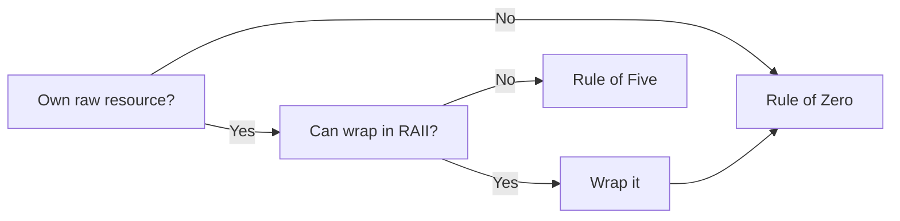

If your class does not own a raw resource, apply the Rule of Zero and write none. If it does own a raw resource, first ask whether you can wrap that resource in a RAII type like `unique_ptr` or `vector`. If you can, do so and then apply the Rule of Zero. Only if you cannot use an existing wrapper should you apply the Rule of Five and write all five special member functions.

### How Should I Handle This Global State?

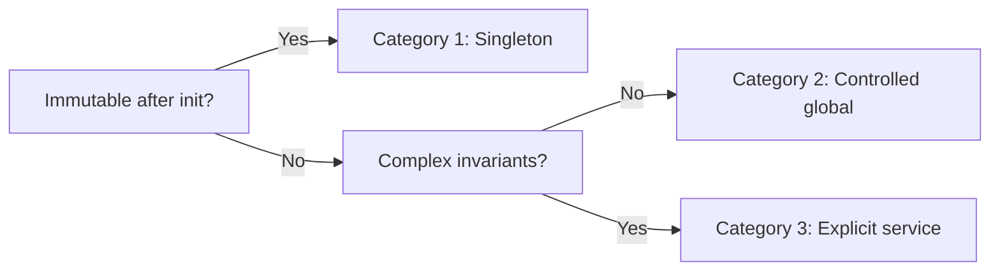

If the state is immutable after initialization, treat it as Category 1 and use a singleton. If the state is mutable but has no complex invariants, treat it as Category 2 and use a controlled global with snapshot/restore for testing. If the state has complex invariants or lifecycle requirements, treat it as Category 3 and use an explicit service with managed lifetime.

### Should I Use Exceptions or Expected?

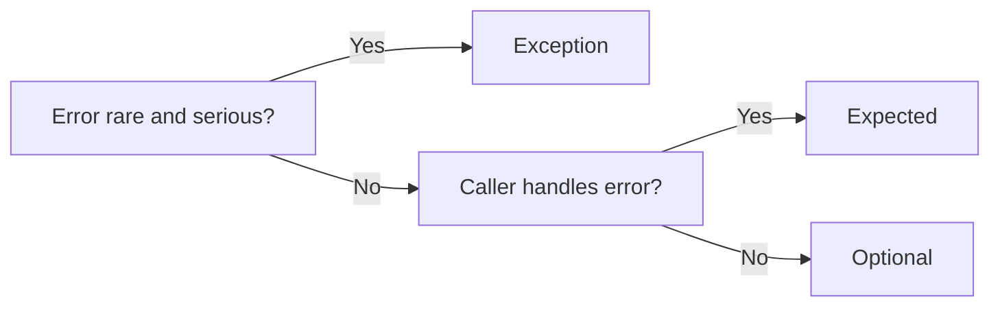

If the error condition is exceptional—rare and serious—use exceptions. If the error is expected and the caller should handle it, return `Expected<T, E>`. If the operation might fail but error details don't matter to the caller, `Optional<T>` may suffice.

---

# **APPENDIX B — When Rules Don't Apply**

Every rule has exceptions. The skill is knowing when you're in an exception, not using exceptions as excuses.

## When to Break the Rule of Zero

**You're implementing a RAII wrapper.** Someone has to manage the raw resource. If you're writing `std::unique_ptr` or `std::vector`, you must write special member functions. But most code should use these wrappers, not create new ones.

**Performance-critical code with custom allocators.** Sometimes you need control over memory layout that standard containers don't provide. But measure first—premature optimization is still the root of all evil.

## When Singletons Are Acceptable

**Truly immutable facts about the environment.** CPU topology, build information, physical constants. These are facts, not state.

**Logging infrastructure.** A logger is usually safe as a singleton because logging is inherently fire-and-forget. But provide a way to inject test loggers.

## When Exceptions Are Appropriate

**Construction failure.** A constructor can't return an error code. If an object can't be constructed validly, throw.

**Violations of invariants.** If a bug causes an impossible state, throw or abort. These aren't recoverable errors—they're bugs.

**Interoperability with exception-using code.** If you're calling a library that throws, you might as well throw too.

## When to Use Global State

**Temporary scaffolding during migration.** When refactoring legacy code, global state as an intermediate step is acceptable. Plan to remove it.

**True singletons.** The system clock, the filesystem, the console. These are inherently global. But wrap them in interfaces for testability.

## When to Skip Testing

**Trivial code.** A one-line getter doesn't need a test. But "trivial" is smaller than you think.

**Generated code.** If the code generator is tested, the output doesn't need separate tests.

**Prototype/experimental code.** Code that will be thrown away doesn't need tests. But be honest about what will be thrown away.

---

# **APPENDIX C — Further Reading**

## Books

**Effective Modern C++ — Scott Meyers**
The definitive guide to C++11/14 best practices. Covers move semantics, smart pointers, lambda expressions, and concurrency. Every C++ programmer should read this.

**C++ Coding Standards — Sutter & Alexandrescu**
101 rules for writing clean, maintainable C++. More focused on style than this document, but complementary.

**The Art of Unit Testing — Roy Osherove**
Not C++-specific, but excellent on test design. Covers what makes tests good, not just how to write them.

**A Philosophy of Software Design — John Ousterhout**
Focuses on complexity management. The "deep modules" concept applies directly to class design.

## Papers and Articles

**The Rule of Zero — R. Martinho Fernandes**
Original articulation of the rule. Available at https://rmf.io/cxx11/rule-of-zero

**Exception Safety in Generic Components — David Abrahams**
Defines the exception safety guarantees (basic, strong, no-throw). Foundational for understanding what "exception-safe" means.

**What Every Programmer Should Know About Memory — Ulrich Drepper**
Deep dive into memory hierarchy effects. Essential for understanding why member layout matters.

## FAT-P Documentation

**Designing Performance Invariants**
Complete treatment of performance as a design property. Referenced throughout this document.

**StableHashMap Companion Guide**
Extended case study of designing a container with performance invariants.

**SmallVector User Manual**
Shows the transactional growth pattern in full detail.

---

# **Summary**

Class design failures are expensive. They cause crashes, leaks, corruption, and maintenance nightmares. But they're also preventable.

The rules in this document aren't arbitrary. Each one addresses a specific failure mode:

| Failure Mode | Rule |
|--------------|------|
| Double-free, use-after-free | Rule of Zero / Rule of Five |
| Resource leaks | RAII |
| Double initialization | Initializer lists |
| Silent type conversions | `explicit` constructors |
| Argument transposition | Strong types |
| Const-correctness erosion | `mutable` for caches |
| Ignored errors | `[[nodiscard]]` |
| Fragile base classes | Composition over inheritance |
| Undefined behavior on delete | Virtual destructors |
| Cache misses | Member layout |
| Untestable code | Cheap construction, explicit dependencies |
| Flaky tests | Determinism, test invariants |
| Initialization order | Singleton taxonomy |
| Test interference | Snapshot/restore |

When you encounter a class design problem, check if it fits one of these patterns. The solution is usually simpler than it seems.

**The meta-rule:** Make invalid states unrepresentable, make errors impossible to ignore, make dependencies explicit, make cleanup automatic.

Code that follows these principles isn't just correct today—it stays correct as the codebase evolves. That's the discipline of class design.

---

*FAT-P Library Documentation — December 2025*
