# Chapter: Multi-Index Design, Stack/Heap/Cache, and Why `SmallVector` Wins

---

## ⚠️ Before You Read Further: The Disaster You May Have Written

If you wrote tensor indexing code that looks like this:

```cpp
class Tensor {
public:
    double& operator()(std::vector<unsigned> idx);  // BY VALUE
};
```

And you're using it like this:

```cpp
Tensor A, B, C;

// Triple nested loop — the bread and butter of tensor ops
for (unsigned i = 0; i < dim0; ++i) {
    for (unsigned j = 0; j < dim1; ++j) {
        for (unsigned k = 0; k < dim2; ++k) {
            C({i, j, k}) = A({i, j, k}) + B({i, j, k});  // So clean! So readable!
        }
    }
}
```

**Stop. This is a performance catastrophe.**

That "clean" code is doing **three heap allocations and three frees per iteration**. For a modest 100×100×100 tensor:

| Metric | Value |
|--------|-------|
| Loop iterations | 1,000,000 |
| Heap operations per iteration | 6 (3 alloc + 3 free) |
| **Total heap operations** | **6,000,000** |
| Overhead at ~11ns each | **~66 milliseconds** |
| Actual math (adds + stores) | ~1-2 milliseconds |

**You're spending 97% of execution time on memory allocation** for an operation that should be memory-bound on the tensor data itself.

---

### The Syntax Is a Lie

The cruelty is that the syntax `C({i, j, k})` *looks* like it should compile to something like `C.data[i*stride0 + j*stride1 + k]` — a few integer multiplies and an add. A handful of cycles. What you'd expect from NumPy or MATLAB under the hood.

Instead, it's a trip through `malloc`, potential cache misses to cold heap memory, and `free`. **For every single element access.**

```cpp
// This LOOKS equivalent to numpy/MATLAB indexing:
C({i, j, k}) = A({i, j, k}) + B({i, j, k});

// Developer thinks: "Ah, nice and Pythonic!"
// Hardware sees: malloc malloc malloc free free free
```

The syntax **invites** the disaster. The `{i, j, k}` initializer list is *most appealing* exactly where `std::vector` is *most catastrophic* — inside nested loops over tensor dimensions.

---

### The Trap in Detail

Here's what the hardware actually does for each `T({i, j, k})` call:

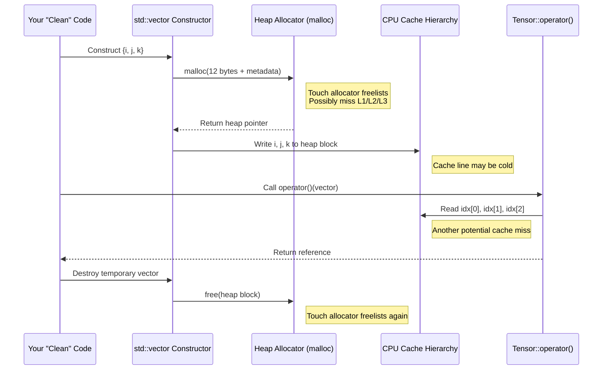

That's the cost for **one** index access. Now multiply by three accesses per loop body, then multiply by one million iterations.

---

### Visualizing the Waste

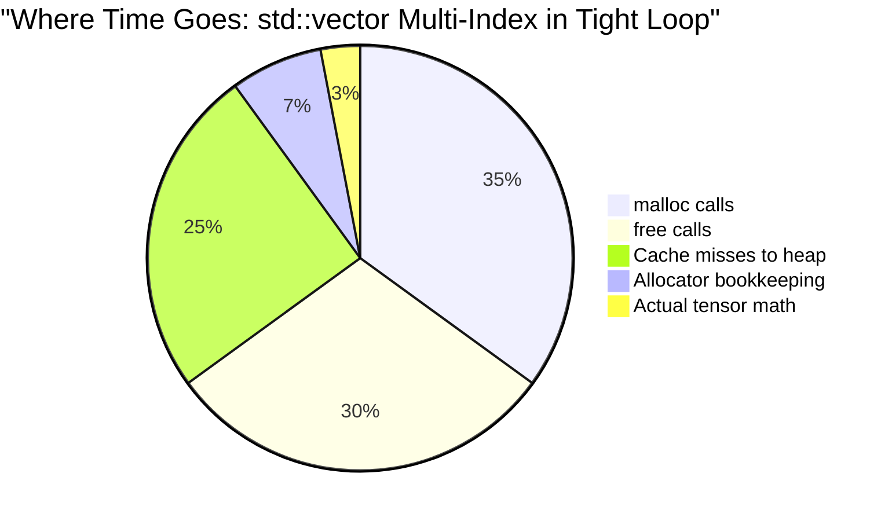

You are paying for a heap-allocated, dynamically-sized, resizable container to hold **three integers that are known at compile time to never exceed six**.

This is like renting a warehouse to store your house keys.

---

### "But Surely I'm Not the First Person to Make This Mistake?"

You're not. You're in excellent company. This mistake is so common that **every major tech company has created their own SmallVector** specifically because they got burned:

| Company/Project | Their SmallVector | Why They Built It |
|-----------------|-------------------|-------------------|
| **LLVM/Clang** | `llvm::SmallVector` | Compiler was allocating millions of tiny vectors for basic block predecessors, instruction operands. The malloc/free overhead was "far more expensive than the code that fiddles around with the elements." |
| **Google** | `absl::InlinedVector` | Used throughout Chromium. Their docs say: "The main use case is small temporary vectors created during the lifetime of a function and then discarded." Sound familiar? |
| **Facebook/Meta** | `folly::small_vector` | "Short-lived stack vectors with few elements, if you want to avoid malloc." |
| **Boost** | `boost::container::small_vector` | Standardization effort ongoing — this pattern is so important it may become part of C++ itself. |
| **Qt** | `QVarLengthArray` | Same idea, different name. |
| **EA (Games)** | `eastl::fixed_vector` | Game developers discovered this problem decades ago when frames started dropping. |

The LLVM project — which compiles *your* code — says this in their official Programmer's Manual:

> "This can be a big win in cases where the malloc/free call is **far more expensive** than the code that fiddles around with the elements. This is good for vectors that are 'usually small' (e.g., the number of predecessors/successors of a block is usually less than 8)."

Sound like tensor indices to you? Three to six elements, created and destroyed millions of times?

---

### The Eigen Disaster: 130× Slowdown

If you work with matrices, you might know the Eigen library. They learned this lesson the hard way too.

A user reported a **130× performance difference** between fixed-size and dynamic-size small matrices:

| Implementation | Time |
|----------------|------|
| C (naive loops) | 10 sec |
| Eigen fixed-size | 1.2 sec |
| Eigen dynamic-size | **163 sec** |

Eigen's solution is compile-time fixed sizes (`Matrix3d` instead of `MatrixXd`). But that only works when you *know* the exact size at compile time.

**`SmallVector` is more flexible.** You don't need to know the exact size — you just need a reasonable upper bound. A 3D tensor uses 3 indices; a 6D tensor uses 6. You don't know *which* at compile time, but you know it's ≤6. That's enough:

```cpp
SmallVector<unsigned, 6> idx;  // Works for 1D, 2D, 3D, 4D, 5D, or 6D
                                // No heap allocation for ANY of them
```

This is strictly better than Eigen's fixed-size approach for indices, because your tensor library can handle variable-dimensionality tensors without sacrificing performance.

---

### Why Does Every Company Rediscover This?

Because `std::vector` is *taught* as the default container. It's in every textbook. It's what you reach for first. And the `{i, j, k}` initializer syntax is *so clean* that it never occurs to you that something pathological is happening underneath.

The C++ committee has been discussing adding a `small_vector` to the standard library for years. Until then, every serious codebase either:

1. Uses one of the above implementations, or
2. Writes their own, or  
3. **Suffers in silence**, wondering why their "optimized" tensor code is slower than Python/NumPy.

(NumPy, by the way, doesn't make this mistake. Its indexing uses stack-allocated tuples internally.)

---

### The Scale of the Problem

Let's return to that triple-nested loop and see how the damage scales with tensor size:

| Tensor Size | Loop Iterations | Heap Operations | Wasted Time |
|-------------|-----------------|-----------------|-------------|
| 10×10×10 | 1,000 | 6,000 | ~66 μs |
| 50×50×50 | 125,000 | 750,000 | ~8 ms |
| 100×100×100 | 1,000,000 | 6,000,000 | **~66 ms** |
| 256×256×256 | 16,777,216 | 100,663,296 | **~1.1 seconds** |

For a 256³ tensor operation that should complete in tens of milliseconds, you're adding **over a second** of pure allocator overhead. This isn't a micro-optimization concern — it's a **design defect**.

---

### "But My Code Isn't That Bad"

Maybe you're not doing a triple-nested loop with three index operations per iteration. Maybe you just have one `T({i, j, k})` call in a moderately hot path. Is that still a problem?

**Yes.**

Even a *single* `std::vector` allocation in a loop that runs a million times costs you ~11 ms of pure waste. That's not catastrophic, but it's not nothing either. And it compounds:

- One index operation in a loop? ~11 ms wasted.
- Called from 10 places? ~110 ms.
- In a library used by multiple applications? The waste multiplies.

The triple-nested-loop example is the *worst case* — where you're visibly spending 97% of your time in the allocator. But the *typical case* — a few index operations scattered across your codebase — is still death by a thousand cuts.

The right mental model is: **every `std::vector<unsigned>{...}` in a hot path is a bug.** Not just the egregious cases. All of them.

---

### The Fix Is Trivial

Replace `std::vector` with `SmallVector`:

```cpp
using MultiIndex = fat_p::SmallVector<unsigned, 6>;

class Tensor {
public:
    double& operator()(const MultiIndex& idx);  // By const-ref, inline storage
    
    // Convenience overload preserves the nice syntax:
    double& operator()(std::initializer_list<unsigned> ilist) {
        MultiIndex idx(ilist);  // NO HEAP ALLOCATION for ≤6 elements
        return (*this)(idx);
    }
};
```

Now the same code:

```cpp
for (unsigned i = 0; i < dim0; ++i) {
    for (unsigned j = 0; j < dim1; ++j) {
        for (unsigned k = 0; k < dim2; ++k) {
            C({i, j, k}) = A({i, j, k}) + B({i, j, k});  // Same syntax!
        }
    }
}
```

**Zero heap allocations.** The indices live on the stack, in the same cache lines as your loop variables. The measured speedup is **5-8×** (see Section 12 for benchmarks).

---

### Why This Chapter Exists

The rest of this chapter explains:

1. **Why** `std::vector` is slow for small collections (memory hierarchy, heap mechanics)
2. **How** `SmallVector` solves this (inline storage, stack allocation)
3. **Proof** that the theory matches reality (measured benchmarks)

But the core message fits in one sentence:

> **`std::vector` by value in a tight loop is one of the worst performance mistakes you can make in C++, and the `{i, j, k}` syntax makes it seductively easy to write.**

Now let's understand *why*.

---

## A Quick Conversation Before We Dive In

**Student:** "Okay, but modern allocators are really fast, right? Like, jemalloc and tcmalloc?"

**Instructor:** Yes, they're amazing. They've reduced malloc overhead from hundreds of nanoseconds to maybe 10-20. But "really fast" for an allocator is still *infinitely slower* than not allocating at all. Zero beats any positive number.

**Student:** "What about compiler optimizations? Can't the compiler see what I'm doing and fix it?"

**Instructor:** Sometimes! If the vector never escapes the function and the compiler is feeling generous, it might elide the allocation. But:
- It's not guaranteed
- It depends on inlining decisions
- It fails if *any* part of the code path is opaque to the optimizer
- You're betting your performance on compiler heroics

`SmallVector` *guarantees* no allocation. You're not hoping; you're *knowing*.

**Student:** "Isn't premature optimization the root of all evil?"

**Instructor:** Knuth's full quote is: "Premature optimization is the root of all evil, *yet we should not pass up our opportunities in that critical 3%.*" Tensor inner loops are definitely in that critical 3%. And using `SmallVector` isn't even optimization — it's *not pessimizing*. You're not making your code faster; you're avoiding making it needlessly slow.

**Student:** "Why doesn't `std::vector` just do this automatically?"

**Instructor:** Great question. `std::vector`'s design guarantees that `data()` always returns a stable pointer, and `swap()` is O(1). These guarantees are incompatible with inline storage. The C++ committee has discussed `small_vector` for standardization, but it's a new container, not a fix to `vector`.

**Student:** "Fine. Show me what's actually happening."

**Instructor:** Gladly. Let's start with how memory really works.

---

## 1. Motivation: Tensor Multi-Index the "Easy" Way

A natural first design for a tensor:

```cpp
class Tensor {
public:
    double operator()(std::vector<unsigned> idx) const;
    // ...
};
```

Usage:

```cpp
Tensor T;

std::vector<unsigned> idx = {i, j, k};
double x = T(idx);

// or, more concise:
double y = T({i, j, k});
```

This is **logically clean**, but **physically hostile** to the hardware.

We'll start from this design, then gradually show:

1. How the hardware actually works (stack, heap, caches).
2. Why `std::vector` for tiny indices is a performance disaster.
3. How `SmallVector<unsigned, N>` fixes it by aligning with cache, stack, and heap realities.

---

## 2. The Memory Hierarchy: Why Your Computer Has So Many Kinds of Memory

### 2.1 The Fundamental Problem: Physics

Here's a fact that drives everything in computer architecture: **electricity travels about 1 foot per nanosecond.**

That sounds fast until you realize what it means. A modern CPU runs at ~3-4 GHz — that's 3-4 billion cycles per second, or about **0.3 nanoseconds per cycle**. In the time it takes to execute one instruction, a signal can travel about 4 inches.

Now look at your computer. The CPU is here. The RAM sticks are over there, several inches away on the motherboard. Even at the speed of light, just *getting* to the RAM and back takes multiple nanoseconds. And real circuits are slower than light — you have to charge capacitors, go through transistor gates, negotiate bus protocols.

This is why memory is organized in layers. The closer memory is to the CPU, the faster it can respond. But close memory is expensive and takes up precious space on the chip. So we have a hierarchy:

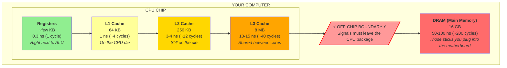

### 2.2 What These Numbers Actually Mean

Let's make this concrete. Say your CPU is running at 3 GHz. One cycle takes about 0.33 nanoseconds.

| Memory Level | Latency | In CPU Cycles | Analogy |
|--------------|---------|---------------|---------|
| Registers | 0.3 ns | 1 cycle | The notepad on your desk |
| L1 Cache | 1 ns | ~4 cycles | The drawer in your desk |
| L2 Cache | 3-4 ns | ~12 cycles | The filing cabinet in your office |
| L3 Cache | 10-15 ns | ~40 cycles | Down the hall in the shared storage room |
| DRAM | 50-100 ns | ~200 cycles | The warehouse across town |
| SSD | 50,000 ns | ~150,000 cycles | A different city |
| Hard Disk | 10,000,000 ns | ~30,000,000 cycles | The moon |

When you "access memory," the CPU tries L1 first. If the data isn't there (a **cache miss**), it tries L2. Then L3. Then finally DRAM. Each miss costs you another trip further down the hierarchy.

Here's the crucial insight: **a single cache miss to DRAM costs as much time as 200 simple arithmetic operations.** If your code causes a lot of cache misses, you can easily spend 90% of your execution time waiting for memory, and only 10% doing actual work.

### 2.3 Registers: The Fastest Memory (That You Mostly Don't Control)

Registers are tiny pieces of memory built directly into the CPU's execution units. On x86-64, you have about 16 general-purpose registers (RAX, RBX, RCX, RDX, RSI, RDI, RSP, RBP, R8-R15), each holding 64 bits.

Accessing a register takes **zero extra time** — the data is already right where the CPU needs it. When you write:

```cpp
int a = 5;
int b = 3;
int c = a + b;
```

A good compiler turns this into something like:

```asm
mov eax, 5      ; Put 5 in register EAX
mov ebx, 3      ; Put 3 in register EBX  
add eax, ebx    ; Add them (result in EAX)
```

No memory access at all. The numbers live in registers, which are basically wires connecting directly to the arithmetic logic unit (ALU).

The compiler decides what goes in registers. You mostly don't control this. But you should know: **the best-case scenario is that your data never leaves registers.** Small local variables in tight loops often achieve this.

### 2.4 Caches: The Memory You Didn't Know You Were Using

Every time your program accesses memory — reading a variable, writing to an array, calling through a function pointer — it doesn't go directly to DRAM. Instead, the CPU checks whether that memory address is already in the cache.

**L1 Cache** is tiny (usually 32-64 KB) but extremely fast. It's split into two parts: L1d for data and L1i for instructions. When you access an address, the hardware checks L1 first. If it's there (a **cache hit**), you get your data in about 4 cycles.

**L2 Cache** is larger (256 KB - 1 MB) and a bit slower (~12 cycles). It backs up L1 — when L1 misses, L2 is the next stop.

**L3 Cache** is larger still (8-32 MB) and shared between all CPU cores. It's the last line of defense before the slow trip to DRAM.

You don't explicitly put things in cache. The hardware does it automatically. When you read address X, the cache hardware:

1. Checks if X is in L1. If yes, return the data.
2. If not, check L2. If yes, copy to L1 and return.
3. If not, check L3. If yes, copy to L2 and L1 and return.
4. If not, fetch from DRAM, copy through the whole hierarchy, return.

This is called the **cache inclusion policy** and it happens invisibly, millions of times per second.

### 2.5 Cachelines: The Quantum of Memory Movement

Here's something crucial: caches don't move one byte at a time. They move **cachelines**, typically **64 bytes** at once.

Why 64 bytes? Because the latency to DRAM is so high that once you pay the cost of going there, you might as well grab a chunk of nearby data. Programs tend to access memory sequentially (arrays, structs, code), so fetching 64 contiguous bytes amortizes the latency cost.

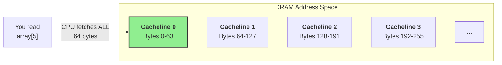

When you read `array[0]`, the CPU fetches the entire 64-byte cacheline containing that element. If `array` contains 4-byte integers, you just got `array[0]` through `array[15]` for free. Reading `array[1]` through `array[15]` will now be L1 hits — essentially free.

But if you read `array[0]`, then `array[1000]`, then `array[2000]` — each access is probably a separate cacheline, so each one pays the full latency cost.

**This is why contiguous data structures are fast:** arrays, vectors with elements packed together, structs where you access all fields. The first access pays the latency; subsequent accesses hit the cache.

**This is why scattered data structures are slow:** linked lists where each node is allocated separately, pointers scattered across the heap. Every pointer chase is potentially a cache miss.

### 2.6 What a Cache Miss Feels Like

Let's put numbers on this. Say you have a loop that processes 1 million elements:

```cpp
for (int i = 0; i < 1'000'000; ++i) {
    sum += data[i];  // Sequential access
}
```

If `data` is an array of 4-byte integers, each cacheline holds 16 elements. You'll have ~62,500 cache misses (one per cacheline), and ~937,500 cache hits. The hits are basically free (~1 ns each). The misses cost ~50 ns each.

Total time: (937,500 × 1 ns) + (62,500 × 50 ns) = 0.9 ms + 3.1 ms = **~4 ms**

Now consider a linked list with nodes scattered across memory:

```cpp
Node* current = head;
while (current != nullptr) {
    sum += current->value;
    current = current->next;  // Pointer chase — probably a cache miss
}
```

If each node is in a different cacheline (worst case), you have 1 million cache misses:

Total time: 1,000,000 × 50 ns = **~50 ms**

Same algorithm. Same data. **12× slower** because of memory layout.

And that's just the pure access time. We haven't even talked about what happens when you're *allocating* memory inside the loop. That's where things get really ugly. Which brings us to the stack and heap.

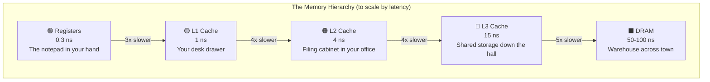

---

## 3. Stack vs Heap: Two Very Different Ways to Get Memory

When your program needs memory for a variable, there are two places it can come from: the **stack** and the **heap**. These aren't just abstract concepts — they're physically different regions of memory with completely different allocation mechanisms.

Understanding the difference is the key to understanding why `std::vector` is slow and `SmallVector` is fast.

### 3.1 The Stack: A Region of Memory with a Very Simple Rule

When your program starts, the operating system gives it a chunk of memory for the stack — typically 1-8 MB. This memory is yours for the duration of the program. No requests needed, no negotiation with an allocator.

The stack has one simple rule: **it grows and shrinks from one end only.**

There's a special CPU register called the **stack pointer** (RSP on x86-64) that points to the "top" of the stack — the boundary between used and unused space.

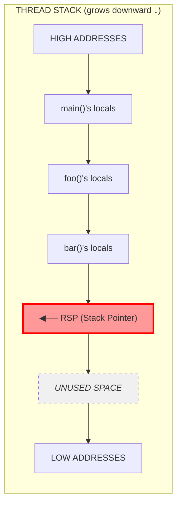

**Allocating on the stack is one CPU instruction.** Literally. When a function needs 32 bytes for local variables, the compiler generates:

```asm
sub rsp, 32    ; Move stack pointer down by 32 bytes
               ; That's it. Those 32 bytes are now "allocated."
```

There's no searching for free space. No bookkeeping. No metadata. Just subtract a number from a register. This takes **less than 1 nanosecond.**

**Deallocating is also one instruction.** When the function returns:

```asm
add rsp, 32    ; Move stack pointer back up
ret            ; Return to caller
```

The memory isn't "freed" in any complex sense — the stack pointer just moves, and that memory is now available for the next function call to use.

### 3.2 What a Stack Frame Actually Contains

When you call a function, the compiler creates a **stack frame** containing:

1. **Return address** — where to go back to when the function ends
2. **Saved registers** — values that need to be preserved across the call
3. **Local variables** — everything you declare inside the function
4. **Spill space** — temporaries the compiler couldn't keep in registers

```cpp
void process_tensor(int dim0, int dim1, int dim2) {
    double total = 0.0;           // 8 bytes on the stack
    int count = 0;                // 4 bytes on the stack
    unsigned indices[6];          // 24 bytes on the stack
    // ... 
}
```

Stack frame layout:

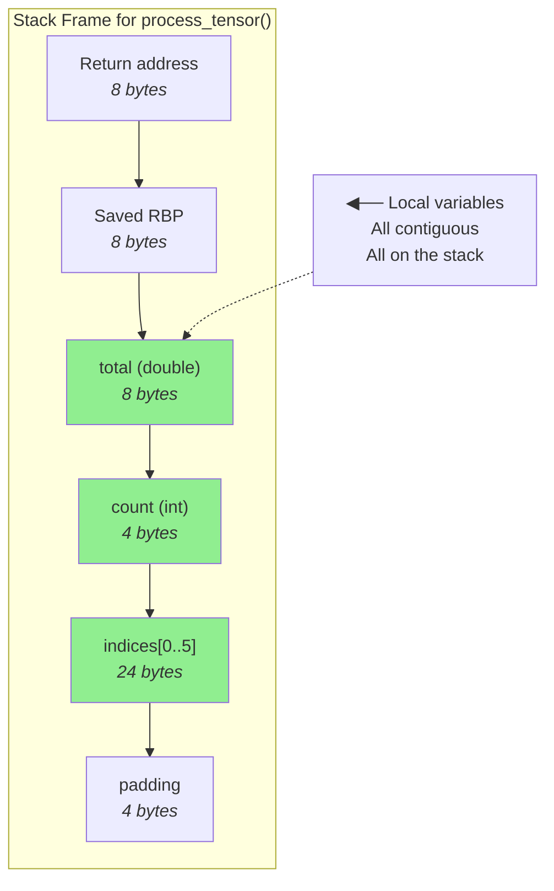

All of this is allocated with a single `sub rsp, 56` instruction. And because you just used the stack for the previous function call, this memory is almost certainly **already in L1 cache**. Accessing your local variables costs ~1 nanosecond.

### 3.3 Why the Stack Is Fast: A Summary

1. **No allocation overhead**: One instruction (`sub rsp, N`) to "allocate," one instruction (`add rsp, N`) to "free."

2. **No metadata**: There's no header before each variable saying "this block is 8 bytes and is in use." The compiler knows all the sizes at compile time.

3. **No searching**: The stack pointer is the allocation pointer. There's no free list to search.

4. **Cache-hot**: The top of the stack is almost always in L1 cache because you just used it.

5. **No fragmentation**: Because allocation and deallocation are strictly LIFO (last in, first out), you can't get holes of free space scattered around.

### 3.4 The Heap: A Pool of Memory with a Complex Manager

The heap is different. It's a region of memory — potentially gigabytes — where you can allocate blocks of any size, in any order, and free them in any order.

This flexibility requires a **memory allocator** — a complex piece of software that manages the heap. When you call `malloc(N)` or `new T`, you're asking the allocator to find N bytes of free space somewhere in the heap and give it to you.

This is not a simple operation.

### 3.5 What malloc() Actually Does

Let's trace through what happens when you call `malloc(12)` to allocate 12 bytes (like three `unsigned` integers for a tensor index):

**Step 1: Add metadata overhead**

The allocator needs to track this allocation — at minimum, it needs to know the size so `free()` knows how much to release. Most allocators store a header before your data:

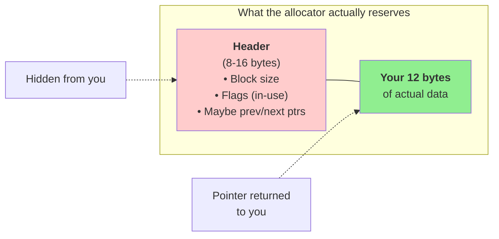

So your 12-byte allocation might actually consume 24-32 bytes. For tiny allocations, **metadata can exceed the actual data.**

**Step 2: Find a free block**

The allocator maintains data structures to track free memory. Common designs include:

- **Free lists**: Linked lists of free blocks, often segregated by size class
- **Bitmaps**: Bit arrays marking which blocks are free
- **Trees**: Red-black trees or other structures for best-fit searching

When you request 12 bytes, the allocator searches these structures for a suitable free block. This might require:

- Walking a linked list (each node potentially a cache miss)
- Comparing sizes
- Possibly searching multiple size classes

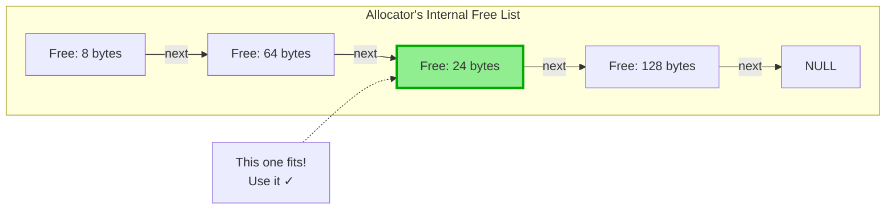

**Step 3: Maybe split the block**

If the allocator finds a 64-byte free block but you only need 24 (12 + header), it might split the block:

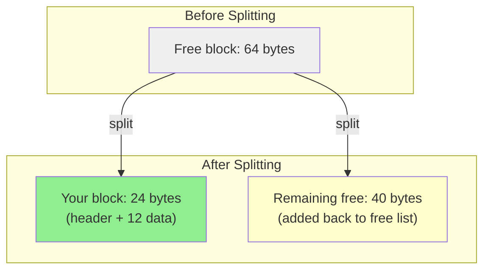

**Step 4: Update bookkeeping**

The allocator removes the block from the free list, updates the header to mark it as in-use, and possibly updates adjacent blocks' metadata.

**Step 5: Return the pointer**

Finally, you get a pointer to your 12 bytes of data.

**Total cost**: Dozens to hundreds of CPU instructions, plus potentially several memory accesses to allocator data structures that may not be in cache. Real-world measurements show `malloc` taking **10-100 nanoseconds** depending on the allocator and conditions.

### 3.6 What free() Actually Does

Deallocation is equally complex:

1. **Find the header**: Back up from your pointer to find the hidden header with the block size.

2. **Mark as free**: Update the header to indicate this block is no longer in use.

3. **Maybe coalesce**: Check if adjacent blocks are also free. If so, merge them into one larger free block to reduce fragmentation.

4. **Add to free list**: Insert this block into the appropriate free list or other tracking structure.

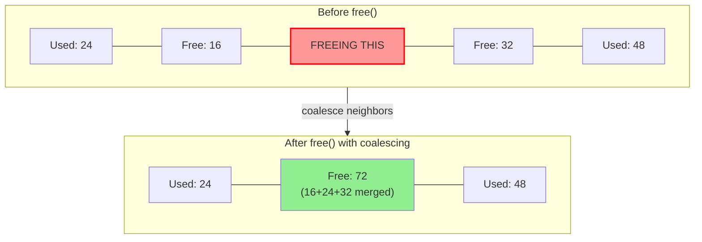

This coalescing is important for preventing fragmentation, but it's more work: reading adjacent headers, updating sizes, relinking free list pointers.

### 3.7 Why the Heap Is Slow: A Summary

1. **Searching**: The allocator must find a suitable free block. This means traversing data structures, comparing sizes, and making decisions.

2. **Metadata overhead**: Every allocation has hidden headers. For tiny allocations, this can double or triple the actual memory used.

3. **Cache misses**: The allocator's internal data structures (free lists, etc.) are scattered across memory and may not be in cache. Each allocation potentially causes cache misses just for the bookkeeping.

4. **Fragmentation**: Over time, the heap becomes a patchwork of used and free blocks. Finding a contiguous chunk of the right size gets harder.

5. **Global state**: The heap is shared by all parts of your program. On multi-threaded programs, allocations may require locks or atomic operations, adding more overhead.

### 3.8 Visualizing the Difference

Let's compare allocating space for three integers:

**Stack allocation:**
```cpp
unsigned i, j, k;  // Three local variables
```

What happens:
```
1. Compiler generates: sub rsp, 12   (or maybe they stay in registers entirely)
2. That's it.
```

Time: **< 1 nanosecond** (often zero — the stack adjustment happens once at function entry)

**Heap allocation:**
```cpp
std::vector<unsigned> idx{i, j, k};  // Three integers in a vector
```

What happens:
```
1. vector constructor calls malloc(12) — or more likely malloc(24+) due to minimum sizes
2. malloc searches free lists for a suitable block
3. malloc finds a block, possibly splits it
4. malloc updates the header, removes from free list
5. malloc returns pointer to vector
6. vector constructor writes i, j, k to the heap block
7. ... you use the data ...
8. vector destructor calls free()
9. free finds the header, marks block as free
10. free checks for coalescing with neighbors
11. free adds block back to free list
```

Time: **10-20 nanoseconds**, plus potential cache misses

**The ratio**: Heap allocation is easily **10-100× slower** than stack allocation for small objects. And this happens **twice** per `std::vector` — once for allocation, once for deallocation.

### 3.9 One More Thing: Where Is the Data?

There's one more penalty we haven't mentioned: where the data ends up.

**Stack data** is at the top of the stack, which you just used. It's almost certainly in L1 cache. Accessing your local variables is fast.

**Heap data** is wherever the allocator found a free block. That might be anywhere in a gigabyte address space. The first access to newly allocated heap memory is likely a cache miss — add another **50-100 nanoseconds** on top of the allocation cost.

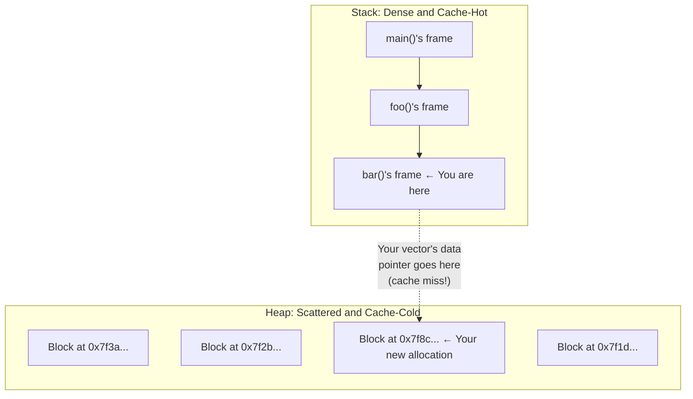

This is the complete picture: `std::vector` pays the allocation cost, the deallocation cost, *and* the cache miss cost — all for three integers that could have lived on the stack for free.

---

## 4. std::vector Multi-Index: What Actually Happens

### 4.1 Call Flow with `std::vector<unsigned>`

Consider:

```cpp
double Tensor::operator()(std::vector<unsigned> idx) const;
double y = T({i, j, k});
```

What the call looks like:

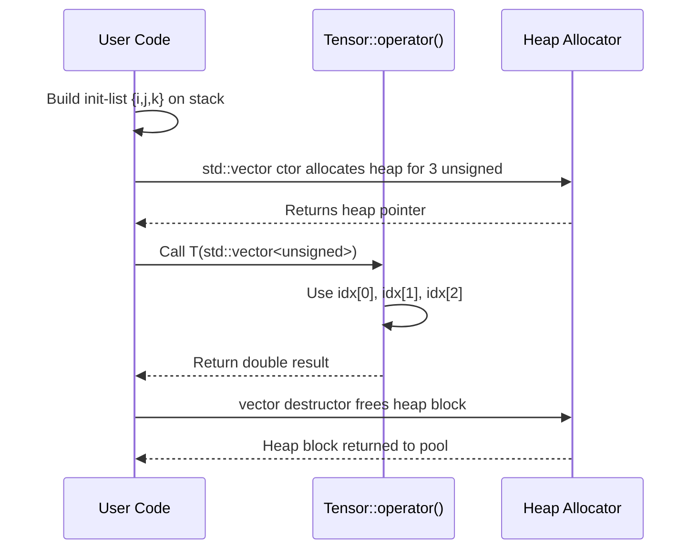

### 4.2 Memory Layout for std::vector Index

In memory, a typical `std::vector<unsigned>` looks like:

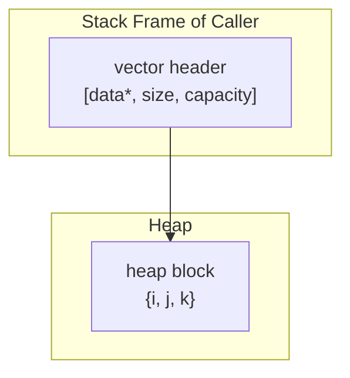

To read `idx[0]`, the CPU must:

1. Load `VHDR` (stack — good).
2. Load `HBLOCK` via the pointer — may be **cold in cache**.
3. Access `HBLOCK[0]`, `HBLOCK[1]`, `HBLOCK[2]` — potentially DRAM.

Each new heap block tends to be **far** from your tensor's data and other hot state.

---

## 5. Why This Design Is Slow (Hardware Perspective)

### 5.1 Cache Miss Path

To access `idx[0]`:

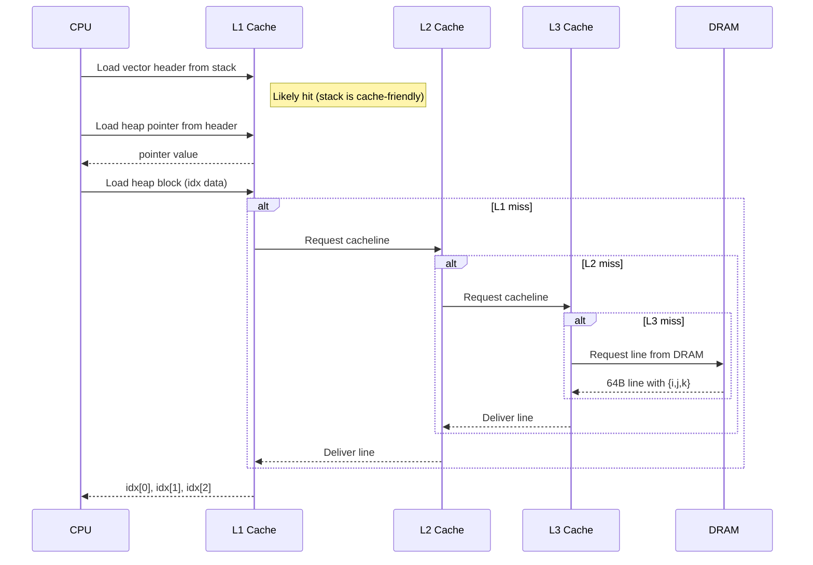

Now add the cost of:

* heap allocation (touching allocator metadata),
* heap free,
* possibly TLB misses/page faults the first time.

For **every call** to `T({i,j,k})`.

### 5.2 Timeline Comparison: Ideal vs vector

```mermaid
gantt
    dateFormat  X
    axisFormat  %L

    section Ideal Index (Stack or Registers)
    "Load i,j,k"          :done, 0,   5
    "Compute tensor addr" :done, 5,   3
    "Do math"             :done, 8,   10

    section std::vector Index
    "Heap alloc"          :crit, 0,   200
    "Load header & ptr"   :done, 200, 20
    "Cache miss to heap"  :crit, 220, 150
    "Load i,j,k"          :done, 370, 10
    "Compute tensor addr" :done, 380, 3
    "Do math"             :done, 383, 10
    "Heap free"           :crit, 393, 150
```

Rough idea: the **math** and index arithmetic are trivial; the heap and cache behavior dominate.

---

## 6. Enter `SmallVector`: Inline Storage as the Fix

### 6.1 Concept: Inline Storage for Small Sizes

`SmallVector<T, N>` behaves like `std::vector<T>`, but:

* For `size <= N`, it stores elements **inline** inside the object.
* Only when `size > N` does it allocate on the heap.

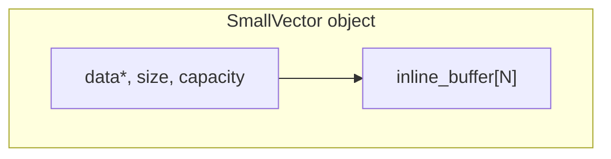

For a multi-index with up to 4 or 6 dimensions, you can choose:

```cpp
using Index = SmallVector<unsigned, 6>;
```

Most tensor indices will have `size <= 6`, so:

* `data_` points into `inline_buffer`.
* `size_` is small.
* No heap allocation.

---

### 6.2 Inline vs Heap Mode

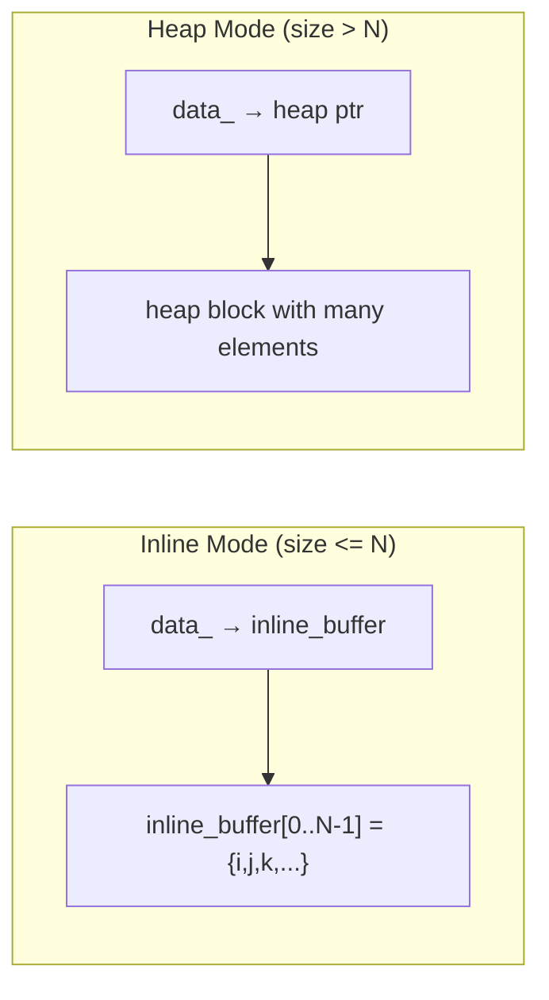

For tensor multi-indices (usually tiny), **inline mode is the common case**. Heap mode is the rare fallback.

---

## 7. Tensor API with SmallVector

### 7.1 Type and Interface

```cpp
using Index = SmallVector<unsigned, 6>;

class Tensor {
public:
    // Main overload:
    double operator()(const Index& idx) const;

    // Convenience overload for initializer_list:
    double operator()(std::initializer_list<unsigned> ilist) const {
        Index idx(ilist);  // usually inline, no heap
        return (*this)(idx);
    }
};
```

### 7.2 Call Flow with SmallVector

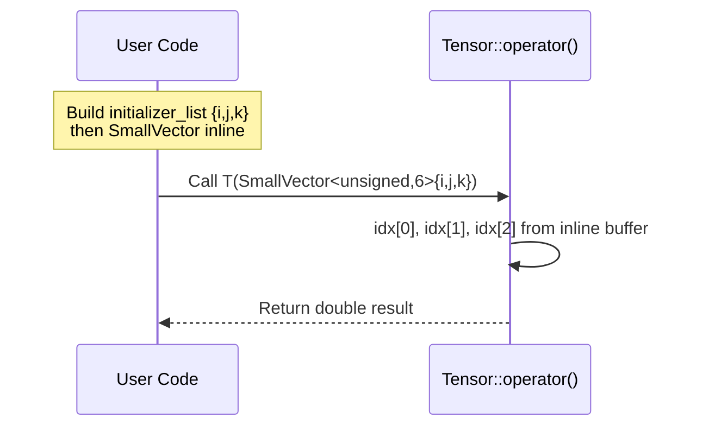

Memory layout:

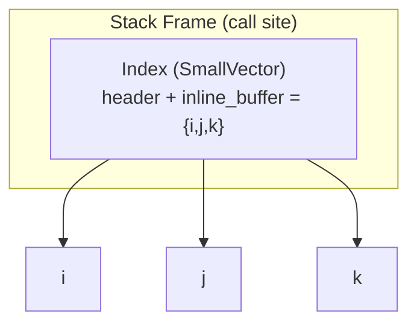

No pointer chasing. No heap. All in the same cacheline or two.

---

## 8. Cache Behavior with SmallVector

### 8.1 Fast Path: Inline Multi-Index

```mermaid
sequenceDiagram
    participant CPU as CPU
    participant L1 as L1 Cache
    participant REG as Registers

    CPU->>L1: Load SmallVector object from stack
    L1-->>CPU: header + inline_buffer
    CPU->>REG: Move idx[0], idx[1], idx[2] into registers
    REG->>REG: Compute tensor offset
    REG->>REG: Perform math
```

Everything stays:

* in L1 (or even registers),
* contiguous,
* predictable.

### 8.2 Inline vs std::vector Side-by-Side

```mermaid
graph LR;
    subgraph "std::vector<unsigned> idx"
        VHDR["Stack: vector header"]
        VHEAP["Heap: {i,j,k}"]
        VHDR --> VHEAP;
    end

    subgraph "SmallVector<unsigned,6> idx"
        SVHDR["Stack: SmallVector header"]
        SVBUF["Stack: inline_buffer = {i,j,k}"]
        SVHDR --> SVBUF;
    end
```

Left side: extra hop + heap.
Right side: single object, contiguous, hot.

---

## 9. Passing SmallVector: Value vs Reference

Because `SmallVector<unsigned,6>` is small and inline, you can safely:

```cpp
double operator()(Index idx) const;              // pass by value
// or
double operator()(const Index& idx) const;       // pass by const-ref
```

### 9.1 Passing by Value

```mermaid
sequenceDiagram
    participant Caller as Caller
    participant Callee as Tensor::operator()

    Caller->>Callee: Copy SmallVector (header + inline_buffer)
    Note right of Callee: Entire index now local to callee<br/>still inline, no heap
```

* Copy is maybe 32–64 bytes.
* Often just a handful of registers or one cacheline.

### 9.2 Passing by Const Reference

```mermaid
sequenceDiagram
    participant Caller as Caller
    participant Callee as Tensor::operator()

    Caller->>Callee: Pass pointer to Index (reference)
    Callee->>Caller: Reads inline_buffer through the ref
```

* Avoids copying bytes.
* Introduces aliasing, but still no heap.

**Key point:**
With SmallVector, the heap vs stack problem is solved either way.
Choosing value vs reference becomes a micro-optimization / API style choice, not a correctness/performance emergency.

---

## 10. Putting It All Together

### 10.1 Conceptual Flow: Bad vs Good

```mermaid
graph TD;
    subgraph "Design A: std::vector<unsigned>"
    A1["User writes T({i,j,k})"] --> A2["Build init-list on stack"]
    A2 --> A3["Construct std::vector (heap alloc)"]
    A3 --> A4["Tensor::operator(vector) reads indices from heap"]
    A4 --> A5["Destroy vector (heap free)"]
    end

    subgraph "Design B: SmallVector<unsigned,6>"
    B1["User writes T({i,j,k})"] --> B2["Build init-list on stack"]
    B2 --> B3["Construct SmallVector inline (no heap)"]
    B3 --> B4["Tensor::operator(Index) reads indices from inline buffer"]
    end
```

### 10.2 Design Rules You Want Developers to Internalize

* **Rule 1:** Tiny fixed-size or small-bounded-size data belongs in registers/stack, not heap.
* **Rule 2:** Every heap allocation in a hot loop is a bug unless you can prove otherwise.
* **Rule 3:** Multi-indices for tensors are almost always tiny — they must not allocate.
* **Rule 4:** `SmallVector` is the right tool when:

  * you want `std::vector`-like ergonomics, but
  * need stack-friendly behavior for common small sizes.

---

## 11. Recommended Tensor Multi-Index Pattern (Final)

```cpp
using MultiIndex = SmallVector<unsigned, 6>;

class Tensor {
public:
    // Core implementation (choose value or const-ref):
    double operator()(const MultiIndex& idx) const;

    // User-friendly interface:
    double operator()(std::initializer_list<unsigned> ilist) const {
        MultiIndex idx(ilist);  // inline, no heap for <= 6 dims
        return (*this)(idx);
    }
};
```

This design:

* avoids heap churn,
* keeps indices in cache (often registers),
* behaves like a good C++ citizen (RAII, value semantics),
* and respects the physical realities of modern CPUs.

---

## 12. Empirical Validation: Benchmark Results

The theory predicts `SmallVector` should dramatically outperform `std::vector` for multi-index operations. This section presents measured results that confirm these predictions.

### 12.1 Test Configuration

| Parameter | Value |
|-----------|-------|
| Compiler | GCC with `-O3 -march=native -DNDEBUG` |
| Standard | C++17 |
| Iterations | 2,000,000 per benchmark |
| Statistical Runs | 10 (mean ± stddev reported) |
| SmallVector Capacity | 6 elements inline |

### 12.2 Summary Results

| Benchmark | std::vector (ns) | SmallVector (ns) | Speedup |
|-----------|------------------|------------------|---------|
| 3D Index Construction | 12.91 ± 0.42 | 1.62 ± 0.20 | **8.0×** |
| Tensor Indexing (8×8×8) | 12.82 ± 0.23 | 2.73 ± 0.11 | **4.7×** |
| 1D Index Construction | 11.62 ± 0.22 | 1.45 ± 0.37 | **8.0×** |
| 6D Index Construction | 13.09 ± 0.31 | 2.41 ± 0.01 | **5.4×** |

### 12.3 Benchmark Descriptions

**Benchmark 1: 3D Multi-Index Construction**

The core operation — construct a 3-element index and sum its contents:

```cpp
// std::vector path
std::vector<unsigned> idx{i, j, k};
sink += idx[0] + idx[1] + idx[2];

// SmallVector path
fat_p::SmallVector<unsigned, 6> idx{i, j, k};
sink += idx[0] + idx[1] + idx[2];
```

The ~11 ns difference represents pure heap allocation overhead.

**Benchmark 2: Pseudo-Tensor Indexing**

Realistic tensor access pattern with an 8×8×8 tensor:

```cpp
double at(const fat_p::SmallVector<unsigned, 6>& idx) const {
    std::size_t offset = (idx[0] * dim1 + idx[1]) * dim2 + idx[2];
    return data[offset];
}
```

The 4.7× speedup (vs 8× for pure construction) reflects that tensor data access cost is constant for both containers.

**Benchmark 3 & 4: Dimension Scaling**

Even 1-element indices pay full heap allocation cost with `std::vector` (~11 ns). At 6 dimensions, SmallVector remains 5.4× faster with remarkably low variance (±0.01 ns).

### 12.4 Where the Time Goes

The ~11 ns overhead for `std::vector` breaks down approximately as:

| Component | Cost |
|-----------|------|
| `malloc` call | ~6-8 ns |
| `free` call | ~4-6 ns |
| Cache miss to heap block | Variable (0-100+ ns) |
| **Total minimum overhead** | **~11 ns** |

For `SmallVector`, construction is essentially free — just writing to already-allocated stack space.

### 12.5 Critical Warning: Debug vs Release Performance

⚠️ **Always benchmark with `-DNDEBUG`**

Without the `NDEBUG` flag, `SmallVector`'s bounds-checking `enforce()` calls add catastrophic overhead:

| Build Mode | SmallVector 3D Index | Apparent Result |
|------------|---------------------|-----------------|
| Debug (no NDEBUG) | 198.50 ns | SmallVector appears **10× slower** |
| Release (-DNDEBUG) | 1.62 ns | SmallVector is **8× faster** |

The `enforce()` macro compiles to a no-op in release builds but performs full bounds checking in debug builds. This is by design — safety in development, speed in production.

**Lesson:** Debug builds are for correctness validation. Performance measurements require release flags.

### 12.6 Putting the Numbers in Context

Remember the tight-loop scenario from the introduction:

```cpp
for (i...) for (j...) for (k...)
    C({i,j,k}) = A({i,j,k}) + B({i,j,k});
```

| Container | Per-Access Cost | 100³ Tensor (3 accesses/iter) | 256³ Tensor |
|-----------|-----------------|-------------------------------|-------------|
| std::vector | ~13 ns | 39 ms | 655 ms |
| SmallVector | ~2.7 ns | 8.1 ms | 136 ms |
| **Savings** | — | **31 ms** | **519 ms** |

The benchmarks confirm: **SmallVector eliminates hundreds of milliseconds of waste** in real tensor operations.

### 12.7 Reproducing the Benchmarks

The benchmark harness is available as `benchmark_MultiIndex.cpp`. To run:

```bash
# Compile with release flags (critical!)
g++ -O3 -march=native -std=c++17 -DNDEBUG \
    -I/path/to/fat_p \
    benchmark_MultiIndex.cpp -o bench_multiindex

# Run
./bench_multiindex
```

---

## 13. Conclusion

### Theory Meets Practice

The benchmarks validate every prediction from the memory hierarchy analysis:

| Principle | Prediction | Measured |
|-----------|------------|----------|
| Heap allocation dominates small-object cost | ~10-15 ns overhead | 11.29 ns measured |
| Inline storage eliminates allocation | Near-zero overhead | 1.62 ns total |
| Cache locality matters | Stack data hits L1 | Consistent low variance |

### The Bottom Line

**`SmallVector` delivers 5-8× performance improvement** over `std::vector` for multi-index operations by:

1. Eliminating heap allocation/deallocation
2. Keeping data in L1 cache (stack locality)
3. Removing pointer indirection

### Design Rules (Validated)

* **Rule 1:** Tiny fixed-size data belongs in registers/stack, not heap. ✓
* **Rule 2:** Every heap allocation in a hot loop is a performance bug. ✓
* **Rule 3:** Multi-indices for tensors must not allocate. ✓
* **Rule 4:** `SmallVector` is the right tool for bounded-size collections. ✓

### Final Warning

If you take nothing else from this chapter, remember:

> **The `{i, j, k}` syntax looks innocent. With `std::vector`, it's a performance trap that costs you 97% of your execution time in tight loops. The syntax is a lie. Use `SmallVector`.**

---

## What To Do Now

**If you're reading this because your tensor code is slow:**

1. Search your codebase for `std::vector<unsigned>` or `std::vector<int>` or `std::vector<size_t>` used as indices
2. Check if they're passed by value to functions called in loops
3. Replace with `SmallVector<T, 6>` or `SmallVector<T, 8>`
4. Rebuild with `-O3 -DNDEBUG` and benchmark

You should see dramatic improvements. If you had a 256³ tensor operation that took 2 seconds, it might now take 0.5 seconds. That's not a micro-optimization; that's the difference between usable and unusable.

**If you're designing a new tensor API:**

Use this pattern from day one:

```cpp
using MultiIndex = SmallVector<unsigned, 6>;

class Tensor {
public:
    double& operator()(const MultiIndex& idx);
    double& operator()(std::initializer_list<unsigned> ilist) {
        return (*this)(MultiIndex(ilist));
    }
};
```

Your users get the clean `T({i, j, k})` syntax they want, and the hardware gets the stack-allocated indices it needs. Everyone wins.

**If you're still skeptical:**

Run the benchmark yourself. The code is in Appendix B. Watch the numbers. Then come back and read this chapter again — it'll make a lot more sense when you've seen the 8× difference with your own eyes.

---

## One Last Thing

You might be wondering: "If this is such a well-known problem, why isn't it taught in school?"

Because most CS curricula focus on algorithmic complexity (Big-O), not constant factors. They'll teach you that bubble sort is O(n²) and quicksort is O(n log n), but they won't mention that a cache-friendly O(n²) algorithm can beat a cache-hostile O(n log n) algorithm for realistic input sizes.

The memory hierarchy — registers, L1, L2, L3, DRAM — is the most important thing about modern computers that isn't in most textbooks. Now you know. Don't forget it.

---

## Appendix A: Raw Benchmark Data

```csv
Benchmark,Container,Dimensions,Mean(ns),StdDev(ns),Min(ns),Max(ns),Speedup
Index Construction,std::vector,3,12.91,0.42,12.53,14.03,1.00
Index Construction,SmallVector,3,1.62,0.20,1.49,2.14,7.96
Tensor Indexing,std::vector,3,12.82,0.23,12.54,13.16,1.00
Tensor Indexing,SmallVector,3,2.73,0.11,2.67,3.05,4.70
Index Construction,std::vector,1,11.62,0.22,11.36,12.02,1.00
Index Construction,SmallVector,1,1.45,0.37,0.96,2.17,7.99
Index Construction,std::vector,6,13.09,0.31,12.80,13.89,1.00
Index Construction,SmallVector,6,2.41,0.01,2.40,2.42,5.43
```

## Appendix B: Benchmark Source Code

See `benchmark_MultiIndex.cpp` for the complete, standalone benchmark harness.
