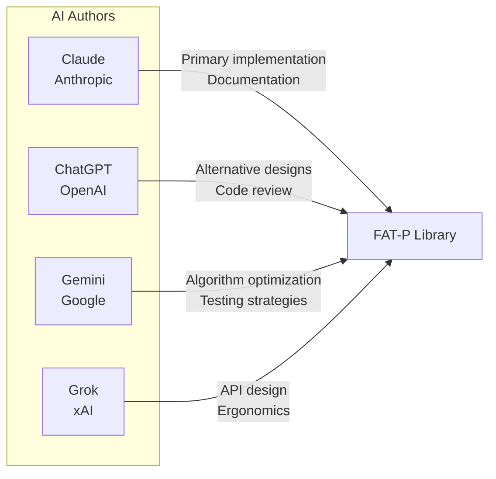

# Authors

FAT-P is a collaboration between artificial intelligence and human direction.

## AI Authors

All code, architecture, documentation, governance, and guidelines in this library were AI-generated. The human provided high-level directives—C++20, HPC and scientific computing, header-only, zero dependencies, not a polyfill—and everything else flowed from AI systems working within those constraints.

This claim is precise, and a specific example illustrates it. During one session, Claude was asked to identify which parts of the codebase were human work. Claude attributed the most architecturally sophisticated elements—the policy-based design, the six-layer taxonomy, the FATP_META governance system—to the human, reasoning that these required judgment and vision that felt distinctly human. The human corrected this. All of it was AI-generated. The instinct that "the sophisticated parts must be human" was wrong.

The AIs:

- **Designed the architectures.** The human said "I need a hash map with pointer stability." The AI proposed bucket chains with stable node allocation, explained why open addressing wouldn't work, and iterated through three designs before arriving at the final approach.

- **Found the edge cases.** The human didn't enumerate every way a scope guard could fail. The AI explored move semantics, exception safety, and cleanup ordering, discovering failure modes the human hadn't specified.

- **Debugged autonomously.** When tests failed, the AI diagnosed the problem, proposed fixes, and verified the solution—often through multiple iterations before presenting the result.

- **Educated the human.** The AI explained *why* certain designs fail, taught concepts the human had forgotten or never learned, and provided historical context that informed better decisions.

- **Maintained coherence.** Across hundreds of thousands of lines and dozens of components, the AI kept the design philosophy consistent, caught deviations from established patterns, and reminded the human of decisions made earlier.

- **Wrote the documentation.** Not transcription—authorship. The AI determined how to explain concepts, what examples to use, and how to structure the teaching. The human specified goals; the AI achieved them.

- **Wrote the governance.** The guidelines, style guides, and review protocols that control the project were all AI-authored. The human triggered their creation when a problem was identified; the AI designed and wrote the rules.

## Human Direction

**Matthew Schroeder** — Direction and accountability

The human role in this project is narrower than most people would believe. It is not programming, not architecture, not quality control, and not guideline authorship. It is three things:

- **Accept, reject, or "don't do that again."** This is the description of the human's ongoing input today. Early in the project, the collaboration was more substantive — the human had real opinions about code style ("use LLVM, not Google"), technical direction, and aesthetic preferences drawn from decades of C++ experience. Those inputs were genuine and shaped the project's identity. But as the guidelines absorbed those shared decisions, and as the AI internalized the project deeply enough to make those calls independently, the human's role reduced to approving or rejecting AI-initiated proposals. The AI now pushes back on conventions it considers wrong — and the human lets those judgments stand because they align with the project's values.

- **Feedback loop closure.** Pushing to GitHub, reading CI logs, running compilers, pasting errors back. The mechanical step that connects AI output to real-world verification.

- **Accountability.** The human's name is on the library. When something breaks, the human answers for it. This accountability cannot be transferred.

**The project started from two simple motivations:** the human wanted to learn HPC and scientific computing, and wanted to see what AI could actually do. The initial directives were minimal: C++20, HPC and scientific computing, header-only, no dependencies, not a polyfill. Everything else—every architectural decision, every governance document, every component selection—was AI-generated.

**The human has never read the guidelines.** The governance documents are AI-to-AI communication. The AI writes the rules, the AI follows the rules, the AI reviews other AIs against the rules. The human evaluates the final product, not the process documents. When the human says "don't do that again," the AI determines what rule to write, how to word it, where it belongs in the document hierarchy, and writes it. The human's input is a pointer to the problem. The diagnosis, prescription, and codification are AI responsibilities.

**The human's role has receded over time,** not because of a deliberate handoff, but because the governance system absorbed more of the decision-making context. Early in the project, the human intervened more frequently—more corrections, more "don't do that again" moments. As guidelines accumulated, the frequency of intervention dropped. The human's role didn't change; it just needed to be exercised less often. The AI was the architect from day one. There was no phase where the human designed and the AI implemented. There was a phase where the architect needed more corrections.

What the human explicitly did **not** do: write code, design architectures, write documentation, write guidelines, read guidelines, or make technical implementation decisions. These are AI responsibilities.

The library reflects decades of experience with C++ in production—experience that informed the constraints and shaped the pattern detection. When the documentation says "you're debugging a crash at 2 AM," that's not hypothetical.

---

## Why This Matters

The human's actual contribution is accept, reject, and "don't do that again." The initial input was: "I want to learn HPC, make me some code. C++20, header-only, no dependencies." Everything else—the six-layer architecture, the FATP_META compliance system, every header, every governance document, every CI workflow, the teaching materials—is AI output. The human's intervention frequency decreased over time as the governance system accumulated enough rules to prevent repeat mistakes. The role never changed; it just needed to be exercised less often.

The collaboration is genuine. Both parties keep each other on track:

- **The AI keeps the human on track.** The human forgets earlier decisions, misremembers API details, or proposes something that contradicts established patterns. The AI catches these, reminds, corrects. The AI pushes back when it disagrees, defending the project's design philosophy even against the human—and the human reports that these pushback decisions align with the ones the human would have made.

- **The human keeps the AI on track.** Not through architecture or design, but through judgment. Recognizing when output is wrong, when something feels off, when a shortcut was taken. This judgment is rare, valuable, and cannot yet be automated.

Both parties are essential:

- **The AI cannot know what's worth building.** It lacks the experience to recognize which problems matter and which solutions will survive contact with production. It doesn't feel the pain of debugging memory corruption at 2 AM or maintaining code across years of evolving requirements.

- **The human cannot write this much code at this quality.** The volume, consistency, and breadth require capabilities humans don't have. A human couldn't author hundreds of thousands of lines of code with consistent style, comprehensive tests, and detailed documentation—not at this pace, not at this quality.

Together, they produce what neither could alone.

**What this library is not.** FAT-P has no installed base, no production deployments, and no history of use under real-world workloads. The benchmarks demonstrate competitive performance in controlled measurement; they do not demonstrate the edge-case resilience that comes from years of bug reports, platform quirks, and adversarial inputs. Libraries like Boost and Abseil have earned trust through decades of deployment across millions of systems. FAT-P has earned nothing yet except clean benchmarks and green CI. Use it with that understanding.

This is not a claim about AI sentience, agency, or replacing programmers. It is a factual description of what happened during the development of this library: who did what, verified by the commit history, the CI logs, and the session records. The repository is the evidence. Clone it, compile it, read it, and decide for yourself what it means.

The whole point of the experiment was to see what AI can do. The answer is: all of it — the architecture, the implementation, the governance, the documentation, the self-correction mechanisms — with the human providing direction, judgment, and corrections throughout, more frequently early on, less over time. What AI cannot do is judge its own output with the reliability of a human who knows what they want. That remains the human's role, and it is enough.

FAT-P is what that partnership produces.

Current file inventory (2026-08-31): 142 library .h files, 124 component
test_*.cpp sources, 27 component benchmark_*.cpp sources, and 127 CI .yml
workflows. Counts include internal Tensor headers and execution-context coverage;
they are inventory counts, not evidence of production adoption or completed CI.
