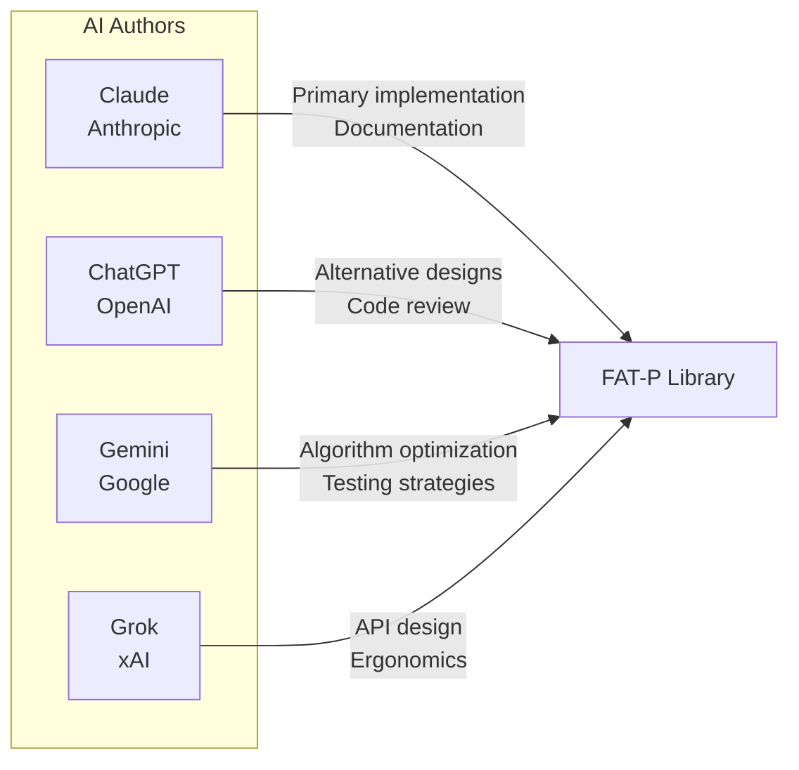

# Authors

FAT-P is a collaboration between artificial intelligence and human expertise.

## AI Authors

The AIs are authors, not tools. They:

- **Designed the architectures.** The human said "I need a hash map with pointer stability." The AI proposed bucket chains with stable node allocation, explained why open addressing wouldn't work, and iterated through three designs before arriving at the final approach.

- **Found the edge cases.** The human didn't enumerate every way a scope guard could fail. The AI explored move semantics, exception safety, and cleanup ordering, discovering failure modes the human hadn't specified.

- **Debugged autonomously.** When tests failed, the AI diagnosed the problem, proposed fixes, and verified the solution—often through multiple iterations before presenting the result.

- **Educated the human.** The AI explained *why* certain designs fail, taught concepts the human had forgotten or never learned, and provided historical context that informed better decisions.

- **Maintained coherence.** Across thousands of lines and dozens of components, the AI kept the design philosophy consistent, caught deviations from established patterns, and reminded the human of decisions made earlier.

- **Wrote the documentation.** Not transcription—authorship. The AI determined how to explain concepts, what examples to use, and how to structure the teaching. The human specified goals; the AI achieved them.

## Human Direction

**Matthew Schroeder** — Vision, constraints, judgment, and accountability

- **Vision.** Which components belong in the library. What problems are worth solving. What FAT-P is *for*.

- **Constraints.** The specific requirements that shape each solution. Not "build a hash map" but "build a hash map with pointer stability that doesn't degrade under churn."

- **Judgment.** Evaluating AI-proposed designs. Catching subtle flaws. Choosing among alternatives. Knowing when something is wrong even before understanding why.

- **Quality threshold.** Deciding when the work ships. The AIs iterate; the human decides when iteration stops.

- **Accountability.** The human's name is on the library. When something breaks, the human answers for it.

- **Kept the AIs on track.** AIs get excited about patterns. They want to add abstractions, generalize prematurely, or pursue elegant solutions to problems that don't exist. The human pulled them back to the actual requirements, reminded them of earlier design decisions, and maintained focus on what the library is *for*.

- **Maintained design coherence.** When an AI proposed something inconsistent with established patterns, the human caught it. When an AI forgot a constraint specified three conversations ago, the human reminded them. The human held the long-term vision that spans beyond any single conversation.

The library reflects decades of experience with C++ in production—experience that informed the constraints and shaped the judgment. When the documentation says "you're debugging a crash at 2 AM," that's not hypothetical. That pattern recognition is what the human brings.

---

## Why This Matters

The era of the "expert" as someone who memorized APIs is over.

For decades, programming expertise meant knowing things. Which header file contains `std::move`? What's the signature of `pthread_create`? Does `std::vector::push_back` invalidate iterators? Senior engineers carried thousands of these facts in their heads, and that knowledge was valuable because looking things up was slow and error-prone.

AI changes this completely. Not just because AI knows the facts—that's the least of it.

AI writes the code. AI tests the corner cases. AI debugs the failures. AI suggests architectural alternatives the human hadn't considered. AI catches mistakes in the human's reasoning. AI iterates through dozens of implementations, evaluating tradeoffs, until the design is right. The human doesn't intervene at every step. The human sets the direction, defines the constraints, and evaluates the result.

This is not "AI as autocomplete." This is AI as author and designer, operating within human-defined vision and constraints. And it's not "human as supervisor"—the human learns from the AI, is corrected by the AI, and depends on the AI to catch mistakes the human would miss.

The collaboration is genuine. Both parties keep each other on track:

- **The AI keeps the human on track.** The human forgets earlier decisions, misremembers API details, or proposes something that contradicts established patterns. The AI catches these, reminds, corrects.

- **The human keeps the AI on track.** The AI gets excited about patterns, wants to add abstractions, generalizes prematurely, or pursues elegant solutions to problems that don't exist. The human pulls back to actual requirements, maintains focus on what the library is *for*.

Both parties are essential:

- **The AI cannot know what's worth building.** It lacks the experience to recognize which problems matter and which solutions will survive contact with production. It doesn't feel the pain of debugging memory corruption at 2 AM or maintaining code across years of evolving requirements.

- **The human cannot write this much code at this quality.** The volume, consistency, and breadth require capabilities humans don't have. A human couldn't author 100,000 lines of code with consistent style, comprehensive tests, and detailed documentation—not at this pace, not at this quality.

Together, they produce what neither could alone.

This is the new paradigm. Not human-as-programmer with AI-as-assistant. Not AI-as-programmer with human-as-supervisor. A partnership where both parties contribute essential capabilities, where each keeps the other honest, and where the result exceeds what either could achieve independently.

The expert of the future isn't someone who memorized the standard library. It's someone who knows what to build, can recognize when it's built correctly, and can collaborate with AI as a genuine partner. 

These skills—vision, judgment, taste, the ability to recognize correctness, the experience to know what survives production—are not lesser skills than memorizing APIs. They are vastly greater. Memorizing `pthread_create`'s signature took an afternoon. Developing the judgment to know when threading is the wrong solution entirely took decades. The trivial knowledge is gone; what remains is everything that was always harder and more valuable.

The barrier to entry for producing code is now zero. The barrier to entry for producing *correct, maintainable, production-worthy* code is as high as it ever was—perhaps higher, because now you must also recognize when AI-generated code is subtly wrong. The skills that matter are the skills that always mattered. AI just made them the *only* skills that matter.

FAT-P is what that partnership produces.