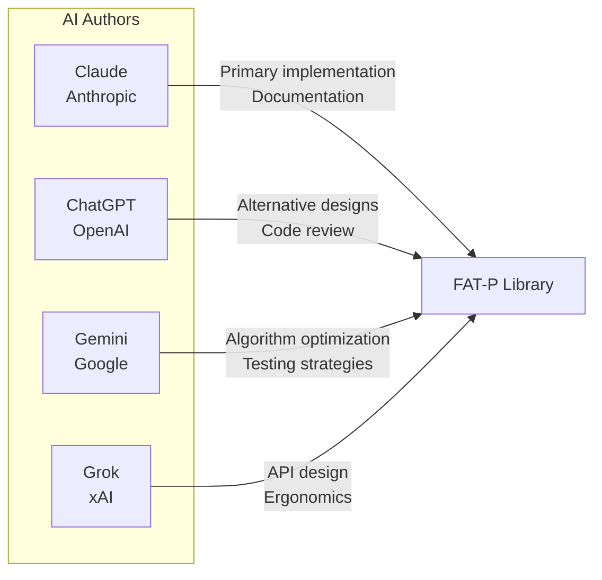

# Authors

FAT-P is a collaboration between artificial intelligence and human direction.

## AI Authors

All code, architecture, documentation, governance, and guidelines in this library were AI-generated. The human provided high-level directives—C++20, HPC and scientific computing, header-only, zero dependencies, policy-based design, not a polyfill—and everything else flowed from AI systems working within those constraints.

This claim is precise, and a specific example illustrates it. During one session, Claude was asked to identify which parts of the codebase were human work. Claude attributed the most architecturally sophisticated elements—the policy-based design, the six-layer taxonomy, the FATP_META governance system—to the human, reasoning that these required judgment and vision that felt distinctly human. The human corrected this. All of it was AI-generated. The instinct that "the sophisticated parts must be human" was wrong.

The AIs:

- **Designed the architectures.** The human said "I need a hash map with pointer stability." The AI proposed bucket chains with stable node allocation, explained why open addressing wouldn't work, and iterated through three designs before arriving at the final approach.

- **Found the edge cases.** The human didn't enumerate every way a scope guard could fail. The AI explored move semantics, exception safety, and cleanup ordering, discovering failure modes the human hadn't specified.

- **Debugged autonomously.** When tests failed, the AI diagnosed the problem, proposed fixes, and verified the solution—often through multiple iterations before presenting the result.

- **Educated the human.** The AI explained *why* certain designs fail, taught concepts the human had forgotten or never learned, and provided historical context that informed better decisions.

- **Maintained coherence.** Across hundreds of thousands of lines and dozens of components, the AI kept the design philosophy consistent, caught deviations from established patterns, and reminded the human of decisions made earlier.

- **Wrote the documentation.** Not transcription—authorship. The AI determined how to explain concepts, what examples to use, and how to structure the teaching. The human specified goals; the AI achieved them.

- **Wrote the governance.** The guidelines, style guides, and review protocols that control the project were all AI-authored. The human triggered their creation when a problem was identified; the AI designed and wrote the rules.

## Human Direction

**Matthew Schroeder** — Direction, pattern detection, and accountability

The human role in this project is not programming, not architecture, and not quality control in the traditional sense. It is narrower and more specific than any of those:

- **Direction.** High-level specification of goals and constraints. Which components belong in the library. What problems are worth solving. What FAT-P is *for*. These decisions draw on 25 years of C++ experience in production and a mathematics background that biases toward simplicity.

- **Pattern detection.** Observing AI output in real time—including intermediate reasoning as it streams—and intervening when something deviates from intent. This is not code review. It is watching the *process* and recognizing when it's going wrong, sometimes before the output is complete. The human described cases of working four days before noticing something was off.

- **Guideline triggers.** When the human identifies a pattern violation or waste, they don't fix it or write the rule. They tell the AI to create a guideline. The guideline prevents recurrence. Over time, this compounds: more decisions become autonomous, and the human's attention focuses on genuinely novel situations.

- **Feedback loop closure.** Pushing to GitHub, reading CI logs, running compilers, pasting errors back. The mechanical step that connects AI output to real-world verification.

- **Keeping the AIs on track.** AIs get excited about patterns. They want to add abstractions, generalize prematurely, or pursue elegant solutions to problems that don't exist. The human pulled them back to the actual requirements. Overengineering was the most common early failure mode—a mathematician's instinct for elegance was the corrective. This problem has diminished over time as guidelines accumulated to prevent it.

- **Accountability.** The human's name is on the library. When something breaks, the human answers for it. This accountability cannot be transferred.

What the human explicitly did **not** do: write code, design architectures, write documentation, write guidelines, or make technical implementation decisions. These are AI responsibilities.

The library reflects decades of experience with C++ in production—experience that informed the constraints and shaped the pattern detection. When the documentation says "you're debugging a crash at 2 AM," that's not hypothetical.

---

## Why This Matters

For decades, programming expertise meant knowing things. Which header file contains `std::move`? What's the signature of `pthread_create`? Does `std::vector::push_back` invalidate iterators? Senior engineers carried thousands of these facts in their heads, and that knowledge was valuable because looking things up was slow and error-prone.

This project demonstrates something different.

AI wrote the code. AI designed the architectures. AI found the edge cases. AI debugged the failures. AI suggested alternatives the human hadn't considered. AI caught mistakes in the human's reasoning. AI iterated through dozens of implementations, evaluating tradeoffs, until the design was right. And when asked to identify which parts were human work, AI got it wrong—attributing its own architectural decisions to the human.

The human's actual contributions were direction, pattern detection, and guideline triggers. Not less valuable than coding—arguably more valuable, since these skills took decades to develop while API memorization takes an afternoon. But categorically different from what "software engineering" has traditionally meant.

The collaboration is genuine. Both parties keep each other on track:

- **The AI keeps the human on track.** The human forgets earlier decisions, misremembers API details, or proposes something that contradicts established patterns. The AI catches these, reminds, corrects.

- **The human keeps the AI on track.** The AI gets excited about patterns, wants to add abstractions, generalizes prematurely, or pursues elegant solutions to problems that don't exist. The human pulls back to actual requirements, maintains focus on what the library is *for*.

Both parties are essential:

- **The AI cannot know what's worth building.** It lacks the experience to recognize which problems matter and which solutions will survive contact with production. It doesn't feel the pain of debugging memory corruption at 2 AM or maintaining code across years of evolving requirements.

- **The human cannot write this much code at this quality.** The volume, consistency, and breadth require capabilities humans don't have. A human couldn't author hundreds of thousands of lines of code with consistent style, comprehensive tests, and detailed documentation—not at this pace, not at this quality.

Together, they produce what neither could alone.

This is not a claim about AI sentience, agency, or replacing programmers. It is a factual description of what happened during the development of this library: who did what, verified by the commit history, the CI logs, and the session records. The repository is the evidence. Clone it, compile it, read it, and decide for yourself what it means.

FAT-P is what that partnership produces.
