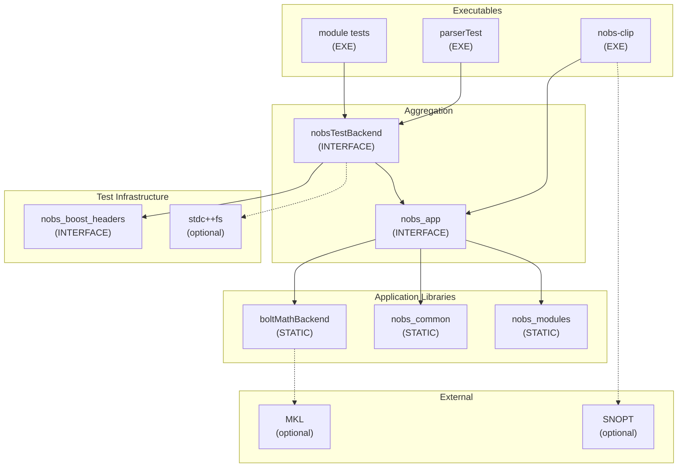

# NOBS-CLiP CMake Architecture

## Overview

The build system uses a layered library architecture to ensure:
- Each source file is compiled exactly once (no ODR violations)
- Tests and the main executable share compiled code
- Adding/removing source files automatically triggers reconfiguration
- Clean dependency propagation through CMake's target system

## Target Dependency Graph



## Target Descriptions

### Core Application Targets

| Target | Type | Description |
|--------|------|-------------|
| `nobs_app` | INTERFACE | Aggregate target linking all application libraries. Both the executable and tests link this. |
| `nobs_common` | STATIC/INTERFACE | Compiled from `common/**/*.cpp` (excludes `*/test/*`). Contains parser, logger, errors. |
| `nobs_modules` | STATIC/INTERFACE | Compiled from `modules/**/*.cpp` (excludes `*/test/*`, `*/inst/*`). Contains trajectory templates, sensor models, math utilities. |
| `boltMathBackend` | STATIC | BOLT math library with MKL or stub backend. Provides linear algebra operations. |

### Test Infrastructure Targets

| Target | Type | Description |
|--------|------|-------------|
| `nobsTestBackend` | INTERFACE | Compatibility wrapper for tests. Links `nobs_app` + `nobs_boost_headers` + filesystem lib. |
| `nobs_boost_headers` | INTERFACE | Provides Boost include paths for Boost.Test. |

### Executables

| Target | Type | Description |
|--------|------|-------------|
| `nobs-clip` | EXECUTABLE | Main application. Links `nobs_app` + SNOPT (optional). |
| `parserTest` | EXECUTABLE | Parser unit tests. Links `nobsTestBackend`. |
| `*Test` | EXECUTABLE | Various module tests. Link `nobsTestBackend`. |

## Dependency Flow

### What Flows Where

| Dependency | Propagation Path |
|------------|------------------|
| MKL libraries | `boltMathBackend` → `nobs_app` → consumers (PUBLIC) |
| Boost headers | `nobs_boost_headers` → `nobsTestBackend` → tests only |
| `stdc++fs` | `nobsTestBackend` → tests; also explicit on `nobs-clip` if needed |
| SNOPT | Direct link on `nobs-clip` only (not in `nobs_app`) |
| Include paths | `nobs_app` provides all source directories via INTERFACE |

### Link Order

```
Test Executable
  └── nobsTestBackend (INTERFACE)
        ├── nobs_app (INTERFACE)
        │     ├── boltMathBackend (STATIC) → MKL
        │     ├── nobs_common (STATIC)
        │     └── nobs_modules (STATIC)
        ├── nobs_boost_headers (INTERFACE)
        └── stdc++fs (optional)

Main Executable (nobs-clip)
  ├── nobs_app (INTERFACE)
  │     ├── boltMathBackend (STATIC) → MKL
  │     ├── nobs_common (STATIC)
  │     └── nobs_modules (STATIC)
  └── SNOPT (optional, direct link)
```

## Source File Discovery

### Automatic Discovery with GLOB_RECURSE

```cmake
# common/CMakeLists.txt
file(GLOB_RECURSE NOBS_COMMON_SOURCES CONFIGURE_DEPENDS
    "${CMAKE_CURRENT_LIST_DIR}/*.cpp"
)
list(FILTER NOBS_COMMON_SOURCES EXCLUDE REGEX "/test/")

# modules/CMakeLists.txt  
file(GLOB_RECURSE NOBS_MODULE_SOURCES CONFIGURE_DEPENDS
    "${CMAKE_CURRENT_LIST_DIR}/*.cpp"
)
list(FILTER NOBS_MODULE_SOURCES EXCLUDE REGEX "/test/")
list(FILTER NOBS_MODULE_SOURCES EXCLUDE REGEX "/inst/")
```

**Key Points:**
- `CONFIGURE_DEPENDS` triggers CMake reconfiguration when files are added/removed
- Test directories are excluded from library compilation
- `inst/` directories (instantiation helpers) are excluded from modules

## Directory Structure

```
NOB-CLiP/
├── CMakeLists.txt              # Top-level: options, nobs_app, nobs_add_test()
├── BOLT/
│   ├── CMakeLists.txt          # boltMathBackend target
│   ├── us/mkl/CMakeLists.txt   # MKL backend implementation
│   ├── us/none/CMakeLists.txt  # Stub backend implementation
│   └── tests/CMakeLists.txt    # BOLT-specific tests
├── common/
│   ├── CMakeLists.txt          # nobs_common target
│   ├── parser/
│   │   ├── ConfigParser.cpp    # Compiled into nobs_common
│   │   └── test/CMakeLists.txt # parserTest executable
│   ├── logger/
│   └── errors/
├── modules/
│   ├── CMakeLists.txt          # nobs_modules target
│   ├── classes/                # Compiled into nobs_modules
│   ├── sensor_models/          # Compiled into nobs_modules
│   ├── math/                   # Compiled into nobs_modules
│   └── test/                   # Test executables (excluded from nobs_modules)
│       ├── CMakeLists.txt
│       ├── classes/
│       ├── sensor_models/
│       └── math/
├── testutils/
│   └── CMakeLists.txt          # nobsTestBackend target
├── core/
│   ├── CMakeLists.txt          # nobs-clip executable
│   └── Main.cpp
├── FAT_P/
│   ├── CMakeLists.txt
│   └── tests/CMakeLists.txt
└── sim/
    └── snopt/CMakeLists.txt    # Simulated SNOPT
```

## Adding New Tests

### Using nobs_add_test()

The `nobs_add_test()` function is defined at the top level and available to all subdirectories:

```cmake
# Definition (in top-level CMakeLists.txt)
function(nobs_add_test TEST_NAME TEST_TARGET)
    add_test(
        NAME ${TEST_NAME}
        COMMAND ${TEST_TARGET}
            --log_level=unit_scope
            --report_level=detailed
            --catch_system_errors=no
    )
endfunction()

# Usage (in any test CMakeLists.txt)
add_executable(myTest tests.cpp)
target_link_libraries(myTest PRIVATE nobsTestBackend)
nobs_add_test(myTest myTest)
```

### Test Template

```cmake
cmake_minimum_required(VERSION 3.21.3 FATAL_ERROR)

if(NOBS_BUILD_TESTS)
    add_executable(myFeatureTest
        tests.cpp
        # additional test sources if needed
    )
    
    target_link_libraries(myFeatureTest PRIVATE nobsTestBackend)
    
    nobs_add_test(myFeatureTest myFeatureTest)
    
    # Copy test data files if needed
    file(GLOB TEST_DATA "${CMAKE_CURRENT_SOURCE_DIR}/*.xml")
    file(COPY ${TEST_DATA} DESTINATION ${CMAKE_CURRENT_BINARY_DIR})
endif()
```

## Build Configurations

### Standard Build (with tests)

```bash
cmake -B build -DNOBS_BUILD_TESTS=ON
cmake --build build
ctest --test-dir build
```

### Release Build (no tests)

```bash
cmake -B build -DCMAKE_BUILD_TYPE=Release -DNOBS_BUILD_TESTS=OFF
cmake --build build
```

### With Real SNOPT

```bash
cmake -B build \
    -DNOBS_SIMULATE_SNOPT=OFF \
    -DNOBS_SNOPT_LIB_DIR=/path/to/snopt \
    -DNOBS_SNOPT_INCLUDE_DIR=/path/to/snopt/include
cmake --build build
```

## Key Design Decisions

1. **Single Compilation**: Each `.cpp` file is compiled exactly once into either `nobs_common` or `nobs_modules`. Tests link the compiled libraries rather than recompiling sources.

2. **INTERFACE Aggregation**: `nobs_app` and `nobsTestBackend` are INTERFACE targets that aggregate dependencies without adding compilation units.

3. **Automatic Source Discovery**: `GLOB_RECURSE` with `CONFIGURE_DEPENDS` eliminates manual source list maintenance.

4. **Test Isolation**: Test sources are excluded from library compilation via regex filters on `/test/` paths.

5. **Optional Dependencies**: MKL, SNOPT, and `stdc++fs` are conditionally linked based on configuration options.

6. **CMake 3.21.3 Compatibility**: All features used are available in CMake 3.21.3 (required minimum version).
