# AlignedVector: A Fat-P Library Showcase

## Executive Summary

AlignedVector is a **cache-aware vector container** with configurable memory alignment for SIMD and HPC workloads. Unlike `std::vector` (which aligns to `alignof(T)` only) or naive aligned containers (which require boolean flags for inline storage), AlignedVector provides **compile-time alignment guarantees** through a policy-based allocator. The `assume_aligned()` accessor enables compiler auto-vectorization without runtime checks, transforming memory-bound loops into compute-bound operations with 2-10x speedup for vectorizable code.

---

## The Problem Domain

### What Goes Wrong Without It

```cpp
// The std::vector alignment lottery
std::vector<float> data(1024);

// May or may not be aligned for AVX-512 (64 bytes)
// Compiler must generate peeling loops + unaligned fallbacks
for (size_t i = 0; i < data.size(); i += 16) {
    __m512 v = _mm512_load_ps(&data[i]);  // CRASH if misaligned!
}

// The manual alignment nightmare
float* data = static_cast<float*>(aligned_alloc(64, 1024 * sizeof(float)));
// Manual lifetime management
// No exception safety
// No automatic growth
// Easy to forget free()
free(data);

// The "works but slow" fallback
for (size_t i = 0; i < data.size(); i += 16) {
    __m512 v = _mm512_loadu_ps(&data[i]);  // Unaligned load: forces conservative codegen
}
```

| Issue | HPC Impact |
|-------|------------|
| Unaligned SIMD loads | Forces compiler into conservative loop structures |
| Peeling loops | Compiler generates 3x code (peel, main, remainder) |
| False sharing | Parallel threads invalidate each other's cache lines |
| Manual aligned_alloc | No RAII, no exception safety, no growth |
| Platform divergence | `posix_memalign` vs `_aligned_malloc` vs `std::aligned_alloc` |

### The Standard's Limitation

`std::vector` guarantees only `alignof(T)` alignment:

```cpp
std::vector<float> v(1024);
// Alignment: 4 bytes (alignof(float))
// AVX needs: 32 bytes
// AVX-512 needs: 64 bytes
// Cache line: 64 bytes

// C++17 added std::aligned_alloc, but:
// - Not integrated with containers
// - Requires manual memory management
// - No growth semantics
```

**C++17/20/23 don't help:** There's no `std::vector<T, Alignment>` variant. The allocator model supports custom allocation but doesn't expose alignment as a template parameter. You're stuck writing boilerplate allocator classes for every alignment value.

---

## Architecture: Policy-Based Aligned Allocation

### The Mechanism: Compile-Time Alignment Guarantees

```mermaid
flowchart TB
    subgraph compile["Compile Time"]
        SA1["static_assert<br/>power of 2"] --> |"Pass"| SA2["static_assert<br/>Alignment >= alignof T"]
        SA2 --> |"Pass"| Template["AlignedVector&lt;T, 64&gt;<br/>Type Instantiated"]
    end
    
    subgraph runtime["Runtime Allocation"]
        Template --> Platform{Platform?}
        Platform --> |"Windows"| Win["_aligned_malloc<br/>64-byte aligned"]
        Platform --> |"POSIX"| Posix["posix_memalign<br/>64-byte aligned"]
        Win --> Ptr["Aligned Pointer"]
        Posix --> Ptr
    end
    
    subgraph usage["Usage"]
        Ptr --> Data["data&#40;&#41;<br/>Raw pointer"]
        Ptr --> Assume["assume_aligned&#40;&#41;<br/>Compiler hint"]
        Assume --> SIMD["Optimized SIMD<br/>Code Generation"]
    end
```



```cpp
template<typename T, size_t Alignment = 64>
class AlignedAllocator {
    static_assert((Alignment & (Alignment - 1)) == 0, 
                  "Alignment must be power of 2");
    static_assert(Alignment >= alignof(T), 
                  "Alignment must be at least alignof(T)");
    
    T* allocate(size_t n) {
#if defined(_MSC_VER)
        return static_cast<T*>(_aligned_malloc(n * sizeof(T), Alignment));
#else
        void* ptr;
        posix_memalign(&ptr, Alignment, n * sizeof(T));
        return static_cast<T*>(ptr);
#endif
    }
};

template<typename T, size_t Alignment = 64>
class AlignedVector {
    // Full std::vector interface with alignment guarantee
    
    // Compiler hint for auto-vectorization
    T* assume_aligned() noexcept {
        return __builtin_assume_aligned(data_, Alignment);
    }
};
```

**Why This Matters:**

1. **Compile-time validation:** Static assertions prevent impossible configurations (alignment < `alignof(T)`, non-power-of-2)

2. **Platform abstraction:** One interface works on Windows (`_aligned_malloc`) and POSIX (`posix_memalign`)

3. **Auto-vectorization hint:** `assume_aligned()` tells the compiler "this pointer is aligned"—no runtime check, no peeling loop, direct vectorized code

4. **Exception safety:** Container remains valid on exceptions; reallocation operations provide the strong guarantee

---

## Feature Inventory

### 1. Guaranteed Memory Alignment

```cpp
// 64-byte alignment for cache-line optimization
fat_p::AlignedVector<float, 64> cache_friendly(1024);
assert(reinterpret_cast<uintptr_t>(cache_friendly.data()) % 64 == 0);

// 32-byte alignment for AVX
fat_p::AlignedVector<float, 32> avx_ready(1024);

// 16-byte alignment for SSE
fat_p::AlignedVector<float, 16> sse_ready(1024);

// Compile-time check: impossible configurations fail at compile time
// AlignedVector<double, 4> fails: Alignment < alignof(double)
// AlignedVector<int, 7> fails: Alignment not power of 2
```

### 2. Auto-Vectorization via assume_aligned()

```cpp
fat_p::AlignedVector<float, 64> data(10000, 1.0f);

// Without assume_aligned: compiler doesn't know alignment
float sum1 = 0.0f;
for (size_t i = 0; i < data.size(); ++i) {
    sum1 += data[i];  // Compiler may generate unaligned loads
}

// With assume_aligned: compiler generates optimal SIMD
const float* p = data.assume_aligned();
float sum2 = 0.0f;
for (size_t i = 0; i < data.size(); ++i) {
    sum2 += p[i];  // Compiler knows alignment, uses aligned loads
}
```

**What the compiler sees:**
- Without hint: "pointer might be misaligned, generate fallback paths"
- With hint: "pointer is 64-byte aligned, emit `vmovaps` directly"

### 3. Full std::vector Interface

```cpp
fat_p::AlignedVector<int, 64> vec;

// Construction
fat_p::AlignedVector<int, 64> a(100);           // 100 zero-initialized ints
fat_p::AlignedVector<int, 64> b(100, 42);       // 100 copies of 42
fat_p::AlignedVector<int, 64> c = {1, 2, 3};    // Initializer list
fat_p::AlignedVector<int, 64> d(c.begin(), c.end());  // Range constructor

// Element access
vec.push_back(1);
vec.emplace_back(2);
int x = vec[0];
int y = vec.at(1);  // Bounds-checked
int& front = vec.front();
int& back = vec.back();

// Capacity
vec.reserve(1000);
vec.resize(500);
vec.shrink_to_fit();

// Modifiers
vec.insert(vec.begin(), 0);
vec.erase(vec.begin() + 5);
vec.clear();

// Comparison
bool equal = (a == b);
bool less = (a < b);
```

### 4. Exception Safety (Strong for Reallocation)

AlignedVector is **exception-safe**: on exceptions, it does not leak resources and remains in a valid, destructible state.
Operations that reallocate (e.g., `reserve()` / `shrink_to_fit()` and assignment patterns that build a temporary then swap) follow a commit-on-success strategy and therefore provide the **strong guarantee** for those operations.

Operations that must shift elements in-place (e.g., middle `insert`/`erase`) typically provide the **basic guarantee** (container remains valid; element values may be partially modified before the exception).

```cpp
fat_p::AlignedVector<Widget> widgets;
widgets.reserve(100);
widgets.push_back(Widget(1));
widgets.push_back(Widget(2));

try {
    widgets.reserve(1000);  // Might throw during reallocation
} catch (...) {
    // widgets is UNCHANGED
    assert(widgets.size() == 2);
    assert(widgets[0].id == 1);
    assert(widgets[1].id == 2);
}
```

**The mechanism:** `reallocate()` allocates the new buffer first, then moves elements. If any move throws, the new buffer is destroyed and the original remains untouched. This uses a move-if-noexcept policy: copy (not move) when the move constructor might throw.

### 5. Move-Only Type Support

```cpp
struct UniqueResource {
    std::unique_ptr<int> data;
    UniqueResource(int v) : data(std::make_unique<int>(v)) {}
    UniqueResource(UniqueResource&&) = default;
    UniqueResource& operator=(UniqueResource&&) = default;
};

fat_p::AlignedVector<UniqueResource, 64> resources;
resources.emplace_back(42);
resources.push_back(UniqueResource(100));

// Move the entire container
auto moved = std::move(resources);
assert(resources.empty());  // Container is guaranteed empty after move
```

### 6. Trivial Type Optimization

```cpp
// For trivially copyable types, AlignedVector uses memcpy/memset
// instead of element-by-element construction

fat_p::AlignedVector<float, 64> floats(1000000);
// Uses memset for value-initialization: one call, not 1M constructor calls

fat_p::AlignedVector<float, 64> copy = floats;
// Uses memcpy: one call, not 1M copy constructors
```

---

## Why Not Alternatives?

| If You Need... | Why Not std::vector | Why Not Eigen::aligned_allocator | Why Not Manual aligned_alloc | Fat-P Advantage |
|----------------|--------------------|---------------------------------|-----------------------------|--------------------|
| Cache-line alignment | Only aligns to alignof(T) | Tied to Eigen library | No RAII, no growth | Configurable, standalone |
| Auto-vectorization hints | No assume_aligned() | Library-specific | Manual pointer tracking | Built-in assume_aligned() |
| Cross-platform | Works, but no alignment control | Eigen dependency | POSIX vs Windows APIs | Single header, both platforms |
| Exception safety | Operation-dependent | Operation-dependent | None | Operation-dependent |
| Move-only types | Full support | Full support | Manual lifetime | Full support |
| Zero dependencies | Standard library | Requires Eigen | Standard library | Standard library only |

**The Sweet Spot:** AlignedVector provides `std::vector` semantics with guaranteed alignment, auto-vectorization hints, and zero dependencies—something no standard or popular library offers in a single header.

---

## The "Forever Stuck" Reality

**Compiler Reality Check:** C++17/20/23 don't add aligned vector containers. The allocator model theoretically supports custom alignment, but:

1. You must write a custom allocator class for each alignment value
2. No `assume_aligned()` equivalent in standard containers
3. No compile-time validation of alignment constraints

**HPC Environment Reality:** Scientific clusters run RHEL 7/8 with GCC 7.x for CUDA driver compatibility. Even if C++26 adds aligned containers, your codebase is locked to C++17 for years. AlignedVector works today, on every major compiler, with no dependency risk.

---

## Performance Characteristics

| Operation | Complexity | Mechanism |
|-----------|------------|-----------|
| `push_back` | Amortized O(1) | Geometric growth (2x) |
| `emplace_back` | Amortized O(1) | In-place construction |
| `insert` | O(n) | Shift elements right |
| `erase` | O(n) | Shift elements left |
| `reserve` | O(n) | Single reallocation |
| `operator[]` | O(1) | Direct pointer arithmetic |
| `at` | O(1) | Bounds check + pointer arithmetic |

### Where Fat-P Wins

**SIMD loops:** The combination of guaranteed alignment + `assume_aligned()` eliminates runtime alignment checks and peeling loops. On AVX-512 hardware, this can mean 8-16 floats per instruction instead of scalar fallbacks.

**Cache-sensitive code:** 64-byte alignment ensures each vector starts on a cache line boundary, reducing false sharing between adjacent allocations and improving prefetch efficiency.

**HPC numerical code:** Matrix rows, particle positions, time series data—anything processed in bulk benefits from alignment.

### Where Fat-P Loses (Honesty Builds Trust)

**Random access patterns:** If your access pattern is scattered (hash tables, tree traversal), alignment doesn't help. The CPU can't prefetch effectively regardless of alignment.

**Small vectors:** For vectors under 16-32 elements, the alignment overhead (padding to boundary) may waste more memory than it saves in performance.

**Non-vectorizable code:** If your loop body has data dependencies or branches that prevent vectorization, alignment won't help. The compiler can't vectorize what isn't vectorizable.

---

## Integration Points

```
AlignedVector.h
    ↓ uses
FatPTypeTraits.h       (is_aligned_vector trait)
    ↓ used by
Tensor.h               (Aligned storage for tensor data)
SimdVector.h           (SIMD-accelerated vector operations)
BinarySerializer.h     (Efficient aligned buffer serialization)
```

---

## Final Assessment

AlignedVector delivers on the fat_p promise through three pillars:

### 1. Permanence
C++ won't standardize aligned containers—the allocator model is too complex for a simple solution. AlignedVector provides alignment guarantees permanently, not as a shim waiting for compiler upgrades.

### 2. Specialization  
The `assume_aligned()` accessor gives compilers the information they need for optimal SIMD code generation. This isn't just "aligned memory"—it's **communicated alignment** that enables auto-vectorization.

### 3. Control
Template parameter `Alignment` gives compile-time control over memory layout. 64 bytes for cache lines, 32 for AVX, 16 for SSE—choose what your workload needs, with static assertions preventing misconfiguration.

**Architectural Verdict:** AlignedVector transforms memory layout from **runtime uncertainty** to **compile-time guarantee**, enabling SIMD code that would otherwise require unsafe casts or manual memory management.

---

*AlignedVector.h — Fat-P Library*
