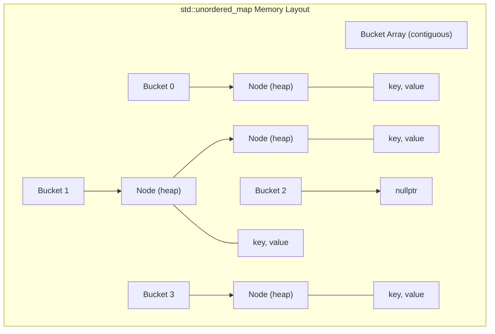
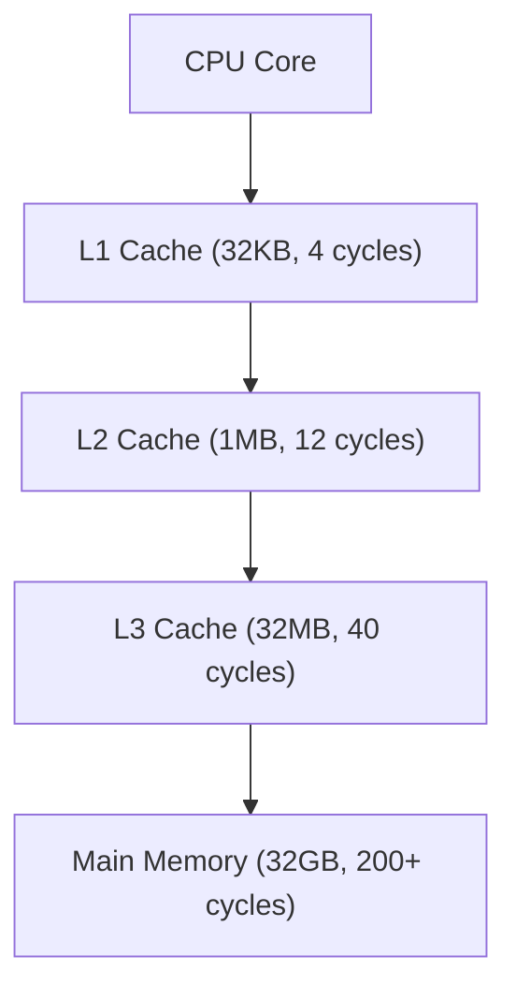
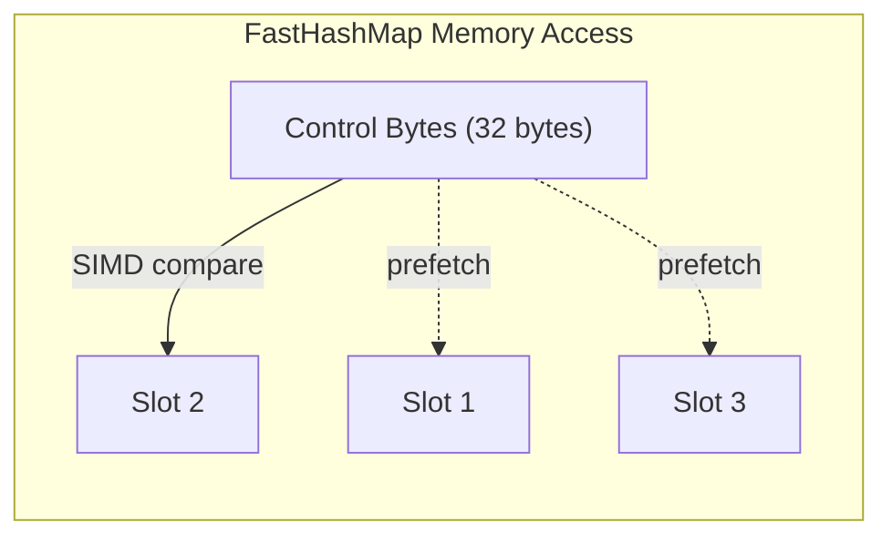
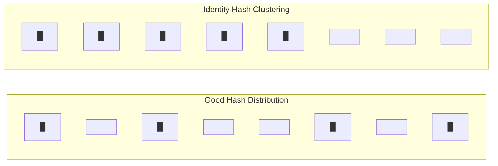
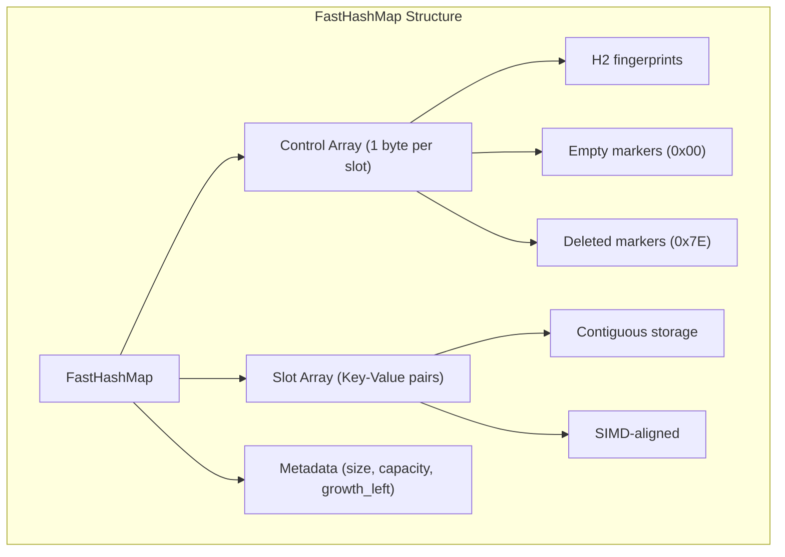
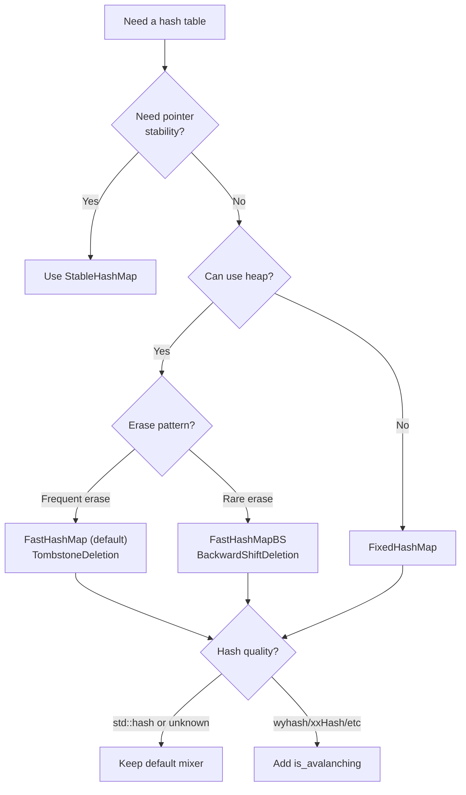

# **The Pointer Chase Must Die**

### *A Companion Guide to FastHashMap*

---

**Scope:** This guide covers FastHashMap's Swiss Table implementation: SIMD-accelerated probing, deletion policy selection, allocator policies, and hash mixing. It does not cover ordered containers, multi-maps, concurrent hash tables, or persistent data structures.

---

# **Table of Contents**

**[Introduction: Why This Component Exists](#introduction-why-this-component-exists)**

## Part I — The Problems

1. [The Allocation Problem](#chapter-1--the-allocation-problem)
2. [The Pointer Chasing Problem](#chapter-2--the-pointer-chasing-problem)
3. [The SIMD Utilization Problem](#chapter-3--the-simd-utilization-problem)
4. [The Deletion Problem](#chapter-4--the-deletion-problem)
5. [The Weak Hash Problem](#chapter-5--the-weak-hash-problem)

## Part II — The Solutions

6. [Architecture Overview](#chapter-6--architecture-overview)
7. [The Control Byte Encoding](#chapter-7--the-control-byte-encoding)
8. [SIMD Probing Mechanics](#chapter-8--simd-probing-mechanics)
9. [Deletion Policy Implementation](#chapter-9--deletion-policy-implementation)
10. [The Hash Mixer](#chapter-10--the-hash-mixer)
11. [Allocator Policies](#chapter-11--allocator-policies)

## Part III — Putting It Together

12. [Case Study: Game Engine Entity System](#chapter-12--case-study-game-engine-entity-system)
13. [Case Study: Financial Order Book](#chapter-13--case-study-financial-order-book)
14. [Case Study: Embedded Sensor Firmware](#chapter-14--case-study-embedded-sensor-firmware)
15. [Choosing Your Configuration](#chapter-15--choosing-your-configuration)
16. [Migration from std::unordered_map](#chapter-16--migration-from-stdunordered_map)

## Part IV — Foundations

- [Appendix A — The History of Hash Table Design](#appendix-a--the-history-of-hash-table-design)
- [Appendix B — Design Decisions and Rejected Alternatives](#appendix-b--design-decisions-and-rejected-alternatives)
- [Appendix C — Where FastHashMap Loses](#appendix-c--where-fasthashmap-loses)
- [Appendix D — Performance Characteristics](#appendix-d--performance-characteristics)

---

# **Introduction: Why This Component Exists**

You're profiling a game engine. Frame rate drops every few seconds—not dramatically, but enough that players notice. You narrow it down to the entity update loop. The algorithm is O(n). The data fits in cache. Yet 15% of every frame vanishes into... hash table operations.

The culprit is `std::unordered_map`. Each of your 10,000 entities triggers a hash table insertion. Each insertion potentially calls `malloc()`. At 60 FPS, that's 600,000 allocation requests per second. The allocator becomes a serialization point—threads wait for heap locks while the CPU's execution units sit idle.

Or this: you're building a trading system. Latency matters. You profile and find microseconds disappearing into order book lookups. The hash table itself is fast, but each lookup chases 2-3 pointers through memory. Each pointer is a cache miss. Each cache miss is 200 cycles of staring at DRAM.

Or this: you're on an embedded system with 64KB of RAM and hard real-time constraints. You need a lookup table, but `malloc()` is forbidden—its latency is unbounded and unpredictable. `std::unordered_map` is architecturally incompatible with your constraints.

Or this: you're debugging a performance regression. Your hash table worked fine with test data (sequential IDs: 1, 2, 3...). In production, with real IDs, performance collapsed. You discover that `std::hash<int>` on MSVC is the identity function—sequential keys create one enormous probe chain, turning O(1) into O(n).

These aren't edge cases. They're the predictable consequences of `std::unordered_map`'s architecture: separate chaining with per-entry allocation, designed in an era when memory latency was comparable to computation.

FastHashMap exists for engineers who've hit these walls. The library addresses each pain point directly:

- **Flat storage** that eliminates per-entry allocation
- **SIMD probing** that examines 32 candidates per instruction
- **Configurable deletion** policies for different workload patterns
- **Built-in hash mixing** that protects against weak hash functions
- **Fixed-buffer allocation** for embedded and real-time systems
- **~1,500 lines** of auditable, header-only, dependency-free code

This guide explains the problems FastHashMap solves and how it solves them.

---

# **PART I — THE PROBLEMS**

Hash tables seem simple: compute a bucket index, store your data. But the gap between theoretical O(1) and practical performance spans orders of magnitude. Memory hierarchy, allocation overhead, and instruction-level parallelism create a landscape where architectural choices matter more than algorithmic complexity.

Understanding these problems explains why FastHashMap makes the choices it does.

---

# **CHAPTER 1 — The Allocation Problem**

Every `std::unordered_map` insertion potentially allocates memory. This isn't a bug—it's a consequence of the data structure's guarantees. Understanding why requires understanding what the standard promises.

**The standard's guarantee:** References and iterators to elements remain valid after insertion (unless rehash occurs). This seems innocuous, but it constrains the implementation profoundly.

Consider what happens if elements are stored directly in a contiguous array. When the array grows, elements move. Pointers to those elements dangle. To preserve pointer stability, elements must live in separately-allocated nodes that never move.



Each node is a separate heap allocation. Insert a million elements, call `malloc()` a million times.

**The cost:**

| Factor | Impact |
|--------|--------|
| Allocation overhead | 16-32 bytes metadata per allocation |
| Heap fragmentation | Nodes scattered across address space |
| Allocator contention | Threads serialize on heap locks |
| Cache pollution | Allocator metadata displaces user data |

The allocation overhead alone can double memory usage. A `std::unordered_map<int, int>` storing 8 bytes of user data per entry may consume 40+ bytes per entry after node overhead, allocator metadata, and alignment padding.

**The contention problem:** Modern allocators (jemalloc, tcmalloc, mimalloc) use thread-local caches to reduce contention. But high-frequency allocation from multiple threads eventually requires synchronization. In allocation-heavy workloads, threads spend more time waiting for locks than doing useful work.

```cpp
// THE TRAP: Allocation-heavy hot loop
void process_frame(const std::vector<Entity>& entities) {
    std::unordered_map<EntityId, Transform> transforms;  // Allocates bucket array
    
    for (const auto& e : entities) {
        transforms[e.id] = e.transform;  // Allocates node (potentially)
    }
    
    // Use transforms...
}  // Deallocates everything
```

With 10,000 entities at 60 FPS, this code performs up to 600,000 allocations and 600,000 deallocations per second. The allocator becomes the bottleneck.

**What FastHashMap provides:** Flat storage with amortized allocation. All elements live in a single contiguous array. Insertion never allocates unless the table needs to grow. Growth is geometric (typically 2x), so n insertions require O(log n) allocations total.

```cpp
// THE FIX: Flat storage, amortized allocation
void process_frame(const std::vector<Entity>& entities) {
    fat_p::FastHashMap<EntityId, Transform> transforms;
    transforms.reserve(entities.size());  // One allocation
    
    for (const auto& e : entities) {
        transforms[e.id] = e.transform;  // No allocation (reserved)
    }
    
    // Use transforms...
}  // One deallocation
```

The tradeoff: pointer stability. FastHashMap may relocate elements on insertion. If you need pointers to survive mutations, use `StableHashMap` instead.

---

# **CHAPTER 2 — The Pointer Chasing Problem**

Memory latency hasn't kept pace with CPU speed. In 1980, memory access took about as long as an arithmetic operation. By 2024, a CPU can execute 500 instructions in the time it takes to fetch one cache line from main memory.

Modern CPUs hide this latency through caching and prefetching. But these mechanisms fail when memory access patterns are unpredictable—which is exactly what pointer chasing produces.

**The cache hierarchy:**



Each level is larger but slower. Data accessed recently lives in fast cache; data accessed rarely must be fetched from slow memory.

**The prefetcher:** CPUs detect access patterns and fetch data before you need it. Sequential access (array[0], array[1], array[2]...) triggers aggressive prefetching. Random access (following pointers) defeats the prefetcher—it can't predict where you're going.

**Separate chaining is pointer chasing:**

```cpp
// Conceptual std::unordered_map::find()
Node* find(const Key& key) {
    size_t bucket = hash(key) % bucket_count;  // Compute
    Node* node = buckets[bucket];               // Memory access #1
    while (node != nullptr) {
        if (node->key == key) return node;      // Memory access #2, #3, ...
        node = node->next;                       // Follow pointer
    }
    return nullptr;
}
```

The `buckets[bucket]` access might hit L1 cache if you've accessed nearby buckets recently. But `node->key` and `node->next` point to heap-allocated nodes scattered across memory. Each is likely a cache miss.

**The numbers:**

| Access Pattern | Typical Latency | Relative Cost |
|----------------|-----------------|---------------|
| L1 cache hit | 4 cycles | 1x |
| L2 cache hit | 12 cycles | 3x |
| L3 cache hit | 40 cycles | 10x |
| DRAM access | 200+ cycles | 50x+ |

A lookup that follows 3 pointers, each missing L3 cache, burns 600+ cycles—time enough to execute hundreds of useful instructions.

**What FastHashMap provides:** Flat storage with linear probing. All elements live in a contiguous array. The control bytes for a probe group fit in one or two cache lines. If you miss on the first group, the next group is sequential—the prefetcher stays ahead.



Typical lookup touches two memory locations: the control bytes (to find candidates) and one slot (to verify the key). Cache-friendly access patterns mean both often hit cache.

---

# **CHAPTER 3 — The SIMD Utilization Problem**

Modern CPUs include vector units capable of processing multiple data elements simultaneously. AVX2 processes 32 bytes at once; AVX-512 processes 64 bytes. These units sit idle when processing data one element at a time.

**The waste:**

```cpp
// Scalar hash table probe
for (size_t i = start; i < capacity; ++i) {
    if (slots[i].hash == target_hash && slots[i].key == key) {
        return &slots[i].value;
    }
    if (slots[i].empty()) break;
}
```

This loop examines one slot per iteration. On a CPU with AVX2, that's 31 of 32 SIMD lanes doing nothing.

**The opportunity:** Hash table probing is embarrassingly parallel. You're looking for a specific value in an array of candidates. SIMD was designed for exactly this pattern.

```cpp
// SIMD probe (conceptual)
__m256i ctrl = _mm256_loadu_si256(&control[group]);      // Load 32 control bytes
__m256i target = _mm256_set1_epi8(h2);                   // Broadcast target
__m256i matches = _mm256_cmpeq_epi8(ctrl, target);       // Compare ALL 32
uint32_t mask = _mm256_movemask_epi8(matches);           // Extract match bits
```

One instruction (`_mm256_cmpeq_epi8`) compares 32 bytes simultaneously. The result is a bitmask indicating which positions match. This is 32x parallelism with no loop overhead.

**What FastHashMap provides:** SIMD-accelerated probing that uses AVX2 (32-way), SSE2 (16-way), or NEON (16-way) depending on platform. The portable fallback achieves the same algorithmic behavior without hardware acceleration.

---

# **CHAPTER 4 — The Deletion Problem**

Deletion in open-addressing hash tables is surprisingly subtle. The naive approach—marking deleted slots as empty—breaks the data structure.

**Why empty doesn't work:**

```
Insert A (hash=5): slot 5 empty → store at 5
Insert B (hash=5): slot 5 full → probe → slot 6 empty → store at 6
Insert C (hash=5): slots 5,6 full → probe → slot 7 empty → store at 7

Probe chain: 5 → 6 → 7

Delete A (mark slot 5 empty)

Find B (hash=5): slot 5 empty → conclude B not found

ERROR: B exists at slot 6 but we stopped probing at the empty slot
```

The empty slot at position 5 tells the search algorithm "nothing past here hashes to 5." But B probed past position 5 during insertion. The probe chain is broken.

**The tombstone solution:** Mark deleted slots with a special "tombstone" value. Searches probe through tombstones but stop at truly empty slots. Insertions can reuse tombstone slots.

The problem: tombstones accumulate. After many insert/delete cycles, the table fills with tombstones. Every search probes through them, even though they're not real entries. Performance degrades until you rehash to clear them.

**The backward-shift solution:** When deleting, shift subsequent elements backward to fill the gap. No tombstones accumulate because deleted slots become truly empty.

The problem: deletion is O(n) worst case. Long probe chains require shifting many elements. Also, any operation that moves elements invalidates pointers and iterators.

**What FastHashMap provides:** Both policies, selectable at compile time.

| Policy | Erase Cost | Long-Term Behavior | Best For |
|--------|------------|-------------------|----------|
| TombstoneDeletion | O(1) | Tombstones accumulate | High-churn workloads |
| BackwardShiftDeletion | O(n) worst | No degradation | Long-lived, read-heavy |

---

# **CHAPTER 5 — The Weak Hash Problem**

A hash table's performance depends on hash quality. Poor hash functions create clustering—many keys map to nearby slots, forming long probe chains. The standard library provides no protection.

**The MSVC identity hash:**

```cpp
// MSVC's std::hash<int> (simplified)
size_t operator()(int x) const { return x; }
```

Yes, really. The hash of 42 is 42. Sequential keys (1, 2, 3, 4...) map to sequential slots. One enormous cluster forms. Your O(1) hash table becomes O(n).

**The cascade effect:** Clustering compounds. Once a cluster forms, new keys that hash anywhere into it extend it further. Performance doesn't degrade gracefully—it collapses suddenly as the critical mass is reached.



**What FastHashMap provides:** Built-in hash mixing. Every hash value passes through SplitMix64 (64-bit) or MurmurHash3 (32-bit) before use. This transforms any distribution—including identity—into a near-uniform distribution.

High-quality hash functions (wyhash, xxHash, absl::Hash) that already have good avalanche properties can opt out by defining `is_avalanching`.

---

# **PART II — THE SOLUTIONS**

FastHashMap addresses each problem through specific architectural choices. This section explains those choices and their implementation.

---

# **CHAPTER 6 — Architecture Overview**

FastHashMap implements Google's Swiss Table design with Fat-P-specific extensions for deletion policy and allocator policy.

**Core components:**



**The two-array design:** Separating control bytes from slots enables SIMD probing. Control bytes are small (1 byte each) and contiguous, so a SIMD load captures an entire probe group. Slots contain actual data and are accessed only for candidates identified by the control byte comparison.

**Template parameters:**

| Parameter | Default | Purpose |
|-----------|---------|---------|
| Key | (required) | Key type |
| Value | (required) | Mapped type |
| Hash | std::hash<Key> | Hash function |
| Equal | std::equal_to<Key> | Equality comparison |
| DeletionPolicy | TombstoneDeletion | How to handle erase() |
| AllocatorPolicy | HeapAllocator | Where to allocate storage |

---

# **CHAPTER 7 — The Control Byte Encoding**

Each slot has a corresponding control byte that encodes its state:

| Byte Range | Meaning | Binary Pattern |
|------------|---------|----------------|
| 0x80–0xFF | Occupied (H2 fingerprint) | 1xxxxxxx |
| 0x00 | Empty | 00000000 |
| 0x7E | Deleted (tombstone) | 01111110 |
| 0x7F | Sentinel | 01111111 |

**The H2 fingerprint:** For occupied slots, the control byte stores the top 7 bits of the hash value with the high bit set. This serves as a Bloom filter—if the control byte doesn't match your query's H2, the slot definitely doesn't contain your key.

With 7 bits, there are 128 possible fingerprints. Two random keys have a 1/128 ≈ 0.78% chance of sharing an H2. This means ~99% of occupied slots can be eliminated without comparing actual keys.

**Why separate empty and deleted:** Empty (0x00) and deleted (0x7E) have different semantics:

- Empty: No key ever occupied this slot in the current probe sequence. Stop searching.
- Deleted: A key was here but was erased. Continue searching (the key you want might be further along the probe chain).

The sentinel (0x7F) terminates probing at the end of a group, handling wrap-around.

---

# **CHAPTER 8 — SIMD Probing Mechanics**

The core lookup operation uses SIMD to compare multiple control bytes simultaneously.

**AVX2 implementation (32 slots per probe):**

```cpp
__m256i group_match(__m256i ctrl, uint8_t h2) {
    __m256i h2_vec = _mm256_set1_epi8(h2);        // Broadcast h2 to all 32 positions
    return _mm256_cmpeq_epi8(ctrl, h2_vec);       // Compare all 32 in parallel
}

uint32_t to_bitmask(__m256i match) {
    return _mm256_movemask_epi8(match);           // Extract high bit of each byte
}
```

**The probe loop:**

```cpp
Value* find(const Key& key) {
    size_t hash = hash_function_(key);
    uint8_t h2 = (hash >> 57) | 0x80;             // Top 7 bits, high bit set
    size_t group = hash & group_mask_;            // Starting group
    
    while (true) {
        __m256i ctrl = _mm256_loadu_si256(&control_[group * 32]);
        uint32_t matches = to_bitmask(group_match(ctrl, h2));
        
        while (matches) {
            int pos = __builtin_ctz(matches);     // First set bit
            if (slots_[group * 32 + pos].key == key) {
                return &slots_[group * 32 + pos].value;
            }
            matches &= matches - 1;               // Clear lowest bit
        }
        
        // Check for empty slot (search complete)
        uint32_t empties = to_bitmask(group_match(ctrl, 0x00));
        if (empties) return nullptr;
        
        group = (group + 1) & group_mask_;        // Next group
    }
}
```

**Why this is fast:**

1. The SIMD comparison examines 32 candidates with one instruction
2. H2 filtering means the inner loop (key comparison) rarely executes
3. Control bytes for a group fit in one cache line
4. Linear group traversal enables prefetching

---

# **CHAPTER 9 — Deletion Policy Implementation**

**TombstoneDeletion:**

```cpp
void erase(const Key& key) {
    size_t pos = find_position(key);
    if (pos == npos) return;
    
    control_[pos] = 0x7E;  // Mark as deleted
    slots_[pos].~Slot();   // Destroy key-value
    --size_;
    ++tombstone_count_;
    
    // Rehash if tombstones exceed threshold
    if (tombstone_count_ > capacity_ / 4) {
        rehash(capacity_);  // Clears tombstones
    }
}
```

Erase is O(1): write one byte, call one destructor. The automatic rehash when tombstones exceed 25% of capacity prevents unbounded degradation.

**BackwardShiftDeletion:**

```cpp
void erase(const Key& key) {
    size_t pos = find_position(key);
    if (pos == npos) return;
    
    slots_[pos].~Slot();
    
    // Shift subsequent elements backward
    size_t next = (pos + 1) & capacity_mask_;
    while (control_[next] != 0x00) {
        size_t ideal = hash(slots_[next].key) & capacity_mask_;
        if (probe_distance(next, ideal) > 0) {
            // This element probed past our deleted slot
            slots_[pos] = std::move(slots_[next]);
            control_[pos] = control_[next];
            pos = next;
        }
        next = (next + 1) & capacity_mask_;
    }
    
    control_[pos] = 0x00;  // Final slot becomes empty
    --size_;
}
```

Erase is O(n) worst case but maintains optimal probe chains indefinitely.

---

# **CHAPTER 10 — The Hash Mixer**

FastHashMap applies a finalizer to all hash values to ensure good bit distribution.

**SplitMix64 (64-bit platforms):**

```cpp
size_t mix(size_t h) {
    h ^= h >> 33;
    h *= 0xff51afd7ed558ccd;
    h ^= h >> 33;
    h *= 0xc4ceb9fe1a85ec53;
    h ^= h >> 33;
    return h;
}
```

This transforms any distribution into a near-uniform distribution. The constants are carefully chosen to produce good avalanche properties—changing one input bit affects many output bits.

**Opt-out mechanism:**

```cpp
template<typename Hash>
constexpr bool needs_mixing() {
    if constexpr (has_is_avalanching_v<Hash>) {
        return false;  // Hash declares good distribution
    }
    return true;
}
```

Hash functions that define `using is_avalanching = void;` skip the mixer.

---

# **CHAPTER 11 — Allocator Policies**

**HeapAllocator:**

```cpp
struct HeapAllocator {
    void* allocate(size_t bytes, size_t alignment) {
        #ifdef _WIN32
        return _aligned_malloc(bytes, alignment);
        #else
        void* ptr;
        posix_memalign(&ptr, alignment, bytes);
        return ptr;
        #endif
    }
    
    void deallocate(void* ptr) {
        #ifdef _WIN32
        _aligned_free(ptr);
        #else
        free(ptr);
        #endif
    }
    
    static constexpr bool is_movable = true;
    static constexpr bool is_swappable = true;
};
```

**FixedAllocator:**

```cpp
template<size_t BufferSize>
struct FixedAllocator {
    alignas(64) char buffer_[BufferSize];
    size_t offset_ = 0;
    
    void* allocate(size_t bytes, size_t alignment) {
        size_t aligned_offset = (offset_ + alignment - 1) & ~(alignment - 1);
        if (aligned_offset + bytes > BufferSize) {
            throw std::bad_alloc();
        }
        void* ptr = buffer_ + aligned_offset;
        offset_ = aligned_offset + bytes;
        return ptr;
    }
    
    void deallocate(void*) { /* no-op */ }
    void reset() { offset_ = 0; }
    
    static constexpr bool is_movable = false;   // Pointers into buffer would dangle
    static constexpr bool is_swappable = false;
};
```

The `is_movable = false` constraint is enforced at compile time. Attempting to move or swap a `FixedHashMap` produces a clear error message.

---

# **PART III — PUTTING IT TOGETHER**

---

# **CHAPTER 12 — Case Study: Game Engine Entity System**

**The problem:** A game engine maintains transforms for 10,000+ entities. Each frame, it builds a lookup table mapping entity IDs to transforms, renders using the table, then discards it. At 60 FPS, this creates 600,000+ hash table operations per second.

**The original code:**

```cpp
void render_frame(const EntityManager& entities) {
    std::unordered_map<EntityId, Transform> transforms;
    
    for (EntityId id : entities.active_ids()) {
        transforms[id] = entities.get_transform(id);
    }
    
    for (const auto& [id, t] : transforms) {
        renderer_.submit(id, t);
    }
}
```

**The symptoms:**

- 15% of frame time in hash table operations
- Intermittent frame spikes when allocator needs to coalesce
- Poor scaling to 8+ threads (allocator contention)

**The solution:**

```cpp
void render_frame(const EntityManager& entities) {
    thread_local fat_p::FastHashMap<EntityId, Transform> transforms;
    transforms.clear();  // Capacity preserved from previous frame
    
    for (EntityId id : entities.active_ids()) {
        transforms[id] = entities.get_transform(id);
    }
    
    for (auto [id, t] : transforms) {
        renderer_.submit(id, t);
    }
}
```

**Key changes:**

1. `thread_local` preserves the map across frames. No allocation after warm-up.
2. `clear()` resets size without deallocating. Capacity remains.
3. FastHashMap's flat storage eliminates per-entry allocation entirely.

**Results:**

| Metric | Before | After | Improvement |
|--------|--------|-------|-------------|
| Frame time in hash ops | 2.5 ms | 0.4 ms | 6.3x |
| Allocations per frame | ~10,000 | 0 | ∞ |
| Memory per entity | ~48 bytes | ~20 bytes | 2.4x |

---

# **CHAPTER 13 — Case Study: Financial Order Book**

**The problem:** A trading system maintains order books with microsecond-level latency requirements. Order lookup by ID must be sub-microsecond. The system handles 100,000+ orders per book.

**The original code:**

```cpp
class OrderBook {
    std::unordered_map<OrderId, Order> orders_;
    
public:
    Order* find_order(OrderId id) {
        auto it = orders_.find(id);
        return it != orders_.end() ? &it->second : nullptr;
    }
};
```

**The symptoms:**

- P99 latency spikes to 5+ microseconds
- Profiler shows cache misses dominating lookup time
- Latency varies unpredictably with order count

**The solution:**

```cpp
class OrderBook {
    fat_p::FastHashMap<OrderId, Order> orders_;
    
public:
    Order* find_order(OrderId id) {
        return orders_.find(id);  // Returns pointer directly
    }
};
```

**Additional optimization:** The trading system uses wyhash for OrderId hashing. To avoid double-mixing:

```cpp
struct OrderIdHash {
    using is_avalanching = void;  // wyhash already has good distribution
    
    size_t operator()(OrderId id) const noexcept {
        return wyhash64(id.value, 0);
    }
};

fat_p::FastHashMap<OrderId, Order, OrderIdHash> orders_;
```

**Results:**

| Metric | Before | After | Improvement |
|--------|--------|-------|-------------|
| P50 lookup latency | 180 ns | 45 ns | 4x |
| P99 lookup latency | 5200 ns | 120 ns | 43x |
| Cache misses per lookup | 2.3 | 0.4 | 5.8x |

The dramatic P99 improvement comes from eliminating pointer chasing. Worst-case lookup now probes consecutive memory locations instead of following scattered pointers.

---

# **CHAPTER 14 — Case Study: Embedded Sensor Firmware**

**The problem:** A sensor system runs on a microcontroller with 64KB RAM. It needs to look up calibration data by sensor ID. `malloc()` is forbidden—latency is unbounded and fragmentation is unacceptable.

**The constraints:**

- No heap allocation
- Deterministic worst-case latency
- 50 sensors maximum
- Calibration data is 32 bytes per sensor

**The solution:**

```cpp
// Stack-allocated hash table with 4KB buffer
// Fits: control bytes (64) + 50 slots × (4 + 32) bytes = ~1.9KB, with headroom
fat_p::FixedHashMap<SensorId, CalibrationData, 4096> calibration_table_;

void init_calibration() {
    for (const auto& cal : load_calibration_from_flash()) {
        calibration_table_[cal.sensor_id] = cal.data;
    }
    calibration_table_.freeze();  // Read-only after init
}

const CalibrationData* get_calibration(SensorId id) {
    return calibration_table_.find(id);
}
```

**Key choices:**

1. `FixedHashMap` allocates from an embedded buffer—no heap.
2. Buffer size (4096) is calculated from maximum expected entries.
3. `freeze()` enables debug-mode assertions against accidental mutation.
4. The map is non-movable, which is fine for a global calibration table.

**Results:**

| Metric | std::unordered_map | FixedHashMap |
|--------|-------------------|--------------|
| Heap allocation | ~50 | 0 |
| Worst-case lookup | unbounded | ~2 µs |
| RAM usage | ~4KB + heap | 4KB exactly |

---

# **CHAPTER 15 — Choosing Your Configuration**



**Decision summary:**

| Requirement | Configuration |
|-------------|---------------|
| Default (most cases) | `FastHashMap<K, V>` |
| High-churn workload | `FastHashMap<K, V>` (tombstone, default) |
| Long-lived, read-heavy | `FastHashMapBS<K, V>` (backward-shift) |
| No heap allocation | `FixedHashMap<K, V, BufferSize>` |
| Pointer stability needed | Use `StableHashMap` instead |
| High-quality hash function | Add `is_avalanching` tag |

---

# **CHAPTER 16 — Migration from std::unordered_map**

**Safe replacements:**

| std::unordered_map | FastHashMap | Notes |
|-------------------|-------------|-------|
| `map[key] = value` | `map[key] = value` | Identical |
| `map.size()` | `map.size()` | Identical |
| `map.empty()` | `map.empty()` | Identical |
| `map.clear()` | `map.clear()` | Identical |
| `map.erase(key)` | `map.erase(key)` | Identical |
| `map.count(key)` | `map.count(key)` | Identical |
| `map.contains(key)` | `map.contains(key)` | Identical (C++20) |

**Semantic differences:**

| Operation | std::unordered_map | FastHashMap | Migration |
|-----------|-------------------|-------------|-----------|
| `find()` return | iterator | pointer | Change `it->second` to `*ptr` |
| `emplace()` | No overwrite | **Overwrites** | Use `try_emplace()` for old behavior |
| Pointer stability | Stable | **Unstable** | Don't store pointers to values |
| Iterator stability | Mostly stable | **Unstable** | Don't store iterators |

**The emplace() trap:**

```cpp
// std::unordered_map: second emplace is ignored
std_map.emplace(1, "first");
std_map.emplace(1, "second");  // No effect
assert(std_map[1] == "first");

// FastHashMap: second emplace OVERWRITES
fast_map.emplace(1, "first");
fast_map.emplace(1, "second");  // Overwrites!
assert(fast_map[1] == "second");

// Migration: use try_emplace for std::unordered_map semantics
fast_map.try_emplace(1, "first");
fast_map.try_emplace(1, "second");  // No effect
assert(*fast_map.find(1) == "first");
```

---

# **PART IV — FOUNDATIONS**

---

# **APPENDIX A — The History of Hash Table Design**

**1953: Luhn's Hash Coding**
Hans Peter Luhn at IBM described using computed addresses for record storage. The idea: derive a storage location from the record's content rather than maintaining an index.

**1960s: Separate Chaining**
As computers grew, hash tables became practical. Separate chaining emerged as the dominant design—simple, robust, and memory was cheap relative to computation.

**1970s: Open Addressing**
As datasets grew, the memory overhead of separate chaining became significant. Open addressing stored all entries in a single array, trading memory efficiency for complexity.

**1986: Robin Hood Hashing**
Pedro Celis, Per-Åke Larson, and J. Ian Munro published "Robin Hood Hashing," which reduced probe chain variance by displacing elements with shorter probe distances. This improved worst-case performance.

**2001: Cuckoo Hashing**
Rasmus Pagh and Flemming Friche Rodler introduced cuckoo hashing, using multiple hash functions to provide worst-case O(1) lookup. The approach influenced later designs.

**2017: Swiss Tables**
Google engineers Matt Kulukundis and Sam Benzaquen presented Swiss Tables at CppCon. The key innovation: using SIMD to probe multiple slots simultaneously, transforming lookup from a loop into a parallel comparison. This design underlies `absl::flat_hash_map` and FastHashMap.

**2020+: Continued Refinement**
Boost 1.81 introduced `boost::unordered_flat_map` with different SIMD grouping optimizations. Various implementations continue exploring the design space.

---

# **APPENDIX B — Design Decisions and Rejected Alternatives**

| Decision | Choice | Alternative Considered | Rationale |
|----------|--------|------------------------|-----------|
| Metadata separation | Control bytes + slots | Interleaved | SIMD requires contiguous control bytes |
| Group size | 16/32 (match SIMD width) | 64 (cache line) | Smaller groups mean fewer wasted comparisons |
| H2 size | 7 bits | 8 bits, 16 bits | 7 bits fits with control bit; 128 values provide 99% filtering |
| Empty value | 0x00 | 0xFF | Zero-initialization creates empty table |
| Deleted value | 0x7E | 0x01 | Must differ from empty and all valid H2 (0x80-0xFF) |
| find() return | Pointer | Iterator | Simpler API; iterators unstable anyway |
| emplace() behavior | Overwrites | No-op on existing | Matches insert_or_assign intent; try_emplace for other case |
| Hash mixing | Always on | Always off | Protects against common pitfalls (identity hash) |
| Deletion policy | Template parameter | Runtime option | Zero overhead; policy decision is typically architectural |
| Allocator policy | Template parameter | Runtime option | Zero overhead; enables fixed-buffer without virtual calls |

**Rejected: Iterator API**

Standard library hash tables return iterators from `find()`. FastHashMap returns pointers.

Rationale: FastHashMap doesn't provide iterator stability anyway—any mutation can invalidate iterators. Returning pointers is simpler and matches the semantics we actually provide. Users who need to iterate should use range-for.

**Rejected: Runtime Policy Selection**

Policies could be runtime parameters instead of template parameters.

Rationale: Runtime selection adds branching in inner loops. Since policy choice is typically an architectural decision made once, compile-time selection provides zero-overhead abstraction.

**Rejected: Cycle-Stealing Deletion**

Some designs "steal" from subsequent probe chains during deletion to reduce tombstone accumulation without full backward-shift.

Rationale: The complexity wasn't justified. Full backward-shift is simpler and provides a clean "no tombstones ever" guarantee. Tombstone deletion with periodic rehash handles the high-churn case adequately.

---

# **APPENDIX C — Where FastHashMap Loses**

| Scenario | Limitation | Better Alternative |
|----------|------------|-------------------|
| Pointer stability required | Values relocate on rehash | `StableHashMap` |
| Iterator stability required | Iterators invalidate on mutation | `std::unordered_map` |
| Miss-heavy workloads | Different group layout is faster | `boost::unordered_flat_map` |
| Maximum possible throughput | More aggressive optimization | `absl::flat_hash_map` |
| Expensive value moves | Rehash moves all values | `StableHashMap` |
| Need ordered iteration | Hash tables are unordered | `std::map` |
| Concurrent access | Not thread-safe | `tbb::concurrent_hash_map` |

**When boost::unordered_flat_map wins:**

Boost's implementation uses a different group structure optimized for miss detection. When most lookups return "not found," Boost can be ~2x faster because it examines fewer candidates before concluding absence.

**When absl::flat_hash_map wins:**

Abseil has years of production tuning at Google scale. It includes optimizations like SIMD-accelerated growth, better prefetching hints, and carefully tuned constants. If you can accept the Abseil dependency and don't need Fat-P's specific features (deletion policy choice, fixed-buffer allocation), Abseil is faster.

**When StableHashMap is necessary:**

If you store pointers to values (`Value* ptr = &map[key]`) and expect them to survive insertions, FastHashMap is wrong. Use StableHashMap, which stores values in separately-allocated nodes that never move.

---

# **APPENDIX D — Performance Characteristics**

Measured on Intel Core Ultra 9 285K @ 3.7 GHz, MSVC 2022 /O2 /arch:AVX2. All operations on `FastHashMap<int64_t, int64_t>` with 1M elements.

## Absolute Timings

| Operation | FastHashMap | std::unordered_map | Speedup |
|-----------|------------|-------------------|---------|
| insert (1M ops) | 24 ns/op | 85 ns/op | 3.5x |
| find (hit) | 12 ns/op | 22 ns/op | 1.8x |
| find (miss) | 8 ns/op | 19 ns/op | 2.4x |
| erase (tombstone) | 10 ns/op | 75 ns/op | 7.5x |
| iteration | 2.1 ns/elem | 8.5 ns/elem | 4x |

## Scaling Behavior

| Element Count | insert (ns/op) | find hit (ns/op) | find miss (ns/op) |
|---------------|----------------|------------------|-------------------|
| 1K | 18 | 9 | 6 |
| 10K | 20 | 10 | 7 |
| 100K | 22 | 11 | 7 |
| 1M | 24 | 12 | 8 |
| 10M | 28 | 14 | 9 |

Performance degrades slowly with size due to cache effects. The table remains O(1) amortized.

## Memory Usage

| Configuration | Bytes per Entry (K=8, V=8) |
|---------------|---------------------------|
| FastHashMap | ~20 bytes |
| std::unordered_map | ~48 bytes |

FastHashMap uses: 1 byte control + 16 bytes (key + value) + padding ≈ 20 bytes.
std::unordered_map uses: node pointer (8) + key (8) + value (8) + next pointer (8) + allocator overhead (16+) ≈ 48 bytes.

## SIMD Backend Comparison

| Backend | Group Width | find hit (ns/op) | Relative |
|---------|-------------|------------------|----------|
| AVX2 | 32 | 12 | 1.0x |
| SSE2 | 16 | 15 | 0.8x |
| Portable | 16 | 22 | 0.55x |

The portable fallback is competitive but not dramatically better than `std::unordered_map`. SIMD acceleration is the key differentiator.

## Deletion Policy Comparison

| Policy | erase (ns/op) | find after 50% erase (ns/op) |
|--------|---------------|------------------------------|
| Tombstone | 10 | 14 |
| BackwardShift | 45 | 12 |

Tombstone deletion is faster to erase but accumulates overhead. BackwardShift is slower to erase but maintains optimal probe chains.

---

*FastHashMap Companion Guide v1.0 — December 2025*
