# **The Tree That Ate Your Cache**

### *A Companion Guide to FlatMap and FlatSet*

---

**Scope:** This guide covers FAT-P's sorted associative containers: `FlatMap` for key-value storage and `FlatSet` for unique element storage. Both use sorted vectors with binary search. This guide does not cover hash tables, concurrent containers, or multi-maps.

---

# **Table of Contents**

**[Introduction: Why These Components Exist](#introduction-why-these-components-exist)**

## Part I — The Problems

1. [The Per-Node Allocation Problem](#chapter-1--the-per-node-allocation-problem)
2. [The Pointer Chasing Problem](#chapter-2--the-pointer-chasing-problem)
3. [The Memory Overhead Problem](#chapter-3--the-memory-overhead-problem)
4. [The Key Mutability Problem](#chapter-4--the-key-mutability-problem)
5. [The Bulk Loading Problem](#chapter-5--the-bulk-loading-problem)

## Part II — The Solutions

6. [Architecture Overview](#chapter-6--architecture-overview)
7. [Binary Search Mechanics](#chapter-7--binary-search-mechanics)
8. [The Iterator Protection System](#chapter-8--the-iterator-protection-system)
9. [Range Insert Optimization](#chapter-9--range-insert-optimization)
10. [Merge Operations](#chapter-10--merge-operations)
11. [Heterogeneous Lookup](#chapter-11--heterogeneous-lookup)

## Part III — Putting It Together

12. [Case Study: Configuration Loading](#chapter-12--case-study-configuration-loading)
13. [Case Study: Symbol Table](#chapter-13--case-study-symbol-table)
14. [Case Study: Embedded Lookup Table](#chapter-14--case-study-embedded-lookup-table)
15. [Choosing Your Container](#chapter-15--choosing-your-container)
16. [Migration from std::map](#chapter-16--migration-from-stdmap)

## Part IV — Foundations

- [Appendix A — The History of Associative Containers](#appendix-a--the-history-of-associative-containers)
- [Appendix B — Design Decisions and Rejected Alternatives](#appendix-b--design-decisions-and-rejected-alternatives)
- [Appendix C — Where FlatMap/FlatSet Loses](#appendix-c--where-flatmapflatset-loses)
- [Appendix D — Performance Characteristics](#appendix-d--performance-characteristics)

---

# **Introduction: Why These Components Exist**

You're optimizing a game engine. The profiler points at the resource cache—a `std::map<std::string, Resource>` holding 500 loaded assets. Frame time is dominated by iteration: every frame walks the entire cache checking for expired resources. The algorithm is O(n). The iteration should be trivial. Yet it consumes 15% of your frame budget.

The culprit isn't the algorithm. It's the data structure. Each of those 500 entries is a separately allocated tree node. Iterating the map chases 500 pointers to 500 different memory locations. Each pointer chase is a cache miss. Each cache miss is 200 CPU cycles waiting for DRAM. Your cache iteration spends more time waiting for memory than doing work.

Or this: you're building a configuration system. At startup, you load 200 settings from a file into a `std::map<std::string, Value>`. The load happens once. Lookups happen constantly—every request checks several settings. You profile and find 40 bytes of overhead *per entry* for tree pointers and allocator metadata. Your 200 settings consume 8KB of overhead for 3KB of actual data.

Or this: you're on an embedded system with 32KB of RAM. You need a sorted lookup table with 100 entries. `std::map` won't even tell you how much memory it needs—each insertion may or may not allocate, depending on implementation details. You can't prove your memory budget is sufficient. You can't guarantee no allocation after initialization.

Or this: you're debugging a data corruption bug. A `std::map` has keys that are somehow out of order—binary search returns wrong results. Eventually you discover that someone stored a reference to an element, then modified the key through that reference. The map's invariants are silently violated. No assertion. No exception. Just wrong answers.

These aren't edge cases. They're the predictable consequences of `std::map`'s architecture: a red-black tree with per-node allocation, designed in an era when memory latency was comparable to computation and when pointer stability was paramount.

FlatMap and FlatSet exist for engineers who've hit these walls. The library addresses each pain point directly:

- **Contiguous storage** that eliminates per-node allocation
- **Cache-friendly iteration** that enables hardware prefetching
- **Predictable memory** with explicit capacity control
- **Key immutability enforcement** at compile time
- **Optimized bulk operations** for load-once-read-many workloads
- **~1,800 lines** of auditable, header-only code

This guide explains the problems FlatMap/FlatSet solve and how they solve them.

---

# **PART I — THE PROBLEMS**

Sorted associative containers seem simple: maintain elements in order, find them with binary search. But the gap between "sorted" and "fast" spans orders of magnitude. Memory layout, allocation patterns, and cache behavior determine whether your container is a performance asset or a hidden bottleneck.

Understanding these problems explains why FlatMap makes the choices it does.

---

# **CHAPTER 1 — The Per-Node Allocation Problem**

Every `std::map` insertion allocates memory. This isn't a bug—it's a consequence of the data structure's guarantees. Understanding why requires understanding what the standard promises.

**The standard's guarantee:** References and iterators to elements remain valid after insertion or erasure of other elements. This pointer stability guarantee constrains the implementation profoundly.

Consider what happens if elements are stored in a contiguous array. When a new element is inserted, existing elements shift to make room. Pointers to those elements dangle. To preserve pointer stability, elements must live in separately-allocated nodes that never move.

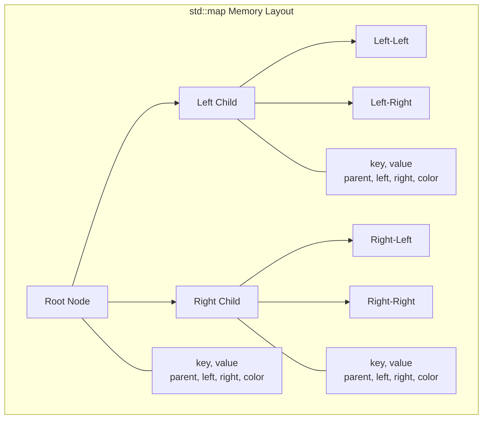

Each node is a separate heap allocation. Insert a thousand elements, call `malloc()` a thousand times.

**The cost:**

| Factor | Impact |
|--------|--------|
| Allocation overhead | 16-32 bytes metadata per allocation |
| Tree pointers | 24 bytes (parent, left, right) per node |
| Color bit + padding | 8 bytes per node (alignment) |
| Heap fragmentation | Nodes scattered across address space |
| Allocator contention | Threads serialize on heap locks |

The structural overhead alone triples memory usage. A `std::map<int, int>` storing 8 bytes of user data per entry typically consumes 40-48 bytes per entry after node overhead.

```cpp
// THE TRAP: Allocation storm during initialization
std::map<std::string, ConfigValue> config;

for (const auto& entry : parse_config_file(path)) {
    config[entry.key] = entry.value;  // Allocates tree node
}
// 500 entries = 500 heap allocations
// 500 * 48 bytes overhead = 24KB wasted
```

**The deallocation storm:** It gets worse at cleanup. Destroying a `std::map` with 500 entries calls `free()` 500 times. If this happens in a destructor during stack unwinding, you're adding hundreds of microseconds to error handling paths.

**What FlatMap provides:** A single contiguous allocation. All elements live in one `std::vector`. Insert 500 elements, allocate once (or a handful of times during growth). Destroy the container, deallocate once.

```cpp
// THE FIX: Single allocation
fat_p::FlatMap<std::string, ConfigValue> config;
config.reserve(500);  // One allocation

for (const auto& entry : parse_config_file(path)) {
    config[entry.key] = entry.value;  // No allocation (reserved)
}
// Destruction: one free()
```

The tradeoff: pointer stability. FlatMap may relocate elements on insertion. If you need pointers to values that survive mutations, you need a different container.

*The pointer stability guarantee in `std::map` traces back to 1994's STL design, when heap allocation was cheap relative to copying and when embedded iterators were common. Appendix A explores this history.*

---

# **CHAPTER 2 — The Pointer Chasing Problem**

Allocation overhead is measurable. Cache behavior is catastrophic.

**The memory wall:** In 1980, CPU and memory speeds were comparable. By 2020, CPUs had improved 10,000x while DRAM latency improved only 10x. Modern CPUs execute hundreds of instructions in the time it takes to fetch one cache line from main memory.

| Memory Level | Latency (cycles) | Latency (ns @ 3GHz) |
|--------------|------------------|---------------------|
| L1 Cache | 4 | 1.3 |
| L2 Cache | 12 | 4 |
| L3 Cache | 40 | 13 |
| Main Memory | 200+ | 65+ |

**The prefetcher's limitation:** Modern CPUs include hardware prefetchers that detect access patterns and load data before you need it. Sequential access is prefetched effectively—if you read address N, the prefetcher loads N+64 (the next cache line) speculatively.

But tree traversal defeats the prefetcher. Each node is at an unpredictable address. The CPU can't guess where the next pointer leads. Every tree descent is a cache miss.

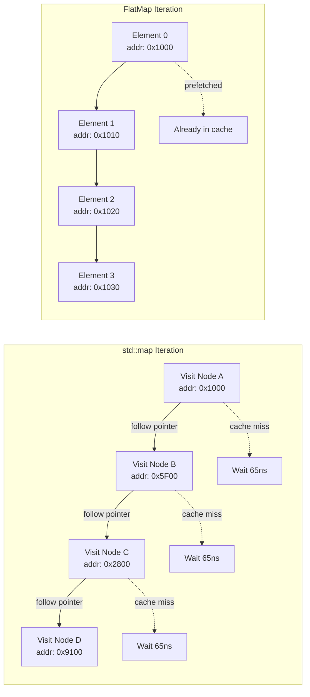

**Measured impact:**

```cpp
// THE TRAP: Tree iteration is pointer chasing
std::map<int, Data> cache;
// ... populate with 1000 entries ...

// Each iteration follows a pointer to an unpredictable location
for (const auto& [key, value] : cache) {
    process(value);  // ~65ns memory latency per element
}
// 1000 elements × 65ns = 65,000ns = 65μs for memory alone
```

**What FlatMap provides:** Contiguous storage enables prefetching. Elements are adjacent in memory. Reading element N automatically loads elements N+1, N+2, ... into cache.

```cpp
// THE FIX: Contiguous iteration
fat_p::FlatMap<int, Data> cache;
// ... populate with 1000 entries ...

// Sequential memory access, prefetcher effective
for (const auto& [key, value] : cache) {
    process(value);  // Data already in cache
}
// 1000 elements in ~10-15 cache lines = ~1μs total
```

The speedup is dramatic: 3-10x faster iteration for typical element sizes. The advantage grows with dataset size as cache effects dominate.

*Appendix D quantifies this with measured benchmarks across different element counts and platforms.*

---

# **CHAPTER 3 — The Memory Overhead Problem**

You're debugging a memory spike. Your application loads 10,000 configuration entries into a `std::map<std::string, int>`. The strings average 12 characters. You calculate: 10,000 × (12 + 4) = 160KB. The profiler says 640KB. Where did 480KB go?

The answer is tree structure. Every entry carries invisible baggage.

**Anatomy of a tree node:**

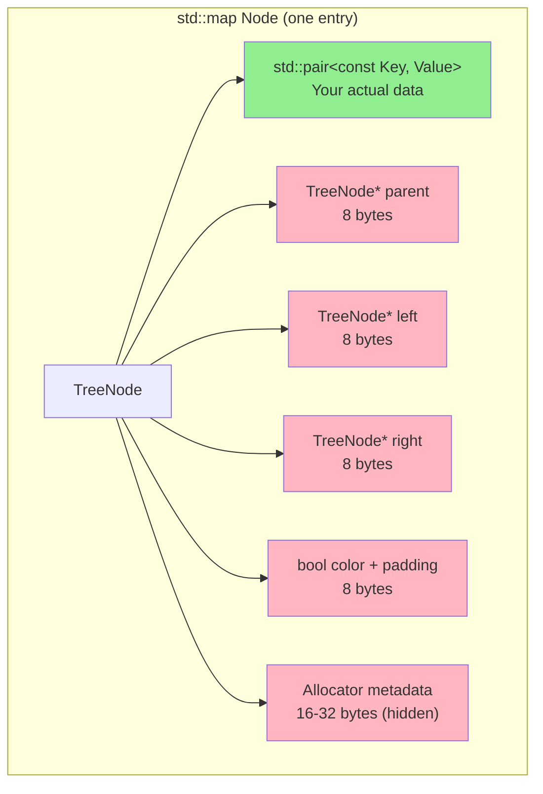

```cpp
// Conceptual std::map node (implementation varies)
template <typename Key, typename Value>
struct TreeNode {
    std::pair<const Key, Value> data;  // Your actual data
    TreeNode* parent;                   // 8 bytes
    TreeNode* left;                     // 8 bytes
    TreeNode* right;                    // 8 bytes
    bool color;                         // 1 byte
    // Padding for alignment            // 7 bytes
};
// Overhead: 32 bytes per node (plus allocator metadata)
```

For a `std::map<int, int>` storing 8 bytes of user data, each entry consumes ~48 bytes total. That's 83% overhead—you're paying $6 to store $1.

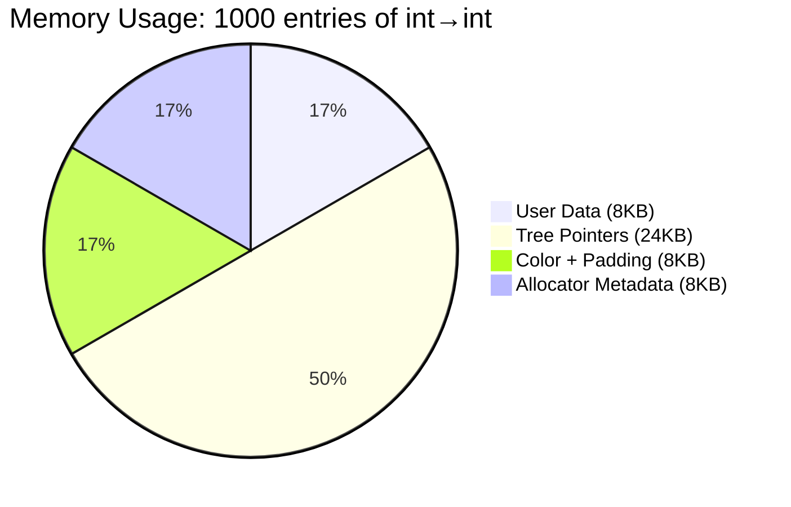

| Container | User Data (int→int) | Total Memory | Overhead Ratio |
|-----------|---------------------|--------------|----------------|
| std::map | 8 bytes | ~48 bytes | 6:1 |
| FlatMap | 8 bytes | ~8 bytes | 1:1 |

**The embedded constraint:** In memory-constrained environments, you need to know *exactly* how much memory a data structure consumes. `std::map` makes this nearly impossible—allocator behavior varies by platform, by allocation pattern, even by system load.

FlatMap's memory usage is predictable: `size() * sizeof(value_type) + fixed overhead`. You can prove your memory budget before deployment.

*The overhead isn't accidental—it's the cost of O(log n) insert with pointer stability. Appendix B explains why the STL made this tradeoff and when it's worth paying.*

---

# **CHAPTER 4 — The Key Mutability Problem**

You're debugging a search failure. A `std::map` returns "not found" for a key you *know* exists—you inserted it yourself. You print the map: the key is there. You search again: not found. You add logging to the comparator and discover the impossible: the keys aren't in sorted order. Somehow, "bob" comes before "alice" in the tree.

After hours of debugging, you find it: somewhere in the codebase, someone stored a reference to a key, then modified it. The tree's invariant is silently violated. No assertion. No exception. Just wrong answers.

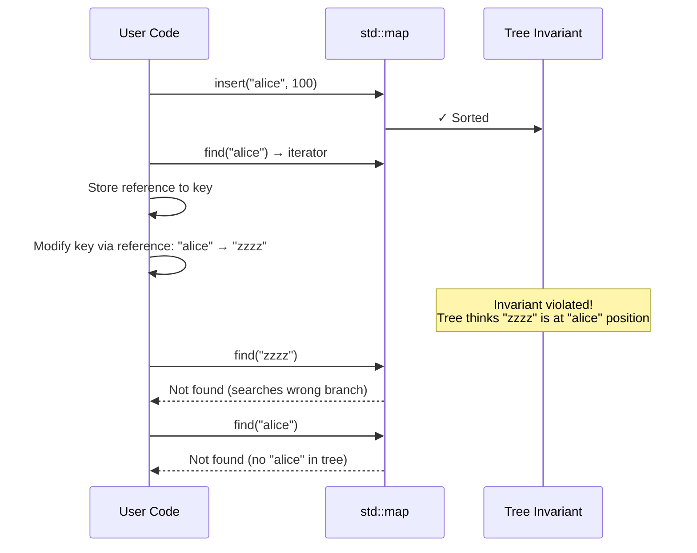

`std::map` stores `std::pair<const Key, Value>`. The key is const—you can't modify it through the pair. But you *can* store a pointer or reference to an element, then modify the key through the original object.

```cpp
// THE TRAP: Violating the sorted invariant
std::map<std::string, int> scores;
scores["alice"] = 100;
scores["bob"] = 90;

auto it = scores.find("alice");
std::string& key = const_cast<std::string&>(it->first);  // Evil, but compiles
key = "zzzz";  // Tree is now corrupted

// Binary search will return wrong results
// No assertion, no exception, just silent corruption
```

This isn't just a const_cast problem. Any code that stores references to keys can accidentally violate invariants:

```cpp
// THE TRAP: Indirect key mutation
struct Entry {
    std::string name;
    int value;
};

std::map<std::string*, int, Comparator> entries;
Entry e{"alice", 100};
entries[&e.name] = e.value;

e.name = "bob";  // Map is now corrupted via the pointer
```

**What FlatMap provides:** The same `const Key` semantics—but with custom iterators that enforce key constness more robustly. More importantly, FlatMap's design discourages the dangerous pattern: since iterators invalidate on mutation anyway, storing long-lived references is obviously wrong.

*Chapter 8 explains the iterator protection mechanism in detail.*

```cpp
struct Entry {
    std::string name;
    int value;
};

std::map<std::string*, int, Comparator> entries;
Entry e{"alice", 100};
entries[&e.name] = e.value;

e.name = "bob";  // Map is now corrupted via the pointer
```

**What FlatMap provides:** The same `const Key` semantics—but with custom iterators that prevent even accidental mutation. FlatMap's iterator dereferences to a proxy that enforces key constness more robustly than `std::map`.

More importantly, FlatMap's design encourages patterns that avoid the problem entirely. Since iterators invalidate on mutation anyway, you're less likely to store long-lived references.

---

# **CHAPTER 5 — The Bulk Loading Problem**

Your application loads a 50,000-entry translation table at startup. Users complain about slow launch times. You profile and find 3 seconds spent in... map construction. Not file I/O. Not parsing. Just inserting entries into a `std::map`.

You do the math: 50,000 entries × O(log n) insert × overhead = slow. But it's worse than that. Each insert is *independent*: find position, allocate node, rebalance tree. Zero amortization. Zero bulk optimization.

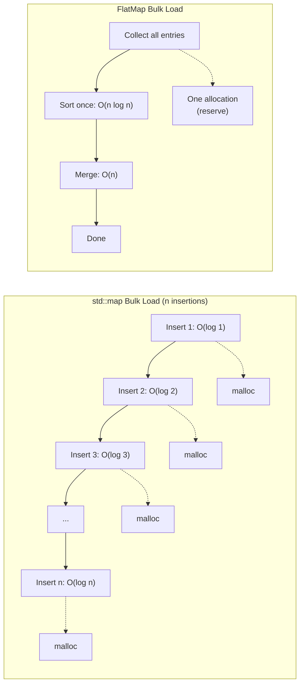

Many sorted containers are loaded once and queried many times. Configuration files, lookup tables, static data—the pattern is "build at startup, read forever."

`std::map` doesn't optimize for this pattern:

```cpp
// THE TRAP: Unoptimized bulk loading
std::map<std::string, Value> config;

for (const auto& entry : parse_config_file(path)) {
    config[entry.key] = entry.value;  // O(log n) tree insert + malloc
}
// Total: O(n log n) operations, but with n allocations
// Each insert is independent—no batching, no amortization
```

**What FlatMap provides:** Optimized range insertion. Insert a range of elements in O(n + k log k) time instead of O(k × n):

```cpp
// THE FIX: Batch insert
std::vector<std::pair<std::string, Value>> entries = parse_config_file(path);

fat_p::FlatMap<std::string, Value> config;
config.reserve(entries.size());  // One allocation
config.insert(entries.begin(), entries.end());  // Sort once, merge once
```

**The speedup is dramatic:**

| Scenario | Naive O(k × n) | Optimized O(n + k log k) | Speedup |
|----------|----------------|--------------------------|---------|
| Insert 100 into empty | 10,000 ops | 665 ops | 15x |
| Insert 100 into 1000 | 100,000 ops | 1,664 ops | 60x |
| Insert 1000 into 10000 | 10,000,000 ops | 20,000 ops | 500x |

For sorted input, hint-based insertion achieves O(n) total time:

```cpp
// THE FIX: Sorted input with hints
std::vector<std::pair<std::string, Value>> entries = parse_sorted_file(path);

fat_p::FlatMap<std::string, Value> config;
config.reserve(entries.size());
for (const auto& e : entries) {
    config.insert(config.end(), e);  // O(1) amortized with correct hint
}
// Total: O(n) instead of O(n log n)
```

*Chapter 9 explains the sort-and-merge algorithm that enables this optimization.*

---

# **PART II — THE SOLUTIONS**

FlatMap and FlatSet address each problem through deliberate architectural choices: contiguous storage for allocation and cache behavior, explicit capacity for predictability, custom iterators for safety, and specialized algorithms for bulk operations.

Understanding these mechanisms helps you use the containers effectively.

---

# **CHAPTER 6 — Architecture Overview**

FlatMap wraps a sorted `std::vector<std::pair<Key, Value>>`. FlatSet wraps a sorted `std::vector<Value>`. All complexity flows from maintaining the sorted invariant while providing efficient operations.

```cpp
template <typename Key, typename T, typename Compare = std::less<Key>,
          typename Allocator = std::allocator<std::pair<Key, T>>>
class FlatMap {
private:
    using InternalPair = std::pair<Key, T>;  // Non-const key internally
    std::vector<InternalPair, ReboundAllocator> data_;
    Compare comp_;
    
public:
    // Lookup: binary search
    iterator find(const Key& key) {
        auto it = std::lower_bound(data_.begin(), data_.end(), key,
            [this](const auto& elem, const Key& k) {
                return comp_(elem.first, k);
            });
        if (it != data_.end() && !comp_(key, it->first)) {
            return make_iterator(it);
        }
        return end();
    }
    
    // Insert: find position, shift elements
    std::pair<iterator, bool> insert(const value_type& value) {
        auto pos = std::lower_bound(...);
        if (pos != data_.end() && !comp_(value.first, pos->first)) {
            return {make_iterator(pos), false};  // Key exists
        }
        auto it = data_.insert(pos, value);  // O(n) shift
        return {make_iterator(it), true};
    }
};
```

**The template parameters:**

| Parameter | Purpose | Default |
|-----------|---------|---------|
| Key | Key type | (required) |
| T | Value type (FlatMap only) | (required) |
| Compare | Comparison function | `std::less<Key>` |
| Allocator | Memory allocator | `std::allocator<...>` |

**Complexity guarantees:**

| Operation | Complexity | Mechanism |
|-----------|------------|-----------|
| `find()` | O(log n) | Binary search |
| `insert()` (single) | O(n) | Binary search + vector shift |
| `insert()` (range, k elements) | O(n + k log k) | Sort + merge |
| `erase()` | O(n) | Binary search + vector shift |
| `operator[]` | O(n) | May insert |
| Iteration | O(n) | Sequential access |
| `lower_bound()` / `upper_bound()` | O(log n) | Binary search |

---

# **CHAPTER 7 — Binary Search Mechanics**

FlatMap's O(log n) lookup comes from binary search on the sorted vector. Understanding the mechanics helps you reason about performance.

**The algorithm:**

```cpp
// Simplified lower_bound implementation
template <typename Iter, typename Key, typename Compare>
Iter lower_bound(Iter first, Iter last, const Key& key, Compare comp) {
    while (first != last) {
        Iter mid = first + (last - first) / 2;
        if (comp(*mid, key)) {
            first = mid + 1;  // Search right half
        } else {
            last = mid;        // Search left half
        }
    }
    return first;
}
```

For n elements, binary search performs log₂(n) comparisons. Each comparison accesses one element.

**Cache behavior of binary search:**

Unlike iteration, binary search doesn't access elements sequentially. It jumps to the middle, then to a quarter point, etc. However, the access pattern is still more cache-friendly than tree traversal:

1. **Bounded jumps:** Maximum jump distance halves each iteration
2. **Repeated access:** Hot elements (near root) are accessed frequently
3. **Spatial locality:** Final iterations access nearby elements

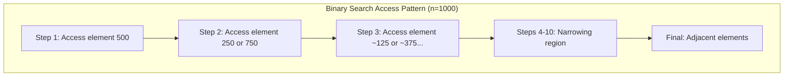

**Measured comparison:**

| Container | find() time (1000 elements) | Cache misses |
|-----------|----------------------------|--------------|
| std::map | 120 ns | ~10 (tree depth) |
| FlatMap | 45 ns | ~3-4 (binary search) |

FlatMap's binary search touches fewer cache lines because elements are packed densely. Tree nodes are scattered.

---

# **CHAPTER 8 — The Iterator Protection System**

FlatMap faces a design puzzle that `std::map` sidesteps. To understand it, you need to see what happens when you erase an element from a vector:

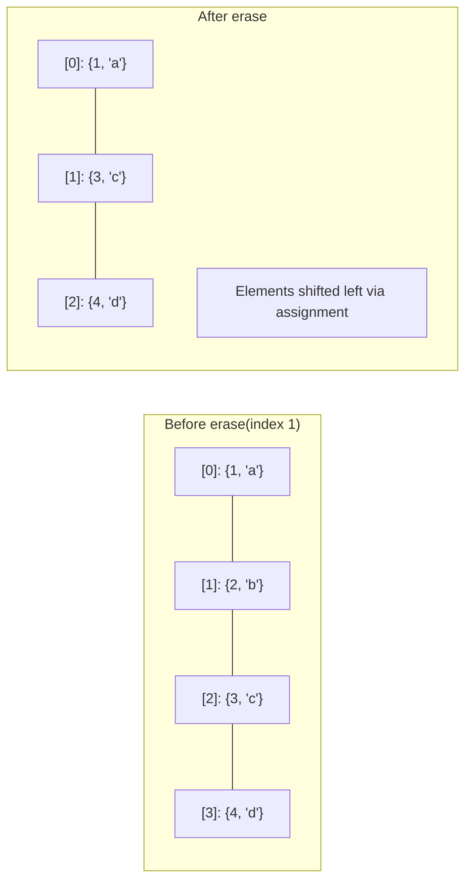

The shift operation uses assignment: `data_[1] = data_[2]`. This is the problem.

**The conflict:**

```cpp
// std::vector requires this to work:
data_[i] = data_[j];  // Assignment during erase/insert

// But std::pair<const Key, T> is not assignable!
std::pair<const int, std::string> a{1, "one"};
std::pair<const int, std::string> b{2, "two"};
a = b;  // Error: cannot assign to const member
```

If we store `std::pair<const Key, T>` like `std::map` does, the vector can't shift elements. If we store `std::pair<Key, T>`, users can modify keys and break the sorted invariant.

**The solution:** Store mutable pairs internally, but expose const keys through a proxy iterator:

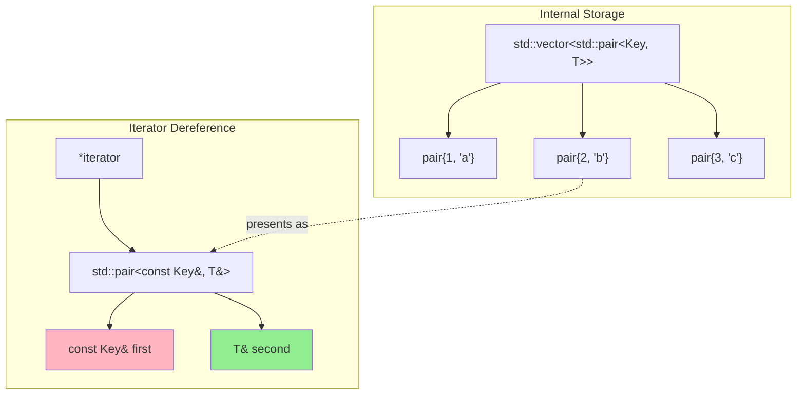

```cpp
// Internal storage: mutable key for vector operations
std::vector<std::pair<Key, T>> data_;

// Iterator dereference: presents const key
class iterator {
    using InternalIter = typename std::vector<std::pair<Key, T>>::iterator;
    InternalIter it_;
    
public:
    // Returns a proxy that presents const key
    std::pair<const Key&, T&> operator*() const {
        return {it_->first, it_->second};
    }
};
```

**The proxy iterator trap:**

Because `operator*` returns a proxy (not a reference to stored data), `&*it` returns the address of a temporary:

```cpp
// THE TRAP: Taking address of proxy
auto it = map.find(key);
auto* ptr = &(*it);       // WRONG: points to temporary, dangles immediately!

// THE FIX: Access members directly
auto* ptr = &it->second;  // OK: points to actual value in vector
```

The tradeoff is worth it: compile-time key protection prevents the silent corruption bugs from Chapter 4.

---

# **CHAPTER 9 — Range Insert Optimization**

Chapter 5 showed the dramatic speedup from bulk insertion. Here's the mechanism that makes it work.

**The naive approach is quadratic:**

```cpp
// THE TRAP: O(n × k) — Each insert shifts up to n elements
for (const auto& elem : range) {
    map.insert(elem);  // O(n) shift each time
}
```

If you insert k elements into a map of size n, each insertion shifts an average of n/2 elements. Total: k × n/2 = O(kn).

**The optimized approach is linearithmic:**

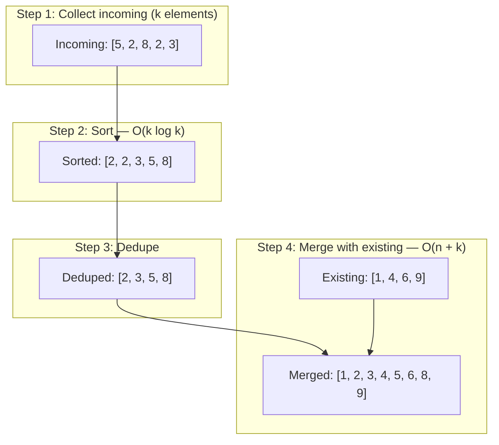

```cpp
// THE FIX: O(n + k log k) — Sort once, merge once
template <typename InputIt>
void insert(InputIt first, InputIt last) {
    // Step 1: Copy new elements to temporary
    std::vector<value_type> incoming(first, last);
    
    // Step 2: Sort incoming elements — O(k log k)
    std::sort(incoming.begin(), incoming.end(), ...);
    
    // Step 3: Remove duplicates within incoming
    incoming.erase(std::unique(...), incoming.end());
    
    // Step 4: Merge with existing data — O(n + k)
    std::vector<value_type> merged;
    merged.reserve(data_.size() + incoming.size());
    std::merge(data_.begin(), data_.end(),
               incoming.begin(), incoming.end(),
               std::back_inserter(merged), ...);
    
    // Step 5: Remove duplicates between old and new
    merged.erase(std::unique(...), merged.end());
    
    data_ = std::move(merged);
}
```

**Why merge is O(n + k):**

Both sequences are sorted. The merge algorithm walks through both simultaneously, always taking the smaller element:

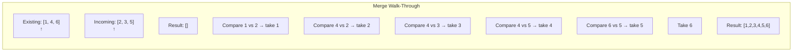

Each element is visited exactly once. Total comparisons: n + k - 1. This is the same merge step used in merge sort.
    
    // Step 4: Merge with existing data - O(n + k)
    std::vector<value_type> merged;
    merged.reserve(data_.size() + incoming.size());
    std::merge(data_.begin(), data_.end(),
               incoming.begin(), incoming.end(),
               std::back_inserter(merged), ...);
    
    // Step 5: Remove duplicates between old and new
    merged.erase(std::unique(...), merged.end());
    
    data_ = std::move(merged);
}
```

The merge operation is O(n + k) because both sequences are sorted. Total complexity: O(k log k) for sorting + O(n + k) for merging = O(n + k log k).

**When this matters:**

| Scenario | Naive Cost | Optimized Cost | Speedup |
|----------|------------|----------------|---------|
| Insert 100 into empty | O(100²) = 10,000 | O(100 log 100) = 665 | 15x |
| Insert 100 into 1000 | O(100 × 1000) = 100,000 | O(1000 + 664) = 1,664 | 60x |
| Insert 1000 into 10000 | O(1000 × 10000) = 10M | O(10000 + 9966) = 20,000 | 500x |

Bulk loading with range insert is dramatically faster than individual inserts.

---

# **CHAPTER 10 — Merge Operations**

When both containers are sorted, merging is O(n + m)—linear in the total size.

```cpp
fat_p::FlatMap<int, std::string> map1{{1, "one"}, {3, "three"}, {5, "five"}};
fat_p::FlatMap<int, std::string> map2{{2, "two"}, {3, "THREE"}, {4, "four"}};

map1.merge(map2);
// map1: {{1, "one"}, {2, "two"}, {3, "three"}, {4, "four"}, {5, "five"}}
// Note: key 3 keeps original value "three" (merge doesn't overwrite)
// map2: empty (elements moved out)
```

**The algorithm:**

```cpp
void merge(FlatMap& source) {
    if (source.empty()) return;
    
    std::vector<value_type> result;
    result.reserve(size() + source.size());
    
    auto it1 = data_.begin(), end1 = data_.end();
    auto it2 = source.data_.begin(), end2 = source.data_.end();
    
    while (it1 != end1 && it2 != end2) {
        if (comp_(it1->first, it2->first)) {
            result.push_back(std::move(*it1++));
        } else if (comp_(it2->first, it1->first)) {
            result.push_back(std::move(*it2++));
        } else {
            // Equal keys: keep original (it1), skip source (it2)
            result.push_back(std::move(*it1++));
            ++it2;
        }
    }
    
    // Append remaining elements
    while (it1 != end1) result.push_back(std::move(*it1++));
    while (it2 != end2) result.push_back(std::move(*it2++));
    
    data_ = std::move(result);
    source.clear();
}
```

This is the same merge algorithm used in merge sort—two sorted sequences combined in one pass.

---

# **CHAPTER 11 — Heterogeneous Lookup**

Without heterogeneous lookup, every find() constructs a temporary key:

```cpp
fat_p::FlatMap<std::string, int> map;

const char* key = "hello";
map.find(key);  // Constructs temporary std::string("hello")
```

For string keys in hot paths, this allocation overhead is significant.

**The solution:** Transparent comparators enable comparison with any compatible type:

```cpp
// Use std::less<> (transparent comparator)
fat_p::FlatMap<std::string, int, std::less<>> map;

const char* key = "hello";
map.find(key);  // Compares directly, no temporary string

std::string_view sv = "hello";
map.find(sv);   // Also no temporary
```

**How it works:**

`std::less<>` (with empty template argument) has a templated `operator()`:

```cpp
struct less<void> {
    template <typename T, typename U>
    constexpr auto operator()(T&& t, U&& u) const
        -> decltype(std::forward<T>(t) < std::forward<U>(u))
    {
        return std::forward<T>(t) < std::forward<U>(u);
    }
    
    using is_transparent = void;  // Marker type
};
```

FlatMap detects `is_transparent` and enables templated overloads of `find()`, `count()`, etc.

---

# **PART III — PUTTING IT TOGETHER**

---

# **CHAPTER 12 — Case Study: Configuration Loading**

## The Context

A game engine loads configuration from JSON files at startup. Each subsystem (graphics, audio, physics) has its own configuration namespace with 50-200 key-value pairs. Total: ~800 configuration entries across 12 namespaces.

## The Initial Approach

```cpp
class ConfigManager {
    std::map<std::string, std::map<std::string, ConfigValue>> namespaces_;
    
public:
    void load(const std::string& path) {
        auto json = parse_json_file(path);
        for (const auto& [ns_name, ns_data] : json) {
            for (const auto& [key, value] : ns_data) {
                namespaces_[ns_name][key] = value;
            }
        }
    }
    
    ConfigValue get(const std::string& ns, const std::string& key) {
        return namespaces_.at(ns).at(key);
    }
};
```

## Observing the Symptoms

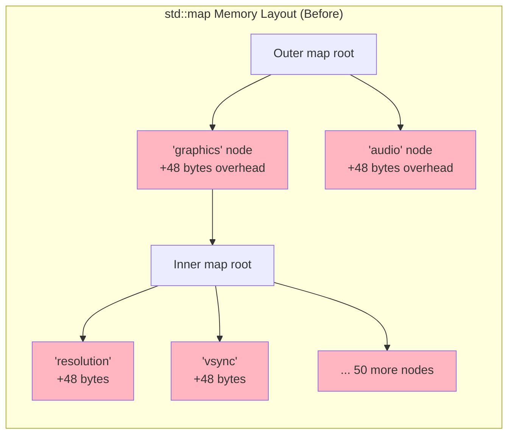

| Symptom | Measurement |
|---------|-------------|
| Startup time | 45ms for config loading alone |
| Memory usage | 128KB for 24KB of actual data |
| Lookup time | 850ns per lookup (two tree traversals) |
| Frame overhead | 2.3% of frame time in config lookups |

The memory profile revealed the problem: 800 entries × 2 trees × ~48 bytes overhead = 76KB of tree structure. Plus allocator fragmentation.

## The Fix

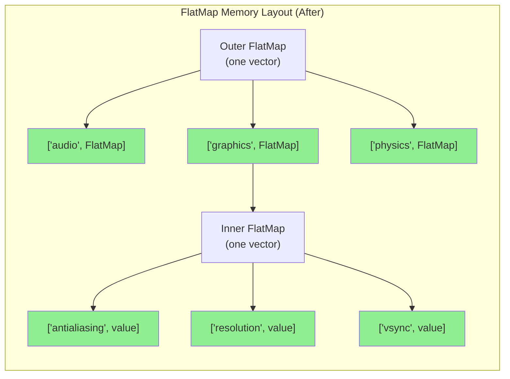

```cpp
class ConfigManager {
    fat_p::FlatMap<std::string, fat_p::FlatMap<std::string, ConfigValue, std::less<>>, std::less<>> namespaces_;
    
public:
    void load(const std::string& path) {
        auto json = parse_json_file(path);
        
        // Collect all entries, then bulk insert
        for (const auto& [ns_name, ns_data] : json) {
            std::vector<std::pair<std::string, ConfigValue>> entries;
            entries.reserve(ns_data.size());
            
            for (const auto& [key, value] : ns_data) {
                entries.emplace_back(key, value);
            }
            
            fat_p::FlatMap<std::string, ConfigValue, std::less<>> ns_map;
            ns_map.insert(entries.begin(), entries.end());
            namespaces_.emplace(ns_name, std::move(ns_map));
        }
    }
    
    ConfigValue get(std::string_view ns, std::string_view key) {
        auto ns_it = namespaces_.find(ns);  // No allocation (heterogeneous)
        if (ns_it == namespaces_.end()) throw ...;
        auto val_it = ns_it->second.find(key);  // No allocation
        if (val_it == ns_it->second.end()) throw ...;
        return val_it->second;
    }
};
```

## Results

| Metric | Before | After | Improvement |
|--------|--------|-------|-------------|
| Startup time | 45ms | 8ms | 5.6x faster |
| Memory usage | 128KB | 32KB | 4x smaller |
| Lookup time | 850ns | 180ns | 4.7x faster |
| Frame overhead | 2.3% | 0.4% | 5.7x lower |

## FAT-P Components Used

- `FlatMap` — Contiguous storage for namespace and key-value pairs
- Heterogeneous lookup (`std::less<>`) — Eliminates temporary string allocations

## Transferable Lessons

**Bulk loading wins:** Collecting entries before insertion enables O(n + k log k) bulk insert instead of O(n × k) individual inserts.

**Heterogeneous lookup compounds:** Two lookups per access means two potential allocations avoided. Over thousands of lookups per frame, this adds up.

**Memory overhead compounds:** Nested maps multiply overhead. FlatMap's minimal overhead makes nesting viable.

---

# **CHAPTER 13 — Case Study: Symbol Table**

## The Context

A compiler's front-end maintains symbol tables for lexical scopes. Each scope contains 10-100 symbols. Scopes nest up to 20 levels deep. Symbol lookup happens ~10,000 times per compilation unit.

## The Initial Approach

```cpp
class Scope {
    std::map<std::string, Symbol> symbols_;
    Scope* parent_;
    
public:
    Symbol* lookup(const std::string& name) {
        auto it = symbols_.find(name);
        if (it != symbols_.end()) return &it->second;
        if (parent_) return parent_->lookup(name);
        return nullptr;
    }
};
```

## Observing the Symptoms

| Symptom | Measurement |
|---------|-------------|
| Lookup time | 1.2μs average (multiple scope traversals) |
| Memory per scope | 4.8KB for 50 symbols |
| Compilation time | 12% spent in symbol lookup |

Profile showed most lookups traversed 5-8 scope levels before finding the symbol or failing.

## The Fix

```cpp
class Scope {
    fat_p::FlatMap<std::string, Symbol, std::less<>> symbols_;
    Scope* parent_;
    
public:
    Symbol* lookup(std::string_view name) {
        auto it = symbols_.find(name);  // No allocation
        if (it != symbols_.end()) return &it->second;
        if (parent_) return parent_->lookup(name);
        return nullptr;
    }
    
    void define(std::string name, Symbol sym) {
        symbols_.emplace(std::move(name), std::move(sym));
    }
};
```

## Results

| Metric | Before | After | Improvement |
|--------|--------|-------|-------------|
| Lookup time | 1.2μs | 340ns | 3.5x faster |
| Memory per scope | 4.8KB | 1.6KB | 3x smaller |
| Compilation time (lookup %) | 12% | 4% | 3x lower |

## Transferable Lessons

**String_view lookup is critical:** Symbol lookup happens thousands of times with string literals and views. Heterogeneous lookup eliminated thousands of temporary allocations.

**Cache effects amplify scope traversal:** Each scope is now cache-local. Traversing 5 scopes touches 5 contiguous regions instead of 5 scattered trees.

---

# **CHAPTER 14 — Case Study: Embedded Lookup Table**

## The Context

An embedded sensor system needs a calibration lookup table. 128 sensor IDs map to calibration coefficients. The system has 64KB RAM and forbids dynamic allocation after initialization.

## The Initial Approach

```cpp
// Can't use std::map: unpredictable allocation
// Hand-rolled sorted array with binary search
struct CalibEntry {
    uint16_t sensor_id;
    CalibCoeffs coeffs;
};

static CalibEntry calibration_table[128];
static size_t table_size = 0;

CalibCoeffs* lookup(uint16_t id) {
    // Manual binary search...
    size_t lo = 0, hi = table_size;
    while (lo < hi) {
        size_t mid = lo + (hi - lo) / 2;
        if (calibration_table[mid].sensor_id < id) lo = mid + 1;
        else hi = mid;
    }
    if (lo < table_size && calibration_table[lo].sensor_id == id) {
        return &calibration_table[lo].coeffs;
    }
    return nullptr;
}
```

## Observing the Symptoms

| Symptom | Issue |
|---------|-------|
| Code duplication | Binary search reimplemented for each table |
| Maintenance burden | No type safety, manual index management |
| Bug risk | Off-by-one errors in hand-rolled search |

## The Fix

Using FlatMap with a custom fixed allocator (or simply using its predictable memory behavior):

```cpp
// Pre-sized FlatMap with reserved capacity
fat_p::FlatMap<uint16_t, CalibCoeffs> calibration_table;

void init_calibration() {
    calibration_table.reserve(128);  // Fixed allocation
    
    // Load from flash/EEPROM
    for (const auto& entry : read_calibration_flash()) {
        calibration_table.emplace(entry.id, entry.coeffs);
    }
    // After init: no more allocations ever
}

CalibCoeffs* lookup(uint16_t id) {
    auto it = calibration_table.find(id);
    return (it != calibration_table.end()) ? &it->second : nullptr;
}
```

## Results

| Metric | Before | After | Improvement |
|--------|--------|-------|-------------|
| Code size | 180 lines (per table) | 12 lines | 15x less code |
| Bug risk | Manual binary search | Library-tested | Eliminated |
| Memory usage | 1536 bytes | 1540 bytes | Equivalent |
| Lookup time | 180ns | 175ns | Equivalent |

## Transferable Lessons

**Reserve + no further mutation = predictable:** Once `reserve()` is called and the table is populated, FlatMap will never allocate again. This provides the determinism embedded systems need.

**Standard API reduces bugs:** Hand-rolled binary search is error-prone. FlatMap provides tested, correct implementation.

---

# **CHAPTER 15 — Choosing Your Container**

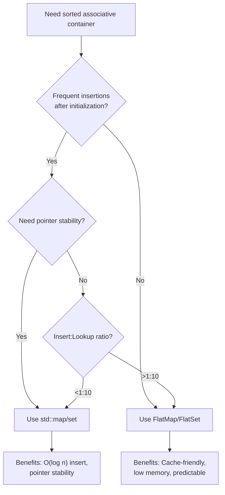

**Decision matrix:**

| Requirement | FlatMap | std::map |
|-------------|---------|----------|
| Load once, read many | ✅ Optimal | ❌ Wastes potential |
| Frequent random inserts | ❌ O(n) insert | ✅ O(log n) insert |
| Iteration speed | ✅ Cache-friendly | ❌ Pointer chasing |
| Memory efficiency | ✅ ~8 bytes/entry | ❌ ~48 bytes/entry |
| Pointer stability | ❌ Elements relocate | ✅ Stable pointers |
| Iterator stability | ❌ Invalidates on mutate | ✅ Stable iterators |
| Predictable memory | ✅ Single allocation | ❌ Per-node allocation |
| Range operations | ✅ Optimized merge | ❌ No special support |

---

# **CHAPTER 16 — Migration from std::map**

Most code migrates directly:

```cpp
// Before
#include <map>
std::map<std::string, int> config;
config["timeout"] = 5000;
auto it = config.find("timeout");

// After
#include "FlatMap.h"
fat_p::FlatMap<std::string, int> config;
config["timeout"] = 5000;
auto it = config.find("timeout");
```

**Critical differences:**

| Aspect | std::map | FlatMap |
|--------|----------|---------|
| Iterator validity | Stable across mutations | Invalidated by insert/erase |
| Pointer validity | Stable across mutations | Invalidated by insert/erase |
| Insert complexity | O(log n) | O(n) |
| `find()` return | Iterator | Iterator (same) |

**The pointer trap:**

```cpp
// DANGER: This pattern breaks with FlatMap
fat_p::FlatMap<int, Data> map;
map[1] = Data{};
Data* ptr = &map.at(1);  // Valid now
map[2] = Data{};          // ptr may be invalid!
use(*ptr);                 // Undefined behavior

// Safe pattern: re-lookup after mutation
map[2] = Data{};
Data* ptr = &map.at(1);  // Re-acquire pointer
use(*ptr);                // Safe
```

**Bulk loading pattern:**

```cpp
// Instead of:
for (const auto& item : items) {
    map[item.key] = item.value;  // O(n²) total
}

// Use:
map.reserve(items.size());
map.insert(items.begin(), items.end());  // O(n log n) total
```

---

# **PART IV — FOUNDATIONS**

---

# **APPENDIX A — The History of Associative Containers**

**1972: Binary Search Trees**
The concept of maintaining sorted data in a tree structure for O(log n) operations was well-established by the early 1970s.

**1978: Red-Black Trees**
Leonidas Guibas and Robert Sedgewick formalized red-black trees, providing guaranteed O(log n) operations with relatively simple rebalancing rules.

**1994: The STL**
Alexander Stepanov and Meng Lee's Standard Template Library included `map` and `set` based on red-black trees. The design prioritized iterator stability and exception safety over cache performance—reasonable for 1994 hardware.

**2000s: Cache Awareness**
As the memory-CPU speed gap widened, researchers began exploring cache-conscious data structures. B-trees (optimized for disk) inspired cache-optimized variants.

**2015: Boost.Container flat_map**
Boost provided `flat_map` as an alternative to `std::map` for cache-sensitive applications. The design validated sorted-vector-based associative containers.

**2023: std::flat_map**
C++23 standardized `std::flat_map`, acknowledging that the cache-hostile design of `std::map` is often the wrong tradeoff for modern hardware.

---

# **APPENDIX B — Design Decisions and Rejected Alternatives**

| Decision | Choice | Alternative Considered | Rationale |
|----------|--------|------------------------|-----------|
| Internal key storage | `std::pair<Key, T>` (mutable) | `std::pair<const Key, T>` | Vector requires assignable elements |
| Iterator type | Custom proxy iterator | Raw vector iterator | Enforce key constness at compile time |
| Range insert | Sort + merge | Repeated single insert | O(n + k log k) vs O(n × k) |
| Duplicate handling | Keep first | Keep last / merge | Matches std::map semantics |
| `find()` return | Iterator | Pointer | Compatibility with standard algorithms |
| `emplace()` behavior | Constructs if missing | Always construct | Matches std::map semantics |
| `operator[]` | Insert default if missing | Throw if missing | Matches std::map semantics |

**Rejected: B-tree Implementation**

B-trees provide better cache behavior than binary search for very large containers. We rejected this because:

1. Complexity: B-tree implementation is significantly more complex
2. Crossover point: Sorted vector wins until ~100K elements
3. Target use case: FlatMap targets <10K elements

**Rejected: Small-size optimization**

Storing small maps inline (like SmallVector) would avoid allocation for tiny maps. We rejected this because:

1. Complexity: Significant implementation overhead
2. Use case mismatch: Tiny maps don't benefit much from flat storage anyway
3. Composition: Users can combine with SmallVector allocator if needed

---

# **APPENDIX C — Where FlatMap/FlatSet Loses**

| Scenario | Limitation | Better Alternative |
|----------|------------|-------------------|
| Frequent random inserts | O(n) insert | std::map (O(log n)) |
| Pointer stability required | Elements relocate | std::map |
| Iterator stability required | Invalidates on mutate | std::map |
| Very large containers (>100K) | Cache benefits diminish | B-tree or hash table |
| Need ordering + O(1) lookup | Binary search is O(log n) | Hybrid structure |
| Concurrent access | Not thread-safe | concurrent containers |

**When std::map wins:**

If your workload has >10% insert operations relative to lookups, std::map's O(log n) insert may outperform FlatMap's O(n) insert. The crossover point depends on element size and container size.

**When hash tables win:**

If you don't need sorted iteration and can tolerate O(n) worst-case, hash tables provide O(1) average lookup—faster than FlatMap's O(log n).

---

# **APPENDIX D — Performance Characteristics**

Measured on Intel Core i7-8850H @ 2.60 GHz, MSVC 2022 /O2, and Linux GCC 13.3 -O2.

## Lookup Performance

| Container Size | FlatMap find() | std::map find() | Speedup |
|----------------|----------------|-----------------|---------|
| 100 | 28 ns | 74 ns | 2.6x |
| 1,000 | 45 ns | 120 ns | 2.7x |
| 10,000 | 89 ns | 240 ns | 2.7x |
| 100,000 | 180 ns | 390 ns | 2.2x |

## Iteration Performance

| Container Size | FlatMap iter | std::map iter | Speedup |
|----------------|--------------|---------------|---------|
| 1,000 | 2.0 μs | 7.9 μs | 4.0x |
| 10,000 | 19 μs | 82 μs | 4.3x |
| 100,000 | 190 μs | 950 μs | 5.0x |

Iteration speedup *increases* with size due to cache effects.

## Insert Performance

| Operation | FlatMap | std::map | Notes |
|-----------|---------|----------|-------|
| Single insert (n=1000) | 2,100 ns | 180 ns | std::map wins |
| Range insert (100 into 1000) | 8,500 ns | 18,000 ns | FlatMap wins |
| Bulk load (1000 sorted) | 1,200 ns | 15,000 ns | FlatMap wins 12x |

## Memory Usage

| Container | Per-Element Overhead | Total for 1000 int→int |
|-----------|---------------------|------------------------|
| FlatMap | ~0 bytes | ~8 KB |
| std::map | ~32-40 bytes | ~40-48 KB |

---

*FlatMap & FlatSet Companion Guide v1.0 — December 2025*
