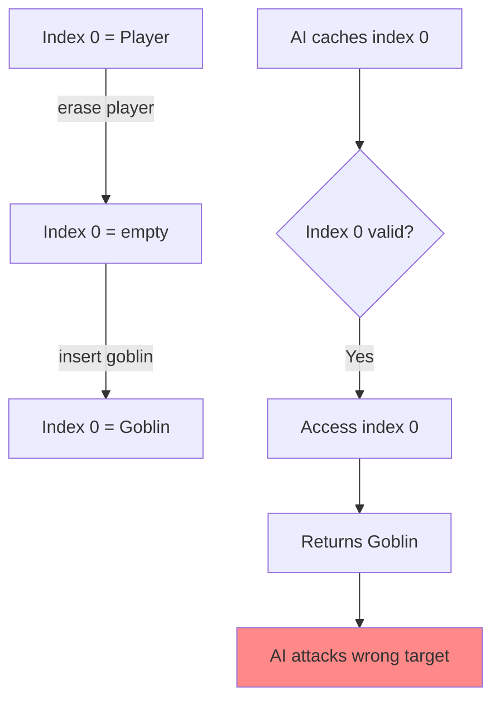
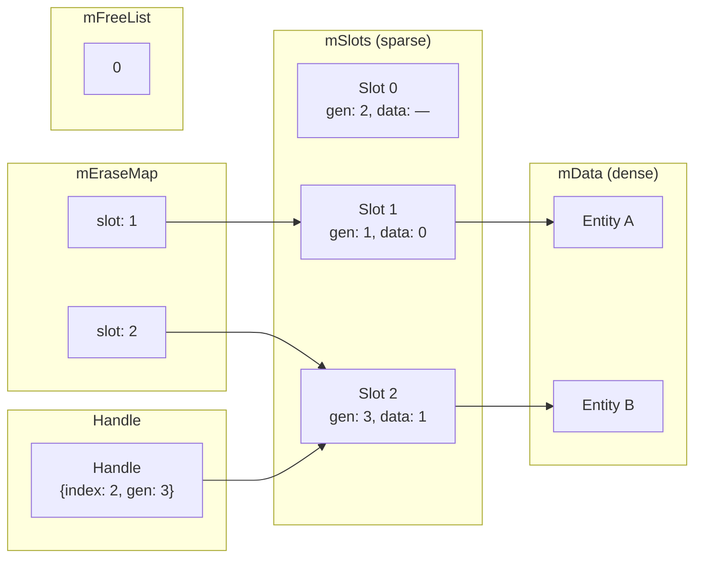

# **The Dangling Pointer Must Die**

### *A Companion Guide to FAT-P's SlotMap*

---

**Scope:** This guide covers `SlotMap`, FAT-P's generational-index container for managing objects with stable, ABA-protected handles. It addresses the pointer stability problems of `std::vector`, the overhead of `shared_ptr`, and the ABA vulnerability of raw indices. Other FAT-P data structures (StableHashMap, FlatMap, IdGenerator) are documented separately.

---

# **Table of Contents**

**[Introduction: Why This Component Exists](#introduction-why-this-component-exists)**

## Part I — The Problems

1. [The Pointer Invalidation Problem](#chapter-1--the-pointer-invalidation-problem)
2. [The ABA Problem](#chapter-2--the-aba-problem)
3. [The shared_ptr Tax](#chapter-3--the-shared_ptr-tax)
4. [The O(n) Erase Problem](#chapter-4--the-on-erase-problem)
5. [The Iteration Cache Problem](#chapter-5--the-iteration-cache-problem)

## Part II — The Solutions

6. [Architecture Overview](#chapter-6--architecture-overview)
7. [The Generation Counter Mechanism](#chapter-7--the-generation-counter-mechanism)
8. [Swap-and-Pop Deletion](#chapter-8--swap-and-pop-deletion)
9. [The Free List](#chapter-9--the-free-list)
10. [Dense vs. Entry Iteration](#chapter-10--dense-vs-entry-iteration)
11. [Checked vs. Unchecked Access](#chapter-11--checked-vs-unchecked-access)

## Part III — Putting It Together

12. [Case Study: Game Entity Management](#chapter-12--case-study-game-entity-management)
13. [Case Study: Resource Pool with Handles](#chapter-13--case-study-resource-pool-with-handles)
14. [Case Study: Event Listener Registry](#chapter-14--case-study-event-listener-registry)
15. [Choosing the Right Container](#chapter-15--choosing-the-right-container)
16. [Migration from Pointers and Indices](#chapter-16--migration-from-pointers-and-indices)

## Part IV — Foundations

- [Appendix A — The History of Handle-Based Containers](#appendix-a--the-history-of-handle-based-containers)
- [Appendix B — Design Decisions and Rejected Alternatives](#appendix-b--design-decisions-and-rejected-alternatives)
- [Appendix C — Where SlotMap Loses](#appendix-c--where-slotmap-loses)
- [Appendix D — Performance Characteristics](#appendix-d--performance-characteristics)
- [Appendix E — Architectural Honesty: When Not to Use SlotMap](#appendix-e--architectural-honesty-when-not-to-use-slotmap)

---

# **Introduction: Why This Component Exists**

You're building a game engine. Every frame, physics processes collision pairs. The AI system caches target references. The rendering system holds entity handles for culling. Thousands of cross-references, updated 60 times per second.

Then a player dies. The entity is removed. Now what?

Every system holding a reference to that entity must somehow know it's gone. Raw pointers? Dangling—undefined behavior on next access. Indices into a vector? The ABA problem—the slot gets reused, and your index now points to a goblin instead of the player. `shared_ptr`? Every entity access now involves atomic reference counting, and your cache-friendly ECS becomes a contention nightmare.

Or this: you're building a resource manager. Textures, meshes, audio clips—all loaded on demand, unloaded when memory pressure hits. External code holds handles to these resources. When a texture is unloaded and its slot reused for a new texture, how do you prevent the old handle from accessing the wrong data?

Or this: you're implementing an event system. Listeners register callbacks and receive handles. Later, they unsubscribe. But what if they try to use a stale handle? What if the slot was reused for a different listener?

These aren't edge cases. They're the fundamental challenge of managing objects with external references that outlive the objects themselves. The solutions in the standard library each fail in different ways:

- `std::vector` with indices: ABA problem—reused indices return wrong data
- `std::vector` with pointers: invalidated on any growth or erasure
- `std::map<ID, T>`: O(log n) access, poor cache locality, manual ID management
- `std::shared_ptr<T>`: reference counting overhead, shared ownership semantics

SlotMap exists for engineers who need **O(1) access with automatic staleness detection**:

- **Generational handles** that detect stale references automatically
- **O(1) insert/erase/access** without hash table overhead
- **Dense storage** for cache-friendly iteration
- **Swap-and-pop deletion** without O(n) shifting
- **~890 lines** of auditable, header-only, dependency-free code

This guide explains the problems SlotMap solves and how it solves them.

---

# **PART I — THE PROBLEMS**

Object lifetime management seems simple: allocate when needed, deallocate when done. The complications arise when external code holds references to objects that may be deleted. How you handle this determines whether your system is correct, performant, or a source of subtle bugs.

Understanding these problems explains why SlotMap makes the choices it does.

---

# **CHAPTER 1 — The Pointer Invalidation Problem**

The most natural way to reference an object is with a pointer. Store the address, dereference when needed. Simple, fast, zero overhead.

Until the object moves.

```cpp
// THE TRAP: Pointer invalidation
std::vector<Entity> entities;
entities.emplace_back("Player", 100);
Entity* player = &entities[0];

entities.emplace_back("Goblin", 50);  // May reallocate!

player->update();  // UNDEFINED BEHAVIOR if vector grew
```

`std::vector` stores elements contiguously. When capacity is exceeded, it allocates a larger buffer and moves all elements. Every pointer to every element becomes dangling.

This isn't a bug—it's documented behavior. But it's a trap that catches even experienced programmers.

**The "just reserve" fallacy:**

```cpp
std::vector<Entity> entities;
entities.reserve(1000);  // "Now we're safe!"

Entity* player = &entities.emplace_back("Player", 100);

// ... 1000 entities later ...
entities.emplace_back("Boss", 500);  // Still reallocates!
player->update();  // Still undefined behavior
```

Reserving delays the problem; it doesn't solve it. Unless you know the exact maximum count at compile time, pointers to vector elements are never safe to store.

**The erase problem:**

Even without reallocation, erasure invalidates pointers:

```cpp
std::vector<Entity> entities;
entities.reserve(1000);

Entity* player = &entities[0];
Entity* enemy = &entities[5];

entities.erase(entities.begin() + 3);  // Shifts elements 4+ left

// player still valid (before erased position)
// enemy NOW INVALID (shifted left, points to wrong element)
```

| Symptom | Cause |
|---------|-------|
| Crash on entity access | Pointer invalidated by vector growth |
| Wrong entity updated | Pointer invalidated by earlier erase |
| Works in testing, fails in production | Testing dataset fit in reserved capacity |
| Intermittent corruption | Occasional reallocation |

**What SlotMap provides:** Handles that remain valid regardless of insertions or erasures. Access goes through an indirection table, so the handle doesn't encode a physical address—it encodes a *logical identity*.

---

# **CHAPTER 2 — The ABA Problem**

Okay, pointers are dangerous. What about indices?

```cpp
std::vector<Entity> entities;
auto player_idx = entities.size();
entities.emplace_back("Player", 100);

// Store the index, not a pointer
// Index survives reallocation!
```

Indices survive vector growth. Problem solved?

No. The ABA problem is waiting.

```cpp
// Frame 1: Create player at index 0
size_t player_idx = 0;
entities.emplace_back("Player", 100);
ai_system.set_target(player_idx);

// Frame 2: Player dies
entities.erase(entities.begin());  // Shifts remaining elements
// OR: swap with last and pop
std::swap(entities[0], entities.back());
entities.pop_back();

// Frame 3: New goblin spawns
entities.emplace_back("Goblin", 50);  // Reuses index 0

// Frame 4: AI system uses cached index
Entity& target = entities[player_idx];  // Returns Goblin!
// AI thinks it's attacking the player
// Actually attacking a friendly goblin
// No crash, no exception, just wrong behavior
```

The name "ABA problem" comes from concurrent programming: the value was A, changed to B, changed back to A. An observer checking for A sees a match and proceeds—unaware that the value changed.

In our case:
- Index was **A** (pointing to Player)
- Index became invalid (slot empty or reused)
- Index is **A** again (same index, different entity)

The observer (AI system) can't distinguish old-A from new-A.

**Why this is worse than crashes:**

A dangling pointer crash is obvious. It happens immediately, the stack trace points to the bug, you fix it. The ABA problem produces *silent data corruption*. The AI attacks the wrong target. The physics system applies forces to the wrong body. The renderer draws the wrong mesh. The game ships, players report "weird behavior," and you spend weeks tracking down a heisenbug.



**What SlotMap provides:** Generational handles. Each handle encodes not just *which slot* but *which version of that slot*. When a slot is reused, its generation increments. Stale handles fail validation instead of returning wrong data.

---

# **CHAPTER 3 — The shared_ptr Tax**

If indices are vulnerable to ABA, and pointers are vulnerable to invalidation, what about smart pointers?

```cpp
std::vector<std::shared_ptr<Entity>> entities;
auto player = std::make_shared<Entity>("Player", 100);
entities.push_back(player);

// Pass player around freely
ai_system.set_target(player);
render_system.track(player);

// Player dies
entities.erase(std::find(entities.begin(), entities.end(), player));
player.reset();  // Our reference gone

// AI and render still hold references
// Object stays alive until all references cleared
```

`shared_ptr` solves both problems: the object can't move (it's heap-allocated), and it can't be destroyed while references exist (reference counting).

**The hidden costs:**

| Cost | Impact |
|------|--------|
| Heap allocation per object | ~50ns per entity creation |
| Reference counting | Atomic increment/decrement on every copy |
| Cache locality destroyed | Entities scattered across heap |
| Shared ownership semantics | Lifetime determined by last reference, not explicit destruction |

**The reference counting overhead:**

```cpp
void process_entity(std::shared_ptr<Entity> e) {  // Atomic increment
    e->update();
}  // Atomic decrement

// In a hot loop:
for (auto& entity : entities) {
    process_entity(entity);  // 2 atomic operations per iteration
}
```

Atomic operations aren't free. On modern CPUs, an atomic increment is 10-20 cycles with no contention. With multiple threads accessing the same entity, the cache line bounces between cores—100+ cycles per operation.

**The iteration disaster:**

```cpp
// std::vector<Entity>: contiguous memory
for (auto& entity : entities) {
    entity.update();  // Prefetcher happy, cache hits
}

// std::vector<shared_ptr<Entity>>: scattered heap allocations
for (auto& ptr : entities) {
    ptr->update();  // Each entity is a separate allocation
                    // Prefetcher useless, cache misses
}
```

The performance difference is dramatic. Dense iteration over `shared_ptr` can be 5-10x slower than iteration over contiguous storage.

**The ownership inversion:**

`shared_ptr` provides *shared ownership*. The object lives until all references are gone. This is often the wrong semantics for game entities:

```cpp
// Intended: Entity dies when removed from world
world.remove(entity);

// Reality with shared_ptr: Entity persists
// until AI, physics, render all release their references
// "Dead" entities continue updating, rendering, colliding
```

**What SlotMap provides:** Explicit ownership (the SlotMap owns all elements), O(1) access without atomic operations, and dense iteration over contiguous storage. References are handles, not smart pointers—they *query* the SlotMap rather than *owning* the entity.

---

# **CHAPTER 4 — The O(n) Erase Problem**

Pointers fail. Indices fail. Smart pointers are slow. What about just accepting the cost of safe erasure?

`std::vector::erase` shifts all subsequent elements to fill the gap:

```cpp
std::vector<Entity> entities(10000);

// Erase element 5000
entities.erase(entities.begin() + 5000);
// Elements 5001-9999 shift left
// 4999 move operations!
```

At scale, this is catastrophic:

| Elements | Erase Position | Elements Moved |
|----------|----------------|----------------|
| 1,000 | Middle | ~500 |
| 10,000 | Middle | ~5,000 |
| 100,000 | Middle | ~50,000 |

With 60 erasures per frame at 60 FPS, that's potentially millions of moves per second.

**The "stable" container trap:**

`std::list` provides O(1) erase without shifting:

```cpp
std::list<Entity> entities;
auto it = entities.begin();
std::advance(it, 5000);
entities.erase(it);  // O(1) removal, no shifting
```

But `std::list` trades one problem for another:

- Per-element heap allocation
- Pointer-chasing iteration (cache disaster)
- No random access (O(n) to find element N)

The cure is worse than the disease.

**What SlotMap provides:** Swap-and-pop deletion. Instead of shifting elements, swap the erased element with the last element, then pop. The dense array stays compact, erasure is O(1), and no elements move except the one being swapped.

```cpp
// SlotMap erase (conceptual):
void erase(size_t data_index) {
    swap(data[data_index], data.back());
    update_indirection(data_index);  // Fix the swapped element's slot
    data.pop_back();
}
```

---

# **CHAPTER 5 — The Iteration Cache Problem**

Game engines don't just access individual entities—they process all entities every frame. Physics iterates all bodies. Rendering iterates all meshes. AI iterates all agents.

Iteration performance depends on memory layout.

**The contiguous advantage:**

```cpp
// Contiguous storage: hardware prefetcher works
std::vector<Entity> entities(10000);
for (auto& e : entities) {
    e.update();  // Sequential memory access
                 // CPU prefetches next cache line automatically
}
```

Modern CPUs fetch 64-byte cache lines. If entities are 64 bytes each, accessing entity N loads entity N+1 for free. The prefetcher detects sequential patterns and loads ahead.

**The scattered disaster:**

```cpp
// Pointer-based storage: prefetcher useless
std::vector<Entity*> entities(10000);
for (auto* e : entities) {
    e->update();  // Random memory access
                  // Each entity is a cache miss
}
```

Each pointer dereference jumps to an unpredictable address. The prefetcher can't anticipate where you'll go next. Every access potentially waits for main memory—100+ cycles per entity instead of 1-2.

| Storage Model | Time per Entity | Time for 10K Entities |
|--------------|-----------------|----------------------|
| Contiguous | ~2 ns | ~20 µs |
| Scattered (in cache) | ~5 ns | ~50 µs |
| Scattered (cache miss) | ~60 ns | ~600 µs |

**The indirection dilemma:**

Stable handles require indirection—the handle doesn't contain the address, it contains information used to *compute* the address. Does this mean cache disaster?

**What SlotMap provides:** Two-phase indirection that preserves dense iteration. The data array is contiguous. Normal iteration (`for (auto& e : map)`) traverses this dense array directly—no indirection, full prefetcher benefits. Handle-based access goes through indirection, but that's O(1) and only happens when you *need* a specific element.

---

# **PART II — THE SOLUTIONS**

SlotMap combines several mechanisms to provide O(1) operations with ABA protection and dense iteration. Understanding these mechanisms explains the design tradeoffs.

---

# **CHAPTER 6 — Architecture Overview**

SlotMap maintains four internal arrays:



| Array | Purpose | Indexing |
|-------|---------|----------|
| `mData` | Dense storage of values | Contiguous, no holes |
| `mSlots` | Maps handle.index → {generation, data_index} | Sparse, may have free slots |
| `mEraseMap` | Maps data_index → slot_index | Parallel to mData |
| `mFreeList` | Indices of reusable slots | LIFO stack |

**Why four arrays?**

Each array serves a specific purpose that enables O(1) operations:

1. **mData** provides cache-friendly iteration
2. **mSlots** provides O(1) handle validation and lookup
3. **mEraseMap** enables O(1) erasure (find the slot to update after swap)
4. **mFreeList** enables O(1) slot reuse (no scanning for free slots)

---

# **CHAPTER 7 — The Generation Counter Mechanism**

The core innovation is the generation counter. Each slot tracks how many times it has been reused.

```cpp
struct Slot {
    uint32_t generation;   // Incremented on each insert/erase
    uint32_t data_index;   // Index into mData
};

struct Handle {
    uint32_t index;        // Which slot
    uint32_t generation;   // Which version of that slot
};
```

**The validation check:**

```cpp
bool is_valid(Handle h) const {
    if (h.index >= mSlots.size()) return false;
    return mSlots[h.index].generation == h.generation;
}
```

If generations match, the handle refers to the current occupant of the slot. If they differ, the slot has been reused—the handle is stale.

**The lifecycle:**

```cpp
// 1. Insert: generation increments
Handle player = map.insert(Entity{"Player"});
// player = {index: 0, generation: 1}
// mSlots[0] = {generation: 1, data_index: 0}

// 2. Erase: generation increments again
map.erase(player);
// mSlots[0] = {generation: 2, data_index: INVALID}

// 3. Reuse: generation increments again
Handle goblin = map.insert(Entity{"Goblin"});
// goblin = {index: 0, generation: 3}
// mSlots[0] = {generation: 3, data_index: 0}

// 4. Validation:
map.is_valid(player);  // 1 != 3 → FALSE
map.is_valid(goblin);  // 3 == 3 → TRUE
```

**Why generations skip zero:**

```cpp
// Handle default-constructor sets generation = 0
Handle h;  // {index: 0, generation: 0}
h.is_null();  // true

// Slot generation skips 0 to preserve this invariant
if (++slot.generation == 0) {
    slot.generation = 1;
}
```

This ensures that a default-constructed handle (`generation = 0`) never accidentally validates against a slot (`generation ≥ 1`).

---

# **CHAPTER 8 — Swap-and-Pop Deletion**

When erasing element at `data_index`:

```cpp
bool erase(Handle handle) {
    if (!is_valid(handle)) return false;
    
    Slot& slot = mSlots[handle.index];
    size_t data_index = slot.data_index;
    size_t last_index = mData.size() - 1;
    
    // 1. Swap with last element (if not already last)
    if (data_index != last_index) {
        std::swap(mData[data_index], mData[last_index]);
        std::swap(mEraseMap[data_index], mEraseMap[last_index]);
        
        // 2. Update swapped element's slot
        mSlots[mEraseMap[data_index]].data_index = data_index;
    }
    
    // 3. Pop the last element
    mData.pop_back();
    mEraseMap.pop_back();
    
    // 4. Invalidate the erased slot
    slot.generation++;  // Future accesses fail validation
    mFreeList.push_back(handle.index);
    
    return true;
}
```

**The key insight:** We don't care about element order in `mData`. By swapping with the last element before popping, we avoid shifting and maintain O(1) erasure.

**The erase map's role:** After swapping, the moved element is at a new `data_index`. We need to update its slot's `data_index` field. But which slot? `mEraseMap[data_index]` tells us—it's the reverse mapping from data position to slot index.

---

# **CHAPTER 9 — The Free List**

Deleted slots go onto a free list for reuse:

```cpp
// Erase adds to free list
mFreeList.push_back(handle.index);

// Insert pops from free list (if available)
size_t slot_index;
if (!mFreeList.empty()) {
    slot_index = mFreeList.back();
    mFreeList.pop_back();
} else {
    slot_index = mSlots.size();
    mSlots.emplace_back();
}
```

**Why a free list?**

Without a free list, finding a free slot requires scanning `mSlots`—O(n) per insert. The free list provides O(1) reuse.

**LIFO reuse:** The free list is a stack (last-in, first-out). Recently freed slots are reused first. This has cache benefits: recently-accessed slots are more likely to be in cache.

**Memory growth:** When the free list is empty and all slots are occupied, we extend `mSlots`. This is amortized O(1) due to vector's geometric growth.

---

# **CHAPTER 10 — Dense vs. Entry Iteration**

SlotMap provides two iteration modes:

**Value iteration (default):**

```cpp
// Direct iteration over mData—no indirection
for (auto& entity : map) {
    entity.update();
}
// Internally: for (auto& e : mData) { ... }
```

This is as fast as iterating a plain `std::vector`. The prefetcher works perfectly. No handle reconstruction overhead.

**Entry iteration (handle + value):**

```cpp
// Iterate with handles when you need them
for (auto entry : map.entries()) {
    save_handle(entry.handle);
    entry.value.update();
}
```

Entry iteration reconstructs handles from `mEraseMap`:

```cpp
Entry operator*() const {
    size_t slot_index = mMap->mEraseMap[mIndex];
    const Slot& slot = mMap->mSlots[slot_index];
    return Entry{
        Handle{slot_index, slot.generation},
        mMap->mData[mIndex]
    };
}
```

This involves two additional array lookups per element—roughly 40% overhead compared to value iteration.

| Mode | Use Case | Overhead |
|------|----------|----------|
| Value iteration | Processing all elements | None |
| Entry iteration | Need handles (registration, saving) | ~40% |

**Design rationale:** Most iteration doesn't need handles. Physics updating positions, rendering drawing meshes, AI computing decisions—these just need the data. Only when crossing system boundaries (passing handles to other systems) do you need entry iteration.

---

# **CHAPTER 11 — Checked vs. Unchecked Access**

SlotMap provides both validated and unvalidated access:

```cpp
// Checked: returns nullptr if invalid
T* get(Handle h);

// Unchecked: undefined behavior if invalid
T& get_unchecked(Handle h);
```

**When to use checked access:**

```cpp
// General code: always check
if (Entity* e = map.get(handle)) {
    e->update();
}
```

The validation cost is approximately 3 nanoseconds: one bounds check, one array lookup, one comparison. For most code, this is negligible.

**When to use unchecked access:**

```cpp
// Pre-validated batch processing
std::vector<Handle> valid_handles;
for (auto entry : map.entries()) {
    if (should_process(entry.value)) {
        valid_handles.push_back(entry.handle);
    }
}

// Hot loop with known-valid handles
for (auto h : valid_handles) {
    map.get_unchecked(h).update();  // Skip redundant validation
}
```

If you've already validated handles (by iterating entries, for example), re-validating in a tight loop is pure overhead. `get_unchecked` eliminates this.

**The contract:** Using `get_unchecked` with an invalid handle is undefined behavior. The caller is responsible for ensuring validity.

---

# **PART III — PUTTING IT TOGETHER**

---

# **CHAPTER 12 — Case Study: Game Entity Management**

**The scenario:** A game engine with 10,000 entities. Entities are created and destroyed dynamically. Multiple systems hold references to entities:

- Physics caches collision pairs
- AI caches target references
- Rendering caches visible entity lists
- Scripting holds entity handles in Lua

**The traditional disaster:**

```cpp
// Version 1: Raw pointers (crashes)
std::vector<Entity> entities;
Entity* target = &entities[0];
// ... later, vector grows, target dangles

// Version 2: Indices (silent corruption)
std::vector<Entity> entities;
size_t target_idx = 0;
// ... entity 0 dies, slot reused
// target_idx now points to wrong entity

// Version 3: shared_ptr (performance disaster)
std::vector<shared_ptr<Entity>> entities;
// Every access involves atomic refcounting
// Iteration is 5-10x slower
// "Dead" entities persist until all refs cleared
```

**The SlotMap solution:**

```cpp
class World {
    fat_p::SlotMap<Entity> entities_;
    
public:
    using EntityHandle = fat_p::SlotMap<Entity>::Handle;
    
    EntityHandle spawn(EntityData data) {
        return entities_.insert(std::move(data));
    }
    
    void despawn(EntityHandle h) {
        entities_.erase(h);  // Handle becomes invalid
    }
    
    Entity* get(EntityHandle h) {
        return entities_.get(h);  // nullptr if despawned
    }
    
    void update_all() {
        for (auto& entity : entities_) {
            entity.update();  // Dense iteration, cache-friendly
        }
    }
};

// Usage:
World world;
auto player = world.spawn({"Player", 100});
auto enemy = world.spawn({"Goblin", 50});

ai.set_target(enemy);  // AI stores handle

world.despawn(enemy);  // Goblin dies

if (Entity* target = world.get(ai.get_target())) {
    // Only executes if target still valid
    attack(target);
}
```

**Key benefits:**

1. **Correctness:** Stale handles return nullptr, never wrong data
2. **Performance:** Dense iteration over contiguous storage
3. **Explicit ownership:** World owns entities; handles are references
4. **O(1) everything:** Insert, erase, and access all constant time

---

# **CHAPTER 13 — Case Study: Resource Pool with Handles**

**The scenario:** A resource manager for textures, meshes, and audio. Resources are loaded on demand and unloaded under memory pressure. External code holds handles to resources.

```cpp
template<typename Resource>
class ResourcePool {
    fat_p::SlotMap<Resource> resources_;
    std::unordered_map<std::string, Handle> name_to_handle_;
    
public:
    Handle load(const std::string& name, const std::string& path) {
        if (auto it = name_to_handle_.find(name); it != name_to_handle_.end()) {
            if (resources_.is_valid(it->second)) {
                return it->second;  // Already loaded
            }
        }
        
        Resource res = load_from_disk(path);
        Handle h = resources_.insert(std::move(res));
        name_to_handle_[name] = h;
        return h;
    }
    
    void unload(Handle h) {
        resources_.erase(h);  // Handle becomes invalid
        // Don't need to update name_to_handle_—
        // next load() will detect invalid handle and reload
    }
    
    Resource* get(Handle h) {
        return resources_.get(h);  // nullptr if unloaded
    }
    
    void unload_unused() {
        // Unload resources not accessed recently
        std::vector<Handle> to_unload;
        for (auto entry : resources_.entries()) {
            if (!entry.value.recently_accessed()) {
                to_unload.push_back(entry.handle);
            }
        }
        for (auto h : to_unload) {
            unload(h);
        }
    }
};
```

**Key pattern:** The lookup table (`name_to_handle_`) may contain stale handles. When `load()` is called for a name with a stale handle, the staleness is detected via `is_valid()`, and the resource is reloaded. This avoids manual invalidation tracking.

---

# **CHAPTER 14 — Case Study: Event Listener Registry**

**The scenario:** An event system where listeners register callbacks. Listeners may unsubscribe at any time. Events are dispatched to all active listeners.

```cpp
template<typename Event>
class EventDispatcher {
    struct Listener {
        std::function<void(const Event&)> callback;
        int priority;
    };
    
    fat_p::SlotMap<Listener> listeners_;
    
public:
    using ListenerHandle = fat_p::SlotMap<Listener>::Handle;
    
    ListenerHandle subscribe(std::function<void(const Event&)> callback, 
                             int priority = 0) {
        return listeners_.insert(Listener{std::move(callback), priority});
    }
    
    void unsubscribe(ListenerHandle h) {
        listeners_.erase(h);
    }
    
    bool is_subscribed(ListenerHandle h) const {
        return listeners_.is_valid(h);
    }
    
    void dispatch(const Event& event) {
        // Collect to avoid iterator invalidation during dispatch
        std::vector<Listener*> active;
        for (auto& listener : listeners_) {
            active.push_back(&listener);
        }
        
        // Sort by priority
        std::sort(active.begin(), active.end(),
            [](auto* a, auto* b) { return a->priority > b->priority; });
        
        // Dispatch
        for (auto* listener : active) {
            listener->callback(event);
        }
    }
};

// Usage:
EventDispatcher<KeyEvent> key_events;

auto handle = key_events.subscribe([](const KeyEvent& e) {
    process_key(e);
});

// Later:
key_events.unsubscribe(handle);

// Even later, safe to check:
if (key_events.is_subscribed(handle)) {
    // Only if still subscribed
}
```

---

# **CHAPTER 15 — Choosing the Right Container**

| Requirement | Best Choice |
|-------------|-------------|
| O(1) access by handle with ABA protection | **SlotMap** |
| O(1) access by key (string, int) | `FastHashMap` or `StableHashMap` |
| Sorted iteration by key | `FlatMap` |
| Pointer stability across mutations | `StableHashMap` or `std::map` |
| Unique ID generation (no storage) | `IdGenerator` |
| Shared ownership (multiple owners) | `std::shared_ptr` |
| Full ECS architecture | EnTT, flecs, or similar |

**SlotMap vs. IdGenerator:**

| Aspect | SlotMap | IdGenerator |
|--------|---------|-------------|
| Owns data? | Yes | No |
| Validation cost | ~3 ns (array lookup) | ~30 ns (hash lookup) |
| Iteration | Dense, cache-friendly | N/A |
| Use case | Object pools | External resource IDs |

Choose SlotMap when you want the container to own the objects. Choose IdGenerator when objects live elsewhere and you just need unique, validatable IDs.

**SlotMap vs. std::unordered_map<uint64_t, T>:**

| Aspect | SlotMap | unordered_map |
|--------|---------|---------------|
| Key type | Opaque handle | User-chosen |
| Insert | O(1) | O(1) avg |
| Erase | O(1) | O(1) avg |
| Lookup | O(1) guaranteed | O(1) avg, O(n) worst |
| Iteration | Dense (cache-friendly) | Sparse (cache-hostile) |
| Memory per element | ~12 bytes overhead | ~32+ bytes overhead |
| ABA protection | Built-in | Manual (key presence check) |

SlotMap wins on iteration performance and memory efficiency. `unordered_map` wins on flexibility (arbitrary keys) and existing ecosystem support.

---

# **CHAPTER 16 — Migration from Pointers and Indices**

**From raw pointers:**

```cpp
// Before: Dangerous
std::vector<Entity> entities;
Entity* player = &entities.emplace_back(...);
// player may become dangling

// After: Protected
fat_p::SlotMap<Entity> entities;
auto player_handle = entities.insert(...);
// player_handle always validatable
```

**From vector indices:**

```cpp
// Before: ABA-vulnerable
std::vector<Entity> entities;
size_t player_idx = entities.size();
entities.emplace_back(...);
// player_idx may refer to wrong entity after erase+insert

// After: ABA-protected
fat_p::SlotMap<Entity> entities;
auto player_handle = entities.insert(...);
// player_handle encodes generation—stale handles detected
```

**Access pattern change:**

```cpp
// Before: Direct access
Entity& e = entities[idx];
e.update();

// After: Validated access
if (Entity* e = entities.get(handle)) {
    e->update();
}

// Or unchecked for pre-validated handles
entities.get_unchecked(handle).update();
```

**Iteration unchanged:**

```cpp
// Both work the same way
for (auto& entity : container) {
    entity.update();
}
```

**The key mental shift:** Stop thinking in addresses or indices. Think in *handles*—opaque tokens that represent logical identity, validated on each access.

---

# **PART IV — FOUNDATIONS**

---

# **APPENDIX A — The History of Handle-Based Containers**

**1980s: Early game engines**
Game developers faced the entity management problem early. With limited memory and no garbage collection, manual lifetime management was essential. Early solutions used "entity IDs" with manual bookkeeping.

**1990s: Component architectures emerge**
Games grew more complex. Entity-Component patterns emerged. The need for stable references across components intensified. Various "handle" schemes appeared in proprietary engines.

**2007: EnTT and modern ECS**
Michele Caini's EnTT library popularized sparse sets and generational indices in the C++ game development community. The pattern spread to other ECS frameworks.

**2010s: Rust's generational-arena**
The Rust ecosystem adopted generational indices enthusiastically. Libraries like `generational-arena` and `slotmap` provided the pattern with Rust's ownership semantics.

**2020s: Standardization efforts**
Various proposals for handle-based containers have appeared in C++ circles, though none have reached standardization. The pattern remains primarily in game engines and specialized libraries.

**FAT-P's SlotMap:** A clean, header-only C++17 implementation bringing the game engine pattern to general-purpose C++.

---

# **APPENDIX B — Design Decisions and Rejected Alternatives**

| Decision | Choice | Alternative Considered | Rationale |
|----------|--------|------------------------|-----------|
| Handle size | 8 bytes (32-bit index + 32-bit generation) | 16 bytes (64-bit each) | 4 billion slots/generations sufficient for most use cases |
| Generation counter | Increment on both insert and erase | Increment only on erase | Defensive: catches more stale-handle patterns |
| Generation = 0 | Reserved for is_null() | Valid generation | Enables distinguishing "never assigned" from "erased" |
| Free list structure | LIFO stack | FIFO queue, priority queue | Simplest O(1) structure; LIFO has cache benefits |
| Deletion strategy | Swap-and-pop | Tombstones, linked-list | O(1) with dense iteration preserved |
| Iteration default | Values only | Entries (handle + value) | Most iteration doesn't need handles; optimize common case |

**Rejected: Tombstone deletion**

Marking deleted slots as "dead" without compaction would preserve iteration order. We rejected this because:

1. Dense iteration becomes sparse (cache unfriendly)
2. Memory grows without bound as deletions accumulate
3. Iteration must skip tombstones (branching in hot loop)

Swap-and-pop sacrifices ordering for density—the right tradeoff for most use cases.

**Rejected: 64-bit generations**

32-bit generations overflow after ~4 billion reuses *of the same slot*. With 10,000 slots and 1,000 operations/second, overflow of any single slot would take ~4 million seconds (~46 days) of continuous operation targeting that specific slot.

For the rare cases needing more, users can fork and modify.

**Rejected: Concurrent SlotMap**

Thread-safe variants require locks or lock-free algorithms. The complexity and overhead weren't justified for the common case (single-threaded game loops). Users requiring concurrency can add external synchronization.

---

# **APPENDIX C — Where SlotMap Loses**

| Scenario | Limitation | Better Alternative |
|----------|------------|-------------------|
| Need stable pointers | `get()` returns pointer valid only until next mutation | `StableHashMap` |
| Need sorted iteration | Iteration order is arbitrary (insertion with swap-on-erase) | `FlatMap` or `std::map` |
| Key-based lookup | Handles are opaque, not semantic keys | `FastHashMap` |
| Shared ownership | SlotMap provides exclusive ownership | `std::shared_ptr` |
| Very small collections | Handle overhead not amortized | `std::vector` with indices |
| Non-deletable elements | Generation counters are pure overhead | Plain `std::vector` |
| Full ECS patterns | Single type per SlotMap | EnTT, flecs, or similar |

**When std::vector wins:**

If you never delete elements (append-only), or if deletions are rare and O(n) is acceptable, `std::vector` is simpler and has less overhead.

**When shared_ptr wins:**

If multiple owners should keep an object alive, `shared_ptr`'s reference counting provides the correct semantics. SlotMap's single-owner model means erasure is immediate.

**When hash tables win:**

If you need lookup by semantic key ("find the entity named 'Player'"), SlotMap doesn't help. Use a hash table for key→handle mapping alongside SlotMap.

---

# **APPENDIX D — Performance Characteristics**

Measured on Linux (Ubuntu 24.04), GCC 13.3 -O3, sandboxed environment.

## Absolute Timings

| Operation | Time | Notes |
|-----------|------|-------|
| `insert()` | ~99 ns | Amortized; includes potential vector growth |
| `get()` | ~3 ns | Two array lookups + comparison |
| `get_unchecked()` | ~3 ns | Two array lookups, no validation |
| `is_valid()` | ~3 ns | One lookup + comparison |
| `erase()` | ~11 ns | Swap-and-pop + free list push |
| Value iteration (10K) | ~1.1 µs | Dense, cache-friendly |
| Entry iteration (10K) | ~1.6 µs | Handle reconstruction overhead |

## Scaling Behavior

| Element Count | insert (ns) | get (ns) | erase (ns) |
|---------------|-------------|----------|------------|
| 100 | ~95 | ~3 | ~10 |
| 1,000 | ~97 | ~3 | ~11 |
| 10,000 | ~99 | ~3 | ~11 |
| 100,000 | ~105 | ~4 | ~12 |

Performance remains stable as size grows. Slight degradation at 100K due to cache effects.

## Memory Usage

| Component | Bytes per Element |
|-----------|------------------|
| mData | sizeof(T) |
| mSlots | 8 bytes (generation + data_index) |
| mEraseMap | 4 bytes |
| **Total overhead** | **12 bytes per element** |

Compare to:
- `std::map`: ~40 bytes overhead per element
- `std::unordered_map`: ~32 bytes overhead per element
- `std::shared_ptr`: 16+ bytes control block per object

---

# **APPENDIX E — Architectural Honesty: When Not to Use SlotMap**

Before reaching for SlotMap, ask: *"Why do I have references that outlive the objects they reference?"*

**The ABA problem exists because of a design choice:** storing references without controlling lifetime. Consider alternatives:

**1. RAII Ownership**

```cpp
// The object owns its identity
class Entity {
    IdGuard<EntityId> id_;  // Released on destruction
public:
    EntityId id() const { return id_.get(); }
};
// No stale references possible—ID dies with entity
```

**2. Scoped References**

```cpp
// References only valid within a scope
void process_collision(const Entity& a, const Entity& b) {
    // References valid for duration of call
    // Never stored
}
// No stale references possible—references never escape
```

**3. Observer Pattern**

```cpp
// Observers notified of death
entity.on_death([&]() {
    cached_ref = nullptr;
});
// No stale references possible—explicitly invalidated
```

**SlotMap is appropriate when:**

- Cross-system communication requires cached references
- Legacy code has leaked references everywhere
- Performance constraints prohibit architectural changes
- You accept the tradeoff of runtime checking for staleness

**SlotMap is a workaround for imperfect architecture.** If you're starting fresh, design with ownership in mind. You may not need handle-based containers at all.

That said, game engines and simulations genuinely need SlotMap's pattern. The world is messy. References leak across system boundaries. Frame-spanning caches exist. SlotMap provides a *high-quality implementation* of the workaround these codebases require.

---

*SlotMap Companion Guide v1.0 — December 2025*
