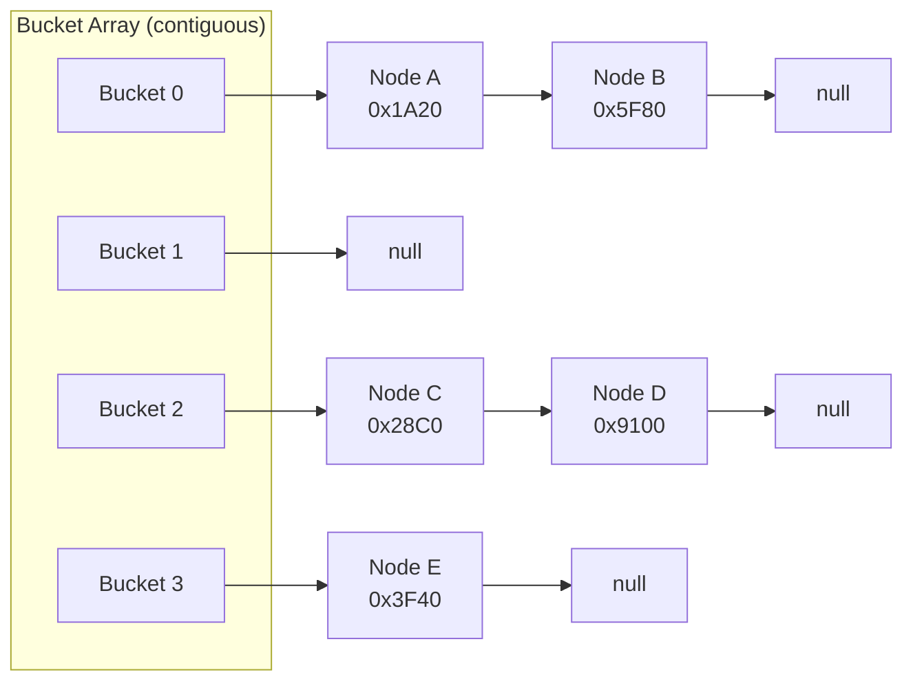
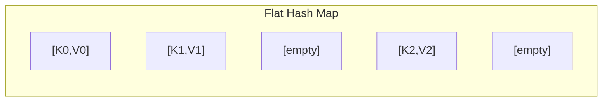
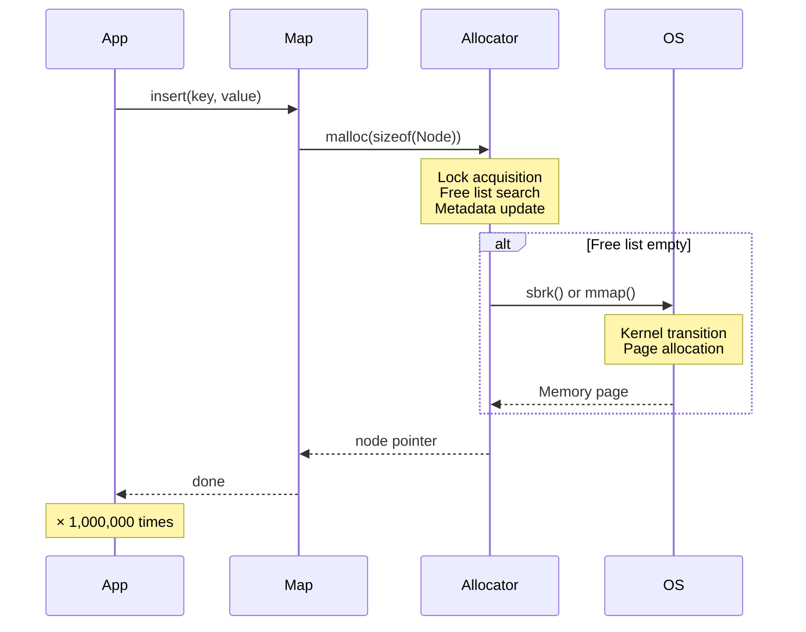
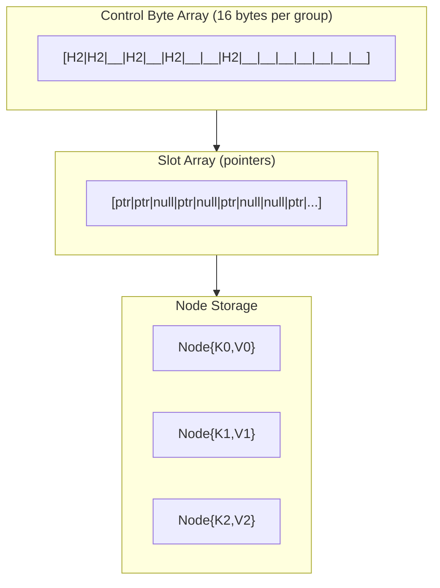
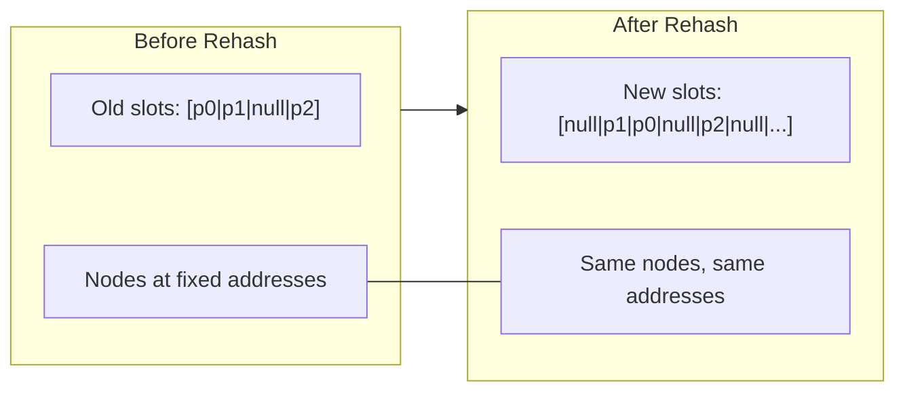
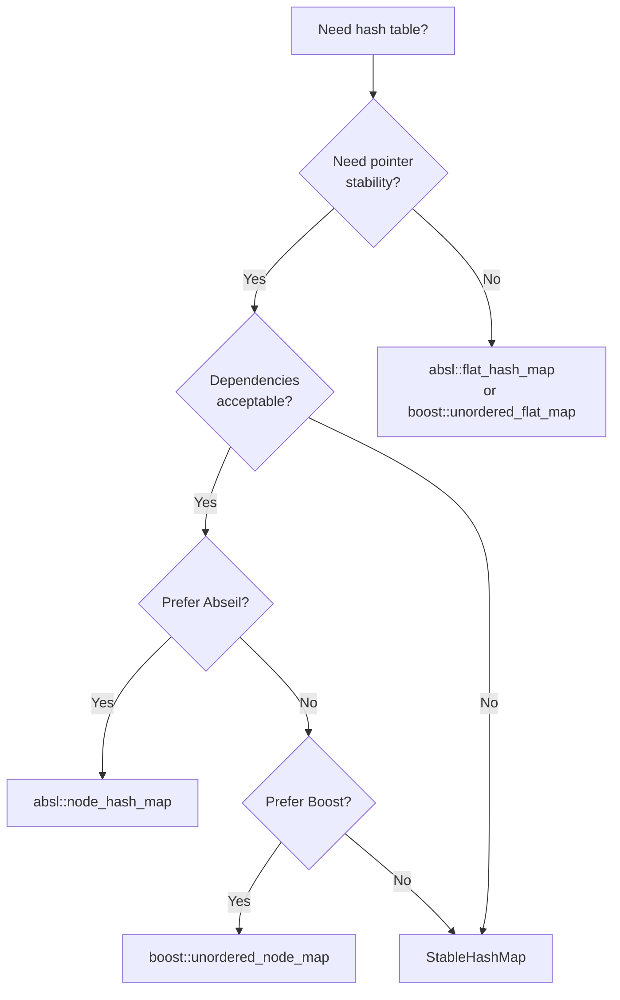

# **The Stable Table**

### *A Companion Guide to FAT-P's StableHashMap*

---

**Scope:** This guide covers `StableHashMap`, FAT-P's SIMD-accelerated Swiss Table with node-based storage for reference stability. It addresses the performance pathologies of standard hash tables while preserving pointer stability guarantees. Other FAT-P data structures (SlotMap, FlatMap, SparseSet) are documented separately.

---

# **Table of Contents**

**[Introduction: Why This Component Exists](#introduction-why-this-component-exists)**

## Part I — The Problems

1. [The Chaining Tax](#chapter-1--the-chaining-tax)
2. [The Stability Trap](#chapter-2--the-stability-trap)
3. [The Hash Quality Gamble](#chapter-3--the-hash-quality-gamble)
4. [The Allocation Cascade](#chapter-4--the-allocation-cascade)

## Part II — The Solutions

5. [Architecture Overview](#chapter-5--architecture-overview)
6. [Swiss Tables and SIMD Probing](#chapter-6--swiss-tables-and-simd-probing)
7. [Node-Based Reference Stability](#chapter-7--node-based-reference-stability)
8. [The Block Allocator](#chapter-8--the-block-allocator)
9. [The Hash Mixer](#chapter-9--the-hash-mixer)
10. [Heterogeneous Lookup](#chapter-10--heterogeneous-lookup)

## Part III — Putting It Together

11. [Case Study: Graph Structure with Stable Node References](#chapter-11--case-study-graph-structure-with-stable-node-references)
12. [Case Study: High-Throughput Event Processing](#chapter-12--case-study-high-throughput-event-processing)
13. [Case Study: Configuration Table Migration](#chapter-13--case-study-configuration-table-migration)
14. [Migration from std::unordered_map](#chapter-14--migration-from-stdunordered_map)
15. [Choosing the Right Hash Table](#chapter-15--choosing-the-right-hash-table)

## Part IV — Foundations

- [Appendix A — A Brief History of Hash Tables](#appendix-a--a-brief-history-of-hash-tables)
- [Appendix B — Why Swiss Tables Won](#appendix-b--why-swiss-tables-won)
- [Appendix C — Design Constraints and Rejected Alternatives](#appendix-c--design-constraints-and-rejected-alternatives)
- [Appendix D — Where StableHashMap Loses](#appendix-d--where-stablehashmap-loses)
- [Appendix E — Further Reading](#appendix-e--further-reading)

---

# **Introduction: Why This Component Exists**

You're building a graph processing system. Nodes are stored in a hash map keyed by ID. Edges store pointers to their source and destination nodes—a natural design that avoids repeated lookups. Everything works until a batch import adds 10,000 new nodes. The map rehashes. Every edge's pointers are now dangling. Your graph is corrupted.

Or this: you're running a trading system. Order books are keyed by instrument ID in an `std::unordered_map`. The system handles 50,000 orders per second. Profiling reveals that 40% of CPU time is spent in hash table operations—not hashing, not comparing keys, but chasing pointers through bucket chains. Each node is a separate heap allocation scattered across memory. The prefetcher cannot help. Every lookup is a cache miss.

Or this: you've read that flat hash maps are the answer. You adopt `absl::flat_hash_map`. Lookups are 3x faster. Then you discover that your callback system stores pointers to map values—pointers that silently become dangling whenever the map grows. The flat table's speed came with a hidden cost: pointer instability.

These aren't edge cases. They're the predictable consequences of hash table designs optimized for different constraints:

- `std::unordered_map` provides pointer stability but destroys cache locality
- `absl::flat_hash_map` provides cache locality but invalidates pointers
- Neither provides SIMD acceleration with zero dependencies

StableHashMap exists for engineers who need **both**: SIMD-accelerated lookups **and** stable pointers to values:

- **SIMD metadata probing** checks 16 candidates per instruction
- **Node-based storage** keeps value addresses stable across rehash
- **Block allocator option** eliminates per-node allocation overhead
- **Built-in hash mixer** protects against weak hash functions
- **Zero external dependencies** for deployment anywhere

This guide explains the problems StableHashMap solves and how it solves them.

---

# **PART I — THE PROBLEMS**

Hash tables are deceptively elegant in theory: compute an index from a key, store the value there, done. The complications arise from collisions (multiple keys mapping to the same slot), deletion (removing entries without breaking lookups), and pointer stability (whether addresses remain valid across mutations). How a hash table addresses these determines its performance characteristics—and its failure modes.

---

# **CHAPTER 1 — The Chaining Tax**

Here's what `std::unordered_map` actually looks like in memory:



Each bucket is a pointer to a linked list. Each node in that list is a separate heap allocation containing the key, value, and a `next` pointer. When you look up a key:

1. Hash the key to find the bucket
2. Follow the pointer to the first node
3. Compare the key; if no match, follow `next`
4. Repeat until found or `null`

**The hidden cost:** Every pointer dereference is a potential cache miss. The nodes were allocated at different times, so they're scattered across the heap. When you follow a `next` pointer, you're jumping to an unpredictable memory location. The CPU's prefetcher—which normally anticipates sequential access and fetches ahead—cannot help.

**The numbers:** On a modern CPU, an L1 cache hit costs ~4 cycles (~1ns). An L3 hit costs ~40 cycles (~12ns). A main memory access costs ~200+ cycles (~60-100ns). If your bucket chain has three nodes and none are in cache, you pay 180-300ns just waiting for memory. The actual key comparison is negligible.

```cpp
// THE TRAP: Pointer chasing in std::unordered_map
std::unordered_map<int, Data> map;

// Insert 1 million entries
for (int i = 0; i < 1'000'000; ++i) {
    map[i] = compute(i);  // 1 million scattered heap allocations
}

// Later, in a hot loop:
for (int i = 0; i < 1'000'000; ++i) {
    auto it = map.find(keys[i]);  // Each find: hash → bucket → chase pointers
    process(it->second);           // Cache miss on every node
}
```

| Symptom | Cause |
|---------|-------|
| 30-50% time in hash table operations | Pointer chasing dominates |
| Poor parallel scaling | Each thread chases its own pointers |
| Flat profiler shows `find()` as hot | Not computation, just memory latency |
| Lookup time increases with table size | More nodes, more cache pressure |

**What FAT-P provides:** StableHashMap uses Swiss Table architecture—a contiguous control byte array that's scanned with SIMD instructions. The metadata lookup is cache-friendly; only matching candidates require node access. Chapter 6 details the mechanism.

*The standard library's design traces back to 1994, when cache hierarchies were shallower and memory latency was less dominant. Appendix A explores this history.*

---

# **CHAPTER 2 — The Stability Trap**

Flat hash maps like `absl::flat_hash_map` solve the chaining tax by storing everything directly in a contiguous array:



No linked lists. No per-element allocations. Cache-friendly probing. Lookups are 2-3x faster than `std::unordered_map`.

**The hidden cost:** When the table grows, everything moves.

```cpp
// THE TRAP: Pointer invalidation in flat hash maps
absl::flat_hash_map<int, Config> configs;
configs[1] = load_database_config();

Config* db_config = &configs[1];  // Get pointer to value

configs[2] = load_cache_config();   // Might trigger rehash...
configs[3] = load_logging_config(); // Or this one might...

// Use the stored pointer
db_config->connection_string;  // UNDEFINED BEHAVIOR if rehash occurred
```

When the table exceeds its load factor threshold, it allocates a new, larger array and copies all elements. The old array is freed. Any pointer you held to a value now points to deallocated memory.

This isn't a bug—it's documented behavior. But code that worked fine with `std::unordered_map` silently breaks when migrated to flat tables.

**Real-world patterns that break:**

```cpp
// Pattern 1: Graph structures
struct Graph {
    absl::flat_hash_map<NodeId, Node> nodes;
    
    void connect(NodeId a, NodeId b) {
        Node* node_a = &nodes[a];  // Pointer into map
        Node* node_b = &nodes[b];  // Another pointer
        
        // If either lookup triggered rehash, BOTH pointers are invalid
        node_a->neighbors.push_back(node_b);  // May crash or corrupt
    }
};

// Pattern 2: Observer callbacks
class EventSystem {
    absl::flat_hash_map<EventId, std::vector<Callback>> handlers;
    
    void fire(EventId id) {
        auto* callbacks = &handlers[id];  // Pointer to vector
        
        for (auto& cb : *callbacks) {
            cb();  // Callback might register NEW handlers
        }          // Which might rehash handlers map
                   // Invalidating 'callbacks' pointer mid-iteration
    }
};

// Pattern 3: Index structures
class Database {
    absl::flat_hash_map<Id, Record> records;
    std::vector<Record*> sorted_view;  // Secondary index
    
    void insert(Id id, Record r) {
        records[id] = std::move(r);  // May rehash
        // ALL pointers in sorted_view are now potentially invalid
        rebuild_all_indices();  // Expensive but necessary
    }
};
```

**What FAT-P provides:** StableHashMap combines Swiss Table's SIMD-accelerated probing with node-based storage. Metadata is contiguous (cache-friendly), but values live in separate nodes (address-stable). Chapter 7 explains the architecture.

*The tension between cache efficiency and pointer stability is fundamental. Appendix B explains why different libraries made different choices.*

---

# **CHAPTER 3 — The Hash Quality Gamble**

On many platforms, `std::hash<int>` is the identity function:

```cpp
// MSVC and some other implementations
std::hash<int>{}(1) == 1
std::hash<int>{}(2) == 2
std::hash<int>{}(1000000) == 1000000
```

This seems reasonable—integers are already well-distributed, right?

**The trap:** Consider inserting sequential keys:

```cpp
// THE TRAP: Identity hash with sequential keys
std::unordered_map<int, Data> map;
map.reserve(1024);  // 1024 buckets

for (int i = 0; i < 10000; ++i) {
    map[i] = data;  // Keys: 0, 1, 2, 3, ...
}
```

With identity hashing and 1024 buckets:
- Keys 0-1023 map to buckets 0-1023 (one per bucket)
- Keys 1024-2047 map to buckets 0-1023 again (two per bucket)
- Keys 2048-3071 map to the same buckets (three per bucket)

After 10,000 insertions, each bucket averages ~10 elements. With Swiss Tables, the pattern is similar—groups fill unevenly, probe sequences lengthen.

**The numbers:**

| Hash Quality | Average Probe Length | Find (N=1M) |
|--------------|---------------------|-------------|
| Identity | ~5.3 | 28 ns |
| SplitMix64 | ~1.4 | 17 ns |

A 39% speedup, just from better hash distribution.

```cpp
// THE TRAP: Assuming std::hash is good enough
template <typename K, typename V>
class MyCache {
    std::unordered_map<K, V> cache_;
    // Works fine with string keys (std::hash<string> is decent)
    // Falls apart with sequential integer keys (std::hash<int> is identity)
};
```

**What FAT-P provides:** StableHashMap applies a SplitMix64 mixer to all hashes by default. Even identity hashes become well-distributed. Chapter 9 explains the mechanism and when to opt out.

*Hash function quality was less critical when tables used chaining—collisions just made chains longer. With open addressing, poor distribution causes clustering that compounds probe costs. Appendix B discusses this evolution.*

---

# **CHAPTER 4 — The Allocation Cascade**

Node-based maps allocate separately for each element:

```cpp
// std::unordered_map or similar node-based designs
map[1] = data;  // malloc() for node 1
map[2] = data;  // malloc() for node 2
map[3] = data;  // malloc() for node 3
// ... N insertions = N malloc() calls
```

**The hidden cost:** Each `malloc()` has overhead:

1. **Allocator bookkeeping (20-50ns):** Search free lists, update metadata
2. **Lock contention:** In multi-threaded code, threads compete for allocator locks
3. **Fragmentation:** Small allocations scattered across the heap
4. **Cache pollution:** Allocator metadata evicts useful data from cache

For one million insertions, you pay 20-50 milliseconds in pure allocator overhead—potentially more than the insertions themselves.



**The symptoms:**

| Symptom | Cause |
|---------|-------|
| Insert slower than expected | Per-node allocation overhead |
| Erase extremely slow | Free list updates are expensive |
| Multi-threaded scaling poor | Allocator lock contention |
| Memory usage higher than expected | Per-allocation metadata overhead |

**What FAT-P provides:** StableHashMap's Block allocator pre-allocates nodes in contiguous chunks. One million insertions require ~1,000 `malloc()` calls instead of one million. Chapter 8 details the mechanism.

*The tension between pointer stability (requires separate nodes) and allocation efficiency (favors contiguous storage) is fundamental. StableHashMap resolves it with block allocation.*

---

# **PART II — THE SOLUTIONS**

StableHashMap addresses each problem through deliberate architectural choices: Swiss Table metadata for cache-friendly probing, node-based storage for pointer stability, block allocation for reduced overhead, and hash mixing for quality guarantees.

---

# **CHAPTER 5 — Architecture Overview**

StableHashMap's architecture combines three key elements:



**Control bytes:** A contiguous array where each byte describes one slot. Values 0x00-0x7F indicate an occupied slot with that H2 fingerprint. Value 0x80 indicates empty. This array is scanned with SIMD instructions.

**Slot array:** Stores pointers to nodes (not the nodes themselves). When rehashing, only pointers are copied—nodes don't move.

**Node storage:** Actual key-value pairs. Allocated separately (or in blocks). Addresses remain stable across all map mutations except erasing that specific element.

**The invariant:** A pointer to a value remains valid until that specific key is erased or the map is destroyed. Insertions, other erasures, and rehashes do not invalidate existing pointers.

---

# **CHAPTER 6 — Swiss Tables and SIMD Probing**

Swiss Tables (introduced by Google in 2017) revolutionized hash table performance through a key insight: **check multiple slots in parallel using SIMD instructions**.

## The Control Byte Array

Each group of 16 slots has a corresponding 16-byte control array:

| Control Value | Meaning |
|---------------|---------|
| 0x00 - 0x7F | Occupied; value is top 7 bits of hash (H2 fingerprint) |
| 0x80 | Empty slot |
| 0xFE | Deleted (tombstone, in flat tables) |

The H2 fingerprint acts as a Bloom filter for each slot. With 128 possible values, a random occupied slot has only a 1/128 ≈ 0.78% chance of matching your search key's H2.

## The SIMD Comparison

```cpp
// Conceptual lookup (actual implementation uses intrinsics)
Value* find(const Key& key) {
    uint64_t hash = hash_function(key);
    size_t group_idx = (hash >> 7) % num_groups;
    uint8_t h2 = hash & 0x7F;  // Low 7 bits as fingerprint
    
    while (true) {
        // Load 16 control bytes into SIMD register
        __m128i ctrl = _mm_load_si128(&control[group_idx * 16]);
        
        // Broadcast H2 to all 16 positions
        __m128i h2_vec = _mm_set1_epi8(h2);
        
        // Compare all 16 in ONE instruction
        __m128i matches = _mm_cmpeq_epi8(ctrl, h2_vec);
        
        // Extract match positions as bitmask
        uint32_t mask = _mm_movemask_epi8(matches);
        
        // Check each match (typically 0-2 candidates)
        while (mask) {
            int pos = __builtin_ctz(mask);
            Node* node = slots[group_idx * 16 + pos];
            if (node->key == key)
                return &node->value;
            mask &= mask - 1;
        }
        
        // Check for empty (key definitely not in table)
        __m128i empty = _mm_cmpeq_epi8(ctrl, _mm_set1_epi8(0x80));
        if (_mm_movemask_epi8(empty))
            return nullptr;
        
        // Quadratic probe to next group
        group_idx = (group_idx + probe_delta++) % num_groups;
    }
}
```

**The key insight:** `_mm_cmpeq_epi8` compares 16 bytes in a single instruction. What would take 16 serial comparisons now takes 1 SIMD operation.

## Why This Matters for Miss Lookups

Miss lookups—searching for keys that don't exist—benefit most from SIMD probing:

**Traditional probing:**
```
Search for missing key:
  Slot 5: occupied, compare key... no match
  Slot 6: occupied, compare key... no match
  Slot 7: occupied, compare key... no match
  Slot 8: empty → not found
  (3 key comparisons)
```

**Swiss Table probing:**
```
Search for missing key:
  Group 0: SIMD compare H2 against 16 control bytes
           0 matches, but no empty → continue
  Group 1: SIMD compare H2 against 16 control bytes
           1 match, compare key... no match
           Found empty in group → not found
  (1 key comparison for 32 slots checked)
```

For cache-like workloads where most lookups fail, SIMD probing provides 4-10x speedup over serial probing.

---

# **CHAPTER 7 — Node-Based Reference Stability**

StableHashMap's distinguishing feature is **pointer stability through node-based storage**.

## The Mechanism

Slots store pointers to nodes, not the data itself:

```
Slot array:     [ptr] [ptr] [null] [ptr] [null] ...
                  |     |           |
                  v     v           v
Nodes:         Node0  Node1       Node2
               {K,V}  {K,V}       {K,V}
               
               ↑ These addresses NEVER change
```

When rehashing occurs:

1. Allocate new, larger control and slot arrays
2. Recompute H2 fingerprints for new table size
3. **Copy pointers** to new slot positions
4. Free old control and slot arrays
5. **Nodes don't move**



## The Guarantee

```cpp
StableHashMap<int, LargeObject> map;
map[1] = obj1;

LargeObject* ptr = &map[1];  // Get pointer

// ANY of these operations...
map[2] = obj2;
map[3] = obj3;
// ... even ones that trigger rehash
for (int i = 4; i < 100000; ++i)
    map[i] = LargeObject{};

// ... do NOT invalidate the pointer
ptr->modify();  // Guaranteed valid

// ONLY erasing key 1 invalidates ptr
map.erase(1);
// ptr is now invalid
```

## The Tradeoff

Node indirection adds one pointer dereference per access:

```
Flat table:    hash → group → slot → VALUE
Node table:    hash → group → slot → pointer → NODE → VALUE
```

This costs ~2-5ns per access (one L1 cache hit). In exchange, you get pointer stability that enables patterns impossible with flat tables.

---

# **CHAPTER 8 — The Block Allocator**

Standard node-based storage allocates each node individually:

```cpp
map[1] = data;  // malloc(sizeof(Node))
map[2] = data;  // malloc(sizeof(Node))
// ... 1 million mallocs for 1 million elements
```

The Block allocator pre-allocates nodes in contiguous chunks:

```cpp
fat_p::StableHashMap<int, Data, std::hash<int>, std::equal_to<int>, fat_p::BlockAllocator> map;

map[1] = data;  // Use slot from pre-allocated block
map[2] = data;  // Use next slot in same block
// ... ~1000 mallocs for 1 million elements (block size ~1024)
```

## Memory Layout

```
Block 0: [Node0][Node1][Node2]...[Node1023]  ← contiguous
                   ↑       ↑
             slots[5]  slots[12]  (non-contiguous logical order)

Block 1: [Node1024][Node1025]...             ← contiguous
```

Nodes within a block are contiguous in memory, improving:
- **Iteration speed:** Sequential memory access, prefetcher helps
- **Allocation speed:** Bump allocator within block, no free list search
- **Deallocation speed:** Mark free, no immediate `free()` call

## Performance Impact

Benchmarks at N=1,000,000:

| Operation | Standard Alloc | Block Alloc | Improvement |
|-----------|----------------|-------------|-------------|
| Insert | 40 ns | 17 ns | **2.3x** |
| Find | 13 ns | 9 ns | **1.4x** |
| Erase | 100 ns | 24 ns | **4.2x** |

## Usage

```cpp
// Standard: per-node allocation (default)
fat_p::StableHashMap<int, Data> standard_map;

// Block: contiguous block allocation
fat_p::StableHashMap<int, Data, std::hash<int>, std::equal_to<int>, fat_p::BlockAllocator> fast_map;

// APIs are identical
fast_map[1] = data;
Data* ptr = fast_map.find(1);
```

**Use Block allocation when:** Inserting many elements, erase-heavy workloads, iterating frequently.

**Use standard allocation when:** Map lifetime is short, memory must be returned immediately on erase.

---

# **CHAPTER 9 — The Hash Mixer**

StableHashMap applies a SplitMix64 finalizer to all hashes by default:

```cpp
inline uint64_t splitmix64(uint64_t x) {
    x = (x ^ (x >> 30)) * 0xbf58476d1ce4e5b9ULL;
    x = (x ^ (x >> 27)) * 0x94d049bb133111ebULL;
    return x ^ (x >> 31);
}
```

## Why This Matters

SplitMix64 has excellent **avalanche** properties: changing any input bit changes approximately half the output bits. Even identity hashes become well-distributed:

```
splitmix64(0) = 0x9e3779b97f4a7c15
splitmix64(1) = 0x85ebca77c2b2ae63
splitmix64(2) = 0xc2b2ae3d27d4eb4f
```

Sequential inputs produce seemingly random outputs. Clustering disappears.

## Benchmark Impact

| Platform | Without Mixer | With Mixer | Improvement |
|----------|---------------|------------|-------------|
| Windows (MSVC) | 28 ns | 17 ns | **39%** |
| Linux (GCC) | 18 ns | 17 ns | ~0% |

The Windows improvement is dramatic because MSVC's `std::hash<int>` is identity. Linux's libstdc++ already includes mixing.

## Opting Out

If your hash already has good avalanche properties, skip the mixer:

```cpp
struct MyExcellentHash {
    using is_avalanching = void;  // Marker: skip built-in mixer
    
    size_t operator()(int x) const {
        return my_crypto_hash(x);
    }
};

fat_p::StableHashMap<int, Data, MyExcellentHash> map;
```

**Rule of thumb:** Keep the mixer unless you've verified your hash has good distribution.

---


# **CHAPTER 10 — Heterogeneous Lookup**

Avoid temporary allocations when looking up with convertible types:

```cpp
StableHashMap<std::string, int> map;
map["hello"] = 1;

// Without heterogeneous lookup
std::string_view key = "hello";
map.find(std::string(key));  // Temporary string allocation!

// With heterogeneous lookup (StableHashMap default)
map.find(key);  // No allocation
```

**Performance impact:** ~25-35ns saved per lookup for string keys.

---

# **PART III — PUTTING IT TOGETHER**

---

# **CHAPTER 11 — Case Study: Graph Structure with Stable Node References**

## The Context

A social network analysis tool represents the graph as nodes in a hash map, with edges storing pointers to their endpoints:

```cpp
struct GraphNode {
    UserId id;
    std::string name;
    std::vector<GraphNode*> neighbors;  // Pointers to other nodes
};

class SocialGraph {
    std::unordered_map<UserId, GraphNode> nodes_;  // Original design
};
```

## The Initial Approach

The team used `std::unordered_map`. Pointer stability was assumed (correctly—it's guaranteed). Performance was acceptable for small graphs.

When the dataset grew to 10 million nodes, profiling revealed 45% of time in hash table lookups. The team considered `absl::flat_hash_map`:

```cpp
// THE TRAP: Migrating to flat_hash_map
class SocialGraph {
    absl::flat_hash_map<UserId, GraphNode> nodes_;  // 3x faster lookups!
    
    void add_friendship(UserId a, UserId b) {
        GraphNode* node_a = &nodes_[a];
        GraphNode* node_b = &nodes_[b];
        
        // DANGER: If either lookup triggered rehash, BOTH pointers invalid
        node_a->neighbors.push_back(node_b);  // May crash
        node_b->neighbors.push_back(node_a);  // May corrupt
    }
};
```

The migration introduced subtle corruption that only manifested under load when rehashes occurred mid-operation.

## The Fix

```cpp
// THE FIX: StableHashMap with Block allocator
class SocialGraph {
    fat_p::StableHashMap<UserId, GraphNode, std::hash<UserId>, std::equal_to<UserId>, fat_p::BlockAllocator> nodes_;
    
    void add_friendship(UserId a, UserId b) {
        GraphNode* node_a = &nodes_[a];
        GraphNode* node_b = &nodes_[b];
        
        // SAFE: Pointers stable across all mutations
        node_a->neighbors.push_back(node_b);
        node_b->neighbors.push_back(node_a);
    }
};
```

## Results

| Metric | std::unordered_map | absl::flat_hash_map | StableHashMap[Block] |
|--------|-------------------|---------------------|----------------------|
| Lookup | 29 ns | 11 ns | 13 ns |
| Insert | 83 ns | 18 ns | 17 ns |
| Pointer stability | ✓ | ✗ | ✓ |
| Correctness | ✓ | Intermittent crashes | ✓ |

StableHashMap provided 2.2x faster lookups than `std::unordered_map` while preserving the pointer stability the algorithm required.

## FAT-P Components Used

- `StableHashMap` with `BlockAllocator` (node allocator template parameter) — Cache-efficient lookups with stable pointers

## Transferable Lessons

**Lesson 1:** Pointer stability is a correctness requirement, not a nice-to-have. Code that stores pointers to map values cannot safely use flat hash maps.

**Lesson 2:** The Block allocator recovers most of the flat-table allocation efficiency while preserving node-based stability.

---

# **CHAPTER 12 — Case Study: High-Throughput Event Processing**

## The Context

An event processing system routes messages by topic ID. Each topic has a handler registered in a hash map. The system handles 100,000 events per second.

## The Initial Approach

```cpp
// THE TRAP: Per-event allocation overhead
class EventRouter {
    std::unordered_map<TopicId, Handler> handlers_;
    
    void route(const Event& e) {
        auto it = handlers_.find(e.topic);  // Chain traversal
        if (it != handlers_.end())
            it->second(e);
    }
};
```

Profiling showed 35% of time in `find()`. The bucket chains averaged 3-4 nodes, each requiring a cache miss.

## The Fix

```cpp
// THE FIX: SIMD-accelerated lookup
class EventRouter {
    fat_p::StableHashMap<TopicId, Handler> handlers_;
    
    void route(const Event& e) {
        Handler* h = handlers_.find(e.topic);  // SIMD probe
        if (h)
            (*h)(e);
    }
};
```

## Results

| Metric | Before | After | Improvement |
|--------|--------|-------|-------------|
| find() time | 29 ns | 9 ns | **3.2x** |
| Events/second | 100K | 280K | **2.8x** |
| CPU utilization | 85% | 30% | Headroom for growth |

## FAT-P Components Used

- `StableHashMap` — SIMD-accelerated lookup replaced chain traversal

## Transferable Lessons

**Lesson:** When profiling shows time in hash table `find()`, the bottleneck is often memory access patterns, not computation. SIMD probing addresses this directly.

---

# **CHAPTER 13 — Case Study: Configuration Table Migration**

## The Context

A configuration system used `std::unordered_map` for settings lookup. The map was populated at startup and never modified. Performance was acceptable but not optimal.

## The Initial State

```cpp
class ConfigStore {
    std::unordered_map<std::string, std::string> settings_;
    
    const std::string* get(std::string_view key) const {
        auto it = settings_.find(std::string(key));  // Temporary allocation!
        return it != settings_.end() ? &it->second : nullptr;
    }
};
```

Every lookup allocated a temporary `std::string` for the find operation.

## The Fix

```cpp
// THE FIX: Heterogeneous lookup (no temporary allocation)
class ConfigStore {
    fat_p::StableHashMap<std::string, std::string> settings_;
    
    const std::string* get(std::string_view key) const {
        return settings_.find(key);  // No allocation!
    }
};
```

## Results

| Metric | Before | After | Improvement |
|--------|--------|-------|-------------|
| Lookup time | 55 ns | 25 ns | **2.2x** |
| Allocations per lookup | 1 | 0 | Eliminated |

## FAT-P Components Used

- `StableHashMap` — Heterogeneous lookup eliminated temporary allocations

## Transferable Lessons

**Lesson:** String-keyed maps benefit enormously from heterogeneous lookup. If you frequently search with `string_view`, the allocation savings are substantial.

---

# **CHAPTER 14 — Migration from std::unordered_map**

## Identifying Candidates

Not every `std::unordered_map` should become a StableHashMap. Look for:

1. **Performance-critical lookups** — Time in `find()` appears in profiles
2. **Pointer stability requirements** — Code stores pointers to values
3. **String keys with view-based lookup** — Heterogeneous lookup saves allocations
4. **Large tables** — SIMD benefits scale with size

## Step-by-Step Migration

**Step 1:** Verify pointer stability requirements

```cpp
// Search codebase for patterns like:
Value* ptr = &map[key];
// If found, you NEED pointer stability
```

**Step 2:** Replace type

```cpp
// Before
std::unordered_map<K, V> map;

// After (standard allocation)
fat_p::StableHashMap<K, V> map;

// After (block allocation for insert-heavy)
fat_p::StableHashMap<K, V, std::hash<K>, std::equal_to<K>, fat_p::BlockAllocator> map;
```

**Step 3:** Update find() usage

```cpp
// Before
auto it = map.find(key);
if (it != map.end()) use(it->second);

// After
V* ptr = map.find(key);
if (ptr) use(*ptr);
```

**Step 4:** Handle emplace() semantic difference

```cpp
// std::unordered_map: emplace ignores existing key
map.emplace(key, value);  // No-op if key exists

// StableHashMap: emplace OVERWRITES existing key
map.emplace(key, value);  // Overwrites if key exists

// For std-compatible behavior, use try_emplace
map.try_emplace(key, value);  // No-op if key exists
```

---

# **CHAPTER 15 — Choosing the Right Hash Table**



| Criterion | std::unordered_map | absl::flat | absl::node | StableHashMap |
|-----------|-------------------|------------|------------|---------------|
| Pointer stability | ✓ | ✗ | ✓ | ✓ |
| SIMD acceleration | ✗ | ✓ | ✓ | ✓ |
| Zero dependencies | ✓ | ✗ | ✗ | ✓ |
| Block allocator | ✗ | N/A | ✗ | ✓ |
| Hash mixer | ✗ | ✓ | ✓ | ✓ |

**Decision guide:**

- Need pointer stability + zero dependencies → **StableHashMap**
- Need pointer stability + already use Abseil → **absl::node_hash_map**
- Don't need pointer stability → **absl::flat_hash_map** or **boost::unordered_flat_map**
- Must use standard library only → **std::unordered_map** (accept performance cost)

---

# **PART IV — FOUNDATIONS**

---

# **APPENDIX A — A Brief History of Hash Tables**

## The Origins (1953-1960)

Hans Peter Luhn at IBM documented hashing in 1953. The technique spread rapidly—by 1960, hash tables were standard in symbol tables and databases.

Two collision resolution strategies emerged early:

**Separate chaining:** Each bucket holds a linked list of colliding elements. Straightforward to implement, accommodates high load gracefully, but scatters nodes across memory.

**Open addressing:** Store everything in a contiguous array. On collision, probe for another slot. Cache-friendly but requires careful deletion handling.

## The Standardization Era (1990-2000)

When C++ standardized `unordered_map` (originally in TR1, then C++11), the committee chose separate chaining. The reasons:

1. **Iterator stability:** Insertions don't invalidate iterators to other elements
2. **Reference stability:** Pointers to values remain valid
3. **Simplicity:** No tombstone management, no probe sequence complexity
4. **Generality:** Works well across diverse workloads

These were reasonable choices in 1994-1998, when the design was finalized. Cache hierarchies were shallower; memory latency was less dominant.

## The Performance Revolution (2010-2020)

By 2010, the memory hierarchy had changed dramatically. L3 caches grew to megabytes. Main memory latency reached 200+ cycles. Pointer chasing became expensive.

Google's 2017 Swiss Tables paper demonstrated that SIMD-accelerated open addressing could be 2-3x faster than chaining. The key insight: use vector instructions to probe 16 slots in parallel.

The C++ community responded:
- Google released `absl::flat_hash_map` and `absl::node_hash_map`
- Boost rewrote their unordered containers
- Numerous open-source implementations appeared

But `std::unordered_map` couldn't change—ABI stability requirements froze its design.

## The Stability Question

Flat tables are fastest but invalidate pointers. Node tables preserve pointers but add indirection. The community split:

- **Performance-first:** Use flat tables, don't store pointers to values
- **Stability-first:** Use node tables, accept the overhead

StableHashMap represents the stability-first camp, combining Swiss Table's SIMD probing with node-based storage for pointer preservation.

---

# **APPENDIX B — Why Swiss Tables Won**

## The SIMD Advantage

Traditional probing checks slots one at a time:

```
Check slot 5: occupied, wrong key (1 comparison)
Check slot 6: occupied, wrong key (1 comparison)
Check slot 7: occupied, wrong key (1 comparison)
Check slot 8: empty → not found
Total: 3 comparisons, 4 memory accesses
```

Swiss Tables check 16 slots with one SIMD instruction:

```
Load 16 control bytes (1 memory access)
SIMD compare all 16 (1 instruction)
Check 0-2 matches (0-2 comparisons)
Total: 1-2 memory accesses, 0-2 comparisons
```

For miss lookups (key not in table), the difference is dramatic. Traditional probing must examine each occupied slot until finding empty. Swiss Tables detect empty slots in the same SIMD pass—often terminating without comparing any keys.

## Why Robin Hood Lost

Robin Hood hashing (1986) bounded worst-case probe distances through displacement: during insertion, if your probe distance exceeds the resident's, swap with them.

Theoretical advantages:
- Bounded variance in probe distances
- Early-exit optimization (stop when distance exceeds maximum)
- Better worst-case behavior

Practical reality:
- Extra bookkeeping (store and compare distances)
- Memory overhead (distance byte per slot)
- Branch mispredictions on distance comparisons
- Benefits rarely exceeded costs in benchmarks

Swiss Tables achieved similar probe distance bounds through different means (groups, quadratic probing) without the per-slot overhead.

## The Flat vs. Node Tradeoff

Swiss Tables can use either flat or node storage:

**Flat (absl::flat_hash_map):** Values stored directly in slots. Maximum cache efficiency. Pointers invalidated on rehash.

**Node (absl::node_hash_map, StableHashMap):** Slots store pointers to separately-allocated nodes. One extra indirection. Pointers stable across rehash.

Neither is universally better. The choice depends on whether your code stores pointers to map values.

---

# **APPENDIX C — Design Constraints and Rejected Alternatives**

## Hard Constraints

| Constraint | Rationale |
|------------|-----------|
| Zero external dependencies | Deployment in restricted environments |
| Pointer stability | Support existing patterns that store value pointers |
| SIMD-accelerated probing | Competitive lookup performance |
| Header-only | Ease of adoption |

## Rejected Alternatives

| Alternative | Why Rejected |
|-------------|--------------|
| Flat storage | Invalidates pointers; breaks existing code patterns |
| Robin Hood probing | Bookkeeping overhead exceeded benefits in benchmarks |
| Standard allocator only | Block allocator provides 2-4x speedup for insert-heavy workloads |
| No hash mixer | Weak hashes (identity) cause clustering; 39% slowdown on MSVC |
| Separate chaining | Pointer chasing defeats cache; 2-4x slower than SIMD probing |

## Accepted Tradeoffs

| Cost | Rationale |
|------|-----------|
| One pointer dereference per access | Required for pointer stability |
| Slower than flat tables | Pointer stability is worth 20-40% overhead for target use cases |
| Default-constructible requirement | Simplifies node management |
| Miss lookups slower than boost | Different group layout; acceptable for stability guarantee |

---

# **APPENDIX D — Where StableHashMap Loses**

## Miss-Heavy Workloads

`boost::unordered_node_map` achieves ~2x faster miss detection:

| Map | Miss (ns) | Eq/miss |
|-----|-----------|---------|
| StableHashMap | 9 | 0.12 |
| boost::unordered_node_map | 5 | 0.03 |

boost's 15-slot groups and probing strategy examine fewer candidates per miss. For cache-like workloads where most lookups fail, boost has an edge.

## No Pointer Stability Needed

If your code never stores pointers to values, flat tables are 20-40% faster:

| Map | Find (ns) |
|-----|-----------|
| absl::flat_hash_map | 7 |
| StableHashMap | 9 |

The indirection overhead of node storage is pure cost if you don't need stability.

## Small Tables (N < 1,000)

When the entire table fits in L1 cache, architecture differences wash out. A less complex implementation might be faster due to lower code overhead.

## Non-Default-Constructible Values

StableHashMap requires default-constructible keys and values. If your type lacks a default constructor, wrap in `std::optional` or use `std::unordered_map`.

## Dependencies Are Acceptable

If Abseil is already in your project, `absl::node_hash_map` provides similar guarantees with a larger, more-tested codebase. StableHashMap's value is **zero dependencies**—if that constraint doesn't apply, evaluate the alternatives.

---

# **APPENDIX E — Further Reading**

## Foundational Papers

**"Swiss Tables"** — Matt Kulukundis & Sam Benzaquen, CppCon 2017
The original presentation of SIMD-accelerated probing. Essential viewing for understanding modern hash table design.

**"Robin Hood Hashing"** — Pedro Celis, 1986
The doctoral thesis introducing displacement-based collision resolution. Historical context for why the technique didn't ultimately dominate.

## Implementation References

**Abseil Documentation** — abseil.io
Detailed documentation of `flat_hash_map` and `node_hash_map`, including design rationale.

**Boost.Unordered Documentation** — boost.org
Documentation for `unordered_flat_map` and `unordered_node_map`, including benchmarks.

**"Comprehensive Hash Map Benchmarks"** — Martin Leitner-Ankerl
Benchmarks of 20+ implementations with methodology discussion.

## Background Reading

**"What Every Programmer Should Know About Memory"** — Ulrich Drepper
Essential background on cache hierarchies. Explains why contiguous storage matters.

**"The Art of Computer Programming, Vol. 3"** — Donald Knuth
Chapter 6 covers hashing theory. Foundational for understanding collision resolution.

---

*End of Companion Guide*
