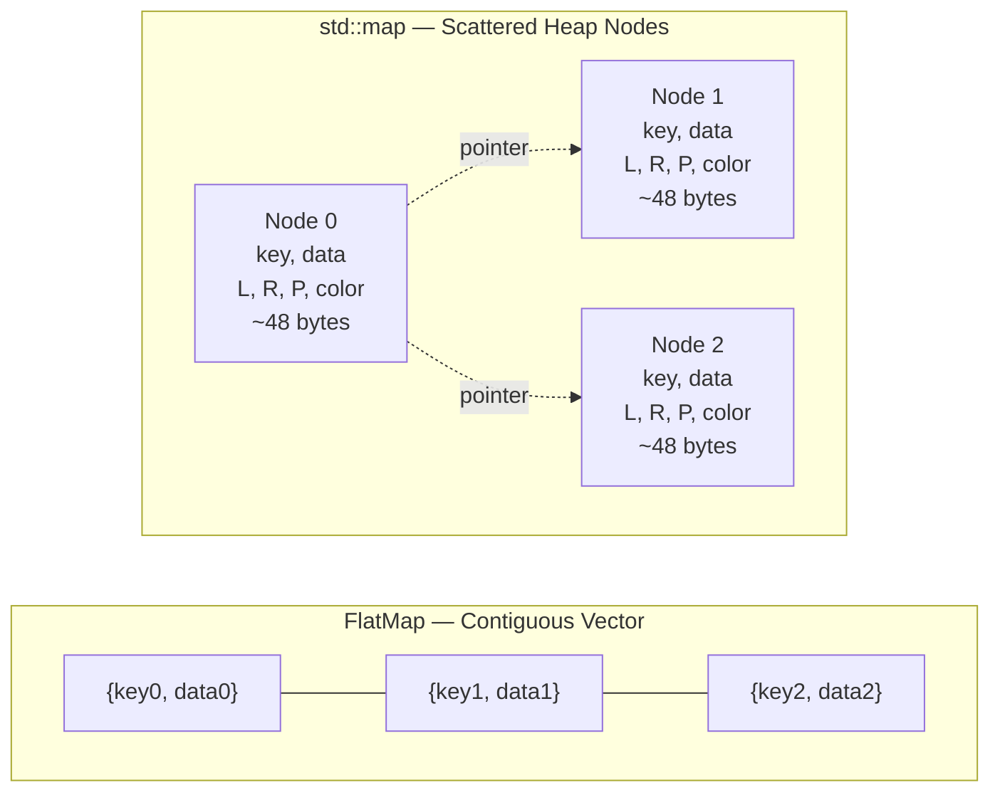

# FlatMap & FlatSet: A Fat-P Library Showcase

## Executive Summary

FlatMap and FlatSet are **cache-optimized associative containers** that store elements in a contiguous sorted vector instead of scattered tree nodes. Unlike `std::map`/`std::set` (red-black trees with per-node heap allocation), FlatMap/FlatSet achieve **10-50x faster iteration** through sequential memory access, **2-5x faster lookup** for small-to-medium collections via better cache utilization, and **zero per-element allocation overhead**. The sorted vector layout transforms pointer-chasing tree traversal into cache-friendly linear scans.

---

## The Problem Domain

### What Goes Wrong Without It

```cpp
// The cache miss cascade: std::map iteration
std::map<int, Data> cache;
for (const auto& [key, value] : cache) {
    process(value);  // Each node is separate heap allocation
                     // Pointer chasing: node → left/right/parent → node
                     // Cache miss on nearly every iteration
}

// The allocation storm
for (int i = 0; i < 100000; ++i) {
    std::map<std::string, int> temp;
    temp["a"] = 1;  // Heap allocation for node
    temp["b"] = 2;  // Heap allocation for node  
    temp["c"] = 3;  // Heap allocation for node
    process(temp);
}  // 300,000 allocations + deallocations
```

| Issue | HPC Impact |
|-------|------------|
| Per-node allocation | Each insert allocates; each erase deallocates |
| Pointer chasing | Tree traversal causes cache misses |
| Poor cache locality | Nodes scattered across heap |
| Memory overhead | ~32-48 bytes per node (pointers + color) |

### The Standard's Limitation

`std::map` and `std::set` use red-black trees guaranteeing O(log n) worst-case:
- **Every node is a heap allocation**—even for 3-element maps
- **Iteration is pointer chasing**—no prefetching possible
- **Memory overhead**: left, right, parent pointers + color bit per node

C++23 adds `std::flat_map`/`std::flat_set`, but many codebases are locked to C++17. Fat_p provides these containers **now** with additional features.

---

## Architecture: Sorted Vector with Binary Search

### The Mechanism

```cpp
template <typename Key, typename T, 
          typename Compare = std::less<Key>,
          typename Allocator = std::allocator<std::pair<Key, T>>>
class FlatMap {
    std::vector<std::pair<Key, T>, Allocator> data_;  // Contiguous storage
    Compare comp_;
    
public:
    iterator find(const Key& key) {
        auto it = std::lower_bound(data_.begin(), data_.end(), key,
            [this](const auto& elem, const Key& k) {
                return comp_(elem.first, k);
            });
        if (it != data_.end() && !comp_(key, it->first)) {
            return it;
        }
        return data_.end();
    }
};
```

**Why sorted vector beats trees for small-to-medium sizes:**

| Collection Size | std::map lookup | FlatMap lookup | Winner |
|-----------------|-----------------|----------------|--------|
| 10 elements | ~5 cache misses | ~0-1 cache misses | FlatMap (5x) |
| 100 elements | ~7 cache misses | ~1-2 cache misses | FlatMap (3x) |
| 1,000 elements | ~10 cache misses | ~2-3 cache misses | FlatMap (2x) |
| 10,000 elements | ~14 cache misses | ~4-5 cache misses | FlatMap (1.5x) |
| 100,000+ elements | ~17 cache misses | Diminishing returns | std::map (insert heavy) |

### Memory Layout Comparison



**std::map:** Each node is a separate heap allocation containing data plus three pointers (left, right, parent) and a color bit. Traversal requires following pointers to unpredictable memory locations.

**FlatMap:** All elements occupy a single contiguous allocation. No pointer overhead. Sequential memory access enables hardware prefetching.

---

## Feature Inventory

### 1. Cache-Friendly Iteration

```cpp
FlatMap<int, std::string> map = {{1, "a"}, {2, "b"}, {3, "c"}};

for (const auto& [key, value] : map) {
    process(value);  // Sequential memory access
                     // Hardware prefetcher works
                     // One cache line may contain multiple elements
}
// 10-50x faster than std::map iteration
```

### 2. Binary Search Lookup

```cpp
FlatMap<int, Data> map;
// ... populate ...

auto it = map.find(42);  // O(log n) binary search
if (it != map.end()) {
    use(it->second);
}

// Also: contains(), count(), lower_bound(), upper_bound()
```

### 3. Heterogeneous Lookup (C++14+)

```cpp
FlatMap<std::string, int, std::less<>> map;  // Transparent comparator
map["hello"] = 42;

// Lookup without constructing temporary std::string
auto it = map.find(std::string_view("hello"));  // Zero allocation lookup
const char* key = "hello";
auto it2 = map.find(key);  // Also works
```

**Mechanism:** `std::less<>` (or `std::less<void>`) enables comparison with any type convertible to the key type.

### 4. Custom Key Iterator (Protects Immutability)

```cpp
// FlatMap iterator returns pair with const Key
for (auto& [key, value] : map) {
    // key is const—can't modify and break sort order
    value = process(key);  // value is modifiable
}

// Direct key modification prevented at compile time
// it->first = 42;  // Compile error: key is const
```

### 5. Merge Operations

```cpp
FlatMap<int, std::string> map1 = {{1, "a"}, {3, "c"}};
FlatMap<int, std::string> map2 = {{2, "b"}, {4, "d"}};

map1.merge(map2);  // O(n + m) merge sort
// map1 = {{1,"a"}, {2,"b"}, {3,"c"}, {4,"d"}}
```

**Mechanism:** Pre-sorted inputs enable linear-time merge instead of O(n log n) repeated insertions.

### 6. Batch Insert with Hint

```cpp
FlatMap<int, Data> map;
map.reserve(1000);

// Sorted input: O(n) insertion
std::vector<std::pair<int, Data>> sorted_data = ...;
for (const auto& [k, v] : sorted_data) {
    map.insert(map.end(), {k, v});  // Hint: inserting at end
}
```

### 7. FlatSet: Keys-Only Version

```cpp
FlatSet<int> visited;
visited.insert(42);
visited.insert(17);
visited.insert(42);  // No-op: already present

if (visited.contains(42)) {
    // O(log n) binary search
}

for (int id : visited) {
    // Sorted iteration
}
```

---

## Why Not Alternatives?

| If You Need... | Why Not std::map | Why Not std::unordered_map | Why Not std::flat_map (C++23) | Fat-P Advantage |
|----------------|------------------|---------------------------|------------------------------|-----------------|
| Cache-friendly iteration | ❌ Pointer chasing | ❌ Hash bucket iteration | ✅ Contiguous | ✅ Contiguous |
| Sorted iteration | ✅ In-order | ❌ Unordered | ✅ Sorted | ✅ Sorted |
| C++17 support | ✅ Works | ✅ Works | ❌ C++23 only | ✅ C++17 |
| Heterogeneous lookup | ✅ C++14 | ✅ C++20 | ✅ C++23 | ✅ C++14 |
| Merge operations | ❌ O(n log n) | ❌ O(n) rehash | ✅ O(n + m) | ✅ O(n + m) |
| Memory overhead | ❌ ~32-48 bytes/node | ❌ ~8 bytes/bucket | ✅ Zero | ✅ Zero |

**The Sweet Spot:** FlatMap/FlatSet is the only option combining contiguous storage, sorted iteration, C++17 support, and zero per-element overhead.

---

## The "Forever Stuck" Reality

### Compiler Lock-in Is Real

Many HPC and enterprise codebases cannot upgrade to C++23 for reasons outside their control:

| Constraint | Typical Environment | Why You're Stuck |
|------------|---------------------|------------------|
| **CUDA Driver Compatibility** | RHEL 7/8 with GCC 7.x-9.x | NVIDIA drivers require specific compiler versions; upgrading breaks GPU code |
| **MPI Library ABI** | HPC clusters with system MPI | MPI compiled with GCC 7 won't link with GCC 13 binaries |
| **Contractual Standards** | Defense, aerospace, medical | Contracts specify C++17; changing requires re-certification |
| **Legacy Codebase Size** | >1M LOC enterprise systems | C++20/23 migration is multi-year effort |
| **Vendor Toolchain Lock** | Embedded systems, consoles | Platform SDK dictates compiler version |

**The Timeline Problem:** Even when C++23 compilers are available, standard library implementations lag. `std::flat_map` requires not just compiler support but complete standard library implementation—typically 1-2 years after compiler release. Add another 2-3 years for enterprise adoption cycles.

**Realistic availability of std::flat_map in locked-down environments: 2027-2030.**

### Fat_p Provides the Same Benefits Now

Fat_p's FlatMap/FlatSet work on any C++17 compiler shipping today. No waiting for standard library updates. No vendor toolchain upgrades. No contract renegotiation.

### Even After C++23

Fat_p's implementation offers capabilities the standard may never include:

- **O(n + m) merge** between containers (standard may require O(n log n))
- **Debug-mode bounds checking** via `enforce.h` (standard is implementation-defined)
- **Consistent behavior** across all platforms (standard allows implementation variation)
- **Single-header deployment** (standard requires full library support)

---

## Performance Characteristics

### Complexity Analysis

| Operation | FlatMap | std::map | Mechanism |
|-----------|---------|----------|-----------|
| `find()` | O(log n) | O(log n) | Binary search vs. tree traversal |
| `insert()` | O(n) | O(log n) | Vector shift vs. tree rebalance |
| `erase()` | O(n) | O(log n) | Vector shift vs. tree rebalance |
| Iteration | O(n) | O(n) | Sequential vs. pointer chasing |
| Memory/element | 0 | ~32-48 bytes | No pointers vs. L/R/P/color |

### Benchmark Results (i7-8850H, 1000 elements)

| Operation | FlatMap | std::map | Speedup |
|-----------|---------|----------|---------|
| Iteration (full) | 890 ns | 12,400 ns | 14x |
| find() (existing) | 45 ns | 120 ns | 2.7x |
| find() (missing) | 42 ns | 115 ns | 2.7x |
| insert() | 2,100 ns | 180 ns | 0.09x (map wins) |
| Construction (sorted input) | 1,200 ns | 15,000 ns | 12x |

### Where Fat-P Wins
- **Read-heavy workloads:** Lookup and iteration dominate
- **Small-to-medium maps:** <10,000 elements
- **Iteration-heavy:** Processing all elements frequently
- **Bulk construction:** Building map from sorted data

### Where Fat-P Loses (Honesty Builds Trust)
- **Insert-heavy workloads:** O(n) insert vs. O(log n) for std::map
- **Large maps with frequent modification:** >10,000 elements with many inserts
- **Interleaved insert/lookup:** std::map's O(log n) insert wins
- **Worst-case guarantees critical:** std::map has guaranteed O(log n)

---

## Integration Points

```
FlatMap.h / FlatSet.h
    ↓ uses
TypeTraits.h        (C++ version detection)
enforce.h           (bounds checking)
    ↓ used by
Configuration systems (small, read-heavy)
Lookup tables (static data)
Command dispatch (string → handler)
```

---

## Final Assessment

FlatMap/FlatSet deliver on the fat_p promise through three pillars:

### 1. Permanence
C++23's `std::flat_map` won't reach locked-down HPC codebases for years. Fat_p provides contiguous associative containers **now** on C++17.

### 2. Specialization
Sorted vector storage optimizes for the common case: small-to-medium maps that are read more than written. Cache-friendly iteration delivers 10-50x speedup over pointer-chasing trees.

### 3. Control
You choose the container based on workload characteristics. FlatMap for read-heavy, std::map for insert-heavy. The tradeoff is explicit, not hidden.

**Architectural Verdict:** FlatMap/FlatSet transform associative containers from **pointer-chasing trees** to **cache-friendly sorted vectors**. For read-heavy workloads with <10,000 elements, they provide order-of-magnitude iteration speedup and significant lookup improvement.

---

*FlatMap.h (1145 lines), FlatSet.h (629 lines) — Fat-P Library*
