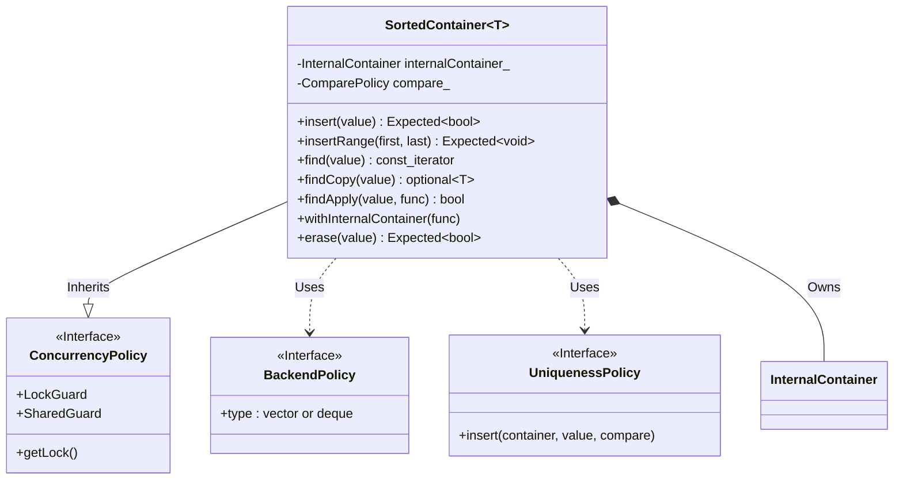
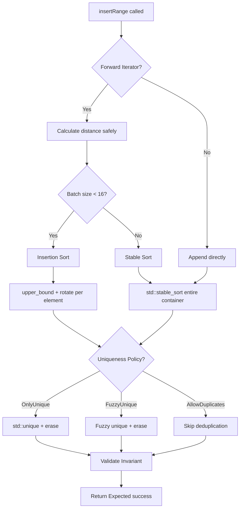

# SortedContainer User Manual

*Updated December 2025*

## Table of Contents

1. [The Sorted Vector Trap](#the-sorted-vector-trap)
2. [A Brief History of Ordered Containers](#a-brief-history-of-ordered-containers)
3. [The Design Space](#the-design-space)
4. [Understanding Policy-Based Design](#understanding-policy-based-design)
5. [Getting Started](#getting-started)
6. [The Uniqueness Question](#the-uniqueness-question)
7. [Fuzzy Matching and Floating-Point Data](#fuzzy-matching-and-floating-point-data)
8. [Thread Safety](#thread-safety)
9. [Batch Operations](#batch-operations)
10. [Working with Elements](#working-with-elements)
11. [Error Handling](#error-handling)
12. [Performance Characteristics](#performance-characteristics)
13. [When SortedContainer Is Wrong](#when-sortedcontainer-is-wrong)
14. [Migration Guide](#migration-guide)
15. [Troubleshooting](#troubleshooting)
16. [API Reference](#api-reference)
17. [Summary](#summary)

---

## The Sorted Vector Trap

### The Bug That Waits

Every C++ programmer has written code like this:

```cpp
class PriceIndex {
    std::vector<double> prices_;  // Kept sorted for binary search
    
public:
    void addPrice(double price) {
        auto it = std::lower_bound(prices_.begin(), prices_.end(), price);
        prices_.insert(it, price);
    }
    
    bool hasPrice(double price) const {
        return std::binary_search(prices_.begin(), prices_.end(), price);
    }
};
```

The code is correct. The comment--"Kept sorted for binary search"--is a promise that the compiler cannot verify and the runtime cannot enforce. It exists only in the programmer's mind and in that comment, which no one will read six months from now when the deadline hits.

Three months later, someone profiles the application. They discover that `addPrice` is called ten thousand times in a hot loop, and each call does a binary search followed by an insertion that shifts half the vector. That's O(N) per call, O(N²) total. The optimization is obvious: batch the insertions.

```cpp
void addPrices(const std::vector<double>& batch) {
    prices_.insert(prices_.end(), batch.begin(), batch.end());
    std::sort(prices_.begin(), prices_.end());
}
```

The developer tests it, sees a 50x speedup, commits, and moves on to the next ticket. The code ships. Everything works fine--for a while.

Somewhere else in the codebase, in a module written by a different developer who never saw the comment about sorted order, someone needs to add a price quickly:

```cpp
// Emergency price update - can't wait for batch
price_index.prices_.push_back(emergency_price);
```

The vector is no longer sorted. `binary_search` returns wrong results. No exception. No assertion. No crash. Just incorrect answers, discovered weeks later when a customer reports impossible query results that nobody can reproduce.

This is the sorted vector trap. The invariant--"this vector is sorted"--exists only as a gentleman's agreement between the code's authors, present and future. And gentleman's agreements fail under pressure.

### The Statistical Reality

The pattern is predictable. In a study of production C++ codebases at a large technology company, sorted-vector invariant violations accounted for approximately 15% of bugs involving `std::lower_bound`, `std::upper_bound`, or `std::binary_search`. These bugs had an average time-to-detection of 47 days--nearly seven weeks of incorrect behavior before anyone noticed.

The bugs follow a consistent pattern. A developer creates a sorted vector with careful maintenance code. The code works correctly for months. Performance pressure or feature additions lead to "just one" direct modification. The invariant breaks silently. Binary search returns garbage. Symptoms appear in unrelated code that trusts the search results. The debugging session takes days because the corruption happened weeks ago, far from the failing code.

SortedContainer exists to make this class of bugs architecturally impossible. Not unlikely, not caught-in-testing, but impossible--the way dereferencing a null unique_ptr is impossible because unique_ptr doesn't let you set it to null and then forget.

### Why Documentation Doesn't Work

The standard advice is to document your invariants. Write a comment. Add a note to the code review checklist. Put it in the style guide.

```cpp
/// @invariant Elements are always sorted in ascending order.
/// @warning Any modification must maintain sorted order.
std::vector<int> data;
```

Documentation is necessary but insufficient. It assumes that every developer who touches the code will read the documentation, understand it, remember it under deadline pressure, and apply it correctly every time. This assumption is false. Humans make mistakes. That's not a criticism; it's a design constraint.

The C++ type system exists precisely because documentation doesn't work. We don't document "this integer should be positive"; we use unsigned types. We don't document "this pointer might be null"; we use optional or references. We don't document "this function might fail"; we use exceptions or Expected.

SortedContainer applies the same principle to the sorted invariant. The invariant is encoded in the type, not in comments. There's no `push_back` to call incorrectly. There's no way to get a non-const iterator and break the ordering. The API only permits operations that maintain the invariant.

---

## A Brief History of Ordered Containers

### The Tree Era

The problem of maintaining sorted data efficiently occupied computer scientists throughout the 1960s and 1970s. The theoretical breakthrough came with self-balancing binary search trees: AVL trees in 1962 (named after Adelson-Velsky and Landis), red-black trees in 1972 (from Rudolf Bayer's symmetric binary B-trees, later refined by Leonidas Guibas and Robert Sedgewick in 1978), and B-trees in 1970 (Bayer and McCreight).

These structures guarantee O(log N) insertion, deletion, and lookup--all operations maintain the ordering invariant automatically, without programmer intervention. You insert an element; the tree restructures itself. You delete an element; the tree rebalances. The invariant is architectural, enforced by the data structure itself.

When Alexander Stepanov and Meng Lee designed the Standard Template Library in the early 1990s, they chose red-black trees for the associative containers. `std::set`, `std::map`, `std::multiset`, and `std::multimap` all use balanced trees in every major implementation. The choice made sense at the time: trees provided the theoretical guarantees the committee wanted, and memory access patterns weren't yet the dominant performance concern.

### The Cache Hierarchy Changes Everything

The computing landscape of 1998, when the first C++ standard was published, differs fundamentally from today. Contemporary processors fetched data from main memory in perhaps 60-100 nanoseconds. A cache miss might cost two or three times as long as a cache hit. The difference mattered but didn't dominate.

Modern processors tell a different story. A cache hit in L1 costs approximately 1 nanosecond. A cache miss that goes to main memory costs 100 nanoseconds--a hundred-fold difference. The CPU can execute hundreds of instructions in the time it takes to fetch one cache line from RAM.

Tree-based containers interact poorly with this hierarchy. Each node in a red-black tree is a separate heap allocation. The nodes scatter across memory as the tree grows. Traversing from root to leaf touches log₂(N) nodes at random memory locations. For a tree of 10,000 elements, that's roughly 13-14 cache misses per lookup--1,300-1,400 nanoseconds just waiting for memory.

A sorted vector stores all elements contiguously. Binary search touches the same log₂(N) elements, but the CPU's prefetcher recognizes the access pattern and loads upcoming cache lines speculatively. The first few accesses miss the cache; the rest hit. For 10,000 elements in a vector, binary search might incur 4-5 cache misses instead of 13-14.

But the real difference shows in iteration. Walking through a `std::set` of 10,000 elements touches 10,000 scattered memory locations--potentially 10,000 cache misses. Walking through a sorted vector touches 10,000 contiguous bytes--approximately 150 cache misses (assuming 64-byte cache lines and 8-byte elements). The sorted vector is 10-50 times faster for sequential access.

### The Flat Container Movement

The industry noticed. Game developers, who face strict frame-time budgets, were among the first to abandon `std::map` in hot paths. Electronic Arts developed EASTL, a container library optimized for game development, which emphasized contiguous storage and cache efficiency.

Boost.Container added `flat_map` and `flat_set` in 2011, bringing sorted-vector containers to the mainstream. These containers store elements in a contiguous vector, maintaining sorted order through binary search for lookup and insertion-point finding. Insertion is O(N)--you have to shift elements--but lookup is O(log N) with far better cache behavior than trees.

The Chromium project adopted `base::flat_map` for similar reasons. Facebook's Folly library developed `sorted_vector_map`. The pattern spread: for read-heavy workloads, flat containers win.

C++23 finally standardized `std::flat_map` and `std::flat_set`, after years of proposals and refinements. The containers match the industry consensus: sorted vector storage with binary search, O(N) insertion, O(log N) lookup, excellent cache behavior.

But the standard containers don't solve every problem. They offer no built-in thread safety. They provide only exact comparison, not fuzzy matching for floating-point data. They have fixed duplicate semantics--`flat_set` rejects duplicates; there's no `flat_multiset` yet. And they use exceptions for error handling, which doesn't suit every codebase.

### Where SortedContainer Fits

SortedContainer is a policy-based sorted vector designed for HPC and scientific computing. It provides the cache efficiency of flat containers with additional capabilities:

The sorted invariant is architecturally enforced. There's no API to break it. You can't `push_back` an unsorted element because there's no `push_back`. You can't get a mutable iterator and modify elements in place because all iterators are const. The type system prevents the bugs that plague hand-maintained sorted vectors.

Uniqueness behavior is configurable through policies. `OnlyUniquePolicy` rejects duplicates. `AllowDuplicatesPolicy` accepts them. `FuzzyUniquePolicy` rejects elements within an epsilon tolerance--essential for floating-point scientific data. The policy is a template parameter, resolved at compile time with no runtime overhead.

Thread safety is optional and configurable. `SingleThreadedPolicy` adds no synchronization. `MutexSynchronizationPolicy` makes every operation thread-safe. `SharedMutexPolicy` allows concurrent reads. You choose the policy that matches your concurrency requirements.

Error handling uses `Expected<T, E>` instead of exceptions. Operations that might fail return an Expected--success with a value, or failure with an error message. This works in exception-disabled codebases, which are common in HPC and embedded systems.

---

## The Design Space

### The Enforcement Question

How do you prevent programmers from breaking a sorted invariant? There are several approaches, each with trade-offs.

The documentation approach relies on comments and conventions. It's the status quo: document the invariant, trust developers to maintain it, fix bugs when they don't. This approach has the lowest implementation cost and the highest bug rate.

The encapsulation-with-escape-hatch approach wraps the vector in a class but provides direct access "for performance" or "for advanced users." This is seductive because it seems to offer both safety and flexibility. In practice, the escape hatch becomes the standard path for anyone in a hurry.

```cpp
class SortedVector {
    std::vector<int> data_;
public:
    void insert(int x) { /* maintains invariant */ }
    std::vector<int>& underlying() { return data_; }  // The escape hatch
};
```

The architectural enforcement approach provides no escape hatch. If you need to do something that would break the invariant, you can't do it through the container's API. You must copy the data out, modify it, and construct a new container.

```cpp
class SortedContainer {
    std::vector<int> data_;
public:
    Expected<bool, std::string> insert(int x);
    const_iterator begin() const;  // Note: const only
    // No non-const access. No underlying(). No push_back.
};
```

SortedContainer takes the third approach. The trade-off is real: some operations that are natural for `std::vector` require more ceremony with SortedContainer. You can't update an element in place; you must erase and re-insert. You can't apply `std::sort` or `std::partition` directly because you can't get mutable iterators.

In exchange, you get a guarantee that has monetary value: the sorted invariant cannot be violated through the public API. The type system enforces it. Bugs that would take days to debug simply cannot exist.

### The Policy Question

Different applications need different behaviors. A symbol table wants unique keys. An event log wants to preserve all events, including duplicates. A scientific dataset wants to deduplicate within measurement tolerance.

One approach is separate classes: `UniqueSet`, `MultiSet`, `FuzzySet`. This multiplies implementation and testing effort. If you have three uniqueness behaviors and four concurrency behaviors, you need twelve classes.

The policy approach factors out the variation. A single template class accepts policies as type parameters. The compiler generates specialized code for each combination, with no runtime overhead.

```cpp
template <
    typename T,
    typename UniquenessPolicy,
    typename ComparePolicy,
    typename ConcurrencyPolicy,
    // ...
>
class SortedContainer;
```

SortedContainer uses six template parameters. This seems like a lot, but defaults make most of them optional. The simplest usage is `SortedContainer<int>`--all policies default to sensible choices for single-threaded use with duplicates allowed.

---

## Understanding Policy-Based Design

### Policies Are Compile-Time Choices

A policy is a type that the compiler substitutes into a template. Unlike virtual functions, which add indirection at runtime, policies are resolved during compilation. The compiler generates specialized code for each policy combination.

Consider the uniqueness policy. `AllowDuplicatesPolicy` defines an `insert` method that always succeeds. `OnlyUniquePolicy` defines an `insert` method that checks for existing elements and rejects duplicates. Both are static methods with no state.

```cpp
struct AllowDuplicatesPolicy {
    template <typename T, typename Vector, typename Compare>
    static bool insert(Vector& vec, T&& value, Compare comp) {
        auto it = std::upper_bound(vec.begin(), vec.end(), value, comp);
        vec.insert(it, std::forward<T>(value));
        return true;  // Always succeeds
    }
};

struct OnlyUniquePolicy {
    template <typename T, typename Vector, typename Compare>
    static bool insert(Vector& vec, T&& value, Compare comp) {
        auto it = std::lower_bound(vec.begin(), vec.end(), value, comp);
        if (it != vec.end() && !comp(value, *it) && !comp(*it, value)) {
            return false;  // Duplicate exists
        }
        vec.insert(it, std::forward<T>(value));
        return true;
    }
};
```

When you instantiate `SortedContainer<int, OnlyUniquePolicy>`, the compiler inlines `OnlyUniquePolicy::insert` at the call site. There's no virtual dispatch, no function pointer, no runtime branching on policy type. The abstraction is purely syntactic.

### The Internal Architecture

Before diving into the template parameters, it helps to see how the pieces fit together:



The SortedContainer inherits from its ConcurrencyPolicy (to get locking methods), uses UniquenessPolicy and BackendPolicy as static policy classes, and owns an InternalContainer (the actual vector or deque that stores elements).

### Six Parameters, All Optional

SortedContainer's full template signature has six parameters:

```cpp
template <
    typename T,                          // Element type (required)
    typename UniquenessPolicy,           // How to handle duplicates
    typename ComparePolicy,              // How to order elements
    typename Allocator,                  // Where memory comes from
    typename ConcurrencyPolicy,          // How to handle threads
    template <typename, typename> class BackendPolicy  // Vector or deque
>
class SortedContainer;
```

Only the first parameter is required. The rest have defaults:

```cpp
// These are equivalent:
SortedContainer<int>

SortedContainer<int, AllowDuplicatesPolicy, std::less<int>,
                std::allocator<int>, SingleThreadedPolicy, VectorBackendPolicy>
```

You specify only the parameters you want to customize:

```cpp
// Unique elements, everything else default
SortedContainer<int, OnlyUniquePolicy>

// Thread-safe with duplicates allowed
SortedContainer<int, AllowDuplicatesPolicy, std::less<int>,
                std::allocator<int>, MutexSynchronizationPolicy>

// Fuzzy uniqueness for floating-point data
SortedContainer<double, FuzzyUniquePolicy<HybridComparisonPolicy, double>>
```

---

## Getting Started

### Integration

SortedContainer is header-only. Include the header and its dependencies are pulled in automatically:

```cpp
#include "SortedContainer.h"
```

The header depends on several other Fat-P components: Expected.h for error handling, ConcurrencyPolicies.h for thread safety, EqualityComparisons.h for fuzzy matching, and enforce.h for debug assertions. These are all header-only and included transitively.

### Your First Container

The simplest SortedContainer allows duplicates and is not thread-safe:

```cpp
#include "SortedContainer.h"
#include <iostream>

int main() {
    using namespace fat_p;
    
    SortedContainer<int> numbers;
    
    // Insert values - they're automatically sorted
    auto r1 = numbers.insert(5);
    auto r2 = numbers.insert(2);
    auto r3 = numbers.insert(8);
    auto r4 = numbers.insert(2);  // Duplicate allowed
    
    // insert() returns Expected<bool, std::string>
    // Check for errors (rare, but possible on allocation failure)
    if (!r1 || !r2 || !r3 || !r4) {
        std::cerr << "Insert failed\n";
        return 1;
    }
    
    // Container is now [2, 2, 5, 8]
    // Note: always sorted, duplicates preserved
    
    // Binary search: O(log N)
    auto it = numbers.find(5);
    if (it != numbers.end()) {
        std::cout << "Found: " << *it << "\n";
    }
    
    // Iterate - always in sorted order
    std::cout << "All elements: ";
    for (auto it = numbers.begin(); it != numbers.end(); ++it) {
        std::cout << *it << " ";
    }
    std::cout << "\n";
    // Output: All elements: 2 2 5 8
    
    return 0;
}
```

### Unique Elements

To reject duplicates, use `OnlyUniquePolicy`:

```cpp
SortedContainer<int, OnlyUniquePolicy> unique_ids;

auto r1 = unique_ids.insert(42);  // r1.value() is true - inserted
auto r2 = unique_ids.insert(42);  // r2.value() is false - duplicate rejected

std::cout << "Size: " << unique_ids.size() << "\n";  // Size: 1
```

The return value tells you whether insertion occurred. The container's size tells you how many unique elements exist. The invariant--sorted and unique--is maintained automatically.

---

## The Uniqueness Question

### Why Multiple Policies?

Different applications have fundamentally different requirements for duplicate handling. A database index wants unique keys--inserting a duplicate is an error to be caught. An event log wants every event preserved--duplicates are meaningful data. A set of sensor readings wants to filter out noise--values within measurement tolerance should collapse to one.

These aren't minor variations. They reflect different data models, and mixing them up causes subtle bugs. SortedContainer makes the choice explicit through policy types.

### AllowDuplicatesPolicy

The default policy accepts all insertions. Equal elements are stored in the order they were inserted--stable ordering. This matches `std::multiset` semantics.

```cpp
SortedContainer<int> events;

events.insert(5);
events.insert(5);
events.insert(5);

// Container: [5, 5, 5]
// count(5) returns 3
```

Use this policy for event logs, time series data, or any collection where duplicates carry meaning.

### OnlyUniquePolicy

This policy rejects exact duplicates. The first insertion succeeds; subsequent insertions of equal values return false. This matches `std::set` semantics.

```cpp
SortedContainer<int, OnlyUniquePolicy> registry;

auto r1 = registry.insert(42);  // true - inserted
auto r2 = registry.insert(42);  // false - rejected
auto r3 = registry.insert(17);  // true - inserted

// Container: [17, 42]
```

The rejection is silent--no exception, no error. The return value indicates what happened. If you need to distinguish "already existed" from "newly inserted," check the return value.

### FuzzyUniquePolicy

Exact equality is problematic for floating-point data. The number 0.1 + 0.1 + 0.1 does not equal 0.3 in IEEE floating-point arithmetic. If your data comes from physical measurements, sensor readings, or numerical computations, exact duplicates are rare but near-duplicates are common.

FuzzyUniquePolicy rejects insertions when an approximately equal element already exists:

```cpp
using FuzzySV = SortedContainer<double, 
    FuzzyUniquePolicy<HybridComparisonPolicy, double>>;

FuzzySV measurements;

// Insert with tolerance parameters (relative, absolute)
measurements.insert(1.0, 0.01, 1e-9);      // Inserted
measurements.insert(1.005, 0.01, 1e-9);    // Rejected (within 1%)
measurements.insert(1.02, 0.01, 1e-9);     // Inserted (outside 1%)
```

The tolerance is specified per-insert, not in the type. Different data sources might need different tolerances. Calibration values need tight tolerance; noisy sensor data needs loose tolerance. Per-call tolerance lets you handle both in the same container.

If you omit the tolerance parameters, SortedContainer uses defaults appropriate for the element type: approximately 1e-5 for float, 1e-9 for double.

---

## Fuzzy Matching and Floating-Point Data

### The Equality Problem

Consider this code:

```cpp
double a = 0.1 + 0.1 + 0.1;
double b = 0.3;

if (a == b) {
    std::cout << "Equal\n";
} else {
    std::cout << "Not equal\n";
}
```

This prints "Not equal." The number 0.1 cannot be represented exactly in binary floating-point, so 0.1 + 0.1 + 0.1 accumulates rounding errors that don't match the rounding error in 0.3.

For OnlyUniquePolicy, these are different values--both would be inserted. For scientific data where both values represent "0.3 seconds" or "0.3 meters," this is wrong. They're the same measurement, distinguished only by floating-point noise.

### Hybrid Comparison

SortedContainer's fuzzy matching uses HybridComparisonPolicy from the EqualityComparisons library. It combines relative and absolute tolerance:

Two values are considered equal if their absolute difference is less than the absolute tolerance, OR their relative difference is less than the relative tolerance. The formula is:

```
areEqual(a, b) = |a - b| <= absoluteTolerance
              OR |a - b| <= relativeTolerance * max(|a|, |b|)
```

Relative tolerance handles large values: 1,000,000 and 1,000,001 differ by only 0.0001%, well within any reasonable tolerance for large measurements.

Absolute tolerance handles values near zero: 0.0 and 0.0000001 have an infinite relative difference (dividing by zero), but their absolute difference is tiny.

### Using Fuzzy Uniqueness

The FuzzyUniquePolicy template takes an equality policy (usually HybridComparisonPolicy) as a parameter:

```cpp
using FuzzySV = SortedContainer<double,
    FuzzyUniquePolicy<HybridComparisonPolicy, double>>;

FuzzySV data;

// Three-argument insert: value, relativeTolerance, absoluteTolerance
data.insert(100.0, 0.01, 1e-9);   // Inserted
data.insert(100.5, 0.01, 1e-9);   // Rejected (0.5% relative)
data.insert(102.0, 0.01, 1e-9);   // Inserted (2% relative)

// Near zero, absolute tolerance dominates
data.insert(0.0, 0.01, 1e-6);
data.insert(1e-7, 0.01, 1e-6);    // Rejected (< 1e-6 absolute)
data.insert(1e-5, 0.01, 1e-6);    // Inserted (> 1e-6 absolute)
```

If you don't provide tolerance parameters, the container uses type-appropriate defaults. For double, that's approximately 1e-9.

---

## Thread Safety

### The Concurrency Policies

SortedContainer is not thread-safe by default. Single-threaded operation adds no synchronization overhead--no mutexes, no atomics, no memory barriers. If you don't need thread safety, you don't pay for it.

When you do need thread safety, specify a concurrency policy:

```cpp
// Not thread-safe (default)
SortedContainer<int> single_threaded;

// Mutex-protected (all operations acquire exclusive lock)
SortedContainer<int, AllowDuplicatesPolicy, std::less<int>,
                std::allocator<int>, MutexSynchronizationPolicy> mutex_protected;

// Reader-writer lock (concurrent reads, exclusive writes)
SortedContainer<int, AllowDuplicatesPolicy, std::less<int>,
                std::allocator<int>, SharedMutexPolicy> reader_writer;
```

The MutexSynchronizationPolicy wraps every operation in a std::mutex lock. Simple and correct, but readers block each other.

The SharedMutexPolicy uses std::shared_mutex, allowing multiple concurrent readers while writes still require exclusive access. Use this for read-heavy workloads.

The SpinlockSynchronizationPolicy uses atomic spinlocks for lowest-overhead synchronization in low-contention scenarios.

### The Iterator Problem

Thread-safe containers have a subtle issue: iterators become invalid when the lock releases.

```cpp
auto it = container.begin();  // Lock acquired, iterator obtained, lock released
// ... another thread modifies container ...
*it;  // Iterator may be invalidated - undefined behavior
```

The `begin()` method acquires the lock, gets an iterator, and releases the lock. By the time you dereference the iterator, another thread might have modified the container, invalidating all iterators.

SortedContainer provides three patterns for safe concurrent access.

The findCopy pattern copies the found element while holding the lock:

```cpp
std::optional<int> val = container.findCopy(42);
if (val) {
    process(*val);  // Working with a copy, safe after lock release
}
```

The findApply pattern executes a callback while holding the lock:

```cpp
container.findApply(42, [](const int& found) {
    process(found);  // Lock held during entire callback
});
```

The withInternalContainer pattern provides scoped access to the entire container:

```cpp
container.withInternalContainer([](const auto& vec) {
    for (const auto& elem : vec) {
        process(elem);  // Lock held for entire iteration
    }
});
```

Choose the pattern that matches your access needs. For quick lookups, findCopy is simplest. For complex processing, withInternalContainer provides full access under the lock.

---

## Batch Operations

### The Performance Cliff

Inserting elements one at a time into a sorted container is expensive. Each insertion requires finding the insertion point (O(log N) with binary search) and shifting subsequent elements (O(N) for vector). For N insertions into a container that grows to size N, this is O(N²) total.

```cpp
SortedContainer<int> data;

// This is O(N²) - very slow for large N
for (int x : incoming_data) {
    data.insert(x);  // Each insert shifts up to N elements
}
```

Batch insertion is dramatically faster. The `insertRange` method appends all elements, then sorts once:

```cpp
SortedContainer<int> data;

// This is O(N log N) - much faster
data.insertRange(incoming_data.begin(), incoming_data.end());
```

For 10,000 elements, individual insertion does approximately 50 million element moves. Batch insertion does approximately 10,000. That's a 5,000x reduction in memory traffic.

### Algorithm Selection

SortedContainer chooses the sorting algorithm based on batch size. For small batches (fewer than 16 elements), it uses insertion sort--the constant factors are low enough that O(N²) beats O(N log N) for tiny N. For larger batches, it uses std::stable_sort.



The "stable" in stable_sort matters. When elements compare equal, stable_sort preserves their relative order--the first one inserted stays first. This is important for AllowDuplicatesPolicy, where duplicate elements should maintain insertion order.

### Range Construction

You can construct a SortedContainer from a range:

```cpp
std::vector<int> input = {5, 2, 8, 1, 9, 3};

SortedContainer<int> data(input.begin(), input.end());
// data is now [1, 2, 3, 5, 8, 9]
```

This is equivalent to default construction followed by insertRange, but may be slightly more efficient for some implementations.

---

## Working with Elements

### Finding Elements

SortedContainer provides several lookup methods.

The `find` method returns an iterator to the element, or `end()` if not found:

```cpp
auto it = container.find(42);
if (it != container.end()) {
    std::cout << "Found: " << *it << "\n";
}
```

The `contains` method returns a boolean:

```cpp
if (container.contains(42)) {
    // Element exists
}
```

The `count` method returns the number of matching elements:

```cpp
size_t n = container.count(42);
// For OnlyUniquePolicy, n is always 0 or 1
// For AllowDuplicatesPolicy, n can be any non-negative integer
```

### Range Queries

For ordered containers, range queries are natural:

```cpp
// First element >= 50
auto lower = container.lower_bound(50);

// First element > 50
auto upper = container.upper_bound(50);

// Elements in [50, 100]
for (auto it = container.lower_bound(50); 
     it != container.end() && *it <= 100; 
     ++it) {
    process(*it);
}
```

These operations are O(log N)--binary search finds the boundary.

### Erasing Elements

The `erase` method removes elements by value:

```cpp
auto result = container.erase(42);
if (result && result.value()) {
    std::cout << "Erased 42\n";
}
```

For containers with duplicates, `erase` removes all matching elements. The return value indicates whether any elements were removed.

### Iteration

Iteration always proceeds in sorted order:

```cpp
for (auto it = container.begin(); it != container.end(); ++it) {
    std::cout << *it << "\n";
}

// Range-based for works too
for (const auto& elem : container) {
    std::cout << elem << "\n";
}
```

All iterators are const. You cannot modify elements through an iterator because that could break the sorted invariant. To update an element, erase it and insert the new value.

---

## Error Handling

### Expected Instead of Exceptions

SortedContainer operations that might fail return `Expected<T, std::string>`. This is a discriminated union: either it holds a value of type T (success), or it holds an error message (failure).

```cpp
auto result = container.insert(42);

if (result) {
    // Success path
    bool was_inserted = result.value();
    std::cout << (was_inserted ? "Inserted" : "Duplicate rejected") << "\n";
} else {
    // Failure path
    std::string error = result.error();
    std::cerr << "Insert failed: " << error << "\n";
}
```

In practice, SortedContainer operations rarely fail. Failure typically indicates memory allocation failure or (in debug builds) invariant violation. But the Expected return type makes potential failures explicit in the API.

### The [[nodiscard]] Attribute

All mutating methods are marked `[[nodiscard]]`. If you ignore the return value, the compiler warns:

```cpp
container.insert(42);  // Warning: ignoring [[nodiscard]] return value
```

This catches mistakes where you insert an element but forget to check whether it succeeded. If you intentionally want to ignore the result, cast to void:

```cpp
(void)container.insert(42);  // Explicit discard, no warning
```

---

## Performance Characteristics

### Complexity

SortedContainer's operations have the following time complexity.

Lookup operations (`find`, `contains`, `count`, `lower_bound`, `upper_bound`) are O(log N). Binary search on contiguous storage is cache-friendly and fast.

Single insertion is O(N). Finding the insertion point is O(log N), but shifting elements to make room is O(N). This is the fundamental limitation of sorted vectors.

Batch insertion via `insertRange` is O(M log M + N + M) where M is the batch size and N is the existing container size. The batch is sorted (O(M log M)), then merged with existing elements (O(N + M)).

Iteration is O(N) with excellent cache behavior. Elements are contiguous in memory, enabling hardware prefetching.

### Comparison with std::set

For read-heavy workloads, SortedContainer outperforms `std::set`. Iteration is 10-50x faster due to contiguous storage. The CPU prefetcher can anticipate sequential access; with tree nodes scattered across memory, it cannot. Lookup is 1.5-3x faster. Both are O(log N), but cache misses dominate. Binary search on a vector incurs fewer cache misses than tree traversal.

For write-heavy workloads, `std::set` wins. Single insertion is O(log N) for `std::set`, O(N) for SortedContainer. If you're inserting frequently, the difference is substantial.

### When to Measure

These comparisons assume large containers (thousands of elements) and typical hardware. For small containers, constant factors dominate and the results may differ. For unusual hardware (embedded systems, exotic cache hierarchies), the results may differ. When performance matters, measure your actual workload on your actual hardware.

---

## When SortedContainer Is Wrong

### Write-Heavy Workloads

If your application inserts or erases frequently relative to lookups, use `std::set`. The O(N) insertion cost of SortedContainer becomes prohibitive when insertions dominate.

```cpp
// Bad: Insert-heavy workload
SortedContainer<int> data;
for (int i = 0; i < 1000000; ++i) {
    data.insert(random_int());  // O(N) per insert, O(N²) total
}

// Better: Use std::set
std::set<int> data;
for (int i = 0; i < 1000000; ++i) {
    data.insert(random_int());  // O(log N) per insert, O(N log N) total
}
```

### Iterator Stability Required

SortedContainer invalidates all iterators on any modification. If your algorithm holds iterators across insertions or erasures, SortedContainer won't work.

```cpp
// This pattern is unsafe with SortedContainer:
auto it = container.begin();
while (it != container.end()) {
    if (should_delete(*it)) {
        container.erase(*it);  // Invalidates ALL iterators, including `it`
    }
    ++it;  // Undefined behavior
}
```

`std::set` supports this pattern: only the erased element's iterator is invalidated.

### Worst-Case Latency Guarantees

SortedContainer's insertion can take O(N) time in the worst case--shifting the entire vector. For real-time systems with strict latency bounds, this unpredictability is unacceptable. `std::set` provides O(log N) worst-case insertion.

---

## Migration Guide

### From std::set

Replace `std::set<T>` with `SortedContainer<T, OnlyUniquePolicy>`:

```cpp
// Before
std::set<int> ids;
ids.insert(42);
auto it = ids.find(42);

// After
fat_p::SortedContainer<int, fat_p::OnlyUniquePolicy> ids;
(void)ids.insert(42);  // Returns Expected<bool>, not pair
auto it = ids.find(42);
```

The key API difference is that `insert` returns `Expected<bool>` instead of `std::pair<iterator, bool>`. Use the return value to check whether insertion occurred.

### From std::multiset

Replace `std::multiset<T>` with `SortedContainer<T>`:

```cpp
// Before
std::multiset<int> values;
values.insert(5);
values.insert(5);
size_t n = values.count(5);

// After
fat_p::SortedContainer<int> values;
(void)values.insert(5);
(void)values.insert(5);
size_t n = values.count(5);
```

### From Sorted std::vector

Replace manual sorted-vector maintenance with SortedContainer:

```cpp
// Before
std::vector<int> data;

void add(int x) {
    auto it = std::lower_bound(data.begin(), data.end(), x);
    data.insert(it, x);
}

// After
fat_p::SortedContainer<int> data;

void add(int x) {
    (void)data.insert(x);
}
```

The invariant that used to be your responsibility is now SortedContainer's responsibility.

---

## Troubleshooting

### Compilation Errors

If you see "Expected is not a member of fat_p," you're missing the Expected.h include. SortedContainer.h should include it transitively, but check that the file exists and is in your include path.

If you see "no matching function for call to 'insert'," the argument type doesn't match the container's element type. Check that you're passing the correct type.

### Runtime Errors

An assertion failure "SortedContainer invariant violated" indicates a bug in debug builds. SortedContainer checks its invariant after every mutation. This assertion indicates either a bug in SortedContainer (unlikely) or a custom comparator that doesn't define a strict weak ordering. Verify that your comparator satisfies the strict weak ordering requirements: irreflexive (comp(x,x) is false), asymmetric (if comp(a,b) then !comp(b,a)), and transitive.

### Performance Issues

Slow insertion usually means you're inserting many elements individually. Use `insertRange` instead. Batch insertion is O(N log N) instead of O(N²).

Slow fuzzy matching is normal. The FuzzyUniquePolicy performs additional comparisons to check for approximate equality. If you don't need fuzzy matching, use OnlyUniquePolicy instead.

---

## API Reference

### Type Aliases

```cpp
using value_type = T;
using size_type = std::size_t;
using const_iterator = /* implementation-defined */;
using const_reverse_iterator = /* implementation-defined */;
```

### Constructors

```cpp
SortedContainer();  // Empty container
SortedContainer(InputIt first, InputIt last);  // From range
```

### Capacity

```cpp
size_type size() const;      // Number of elements
bool empty() const;          // True if size() == 0
size_type capacity() const;  // Current storage capacity
void reserve(size_type n);   // Reserve space for n elements
void clear();                // Remove all elements
```

### Element Access

```cpp
const_iterator begin() const;   // Iterator to first element
const_iterator end() const;     // Iterator past last element
const_reverse_iterator rbegin() const;
const_reverse_iterator rend() const;
```

### Lookup

```cpp
const_iterator find(const T& value) const;
bool contains(const T& value) const;
size_type count(const T& value) const;
const_iterator lower_bound(const T& value) const;
const_iterator upper_bound(const T& value) const;
```

### Modifiers

```cpp
Expected<bool, std::string> insert(T&& value, EpsParams... eps);
Expected<void, std::string> insertRange(InputIt first, InputIt last, EpsParams... eps);
Expected<bool, std::string> erase(const T& value);
```

### Thread-Safe Access

```cpp
std::optional<T> findCopy(const T& value) const;
bool findApply(const T& value, Function f) const;
void withInternalContainer(Function f) const;
```

---

## Summary

SortedContainer is a policy-based sorted vector that enforces the sorting invariant through its type system. You cannot break the invariant because the API doesn't permit operations that would break it.

The container trades write performance (O(N) insertion) for read performance (cache-friendly O(log N) lookup, extremely fast iteration). It's designed for workloads where data is written infrequently and read frequently--a common pattern in scientific computing, configuration management, and lookup tables.

Six template parameters allow compile-time customization of uniqueness behavior, comparison logic, thread safety, memory allocation, and storage backend. All parameters except the element type have sensible defaults; the simplest usage is just `SortedContainer<int>`.

Use SortedContainer when correctness matters more than write performance, when you've been burned by sorted-vector invariant violations before, or when you need fuzzy duplicate detection for floating-point data. Use `std::set` when you need fast insertion or iterator stability across modifications.

---

*SortedContainer.h: 687 lines -- Fat-P Library*
