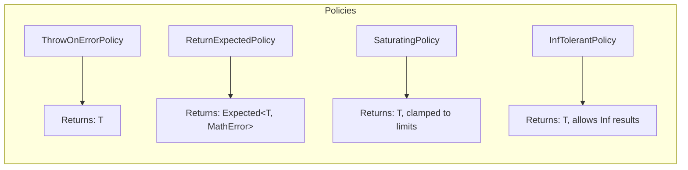

# CheckedArithmetic User Manual

**Library:** fat_p C++ Utilities  
**Standard:** C++17 (C++20 enhanced)  
**Type:** Header-only

---

## Table of Contents

1. [What is CheckedArithmetic?](#what-is-checkedarithmetic)
   - [The Problem: Silent Arithmetic Errors](#the-problem-silent-arithmetic-errors)
   - [The C++ Landscape](#the-c-landscape)
   - [Where CheckedArithmetic Fits](#where-checkedarithmetic-fits)
2. [Core Architecture](#core-architecture)
   - [Design Principles](#design-principles)
   - [Implementation Strategy](#implementation-strategy)
   - [Policy Behavior Summary](#policy-behavior-summary)
   - [MathError Enumeration](#matherror-enumeration)
   - [noexcept Guarantees](#noexcept-guarantees)
3. [Getting Started](#getting-started)
   - [Prerequisites](#prerequisites)
   - [Integration](#integration)
   - [Compilation Flags](#compilation-flags)
   - [First Program](#first-program)
4. [Integer Operations](#integer-operations)
   - [Basic Arithmetic](#basic-arithmetic)
   - [Increment and Decrement](#increment-and-decrement)
   - [Negation](#negation)
   - [Bitwise Operations](#bitwise-operations)
   - [Division by Zero Behavior](#division-by-zero-behavior)
5. [Floating-Point Operations](#floating-point-operations)
   - [Basic FP Arithmetic](#basic-fp-arithmetic)
   - [Math Functions](#math-functions)
   - [NaN and Infinity Handling](#nan-and-infinity-handling)
   - [InfTolerantPolicy for Scientific Computing](#inftolerantpolicy-for-scientific-computing)
6. [Vector Operations](#vector-operations)
   - [Integer Vectors](#integer-vectors)
   - [Floating-Point Vectors](#floating-point-vectors)
   - [Vector Size Mismatch Handling](#vector-size-mismatch-handling)
   - [SIMD Optimization](#simd-optimization)
   - [Vector Edge Cases](#vector-edge-cases)
7. [Utility Operations](#utility-operations)
   - [Clamp](#clamp)
   - [Range Check](#range-check)
   - [Pointer Arithmetic](#pointer-arithmetic)
8. [Checked Cast](#checked-cast)
   - [Basic Usage](#basic-usage)
   - [Detected Errors](#detected-errors)
   - [Examples](#examples)
   - [Compile-Time Checked Cast](#compile-time-checked-cast)
9. [Compile-Time Operations](#compile-time-operations)
10. [Edge Cases and Gotchas](#edge-cases-and-gotchas)
    - [Integer Operations](#integer-operations-1)
    - [Floating-Point Operations](#floating-point-operations-1)
    - [Shift Operations](#shift-operations)
    - [Type Casting](#type-casting)
11. [Performance Characteristics](#performance-characteristics)
    - [Benchmark Methodology](#benchmark-methodology)
    - [Test Environments](#test-environments)
    - [Benchmark Results](#benchmark-results)
    - [Policy Overhead Comparison](#policy-overhead-comparison)
    - [Raw vs Checked Overhead](#raw-vs-checked-overhead)
    - [Vector Size Scaling](#vector-size-scaling-avx2)
    - [Performance Guidelines](#performance-guidelines)
12. [Comparison with Other Approaches](#comparison-with-other-approaches)
    - [vs Raw Arithmetic](#vs-raw-arithmetic)
    - [vs Boost.SafeNumerics](#vs-boostsafenumerics)
    - [vs Manual Checks](#vs-manual-checks)
13. [Migration Guide](#migration-guide)
    - [From Raw Arithmetic](#from-raw-arithmetic)
    - [From Boost.SafeNumerics](#from-boostsafenumerics)
    - [From Manual Overflow Checks](#from-manual-overflow-checks)
    - [Complete Migration Example](#complete-migration-example)
    - [Incremental Adoption Strategy](#incremental-adoption-strategy)
14. [Best Practices](#best-practices)
    - [When to Use Each Policy](#when-to-use-each-policy)
    - [Naming Conventions](#naming-conventions)
    - [API Design Patterns](#api-design-patterns)
15. [Troubleshooting](#troubleshooting)
    - [Compilation Errors](#compilation-errors)
    - [Runtime Errors](#runtime-errors)
    - [Performance Issues](#performance-issues)
16. [Summary](#summary)
    - [Key Features](#key-features)
    - [Performance Profile](#performance-profile)
    - [Quick Reference](#quick-reference)

---

## What is CheckedArithmetic?

### The Problem: Silent Arithmetic Errors

Arithmetic operations in C++ can fail silently, producing incorrect results without any warning. Consider this seemingly innocent code:

```cpp
// This code compiles and runs without error, but produces wrong results
int calculate_total_cost(int quantity, int unit_price)
{
    return quantity * unit_price;  // Silent overflow if result > INT_MAX
}

int main()
{
    int total = calculate_total_cost(1000000, 5000);
    std::cout << "Total: $" << total << std::endl;  // Prints garbage value!
    // Expected: 5,000,000,000
    // Actual:   705,032,704 (due to overflow wraparound)
}
```

Floating-point operations have their own pitfalls:

```cpp
double compute_ratio(double a, double b)
{
    return a / b;  // Returns Inf if b == 0, NaN if 0/0
}

double process_data(double input)
{
    double result = compute_ratio(input, 0.0);
    // result is now Inf or NaN, but the program continues silently
    return result * 100.0;  // Inf * 100 = Inf, propagating the error
}
```

These silent failures can propagate through your program, causing incorrect results in financial calculations, scientific computations, or safety-critical systems.

### The C++ Landscape

Several approaches exist for handling arithmetic safety:

| Approach | Pros | Cons |
|----------|------|------|
| Raw arithmetic | Fast, simple | Silent overflow, undefined behavior |
| Boost.SafeNumerics | Comprehensive, well-tested | Heavy dependency, no FP support, no SIMD |
| `std::safe_integers` (P0228) | Standards-based | Still a proposal, not available |
| Compiler sanitizers | Good for testing | Runtime overhead, not for production |
| Manual checks | No dependencies | Error-prone, verbose, inconsistent |

### Where CheckedArithmetic Fits

CheckedArithmetic provides:

- Policy-based error handling (throw, return Expected, saturate, or tolerate Inf)
- Full floating-point support with NaN/Inf detection
- SIMD-accelerated vector operations (AVX2)
- Compile-time checked operations via `static_math` namespace
- Zero-overhead abstractions where possible
- Header-only implementation with no external dependencies

**Use CheckedArithmetic when:**

- Financial calculations require guaranteed correctness
- Scientific computations need proper NaN/Inf handling
- Safety-critical code must detect arithmetic failures
- Performance matters but correctness is paramount

**Consider alternatives when:**

- Maximum performance is required with no safety checks
- Already using Boost heavily (use SafeNumerics for consistency)
- Only need integer operations without SIMD

---

## Core Architecture

### Design Principles

CheckedArithmetic uses a policy-based design where error handling strategy is specified as a template parameter:

```cpp
template <typename Policy = ThrowOnErrorPolicy, typename T>
PolicyReturnType<Policy, T> checked_add(T a, T b);
```

The return type adapts based on the policy:



### Implementation Strategy

#### Design Rationale

Key design decisions and their motivations:

| Decision | Why |
|----------|-----|
| Policy template parameter | Zero-overhead abstraction - unused policies generate no code via `if constexpr` |
| `uintptr_t` for pointer arithmetic | Portable address-space arithmetic; `reinterpret_cast` is well-defined for this purpose |
| AVX2 only (not AVX-512) | Broader hardware support; AVX-512 causes CPU throttling on some chips |
| int32_t/double vectors only | Most common HPC use cases; avoids template explosion for rarely-used types |
| Macro-based FP validation | Inlines completely; no function call overhead in hot paths |
| `do {} while(0)` macro pattern | Allows safe use in any statement context (e.g., after `if` without braces) |
| No thread safety | Simple utility library; users manage synchronization at higher level |

**Why not generic SIMD for all types?**

SIMD support is limited to `int32_t` and `double` because:
1. These cover 90%+ of HPC vector workloads
2. `int64_t` SIMD overflow detection requires different algorithms (no single-instruction check)
3. `float` SIMD would duplicate `double` code with minimal benefit
4. Template explosion would significantly increase compile times

Users requiring other types can extend using `detail::checked_vec_op_generic` as a template.

#### Compiler Intrinsics

For overflow detection, CheckedArithmetic uses compiler builtins when available:

```cpp
#if defined(__has_builtin)
    #if __has_builtin(__builtin_add_overflow)
        #define HAS_BUILTIN_OVERFLOW 1
    #endif
#elif defined(__GNUC__) && (__GNUC__ >= 5)
    #define HAS_BUILTIN_OVERFLOW 1
#else
    #define HAS_BUILTIN_OVERFLOW 0
#endif
```

When `HAS_BUILTIN_OVERFLOW` is enabled (GCC 5+, Clang), operations compile to single CPU instructions with built-in overflow flags:

```cpp
// Builtin path - single instruction with flag check
T result;
if (__builtin_add_overflow(a, b, &result)) {
    // Handle overflow based on policy
}
```

When unavailable (MSVC), the library falls back to portable checks:

```cpp
// Fallback path - manual overflow detection
T result = a + b;
bool overflow = (b > 0 && a > std::numeric_limits<T>::max() - b) ||
                (b < 0 && a < std::numeric_limits<T>::min() - b);
```

This explains the ~4-6x performance difference between GCC and MSVC in benchmarks.

#### Floating-Point Validation

The `VALIDATE_FP_INPUTS` macro provides zero-overhead FP input validation in non-error paths:

```cpp
#define VALIDATE_FP_INPUTS(a, b, op_name)                     \
    do {                                                       \
        if (std::isnan(a) || std::isnan(b)) {                 \
            // Policy-specific NaN handling                    \
        }                                                      \
        if (std::isinf(a) && std::isinf(b)) {                 \
            // Check for Inf-Inf undefined cases               \
        }                                                      \
    } while(0)
```

This macro checks inputs *before* computation, enabling early rejection of invalid values without performing the operation. The `do { } while(0)` pattern ensures macro hygiene.

#### SIMD Error Detection

Vector operations use SIMD-optimized error detection that checks all elements in parallel:

```cpp
// Inside checked_add_vec_fp - AVX2 path
auto detect_simd_error = [](const __m256d& va, const __m256d& vb, 
                            const __m256d& vr) -> bool {
    // Check for NaN results (unordered comparison)
    __m256d nan_mask = _mm256_cmp_pd(vr, vr, _CMP_UNORD_Q);
    if (_mm256_movemask_pd(nan_mask) != 0) {
        return true;  // At least one NaN
    }
    
    // Check for Inf from finite inputs (overflow)
    __m256d inf_pos = _mm256_set1_pd(std::numeric_limits<double>::infinity());
    __m256d inf_neg = _mm256_set1_pd(-std::numeric_limits<double>::infinity());
    // ... additional checks ...
    return false;
};
```

This parallel detection enables fast-path execution when all elements are valid, falling back to scalar checks only when errors are detected.

### Policy Behavior Summary

| Policy | Return Type | On Error | noexcept |
|--------|-------------|----------|----------|
| `ThrowOnErrorPolicy` | `T` | Throws exception | No |
| `ReturnExpectedPolicy` | `Expected<T, MathError>` | Returns error | Yes |
| `SaturatingPolicy` | `T` | Clamps to limits | Yes |
| `InfTolerantPolicy` | `T` | FP: Allows Inf, returns NaN for NaN; Int: Saturates | Yes |

> **Note**: `InfTolerantPolicy` is fully `noexcept` and never throws. For FP operations, it allows 
> Infinity results and returns `quiet_NaN()` for NaN inputs or undefined operations (like Inf - Inf).
> For integer operations, it behaves identically to `SaturatingPolicy`.

### MathError Enumeration

```cpp
enum class MathError {
    Overflow,        // Result exceeds type's maximum
    Underflow,       // Result below type's minimum
    DivByZero,       // Division or modulo by zero
    NaN,             // Result is Not-a-Number
    Inf,             // Result is Infinity (from finite inputs)
    InvalidArgument  // Invalid parameter (e.g., negative shift)
};
```

### noexcept Guarantees

Operations are conditionally `noexcept` based on policy:

```cpp
// These are noexcept - no exceptions thrown
static_assert(noexcept(fat_p::checked_add<fat_p::ReturnExpectedPolicy>(1, 2)));
static_assert(noexcept(fat_p::checked_add<fat_p::SaturatingPolicy>(1, 2)));

// This can throw - not noexcept
static_assert(!noexcept(fat_p::checked_add<fat_p::ThrowOnErrorPolicy>(1, 2)));
```

---

## Getting Started

### Prerequisites

- C++17 or later compiler
- Supported compilers: GCC 7+, Clang 6+, MSVC 2019+
- Optional: AVX2 support for SIMD acceleration

### Integration

CheckedArithmetic is header-only. Include the header and use the `fat_p` namespace:

```cpp
#include "CheckedArithmetic.h"
```

Dependencies (must be available):

- `enforce.h` - Assertion/contract enforcement
- `Expected.h` - Expected type for error handling
- `CppStandardDetection.h` - C++ version detection

### Compilation Flags

**MSVC (Release):**
```
/std:c++17 /O2 /DNDEBUG /EHsc /arch:AVX2
```

**GCC/Clang (Release):**
```
-std=c++17 -O2 -DNDEBUG -mavx2
```

### First Program

```cpp
#include <iostream>
#include <limits>
#include "CheckedArithmetic.h"

int main()
{
    // Safe addition with ThrowOnErrorPolicy (default)
    try
    {
        int result = fat_p::checked_add<fat_p::ThrowOnErrorPolicy>(
            std::numeric_limits<int>::max(), 1);
        std::cout << "Result: " << result << std::endl;
    }
    catch (const std::exception& e)
    {
        std::cout << "Caught overflow: " << e.what() << std::endl;
    }
    
    // Safe addition with ReturnExpectedPolicy
    auto expected_result = fat_p::checked_add<fat_p::ReturnExpectedPolicy>(
        std::numeric_limits<int>::max(), 1);
    
    if (expected_result.has_value())
    {
        std::cout << "Result: " << *expected_result << std::endl;
    }
    else
    {
        std::cout << "Error: " << expected_result.error() << std::endl;
    }
    
    // Saturating addition - clamps to max instead of overflowing
    int saturated = fat_p::checked_add<fat_p::SaturatingPolicy>(
        std::numeric_limits<int>::max(), 100);
    std::cout << "Saturated: " << saturated << std::endl;  // INT_MAX
    
    return 0;
}
```

---

## Integer Operations

### Basic Arithmetic

```cpp
// Addition
int sum = fat_p::checked_add<fat_p::ThrowOnErrorPolicy>(a, b);

// Subtraction
int diff = fat_p::checked_sub<fat_p::ThrowOnErrorPolicy>(a, b);

// Multiplication
int prod = fat_p::checked_mul<fat_p::ThrowOnErrorPolicy>(a, b);

// Division (throws on divide-by-zero and INT_MIN/-1)
int quot = fat_p::checked_div<fat_p::ThrowOnErrorPolicy>(a, b);

// Modulo (throws on divide-by-zero and INT_MIN%-1)
int rem = fat_p::checked_mod<fat_p::ThrowOnErrorPolicy>(a, b);
```

### Increment and Decrement

```cpp
// Checked increment (equivalent to checked_add(a, 1))
int incremented = fat_p::checked_inc<fat_p::ThrowOnErrorPolicy>(a);

// Checked decrement (equivalent to checked_sub(a, 1))
int decremented = fat_p::checked_dec<fat_p::ThrowOnErrorPolicy>(a);
```

### Negation

```cpp
// Checked negation (throws on INT_MIN)
int negated = fat_p::checked_negate<fat_p::ThrowOnErrorPolicy>(a);
```

### Absolute Value (Integer)

```cpp
// Checked absolute value for integers
// Throws/saturates on INT_MIN (since |INT_MIN| > INT_MAX in two's complement)
int abs_val = fat_p::checked_abs<fat_p::ThrowOnErrorPolicy>(-42);  // Returns 42

// For unsigned types, this is a no-op
unsigned u = fat_p::checked_abs<fat_p::SaturatingPolicy>(5u);  // Returns 5

// INT_MIN overflow handling
auto result = fat_p::checked_abs<fat_p::SaturatingPolicy>(std::numeric_limits<int>::min());
// result == std::numeric_limits<int>::max() (saturated)

auto expected = fat_p::checked_abs<fat_p::ReturnExpectedPolicy>(std::numeric_limits<int>::min());
// expected.error() == MathError::Overflow
```

### Bitwise Operations

```cpp
// AND, OR, XOR (no overflow possible, but policy-aware for consistency)
int and_result = fat_p::checked_and<fat_p::ThrowOnErrorPolicy>(a, b);
int or_result = fat_p::checked_or<fat_p::ThrowOnErrorPolicy>(a, b);
int xor_result = fat_p::checked_xor<fat_p::ThrowOnErrorPolicy>(a, b);

// Shift operations (validates shift amount)
int left = fat_p::checked_left_shift<fat_p::ThrowOnErrorPolicy>(value, 4);
int right = fat_p::checked_right_shift<fat_p::ThrowOnErrorPolicy>(value, 4);
```

Shift validation rules:

- Shift amount must be non-negative
- Shift amount must be less than bit width of type (e.g., < 32 for int32)
- Invalid shifts: `ThrowOnErrorPolicy` throws, `ReturnExpectedPolicy` returns error,
  `SaturatingPolicy` and `InfTolerantPolicy` return 0 (or -1 for negative signed right-shifts)

### Division by Zero Behavior

The `SaturatingPolicy` provides sign-aware saturation for division by zero:

```cpp
// Positive numerator / 0 saturates to max
auto pos = fat_p::checked_div<fat_p::SaturatingPolicy>(100, 0);
// pos == std::numeric_limits<int>::max()

// Negative numerator / 0 saturates to min
auto neg = fat_p::checked_div<fat_p::SaturatingPolicy>(-100, 0);
// neg == std::numeric_limits<int>::min()

// Zero / 0 returns zero (numerator dominates)
auto zero = fat_p::checked_div<fat_p::SaturatingPolicy>(0, 0);
// zero == 0
```

---

## Floating-Point Operations

### Basic FP Arithmetic

```cpp
// Addition with overflow/NaN detection
double sum = fat_p::checked_add_fp<fat_p::ThrowOnErrorPolicy>(a, b);

// Subtraction
double diff = fat_p::checked_sub_fp<fat_p::ThrowOnErrorPolicy>(a, b);

// Multiplication
double prod = fat_p::checked_mul_fp<fat_p::ThrowOnErrorPolicy>(a, b);

// Division (with div-by-zero handling)
double quot = fat_p::checked_div_fp<fat_p::ThrowOnErrorPolicy>(a, b);

// Modulo (uses std::fmod)
double rem = fat_p::checked_mod_fp<fat_p::ThrowOnErrorPolicy>(a, b);
```

### Math Functions

```cpp
// Absolute value
double abs_val = fat_p::checked_abs_fp<fat_p::ThrowOnErrorPolicy>(a);

// Square root (validates non-negative input)
double sqrt_val = fat_p::checked_sqrt_fp<fat_p::ThrowOnErrorPolicy>(a);

// Rounding functions
double floor_val = fat_p::checked_floor_fp<fat_p::ThrowOnErrorPolicy>(a);
double ceil_val = fat_p::checked_ceil_fp<fat_p::ThrowOnErrorPolicy>(a);
double trunc_val = fat_p::checked_trunc_fp<fat_p::ThrowOnErrorPolicy>(a);
double round_val = fat_p::checked_round_fp<fat_p::ThrowOnErrorPolicy>(a);
```

### NaN and Infinity Handling

FP operations validate inputs before computation:

```cpp
double nan = std::numeric_limits<double>::quiet_NaN();
double inf = std::numeric_limits<double>::infinity();

// NaN inputs are always detected and rejected
fat_p::checked_add_fp<fat_p::ThrowOnErrorPolicy>(nan, 1.0);  // Throws

// Inf inputs are allowed for valid operations
double r1 = fat_p::checked_add_fp<fat_p::ThrowOnErrorPolicy>(inf, 1.0);  // OK, returns Inf
double r2 = fat_p::checked_mul_fp<fat_p::ThrowOnErrorPolicy>(inf, 2.0);  // OK, returns Inf

// But Inf-Inf = NaN is detected
fat_p::checked_sub_fp<fat_p::ThrowOnErrorPolicy>(inf, inf);  // Throws (undefined)

// Finite inputs producing Inf is an error (unless InfTolerant)
double huge = std::numeric_limits<double>::max();
fat_p::checked_mul_fp<fat_p::ThrowOnErrorPolicy>(huge, 2.0);  // Throws (overflow to Inf)
```

### InfTolerantPolicy for Scientific Computing

When Infinity results from finite inputs should be allowed, and you need `noexcept` guarantees:

```cpp
double huge = std::numeric_limits<double>::max();
double nan_val = std::numeric_limits<double>::quiet_NaN();

// InfTolerantPolicy allows Inf results
double result = fat_p::checked_mul_fp<fat_p::InfTolerantPolicy>(huge, 2.0);
// result == Inf (allowed)

// NaN inputs return NaN (not throw) - maintains noexcept guarantee
double nan_result = fat_p::checked_add_fp<fat_p::InfTolerantPolicy>(nan_val, 1.0);
// nan_result == NaN (no exception)

// Division by zero produces Inf (or NaN for 0/0)
double div_result = fat_p::checked_div_fp<fat_p::InfTolerantPolicy>(5.0, 0.0);
// div_result == Inf (allowed)

double zero_div = fat_p::checked_div_fp<fat_p::InfTolerantPolicy>(0.0, 0.0);
// zero_div == NaN (mathematically undefined)

// Undefined operations like Inf - Inf return NaN
double inf = std::numeric_limits<double>::infinity();
double undef = fat_p::checked_sub_fp<fat_p::InfTolerantPolicy>(inf, inf);
// undef == NaN (no exception)
```

#### InfTolerantPolicy with Integer Operations

For integer operations, `InfTolerantPolicy` behaves identically to `SaturatingPolicy`
since integers have no representation for Infinity:

```cpp
// Integer overflow saturates (same as SaturatingPolicy)
int result = fat_p::checked_add<fat_p::InfTolerantPolicy>(
    std::numeric_limits<int>::max(), 1);
// result == std::numeric_limits<int>::max()

// Division by zero saturates
int div = fat_p::checked_div<fat_p::InfTolerantPolicy>(100, 0);
// div == std::numeric_limits<int>::max()

// This allows using InfTolerantPolicy uniformly across FP and integer code
// without worrying about policy exhaustion bugs
```

---

## Vector Operations

### Integer Vectors

SIMD-accelerated operations on `std::vector<int32_t>`:

```cpp
std::vector<int32_t> vec_a = {1, 2, 3, 4, 5, 6, 7, 8};
std::vector<int32_t> vec_b = {10, 20, 30, 40, 50, 60, 70, 80};

// Element-wise addition
auto sum = fat_p::checked_add_vec<fat_p::ThrowOnErrorPolicy>(vec_a, vec_b);

// Element-wise subtraction
auto diff = fat_p::checked_sub_vec<fat_p::ThrowOnErrorPolicy>(vec_a, vec_b);

// Element-wise multiplication
auto prod = fat_p::checked_mul_vec<fat_p::ThrowOnErrorPolicy>(vec_a, vec_b);

// Element-wise division
auto quot = fat_p::checked_div_vec<fat_p::ThrowOnErrorPolicy>(vec_a, vec_b);
```

### Floating-Point Vectors

SIMD-accelerated operations on `std::vector<double>`:

```cpp
std::vector<double> vec_a = {1.0, 2.0, 3.0, 4.0};
std::vector<double> vec_b = {0.5, 1.0, 1.5, 2.0};

// Element-wise operations with NaN/Inf detection
auto sum = fat_p::checked_add_vec_fp<fat_p::ThrowOnErrorPolicy>(vec_a, vec_b);
auto diff = fat_p::checked_sub_vec_fp<fat_p::ThrowOnErrorPolicy>(vec_a, vec_b);
auto prod = fat_p::checked_mul_vec_fp<fat_p::ThrowOnErrorPolicy>(vec_a, vec_b);
auto quot = fat_p::checked_div_vec_fp<fat_p::ThrowOnErrorPolicy>(vec_a, vec_b);
```

### Vector Size Mismatch Handling

All vector operations validate that inputs have matching sizes:

```cpp
std::vector<int32_t> vec_a = {1, 2, 3};
std::vector<int32_t> vec_b = {1, 2, 3, 4, 5};  // Different size!

// ThrowOnErrorPolicy - throws on size mismatch
try {
    auto result = fat_p::checked_add_vec<fat_p::ThrowOnErrorPolicy>(vec_a, vec_b);
} catch (const std::exception& e) {
    // "Vector size mismatch in addition"
}

// ReturnExpectedPolicy - returns InvalidArgument error
auto result = fat_p::checked_add_vec<fat_p::ReturnExpectedPolicy>(vec_a, vec_b);
// result.error() == MathError::InvalidArgument

// SaturatingPolicy - returns empty vector
auto sat_result = fat_p::checked_add_vec<fat_p::SaturatingPolicy>(vec_a, vec_b);
// sat_result.empty() == true
```

### SIMD Optimization

Vector operations automatically use AVX2 when available:

```cpp
#ifdef __AVX2__
// Uses 256-bit SIMD: 8 int32 or 4 double per instruction
constexpr size_t AVX2_INT32_PER_REG = 8;
constexpr size_t AVX2_DOUBLES_PER_REG = 4;
#else
// Falls back to scalar loop
#endif
```

Vector operations handle any size, processing in SIMD chunks where possible and scalar for remainder.

### Vector Edge Cases

**Overflow in single element:**

```cpp
std::vector<int32_t> vec_a = {INT_MAX, 1, 2};
std::vector<int32_t> vec_b = {1, 0, 0};  // First element will overflow

// ThrowOnErrorPolicy throws on first overflow
fat_p::checked_add_vec<fat_p::ThrowOnErrorPolicy>(vec_a, vec_b);  // Throws

// SaturatingPolicy saturates overflowing elements only
auto result = fat_p::checked_add_vec<fat_p::SaturatingPolicy>(vec_a, vec_b);
// result[0] == INT_MAX (saturated)
// result[1] == 1 (normal)
// result[2] == 2 (normal)
```

**Integer vector division by zero:**

```cpp
std::vector<int32_t> vec_a = {100, 200, 300, 400};
std::vector<int32_t> vec_b = {10, 0, 30, 40};  // Element [1] is zero!

// ThrowOnErrorPolicy throws on any div-by-zero
fat_p::checked_div_vec<fat_p::ThrowOnErrorPolicy>(vec_a, vec_b);  // Throws DivByZero

// SaturatingPolicy saturates div-by-zero elements (sign-aware)
auto saturated = fat_p::checked_div_vec<fat_p::SaturatingPolicy>(vec_a, vec_b);
// saturated[0] == 10 (normal: 100/10)
// saturated[1] == INT_MAX (saturated: 200/0, positive numerator)
// saturated[2] == 10 (normal: 300/30)
// saturated[3] == 10 (normal: 400/40)

// ReturnExpectedPolicy returns error if any element fails
auto result = fat_p::checked_div_vec<fat_p::ReturnExpectedPolicy>(vec_a, vec_b);
// result.has_value() == false
// result.error() == MathError::DivByZero
```

**NaN/Inf in FP vectors:**

```cpp
double nan = std::numeric_limits<double>::quiet_NaN();
std::vector<double> vec_a = {1.0, nan, 3.0};
std::vector<double> vec_b = {1.0, 1.0, 1.0};

// Throws on first NaN encountered
fat_p::checked_add_vec_fp<fat_p::ThrowOnErrorPolicy>(vec_a, vec_b);  // Throws
```

**Mixed overflow in middle element:**

```cpp
double huge = std::numeric_limits<double>::max();
std::vector<double> vec_a = {1.0, 2.0, huge, 4.0, 5.0};
std::vector<double> vec_b = {0.5, 0.5, huge, 0.5, 0.5};  // Element [2] will overflow

// ThrowOnErrorPolicy throws when any element overflows
fat_p::checked_mul_vec_fp<fat_p::ThrowOnErrorPolicy>(vec_a, vec_b);  // Throws

// SaturatingPolicy saturates only the overflowing element
auto saturated = fat_p::checked_mul_vec_fp<fat_p::SaturatingPolicy>(vec_a, vec_b);
// saturated[0] == 0.5 (normal)
// saturated[1] == 1.0 (normal)
// saturated[2] == std::numeric_limits<double>::max() (saturated - was Inf)
// saturated[3] == 2.0 (normal)
// saturated[4] == 2.5 (normal)

// ReturnExpectedPolicy returns error if any element fails
auto result = fat_p::checked_mul_vec_fp<fat_p::ReturnExpectedPolicy>(vec_a, vec_b);
// result.has_value() == false
// result.error() == MathError::Inf
```

---

## Utility Operations

### Clamp

Clamps a value to a range with validation:

```cpp
// Clamp value to [min, max]
int clamped = fat_p::checked_clamp<fat_p::ThrowOnErrorPolicy>(value, 0, 100);

// With FP values, also validates for NaN
double fp_clamped = fat_p::checked_clamp<fat_p::ThrowOnErrorPolicy>(fp_value, 0.0, 1.0);
```

### Range Check

Tests if a value is within a range:

```cpp
// Check if value is in [min, max]
auto in_range = fat_p::checked_in_range<fat_p::ReturnExpectedPolicy>(value, 0, 100);

if (in_range.has_value())
{
    bool is_valid = *in_range;  // true if value in range
}
else
{
    // Invalid range (min > max) or NaN detected
}
```

### Pointer Arithmetic

Checked pointer arithmetic with address-space overflow detection:

```cpp
int arr[10];
int* ptr = &arr[0];

// Safe pointer addition
auto result = fat_p::checked_add<fat_p::ReturnExpectedPolicy>(ptr, 5);
if (result.has_value())
{
    int* new_ptr = *result;  // Points to arr[5]
}

// Safe pointer subtraction
auto sub_result = fat_p::checked_sub<fat_p::ReturnExpectedPolicy>(ptr + 5, 3);
if (sub_result.has_value())
{
    int* new_ptr = *sub_result;  // Points to arr[2]
}

// Pointer increment (equivalent to checked_add(ptr, 1))
auto inc_result = fat_p::checked_inc<int, fat_p::ReturnExpectedPolicy>(ptr);

// Pointer decrement (equivalent to checked_sub(ptr, 1))
auto dec_result = fat_p::checked_dec<int, fat_p::ReturnExpectedPolicy>(ptr + 5);

// Detects address overflow
auto overflow = fat_p::checked_add<fat_p::ReturnExpectedPolicy>(
    ptr, std::numeric_limits<std::ptrdiff_t>::max());
// overflow.has_value() == false
```

**Critical Warning: Object Lifetime vs Address-Space Safety**

Pointer arithmetic safety guarantees **address-space overflow detection only**. The library **cannot** guarantee object lifetime or array bounds safety:

```cpp
int arr[10];
int* ptr = &arr[0];

// This SUCCEEDS (no address overflow) but is UNDEFINED BEHAVIOR:
auto result = fat_p::checked_add<fat_p::ReturnExpectedPolicy>(ptr, 1000);
if (result.has_value())
{
    // result points outside the array!
    // Dereferencing is UB even though address arithmetic succeeded
    int value = **result;  // UNDEFINED BEHAVIOR
}
```

The C++ standard requires pointers to remain within the same allocated object or one-past-the-end. CheckedArithmetic validates that the arithmetic operation itself doesn't overflow the address space, but **array bounds checking remains the programmer's responsibility**.

**One-past-the-end is valid (per C++ standard):**

```cpp
int arr[10];
int* end_ptr = &arr[0] + 10;  // One-past-the-end: VALID pointer

// This is valid - pointer exists but should not be dereferenced
auto result = fat_p::checked_add<fat_p::ReturnExpectedPolicy>(&arr[0], 10);
// result.has_value() == true (one-past-end is valid)
// **result should NOT be dereferenced

// Two-past-the-end is UB even if no address overflow
auto ub = fat_p::checked_add<fat_p::ReturnExpectedPolicy>(&arr[0], 11);
// ub.has_value() == true (no address overflow) but points to invalid memory
```

This limitation is inherent to pointer arithmetic - there is no portable way to determine an object's allocated size from a pointer alone.

---

## Checked Cast

Safe type conversions with overflow detection for narrowing conversions, sign changes, and floating-point to integer conversions.

### Basic Usage

```cpp
// Safe narrowing conversion
int64_t big_value = 100;
int32_t small = fat_p::checked_cast<int32_t, fat_p::ThrowOnErrorPolicy>(big_value);

// With ReturnExpectedPolicy for noexcept
auto result = fat_p::checked_cast<int32_t, fat_p::ReturnExpectedPolicy>(big_value);
if (result.has_value())
{
    int32_t value = *result;
}
```

### Detected Errors

| Conversion | Error Detected |
|------------|----------------|
| int64 -> int32 | Value exceeds int32 range |
| int -> unsigned | Negative value |
| unsigned -> signed | Value exceeds signed max |
| double -> int | Value outside int range, NaN, Inf |
| float -> double | Always succeeds (widening) |

### Examples

```cpp
// Narrowing overflow
int64_t too_big = 1000000000000LL;
fat_p::checked_cast<int32_t, fat_p::ThrowOnErrorPolicy>(too_big);  // Throws

// Sign conversion error
int negative = -100;
fat_p::checked_cast<uint32_t, fat_p::ThrowOnErrorPolicy>(negative);  // Throws

// FP to int with NaN
double nan = std::numeric_limits<double>::quiet_NaN();
fat_p::checked_cast<int32_t, fat_p::ThrowOnErrorPolicy>(nan);  // Throws

// Saturating behavior
int64_t huge = 1000000000000LL;
int32_t sat = fat_p::checked_cast<int32_t, fat_p::SaturatingPolicy>(huge);
// sat == INT32_MAX

int negative = -100;
uint32_t sat_u = fat_p::checked_cast<uint32_t, fat_p::SaturatingPolicy>(negative);
// sat_u == 0
```

### Compile-Time Checked Cast

```cpp
// Fails at compile time if overflow would occur
constexpr int32_t value = fat_p::static_checked_cast<int32_t, int64_t, 100LL>();

// This would fail to compile:
// constexpr int32_t bad = fat_p::static_checked_cast<int32_t, int64_t, 1000000000000LL>();
```

---

## Compile-Time Operations

The `static_math` namespace provides compile-time checked arithmetic:

```cpp
// Compile-time addition (static_assert on overflow)
constexpr int sum = fat_p::static_math::add<int, 100, 200>();

// Compile-time subtraction
constexpr int diff = fat_p::static_math::sub<int, 200, 100>();

// Compile-time multiplication
constexpr int prod = fat_p::static_math::mul<int, 10, 20>();

// Compile-time division (static_assert on div-by-zero)
constexpr int quot = fat_p::static_math::div<int, 100, 5>();

// Compile-time modulo
constexpr int rem = fat_p::static_math::mod<int, 17, 5>();  // == 2

// Compile-time shifts
constexpr int left = fat_p::static_math::left_shift<int, 1, 4>();   // == 16
constexpr int right = fat_p::static_math::right_shift<int, 16, 2>(); // == 4

// Compile-time bitwise (runtime only, but constexpr-capable)
constexpr int and_val = fat_p::static_math::and_op(0b1100, 0b1010);  // == 0b1000
constexpr int or_val = fat_p::static_math::or_op(0b1100, 0b1010);   // == 0b1110
constexpr int xor_val = fat_p::static_math::xor_op(0b1100, 0b1010); // == 0b0110
```

Invalid compile-time operations produce static_assert failures:

```cpp
// These fail at compile time:
// constexpr int overflow = fat_p::static_math::add<int, INT_MAX, 1>();
// constexpr int div_zero = fat_p::static_math::div<int, 10, 0>();
```

---

## Edge Cases and Gotchas

### Integer Operations

**INT_MIN special cases:**

```cpp
// Negation of INT_MIN overflows (|-2147483648| = 2147483648 > INT_MAX)
fat_p::checked_negate<fat_p::ThrowOnErrorPolicy>(INT_MIN);  // Throws

// Absolute value of INT_MIN overflows (same reason as negation)
fat_p::checked_abs<fat_p::ThrowOnErrorPolicy>(INT_MIN);  // Throws
fat_p::checked_abs<fat_p::SaturatingPolicy>(INT_MIN);    // Returns INT_MAX

// Division INT_MIN / -1 overflows
fat_p::checked_div<fat_p::ThrowOnErrorPolicy>(INT_MIN, -1);  // Throws

// Modulo INT_MIN % -1 is undefined in some implementations
fat_p::checked_mod<fat_p::ThrowOnErrorPolicy>(INT_MIN, -1);  // Throws
```

**Mixed-sign saturation:**

```cpp
// Negative / 0 saturates to min (sign-aware)
auto neg = fat_p::checked_div<fat_p::SaturatingPolicy>(-100, 0);
// neg == INT_MIN (not INT_MAX!)

// Zero / 0 returns zero (numerator dominates)
auto zero = fat_p::checked_div<fat_p::SaturatingPolicy>(0, 0);
// zero == 0

// Unsigned wraparound detection
uint32_t a = 5, b = 10;
auto result = fat_p::checked_sub<fat_p::ReturnExpectedPolicy>(a, b);
// result.error() == MathError::Underflow (would wrap to large positive)

// Unsigned underflow with throw policy
fat_p::checked_sub<fat_p::ThrowOnErrorPolicy>(0u, 1u);  // Throws Underflow

// Unsigned underflow saturates to 0
auto sat = fat_p::checked_sub<fat_p::SaturatingPolicy>(5u, 100u);
// sat == 0 (not 4294967201!)
```

**Multiplication by zero:**

```cpp
// Zero * anything = 0, even with overflow in intermediate checks
auto result = fat_p::checked_mul<fat_p::ThrowOnErrorPolicy>(0, INT_MAX);
// result == 0 (fast path, no overflow check needed)
```

### Floating-Point Operations

**Denormalized numbers:**

```cpp
double tiny = std::numeric_limits<double>::denorm_min();  // ~5e-324

// Denormals are valid inputs
auto result = fat_p::checked_add_fp<fat_p::ThrowOnErrorPolicy>(tiny, tiny);
// Works normally

// But denormal * huge can underflow to zero (not an error)
double huge = 1e308;
auto prod = fat_p::checked_mul_fp<fat_p::ThrowOnErrorPolicy>(tiny, tiny);
// prod == 0.0 (gradual underflow, not reported as error)
```

**Infinity arithmetic rules:**

```cpp
double inf = std::numeric_limits<double>::infinity();

// Inf + finite = Inf (allowed)
fat_p::checked_add_fp<fat_p::ThrowOnErrorPolicy>(inf, 1.0);  // OK, returns Inf

// Inf * 0 = NaN (error - undefined)
fat_p::checked_mul_fp<fat_p::ThrowOnErrorPolicy>(inf, 0.0);  // Throws

// Inf - Inf = NaN (error - undefined)  
fat_p::checked_sub_fp<fat_p::ThrowOnErrorPolicy>(inf, inf);  // Throws

// Inf / Inf = NaN (error - undefined)
fat_p::checked_div_fp<fat_p::ThrowOnErrorPolicy>(inf, inf);  // Throws
```

**FP modulo edge cases:**

```cpp
double inf = std::numeric_limits<double>::infinity();

// Inf % finite = NaN (undefined per IEEE 754)
fat_p::checked_mod_fp<fat_p::ThrowOnErrorPolicy>(inf, 1.0);  // Throws (result is NaN)

// finite % 0 = NaN (undefined)
fat_p::checked_mod_fp<fat_p::ThrowOnErrorPolicy>(5.0, 0.0);  // Throws (result is NaN)

// finite % Inf = finite (valid - remainder is the finite value)
auto r = fat_p::checked_mod_fp<fat_p::ThrowOnErrorPolicy>(5.0, inf);
// r == 5.0 (valid result)
```

**Negative sqrt:**

```cpp
// sqrt of negative returns different results per policy
fat_p::checked_sqrt_fp<fat_p::ThrowOnErrorPolicy>(-1.0);    // Throws
fat_p::checked_sqrt_fp<fat_p::ReturnExpectedPolicy>(-1.0);  // InvalidArgument
fat_p::checked_sqrt_fp<fat_p::SaturatingPolicy>(-1.0);      // Returns 0.0
fat_p::checked_sqrt_fp<fat_p::InfTolerantPolicy>(-1.0);     // Returns NaN
```

### Shift Operations

**Shift by negative or >= bit width:**

```cpp
// Both are undefined behavior in raw C++, caught here
fat_p::checked_left_shift<fat_p::ThrowOnErrorPolicy>(1, -1);   // Throws
fat_p::checked_left_shift<fat_p::ThrowOnErrorPolicy>(1, 32);   // Throws (32-bit int)

// SaturatingPolicy returns 0 for invalid shifts
fat_p::checked_left_shift<fat_p::SaturatingPolicy>(5, -1);     // Returns 0
fat_p::checked_right_shift<fat_p::SaturatingPolicy>(5, 100);   // Returns 0
```

### Type Casting

**Near-boundary values:**

```cpp
// Just under limit succeeds
int64_t near_max = static_cast<int64_t>(INT32_MAX);
fat_p::checked_cast<int32_t, fat_p::ThrowOnErrorPolicy>(near_max);  // OK

// Just over limit fails
int64_t over_max = static_cast<int64_t>(INT32_MAX) + 1;
fat_p::checked_cast<int32_t, fat_p::ThrowOnErrorPolicy>(over_max);  // Throws

// FP truncation
double d = 3.9;
int i = fat_p::checked_cast<int, fat_p::ThrowOnErrorPolicy>(d);
// i == 3 (truncated, not rounded)
```

---

## Performance Characteristics

### Benchmark Methodology

Benchmarks use the following methodology:

- **Iterations**: 100,000 operations per measurement
- **Timing**: `std::chrono::high_resolution_clock`
- **Values**: Fixed test values to ensure consistent branch behavior (avoids branch prediction variability)
  - Integer: `a = 12345, b = 6789` (no overflow in normal operations)
  - FP: `a = 12345.6789, b = 98765.4321`
  - Vector: 1000 elements of random values in safe range
- **Warmup**: First iteration discarded to avoid cold-cache effects
- **Build**: Release mode (`-O2` or `/O2`), with NDEBUG defined
- **Volatile**: Results stored in `volatile` to prevent compiler from optimizing away the operation

```cpp
// Example benchmark pattern from tests
const int ITERATIONS = 100000;
auto start = std::chrono::high_resolution_clock::now();
for (int i = 0; i < ITERATIONS; ++i) {
    // volatile prevents compiler from eliminating the operation
    volatile auto r = checked_add<ThrowOnErrorPolicy>(a, b);
    (void)r;  // Suppress unused variable warning
}
auto end = std::chrono::high_resolution_clock::now();
double ns = std::chrono::duration<double, std::nano>(end - start).count() / ITERATIONS;
```

### Test Environments

Two test environments provide cross-platform performance data:

**Environment A: Windows (MSVC)**

| Component | Specification |
|-----------|---------------|
| Processor | Intel Core i7-8850H @ 2.60 GHz |
| RAM | 32.0 GB |
| OS | Windows |
| Compiler | MSVC 2022 |
| Flags | `/std:c++17 /O2 /DNDEBUG /MD /EHsc` |
| SIMD | AVX2 Enabled |

**Environment B: Linux (GCC)**

| Component | Specification |
|-----------|---------------|
| Processor | Cloud VM (x86_64) |
| OS | Ubuntu 24 |
| Compiler | GCC with `-O2 -march=native` |
| SIMD | AVX2 Enabled |

### Benchmark Results

#### Scalar Integer Operations

| Operation | Windows (ns) | Linux (ns) |
|-----------|-------------|------------|
| `checked_add` (int32) | 4.04 | 0.60 |
| `checked_sub` (int32) | 4.51 | 0.59 |
| `checked_mul` (int32) | 8.82 | 0.66 |
| `checked_div` (int32) | 5.79 | 2.55 |
| `checked_mod` (int32) | 6.71 | 2.38 |

The significant difference between Windows and Linux results from GCC's superior use of compiler intrinsics (`__builtin_add_overflow`, etc.) which compile to single CPU instructions on supported platforms.

#### Scalar Floating-Point Operations

| Operation | Windows (ns) | Linux (ns) |
|-----------|-------------|------------|
| `checked_add_fp` (double) | 16.09 | 3.37 |
| `checked_sub_fp` (double) | 17.06 | 3.37 |
| `checked_mul_fp` (double) | 12.40 | 2.68 |
| `checked_div_fp` (double) | 14.32 | 3.27 |

#### Bitwise Operations

| Operation | Windows (ns) | Linux (ns) |
|-----------|-------------|------------|
| `checked_and` | 0.76 | 0.30 |
| `checked_or` | 0.74 | 0.29 |
| `checked_xor` | 0.74 | 0.30 |
| `checked_left_shift` | 0.74 | 0.30 |
| `checked_right_shift` | 0.74 | 0.29 |

#### Vector Operations (1000 elements, AVX2)

| Operation | Windows (us) | Linux (us) |
|-----------|-------------|------------|
| `checked_add_vec` (int32) | 3.68 | 2.23 |
| `checked_sub_vec` (int32) | 2.72 | 2.24 |
| `checked_mul_vec` (int32) | 10.26 | 1.37 |
| `checked_add_vec_fp` (double) | 2.28 | 2.06 |
| `checked_mul_vec_fp` (double) | 2.25 | 2.10 |
| `checked_div_vec_fp` (double) | 3.43 | 2.10 |

### Policy Overhead Comparison

#### Integer Addition by Policy

| Policy | Windows (ns) | Linux (ns) |
|--------|-------------|------------|
| `ThrowOnErrorPolicy` | 3.86 | 0.61 |
| `ReturnExpectedPolicy` | 0.95 | 0.30 |
| `SaturatingPolicy` | 1.38 | 0.32 |

#### Integer Multiplication by Policy

| Policy | Windows (ns) | Linux (ns) |
|--------|-------------|------------|
| `ThrowOnErrorPolicy` | 8.63 | 0.59 |
| `ReturnExpectedPolicy` | 5.96 | 0.32 |
| `SaturatingPolicy` | 4.16 | 0.29 |

#### Integer Division by Policy

| Policy | Windows (ns) | Linux (ns) |
|--------|-------------|------------|
| `ThrowOnErrorPolicy` | 5.59 | 2.44 |
| `ReturnExpectedPolicy` | 3.07 | 1.79 |
| `SaturatingPolicy` | 3.03 | 1.78 |

#### FP Multiplication by Policy

| Policy | Windows (ns) | Linux (ns) |
|--------|-------------|------------|
| `ThrowOnErrorPolicy` | 10.71 | 2.74 |
| `ReturnExpectedPolicy` | 8.12 | 1.88 |
| `SaturatingPolicy` | 7.04 | 1.61 |
| `InfTolerantPolicy` | 11.76 | 2.37 |

### Raw vs Checked Overhead

**Windows (MSVC):**

| Operation | Raw (ns) | Checked (ns) | Overhead |
|-----------|----------|--------------|----------|
| Int add | 0.67 | 3.80 | 5.7x |
| Int mul | 0.67 | 8.09 | 12.1x |
| Int div | 2.69 | 5.40 | 2.0x |
| FP add | 0.75 | 14.07 | 18.8x |
| FP mul | 0.75 | 10.49 | 14.0x |
| Vec add (1K) | 187.92 ns | 2.42 us | 12.9x |

**Linux (GCC):**

| Operation | Raw (ns) | Checked (ns) | Overhead |
|-----------|----------|--------------|----------|
| Int add | 0.34 | 0.69 | 2.0x |
| Int mul | 0.30 | 0.65 | 2.2x |
| Int div | 0.29 | 2.56 | 8.7x |
| FP add | 0.31 | 3.38 | 10.9x |
| FP mul | 0.29 | 2.61 | 8.9x |
| Vec add (1K) | 115.76 ns | 2.17 us | 18.8x |

### Vector Size Scaling (AVX2)

#### Integer Vector Addition

| Elements | Windows | Linux |
|----------|---------|-------|
| 64 | 241.50 ns | 142.69 ns |
| 256 | 903.10 ns | 541.23 ns |
| 1024 | 2.65 us | 2.23 us |
| 4096 | 11.41 us | 8.47 us |
| 16384 | 39.07 us | 33.36 us |

#### FP Vector Multiplication

| Elements | Windows | Linux |
|----------|---------|-------|
| 64 | 336.10 ns | 132.33 ns |
| 256 | 978.50 ns | 555.53 ns |
| 1024 | 2.31 us | 2.06 us |
| 4096 | 9.00 us | 9.45 us |
| 16384 | 134.41 us | 42.25 us |

### Performance Guidelines

1. **Scalar operations**: Safety overhead is 2-20x depending on operation complexity
2. **Bitwise operations**: Near-zero overhead (< 1ns)
3. **Vector operations**: SIMD amortizes checking cost across elements
4. **Policy selection**: `SaturatingPolicy` typically fastest, `ThrowOnErrorPolicy` has exception setup overhead
5. **FP operations**: NaN/Inf validation adds overhead; use `InfTolerantPolicy` if Inf results are acceptable

---

## Comparison with Other Approaches

### vs Raw Arithmetic

```cpp
// Raw - fast but dangerous
int result = a * b;  // UB on overflow, no detection

// CheckedArithmetic - safe with explicit error handling
int result = fat_p::checked_mul<fat_p::ThrowOnErrorPolicy>(a, b);
```

| Aspect | Raw | CheckedArithmetic |
|--------|-----|-------------------|
| Performance | Fastest | 2-20x slower |
| Safety | None | Full overflow detection |
| Error handling | None | Policy-based |
| FP support | Basic | NaN/Inf detection |
| SIMD | Manual | Automatic (AVX2) |

### vs Boost.SafeNumerics

```cpp
// Boost.SafeNumerics
#include <boost/safe_numerics/safe_integer.hpp>
boost::safe_numerics::safe<int> a = 100;
auto result = a + 100;  // Throws on overflow

// CheckedArithmetic
int result = fat_p::checked_add<fat_p::ThrowOnErrorPolicy>(100, 100);
```

| Aspect | Boost.SafeNumerics | CheckedArithmetic |
|--------|-------------------|-------------------|
| Dependencies | Boost | None (header-only) |
| FP support | No | Yes |
| SIMD support | No | Yes (AVX2) |
| Policy options | Limited | Four policies |
| Error types | Single | MathError enum |
| Compile-time | Yes | Yes (static_math) |

### vs Manual Checks

```cpp
// Manual - verbose and error-prone
int safe_add(int a, int b)
{
    if (b > 0 && a > INT_MAX - b) throw std::overflow_error("overflow");
    if (b < 0 && a < INT_MIN - b) throw std::overflow_error("underflow");
    return a + b;
}

// CheckedArithmetic - concise and correct
int result = fat_p::checked_add<fat_p::ThrowOnErrorPolicy>(a, b);
```

| Aspect | Manual | CheckedArithmetic |
|--------|--------|-------------------|
| Code size | Large | Minimal |
| Correctness | Error-prone | Verified |
| Consistency | Varies | Uniform |
| Maintenance | High | Low |

---

## Migration Guide

### From Raw Arithmetic

**Step 1: Identify arithmetic operations**

```cpp
// Before
int total = price * quantity;
double ratio = numerator / denominator;
```

**Step 2: Add include and namespace**

```cpp
#include "CheckedArithmetic.h"
using namespace fat_p;  // Or use fat_p:: prefix
```

**Step 3: Replace with checked operations**

```cpp
// After - with exception handling
int total = checked_mul<ThrowOnErrorPolicy>(price, quantity);
double ratio = checked_div_fp<ThrowOnErrorPolicy>(numerator, denominator);

// Or with Expected for noexcept code paths
auto total_result = checked_mul<ReturnExpectedPolicy>(price, quantity);
if (!total_result.has_value())
{
    // Handle error
}
int total = *total_result;
```

### From Boost.SafeNumerics

```cpp
// Boost.SafeNumerics
#include <boost/safe_numerics/safe_integer.hpp>
using safe_int = boost::safe_numerics::safe<int>;

safe_int a = 100;
safe_int b = 200;
auto result = a + b;  // Throws on overflow
```

Replace with:

```cpp
// CheckedArithmetic
#include "CheckedArithmetic.h"

int a = 100;
int b = 200;
int result = fat_p::checked_add<fat_p::ThrowOnErrorPolicy>(a, b);

// Or keep type-safe wrapper pattern
template <typename T>
class safe {
    T value_;
public:
    explicit safe(T v) : value_(v) {}
    T get() const { return value_; }
    
    safe operator+(const safe& other) const {
        return safe(fat_p::checked_add<fat_p::ThrowOnErrorPolicy>(value_, other.value_));
    }
    // ... other operators
};
```

### From Manual Overflow Checks

```cpp
// Before - manual checks (error-prone)
int safe_multiply(int a, int b)
{
    if (a > 0) {
        if (b > 0) {
            if (a > INT_MAX / b) throw std::overflow_error("overflow");
        } else {
            if (b < INT_MIN / a) throw std::overflow_error("underflow");
        }
    } else {
        if (b > 0) {
            if (a < INT_MIN / b) throw std::overflow_error("underflow");
        } else {
            if (a != 0 && b < INT_MAX / a) throw std::overflow_error("overflow");
        }
    }
    return a * b;
}
```

Replace with:

```cpp
// After - single line, correct by construction
int safe_multiply(int a, int b)
{
    return fat_p::checked_mul<fat_p::ThrowOnErrorPolicy>(a, b);
}
```

### Complete Migration Example

**Before:**

```cpp
#include <stdexcept>
#include <limits>

class Calculator
{
public:
    int add(int a, int b)
    {
        if (b > 0 && a > std::numeric_limits<int>::max() - b)
            throw std::overflow_error("addition overflow");
        if (b < 0 && a < std::numeric_limits<int>::min() - b)
            throw std::underflow_error("addition underflow");
        return a + b;
    }
    
    double divide(double a, double b)
    {
        if (b == 0.0)
            throw std::domain_error("division by zero");
        double result = a / b;
        if (std::isnan(result) || std::isinf(result))
            throw std::overflow_error("invalid result");
        return result;
    }
};
```

**After:**

```cpp
#include "CheckedArithmetic.h"

class Calculator
{
public:
    int add(int a, int b)
    {
        return fat_p::checked_add<fat_p::ThrowOnErrorPolicy>(a, b);
    }
    
    double divide(double a, double b)
    {
        return fat_p::checked_div_fp<fat_p::ThrowOnErrorPolicy>(a, b);
    }
    
    // Or with Expected for noexcept interface
    fat_p::Expected<int, fat_p::MathError> try_add(int a, int b) noexcept
    {
        return fat_p::checked_add<fat_p::ReturnExpectedPolicy>(a, b);
    }
};
```

### Incremental Adoption Strategy

1. **Start with critical paths**: Financial calculations, array indexing
2. **Use `ReturnExpectedPolicy`** for noexcept requirements
3. **Use `SaturatingPolicy`** for fault-tolerant systems
4. **Add `static_math`** for compile-time constants
5. **Convert vector loops** to checked vector operations

**Phase 1: Critical Functions**

Identify functions where overflow could cause security or financial issues:

```cpp
// High-risk: financial calculations
int calculate_total(int price, int quantity)
{
    return fat_p::checked_mul<fat_p::ThrowOnErrorPolicy>(price, quantity);
}
```

**Phase 2: Data Processing**

Convert loops processing untrusted data:

```cpp
// Medium-risk: user data processing
void process_values(const std::vector<int32_t>& input)
{
    auto result = fat_p::checked_add_vec<fat_p::ReturnExpectedPolicy>(input, offsets);
    if (!result.has_value())
    {
        log_error("Overflow in user data processing");
        return;
    }
    // Continue with *result
}
```

**Phase 3: Compile-Time Constants**

Replace magic numbers with verified constants:

```cpp
// Low-risk but good practice
constexpr int BUFFER_SIZE = fat_p::static_math::mul<int, 1024, 64>();
constexpr int HEADER_OFFSET = fat_p::static_math::add<int, 16, 8>();
```

---

## Best Practices

### When to Use Each Policy

| Policy | Use When |
|--------|----------|
| `ThrowOnErrorPolicy` | Errors should halt execution |
| `ReturnExpectedPolicy` | Need noexcept or explicit error handling |
| `SaturatingPolicy` | Clamping is acceptable behavior |
| `InfTolerantPolicy` | Scientific computing where Inf is valid |

### Naming Conventions

```cpp
// Use descriptive names that indicate safety
auto safe_total = fat_p::checked_mul<fat_p::ThrowOnErrorPolicy>(price, qty);

// For Expected results, use _result suffix
auto division_result = fat_p::checked_div<fat_p::ReturnExpectedPolicy>(a, b);
```

### API Design Patterns

```cpp
// Prefer explicit policy specification
template <typename Policy = fat_p::ReturnExpectedPolicy>
auto calculate_interest(double principal, double rate, int years)
{
    auto result = fat_p::checked_mul_fp<Policy>(principal, rate);
    // ...
}

// Allow callers to choose error handling
auto throwing_result = calculate_interest<fat_p::ThrowOnErrorPolicy>(1000.0, 0.05, 10);
auto expected_result = calculate_interest<fat_p::ReturnExpectedPolicy>(1000.0, 0.05, 10);
```

---

## Troubleshooting

### Compilation Errors

**Error: "No matching function for call to 'checked_add'"**

Cause: Type is not integral or floating-point.

```cpp
// Wrong - bool is not supported
bool result = fat_p::checked_add<fat_p::ThrowOnErrorPolicy>(true, false);

// Right - use int
int result = fat_p::checked_add<fat_p::ThrowOnErrorPolicy>(1, 0);
```

**Error: "static_assert failed: Overflow in static_math::add"**

Cause: Compile-time overflow detected.

```cpp
// This fails at compile time
constexpr int x = fat_p::static_math::add<int, INT_MAX, 1>();

// Fix: use runtime checked_add or different values
```

**Error: "Cannot perform pointer arithmetic on void*"**

Cause: Checked pointer arithmetic requires sized types.

```cpp
// Wrong
void* ptr = ...;
auto result = fat_p::checked_add<fat_p::ReturnExpectedPolicy>(ptr, 5);

// Right - cast to concrete type first
int* int_ptr = static_cast<int*>(ptr);
auto result = fat_p::checked_add<fat_p::ReturnExpectedPolicy>(int_ptr, 5);
```

### Runtime Errors

**Exception: "Addition overflow"**

Cause: Integer overflow detected at runtime.

```cpp
// Triggers exception
int x = fat_p::checked_add<fat_p::ThrowOnErrorPolicy>(INT_MAX, 1);

// Fix: use SaturatingPolicy or handle the exception
int x = fat_p::checked_add<fat_p::SaturatingPolicy>(INT_MAX, 1);  // Returns INT_MAX
```

**Exception: "FP input contains NaN"**

Cause: NaN value passed to FP operation.

```cpp
double nan = std::numeric_limits<double>::quiet_NaN();
fat_p::checked_add_fp<fat_p::ThrowOnErrorPolicy>(nan, 1.0);  // Throws

// Fix: validate inputs or use SaturatingPolicy
if (!std::isnan(value))
{
    auto result = fat_p::checked_add_fp<fat_p::ThrowOnErrorPolicy>(value, 1.0);
}
```

**Exception: "Invalid left shift amount"**

Cause: Shift amount is negative or >= bit width.

```cpp
fat_p::checked_left_shift<fat_p::ThrowOnErrorPolicy>(1, -1);  // Throws
fat_p::checked_left_shift<fat_p::ThrowOnErrorPolicy>(1, 32); // Throws for 32-bit int

// Fix: validate shift amount
if (shift >= 0 && shift < 32)
{
    auto result = fat_p::checked_left_shift<fat_p::ThrowOnErrorPolicy>(value, shift);
}
```

### Performance Issues

**Vector operations slower than expected**

- Ensure AVX2 is enabled: compile with `-mavx2` (GCC/Clang) or `/arch:AVX2` (MSVC)
- Check `has_avx2` constant: `if constexpr (fat_p::has_avx2) { ... }`
- Verify vector size is large enough to benefit from SIMD (>= 64 elements)

**Exception overhead in hot path**

- Use `ReturnExpectedPolicy` or `SaturatingPolicy` for performance-critical code
- Reserve `ThrowOnErrorPolicy` for exceptional error conditions

---

## Summary

### Key Features

- **Policy-based error handling** with four strategies (throw, Expected, saturate, Inf-tolerant)
- **Full integer arithmetic**: add, sub, mul, div, mod, inc, dec, negate
- **Bitwise operations**: and, or, xor, left/right shift with validation
- **Comprehensive floating-point support**: arithmetic plus abs, sqrt, floor, ceil, trunc, round
- **NaN/Inf detection** with configurable tolerance
- **Safe type conversions** via `checked_cast` with narrowing/sign/FP detection
- **SIMD-accelerated vector operations** (AVX2): 8 int32 or 4 double per instruction
- **Pointer arithmetic** with address-space overflow detection
- **Compile-time operations** via `static_math` namespace with `static_assert` validation
- **Conditional `noexcept`** based on policy selection
- **Header-only** with no external dependencies (uses internal fat_p components)
- **Macro hygiene**: internal macros (`HAS_BUILTIN_OVERFLOW`, `VALIDATE_FP_INPUTS`) cleaned up via `#undef`
- **Compiler intrinsic optimization**: uses `__builtin_*_overflow` when available

**API Summary**: 40+ functions organized as: 8 scalar integer, 5 bitwise/shift, 11 floating-point (5 arithmetic + 6 math), 8 vector (4 int + 4 FP), 2 utility, 4 pointer, 10 compile-time, 2 cast

### Performance Profile

| Category | Windows (MSVC) | Linux (GCC) |
|----------|----------------|-------------|
| Scalar integer | 4-9 ns/op | 0.6-2.5 ns/op |
| Scalar FP | 12-17 ns/op | 2.7-3.4 ns/op |
| Bitwise | < 1 ns/op | < 0.3 ns/op |
| Vector (1K, AVX2) | 2-10 us/op | 1.4-2.2 us/op |
| Safety overhead | 2-18x raw | 2-11x raw |

GCC achieves lower overhead through compiler intrinsics (`__builtin_*_overflow`).

### Quick Reference

```cpp
#include "CheckedArithmetic.h"

// Integer operations
int sum = fat_p::checked_add<fat_p::ThrowOnErrorPolicy>(a, b);
int diff = fat_p::checked_sub<fat_p::ThrowOnErrorPolicy>(a, b);
int prod = fat_p::checked_mul<fat_p::ThrowOnErrorPolicy>(a, b);
int quot = fat_p::checked_div<fat_p::ThrowOnErrorPolicy>(a, b);
int rem = fat_p::checked_mod<fat_p::ThrowOnErrorPolicy>(a, b);
int inc = fat_p::checked_inc<fat_p::ThrowOnErrorPolicy>(a);
int dec = fat_p::checked_dec<fat_p::ThrowOnErrorPolicy>(a);
int neg = fat_p::checked_negate<fat_p::ThrowOnErrorPolicy>(a);
int abs_i = fat_p::checked_abs<fat_p::ThrowOnErrorPolicy>(a);

// Bitwise operations
int and_r = fat_p::checked_and<fat_p::ThrowOnErrorPolicy>(a, b);
int or_r = fat_p::checked_or<fat_p::ThrowOnErrorPolicy>(a, b);
int xor_r = fat_p::checked_xor<fat_p::ThrowOnErrorPolicy>(a, b);
int lsh = fat_p::checked_left_shift<fat_p::ThrowOnErrorPolicy>(a, 4);
int rsh = fat_p::checked_right_shift<fat_p::ThrowOnErrorPolicy>(a, 4);

// Floating-point operations
double fp_sum = fat_p::checked_add_fp<fat_p::ThrowOnErrorPolicy>(x, y);
double fp_diff = fat_p::checked_sub_fp<fat_p::ThrowOnErrorPolicy>(x, y);
double fp_prod = fat_p::checked_mul_fp<fat_p::ThrowOnErrorPolicy>(x, y);
double fp_quot = fat_p::checked_div_fp<fat_p::ThrowOnErrorPolicy>(x, y);
double fp_mod = fat_p::checked_mod_fp<fat_p::ThrowOnErrorPolicy>(x, y);

// FP math functions
double abs_v = fat_p::checked_abs_fp<fat_p::ThrowOnErrorPolicy>(x);
double sqrt_v = fat_p::checked_sqrt_fp<fat_p::ThrowOnErrorPolicy>(x);
double floor_v = fat_p::checked_floor_fp<fat_p::ThrowOnErrorPolicy>(x);
double ceil_v = fat_p::checked_ceil_fp<fat_p::ThrowOnErrorPolicy>(x);
double trunc_v = fat_p::checked_trunc_fp<fat_p::ThrowOnErrorPolicy>(x);
double round_v = fat_p::checked_round_fp<fat_p::ThrowOnErrorPolicy>(x);

// Vector operations (integer)
auto vec_sum = fat_p::checked_add_vec<fat_p::ThrowOnErrorPolicy>(vec_a, vec_b);
auto vec_diff = fat_p::checked_sub_vec<fat_p::ThrowOnErrorPolicy>(vec_a, vec_b);
auto vec_prod = fat_p::checked_mul_vec<fat_p::ThrowOnErrorPolicy>(vec_a, vec_b);
auto vec_quot = fat_p::checked_div_vec<fat_p::ThrowOnErrorPolicy>(vec_a, vec_b);

// Vector operations (FP)
auto vec_fp_sum = fat_p::checked_add_vec_fp<fat_p::ThrowOnErrorPolicy>(fp_a, fp_b);
auto vec_fp_diff = fat_p::checked_sub_vec_fp<fat_p::ThrowOnErrorPolicy>(fp_a, fp_b);
auto vec_fp_prod = fat_p::checked_mul_vec_fp<fat_p::ThrowOnErrorPolicy>(fp_a, fp_b);
auto vec_fp_quot = fat_p::checked_div_vec_fp<fat_p::ThrowOnErrorPolicy>(fp_a, fp_b);

// Utility operations
int clamped = fat_p::checked_clamp<fat_p::ThrowOnErrorPolicy>(val, min, max);
auto in_range = fat_p::checked_in_range<fat_p::ReturnExpectedPolicy>(val, min, max);

// Pointer arithmetic
auto ptr_result = fat_p::checked_add<fat_p::ReturnExpectedPolicy>(ptr, offset);
auto ptr_inc = fat_p::checked_inc<int, fat_p::ReturnExpectedPolicy>(ptr);
auto ptr_dec = fat_p::checked_dec<int, fat_p::ReturnExpectedPolicy>(ptr);

// Type conversions
int32_t narrow = fat_p::checked_cast<int32_t, fat_p::ThrowOnErrorPolicy>(int64_val);
auto safe = fat_p::checked_cast<uint32_t, fat_p::ReturnExpectedPolicy>(signed_val);

// Compile-time operations
constexpr int ct_sum = fat_p::static_math::add<int, 100, 200>();
constexpr int ct_diff = fat_p::static_math::sub<int, 200, 100>();
constexpr int ct_prod = fat_p::static_math::mul<int, 10, 20>();
constexpr int ct_quot = fat_p::static_math::div<int, 100, 5>();
constexpr int ct_mod = fat_p::static_math::mod<int, 17, 5>();
constexpr int32_t ct_cast = fat_p::static_checked_cast<int32_t, int64_t, 100LL>();
```
