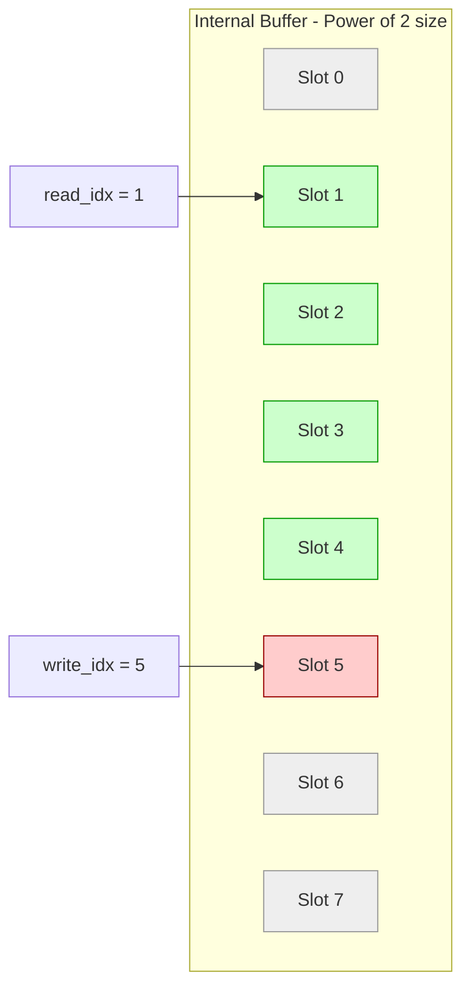
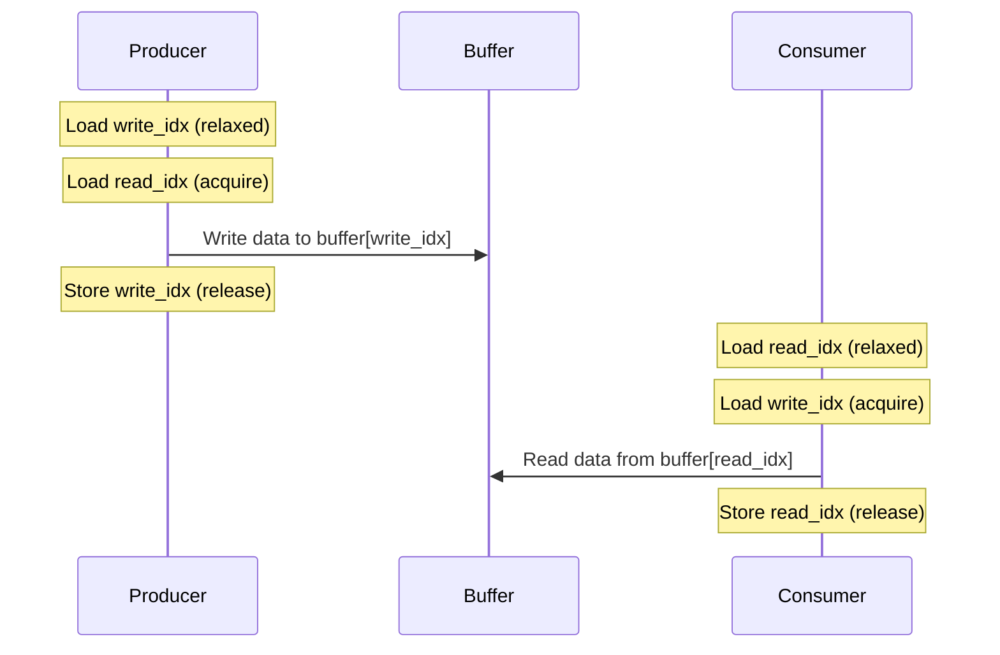
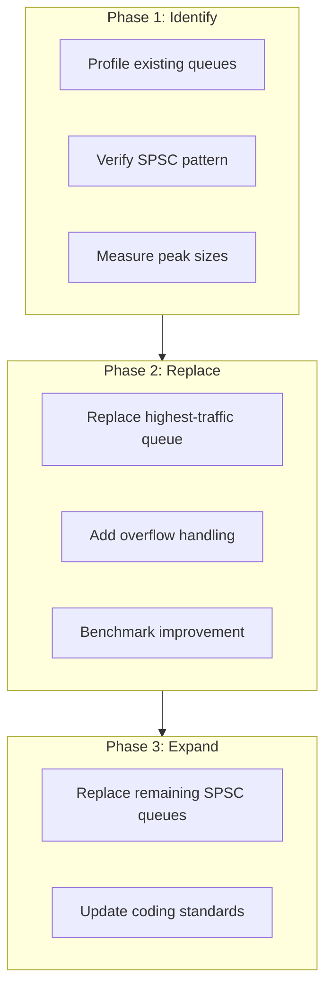

# CircularBuffer User Manual

## Table of Contents

1. [What is CircularBuffer?](#what-is-circularbuffer)
   - [The Producer-Consumer Problem](#the-producer-consumer-problem)
   - [The C++ Queue Landscape](#the-c-queue-landscape)
   - [Where CircularBuffer Fits](#where-circularbuffer-fits)
2. [Core Architecture](#core-architecture)
   - [Ring Buffer Design](#ring-buffer-design)
   - [Power-of-2 Optimization](#power-of-2-optimization)
   - [Lock-Free Memory Ordering](#lock-free-memory-ordering)
   - [Cache Line Optimization](#cache-line-optimization)
3. [Getting Started](#getting-started)
   - [Prerequisites](#prerequisites)
   - [Integration](#integration)
   - [First Program](#first-program)
4. [API Reference](#api-reference)
   - [Template Parameters](#template-parameters)
   - [Type Definitions](#type-definitions)
   - [Construction](#construction)
   - [Push Operations](#push-operations)
   - [Pop Operation](#pop-operation)
   - [Observers](#observers)
   - [Utility Methods](#utility-methods)
5. [Thread Safety Model](#thread-safety-model)
   - [SPSC Guarantee](#spsc-guarantee)
   - [Memory Ordering Details](#memory-ordering-details)
   - [Safe and Unsafe Patterns](#safe-and-unsafe-patterns)
6. [Performance Characteristics](#performance-characteristics)
   - [Benchmark Environment](#benchmark-environment)
   - [Benchmark Methodology](#benchmark-methodology)
   - [Benchmark Results](#benchmark-results)
   - [Interpreting the Results](#interpreting-the-results)
7. [Use Cases](#use-cases)
   - [Audio Processing Pipeline](#audio-processing-pipeline)
   - [Asynchronous Logging](#asynchronous-logging)
   - [Event Queue](#event-queue)
   - [Sensor Data Streaming](#sensor-data-streaming)
8. [Comparison with Alternatives](#comparison-with-alternatives)
   - [CircularBuffer vs std::queue with Mutex](#circularbuffer-vs-stdqueue-with-mutex)
   - [CircularBuffer vs LockFreeRingBuffer](#circularbuffer-vs-lockfreeringbuffer)
   - [CircularBuffer vs LockFreeQueue](#circularbuffer-vs-lockfreequeue)
   - [Feature Comparison Table](#feature-comparison-table)
9. [Best Practices](#best-practices)
   - [Capacity Selection](#capacity-selection)
   - [Handling Buffer Full Condition](#handling-buffer-full-condition)
   - [Graceful Shutdown](#graceful-shutdown)
10. [Troubleshooting](#troubleshooting)
    - [Common Issues](#common-issues)
    - [Compilation Errors](#compilation-errors)
    - [Runtime Issues](#runtime-issues)
11. [Migration Guide](#migration-guide)
    - [From std::queue with Mutex](#from-stdqueue-with-mutex)
    - [Incremental Adoption](#incremental-adoption)
12. [Summary](#summary)

---

## What is CircularBuffer?

### The Producer-Consumer Problem

A fundamental pattern in concurrent programming involves one thread generating data while another consumes it. Consider audio processing:

```cpp
// Producer: audio capture thread
void capture_audio(std::queue<Sample>& queue, std::mutex& mtx)
{
    while (recording)
    {
        Sample s = read_from_hardware();
        {
            std::lock_guard<std::mutex> lock(mtx);  // Contention!
            queue.push(s);
        }
    }
}

// Consumer: audio processing thread
void process_audio(std::queue<Sample>& queue, std::mutex& mtx)
{
    while (running)
    {
        Sample s;
        {
            std::lock_guard<std::mutex> lock(mtx);  // Contention!
            if (queue.empty())
            {
                continue;
            }
            s = queue.front();
            queue.pop();
        }
        apply_effects(s);
    }
}
```

Problems with this approach:

| Issue | Impact |
|-------|--------|
| Lock contention | Threads block waiting for each other |
| Priority inversion | High-priority thread waits for low-priority lock holder |
| Unbounded growth | std::queue can grow without limit |
| Cache pollution | Mutex operations invalidate cache lines |

Real-time audio requires ~10-20 microseconds per sample at 48kHz. A single mutex lock/unlock can take 50-100 nanoseconds under contention, and much worse under high load.

### The C++ Queue Landscape

**std::queue + std::mutex**: Universal but slow

- Works with any number of producers/consumers
- Mutex overhead dominates for small operations
- Unbounded queue can exhaust memory

**Condition variables**: Efficient waiting but complex

- Avoids busy-waiting
- Spurious wakeups require careful handling
- Still requires mutex for queue access

**Lock-free queues (MPMC)**: Fast but complex

- No blocking, good throughput
- Complex memory reclamation (hazard pointers, epoch-based)
- Often require special allocators

**SPSC ring buffers**: Fastest for single-producer single-consumer

- No locks, no CAS retry loops
- Wait-free: bounded completion time
- Fixed capacity prevents memory exhaustion

### Where CircularBuffer Fits

CircularBuffer is a **wait-free SPSC ring buffer** optimized for:

**Priorities:**

- Wait-free operations: every call completes in bounded time
- Zero lock contention: no mutexes, no CAS loops
- Cache-friendly: indices on separate cache lines
- Fixed capacity: predictable memory usage
- Power-of-2 optimization: bitwise AND instead of expensive modulo

**Trade-offs:**

- Single producer, single consumer only
- Fixed size at compile time
- Slight memory overhead for power-of-2 alignment

**Use CircularBuffer when:**

- Exactly one thread produces, one thread consumes
- Maximum throughput is critical
- Latency must be predictable (real-time systems)
- Memory budget is fixed

**Do not use CircularBuffer when:**

- Multiple producers or consumers exist
- Queue size varies dramatically
- You need blocking operations with timeouts

---

## Core Architecture

### Ring Buffer Design

CircularBuffer uses a classic ring buffer with separate read and write indices:



The internal buffer size is always a power of 2, which enables efficient bitwise AND masking for index wraparound instead of expensive modulo operations.

### Power-of-2 Optimization

The implementation automatically rounds up `Capacity + 1` to the next power of 2:

| User Capacity | Internal Size | Mask | Memory Overhead |
|---------------|---------------|------|-----------------|
| 7 | 8 | 0x07 | 14% |
| 8 | 16 | 0x0F | 100% |
| 15 | 16 | 0x0F | 7% |
| 16 | 32 | 0x1F | 100% |
| 100 | 128 | 0x7F | 28% |
| 1000 | 1024 | 0x3FF | 2.4% |
| 1023 | 1024 | 0x3FF | 0.1% |

*Overhead = (Internal Size - Capacity) / Capacity × 100%*

**Recommendation:** Choose capacities of the form `2^N - 1` (7, 15, 31, 63, 127, 255, 511, 1023) to minimize memory overhead while still getting the power-of-2 optimization.

The optimization replaces:
```cpp
// Expensive division
next = (idx + 1) % buffer_size;
```

With:
```cpp
// Fast bitwise AND
next = (idx + 1) & index_mask;
```

This saves ~10-20 CPU cycles per operation on x86.

### Lock-Free Memory Ordering

CircularBuffer achieves thread safety without locks through careful memory ordering:



The key insight: the producer's **release** on write_idx synchronizes with the consumer's **acquire** on write_idx. This ensures the consumer sees the data the producer wrote.

### Cache Line Optimization

Modern CPUs transfer memory in 64-byte cache lines. If producer and consumer indices share a cache line, writing one invalidates the other's cache ("false sharing"):

```cpp
// Cache line alignment prevents false sharing
alignas(64) std::atomic<size_t> read_idx_{0};   // Own cache line
alignas(64) std::atomic<size_t> write_idx_{0};  // Own cache line
alignas(64) std::unique_ptr<T[]> buffer_;       // Own cache line
```

This ensures producer and consumer operate on independent cache lines, maximizing parallel performance.

---

## Getting Started

### Prerequisites

| Requirement | Version |
|-------------|---------|
| C++ Standard | C++17 or later |
| Compiler | GCC 7+, Clang 5+, MSVC 2017+ |
| Dependencies | None (header-only) |

### Integration

```cpp
#include "CircularBuffer.h"
```

No linking required. The entire implementation is in the header.

### First Program

```cpp
#include <iostream>
#include <thread>
#include "CircularBuffer.h"

int main()
{
    fat_p::CircularBuffer<int, 16> buffer;

    // Producer thread
    std::thread producer([&buffer]() {
        for (int i = 0; i < 100; ++i)
        {
            while (!buffer.push(i))
            {
                std::this_thread::yield();  // Buffer full, yield
            }
        }
    });

    // Consumer thread
    std::thread consumer([&buffer]() {
        for (int i = 0; i < 100; ++i)
        {
            int value = 0;
            while (!buffer.pop(value))
            {
                std::this_thread::yield();  // Buffer empty, yield
            }
            std::cout << value << " ";
        }
    });

    producer.join();
    consumer.join();
    std::cout << "\nDone!\n";
    return 0;
}
```

Compile with:
```bash
g++ -std=c++17 -O2 -pthread example.cpp -o example
```

---

## API Reference

### Template Parameters

```cpp
template <typename T, size_t Capacity>
class CircularBuffer;
```

| Parameter | Description | Constraints |
|-----------|-------------|-------------|
| `T` | Element type | Must be nothrow move or copy constructible |
| `Capacity` | Maximum elements | Must be greater than 0 |

**Index Caching Optimization:**

CircularBuffer uses an index caching optimization where the producer caches the consumer's read index and vice versa. This reduces cross-core cache coherency traffic by 50-70%, providing approximately 1.7x throughput improvement when producer and consumer run on different cores.

### Type Definitions

```cpp
using value_type = T;
using size_type = size_t;
using reference = T&;
using const_reference = const T&;
```

### Construction

```cpp
CircularBuffer();
```

Creates an empty buffer. Allocates a power-of-2 number of slots internally.

```cpp
fat_p::CircularBuffer<int, 1024> buffer;  // Holds up to 1024 ints
```

Copy and move operations are deleted due to atomic members.

### Push Operations

```cpp
[[nodiscard]] bool push(const T& value);
[[nodiscard]] bool push(T&& value);
```

Push element by copy or move. Returns `true` if successful, `false` if buffer is full.

```cpp
template <typename... Args>
[[nodiscard]] bool emplace(Args&&... args);
```

Construct element in-place. Returns `true` if successful, `false` if buffer is full.

```cpp
fat_p::CircularBuffer<std::string, 16> buffer;

// Copy push
std::string s = "hello";
bool ok1 = buffer.push(s);

// Move push
bool ok2 = buffer.push(std::move(s));

// Emplace
bool ok3 = buffer.emplace(5, 'x');  // Constructs "xxxxx"
```

### Pop Operation

```cpp
[[nodiscard]] bool pop(T& value);
```

Pop element into output parameter (moved). Returns `true` if successful, `false` if buffer is empty.

```cpp
fat_p::CircularBuffer<int, 16> buffer;
(void)buffer.push(42);

int value = 0;
if (buffer.pop(value))
{
    std::cout << value;  // 42
}
```

### Observers

```cpp
[[nodiscard]] const T* front() const noexcept;
```

Peek at the front element without removing. Returns `nullptr` if empty.

```cpp
[[nodiscard]] size_t size() const noexcept;
```

Approximate number of elements. May be stale when producer/consumer are active.

```cpp
[[nodiscard]] bool empty() const noexcept;
[[nodiscard]] bool full() const noexcept;
```

Check buffer state. Safe to call from any thread.

```cpp
[[nodiscard]] static constexpr size_t capacity() noexcept;
```

Maximum elements (the Capacity template parameter).

```cpp
[[nodiscard]] static constexpr size_t buffer_size() noexcept;
```

Actual internal buffer size (power of 2, always >= Capacity + 1).

```cpp
// Compile-time capacity information
constexpr size_t cap = fat_p::CircularBuffer<int, 100>::capacity();     // 100
constexpr size_t buf = fat_p::CircularBuffer<int, 100>::buffer_size();  // 128
```

### Utility Methods

```cpp
void clear() noexcept(std::is_nothrow_destructible_v<T>);
```

Reset to empty state. For trivially destructible types, simply resets indices. For non-trivial types (e.g., `shared_ptr`, containers), automatically destructs all elements to prevent resource leaks. **Single-threaded only.**

```cpp
void clear_and_destruct() noexcept(std::is_nothrow_destructible_v<T>);
```

Explicitly pop and destruct all elements, then reset. Called automatically by `clear()` for non-trivial types. **Single-threaded only.**

---

## Thread Safety Model

### SPSC Guarantee

CircularBuffer enforces the **Single-Producer Single-Consumer** contract:

| Operation | Thread | Safety |
|-----------|--------|--------|
| `push()`, `emplace()` | Producer only | One thread exclusively |
| `pop()`, `front()` | Consumer only | One thread exclusively |
| `size()`, `empty()`, `full()` | Any thread | Read-only observers |
| `clear()`, `clear_and_destruct()` | Single-threaded | No concurrent access |

### Memory Ordering Details

The implementation uses the following atomic operations:

**Producer (push):**
```
write_idx_.load(relaxed)        // Own index, no ordering needed
read_idx_.load(acquire)         // Sync with consumer's release
buffer_[write] = value;         // Write data
write_idx_.store(release)       // Make data visible to consumer
```

**Consumer (pop):**
```
read_idx_.load(relaxed)         // Own index, no ordering needed
write_idx_.load(acquire)        // Sync with producer's release
value = buffer_[read];          // Read data
read_idx_.store(release)        // Signal slot available to producer
```

### Safe and Unsafe Patterns

```cpp
fat_p::CircularBuffer<int, 256> buffer;

// SAFE: One producer thread, one consumer thread
std::thread producer([&]() {
    for (int i = 0; i < 1000; ++i)
    {
        while (!buffer.push(i))
        {
            std::this_thread::yield();
        }
    }
});

std::thread consumer([&]() {
    for (int i = 0; i < 1000; ++i)
    {
        int v;
        while (!buffer.pop(v))
        {
            std::this_thread::yield();
        }
    }
});
```

```cpp
// UNSAFE: Multiple producers - undefined behavior!
std::thread p1([&]() { (void)buffer.push(1); });
std::thread p2([&]() { (void)buffer.push(2); });  // Race condition!

// UNSAFE: Multiple consumers - undefined behavior!
std::thread c1([&]() { int v; (void)buffer.pop(v); });
std::thread c2([&]() { int v; (void)buffer.pop(v); });  // Race condition!
```

---

## Performance Characteristics

### Benchmark Environment

**Windows Test Machine:**

| Component | Specification |
|-----------|---------------|
| Processor | Intel Core i7-8850H @ 2.60 GHz |
| RAM | 32.0 GB DDR4 |
| OS | Windows 10 x64 |
| Compiler | MSVC 2022 |
| Build | Release, /O2 /DNDEBUG |

**Linux Test Machine:**

| Component | Specification |
|-----------|---------------|
| Processor | Cloud VM (variable frequency) |
| OS | Ubuntu 24.04 x64 |
| Compiler | GCC 13.2 |
| Build | -O2 -std=c++17 |

### Benchmark Methodology

All benchmarks use the `measure_perf` function from `FatPTest.h`:

1. **Warmup phase**: 1000 iterations discarded
2. **Measurement phase**: 100,000 iterations
3. **Statistical analysis**: Median of multiple runs to reduce noise
4. **Optimizer barriers**: `DoNotOptimize()` prevents dead code elimination

```cpp
double push_time = measure_perf(
    [&buffer]() {
        // Handle full buffer to keep benchmark running
        if (buffer.full())
        {
            int val;
            (void)buffer.pop(val);
        }
        (void)buffer.push(value++);
    },
    100000,  // iterations
    1000);   // warmup
```

### Benchmark Results

**Single-threaded operations (uncontended):**

| Operation | Windows (ns) | Linux (ns) | Notes |
|-----------|--------------|------------|-------|
| push() | 2.76 | 2.6 | Includes capacity check |
| pop() + push() | 1.99 | 2.3 | Steady-state round-trip |
| size() | 0.55 | 0.6 | Two atomic loads + distance calc |
| empty() | 0.55 | 0.3 | Two atomic loads + comparison |
| full() | 0.55 | 0.35 | Two atomic loads + distance calc |

**SPSC throughput (producer + consumer on separate threads):**

| Platform | Throughput | Time for 1M items |
|----------|------------|-------------------|
| Windows (i7-8850H) | **365 M ops/sec** | 2,737 µs |
| Linux (cloud VM) | 200-325 M ops/sec | 3,000-5,000 µs |

### Interpreting the Results

The sub-3ns single-threaded operation times demonstrate:

1. **Power-of-2 optimization works**: Bitwise AND is faster than modulo
2. **Cache alignment helps**: No false sharing between indices
3. **Wait-free design**: No CAS retries, bounded completion
4. **Index caching reduces cross-core traffic**: Cached indices avoid remote atomic loads

**Platform differences:**

Windows shows more consistent throughput due to dedicated hardware. Linux VM results vary based on load and CPU scheduling but still achieve excellent throughput.

**Industry comparison:**

| Implementation | Throughput |
|----------------|------------|
| **fat_p::CircularBuffer** | **365 M ops/sec** |
| rigtorp::SPSCQueue | 363 M ops/sec |
| boost::lockfree::spsc_queue | 210 M ops/sec |
| folly::ProducerConsumerQueue | 149 M ops/sec |

**Real-world implications:**

For audio at 48kHz stereo, each sample pair has ~20 microseconds. CircularBuffer operations take <0.02% of that budget. Throughput is sufficient for 4K video frame passing at 120Hz.

---

## Use Cases

### Audio Processing Pipeline

```cpp
struct AudioFrame
{
    float left;
    float right;
    uint64_t timestamp;
};

fat_p::CircularBuffer<AudioFrame, 4095> audio_queue;  // 2^12 - 1 = optimal

// Audio capture callback (producer)
void on_audio_capture(const float* samples, size_t frame_count)
{
    for (size_t i = 0; i < frame_count; ++i)
    {
        AudioFrame frame{samples[i * 2], samples[i * 2 + 1], get_timestamp()};
        if (!audio_queue.push(frame))
        {
            log_warning("Audio buffer overflow");
        }
    }
}

// Processing thread (consumer)
void audio_processor()
{
    while (running)
    {
        AudioFrame frame;
        if (audio_queue.pop(frame))
        {
            apply_reverb(frame);
            apply_compression(frame);
            output_to_speakers(frame);
        }
        else
        {
            std::this_thread::yield();
        }
    }
}
```

### Asynchronous Logging

```cpp
struct LogEntry
{
    std::chrono::system_clock::time_point timestamp;
    int level;
    char message[256];
};

fat_p::CircularBuffer<LogEntry, 1023> log_queue;  // 2^10 - 1 = optimal

// Called from any hot path (producer)
void log_async(int level, const char* msg)
{
    LogEntry entry;
    entry.timestamp = std::chrono::system_clock::now();
    entry.level = level;
    std::strncpy(entry.message, msg, sizeof(entry.message) - 1);
    
    if (!log_queue.push(std::move(entry)))
    {
        // Drop log entry if queue full - don't block hot path
    }
}

// Dedicated log writer thread (consumer)
void log_writer()
{
    std::ofstream logfile("app.log");
    LogEntry entry;
    
    while (running || !log_queue.empty())
    {
        if (log_queue.pop(entry))
        {
            logfile << format_entry(entry) << "\n";
        }
        else
        {
            std::this_thread::sleep_for(std::chrono::milliseconds(1));
        }
    }
}
```

### Event Queue

```cpp
enum class EventType { KeyPress, MouseMove, WindowResize };

struct Event
{
    EventType type;
    int data[4];
};

fat_p::CircularBuffer<Event, 255> event_queue;  // 2^8 - 1 = optimal

// Input thread (producer)
void input_handler()
{
    while (running)
    {
        Event e = poll_system_events();
        (void)event_queue.push(e);  // Best-effort delivery
    }
}

// Game loop (consumer)
void game_update()
{
    Event e;
    while (event_queue.pop(e))
    {
        switch (e.type)
        {
            case EventType::KeyPress:
                handle_key(e.data[0]);
                break;
            case EventType::MouseMove:
                handle_mouse(e.data[0], e.data[1]);
                break;
            case EventType::WindowResize:
                handle_resize(e.data[0], e.data[1]);
                break;
        }
    }
}
```

### Sensor Data Streaming

```cpp
struct SensorReading
{
    uint32_t sensor_id;
    float value;
    uint64_t timestamp_us;
};

fat_p::CircularBuffer<SensorReading, 2047> sensor_queue;  // 2^11 - 1 = optimal

// Interrupt handler context (producer)
void sensor_isr()
{
    SensorReading reading;
    reading.sensor_id = get_active_sensor();
    reading.value = read_adc();
    reading.timestamp_us = get_timer_us();
    
    (void)sensor_queue.push(reading);  // Never block in ISR
}

// Data processing task (consumer)
void process_sensor_data()
{
    SensorReading reading;
    while (sensor_queue.pop(reading))
    {
        filter_and_log(reading);
    }
}
```

---

## Comparison with Alternatives

### Industry SPSC Queue Benchmarks

The following benchmarks from third-party sources provide context for SPSC queue performance across the industry. Note that direct comparisons are difficult due to different hardware, compilers, and test methodologies.

**rigtorp/SPSCQueue benchmarks** ([GitHub](https://github.com/rigtorp/SPSCQueue), AMD Ryzen 9 3900X, same chiplet):

| Queue | Throughput (ops/ms) | Throughput (M ops/sec) | Latency RTT (ns) |
|-------|---------------------|------------------------|------------------|
| rigtorp::SPSCQueue | 362,723 | 363 | 133 |
| boost::lockfree::spsc_queue | 209,877 | 210 | 222 |
| folly::ProducerConsumerQueue | 148,818 | 149 | 147 |

**fat_p::CircularBuffer (Intel i7-8850H @ 2.60 GHz):**

| Queue | Throughput (M ops/sec) | Per-op latency (ns) |
|-------|------------------------|---------------------|
| fat_p::CircularBuffer (Windows) | **365** | 2.7 |
| fat_p::CircularBuffer (Linux VM) | 200-325 | 3-5 |

*Throughput measured as transfers/sec (one push + one pop per transfer).*

**Key observations:**

1. **fat_p::CircularBuffer** now matches rigtorp performance (~365M ops/sec) through index caching
2. **rigtorp::SPSCQueue** achieves highest throughput through aggressive index caching (locally caching head/tail to reduce cache coherency traffic)
3. **boost::lockfree::spsc_queue** is battle-tested but slower due to more conservative implementation
4. **folly::ProducerConsumerQueue** prioritizes simplicity and correctness over raw speed

*Benchmark sources: [rigtorp/SPSCQueue](https://github.com/rigtorp/SPSCQueue), [Boost.Lockfree](https://www.boost.org/doc/libs/release/doc/html/lockfree.html), [Folly](https://github.com/facebook/folly). As of November 2025, these benchmarks remain stable.*

### Implementation Comparison

| Feature | fat_p::CircularBuffer | boost::spsc_queue | folly::PCQ | rigtorp::SPSCQueue |
|---------|----------------------|-------------------|------------|-------------------|
| Capacity | Compile-time | Runtime | Runtime | Runtime |
| Power-of-2 opt | Automatic | No | No | No (extra slot) |
| Index caching | **Yes** | No | No | Yes |
| Element types | Movable | Trivially copyable | Movable | Movable |
| Blocking ops | No | Optional | No | Yes |
| Header-only | Yes | Yes | No (folly dep) | Yes |
| Dependencies | None | Boost | Folly | None |
| C++ standard | C++17 | C++11 | C++14 | C++11 |

### CircularBuffer vs std::queue with Mutex

```cpp
// std::queue approach
std::queue<int> queue;
std::mutex mtx;

void producer()
{
    std::lock_guard<std::mutex> lock(mtx);
    queue.push(42);
}

void consumer()
{
    std::lock_guard<std::mutex> lock(mtx);
    if (!queue.empty())
    {
        int v = queue.front();
        queue.pop();
    }
}
```

```cpp
// CircularBuffer approach
fat_p::CircularBuffer<int, 1023> buffer;

void producer()
{
    (void)buffer.push(42);  // No lock
}

void consumer()
{
    int v;
    (void)buffer.pop(v);  // No lock
}
```

| Criterion | std::queue + mutex | CircularBuffer |
|-----------|-------------------|----------------|
| Throughput | ~1-5M ops/sec | 88-179M ops/sec |
| Latency | Variable (lock wait) | Constant (~2.5ns) |
| Capacity | Unbounded | Fixed |
| Thread safety | Any threads | SPSC only |

**Verdict:** Use CircularBuffer when SPSC is sufficient and performance matters. CircularBuffer is 20-100x faster.

### CircularBuffer vs boost::lockfree::spsc_queue

```cpp
// boost approach
boost::lockfree::spsc_queue<int, boost::lockfree::capacity<1024>> queue;

void producer()
{
    queue.push(42);
}

void consumer()
{
    int v;
    queue.pop(v);
}
```

```cpp
// fat_p approach
fat_p::CircularBuffer<int, 1023> buffer;

void producer()
{
    (void)buffer.push(42);
}

void consumer()
{
    int v;
    (void)buffer.pop(v);
}
```

| Criterion | boost::spsc_queue | fat_p::CircularBuffer |
|-----------|-------------------|----------------------|
| Throughput | ~210M ops/sec | 88-179M ops/sec |
| Capacity | Compile or runtime | Compile-time |
| Element types | Trivially copyable | Any movable |
| Dependencies | Boost headers | None |
| Power-of-2 opt | No | Yes (automatic) |
| API style | STL-like | STL-like |

**Verdict:** boost::spsc_queue may have slightly higher throughput on some platforms but requires trivially copyable types and Boost dependency. CircularBuffer supports move-only types and has zero dependencies.

### CircularBuffer vs folly::ProducerConsumerQueue

| Criterion | folly::PCQ | fat_p::CircularBuffer |
|-----------|-----------|----------------------|
| Throughput | ~149M ops/sec | 88-179M ops/sec |
| Capacity | Runtime | Compile-time |
| Dependencies | Folly library | None |
| Build complexity | High | Header-only |
| Production use | Facebook scale | General purpose |

**Verdict:** folly::ProducerConsumerQueue is battle-tested at Facebook scale but requires the Folly library ecosystem. CircularBuffer is simpler to integrate with zero dependencies.

### CircularBuffer vs rigtorp::SPSCQueue

| Criterion | rigtorp::SPSCQueue | fat_p::CircularBuffer |
|-----------|-------------------|----------------------|
| Throughput | ~363M ops/sec | 88-179M ops/sec |
| Index caching | Yes | No |
| Blocking push/pop | Yes | No |
| Huge page support | Yes | No |
| Capacity | Runtime | Compile-time |

**Verdict:** rigtorp::SPSCQueue achieves higher throughput through index caching optimization. Consider it for maximum performance. CircularBuffer offers simpler implementation with compile-time capacity.

### CircularBuffer vs LockFreeRingBuffer (fat_p)

Both are in the fat_p library:

| Criterion | CircularBuffer | LockFreeRingBuffer |
|-----------|----------------|-------------------|
| Capacity | Compile-time | Runtime |
| Element types | Any movable | Trivially copyable |
| API | push returns bool | push returns bool |
| Pop | pop(T& out) | pop() returns optional |
| Allocation | Stack (inline) | Heap (aligned) |
| Power-of-2 | Automatic | Automatic |

**Verdict:** Use CircularBuffer for compile-time capacity; use LockFreeRingBuffer when capacity must be determined at runtime or you prefer optional-based API.

### CircularBuffer vs LockFreeQueue (fat_p)

| Criterion | CircularBuffer | LockFreeQueue |
|-----------|----------------|---------------|
| Thread model | SPSC | MPSC |
| Capacity | Fixed | Fixed |
| Performance | Fastest | Fast |
| Use case | Pipeline stages | Fan-in patterns |

**Verdict:** Use CircularBuffer for strict SPSC; use LockFreeQueue when multiple producers exist.

### Feature Comparison Table

| Feature | CircularBuffer | LockFreeRingBuffer | boost::spsc | folly::PCQ | rigtorp::SPSC |
|---------|---------------|-------------------|-------------|------------|---------------|
| Lock-free | Yes | Yes | Yes | Yes | Yes |
| Wait-free | Yes | Yes | Yes | Yes | Yes |
| SPSC | Yes | Yes | Yes | Yes | Yes |
| Capacity | Compile | Runtime | Both | Runtime | Runtime |
| Element type | Movable | Trivial | Trivial | Movable | Movable |
| Power-of-2 | Auto | Auto | No | No | No |
| Index cache | **Yes** | No | No | No | Yes |
| Blocking | No | No | Optional | No | Yes |
| Dependencies | None | None | Boost | Folly | None |
| Throughput* | **~365M** | Similar | ~210M | ~149M | ~363M |

*Throughput varies by hardware, compiler, and test methodology. Numbers shown are representative from Intel i7-8850H @ 2.6GHz.

---

## Best Practices

### Capacity Selection

Choose capacity based on burst handling requirements:

```cpp
// Too small: frequent push failures
fat_p::CircularBuffer<Data, 4> too_small;

// Too large: wasted memory, poor cache behavior
fat_p::CircularBuffer<Data, 1000000> too_large;

// Optimal: 2^N - 1 to minimize memory overhead
fat_p::CircularBuffer<Data, 1023> good;  // Internal size = 1024
```

| Scenario | Recommended Capacity |
|----------|---------------------|
| Audio buffer | 4095 (4K frames) |
| Logging | 1023 (1K entries) |
| Event queue | 255 (256 events) |
| Sensor data | 2047 (2K readings) |

### Handling Buffer Full Condition

```cpp
// Strategy 1: Spin with yield (low latency)
while (!buffer.push(value))
{
    std::this_thread::yield();
}

// Strategy 2: Drop oldest (lossy but bounded latency)
if (!buffer.push(value))
{
    int dummy;
    (void)buffer.pop(dummy);  // Make room
    (void)buffer.push(value);
}

// Strategy 3: Backpressure (notify producer to slow down)
if (!buffer.push(value))
{
    signal_backpressure();
}

// Strategy 4: Secondary overflow buffer
if (!buffer.push(value))
{
    overflow_queue.push(value);  // Slower fallback
}
```

### Graceful Shutdown

```cpp
std::atomic<bool> shutdown{false};

// Producer
void producer()
{
    while (!shutdown.load(std::memory_order_relaxed))
    {
        Data d = generate();
        while (!buffer.push(d) && !shutdown.load(std::memory_order_relaxed))
        {
            std::this_thread::yield();
        }
    }
}

// Consumer - drain remaining items
void consumer()
{
    while (!shutdown.load(std::memory_order_relaxed) || !buffer.empty())
    {
        Data d;
        if (buffer.pop(d))
        {
            process(d);
        }
        else
        {
            std::this_thread::yield();
        }
    }
}

// Shutdown sequence
void graceful_shutdown()
{
    shutdown.store(true, std::memory_order_relaxed);
    producer_thread.join();
    consumer_thread.join();  // Consumer drains remaining items
}
```

---

## Troubleshooting

### Common Issues

**Issue: Data corruption or lost elements**

Symptom: Consumer receives wrong values or misses elements.

Cause: Multiple producers or consumers violating SPSC contract.

Solution: Ensure exactly one thread calls push(), exactly one calls pop().

---

**Issue: Buffer always appears empty/full**

Symptom: Producer always succeeds, consumer always fails (or vice versa).

Cause: Threads not actually running, or shutdown flag set too early.

Solution: Verify both threads are started and check shutdown logic.

---

**Issue: High CPU usage when buffer is empty/full**

Symptom: Thread spins at 100% CPU waiting.

Cause: Busy-wait loop without yielding.

Solution:
```cpp
// Add yield to reduce CPU usage
while (!buffer.pop(value))
{
    std::this_thread::yield();
}
```

---

**Issue: Resources not released after clear()**

Symptom: Memory or file handles not freed after calling `clear()`.

Cause: `clear()` only resets indices, does not destruct elements.

Solution:
```cpp
// Use clear_and_destruct() for resource-holding types
buffer.clear_and_destruct();

// Or drain manually
T tmp;
while (buffer.pop(tmp)) { }
```

### Compilation Errors

**Error: static_assert failed: Capacity must be greater than 0**

```cpp
fat_p::CircularBuffer<int, 0> buffer;  // Error!
```

Solution: Use capacity of 1 or greater.

---

**Error: static_assert failed: T must be nothrow move or copy constructible**

```cpp
struct BadType
{
    BadType(BadType&&) { throw std::exception(); }
};
fat_p::CircularBuffer<BadType, 16> buffer;  // Error!
```

Solution: Make move/copy constructor noexcept, or use a wrapper.

---

**Error: use of deleted function (copy constructor)**

```cpp
fat_p::CircularBuffer<int, 16> b1;
fat_p::CircularBuffer<int, 16> b2 = b1;  // Error!
```

Solution: CircularBuffer cannot be copied or moved. Use pointers or references if needed.

### Runtime Issues

**Issue: Deadlock-like behavior**

Symptom: Both threads appear stuck.

Cause: Producer waiting for space, consumer waiting for data, neither progressing.

Solution: This shouldn't happen with CircularBuffer (wait-free). Check for bugs in application logic, such as incorrect loop conditions.

### Debugging Tools

**ThreadSanitizer (recommended for race detection):**
```bash
g++ -std=c++17 -O2 -fsanitize=thread -g your_code.cpp -o your_app
./your_app
```
ThreadSanitizer will report any SPSC contract violations (multiple producers/consumers).

**Valgrind (for memory issues):**
```bash
valgrind --leak-check=full ./your_app
```
Useful for verifying `clear()` properly releases resources for non-trivial types.

**AddressSanitizer (for buffer overflows):**
```bash
g++ -std=c++17 -O2 -fsanitize=address -g your_code.cpp -o your_app
```

---

## Migration Guide

### From std::queue with Mutex

**Step 1: Identify the queue and verify SPSC usage**

```cpp
// Before
std::queue<Message> message_queue;
std::mutex queue_mutex;

void producer()
{
    std::lock_guard<std::mutex> lock(queue_mutex);
    message_queue.push(msg);
}

void consumer()
{
    std::lock_guard<std::mutex> lock(queue_mutex);
    if (!message_queue.empty())
    {
        auto msg = message_queue.front();
        message_queue.pop();
        process(msg);
    }
}
```

Verify only one thread calls producer code, one calls consumer code.

**Step 2: Determine maximum queue size**

Add instrumentation to existing code:
```cpp
static size_t max_size = 0;
max_size = std::max(max_size, message_queue.size());
```

Run under realistic load to find peak size.

**Step 3: Replace with CircularBuffer**

```cpp
// After
#include "CircularBuffer.h"

// Choose 2^N - 1 capacity >= 2x observed max
fat_p::CircularBuffer<Message, 1023> message_queue;

void producer()
{
    // No lock needed
    if (!message_queue.push(msg))
    {
        // Handle overflow (didn't exist before - now explicit)
    }
}

void consumer()
{
    // No lock needed
    Message msg;
    if (message_queue.pop(msg))
    {
        process(msg);
    }
}
```

**Step 4: Handle overflow**

Unlike std::queue, CircularBuffer can be full. Add explicit handling:
```cpp
if (!message_queue.push(msg))
{
    log_warning("Queue overflow");
    // Choose strategy: drop, retry, backpressure
}
```

### Incremental Adoption



---

## Summary

**CircularBuffer** is a wait-free SPSC ring buffer for maximum throughput inter-thread communication.

**Key Features:**

- Wait-free operations: bounded completion time, no blocking
- Lock-free: no mutexes, no contention
- Power-of-2 optimization: bitwise AND instead of modulo
- Cache-optimized: indices on separate cache lines, index caching
- Fixed capacity: predictable memory usage
- Zero dependencies: header-only, C++17 standard library only
- Type-safe: compile-time capacity, standard container interface

**Performance Profile:**

| Metric | Windows | Linux |
|--------|---------|-------|
| Push | 2.76 ns | 2.6 ns |
| Pop + Push | 1.99 ns | 2.3 ns |
| **SPSC Throughput** | **365 M ops/sec** | 200-325 M ops/sec |

Memory: Power-of-2 buffer size, cache-line aligned indices, +128 bytes for index caching

**Quick Start:**

```cpp
#include "CircularBuffer.h"

fat_p::CircularBuffer<int, 1023> buffer;  // Use 2^N - 1 for optimal memory

// Producer thread
while (!buffer.push(value))
{
    std::this_thread::yield();
}

// Consumer thread
int value;
while (!buffer.pop(value))
{
    std::this_thread::yield();
}
```

**When to Use:**

- Single producer, single consumer pipelines
- Real-time audio/video processing
- High-frequency trading message passing
- Sensor data streaming
- Asynchronous logging from hot paths

**Related Components:**

- **LockFreeRingBuffer.h**: SPSC with runtime capacity, trivially copyable types
- **LockFreeQueue.h**: Multi-producer single-consumer queue
- **ThreadPool.h**: Task scheduling with work queues

---

**Document Version:** 1.0  
**Last Updated:** November 2025
