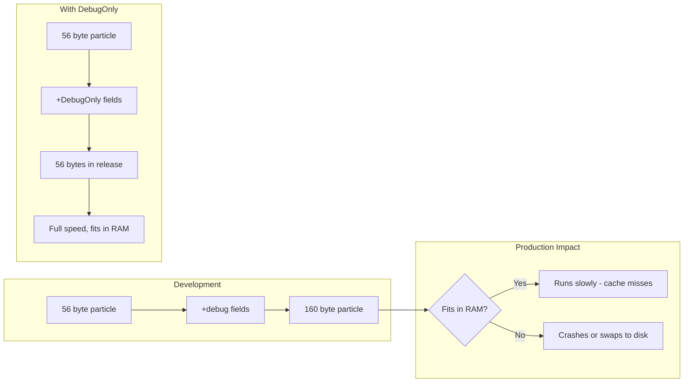
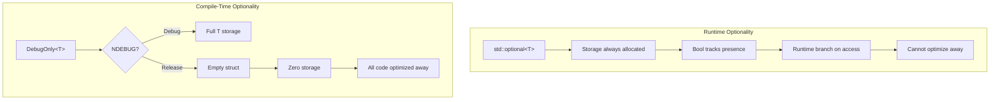
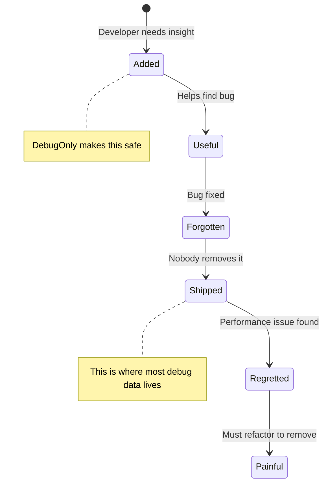
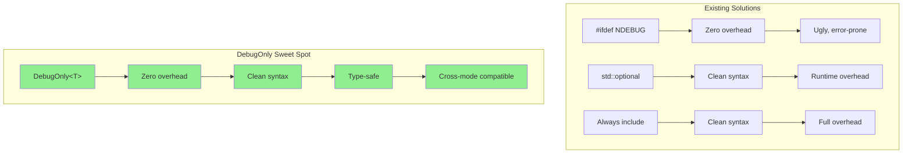
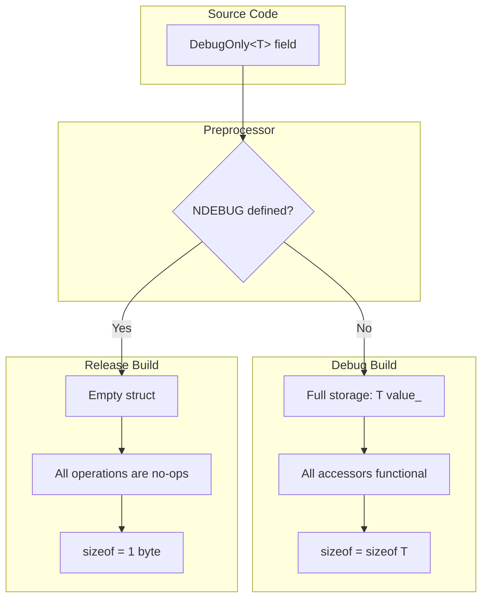
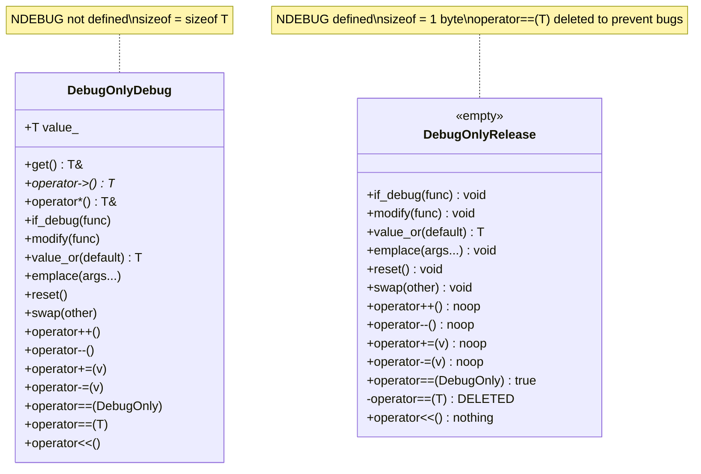
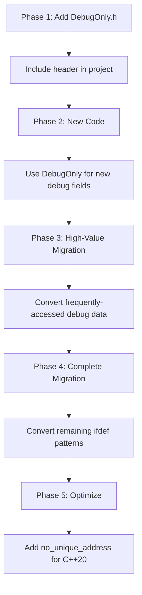

# DebugOnly User Manual

## Table of Contents

1. [What is DebugOnly?](#what-is-debugonly)
   - [The Core Insight](#the-core-insight)
   - [The Problem: Debug Data Accumulates Invisibly](#the-problem-debug-data-accumulates-invisibly)
   - [The HPC/Scientific Computing Context](#the-hpcscientific-computing-context)
   - [Why Developers Don't Remove Debug Data](#why-developers-dont-remove-debug-data)
   - [DebugOnly: The Frictionless Solution](#debugonly-the-frictionless-solution)
2. [Why This Pattern Matters](#why-this-pattern-matters)
   - [The Compile-Time vs Runtime Distinction](#the-compile-time-vs-runtime-distinction)
   - [The Debug Data Lifecycle Problem](#the-debug-data-lifecycle-problem)
   - [Why Just Be Disciplined Doesn't Work](#why-just-be-disciplined-doesnt-work)
3. [Why This Doesn't Exist Elsewhere](#why-this-doesnt-exist-elsewhere)
   - [Survey of Existing Solutions](#survey-of-existing-solutions)
   - [Why std::optional Cannot Solve This](#why-stdoptional-cannot-solve-this)
   - [The Design Space DebugOnly Occupies](#the-design-space-debugonly-occupies)
4. [Core Architecture](#core-architecture)
5. [Getting Started](#getting-started)
6. [API Reference](#api-reference)
7. [Conditional Execution](#conditional-execution)
8. [Counter and Arithmetic Operations](#counter-and-arithmetic-operations)
9. [C++20 Zero-Overhead](#cpp20-zero-overhead)
10. [Performance Characteristics](#performance-characteristics)
11. [Comparison with Alternatives](#comparison-with-alternatives)
12. [Migration Guide](#migration-guide)
13. [Use Cases](#use-cases)
    - [HPC: Particle Simulation Diagnostics](#hpc-particle-simulation-diagnostics)
    - [Scientific Computing: Matrix Operation Tracking](#scientific-computing-matrix-operation-tracking)
    - [Performance Profiling: Algorithm Instrumentation](#performance-profiling-algorithm-instrumentation)
14. [Best Practices](#best-practices)
15. [Troubleshooting](#troubleshooting)
16. [Summary](#summary)

---

## What is DebugOnly?

### The Core Insight

Every experienced C++ developer has faced this dilemma:

> "I need this debug information during development, but it absolutely cannot exist in production."

This isn't about *optional* data that might or might not be present at runtime. This is about data that **must vanish entirely** when you ship. The distinction is crucial:

| Concept | Runtime Decision | Compile-Time Decision |
|---------|------------------|----------------------|
| "Do I have a value?" | `std::optional<T>` | N/A |
| "Should this exist in this build?" | N/A | `DebugOnly<T>` |

`DebugOnly<T>` is a **compile-time conditional type**: it holds a value of type `T` in debug builds, and literally doesn't exist (zero storage, zero overhead) in release builds.

### The Problem: Debug Data Accumulates Invisibly

Consider how debug data creeps into a codebase over time:

```cpp
// Day 1: Simple particle
struct Particle
{
    double position[3];
    double velocity[3];
    double mass;
};  // 56 bytes - clean and efficient

// Month 3: "I need to track where particles come from"
struct Particle
{
    double position[3];
    double velocity[3];
    double mass;
    std::string source_file;  // "Just for debugging"
    int source_line;
};  // 96 bytes

// Month 6: "Why is particle 7,234,891 behaving strangely?"
struct Particle
{
    double position[3];
    double velocity[3];
    double mass;
    std::string source_file;
    int source_line;
    size_t update_count;           // "Temporary debug counter"
    double last_energy;            // "To track conservation"
    std::string last_modifier;     // "Who touched this?"
};  // 160 bytes - debug data now exceeds physics data!
```

**The tragedy**: That "temporary" debug data is never removed. It ships to production. It wastes memory. It pollutes caches. And nobody notices until performance degrades mysteriously.

### The HPC/Scientific Computing Context

In high-performance computing, this problem is catastrophic:

| Application | Object Count | Bytes per Object | Debug Overhead | Total Waste |
|-------------|--------------|------------------|----------------|-------------|
| N-body simulation | 10M particles | 80 bytes | 800 MB | OOM on 1GB node |
| CFD mesh | 100M cells | 48 bytes | 4.8 GB | Exceeds RAM |
| Molecular dynamics | 1B atoms | 32 bytes | 32 GB | Impossible |
| Sparse matrix | 500M entries | 16 bytes | 8 GB | 10x slower |

When you're running on a compute cluster with fixed memory per node, an extra 80 bytes per particle isn't just wasteful—it determines whether your simulation fits in memory or crashes.



### The Impact of Debug Data in Production

| Problem | Mechanism | Consequence |
|---------|-----------|-------------|
| **Memory bloat** | 80 extra bytes × 10M objects | 800 MB wasted, possible OOM |
| **Cache pollution** | Debug fields loaded into L1/L2 | 2-10x slowdown on tight loops |
| **False sharing** | Debug fields cross cache lines | Parallelism destroyed |
| **Bandwidth saturation** | Copies include debug data | Memory bus bottleneck |
| **Serialization bloat** | Debug fields written to disk | I/O becomes limiting factor |
| **Allocation pressure** | Larger objects = more pages | TLB misses, fragmentation |

### Why Developers Don't Remove Debug Data

The preprocessor solution (`#ifdef`) exists, but developers avoid it:

```cpp
struct Particle
{
    double position[3];
    double velocity[3];
    double mass;
    
#ifndef NDEBUG
    std::string debug_label;
    std::chrono::time_point<std::chrono::steady_clock> created_at;
    size_t update_count;
    std::string last_modified_by;
#endif

    void update()
    {
#ifndef NDEBUG
        ++update_count;
        last_modified_by = "update()";
#endif
        // Actual update logic...
    }
    
    void log() const
    {
#ifndef NDEBUG
        std::cout << "Particle " << debug_label 
                  << " updated " << update_count << " times\n";
#endif
    }
};
```

**Why this pattern is avoided:**

| Issue | Impact | Result |
|-------|--------|--------|
| Visual noise | `#ifndef` everywhere | Developers leave debug data in |
| Error-prone | Forget one guard = bug | Developers leave debug data in |
| Maintenance cost | Touch one field = edit 10 places | Developers leave debug data in |
| IDE confusion | Code appears grayed out | Developers leave debug data in |
| Type safety gaps | Release errors found late | Developers leave debug data in |

**The outcome**: Developers know they *should* use `#ifdef`, but the friction is high enough that they don't. Debug data ships to production.

### DebugOnly: The Frictionless Solution

```cpp
struct Particle
{
    double position[3];
    double velocity[3];
    double mass;
    
    // Debug fields - zero overhead in release, full functionality in debug
    fat_p::DebugOnly<std::string> debug_label;
    fat_p::DebugOnly<std::chrono::steady_clock::time_point> created_at;
    fat_p::DebugOnly<size_t> update_count;
    fat_p::DebugOnly<std::string> last_modified_by;

    void update()
    {
        ++update_count;                    // Compiles to nothing in release
        last_modified_by = "update()";     // Compiles to nothing in release
        // Actual update logic...
    }
    
    void log() const
    {
        // Safe, cross-mode code
        debug_label.if_debug([](const std::string& label) {
            std::cout << "Particle " << label << "\n";
        });
    }
};
```

**The key insight**: By making the *easy* path also the *correct* path, developers naturally write code that's efficient in production.

---

## Why This Pattern Matters

### The Compile-Time vs Runtime Distinction

This is the fundamental concept that justifies DebugOnly's existence:



**Why this matters for performance:**

| Aspect | `std::optional<T>` | `DebugOnly<T>` (Release) |
|--------|-------------------|--------------------------|
| Storage | `sizeof(T) + 1 + padding` | 0-1 bytes |
| Access cost | Branch + possible cache miss | Zero (no code generated) |
| Optimization | Limited (compiler can't prove "always empty") | Complete (code doesn't exist) |
| Binary size | Includes access code | No code generated |

### The "Debug Data Lifecycle" Problem

Debug data follows a predictable lifecycle that DebugOnly is designed to handle:



With `DebugOnly<T>`:
- **Added**: Zero friction, just wrap the type
- **Useful**: Full debug functionality
- **Forgotten**: Harmless—zero overhead in release
- **Shipped**: No performance impact
- **Regretted**: Nothing to regret
- **Painful**: Never happens

### Why "Just Be Disciplined" Doesn't Work

Some argue: "Just remove debug data before shipping." This fails in practice:

| Reality | Why Discipline Fails |
|---------|---------------------|
| Deadlines | "Ship now, clean up later" (later never comes) |
| Fear | "What if we need this debug info again?" |
| Invisibility | Nobody notices 80 bytes per object |
| Shared code | "Someone else might need this" |
| Testing | "It works, don't touch it" |

DebugOnly succeeds because it **doesn't require discipline**. The zero-overhead release behavior is automatic.

---

## Why This Doesn't Exist Elsewhere

### Survey of Existing Solutions

| Library | Relevant Types | Why They Don't Solve This |
|---------|---------------|---------------------------|
| **C++ Standard Library** | `std::optional<T>` | Runtime optional, always has storage |
| **Boost** | `boost::optional<T>` | Same as std::optional |
| **Folly (Facebook)** | `folly::Optional<T>` | Same as std::optional |
| **Abseil (Google)** | `absl::optional<T>` | Same as std::optional |
| **EASTL (EA)** | `eastl::optional<T>` | Same as std::optional |
| **Microsoft GSL** | No equivalent | Focused on safety, not debug |
| **{fmt}** | No equivalent | Formatting library |
| **range-v3** | No equivalent | Ranges library |

**The gap in the ecosystem**: No major library provides compile-time conditional storage. Everyone assumes "optional" means "runtime optional."

### Why std::optional Cannot Solve This

`std::optional<T>` is designed for a fundamentally different problem:

```cpp
// std::optional: "I might have a value at runtime"
std::optional<Config> load_config(const std::string& path)
{
    if (file_exists(path))
    {
        return parse_config(path);
    }
    return std::nullopt;  // Runtime decision: no config
}

// DebugOnly: "This value exists only in debug builds"
struct Widget
{
    int id;
    DebugOnly<std::string> debug_name;  // Compile-time decision: not in release
};
```

**The critical difference:**

| Aspect | `std::optional<T>` | `DebugOnly<T>` |
|--------|-------------------|----------------|
| Decision time | Runtime | Compile time |
| Storage in "empty" state | `sizeof(T) + bool + padding` | 0-1 bytes |
| Can become non-empty? | Yes, at any time | No (fixed at compile time) |
| Compiler knowledge | "Might be empty" | "Is empty" (in release) |
| Optimization potential | Limited | Complete elimination |

### Why std::optional Has Overhead Even When "Empty"

```cpp
// std::optional internal structure (simplified)
template <typename T>
class optional
{
    alignas(T) unsigned char storage_[sizeof(T)];  // Always allocated!
    bool has_value_;                                // Always allocated!
    
    // Even if has_value_ is always false, storage_ exists
};
```

The compiler cannot optimize away `storage_` because:
1. The optional might become non-empty later
2. The compiler can't prove it will always be empty
3. The storage must exist for the type to be well-formed

**DebugOnly in release has no such constraint**:

```cpp
// DebugOnly release implementation
template <typename T>
struct DebugOnly
{
    // Literally nothing here
    // sizeof(DebugOnly<T>) == 1 (C++17) or 0 (C++20 with [[no_unique_address]])
};
```

### Why This Pattern Isn't in Boost/Abseil/Folly

Several reasons:

1. **Niche use case**: Most code doesn't have millions of objects where debug overhead matters

2. **Simple workaround exists**: `#ifdef` works, even if it's ugly

3. **C++20 dependency for true zero-size**: Before `[[no_unique_address]]`, even empty classes take 1 byte as members

4. **HPC/Scientific focus**: General-purpose libraries serve web backends and apps where memory isn't as constrained

5. **Cultural**: The HPC community often writes custom solutions rather than contributing to mainstream libraries

### The Design Space DebugOnly Occupies



DebugOnly is the **only** solution that provides:
- Zero runtime overhead (like `#ifdef`)
- Clean syntax (like `std::optional`)
- Type safety (unlike `#ifdef`)
- Cross-mode compilation (unlike raw `#ifdef`)

### DebugOnly: The Frictionless Solution

```cpp
struct Particle
{
    double position[3];
    double velocity[3];
    double mass;
    
    // Clean, type-safe debug fields
    fat_p::DebugOnly<std::string> debug_label;
    fat_p::DebugOnly<std::chrono::steady_clock::time_point> created_at;
    fat_p::DebugOnly<size_t> update_count;
    fat_p::DebugOnly<std::string> last_modified_by;

    void update()
    {
        ++update_count;                    // No-op in release
        last_modified_by = "update()";     // No-op in release
        // Actual update logic...
    }
    
    void log() const
    {
        debug_label.if_debug([](const std::string& label) {
            std::cout << "Particle " << label << "\n";
        });
    }
};
```

**Result**: In release builds, all debug fields become empty structs (1 byte each in C++17, 0 bytes with C++20 `[[no_unique_address]]`), and all operations compile to nothing.

---

## Core Architecture

### Compile-Time Specialization

DebugOnly uses conditional compilation to provide two completely different implementations:



### Memory Layout



### Design Principles

#### 1. Zero-Cost Abstraction

All release operations are `constexpr` no-ops that optimizers eliminate completely:

```cpp
// Release implementation
constexpr DebugOnly& operator=(const T&) noexcept { return *this; }
constexpr DebugOnly& operator++() noexcept { return *this; }
constexpr void if_debug(Func&&) const noexcept {}
```

#### 2. Type Safety Preserved

Unlike raw `#ifdef`, DebugOnly preserves type information even in release:

```cpp
// Type aliases work in both modes
static_assert(std::is_same_v<
    fat_p::DebugOnly<int>::value_type, 
    int
>);
```

#### 3. Cross-Mode Compilation

Code that uses DebugOnly compiles in both modes without changes:

```cpp
// This compiles in both debug and release
fat_p::DebugOnly<int> counter(0);
++counter;                         // Increments in debug, no-op in release
counter.if_debug([](int c) {       // Executes in debug, no-op in release
    std::cout << "Count: " << c << "\n";
});
```

#### 4. Safe Comparison Semantics

Comparisons between `DebugOnly<T>` instances work in both modes, but comparisons
with raw `T` values are **deleted in release mode** to prevent silent bugs:

```cpp
fat_p::DebugOnly<int> limit(10);

// Safe: DebugOnly-to-DebugOnly comparison
fat_p::DebugOnly<int> other(10);
if (limit == other) { ... }  // Works in both modes

// DANGER: DebugOnly-to-T comparison
if (limit == 0) {            // Debug: checks actual value
                             // Release: DELETED (compile error)
    reset_system();          // Would ALWAYS run if we returned true!
}

// Safe alternative: use value_or() or if_debug()
if (limit.value_or(0) == 0) { ... }  // Works in both modes
```

---

## Getting Started

### Prerequisites

| Requirement | Minimum Version |
|-------------|-----------------|
| C++ Standard | C++17 |
| Compiler (GCC) | 7.0+ |
| Compiler (Clang) | 5.0+ |
| Compiler (MSVC) | 2017 (19.14+) |

### Dependencies

- `CppStandardDetection.h` (internal)
- Standard library: `<type_traits>`, `<utility>`, `<functional>`, `<ostream>`

### Integration

```cpp
#include "DebugOnly.h"
```

### First Program

```cpp
#include "DebugOnly.h"
#include <iostream>

struct Counter
{
    int value;
    fat_p::DebugOnly<size_t> increment_count;
    fat_p::DebugOnly<std::string> last_operation;
    
    Counter() : value(0), increment_count(0), last_operation("constructed") {}
    
    void increment()
    {
        ++value;
        ++increment_count;
        last_operation = "increment";
    }
    
    void report() const
    {
        std::cout << "Value: " << value << "\n";
        
        increment_count.if_debug([](size_t count) {
            std::cout << "Incremented " << count << " times\n";
        });
        
        last_operation.if_debug([](const std::string& op) {
            std::cout << "Last operation: " << op << "\n";
        });
    }
};

int main()
{
    Counter c;
    c.increment();
    c.increment();
    c.increment();
    c.report();
    return 0;
}
```

**Debug output:**
```
Value: 3
Incremented 3 times
Last operation: increment
```

**Release output:**
```
Value: 3
```

---

## API Reference

### Type Aliases

```cpp
template <typename T>
struct DebugOnly
{
    using value_type = T;
    using reference = T&;
    using const_reference = const T&;
    using pointer = T*;
    using const_pointer = const T*;
    
    static constexpr bool is_active = /* true in debug, false in release */;
};
```

### Constructors

| Constructor | Debug Mode | Release Mode |
|-------------|------------|--------------|
| `DebugOnly()` | Default-constructs T | No-op |
| `DebugOnly(const T&)` | Copy-constructs T | No-op |
| `DebugOnly(T&&)` | Move-constructs T | No-op |
| `DebugOnly(std::in_place_t, Args...)` | In-place constructs T | No-op |
| `DebugOnly(const DebugOnly&)` | Copy | No-op |
| `DebugOnly(DebugOnly&&)` | Move | No-op |

### Assignment

| Operation | Debug Mode | Release Mode |
|-----------|------------|--------------|
| `operator=(const T&)` | Assigns value | No-op, returns `*this` |
| `operator=(T&&)` | Move-assigns value | No-op, returns `*this` |
| `operator=(const DebugOnly&)` | Copy-assigns | No-op |
| `operator=(DebugOnly&&)` | Move-assigns | No-op |

### Accessors (Debug Mode Only)

| Accessor | Description |
|----------|-------------|
| `get()` | Returns reference to value |
| `operator->()` | Pointer-like access to members |
| `operator*()` | Dereference to value |
| `operator T&()` | Implicit conversion |
| `data()` | Raw pointer to value |

**Warning**: These accessors do not exist in release mode. Use `if_debug()` or `value_or()` for cross-mode code.

### Modifiers

| Modifier | Debug Mode | Release Mode |
|----------|------------|--------------|
| `emplace(Args...)` | Destructs and reconstructs | No-op |
| `reset()` | Sets to default value | No-op |
| `swap(other)` | Swaps values | No-op |

---

## Conditional Execution

### if_debug()

Execute a function only in debug mode:

```cpp
fat_p::DebugOnly<int> counter(0);

// Lambda receives the value by reference
counter.if_debug([](int& c) {
    std::cout << "Counter value: " << c << "\n";
    ++c;  // Can modify
});
```

### modify()

Modify the value in-place:

```cpp
fat_p::DebugOnly<std::vector<int>> history;

history.modify([](std::vector<int>& h) {
    h.push_back(42);
});
```

### value_or()

Get value or default (works in both modes):

```cpp
fat_p::DebugOnly<std::string> label("particle_001");

// In debug: returns "particle_001"
// In release: returns "unknown"
std::string name = label.value_or("unknown");
```

### Compile-Time Query

```cpp
if constexpr (fat_p::DebugOnly<int>::is_active)
{
    // Debug-only code path
}
else
{
    // Release-only code path
}
```

---

## Counter and Arithmetic Operations

DebugOnly provides built-in support for counters and statistics:

### Increment/Decrement

```cpp
fat_p::DebugOnly<size_t> operation_count(0);
fat_p::DebugOnly<size_t> cache_misses(0);

void process()
{
    ++operation_count;   // No-op in release
    
    if (cache_miss)
    {
        ++cache_misses;  // No-op in release
    }
}
```

### Compound Assignment

```cpp
fat_p::DebugOnly<double> total_time(0.0);

void timed_operation()
{
    auto start = now();
    // ... work ...
    total_time += elapsed(start);  // No-op in release
}
```

### Helper Macros

```cpp
// Execute code only in debug
DEBUG_ONLY_EXEC(validate_invariants());

// Increment a counter
DEBUG_ONLY_INCREMENT(operation_count);

// Log with a debug value
DEBUG_ONLY_LOG(std::cout, debug_label);
```

---

## C++20 Zero-Overhead

### The C++17 Limitation

In C++17, empty classes must have at least 1 byte size when used as members:

```cpp
struct Widget
{
    int data;                           // 4 bytes
    fat_p::DebugOnly<std::string> dbg;  // 1 byte (empty in release)
    // Total: 8 bytes (with padding)
};
```

### The C++20 Solution

Use `[[no_unique_address]]` for true zero overhead:

```cpp
struct Widget
{
    int data;                           // 4 bytes
    
#if FATP_HAS_CPP20
    [[no_unique_address]]
#endif
    fat_p::DebugOnly<std::string> dbg;  // 0 bytes in C++20 release!
    
    // C++20 Total: 4 bytes
    // C++17 Total: 8 bytes
};
```

### The FATP_NO_UNIQUE_ADDRESS Macro

To reduce boilerplate, DebugOnly.h provides a helper macro:

```cpp
// Provided by DebugOnly.h
#if FATP_HAS_CPP20
    #define FATP_NO_UNIQUE_ADDRESS [[no_unique_address]]
#else
    #define FATP_NO_UNIQUE_ADDRESS
#endif
```

**Usage**:

```cpp
struct Particle
{
    double position[3];
    double velocity[3];
    double mass;
    
    // Clean, single-line declaration
    FATP_NO_UNIQUE_ADDRESS fat_p::DebugOnly<size_t> update_count;
    FATP_NO_UNIQUE_ADDRESS fat_p::DebugOnly<std::string> debug_label;
    FATP_NO_UNIQUE_ADDRESS fat_p::DebugOnly<double> max_speed_seen;
};
```

This is much cleaner than wrapping every declaration in `#if`:

```cpp
// Without the macro (verbose)
#if FATP_HAS_CPP20
    [[no_unique_address]]
#endif
    fat_p::DebugOnly<size_t> update_count;

// With the macro (clean)
FATP_NO_UNIQUE_ADDRESS fat_p::DebugOnly<size_t> update_count;
```

### Recommended Pattern

```cpp
// Use FATP_NO_UNIQUE_ADDRESS for all DebugOnly members
struct OptimizedStruct
{
    // Production data
    Data payload;
    
    // Debug data with zero overhead in C++20
    FATP_NO_UNIQUE_ADDRESS fat_p::DebugOnly<Metadata> debug_info;
};
```

---

## Performance Characteristics

### Test Environment

**Hardware:**

| Component | Specification |
|-----------|---------------|
| Processor | Intel Core i7-8850H @ 2.60 GHz |
| RAM | 32.0 GB |
| Architecture | x64 |

**Compiler (MSVC 2022, Release):**
```
/std:c++17 /O2 /DNDEBUG /MD /EHsc /W3
/D "NOMINMAX" /D "WIN32_LEAN_AND_MEAN"
```

### Benchmark Results

| Operation | Debug Mode | Release Mode | Release Overhead |
|-----------|------------|--------------|------------------|
| Assignment | 8.8 ns | 0.3 ns | ~0 (noise) |
| Increment | 6.6 ns | 0.15 ns | ~0 (noise) |
| `if_debug()` | 11.3 ns | 0.3 ns | ~0 (noise) |
| `value_or()` | 5.5 ns | 0.15 ns | ~0 (noise) |

### Size Characteristics

| Configuration | `DebugOnly<int>` | `DebugOnly<string>` | Struct with Debug |
|---------------|------------------|---------------------|-------------------|
| Debug (any) | 4 bytes | 32 bytes | Full size |
| Release C++17 | 1 byte | 1 byte | +1 byte + padding |
| Release C++20 | 1 byte | 1 byte | +0 bytes* |

*With `[[no_unique_address]]`

### Interpretation

The release mode times (~0.15-0.3 ns) represent measurement noise, not actual overhead. The operations are optimized away completely by the compiler. For practical purposes:

- **Release overhead: Zero**
- **Memory overhead C++17: 1 byte + alignment padding**
- **Memory overhead C++20: Zero (with `[[no_unique_address]]`)**

---

## Comparison with Alternatives

### Feature Comparison Matrix

| Feature | `DebugOnly<T>` | `#ifdef` | `std::optional<T>` | Always Include |
|---------|----------------|----------|-------------------|----------------|
| **Storage** |
| Release memory | 0-1 bytes | 0 bytes | `sizeof(T)+1+pad` | `sizeof(T)` |
| Can be truly zero-size (C++20) | Yes | Yes | No | No |
| **Usability** |
| Clean syntax | Yes | No | Yes | Yes |
| Type-safe | Yes | Partial | Yes | Yes |
| IDE autocomplete | Full | Partial | Full | Full |
| Refactoring support | Full | Poor | Full | Full |
| **Semantics** |
| Cross-mode compilation | Yes | Manual guards | Yes | Yes |
| Conditional execution | `if_debug()` | Manual `#ifndef` | `if (opt)` | N/A |
| Compile-time query | `is_active` | `#ifdef` | No | No |
| **Performance** |
| Release access cost | Zero (no code) | Zero (no code) | Branch + load | Load |
| Debug access cost | Direct | Direct | Branch + load | Direct |
| Optimization potential | Complete | Complete | Limited | None needed |

### Deep Dive: Why Each Alternative Falls Short

#### std::optional: Wrong Abstraction

`std::optional<T>` answers: *"Do I have a value right now?"*
`DebugOnly<T>` answers: *"Should this value exist in this build?"*

```cpp
// std::optional: The compiler sees "might have value"
std::optional<std::string> debug_name;

void process()
{
    if (debug_name)  // Runtime branch - cannot be optimized away
    {
        log(*debug_name);  // Code exists in binary
    }
}
// Compiler cannot prove debug_name is always empty
// Storage and code both exist in release
```

```cpp
// DebugOnly: The compiler sees "empty struct"
fat_p::DebugOnly<std::string> debug_name;

void process()
{
    debug_name.if_debug([](const std::string& name) {
        log(name);  // This code doesn't exist in release binary
    });
}
// In release, if_debug compiles to literally nothing
// No storage, no code, no branches
```

**Memory layout comparison:**

```
std::optional<std::string> in release:
┌─────────────────────────────────────┐
│ has_value: bool (1 byte)            │
├─────────────────────────────────────┤
│ padding (7 bytes on 64-bit)         │
├─────────────────────────────────────┤
│ storage for std::string (32 bytes)  │  <- Exists even when empty!
└─────────────────────────────────────┘
Total: 40 bytes

DebugOnly<std::string> in release (C++17):
┌─────────────────────────────────────┐
│ empty struct (1 byte)               │
└─────────────────────────────────────┘
Total: 1 byte

DebugOnly<std::string> in release (C++20 with [[no_unique_address]]):
┌─────────────────────────────────────┐
│ (nothing - overlaps with next field)│
└─────────────────────────────────────┘
Total: 0 bytes
```

#### #ifdef: Correct but Unmaintainable

The preprocessor solution works but creates maintenance nightmares:

```cpp
// Real-world #ifdef hell
class Simulation
{
    std::vector<Particle> particles_;
    
#ifndef NDEBUG
    size_t total_updates_;
    size_t collision_checks_;
    double total_energy_drift_;
    std::vector<std::string> modification_log_;
    std::chrono::steady_clock::time_point last_checkpoint_;
#endif

public:
    void update()
    {
#ifndef NDEBUG
        ++total_updates_;
        auto pre_energy = compute_energy();
#endif

        for (auto& p : particles_)
        {
            p.update();
#ifndef NDEBUG
            ++collision_checks_;
#endif
        }

#ifndef NDEBUG
        auto post_energy = compute_energy();
        total_energy_drift_ += std::abs(post_energy - pre_energy);
        modification_log_.push_back("update() at " + timestamp());
        
        if (total_updates_ % 1000 == 0)
        {
            last_checkpoint_ = std::chrono::steady_clock::now();
            dump_stats();
        }
#endif
    }

#ifndef NDEBUG
    void dump_stats() const
    {
        std::cout << "Updates: " << total_updates_ << "\n"
                  << "Collision checks: " << collision_checks_ << "\n"
                  << "Energy drift: " << total_energy_drift_ << "\n";
    }
#endif
};
```

**Problems with this approach:**

| Issue | Example | Impact |
|-------|---------|--------|
| Visual noise | 15 `#ifndef` in one class | Hard to read actual logic |
| Fragile | Forget one `#endif` | Cryptic compiler errors |
| Hard to refactor | Rename `total_updates_` | Must find all guarded uses |
| IDE limitations | Code grayed out | Poor autocomplete |
| Testing gaps | Release build never sees debug code | Bugs hide until debug build |

**The same code with DebugOnly:**

```cpp
class Simulation
{
    std::vector<Particle> particles_;
    
    fat_p::DebugOnly<size_t> total_updates_;
    fat_p::DebugOnly<size_t> collision_checks_;
    fat_p::DebugOnly<double> total_energy_drift_;
    fat_p::DebugOnly<std::vector<std::string>> modification_log_;
    fat_p::DebugOnly<std::chrono::steady_clock::time_point> last_checkpoint_;

public:
    void update()
    {
        ++total_updates_;
        
        fat_p::DebugOnly<double> pre_energy;
        pre_energy.if_debug([this](double& e) { e = compute_energy(); });

        for (auto& p : particles_)
        {
            p.update();
            ++collision_checks_;
        }

        total_energy_drift_.modify([&](double& drift) {
            drift += std::abs(compute_energy() - pre_energy.value_or(0.0));
        });
        
        modification_log_.modify([](auto& log) {
            log.push_back("update() at " + timestamp());
        });
        
        total_updates_.if_debug([this](size_t count) {
            if (count % 1000 == 0)
            {
                last_checkpoint_ = std::chrono::steady_clock::now();
                dump_stats();
            }
        });
    }

    void dump_stats() const
    {
        total_updates_.if_debug([this](size_t updates) {
            collision_checks_.if_debug([&](size_t checks) {
                total_energy_drift_.if_debug([&](double drift) {
                    std::cout << "Updates: " << updates << "\n"
                              << "Collision checks: " << checks << "\n"
                              << "Energy drift: " << drift << "\n";
                });
            });
        });
    }
};
```

**Improvements:**
- No preprocessor directives cluttering the code
- All code visible to IDE and refactoring tools
- Type-safe in both debug and release
- Compiles and runs (as no-ops) in release

#### Always Include: Simple but Wasteful

Sometimes developers just leave debug data in:

```cpp
struct Particle
{
    double position[3];
    double velocity[3];
    double mass;
    std::string debug_label;  // "It's just 32 bytes, who cares?"
    size_t update_count;      // "Might be useful someday"
};
```

**The hidden cost:**

| Scale | Extra Bytes | Memory Waste | Cache Impact |
|-------|-------------|--------------|--------------|
| 1,000 particles | 40 KB | Negligible | Negligible |
| 100,000 particles | 4 MB | Noticeable | Measurable |
| 10,000,000 particles | 400 MB | Significant | Severe |
| 1,000,000,000 particles | 40 GB | Impossible | Impossible |

### Code Comparison: Same Task, Four Approaches

**Task**: Track how many times each particle is updated, log every 1000th update.

**DebugOnly approach:**
```cpp
struct Particle
{
    double pos[3], vel[3], mass;
    fat_p::DebugOnly<size_t> updates;
    
    void update()
    {
        // Physics...
        ++updates;
        updates.if_debug([this](size_t n) {
            if (n % 1000 == 0) log_milestone(n);
        });
    }
};
```

**#ifdef approach:**
```cpp
struct Particle
{
    double pos[3], vel[3], mass;
#ifndef NDEBUG
    size_t updates = 0;
#endif
    
    void update()
    {
        // Physics...
#ifndef NDEBUG
        ++updates;
        if (updates % 1000 == 0) log_milestone(updates);
#endif
    }
};
```

**std::optional approach:**
```cpp
struct Particle
{
    double pos[3], vel[3], mass;
    std::optional<size_t> updates;  // 16 bytes wasted in release
    
    void update()
    {
        // Physics...
        if (updates) 
        {
            ++(*updates);  // Branch in release!
            if (*updates % 1000 == 0) log_milestone(*updates);
        }
    }
};
```

**Always-include approach:**
```cpp
struct Particle
{
    double pos[3], vel[3], mass;
    size_t updates = 0;  // 8 bytes wasted in release
    
    void update()
    {
        // Physics...
        ++updates;  // Wasted increment in release
        if (updates % 1000 == 0) log_milestone(updates);  // Wasted branch
    }
};
```

### Verdict Matrix

| Approach | Memory | Performance | Maintainability | Type Safety | Recommendation |
|----------|--------|-------------|-----------------|-------------|----------------|
| `DebugOnly<T>` | Zero | Zero overhead | Excellent | Full | **Best choice** |
| `#ifdef` | Zero | Zero overhead | Poor | Partial | Last resort |
| `std::optional<T>` | Wasteful | Branch cost | Good | Full | Wrong tool |
| Always include | Wasteful | Compute cost | Excellent | Full | Never for HPC |

---

## Migration Guide

### From #ifdef Patterns

#### Step 1: Replace Field Declarations

```cpp
// Before
struct MyClass
{
#ifndef NDEBUG
    std::string debug_name;
    size_t call_count;
#endif
};

// After
struct MyClass
{
    fat_p::DebugOnly<std::string> debug_name;
    fat_p::DebugOnly<size_t> call_count;
};
```

#### Step 2: Replace Direct Access

```cpp
// Before
void process()
{
#ifndef NDEBUG
    ++call_count;
    std::cout << "Processing " << debug_name << "\n";
#endif
}

// After
void process()
{
    ++call_count;  // Works in both modes
    debug_name.if_debug([](const std::string& name) {
        std::cout << "Processing " << name << "\n";
    });
}
```

#### Step 3: Replace Conditional Initialization

```cpp
// Before
MyClass()
#ifndef NDEBUG
    : debug_name("unnamed")
    , call_count(0)
#endif
{}

// After
MyClass()
    : debug_name("unnamed")  // No-op in release
    , call_count(0)          // No-op in release
{}
```

### Incremental Migration



---

## Use Cases

### HPC: Particle Simulation Diagnostics

```cpp
struct Particle
{
    // Core physics data - always present
    double position[3];
    double velocity[3];
    double mass;
    double charge;
    
    // Debug diagnostics - zero overhead in production
#if FATP_HAS_CPP20
    [[no_unique_address]]
#endif
    fat_p::DebugOnly<size_t> integration_steps;
    
#if FATP_HAS_CPP20
    [[no_unique_address]]
#endif
    fat_p::DebugOnly<double> max_velocity_seen;
    
#if FATP_HAS_CPP20
    [[no_unique_address]]
#endif
    fat_p::DebugOnly<size_t> collision_count;
    
#if FATP_HAS_CPP20
    [[no_unique_address]]
#endif
    fat_p::DebugOnly<std::string> creation_context;

    void integrate(double dt)
    {
        // Update velocity
        velocity[0] += acceleration[0] * dt;
        velocity[1] += acceleration[1] * dt;
        velocity[2] += acceleration[2] * dt;
        
        // Update position
        position[0] += velocity[0] * dt;
        position[1] += velocity[1] * dt;
        position[2] += velocity[2] * dt;
        
        // Debug tracking - compiles to nothing in release
        ++integration_steps;
        
        double speed = std::sqrt(velocity[0]*velocity[0] + 
                                 velocity[1]*velocity[1] + 
                                 velocity[2]*velocity[2]);
        max_velocity_seen.modify([speed](double& max_v) {
            max_v = std::max(max_v, speed);
        });
    }
    
    void on_collision(const Particle& other)
    {
        // Collision physics...
        ++collision_count;
    }
    
    void dump_diagnostics() const
    {
        integration_steps.if_debug([this](size_t steps) {
            max_velocity_seen.if_debug([&](double max_v) {
                collision_count.if_debug([&](size_t collisions) {
                    std::cout << "Particle diagnostics:\n"
                              << "  Integration steps: " << steps << "\n"
                              << "  Max velocity: " << max_v << "\n"
                              << "  Collisions: " << collisions << "\n";
                });
            });
        });
    }
};

// In release: sizeof(Particle) == 72 bytes (just physics data)
// In debug: sizeof(Particle) == 72 + debug overhead (for diagnostics)
```

### Scientific Computing: Matrix Operation Tracking

```cpp
template <typename T>
class Matrix
{
    std::vector<T> data_;
    size_t rows_, cols_;
    
    // Debug: Track numerical stability
    fat_p::DebugOnly<T> min_value_seen_;
    fat_p::DebugOnly<T> max_value_seen_;
    fat_p::DebugOnly<size_t> modification_count_;
    fat_p::DebugOnly<double> condition_number_estimate_;
    
public:
    Matrix(size_t rows, size_t cols)
        : data_(rows * cols)
        , rows_(rows)
        , cols_(cols)
        , min_value_seen_(std::numeric_limits<T>::max())
        , max_value_seen_(std::numeric_limits<T>::lowest())
        , modification_count_(0)
        , condition_number_estimate_(1.0)
    {}
    
    void set(size_t i, size_t j, T value)
    {
        data_[i * cols_ + j] = value;
        
        // Track value range for stability analysis
        min_value_seen_.modify([value](T& min_v) { min_v = std::min(min_v, value); });
        max_value_seen_.modify([value](T& max_v) { max_v = std::max(max_v, value); });
        ++modification_count_;
    }
    
    void check_numerical_health() const
    {
        min_value_seen_.if_debug([this](T min_v) {
            max_value_seen_.if_debug([&](T max_v) {
                T range = max_v - min_v;
                if (range > T(1e10) || range < T(1e-10))
                {
                    std::cerr << "Warning: Matrix value range may cause "
                              << "numerical instability: [" << min_v 
                              << ", " << max_v << "]\n";
                }
            });
        });
    }
};
```

### Performance Profiling: Algorithm Instrumentation

```cpp
class SparseMatrixSolver
{
    // Algorithm state
    SparseMatrix A_;
    Vector b_, x_;
    
    // Debug: Detailed performance counters
    fat_p::DebugOnly<size_t> iterations_;
    fat_p::DebugOnly<size_t> matvec_operations_;
    fat_p::DebugOnly<size_t> dot_products_;
    fat_p::DebugOnly<size_t> axpy_operations_;
    fat_p::DebugOnly<double> total_residual_compute_time_;
    fat_p::DebugOnly<std::vector<double>> convergence_history_;
    
public:
    void solve_cg()  // Conjugate Gradient
    {
        // Reset counters
        iterations_ = 0;
        matvec_operations_ = 0;
        dot_products_ = 0;
        axpy_operations_ = 0;
        total_residual_compute_time_ = 0.0;
        convergence_history_.modify([](auto& h) { h.clear(); });
        
        Vector r = b_ - A_ * x_;  // Initial residual
        ++matvec_operations_;
        
        Vector p = r;
        double rsold = dot(r, r);
        ++dot_products_;
        
        for (size_t i = 0; i < max_iterations_; ++i)
        {
            ++iterations_;
            
            Vector Ap = A_ * p;
            ++matvec_operations_;
            
            double pAp = dot(p, Ap);
            ++dot_products_;
            
            double alpha = rsold / pAp;
            
            x_ = x_ + alpha * p;  // axpy
            ++axpy_operations_;
            
            r = r - alpha * Ap;   // axpy
            ++axpy_operations_;
            
            auto residual_start = std::chrono::steady_clock::now();
            double rsnew = dot(r, r);
            ++dot_products_;
            auto residual_end = std::chrono::steady_clock::now();
            
            total_residual_compute_time_ += 
                std::chrono::duration<double, std::milli>(residual_end - residual_start).count();
            
            convergence_history_.modify([rsnew](auto& h) {
                h.push_back(std::sqrt(rsnew));
            });
            
            if (std::sqrt(rsnew) < tolerance_)
            {
                break;
            }
            
            p = r + (rsnew / rsold) * p;
            ++axpy_operations_;
            
            rsold = rsnew;
        }
    }
    
    void print_performance_report() const
    {
        iterations_.if_debug([this](size_t iters) {
            std::cout << "CG Solver Performance Report:\n"
                      << "  Iterations: " << iters << "\n";
            
            matvec_operations_.if_debug([](size_t n) {
                std::cout << "  Matrix-vector products: " << n << "\n";
            });
            
            dot_products_.if_debug([](size_t n) {
                std::cout << "  Dot products: " << n << "\n";
            });
            
            axpy_operations_.if_debug([](size_t n) {
                std::cout << "  AXPY operations: " << n << "\n";
            });
            
            total_residual_compute_time_.if_debug([](double t) {
                std::cout << "  Residual computation time: " << t << " ms\n";
            });
        });
    }
};
```

### Creation Tracking and Thread Safety Debugging

```cpp
class Resource
{
    Handle handle_;
    fat_p::DebugOnly<std::string> created_at_;
    fat_p::DebugOnly<std::thread::id> creator_thread_;
    fat_p::DebugOnly<std::chrono::steady_clock::time_point> creation_time_;
    
public:
    Resource(Handle h, const char* file, int line)
        : handle_(h)
        , created_at_(std::string(file) + ":" + std::to_string(line))
        , creator_thread_(std::this_thread::get_id())
        , creation_time_(std::chrono::steady_clock::now())
    {}
    
    void validate_thread() const
    {
        creator_thread_.if_debug([this](std::thread::id tid) {
            if (tid != std::this_thread::get_id())
            {
                created_at_.if_debug([](const std::string& loc) {
                    std::cerr << "Thread violation! Resource created at: " 
                              << loc << " accessed from different thread\n";
                });
            }
        });
    }
    
    void check_lifetime() const
    {
        creation_time_.if_debug([](auto create_time) {
            auto age = std::chrono::steady_clock::now() - create_time;
            auto age_sec = std::chrono::duration<double>(age).count();
            if (age_sec > 60.0)
            {
                std::cerr << "Warning: Resource alive for " << age_sec 
                          << " seconds - possible leak?\n";
            }
        });
    }
};

#define MAKE_RESOURCE(h) Resource(h, __FILE__, __LINE__)
```

### Expensive Invariant Validation

```cpp
class SortedContainer
{
    std::vector<int> data_;
    fat_p::DebugOnly<bool> verified_;
    fat_p::DebugOnly<size_t> verification_count_;
    
public:
    void insert(int value)
    {
        auto pos = std::lower_bound(data_.begin(), data_.end(), value);
        data_.insert(pos, value);
        
        // O(n) validation only in debug - would destroy performance in release
        ++verification_count_;
        verified_.if_debug([this](bool&) {
            if (!std::is_sorted(data_.begin(), data_.end()))
            {
                std::cerr << "INVARIANT VIOLATION: Container not sorted!\n";
                std::abort();
            }
        });
    }
    
    void print_verification_stats() const
    {
        verification_count_.if_debug([](size_t count) {
            std::cout << "Performed " << count << " O(n) verifications\n";
        });
    }
};
```

---

## Best Practices

### Do

```cpp
// Use for debug labels
fat_p::DebugOnly<std::string> debug_name;

// Use for performance counters
fat_p::DebugOnly<size_t> operation_count;

// Use [[no_unique_address]] in C++20 for true zero overhead
#if FATP_HAS_CPP20
[[no_unique_address]]
#endif
fat_p::DebugOnly<Metadata> debug_info;

// Use if_debug() for cross-mode safe access
counter.if_debug([](size_t c) { log(c); });

// Use value_or() when you need a value in both modes
std::string name = label.value_or("default");

// Use increment operators for counters
++debug_counter;

// Group debug fields together for cache efficiency
struct Particle
{
    // Hot data first
    double position[3];
    double velocity[3];
    
    // Cold debug data last (won't pollute cache in release)
#if FATP_HAS_CPP20
    [[no_unique_address]]
#endif
    fat_p::DebugOnly<DiagnosticInfo> diagnostics;
};
```

### Don't

```cpp
// Don't use for production data (lost in release!)
fat_p::DebugOnly<ImportantData> data;

// Don't access get() without guards in portable code
std::cout << debug_value.get();  // Won't compile in release

// Don't forget values are gone in release
void save(const Widget& w)
{
    file << w.debug_name.get();  // Compile error in release!
}

// Don't use std::optional for debug-only data (wastes memory)
std::optional<std::string> debug_label;  // 33+ bytes in release
```

---

## Troubleshooting

### Compilation Errors

#### Error: "use of deleted function 'operator=='"

**Symptom:**
```
error: use of deleted function 'bool fat_p::DebugOnly<int>::operator==(const int&) const'
```

**Cause:** Comparing `DebugOnly<T>` with raw `T` in release mode. This is intentionally
deleted to prevent silent control flow bugs.

**Why it's deleted:** In release mode, `val == 5` would always return `true` because 
there's no value to compare. This could cause code like `if (debug_limit == 0)` to 
always execute, changing program behavior between debug and release builds.

**Solution:** Use `value_or()` or `if_debug()` for cross-mode safe comparisons:

```cpp
fat_p::DebugOnly<int> limit(10);

// Instead of (fails in release):
if (limit == 0) { reset(); }

// Use (works in both modes):
if (limit.value_or(-1) == 0) { reset(); }

// Or for debug-only logic:
limit.if_debug([](int val) {
    if (val == 0) { reset(); }
});
```

#### Error: "'get' is not a member"

**Symptom:**
```
error: 'class fat_p::DebugOnly<int>' has no member named 'get'
```

**Cause:** Calling `get()` in release mode where it doesn't exist.

**Solution:** Use `if_debug()` or `value_or()`:
```cpp
// Instead of:
std::cout << val.get();

// Use:
val.if_debug([](int v) { std::cout << v; });
// Or:
std::cout << val.value_or(0);
```

#### Error: "ambiguous overload for 'operator='"

**Symptom:**
```
error: ambiguous overload for 'operator=' with 'volatile int'
```

**Cause:** Assigning from a volatile variable.

**Solution:** Cast away volatile or use a temporary:
```cpp
volatile int sink = 0;

// Instead of:
debug_val = sink;

// Use:
int temp = sink;
debug_val = temp;
```

### Runtime Issues

#### Debug output missing in release

**Symptom:** Expected debug output doesn't appear in release build.

**Cause:** This is expected behavior! DebugOnly fields don't exist in release.

**Solution:** If you need output in release, don't use DebugOnly for that data.

#### Tests fail differently in debug vs release

**Symptom:** Hash containers have different sizes in debug vs release.

**Cause:** In release, all DebugOnly values hash to 0 and compare equal.

**Solution:** This is expected. Don't use DebugOnly as keys in production containers.

---

## Summary

### Key Features

- **Zero overhead in release**: All operations compile to nothing
- **Type-safe**: Full type information preserved in both modes
- **Clean syntax**: No preprocessor soup
- **Cross-mode safe**: `if_debug()`, `value_or()`, `modify()` work everywhere
- **Counter support**: `++`, `--`, `+=`, `-=` for statistics
- **STL compatible**: Hash, comparison, stream operators
- **C++20 optimized**: True zero-size with `[[no_unique_address]]`

### Performance Profile

| Metric | Value |
|--------|-------|
| Release overhead | Zero |
| Memory (C++17) | 1 byte + padding |
| Memory (C++20) | 0 bytes* |
| Compile time | Negligible |

*With `[[no_unique_address]]`

### Quick Start

```cpp
#include "DebugOnly.h"

struct MyClass
{
    int data;
    
#if FATP_HAS_CPP20
    [[no_unique_address]]
#endif
    fat_p::DebugOnly<size_t> debug_counter;
    
    void process()
    {
        ++debug_counter;  // No-op in release
        // ... actual work ...
    }
    
    void report() const
    {
        debug_counter.if_debug([](size_t c) {
            std::cout << "Processed " << c << " times\n";
        });
    }
};
```

### Related Components

| Component | Relationship |
|-----------|-------------|
| `CppStandardDetection.h` | Provides `FATP_HAS_CPP20` for `[[no_unique_address]]` |
| `enforce.h` | Debug assertions that can use DebugOnly data |
| `DiagnosticLogger.h` | Logging utilities for debug output |

---

**End of DebugOnly User Manual**
