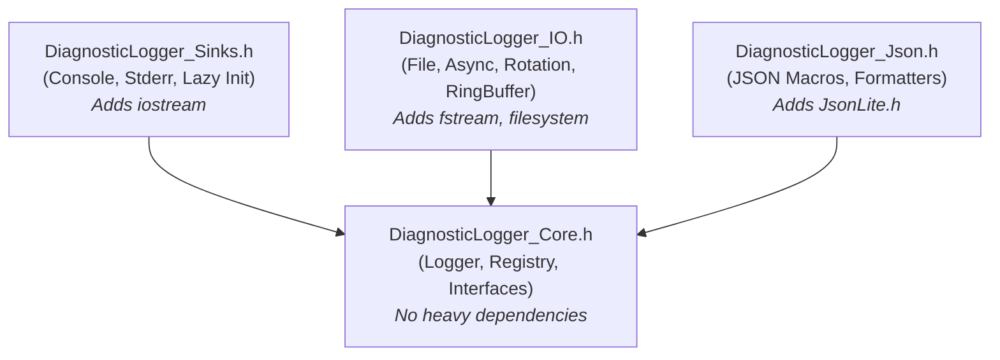
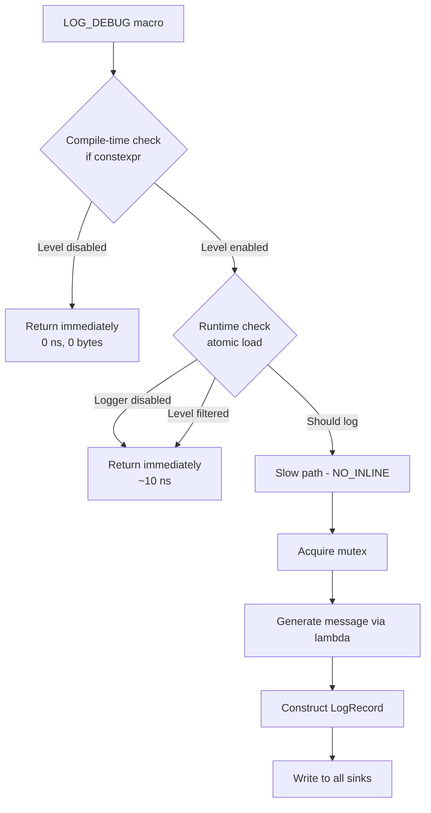
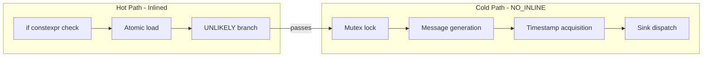
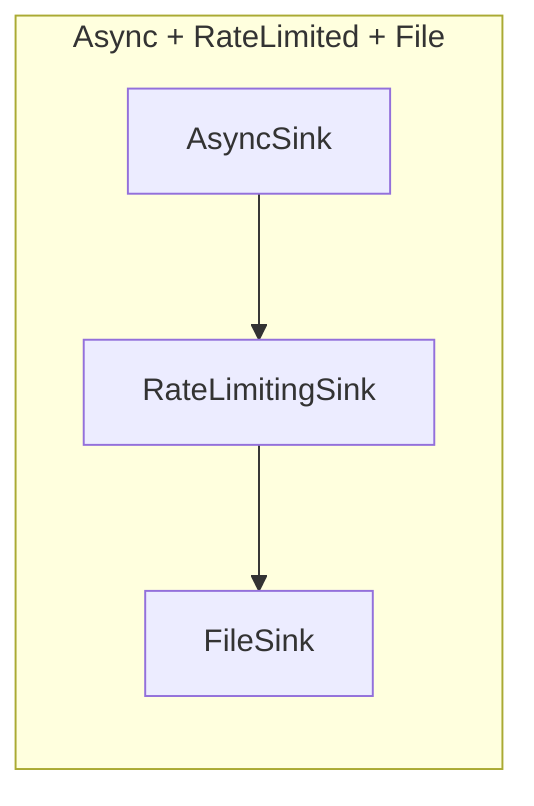

# DiagnosticLogger User Manual

## Table of Contents

1. [What is Diagnostic Logging?](#what-is-diagnostic-logging)
2. [Library Architecture](#library-architecture)
3. [Getting Started](#getting-started)
4. [Log Levels](#log-levels)
5. [Basic Logging](#basic-logging)
6. [Named Loggers](#named-loggers)
7. [Sinks](#sinks)
8. [Formatters](#formatters)
9. [Structured JSON Logging](#structured-json-logging)
10. [Advanced Sinks](#advanced-sinks)
11. [Performance Characteristics](#performance-characteristics)
12. [Thread Safety](#thread-safety)
13. [Best Practices](#best-practices)
14. [Comparison with Other Libraries](#comparison-with-other-libraries)
15. [Migration Guide](#migration-guide)
16. [Compiler Requirements](#compiler-requirements)
17. [Troubleshooting](#troubleshooting)
18. [Summary](#summary)

---

## What is Diagnostic Logging?

### Understanding Diagnostic Logging

Diagnostic logging is the practice of recording runtime information about a program's execution for debugging, monitoring, and auditing purposes. Unlike print statements or assertions, diagnostic logging:

- **Survives deployment**: Logs can be enabled in production without recompilation
- **Provides context**: Timestamps, thread IDs, file locations automatically included
- **Scales**: Multiple destinations (console, files, network) without code changes
- **Performs**: Minimal overhead when disabled, manageable overhead when enabled

Good logging is essential for:

- Debugging production issues
- Understanding performance bottlenecks
- Auditing security-sensitive operations
- Monitoring system health
- Reproducing intermittent bugs

### The C++ Logging Landscape

C++ has a fragmented logging ecosystem:

**Traditional Solutions:**

| Solution | Problems |
|----------|----------|
| `std::cout`/`std::cerr` | No structure, no filtering, not thread-safe |
| `printf` | Fast but not type-safe, no C++ support |
| Custom solutions | Often reinventing the wheel poorly |

**Modern Libraries:**

| Library | Characteristics |
|---------|-----------------|
| **spdlog** | Fast, feature-rich, header-only option, widely used |
| **glog** | Google's logging library, proven but opinionated |
| **Boost.Log** | Comprehensive but heavyweight, requires Boost |
| **plog** | Lightweight, header-only, limited features |

**Common Problems:**

- External dependencies
- Complex APIs
- Runtime overhead even when logging is disabled
- Poor compile-time optimization
- Thread contention on the hot path

### Where DiagnosticLogger Fits

DiagnosticLogger is designed for **high-performance C++ projects** where:

1. **Zero external dependencies** are required
2. **Compile-time optimization** is critical
3. **Runtime performance** matters even for disabled logs
4. **Header-only** deployment is preferred
5. **C++17 compliance** without cutting-edge features
6. **Thread safety** is non-negotiable

**Key Features:**

| Feature | Benefit |
|---------|---------|
| Lock-free fast path | Single atomic load for disabled logs (~10ns) |
| Compile-time filtering | Zero overhead for disabled log levels |
| Branch prediction hints | Optimized for common case (logging disabled) |
| Lazy evaluation | Messages only generated when actually logged |
| Named loggers | Per-subsystem configuration |
| Async logging | Background thread via AsyncSink |
| Structured JSON | Machine-parseable output |
| Header-only | Single include, no linking required |

**When to Use DiagnosticLogger:**

- HPC applications where every nanosecond counts
- Header-only library projects
- Projects with strict "no external dependencies" policy
- Embedded systems with limited resources
- Scientific computing with performance-critical loops
- Real-time systems where predictable performance matters

**When to Use Something Else:**

- Need complex pattern-based formatting
- Need log compression or network sinks built-in
- Already using spdlog successfully
- Need C++11/14 compatibility

---

## Library Architecture

### Modular Design Philosophy

DiagnosticLogger avoids the "monolithic header" problem common in C++ libraries. Instead of forcing you to include heavy dependencies like `<iostream>`, `<filesystem>`, or `<fstream>` everywhere, the library is split into granular components.

**You only pay for what you use:**

- Need basic logging interfaces? Include `Core.h` (lightweight, no streams).
- Need console output? Include `Sinks.h` (adds `<iostream>`).
- Need file I/O? Include `IO.h` (adds `<fstream>`, `<filesystem>`).
- Need JSON? Include `Json.h` (adds `JsonLite.h`).

This matters for compile times and binary size in large projects. A translation unit that only needs to define a custom sink can include just `Core.h` without pulling in stream headers.

### Library File Structure

DiagnosticLogger is organized into four header files:



**When to Include Each File:**

| Use Case | Include | Dependencies Added |
|----------|---------|-------------------|
| Custom sinks / interfaces only | `DiagnosticLogger_Core.h` | `<atomic>`, `<mutex>`, `<chrono>`, `<vector>` |
| Console logging (typical) | `DiagnosticLogger_Sinks.h` | Above + `<iostream>` |
| File / async / advanced sinks | `DiagnosticLogger_IO.h` | Above + `<fstream>`, `<filesystem>` |
| Structured JSON logging | `DiagnosticLogger_Json.h` | Core + `JsonLite.h` |

### The Fast Path Design

DiagnosticLogger is built around the **fast path principle**: the common case (logging disabled or filtered) should be **extremely fast**.



**Key Optimization Techniques:**

| Technique | Purpose | Implementation |
|-----------|---------|----------------|
| `if constexpr` | Eliminate code at compile time | `if constexpr (gMinLogLevel <= LogLevel::Debug)` |
| Lock-free atomics | Fast disabled check | `std::atomic<LogLevel>` with relaxed ordering |
| `UNLIKELY` macro | Branch prediction | `__builtin_expect(!!(x), 0)` |
| `NO_INLINE` | Keep hot path small | Slow path in separate function |
| Lazy evaluation | Defer message generation | Lambda captures evaluated only when needed |

### Hot/Cold Path Separation

The implementation separates the hot path (disabled logging) from the cold path (actual logging):



**Why this matters:**

- Hot path stays in instruction cache
- Cold path code doesn't pollute cache when not used
- Compiler can inline hot path aggressively
- Branch predictor learns "don't log" pattern

---

## Getting Started

### Prerequisites

- **C++17 compiler** (GCC 7+, Clang 5+, MSVC 2017+)
- Standard library with `<atomic>`, `<mutex>`, `<chrono>`, `<thread>`

### Integration

**Minimal (console logging):**

```cpp
#include "DiagnosticLogger_Sinks.h"
```

**Full (all features):**

```cpp
#include "DiagnosticLogger_Sinks.h"
#include "DiagnosticLogger_IO.h"
#include "DiagnosticLogger_Json.h"
```

### First Program

```cpp
#include "DiagnosticLogger_Sinks.h"
#include <string>

int main()
{
    using namespace fat_p::diagnostic;
    
    // Option 1: Explicit initialization
    initializeDefaultLogger();
    
    // Option 2: Just start logging (lazy init creates ConsoleSink automatically)
    
    LOG_INFO("Application starting");
    LOG_DEBUG("Debug mode: " << true);
    LOG_WARNING("Configuration file not found, using defaults");
    LOG_ERROR("Failed to connect: " << "timeout");
    
    // Runtime level control
    getGlobalLogger().setMinLevel(LogLevel::Warning);
    LOG_DEBUG("This won't print");  // Filtered at runtime
    LOG_ERROR("This will print");
    
    return 0;
}
```

**Output:**

```
[2025-11-29 14:30:45.123] [INFO] [0x7f8b2c001740] Application starting (main.cpp:10)
[2025-11-29 14:30:45.123] [DEBUG] [0x7f8b2c001740] Debug mode: 1 (main.cpp:11)
[2025-11-29 14:30:45.124] [WARN] [0x7f8b2c001740] Configuration file not found, using defaults (main.cpp:12)
[2025-11-29 14:30:45.124] [ERROR] [0x7f8b2c001740] Failed to connect: timeout (main.cpp:13)
[2025-11-29 14:30:45.125] [ERROR] [0x7f8b2c001740] This will print (main.cpp:20)
```

### Compilation

```bash
# Basic
g++ -std=c++17 main.cpp -o app

# Recommended (optimized)
g++ -std=c++17 -O2 -Wall -Wextra main.cpp -o app

# Production (compile-time filtering)
g++ -std=c++17 -O3 -DCPP_UTIL_MIN_LOG_LEVEL=2 -DNDEBUG main.cpp -o app

# With IO extension (requires pthread on some systems)
g++ -std=c++17 -O2 main.cpp -o app -lpthread
```

---

## Log Levels

### Why Log Levels Matter

Log levels solve a fundamental tension in logging: you want **verbose output during development** to understand what's happening, but **minimal output in production** to avoid noise and performance overhead.

Without levels, you're forced to choose between:
- Commenting out debug statements (tedious, error-prone)
- `#ifdef DEBUG` guards (can't enable in production without rebuild)
- Always logging everything (performance disaster)

Log levels let you write once and filter dynamically:

```cpp
LOG_DEBUG("Intermediate calculation: " << value);  // Development only
LOG_INFO("Request processed");                     // Normal operation
LOG_ERROR("Database connection lost");             // Always important
```

### Available Levels

DiagnosticLogger provides six levels plus a special "Off" value:

```cpp
enum class LogLevel : int
{
    Trace   = 0,  // Extremely verbose, loop iterations
    Debug   = 1,  // Development debugging
    Info    = 2,  // Normal operational messages
    Warning = 3,  // Potential issues
    Error   = 4,  // Recoverable failures
    Fatal   = 5,  // Unrecoverable errors
    Off     = 6   // Disable all logging
};
```

**Why these specific levels?** This hierarchy mirrors industry standards (syslog, log4j, spdlog) making migration easier and semantics familiar. The numeric values enable simple comparison: a message logs if `messageLevel >= configuredMinLevel`.

### Compile-Time Filtering: The Zero-Overhead Solution

**The Problem:** Even a "disabled" log statement costs something—the function call overhead, the level comparison. In tight loops, this adds up.

**The Solution:** Compile-time filtering uses C++17's `if constexpr` to completely eliminate disabled log levels from the binary:

```bash
g++ -DCPP_UTIL_MIN_LOG_LEVEL=2 main.cpp  # Only Info and above
```

**Effect:**

```cpp
// With CPP_UTIL_MIN_LOG_LEVEL=2
LOG_TRACE("x=" << expensive());  // Completely eliminated - 0 instructions!
LOG_DEBUG("y=" << another());    // Completely eliminated!
LOG_INFO("Started");             // Compiled in
LOG_ERROR("Failed");             // Compiled in
```

**How it works:** The macros expand to `if constexpr` checks:

```cpp
#define LOG_DEBUG(msg) \
    do { \
        if constexpr (gMinLogLevel <= LogLevel::Debug) { \
            /* ... logging code ... */ \
        } \
    } while(0)
```

When `gMinLogLevel > LogLevel::Debug`, the entire body is discarded by the compiler—not just skipped at runtime, but removed from the binary entirely. No function call, no string literals, no dead code.

**Recommended build configurations:**

| Build | Flag | Effect |
|-------|------|--------|
| Development | `-DCPP_UTIL_MIN_LOG_LEVEL=0` | All logs |
| Testing | `-DCPP_UTIL_MIN_LOG_LEVEL=1` | Debug and above |
| Production | `-DCPP_UTIL_MIN_LOG_LEVEL=2` | Info and above |
| Minimal | `-DCPP_UTIL_MIN_LOG_LEVEL=4` | Errors only |

### Runtime Filtering: Dynamic Control

**Why both compile-time AND runtime filtering?** Compile-time filtering is optimal for levels you'll never need (e.g., Trace in production), but sometimes you need to adjust logging without rebuilding—debugging a production issue, temporarily increasing verbosity, etc.

After compile-time filtering passes, runtime filtering provides dynamic control:

```cpp
{
    using namespace fat_p::diagnostic;
    
    Logger& logger = getGlobalLogger();

    logger.setMinLevel(LogLevel::Warning);  // Only Warning+ pass
    logger.setEnabled(false);               // Disable all logging
    logger.setEnabled(true);                // Re-enable

    // Aliases for API consistency
    logger.setLevel(LogLevel::Info);        // Same as setMinLevel
    LogLevel current = logger.getLevel();   // Same as getMinLevel
}
```

**Performance:** Single atomic store/load (~5ns), lock-free. This is the "fast path" cost for disabled logs.

### Choosing the Right Level

| Level | When to Use | Examples |
|-------|-------------|----------|
| **Trace** | Loop internals, variable dumps—extremely verbose output useful only during active debugging | `LOG_TRACE("Loop iteration i=" << i)` |
| **Debug** | Algorithm decisions, intermediate results—helpful during development but too noisy for production | `LOG_DEBUG("Cache hit for key: " << key)` |
| **Info** | Application lifecycle, significant events—what a sysadmin would want to see during normal operation | `LOG_INFO("Server started on port " << port)` |
| **Warning** | Recoverable issues, deprecation notices—something is wrong but the application can continue | `LOG_WARNING("Retrying connection, attempt " << n)` |
| **Error** | Operation failures that affect functionality—a specific request failed but the system is still running | `LOG_ERROR("Failed to open file: " << path)` |
| **Fatal** | Unrecoverable errors—the application is about to crash or is in an undefined state | `LOG_FATAL("Database corruption detected")` |

---

## Basic Logging

### The Logging Model

DiagnosticLogger uses a **stream-style** API because it's idiomatic C++ and supports arbitrary types via `operator<<`:

```cpp
LOG_INFO("Processing " << count << " items in " << duration << "ms");
```

Internally, this expands to:

1. Check if the level passes compile-time and runtime filters
2. If so, construct a `std::ostringstream`, stream the message into it
3. Create a `LogRecord` with the message, timestamp, source location, thread ID
4. Dispatch the record to all configured sinks

### Global Logger Macros

These macros log to the global (default) logger:

```cpp
LOG_TRACE(message);    // LogLevel::Trace
LOG_DEBUG(message);    // LogLevel::Debug
LOG_INFO(message);     // LogLevel::Info
LOG_WARNING(message);  // LogLevel::Warning
LOG_ERROR(message);    // LogLevel::Error
LOG_FATAL(message);    // LogLevel::Fatal
```

**Why macros instead of functions?** Two reasons:
1. **Source location capture**: Macros can use `__FILE__` and `__LINE__` to record where the log was called
2. **Lazy evaluation**: The message expression is wrapped in a lambda, so expensive computations are only performed when the log actually fires

### Message Formatting

Messages use stream-style formatting, supporting any type with `operator<<`:

```cpp
int count = 42;
std::string name = "test";
double value = 3.14159;

LOG_INFO("Count: " << count);
LOG_INFO("Name: " << name << ", Value: " << value);
LOG_INFO("Hex: 0x" << std::hex << 255);
LOG_INFO("Fixed: " << std::fixed << std::setprecision(2) << value);
```

### Lazy Evaluation: Why It Matters

**The Problem:** Consider this innocent-looking code:

```cpp
LOG_DEBUG("User data: " << user.serialize());  // serialize() takes 10ms
```

If Debug is disabled, you might expect zero cost. But with naive implementations, `user.serialize()` is called regardless—the result is just discarded.

**The Solution:** DiagnosticLogger wraps message expressions in lambdas:

```cpp
// What you write:
LOG_DEBUG("Result: " << expensiveComputation());

// What actually executes when Debug is filtered:
if (shouldLog(LogLevel::Debug)) {  // false - returns immediately
    // This lambda is NEVER invoked
    auto msg = [&]() {
        std::ostringstream oss;
        oss << "Result: " << expensiveComputation();
        return oss.str();
    }();
    writeToSinks(msg);
}
```

**Result:** When the log level is filtered, `expensiveComputation()` is never called. This is critical for performance in HPC code where debug logs might include expensive diagnostics.

---

## Named Loggers

### Why Named Loggers?

Real applications have subsystems with different logging needs:

- **Database layer**: Only errors matter; info is too noisy
- **Network layer**: Need verbose debugging during development
- **UI layer**: Separate log file for frontend issues
- **Security layer**: Must always log to audit trail

A single global logger can't satisfy all these needs. Named loggers let you:

1. **Configure levels independently**: Database at Warning, Network at Debug
2. **Route to different sinks**: Security logs to audit file, UI logs to console
3. **Filter by subsystem**: Only enable verbose logging for the module you're debugging

### Creating and Using Named Loggers

```cpp
{
    using namespace fat_p::diagnostic;
    
    // Get or create named loggers (created on first access)
    Logger& dbLogger = getLogger("database");
    Logger& netLogger = getLogger("network");
    Logger& uiLogger = getLogger("ui");

    // Configure independently
    dbLogger.setMinLevel(LogLevel::Warning);   // Database: only warnings+
    netLogger.setMinLevel(LogLevel::Debug);    // Network: verbose
    uiLogger.setMinLevel(LogLevel::Info);      // UI: normal

    // Add different sinks
    dbLogger.addSink(std::make_shared<FileSink>("db.log"));
    netLogger.addSink(std::make_shared<FileSink>("network.log"));
}
```

### Named Logger Macros

The `LOG_*_TO` macros log to a specific named logger:

```cpp
LOG_INFO_TO("database", "Query executed: " << query);
LOG_DEBUG_TO("network", "Packet received: " << size << " bytes");
LOG_ERROR_TO("ui", "Render failed: " << errorCode);
```

**Performance note:** The first call to `LOG_*_TO` with a given name performs a registry lookup. Subsequent calls use a cached reference (via `static` local variable), so there's no repeated lookup overhead:

```cpp
#define LOG_INFO_TO(name, msg) \
    do { \
        static Logger& _cached_ = getLogger(name); \
        _cached_.log(LogLevel::Info, [&]() { ... }, location); \
    } while(0)
```

### LoggerRegistry: Bulk Operations

The `LoggerRegistry` manages all named loggers and provides bulk operations:

```cpp
{
    using namespace fat_p::diagnostic;
    
    LoggerRegistry& registry = LoggerRegistry::instance();

    // Query
    bool exists = registry.exists("database");
    std::vector<std::string> names = registry.names();

    // Lifecycle
    registry.drop("database");     // Remove a specific logger
    registry.dropAll();            // Remove all loggers

    // Bulk configuration (applies to all existing loggers)
    registry.setAllLevels(LogLevel::Warning);
    registry.addSinkToAll(sharedSink);

    // Defaults for newly-created loggers
    registry.setDefaultLevel(LogLevel::Info);
    registry.addDefaultSink(std::make_shared<ConsoleSink>());
}
```

**When to use `setAllLevels`:** Emergency situations where you need to silence or amplify all logging at once, or initial configuration before subsystems start.

---

## Sinks

### What is a Sink?

A **sink** is a destination for log output. The name comes from the dataflow metaphor: logs flow from source (your code) to sink (output).

DiagnosticLogger separates **what** you log (the `LOG_*` macros) from **where** it goes (sinks). This separation enables:

- Multiple outputs simultaneously (console AND file)
- Different formats per destination (human-readable console, JSON for aggregation)
- Different filtering per destination (errors to pager, everything to file)
- Hot-swapping destinations without changing logging code

### The Sink Interface

All sinks implement `ISink`:

```cpp
class ISink
{
public:
    virtual ~ISink() = default;
    virtual void write(const LogRecord& record) = 0;
    virtual void flush() = 0;
};
```

The `LogRecord` contains everything about a log event:

```cpp
struct LogRecord
{
    LogLevel level;
    std::string message;
    std::chrono::system_clock::time_point timestamp;
    std::thread::id threadId;
    const char* file;
    int line;
    const char* function;
};
```

### Standard Sinks (DiagnosticLogger_Sinks.h)

These sinks are available with just `#include "DiagnosticLogger_Sinks.h"`:

#### ConsoleSink

**What:** Writes to stdout and stderr based on level.

**Why:** The most common output during development. Routing errors to stderr allows shell redirection (`./app 2>errors.log`).

```cpp
{
    using namespace fat_p::diagnostic;
    
    auto sink = std::make_shared<ConsoleSink>();
    getGlobalLogger().addSink(sink);
}
```

**Stream routing:**

| Level | Output |
|-------|--------|
| Trace, Debug, Info | stdout |
| Warning, Error, Fatal | stderr |

#### StderrSink

**What:** Writes all output to stderr.

**Why:** Some environments (Docker, systemd) capture stderr specially. Also useful when stdout is used for program output.

```cpp
{
    using namespace fat_p::diagnostic;
    
    auto sink = std::make_shared<StderrSink>();
    getGlobalLogger().addSink(sink);
}
```

### File Sinks (DiagnosticLogger_IO.h)

These sinks require `#include "DiagnosticLogger_IO.h"` (adds `<fstream>`, `<filesystem>`):

#### FileSink

**What:** Writes to a file with optional level filtering.

**Why:** Persistent logs that survive process restart. Per-sink level filtering lets you write only errors to one file while capturing everything elsewhere.

```cpp
{
    using namespace fat_p::diagnostic;
    
    // Basic: log everything to app.log
    auto sink = std::make_shared<FileSink>("app.log");

    // Advanced: errors only, append mode
    auto errorSink = std::make_shared<FileSink>(
        "errors.log",
        std::make_unique<DefaultFormatter>(),
        LogLevel::Error,  // Only Error and Fatal
        true              // Append, don't truncate
    );

    // Safe construction (returns nullptr if file can't be opened)
    auto checked = makeFileSink("/var/log/app.log");
    if (checked)
    {
        getGlobalLogger().addSink(checked);
    }
}
```

**Important:** FileSink's destructor flushes automatically—no data loss on normal exit.

#### RotatingFileSink

**What:** Automatically rotates log files when they reach a size limit.

**Why:** Unbounded log files eventually fill disks. Rotation keeps a fixed number of historical files while preventing disk exhaustion.

```cpp
{
    using namespace fat_p::diagnostic;
    
    auto sink = std::make_shared<RotatingFileSink>(
        "app.log",           // Base filename
        10 * 1024 * 1024,    // Rotate at 10MB
        5                    // Keep 5 old files
    );
    // Creates: app.log (current), app.log.1, app.log.2, ... app.log.5
}
```

**Rotation behavior:** When `app.log` reaches 10MB, it becomes `app.log.1`, the old `.1` becomes `.2`, etc. The oldest (`.5`) is deleted.

#### RingBufferSink

**What:** In-memory circular buffer that keeps the last N log records.

**Why:** Crash diagnostics. Normal file logging might lose recent records if the process crashes before flushing. A ring buffer keeps recent logs in memory, ready to dump when something goes wrong.

```cpp
{
    using namespace fat_p::diagnostic;
    
    auto ring = std::make_shared<RingBufferSink>(4096);  // Keep last 4096 records
    getGlobalLogger().addSink(ring);

    // ... application runs ...

    // On crash or assertion failure, dump to file
    if (crashDetected)
    {
        FileSink crashLog("crash_dump.log");
        ring->dumpTo(crashLog);
    }
}
```

#### CallbackSink

**What:** Invokes a user-provided function for each log record.

**Why:** Integration with external systems—metrics collectors, alerting services, custom transports. The callback receives the full `LogRecord` for maximum flexibility.

```cpp
{
    using namespace fat_p::diagnostic;
    
    auto sink = std::make_shared<CallbackSink>(
        [](const LogRecord& record) {
            if (record.level >= LogLevel::Error)
            {
                alertingService.notify(record.message);
            }
            metricsCollector.increment("log_count", {{"level", toString(record.level)}});
        }
    );
}
```

### Multiple Sinks

A logger can write to multiple sinks simultaneously:

```cpp
{
    using namespace fat_p::diagnostic;
    
    Logger& logger = getGlobalLogger();

    // Human-readable to console
    logger.addSink(std::make_shared<ConsoleSink>());

    // Everything to main log file
    logger.addSink(std::make_shared<FileSink>("app.log"));

    // Errors only to separate file (for alerting)
    logger.addSink(std::make_shared<FileSink>(
        "errors.log",
        std::make_unique<DefaultFormatter>(),
        LogLevel::Error
    ));

    // JSON for log aggregation system
    logger.addSink(std::make_shared<FileSink>(
        "app.json",
        std::make_unique<JsonFormatter>()
    ));
}
```

Each sink processes every log record independently, applying its own formatter and level filter.

---

## Formatters

### What is a Formatter?

A **formatter** converts a `LogRecord` into a string. Different destinations need different formats:

- **Console**: Human-readable with colors, timestamps, context
- **Log aggregation**: Structured JSON for machine parsing
- **Embedded systems**: Minimal format to save bandwidth

Formatters implement `IFormatter`:

```cpp
class IFormatter
{
public:
    virtual ~IFormatter() = default;
    virtual std::string format(const LogRecord& record) const = 0;
};
```

### Built-in Formatters

#### DefaultFormatter

**What:** Full context with timestamp, level, thread ID, message, and source location.

**Why:** The most informative format for general use. Includes everything you need to diagnose issues.

```
[2025-11-29 14:30:45.123] [INFO] [0x7f8b2c001740] Message here (main.cpp:42)
```

#### SimpleFormatter

**What:** Just level and message.

**Why:** Minimal overhead, useful when timestamps come from elsewhere (systemd journal) or for embedded systems.

```
[INFO] Message here
```

#### JsonFormatter (DiagnosticLogger_Json.h)

**What:** Single-line JSON with all fields.

**Why:** Machine-parseable output for log aggregation systems (ELK, Splunk, CloudWatch).

```json
{"timestamp":"2025-11-29T14:30:45.123","level":"INFO","message":"Message here","thread_id":"7f8b2c001740","file":"main.cpp","line":42}
```

### Custom Formatters

Implement `IFormatter` for custom formats:

```cpp
class ColoredFormatter : public fat_p::diagnostic::IFormatter
{
public:
    std::string format(const fat_p::diagnostic::LogRecord& record) const override
    {
        using fat_p::diagnostic::LogLevel;
        using fat_p::diagnostic::logLevelToString;
        
        std::ostringstream oss;
        oss << ansiColor(record.level)
            << "[" << logLevelToString(record.level) << "] "
            << "\033[0m"
            << record.message;
        return oss.str();
    }
    
private:
    static const char* ansiColor(fat_p::diagnostic::LogLevel level)
    {
        using fat_p::diagnostic::LogLevel;
        switch (level)
        {
            case LogLevel::Error:   return "\033[31m";  // Red
            case LogLevel::Warning: return "\033[33m";  // Yellow
            case LogLevel::Info:    return "\033[32m";  // Green
            default:                return "\033[0m";
        }
    }
};
```

---

## Structured JSON Logging

### Why Structured Logging?

Traditional text logs are designed for humans:

```
[2025-11-29 14:30:45.123] [ERROR] User login failed: invalid password (auth.cpp:87)
```

But modern infrastructure relies on **log aggregation**—centralized systems (ELK, Splunk, Datadog) that index and search logs from hundreds of services. These systems work much better with **structured data**:

```json
{"timestamp":"2025-11-29T14:30:45.123","level":"ERROR","event":"login_failed","reason":"invalid_password","user_id":"12345","ip":"192.168.1.1"}
```

Structured logs enable:
- **Filtering**: "Show all login_failed events where reason=invalid_password"
- **Aggregation**: "Count errors by event type"
- **Alerting**: "Page if more than 10 login failures per minute from same IP"

### JSON Logging Macros (DiagnosticLogger_Json.h)

```cpp
#include "DiagnosticLogger_Json.h"

// Log an object as JSON
LOG_INFO_JSON(requestData);
LOG_ERROR_JSON(errorDetails);

// Log a message with structured data attached
LOG_INFO_WITH_DATA("Request processed", responseData);
LOG_ERROR_WITH_DATA("Validation failed", validationErrors);
```

**All available macros:**

| Macro | Description |
|-------|-------------|
| `LOG_TRACE_JSON(obj)` | Log object as JSON at Trace level |
| `LOG_DEBUG_JSON(obj)` | Log object as JSON at Debug level |
| `LOG_INFO_JSON(obj)` | Log object as JSON at Info level |
| `LOG_WARNING_JSON(obj)` | Log object as JSON at Warning level |
| `LOG_ERROR_JSON(obj)` | Log object as JSON at Error level |
| `LOG_FATAL_JSON(obj)` | Log object as JSON at Fatal level |
| `LOG_*_WITH_DATA(msg, obj)` | Log message with JSON data attached |

### Serializing Custom Types

DiagnosticLogger uses ADL (Argument-Dependent Lookup) to find `to_json` functions for your types:

```cpp
struct Request
{
    std::string id;
    std::string method;
    int statusCode;
};

// Define in the same namespace as Request
void to_json(fat_p::JsonValue& j, const Request& r)
{
    fat_p::JsonObject obj;
    obj["id"] = r.id;
    obj["method"] = r.method;
    obj["status_code"] = static_cast<int64_t>(r.statusCode);
    j = obj;
}

// Now you can log it
Request req{"abc123", "GET", 200};
LOG_INFO_JSON(req);
// Output: {"id":"abc123","method":"GET","status_code":200}
```

### Zero-Overhead When Disabled

JSON macros use `if constexpr` to eliminate code when the log level is disabled at compile time:

```cpp
#define CPP_UTIL_MIN_LOG_LEVEL 4  // Error only

struct MyType { int x; };
// No to_json defined!

LOG_DEBUG_JSON(MyType{42});  // COMPILES! Code is eliminated entirely.
LOG_ERROR_JSON(MyType{42});  // Compile error: no to_json for MyType
```

This means you can sprinkle `LOG_DEBUG_JSON` throughout your code during development, and production builds with high `CPP_UTIL_MIN_LOG_LEVEL` won't even attempt to serialize the objects.

---

## Advanced Sinks

### Why Advanced Sinks?

Basic sinks (console, file) work for simple cases, but production systems face challenges:

- **Performance**: File I/O blocks the logging thread
- **Reliability**: Network log storage might be temporarily unavailable
- **Volume**: Runaway logging can overwhelm storage
- **Filtering**: Need custom routing logic beyond level filtering

Advanced sinks address these challenges through composition—wrapping simpler sinks to add capabilities.

### AsyncSink: Non-Blocking Logging

**The Problem:** Writing to files or network takes time. During that time, your application thread is blocked.

**The Solution:** AsyncSink queues log records and writes them on a background thread:

```cpp
{
    using namespace fat_p::diagnostic;
    
    auto fileSink = std::make_shared<FileSink>("app.log");
    auto asyncSink = std::make_shared<AsyncSink>(fileSink);
    getGlobalLogger().addSink(asyncSink);

    // This returns immediately (~47ns) instead of waiting for disk I/O
    LOG_INFO("This is queued and written asynchronously");

    // Check if any records were dropped (queue overflow)
    uint64_t dropped = asyncSink->dropped();

    // Ensure all logs are written before shutdown
    asyncSink->flush();  // Blocks until queue is empty
}
```

**Queue behavior:**
- Fixed-size lock-free queue (4096 entries by default)
- When full, new records are **dropped** (not blocked)—this preserves application latency
- Call `dropped()` to monitor queue overflow
- Destructor drains queue before returning

### RateLimitingSink: Preventing Log Floods

**The Problem:** A bug might trigger millions of error logs per second, overwhelming storage and hiding important messages.

**The Solution:** Token bucket rate limiting drops excess logs:

```cpp
{
    using namespace fat_p::diagnostic;
    
    auto target = std::make_shared<FileSink>("app.log");
    auto rateLimited = std::make_shared<RateLimitingSink>(
        target,
        100.0,   // 100 logs per second sustained rate
        50.0     // Burst capacity of 50
    );

    getGlobalLogger().addSink(rateLimited);

    // First 50 logs pass immediately (burst)
    // Then ~100/second (sustained rate)
    // Excess logs are dropped

    uint64_t dropped = rateLimited->dropped();
}
```

**Token bucket explained:** Tokens accumulate at the sustained rate (100/sec). Each log consumes a token. Burst capacity is the maximum tokens that can accumulate. This allows brief spikes while preventing sustained floods.

### ResilientSink: Automatic Failover

**The Problem:** Network-attached storage might be temporarily unavailable. You don't want to lose logs during the outage.

**The Solution:** ResilientSink switches to a backup sink when the primary fails:

```cpp
{
    using namespace fat_p::diagnostic;
    
    auto primary = std::make_shared<FileSink>("/mnt/network/app.log");
    auto fallback = std::make_shared<FileSink>("/tmp/app.log");
    auto resilient = std::make_shared<ResilientSink>(primary, fallback);

    getGlobalLogger().addSink(resilient);

    // If primary throws, automatically switches to fallback
    LOG_ERROR("This goes to fallback if primary is unavailable");

    // Later, try primary again
    resilient->reset();
}
```

### FilteringSink: Custom Routing

**The Problem:** You need routing logic beyond simple level filtering—specific message patterns, specific loggers, etc.

**The Solution:** FilteringSink applies a predicate to each record:

```cpp
{
    using namespace fat_p::diagnostic;
    
    auto securityLog = std::make_shared<FileSink>("security.log");
    auto filtered = std::make_shared<FilteringSink>(
        securityLog,
        [](const LogRecord& record) {
            return record.message.find("SECURITY") != std::string::npos
                || record.message.find("AUTH") != std::string::npos;
        }
    );

    getGlobalLogger().addSink(filtered);
}
```

### Sink Composition: Building Pipelines

Advanced sinks wrap other sinks, enabling composition:



```cpp
{
    using namespace fat_p::diagnostic;
    
    // Build from inside out: File <- RateLimited <- Async
    auto file = std::make_shared<FileSink>("app.log");
    auto rateLimited = std::make_shared<RateLimitingSink>(file, 1000.0);
    auto async = std::make_shared<AsyncSink>(rateLimited);
    
    getGlobalLogger().addSink(async);
    // Result: Non-blocking, rate-limited file logging
}
```

**Order matters:** Logs flow through sinks in wrapper order. Rate limiting should typically come after async (so the background thread does the dropping, not the application thread).

---

## Performance Characteristics

### Why Performance Matters for Logging

Logging is pervasive—potentially thousands of calls per second in high-throughput systems. If each call costs 100ns, that's measurable overhead. If disabled logging still costs 100ns, you can't afford to leave debug logs in production code.

DiagnosticLogger is designed for **near-zero cost when disabled**, enabling you to write rich debug logging without production performance guilt.

### Benchmark Environment

**Test Machine:**

| Component | Specification |
|-----------|---------------|
| Processor | Intel Core i7-8850H @ 2.60 GHz (4.3 GHz turbo) |
| RAM | 32.0 GB |
| Architecture | x64 |
| OS | Windows 11 |
| Compiler | MSVC 2022 |

**Flags:**
```
/std:c++17 /O2 /DNDEBUG /MD /EHsc /W3
```

> **Critical:** Always benchmark with optimized builds. Debug builds disable inlining and add runtime checks, making results meaningless.

### CPU Cycle Analysis

Understanding latency in terms of CPU cycles reveals whether the implementation is optimal:

**Disabled/filtered log path (~6ns @ 4.3 GHz):**

```
6 ns × 4.3 GHz = ~26 CPU cycles

Breakdown:
  Atomic load (L1 cache hit):     ~15-20 cycles
  Comparison:                     ~1 cycle
  Predicted branch (UNLIKELY):    ~0 cycles (branch predictor)
  Function call overhead:         ~5 cycles
  ─────────────────────────────────────────────
  Total:                          ~21-26 cycles
```

This is **near the theoretical minimum** for any check involving an atomic load. The `UNLIKELY` macro ensures the branch predictor almost always predicts "don't log."

**Scaling by CPU frequency:**

| CPU Speed | Filtered Log Overhead |
|-----------|----------------------|
| 3.0 GHz server | ~9 ns |
| 4.3 GHz desktop | ~6 ns |
| 5.0 GHz desktop | ~5 ns |

### Benchmark Results

| Scenario | Latency | Notes |
|----------|---------|-------|
| Compile-time filtered | **0 ns** | Code eliminated entirely |
| Runtime filtered | **~6-10 ns** | Atomic load + branch |
| Active logging (logger path only) | **~80-125 ns** | Timestamp + record construction |
| Active + ConsoleSink | **~200 ns** | + stream write |
| Active + FileSink (buffered) | **~180 ns** | + file write |
| Active + AsyncSink | **~150 ns** | + lock-free enqueue |
| Multi-threaded (4 threads, ConsoleSink) | **~330 ns** | Mutex contention |

### Memory Usage

| Component | Memory |
|-----------|--------|
| Logger instance | ~64 bytes |
| LogRecord | ~160 bytes |
| ConsoleSink | ~32 bytes |
| FileSink | ~64 bytes + OS handle |
| RingBufferSink(1024) | ~160 KB |
| AsyncSink | ~640 KB (4096-entry queue) |

---

## Thread Safety

### Why Thread Safety Matters

Modern C++ applications are multi-threaded. Logging from multiple threads without synchronization causes:

- **Interleaved output**: Messages garbled together
- **Data races**: Undefined behavior, crashes
- **Lost messages**: Concurrent writes dropping data

DiagnosticLogger is designed for **safe concurrent use without external synchronization**.

### Thread Safety Guarantees

| Operation | Guarantee | Implementation |
|-----------|-----------|----------------|
| `LOG_*` macros | Safe from any thread | Mutex-protected sink dispatch |
| `setMinLevel()` / `setEnabled()` | Safe, lock-free | `std::atomic` with relaxed ordering |
| `getMinLevel()` / `isEnabled()` | Safe, lock-free | `std::atomic` load |
| `addSink()` / `clearSinks()` | Safe | Mutex-protected |
| `LoggerRegistry::get()` | Safe | Reader-writer lock |
| Named logger lookup | Safe | Registry uses `shared_mutex` |

### Multi-Threaded Example

```cpp
#include "DiagnosticLogger_Sinks.h"
#include <thread>
#include <vector>

void worker(int id)
{
    for (int i = 0; i < 1000; ++i)
    {
        LOG_INFO("Worker " << id << " iteration " << i);
    }
}

int main()
{
    using namespace fat_p::diagnostic;
    
    initializeDefaultLogger();
    
    std::vector<std::thread> threads;
    for (int i = 0; i < 4; ++i)
    {
        threads.emplace_back(worker, i);
    }
    
    for (std::thread& t : threads)
    {
        t.join();
    }
    
    return 0;
}
```

All 4000 messages will be written correctly without interleaving.

### Custom Sinks: Your Responsibility

Built-in sinks are thread-safe. If you implement a custom sink, **you must ensure thread safety**:

```cpp
class MySink : public fat_p::diagnostic::ISink
{
    mutable std::mutex mutex_;
    // ... state ...
    
public:
    void write(const fat_p::diagnostic::LogRecord& r) override
    {
        std::lock_guard<std::mutex> lock(mutex_);
        // Safe access to state
    }
    
    void flush() override
    {
        std::lock_guard<std::mutex> lock(mutex_);
        // Safe flush
    }
};
```

---

## Best Practices

### When to Log (and When Not To)

| ✅ Do Log | ❌ Don't Log |
|----------|-------------|
| State transitions | Every loop iteration |
| Configuration changes | Sensitive data (passwords, tokens, PII) |
| Error conditions with context | Redundant start/end pairs for every function |
| Performance milestones | Normal successful operations at INFO |
| External service calls | High-frequency internal operations |

### Include Context

Logs are useless without context. Include enough information to diagnose the issue without access to the code:

```cpp
// ❌ Bad: What connection? What failed? What now?
LOG_ERROR("Connection failed");

// ✅ Good: Everything you need to diagnose
LOG_ERROR("Connection failed: " << errorMsg 
          << " (host=" << host 
          << ", port=" << port 
          << ", attempt=" << attempt << "/" << maxAttempts << ")");
```

### Use Compile-Time Filtering in Production

```bash
# Development: Everything
g++ -std=c++17 -O2 -DCPP_UTIL_MIN_LOG_LEVEL=0 main.cpp

# Production: Info and above
g++ -std=c++17 -O3 -DCPP_UTIL_MIN_LOG_LEVEL=2 -DNDEBUG main.cpp
```

This eliminates Trace/Debug overhead entirely—not just filtered at runtime, but removed from the binary.

### Sample High-Frequency Logs

Don't log inside tight loops unless sampling:

```cpp
// ❌ Bad: 1,000,000 log calls
for (size_t i = 0; i < 1000000; ++i)
{
    LOG_DEBUG("Processing item " << i);
    process(items[i]);
}

// ✅ Good: Sampled progress
for (size_t i = 0; i < 1000000; ++i)
{
    if (i % 10000 == 0)
    {
        LOG_DEBUG("Progress: " << i << "/" << 1000000);
    }
    process(items[i]);
}
```

### Use Named Loggers for Subsystems

```cpp
// At startup: configure per-subsystem
getLogger("database").setMinLevel(LogLevel::Warning);
getLogger("network").setMinLevel(LogLevel::Debug);
getLogger("security").addSink(auditFileSink);

// Throughout code: log to appropriate subsystem
LOG_DEBUG_TO("network", "Packet received: " << packet.size());
LOG_WARNING_TO("database", "Slow query: " << elapsed << "ms");
LOG_INFO_TO("security", "User login: " << userId);
```

---

## Comparison with Other Libraries

### The C++ Logging Ecosystem

Before comparing features, it helps to understand where each library comes from and who uses it:

**spdlog** is the de facto standard for modern C++ logging. Created by Gabi Melman in 2014, it emphasizes speed and ease of use. It's header-only (optionally compiled), uses the excellent `{fmt}` library for formatting, and has become the go-to choice for new C++ projects. Used by companies like Microsoft, Intel, and countless open-source projects. If you're starting fresh and don't have strict dependency requirements, spdlog is often the default recommendation.

**glog** (Google Logging) was open-sourced by Google in 2008 and reflects Google's internal logging philosophy: simple, reliable, and opinionated. It introduced conventions like `LOG(INFO)` syntax and `CHECK()` macros that many C++ developers recognize. Used extensively within Google and by projects that follow Google's C++ style. It requires gflags for configuration and isn't header-only, but it's battle-tested at massive scale.

**Boost.Log** is part of the Boost C++ Libraries, added in Boost 1.54 (2013). It's the most feature-rich option, offering sophisticated filtering, formatting, and sink options. However, this power comes with complexity—Boost.Log has a steep learning curve and requires linking against Boost libraries. Best suited for projects already committed to the Boost ecosystem or needing advanced features like attribute-based filtering.

**plog** is a lightweight, header-only alternative created by Sergey Podobry. It prioritizes simplicity over features, making it popular for small projects and embedded systems where minimal footprint matters more than advanced capabilities.

**DiagnosticLogger** (this library) targets the niche of zero-dependency, header-only, HPC-focused logging. It's designed for projects where external dependencies are prohibited, compile-time optimization is critical, and every nanosecond counts.

### Feature Comparison

| Feature | DiagnosticLogger | spdlog | glog | Boost.Log |
|---------|------------------|--------|------|-----------|
| Header-only | ✅ Yes | Optional | ❌ No | ❌ No |
| External dependencies | ✅ None | fmt (optional) | gflags | Boost |
| Compile-time filtering | ✅ `if constexpr` | ✅ Yes | ❌ No | ❌ No |
| Lock-free fast path | ✅ Yes | ✅ Yes | ❌ No | ❌ No |
| Named loggers | ✅ Yes | ✅ Yes | ❌ No | ✅ Yes |
| Async logging | ✅ Yes | ✅ Yes | ❌ No | ✅ Yes |
| JSON output | ✅ Built-in | Via pattern | ❌ No | Custom |
| C++ Standard | C++17 | C++11+ | C++11 | C++03+ |
| Disabled log overhead | ~10ns | ~10ns | ~50ns | ~100ns |

### When to Choose DiagnosticLogger

- **Zero external dependencies** is a hard requirement
- **Header-only** deployment needed (library projects)
- **HPC/scientific** workloads where nanoseconds matter
- **C++17** available
- Want **structured JSON logging** without external libs

### When to Choose spdlog

- Need **C++11/14** compatibility
- Want **more formatting options** (fmt patterns)
- Already using **fmt** library
- Need **more community support** and battle-testing

### When to Choose glog

- Google-ecosystem integration
- Simple, proven, "good enough" for most needs
- Don't mind the dependency on gflags

### When to Choose Boost.Log

- Already using Boost extensively
- Need advanced features (filters, formatters, sinks) beyond what others offer
- Willing to pay the complexity cost

---

## Migration Guide

### From std::cout

**Before:**
```cpp
std::cout << "Starting server on port " << port << std::endl;
std::cerr << "Error: " << message << std::endl;
```

**After:**
```cpp
LOG_INFO("Starting server on port " << port);
LOG_ERROR("Error: " << message);
```

**Benefits:** Timestamps, thread IDs, source locations, filtering, multiple outputs.

### From spdlog

**Before:**
```cpp
spdlog::info("User {} logged in", username);
spdlog::set_level(spdlog::level::warn);
auto logger = spdlog::get("mylogger");
```

**After:**
```cpp
{
    using namespace fat_p::diagnostic;
    
    LOG_INFO("User " << username << " logged in");
    getGlobalLogger().setMinLevel(LogLevel::Warning);
    Logger& logger = getLogger("mylogger");
}
```

**Key differences:**
- Stream syntax (`<<`) instead of fmt syntax (`{}`)
- `LogLevel::Warning` instead of `spdlog::level::warn`
- Reference instead of shared_ptr for loggers

### From glog

**Before:**
```cpp
LOG(INFO) << "Message";
VLOG(1) << "Verbose message";
FLAGS_minloglevel = 1;
```

**After:**
```cpp
{
    using namespace fat_p::diagnostic;
    
    LOG_INFO("Message");
    LOG_DEBUG("Verbose message");  // VLOG(1) roughly maps to Debug
    getGlobalLogger().setMinLevel(LogLevel::Info);
}
```

### Incremental Migration

For large codebases, migrate incrementally:


**Phase 1: Adapter header**
```cpp
// logging_compat.h
#ifdef USE_NEW_LOGGER
    #include "DiagnosticLogger_Sinks.h"
    #define APP_LOG_INFO(msg) LOG_INFO(msg)
    #define APP_LOG_ERROR(msg) LOG_ERROR(msg)
#else
    #define APP_LOG_INFO(msg) std::cout << msg << std::endl
    #define APP_LOG_ERROR(msg) std::cerr << msg << std::endl
#endif
```

---

## Compiler Requirements

### Minimum Compiler Versions

**C++17 is required** for:
- `if constexpr` (compile-time filtering)
- `std::string_view` (efficient string handling)
- Structured bindings (internal use)
- Inline variables

| Compiler | Minimum Version | Notes |
|----------|----------------|-------|
| GCC | 7.1+ | Full C++17 support |
| Clang | 5.0+ | Full C++17 support |
| MSVC | VS 2017 15.7+ | `/std:c++17` flag |
| Apple Clang | 10.0+ | Xcode 10+ |
| Intel C++ | 19.0+ | `-std=c++17` |

### Header Dependencies by Module

Each header pulls in different standard library dependencies:

**DiagnosticLogger_Core.h** (lightweight):
```cpp
#include <atomic>       // std::atomic
#include <chrono>       // system_clock, time_point
#include <functional>   // std::function
#include <memory>       // unique_ptr, shared_ptr
#include <mutex>        // mutex, lock_guard
#include <shared_mutex> // shared_mutex
#include <string>       // std::string
#include <string_view>  // std::string_view
#include <thread>       // thread::id
#include <vector>       // std::vector
```

**DiagnosticLogger_Sinks.h** (adds streams):
```cpp
// Core.h dependencies plus:
#include <iostream>     // cout, cerr
#include <sstream>      // ostringstream
#include <iomanip>      // put_time
#include <ctime>        // localtime_r, localtime_s
```

**DiagnosticLogger_IO.h** (adds file I/O):
```cpp
// Sinks.h dependencies plus:
#include <fstream>      // ofstream
#include <filesystem>   // path, exists (C++17)
```

**DiagnosticLogger_Json.h** (adds JSON):
```cpp
// Core.h dependencies plus:
#include "JsonLite.h"   // Internal JSON library
```

### No External Dependencies

DiagnosticLogger uses **only** the C++17 standard library:
- No Boost
- No fmt
- No external JSON libraries
- No threading libraries beyond `<thread>` and `<mutex>`

---

## Troubleshooting

### Common Issues

**1. Compile-time filtering not working**

**Symptom:** `LOG_DEBUG` still executes despite `-DCPP_UTIL_MIN_LOG_LEVEL=4`

**Cause:** The macro was defined after the include, or not propagated to all translation units.

**Solution:**
```cpp
// Option A: Define before include
#define CPP_UTIL_MIN_LOG_LEVEL 4
#include "DiagnosticLogger_Sinks.h"

// Option B: Compiler flag (recommended)
// g++ -DCPP_UTIL_MIN_LOG_LEVEL=4 ...
```

Verify with: `g++ -E main.cpp | grep "if constexpr"` to see macro expansion.

**2. Log file not created**

**Symptom:** FileSink constructed but no file appears.

**Cause:** Permission denied, path doesn't exist, or constructor failed silently.

**Solution:** Use the factory function which returns nullptr on failure:
```cpp
{
    using namespace fat_p::diagnostic;
    
    auto sink = makeFileSink("/var/log/app.log");
    if (!sink)
    {
        std::cerr << "Failed to create log file—check permissions\n";
        // Fall back to console
        sink = std::make_shared<ConsoleSink>();
    }
    getGlobalLogger().addSink(sink);
}
```

**3. No output appears**

**Symptom:** `LOG_INFO` calls produce no output.

**Causes and solutions:**

| Cause | Solution |
|-------|----------|
| No sinks configured | Include `DiagnosticLogger_Sinks.h` (enables lazy init) or call `initializeDefaultLogger()` |
| Level filtered | Check `getGlobalLogger().getMinLevel()` |
| Logger disabled | Check `getGlobalLogger().isEnabled()` |
| Output buffered | Call `getGlobalLogger().flush()` |

**4. JSON logging compile error**

**Symptom:** `error: no matching function for call to 'to_json'`

**Cause:** The type doesn't have a `to_json` function visible via ADL.

**Solution:** Define `to_json` in the same namespace as your type:
```cpp
namespace myapp
{
    struct MyType { int x; };
    
    void to_json(fat_p::JsonValue& j, const MyType& t)
    {
        fat_p::JsonObject obj;
        obj["x"] = static_cast<int64_t>(t.x);
        j = obj;
    }
}
```

**5. Thread sanitizer reports data race**

**Symptom:** TSan reports race in custom sink.

**Cause:** Custom sinks must be thread-safe; the logger calls `write()` from multiple threads.

**Solution:** Add synchronization to your custom sink:
```cpp
class MySink : public fat_p::diagnostic::ISink
{
    mutable std::mutex mutex_;
    
public:
    void write(const fat_p::diagnostic::LogRecord& r) override
    {
        std::lock_guard<std::mutex> lock(mutex_);
        // ... safe access ...
    }
    
    void flush() override
    {
        std::lock_guard<std::mutex> lock(mutex_);
    }
};
```

### Performance Problems

**1. Logging is slow even when disabled**

**Diagnosis:** Profile shows time in `LOG_*` macros.

**Cause:** Compile-time filtering not active—Debug builds, or `CPP_UTIL_MIN_LOG_LEVEL` not set.

**Solution:**
```bash
g++ -std=c++17 -O2 -DCPP_UTIL_MIN_LOG_LEVEL=2 -DNDEBUG ...
```

**2. High contention in multi-threaded code**

**Diagnosis:** Profile shows mutex contention in logging.

**Cause:** Many threads writing to same sink simultaneously.

**Solutions:**
- Use `AsyncSink` to move I/O off the hot path
- Use per-thread loggers with separate files
- Increase `CPP_UTIL_MIN_LOG_LEVEL` to reduce log volume

**3. Memory usage growing unbounded**

**Diagnosis:** Process memory increases over time.

**Cause:** Usually `AsyncSink` queue filling faster than draining, or massive log messages.

**Solutions:**
- Monitor `asyncSink->dropped()` for queue overflow
- Call `flush()` periodically
- Limit log message size
- Use `RateLimitingSink` to cap throughput

---

## Summary

DiagnosticLogger provides **high-performance, zero-dependency diagnostic logging** for C++17 projects.

### Key Features

| Feature | Benefit |
|---------|---------|
| Lock-free fast path | ~10ns disabled overhead |
| Compile-time filtering | 0ns for eliminated levels |
| Lazy evaluation | Expensive expressions only computed when needed |
| Named loggers | Per-subsystem configuration |
| Async logging | Non-blocking file writes via AsyncSink |
| Rate limiting | Prevent log flooding via RateLimitingSink |
| Resilient logging | Automatic failover via ResilientSink |
| Structured JSON | Machine-parseable output |
| Header-only | No linking required |

### Performance Profile

| Scenario | Latency |
|----------|---------|
| Disabled logging (compile-time) | **0 ns** |
| Disabled logging (runtime) | **~10 ns** |
| Active logging (ConsoleSink) | **~200 ns** |
| Active logging (AsyncSink) | **~150 ns** |
| Multi-threaded (4 threads) | **~330 ns** |

### Quick Start

```cpp
#include "DiagnosticLogger_Sinks.h"

int main()
{
    using namespace fat_p::diagnostic;
    
    initializeDefaultLogger();
    
    LOG_INFO("Application started");
    LOG_ERROR("An error occurred");
    
    return 0;
}
```

### Production Build

```bash
g++ -std=c++17 -O3 -DCPP_UTIL_MIN_LOG_LEVEL=2 -DNDEBUG main.cpp -o app
```

### File Structure

| File | Purpose | Dependencies Added |
|------|---------|-------------------|
| `DiagnosticLogger_Core.h` | Core infrastructure | `<atomic>`, `<mutex>`, `<chrono>` |
| `DiagnosticLogger_Sinks.h` | Console logging + lazy init | Above + `<iostream>` |
| `DiagnosticLogger_IO.h` | File/async/advanced sinks | Above + `<fstream>`, `<filesystem>` |
| `DiagnosticLogger_Json.h` | Structured JSON | Core + `JsonLite.h` |

### Related Components

| Component | Purpose |
|-----------|---------|
| `JsonLite.h` | JSON serialization (required by Json extension) |
| `LockFreeQueue.h` | Queue for AsyncSink |
| `ThreadPool.h` | Worker thread for AsyncSink |
| `ScopeGuard.h` | RAII cleanup in sinks |
