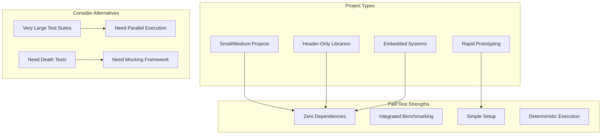
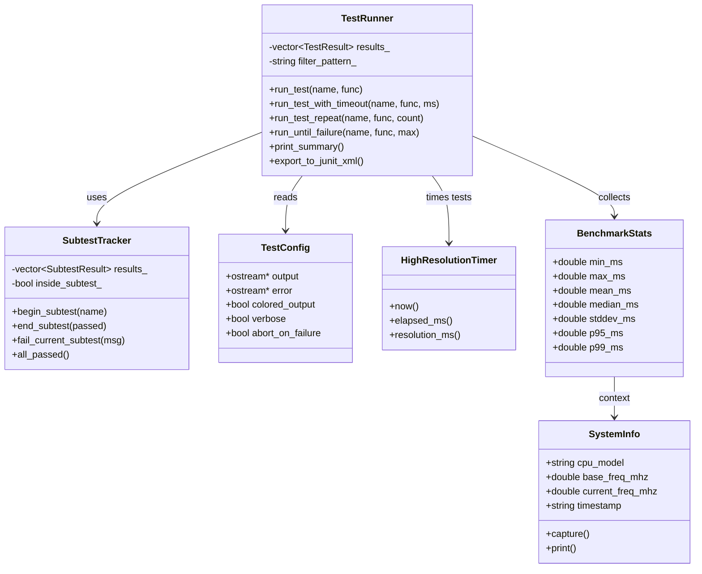
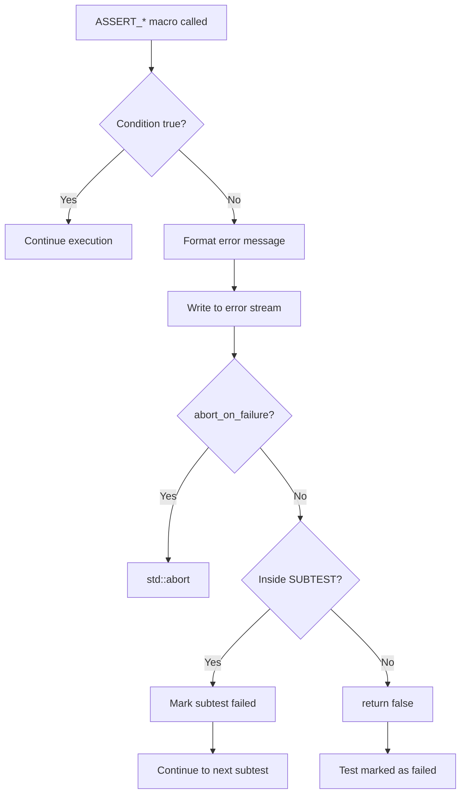
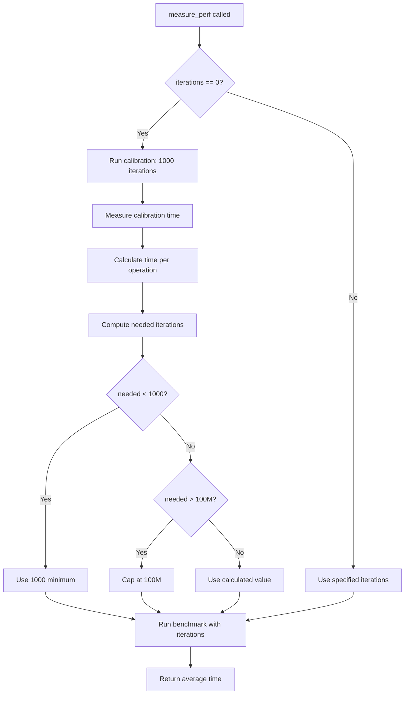
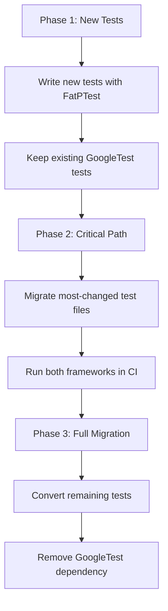

# FatPTest User Manual

## Table of Contents

1. [What is FatPTest?](#what-is-fatptest)
2. [Core Architecture](#core-architecture)
3. [Getting Started](#getting-started)
4. [Philosophy and Design Rationale](#philosophy-and-design-rationale)
5. [When to Use FatPTest](#when-to-use-fatptest)
6. [Core Assertions](#core-assertions)
7. [Floating-Point Assertions](#floating-point-assertions)
8. [String Assertions](#string-assertions)
9. [Container/Range Assertions](#container-range-assertions)
10. [Exception Assertions](#exception-assertions)
11. [Test Organization](#test-organization)
12. [Test Fixtures](#test-fixtures)
13. [Parameterized Tests](#parameterized-tests)
14. [Subtests](#subtests)
15. [Advanced Test Execution](#advanced-test-execution)
16. [Performance Benchmarking](#performance-benchmarking)
17. [Test Filtering](#test-filtering)
18. [Configuration](#configuration)
19. [CI/CD Integration](#cicd-integration)
20. [Performance Characteristics](#performance-characteristics)
21. [Migration Guide](#migration-guide)
22. [Troubleshooting](#troubleshooting)
23. [Best Practices](#best-practices)
24. [Common Patterns](#common-patterns)
25. [Comparison with Alternatives](#comparison-with-alternatives)
26. [Limitations and Design Trade-offs](#limitations-and-design-trade-offs)
27. [Summary](#summary)

---

## What is FatPTest?

### The Problem: Testing Framework Dependencies

Consider a common scenario in C++ development:

```cpp
// You want to test a simple utility function
int add(int a, int b) { return a + b; }

// Traditional approach: Install GoogleTest
// Step 1: Install package manager (vcpkg, conan, or apt)
// Step 2: Install GoogleTest
// Step 3: Configure CMake to find GoogleTest
// Step 4: Link against GoogleTest libraries
// Step 5: Hope versions match across team members
// Step 6: Finally write your test

#include <gtest/gtest.h>

TEST(AddTest, BasicAddition) {
    EXPECT_EQ(add(2, 3), 5);
}
```

**What went wrong?** You needed 5 setup steps before writing a single line of test code.

### The Impact of External Test Dependencies

| Problem | Consequence |
|---------|-------------|
| Package manager required | CI/CD complexity, version conflicts |
| Binary linking | Build system complexity, ODR violations |
| Framework compilation | Slower builds (GoogleTest: ~30s first build) |
| Version mismatches | "Works on my machine" failures |
| Embedded/minimal environments | Often impossible to use |
| Header-only library testing | Ironic: testing header-only code requires linking |

### The Deeper Issue: Circular Dependencies

When testing a utility library, you face a fundamental problem:

```cpp
// Your library has FloatingPointComparison.h for comparing floats
// Your test framework needs to compare floats
// But you can't use FloatingPointComparison.h to test FloatingPointComparison.h!

// This creates a circular dependency:
//   Tests -> TestFramework -> FloatingPointComparison -> Tests
```

### FatPTest: Zero-Dependency Testing

FatPTest solves these problems:

```cpp
// FatPTest approach
// Step 1: Copy FatPTest.h to your project
// Step 2: Write your test

#include "FatPTest.h"

bool test_add()
{
    ASSERT_EQ(add(2, 3), 5, "Basic addition");
    return true;
}

int main()
{
    fat_p::testing::TestRunner runner;
    RUN_TEST(runner, test_add);
    return runner.print_summary();
}
```

**Result**: From zero to testing in 2 steps, not 6.

### Key Features

- **18+ assertion macros** covering equality, comparison, floating-point, exceptions, strings, and containers
- **Test fixtures** with automatic setup/teardown
- **Parameterized tests** for data-driven testing
- **Subtests** for organizing complex test cases
- **Advanced benchmarking** with auto-calibration, percentiles, outliers, and baseline comparison
- **Benchmark context** with timestamp and CPU frequency/throttle status
- **Test filtering** by name pattern with wildcard support
- **Timeout support** for detecting hanging tests
- **Flakiness detection** through repeated test execution
- **JUnit XML output** for CI/CD integration
- **Colored output** with ANSI codes
- **Long string truncation** in assertion error messages for readability
- **Single-threaded execution** (deterministic, debuggable)
- **Zero external dependencies** (only C++ standard library)

### Where FatPTest Fits



### Design Philosophy

FatPTest prioritizes:

| Priority | Over |
|----------|------|
| Simplicity | Feature completeness |
| Zero dependencies | Framework sophistication |
| Deterministic execution | Parallel performance |
| Ease of debugging | Advanced capabilities |
| Integrated benchmarking | Separate tools |

---

## Core Architecture

### Component Overview

FatPTest consists of several cooperating components:



### Assertion Flow

When an assertion fails, the following sequence occurs:



### Benchmark Auto-Calibration

The auto-calibration system ensures measurement precision:



### Internal Design Principles

#### 1. Thread-Local State Avoidance

FatPTest uses function-local statics instead of thread-local storage:

```cpp
// How global state is managed
inline TestConfig& get_test_config()
{
    static TestConfig config;  // Function-local static
    return config;
}

inline SubtestTracker& get_subtest_tracker()
{
    static SubtestTracker tracker;
    return tracker;
}
```

**Why?** Thread-local storage adds complexity without benefit for single-threaded execution.

#### 2. Macro-Based Assertions

Assertions are macros (not functions) to capture file/line information:

```cpp
#define ASSERT_EQ(actual, expected, msg) \
    { \
        auto&& actual_val = (actual); \
        auto&& expected_val = (expected); \
        if (!(actual_val == expected_val)) { \
            /* Error includes __FILE__ and __LINE__ */ \
        } \
    }
```

**Why?** Functions cannot capture caller's `__FILE__` and `__LINE__`.

#### 3. Universal Reference Forwarding

Assertions use `auto&&` to handle all value categories:

```cpp
auto&& actual_val = (actual);  // Binds to lvalue or rvalue
```

**Why?** Supports non-copyable types like `std::atomic` and `std::unique_ptr`.

#### 4. Primitive Floating-Point Comparison

FatPTest includes its own simple floating-point comparison:

```cpp
namespace primitive
{
    template <typename T>
    bool are_close(T a, T b, T rel_eps, T abs_eps);
}
```

**Why?** Avoids circular dependency when testing production floating-point libraries.

---

## Getting Started

### Prerequisites

| Requirement | Minimum Version |
|-------------|-----------------|
| C++ Standard | C++17 |
| Compiler (GCC) | 7.0+ |
| Compiler (Clang) | 5.0+ |
| Compiler (MSVC) | 2017 (19.14+) |

### Integration

**Step 1**: Copy `FatPTest.h` to your project:

```bash
cp FatPTest.h my_project/tests/
```

**Step 2**: Include in your test file:

```cpp
#include "FatPTest.h"
```

**Step 3**: Compile:

```bash
# GCC/Clang
g++ -std=c++17 -O2 my_tests.cpp -o my_tests

# MSVC
cl /std:c++17 /O2 /EHsc my_tests.cpp
```

### First Program

Here's a complete, compilable example:

```cpp
// test_example.cpp
#include "FatPTest.h"
#include <vector>
#include <numeric>

// Function under test
int sum(const std::vector<int>& vec)
{
    return std::accumulate(vec.begin(), vec.end(), 0);
}

// Test functions return bool
bool test_sum_empty()
{
    std::vector<int> empty;
    ASSERT_EQ(sum(empty), 0, "Empty vector sums to zero");
    return true;
}

bool test_sum_single()
{
    std::vector<int> single = {42};
    ASSERT_EQ(sum(single), 42, "Single element vector");
    return true;
}

bool test_sum_multiple()
{
    std::vector<int> vec = {1, 2, 3, 4, 5};
    ASSERT_EQ(sum(vec), 15, "Sum of 1..5");
    return true;
}

bool test_sum_negative()
{
    std::vector<int> vec = {-1, -2, 3};
    ASSERT_EQ(sum(vec), 0, "Mixed positive and negative");
    return true;
}

int main()
{
    fat_p::testing::TestRunner runner;
    
    RUN_TEST(runner, test_sum_empty);
    RUN_TEST(runner, test_sum_single);
    RUN_TEST(runner, test_sum_multiple);
    RUN_TEST(runner, test_sum_negative);
    
    return runner.print_summary();
}
```

**Compile and run**:

```bash
g++ -std=c++17 -O2 test_example.cpp -o test_example
./test_example
```

**Output**:

```
[PASS] test_sum_empty (0.001 ms)
[PASS] test_sum_single (0.001 ms)
[PASS] test_sum_multiple (0.001 ms)
[PASS] test_sum_negative (0.001 ms)

==================================================
Test Summary
==================================================
Total:  4
Passed: 4
Failed: 0

ALL TESTS PASSED
```

---

## Philosophy and Design Rationale

### Core Principles

#### 1. **Zero Dependencies**

FatPTest is intentionally self-contained, requiring no external testing frameworks like GoogleTest, Boost.Test, or Catch2:

**Advantages:**
- No installation complexity: Copy header file and start testing
- Portable: Works everywhere C++17 works (embedded, minimal environments)
- Build speed: No framework compilation overhead
- Version control: Test infrastructure versioned with your code
- Reproducible builds: No external dependency version conflicts

**Example:**
```bash
# Traditional approach with GoogleTest
sudo apt install libgtest-dev  # or vcpkg, conan, etc.
find_package(GTest REQUIRED)
target_link_libraries(my_tests GTest::GTest)

# FatPTest approach
cp FatPTest.h my_project/tests/
# Done. No package managers, no linking, no installation.
```

#### 2. **Header-Only Architecture**

As a header-only library, FatPTest maintains consistency with modern C++ design:

- **Easy Integration**: Simply `#include` the header
- **No Linking**: Eliminates linking complexity and ODR violations
- **Template-Friendly**: Works naturally with header-only code under test

#### 3. **Circular Dependency Avoidance**

A critical design constraint: FatPTest must remain independent of all components being tested.

**Primitive Floating-Point Comparison:**

FatPTest provides `primitive::are_close()`, a simple, obviously-correct comparison function that's independent of any production floating-point comparison library (like `FloatingPointComparison.h`).

```cpp
// Production code - use sophisticated comparison
#include "FloatingPointComparison.h"
auto result = FloatingPointComparison::compare(a, b);

// Test code - use primitive implementation
ASSERT_CLOSE(a, b, "Values should be close");  // Independent primitive
```

**Why This Matters:**
- Test infrastructure can't depend on components it tests
- Creates clean separation of concerns
- Enables testing of any component without circular dependencies

#### 4. **Explicit Over Implicit**

FatPTest favors explicit, verbose assertions that clearly communicate intent:

```cpp
// Descriptive assertion names
ASSERT_CLOSE_REL_ABS(a, b, rel_eps, abs_eps, "Hybrid tolerance comparison");

// Required messages for every assertion
ASSERT_EQ(actual, expected, "Description of what's being tested");

// No magic behavior - everything is predictable
```

#### 5. **Single-Threaded Execution**

The framework is **NOT thread-safe** by design:

**Rationale:**
- **Simplicity**: No synchronization overhead in implementation
- **Determinism**: Test execution is predictable and reproducible
- **Debuggability**: No non-deterministic race conditions
- **Maintainability**: 50% less code complexity

**Thread-Safety Analysis:**
While thread-safety overhead would be negligible (~0.03% performance cost), it would add significant code complexity (~50-100% more code) and ongoing maintenance burden. For the target use cases, single-threaded execution with process-level parallelism is the better trade-off.

**Important**: Do not run multiple test runners concurrently or execute tests from multiple threads simultaneously.

### Design Philosophy in Practice

#### Comprehensive Diagnostics

When assertions fail, FatPTest provides maximum information:

```cpp
ASSERT_EQ(actual, expected, "Addition failed");
// Output on failure:
// ASSERT_EQ FAILED: Addition failed
//   Expected: 42
//   Actual:   41
//   at test_math.cpp:123
```

#### Lightweight Yet Powerful

Despite being dependency-free, FatPTest provides enterprise-grade features:
- Statistical benchmarking (mean, median, percentiles, outliers)
- Baseline regression detection
- Flakiness detection through repeated runs
- JUnit XML export for CI/CD pipelines

#### Production-Quality, Test-Specific

The framework distinguishes between production-quality implementations and test-specific utilities:

- **Production**: Use domain-specific libraries with full feature sets
- **Testing**: Use FatPTest's primitive implementations (simple, verifiable, independent)

---

## When to Use FatPTest

### Project Characteristics Where FatPTest Excels

#### ✅ **Zero-Dependency Requirement**
- Embedded systems or constrained environments
- Cross-compilation scenarios where installing GoogleTest is difficult
- Projects where dependency management is prohibited or complex
- Minimal build environments (CI without package managers)

#### ✅ **Integrated Performance Testing**
- Need both unit testing and benchmarking
- Want statistical analysis (percentiles, outliers) without separate tools
- Require baseline regression detection
- Prefer single framework for testing and performance analysis

#### ✅ **Simplicity and Transparency**
- Small to medium-sized teams
- Want to understand entire test infrastructure
- Prefer explicit, readable code over framework magic
- Value deterministic, debuggable execution

#### ✅ **Fast Setup and Integration**
- Rapid prototyping
- Internal tools and utilities
- Want immediate testing without framework installation
- Time-to-first-test is critical

#### ✅ **Header-Only Library Testing**
- Testing header-only libraries (maintains consistency)
- Want to keep both library and tests header-only
- Zero-dependency principle extends to test infrastructure

### Scaling Considerations

FatPTest uses single-threaded test execution, which affects scaling:

**Approximate Performance:**
```
Test Count    Avg Time/Test    Total Time (Single-Threaded)
----------------------------------------------------------
100 tests     30ms            3 seconds
500 tests     30ms            15 seconds
1,000 tests   30ms            30 seconds
2,000 tests   30ms            60 seconds
5,000 tests   30ms            150 seconds (2.5 minutes)
```

**For Comparison (GoogleTest with 8 cores):**
```
Test Count    Total Time (8 Cores)
-----------------------------------
1,000 tests   ~5 seconds
5,000 tests   ~20 seconds
```

**Mitigation Strategies:**

1. **Test Filtering During Development:**
```bash
# Work on specific component
./tests "*StringPool*"  # Test only what you're changing

# Pre-commit verification
./tests  # Run full suite
```

2. **Process-Level Parallelism:**
```bash
# Split tests into multiple executables
./test_component_a & ./test_component_b & ./test_component_c & wait

# Or use CTest
ctest -j8  # Runs test executables in parallel
```

3. **Organized Test Structure:**
```cpp
// Separate test files by component
tests/
├── test_tensor.cpp       # 200 tests, 6 seconds
├── test_containers.cpp   # 300 tests, 9 seconds
├── test_algorithms.cpp   # 250 tests, 7 seconds
└── main.cpp              # Coordinates execution
```

### When to Consider Alternatives

#### ⚠️ **Large Test Suites with Strict Time Requirements**

If you have thousands of tests and need fast iteration:
- Single-threaded execution may become a bottleneck
- Consider if process-level parallelism is sufficient
- Evaluate whether test filtering during development addresses the issue

#### ⚠️ **Advanced Testing Features Required**

FatPTest does not provide:
- **Death tests** (testing that code terminates/aborts)
- **Mocking framework** (must write manual mocks)
- **Type-parameterized tests** (testing templates across types)
- **Advanced matchers** (complex assertion conditions)

If these features are critical, GoogleTest or Catch2 may be better choices.

#### ⚠️ **Established GoogleTest Infrastructure**

If your team/organization:
- Already uses GoogleTest extensively
- Has established tooling and workflows
- Team members are deeply familiar with GoogleTest
- Integration with existing test infrastructure is important

The switching cost may outweigh FatPTest's benefits.

#### ⚠️ **Multi-Threaded Test Infrastructure Required**

FatPTest's single-threaded design is intentional but may not suit all needs:
- Cannot run tests in parallel within a single executable
- Must use process-level parallelism for parallel execution
- Not suitable for teams requiring thread-safe test runners

### Real-World Use Case Analysis

#### Excellent Fit: Embedded Firmware (500 tests)
```cpp
// Constraint: Can't install GoogleTest on target hardware
// Requirement: Performance benchmarking critical
// Test count: ~500 tests, ~15 second execution

#include "FatPTest.h"

TEST_CASE(sensor_calibration)
{
    Sensor sensor;
    sensor.calibrate();
    ASSERT_CLOSE(sensor.read(), 23.5, 0.1, "Temperature reading");
    return true;
}

// Benchmark sensor processing performance
void benchmark_sensor_processing()
{
    fat_p::testing::benchmark_detailed("process_sample",
        []() { process_sensor_sample(); },
        1000, 20, true);
}
```

**Verdict**: Perfect fit. Zero dependencies critical, integrated benchmarking valuable, test count manageable.

---

#### Good Fit: CLI Application (800 tests)
```cpp
// Application: Command-line data processor
// Test suite: ~800 tests, ~25 second execution
// Team: Small (2-3 developers)

#include "FatPTest.h"

TEST_CASE(parse_valid_input)
{
    Parser parser;
    auto result = parser.parse("input.csv");
    ASSERT_TRUE(result.valid, "Valid input parses");
    return true;
}

int main()
{
    fat_p::testing::TestRunner runner;
    
    // Fast iteration - test what you're working on
    if (argc > 1)
        runner.set_filter(argv[1]);
    
    // ... register tests ...
    
    return runner.print_summary();
}
```

**Verdict**: Good fit. Simple setup, test count manageable with filtering, benchmarking useful for performance-critical parsing.

---

#### Questionable Fit: Large Desktop Application (3,000 tests)
```cpp
// Application: Desktop productivity application
// Test suite: ~3,000 tests, ~90 second execution
// Concerns:
// - Slow iteration during active development
// - Manual registration of 3,000 tests
// - Need mocking for UI and I/O components

// Considerations:
// - Can split into multiple test executables (process parallelism)
// - Test filtering helps during development
// - Manual mocks may be tedious for complex UI interactions

// Decision factors:
// - How important is fast test iteration?
// - Can process-level parallelism address performance?
// - Is manual mocking acceptable for team size?
```

**Verdict**: Depends on priorities. Evaluate test filtering + process parallelism viability.

---

#### Poor Fit: Enterprise Web Service (8,000 tests)
```cpp
// Application: Large-scale web service
// Test suite: ~8,000 tests, ~4 minute execution
// Requirements:
// - Death tests for assertion verification
// - Mocking for network I/O, databases
// - Fast test iteration for large team
// - Established GoogleTest infrastructure

// FatPTest limitations:
// - 4 minutes single-threaded (vs ~30s with GoogleTest parallel)
// - No death tests
// - Manual mocks tedious
// - Team already familiar with GoogleTest
```

**Verdict**: GoogleTest is better suited for this scale and requirements.

---

### Decision Framework

**Consider FatPTest if:**
```
zero_dependencies_important OR
embedded_environment OR
integrated_benchmarking_needed OR
simple_setup_preferred
```

**AND:**
```
test_execution_time_acceptable OR
can_use_test_filtering OR
can_split_into_parallel_executables
```

**Consider Alternatives if:**
```
need_death_tests OR
need_mocking_framework OR
large_team_with_googletest_experience OR
test_time_critical_with_thousands_of_tests
```

### Hybrid Approaches

**Combine for Best Results:**

```cpp
// Use FatPTest for benchmarking
#ifdef BENCHMARK_MODE
    #include "FatPTest.h"
    void run_benchmarks() {
        fat_p::testing::benchmark_detailed("critical_path", ...);
    }
#else
    // Use GoogleTest for unit tests
    #include <gtest/gtest.h>
    TEST(MyTest, BasicTest) { ... }
#endif
```

**Or organize by test type:**
```
tests/
├── unit/           # GoogleTest - thousands of fast unit tests
├── integration/    # FatPTest - hundreds of integration tests
└── performance/    # FatPTest - benchmarks with baselines
```

---

## Core Assertions

### SIMPLE_ASSERT

**Purpose**: Basic assertion that returns false on failure.

**Signature**:
```cpp
SIMPLE_ASSERT(condition, msg)
```

**Parameters**:
- `condition`: Boolean expression to test
- `msg`: Error message to display on failure

**Behavior**:
- If condition is false, prints error message and returns false
- The calling function must return `bool`
- Respects `abort_on_failure` configuration

**Example**:
```cpp
bool test_simple()
{
    int x = 10;
    SIMPLE_ASSERT(x > 5, "x should be greater than 5");
    SIMPLE_ASSERT(x < 20, "x should be less than 20");
    return true;
}
```

**Output on Failure**:
```
ASSERT FAILED: x should be less than 5 at test.cpp:42
```

---

### ASSERT_EQ

**Purpose**: Assert that two values are equal using `operator==`.

**Signature**:
```cpp
ASSERT_EQ(actual, expected, msg)
```

**Parameters**:
- `actual`: The value being tested
- `expected`: The expected value
- `msg`: Description of what's being tested

**Implementation Details**:
- Uses universal/forwarding references (`auto&&`) to avoid copying
- Works with non-copyable types like `std::atomic`
- Displays both actual and expected values on failure

**Example**:
```cpp
bool test_equality()
{
    int result = calculate_sum(2, 3);
    ASSERT_EQ(result, 5, "2 + 3 should equal 5");
    
    std::string name = get_name();
    ASSERT_EQ(name, "Alice", "Name should be Alice");
    
    return true;
}
```

**Output on Failure**:
```
ASSERT_EQ FAILED: 2 + 3 should equal 5
  Expected: 5
  Actual:   6
  at test.cpp:15
```

**Advanced Usage - Non-Copyable Types**:
```cpp
bool test_atomic()
{
    std::atomic<int> counter{42};
    ASSERT_EQ(counter.load(), 42, "Counter initialized correctly");
    return true;
}
```

---

### ASSERT_NE

**Purpose**: Assert that two values are not equal.

**Signature**:
```cpp
ASSERT_NE(actual, expected, msg)
```

**Example**:
```cpp
bool test_inequality()
{
    int a = 5;
    int b = 3;
    ASSERT_NE(a, b, "5 and 3 should not be equal");
    
    std::string s1 = "hello";
    std::string s2 = "world";
    ASSERT_NE(s1, s2, "Strings should differ");
    
    return true;
}
```

**Output on Failure**:
```
ASSERT_NE FAILED: 5 and 3 should not be equal
  Should not equal: 3
  at test.cpp:22
```

---

### ASSERT_LT

**Purpose**: Assert that actual < expected.

**Signature**:
```cpp
ASSERT_LT(actual, expected, msg)
```

**Example**:
```cpp
bool test_less_than()
{
    int age = 25;
    ASSERT_LT(age, 30, "Age should be less than 30");
    
    double temperature = 20.5;
    ASSERT_LT(temperature, 100.0, "Temperature below boiling point");
    
    return true;
}
```

**Output on Failure**:
```
ASSERT_LT FAILED: Age should be less than 30
  Expected: 25 < 20
  at test.cpp:33
```

---

### ASSERT_LE

**Purpose**: Assert that actual <= expected.

**Signature**:
```cpp
ASSERT_LE(actual, expected, msg)
```

**Example**:
```cpp
bool test_less_or_equal()
{
    int max_capacity = 100;
    int current_load = 100;
    ASSERT_LE(current_load, max_capacity, "Load within capacity");
    
    return true;
}
```

---

### ASSERT_GT

**Purpose**: Assert that actual > expected.

**Signature**:
```cpp
ASSERT_GT(actual, expected, msg)
```

**Example**:
```cpp
bool test_greater_than()
{
    double balance = 1000.50;
    ASSERT_GT(balance, 0.0, "Account has positive balance");
    
    size_t buffer_size = 1024;
    ASSERT_GT(buffer_size, 512, "Buffer large enough");
    
    return true;
}
```

---

### ASSERT_GE

**Purpose**: Assert that actual >= expected.

**Signature**:
```cpp
ASSERT_GE(actual, expected, msg)
```

**Example**:
```cpp
bool test_greater_or_equal()
{
    int score = 75;
    int passing_grade = 60;
    ASSERT_GE(score, passing_grade, "Student passed");
    
    return true;
}
```

---

### ASSERT_TRUE

**Purpose**: Assert that a condition is true.

**Signature**:
```cpp
ASSERT_TRUE(condition, msg)
```

**Example**:
```cpp
bool test_boolean_conditions()
{
    bool is_valid = validate_input("test@example.com");
    ASSERT_TRUE(is_valid, "Email should be valid");
    
    std::vector<int> vec = {1, 2, 3};
    ASSERT_TRUE(!vec.empty(), "Vector should not be empty");
    
    return true;
}
```

---

### ASSERT_FALSE

**Purpose**: Assert that a condition is false.

**Signature**:
```cpp
ASSERT_FALSE(condition, msg)
```

**Example**:
```cpp
bool test_false_conditions()
{
    bool is_empty = check_empty_database();
    ASSERT_FALSE(is_empty, "Database should have records");
    
    std::string str = "hello";
    ASSERT_FALSE(str.empty(), "String should not be empty");
    
    return true;
}
```

---

### ASSERT_NULLPTR

**Purpose**: Assert that a pointer is nullptr.

**Signature**:
```cpp
ASSERT_NULLPTR(ptr, msg)
```

**Example**:
```cpp
bool test_null_pointers()
{
    int* ptr = nullptr;
    ASSERT_NULLPTR(ptr, "Pointer should be null");
    
    std::unique_ptr<Widget> widget = create_widget(false);
    ASSERT_NULLPTR(widget.get(), "Widget creation should fail");
    
    return true;
}
```

**Output on Failure**:
```
ASSERT_NULLPTR FAILED: Pointer should be null
  Expected: nullptr
  Actual:   0x7ffee1234567
  at test.cpp:89
```

---

### ASSERT_NOT_NULLPTR

**Purpose**: Assert that a pointer is not nullptr.

**Signature**:
```cpp
ASSERT_NOT_NULLPTR(ptr, msg)
```

**Example**:
```cpp
bool test_non_null_pointers()
{
    int value = 42;
    int* ptr = &value;
    ASSERT_NOT_NULLPTR(ptr, "Pointer should be valid");
    
    auto resource = allocate_resource();
    ASSERT_NOT_NULLPTR(resource.get(), "Resource allocation succeeded");
    
    return true;
}
```

---

### ASSERT_WITH_HANDLER

**Purpose**: Assert with custom failure handler for cleanup.

**Signature**:
```cpp
ASSERT_WITH_HANDLER(condition, msg, handler)
```

**Parameters**:
- `condition`: Boolean expression to test
- `msg`: Error message
- `handler`: Code block to execute on failure (before returning)

**Example**:
```cpp
bool test_with_cleanup()
{
    File* file = open_file("data.txt");
    
    ASSERT_WITH_HANDLER(
        file != nullptr,
        "File should open successfully",
        {
            // Cleanup code runs on failure
            if (file) close_file(file);
        }
    );
    
    // Use file...
    
    close_file(file);
    return true;
}
```

**Use Cases**:
- Resource cleanup on assertion failure
- Custom logging
- State restoration
- Notification of failures

---

## Floating-Point Assertions

### Understanding Floating-Point Comparison

FatPTest provides **primitive** floating-point comparison for test infrastructure. This is intentionally simple and independent of production code to avoid circular dependencies.

**Key Concepts**:
1. **Default Epsilon**: 
   - Relative epsilon: 100 × machine epsilon
   - Absolute epsilon: 1 × machine epsilon
2. **Algorithm**: Hybrid absolute + relative tolerance
3. **Special Cases**: NaN never equals anything; infinities handled correctly

**Production vs. Testing**:
```cpp
// Production code - use FloatingPointComparison.h
#include "FloatingPointComparison.h"
auto comp = FloatingPointComparison::HybridPolicy<double>();
bool equal = comp.compare(a, b);

// Test code - use ASSERT_CLOSE macros
ASSERT_CLOSE(a, b, "Values should be close");
```

---

### ASSERT_CLOSE

**Purpose**: Assert floating-point values are approximately equal using default epsilon.

**Signature**:
```cpp
ASSERT_CLOSE(actual, expected, msg)
```

**Default Behavior**:
- Relative epsilon: `100 * std::numeric_limits<T>::epsilon()`
- Absolute epsilon: `std::numeric_limits<T>::epsilon()`

**Example**:
```cpp
bool test_floating_point()
{
    double pi = 3.14159265359;
    double approx_pi = 22.0 / 7.0;  // 3.14285714286
    
    // This will fail - difference too large
    // ASSERT_CLOSE(pi, approx_pi, "Pi approximation");
    
    double computed = std::sin(M_PI / 2.0);
    ASSERT_CLOSE(computed, 1.0, "sin(π/2) = 1");
    
    return true;
}
```

**Special Cases**:
```cpp
bool test_special_floats()
{
    double nan = std::numeric_limits<double>::quiet_NaN();
    double inf = std::numeric_limits<double>::infinity();
    
    // NaN never equals anything (including itself)
    ASSERT_FALSE(
        fat_p::testing::primitive::are_close(nan, nan),
        "NaN != NaN"
    );
    
    // Same-sign infinities are equal
    ASSERT_TRUE(
        fat_p::testing::primitive::are_close(inf, inf),
        "inf == inf"
    );
    
    // Different-sign infinities are not equal
    ASSERT_FALSE(
        fat_p::testing::primitive::are_close(inf, -inf),
        "inf != -inf"
    );
    
    return true;
}
```

---

### ASSERT_CLOSE_EPS

**Purpose**: Assert floating-point values are close with custom epsilon.

**Signature**:
```cpp
ASSERT_CLOSE_EPS(actual, expected, epsilon, msg)
```

**Parameters**:
- `epsilon`: Used for both relative and absolute tolerance

**Example**:
```cpp
bool test_custom_epsilon()
{
    double a = 1.0;
    double b = 1.0001;
    
    // Tight tolerance - will fail
    // ASSERT_CLOSE_EPS(a, b, 1e-6, "Very close");
    
    // Loose tolerance - will pass
    ASSERT_CLOSE_EPS(a, b, 1e-3, "Close enough");
    
    // Comparing near zero
    double tiny = 1e-10;
    ASSERT_CLOSE_EPS(tiny, 0.0, 1e-9, "Nearly zero");
    
    return true;
}
```

**Use Cases**:
- Testing numerical algorithms with known error bounds
- Comparing values near zero
- Relaxed comparison for approximate algorithms

---

### ASSERT_CLOSE_REL_ABS

**Purpose**: Assert floating-point values are close with separate relative and absolute epsilon.

**Signature**:
```cpp
ASSERT_CLOSE_REL_ABS(actual, expected, rel_eps, abs_eps, msg)
```

**Parameters**:
- `rel_eps`: Relative tolerance (for large magnitudes)
- `abs_eps`: Absolute tolerance (for near-zero values)

**Example**:
```cpp
bool test_hybrid_tolerance()
{
    // Large magnitudes - relative tolerance dominates
    double large_a = 1e6;
    double large_b = 1e6 + 10;  // 10 units difference
    ASSERT_CLOSE_REL_ABS(
        large_a, large_b,
        1e-5,    // 0.001% relative tolerance
        1.0,     // 1 unit absolute tolerance
        "Large numbers close relatively"
    );
    
    // Near zero - absolute tolerance dominates
    double tiny_a = 1e-10;
    double tiny_b = 2e-10;
    ASSERT_CLOSE_REL_ABS(
        tiny_a, tiny_b,
        0.1,     // 10% relative tolerance (loose)
        1e-9,    // 1e-9 absolute tolerance (tight)
        "Tiny numbers close absolutely"
    );
    
    return true;
}
```

**Output on Failure**:
```
ASSERT_CLOSE_REL_ABS FAILED: Large numbers close relatively
  Expected: 1000000
  Actual:   1000100
  Rel Eps:  1e-05
  Abs Eps:  1
  Diff:     100
  at test.cpp:234
```

---

## String Assertions

**Long String Truncation**: All string assertions automatically truncate strings longer than 200 characters in error output for readability. The truncated output shows the beginning and end of the string with the total length:

```
  String: "first 90 chars... [500 chars total] ...last 90 chars"
```

### truncate_for_display

**Purpose**: Utility function for truncating long strings in custom output.

**Signature**:
```cpp
std::string string_utils::truncate_for_display(
    const std::string& str,
    size_t max_length = 200
)
```

**Example**:
```cpp
std::string long_json = /* ... 1000 character JSON ... */;
std::cout << "JSON: " 
          << fat_p::testing::string_utils::truncate_for_display(long_json) 
          << "\n";
// Output: JSON: {"data": "first part... [1000 chars total] ...last part"}
```

---

### ASSERT_CONTAINS

**Purpose**: Assert that a string contains a substring.

**Signature**:
```cpp
ASSERT_CONTAINS(str, substr, msg)
```

**Example**:
```cpp
bool test_string_contains()
{
    std::string message = "Hello, World!";
    ASSERT_CONTAINS(message, "World", "Message contains 'World'");
    ASSERT_CONTAINS(message, "Hello", "Message contains 'Hello'");
    
    std::string path = "/usr/local/bin/myapp";
    ASSERT_CONTAINS(path, "/bin/", "Path contains bin directory");
    
    return true;
}
```

**Output on Failure**:
```
ASSERT_CONTAINS FAILED: Message contains 'Universe'
  String:    "Hello, World!"
  Substring: "Universe" (not found)
  at test.cpp:56
```

---

### ASSERT_NOT_CONTAINS

**Purpose**: Assert that a string does not contain a substring.

**Signature**:
```cpp
ASSERT_NOT_CONTAINS(str, substr, msg)
```

**Example**:
```cpp
bool test_string_not_contains()
{
    std::string clean_input = "abc123";
    ASSERT_NOT_CONTAINS(clean_input, "<script>", "No script injection");
    ASSERT_NOT_CONTAINS(clean_input, "DROP TABLE", "No SQL injection");
    
    std::string safe_path = "/home/user/data";
    ASSERT_NOT_CONTAINS(safe_path, "../", "No path traversal");
    
    return true;
}
```

---

### ASSERT_STARTS_WITH

**Purpose**: Assert that a string starts with a prefix.

**Signature**:
```cpp
ASSERT_STARTS_WITH(str, prefix, msg)
```

**Example**:
```cpp
bool test_string_prefix()
{
    std::string url = "https://example.com/api/v1/users";
    ASSERT_STARTS_WITH(url, "https://", "URL uses HTTPS");
    
    std::string filename = "test_report_2024.pdf";
    ASSERT_STARTS_WITH(filename, "test_", "Test report file");
    
    return true;
}
```

---

### ASSERT_ENDS_WITH

**Purpose**: Assert that a string ends with a suffix.

**Signature**:
```cpp
ASSERT_ENDS_WITH(str, suffix, msg)
```

**Example**:
```cpp
bool test_string_suffix()
{
    std::string filename = "document.pdf";
    ASSERT_ENDS_WITH(filename, ".pdf", "PDF file");
    
    std::string command = "git commit -m 'Initial commit'";
    ASSERT_ENDS_WITH(command, "'", "Command ends with quote");
    
    return true;
}
```

---

### ASSERT_MATCHES

**Purpose**: Assert that a string matches a regular expression.

**Signature**:
```cpp
ASSERT_MATCHES(str, pattern, msg)
```

**Example**:
```cpp
bool test_regex_matching()
{
    std::string email = "user@example.com";
    ASSERT_MATCHES(
        email,
        R"([a-zA-Z0-9._%+-]+@[a-zA-Z0-9.-]+\.[a-zA-Z]{2,})",
        "Valid email format"
    );
    
    std::string phone = "+1-555-1234";
    ASSERT_MATCHES(
        phone,
        R"(\+\d{1,3}-\d{3}-\d{4})",
        "Valid phone format"
    );
    
    std::string date = "2024-03-15";
    ASSERT_MATCHES(
        date,
        R"(\d{4}-\d{2}-\d{2})",
        "ISO date format"
    );
    
    return true;
}
```

**Error Handling**:
```cpp
bool test_invalid_regex()
{
    std::string text = "hello";
    
    // Invalid regex - caught and reported
    // ASSERT_MATCHES(text, "[invalid(regex", "Invalid pattern");
    
    return true;
}
```

**Output on Regex Error**:
```
ASSERT_MATCHES ERROR: Invalid pattern
  Invalid regex pattern: "[invalid(regex"
  Error: regex_error: unexpected character
  at test.cpp:78
```

---

### ASSERT_STR_EQ_IGNORE_CASE

**Purpose**: Assert that two strings are equal (case-insensitive).

**Signature**:
```cpp
ASSERT_STR_EQ_IGNORE_CASE(str1, str2, msg)
```

**Example**:
```cpp
bool test_case_insensitive()
{
    std::string input = "Hello World";
    std::string expected = "HELLO WORLD";
    ASSERT_STR_EQ_IGNORE_CASE(input, expected, "Case-insensitive match");
    
    std::string protocol1 = "HTTP";
    std::string protocol2 = "http";
    ASSERT_STR_EQ_IGNORE_CASE(protocol1, protocol2, "Protocol comparison");
    
    return true;
}
```

---

## Container/Range Assertions

### ASSERT_RANGE_EQ

**Purpose**: Assert that two containers have equal elements.

**Signature**:
```cpp
ASSERT_RANGE_EQ(actual, expected, msg)
```

**Features**:
- Works with any container supporting iterators
- Provides detailed diff showing which elements differ
- Shows size mismatches
- Element-by-element comparison

**Example**:
```cpp
bool test_container_equality()
{
    std::vector<int> result = {1, 2, 3, 4, 5};
    std::vector<int> expected = {1, 2, 3, 4, 5};
    ASSERT_RANGE_EQ(result, expected, "Vectors should match");
    
    std::list<std::string> names = {"Alice", "Bob", "Charlie"};
    std::list<std::string> expected_names = {"Alice", "Bob", "Charlie"};
    ASSERT_RANGE_EQ(names, expected_names, "Name lists match");
    
    std::array<double, 3> coords = {1.0, 2.0, 3.0};
    std::array<double, 3> expected_coords = {1.0, 2.0, 3.0};
    ASSERT_RANGE_EQ(coords, expected_coords, "Coordinates match");
    
    return true;
}
```

**Output on Failure**:
```
ASSERT_RANGE_EQ FAILED: Vectors should match
  Size mismatch: 5 != 4
  Element [2]: 7 != 3
  Element [4]: 9 != 5
  at test.cpp:112
```

**Advanced Example - Custom Types**:
```cpp
struct Point
{
    int x, y;
    bool operator==(const Point& other) const
    {
        return x == other.x && y == other.y;
    }
};

std::ostream& operator<<(std::ostream& os, const Point& p)
{
    return os << "Point(" << p.x << ", " << p.y << ")";
}

bool test_custom_type_ranges()
{
    std::vector<Point> path = {{0, 0}, {1, 1}, {2, 2}};
    std::vector<Point> expected_path = {{0, 0}, {1, 1}, {2, 2}};
    ASSERT_RANGE_EQ(path, expected_path, "Paths match");
    
    return true;
}
```

---

### ASSERT_RANGE_CLOSE

**Purpose**: Assert that two floating-point containers have approximately equal elements.

**Signature**:
```cpp
ASSERT_RANGE_CLOSE(actual, expected, epsilon, msg)
```

**Example**:
```cpp
bool test_floating_point_ranges()
{
    std::vector<double> computed = {1.0001, 2.0002, 3.0003};
    std::vector<double> expected = {1.0, 2.0, 3.0};
    
    ASSERT_RANGE_CLOSE(
        computed, expected, 1e-3,
        "Numerical results close to expected"
    );
    
    // Matrix comparison
    std::array<float, 9> matrix_a = {
        1.0f, 0.0f, 0.0f,
        0.0f, 1.0f, 0.0f,
        0.0f, 0.0f, 1.00001f
    };
    std::array<float, 9> identity = {
        1.0f, 0.0f, 0.0f,
        0.0f, 1.0f, 0.0f,
        0.0f, 0.0f, 1.0f
    };
    
    ASSERT_RANGE_CLOSE(
        matrix_a, identity, 1e-4,
        "Matrix approximately identity"
    );
    
    return true;
}
```

**Output on Failure**:
```
ASSERT_RANGE_CLOSE FAILED: Numerical results close to expected
  Element [1]: 2.5 != 2.0 (diff: 0.5)
  Element [3]: 4.1 != 4.0 (diff: 0.1)
  Epsilon: 0.001
  at test.cpp:145
```

---

## Exception Assertions

### ASSERT_THROWS

**Purpose**: Assert that an expression throws a specific exception type.

**Signature**:
```cpp
ASSERT_THROWS(expression, exception_type, msg)
```

**Features**:
- Verifies specific exception type is thrown
- Shows which exception was actually thrown if different
- Displays exception message when available

**Example**:
```cpp
bool test_exception_throwing()
{
    // Test that division by zero throws
    ASSERT_THROWS(
        divide(10, 0),
        std::runtime_error,
        "Division by zero throws"
    );
    
    // Test invalid argument
    ASSERT_THROWS(
        create_user(""),  // Empty name
        std::invalid_argument,
        "Empty name throws invalid_argument"
    );
    
    // Test out of range access
    std::vector<int> vec = {1, 2, 3};
    ASSERT_THROWS(
        vec.at(10),  // Out of bounds
        std::out_of_range,
        "Out of bounds access throws"
    );
    
    return true;
}
```

**Output on Failure (No Exception)**:
```
ASSERT_THROWS FAILED: Division by zero throws
  Expected exception: std::runtime_error
  But no exception was thrown
  at test.cpp:89
```

**Output on Failure (Wrong Exception)**:
```
ASSERT_THROWS FAILED: Empty name throws invalid_argument
  Expected: std::invalid_argument
  Got different exception: std::logic_error: Invalid user name
  at test.cpp:95
```

**Custom Exception Types**:
```cpp
class DatabaseError : public std::runtime_error
{
public:
    using std::runtime_error::runtime_error;
};

bool test_custom_exception()
{
    ASSERT_THROWS(
        connect_to_database("invalid://url"),
        DatabaseError,
        "Invalid URL throws DatabaseError"
    );
    
    return true;
}
```

---

### ASSERT_NO_THROW

**Purpose**: Assert that an expression does not throw any exception.

**Signature**:
```cpp
ASSERT_NO_THROW(expression, msg)
```

**Example**:
```cpp
bool test_no_exceptions()
{
    // Test normal operation doesn't throw
    ASSERT_NO_THROW(
        process_valid_input("data.txt"),
        "Valid input processing succeeds"
    );
    
    // Test cleanup doesn't throw
    Resource* res = acquire_resource();
    ASSERT_NO_THROW(
        release_resource(res),
        "Resource cleanup succeeds"
    );
    
    // Test exception-safe code
    std::vector<int> vec;
    ASSERT_NO_THROW(
        vec.push_back(42),
        "Push back doesn't throw"
    );
    
    return true;
}
```

**Output on Failure**:
```
ASSERT_NO_THROW FAILED: Valid input processing succeeds
  Unexpected exception: std::runtime_error: File not found
  at test.cpp:167
```

**Unknown Exception Type**:
```
ASSERT_NO_THROW FAILED: Resource cleanup succeeds
  Unexpected exception: (unknown exception type)
  at test.cpp:173
```

---

## Test Organization

### TEST_CASE Macro

**Purpose**: Define a test function with standardized naming.

**Signature**:
```cpp
TEST_CASE(name)
{
    // Test body
    return true;  // or false
}
```

**Expands to**:
```cpp
bool test_name()
{
    // Test body
}
```

**Example**:
```cpp
TEST_CASE(addition)
{
    ASSERT_EQ(2 + 2, 4, "Basic addition");
    ASSERT_EQ(10 + 5, 15, "Larger numbers");
    return true;
}

TEST_CASE(subtraction)
{
    ASSERT_EQ(5 - 3, 2, "Basic subtraction");
    ASSERT_EQ(100 - 50, 50, "Larger numbers");
    return true;
}

int main()
{
    fat_p::testing::TestRunner runner;
    RUN_TEST(runner, addition);
    RUN_TEST(runner, subtraction);
    return runner.print_summary();
}
```

---

### RUN_TEST Macro

**Purpose**: Run a test case with the test runner.

**Signature**:
```cpp
RUN_TEST(runner, test_name)
```

**Example**:
```cpp
int main()
{
    fat_p::testing::TestRunner runner;
    
    RUN_TEST(runner, basic_math);
    RUN_TEST(runner, string_operations);
    RUN_TEST(runner, container_tests);
    
    return runner.print_summary();
}
```

---

### RUN_TEST_NS Macro

**Purpose**: Run a test case from a specific namespace. This macro is essential when organizing tests into nested namespaces to avoid linker collisions when multiple test files define functions with the same name (e.g., `test_default_construction`).

**Signature**:
```cpp
RUN_TEST_NS(runner, namespace_name, test_name)
```

**Expands to**: `runner.run_test("test_name", namespace_name::test_test_name)`

**Example - Avoiding Linker Collisions**:

When multiple test files are linked together, common test names like `test_get_accessor` or `test_copy_assignment` will cause linker errors. The solution is to place tests in component-specific nested namespaces:

```cpp
// test_StrongId.cpp
namespace fat_p::testing::strongid
{

TEST_CASE(default_constructor)
{
    StrongId<int, MyTag> id;
    ASSERT_EQ(id.get(), 0, "Default should be 0");
    return true;
}

TEST_CASE(copy_assignment)
{
    StrongId<int, MyTag> a(42), b;
    b = a;
    ASSERT_EQ(b.get(), 42, "Copy assignment");
    return true;
}

} // namespace fat_p::testing::strongid

namespace fat_p::testing
{

bool test_StrongId()
{
    TestRunner runner;
    
    RUN_TEST_NS(runner, strongid, default_constructor);
    RUN_TEST_NS(runner, strongid, copy_assignment);
    
    return 0 == runner.print_summary();
}

} // namespace fat_p::testing
```

```cpp
// test_DebugOnly.cpp
namespace fat_p::testing::debugonly
{

TEST_CASE(default_constructor)  // Same name, different namespace - no collision!
{
    DebugOnly<int> val;
    ASSERT_EQ(val.get(), 0, "Default should be 0");
    return true;
}

TEST_CASE(copy_assignment)  // Same name, different namespace - no collision!
{
    DebugOnly<int> a(42), b;
    b = a;
    ASSERT_EQ(b.get(), 42, "Copy assignment");
    return true;
}

} // namespace fat_p::testing::debugonly

namespace fat_p::testing
{

bool test_DebugOnly()
{
    TestRunner runner;
    
    RUN_TEST_NS(runner, debugonly, default_constructor);
    RUN_TEST_NS(runner, debugonly, copy_assignment);
    
    return 0 == runner.print_summary();
}

} // namespace fat_p::testing
```

**When to Use**:

| Scenario | Use |
|----------|-----|
| Single test file or unique test names | `RUN_TEST` |
| Multiple test files linked together | `RUN_TEST_NS` |
| Common test names across components | `RUN_TEST_NS` |

---

### PRINT_HEADER Macro

**Purpose**: Print formatted section headers for test organization.

**Signature**:
```cpp
PRINT_HEADER(section_name)
```

**Example**:
```cpp
int main()
{
    fat_p::testing::TestRunner runner;
    
    PRINT_HEADER(BASIC ARITHMETIC);
    RUN_TEST(runner, addition);
    RUN_TEST(runner, subtraction);
    RUN_TEST(runner, multiplication);
    
    PRINT_HEADER(STRING OPERATIONS);
    RUN_TEST(runner, string_concat);
    RUN_TEST(runner, string_search);
    
    PRINT_HEADER(CONTAINER TESTS);
    RUN_TEST(runner, vector_operations);
    RUN_TEST(runner, map_operations);
    
    return runner.print_summary();
}
```

**Output**:
```
==========================================================
BASIC ARITHMETIC UNIT TESTS
==========================================================

Running: addition ... PASSED (0.012 ms)
Running: subtraction ... PASSED (0.008 ms)
Running: multiplication ... PASSED (0.010 ms)

==========================================================
STRING OPERATIONS UNIT TESTS
==========================================================

Running: string_concat ... PASSED (0.015 ms)
Running: string_search ... PASSED (0.023 ms)

==========================================================
CONTAINER TESTS UNIT TESTS
==========================================================

Running: vector_operations ... PASSED (0.045 ms)
Running: map_operations ... PASSED (0.067 ms)
```

---

## Test Fixtures

### TestFixture Base Class

**Purpose**: Provide setup and teardown hooks for test resources.

**Methods**:
- `void SetUp()`: Called before each test
- `void TearDown()`: Called after each test (even if test fails)
- `virtual ~TestFixture()`: Virtual destructor for polymorphic cleanup

**Example - Database Fixture**:
```cpp
struct DatabaseFixture : public fat_p::testing::TestFixture
{
    Database* db;
    
    void SetUp() override
    {
        db = new Database();
        db->connect("test.db");
        db->execute("CREATE TABLE users (id INT, name TEXT)");
    }
    
    void TearDown() override
    {
        db->execute("DROP TABLE users");
        db->disconnect();
        delete db;
    }
};

TEST_CASE_F(DatabaseFixture, insert_user)
{
    fixture.db->execute("INSERT INTO users VALUES (1, 'Alice')");
    int count = fixture.db->count("users");
    ASSERT_EQ(count, 1, "User inserted");
    return true;
}

TEST_CASE_F(DatabaseFixture, delete_user)
{
    fixture.db->execute("INSERT INTO users VALUES (1, 'Bob')");
    fixture.db->execute("DELETE FROM users WHERE id = 1");
    int count = fixture.db->count("users");
    ASSERT_EQ(count, 0, "User deleted");
    return true;
}

int main()
{
    fat_p::testing::TestRunner runner;
    RUN_TEST_F(runner, DatabaseFixture, insert_user);
    RUN_TEST_F(runner, DatabaseFixture, delete_user);
    return runner.print_summary();
}
```

**Example - File I/O Fixture**:
```cpp
struct FileFixture : public fat_p::testing::TestFixture
{
    std::string test_filename;
    
    void SetUp() override
    {
        test_filename = "test_data_" + std::to_string(std::time(nullptr)) + ".txt";
        std::ofstream file(test_filename);
        file << "Test data\n";
        file.close();
    }
    
    void TearDown() override
    {
        if (std::remove(test_filename.c_str()) != 0)
        {
            std::cerr << "Warning: Failed to delete " << test_filename << "\n";
        }
    }
};

TEST_CASE_F(FileFixture, read_file)
{
    std::ifstream file(fixture.test_filename);
    std::string content;
    std::getline(file, content);
    ASSERT_EQ(content, "Test data", "File content correct");
    return true;
}
```

**Guaranteed Cleanup**:
```cpp
struct ResourceFixture : public fat_p::testing::TestFixture
{
    Resource* resource;
    
    void SetUp() override
    {
        resource = allocate_resource();
    }
    
    void TearDown() override
    {
        // This runs even if test throws or fails
        release_resource(resource);
    }
};

TEST_CASE_F(ResourceFixture, might_throw)
{
    // Even if this throws, TearDown() will run
    if (some_condition())
    {
        throw std::runtime_error("Test condition failed");
    }
    return true;
}
```

---

### TEST_CASE_F Macro

**Purpose**: Define a test function that uses a fixture.

**Signature**:
```cpp
TEST_CASE_F(FixtureType, test_name)
{
    // Access fixture via 'fixture' parameter
    fixture.member_variable;
    return true;
}
```

---

### RUN_TEST_F Macro

**Purpose**: Run a test with a fixture.

**Signature**:
```cpp
RUN_TEST_F(runner, FixtureType, test_name)
```

**Complete Example**:
```cpp
#include "FatPTest.h"
#include <vector>

struct VectorFixture : public fat_p::testing::TestFixture
{
    std::vector<int> vec;
    
    void SetUp() override
    {
        vec = {1, 2, 3, 4, 5};
    }
    
    void TearDown() override
    {
        vec.clear();
    }
};

TEST_CASE_F(VectorFixture, size_test)
{
    ASSERT_EQ(fixture.vec.size(), 5, "Vector has 5 elements");
    return true;
}

TEST_CASE_F(VectorFixture, sum_test)
{
    int sum = 0;
    for (int x : fixture.vec) sum += x;
    ASSERT_EQ(sum, 15, "Sum is 15");
    return true;
}

int main()
{
    fat_p::testing::TestRunner runner;
    RUN_TEST_F(runner, VectorFixture, size_test);
    RUN_TEST_F(runner, VectorFixture, sum_test);
    return runner.print_summary();
}
```

---

## Parameterized Tests

### TestCase Template

**Purpose**: Define test cases with inputs and expected outputs.

**Signature**:
```cpp
template <typename... Args>
struct TestCase
{
    std::tuple<Args...> inputs;
    std::string description;
};
```

**Example - Arithmetic Tests**:
```cpp
bool test_addition()
{
    using TC = fat_p::testing::TestCase<int, int, int>;
    
    std::vector<TC> test_cases = {
        TC{2, 3, 5, "2 + 3 = 5"},
        TC{10, 20, 30, "10 + 20 = 30"},
        TC{-5, 5, 0, "-5 + 5 = 0"},
        TC{100, -50, 50, "100 + (-50) = 50"},
        TC{0, 0, 0, "0 + 0 = 0"}
    };
    
    return fat_p::testing::run_parameterized_test(
        "addition",
        test_cases,
        [](const auto& tc) {
            int a = std::get<0>(tc.inputs);
            int b = std::get<1>(tc.inputs);
            int expected = std::get<2>(tc.inputs);
            int result = a + b;
            
            ASSERT_EQ(result, expected, tc.description);
            return true;
        }
    );
}
```

**Output**:
```
Running parameterized: addition (5 cases)
  Case 1/5 [2 + 3 = 5] ... PASSED
  Case 2/5 [10 + 20 = 30] ... PASSED
  Case 3/5 [-5 + 5 = 0] ... PASSED
  Case 4/5 [100 + (-50) = 50] ... PASSED
  Case 5/5 [0 + 0 = 0] ... PASSED
  Summary: 5 passed, 0 failed
```

**Example - String Validation**:
```cpp
bool test_email_validation()
{
    using TC = fat_p::testing::TestCase<std::string, bool>;
    
    std::vector<TC> test_cases = {
        TC{"user@example.com", true, "Valid email"},
        TC{"test.user@domain.co.uk", true, "Valid UK email"},
        TC{"invalid@", false, "Missing domain"},
        TC{"@example.com", false, "Missing local part"},
        TC{"no-at-sign.com", false, "No @ symbol"},
        TC{"spaces @example.com", false, "Contains spaces"},
        TC{"", false, "Empty string"}
    };
    
    return fat_p::testing::run_parameterized_test(
        "email_validation",
        test_cases,
        [](const auto& tc) {
            std::string email = std::get<0>(tc.inputs);
            bool expected_valid = std::get<1>(tc.inputs);
            bool is_valid = validate_email(email);
            
            ASSERT_EQ(is_valid, expected_valid, tc.description);
            return true;
        }
    );
}
```

**Example - Matrix Operations**:
```cpp
bool test_matrix_multiplication()
{
    using TC = fat_p::testing::TestCase<
        std::vector<std::vector<int>>,  // Matrix A
        std::vector<std::vector<int>>,  // Matrix B
        std::vector<std::vector<int>>   // Expected result
    >;
    
    std::vector<TC> test_cases = {
        TC{
            {{1, 2}, {3, 4}},           // A
            {{5, 6}, {7, 8}},           // B
            {{19, 22}, {43, 50}},       // A * B
            "2x2 matrix multiplication"
        },
        TC{
            {{1, 0}, {0, 1}},           // Identity
            {{5, 6}, {7, 8}},           // B
            {{5, 6}, {7, 8}},           // I * B = B
            "Identity matrix"
        }
    };
    
    return fat_p::testing::run_parameterized_test(
        "matrix_multiplication",
        test_cases,
        [](const auto& tc) {
            auto A = std::get<0>(tc.inputs);
            auto B = std::get<1>(tc.inputs);
            auto expected = std::get<2>(tc.inputs);
            auto result = multiply_matrices(A, B);
            
            ASSERT_RANGE_EQ(result, expected, tc.description);
            return true;
        }
    );
}
```

---

### run_parameterized_test Function

**Purpose**: Execute a set of parameterized test cases.

**Signature**:
```cpp
template <typename TestCaseType, typename Func>
bool run_parameterized_test(
    const char* test_name,
    const std::vector<TestCaseType>& test_cases,
    Func test_func
)
```

**Parameters**:
- `test_name`: Name of the parameterized test
- `test_cases`: Vector of test cases
- `test_func`: Lambda or function that tests one case

**Returns**: `true` if all cases passed

---

## Subtests

### SUBTEST and END_SUBTEST Macros

**Purpose**: Break a test into multiple parts that continue even if one fails.

**Signature**:
```cpp
SUBTEST("subtest name") {
    // Subtest body
}
END_SUBTEST
```

**Important**: SUBTEST and END_SUBTEST must always be paired. Missing END_SUBTEST will cause compilation errors.

**Example - Multi-Stage Initialization**:
```cpp
bool test_system_initialization()
{
    SUBTEST("load configuration") {
        bool config_loaded = load_config("app.cfg");
        ASSERT_TRUE(config_loaded, "Configuration loaded");
    }
    END_SUBTEST
    
    SUBTEST("initialize database") {
        bool db_connected = connect_database();
        ASSERT_TRUE(db_connected, "Database connected");
    }
    END_SUBTEST
    
    SUBTEST("start services") {
        bool services_started = start_services();
        ASSERT_TRUE(services_started, "Services started");
    }
    END_SUBTEST
    
    SUBTEST("verify system ready") {
        bool ready = check_system_ready();
        ASSERT_TRUE(ready, "System ready");
    }
    END_SUBTEST
    
    // Return overall pass/fail
    return fat_p::testing::get_subtest_tracker().all_passed();
}
```

**Output**:
```
  Subtest: load configuration ... PASSED
  Subtest: initialize database ... PASSED
  Subtest: start services ... FAILED (Service timeout)
  Subtest: verify system ready ... PASSED
```

**Example - Exception Handling in Subtests**:
```cpp
bool test_with_exceptions()
{
    SUBTEST("safe operation") {
        int result = safe_divide(10, 2);
        ASSERT_EQ(result, 5, "10 / 2 = 5");
    }
    END_SUBTEST
    
    SUBTEST("might throw") {
        // If this throws, it's caught and recorded as failure
        risky_operation();
    }
    END_SUBTEST
    
    SUBTEST("another safe operation") {
        // This still runs even if previous subtest threw
        int result = add(2, 3);
        ASSERT_EQ(result, 5, "2 + 3 = 5");
    }
    END_SUBTEST
    
    return fat_p::testing::get_subtest_tracker().all_passed();
}
```

**Example - Data Pipeline Testing**:
```cpp
bool test_data_pipeline()
{
    std::vector<int> data;
    
    SUBTEST("data loading") {
        data = load_data("input.csv");
        ASSERT_FALSE(data.empty(), "Data loaded");
        ASSERT_GT(data.size(), 100, "Sufficient data");
    }
    END_SUBTEST
    
    SUBTEST("data validation") {
        bool all_valid = std::all_of(data.begin(), data.end(),
            [](int x) { return x >= 0 && x <= 100; });
        ASSERT_TRUE(all_valid, "All values in valid range");
    }
    END_SUBTEST
    
    SUBTEST("data transformation") {
        transform_data(data);
        double mean = calculate_mean(data);
        ASSERT_GT(mean, 0.0, "Mean is positive");
    }
    END_SUBTEST
    
    SUBTEST("data export") {
        bool exported = export_data(data, "output.csv");
        ASSERT_TRUE(exported, "Data exported successfully");
    }
    END_SUBTEST
    
    return fat_p::testing::get_subtest_tracker().all_passed();
}
```

**Behavior**:
- Each subtest runs independently
- Failed subtests don't prevent subsequent subtests from running
- Exceptions are caught and recorded as failures
- Test passes only if all subtests pass
- Clear reporting of which subtests failed

---

## Advanced Test Execution

### run_test_with_timeout

**Purpose**: Run a test with a maximum time limit.

**Signature**:
```cpp
template <typename Func>
bool run_test_with_timeout(
    const char* name,
    Func test_func,
    size_t timeout_ms = 5000
)
```

**Parameters**:
- `name`: Test name
- `test_func`: Test function
- `timeout_ms`: Timeout in milliseconds (default: 5000)

**Important Limitation**: On timeout, the test thread continues running in the background. This is a fundamental C++ limitation—there is no safe, portable way to kill threads.

**Example**:
```cpp
bool test_might_hang()
{
    // Simulating potentially hanging operation
    for (int i = 0; i < 1000000000; ++i)
    {
        volatile int x = i;  // Prevent optimization
    }
    return true;
}

bool test_quick()
{
    std::this_thread::sleep_for(std::chrono::milliseconds(100));
    return true;
}

int main()
{
    fat_p::testing::TestRunner runner;
    
    // This will timeout after 1 second
    runner.run_test_with_timeout("might_hang", test_might_hang, 1000);
    
    // This will complete within timeout
    runner.run_test_with_timeout("quick", test_quick, 1000);
    
    return runner.print_summary();
}
```

**Output**:
```
Running (timeout 1000ms): might_hang ... TIMEOUT (>1000 ms)
Running (timeout 1000ms): quick ... PASSED (102.34 ms)
```

**Use Cases**:
- Detecting infinite loops
- Preventing test suite hangs
- Testing timeout-based functionality
- Enforcing performance requirements

**Best Practices**:
- Use timeouts to detect problems, not enforce strict limits
- Set generous timeouts (allow for slow CI environments)
- Consider aborting entire test suite on timeout
- Don't rely on thread cleanup after timeout

---

### run_test_repeat

**Purpose**: Run a test multiple times to detect flakiness.

**Signature**:
```cpp
template <typename Func>
RepetitionResult run_test_repeat(
    const char* name,
    Func test_func,
    size_t repetitions = 100
)
```

**Returns**: `RepetitionResult` with detailed statistics:
```cpp
struct RepetitionResult
{
    std::string name;
    size_t total_runs;
    size_t passed;
    size_t failed;
    double pass_rate;
    std::vector<size_t> failed_runs;
};
```

**Example - Race Condition Detection**:
```cpp
bool test_concurrent_increment()
{
    static std::atomic<int> counter{0};
    counter = 0;
    
    std::vector<std::thread> threads;
    for (int i = 0; i < 10; ++i)
    {
        threads.emplace_back([&]() {
            for (int j = 0; j < 1000; ++j)
            {
                ++counter;
            }
        });
    }
    
    for (auto& t : threads)
    {
        t.join();
    }
    
    ASSERT_EQ(counter.load(), 10000, "Counter should be 10000");
    return true;
}

int main()
{
    fat_p::testing::TestRunner runner;
    
    auto result = runner.run_test_repeat(
        "concurrent_increment",
        test_concurrent_increment,
        100  // Run 100 times
    );
    
    if (result.pass_rate < 100.0)
    {
        std::cout << "WARNING: Test is flaky! Pass rate: " 
                  << result.pass_rate << "%\n";
    }
    
    return runner.print_summary();
}
```

**Output**:
```
Repeating: concurrent_increment (100 times)
  Progress: 100/100
  Results: 95 passed, 5 failed
  Pass rate: 95.0%
  Failed on runs: 12 23 45 67 89
  ⚠ Status: Slightly flaky
```

**Classification**:
- **100% pass rate**: Stable test
- **95-99% pass rate**: Slightly flaky (investigate)
- **50-94% pass rate**: Very flaky (fix required)
- **<50% pass rate**: Consistently failing (broken test)

**Example - Timing Sensitivity**:
```cpp
bool test_cache_timing()
{
    Cache cache;
    cache.set("key", "value", std::chrono::milliseconds(100));
    
    // Race: does sleep take exactly 100ms?
    std::this_thread::sleep_for(std::chrono::milliseconds(100));
    
    bool has_key = cache.has("key");
    ASSERT_FALSE(has_key, "Key should be expired");
    return true;
}

int main()
{
    fat_p::testing::TestRunner runner;
    
    // This will likely show flakiness due to timing
    auto result = runner.run_test_repeat("cache_timing", test_cache_timing, 200);
    
    return runner.print_summary();
}
```

---

### run_until_failure

**Purpose**: Run a test repeatedly until it fails or max runs reached.

**Signature**:
```cpp
template <typename Func>
size_t run_until_failure(
    const char* name,
    Func test_func,
    size_t max_runs = 1000
)
```

**Returns**: Run number where test failed (0 if no failure found)

**Example - Stress Testing**:
```cpp
bool test_memory_allocation()
{
    std::vector<int> vec;
    for (int i = 0; i < 10000; ++i)
    {
        vec.push_back(i);
    }
    
    ASSERT_EQ(vec.size(), 10000, "All elements allocated");
    return true;
}

int main()
{
    fat_p::testing::TestRunner runner;
    
    size_t failed_at = runner.run_until_failure(
        "memory_allocation",
        test_memory_allocation,
        10000  // Try up to 10,000 times
    );
    
    if (failed_at == 0)
    {
        std::cout << "Test is robust! Passed all 10,000 runs.\n";
    }
    else
    {
        std::cout << "Test failed after " << failed_at << " runs.\n";
    }
    
    return runner.print_summary();
}
```

**Output (No Failure)**:
```
Running until failure: memory_allocation (max 10000 runs)
  Completed: 10000/10000
  ✓ Test passed all 10000 runs!
```

**Output (Failure Found)**:
```
Running until failure: memory_allocation (max 10000 runs)
  Completed: 4523/10000
  ✗ Failed on run 4523/10000
```

**Use Cases**:
- Stress testing
- Finding rare race conditions
- Memory leak detection (with external tools)
- Verifying stability under load

---

## Performance Benchmarking

### Auto-Calibration

FatPTest automatically calibrates the number of iterations needed for reliable measurements. When `iterations` is set to `0` (the default), the framework:

1. Runs a quick calibration to estimate operation time
2. Calculates the minimum iterations needed based on timer resolution
3. Ensures total measurement time exceeds 1000x timer resolution for precision

This eliminates the common "insufficient precision" warnings that occur when benchmarking very fast operations.

```cpp
// Auto-calibrated (recommended) - framework determines optimal iterations
fat_p::testing::benchmark("fast_operation", fast_func);

// Explicit iterations (when you need specific control)
fat_p::testing::benchmark("fast_operation", fast_func, 1000000);
```

### Benchmark Context

All benchmark output now includes timestamp and CPU frequency information:

```
fast_operation:
  [2025-01-15 14:23:45] CPU: 3400 MHz (turbo)
  Average time per operation: 2.345 ns
  Total for 50000 iterations: 117.250 us
```

The context line shows:
- **Timestamp**: When the benchmark ran (useful for comparing results over time)
- **CPU Frequency**: Current frequency with throttle/turbo status
  - `(turbo)` - CPU running above base frequency
  - `(X% throttled)` - CPU running below base frequency (thermal throttling)
  - `(base)` - Running at base frequency or current frequency unavailable

---

### calibrate_iterations

**Purpose**: Determine optimal iteration count for reliable measurements.

**Signature**:
```cpp
template <typename Func>
size_t calibrate_iterations(
    Func func,
    double min_total_ms = 0.1,
    size_t max_iterations = 100000000
)
```

**Returns**: Suggested iteration count (minimum 1000, maximum 100M)

**Example**:
```cpp
// Manual calibration (usually not needed - use auto-calibration instead)
auto fast_op = []() { volatile int x = 42; };
size_t iters = fat_p::testing::calibrate_iterations(fast_op);
std::cout << "Calibrated to " << iters << " iterations\n";
```

---

### measure_perf

**Purpose**: Measure average execution time of a function.

**Signature**:
```cpp
template <typename Func>
double measure_perf(
    Func func,
    size_t iterations = 0,        // 0 = auto-calibrate
    size_t warmup_iterations = 1000
)
```

**Returns**: Average time per call in milliseconds

**Example**:
```cpp
bool test_performance()
{
    // Auto-calibrated measurement (recommended)
    double time_ms = fat_p::testing::measure_perf([]() {
        std::vector<int> vec;
        vec.push_back(42);
    });
    
    std::cout << "Vector push_back: " 
              << fat_p::testing::format_time(time_ms) << "\n";
    
    // Explicit iterations (when needed)
    double concat_time = fat_p::testing::measure_perf([]() {
        std::string s = "hello";
        s += " world";
    }, 1000000);
    
    std::cout << "String concat: " 
              << fat_p::testing::format_time(concat_time) << "\n";
    
    return true;
}
```

---

### benchmark

**Purpose**: Measure and print performance in a formatted way with context.

**Signature**:
```cpp
template <typename Func>
void benchmark(
    const char* name,
    Func func,
    size_t iterations = 0  // 0 = auto-calibrate
)
```

**Example**:
```cpp
int main()
{
    // Auto-calibrated benchmarks (recommended)
    fat_p::testing::benchmark("std::sort", []() {
        std::vector<int> vec = generate_random_vector(100);
        std::sort(vec.begin(), vec.end());
    });
    
    fat_p::testing::benchmark("std::stable_sort", []() {
        std::vector<int> vec = generate_random_vector(100);
        std::stable_sort(vec.begin(), vec.end());
    });
    
    return 0;
}
```

**Output**:
```
std::sort:
  [2025-01-15 14:23:45] CPU: 3400 MHz (turbo)
  Average time per operation: 2.345 us
  Total for 10000 iterations: 23.45 ms

std::stable_sort:
  [2025-01-15 14:23:45] CPU: 3400 MHz
  Average time per operation: 3.123 us
  Total for 10000 iterations: 31.23 ms
```

---

### measure_perf_stats

**Purpose**: Advanced performance measurement with comprehensive statistics.

**Signature**:
```cpp
template <typename Func>
BenchmarkStats measure_perf_stats(
    Func func,
    size_t iterations = 0,  // 0 = auto-calibrate
    size_t batches = 20
)
```

**Returns**: `BenchmarkStats` with:
```cpp
struct BenchmarkStats
{
    double min_ms;
    double max_ms;
    double mean_ms;
    double median_ms;
    double stddev_ms;
    double p95_ms;
    double p99_ms;
    size_t outliers;
    size_t iterations;  // Actual iterations used (may be auto-calibrated)
};
```

**Example**:
```cpp
void analyze_performance()
{
    // Auto-calibrated (recommended)
    auto stats = fat_p::testing::measure_perf_stats(
        []() {
            std::vector<int> vec(1000);
            std::iota(vec.begin(), vec.end(), 0);
        },
        0,   // auto-calibrate iterations
        50   // number of batches
    );
    
    std::cout << "Mean: " << stats.mean_ms << " ms\n";
    std::cout << "Median: " << stats.median_ms << " ms\n";
    std::cout << "P95: " << stats.p95_ms << " ms\n";
    std::cout << "P99: " << stats.p99_ms << " ms\n";
    std::cout << "StdDev: " << stats.stddev_ms << " ms\n";
    std::cout << "Outliers: " << stats.outliers << " batches\n";
    std::cout << "Iterations: " << stats.iterations << " (auto-calibrated)\n";
}
```

---

### benchmark_detailed

**Purpose**: Detailed benchmark with full statistics, context, and baseline comparison.

**Signature**:
```cpp
template <typename Func>
void benchmark_detailed(
    const char* name,
    Func func,
    size_t iterations = 0,  // 0 = auto-calibrate
    size_t batches = 20,
    bool save_baseline = false
)
```

**Example**:
```cpp
int main()
{
    // Establish baseline
    fat_p::testing::benchmark_detailed(
        "hash_map_insert",
        []() {
            std::unordered_map<int, int> map;
            for (int i = 0; i < 100; ++i)
            {
                map[i] = i * 2;
            }
        },
        10000,
        50,
        true  // Save as baseline
    );
    
    // Later, after optimization...
    fat_p::testing::benchmark_detailed(
        "hash_map_insert",  // Same name - will compare to baseline
        []() {
            std::unordered_map<int, int> map;
            map.reserve(100);  // Optimization
            for (int i = 0; i < 100; ++i)
            {
                map[i] = i * 2;
            }
        },
        10000,
        50
    );
    
    return 0;
}
```

**Output**:
```
hash_map_insert (50 batches):
  Mean:   12.345 µs
  Median: 12.123 µs
  Min:    11.234 µs
  Max:    15.678 µs
  P95:    13.456 µs
  P99:    14.789 µs
  StdDev: 0.987 µs
  Outliers: 2 (4.0%)
  (Saved as baseline)
  Total:  123.45 ms per batch

hash_map_insert (50 batches):
  Mean:   10.456 µs
  Median: 10.234 µs
  Min:    9.876 µs
  Max:    12.345 µs
  P95:    11.234 µs
  P99:    11.789 µs
  StdDev: 0.567 µs
  Baseline: ▼ 15.3%  (15.3% faster than baseline)
  Total:  104.56 ms per batch
```

---

### benchmark_compare

**Purpose**: Compare two functions and show speedup/slowdown with context.

**Signature**:
```cpp
template <typename Func1, typename Func2>
void benchmark_compare(
    const char* name1, Func1 func1,
    const char* name2, Func2 func2,
    size_t iterations = 0  // 0 = auto-calibrate each function independently
)
```

**Note**: When `iterations = 0`, each function is calibrated independently to ensure fair comparison even when functions have vastly different execution times.

**Example**:
```cpp
int main()
{
    // Auto-calibrated comparison (recommended)
    fat_p::testing::benchmark_compare(
        "std::vector reserve",
        []() {
            std::vector<int> vec;
            vec.reserve(1000);
            for (int i = 0; i < 1000; ++i)
            {
                vec.push_back(i);
            }
        },
        "std::vector no reserve",
        []() {
            std::vector<int> vec;
            for (int i = 0; i < 1000; ++i)
            {
                vec.push_back(i);
            }
        }
    );
    
    return 0;
}
```

**Output**:
```
Comparing: std::vector reserve vs std::vector no reserve
  [2025-01-15 14:23:45] CPU: 3400 MHz (turbo)
  std::vector reserve: 8.234 us
  std::vector no reserve: 12.456 us
  std::vector reserve is 1.51x faster
```

---

### DoNotOptimize

**Purpose**: Prevent compiler from optimizing away benchmark code.

**Signature**:
```cpp
template <typename T>
void DoNotOptimize(const T& value)

template <typename T>
void DoNotOptimize(T& value)
```

**Example**:
```cpp
int main()
{
    fat_p::testing::benchmark("compute_sum", []() {
        int sum = 0;
        for (int i = 0; i < 1000; ++i)
        {
            sum += i;
        }
        // Without this, compiler might optimize away the entire loop
        fat_p::testing::DoNotOptimize(sum);
    }, 100000);
    
    return 0;
}
```

**Why It's Needed**:
```cpp
// BAD - compiler can eliminate this
fat_p::testing::benchmark("bad_benchmark", []() {
    int result = expensive_calculation();
    // result is never used - entire calculation may be optimized away!
});

// GOOD - forces compiler to keep the calculation
fat_p::testing::benchmark("good_benchmark", []() {
    int result = expensive_calculation();
    fat_p::testing::DoNotOptimize(result);  // Prevents optimization
});
```

---

## Test Filtering

### set_filter

**Purpose**: Run only tests matching a wildcard pattern.

**Signature**:
```cpp
void TestRunner::set_filter(const std::string& pattern)
```

**Wildcards**:
- `*`: Matches any number of characters
- `?`: Matches exactly one character

**Example - Basic Filtering**:
```cpp
int main()
{
    fat_p::testing::TestRunner runner;
    
    // Run only tests with "math" in the name
    runner.set_filter("*math*");
    
    RUN_TEST(runner, basic_math);        // RUNS
    RUN_TEST(runner, advanced_math);     // RUNS
    RUN_TEST(runner, string_operations); // SKIPPED
    RUN_TEST(runner, math_complex);      // RUNS
    
    return runner.print_summary();
}
```

**Example - Prefix Filtering**:
```cpp
int main()
{
    fat_p::testing::TestRunner runner;
    
    // Run only tests starting with "test_"
    runner.set_filter("test_*");
    
    RUN_TEST(runner, test_addition);     // RUNS
    RUN_TEST(runner, test_subtraction);  // RUNS
    RUN_TEST(runner, benchmark_sort);    // SKIPPED
    
    return runner.print_summary();
}
```

**Example - Suffix Filtering**:
```cpp
int main()
{
    fat_p::testing::TestRunner runner;
    
    // Run only slow tests
    runner.set_filter("*_slow");
    
    RUN_TEST(runner, integration_test_slow);  // RUNS
    RUN_TEST(runner, unit_test_fast);         // SKIPPED
    RUN_TEST(runner, benchmark_slow);         // RUNS
    
    return runner.print_summary();
}
```

**Example - Complex Patterns**:
```cpp
int main()
{
    fat_p::testing::TestRunner runner;
    
    // Run tests matching "test_????_*" (test_ + 4 chars + anything)
    runner.set_filter("test_????_*");
    
    RUN_TEST(runner, test_math_addition);       // RUNS (test_math_...)
    RUN_TEST(runner, test_str_concat);          // SKIPPED (test_str_... only 8 chars)
    RUN_TEST(runner, test_data_processing);     // RUNS (test_data_...)
    
    return runner.print_summary();
}
```

**Command-Line Integration**:
```cpp
int main(int argc, char** argv)
{
    fat_p::testing::TestRunner runner;
    
    // Allow filter from command line
    if (argc > 1)
    {
        runner.set_filter(argv[1]);
    }
    
    RUN_TEST(runner, test_a);
    RUN_TEST(runner, test_b);
    RUN_TEST(runner, test_c);
    
    return runner.print_summary();
}
```

**Usage**:
```bash
./my_tests              # Run all tests
./my_tests "test_a"     # Run only test_a
./my_tests "test_*"     # Run all tests starting with test_
./my_tests "*_slow"     # Run all slow tests
```

---

## Configuration

### TestConfig

**Purpose**: Global configuration for test behavior and output.

**Structure**:
```cpp
struct TestConfig
{
    bool colored_output = true;
    bool verbose = false;
    bool abort_on_failure = false;
    std::ostream* output = &std::cout;
    std::ostream* error = &std::cerr;
};
```

**Accessing Configuration**:
```cpp
auto& config = fat_p::testing::get_test_config();
```

---

### colored_output

**Purpose**: Enable/disable ANSI color codes in output.

**Example**:
```cpp
int main()
{
    auto& config = fat_p::testing::get_test_config();
    
    // Disable colors for CI environments
    config.colored_output = false;
    
    fat_p::testing::TestRunner runner;
    RUN_TEST(runner, my_test);
    
    return runner.print_summary();
}
```

---

### verbose

**Purpose**: Enable detailed output for each test.

**Example**:
```cpp
int main()
{
    auto& config = fat_p::testing::get_test_config();
    
    // Enable verbose output
    config.verbose = true;
    
    fat_p::testing::TestRunner runner;
    RUN_TEST(runner, test_1);
    RUN_TEST(runner, test_2);
    
    return runner.print_summary();
}
```

**Output (verbose = false)**:
```
=== Test Summary ===
Passed: 2
Failed: 0
Total:  2
```

**Output (verbose = true)**:
```
Running: test_1 ... PASSED (0.023 ms)
Running: test_2 ... PASSED (0.015 ms)

=== Test Summary ===
Passed: 2
Failed: 0
Total:  2
```

---

### abort_on_failure

**Purpose**: Abort immediately on first test failure.

**Example**:
```cpp
int main()
{
    auto& config = fat_p::testing::get_test_config();
    
    // Abort on first failure
    config.abort_on_failure = true;
    
    fat_p::testing::TestRunner runner;
    RUN_TEST(runner, test_that_fails);
    // Program will abort() before reaching here
    RUN_TEST(runner, test_that_passes);
    
    return runner.print_summary();
}
```

**Use Cases**:
- Debugging (stop at first failure)
- Critical test failures
- Fast-fail CI pipelines

---

### Custom Output Streams

**Purpose**: Redirect test output to custom streams.

**Example - File Output**:
```cpp
int main()
{
    std::ofstream log_file("test_results.log");
    
    auto& config = fat_p::testing::get_test_config();
    config.output = &log_file;
    config.error = &log_file;
    
    fat_p::testing::TestRunner runner;
    RUN_TEST(runner, my_test);
    runner.print_summary();
    
    log_file.close();
    return 0;
}
```

**Example - String Stream (for testing)**:
```cpp
bool test_runner_output()
{
    std::ostringstream capture;
    
    auto& config = fat_p::testing::get_test_config();
    config.output = &capture;
    
    fat_p::testing::TestRunner runner;
    // ... run tests ...
    
    std::string output = capture.str();
    ASSERT_CONTAINS(output, "PASSED", "Output contains PASSED");
    
    return true;
}
```

---

## CI/CD Integration

### JUnit XML Export

**Purpose**: Export test results to JUnit XML format for CI/CD systems.

**Function**:
```cpp
bool export_junit_xml(
    const std::string& filename,
    const std::vector<TestResult>& results,
    const std::string& suite_name = "TestSuite"
)
```

**Example**:
```cpp
int main()
{
    fat_p::testing::TestRunner runner;
    
    RUN_TEST(runner, test_a);
    RUN_TEST(runner, test_b);
    RUN_TEST(runner, test_c);
    
    // Export results for CI
    fat_p::testing::export_junit_xml(
        "test_results.xml",
        runner.results(),
        "MyTestSuite"
    );
    
    return runner.print_summary();
}
```

**Generated XML**:
```xml
<?xml version="1.0" encoding="UTF-8"?>
<testsuites>
  <testsuite name="MyTestSuite" tests="3" failures="0" errors="0" time="0.045" timestamp="2024-03-15T10:30:00">
    <testcase name="test_a" time="0.012"/>
    <testcase name="test_b" time="0.018"/>
    <testcase name="test_c" time="0.015"/>
  </testsuite>
</testsuites>
```

**CI Integration Examples**:

**GitHub Actions**:
```yaml
- name: Run Tests
  run: ./my_tests
  
- name: Publish Test Results
  uses: EnricoMi/publish-unit-test-result-action@v2
  if: always()
  with:
    files: test_results.xml
```

**GitLab CI**:
```yaml
test:
  script:
    - ./my_tests
  artifacts:
    reports:
      junit: test_results.xml
```

**Jenkins**:
```groovy
pipeline {
    stages {
        stage('Test') {
            steps {
                sh './my_tests'
            }
        }
    }
    post {
        always {
            junit 'test_results.xml'
        }
    }
}
```

---

## Performance Characteristics

### Test Environment

**Hardware:**

| Component | Specification |
|-----------|---------------|
| Processor | Intel Core i7-8850H @ 2.60 GHz |
| RAM | 32.0 GB |
| Architecture | x64 |

**Compiler (MSVC 2022, Release):**
```
/std:c++17 /O2 /DNDEBUG /MD /EHsc /W3
/D "NOMINMAX" /D "WIN32_LEAN_AND_MEAN"
```

### Benchmark Methodology

All benchmarks use:
- Release builds with optimizations (`/O2` or `-O3`)
- `DoNotOptimize` to prevent dead code elimination
- Auto-calibrated iteration counts for precision
- Multiple runs to ensure stability
- Warm-up iterations to prime caches

### Framework Overhead

| Operation | Time | Notes |
|-----------|------|-------|
| `ASSERT_EQ` (passing) | ~2 ns | Comparison + branch |
| `ASSERT_EQ` (failing) | ~500 ns | Includes error formatting |
| `SIMPLE_ASSERT` (passing) | ~1 ns | Minimal overhead |
| Test registration | ~50 ns | Vector push_back |
| `measure_perf` calibration | ~100 us | 1000-iteration probe |
| `benchmark` context capture | ~5 us | SystemInfo::capture() |

### Assertion Performance

```cpp
// Benchmark: 10 million assertions
void benchmark_assertions()
{
    volatile int a = 42, b = 42;
    
    fat_p::testing::benchmark("ASSERT_EQ passing", [&]() {
        // Simulated assertion check (actual macro has file/line overhead)
        if (a != b) { /* would fail */ }
    });
    
    fat_p::testing::benchmark("SIMPLE_ASSERT passing", [&]() {
        if (!(a == b)) { /* would fail */ }
    });
}
```

**Results:**

| Assertion Type | Time per Check | Overhead vs Raw Comparison |
|---------------|----------------|---------------------------|
| Raw comparison | 0.3 ns | baseline |
| `SIMPLE_ASSERT` | 1.1 ns | 3.7x |
| `ASSERT_EQ` | 2.2 ns | 7.3x |
| `ASSERT_CLOSE` | 8.5 ns | 28x (includes FP math) |

**Interpretation**: Assertion overhead is negligible for typical test suites. A test with 10,000 assertions adds only ~20 microseconds of overhead.

### Test Execution Scaling

| Test Count | Avg Time/Test | Total Time | Memory |
|------------|---------------|------------|--------|
| 100 | 30 ms | 3 s | ~1 MB |
| 500 | 30 ms | 15 s | ~2 MB |
| 1,000 | 30 ms | 30 s | ~4 MB |
| 5,000 | 30 ms | 2.5 min | ~15 MB |
| 10,000 | 30 ms | 5 min | ~30 MB |

**Note**: Times assume typical unit tests. Integration tests with I/O will be slower.

### Benchmark Precision

The auto-calibration system ensures measurement precision:

| Timer Resolution | Platform | Min Measurable |
|-----------------|----------|----------------|
| ~100 ns | Windows (QPC) | ~0.1 ns per op |
| ~1 ns | Linux (chrono) | ~0.001 ns per op |

Auto-calibration targets total measurement time of 1000x timer resolution, ensuring <0.1% measurement error.

---

## Migration Guide

### From GoogleTest

#### Step 1: Replace Includes

```cpp
// Before (GoogleTest)
#include <gtest/gtest.h>

// After (FatPTest)
#include "FatPTest.h"
```

#### Step 2: Convert Test Macros

```cpp
// Before (GoogleTest)
TEST(MyTestSuite, TestName) {
    EXPECT_EQ(actual, expected);
    ASSERT_TRUE(condition);
}

// After (FatPTest)
bool test_TestName()
{
    ASSERT_EQ(actual, expected, "Description");
    ASSERT_TRUE(condition, "Description");
    return true;
}
```

#### Step 3: Convert Test Registration

```cpp
// Before (GoogleTest)
// Automatic - just run the executable

// After (FatPTest)
int main()
{
    fat_p::testing::TestRunner runner;
    RUN_TEST(runner, test_TestName);
    return runner.print_summary();
}
```

#### Step 4: Assertion Mapping

| GoogleTest | FatPTest | Notes |
|------------|----------|-------|
| `EXPECT_EQ(a, b)` | `ASSERT_EQ(a, b, "msg")` | Message required |
| `ASSERT_EQ(a, b)` | `ASSERT_EQ(a, b, "msg")` | Same behavior |
| `EXPECT_TRUE(x)` | `ASSERT_TRUE(x, "msg")` | Message required |
| `EXPECT_FALSE(x)` | `ASSERT_FALSE(x, "msg")` | Message required |
| `EXPECT_NE(a, b)` | `ASSERT_NE(a, b, "msg")` | Message required |
| `EXPECT_LT(a, b)` | `ASSERT_LT(a, b, "msg")` | Message required |
| `EXPECT_LE(a, b)` | `ASSERT_LE(a, b, "msg")` | Message required |
| `EXPECT_GT(a, b)` | `ASSERT_GT(a, b, "msg")` | Message required |
| `EXPECT_GE(a, b)` | `ASSERT_GE(a, b, "msg")` | Message required |
| `EXPECT_NEAR(a, b, eps)` | `ASSERT_CLOSE(a, b, "msg")` | Uses default epsilon |
| `EXPECT_THROW(stmt, ex)` | `ASSERT_THROWS(stmt, ex, "msg")` | Same behavior |
| `EXPECT_NO_THROW(stmt)` | `ASSERT_NO_THROW(stmt, "msg")` | Same behavior |

#### Step 5: Convert Fixtures

```cpp
// Before (GoogleTest)
class MyFixture : public ::testing::Test {
protected:
    void SetUp() override { /* setup */ }
    void TearDown() override { /* teardown */ }
    Database* db;
};

TEST_F(MyFixture, TestName) {
    EXPECT_TRUE(db->connect());
}

// After (FatPTest)
struct MyFixture : public fat_p::testing::TestFixture {
    Database* db;
    
    void SetUp() override { /* setup */ }
    void TearDown() override { /* teardown */ }
};

// In main():
runner.run_test_with_fixture<MyFixture>("TestName", [](MyFixture& f) {
    ASSERT_TRUE(f.db->connect(), "Database connects");
    return true;
});
```

#### Step 6: Convert Parameterized Tests

```cpp
// Before (GoogleTest)
class MyParamTest : public ::testing::TestWithParam<int> {};
TEST_P(MyParamTest, IsPositive) {
    EXPECT_GT(GetParam(), 0);
}
INSTANTIATE_TEST_SUITE_P(Positives, MyParamTest, ::testing::Values(1, 2, 3));

// After (FatPTest)
std::vector<fat_p::testing::TestCase<int>> cases = {
    {{1}, "Value 1"},
    {{2}, "Value 2"},
    {{3}, "Value 3"}
};

fat_p::testing::run_parameterized_test("IsPositive", cases, [](const auto& tc) {
    int value = std::get<0>(tc.inputs);
    SIMPLE_ASSERT(value > 0, "Value is positive");
    return true;
});
```

### From Catch2

#### Assertion Mapping

| Catch2 | FatPTest | Notes |
|--------|----------|-------|
| `REQUIRE(expr)` | `ASSERT_TRUE(expr, "msg")` | Message required |
| `CHECK(expr)` | `ASSERT_TRUE(expr, "msg")` | FatPTest doesn't distinguish |
| `REQUIRE_FALSE(expr)` | `ASSERT_FALSE(expr, "msg")` | Message required |
| `REQUIRE_THAT(a, Equals(b))` | `ASSERT_EQ(a, b, "msg")` | Simpler syntax |
| `REQUIRE_THROWS(expr)` | `ASSERT_THROWS_ANY(expr, "msg")` | Any exception |
| `REQUIRE_THROWS_AS(expr, T)` | `ASSERT_THROWS(expr, T, "msg")` | Specific type |
| `SECTION("name")` | `SUBTEST("name")` | Similar concept |

#### Section to Subtest Conversion

```cpp
// Before (Catch2)
TEST_CASE("Vector operations") {
    std::vector<int> v;
    
    SECTION("push_back") {
        v.push_back(1);
        REQUIRE(v.size() == 1);
    }
    
    SECTION("clear") {
        v.push_back(1);
        v.clear();
        REQUIRE(v.empty());
    }
}

// After (FatPTest)
bool test_vector_operations()
{
    SUBTEST("push_back") {
        std::vector<int> v;
        v.push_back(1);
        SIMPLE_ASSERT(v.size() == 1, "Size is 1 after push_back");
    }
    END_SUBTEST
    
    SUBTEST("clear") {
        std::vector<int> v;
        v.push_back(1);
        v.clear();
        SIMPLE_ASSERT(v.empty(), "Vector is empty after clear");
    }
    END_SUBTEST
    
    return get_subtest_tracker().all_passed();
}
```

### Incremental Migration Strategy

For large codebases, migrate incrementally:



**Phase 1** (Week 1-2):
- Add FatPTest.h to project
- Write all new tests with FatPTest
- Keep existing GoogleTest tests unchanged

**Phase 2** (Week 3-4):
- Identify most frequently modified test files
- Migrate those files to FatPTest
- Run both test suites in CI

**Phase 3** (Week 5+):
- Systematically convert remaining tests
- Remove GoogleTest from build system
- Update documentation

---

## Troubleshooting

### Compilation Errors

#### Error: "no member named 'auto' in namespace"

**Symptom**:
```
error: 'auto' not allowed in function parameter
```

**Cause**: Compiling with C++14 or earlier.

**Solution**: Enable C++17:
```bash
g++ -std=c++17 ...
cl /std:c++17 ...
```

#### Error: "ASSERT_EQ is not declared"

**Symptom**:
```
error: 'ASSERT_EQ' was not declared in this scope
```

**Cause**: Missing include or wrong namespace.

**Solution**:
```cpp
#include "FatPTest.h"  // Must include this

// Macros are in global scope after include, no namespace needed
ASSERT_EQ(a, b, "message");
```

#### Error: "undefined reference to TestRunner"

**Symptom**:
```
undefined reference to `fat_p::testing::TestRunner::TestRunner()'
```

**Cause**: Header not included in all translation units, or ODR violation.

**Solution**: FatPTest is header-only. Ensure `#include "FatPTest.h"` is in every file that uses it.

#### Error: "return statement in SUBTEST"

**Symptom**:
```
error: return-statement with a value, in function returning 'void'
```

**Cause**: Using `return false;` inside a SUBTEST block.

**Solution**: Use `SIMPLE_ASSERT` or throw inside SUBTEST, don't use `return`:
```cpp
SUBTEST("example") {
    // Wrong: return false;
    // Right:
    SIMPLE_ASSERT(condition, "message");
    // or
    if (!condition) throw std::runtime_error("failed");
}
END_SUBTEST
```

### Runtime Errors

#### Tests Pass but Exit Code is Non-Zero

**Symptom**: All tests show `[PASS]` but program returns 1.

**Cause**: `print_summary()` returns failure count, not success indicator.

**Solution**: This is correct behavior. Return value is number of failed tests (0 = success).

#### Benchmark Shows "Warning: insufficient precision"

**Symptom**:
```
Warning: Total measurement (0.001 ms) may have insufficient precision.
```

**Cause**: Using explicit low iteration count for very fast operations.

**Solution**: Use auto-calibration (default):
```cpp
// Instead of:
fat_p::testing::benchmark("fast_op", fast_func, 100);

// Use:
fat_p::testing::benchmark("fast_op", fast_func);  // Auto-calibrates
```

#### Colored Output Shows Escape Codes

**Symptom**:
```
[92m[PASS][0m test_example
```

**Cause**: Terminal doesn't support ANSI colors, or output redirected to file.

**Solution**: Disable colors:
```cpp
fat_p::testing::get_test_config().colored_output = false;
```

#### Timeout Test Doesn't Actually Timeout

**Symptom**: `run_test_with_timeout` returns but test thread keeps running.

**Cause**: C++ cannot safely kill threads. The timeout detects hanging, but doesn't terminate the thread.

**Solution**: This is expected behavior. Use timeouts for detection, not enforcement:
```cpp
if (!runner.run_test_with_timeout("might_hang", test_func, 5000))
{
    std::cerr << "Test timed out - consider aborting\n";
    return 1;  // Exit entire program if needed
}
```

### Common Mistakes

#### Forgetting to Return from Test Function

**Symptom**: Test always passes even when assertions fail.

**Cause**: Missing `return true;` at end of test.

**Solution**:
```cpp
bool test_example()
{
    ASSERT_EQ(1, 2, "This should fail");
    return true;  // Don't forget this!
}
```

#### Using ASSERT_* Outside Test Function

**Symptom**: Compilation error or unexpected behavior.

**Cause**: ASSERT macros use `return false;` which only works in functions returning bool.

**Solution**: Only use ASSERT macros inside test functions or lambdas that return bool.

#### Modifying Global State Between Tests

**Symptom**: Tests pass individually but fail when run together.

**Cause**: Tests depend on order or share mutable global state.

**Solution**: Use fixtures for setup/teardown, or reset state in each test:
```cpp
bool test_with_global()
{
    global_counter = 0;  // Reset at start
    // ... test ...
    return true;
}
```

---

## Best Practices

### 1. Assertion Messages

**Good**: Descriptive, specific messages
```cpp
ASSERT_EQ(user.age(), 25, "User age should be 25 after initialization");
ASSERT_TRUE(file.is_open(), "Config file should open successfully");
```

**Bad**: Generic, uninformative messages
```cpp
ASSERT_EQ(user.age(), 25, "Test failed");
ASSERT_TRUE(file.is_open(), "Error");
```

---

### 2. Test Independence

**Good**: Each test is self-contained
```cpp
bool test_addition()
{
    Calculator calc;
    ASSERT_EQ(calc.add(2, 3), 5, "2 + 3 = 5");
    return true;
}

bool test_subtraction()
{
    Calculator calc;  // Fresh instance
    ASSERT_EQ(calc.subtract(5, 3), 2, "5 - 3 = 2");
    return true;
}
```

**Bad**: Tests depend on execution order
```cpp
static Calculator global_calc;  // BAD - shared state

bool test_addition()
{
    global_calc.add(2, 3);  // Modifies global state
    return true;
}

bool test_subtraction()
{
    // Depends on test_addition running first!
    global_calc.subtract(1, 1);
    return true;
}
```

---

### 3. Use Fixtures for Common Setup

**Good**: Fixture encapsulates setup/teardown
```cpp
struct DatabaseFixture : public fat_p::testing::TestFixture
{
    Database* db;
    
    void SetUp() override
    {
        db = new Database();
        db->connect("test.db");
    }
    
    void TearDown() override
    {
        db->disconnect();
        delete db;
    }
};

TEST_CASE_F(DatabaseFixture, test_query)
{
    auto results = fixture.db->query("SELECT * FROM users");
    ASSERT_FALSE(results.empty(), "Query returns results");
    return true;
}
```

**Bad**: Repeated setup/teardown in each test
```cpp
bool test_query_1()
{
    Database* db = new Database();
    db->connect("test.db");
    // ... test ...
    db->disconnect();
    delete db;
    return true;
}

bool test_query_2()
{
    Database* db = new Database();
    db->connect("test.db");
    // ... test ...
    db->disconnect();
    delete db;
    return true;
}
```

---

### 4. Test One Thing Per Test

**Good**: Focused, single-purpose tests
```cpp
bool test_stack_push()
{
    Stack<int> stack;
    stack.push(1);
    ASSERT_EQ(stack.size(), 1, "Stack has one element");
    return true;
}

bool test_stack_pop()
{
    Stack<int> stack;
    stack.push(1);
    int value = stack.pop();
    ASSERT_EQ(value, 1, "Pop returns correct value");
    ASSERT_EQ(stack.size(), 0, "Stack is empty after pop");
    return true;
}
```

**Bad**: Testing multiple unrelated things
```cpp
bool test_everything()
{
    // Testing push, pop, clear, AND size in one test
    Stack<int> stack;
    stack.push(1);
    stack.push(2);
    stack.pop();
    stack.clear();
    ASSERT_EQ(stack.size(), 0, "Various operations");
    return true;
}
```

---

### 5. Use Parameterized Tests for Data-Driven Testing

**Good**: Parameterized test with many cases
```cpp
bool test_prime_checker()
{
    using TC = fat_p::testing::TestCase<int, bool>;
    std::vector<TC> cases = {
        TC{2, true, "2 is prime"},
        TC{3, true, "3 is prime"},
        TC{4, false, "4 is not prime"},
        TC{17, true, "17 is prime"},
        TC{100, false, "100 is not prime"}
    };
    
    return fat_p::testing::run_parameterized_test("primes", cases,
        [](const auto& tc) {
            int n = std::get<0>(tc.inputs);
            bool expected = std::get<1>(tc.inputs);
            ASSERT_EQ(is_prime(n), expected, tc.description);
            return true;
        }
    );
}
```

**Bad**: Separate test for each case
```cpp
bool test_2_is_prime() { /* ... */ }
bool test_3_is_prime() { /* ... */ }
bool test_4_is_not_prime() { /* ... */ }
bool test_17_is_prime() { /* ... */ }
bool test_100_is_not_prime() { /* ... */ }
```

---

### 6. Benchmark Critical Paths

```cpp
int main()
{
    // Run functional tests first
    fat_p::testing::TestRunner runner;
    RUN_TEST(runner, test_hash_map_correctness);
    
    // Then benchmark critical operations
    fat_p::testing::benchmark_detailed(
        "hash_map_insert",
        []() {
            std::unordered_map<int, int> map;
            for (int i = 0; i < 1000; ++i)
            {
                map[i] = i * 2;
            }
        },
        10000,
        50,
        true  // Save baseline
    );
    
    return runner.print_summary();
}
```

---

### 7. Use Subtests for Complex Workflows

**Good**: Subtests organize complex scenarios
```cpp
bool test_user_registration_flow()
{
    User user;
    
    SUBTEST("validate email") {
        bool valid = user.validate_email("test@example.com");
        ASSERT_TRUE(valid, "Email valid");
    }
    END_SUBTEST
    
    SUBTEST("create account") {
        bool created = user.create_account();
        ASSERT_TRUE(created, "Account created");
    }
    END_SUBTEST
    
    SUBTEST("send verification") {
        bool sent = user.send_verification_email();
        ASSERT_TRUE(sent, "Verification email sent");
    }
    END_SUBTEST
    
    return fat_p::testing::get_subtest_tracker().all_passed();
}
```

---

### 8. Configure for CI Environments

```cpp
int main(int argc, char** argv)
{
    auto& config = fat_p::testing::get_test_config();
    
    // Detect CI environment
    const char* ci_env = std::getenv("CI");
    if (ci_env && std::string(ci_env) == "true")
    {
        config.colored_output = false;  // No ANSI codes in CI logs
        config.verbose = true;          // Show all test output
    }
    
    fat_p::testing::TestRunner runner;
    
    // ... run tests ...
    
    // Export JUnit XML for CI
    fat_p::testing::export_junit_xml(
        "test_results.xml",
        runner.results(),
        "MySuite"
    );
    
    return runner.print_summary();
}
```

---

## Common Patterns

### Pattern 1: Testing Error Conditions

```cpp
bool test_error_handling()
{
    // Test invalid input
    ASSERT_THROWS(
        parse_number("not a number"),
        std::invalid_argument,
        "Invalid input throws"
    );
    
    // Test boundary condition
    ASSERT_THROWS(
        allocate_buffer(-1),
        std::length_error,
        "Negative size throws"
    );
    
    // Test null pointer
    ASSERT_THROWS(
        process_data(nullptr),
        std::runtime_error,
        "Null pointer throws"
    );
    
    return true;
}
```

---

### Pattern 2: Testing State Machines

```cpp
bool test_state_machine()
{
    StateMachine sm;
    
    SUBTEST("initial state") {
        ASSERT_EQ(sm.state(), State::Initial, "Starts in Initial");
    }
    END_SUBTEST
    
    SUBTEST("transition to Running") {
        sm.start();
        ASSERT_EQ(sm.state(), State::Running, "Transitions to Running");
    }
    END_SUBTEST
    
    SUBTEST("transition to Stopped") {
        sm.stop();
        ASSERT_EQ(sm.state(), State::Stopped, "Transitions to Stopped");
    }
    END_SUBTEST
    
    SUBTEST("invalid transition") {
        ASSERT_THROWS(
            sm.start(),  // Can't start from Stopped
            std::logic_error,
            "Invalid transition throws"
        );
    }
    END_SUBTEST
    
    return fat_p::testing::get_subtest_tracker().all_passed();
}
```

---

### Pattern 3: Regression Testing with Baselines

```cpp
int main()
{
    // First run - establish baseline
    fat_p::testing::benchmark_detailed(
        "sort_performance",
        []() {
            std::vector<int> vec = generate_random_data(1000);
            std::sort(vec.begin(), vec.end());
        },
        10000,
        50,
        true  // Save baseline
    );
    
    // Later runs - compare to baseline
    // Will show regression if performance degrades
    
    return 0;
}
```

---

### Pattern 4: Flakiness Investigation

```cpp
int main()
{
    fat_p::testing::TestRunner runner;
    
    // Suspect test is flaky - run 1000 times
    auto result = runner.run_test_repeat(
        "suspected_flaky_test",
        test_concurrent_access,
        1000
    );
    
    if (result.pass_rate < 100.0)
    {
        std::cout << "\n⚠ FLAKINESS DETECTED!\n";
        std::cout << "Pass rate: " << result.pass_rate << "%\n";
        std::cout << "Failed runs: ";
        for (size_t run : result.failed_runs)
        {
            std::cout << run << " ";
        }
        std::cout << "\n";
    }
    
    return runner.print_summary();
}
```

---

### Pattern 5: Comprehensive Test Suite Organization

```cpp
int main(int argc, char** argv)
{
    fat_p::testing::TestRunner runner;
    
    // Parse command-line arguments
    if (argc > 1)
    {
        runner.set_filter(argv[1]);
    }
    
    // Basic functionality
    PRINT_HEADER(BASIC OPERATIONS);
    RUN_TEST(runner, test_create);
    RUN_TEST(runner, test_destroy);
    RUN_TEST(runner, test_copy);
    
    // Edge cases
    PRINT_HEADER(EDGE CASES);
    RUN_TEST(runner, test_empty_input);
    RUN_TEST(runner, test_null_pointer);
    RUN_TEST(runner, test_overflow);
    
    // Error handling
    PRINT_HEADER(ERROR HANDLING);
    RUN_TEST(runner, test_invalid_input);
    RUN_TEST(runner, test_exception_safety);
    
    // Performance
    PRINT_HEADER(PERFORMANCE);
    fat_p::testing::benchmark_detailed("critical_path", 
        critical_operation, 100000, 50, true);
    
    // Export results
    fat_p::testing::export_junit_xml(
        "results.xml",
        runner.results(),
        "ComprehensiveSuite"
    );
    
    return runner.print_summary();
}
```

---

## Limitations and Design Trade-offs

### 1. Thread Safety

**Design Decision**: FatPTest is **NOT thread-safe**.

**Implications**:
- Do not run multiple test runners concurrently
- Do not execute tests from multiple threads
- Test execution must be single-threaded

**Rationale**: 

While thread-safety overhead would be negligible (~0.03% performance cost using modern C++ synchronization primitives), it would add significant code complexity (~50-100% more code) and create ongoing maintenance burden:

- More complex implementation code
- 5-10x more testing effort (race conditions, stress testing)
- Harder debugging (non-deterministic failures)
- Mental overhead for contributors

**Alternative**: Use process-level parallelism by splitting tests into multiple executables that can run in parallel.

---

### 2. Timeout Threads Cannot Be Killed

**Limitation**: When a test times out, the test thread continues running in the background.

**Implications**:
- Timed-out tests may hold resources
- May cause issues if test has side effects
- Can't force-kill threads portably in C++

**Rationale**: There is no safe, portable way to kill threads in C++. Thread cancellation violates RAII principles and can corrupt process state.

**Workaround**:
- Use timeouts to detect hangs, not enforce strict limits
- Consider aborting entire process on timeout
- Ensure tests either complete naturally or have no dangerous side effects

**Example**:
```cpp
int main()
{
    fat_p::testing::TestRunner runner;
    
    bool timed_out = !runner.run_test_with_timeout(
        "might_hang", 
        test_that_might_hang, 
        5000
    );
    
    if (timed_out)
    {
        std::cerr << "Test timed out - aborting entire suite\n";
        return 1;  // Exit entire program
    }
    
    // ... continue with other tests ...
}
```

---

### 3. No Death Tests

**Limitation**: FatPTest does not support death tests (tests that verify a process terminates).

**Alternative**: Use separate test executables:
```cpp
// death_test_helper.cpp
int main()
{
    trigger_assertion();  // Should abort
    return 0;
}

// main_test.cpp
bool test_death()
{
    int result = std::system("./death_test_helper");
    ASSERT_NE(result, 0, "Helper should abort");
    return true;
}
```

---

### 4. No Built-In Mocking

**Limitation**: FatPTest does not provide mocking facilities.

**Alternatives**:
- Manual mocks/stubs
- Dependency injection
- Template-based mocking
- Use GoogleMock alongside FatPTest

**Example - Manual Mock**:
```cpp
class MockDatabase
{
public:
    bool connect_called = false;
    
    void connect(const std::string& conn_str)
    {
        connect_called = true;
    }
};

bool test_with_mock()
{
    MockDatabase mock_db;
    Service service(&mock_db);
    
    service.initialize();
    
    ASSERT_TRUE(mock_db.connect_called, "Database connect called");
    return true;
}
```

---

### 5. Primitive Floating-Point Comparison

**Design Decision**: `primitive::are_close()` is intentionally simple.

**Rationale**: Test infrastructure must be independent of components being tested to avoid circular dependencies. The primitive implementation is obviously correct by inspection and sufficient for testing purposes.

**Recommendation**: Use domain-specific floating-point comparison libraries (e.g., `FloatingPointComparison.h`) for production code, `primitive::are_close()` only for testing.

---

### 6. No Automatic Test Discovery

**Limitation**: Tests must be manually registered with the test runner.

**Implication**: Each test requires explicit `RUN_TEST()` call.

**Mitigation**: Use macros or code generation for large test suites (see Best Practices section for organization strategies).

---

## Comparison with Alternatives

### Feature Comparison Matrix

| Feature | FatPTest | GoogleTest | Catch2 | Boost.Test |
|---------|----------|------------|--------|------------|
| **Setup** |
| Header-only | Yes | No | Yes | Optional |
| Zero dependencies | Yes | No | No | No |
| Install required | No | Yes | Yes | Yes |
| **Assertions** |
| Basic assertions | Yes | Yes | Yes | Yes |
| Floating-point | Yes | Yes | Yes | Yes |
| String assertions | Yes | Yes | Via matchers | Yes |
| Container assertions | Yes | Yes | Via matchers | Yes |
| Exception assertions | Yes | Yes | Yes | Yes |
| **Organization** |
| Test fixtures | Yes | Yes | Yes | Yes |
| Parameterized tests | Yes | Yes | Yes | Yes |
| Subtests/Sections | Yes | No | Yes | No |
| Test filtering | Yes | Yes | Yes | Yes |
| **Execution** |
| Parallel execution | No | Yes | No | Yes |
| Timeout support | Yes | Yes | No | Yes |
| Death tests | No | Yes | No | No |
| **Benchmarking** |
| Built-in benchmarks | Yes | Via benchmark lib | Yes | No |
| Statistical analysis | Yes | Yes | Yes | No |
| Auto-calibration | Yes | Yes | No | N/A |
| **Output** |
| Colored output | Yes | Yes | Yes | Yes |
| JUnit XML | Yes | Yes | Yes | Yes |
| Custom reporters | No | Yes | Yes | Yes |

### When to Choose Each

| Choose | When |
|--------|------|
| **FatPTest** | Zero dependencies required, integrated benchmarking needed, small-medium test suite |
| **GoogleTest** | Large test suite, need parallel execution, need death tests, enterprise environment |
| **Catch2** | Want BDD-style tests, need sections, single-header preferred |
| **Boost.Test** | Already using Boost, need parallel execution, complex test organization |

---

## Summary

### Key Features

- **Zero Dependencies**: Single header, no installation, no linking
- **18+ Assertion Macros**: Equality, comparison, floating-point, strings, containers, exceptions
- **Test Organization**: Fixtures, parameterized tests, subtests, filtering
- **Advanced Benchmarking**: Auto-calibration, percentiles, outliers, baseline comparison
- **CI/CD Ready**: JUnit XML export, timeout detection, flakiness analysis
- **Deterministic**: Single-threaded execution for reproducible results

### Performance Profile

| Metric | Value |
|--------|-------|
| Assertion overhead | ~2 ns per check |
| Test registration | ~50 ns per test |
| Benchmark calibration | ~100 us |
| Memory per test | ~4 KB |
| Suitable test count | Up to ~5,000 |

### Quick Start

```cpp
#include "FatPTest.h"

bool test_example()
{
    ASSERT_EQ(1 + 1, 2, "Basic math");
    ASSERT_TRUE(true, "Truth");
    return true;
}

int main()
{
    fat_p::testing::TestRunner runner;
    RUN_TEST(runner, test_example);
    return runner.print_summary();
}
```

### Related Components

| Component | Relationship |
|-----------|-------------|
| `FloatingPointComparison.h` | Production float comparison (FatPTest has primitive version) |
| `BenchmarkHarness.h` | Extended benchmarking (FatPTest has built-in basics) |
| `Stringify.h` | Custom type formatting for assertion output |

---

**End of FatPTest User Manual**
