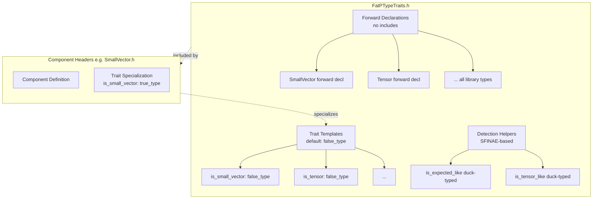

# FatPTypeTraits User Manual

## Table of Contents

1. [Introduction](#introduction)
2. [What Are Library-Specific Type Traits?](#what-are-library-specific-type-traits)
3. [Architecture](#architecture)
4. [Container Type Detection](#container-type-detection)
5. [Tensor and Mathematical Types](#tensor-and-mathematical-types)
6. [Concurrent Types](#concurrent-types)
7. [Memory Management Types](#memory-management-types)
8. [Utility Types](#utility-types)
9. [Composite Library Traits](#composite-library-traits)
10. [Duck-Typed Detection](#duck-typed-detection)
11. [Policy Detection](#policy-detection)
12. [Diagnostic Utilities](#diagnostic-utilities)
13. [Design-by-Contract Helpers](#design-by-contract-helpers)
14. [C++20 Concepts](#cpp20-concepts)
15. [Integration with TypeTraits](#integration-with-typetraits)
16. [Usage Examples](#usage-examples)
17. [Best Practices](#best-practices)
18. [Performance Considerations](#performance-considerations)

---

## Introduction

The `FatPTypeTraits.h` header provides comprehensive type traits specifically for detecting and working with fat_penelope library components. These traits enable compile-time detection of library types, allowing generic code to optimize for specific container implementations.

### Key Features

- **Forward Declarations Only**: No circular dependencies
- **Zero Dependencies**: Only depends on TypeTraits.h and standard library
- **Header-Only**: No compilation or linking required
- **Zero Runtime Overhead**: All compile-time operations
- **Comprehensive Coverage**: All fat_penelope containers and utilities
- **C++20 Concepts**: Full concept support when available
- **Duck-Typed Detection**: Works with any compatible interface
- **DbC Integration**: Compile-time contract enforcement
- **Diagnostic Utilities**: Detailed type analysis

### Relationship to TypeTraits.h

FatPTypeTraits complements the general-purpose TypeTraits library:

- **TypeTraits.h**: General type properties (is_container, is_hashable, etc.)
- **FatPTypeTraits.h**: Library-specific types (is_small_vector, is_tensor, etc.)

See the [TypeTraits User Manual](TypeTraits_UserManual.md) for general type trait documentation.

---

## What Are Library-Specific Type Traits?

Library-specific type traits answer questions about fat_penelope components:

- Is this type a SmallVector?
- Is this type a Tensor or tensor-like?
- Is this container thread-safe?
- Does this type use small buffer optimization?
- Can this type be used with parallel algorithms?

These traits enable:

1. **Generic Algorithms**: Write code that works with any container but optimizes for specific types
2. **Static Dispatch**: Choose implementation at compile time based on type
3. **Template Constraints**: Require specific fat_penelope types
4. **Documentation**: Self-documenting type requirements
5. **Diagnostics**: Clear error messages when constraints fail

### Example Use Case

```cpp
#include "FatPTypeTraits.h"
#include "SmallVector.h"
#include <vector>

// Generic algorithm that optimizes for SmallVector
template <typename Container>
void process(Container& c) {
    if constexpr (fat_p::is_small_vector_v<Container>) {
        // SmallVector-specific optimization
        // Can assume inline storage for small sizes
        std::cout << "Optimized path for SmallVector\n";
    } else {
        // Generic path
        std::cout << "Generic container path\n";
    }
    
    for (auto& item : c) {
        // Process items
    }
}

int main() {
    fat_p::SmallVector<int, 16> sv = {1, 2, 3};
    std::vector<int> v = {4, 5, 6};
    
    process(sv);  // Uses SmallVector optimization
    process(v);   // Uses generic path
}
```

---

## Architecture

FatPTypeTraits uses a carefully designed architecture to avoid circular dependencies while providing comprehensive type detection.

### Design Principles

1. **Forward Declarations Only**
   - No component headers are included
   - All types are forward-declared
   - No compilation dependencies on library components

2. **Default to `std::false_type`**
   - Traits return false by default
   - Component headers specialize their traits
   - Safe for types not yet included

3. **Component Specialization**
   - Each component specializes its own traits
   - Specializations appear at end of component headers
   - Automatic registration

4. **Detection-Based Traits**
   - Duck-typed traits use SFINAE
   - Work with any compatible interface
   - Don't require explicit specialization


### Architecture Diagram




**Problem**: Circular dependencies
```cpp
// BAD: Creates circular dependency
// FatPTypeTraits.h
#include "SmallVector.h"  // Needs SmallVector definition

// SmallVector.h
#include "FatPTypeTraits.h"  // Needs traits for SFINAE
// Result: Circular dependency!
```

**Solution**: Forward declarations + late specialization
```cpp
// GOOD: No circular dependency
// FatPTypeTraits.h
template <typename T, size_t N, typename A> class SmallVector;  // Forward
template <typename T> struct is_small_vector : false_type {};    // Default

// SmallVector.h
#include "FatPTypeTraits.h"
// SmallVector definition...
template <typename T, size_t N, typename A>
struct is_small_vector<SmallVector<T, N, A>> : true_type {};  // Specialize
```

---

## Container Type Detection

These traits detect specific fat_penelope container types.

### SmallVector

```cpp
template <typename T>
struct is_small_vector : std::false_type {};

template <typename T>
inline constexpr bool is_small_vector_v = is_small_vector<T>::value;
```

**Example:**
```cpp
#include "FatPTypeTraits.h"
#include "SmallVector.h"

fat_p::SmallVector<int, 16> sv;
static_assert(fat_p::is_small_vector_v<decltype(sv)>);
static_assert(!fat_p::is_small_vector_v<std::vector<int>>);
```

### CircularBuffer

```cpp
template <typename T>
struct is_circular_buffer : std::false_type {};

template <typename T>
inline constexpr bool is_circular_buffer_v = is_circular_buffer<T>::value;
```

**Example:**
```cpp
fat_p::CircularBuffer<int, 10> cb;
static_assert(fat_p::is_circular_buffer_v<decltype(cb)>);
```

### FlatMap

```cpp
template <typename T>
struct is_flat_map : std::false_type {};

template <typename T>
inline constexpr bool is_flat_map_v = is_flat_map<T>::value;
```

**Example:**
```cpp
fat_p::FlatMap<int, std::string> fm;
static_assert(fat_p::is_flat_map_v<decltype(fm)>);
static_assert(!fat_p::is_flat_map_v<std::map<int, std::string>>);
```

### FlatSet

```cpp
template <typename T>
struct is_flat_set : std::false_type {};

template <typename T>
inline constexpr bool is_flat_set_v = is_flat_set<T>::value;
```

### SortedContainer

```cpp
template <typename T>
struct is_sorted_container : std::false_type {};

template <typename T>
inline constexpr bool is_sorted_container_v = is_sorted_container<T>::value;
```

### SparseSet

```cpp
template <typename T>
struct is_sparse_set : std::false_type {};

template <typename T>
inline constexpr bool is_sparse_set_v = is_sparse_set<T>::value;
```

### SlotMap

```cpp
template <typename T>
struct is_slot_map : std::false_type {};

template <typename T>
inline constexpr bool is_slot_map_v = is_slot_map<T>::value;
```

### Complete List of Container Traits

```cpp
namespace fat_p {
    template <typename T> struct is_small_vector;
    template <typename T> struct is_circular_buffer;
    template <typename T> struct is_flat_map;
    template <typename T> struct is_flat_set;
    template <typename T> struct is_sorted_container;
    template <typename T> struct is_sparse_set;
    template <typename T> struct is_slot_map;
    
    // All with _v convenience aliases
    template <typename T> inline constexpr bool is_small_vector_v = is_small_vector<T>::value;
    template <typename T> inline constexpr bool is_circular_buffer_v = is_circular_buffer<T>::value;
    template <typename T> inline constexpr bool is_flat_map_v = is_flat_map<T>::value;
    template <typename T> inline constexpr bool is_flat_set_v = is_flat_set<T>::value;
    template <typename T> inline constexpr bool is_sorted_container_v = is_sorted_container<T>::value;
    template <typename T> inline constexpr bool is_sparse_set_v = is_sparse_set<T>::value;
    template <typename T> inline constexpr bool is_slot_map_v = is_slot_map<T>::value;
}
```

---

## Tensor and Mathematical Types

Traits for mathematical and tensor types.

### Tensor

```cpp
template <typename T>
struct is_tensor : std::false_type {};

template <typename T>
inline constexpr bool is_tensor_v = is_tensor<T>::value;
```

**Example:**
```cpp
fat_p::Tensor<double> t({3, 4, 5});
static_assert(fat_p::is_tensor_v<decltype(t)>);
```

### FixedTensor

```cpp
template <typename T>
struct is_fixed_tensor : std::false_type {};

template <typename T>
inline constexpr bool is_fixed_tensor_v = is_fixed_tensor<T>::value;
```

**Example:**
```cpp
fat_p::FixedTensor<float, 3, 4, 5> ft;
static_assert(fat_p::is_fixed_tensor_v<decltype(ft)>);
```

### CSRMatrix

```cpp
template <typename T>
struct is_csr_matrix : std::false_type {};

template <typename T>
inline constexpr bool is_csr_matrix_v = is_csr_matrix<T>::value;
```

### SimdVector

```cpp
template <typename T>
struct is_simd_vector : std::false_type {};

template <typename T>
inline constexpr bool is_simd_vector_v = is_simd_vector<T>::value;
```

### Complete Tensor Traits

```cpp
namespace fat_p {
    template <typename T> struct is_tensor;
    template <typename T> struct is_fixed_tensor;
    template <typename T> struct is_csr_matrix;
    template <typename T> struct is_simd_vector;
    
    template <typename T> inline constexpr bool is_tensor_v = is_tensor<T>::value;
    template <typename T> inline constexpr bool is_fixed_tensor_v = is_fixed_tensor<T>::value;
    template <typename T> inline constexpr bool is_csr_matrix_v = is_csr_matrix<T>::value;
    template <typename T> inline constexpr bool is_simd_vector_v = is_simd_vector<T>::value;
}
```

---

## Concurrent Types

Traits for lock-free and concurrent data structures.

### LockFreeQueue

```cpp
template <typename T>
struct is_lock_free_queue : std::false_type {};

template <typename T>
inline constexpr bool is_lock_free_queue_v = is_lock_free_queue<T>::value;
```

### LockFreeRingBuffer

```cpp
template <typename T>
struct is_lock_free_ring_buffer : std::false_type {};

template <typename T>
inline constexpr bool is_lock_free_ring_buffer_v = is_lock_free_ring_buffer<T>::value;
```

### ThreadPool

```cpp
template <typename T>
struct is_thread_pool : std::false_type {};

template <typename T>
inline constexpr bool is_thread_pool_v = is_thread_pool<T>::value;
```

### AtomicReference

```cpp
template <typename T>
struct is_atomic_reference : std::false_type {};

template <typename T>
inline constexpr bool is_atomic_reference_v = is_atomic_reference<T>::value;
```

### Complete Concurrent Traits

```cpp
namespace fat_p {
    template <typename T> struct is_lock_free_queue;
    template <typename T> struct is_lock_free_ring_buffer;
    template <typename T> struct is_thread_pool;
    template <typename T> struct is_atomic_reference;
    
    template <typename T> inline constexpr bool is_lock_free_queue_v = is_lock_free_queue<T>::value;
    template <typename T> inline constexpr bool is_lock_free_ring_buffer_v = is_lock_free_ring_buffer<T>::value;
    template <typename T> inline constexpr bool is_thread_pool_v = is_thread_pool<T>::value;
    template <typename T> inline constexpr bool is_atomic_reference_v = is_atomic_reference<T>::value;
}
```

---

## Memory Management Types

Traits for memory management and allocation types.

### AlignedVector

```cpp
template <typename T>
struct is_aligned_vector : std::false_type {};

template <typename T>
inline constexpr bool is_aligned_vector_v = is_aligned_vector<T>::value;
```

### ObjectPool

```cpp
template <typename T>
struct is_object_pool : std::false_type {};

template <typename T>
inline constexpr bool is_object_pool_v = is_object_pool<T>::value;
```

### NumaAllocator Detection

```cpp
template <typename T>
struct has_numa_allocator : std::false_type {};

template <typename T>
inline constexpr bool has_numa_allocator_v = has_numa_allocator<T>::value;
```

---

## Utility Types

Traits for utility and wrapper types.

### Expected

```cpp
template <typename T>
struct is_expected : std::false_type {};

template <typename T>
inline constexpr bool is_expected_v = is_expected<T>::value;
```

**Example:**
```cpp
fat_p::Expected<int, std::string> result = get_value();
static_assert(fat_p::is_expected_v<decltype(result)>);
```

### StrongId

```cpp
template <typename T>
struct is_strong_id : std::false_type {};

template <typename T>
inline constexpr bool is_strong_id_v = is_strong_id<T>::value;
```

### ValueGuard

```cpp
template <typename T>
struct is_value_guard : std::false_type {};

template <typename T>
inline constexpr bool is_value_guard_v = is_value_guard<T>::value;
```

### ScopeGuard

```cpp
template <typename T>
struct is_scope_guard : std::false_type {};

template <typename T>
inline constexpr bool is_scope_guard_v = is_scope_guard<T>::value;
```

### Complete Utility Traits

```cpp
namespace fat_p {
    template <typename T> struct is_expected;
    template <typename T> struct is_strong_id;
    template <typename T> struct is_value_guard;
    template <typename T> struct is_scope_guard;
    
    template <typename T> inline constexpr bool is_expected_v = is_expected<T>::value;
    template <typename T> inline constexpr bool is_strong_id_v = is_strong_id<T>::value;
    template <typename T> inline constexpr bool is_value_guard_v = is_value_guard<T>::value;
    template <typename T> inline constexpr bool is_scope_guard_v = is_scope_guard<T>::value;
}
```

---

## Composite Library Traits

High-level traits that combine multiple checks.

### is_library_container

Detects any fat_penelope container type.

```cpp
template <typename T>
struct is_library_container;

template <typename T>
inline constexpr bool is_library_container_v = is_library_container<T>::value;
```

**Example:**
```cpp
fat_p::SmallVector<int, 16> sv;
fat_p::FlatMap<int, std::string> fm;
std::vector<int> vec;

static_assert(fat_p::is_library_container_v<decltype(sv)>);   // true
static_assert(fat_p::is_library_container_v<decltype(fm)>);   // true
static_assert(!fat_p::is_library_container_v<decltype(vec)>); // false
```

### is_concurrent_container

Detects thread-safe containers.

```cpp
template <typename T>
struct is_concurrent_container;

template <typename T>
inline constexpr bool is_concurrent_container_v = is_concurrent_container<T>::value;
```

### is_tensor_type

Detects any tensor-like type (Tensor, FixedTensor, CSRMatrix, SimdVector).

```cpp
template <typename T>
struct is_tensor_type;

template <typename T>
inline constexpr bool is_tensor_type_v = is_tensor_type<T>::value;
```

### is_small_buffer_optimized

Detects containers using small buffer optimization.

```cpp
template <typename T>
struct is_small_buffer_optimized;

template <typename T>
inline constexpr bool is_small_buffer_optimized_v = is_small_buffer_optimized<T>::value;
```

**Example:**
```cpp
// Optimize for SBO containers
template <typename Container>
void insert_many(Container& c, int count) {
    if constexpr (fat_p::is_small_buffer_optimized_v<Container>) {
        // For SBO containers, fill inline storage first
        // Avoid unnecessary heap allocations for small sizes
    }
    
    for (int i = 0; i < count; ++i) {
        c.push_back(typename Container::value_type{});
    }
}
```

### is_parallel_algorithm_compatible

Detects types compatible with parallel algorithms.

```cpp
template <typename T>
struct is_parallel_algorithm_compatible;

template <typename T>
inline constexpr bool is_parallel_algorithm_compatible_v = 
    is_parallel_algorithm_compatible<T>::value;
```

### is_cache_aware_type

Detects cache-aware types (aligned or SIMD).

```cpp
template <typename T>
struct is_cache_aware_type {
    static constexpr bool value = is_aligned_vector_v<T> || is_simd_vector_v<T>;
};

template <typename T>
inline constexpr bool is_cache_aware_type_v = is_cache_aware_type<T>::value;
```

---

## Duck-Typed Detection

These traits use duck-typing to detect interfaces rather than specific types. They work with any type implementing the required interface.

### is_expected_like

Detects types with Expected-like interface (value(), error(), error_type).

```cpp
template <typename T>
struct is_expected_like;

template <typename T>
inline constexpr bool is_expected_like_v = is_expected_like<T>::value;
```

**Example:**
```cpp
// Works with fat_p::Expected
fat_p::Expected<int, std::string> e1 = 42;
static_assert(fat_p::is_expected_like_v<decltype(e1)>);

// Also works with custom Expected-like types
struct MyResult {
    int value() const;
    std::string error() const;
    using error_type = std::string;
};

static_assert(fat_p::is_expected_like_v<MyResult>);  // Also true!
```

### is_tensor_like

Detects types with Tensor-like interface (shape(), data(), etc.).

```cpp
template <typename T>
struct is_tensor_like;

template <typename T>
inline constexpr bool is_tensor_like_v = is_tensor_like<T>::value;
```

**Example:**
```cpp
// Works with fat_p::Tensor
fat_p::Tensor<float> t({3, 4});
static_assert(fat_p::is_tensor_like_v<decltype(t)>);

// Also works with custom tensor-like types
struct MyTensor {
    auto shape() const -> std::vector<size_t>;
    float* data();
    // ... other tensor operations
};

static_assert(fat_p::is_tensor_like_v<MyTensor>);  // Also true!
```

### is_binary_serializable

Detects types with binary serialization support.

```cpp
template <typename T>
struct is_binary_serializable;

template <typename T>
inline constexpr bool is_binary_serializable_v = is_binary_serializable<T>::value;
```

**Example:**
```cpp
struct Serializable {
    void binary_serialize(std::vector<uint8_t>& buffer) const;
    static Serializable binary_deserialize(const std::vector<uint8_t>& buffer);
};

static_assert(fat_p::is_binary_serializable_v<Serializable>);
```

---

## Policy Detection

Traits for detecting policy types and their capabilities.

### has_validate

Detects if a policy has a validate() method.

```cpp
template <typename T>
struct has_validate;

template <typename T>
inline constexpr bool has_validate_v = has_validate<T>::value;
```

### has_shared_locking

Detects if a concurrency policy supports shared locking.

```cpp
template <typename T>
struct has_shared_locking;

template <typename T>
inline constexpr bool has_shared_locking_v = has_shared_locking<T>::value;
```

### is_lock_free_policy

Detects if a policy is lock-free.

```cpp
template <typename T>
struct is_lock_free_policy;

template <typename T>
inline constexpr bool is_lock_free_policy_v = is_lock_free_policy<T>::value;
```

---

## Diagnostic Utilities

FatPTypeTraits provides diagnostic functions for understanding type properties. All diagnostic functions return compile-time string literals with **zero runtime overhead** - no heap allocations, no string construction, just a pointer to a static string.

### diagnose_expected

Provides a diagnostic message about Expected-like types. Returns a compile-time string literal with zero runtime overhead.

```cpp
template <typename T>
constexpr const char* diagnose_expected();
```

**Example:**
```cpp
#include "FatPTypeTraits.h"
#include <iostream>

struct MyType {
    int data;
};

int main() {
    const char* diag = fat_p::diagnose_expected<MyType>();
    std::cout << diag << "\n";
    // Output: "Missing value() method"
}
```

### diagnose_tensor

Provides a diagnostic message about Tensor types. Returns a compile-time string literal with zero runtime overhead.

```cpp
template <typename T>
constexpr const char* diagnose_tensor();
```

**Example:**
```cpp
const char* diag = fat_p::diagnose_tensor<MyTensor>();
std::cout << diag << "\n";
// Example outputs:
// "Type is specialized as Tensor"
// "Type is specialized as CSRMatrix"
// "Missing shape() method"
```

### diagnose_binary_serializable

Analyzes binary serialization capabilities. Returns a compile-time string literal with zero runtime overhead.

```cpp
template <typename T>
constexpr const char* diagnose_binary_serializable();
```

**Example:**
```cpp
const char* diag = fat_p::diagnose_binary_serializable<MyType>();
std::cout << diag << "\n";
// Example outputs:
// "Type is fully binary serializable"
// "Missing binary_serialize() method"
// "Missing binary_deserialize() static method"
```

### diagnose_library_container

Analyzes container classification. Returns a compile-time string literal with zero runtime overhead.

```cpp
template <typename T>
constexpr const char* diagnose_library_container();
```

**Example:**
```cpp
const char* diag = fat_p::diagnose_library_container<MyContainer>();
std::cout << diag << "\n";
// Example outputs:
// "Type is SmallVector"
// "Type is FlatMap"
// "Type is a concurrent container"
// "Type is not a library container"
```

### why_not_* Helpers

```cpp
template <typename T>
struct why_not_expected {
    static constexpr const char* reason;
};

template <typename T>
struct why_not_tensor {
    static constexpr const char* reason;
};

template <typename T>
struct why_not_binary_serializable {
    static constexpr const char* reason;
};
```

**Example:**
```cpp
struct Incomplete {
    int value() const { return 42; }
    // Missing error() and error_type
};

std::cout << fat_p::why_not_expected<Incomplete>::reason << "\n";
// Output: "Missing error() method"
```

---

## Design-by-Contract Helpers

DbC helpers provide compile-time contract enforcement for library types.

### requires_tensor

```cpp
template<typename T>
constexpr void requires_tensor() {
    static_assert(is_tensor_v<T>,
        "[CONTRACT VIOLATION] Type must be fat_p::Tensor");
}
```

**Example:**
```cpp
template <typename T>
void process_tensor(T& tensor) {
    fat_p::requires_tensor<T>();  // Compile error if not a Tensor
    // Work with tensor
}
```

### requires_parallel_compatible

```cpp
template<typename T>
constexpr void requires_parallel_compatible() {
    static_assert(is_parallel_algorithm_compatible_v<T>,
        "[CONTRACT VIOLATION] Type must support parallel algorithms");
}
```

### requires_binary_serializable

```cpp
template<typename T>
constexpr void requires_binary_serializable() {
    static_assert(is_binary_serializable_v<T>,
        "[CONTRACT VIOLATION] Type must support binary serialization");
}
```

### requires_library_container

```cpp
template<typename T>
constexpr void requires_library_container() {
    static_assert(is_library_container_v<T>,
        "[CONTRACT VIOLATION] Type must be a fat_p container");
}
```

### requires_concurrent_container

```cpp
template<typename T>
constexpr void requires_concurrent_container() {
    static_assert(is_concurrent_container_v<T>,
        "[CONTRACT VIOLATION] Type must be a concurrent container");
}
```

### requires_tensor_type

```cpp
template<typename T>
constexpr void requires_tensor_type() {
    static_assert(is_tensor_type_v<T>,
        "[CONTRACT VIOLATION] Type must be a tensor type");
}
```

### Complete DbC Example

```cpp
#include "FatPTypeTraits.h"
#include "Tensor.h"
#include "SmallVector.h"

template <typename TensorType>
void process_matrix_multiply(const TensorType& a, const TensorType& b) {
    // Enforce tensor requirement at compile time
    fat_p::requires_tensor<TensorType>();
    
    // Ensure dimensions match
    assert(a.shape()[1] == b.shape()[0]);
    
    // Implementation...
}

template <typename Container>
void parallel_sort(Container& c) {
    // Ensure container supports parallel algorithms
    fat_p::requires_parallel_compatible<Container>();
    fat_p::requires_library_container<Container>();
    
    // Use parallel algorithm
    std::sort(std::execution::par, c.begin(), c.end());
}
```

---

## C++20 Concepts

When C++20 is available, FatPTypeTraits provides native concept definitions in the `fat_p::concepts` namespace.

### Why Concepts are in a Separate Namespace

Concepts are defined in `fat_p::concepts` namespace (not directly in `fat_p`) to avoid naming conflicts with forward-declared class templates. For example, `class SmallVector` and `concept SmallVector` cannot coexist in the same namespace, so concepts use the dedicated `concepts` namespace with PascalCase names.

### Container Concepts

```cpp
#if __cplusplus >= 202002L
namespace fat_p {
namespace concepts {
    template <typename T>
    concept SmallVectorType = is_small_vector_v<T>;
    
    template <typename T>
    concept CircularBufferType = is_circular_buffer_v<T>;
    
    template <typename T>
    concept FlatMapType = is_flat_map_v<T>;
    
    template <typename T>
    concept FlatSetType = is_flat_set_v<T>;
    
    template <typename T>
    concept LibraryContainer = is_library_container_v<T>;
} // namespace concepts
} // namespace fat_p
#endif
```

### Tensor Concepts

```cpp
#if __cplusplus >= 202002L
namespace fat_p {
namespace concepts {
    template <typename T>
    concept TensorType = is_tensor_v<T>;
    
    template <typename T>
    concept FixedTensorType = is_fixed_tensor_v<T>;
    
    template <typename T>
    concept TensorLikeType = is_tensor_type_v<T>;
} // namespace concepts
} // namespace fat_p
#endif
```

### Utility Concepts

```cpp
#if __cplusplus >= 202002L
namespace fat_p {
namespace concepts {
    template <typename T>
    concept ExpectedType = is_expected_v<T>;
    
    template <typename T>
    concept StrongIdType = is_strong_id_v<T>;
    
    template <typename T>
    concept BinarySerializable = is_binary_serializable_v<T>;
    
    template <typename T>
    concept ParallelCompatible = is_parallel_algorithm_compatible_v<T>;
    
    template <typename T>
    concept ConcurrentContainer = is_concurrent_container_v<T>;
} // namespace concepts
} // namespace fat_p
#endif
```

### Usage Examples (C++20)

```cpp
#include "FatPTypeTraits.h"
#include "SmallVector.h"
#include "Tensor.h"

// Direct concept usage with full namespace
template <fat_p::concepts::SmallVectorType SV>
void process_small_vector(SV& sv) {
    // Guaranteed to be a SmallVector
}

// Concept in requires clause
template <typename T>
    requires fat_p::concepts::TensorType<T>
void matrix_multiply(const T& a, const T& b) {
    // Tensor operations
}

// Using declaration for convenience
using namespace fat_p::concepts;

// Abbreviated function template (with using declaration)
void display(LibraryContainer auto const& container) {
    for (const auto& item : container) {
        std::cout << item << " ";
    }
}

// Concept composition
template <typename T>
    requires LibraryContainer<T> && BinarySerializable<T>
void save_container(const T& container, const std::string& filename) {
    // Serialize and save
}
```

### Concept Naming Convention

FatPTypeTraits uses a consistent naming convention to distinguish concepts from class templates:

| Type | Namespace | Naming | Example |
|------|-----------|--------|---------|
| Struct traits | `fat_p::` | snake_case with `_v` suffix | `is_small_vector_v<T>` |
| Concepts | `fat_p::concepts::` | PascalCase | `SmallVectorType<T>` |
| Class templates | `fat_p::` | PascalCase with template params | `SmallVector<T, N, Alloc>` |

**Why PascalCase for concepts?**
- Visual distinction from struct traits
- Avoids conflicts with class template names
- Follows emerging C++ community convention
- More readable in template constraints

**Complete concept name mapping:**

| Struct Trait | C++20 Concept |
|--------------|---------------|
| `is_small_vector_v<T>` | `concepts::SmallVectorType<T>` |
| `is_circular_buffer_v<T>` | `concepts::CircularBufferType<T>` |
| `is_flat_map_v<T>` | `concepts::FlatMapType<T>` |
| `is_flat_set_v<T>` | `concepts::FlatSetType<T>` |
| `is_tensor_v<T>` | `concepts::TensorType<T>` |
| `is_fixed_tensor_v<T>` | `concepts::FixedTensorType<T>` |
| `is_expected_v<T>` | `concepts::ExpectedType<T>` |
| `is_strong_id_v<T>` | `concepts::StrongIdType<T>` |
| `is_tensor_type_v<T>` | `concepts::TensorLikeType<T>` |
| `is_binary_serializable_v<T>` | `concepts::BinarySerializable<T>` |
| `is_parallel_algorithm_compatible_v<T>` | `concepts::ParallelCompatible<T>` |
| `is_library_container_v<T>` | `concepts::LibraryContainer<T>` |
| `is_concurrent_container_v<T>` | `concepts::ConcurrentContainer<T>` |

### Struct Traits vs C++20 Concepts

FatPTypeTraits provides both struct-based traits and C++20 concepts for maximum flexibility.

#### Struct-Based Traits (C++17 and C++20)

```cpp
// Available in both C++17 and C++20
template <typename T>
struct is_small_vector : std::false_type {};

template <typename T>
inline constexpr bool is_small_vector_v = is_small_vector<T>::value;

// Usage examples
if constexpr (is_small_vector_v<MyType>) {
    // SmallVector-specific code
}

// Metaprogramming
template <typename T>
using enable_if_small_vector = std::enable_if_t<is_small_vector_v<T>>;

// With std::conjunction
template <typename T>
struct is_serializable_container : std::conjunction<
    is_library_container<T>,
    is_binary_serializable<T>
> {};
```

**When to use struct traits:**
- Need C++17 compatibility
- Metaprogramming with `std::conjunction`, `std::disjunction`, `std::negation`
- Type computations and SFINAE
- Consistent behavior across C++ versions

#### C++20 Concepts (C++20 only)

```cpp
// Only available in C++20
namespace fat_p::concepts {
    template <typename T>
    concept SmallVectorType = is_small_vector_v<T>;
}

// Usage examples
template <fat_p::concepts::SmallVectorType T>
void process(T& value) {
    // Clearer intent and better error messages
}

// Requires clause
template <typename T>
    requires fat_p::concepts::SmallVectorType<T>
void process(T& value) { }

// Concept composition
template <typename T>
    requires fat_p::concepts::LibraryContainer<T> && 
             fat_p::concepts::BinarySerializable<T>
void save(const T& container) { }
```

**When to use concepts:**
- Template constraints with clear error messages
- Modern C++20 codebases
- Requires clauses and concept composition
- Abbreviated function templates

#### Comparison Table

| Aspect | Struct Traits | C++20 Concepts |
|--------|---------------|----------------|
| **Availability** | C++17, C++20 | C++20 only |
| **Namespace** | `fat_p::` | `fat_p::concepts::` |
| **Naming** | snake_case with `_v` suffix | PascalCase |
| **Use Case** | Metaprogramming, `if constexpr` | Template constraints, requires clauses |
| **Syntax** | `is_small_vector_v<T>` | `concepts::SmallVectorType<T>` |
| **Error Messages** | Compiler-dependent | Often clearer |
| **Metaprogramming** | Full support (`std::conjunction`, etc.) | Limited |
| **Conflicts** | None | Avoids class template name conflicts |

#### Why Keep Both?

1. **Backward Compatibility**: Struct traits work in C++17
2. **Metaprogramming**: Some operations require struct traits
3. **User Choice**: Different teams have different preferences
4. **Gradual Migration**: Can migrate to concepts incrementally

#### Design Rationale

**Why separate namespace for concepts?**

C++ does not allow concepts and class templates with the same name in the same namespace. Since FatPTypeTraits forward-declares class templates like `SmallVector`, `Tensor`, etc., concepts must be in a separate namespace to avoid conflicts.

```cpp
// This would cause a compilation error:
namespace fat_p {
    template <typename T, size_t N, typename Alloc> 
    class SmallVector;  // Forward declaration
    
    template <typename T>
    concept SmallVector = is_small_vector_v<T>;  // ERROR: Name conflict!
}

// Solution: Separate namespace
namespace fat_p {
    template <typename T, size_t N, typename Alloc> 
    class SmallVector;  // Forward declaration
    
    namespace concepts {
        template <typename T>
        concept SmallVectorType = is_small_vector_v<T>;  // OK!
    }
}
```

**Why PascalCase for concepts?**

1. **Visual Distinction**: Easy to distinguish `is_small_vector_v` (trait) from `SmallVectorType` (concept)
2. **Clarity**: `concepts::SmallVectorType<T>` clearly indicates a concept
3. **Convention**: Follows emerging C++ community practice (e.g., STL concepts like `std::ranges::range`)
4. **Readability**: More natural in template constraints

#### Migration from Old Code

If you have code using incorrect concept names (from before the fix):

```cpp
// Old code (doesn't compile)
template <fat_p::SmallVector T>
void process(T& value);

template <fat_p::Tensor T>
void compute(T& tensor);

// New code (correct)
template <fat_p::concepts::SmallVectorType T>
void process(T& value);

template <fat_p::concepts::TensorType T>
void compute(T& tensor);

// Or with using declaration for convenience
using namespace fat_p::concepts;

template <SmallVectorType T>
void process(T& value);

template <TensorType T>
void compute(T& tensor);
```

---

## Integration with TypeTraits

FatPTypeTraits is designed to work seamlessly with the general TypeTraits library.

### Complementary Usage

```cpp
#include "TypeTraits.h"
#include "FatPTypeTraits.h"
#include "SmallVector.h"
#include <vector>

template <typename Container>
void advanced_process(Container& c) {
    // General trait from TypeTraits.h
    static_assert(fat_p::is_container_v<Container>, 
        "Must be a container");
    
    // Library-specific trait from FatPTypeTraits.h
    if constexpr (fat_p::is_small_vector_v<Container>) {
        std::cout << "SmallVector optimization enabled\n";
    }
    
    // Check element type with general trait
    using value_t = typename Container::value_type;
    if constexpr (fat_p::is_hashable_v<value_t>) {
        // Can use hash-based algorithms
    }
}
```

### Layered Checking

```cpp
#include "TypeTraits.h"
#include "FatPTypeTraits.h"

template <typename T>
void process(T& obj) {
    // Layer 1: General capability (TypeTraits)
    if constexpr (fat_p::is_container_v<T>) {
        std::cout << "Is a container\n";
        
        // Layer 2: Specific optimization (FatPTypeTraits)
        if constexpr (fat_p::is_small_buffer_optimized_v<T>) {
            std::cout << "Uses SBO - can optimize for small sizes\n";
        }
        
        // Layer 3: Element properties (TypeTraits)
        using value_t = typename T::value_type;
        if constexpr (fat_p::is_trivially_copyable_v<value_t>) {
            std::cout << "Elements are trivially copyable - can use memcpy\n";
        }
    }
}
```

### Combining Constraints

```cpp
#include "TypeTraits.h"
#include "FatPTypeTraits.h"

// C++17: SFINAE
template <typename Container>
std::enable_if_t<
    fat_p::is_container_v<Container> &&          // General: is container
    fat_p::is_library_container_v<Container> &&  // Specific: library type
    fat_p::is_reservable_v<Container>,           // General: has reserve()
    void
>
optimized_insert(Container& c, size_t count) {
    c.reserve(c.size() + count);
    // Bulk insert
}

// C++20: Concepts
template <typename Container>
    requires fat_p::is_container<Container> &&
             fat_p::LibraryContainer<Container> &&
             fat_p::is_reservable_v<Container>
void optimized_insert_cpp20(Container& c, size_t count) {
    c.reserve(c.size() + count);
    // Bulk insert
}
```

---

## Usage Examples

### Example 1: Generic Algorithm with Library Optimization

```cpp
#include "TypeTraits.h"
#include "FatPTypeTraits.h"
#include "SmallVector.h"
#include "CircularBuffer.h"
#include <vector>

template <typename Container>
void display(const Container& c) {
    // Ensure it's a container using general trait
    fat_p::requires_container<Container>();
    
    std::cout << "Size: " << c.size() << "\n";
    
    // Optimize based on specific type
    if constexpr (fat_p::is_small_vector_v<Container>) {
        std::cout << "SmallVector: inline storage optimization\n";
    } else if constexpr (fat_p::is_circular_buffer_v<Container>) {
        std::cout << "CircularBuffer: fixed-size optimization\n";
    } else {
        std::cout << "Standard container\n";
    }
    
    // Check if we can use library-wide optimizations
    if constexpr (fat_p::is_library_container_v<Container>) {
        std::cout << "Using fat_p container optimizations\n";
    }
    
    for (const auto& item : c) {
        std::cout << item << " ";
    }
    std::cout << "\n";
}

int main() {
    std::vector<int> std_vec = {1, 2, 3};
    fat_p::SmallVector<int, 16> small_vec = {4, 5, 6};
    fat_p::CircularBuffer<int, 10> circular = {7, 8, 9};
    
    display(std_vec);      // Standard container
    display(small_vec);    // SmallVector optimization
    display(circular);     // CircularBuffer optimization
}
```

### Example 2: Type-Specific Dispatch

```cpp
#include "FatPTypeTraits.h"
#include "Tensor.h"
#include "FixedTensor.h"

namespace detail {
    // Dynamic tensor path
    template <typename T>
    void compute_impl(T& tensor, std::false_type) {
        std::cout << "Dynamic tensor computation\n";
        // Use runtime shape information
        for (size_t i = 0; i < tensor.size(); ++i) {
            tensor.data()[i] *= 2;
        }
    }
    
    // Fixed tensor path - compile-time optimization
    template <typename T>
    void compute_impl(T& tensor, std::true_type) {
        std::cout << "Fixed tensor computation (optimized)\n";
        // Compile-time unrolling possible
        constexpr size_t Size = T::total_size;
        #pragma unroll
        for (size_t i = 0; i < Size; ++i) {
            tensor.data()[i] *= 2;
        }
    }
}

template <typename TensorType>
void compute(TensorType& tensor) {
    fat_p::requires_tensor_type<TensorType>();
    
    // Dispatch based on fixed vs dynamic
    detail::compute_impl(tensor, 
        std::bool_constant<fat_p::is_fixed_tensor_v<TensorType>>{});
}
```

### Example 3: Serialization Framework

```cpp
#include "FatPTypeTraits.h"
#include "BinarySerializer.h"

template <typename T>
void save(const T& obj, std::vector<uint8_t>& buffer) {
    if constexpr (fat_p::is_binary_serializable_v<T>) {
        // Use library's binary serialization
        obj.binary_serialize(buffer);
    } else if constexpr (fat_p::is_tensor_v<T>) {
        // Custom tensor serialization
        // Serialize shape
        const auto& shape = obj.shape();
        buffer.insert(buffer.end(), 
            reinterpret_cast<const uint8_t*>(shape.data()),
            reinterpret_cast<const uint8_t*>(shape.data() + shape.size()));
        
        // Serialize data
        buffer.insert(buffer.end(),
            reinterpret_cast<const uint8_t*>(obj.data()),
            reinterpret_cast<const uint8_t*>(obj.data() + obj.size()));
    } else {
        static_assert(fat_p::is_binary_serializable_v<T>,
            "Type must be serializable. Use why_not_binary_serializable<T>::reason");
    }
}
```

### Example 4: Parallel Algorithm Selection

```cpp
#include "FatPTypeTraits.h"
#include <execution>
#include <algorithm>

template <typename Container>
void parallel_sort(Container& c) {
    if constexpr (fat_p::is_parallel_algorithm_compatible_v<Container>) {
        // Use parallel execution
        std::sort(std::execution::par, c.begin(), c.end());
    } else {
        // Fallback to sequential
        std::sort(c.begin(), c.end());
    }
}
```

---

## Best Practices

### 1. Always Check General Traits First

```cpp
// Good: Check general trait, then specialize
template <typename T>
void process(T& obj) {
    // First: general capability
    if constexpr (fat_p::is_container_v<T>) {
        // Then: specific optimization
        if constexpr (fat_p::is_small_vector_v<T>) {
            // SmallVector-specific code
        }
    }
}

// Avoid: Checking library trait without general check
template <typename T>
void process_bad(T& obj) {
    if constexpr (fat_p::is_small_vector_v<T>) {
        // Missing check for is_container_v
        obj.size();  // Might not compile if T isn't a container
    }
}
```

### 2. Use Composite Traits for Common Patterns

```cpp
// Good: Use composite trait
template <typename T>
void bulk_insert(T& container) {
    if constexpr (fat_p::is_small_buffer_optimized_v<T>) {
        // Single check covers SmallVector, FlatMap, FlatSet
    }
}

// Avoid: Checking each type individually
template <typename T>
void bulk_insert_bad(T& container) {
    if constexpr (fat_p::is_small_vector_v<T> ||
                  fat_p::is_flat_map_v<T> ||
                  fat_p::is_flat_set_v<T>) {
        // More verbose, harder to maintain
    }
}
```

### 3. Use DbC Helpers for Clear Errors

```cpp
// Good: Clear error message
template <typename T>
void tensor_operation(T& tensor) {
    fat_p::requires_tensor<T>();  // Clear: "[CONTRACT VIOLATION] Type must be fat_p::Tensor"
    // Implementation
}

// Avoid: Generic assertion
template <typename T>
void tensor_operation_bad(T& tensor) {
    static_assert(fat_p::is_tensor_v<T>, "Wrong type");  // Less helpful
}
```

### 4. Leverage Duck-Typed Traits

```cpp
// Good: Works with any compatible interface
template <typename ExpectedLike>
void handle_result(ExpectedLike& result) {
    if constexpr (fat_p::is_expected_like_v<ExpectedLike>) {
        if (result.has_value()) {
            use(result.value());
        } else {
            handle_error(result.error());
        }
    }
}

// This works with:
// - fat_p::Expected<T, E>
// - std::expected<T, E> (C++23)
// - Custom Expected-like types
```

### 5. Use Diagnostics During Development

```cpp
// During development
#include "FatPTypeTraits.h"
#include <iostream>

template <typename T>
void debug_type() {
    std::cout << fat_p::diagnose_library_container<T>() << "\n";
    std::cout << fat_p::diagnose_tensor<T>() << "\n";
    std::cout << fat_p::diagnose_binary_serializable<T>() << "\n";
}

// In production: Remove or wrap in #ifdef DEBUG
```

### 6. Document Type Requirements

```cpp
/**
 * @brief Processes a fat_penelope container
 * @tparam Container Must satisfy:
 *         - fat_p::is_library_container_v<Container>
 *         - fat_p::is_reservable_v<Container>
 * @param c The container to process
 */
template <typename Container>
void process_library_container(Container& c) {
    fat_p::requires_library_container<Container>();
    fat_p::requires_reservable<Container>();
    // Implementation
}
```

### 7. Prefer Concepts in C++20

```cpp
// C++17: SFINAE
template <typename T>
std::enable_if_t<fat_p::is_tensor_v<T>, void>
compute_cpp17(T& tensor) { }

// C++20: Concepts (preferred)
template <fat_p::Tensor T>
void compute_cpp20(T& tensor) { }

// Or with requires
template <typename T>
    requires fat_p::Tensor<T>
void compute_cpp20_alt(T& tensor) { }
```

### 8. Combine with Standard Traits

```cpp
#include <type_traits>
#include "FatPTypeTraits.h"

template <typename T>
void optimized_copy(const T& src, T& dst) {
    if constexpr (std::is_trivially_copyable_v<T> &&
                  fat_p::is_contiguous_container_v<T>) {
        // Use memcpy for trivially copyable contiguous containers
        std::memcpy(dst.data(), src.data(), src.size() * sizeof(typename T::value_type));
    } else {
        // Element-wise copy
        dst = src;
    }
}
```

---

## Performance Considerations

### Compile-Time Only

All FatPTypeTraits operations are compile-time only:

```cpp
// Zero runtime cost
if constexpr (fat_p::is_small_vector_v<T>) {
    // Branch selected at compile time
}

// No runtime overhead
template <typename T>
void process(T& obj) {
    fat_p::requires_tensor<T>();  // Compile-time only
}
```

### Forward Declaration Benefits

The forward declaration design keeps compilation fast:

```cpp
// FatPTypeTraits.h is very lightweight
// - No component includes
// - Just forward declarations and trait templates
// - Fast to parse

// Only pay for what you use
#include "FatPTypeTraits.h"  // Lightweight
#include "SmallVector.h"      // Only if needed
```

### Trait Caching

For complex queries, cache results:

```cpp
template <typename Container>
class Processor {
    // Cache complex trait combination
    static constexpr bool can_optimize = 
        fat_p::is_library_container_v<Container> &&
        fat_p::is_small_buffer_optimized_v<Container> &&
        fat_p::is_reservable_v<Container>;
    
public:
    void process(Container& c) {
        if constexpr (can_optimize) {
            // Use cached result
        }
    }
};
```

### Diagnostic Functions

Diagnostic functions have minimal overhead but should be used primarily in development:

```cpp
// Development: Use diagnostics
#ifdef DEBUG
    std::cout << fat_p::diagnose_library_container<T>() << "\n";
#endif

// Production: Traits only (zero runtime cost)
if constexpr (fat_p::is_library_container_v<T>) {
    // Optimized path
}
```

---

## Troubleshooting

### Concept Name Conflicts (C++20)

**Problem**: Compilation error about conflicting concept declarations

```
error: conflicting declaration of template 'template<class T> concept fat_p::SmallVector'
note: previous declaration 'template<class T, long unsigned int InlineCapacity, class Allocator> class fat_p::SmallVector'
```

**Cause**: Using concept names directly in `fat_p` namespace instead of `fat_p::concepts` namespace.

**Solution**: Use the `fat_p::concepts` namespace with correct concept names:

```cpp
// Wrong - conflicts with class SmallVector
template <fat_p::SmallVector T>
void process(T& v);

// Correct - uses concepts namespace
template <fat_p::concepts::SmallVectorType T>
void process(T& v);

// Also correct - with using declaration
using namespace fat_p::concepts;
template <SmallVectorType T>
void process(T& v);
```

### Missing Concept in Namespace (C++20)

**Problem**: Compiler error: `'SmallVector' has not been declared in namespace 'fat_p::concepts'`

**Cause**: Either:
1. Not compiling with C++20, or
2. Using old concept name instead of new PascalCase name

**Solution**: 

```cpp
// Check C++ version
g++ -std=c++20 ...  // Make sure you're using C++20

// Use correct concept names (PascalCase)
template <fat_p::concepts::SmallVectorType T>  // Correct
void process(T& v);

// Not this:
template <fat_p::concepts::SmallVector T>      // Wrong - old name
void process(T& v);
```

### C++17 Compatibility

**Problem**: Need to support both C++17 and C++20

**Solution**: Use struct traits (work in both versions) instead of concepts:

```cpp
// C++17 and C++20 compatible
template <typename T>
void process(T& v) {
    if constexpr (fat_p::is_small_vector_v<T>) {
        // SmallVector-specific code
    }
}

// Or with SFINAE
template <typename T>
std::enable_if_t<fat_p::is_small_vector_v<T>> process(T& v) {
    // SmallVector-specific code
}

// C++20 only (using concepts)
#if __cplusplus >= 202002L
template <fat_p::concepts::SmallVectorType T>
void process(T& v) {
    // C++20 concept-based approach
}
#else
template <typename T>
std::enable_if_t<fat_p::is_small_vector_v<T>> process(T& v) {
    // C++17 fallback
}
#endif
```

### Trait Not Detecting Type

**Problem**: `is_small_vector_v<MySmallVector>` returns false even though it's a SmallVector

**Cause**: Trait specializations are added by component headers. You must include the component header for detection to work.

**Solution**:

```cpp
#include "FatPTypeTraits.h"  // Declares traits (all false by default)
#include "SmallVector.h"     // Specializes is_small_vector trait

// Now detection works
static_assert(fat_p::is_small_vector_v<fat_p::SmallVector<int, 16>>);
```

### Const/Reference Types Not Matching

**Problem**: Trait doesn't match const or reference types

```cpp
using SV = fat_p::SmallVector<int, 16>;
static_assert(fat_p::is_small_vector_v<SV>);        // OK
static_assert(fat_p::is_small_vector_v<const SV>);  // Fails!
static_assert(fat_p::is_small_vector_v<SV&>);       // Fails!
```

**Cause**: Traits match exact types, not cv-qualified or reference types by design.

**Solution**: Use `std::remove_cvref_t` to strip qualifiers:

```cpp
template <typename T>
void process(T&& value) {
    using bare_t = std::remove_cvref_t<T>;
    if constexpr (fat_p::is_small_vector_v<bare_t>) {
        // Now works with const, &, &&, const&, etc.
    }
}
```

### Ambiguous Overload Resolution

**Problem**: Compiler can't choose between overloads using different traits

```cpp
template <typename T>
void process(T& v) { /* general */ }

template <typename T>
    requires fat_p::concepts::SmallVectorType<T>
void process(T& v) { /* SmallVector */ }

template <typename T>
    requires fat_p::concepts::LibraryContainer<T>
void process(T& v) { /* LibraryContainer */ }
// Error: SmallVector satisfies both SmallVectorType and LibraryContainer!
```

**Solution**: Use more specific constraints or subsumption:

```cpp
// Option 1: More specific constraint wins
template <typename T>
    requires fat_p::concepts::SmallVectorType<T>
void process(T& v) { /* Most specific */ }

template <typename T>
    requires fat_p::concepts::LibraryContainer<T> && 
             !fat_p::concepts::SmallVectorType<T>
void process(T& v) { /* Other library containers */ }

// Option 2: Use if constexpr for dispatch
template <typename T>
void process(T& v) {
    if constexpr (fat_p::is_small_vector_v<std::remove_cvref_t<T>>) {
        // SmallVector path
    } else if constexpr (fat_p::is_library_container_v<std::remove_cvref_t<T>>) {
        // Other library container path
    } else {
        // General path
    }
}
```

### Diagnostic Functions Show Unexpected Results

**Problem**: `diagnose_expected<T>()` says "Type satisfies Expected requirements but is not specialized"

**Cause**: Type has the right methods (`value()`, `error()`) but the trait isn't specialized.

**Solution**: Either:
1. Include the proper header to get the specialization, or
2. Use duck-typed traits instead:

```cpp
// Use duck-typed trait instead
if constexpr (fat_p::is_expected_like_v<T>) {
    // Works with any Expected-like interface
}

// Or include proper header for specialization
#include "Expected.h"
if constexpr (fat_p::is_expected_v<T>) {
    // Only works with fat_p::Expected
}
```

### Forward Declaration Issues

**Problem**: Compilation error when trying to use traits with forward-declared types

**Cause**: Traits need complete type information (or at least the specialization).

**Solution**: Include the full header, not just forward declarations:

```cpp
// Wrong
template <typename T, size_t N, typename A> class SmallVector;
static_assert(fat_p::is_small_vector_v<SmallVector<int, 16>>);  // Error!

// Correct
#include "SmallVector.h"
static_assert(fat_p::is_small_vector_v<fat_p::SmallVector<int, 16>>);  // OK
```

---

## Conclusion

FatPTypeTraits provides comprehensive compile-time type detection for fat_penelope library components. By using these traits, you can:

1. **Write Generic Code**: Algorithms that work with any container
2. **Enable Optimizations**: Detect specific types for specialized paths
3. **Enforce Contracts**: Compile-time validation of type requirements
4. **Improve Diagnostics**: Clear error messages when constraints fail
5. **Support Duck-Typing**: Work with any compatible interface
6. **Zero Runtime Cost**: All detection happens at compile time

### Key Takeaways

- **Complementary to TypeTraits.h**: Use together for best results
- **Forward Declaration Design**: No circular dependencies
- **C++20 Concepts in fat_p::concepts Namespace**: Avoids naming conflicts with class templates
- **Comprehensive Coverage**: All fat_penelope types detected
- **Duck-Typed Detection**: Works beyond library types
- **Diagnostic Utilities**: Development-friendly error analysis
- **Both Struct Traits and Concepts**: Choose the right tool for your use case

### Related Documentation

- **[TypeTraits User Manual](TypeTraits_UserManual.md)**: General-purpose type traits
- **Component Documentation**: Specific container/utility docs

### Quick Reference

```cpp
// Include both for complete functionality
#include "TypeTraits.h"        // General traits
#include "FatPTypeTraits.h"    // Library-specific traits

// Struct-based traits (C++17 and C++20)
is_small_vector_v, is_circular_buffer_v, is_flat_map_v, etc.
is_tensor_v, is_fixed_tensor_v, is_csr_matrix_v, is_simd_vector_v
is_lock_free_queue_v, is_thread_pool_v, is_concurrent_container_v
is_library_container_v, is_tensor_type_v, is_small_buffer_optimized_v
is_expected_like_v, is_tensor_like_v, is_binary_serializable_v

// C++20 Concepts (in fat_p::concepts namespace)
concepts::SmallVectorType, concepts::CircularBufferType
concepts::TensorType, concepts::FixedTensorType
concepts::ExpectedType, concepts::StrongIdType
concepts::LibraryContainer, concepts::BinarySerializable
concepts::ParallelCompatible, concepts::ConcurrentContainer

// Diagnostics
diagnose_expected<T>(), diagnose_tensor<T>(), why_not_expected<T>::reason

// DbC helpers
requires_tensor<T>(), requires_library_container<T>()
```

Happy metaprogramming with fat_penelope!
