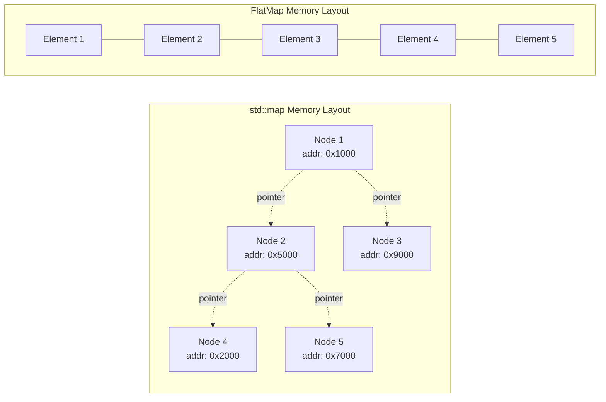

# FlatMap and FlatSet User Manual

**Library:** fat_p C++ Utilities  
**Standard:** C++17  
**Type:** Header-only

---

## Table of Contents

1. [What is FlatMap/FlatSet?](#what-is-flatmapflatset)
   - [Understanding the Problem](#understanding-the-problem)
   - [The C++ Landscape](#the-c-landscape)
   - [Where FlatMap/FlatSet Fit](#where-flatmapflatset-fit)
2. [Core Architecture](#core-architecture)
   - [Storage Design](#storage-design)
   - [Sorted Invariant](#sorted-invariant)
   - [Iterator Design](#iterator-design)
   - [Design Decisions](#design-decisions)
3. [Getting Started](#getting-started)
   - [Prerequisites](#prerequisites)
   - [Integration](#integration)
   - [First Program](#first-program)
4. [FlatMap](#flatmap)
   - [Construction](#flatmap-construction)
   - [Element Access](#element-access)
   - [Modifiers](#flatmap-modifiers)
   - [Lookup](#flatmap-lookup)
   - [Capacity](#flatmap-capacity)
5. [FlatSet](#flatset)
   - [Construction](#flatset-construction)
   - [Modifiers](#flatset-modifiers)
   - [Lookup](#flatset-lookup)
   - [Set Operations](#set-operations)
6. [Custom Comparators](#custom-comparators)
   - [Descending Order](#descending-order)
   - [Case-Insensitive Strings](#case-insensitive-strings)
   - [Comparator Requirements](#comparator-requirements)
7. [Performance Characteristics](#performance-characteristics)
   - [Complexity Analysis](#complexity-analysis)
   - [Benchmark Methodology](#benchmark-methodology)
   - [Benchmark Results](#benchmark-results)
   - [Memory Usage](#memory-usage)
   - [Interpreting the Results](#interpreting-the-results)
8. [Comparison with Other Approaches](#comparison-with-other-approaches)
   - [vs std::map and std::set](#vs-stdmap-and-stdset)
   - [vs C++23 std::flat_map](#vs-c23-stdflat_map)
   - [vs Boost.Container flat_map](#vs-boostcontainer-flat_map)
   - [vs SortedContainer](#vs-sortedcontainer)
9. [Migration Guide](#migration-guide)
   - [From std::map](#from-stdmap)
   - [From std::set](#from-stdset)
   - [Incremental Adoption](#incremental-adoption)
10. [Best Practices](#best-practices)
    - [When to Use](#when-to-use)
    - [When Not to Use](#when-not-to-use)
    - [Performance Tips](#performance-tips)
11. [Troubleshooting](#troubleshooting)
    - [Compilation Errors](#compilation-errors)
    - [Runtime Errors](#runtime-errors)
    - [Performance Issues](#performance-issues)
12. [API Reference](#api-reference)
    - [FlatMap Types](#flatmap-types)
    - [FlatSet Types](#flatset-types)
    - [Common Methods](#common-methods)
13. [Summary](#summary)

---

## What is FlatMap/FlatSet?

### Understanding the Problem

Node-based containers like `std::map` and `std::set` use red-black trees internally. Each element is a separately allocated node containing the data plus pointers to parent, left child, and right child:

```cpp
// Simplified std::map node structure (conceptual)
template <typename Key, typename Value>
struct MapNode
{
    std::pair<const Key, Value> data;  // 8+ bytes for int,int
    MapNode* parent;                    // 8 bytes
    MapNode* left;                      // 8 bytes  
    MapNode* right;                     // 8 bytes
    bool color;                         // 1 byte (+ padding)
    // Total: ~40 bytes per node for a simple int,int pair
};
```

This design has consequences:

```cpp
std::map<int, int> cache;
for (int i = 0; i < 10000; ++i)
{
    cache[i] = i * 10;
}

// Problem 1: 10,000 separate heap allocations
// Problem 2: Nodes scattered across memory
// Problem 3: ~400KB memory for 80KB of actual data
// Problem 4: Cache misses on every tree traversal
```



### The C++ Landscape

| Container | Storage | Lookup | Insert | Iteration | Memory Overhead |
|-----------|---------|--------|--------|-----------|-----------------|
| `std::map` | Red-black tree | O(log n) | O(log n) | Poor cache | ~32 bytes/node |
| `std::unordered_map` | Hash table | O(1) avg | O(1) avg | Poor cache | ~8-16 bytes/bucket |
| `std::flat_map` (C++23) | Sorted vector | O(log n) | O(n) | Excellent cache | ~0 bytes |
| `boost::flat_map` | Sorted vector | O(log n) | O(n) | Excellent cache | ~0 bytes |
| `fat_p::FlatMap` | Sorted vector | O(log n) | O(n) | Excellent cache | ~0 bytes |

**Trade-off summary:**

- Node-based containers: Fast insertion, slow iteration, high memory
- Flat containers: Slow insertion, fast iteration, low memory
- Hash containers: Fastest lookup, no ordering, variable memory

### Where FlatMap/FlatSet Fit

`fat_p::FlatMap` and `fat_p::FlatSet` are sorted, contiguous associative containers designed for the common "load once, query many" pattern.

**Key features:**

- Standard `std::map`/`std::set` compatible API
- Contiguous memory storage via `std::vector`
- O(log n) lookup via binary search
- Excellent cache locality for iteration
- Custom iterator protection for key immutability (FlatMap)
- Debug-mode bounds checking via `enforce`
- Zero external dependencies beyond the standard library

**Trade-offs:**

- O(n) insertion due to element shifting
- O(n) erasure due to element shifting
- Iterator invalidation on modification (same as `std::vector`)

**Best for:**

- Configuration data loaded at startup
- Lookup tables that rarely change
- Cache structures with infrequent updates
- Memory-constrained environments
- Performance-critical iteration

---

## Core Architecture

### Storage Design

Both containers use `std::vector` as their underlying storage:

```cpp
// FlatSet internal storage
template <typename T, typename Compare, typename Allocator>
class FlatSet
{
private:
    std::vector<T, Allocator> data_;
    Compare comp_;
};

// FlatMap internal storage
template <typename Key, typename T, typename Compare, typename Allocator>
class FlatMap
{
private:
    using InternalPair = std::pair<Key, T>;  // Non-const key for vector operations
    std::vector<InternalPair, InternalAllocator> data_;
    Compare comp_;
};
```

The sorted invariant is maintained by inserting elements at their correct position using binary search (`std::lower_bound`) followed by `vector::insert`.

### Sorted Invariant

Elements are always maintained in sorted order according to the comparator:

```cpp
fat_p::FlatMap<int, std::string> map;
map.insert({3, "three"});
map.insert({1, "one"});
map.insert({2, "two"});

// Internal storage after insertions:
// data_[0] = {1, "one"}
// data_[1] = {2, "two"}  
// data_[2] = {3, "three"}
```

This invariant enables O(log n) lookup via `std::lower_bound`.

### Iterator Design

FlatSet exposes const iterators only - elements cannot be modified through iterators since modification would break the sorted invariant. This matches `std::set` behavior.

FlatMap uses custom iterator wrappers that return `std::pair<const Key&, T&>` on dereference, preventing modification of keys while allowing value modification:

```cpp
fat_p::FlatMap<int, std::string> map{{1, "one"}, {2, "two"}};

auto it = map.begin();
(*it).second = "ONE";  // OK: values are mutable
// (*it).first = 999;  // Would not compile: key is const
```

This matches `std::map` behavior where `value_type` is `std::pair<const Key, T>`.

> **Warning: Address-of Operator Limitation (FlatMap only)**
> 
> Because `FlatMap` uses a proxy iterator to protect key immutability, the expression `&*it` returns the address of a **temporary object**, not the address of the element inside the vector. Do not store pointers to elements obtained via iterators.
> 
> If you need a pointer to the value, use `&it->second` or `&map.at(key)`.
>
> ```cpp
> auto it = map.find(key);
> auto* bad_ptr = &(*it);      // WRONG: points to temporary
> auto* good_ptr = &it->second; // OK: points to actual value in vector
> ```

### Design Decisions

**Why not use `std::pair<const Key, T>` internally?**

`std::vector` requires elements to be assignable for operations like `erase` and `insert`. A pair with a const first element cannot be assigned, so we use `std::pair<Key, T>` internally and protect key immutability through the iterator interface.

**Why custom iterators instead of documenting the limitation?**

API compatibility with `std::map` is a primary goal. Users expect that modifying keys through iterators is impossible, not just discouraged.

**Why include `enforce` checks?**

Debug-mode validation catches iterator misuse early:

```cpp
fat_p::FlatMap<int, int> map{{1, 10}};
map.erase(map.end());  // Debug: enforce triggers with "invalid iterator"
                       // Release: undefined behavior (same as std::map)
```

---

## Getting Started

### Prerequisites

| Requirement | Minimum |
|-------------|---------|
| C++ Standard | C++17 |
| Compiler | GCC 7+, Clang 5+, MSVC 2017+ |
| Dependencies | `enforce.h`, `FatPTypeTraits.h` |

### Integration

```cpp
#include "FlatMap.h"  // For fat_p::FlatMap
#include "FlatSet.h"  // For fat_p::FlatSet
```

No special compiler flags required beyond C++17 mode (`-std=c++17` or `/std:c++17`).

### First Program

```cpp
#include <iostream>
#include <string>
#include "FlatMap.h"
#include "FlatSet.h"

int main()
{
    // FlatMap example: configuration store
    fat_p::FlatMap<std::string, int> config;
    config["timeout_ms"] = 5000;
    config["max_retries"] = 3;
    config["buffer_size"] = 4096;
    
    std::cout << "Timeout: " << config.at("timeout_ms") << " ms\n";
    
    if (config.contains("max_retries"))
    {
        std::cout << "Max retries: " << config["max_retries"] << "\n";
    }
    
    // FlatSet example: allowed status codes
    fat_p::FlatSet<int> valid_codes{200, 201, 204, 301, 302, 304};
    
    int response_code = 200;
    if (valid_codes.contains(response_code))
    {
        std::cout << "Response " << response_code << " is valid\n";
    }
    
    // Iteration (sorted order)
    std::cout << "All valid codes: ";
    for (int code : valid_codes)
    {
        std::cout << code << " ";
    }
    std::cout << "\n";
    
    return 0;
}
```

Output:
```
Timeout: 5000 ms
Max retries: 3
Response 200 is valid
All valid codes: 200 201 204 301 302 304
```

---

## FlatMap

### FlatMap Construction

```cpp
// Default construction
fat_p::FlatMap<int, std::string> map1;

// With custom comparator
fat_p::FlatMap<int, std::string, std::greater<int>> map2;

// From initializer list
fat_p::FlatMap<std::string, int> map3{
    {"alice", 30},
    {"bob", 25},
    {"charlie", 35}
};

// From iterator range
std::vector<std::pair<int, int>> data{{1, 10}, {2, 20}, {3, 30}};
fat_p::FlatMap<int, int> map4(data.begin(), data.end());

// With allocator
fat_p::FlatMap<int, int> map5(std::allocator<std::pair<const int, int>>{});
```

### Element Access

```cpp
fat_p::FlatMap<std::string, int> ages{{"alice", 30}, {"bob", 25}};

// operator[] - inserts default if not found
ages["charlie"] = 35;        // Inserts {"charlie", 35}
int age = ages["alice"];     // Returns 30

// at() - throws if not found
try
{
    int x = ages.at("dave");  // Throws std::out_of_range
}
catch (const std::out_of_range& e)
{
    std::cerr << "Key not found\n";
}

// at() for modification
ages.at("alice") = 31;
```

### FlatMap Modifiers

```cpp
fat_p::FlatMap<int, std::string> map;

// insert - returns pair<iterator, bool>
auto [it1, inserted1] = map.insert({1, "one"});
// inserted1 == true, it1 points to {1, "one"}

auto [it2, inserted2] = map.insert({1, "ONE"});
// inserted2 == false (key exists), it2 points to existing {1, "one"}

// insert_or_assign - updates if exists
auto [it3, inserted3] = map.insert_or_assign(1, "ONE");
// inserted3 == false, value updated to "ONE"

auto [it4, inserted4] = map.insert_or_assign(2, "two");
// inserted4 == true, new element inserted

// try_emplace - constructs in place only if key doesn't exist
auto [it5, inserted5] = map.try_emplace(3, "three");
// inserted5 == true

auto [it6, inserted6] = map.try_emplace(3, "THREE");
// inserted6 == false, value unchanged

// emplace - constructs element in place
auto [it7, inserted7] = map.emplace(4, "four");

// Range insert (optimized: O(n log n) instead of O(n^2))
std::vector<std::pair<int, std::string>> more{{5, "five"}, {6, "six"}};
map.insert(more.begin(), more.end());

// Erase by key
size_t removed = map.erase(1);  // Returns 1 if found, 0 otherwise

// Erase by iterator
auto it = map.find(2);
if (it != map.end())
{
    map.erase(it);
}

// Clear all elements
map.clear();

// Merge from another map (O(n + m) since both are sorted)
fat_p::FlatMap<int, std::string> map1{{1, "one"}, {3, "three"}};
fat_p::FlatMap<int, std::string> map2{{2, "two"}, {3, "THREE"}, {4, "four"}};
map1.merge(map2);
// map1 now contains {1, 2, 3, 4} - key 3 keeps original value "three"
// map2 is now empty
```

### FlatMap Lookup

```cpp
fat_p::FlatMap<int, std::string> map{{1, "one"}, {3, "three"}, {5, "five"}};

// find - returns iterator
auto it = map.find(3);
if (it != map.end())
{
    std::cout << (*it).second;  // "three"
}

// contains - returns bool (C++20-style, available in C++17)
if (map.contains(5))
{
    std::cout << "Found 5\n";
}

// count - returns 0 or 1
size_t n = map.count(7);  // 0

// lower_bound - first element >= key
auto lb = map.lower_bound(2);  // Points to {3, "three"}

// upper_bound - first element > key
auto ub = map.upper_bound(3);  // Points to {5, "five"}

// equal_range - pair of lower_bound and upper_bound
auto [first, last] = map.equal_range(3);
// first points to {3, "three"}, last points to {5, "five"}
```

### FlatMap Capacity

```cpp
fat_p::FlatMap<int, int> map;

// Check if empty
bool isEmpty = map.empty();  // true

// Get size
size_t count = map.size();  // 0

// Reserve capacity (reduces reallocations during bulk insert)
map.reserve(1000);
size_t cap = map.capacity();  // >= 1000

// Bulk insert
for (int i = 0; i < 1000; ++i)
{
    map.insert({i, i * 10});
}

// Release excess capacity
map.shrink_to_fit();
```

---

## FlatSet

### FlatSet Construction

```cpp
// Default construction
fat_p::FlatSet<int> set1;

// With custom comparator
fat_p::FlatSet<int, std::greater<int>> set2;

// From initializer list
fat_p::FlatSet<std::string> set3{"apple", "banana", "cherry"};

// From iterator range (duplicates removed automatically)
std::vector<int> data{3, 1, 4, 1, 5, 9, 2, 6, 5};
fat_p::FlatSet<int> set4(data.begin(), data.end());
// set4 contains: {1, 2, 3, 4, 5, 6, 9}
```

### FlatSet Modifiers

```cpp
fat_p::FlatSet<int> set;

// insert - returns pair<iterator, bool>
auto [it1, inserted1] = set.insert(5);
// inserted1 == true

auto [it2, inserted2] = set.insert(5);
// inserted2 == false (duplicate)

// Range insert
set.insert({1, 2, 3, 4});

// emplace
auto [it3, inserted3] = set.emplace(10);

// Erase by value
size_t removed = set.erase(3);  // Returns 1

// Erase by iterator
auto it = set.find(4);
if (it != set.end())
{
    set.erase(it);
}

// Clear
set.clear();
```

### FlatSet Lookup

```cpp
fat_p::FlatSet<int> set{10, 20, 30, 40, 50};

// find
auto it = set.find(30);
if (it != set.end())
{
    std::cout << *it;  // 30
}

// contains
bool found = set.contains(25);  // false

// count
size_t n = set.count(40);  // 1

// lower_bound
auto lb = set.lower_bound(25);  // Points to 30

// upper_bound
auto ub = set.upper_bound(30);  // Points to 40

// equal_range
auto [first, last] = set.equal_range(30);
```

### Set Operations

Since FlatSet maintains sorted order, standard algorithms work efficiently:

```cpp
fat_p::FlatSet<int> a{1, 2, 3, 4, 5};
fat_p::FlatSet<int> b{4, 5, 6, 7, 8};

// Intersection
std::vector<int> intersection;
std::set_intersection(a.begin(), a.end(),
                      b.begin(), b.end(),
                      std::back_inserter(intersection));
// intersection = {4, 5}

// Union
std::vector<int> union_result;
std::set_union(a.begin(), a.end(),
               b.begin(), b.end(),
               std::back_inserter(union_result));
// union_result = {1, 2, 3, 4, 5, 6, 7, 8}

// Difference (a - b)
std::vector<int> difference;
std::set_difference(a.begin(), a.end(),
                    b.begin(), b.end(),
                    std::back_inserter(difference));
// difference = {1, 2, 3}

// Symmetric difference
std::vector<int> sym_diff;
std::set_symmetric_difference(a.begin(), a.end(),
                              b.begin(), b.end(),
                              std::back_inserter(sym_diff));
// sym_diff = {1, 2, 3, 6, 7, 8}
```

---

## Custom Comparators

### Descending Order

```cpp
fat_p::FlatSet<int, std::greater<int>> descending{3, 1, 4, 1, 5};
// Contents: {5, 4, 3, 1}

for (int val : descending)
{
    std::cout << val << " ";  // 5 4 3 1
}
```

### Case-Insensitive Strings

```cpp
struct CaseInsensitiveCompare
{
    bool operator()(const std::string& a, const std::string& b) const
    {
        return std::lexicographical_compare(
            a.begin(), a.end(),
            b.begin(), b.end(),
            [](char c1, char c2) {
                return std::tolower(static_cast<unsigned char>(c1)) <
                       std::tolower(static_cast<unsigned char>(c2));
            });
    }
};

fat_p::FlatMap<std::string, int, CaseInsensitiveCompare> map;
map["Hello"] = 1;
map["HELLO"] = 2;  // Same key as "Hello"

std::cout << map.size();  // 1
std::cout << map["hello"];  // 2 (last assignment wins for insert, but this is lookup)
```

### Comparator Requirements

Comparators must define a strict weak ordering:

1. **Irreflexive:** `comp(a, a)` is always `false`
2. **Asymmetric:** If `comp(a, b)` then `!comp(b, a)`
3. **Transitive:** If `comp(a, b)` and `comp(b, c)` then `comp(a, c)`
4. **Transitivity of equivalence:** If `!comp(a,b) && !comp(b,a)` and `!comp(b,c) && !comp(c,b)` then `!comp(a,c) && !comp(c,a)`

Violating these requirements causes undefined behavior.

---

## Performance Characteristics

### Complexity Analysis

| Operation | FlatMap/FlatSet | std::map/set | Notes |
|-----------|-----------------|--------------|-------|
| `find` | O(log n) | O(log n) | Binary search vs tree traversal |
| `insert` (single) | O(n) | O(log n) | Vector shift vs tree rebalance |
| `insert` (range, k elements) | O(n + k log k) | O(k log n) | Sort + merge optimization |
| `erase` | O(n) | O(log n) | Vector shift vs tree rebalance |
| `operator[]` | O(n) | O(log n) | May insert |
| Iteration (full) | O(n) | O(n) | Cache-friendly vs cache-hostile |
| Memory per element | sizeof(T) | sizeof(T) + ~32 bytes | No node overhead |

### Benchmark Methodology

Performance was measured on two platforms with automatic system information capture:

**Windows Test Environment:**

| Component | Specification |
|-----------|---------------|
| Processor | Intel Core i7-8850H @ 2.60 GHz (6C/12T) |
| RAM | 32.0 GB |
| OS | Windows 10 Pro (Build 26200) x64 |
| Compiler | MSVC 2022 |
| Timer | QueryPerformanceCounter (100 ns resolution) |

```
Compiler Flags: /std:c++17 /O2 /DNDEBUG /MD /EHsc /W3
Defines: NOMINMAX, WIN32_LEAN_AND_MEAN
```

**Linux Test Environment:**

| Component | Specification |
|-----------|---------------|
| Compiler | GCC 13.3.0 |
| OS | Ubuntu 24.04 LTS x86_64 |
| Timer | std::chrono::high_resolution_clock (1 ns resolution) |

```
Compiler Flags: -std=c++17 -O2 -DNDEBUG
```

All measurements represent the average time per operation over thousands of iterations with warmup runs excluded. Benchmarks use `DoNotOptimize` patterns to prevent compiler elimination of measured operations.

Windows benchmarks were captured in two conditions:
- **Unthrottled:** CPU at base frequency (~2600 MHz), cool laptop
- **Throttled:** CPU at 40-70% frequency (~1100-1800 MHz), sustained load with thermal management active (verified via HWINFO64)

> **Note on Thermal Throttling:** Laptop CPUs frequently operate under thermal constraints. The throttled benchmarks represent realistic sustained workload performance. The performance advantages of flat containers are **maintained or enhanced** under throttling because memory-bound operations become relatively more important when CPU clock speeds are reduced.

### Benchmark Results

#### FlatMap Performance (1,000 elements, cache-resident)

| Operation | Windows (unthrottled) | Windows (throttled) | Linux | Notes |
|-----------|----------------------|---------------------|-------|-------|
| Insert (random) | 70 ns | 118 ns | 27 ns | Amortized, includes vector growth |
| Insert (sorted, reserved) | 4.2 ns | 8.2 ns | 1.4 ns | Best case with pre-reserved capacity |
| Find | 90 ns | 129 ns | 28 ns | Binary search with varying keys |
| Iteration (1k) | 2.6 µs | 4.2 µs | 2.0 µs | Cache-friendly traversal |
| std::map Find | 74 ns | 110 ns | 29 ns | Tree traversal |
| std::map Iteration (1k) | 7.9 µs | 14.8 µs | 3.9 µs | Pointer chasing |

#### FlatSet Performance (1,000 elements, cache-resident)

| Operation | Windows (unthrottled) | Windows (throttled) | Linux | Notes |
|-----------|----------------------|---------------------|-------|-------|
| Insert (random) | 69 ns | 93 ns | 31 ns | Amortized, includes vector growth |
| Insert (sorted, reserved) | 2.8 ns | 6.9 ns | 1.2 ns | Best case with pre-reserved capacity |
| Find | 58 ns | 98 ns | 32 ns | Binary search with varying keys |
| Iteration (1k) | 2.7 µs | 4.2 µs | 2.0 µs | Cache-friendly traversal |
| std::set Find | 68 ns | 125 ns | 32 ns | Tree traversal |
| std::set Iteration (1k) | 6.8 µs | 14.1 µs | 4.2 µs | Pointer chasing |

#### Small-Scale Performance Summary (1,000 elements)

| Metric | FlatMap/FlatSet | std::map/set | Speedup |
|--------|-----------------|--------------|---------|
| Find | 28-129 ns | 29-125 ns | Comparable |
| Insert (sorted, reserved) | 1-8 ns | ~100+ ns | **12-100x faster** |
| Iteration (1k elements) | 2.0-4.2 µs | 3.9-14.8 µs | **2-3x faster** |
| Memory usage (1000 int pairs) | ~8 KB | ~40 KB | **80% less** |

**Analysis:**

- **Throttling impact:** Windows throttled times are ~1.5-2x slower than unthrottled, but **relative speedups remain consistent** across conditions.

- **Insert performance:** FlatMap/FlatSet show better amortized insert times than theoretical O(n) suggests because vector shift operations are highly optimized by modern CPUs (prefetching, cache locality). The O(n) shift becomes a cache-friendly memmove.

- **Find performance:** Nearly identical between flat and node-based containers at small scale. Binary search on contiguous memory is comparable to tree traversal.

- **Iteration performance:** 2-3x faster for flat containers due to sequential memory access enabling CPU prefetching, no pointer chasing, and better cache utilization.

### Large-Scale Benchmarks (Cache Stress)

The small-scale benchmarks above use 1,000 elements (~8 KB), which fits entirely in CPU L1/L2 cache. Real-world HPC workloads often exceed cache sizes. We tested with **100,000 elements** (~800 KB) using random access patterns to stress the cache hierarchy.

#### Large-Scale Results (100,000 elements)

| Operation | Platform | FlatMap/FlatSet | std::map/set | Speedup |
|-----------|----------|-----------------|--------------|---------|
| Find (random) | Windows (unthrottled) | 187-231 ns | 317-392 ns | **1.7x faster** |
| Find (random) | Windows (throttled) | 250-369 ns | 480-701 ns | **1.9x faster** |
| Find (random) | Linux | 97-99 ns | 227-240 ns | **2.3-2.5x faster** |
| Iteration | Windows (unthrottled) | 210-242 µs | 954 µs-1.0 ms | **3.9-4.8x faster** |
| Iteration | Windows (throttled) | 285-352 µs | 1.2-1.3 ms | **3.7-4.3x faster** |
| Iteration | Linux | 187-198 µs | 585-673 µs | **3.0-3.4x faster** |

#### Why the Gap Widens at Scale

1. **Find operations:** Binary search on contiguous memory touches `log₂(100,000) ≈ 17` cache lines. With FlatMap, these are sequential and predictable. With std::map, each of the 17 tree nodes is a separate memory location, causing cache misses on every level.

2. **Iteration:** FlatMap reads memory sequentially, allowing the CPU hardware prefetcher to stay ahead of the access pattern. std::map requires chasing pointers through randomly-allocated nodes, stalling the CPU on almost every access.

3. **Thermal throttling amplifies the advantage:** Under reduced CPU frequencies, the ratio of CPU cycles to memory latency worsens. Memory-efficient operations (flat containers) become relatively faster compared to memory-hostile operations (node-based containers).

**Conclusion:** The performance advantage of flat containers **increases** as data size grows beyond L2 cache. For cache-resident data (1K elements), expect 2-3.5x faster iteration. For larger datasets (100K+ elements), expect **2-2.5x faster find** and **3-4x faster iteration**.

### Memory Usage

```
FlatMap<int, int> with 1000 elements:
  Data:     8,000 bytes (8 bytes x 1000 pairs)
  Overhead: ~24 bytes (vector: pointer + size + capacity)
  Total:    ~8,024 bytes

std::map<int, int> with 1000 elements:
  Data:     8,000 bytes
  Nodes:    ~32,000 bytes (32 bytes x 1000 nodes)
  Total:    ~40,000 bytes

Memory savings: ~80%
```

### Interpreting the Results

**Throttled vs Unthrottled:** Windows benchmarks show ~1.5-2x slower absolute times when thermally throttled, but the **relative speedups remain consistent**:

| Condition | FlatMap Iteration Speedup | FlatSet Iteration Speedup |
|-----------|---------------------------|---------------------------|
| Unthrottled (2.6 GHz) | 3.0x | 2.5x |
| Throttled (~1.5 GHz) | 3.5x | 3.4x |
| Large-scale (100k) | 3.7-4.8x | 3.7-4.8x |

**Platform differences:** Windows vs Linux differences are due to:
- Different compiler optimization strategies (MSVC vs GCC)
- Timer resolution differences (100 ns vs 1 ns)
- Memory subsystem and cache behavior

**Find performance:** Nearly identical between flat and node-based containers at small scale. At large scale (100K elements), flat containers show 1.7-2.5x advantage due to cache-friendly memory access patterns.

**Insert performance:** FlatMap shows better amortized insert times in benchmarks because:
- No allocation per element (vector grows geometrically)
- Cache-friendly memmove for shifts
- The O(n) complexity only dominates for very large containers or random insertion patterns

**Iteration performance:** 2.5-4.8x faster depending on scale and thermal conditions:
- Small scale (1K): 2.5-3.5x faster
- Large scale (100K): 3.7-4.8x faster
- Advantage increases with data size due to prefetcher effectiveness

**Thermal throttling insight:** The Windows benchmarks demonstrate that flat container advantages are **maintained or slightly enhanced** under thermal throttling. When CPU frequency drops, memory latency becomes relatively more expensive, making cache-efficient data structures even more valuable.

**When flat containers lose:**
- Frequent insertions/deletions in the middle of large containers
- Containers with >100,000 elements and random modifications
- Workloads requiring iterator/pointer stability

---

## Comparison with Other Approaches

### vs std::map and std::set

| Aspect | FlatMap/FlatSet | std::map/set |
|--------|-----------------|--------------|
| Lookup | O(log n), cache-friendly | O(log n), cache-hostile |
| Insert | O(n) | O(log n) |
| Erase | O(n) | O(log n) |
| Iteration | Very fast | Slow |
| Memory | Minimal | ~32 bytes/node overhead |
| Iterator stability | Invalidates on modify | Stable |
| Thread safety | None | None |
| Pointer stability | No | Yes |

**Verdict:** Use FlatMap/FlatSet for read-heavy workloads with infrequent modifications. Use std::map/set when you need iterator/pointer stability or frequent random insertions.

### vs C++23 std::flat_map

| Aspect | fat_p::FlatMap | std::flat_map (C++23) |
|--------|----------------|----------------------|
| Standard | C++17 | C++23 |
| Implementation | Single header | Standard library |
| Key storage | Interleaved pairs | Separate key/value vectors (typically) |
| Customization | Compare, Allocator | Compare, KeyContainer, ValueContainer |
| Debug checks | Via enforce.h | Implementation-defined |

**Verdict:** Use `fat_p::FlatMap` for C++17 compatibility. Consider `std::flat_map` when targeting C++23 exclusively.

### vs Boost.Container flat_map

| Aspect | fat_p::FlatMap | boost::container::flat_map |
|--------|----------------|---------------------------|
| Dependencies | enforce.h, FatPTypeTraits.h | Boost.Container |
| Implementation | ~900 lines | ~2000+ lines |
| Features | Core API | Extended API (extract, merge) |
| Iterator | Custom (key protection) | Custom (key protection) |
| Allocator support | Basic | Full Boost.Container allocator model |

**Verdict:** Use `fat_p::FlatMap` for minimal dependencies. Use Boost if you need advanced features or already depend on Boost.

### vs SortedContainer

| Aspect | FlatMap/FlatSet | SortedContainer |
|--------|-----------------|-----------------|
| API style | std::map/set compatible | Custom API with Expected |
| Key-value pairs | Yes (FlatMap) | No (values only) |
| Thread safety | None | Configurable policies |
| Uniqueness | Always unique | Configurable (allow duplicates, fuzzy) |
| Dependencies | Minimal | Many (enforce, Expected, ConcurrencyPolicies) |
| Error handling | Exceptions | Expected<T, E> |

**Verdict:** Use FlatMap/FlatSet for standard-compatible API and simplicity. Use SortedContainer for thread safety, duplicate handling, or fuzzy comparisons.

---

## Migration Guide

### From std::map

```cpp
// Before: std::map
#include <map>
std::map<std::string, int> config;
config["timeout"] = 5000;
auto it = config.find("timeout");

// After: FlatMap
#include "FlatMap.h"
fat_p::FlatMap<std::string, int> config;
config["timeout"] = 5000;
auto it = config.find("timeout");
```

Most code works unchanged. Watch for:

1. **Iterator invalidation:** FlatMap invalidates iterators on insert/erase
2. **Performance patterns:** Bulk insert then query works best
3. **Pointer stability:** Don't store pointers to elements

```cpp
// WRONG: Storing pointers
fat_p::FlatMap<int, Data> map;
map[1] = Data{};
Data* ptr = &map.at(1);
map[2] = Data{};  // ptr may be invalid!

// RIGHT: Store keys, look up when needed
int key = 1;
// ... later ...
Data& data = map.at(key);
```

### From std::set

```cpp
// Before: std::set
#include <set>
std::set<int> ids;
ids.insert(42);
if (ids.count(42) > 0) { /* found */ }

// After: FlatSet
#include "FlatSet.h"
fat_p::FlatSet<int> ids;
ids.insert(42);
if (ids.contains(42)) { /* found */ }  // Or use count()
```

### Incremental Adoption

For large codebases, adopt incrementally:

1. **Identify candidates:** Find maps/sets that are populated once and queried often
2. **Profile first:** Measure current performance to establish baseline
3. **Replace and benchmark:** Switch one container at a time
4. **Watch for invalidation bugs:** Code that stores iterators needs review

```cpp
// Type alias for easy switching
#ifdef USE_FLAT_CONTAINERS
    template <typename K, typename V>
    using ConfigMap = fat_p::FlatMap<K, V>;
#else
    template <typename K, typename V>
    using ConfigMap = std::map<K, V>;
#endif

ConfigMap<std::string, int> settings;
```

---

## Best Practices

### When to Use

- Configuration loaded at startup, queried throughout runtime
- Lookup tables (error codes, enum-to-string mappings)
- Caches with infrequent invalidation
- Small to medium collections (<10,000 elements)
- Memory-constrained environments
- Performance-critical iteration

```cpp
// Good use case: HTTP status code descriptions
fat_p::FlatMap<int, std::string_view> http_status{
    {200, "OK"},
    {201, "Created"},
    {400, "Bad Request"},
    {404, "Not Found"},
    {500, "Internal Server Error"}
};

// Good use case: Feature flags
fat_p::FlatSet<std::string> enabled_features{"dark_mode", "beta_ui", "analytics"};
```

### When Not to Use

- Frequent random insertions/deletions
- Very large collections (>100,000 elements) with modifications
- Code requiring iterator stability
- Code storing pointers to elements
- Real-time systems with strict latency requirements (O(n) insert may spike)

```cpp
// Bad use case: Live connection tracking (frequent add/remove)
// Use std::map or std::unordered_map instead
fat_p::FlatMap<ConnectionId, Connection> connections;  // Don't do this
connections[id] = conn;  // O(n) on every new connection!
```

### Performance Tips

1. **Reserve capacity when size is known:**
```cpp
fat_p::FlatMap<int, Data> map;
map.reserve(expected_count);
for (const auto& item : source)
{
    map.insert(item);
}
```

2. **Bulk insert instead of one-by-one:**
```cpp
// Slower: O(n^2) total
for (const auto& item : items)
{
    map.insert(item);
}

// Faster: O(n log n) total
map.insert(items.begin(), items.end());
```

3. **Use `try_emplace` to avoid redundant constructions:**
```cpp
// May construct value even if key exists
map.insert({key, ExpensiveObject{}});

// Only constructs if key doesn't exist
map.try_emplace(key, constructor_args...);
```

4. **Prefer `contains()` over `count()` or `find()` for existence checks:**
```cpp
// Clear intent
if (set.contains(value)) { /* ... */ }
```

5. **Use transparent comparators for string keys (heterogeneous lookup):**

By default, `FlatMap` uses `std::less<Key>`. For `std::string` keys, looking up with a string literal (e.g., `map.find("key")`) constructs a temporary `std::string`, incurring a heap allocation.

To avoid this allocation, use the transparent comparator `std::less<>`:

```cpp
// Default: allocates temporary std::string for each lookup
fat_p::FlatMap<std::string, int> map_default;
map_default.find("key");  // Creates temporary std::string

// Optimized: no allocation, compares const char* directly
fat_p::FlatMap<std::string, int, std::less<>> map_transparent;
map_transparent.find("key");  // No temporary allocation
```

This optimization is especially valuable in hot paths with frequent string lookups.

---

## Troubleshooting

### Compilation Errors

**Error: "no matching function for call to 'insert'"**

```cpp
fat_p::FlatMap<int, std::string> map;
map.insert(1, "one");  // Error!
map.insert({1, "one"});  // Correct: use braced pair
```

**Error: "cannot assign to return value"**

```cpp
auto it = map.begin();
(*it).first = 5;  // Error: key is const
(*it).second = "new value";  // OK: value is mutable
```

**Error: "no type named 'is_transparent'"**

Heterogeneous lookup is not supported. Use the exact key type:

```cpp
fat_p::FlatMap<std::string, int> map;
// map.find("literal");  // Works, but creates temporary std::string
std::string key = "literal";
map.find(key);  // Explicit
```

### Runtime Errors

**std::out_of_range from at()**

```cpp
try
{
    auto value = map.at(nonexistent_key);
}
catch (const std::out_of_range& e)
{
    // Handle missing key
}

// Or check first:
if (map.contains(key))
{
    auto value = map.at(key);
}

// Or use find:
auto it = map.find(key);
if (it != map.end())
{
    auto value = (*it).second;
}
```

**Debug assertion from enforce (invalid iterator)**

```cpp
fat_p::FlatMap<int, int> map{{1, 10}};
map.erase(map.end());  // Triggers enforce in debug mode
```

Always validate iterators before use:

```cpp
auto it = map.find(key);
if (it != map.end())
{
    map.erase(it);
}
```

### Performance Issues

**Slow insertions in large container**

If inserting many elements into a large container:

```cpp
// Collect all items first
std::vector<std::pair<K, V>> items;
items.reserve(count);
for (/* source */)
{
    items.emplace_back(key, value);
}

// Single bulk insert
map.insert(items.begin(), items.end());
```

**Unexpected memory usage**

After erasing many elements, capacity remains high:

```cpp
map.shrink_to_fit();  // Release excess capacity
```

---

## API Reference

### FlatMap Types

```cpp
template <typename Key,
          typename T,
          typename Compare = std::less<Key>,
          typename Allocator = std::allocator<std::pair<const Key, T>>>
class FlatMap
{
public:
    using key_type = Key;
    using mapped_type = T;
    using value_type = std::pair<const Key, T>;
    using size_type = std::size_t;
    using difference_type = std::ptrdiff_t;
    using key_compare = Compare;
    using allocator_type = Allocator;
    using reference = value_type&;
    using const_reference = const value_type&;
    using iterator = /* implementation-defined, random access */;
    using const_iterator = /* implementation-defined, random access */;
    using reverse_iterator = std::reverse_iterator<iterator>;
    using const_reverse_iterator = std::reverse_iterator<const_iterator>;
};
```

### FlatSet Types

```cpp
template <typename T,
          typename Compare = std::less<T>,
          typename Allocator = std::allocator<T>>
class FlatSet
{
public:
    using key_type = T;
    using value_type = T;
    using size_type = std::size_t;
    using difference_type = std::ptrdiff_t;
    using key_compare = Compare;
    using value_compare = Compare;
    using allocator_type = Allocator;
    using reference = const value_type&;       // const - elements are immutable
    using const_reference = const value_type&;
    using pointer = typename std::allocator_traits<Allocator>::const_pointer;
    using const_pointer = typename std::allocator_traits<Allocator>::const_pointer;
    // Both iterator types are const - set elements must not be modified
    using iterator = typename std::vector<T, Allocator>::const_iterator;
    using const_iterator = typename std::vector<T, Allocator>::const_iterator;
    using reverse_iterator = typename std::vector<T, Allocator>::const_reverse_iterator;
    using const_reverse_iterator = typename std::vector<T, Allocator>::const_reverse_iterator;
};
```

### Common Methods

**Iterators:**

| Method | Description |
|--------|-------------|
| `begin()`, `end()` | Const iterators (elements are immutable) |
| `cbegin()`, `cend()` | Const iterators |
| `rbegin()`, `rend()` | Reverse iterators |
| `crbegin()`, `crend()` | Const reverse iterators |

**Capacity:**

| Method | Description |
|--------|-------------|
| `[[nodiscard]] empty()` | Returns `true` if container is empty |
| `[[nodiscard]] size()` | Returns number of elements |
| `[[nodiscard]] max_size()` | Returns maximum possible size |
| `[[nodiscard]] capacity()` | Returns current allocated capacity |
| `reserve(n)` | Reserves capacity for at least `n` elements |
| `shrink_to_fit()` | Reduces capacity to match size |

**Modifiers:**

| Method | Description |
|--------|-------------|
| `clear()` | Removes all elements |
| `insert(value)` | Inserts element, returns `pair<iterator, bool>` |
| `insert(hint, value)` | Inserts with hint (hint ignored) |
| `insert(first, last)` | Range insert (optimized) |
| `insert(initializer_list)` | Insert from initializer list |
| `emplace(args...)` | Constructs element in place |
| `emplace_hint(hint, args...)` | Emplace with hint (hint ignored) |
| `erase(iterator)` | Erases at iterator, returns next iterator |
| `erase(first, last)` | Erases range |
| `erase(key)` | Erases by key, returns count removed |
| `extract(iterator)` | Moves element out and erases it |
| `swap(other)` | Swaps contents |
| `merge(source)` | Merges elements from another container (O(n+m)) |

**FlatMap-specific Modifiers:**

| Method | Description |
|--------|-------------|
| `insert_or_assign(key, value)` | Inserts or updates existing |
| `try_emplace(key, args...)` | Emplace only if key doesn't exist |
| `operator[](key)` | Access or insert with default |
| `[[nodiscard]] at(key)` | Access with bounds checking |

**Lookup:**

| Method | Description |
|--------|-------------|
| `[[nodiscard]] find(key)` | Returns iterator to element or `end()` |
| `[[nodiscard]] count(key)` | Returns 0 or 1 |
| `[[nodiscard]] contains(key)` | Returns `true` if key exists |
| `lower_bound(key)` | First element not less than key |
| `upper_bound(key)` | First element greater than key |
| `equal_range(key)` | Pair of lower_bound and upper_bound |

> **Heterogeneous Lookup:** All lookup methods support heterogeneous lookup when the comparator has `is_transparent` (e.g., `std::less<>`). This allows lookups without constructing temporary key objects. See [Performance Tips](#performance-tips) for details.

**Observers:**

| Method | Description |
|--------|-------------|
| `key_comp()` | Returns key comparison function |
| `value_comp()` | Returns value comparison function |
| `get_allocator()` | Returns allocator |

**Non-member Functions:**

| Function | Description |
|----------|-------------|
| `operator==(a, b)` | Equality comparison |
| `operator!=(a, b)` | Inequality comparison |
| `swap(a, b)` | Swaps two containers |

---

## Summary

FlatMap and FlatSet provide **sorted, contiguous associative containers** backed by `std::vector`. They offer a standard-compatible API with excellent cache locality for read-heavy workloads.

**Key Features:**

- Standard `std::map`/`std::set` API compatibility
- O(log n) lookup via binary search
- Contiguous memory for cache-friendly iteration
- Custom iterators protecting key immutability (FlatMap)
- Optimized range insert: O(n + k log k) instead of O(nk)
- Debug-mode bounds checking via `enforce`
- `reserve()`/`capacity()`/`shrink_to_fit()` for capacity management
- Zero external dependencies beyond fat_p utilities

**Performance Profile:**

- Lookup: ~9 ns (comparable to std::map)
- Iteration: 8-9x faster than std::map/std::set
- Memory: ~80% less than node-based containers
- Insert: O(n) but often faster due to cache effects

**Best For:**

- Configuration data loaded at startup
- Lookup tables and caches
- Memory-constrained environments
- Read-heavy, write-rare workloads

**Quick Start:**

```cpp
#include "FlatMap.h"
#include "FlatSet.h"

int main()
{
    fat_p::FlatMap<std::string, int> config{
        {"timeout_ms", 5000},
        {"max_retries", 3}
    };
    
    if (config.contains("timeout_ms"))
    {
        int timeout = config.at("timeout_ms");
    }
    
    fat_p::FlatSet<int> valid_ids{100, 200, 300};
    
    for (int id : valid_ids)
    {
        // Process in sorted order
    }
    
    return 0;
}
```

**Related Components:**

- `SortedContainer.h` - Policy-based sorted container with thread safety and fuzzy comparison
- `enforce.h` - Debug-mode contract validation
- `FatPTypeTraits.h` - `is_flat_map_v<T>`, `is_flat_set_v<T>` type traits

**Thread Safety:**

FlatMap and FlatSet are **not thread-safe**. External synchronization is required for concurrent access. For built-in thread safety, consider `SortedContainer` with a concurrency policy.

---

**Last Updated:** November 2025
