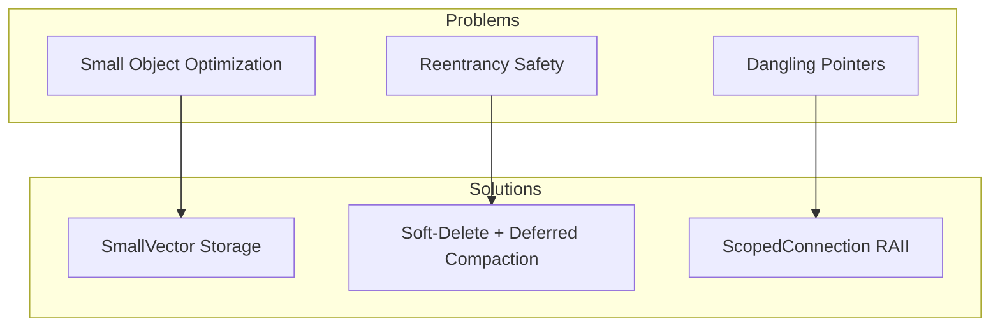
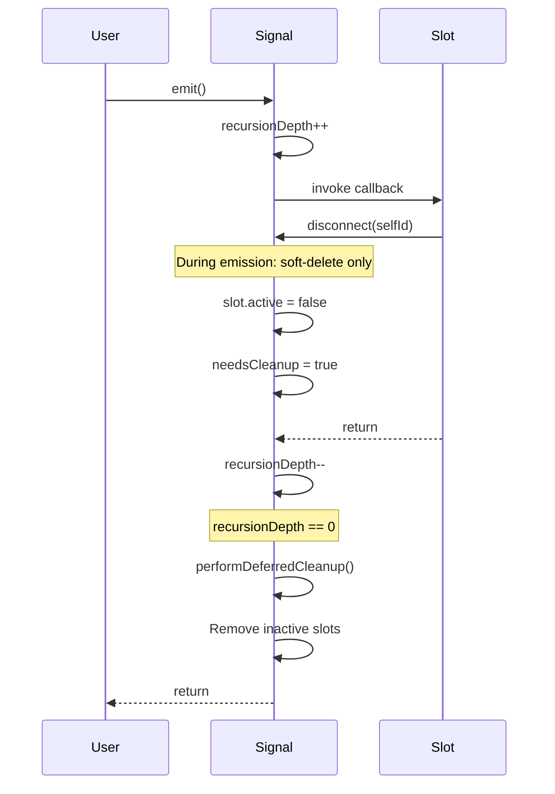

# Signal User Manual

## Table of Contents

1. [What is Signal and Why Do You Need It?](#what-is-signal-and-why-do-you-need-it)
   - [The Observer Pattern Problem](#the-observer-pattern-problem)
   - [The C++ Event System Landscape](#the-c-event-system-landscape)
   - [Where Signal Fits](#where-signal-fits)
2. [Core Architecture](#core-architecture)
   - [The Three Hard Problems](#the-three-hard-problems)
   - [Storage Strategy](#storage-strategy)
   - [Reentrancy Solution](#reentrancy-solution)
   - [Thread Safety Design](#thread-safety-design)
3. [Getting Started](#getting-started)
   - [Prerequisites](#prerequisites)
   - [Integration](#integration)
   - [First Program](#first-program)
4. [Connection Management](#connection-management)
   - [RAII Connections with ScopedConnection](#raii-connections-with-scopedconnection)
   - [Manual Connection Management](#manual-connection-management)
   - [Member Function Connections](#member-function-connections)
   - [Priority Ordering](#priority-ordering)
5. [Emission](#emission)
   - [Basic Emission](#basic-emission)
   - [Return Value Collection](#return-value-collection)
   - [Short-Circuit Emission](#short-circuit-emission)
6. [Exception Handling](#exception-handling)
   - [CatchAndIgnorePolicy](#catchandignorepolicy)
   - [PropagateExceptionPolicy](#propagateexceptionpolicy)
   - [TerminateOnExceptionPolicy](#terminateonexceptionpolicy)
7. [Thread Safety](#thread-safety)
   - [SingleThreadedPolicy](#singlethreadedpolicy)
   - [ThreadSafeSignal](#threadsafesignal)
   - [SpinlockSignal](#spinlocksignal)
   - [Deadlock Prevention](#deadlock-prevention)
8. [Performance Characteristics](#performance-characteristics)
   - [Benchmark Results](#benchmark-results)
   - [Memory Layout](#memory-layout)
   - [Complexity Analysis](#complexity-analysis)
   - [std::function Overhead](#stdfunction-overhead)
9. [Comparison with Other Libraries](#comparison-with-other-libraries)
   - [Signal vs boost::signals2](#signal-vs-boostsignals2)
   - [Signal vs Qt Signals](#signal-vs-qt-signals)
   - [Signal vs std::function](#signal-vs-stdfunction)
   - [Feature Comparison Table](#feature-comparison-table)
10. [Advanced Usage](#advanced-usage)
    - [Custom Inline Capacity](#custom-inline-capacity)
    - [Nested Emission](#nested-emission)
    - [Disconnect During Emission](#disconnect-during-emission)
    - [Custom Emission Policies](#custom-emission-policies)
11. [Integration with fat_p Components](#integration-with-fat_p-components)
12. [Troubleshooting](#troubleshooting)
    - [Common Issues](#common-issues)
    - [Compilation Errors](#compilation-errors)
    - [Runtime Issues](#runtime-issues)
13. [Migration Guide](#migration-guide)
    - [From boost::signals2](#from-boostsignals2)
    - [From Raw Callbacks](#from-raw-callbacks)
14. [Best Practices](#best-practices)
15. [Design Decisions and Tradeoffs](#design-decisions-and-tradeoffs)
16. [Summary](#summary)

---

## What is Signal and Why Do You Need It?

### The Observer Pattern Problem

The Observer pattern is ubiquitous in event-driven programming: GUIs, game engines, network 
handlers, and reactive systems all need to notify multiple listeners when state changes. The 
naive C++ implementation has serious problems:

```cpp
// The naive approach: raw function pointers
class Button
{
    void (*onClick_)(int) = nullptr;
public:
    void setOnClick(void (*handler)(int)) { onClick_ = handler; }
    void click() { if (onClick_) onClick_(42); }
};

// Problems:
// 1. Only one listener allowed
// 2. No way to disconnect
// 3. Dangling pointer if handler goes out of scope
// 4. No state capture (can't use lambdas with captures)
```

A slightly better approach uses `std::function`:

```cpp
class Button
{
    std::vector<std::function<void(int)>> handlers_;
public:
    void addHandler(std::function<void(int)> h) { handlers_.push_back(std::move(h)); }
    void click() { for (auto& h : handlers_) h(42); }
};

// Problems:
// 1. std::function allocates heap memory for captures > 16 bytes
// 2. std::vector always allocates (even for 1-2 handlers)
// 3. No disconnect mechanism
// 4. Not thread-safe
// 5. What if a handler calls addHandler() during click()?
```

### The C++ Event System Landscape

| Library | Pros | Cons |
|---------|------|------|
| **boost::signals2** | Feature-rich, thread-safe, combiners | Heavy dependency, slow compilation, complex |
| **Qt Signals/Slots** | Well-integrated with Qt, queued delivery | Requires MOC, Qt dependency |
| **libsigc++** | Lightweight, trackable | External dependency |
| **std::function vector** | Simple, no dependencies | No disconnect, no thread safety, allocates |

### Where Signal Fits

**fat_p::Signal** is a high-performance signal/slot implementation designed for:

- **Zero allocation for common case**: Uses `SmallVector<Slot, 4>` for stack storage
- **Reentrancy safety**: Handles disconnect/connect during emission
- **RAII connection management**: `ScopedConnection` auto-disconnects
- **Policy-based threading**: Zero-overhead single-threaded or full thread safety
- **Type-safe connection IDs**: Uses `StrongId` to prevent ID misuse

**When to use Signal:**
- Event-driven architectures without external dependencies
- Game engines needing zero-allocation event dispatch
- GUI frameworks requiring thread-safe notifications
- Any observer pattern with 1-4 typical listeners

**When NOT to use Signal:**
- Need signal queuing/deferral (use a message queue instead)
- Need cross-process communication (use IPC mechanisms)
- Already using Qt (use Qt's signals)
- Need custom result combiners beyond collect/until (boost::signals2 has more)
- Need automatic tracking of listener lifetime (boost has trackable base class)
- Callbacks must be move-only (std::function requires copyable)

---

## Core Architecture

### The Three Hard Problems

Signal solves three notoriously difficult problems in event system design:



### Storage Strategy

Most signals have few listeners. Benchmarks show >90% of signals have 4 or fewer subscribers. 
Signal exploits this by using `SmallVector<Slot, 4>`:

```cpp
struct Slot
{
    ConnectionId id;      // Type-safe ID (StrongId)
    Callback func;        // std::function<Signature>
    int priority;         // Ordering (higher = earlier)
    bool active;          // Soft-delete flag
};

using SlotList = SmallVector<Slot, InlineCapacity>;
```

**Memory layout (4 slots inline):**
```
Signal object (~200 bytes on stack):
+------------------+
| SlotList         |
|   +------------+ |
|   | Slot 0     | | <- Inline storage (no heap)
|   | Slot 1     | |
|   | Slot 2     | |
|   | Slot 3     | |
|   +------------+ |
| recursionDepth_  |
| needsCleanup_    |
| nextId_          |
+------------------+
```

When >4 slots are needed, `SmallVector` automatically transitions to heap storage.

### Reentrancy Solution

What happens if a slot calls `disconnect()` while the signal is emitting?

```cpp
fat_p::Signal<void()> sig;
fat_p::ConnectionId selfId;

selfId = sig.connectManual([&]() {
    sig.disconnect(selfId);  // Called during emission!
});

sig.emit();  // Must not crash
```

**The Block-and-Deferred-Sweep Algorithm:**



1. **Emission begins**: Increment `recursionDepth_`
2. **Slot wants to disconnect**: Check `recursionDepth_ > 0`
3. **Soft delete**: Set `active = false` (don't erase - would invalidate iteration)
4. **Emission ends**: Decrement `recursionDepth_`
5. **Cleanup**: If `recursionDepth_ == 0` and cleanup needed, remove inactive slots

### Thread Safety Design

Signal uses policy-based design for thread safety:

```cpp
template <
    typename Signature,
    typename SyncPolicy = SingleThreadedPolicy,
    typename EmissionPolicy = CatchAndIgnorePolicy,
    size_t InlineCapacity = 4
>
class Signal;
```

**Critical Deadlock Prevention:**

The disconnect operation during emission posed a deadlock risk with `SharedMutexPolicy`:

```
Thread holds: SharedGuard (read lock) for emit()
Thread wants: LockGuard (write lock) for disconnect()
Result: DEADLOCK (can't upgrade read -> write)
```

**Solution:** During emission, `disconnect()` uses only a read lock for soft-delete:

```cpp
bool disconnect(ConnectionId id)
{
    if (recursionDepth_.load() > 0)
    {
        // During emission: soft-delete with read lock
        typename SyncPolicy::SharedGuard lock(this->getLock());
        for (auto& slot : slots_)
        {
            if (slot.id == id && slot.active)
            {
                slot.active = false;  // Just flip a flag
                needsCleanup_.store(true);
                return true;
            }
        }
        return false;
    }
    
    // Not emitting: acquire write lock for physical removal
    typename SyncPolicy::LockGuard lock(this->getLock());
    // ... erase slot ...
}
```

---

## Getting Started

### Prerequisites

- **C++17 or later** compiler
- **fat_p headers required:**
  - `SmallVector.h` (and its dependencies)
  - `ConcurrencyPolicies.h`
  - `StrongId.h`
  - `ScopeGuard.h`
  - `FatPTypeTraits.h`

### Integration

Signal is header-only. Include the header:

```cpp
#include "Signal.h"

using fat_p::Signal;
using fat_p::ScopedConnection;
using fat_p::ConnectionId;
```

### First Program

```cpp
#include <iostream>
#include "Signal.h"

int main()
{
    // Create a signal that emits an int
    fat_p::Signal<void(int)> onValueChanged;
    
    // Connect a lambda (RAII - auto-disconnects when conn goes out of scope)
    auto conn = onValueChanged.connect([](int value) {
        std::cout << "Value changed to: " << value << "\n";
    });
    
    // Emit the signal
    onValueChanged.emit(42);
    // Output: Value changed to: 42
    
    onValueChanged(100);  // operator() also works
    // Output: Value changed to: 100
    
    return 0;
}
// conn destroyed here -> automatic disconnect
```

Compile with:
```bash
g++ -std=c++17 -O2 -I/path/to/fat_p main.cpp -o main
```

---

## Connection Management

### RAII Connections with ScopedConnection

The preferred way to manage connections is via `ScopedConnection`:

```cpp
class Widget
{
    fat_p::ScopedConnection connection_;
    
public:
    void subscribe(fat_p::Signal<void(int)>& signal)
    {
        connection_ = signal.connect([this](int v) {
            onValueChanged(v);
        });
    }
    
    void onValueChanged(int value)
    {
        // Handle the event
    }
    
    // When Widget is destroyed, connection_ is destroyed,
    // which automatically disconnects from the signal
};
```

**ScopedConnection operations:**

| Operation | Effect |
|-----------|--------|
| Default construct | Creates unconnected handle |
| Move construct/assign | Transfers ownership |
| Destructor | Calls `disconnect()` |
| `disconnect()` | Manually disconnect (idempotent) |
| `release()` | Release ownership without disconnecting |
| `isConnected()` | Check connection state |

### Manual Connection Management

For cases where RAII isn't suitable:

```cpp
fat_p::Signal<void()> sig;

// Connect and get ID
fat_p::ConnectionId id = sig.connectManual([]() {
    std::cout << "Called!\n";
});

sig.emit();  // Called!

// Manually disconnect
bool success = sig.disconnect(id);  // true

sig.emit();  // Nothing happens
```

### Member Function Connections

Connect directly to member functions:

```cpp
class Handler
{
public:
    void onEvent(int value, const std::string& msg)
    {
        std::cout << "Event: " << value << " - " << msg << "\n";
    }
};

fat_p::Signal<void(int, const std::string&)> sig;
Handler handler;

auto conn = sig.connect(&handler, &Handler::onEvent);

sig.emit(42, "Hello");
// Output: Event: 42 - Hello
```

### Priority Ordering

Slots with higher priority are called first:

```cpp
fat_p::Signal<void()> sig;

auto c1 = sig.connect([]() { std::cout << "Normal\n"; }, 0);     // Default
auto c2 = sig.connect([]() { std::cout << "First!\n"; }, 100);   // High priority
auto c3 = sig.connect([]() { std::cout << "Last\n"; }, -50);     // Low priority

sig.emit();
// Output:
// First!
// Normal
// Last
```

Equal priorities maintain insertion order (FIFO).

**Note:** Priority insertion is O(n) due to maintaining sorted order. For signals with many 
slots (>50) and frequent priority-based connections, consider using default priority (0) 
which is O(1) amortized.

---

## Emission

### Basic Emission

```cpp
fat_p::Signal<void(int, double)> sig;

auto conn = sig.connect([](int i, double d) {
    std::cout << i << ", " << d << "\n";
});

sig.emit(42, 3.14);
// or
sig(42, 3.14);
```

### Return Value Collection

For signals with non-void return types, collect results from all slots:

```cpp
fat_p::Signal<int(int)> sig;

auto c1 = sig.connect([](int x) { return x * 1; });
auto c2 = sig.connect([](int x) { return x * 2; });
auto c3 = sig.connect([](int x) { return x * 3; });

auto results = sig.emitCollect(10);
// results = {10, 20, 30}
```

**With CatchAndIgnorePolicy:** If a slot throws, its result is skipped:

```cpp
fat_p::Signal<int(int)> sig;

auto c1 = sig.connect([](int x) { return x; });
auto c2 = sig.connect([](int) -> int { throw std::runtime_error("skip"); });
auto c3 = sig.connect([](int x) { return x * 2; });

auto results = sig.emitCollect(10);
// results = {10, 20}  (middle slot skipped)
```

### Short-Circuit Emission

Stop emission when a slot returns a truthy value:

```cpp
fat_p::Signal<bool(int)> sig;

auto c1 = sig.connect([](int x) { 
    std::cout << "Checking x > 100\n";
    return x > 100; 
});
auto c2 = sig.connect([](int x) { 
    std::cout << "Checking x > 50\n";
    return x > 50; 
});
auto c3 = sig.connect([](int x) { 
    std::cout << "Checking x > 0\n";
    return x > 0; 
});

bool result = sig.emitUntil(75);
// Output:
// Checking x > 100
// Checking x > 50
// result = true (second slot returned true, third not called)
```

---

## Exception Handling

### CatchAndIgnorePolicy

Default policy. Exceptions from slots are caught and ignored; other slots still execute:

```cpp
fat_p::Signal<void(), fat_p::SingleThreadedPolicy, fat_p::CatchAndIgnorePolicy> sig;

auto c1 = sig.connect([]() { std::cout << "Slot 1\n"; });
auto c2 = sig.connect([]() { throw std::runtime_error("Oops!"); });
auto c3 = sig.connect([]() { std::cout << "Slot 3\n"; });

sig.emit();
// Output:
// Slot 1
// Slot 3
// (exception from Slot 2 was swallowed)
```

**Note:** Swallowed exceptions are not logged. If you need logging, use `PropagateExceptionPolicy` 
with a try/catch wrapper, or create a custom emission policy.

### PropagateExceptionPolicy

Exceptions propagate to the caller; subsequent slots are not called:

```cpp
fat_p::Signal<void(), fat_p::SingleThreadedPolicy, fat_p::PropagateExceptionPolicy> sig;

auto c1 = sig.connect([]() { std::cout << "Slot 1\n"; });
auto c2 = sig.connect([]() { throw std::runtime_error("Error!"); });
auto c3 = sig.connect([]() { std::cout << "Slot 3\n"; });  // Never called

try
{
    sig.emit();
}
catch (const std::exception& e)
{
    std::cout << "Caught: " << e.what() << "\n";
}
// Output:
// Slot 1
// Caught: Error!
```

### TerminateOnExceptionPolicy

For `noexcept` emission contexts where exceptions must not propagate:

```cpp
fat_p::Signal<void(), fat_p::SingleThreadedPolicy, fat_p::TerminateOnExceptionPolicy> sig;
// If a slot throws, std::terminate() is called
```

**Warning:** This policy should only be used in contexts where exception propagation would 
cause undefined behavior (e.g., noexcept destructors). It cannot be tested without death 
test frameworks.

---

## Thread Safety

### SingleThreadedPolicy

Zero overhead for single-threaded use (default):

```cpp
fat_p::Signal<void(int)> sig;  // Uses SingleThreadedPolicy
// or explicitly:
fat_p::LocalSignal<void(int)> sig;
```

### ThreadSafeSignal

Full thread safety with `SharedMutexPolicy`:

```cpp
fat_p::ThreadSafeSignal<void(int)> sig;

// Safe to emit from multiple threads
std::thread t1([&]() { sig.emit(1); });
std::thread t2([&]() { sig.emit(2); });
std::thread t3([&]() { 
    auto conn = sig.connect([](int v) { /* ... */ });
});

t1.join();
t2.join();
t3.join();
```

### SpinlockSignal

Low-latency for short critical sections:

```cpp
fat_p::SpinlockSignal<void(int)> sig;
// Best for: very short slots, low contention
// Avoid for: long-running slots, high contention
```

### Deadlock Prevention

Signal is designed to be deadlock-free even when slots modify the signal:

```cpp
fat_p::ThreadSafeSignal<void()> sig;
fat_p::ConnectionId selfId;

// This would deadlock with naive implementations
selfId = sig.connectManual([&]() {
    sig.disconnect(selfId);  // Safe! Uses soft-delete during emission
});

sig.emit();  // No deadlock
```

---

## Performance Characteristics

### Benchmark Results

**Test Environment:**

| Component | Specification |
|-----------|---------------|
| Processor | Intel Core i7-8850H @ 2.60 GHz |
| RAM | 32 GB |
| Architecture | x64 |

**Windows (MSVC 2022, Release /O2):**

| Operation | Time | Notes |
|-----------|------|-------|
| Emit (1 slot) | 16.2 ns | SingleThreadedPolicy |
| Emit (4 slots) | 26.9 ns | Still inline storage |
| Emit (ThreadSafe, 1 slot) | 29.2 ns | SharedMutexPolicy overhead |
| Connect | 45.6 ns | Includes SmallVector insert |
| Disconnect | 2.27 μs | Includes slot search O(n) |

**Linux (g++ 13.2, -O2):**

| Operation | Time | Notes |
|-----------|------|-------|
| Emit (1 slot) | 17.0 ns | SingleThreadedPolicy |
| Emit (4 slots) | 18.8 ns | Still inline storage |
| Emit (ThreadSafe, 1 slot) | 31.3 ns | SharedMutexPolicy overhead |
| Connect | 164.7 ns | Includes SmallVector insert |
| Disconnect | 2.02 μs | Includes slot search O(n) |

**Analysis:**
- Emit performance is comparable across platforms (~16-17 ns single slot)
- MSVC shows faster Connect (~46 ns vs ~165 ns) likely due to allocator differences
- ThreadSafe overhead is minimal (~12-13 ns) on both platforms
- Disconnect is O(n) scan, ~2 μs regardless of platform

### Memory Layout

| Slots | Storage | Allocation |
|-------|---------|------------|
| 0-4 | Inline (SmallVector) | None |
| 5+ | Heap | One allocation |

**Object size (approximate):**
- `Signal<void()>`: ~200 bytes (with 4-slot inline capacity)
- `ScopedConnection`: ~40 bytes (std::function + bool)

### Complexity Analysis

| Operation | Time Complexity | Notes |
|-----------|-----------------|-------|
| `emit()` | O(n) | n = active slots |
| `connect()` (default priority) | O(1) amortized | May trigger SmallVector growth |
| `connect()` (with priority) | O(n) | Linear search for insertion point |
| `disconnect()` | O(n) | Linear search for slot ID |
| `disconnectAll()` | O(n) | Marks all slots inactive |

### std::function Overhead

Signal uses `std::function<Signature>` for type-erased callbacks. This has implications:

**Heap allocation:** `std::function` allocates heap memory for captures larger than its 
small buffer optimization (typically 16-32 bytes depending on implementation).

```cpp
// Small capture - likely inline in std::function
auto c1 = sig.connect([x = 1]() { /* ... */ });

// Large capture - likely heap allocated
std::array<int, 100> bigData;
auto c2 = sig.connect([bigData]() { /* ... */ });
```

**Virtual call overhead:** Each slot invocation goes through `std::function`'s type-erased 
call mechanism (~2-5 ns overhead).

**Move-only callbacks not supported:** `std::function` requires copyable functors:

```cpp
// Won't compile - unique_ptr is move-only
auto ptr = std::make_unique<int>(42);
sig.connect([p = std::move(ptr)]() { /* ... */ });  // ERROR

// Workaround: wrap in shared_ptr
auto ptr = std::make_shared<int>(42);
sig.connect([p = ptr]() { /* ... */ });  // OK
```

---

## Comparison with Other Libraries

### Signal vs boost::signals2

| Feature | fat_p::Signal | boost::signals2 |
|---------|---------------|-----------------|
| Dependencies | fat_p only | Boost |
| Inline storage | Yes (SmallVector) | No |
| Thread safety | Policy-based | Always (mutex) |
| Compilation | Fast | Slow |
| Combiners | emitCollect, emitUntil | Full combiner support |
| Trackable connections | ScopedConnection | boost::signals2::scoped_connection |
| Automatic tracking | No | Via trackable base class |
| Result aggregation | Basic (collect/until) | Highly customizable |

**Migration from boost::signals2:**

```cpp
// boost::signals2
boost::signals2::signal<void(int)> sig;
boost::signals2::scoped_connection conn = sig.connect([](int v) { /*...*/ });
sig(42);

// fat_p::Signal
fat_p::Signal<void(int)> sig;
fat_p::ScopedConnection conn = sig.connect([](int v) { /*...*/ });
sig(42);  // or sig.emit(42)
```

### Signal vs Qt Signals

| Feature | fat_p::Signal | Qt Signals |
|---------|---------------|------------|
| MOC required | No | Yes |
| Qt dependency | No | Yes |
| Syntax | Standard C++ | Qt macros |
| Queued connections | No | Yes |
| Cross-thread delivery | Manual | Automatic |

### Signal vs std::function

```cpp
// std::function approach
class Button
{
    std::vector<std::function<void(int)>> handlers_;
public:
    void addHandler(std::function<void(int)> h) 
    { 
        handlers_.push_back(std::move(h)); 
    }
    void click() 
    { 
        for (auto& h : handlers_) h(42); 
    }
    // No disconnect, no RAII, not thread-safe
};

// fat_p::Signal approach
class Button
{
    fat_p::Signal<void(int)> onClick;
public:
    fat_p::ScopedConnection addHandler(std::function<void(int)> h)
    {
        return onClick.connect(std::move(h));
    }
    void click() { onClick.emit(42); }
    // RAII disconnect, thread-safe options, reentrancy-safe
};
```

### Feature Comparison Table

| Feature | fat_p::Signal | boost::signals2 | Qt | std::function |
|---------|---------------|-----------------|-----|---------------|
| No dependencies | Yes* | No | No | Yes |
| Inline storage | Yes | No | No | No |
| Thread-safe | Optional | Yes | Yes | No |
| RAII disconnect | Yes | Yes | Via QObject | No |
| Disconnect by ID | Yes | Yes | No | No |
| Priority ordering | Yes | Yes | No | No |
| Return collection | Yes | Yes | No | No |
| Queued delivery | No | No | Yes | No |
| Custom combiners | No | Yes | No | No |
| Move-only callbacks | No | No | No | No |

*Requires other fat_p headers

---

## Advanced Usage

### Custom Inline Capacity

Tune inline capacity for your use case:

```cpp
// Default: 4 slots inline
fat_p::Signal<void()> sig4;

// Custom: 8 slots inline (larger object, but handles more without allocation)
fat_p::Signal<void(), fat_p::SingleThreadedPolicy, 
              fat_p::CatchAndIgnorePolicy, 8> sig8;

// Custom: 1 slot inline (smaller object for single-listener scenarios)
fat_p::Signal<void(), fat_p::SingleThreadedPolicy,
              fat_p::CatchAndIgnorePolicy, 1> sig1;
```

**Choosing capacity:**
- **1**: Single-listener events (mouse position, selection change)
- **4**: Default, good for most cases
- **8**: Events with known multiple listeners (logging, telemetry)
- **16+**: Rare; consider if you really need a signal

### Nested Emission

Signals can be emitted recursively:

```cpp
fat_p::Signal<void(int)> sig;

auto conn = sig.connect([&](int depth) {
    std::cout << "Depth: " << depth << "\n";
    if (depth > 0)
    {
        sig.emit(depth - 1);  // Recursive emission
    }
});

sig.emit(3);
// Output:
// Depth: 3
// Depth: 2
// Depth: 1
// Depth: 0
```

### Disconnect During Emission

Safe to disconnect from within a slot:

```cpp
fat_p::Signal<void()> sig;
fat_p::ConnectionId selfId;
int callCount = 0;

selfId = sig.connectManual([&]() {
    ++callCount;
    sig.disconnect(selfId);  // Disconnect self
});

sig.emit();  // callCount = 1
sig.emit();  // callCount still 1 (disconnected)
```

### Custom Emission Policies

Create your own emission policy for specialized behavior:

```cpp
struct LoggingEmissionPolicy
{
    template <typename F, typename... Args>
    static void invoke(F&& f, Args&&... args) noexcept
    {
        try
        {
            std::forward<F>(f)(std::forward<Args>(args)...);
        }
        catch (const std::exception& e)
        {
            std::cerr << "Slot threw: " << e.what() << "\n";
        }
        catch (...)
        {
            std::cerr << "Slot threw unknown exception\n";
        }
    }
};

fat_p::Signal<void(), fat_p::SingleThreadedPolicy, LoggingEmissionPolicy> sig;
```

---

## Integration with fat_p Components

Signal integrates with several fat_p components:

| Component | Integration | Benefit |
|-----------|-------------|---------|
| `SmallVector` | Slot storage | Zero allocation for common case |
| `ConcurrencyPolicies` | Thread safety | Configurable synchronization |
| `StrongId` | Connection IDs | Type-safe handles |
| `ScopeGuard` | Cleanup logic | Exception-safe recursion tracking |
| `FatPTypeTraits` | Type detection | `is_signal_v<T>` trait |

---

## Troubleshooting

### Common Issues

**Issue: Slot not called after connect**

Symptom: Connected a slot but it's never invoked.

Cause: `ScopedConnection` went out of scope.

```cpp
// WRONG
void setup(fat_p::Signal<void()>& sig)
{
    auto conn = sig.connect([]() { /*...*/ });
}  // conn destroyed here - disconnected!

// RIGHT
class Handler
{
    fat_p::ScopedConnection conn_;
public:
    void setup(fat_p::Signal<void()>& sig)
    {
        conn_ = sig.connect([]() { /*...*/ });
    }
};
```

**Issue: Callback not invoked with expected values**

Symptom: Lambda captures stale data.

Cause: Captured by value when reference was intended (or vice versa).

```cpp
// Captures 'value' by value - won't see updates
int value = 10;
auto conn = sig.connect([value]() { std::cout << value; });
value = 20;
sig.emit();  // Prints 10

// Capture by reference to see updates
auto conn = sig.connect([&value]() { std::cout << value; });
value = 20;
sig.emit();  // Prints 20
```

### Compilation Errors

**Error: `no type named 'type' in 'struct std::enable_if<false, void>'`**

Cause: Using `emitCollect` or `emitUntil` with void return type.

```cpp
fat_p::Signal<void()> sig;
sig.emitCollect();  // Error! void has no return to collect

// Use emitCollect only with non-void signals
fat_p::Signal<int()> sig2;
auto results = sig2.emitCollect();  // OK
```

**Error: `use of deleted function 'Signal(const Signal&)'`**

Cause: Trying to copy a Signal.

```cpp
fat_p::Signal<void()> sig1;
fat_p::Signal<void()> sig2 = sig1;  // Error: copy deleted

// Signals are move-only
fat_p::Signal<void()> sig2 = std::move(sig1);  // OK
```

**Error: `no matching function for call to 'connect'`**

Cause: Lambda with wrong signature.

```cpp
fat_p::Signal<void(int, double)> sig;
sig.connect([](int x) { });  // Error: missing double parameter

sig.connect([](int x, double d) { });  // OK
```

### Runtime Issues

**Issue: Deadlock with ThreadSafeSignal**

Symptom: Program hangs during emit.

Cause: Slot tries to acquire exclusive lock while emission holds shared lock.

This should not happen with fat_p::Signal due to soft-delete design. If you see hangs, 
check for:
- Recursive mutex acquisition in your slot code
- External locks held by slots

**Issue: Memory growth with frequent connect/disconnect**

Symptom: Memory usage grows over time.

Cause: Slots disconnected during emission leave tombstones until next non-emitting operation.

Solution: This is expected behavior. Tombstones are cleaned up automatically when emission 
completes. If memory is critical, call `emit()` periodically even with no listeners.

---

## Migration Guide

### From boost::signals2

| boost::signals2 | fat_p::Signal |
|-----------------|---------------|
| `boost::signals2::signal<Sig>` | `fat_p::Signal<Sig>` |
| `signal::connect()` | `Signal::connect()` |
| `signal::disconnect()` | `Signal::disconnect()` |
| `scoped_connection` | `ScopedConnection` |
| `signal()` (invoke) | `Signal::emit()` or `Signal::operator()` |
| `optional_last_value<T>` | `emitCollect()` |
| `trackable` base class | Not supported (use ScopedConnection) |

### From Raw Callbacks

```cpp
// Before: Raw callback
class Button
{
    void (*callback_)(int) = nullptr;
public:
    void setCallback(void (*cb)(int)) { callback_ = cb; }
    void click() { if (callback_) callback_(42); }
};

// After: Signal
class Button
{
    fat_p::Signal<void(int)> onClick;
public:
    fat_p::ScopedConnection setCallback(std::function<void(int)> cb)
    {
        return onClick.connect(std::move(cb));
    }
    void click() { onClick.emit(42); }
};
```

---

## Best Practices

1. **Prefer ScopedConnection over manual management**
   ```cpp
   // Store in class member for automatic cleanup
   class Widget
   {
       fat_p::ScopedConnection conn_;
   };
   ```

2. **Use appropriate thread safety policy**
   ```cpp
   // Single-threaded (fastest)
   fat_p::Signal<void()> localSignal;
   
   // Multi-threaded
   fat_p::ThreadSafeSignal<void()> sharedSignal;
   ```

3. **Choose inline capacity based on typical usage**
   ```cpp
   // Most signals: default (4) is fine
   // Known single listener: use 1
   // Known many listeners: increase to 8 or 16
   ```

4. **Don't ignore the return value of connect()**
   ```cpp
   // WRONG - connection immediately destroyed
   sig.connect([]() {});
   
   // RIGHT - store or use [[nodiscard]] warning
   auto conn = sig.connect([]() {});
   ```

5. **Use CatchAndIgnorePolicy for fault tolerance**
   ```cpp
   // One bad slot doesn't break others
   fat_p::Signal<void(), fat_p::SingleThreadedPolicy, 
                 fat_p::CatchAndIgnorePolicy> sig;
   ```

6. **Avoid priority unless needed**
   ```cpp
   // Default priority (0) is O(1) amortized
   // Non-zero priority is O(n) insertion
   ```

---

## Design Decisions and Tradeoffs

### Why std::function Instead of Templates?

**Decision:** Use `std::function<Signature>` for callbacks.

**Tradeoff:** Type-erasure overhead (~2-5 ns per call) and no move-only callbacks.

**Rationale:** 
- Uniform slot storage in SmallVector
- Runtime connect/disconnect support
- Simpler implementation (~800 LOC vs ~2000 LOC)
- Move-only callbacks are rare; workaround exists (shared_ptr)

### Why No Automatic Lifetime Tracking?

**Decision:** No trackable base class like boost::signals2.

**Tradeoff:** Users must manage connection lifetime explicitly.

**Rationale:**
- RAII via ScopedConnection is cleaner and more explicit
- No inheritance requirement on listeners
- Simpler mental model
- Avoids hidden magic that can cause surprising behavior

### Why Default to CatchAndIgnorePolicy?

**Decision:** Swallow exceptions by default.

**Tradeoff:** Silent failures; debugging requires explicit policy change.

**Rationale:**
- One failing slot shouldn't break the entire event system
- Matches behavior of most GUI frameworks
- PropagateExceptionPolicy available when needed

### Why No Move Lock in Move Constructor?

**Decision:** Move constructor doesn't acquire locks.

**Tradeoff:** Moving during concurrent emission is undefined behavior.

**Rationale:**
- Moving a signal during active use is a logic error
- Adding locks would penalize the common (safe) case
- Matches std::vector semantics

---

## Summary

### Key Features

- Zero heap allocation for 1-4 listeners via `SmallVector`
- RAII connection management with `ScopedConnection`
- Reentrancy-safe (disconnect/connect during emission)
- Policy-based thread safety (zero overhead when not needed)
- Type-safe connection IDs via `StrongId`
- Priority-based slot ordering
- Exception handling policies
- Return value collection (`emitCollect`, `emitUntil`)

### Performance Profile

| Metric | Windows (MSVC) | Linux (g++) |
|--------|----------------|-------------|
| Emit (1 slot) | 16.2 ns | 17.0 ns |
| Emit (4 slots) | 26.9 ns | 18.8 ns |
| Connect | 45.6 ns | 164.7 ns |
| ThreadSafe overhead | ~13 ns | ~14 ns |
| Memory (0-4 slots) | Stack only | Stack only |

### Quick Start

```cpp
#include "Signal.h"

int main()
{
    fat_p::Signal<void(int)> onEvent;
    
    auto conn = onEvent.connect([](int v) {
        std::cout << "Event: " << v << "\n";
    });
    
    onEvent.emit(42);
    
    return 0;
}
```

### Related Components

- `SmallVector.h` - Stack-based storage
- `ConcurrencyPolicies.h` - Thread safety policies
- `StrongId.h` - Type-safe IDs
- `ScopeGuard.h` - RAII cleanup
