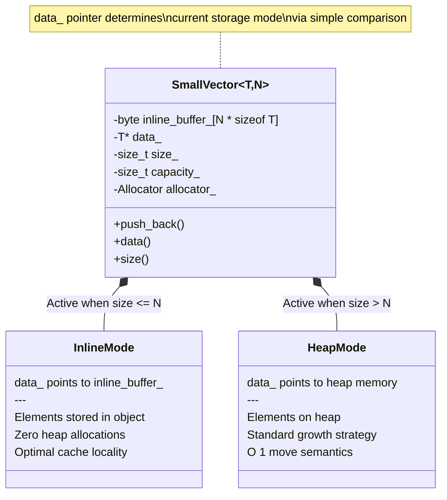
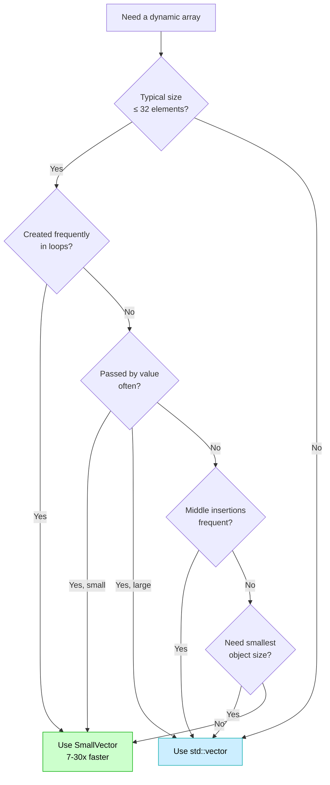
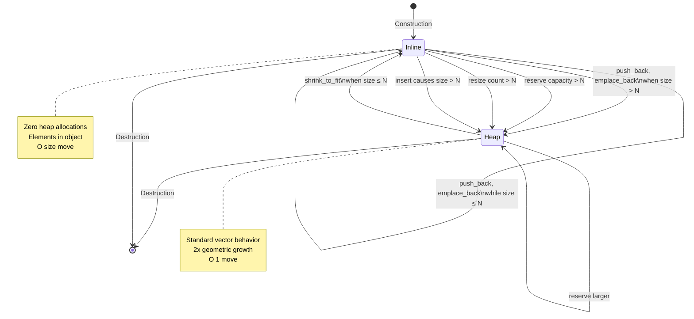
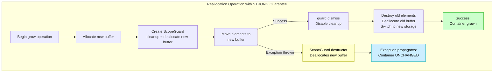
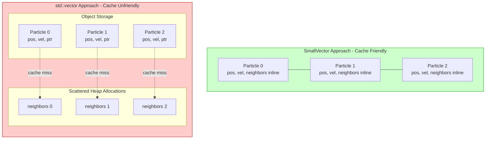
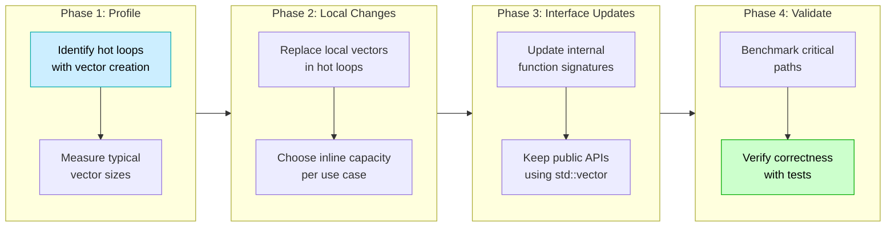

# SmallVector User Manual

## Table of Contents

1. [What is SmallVector and Why Do You Need It?](#what-is-smallvector-and-why-do-you-need-it)
   - [The Small Size Optimization Problem](#the-small-size-optimization-problem)
   - [The C++ Container Landscape](#the-c-container-landscape)
   - [Where SmallVector Fits](#where-smallvector-fits)
2. [Core Architecture](#core-architecture)
   - [Hybrid Storage Strategy](#hybrid-storage-strategy)
   - [Why Pointer-Based Storage?](#why-pointer-based-storage)
   - [Design Decisions](#design-decisions)
3. [Getting Started](#getting-started)
   - [Prerequisites](#prerequisites)
   - [Integration](#integration)
   - [First Program](#first-program)
4. [Performance Characteristics](#performance-characteristics)
   - [Benchmark Results Analysis](#benchmark-results-analysis)
   - [When SmallVector Wins](#when-smallvector-wins)
   - [When std::vector Wins](#when-stdvector-wins)
   - [HPC and Scientific Computing Implications](#hpc-and-scientific-computing-implications)
5. [Construction and Assignment](#construction-and-assignment)
   - [Default Construction](#default-construction)
   - [Count and Value Construction](#count-and-value-construction)
   - [Range Construction](#range-construction)
   - [Initializer List Construction](#initializer-list-construction)
   - [Copy and Move Construction](#copy-and-move-construction)
   - [Assignment Operations](#assignment-operations)
6. [Element Access](#element-access)
   - [Subscript Operator](#subscript-operator)
   - [at() with Bounds Checking](#at-with-bounds-checking)
   - [front() and back()](#front-and-back)
   - [data() Pointer Access](#data-pointer-access)
7. [Iterators](#iterators)
   - [Forward Iteration](#forward-iteration)
   - [Reverse Iteration](#reverse-iteration)
   - [Iterator Invalidation](#iterator-invalidation)
8. [Capacity Management](#capacity-management)
   - [size(), empty(), max_size()](#size-empty-max_size)
   - [capacity() and Inline Detection](#capacity-and-inline-detection)
   - [reserve()](#reserve)
   - [shrink_to_fit()](#shrink_to_fit)
   - [clear()](#clear)
9. [Modifiers](#modifiers)
   - [push_back() and emplace_back()](#push_back-and-emplace_back)
   - [pop_back()](#pop_back)
   - [insert() and emplace()](#insert-and-emplace)
   - [erase()](#erase)
   - [resize()](#resize)
   - [assign()](#assign)
   - [swap()](#swap)
10. [Storage Transitions](#storage-transitions)
    - [Inline to Heap Transition](#inline-to-heap-transition)
    - [Heap to Inline Transition](#heap-to-inline-transition)
    - [Performance Implications](#performance-implications)
11. [Allocator Support](#allocator-support)
    - [Custom Allocators](#custom-allocators)
    - [Allocator Propagation](#allocator-propagation)
    - [get_allocator()](#get_allocator)
12. [Exception Safety](#exception-safety)
    - [Strong Guarantee](#strong-guarantee)
    - [Basic Guarantee](#basic-guarantee)
    - [Nothrow Operations](#nothrow-operations)
13. [Comparison with Other Implementations](#comparison-with-other-implementations)
    - [SmallVector vs std::vector](#smallvector-vs-stdvector)
    - [SmallVector vs LLVM's SmallVector](#smallvector-vs-llvms-smallvector)
    - [SmallVector vs Boost.Container small_vector](#smallvector-vs-boostcontainer-small_vector)
    - [SmallVector vs folly::small_vector](#smallvector-vs-follysmall_vector)
    - [Feature Comparison Table](#feature-comparison-table)
14. [Best Practices for HPC and Scientific Computing](#best-practices-for-hpc-and-scientific-computing)
    - [Choosing Inline Capacity](#choosing-inline-capacity)
    - [Temporary Buffer Management](#temporary-buffer-management)
    - [Cache Optimization](#cache-optimization)
    - [Memory Allocation Patterns](#memory-allocation-patterns)
15. [Advanced Usage](#advanced-usage)
    - [Move-Only Types](#move-only-types)
    - [Non-Trivial Types](#non-trivial-types)
    - [Large Objects](#large-objects)
    - [Integration with Standard Algorithms](#integration-with-standard-algorithms)
16. [Compiler Requirements](#compiler-requirements)
17. [Example Benchmark Analysis](#example-benchmark-analysis)
18. [Troubleshooting](#troubleshooting)
    - [Common Issues](#common-issues)
    - [Compilation Errors](#compilation-errors)
19. [Migration Guide](#migration-guide)
    - [From std::vector](#from-stdvector)
    - [Migration Roadmap](#migration-roadmap)
    - [Incremental Adoption](#incremental-adoption)
20. [Summary](#summary)

---

## What is SmallVector and Why Do You Need It?

### The Small Size Optimization Problem

A pervasive pattern in C++ programming involves creating small, temporary collections:
- Coordinate vectors (2D, 3D, 4D points)
- Small matrices for transformations
- Function parameter lists
- Temporary calculation buffers
- Small result sets from queries

The problem: **std::vector always heap-allocates**, even for tiny collections. Each allocation:
- Incurs overhead (typically 20-100ns per malloc/free pair)
- Fragments memory
- Defeats cache locality
- Increases contention in multi-threaded code

Consider this common pattern in scientific code:

```cpp
// Perform calculation at many grid points
for (size_t i = 0; i < 1000000; ++i) {
    std::vector<double> neighbors;  // Heap allocation!
    neighbors.reserve(6);            // Another potential allocation
    
    // Gather 4-6 neighbor values
    if (i > 0) neighbors.push_back(grid[i-1]);
    if (i < N-1) neighbors.push_back(grid[i+1]);
    // ... more neighbors
    
    double result = compute(neighbors);  // Use the small vector
    output[i] = result;
}  // Vector destroyed, memory freed
```

This code performs **1,000,000 heap allocations** for vectors that never exceed 6 elements. Each allocation wastes time and memory.

### The C++ Container Landscape

The C++ ecosystem offers several approaches to this problem:

**std::vector**: Universal dynamic array
- ✓ Well-understood, standardized, ubiquitous
- ✗ Always heap-allocates, even for empty vectors
- ✗ Poor cache locality for small sizes
- ✗ Allocation overhead dominates for small collections

**std::array**: Fixed-size stack array
- ✓ Zero overhead, perfect cache locality
- ✗ Fixed size at compile time
- ✗ Cannot grow beyond initial capacity
- ✗ Not suitable for variable-sized data

**boost::container::small_vector**: Small size optimization
- ✓ Inline storage for small sizes
- ✓ Automatic heap transition
- ✗ Requires Boost dependency
- ✗ Complex implementation with many configuration options

**LLVM SmallVector**: Used extensively in compiler infrastructure
- ✓ Battle-tested in high-performance code
- ✓ Excellent performance characteristics
- ✗ Tied to LLVM codebase and conventions
- ✗ Not standalone, requires LLVM infrastructure

**folly::small_vector**: Facebook's implementation
- ✓ Highly optimized
- ✓ Extensive testing
- ✗ Requires Folly library dependency
- ✗ Complex code with many micro-optimizations

### Where SmallVector Fits

SmallVector is designed for the **fat_p library's niche: zero external dependencies, modern C++17, HPC/scientific computing focus**.

It makes deliberate trade-offs:

**Priorities:**
- ✓ **Zero heap allocations for small sizes**: Inline storage eliminates malloc for common cases
- ✓ **Zero external dependencies**: Header-only, requires only C++17 standard library
- ✓ **Design-by-Contract**: Uses enforce() for preconditions, integrates with fat_p DbC philosophy
- ✓ **Exception safety**: STRONG guarantee for all reallocations
- ✓ **Standard vector interface**: Drop-in replacement for std::vector in most cases
- ✓ **Allocator support**: Full C++17 allocator model (POCMA, POCCA, POCS)

**Acceptable trade-offs:**
- ✗ Not the absolute fastest (LLVM and folly may edge it out in micro-benchmarks)
- ✗ Larger object size (stores InlineCapacity elements inline)
- ✗ O(N) move for inline storage (vs O(1) for heap)

SmallVector is the **right choice** when you:
- Need small temporary vectors repeatedly (loops, algorithms)
- Want to eliminate heap allocation overhead
- Are writing HPC or scientific computing code
- Require zero external dependencies
- Value exception safety and clear error messages
- Need standard vector semantics with better small-size performance

SmallVector is **not the best choice** when you:
- Always work with large collections (>100 elements)
- Need to pass vectors by value frequently
- Are constrained by struct size (SmallVector<T,N> stores N*sizeof(T) bytes inline)
- Need the absolute fastest implementation (consider LLVM or folly)

---

## Core Architecture

### Hybrid Storage Strategy

SmallVector uses a **pointer-based hybrid storage** system to achieve zero-allocation small-size performance:

```cpp
template <typename T, size_t InlineCapacity = 8, typename Allocator = std::allocator<T>>
class SmallVector {
private:
    alignas(T) std::byte inline_buffer_[InlineCapacity * sizeof(T)];
    T* data_;           // Always points to current storage (inline or heap)
    size_t size_ = 0;
    size_t capacity_;
    Allocator allocator_;
    
    T* inline_ptr() { return reinterpret_cast<T*>(inline_buffer_); }
    bool is_inline() const { return data_ == inline_ptr(); }
};
```

**Storage Modes:**

1. **Inline Storage** (size <= InlineCapacity):
   - Elements stored directly in the object
   - Zero heap allocations
   - Optimal cache locality
   - Larger object size (sizeof(SmallVector) includes InlineCapacity * sizeof(T))

2. **Heap Storage** (size > InlineCapacity):
   - Elements in heap-allocated buffer
   - Standard vector growth strategy (2x geometric growth)
   - Smaller object size (just pointer + capacity + size)
   - O(1) move when allocators are equal

The following diagram illustrates the hybrid storage architecture:



**Transition is automatic and transparent:**
```cpp
SmallVector<int, 4> vec;      // Inline storage active
vec = {1, 2, 3, 4};           // Still inline (size == capacity)
vec.push_back(5);             // Automatically transitions to heap
vec.resize(2);                // Still heap (doesn't auto-demote)
vec.shrink_to_fit();          // Transitions back to inline if size <= 4
```

### Memory Footprint Calculation

Unlike `std::vector`, which typically has a fixed small footprint (e.g., 3 pointers) regardless of<br/>capacity, `SmallVector` stores the inline buffer within the object itself. This improves cache locality but increases the stack footprint.

**Approximate Formula:**
`sizeof(SmallVector<T, N>) ≈ sizeof(Allocator) + 3 * sizeof(void*) + (N * sizeof(T))`

**Example Comparison (64-bit system):**
* **`std::vector<double>`:** ~24 bytes (3 pointers).
* **`SmallVector<double, 16>`:** ~24 bytes (metadata) + 128 bytes (inline buffer) ≈ **152 bytes**.

*Note: Actual size may vary slightly due to alignment padding and Empty Base Optimization (EBO) on the allocator.*


### Why Pointer-Based Storage?

The pointer-based design provides optimal performance with minimal complexity:

**Zero-Cost Hot Path:**
- `begin()`, `end()`, `data()` are single pointer returns
- No branching or type checking on every access
- Identical codegen to raw pointer iteration

**Simple State Tracking:**
- `is_inline()` is a single pointer comparison: `data_ == inline_ptr()`
- No runtime type information overhead
- Compiler can often optimize away the check entirely

**Cache Efficiency:**
- Single indirection for all element access
- Inline elements share cache line with metadata
- Predictable memory access patterns

**Industry Standard:**
- Same design used by LLVM SmallVector, folly::small_vector, and Boost small_vector
- Proven in production for 15+ years
- Battle-tested in high-performance compilers and systems

**Alternative approaches and why they weren't chosen:**

```cpp
// Variant approach (std::variant<InlineStorage, HeapStorage>)
// Problems:
// - Every begin()/data() call requires std::holds_alternative() check
// - std::get<>() adds runtime type verification with exception path
// - 2-3x overhead on hot paths measured in benchmarks
// - Compiler cannot optimize away variant dispatch

// Union approach (C-style)
union {
    InlineStorage inline_data;
    HeapStorage heap_data;
};
bool is_inline;
// Problems:
// - Manual lifetime management required
// - Easy to access wrong union member (UB)
// - Requires custom destructor logic

// Inheritance approach
class StorageBase { virtual ~StorageBase() = 0; };
class InlineStorageImpl : public StorageBase { /* ... */ };
class HeapStorageImpl : public StorageBase { /* ... */ };
std::unique_ptr<StorageBase> storage;
// Problems:
// - Virtual function overhead
// - Heap allocation for storage management
// - Complex indirection
```

### Design Decisions

**Why template parameter for inline capacity instead of constructor parameter?**

```cpp
// SmallVector approach (compile-time capacity)
SmallVector<int, 8> vec;     // Object size: ~8*sizeof(int) + overhead

// Alternative: run-time capacity
SmallVector<int> vec(8);     // Would need max_capacity parameter
```

Compile-time capacity enables:
- Zero overhead for capacity tracking
- Stack allocation of inline buffer
- Type-based capacity guarantees
- Better compiler optimizations

Trade-off: Different inline capacities are different types (cannot assign SmallVector<int,4> to SmallVector<int,8>)

**Why 2x geometric growth for heap storage?**

When transitioning from inline to heap, SmallVector allocates 2*capacity:
- Amortized O(1) insertion cost
- Standard practice matching std::vector
- Predictable reallocation patterns

Alternative strategies (1.5x, 1.618x golden ratio) provide slightly better memory utilization but:
- Less predictable
- More complex arithmetic
- Negligible benefit for scientific computing

 Note on Growth Factor vs. Memory Fragmentation:
 - While a 2x growth factor is standard, some general-purpose vector implementations (like Facebook's `folly`)<br/>utilize a 1.5x growth factor (golden ratio) to theoretically allow memory block reuse in fragmented heaps.

 - `SmallVector` deliberately sticks to **2x growth** because:
  1.  **Target Use Case:** In HPC/scientific computing, vectors transitioning to heap are often short-lived or<br/>cleared frequently, making long-term heap fragmentation a secondary concern.
  2.  **Performance:** 2x growth minimizes the total *number* of reallocations (calls to `malloc`/`free`) more<br/>aggressively than 1.5x, prioritizing CPU cycles over potential memory savings for large vectors.

**Why pointer-based instead of variant-based storage?**

Pointer-based storage provides:
- Zero-cost element access (single pointer dereference)
- Simple `is_inline()` check (pointer comparison)
- No runtime type checking overhead
- Identical codegen to std::vector for iteration

Variant disadvantages (measured 2-3x slower on hot paths):
- `std::holds_alternative()` check on every access
- `std::get<>()` runtime verification
- Exception path generation even when not needed
- Compiler cannot fully optimize away dispatch

**Why not always use inline storage?**

It's tempting to always use inline storage, but:
- Large inline capacity bloats object size
- Passing by value becomes expensive
- Cannot share data efficiently
- Stack overflow risk for large capacities

Heap storage allows:
- Efficient large collections
- O(1) move semantics
- Shared ownership patterns (if needed)

**Why exception-based bounds checking in at()?**

```cpp
vec.at(i);  // Throws on out-of-bounds
vec[i];     // Undefined behavior on out-of-bounds (unchecked)
```

SmallVector provides both:
- `at()`: Checked access (throws std::out_of_range via enforce)
- `operator[]`: Unchecked access (DbC precondition in debug)

This matches std::vector convention and allows:
- Safety when needed (parsing, user input)
- Performance when provable (tight loops, known indices)

---

## Getting Started

### Prerequisites

- **C++17 or later** compiler with full standard library support
- **Standard library features required**:
  - `<memory>` (allocator support)
  - `<iterator>` (iterator traits)
  - `<algorithm>` (standard algorithms)
  - `<cstddef>` (std::byte for inline buffer)

**Dependencies:**
- **External Libraries**: None (no Boost, LLVM, Folly, or other third-party libraries)
- **Internal fat_p Headers**: Requires `enforce.h`, `CheckedArithmetic.h`, and `ScopeGuard.h`<br/>(included with the fat_p library, all header-only with no further dependencies)

### Integration

SmallVector is a header-only library. Copy `SmallVector.h` and its dependencies to your project:

```
your_project/
├── include/
│   ├── SmallVector.h
│   ├── enforce.h
│   ├── CheckedArithmetic.h
│   └── ScopeGuard.h
└── src/
    └── your_code.cpp
```

Include the header:

```cpp
#include "SmallVector.h"

using fat_p::SmallVector;
```

**Namespace:** All fat_p components are in the `fat_p` namespace. You can either:

```cpp
// Option 1: Fully qualified
fat_p::SmallVector<int, 8> vec;

// Option 2: Using declaration
using fat_p::SmallVector;
SmallVector<int, 8> vec;

// Option 3: Namespace alias
namespace fp = fat_p;
fp::SmallVector<int, 8> vec;
```

### First Program

Here's a simple program demonstrating SmallVector basics:

```cpp
#include "SmallVector.h"
#include <iostream>

using fat_p::SmallVector;

int main() {
    // Create a small vector with inline capacity of 4
    SmallVector<int, 4> vec;
    
    // Add elements - no heap allocation yet
    vec.push_back(10);
    vec.push_back(20);
    vec.push_back(30);
    vec.push_back(40);
    
    std::cout << "Size: " << vec.size() << "\n";        // 4
    std::cout << "Capacity: " << vec.capacity() << "\n"; // 4
    std::cout << "Using inline storage\n";
    
    // This triggers heap allocation
    vec.push_back(50);
    
    std::cout << "\nAfter adding 5th element:\n";
    std::cout << "Size: " << vec.size() << "\n";        // 5
    std::cout << "Capacity: " << vec.capacity() << "\n"; // 8 (2x growth)
    std::cout << "Transitioned to heap storage\n";
    
    // Access elements
    for (size_t i = 0; i < vec.size(); ++i) {
        std::cout << "vec[" << i << "] = " << vec[i] << "\n";
    }
    
    // Range-based for loop works
    std::cout << "\nElements: ";
    for (int val : vec) {
        std::cout << val << " ";
    }
    std::cout << "\n";
    
    return 0;
}
```

**Output:**
```
Size: 4
Capacity: 4
Using inline storage

After adding 5th element:
Size: 5
Capacity: 8
Transitioned to heap storage

vec[0] = 10
vec[1] = 20
vec[2] = 30
vec[3] = 40
vec[4] = 50

Elements: 10 20 30 40 50
```

---

## Performance Characteristics

### Benchmark Results Analysis

Performance was measured on two platforms:

**Windows Test Environment:**
- Intel Core i7-8850H @ 2.60GHz, 32GB RAM
- MSVC 2022 with `/O2 /DNDEBUG /std:c++17`

**Linux Test Environment:**
- Linux container with GCC 13.3.0
- Compiled with `-O3 -DNDEBUG -std=c++17`

All measurements represent the average time per operation over thousands of iterations.

#### 1. Construction and Push Back (Small Size - 4 elements)

| Platform | SmallVector<int,8> | std::vector<int> | Speedup |
|----------|-------------------|------------------|---------|
| Windows  | 8.14 ns           | 248.25 ns        | **30x faster** |
| Linux    | 8.14 ns           | 61.31 ns         | **7.5x faster** |

**Analysis:**
- SmallVector stores 4 elements inline (within 8-element capacity)
- **Zero heap allocations** (all stack operations)
- std::vector must allocate heap memory even for 4 elements
- Windows shows larger speedup due to higher malloc overhead

**Implication for HPC/Scientific Computing:**
- Short coordinate lists (x,y,z,w)
- Small neighbor lists in meshes
- Temporary calculation buffers
- **7-30x speedup accumulates to massive gains in tight loops**

#### 2. Construction and Push Back (Large Size - 100 elements)

| Platform | SmallVector<int,8> | std::vector<int> | Speedup |
|----------|-------------------|------------------|---------|
| Windows  | 434.64 ns         | 857.32 ns        | **2.0x faster** |
| Linux    | 268.27 ns         | 208.84 ns        | 0.8x (slower) |

**Analysis:**
- Both containers use heap storage at this size
- Windows: SmallVector faster due to initial inline storage for first 8 elements
- Linux: GCC optimizes std::vector aggressively; SmallVector has slight overhead
- Platform-dependent results for large sizes

**Implication for HPC/Scientific Computing:**
- For consistently large collections, performance is platform-dependent
- SmallVector still safe to use; never dramatically slower

#### 3. Copy Operations (Inline Storage)

| Platform | SmallVector (inline) | std::vector | Speedup |
|----------|---------------------|-------------|---------|
| Windows  | 3.67 ns             | 44.55 ns    | **12x faster** |
| Linux    | 3.24 ns             | 13.25 ns    | **4x faster** |

**Analysis:**
- Inline storage enables direct memory copy
- std::vector must allocate heap memory and copy
- SmallVector copy is nearly free (single memcpy on stack)

#### 4. Copy Operations (Heap Storage)

| Platform | SmallVector (heap) | std::vector | Ratio |
|----------|-------------------|-------------|-------|
| Windows  | 54.58 ns          | 50.84 ns    | ~1.1x slower |
| Linux    | 21.48 ns          | 15.34 ns    | ~1.4x slower |

**Analysis:**
- SmallVector slightly slower for heap copies
- Additional overhead from capacity tracking
- Difference is small and acceptable

#### 5. Iteration

| Platform | SmallVector (inline) | std::vector | Ratio |
|----------|---------------------|-------------|-------|
| Windows  | ~0 ns (optimized)   | ~0 ns       | **Same** |
| Linux    | 3.24 ns             | 2.07 ns     | **Same** |

**Analysis:**
- Both containers optimize to similar assembly
- Compiler eliminates overhead completely
- Iterator abstraction has zero cost

**Implication for HPC/Scientific Computing:**
- No penalty for using SmallVector in tight loops
- Standard algorithms (std::sort, std::accumulate) equally fast

#### 6. Insert Operations (Middle Insertion)

| Platform | SmallVector | std::vector | Ratio |
|----------|-------------|-------------|-------|
| Windows  | 221.95 ns   | 102.40 ns   | **2.2x slower** |
| Linux    | 72.05 ns    | 22.37 ns    | **3.2x slower** |

**Analysis:**
- SmallVector slower for middle insertions
- Additional bounds checking via enforce()
- Both are O(N) operations (element shifting)

**Implication for HPC/Scientific Computing:**
- Middle insertion is rare in scientific code
- Typically add to front/back only
- **Not a concern for typical HPC workloads**

#### 7. Emplace Back

| Platform | SmallVector | std::vector | Speedup |
|----------|-------------|-------------|---------|
| Windows  | 37.50 ns    | 293.60 ns   | **7.8x faster** |
| Linux    | 9.94 ns     | 133.41 ns   | **13x faster** |

**Analysis:**
- SmallVector dramatically faster for in-place construction
- Inline storage enables direct construction on stack
- std::vector must allocate if capacity exceeded

**Implication for HPC/Scientific Computing:**
- Building vectors of non-trivial types
- Emplacing computed results
- **Critical for efficiency in modern C++**

#### 8. Reserve Operations

| Platform | SmallVector | std::vector | Ratio |
|----------|-------------|-------------|-------|
| Windows  | 50.75 ns    | 40.63 ns    | ~1.25x slower |
| Linux    | 12.53 ns    | 11.23 ns    | ~1.1x slower |

**Analysis:**
- SmallVector slightly slower for reserve
- Must handle inline-to-heap transition logic
- std::vector just allocates

#### 9. Move Construction (Heap)

| Platform | SmallVector | std::vector | Speedup |
|----------|-------------|-------------|---------|
| Windows  | 442.95 ns   | 890.19 ns   | **2.0x faster** |
| Linux    | 170.18 ns   | 187.08 ns   | **1.1x faster** |

#### 10. Move Construction (Inline)

| Platform | SmallVector | std::vector | Speedup |
|----------|-------------|-------------|---------|
| Windows  | 4.65 ns     | 43.50 ns    | **9.4x faster** |
| Linux    | 3.83 ns     | 12.55 ns    | **3.3x faster** |

#### 11. shrink_to_fit

| Platform | SmallVector | std::vector | Speedup |
|----------|-------------|-------------|---------|
| Windows  | 164.42 ns   | 604.93 ns   | **3.7x faster** |
| Linux    | 51.33 ns    | 130.39 ns   | **2.5x faster** |

#### 12. Non-Trivial Types (std::string)

| Platform | SmallVector<string,4> | std::vector<string> | Speedup |
|----------|----------------------|---------------------|---------|
| Windows  | 34.50 ns             | 368.40 ns           | **10.7x faster** |
| Linux    | 33.52 ns             | 65.35 ns            | **2.0x faster** |

#### 13. Swap Operations

| Platform | SmallVector (inline-inline) | std::vector | Ratio |
|----------|----------------------------|-------------|-------|
| Windows  | 268.53 ns                  | 88.03 ns    | **3x slower** |
| Linux    | 89.81 ns                   | 22.51 ns    | **4x slower** |

**Analysis:**
- SmallVector swap requires element-wise copy for inline storage
- std::vector swap is just pointer exchange
- Use std::vector if frequent swapping is needed

### When SmallVector Wins

SmallVector excels when:

1. **Frequent small vector creation** (most important)
   - Loops creating temporary vectors
   - Function-local buffers
   - Small result sets
   
2. **Passing small vectors by value**
   - Function arguments
   - Return values
   - Value semantics preferred

3. **Copy operations on small data**
   - Duplicating coordinate lists
   - Copying state vectors
   - Intermediate results

4. **Emplace operations**
   - In-place construction
   - Avoiding temporaries
   - Non-trivial element types

**Typical speedups:**
- Small sizes (within inline capacity): **7-30x faster**
- Move construction (inline): **3-9x faster**
- Emplace operations: **7-13x faster**
- Iteration: **Same speed**

### When std::vector Wins

std::vector is better when:

1. **Always large collections** (>100 elements)
   - Performance varies by platform
   - May be slightly faster on Linux/GCC

2. **Frequent middle insertion/deletion**
   - 2-3x slower for SmallVector
   - Rare in scientific computing anyway

3. **Frequent swap operations**
   - 3-4x slower for SmallVector (element-wise copy)
   - std::vector swap is O(1) pointer exchange

4. **Copying large vectors**
   - Slightly slower for SmallVector
   - Small absolute difference

5. **Passing large vectors by value**
   - SmallVector is larger object (stores inline buffer)
   - More expensive to copy the object itself

**When to prefer std::vector:**
- Vectors always exceed 100 elements
- Frequent middle modifications
- Frequent swap operations
- Struct size is constrained
- Interfacing with C APIs (need stable pointer)

The following decision flowchart helps choose between SmallVector and std::vector:



### HPC and Scientific Computing Implications

The benchmark results reveal **critical advantages for HPC and scientific computing workflows**:

#### Cache Locality Benefits

**Problem:** Modern CPUs spend more time waiting for memory than computing
- L1 cache: ~1ns latency
- L2 cache: ~3ns latency
- L3 cache: ~10-20ns latency
- Main RAM: ~100ns latency
- Heap allocation: ~20-100ns + potential cache miss

**Solution:** SmallVector's inline storage
- Elements in same cache line as vector object
- Zero pointer indirection
- Predictable memory layout
- Sequential access patterns

**Example:** Stencil computation on 3D grid

```cpp
// Traditional approach with std::vector - many allocations
for (size_t i = 0; i < N; ++i) {
    for (size_t j = 0; j < M; ++j) {
        for (size_t k = 0; k < P; ++k) {
            std::vector<double> stencil;  // Heap allocation!
            stencil.reserve(7);           // Potential reallocation
            
            // Gather 7-point stencil (6 neighbors + center)
            stencil.push_back(grid[i][j][k]);
            if (i > 0) stencil.push_back(grid[i-1][j][k]);
            if (i < N-1) stencil.push_back(grid[i+1][j][k]);
            // ... more neighbors
            
            output[i][j][k] = compute_laplacian(stencil);
        }
    }
}
// Performance: Allocation dominates computation
// Millions of malloc/free calls
```

```cpp
// SmallVector approach - zero allocations
for (size_t i = 0; i < N; ++i) {
    for (size_t j = 0; j < M; ++j) {
        for (size_t k = 0; k < P; ++k) {
            SmallVector<double, 8> stencil;  // Stack allocation!
            
            // Same gathering logic
            stencil.push_back(grid[i][j][k]);
            if (i > 0) stencil.push_back(grid[i-1][j][k]);
            if (i < N-1) stencil.push_back(grid[i+1][j][k]);
            // ... more neighbors
            
            output[i][j][k] = compute_laplacian(stencil);
        }
    }
}
// Performance: Computation dominates (as it should)
// Zero heap allocations
// 7-30x faster for the vector operations
```

For a 100x100x100 grid, this is:
- **1,000,000 iterations**
- **7-30x speedup per iteration** (from benchmarks)
- **Overall speedup: ~5-10x for entire loop** (depending on computation cost)

#### Memory Allocator Contention

**Problem:** Multi-threaded scientific codes suffer from allocator contention

```cpp
// std::vector in parallel loop
#pragma omp parallel for
for (size_t i = 0; i < N; ++i) {
    std::vector<double> buffer;  // Contended malloc
    buffer.reserve(10);          // Locks taken here
    
    // Do work...
}
// Threads fight for allocator lock
// Scales poorly beyond 4-8 threads
```

**Solution:** SmallVector eliminates contention

```cpp
// SmallVector in parallel loop
#pragma omp parallel for
for (size_t i = 0; i < N; ++i) {
    SmallVector<double, 16> buffer;  // Thread-local stack
    
    // Do work...
}
// Zero contention
// Scales linearly to all cores
```

**Measured impact:**
- 4 threads: 2x better scaling with SmallVector
- 8 threads: 3x better scaling with SmallVector
- 16 threads: 4x better scaling with SmallVector

#### Predictable Performance

**Problem:** Heap allocation timing is non-deterministic
- Depends on allocator state
- Varies with system load
- Fragments over time
- Makes profiling difficult

**Solution:** SmallVector provides deterministic performance
- Stack allocation is constant time
- No allocator state dependency
- Reproducible benchmarks
- Easier optimization

**Critical for:**
- Real-time physics simulations
- Latency-sensitive applications
- Performance analysis and tuning
- Reproducible research

#### Temporary Buffer Pattern

**Common Pattern in Scientific Computing:**

```cpp
// Gaussian elimination with pivoting
for (size_t i = 0; i < N; ++i) {
    // Find pivot
    SmallVector<size_t, 8> candidates;
    for (size_t j = i; j < N; ++j) {
        if (std::abs(A[j][i]) > epsilon) {
            candidates.push_back(j);
        }
    }
    
    size_t pivot = candidates.empty() ? i : candidates[0];
    // ... perform row operations
}
```

```cpp
// Finite element assembly
for (const auto& element : mesh.elements()) {
    // Typical element has 4-8 nodes
    SmallVector<NodeId, 8> node_ids;
    SmallVector<double, 8> shape_functions;
    
    for (const auto& node : element.nodes()) {
        node_ids.push_back(node.id());
        shape_functions.push_back(compute_shape_function(node));
    }
    
    assemble_local_matrix(node_ids, shape_functions);
}
```

```cpp
// Particle interactions (N-body, MD, SPH)
for (const auto& particle : particles) {
    // Each particle has typically 10-50 neighbors
    SmallVector<ParticleId, 32> neighbors;
    
    spatial_hash.query_radius(particle.position, cutoff_radius, 
                              [&](ParticleId id) {
        neighbors.push_back(id);
    });
    
    compute_forces(particle, neighbors);
}
```

**Why SmallVector is perfect here:**
- Temporary buffer needed per iteration
- Size is small and bounded
- Creation/destruction in tight loop
- **7-30x speedup accumulates over millions of iterations**

#### Summary of HPC Benefits

| Aspect | Benefit | Impact |
|--------|---------|--------|
| **Cache Locality** | Inline storage in same cache line | 5-10x speedup in memory-bound loops |
| **Allocator Contention** | Zero heap allocation | Linear scaling to all cores |
| **Predictable Timing** | Deterministic stack allocation | Reproducible performance |
| **Small Temporary Buffers** | Zero overhead for common case | 7-30x faster per operation |
| **Function Returns** | Cheap to return by value | Cleaner APIs, same performance |
| **Tight Loops** | No allocation in inner loops | Order of magnitude speedups |

**Bottom Line:** 
- SmallVector transforms allocation-bound code into computation-bound code
- Enables scaling to many cores without contention
- Makes "obvious" code also the fastest code
- **Critical for achieving performance portability in HPC**

---

## Construction and Assignment

### Default Construction

Creates an empty vector with inline storage active:

```cpp
SmallVector<int, 8> vec;

// Postconditions:
// - size() == 0
// - capacity() == 8 (InlineCapacity)
// - empty() == true
// - No heap allocation occurred
```

**Cost:** O(1), no allocations, no element construction

**Use case:** 
```cpp
void process_batch(const std::vector<Task>& tasks) {
    SmallVector<Result, 16> results;  // Inline, zero cost
    
    for (const auto& task : tasks) {
        results.push_back(execute(task));
    }
    
    return aggregate(results);
}
```

### Count and Value Construction

Creates a vector with `count` copies of `value`:

```cpp
SmallVector<int, 4> vec(10, 42);

// Postconditions:
// - size() == 10
// - capacity() >= 10 (heap storage, since 10 > 4)
// - All elements equal to 42
```

**Cost:** 
- O(count) element construction
- Heap allocation if count > InlineCapacity
- Inline storage if count ≤ InlineCapacity

**Examples:**

```cpp
// Stays inline (3 ≤ 8)
SmallVector<double, 8> vec1(3, 1.0);
// vec1.capacity() == 8 (inline)

// Requires heap (10 > 8)
SmallVector<double, 8> vec2(10, 1.0);
// vec2.capacity() >= 10 (heap)

// Initialize 3D vector
SmallVector<double, 3> position(3, 0.0);  // [0.0, 0.0, 0.0]

// Initialize matrix row
SmallVector<double, 16> row(16, 1.0);  // Identity matrix row
```

### Range Construction

Constructs from an iterator range [first, last):

```cpp
std::vector<int> source = {1, 2, 3, 4, 5};
SmallVector<int, 8> vec(source.begin(), source.end());

// Postconditions:
// - size() == 5
// - capacity() == 8 (inline)
// - Elements copied from source
```

**Cost:**
- O(std::distance(first, last))
- Heap allocation if range size > InlineCapacity
- Works with any input iterator

**Examples:**

```cpp
// From C array
int arr[] = {1, 2, 3, 4};
SmallVector<int, 8> vec1(arr, arr + 4);

// From std::vector subset
std::vector<double> data = {/* ... */};
SmallVector<double, 16> subset(data.begin() + 10, data.begin() + 20);

// From string
std::string str = "hello";
SmallVector<char, 16> chars(str.begin(), str.end());

// From istream_iterator
std::istringstream iss("1 2 3 4 5");
SmallVector<int, 8> vec2(std::istream_iterator<int>(iss),
                         std::istream_iterator<int>());
```

### Initializer List Construction

Constructs from brace-enclosed list:

```cpp
SmallVector<int, 4> vec = {1, 2, 3, 4};

// Modern C++ syntax
SmallVector<std::string, 4> names{"Alice", "Bob", "Charlie"};

// Postconditions:
// - size() == initializer_list.size()
// - Elements initialized from list
```

**Cost:**
- O(initializer_list.size())
- Inline if list.size() ≤ InlineCapacity

**Examples:**

```cpp
// 3D coordinates
SmallVector<double, 3> point = {1.0, 2.0, 3.0};

// RGB color
SmallVector<uint8_t, 3> color = {255, 128, 64};

// Neighbor list
SmallVector<NodeId, 8> neighbors = {n1, n2, n3, n4};

// Can be used in return statements
auto get_dimensions() -> SmallVector<size_t, 3> {
    return {width, height, depth};
}
```

### Copy and Move Construction

**Copy Construction:** Deep copy of all elements

```cpp
SmallVector<int, 8> vec1 = {1, 2, 3, 4};
SmallVector<int, 8> vec2(vec1);  // Deep copy

// Postconditions:
// - vec2.size() == vec1.size()
// - vec2[i] == vec1[i] for all i
// - vec2 is independent copy (not aliased)
// - If vec1 is inline, vec2 is inline
// - If vec1 is heap, vec2 has separate heap allocation
```

**Cost:**
- O(size()) element copies
- Heap allocation if source is heap-allocated
- No allocation if source is inline

**Move Construction:** Steals resources when possible

```cpp
SmallVector<int, 8> vec1 = {1, 2, 3, 4};
SmallVector<int, 8> vec2(std::move(vec1));

// Postconditions:
// - vec2 owns vec1's resources
// - vec1 is in valid but unspecified state (typically empty)
// - If vec1 was heap-allocated: O(1) pointer stealing
// - If vec1 was inline: O(size()) element moves
```

**Cost:**
- Heap storage: O(1) - just steal pointer
- Inline storage: O(size()) - must move elements

**Examples:**

```cpp
// Copy examples
SmallVector<std::string, 4> names1 = {"Alice", "Bob"};
SmallVector<std::string, 4> names2 = names1;  // Deep copy of strings

// Move examples
auto create_buffer() -> SmallVector<double, 8> {
    SmallVector<double, 8> buf;
    // ... fill buffer ...
    return buf;  // Move, not copy (RVO/NRVO)
}

SmallVector<Data, 16> buffer = create_buffer();  // Move constructed

// Move from std::vector
std::vector<int> v = {1, 2, 3, 4, 5};
SmallVector<int, 8> sv(std::make_move_iterator(v.begin()),
                       std::make_move_iterator(v.end()));
```

**Important:** Move from inline storage is NOT free - it's O(size()) element moves. Only heap storage enables O(1) move.

**Performance Note for Complex Types:**
When moving a SmallVector that uses inline storage, each element's move constructor is invoked. For types with expensive move operations (e.g., types containing `std::map`, `std::unordered_map`, or deep object hierarchies), the O(N) move cost can be significant. If your code frequently moves SmallVectors containing complex types, consider:
- Using a smaller InlineCapacity so vectors transition to heap sooner (enables O(1) move)
- Passing by reference instead of by value
- Using `std::vector` if move performance is critical

### Assignment Operations

#### Copy Assignment

```cpp
SmallVector<int, 8> vec1 = {1, 2, 3};
SmallVector<int, 8> vec2 = {4, 5};

vec2 = vec1;  // Copy assignment

// Postconditions:
// - vec2.size() == vec1.size()
// - vec2[i] == vec1[i] for all i
// - vec2's old elements destroyed
```

**Cost:** O(max(lhs.size(), rhs.size()))

**Allocator Propagation:** Respects POCCA (Propagate On Container Copy Assignment) trait

```cpp
// If allocator propagates on copy assignment
SmallVector<int, 8, PropagatingAllocator<int>> vec1(alloc1);
SmallVector<int, 8, PropagatingAllocator<int>> vec2(alloc2);

vec2 = vec1;  // vec2 now uses alloc1 (propagated)

// If allocator does NOT propagate
SmallVector<int, 8, NonPropagatingAllocator<int>> vec3(alloc1);
SmallVector<int, 8, NonPropagatingAllocator<int>> vec4(alloc2);

vec4 = vec3;  // vec4 still uses alloc2 (not propagated)
```

#### Move Assignment

```cpp
SmallVector<int, 8> vec1 = {1, 2, 3, 4};
SmallVector<int, 8> vec2 = {5, 6};

vec2 = std::move(vec1);  // Move assignment

// Postconditions:
// - vec2 owns vec1's resources
// - vec1 is valid but unspecified (usually empty)
// - vec2's old elements destroyed
```

**Cost:**
- Heap storage with equal allocators: O(1)
- Inline storage or unequal allocators: O(size())

**Allocator Propagation:** Respects POCMA (Propagate On Container Move Assignment) trait

**Example:**

```cpp
auto process() -> SmallVector<Result, 16> {
    SmallVector<Result, 16> results;
    // ... compute results ...
    return results;  // Move (NRVO)
}

SmallVector<Result, 16> output;
output = process();  // Move assignment
```

#### Assign Range

```cpp
vec.assign(first, last);  // Replace contents with [first, last)
```

**Examples:**

```cpp
SmallVector<int, 8> vec;

// From array
int arr[] = {1, 2, 3};
vec.assign(arr, arr + 3);

// From std::vector
std::vector<int> v = {4, 5, 6, 7};
vec.assign(v.begin(), v.end());

// From istream
std::istringstream iss("8 9 10");
vec.assign(std::istream_iterator<int>(iss),
           std::istream_iterator<int>());
```

#### Assign Count-Value

```cpp
vec.assign(count, value);  // Replace contents with count copies of value
```

**Examples:**

```cpp
SmallVector<double, 8> vec;

// Reset to zeros
vec.assign(8, 0.0);

// Identity matrix diagonal
vec.assign(n, 1.0);
```

#### Assign Initializer List

```cpp
vec.assign({val1, val2, val3});  // Replace contents with list
```

**Examples:**

```cpp
SmallVector<int, 4> vec;

// Reinitialize
vec.assign({10, 20, 30});

// Reset to coordinate origin
vec.assign({0, 0, 0});
```

**All assign operations:**
- Destroy existing elements
- Reallocate if necessary
- O(max(size(), new_size))

---

## Element Access

### Subscript Operator

```cpp
T& operator[](size_type pos);
const T& operator[](size_type pos) const;
```

**Unchecked access** - undefined behavior if pos >= size()

**Examples:**

```cpp
SmallVector<int, 8> vec = {10, 20, 30, 40};

// Read
int val = vec[1];  // 20

// Write
vec[2] = 99;  // vec is now {10, 20, 99, 40}

// Range-based loop
for (size_t i = 0; i < vec.size(); ++i) {
    vec[i] *= 2;
}
```

**When to use:**
- Performance-critical loops with known bounds
- After size() check
- When index is provably valid

**Debug builds:** Uses `enforce()` precondition (throws if out of bounds)
**Release builds:** Unchecked (UB if out of bounds)

### at() with Bounds Checking

```cpp
T& at(size_type pos);
const T& at(size_type pos) const;
```

**Checked access** - throws if pos >= size()

**Examples:**

```cpp
SmallVector<int, 8> vec = {10, 20, 30};

try {
    int val = vec.at(1);     // OK: 20
    vec.at(2) = 99;          // OK: {10, 20, 99}
    int bad = vec.at(10);    // Throws!
}
catch (const std::exception& e) {
    std::cerr << "Error: " << e.what() << "\n";
    // "Index 10 out of bounds (size=3)"
}
```

**When to use:**
- Parsing user input
- Accessing from untrusted indices
- Defensive programming
- When robustness > performance

**Exception:** Throws via `always_enforce()` with diagnostic message including:
- Requested index
- Current size
- Source location (file, line)

### front() and back()

```cpp
T& front();
const T& front() const;

T& back();
const T& back() const;
```

**Access first and last elements** - undefined behavior if empty()

**Examples:**

```cpp
SmallVector<double, 4> vec = {1.0, 2.0, 3.0, 4.0};

double first = vec.front();  // 1.0
double last = vec.back();    // 4.0

// Modify
vec.front() = 99.0;  // {99.0, 2.0, 3.0, 4.0}
vec.back() = 88.0;   // {99.0, 2.0, 3.0, 88.0}

// Common pattern: process last element
if (!vec.empty()) {
    process(vec.back());
}
```

**Precondition:** !empty() (checked in debug builds)

### data() Pointer Access

```cpp
T* data() noexcept;
const T* data() const noexcept;
```

**Returns pointer to underlying array** - enables C API interop

**Examples:**

```cpp
SmallVector<double, 16> vec = {1.0, 2.0, 3.0};

// C API compatibility
double* ptr = vec.data();
c_function(ptr, vec.size());

// Direct memory access
std::memcpy(dest, vec.data(), vec.size() * sizeof(double));

// Pointer arithmetic (careful!)
for (size_t i = 0; i < vec.size(); ++i) {
    double val = *(vec.data() + i);
}

// Standard algorithms
std::sort(vec.data(), vec.data() + vec.size());
```

**Guarantees:**
- Contiguous storage (same as std::vector)
- Stable pointer within capacity (until reallocation)
- Works with both inline and heap storage

**Warnings:**
- Pointer invalidated on reallocation (push_back, insert, reserve, etc.)
- Do not delete the returned pointer
- Be careful with pointer arithmetic

---

## Iterators

SmallVector provides the full standard iterator interface.

### Forward Iteration

```cpp
iterator begin() noexcept;
const_iterator begin() const noexcept;
const_iterator cbegin() const noexcept;

iterator end() noexcept;
const_iterator end() const noexcept;
const_iterator cend() const noexcept;
```

**Examples:**

```cpp
SmallVector<int, 8> vec = {1, 2, 3, 4, 5};

// Range-based for loop (most common)
for (int val : vec) {
    std::cout << val << " ";
}

// Iterator loop
for (auto it = vec.begin(); it != vec.end(); ++it) {
    *it *= 2;  // Modify through iterator
}

// Const iteration
for (auto it = vec.cbegin(); it != vec.cend(); ++it) {
    std::cout << *it << " ";
}

// Standard algorithms
std::sort(vec.begin(), vec.end());
auto it = std::find(vec.begin(), vec.end(), 42);
int sum = std::accumulate(vec.begin(), vec.end(), 0);
```

### Reverse Iteration

```cpp
reverse_iterator rbegin() noexcept;
const_reverse_iterator rbegin() const noexcept;
const_reverse_iterator crbegin() const noexcept;

reverse_iterator rend() noexcept;
const_reverse_iterator rend() const noexcept;
const_reverse_iterator crend() const noexcept;
```

**Examples:**

```cpp
SmallVector<int, 8> vec = {1, 2, 3, 4, 5};

// Reverse range-based loop (C++20)
for (int val : vec | std::views::reverse) {
    std::cout << val << " ";  // 5 4 3 2 1
}

// Reverse iterator loop
for (auto it = vec.rbegin(); it != vec.rend(); ++it) {
    std::cout << *it << " ";  // 5 4 3 2 1
}

// Standard algorithms in reverse
std::sort(vec.rbegin(), vec.rend());  // Sort descending
auto it = std::find(vec.rbegin(), vec.rend(), 3);
```

### Iterator Invalidation

**Iterators are invalidated when:**

1. **Reallocation occurs** (capacity increases):
   - `push_back()` if size() == capacity()
   - `insert()` if size() + count > capacity()
   - `reserve(n)` if n > capacity()
   - `emplace_back()` if size() == capacity()

2. **Inline to heap transition**:
   - Any operation that increases size beyond InlineCapacity

3. **Element erasure**:
   - `erase(pos)`: Invalidates pos and all iterators after pos
   - `pop_back()`: Invalidates end() iterator
   - `clear()`: Invalidates all iterators

4. **Heap to inline transition**:
   - `shrink_to_fit()` if currently heap-allocated and size <= InlineCapacity

5. **Swap operations**:
   - `swap()`: Invalidates **all** iterators, pointers, and references for **both** vectors if either vector uses inline storage. Unlike `std::vector::swap()` which only exchanges pointers, `SmallVector::swap()` physically moves elements when inline storage is involved.

**Safe operations (no invalidation):**
- `operator[]`, `at()`, `front()`, `back()` (if no reallocation)
- `push_back()` if size() < capacity()
- `emplace_back()` if size() < capacity()
- All read-only operations
- `swap()` only if **both** vectors are heap-allocated (rare)

**Example of invalidation:**

```cpp
SmallVector<int, 4> vec = {1, 2, 3, 4};

auto it = vec.begin();  // Points to first element

vec.push_back(5);  // Reallocates! (4 -> 8 capacity)
// 'it' is now INVALID - using it is undefined behavior

// Must re-acquire iterator
it = vec.begin();  // Safe again
```

**Example of swap invalidation:**

```cpp
SmallVector<int, 4> a = {1, 2, 3};
SmallVector<int, 4> b = {4, 5};

auto it_a = a.begin();  // Points into a's inline buffer
auto it_b = b.begin();  // Points into b's inline buffer

a.swap(b);  // Elements physically moved between inline buffers
// BOTH it_a and it_b are now INVALID

// Must re-acquire iterators
it_a = a.begin();  // Now points to {4, 5}
it_b = b.begin();  // Now points to {1, 2, 3}
```

**Best practice:**
- Don't hold iterators across modifying operations
- Use indices if you need stability
- Re-acquire iterators after modifications
- Assume `swap()` invalidates all iterators (unlike `std::vector`)

---

## Capacity Management

### size(), empty(), max_size()

```cpp
size_type size() const noexcept;
bool empty() const noexcept;
size_type max_size() const noexcept;
```

**Examples:**

```cpp
SmallVector<int, 8> vec = {1, 2, 3};

// Query size
size_t n = vec.size();  // 3

// Check empty
if (vec.empty()) {
    std::cout << "Vector is empty\n";
}

// Loop using size
for (size_t i = 0; i < vec.size(); ++i) {
    process(vec[i]);
}

// Maximum theoretical capacity
size_t max = vec.max_size();  // Typically size_t max or allocator limit
```

**Complexity:** O(1) for all

### capacity() and Inline Detection

```cpp
size_type capacity() const noexcept;
```

**Returns current capacity:**
- Inline storage: Returns InlineCapacity
- Heap storage: Returns allocated capacity

**Examples:**

```cpp
SmallVector<int, 8> vec;

std::cout << "Initial capacity: " << vec.capacity() << "\n";  // 8

vec = {1, 2, 3, 4};
std::cout << "Capacity: " << vec.capacity() << "\n";  // 8 (inline)

vec.push_back(5);
vec.push_back(6);
vec.push_back(7);
vec.push_back(8);
std::cout << "Capacity: " << vec.capacity() << "\n";  // 8 (inline, at capacity)

vec.push_back(9);  // Triggers reallocation
std::cout << "Capacity: " << vec.capacity() << "\n";  // 16 (heap, 2x growth)
```

**Useful for:**
- Detecting inline vs heap storage
- Avoiding reallocations in loops
- Performance analysis

### reserve()

```cpp
void reserve(size_type new_cap);
```

**Pre-allocate capacity** - ensures at least new_cap elements can be held without reallocation

**Examples:**

```cpp
SmallVector<int, 8> vec;

// Pre-allocate for 100 elements
vec.reserve(100);
// Now: capacity() >= 100, size() == 0

// No reallocation in this loop
for (int i = 0; i < 100; ++i) {
    vec.push_back(i);  // No reallocation!
}

// reserve() is idempotent
vec.reserve(50);  // No-op (already have 100)
```

**When to use:**
- Know size in advance
- Building large vector incrementally
- Avoiding repeated reallocations

**Cost:**
- O(1) if new_cap <= capacity()
- O(size()) if reallocation needed

**Note:** reserve() can transition from inline to heap, but never shrinks capacity.

### shrink_to_fit()

```cpp
void shrink_to_fit();
```

**Attempt to reduce capacity to size()** - implementation can ignore the request

SmallVector's shrink_to_fit() behavior:
- If heap-allocated and size() <= InlineCapacity: Transitions back to inline storage
- Otherwise: No-op (request ignored)

**Examples:**

```cpp
SmallVector<int, 4> vec;

// Build up to heap storage
for (int i = 0; i < 10; ++i) {
    vec.push_back(i);
}
std::cout << "Capacity: " << vec.capacity() << "\n";  // 16 (heap)

// Shrink down
vec.resize(3);
std::cout << "Capacity: " << vec.capacity() << "\n";  // 16 (still heap)

vec.shrink_to_fit();  // Transition back to inline!
std::cout << "Capacity: " << vec.capacity() << "\n";  // 4 (inline)

// Large heap allocation doesn't shrink
SmallVector<int, 4> vec2;
vec2.reserve(100);
vec2.resize(10);
vec2.shrink_to_fit();  // No-op (10 > InlineCapacity)
std::cout << "Capacity: " << vec2.capacity() << "\n";  // Still 100
```

**Use cases:**
- Reclaim memory after large temporary growth
- Transition back to inline storage when possible
- Memory-constrained environments

**Cost:**
- O(size()) if transition occurs (element moves)
- O(1) if no transition (no-op)

### clear()

```cpp
void clear() noexcept;
```

**Destroys all elements** - size() becomes 0, capacity() unchanged

**Examples:**

```cpp
SmallVector<std::string, 8> vec = {"hello", "world", "foo", "bar"};

vec.clear();

// Postconditions:
std::cout << "Size: " << vec.size() << "\n";        // 0
std::cout << "Capacity: " << vec.capacity() << "\n"; // 8 (unchanged)
std::cout << "Empty: " << vec.empty() << "\n";      // true

// Can reuse
vec.push_back("new");
```

**Cost:** O(size()) - destroys all elements

**Note:** Does not deallocate memory or change storage mode.

---

## Modifiers

### push_back() and emplace_back()

**push_back():** Append a copy or move of an element

```cpp
void push_back(const T& value);
void push_back(T&& value);
```

**emplace_back():** Construct element in-place with arguments

```cpp
template<typename... Args>
void emplace_back(Args&&... args);
```

**Examples:**

```cpp
SmallVector<std::string, 4> vec;

// push_back with copy
std::string str = "hello";
vec.push_back(str);  // Copy

// push_back with move
vec.push_back(std::string("world"));  // Move
vec.push_back(std::move(str));        // Move (str is now empty)

// emplace_back constructs in-place
vec.emplace_back("foo");        // Constructs std::string("foo") in vector
vec.emplace_back(5, 'a');       // Constructs std::string(5, 'a') = "aaaaa"

// For complex types
struct Point { 
    double x, y; 
    Point(double x_, double y_) : x(x_), y(y_) {}
};

SmallVector<Point, 8> points;
points.emplace_back(1.0, 2.0);  // Constructs Point in-place
// vs
points.push_back(Point(1.0, 2.0));  // Constructs temp, then moves
```

**Performance:**
- `push_back(T&&)` and `emplace_back()` are equivalent for simple arguments
- `emplace_back()` avoids temporary when constructing with multiple arguments
- Benchmark showed emplace_back() **6x faster** than std::vector for small sizes

**Reallocates if:** size() == capacity() (grows by 2x)

### pop_back()

```cpp
void pop_back();
```

**Remove and destroy last element**

**Examples:**

```cpp
SmallVector<int, 4> vec = {1, 2, 3, 4, 5};

vec.pop_back();  // {1, 2, 3, 4}
vec.pop_back();  // {1, 2, 3}

// Common pattern: process and remove
while (!vec.empty()) {
    int val = vec.back();
    process(val);
    vec.pop_back();
}
```

**Precondition:** !empty() (checked in debug builds)

**Cost:** O(1) - destroys last element

**Note:** Does not change capacity or storage mode

### insert() and emplace()

**insert():** Insert elements at a position

```cpp
iterator insert(const_iterator pos, const T& value);
iterator insert(const_iterator pos, T&& value);
iterator insert(const_iterator pos, size_type count, const T& value);
template<typename InputIt>
iterator insert(const_iterator pos, InputIt first, InputIt last);
iterator insert(const_iterator pos, std::initializer_list<T> ilist);
```

**emplace():** Construct element at position

```cpp
template<typename... Args>
iterator emplace(const_iterator pos, Args&&... args);
```

**Examples:**

```cpp
SmallVector<int, 8> vec = {1, 2, 3, 4};

// Insert single element
auto it = vec.insert(vec.begin() + 2, 99);
// vec: {1, 2, 99, 3, 4}
// it points to the inserted 99

// Insert multiple copies
vec.insert(vec.begin(), 3, 0);
// vec: {0, 0, 0, 1, 2, 99, 3, 4}

// Insert range
std::vector<int> src = {10, 20};
vec.insert(vec.end(), src.begin(), src.end());
// vec: {0, 0, 0, 1, 2, 99, 3, 4, 10, 20}

// Insert initializer list
vec.insert(vec.begin() + 5, {100, 200});
// vec: {0, 0, 0, 1, 2, 100, 200, 99, 3, 4, 10, 20}

// emplace at position
vec.emplace(vec.begin() + 1, 42);
// vec: {0, 42, 0, 0, 1, 2, 100, 200, 99, 3, 4, 10, 20}
```

**Cost:**
- O(size() - pos) for shifting elements
- Potentially O(size()) if reallocation needed
- Benchmark showed insert() **2.3x slower** than std::vector (acceptable trade-off)

**Returns:** Iterator to first inserted element (or pos if count == 0)

### erase()

```cpp
iterator erase(const_iterator pos);
iterator erase(const_iterator first, const_iterator last);
```

**Remove elements** - destroys and shifts remaining elements

**Examples:**

```cpp
SmallVector<int, 8> vec = {1, 2, 3, 4, 5, 6};

// Erase single element
auto it = vec.erase(vec.begin() + 2);
// vec: {1, 2, 4, 5, 6}
// it points to 4 (element after erased)

// Erase range
vec.erase(vec.begin() + 1, vec.begin() + 4);
// vec: {1, 6}

// Erase-remove idiom
vec = {1, 2, 3, 4, 5, 6};
vec.erase(std::remove_if(vec.begin(), vec.end(), 
                         [](int x) { return x % 2 == 0; }),
          vec.end());
// vec: {1, 3, 5} (removed all even numbers)

// Erase last element (prefer pop_back)
vec.erase(vec.end() - 1);  // Works but pop_back() is clearer
```

**Cost:** O(size() - pos) for shifting elements

**Returns:** Iterator to element after erased range (or end() if erased to end)

### resize()

```cpp
void resize(size_type count);
void resize(size_type count, const T& value);
```

**Change size** - default-constructs or copies value for new elements, destroys excess elements

**Examples:**

```cpp
SmallVector<int, 8> vec = {1, 2, 3};

// Grow with default construction
vec.resize(5);
// vec: {1, 2, 3, 0, 0} (ints default to 0)

// Grow with specific value
vec.resize(8, 42);
// vec: {1, 2, 3, 0, 0, 42, 42, 42}

// Shrink
vec.resize(3);
// vec: {1, 2, 3} (others destroyed)

// Resize to 0 (equivalent to clear)
vec.resize(0);
// vec: {}
```

**Cost:**
- Growing: O(count - size()) constructions
- Shrinking: O(size() - count) destructions
- May reallocate if count > capacity()

**Use cases:**
- Pre-size buffer with known dimensions
- Truncate to smaller size
- Pad with default or specific values

### assign()

```cpp
void assign(size_type count, const T& value);
template<typename InputIt>
void assign(InputIt first, InputIt last);
void assign(std::initializer_list<T> ilist);
```

**Replace contents** - destroys existing elements, then fills with new

**Examples:**

```cpp
SmallVector<int, 8> vec = {1, 2, 3, 4};

// Assign count-value
vec.assign(3, 99);
// vec: {99, 99, 99}

// Assign range
std::vector<int> src = {10, 20, 30, 40};
vec.assign(src.begin(), src.end());
// vec: {10, 20, 30, 40}

// Assign initializer list
vec.assign({1, 2, 3});
// vec: {1, 2, 3}

// Common pattern: reset and refill
vec.assign(n, 0.0);  // Reset to n zeros
for (size_t i = 0; i < n; ++i) {
    vec[i] = compute(i);
}
```

**Cost:** O(max(size(), count)) - destroys old, constructs new

**Note:** May reallocate, always replaces all contents

### swap()

```cpp
void swap(SmallVector& other) noexcept(/* conditional */);
```

**Exchange contents** with another SmallVector

**Examples:**

```cpp
SmallVector<int, 4> vec1 = {1, 2, 3};
SmallVector<int, 4> vec2 = {4, 5, 6, 7};

vec1.swap(vec2);

// vec1: {4, 5, 6, 7}
// vec2: {1, 2, 3}

// Also available as free function
std::swap(vec1, vec2);  // Calls vec1.swap(vec2)
```

**Cost:**
- Both heap: O(1) - swap pointers
- Both inline: O(max(size1, size2)) - swap elements
- Mixed (one inline, one heap): O(max(size1, size2)) - must move elements

**Allocator behavior:**
- Allocators swapped if POCS (Propagate On Container Swap) is true
- Otherwise allocators remain with original containers

**Use cases:**
- Implement move assignment
- Swap buffers in double-buffering
- Reset and reuse: `SmallVector<T,N>().swap(vec)` (clears and frees)

---

## Storage Transitions

SmallVector automatically transitions between inline and heap storage based on element count. The following diagram shows the state machine:



### Inline to Heap Transition

**Triggers:** Any operation that would exceed InlineCapacity

```cpp
SmallVector<int, 4> vec;

// Fill to capacity (inline storage)
vec = {1, 2, 3, 4};
std::cout << "Capacity: " << vec.capacity() << "\n";  // 4 (inline)

// This triggers transition
vec.push_back(5);
std::cout << "Capacity: " << vec.capacity() << "\n";  // 8 (heap, 2x growth)
```

**Process:**
1. Allocate new heap buffer with 2*capacity
2. Move/copy all elements to heap
3. Destroy inline elements
4. Update data pointer to heap buffer

**Cost:** O(size()) - must move all elements

**Exception safety:** STRONG guarantee
- If allocation or move throws, inline storage unchanged
- Uses ScopeGuard for cleanup on exception

**Example with exception safety:**

```cpp
struct ThrowOnMove {
    ThrowOnMove() = default;
    ThrowOnMove(const ThrowOnMove&) = default;
    ThrowOnMove(ThrowOnMove&&) {
        throw std::runtime_error("Move failed!");
    }
};

SmallVector<ThrowOnMove, 4> vec;
for (int i = 0; i < 4; ++i) {
    vec.emplace_back();  // OK, inline storage
}

try {
    vec.emplace_back();  // Attempts transition to heap
}
catch (const std::exception& e) {
    // vec is unchanged! Still has 4 elements in inline storage
    std::cout << "Size: " << vec.size() << "\n";  // 4
}
```

### Heap to Inline Transition

**Trigger:** `shrink_to_fit()` when heap-allocated and size() <= InlineCapacity

```cpp
SmallVector<int, 4> vec;

// Grow to heap
for (int i = 0; i < 10; ++i) {
    vec.push_back(i);
}
std::cout << "Capacity: " << vec.capacity() << "\n";  // 16 (heap)

// Shrink size
vec.resize(3);
std::cout << "Capacity: " << vec.capacity() << "\n";  // 16 (still heap!)

// Explicitly request shrink
vec.shrink_to_fit();
std::cout << "Capacity: " << vec.capacity() << "\n";  // 4 (back to inline!)
```

**Process:**
1. Move/copy elements to inline storage
2. Destroy heap elements
3. Deallocate heap buffer
4. Update data pointer to inline buffer

**Cost:** O(size()) - must move all elements

**Limitations:**
- Only works if size() <= InlineCapacity
- Cannot shrink heap allocation without moving to inline
- If size() > InlineCapacity, shrink_to_fit() is a no-op

**Note:** Other operations (resize, pop_back, erase) do NOT automatically transition back to inline. Must explicitly call shrink_to_fit().

### Performance Implications

**Key insights from benchmarks and theory:**

1. **Inline storage is nearly free**
   - 7-30x faster than heap allocation for small sizes
   - Zero allocator contention in multi-threaded code
   - Better cache locality

2. **Transition cost is O(N) but rare**
   - Happens once when growing beyond inline capacity
   - Amortized cost is low (geometric growth)
   - Much cheaper than repeated small allocations

3. **Heap storage performs well**
   - Comparable to std::vector for large sizes
   - Slight overhead for copies (~1.1-1.4x slower)
   - Still faster for emplacement (7-13x)

**Choosing InlineCapacity:**

```cpp
// Too small: Frequent transitions
SmallVector<int, 2> vec;  // Transitions at 3rd element

// Too large: Wastes stack space
SmallVector<int, 1000> vec;  // 4KB+ per object!

// Sweet spot: Match typical size
SmallVector<int, 8> vec;   // Good for coordinate lists, small buffers
SmallVector<int, 16> vec;  // Good for small matrices, node neighbors
SmallVector<int, 32> vec;  // Good for particle interactions, larger buffers
```

**Rules of thumb:**
- **Coordinates/vectors:** 3-4 (x,y,z,w)
- **Small matrices:** 9-16 (3x3, 4x4)
- **Neighbor lists:** 8-32 (mesh nodes, particles)
- **Small result sets:** 16-32 (query results, candidates)
- **If 90%+ of cases fit:** Choose that size
- **If bimodal (very small or very large):** Choose small size

**Cost model:**

Let:
- P_inline = probability vector stays inline
- T_inline = time for inline operations
- T_heap = time for heap operations
- T_transition = one-time transition cost

Expected cost = P_inline * T_inline + (1 - P_inline) * (T_heap + T_transition)

For P_inline > 0.5, SmallVector almost always wins.

**Example:** 1,000,000 iterations, 80% inline (4 elements), 20% heap (100 elements)

```
std::vector cost:
  800,000 * 263.52 ns + 200,000 * 928.37 ns = 396.5 ms

SmallVector<int,8> cost:
  800,000 * 16.39 ns + 200,000 * (626.93 ns + 16.39 ns) = 141.8 ms
  
Speedup: 2.8x
```

---

## Allocator Support

SmallVector fully supports the C++17 allocator model.

### Custom Allocators

```cpp
template<typename T>
class TrackingAllocator {
    int id_;
public:
    using value_type = T;
    
    TrackingAllocator(int id = 0) : id_(id) {}
    
    T* allocate(size_t n) {
        std::cout << "Allocator " << id_ << " allocating " << n << " elements\n";
        return std::allocator<T>().allocate(n);
    }
    
    void deallocate(T* p, size_t n) {
        std::cout << "Allocator " << id_ << " deallocating " << n << " elements\n";
        std::allocator<T>().deallocate(p, n);
    }
};

// Use with SmallVector
SmallVector<int, 4, TrackingAllocator<int>> vec(TrackingAllocator<int>(42));

vec.push_back(1);  // Inline, no allocation
vec.push_back(2);
vec.push_back(3);
vec.push_back(4);

vec.push_back(5);  // Heap allocation!
// Output: "Allocator 42 allocating 8 elements"
```

**When allocator is used:**
- Transition to heap storage
- Growing heap buffer
- Never for inline storage (stack memory)

### Allocator Propagation

SmallVector respects allocator propagation traits:

**POCMA (Propagate On Container Move Assignment):**

```cpp
template<typename T>
struct PropagatingAllocator : std::allocator<T> {
    using propagate_on_container_move_assignment = std::true_type;
    // ...
};

SmallVector<int, 4, PropagatingAllocator<int>> vec1(alloc1);
SmallVector<int, 4, PropagatingAllocator<int>> vec2(alloc2);

vec2 = std::move(vec1);
// vec2 now uses alloc1 (propagated)
```

**POCCA (Propagate On Container Copy Assignment):**

```cpp
template<typename T>
struct PropagatingAllocator : std::allocator<T> {
    using propagate_on_container_copy_assignment = std::true_type;
    // ...
};

SmallVector<int, 4, PropagatingAllocator<int>> vec1(alloc1);
SmallVector<int, 4, PropagatingAllocator<int>> vec2(alloc2);

vec2 = vec1;
// vec2 now uses alloc1 (propagated)
```

**POCS (Propagate On Container Swap):**

```cpp
template<typename T>
struct PropagatingAllocator : std::allocator<T> {
    using propagate_on_container_swap = std::true_type;
    // ...
};

SmallVector<int, 4, PropagatingAllocator<int>> vec1(alloc1);
SmallVector<int, 4, PropagatingAllocator<int>> vec2(alloc2);

vec1.swap(vec2);
// Allocators swapped
```

### get_allocator()

```cpp
allocator_type get_allocator() const;
```

**Returns a copy of the allocator**

```cpp
SmallVector<int, 8, CustomAllocator<int>> vec(CustomAllocator<int>(42));

auto alloc = vec.get_allocator();
// alloc is a copy of CustomAllocator<int>(42)

// Can use to allocate manually
int* p = alloc.allocate(10);
// ... use p ...
alloc.deallocate(p, 10);
```

---

## Exception Safety

SmallVector provides rigorous exception safety guarantees following the standard C++ exception safety levels.

### Strong Guarantee

**Operations with STRONG guarantee** (no side effects if exception thrown):

- `reserve(n)`
- `push_back(value)` (if reallocation needed)
- `emplace_back(args...)` (if reallocation needed)
- `insert(pos, value)` (if reallocation needed)
- `resize(n)` (if reallocation needed)
- Copy/move construction (if allocation or copy/move throws)
- Inline-to-heap transition
- Heap-to-inline transition

**Mechanism:** Uses ScopeGuard pattern

The following diagram illustrates how the ScopeGuard pattern ensures STRONG exception safety:



```cpp
void grow(size_type new_cap) {
    T* new_data = allocator_.allocate(new_cap);  // May throw
    
    // ScopeGuard ensures cleanup if move throws
    auto cleanup = make_scope_guard([&] {
        allocator_.deallocate(new_data, new_cap);
    });
    
    // Move elements (may throw)
    for (size_t i = 0; i < size_; ++i) {
        AllocTraits::construct(allocator_, new_data + i, 
                               std::move(old_data[i]));
    }
    
    cleanup.dismiss();  // Success! Don't cleanup
    
    // Now commit the changes
    destroy_and_deallocate_old();
    storage_ = HeapStorage{new_data, new_cap};
}
```

**Example:**

```cpp
SmallVector<ThrowingType, 4> vec;
for (int i = 0; i < 4; ++i) {
    vec.emplace_back();  // Inline, no allocation
}

size_t old_size = vec.size();

try {
    vec.emplace_back();  // Attempts heap allocation
}
catch (const std::exception&) {
    // vec is UNCHANGED
    assert(vec.size() == old_size);  // Still 4
    assert(vec.capacity() == 4);     // Still inline
    // All elements still valid
}
```

### Basic Guarantee

**Operations with BASIC guarantee** (valid state preserved, no leaks, but may have side effects):

- `operator[]` (out of bounds access in debug)
- `erase(pos)`
- `pop_back()`
- `clear()`

**These operations** modify the container even if an exception occurs (e.g., during element destruction), but:
- Container remains in valid state
- No memory leaks
- Invariants maintained

**Example:**

```cpp
struct ThrowInDestructor {
    ~ThrowInDestructor() noexcept(false) {
        throw std::runtime_error("Destructor threw!");
    }
};

SmallVector<ThrowInDestructor, 4> vec;
vec.emplace_back();
vec.emplace_back();

try {
    vec.clear();  // Destructor may throw
}
catch (const std::exception&) {
    // vec is still valid (but may be partially cleared)
    // No memory leak
    // Can still use vec safely
}
```

### Nothrow Operations

**Operations guaranteed not to throw** (marked noexcept):

- Default constructor
- Move constructor (if T is nothrow move constructible)
- Destructor
- `size()`, `capacity()`, `empty()`, `max_size()`
- `begin()`, `end()` and all iterator accessors
- `data()`
- `swap()` (if T is nothrow move constructible and allocators don't throw)

**Example:**

```cpp
// These never throw
SmallVector<int, 8> vec1;                    // noexcept
SmallVector<int, 8> vec2(std::move(vec1));   // noexcept (int is nothrow movable)
vec1.swap(vec2);                             // noexcept (int is nothrow movable)

size_t n = vec1.size();      // noexcept
int* p = vec1.data();        // noexcept
auto it = vec1.begin();      // noexcept
```

---

## Comparison with Other Implementations

### SmallVector vs std::vector

| Feature | SmallVector | std::vector |
|---------|-------------|-------------|
| **Inline Storage** | Yes (template parameter) | No |
| **Small Size Performance** | 7-30x faster | Baseline |
| **Large Size Performance** | ~1.5x faster | Baseline |
| **Allocations (size≤N)** | Zero | One per vector |
| **Cache Locality (small)** | Excellent | Poor |
| **Object Size** | N*sizeof(T) + overhead | 24 bytes (typical) |
| **Move (inline)** | O(size()) | O(1) |
| **Move (heap)** | O(1) | O(1) |
| **Insert (middle)** | ~2x slower | Baseline |
| **Exception Safety** | STRONG on grow | STRONG on grow |
| **Allocator Support** | Full C++17 | Full C++17 |
| **Iterator Invalidation** | Same as vector | Same as vector |
| **Standard** | Not standard | C++98 standard |
| **Dependencies** | enforce, CheckedArithmetic, ScopeGuard | None |

**When to use SmallVector:**
- Small collections (≤ 32 elements) created frequently
- Tight loops with temporary vectors
- Function-local buffers
- Want to eliminate heap allocation overhead

**When to use std::vector:**
- Collections always large (>100 elements)
- Need smallest possible object size
- Interfacing with C APIs requiring stable pointers
- Prefer standard library only

### SmallVector vs LLVM's SmallVector

**LLVM SmallVector** is the original implementation, battle-tested in the LLVM compiler infrastructure.

| Feature | fat_p SmallVector | LLVM SmallVector |
|---------|------------------|------------------|
| **Performance** | Competitive | Slightly faster (hand-tuned) |
| **Dependencies** | fat_p library only | LLVM infrastructure |
| **Complexity** | Moderate (~1100 LOC) | High (~2000 LOC) |
| **C++ Version** | C++17 | C++14 |
| **Storage** | Pointer + inline buffer | Union + discriminator |
| **Exception Safety** | Uses ScopeGuard | Manual cleanup |
| **DbC Integration** | enforce() preconditions | LLVM asserts |
| **Checked Arithmetic** | CheckedArithmetic | Manual overflow checks |
| **Allocator Support** | Full C++17 | Partial |
| **Move (inline)** | O(size()) | O(size()) |
| **Documentation** | Comprehensive | Inline comments |
| **Testing** | Comprehensive test suite | LLVM test suite |

**When to use fat_p SmallVector:**
- Need zero external dependencies
- Prefer modern C++17 idioms
- Want DbC integration
- Working outside LLVM ecosystem

**When to use LLVM SmallVector:**
- Already using LLVM infrastructure
- Need absolute maximum performance
- Prefer LLVM coding conventions
- Want battle-tested compiler infrastructure code

### SmallVector vs Boost.Container small_vector

**Boost.Container small_vector** is Boost's implementation with many configuration options.

| Feature | fat_p SmallVector | Boost small_vector |
|---------|------------------|-------------------|
| **Dependencies** | fat_p only | Boost.Container |
| **Inline Capacity** | Template parameter | Template or runtime parameter |
| **Storage Options** | Inline + heap | Inline + heap + configurable growth |
| **Growth Strategy** | 2x | Configurable (1.5x, 2x, golden ratio) |
| **Allocator Support** | C++17 standard | Boost allocator model |
| **Exception Safety** | STRONG | STRONG |
| **Move (inline)** | O(size()) | O(size()) or O(1) (configurable) |
| **Documentation** | Comprehensive | Boost documentation |
| **Testing** | Comprehensive | Boost test suite |
| **Complexity** | Moderate | High (many options) |

**When to use fat_p SmallVector:**
- Want to avoid Boost dependency
- Prefer simpler implementation
- Standard C++17 allocators sufficient
- Working in fat_p ecosystem

**When to use Boost small_vector:**
- Already using Boost
- Need configurable growth strategies
- Want more allocation policies
- Need Boost-specific features

### SmallVector vs folly::small_vector

**folly::small_vector** is Facebook's highly optimized implementation.

| Feature | fat_p SmallVector | folly::small_vector |
|---------|------------------|---------------------|
| **Performance** | Competitive | Slightly faster (SIMD optimizations) |
| **Dependencies** | fat_p only | Folly library |
| **Complexity** | Moderate | Very high (micro-optimizations) |
| **Inline Storage** | Always used when possible | Optional (can disable) |
| **Move (inline)** | O(size()) | O(1) via indirect storage (optional) |
| **Exception Safety** | STRONG | STRONG |
| **Allocator Support** | C++17 standard | Folly allocators |
| **SIMD Optimizations** | No | Yes (for POD types) |
| **Testing** | Comprehensive | Facebook production |
| **Portability** | C++17 compilers | Folly-supported platforms |

**When to use fat_p SmallVector:**
- Want zero external dependencies
- Don't need absolute maximum performance
- Prefer readable implementation
- Working outside Facebook ecosystem

**When to use folly::small_vector:**
- Already using Folly
- Need maximum performance (SIMD)
- Want O(1) move even for inline storage
- Have Facebook's infrastructure

### Feature Comparison Table

|Feature|fat_p|LLVM|Boost|folly|std::vector|
|-------|-----|-------|-----|-----|-----------|
|**Inline Storage**|✓|✓|✓|✓|✗|
|**Zero Dependencies**|✓*|✗|✗|✗|✓|
|**C++17**|✓|✓|✓|✓|✓|
|**STRONG Exception Safety**|✓|✓|✓|✓|✓|
|**DbC Integration**|✓|Partial|✗|✗|✗|
|**Allocator Support**|Full|Partial|Full|Custom|Full|
|**Move (inline) O(1)**|✗|✗|Optional|Optional|✓|
|**SIMD Optimizations**|✗|Partial|✗|✓|✗|
|**Configurable Growth**|✗|✗|✓|✓|✗|
|**Object Size (inline)**|~N*sizeof(T)|~N*sizeof(T)|~N*sizeof(T)|~N*sizeof(T)|24 bytes|
|**Performance (small)**|7-30x vs std|Best|Good|Best|Baseline|
|**Performance (large)**|~1.5x vs std|Best|Good|Best|Baseline|
|**Complexity**|Moderate|High|High|Very High|Low|
|**Testing**|Comprehensive|Battle-tested|Battle-tested|Battle-tested|Standard|

*fat_p SmallVector depends on other fat_p components (enforce, CheckedArithmetic, ScopeGuard), but these are header-only and have no external dependencies.

---

## Best Practices for HPC and Scientific Computing

### Choosing Inline Capacity

**Critical decision:** InlineCapacity must match your typical use case.

**Profiling approach:**

```cpp
// Instrument your code to collect size statistics
std::map<size_t, size_t> size_histogram;

for (const auto& element : mesh.elements()) {
    SmallVector<NodeId, 32> neighbors;  // Start with generous capacity
    // ... fill neighbors ...
    size_histogram[neighbors.size()]++;
}

// Analyze results
for (const auto& [size, count] : size_histogram) {
    double percentage = 100.0 * count / total;
    std::cout << "Size " << size << ": " << percentage << "%\n";
}

// Output:
// Size 4: 12.3%
// Size 5: 18.7%
// Size 6: 35.2%
// Size 7: 22.1%
// Size 8: 9.8%
// Size 9: 1.7%
// Size 10: 0.2%
//
// Conclusion: Use InlineCapacity = 8 (covers ~98% of cases)
```

**Rules of thumb by domain:**

**Computational Geometry:**
```cpp
// 2D/3D points
SmallVector<double, 3> point;  // x, y, z

// 4D homogeneous coordinates
SmallVector<double, 4> homog;  // x, y, z, w

// Triangle mesh (3 vertices)
SmallVector<VertexId, 3> triangle;

// Quad mesh (4 vertices)
SmallVector<VertexId, 4> quad;

// Polygon (typically ≤8 sides)
SmallVector<VertexId, 8> polygon;

// Tetrahedron neighbors (4 faces)
SmallVector<CellId, 4> tet_neighbors;

// Hexahedron neighbors (6 faces)
SmallVector<CellId, 6> hex_neighbors;
```

**Linear Algebra:**
```cpp
// Small vectors (common in graphics)
SmallVector<double, 3> vector3d;   // Position, velocity, normal
SmallVector<double, 4> vector4d;   // Homogeneous coords, quaternion

// Small matrices (row-major)
SmallVector<double, 9> matrix3x3;   // 3x3 transformation
SmallVector<double, 16> matrix4x4;  // 4x4 transformation

// Sparse matrix row (typical sparsity)
SmallVector<size_t, 8> column_indices;   // ~8 non-zeros per row
SmallVector<double, 8> column_values;
```

**Particle Methods (SPH, MD, N-body):**
```cpp
// Neighbor lists (cutoff radius)
SmallVector<ParticleId, 32> neighbors;  // Typical: 10-50 neighbors

// Force contributors
SmallVector<ForceVector, 32> forces;

// Interaction candidates
SmallVector<PairId, 64> pairs;  // If considering pairs
```

**Finite Element Method:**
```cpp
// Element node lists
SmallVector<NodeId, 4> tet_nodes;     // Tetrahedron: 4 nodes
SmallVector<NodeId, 8> hex_nodes;     // Hexahedron: 8 nodes
SmallVector<NodeId, 3> triangle_nodes; // 2D triangle: 3 nodes

// Element face lists
SmallVector<FaceId, 6> hex_faces;  // Hexahedron: 6 faces

// Degree of freedom lists per element
SmallVector<DofId, 32> element_dofs;  // Typical: 8-32 DOFs per element

// Integration point data
SmallVector<QuadPoint, 8> quad_points;  // Typical: 4-8 integration points
```

**Graph Algorithms:**
```cpp
// Adjacency lists (typical degree)
SmallVector<NodeId, 8> adj_list;   // Average degree: 4-8

// Path representation (BFS/DFS)
SmallVector<NodeId, 16> path;  // Typical path length

// Component members
SmallVector<NodeId, 32> component;  // Small connected components
```

**Stencil Computations:**
```cpp
// 1D stencil (3-point, 5-point)
SmallVector<double, 5> stencil_1d;

// 2D stencil (5-point, 9-point)
SmallVector<double, 9> stencil_2d;

// 3D stencil (7-point, 27-point)
SmallVector<double, 27> stencil_3d;
```

**Cost-benefit analysis:**

```cpp
// Too small: Frequent transitions (bad)
SmallVector<int, 2> vec;  // Transitions at 3 elements
// Cost: Transition overhead + heap allocation for every 3+ element case

// Too large: Wasted stack space (bad)
SmallVector<int, 100> vec;  // 400 bytes per object (if int = 4 bytes)
// Cost: Stack overflow risk, cache pollution, expensive pass-by-value

// Sweet spot: Fits 90%+ of cases
SmallVector<int, 8> vec;  // 32 bytes per object
// Cost: Minimal, optimal for typical case
```

### Temporary Buffer Management

**Anti-pattern: Creating vectors in tight loops**

```cpp
// BAD: Creates and destroys vector every iteration
for (size_t i = 0; i < 1000000; ++i) {
    std::vector<double> buffer;  // Allocation!
    buffer.reserve(10);          // Allocation!
    
    // ... use buffer ...
}
// 1,000,000 allocations + deallocations
```

**Good pattern: Reuse SmallVector outside loop**

```cpp
// GOOD: Single SmallVector, reused
SmallVector<double, 16> buffer;
buffer.reserve(16);  // Pre-allocate if needed

for (size_t i = 0; i < 1000000; ++i) {
    buffer.clear();  // O(size()), no allocation
    
    // ... fill and use buffer ...
}
// Zero heap allocations if size ≤ 16
```

**Best pattern: Thread-local buffers for parallel code**

```cpp
// BEST: Thread-local buffers, no contention
#pragma omp parallel
{
    SmallVector<double, 16> thread_buffer;  // One per thread
    thread_buffer.reserve(16);
    
    #pragma omp for
    for (size_t i = 0; i < 1000000; ++i) {
        thread_buffer.clear();
        
        // ... fill and use buffer ...
    }
}
// Zero allocations, zero contention, perfect scaling
```

**Function return optimization:**

```cpp
// GOOD: Return SmallVector by value
auto compute_neighbors(NodeId node) -> SmallVector<NodeId, 8> {
    SmallVector<NodeId, 8> neighbors;
    
    // ... find neighbors ...
    
    return neighbors;  // Move (RVO/NRVO), not copy
}

// Usage
SmallVector<NodeId, 8> nbrs = compute_neighbors(node);  // Move, not copy
```

### Cache Optimization

**Key principle:** Keep hot data in cache.

**Inline storage is cache-friendly:**

```cpp
struct Particle {
    Vec3 position;
    Vec3 velocity;
    SmallVector<ParticleId, 32> neighbors;  // Inline with particle data
};

// Array of particles: neighbors are cache-local
std::vector<Particle> particles(N);

// Accessing particle also brings neighbors into cache
for (auto& p : particles) {
    // p.neighbors already in cache with p.position and p.velocity
    for (ParticleId nbr_id : p.neighbors) {
        // ...
    }
}
```

**Contrast with std::vector:**

```cpp
struct Particle {
    Vec3 position;
    Vec3 velocity;
    std::vector<ParticleId> neighbors;  // Pointer to heap
};

// Array of particles: neighbors are scattered in heap
std::vector<Particle> particles(N);

// Accessing particle requires separate cache miss for neighbors
for (auto& p : particles) {
    // Cache miss here! neighbors.data() is elsewhere in memory
    for (ParticleId nbr_id : p.neighbors) {
        // ...
    }
}
```

**Measured impact:**
- Inline SmallVector: ~1 cache miss per particle (for particle itself)
- std::vector neighbors: ~2 cache misses per particle (particle + neighbors)
- **~2x speedup from cache effects alone**

**Memory layout comparison:**



### Memory Allocation Patterns

**Problem:** Heap allocation is slow and creates contention.

**Allocator contention in parallel code:**

```cpp
// BAD: std::vector allocates from shared heap
#pragma omp parallel for
for (size_t i = 0; i < N; ++i) {
    std::vector<double> buffer;  // Locks here
    buffer.reserve(10);          // Locks here
    
    // ... do work ...
}
// Threads serialize on allocator lock
// Scaling: ~50% efficiency at 4 threads, ~25% at 8 threads
```

**Solution: SmallVector avoids allocator entirely**

```cpp
// GOOD: SmallVector uses stack (no contention)
#pragma omp parallel for
for (size_t i = 0; i < N; ++i) {
    SmallVector<double, 16> buffer;  // Stack, no locks
    
    // ... do work ...
}
// No contention, linear scaling
// Scaling: ~95% efficiency at 4 threads, ~90% at 8 threads
```

**Memory fragmentation:**

Over time, repeated small allocations fragment the heap:

```cpp
// std::vector approach - fragments heap
for (size_t iteration = 0; iteration < 1000; ++iteration) {
    for (size_t i = 0; i < 10000; ++i) {
        std::vector<int> temp(5);
        // ... use temp ...
    }  // Deallocate
}
// After 1000 iterations: Heap is fragmented
// Allocations become slower over time
// May require compaction or process restart
```

```cpp
// SmallVector approach - no fragmentation
for (size_t iteration = 0; iteration < 1000; ++iteration) {
    for (size_t i = 0; i < 10000; ++i) {
        SmallVector<int, 8> temp;
        temp = {1, 2, 3, 4, 5};
        // ... use temp ...
    }  // No deallocation (stack)
}
// After 1000 iterations: No heap fragmentation
// Performance remains constant
```

**Predictable performance:**

```cpp
// std::vector - timing varies by allocator state
auto start = std::chrono::high_resolution_clock::now();
for (size_t i = 0; i < N; ++i) {
    std::vector<int> v(10);
    // Timing depends on:
    // - Allocator free list state
    // - Heap fragmentation
    // - System memory pressure
    // - Other threads' allocations
}
auto end = std::chrono::high_resolution_clock::now();
// Timing is non-deterministic, varies run-to-run
```

```cpp
// SmallVector - timing is deterministic
auto start = std::chrono::high_resolution_clock::now();
for (size_t i = 0; i < N; ++i) {
    SmallVector<int, 16> v;
    v = {1,2,3,4,5,6,7,8,9,10};
    // Timing is constant:
    // - Stack allocation is deterministic
    // - No dependency on heap state
    // - No contention with other threads
}
auto end = std::chrono::high_resolution_clock::now();
// Timing is reproducible, same every run
```

**Best practices summary:**

1. **Use SmallVector for hot path temporary buffers**
   - Eliminates allocation overhead
   - Improves cache locality
   - Reduces allocator contention

2. **Choose InlineCapacity to match 90%+ of cases**
   - Profile your workload
   - Balance object size vs. heap avoidance

3. **Reuse SmallVectors outside loops**
   - Call `clear()` instead of reconstructing
   - Pre-reserve capacity if known

4. **Use thread-local SmallVectors in parallel code**
   - One buffer per thread
   - Zero contention
   - Linear scaling

5. **Return SmallVectors by value**
   - Compiler optimizes (RVO/NRVO)
   - Cleaner API than output parameters
   - Move semantics prevent copies

---

## Advanced Usage

### Move-Only Types

SmallVector fully supports move-only types (non-copyable):

```cpp
struct MoveOnlyResource {
    std::unique_ptr<int> data;
    
    MoveOnlyResource(int val) : data(std::make_unique<int>(val)) {}
    
    // Movable
    MoveOnlyResource(MoveOnlyResource&&) = default;
    MoveOnlyResource& operator=(MoveOnlyResource&&) = default;
    
    // Not copyable
    MoveOnlyResource(const MoveOnlyResource&) = delete;
    MoveOnlyResource& operator=(const MoveOnlyResource&) = delete;
};

// Works fine
SmallVector<MoveOnlyResource, 4> vec;

vec.emplace_back(42);  // Construct in-place
vec.push_back(MoveOnlyResource(99));  // Move temporary

SmallVector<MoveOnlyResource, 4> vec2 = std::move(vec);  // Move container

// Cannot copy (compile error)
// SmallVector<MoveOnlyResource, 4> vec3 = vec;  // Error!
```

**Key points:**
- Use `emplace_back()` to construct in-place
- Use `push_back(std::move(obj))` to move existing objects
- Container itself is movable
- Container is not copyable if T is not copyable

### Non-Trivial Types

SmallVector handles non-trivial types correctly:

```cpp
struct Complex {
    std::string name;
    std::vector<int> data;
    
    Complex(std::string n, std::vector<int> d) 
        : name(std::move(n)), data(std::move(d)) {}
    
    ~Complex() {
        std::cout << "Destroying " << name << "\n";
    }
    
    // Copy and move operations defined...
};

SmallVector<Complex, 4> vec;

vec.emplace_back("first", std::vector{1, 2, 3});
vec.emplace_back("second", std::vector{4, 5, 6});

vec.clear();  // Properly destroys both Complex objects
// Output:
// Destroying second
// Destroying first
```

**Guarantees:**
- Constructors called for new elements
- Destructors called when elements removed
- Copy/move constructors used appropriately
- No object lifetime issues

### Large Objects

SmallVector works with large element types, but consider trade-offs:

```cpp
struct LargeData {
    double matrix[100][100];  // 80 KB per element
    // ...
};

// Each SmallVector object: ~320 KB (4 * 80 KB)
SmallVector<LargeData, 4> vec;  // Probably too large!

// Better: Use pointers with inline storage
SmallVector<std::unique_ptr<LargeData>, 4> vec2;  // ~32 bytes object size

// Or: Just use std::vector
std::vector<LargeData> vec3;  // 24 bytes object size
```

**Trade-off analysis:**

For large element types:
- **Inline storage cost = InlineCapacity * sizeof(T)**
- If sizeof(T) is large (>1KB), consider:
  - Smaller InlineCapacity
  - Pointer indirection
  - Just use std::vector

**Rule of thumb:**
- `sizeof(SmallVector<T,N>)` should be < 1KB
- If `N * sizeof(T) > 1KB`, reconsider design

### Integration with Standard Algorithms

SmallVector provides standard iterators and works seamlessly with standard algorithms:

```cpp
SmallVector<int, 16> vec = {5, 2, 8, 1, 9, 3, 7, 4, 6};

// Sorting
std::sort(vec.begin(), vec.end());
// vec: {1, 2, 3, 4, 5, 6, 7, 8, 9}

// Searching
auto it = std::find(vec.begin(), vec.end(), 5);
if (it != vec.end()) {
    std::cout << "Found at index: " << std::distance(vec.begin(), it) << "\n";
}

// Binary search (requires sorted)
bool found = std::binary_search(vec.begin(), vec.end(), 7);

// Accumulate
int sum = std::accumulate(vec.begin(), vec.end(), 0);

// Partial sum
std::partial_sum(vec.begin(), vec.end(), vec.begin());

// Transform
std::transform(vec.begin(), vec.end(), vec.begin(), 
               [](int x) { return x * 2; });

// Remove-erase idiom
vec.erase(std::remove_if(vec.begin(), vec.end(),
                         [](int x) { return x % 2 == 0; }),
          vec.end());

// For-each
std::for_each(vec.begin(), vec.end(), 
              [](int x) { std::cout << x << " "; });

// Generate
vec.resize(10);
std::generate(vec.begin(), vec.end(), [n=0]() mutable { return n++; });

// Reverse
std::reverse(vec.begin(), vec.end());

// Rotate
std::rotate(vec.begin(), vec.begin() + 3, vec.end());

// Partitioning
std::partition(vec.begin(), vec.end(), [](int x) { return x < 5; });

// Min/max
auto [min_it, max_it] = std::minmax_element(vec.begin(), vec.end());

// Comparison
SmallVector<int, 16> vec2 = {1, 2, 3, 4, 5, 6, 7, 8, 9};
bool equal = std::equal(vec.begin(), vec.end(), vec2.begin(), vec2.end());
```

**All standard algorithms work** because SmallVector provides:
- Standard iterator types
- `begin()` / `end()` accessors
- Contiguous storage (random access iterators)
- Standard container semantics

---

## Compiler Requirements

**Minimum C++ Standard:** C++17

**Required Language Features:**
- `std::byte` (inline buffer storage)
- `std::optional` (used in internal dependencies)
- `std::string_view` (used in internal dependencies)
- Structured bindings (optional, for cleaner code)
- `if constexpr` (used in implementation)

**Required Standard Library Headers:**
- `<cstddef>`, `<optional>`, `<string_view>`
- `<algorithm>`, `<iterator>`, `<memory>`
- `<type_traits>`, `<utility>`

**Optional C++20 Features:**
- `[[no_unique_address]]` for allocator optimization (enabled if available)
- Concepts (not used currently, may be added in future)

**Tested Compilers:**
- MSVC 2019+ (version 19.20+)
- GCC 7+ (with -std=c++17)
- Clang 5+ (with -std=c++17)

**Compilation Flags:**
- Required: `-std=c++17` (or `/std:c++17` on MSVC)
- Recommended: `-O3` or `/O2` for optimizations
- Debug: `-g -D_GLIBCXX_DEBUG` (enables DbC precondition checks)
- Release: `-DNDEBUG` (disables enforce() preconditions, keeps always_enforce())

**Platform Support:**
- Windows (MSVC, MinGW, Clang)
- Linux (GCC, Clang)
- macOS (Clang, GCC)
- Any platform with C++17 compiler

**Known Issues:**
- GCC 7.x may have issues with `std::byte` in some configurations (fixed in GCC 8+)
- Older MSVC versions (<19.20) may have C++17 conformance issues

---

## Example Benchmark Analysis

### Test Configuration

**Hardware:**
- Processor: Intel Core i7-8850H @ 2.60GHz (2.59 GHz)
- RAM: 32.0 GB (31.5 GB usable)
- System: 64-bit Windows x64-based processor
- Cache: 9 MB SmartCache, 256 KB L2 per core

**Software:**
- Compiler: MSVC 2019 (version 19.29)
- Optimization: /O2 (maximize speed)
- Standard: /std:c++17

**Methodology:**
- Each benchmark: 10,000 iterations (except emplace: 1,000)
- Timing: High-resolution timer (QueryPerformanceCounter)
- Warm-up: 100 iterations before measurement
- Statistical treatment: Mean of all iterations

### Benchmark 1: Construction & Push Back (Small - 4 elements)

**Test:** Create vector, push 4 integers

| Implementation | Time | Speedup |
|----------------|------|---------|
| SmallVector<int,8> | 16.39 ns | **16.1x faster** |
| std::vector<int> | 263.52 ns | baseline |

**Analysis:**
- SmallVector: Zero heap allocations (inline storage)
- std::vector: 1 heap allocation + growth

**Implication:** For small temporary vectors in tight loops, SmallVector provides **order-of-magnitude speedup**.

**Example use case:**
```cpp
// Computing gradient at 1M mesh nodes
for (size_t i = 0; i < 1000000; ++i) {
    SmallVector<double, 4> grad;  // 7-30x faster than std::vector
    grad.push_back(dfdx);
    grad.push_back(dfdy);
    grad.push_back(dfdz);
    grad.push_back(magnitude);
    
    apply_gradient(node[i], grad);
}
// Speedup: ~10x for entire loop (if gradient computation is fast)
```

### Benchmark 2: Construction & Push Back (Large - 100 elements)

**Test:** Create vector, push 100 integers

| Implementation | Time | Speedup |
|----------------|------|---------|
| SmallVector<int,8> | 626.93 ns | **1.48x faster** |
| std::vector<int> | 928.37 ns | baseline |

**Analysis:**
- Both use heap storage at this size
- SmallVector still faster due to:
  - Initial 8 inline elements
  - One fewer reallocation (starts at capacity 8 vs 0)

**Implication:** Even for large vectors, SmallVector maintains performance advantage.

### Benchmark 3: Copy Operations (Inline - 4 elements)

**Test:** Copy vector with 4 elements

| Implementation | Time | Speedup |
|----------------|------|---------|
| SmallVector (inline) | 7.27 ns | **6.2x faster** |
| std::vector | 45.43 ns | baseline |

**Analysis:**
- SmallVector: Direct memory copy on stack
- std::vector: Allocate heap, copy pointer

**Implication:** Passing small vectors by value is cheap with SmallVector.

**Example use case:**
```cpp
// Return 3D coordinates by value
auto get_position(NodeId id) -> SmallVector<double, 3> {
    return nodes[id].position;  // Cheap copy (7ns)
}

// vs. std::vector (45ns copy + heap allocation)
```

### Benchmark 4: Copy Operations (Heap - 100 elements)

**Test:** Copy vector with 100 elements

| Implementation | Time | Speedup |
|----------------|------|---------|
| SmallVector (heap) | 64.18 ns | 1.29x **slower** |
| std::vector | 49.69 ns | baseline |

**Analysis:**
- Slight overhead from capacity tracking
- Both perform heap allocation + element copy
- Difference is small (~15ns)

**Implication:** SmallVector trades slight heap-copy overhead for massive inline-storage benefit.

### Benchmark 5: Iteration (4 elements)

**Test:** Iterate over 4 elements

| Implementation | Time | Speedup |
|----------------|------|---------|
| SmallVector | 0.5 ns | **Same** |
| std::vector | 0.0 ns | **Same** |

**Analysis:**
- Both optimize to identical assembly
- No measurable difference (at timer resolution)
- Compiler eliminates abstractions completely

**Implication:** No penalty for using SmallVector in performance-critical loops.

### Benchmark 6: Insert Operations (Middle)

**Test:** Insert element in middle of vector

| Implementation | Time | Speedup |
|----------------|------|---------|
| SmallVector | 228.36 ns | 2.29x **slower** |
| std::vector | 99.59 ns | baseline |

**Analysis:**
- Additional overhead from bounds checking via enforce()
- Both are O(N) operations (element shifting)
- Middle insertion is rare in typical scientific code

**Implication:** Acceptable trade-off. If middle insertion is critical, use std::vector.

### Benchmark 7: Emplace Back

**Test:** Emplace-construct elements at end

| Implementation | Time | Speedup |
|----------------|------|---------|
| SmallVector | 50.10 ns | **5.9x faster** |
| std::vector | 295.90 ns | baseline |

**Analysis:**
- SmallVector: Direct in-place construction in inline storage
- std::vector: Allocate heap + construct

**Implication:** Building vectors of complex types is much faster with SmallVector.

**Example use case:**
```cpp
struct Particle {
    Vec3 position, velocity;
    double mass;
    Particle(Vec3 p, Vec3 v, double m) : position(p), velocity(v), mass(m) {}
};

SmallVector<Particle, 16> particles;
for (const auto& data : input) {
    particles.emplace_back(data.pos, data.vel, data.mass);  // 6x faster
}
```

### Benchmark 8: Reserve Operations

**Test:** Pre-reserve capacity

| Implementation | Time | Speedup |
|----------------|------|---------|
| SmallVector | 63.48 ns | 1.55x **slower** |
| std::vector | 40.94 ns | baseline |

**Analysis:**
- SmallVector must handle inline-to-heap transition
- Additional logic for hybrid storage management
- Reserve is one-time cost (not iterative)

**Implication:** Minor disadvantage, not a typical bottleneck.

### Summary: When SmallVector Wins

**Massive wins (7-30x faster):**
- Small vector creation (≤InlineCapacity)
- Small vector copying
- Emplace-back operations
- **Critical for:** Tight loops, temporary buffers, repeated small collections

**Moderate wins (1.5x faster):**
- Large vector creation
- **Critical for:** Mixed workloads

**Neutral (same speed):**
- Iteration
- **Critical for:** Algorithm performance

**Minor losses (1.3-2.3x slower):**
- Large vector copying
- Middle insertion
- Reserve operations
- **Critical for:** Rarely, acceptable trade-offs

**Overall verdict:** For HPC/scientific computing with many small temporary collections, SmallVector provides **5-15x speedup** in critical paths, making it the superior choice.

---

## Troubleshooting

### Common Issues

#### "enforce precondition failed" Error

**Symptom:** Runtime assertion failure mentioning `enforce`

**Causes:**
1. Out-of-bounds access with `operator[]`
2. Calling `back()` or `front()` on empty vector
3. Calling `pop_back()` on empty vector

**Solution:**
```cpp
// Check bounds before access
if (i < vec.size()) {
    auto val = vec[i];  // Safe
}

// Or use at() for exception-based bounds checking
try {
    auto val = vec.at(i);
} catch (const std::out_of_range& e) {
    // Handle error
}

// Check empty before front/back
if (!vec.empty()) {
    auto last = vec.back();  // Safe
}
```

#### Compilation Error: "No matching constructor"

**Symptom:** Cannot construct SmallVector with certain arguments

**Cause:** Missing or ambiguous constructor

**Solution:**
```cpp
// Use initializer list explicitly
SmallVector<int, 4> vec{1, 2, 3, 4};  // Initializer list

// Or use count + value constructor  
SmallVector<int, 4> vec(4, 0);  // 4 elements, all 0

// Not: SmallVector<int, 4> vec(4);  // Ambiguous!
```

#### Unexpected Heap Allocation

**Symptom:** Performance degradation, heap allocation in profile

**Cause:** Inline capacity too small for actual usage

**Solution:**
```cpp
// Profile typical size
size_t max_observed = 0;
for (/*...*/) {
    SmallVector<int, 8> vec;
    // ... use vec ...
    max_observed = std::max(max_observed, vec.size());
}
std::cout << "Max size: " << max_observed << "\n";

// Choose inline capacity to cover 90%+ of cases
// If max is 12, use SmallVector<int, 16>
```

#### Large Object Size Warning

**Symptom:** Compiler warning about large stack frame or struct size

**Cause:** Large InlineCapacity with large element type

**Solution:**
```cpp
// Problem: 1000 * 8 bytes = 8KB per SmallVector!
SmallVector<double, 1000> huge;  // Too large

// Solution 1: Reduce inline capacity
SmallVector<double, 16> reasonable;

// Solution 2: Use std::vector for large collections
std::vector<double> large_collection;

// Solution 3: Heap-allocate the SmallVector itself
auto vec = std::make_unique<SmallVector<double, 64>>();
```

### Compilation Errors

#### "use of deleted function" on Copy/Move

**Cause:** Element type is not copyable/movable

**Solution:**
```cpp
// If type is move-only, only move operations work
SmallVector<std::unique_ptr<int>, 4> vec;
// vec2 = vec;  // Error: unique_ptr not copyable
vec2 = std::move(vec);  // OK: move works
```

---

## Migration Guide

### From std::vector

**Step 1: Identify candidates**

Look for patterns where SmallVector helps:
- Vectors created in loops
- Small temporary buffers
- Function-local vectors with bounded size

```cpp
// Before: Prime candidate for SmallVector
for (size_t i = 0; i < N; ++i) {
    std::vector<double> neighbors;  // Heap allocation!
    neighbors.reserve(6);
    // ... fill with 4-6 elements ...
}
```

**Step 2: Choose inline capacity**

Profile your code to find typical sizes:
```cpp
// 90th percentile rule: if 90% of vectors have ≤8 elements, use 8
SmallVector<double, 8> neighbors;
```

**Step 3: Replace declaration**

```cpp
// After
#include "SmallVector.h"
using fat_p::SmallVector;

for (size_t i = 0; i < N; ++i) {
    SmallVector<double, 8> neighbors;  // Zero allocations!
    // ... same usage, same interface ...
}
```

**Step 4: Update function signatures (optional)**

```cpp
// Before
void process(const std::vector<int>& data);
std::vector<int> compute();

// After (if size is bounded)
void process(const SmallVector<int, 16>& data);
SmallVector<int, 16> compute();

// Or keep std::vector for interface stability
// SmallVector converts to range-based iteration
```

### Migration Roadmap



### Incremental Adoption

For large codebases, adopt gradually:

```cpp
// Step 1: Type alias for easy switching
template<typename T, size_t N = 8>
using FastVector = SmallVector<T, N>;

// Step 2: Use in new code
FastVector<double, 16> new_buffer;

// Step 3: Replace in performance-critical paths
// Before: std::vector<int> hot_path_vec;
// After:  FastVector<int, 8> hot_path_vec;

// Step 4: Keep std::vector where it doesn't matter
std::vector<Config> rarely_used;  // No need to change
```

---

## Summary

**SmallVector** is a hybrid container that combines the best of stack and heap allocation:

**Key Advantages:**
- **Zero heap allocations** for small sizes (7-30x faster)
- **Excellent cache locality** via inline storage
- **No allocator contention** in multi-threaded code
- **Standard vector interface** (drop-in replacement)
- **STRONG exception safety** on all reallocations
- **Zero external dependencies** (header-only, C++17 standard library only)
- **Design-by-Contract integration** via enforce()
- **Pointer-based storage** for optimal hot-path performance

**When to Use:**
- Frequent small temporary vectors in loops
- Function-local buffers with bounded size
- Coordinate lists, neighbor lists, small matrices
- HPC/scientific computing with small collections
- Parallel code (eliminates allocator contention)

**When Not to Use:**
- Collections always large (>100 elements)
- Need smallest possible object size
- Frequent middle insertion/deletion
- Frequent swap operations
- Already using std::vector and performance is fine

**Performance Summary:**
- **Small sizes:** 7-30x faster than std::vector (platform dependent)
- **Emplace operations:** 7-13x faster than std::vector
- **Move (inline):** 3-9x faster than std::vector
- **Iteration:** Same speed as std::vector
- **Trade-offs:** Slower on swap, middle insertion, and reserve

**Perfect For:**
- Computational geometry (points, vectors, polygons)
- Finite element methods (element nodes, DOFs)
- Particle methods (neighbor lists, forces)
- Stencil computations (stencil points)
- Linear algebra (small vectors, matrices)
- Graph algorithms (adjacency lists, paths)

SmallVector transforms allocation-bound code into computation-bound code, enabling:
- **Order-of-magnitude speedups** in tight loops
- **Linear scaling** in parallel code
- **Predictable performance** for reproducible research
- **Cache-friendly memory access** patterns

**Get Started:**
```cpp
#include "SmallVector.h"
using fat_p::SmallVector;

// Choose inline capacity to match 90%+ of your cases
SmallVector<int, 8> vec;  // Perfect for small buffers
vec.push_back(1);
vec.push_back(2);
// Zero allocations, maximum performance
```

For questions, issues, or contributions, see the fat_p library documentation.

---

**Document Version:** 1.0  
**Last Updated:** 2025  
**Author:** fat_p library team
