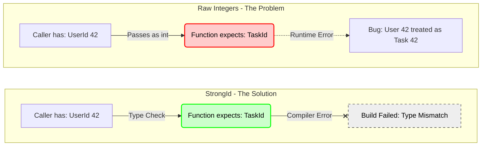
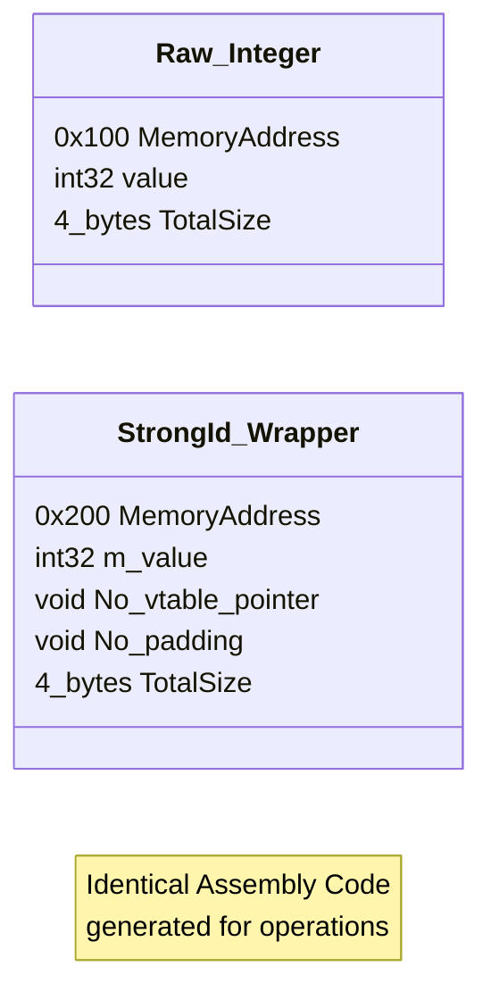
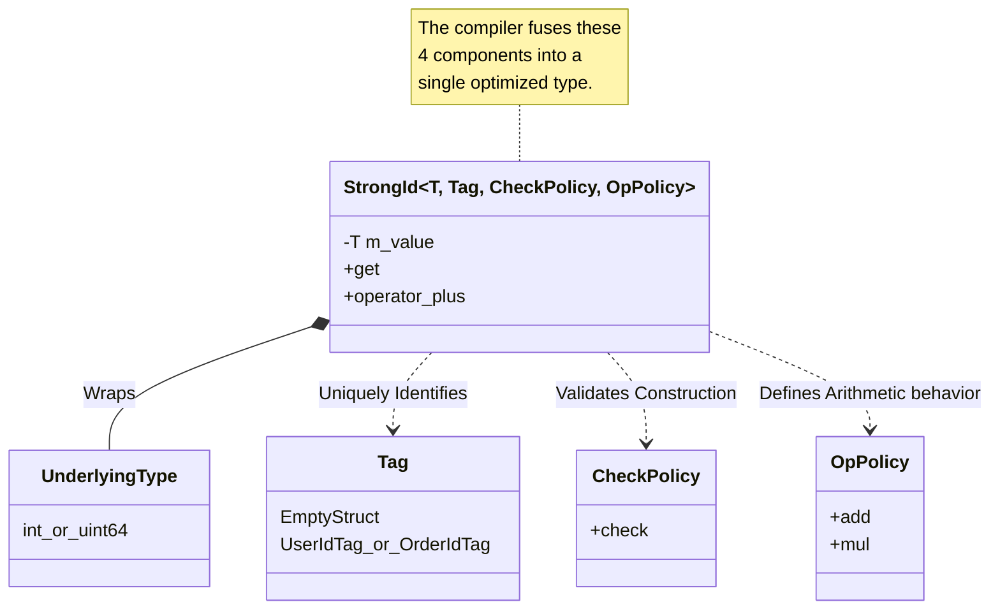
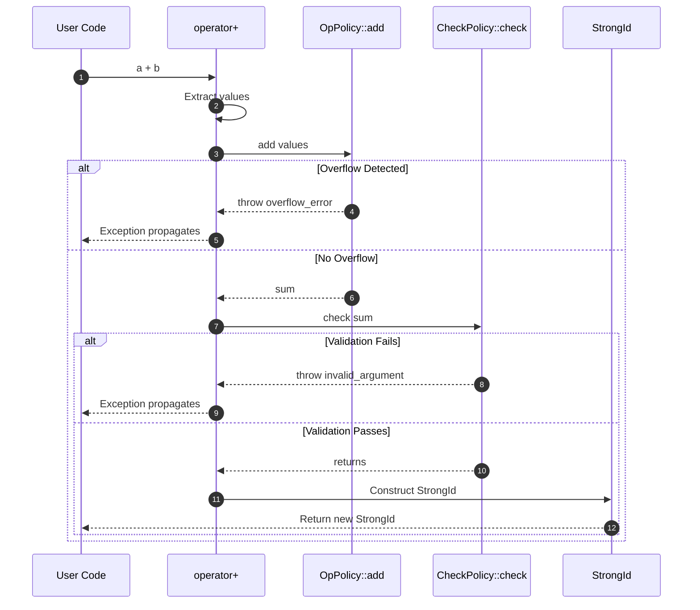
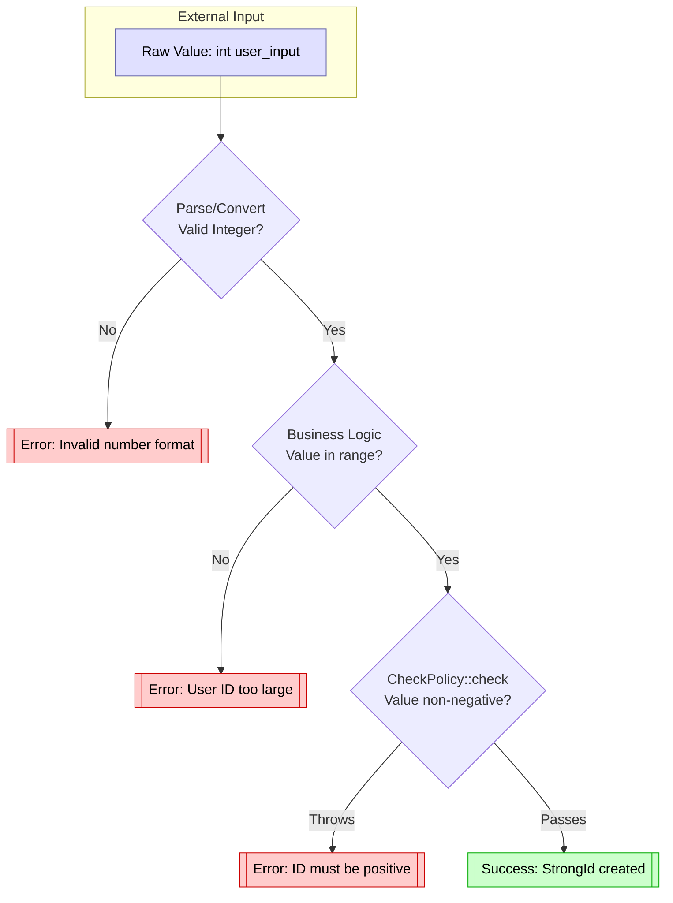
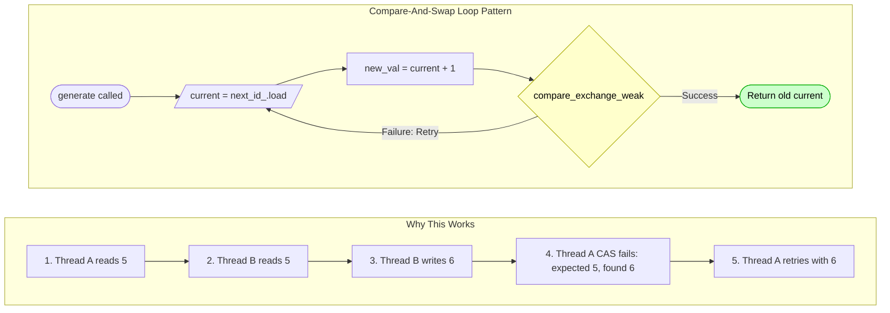
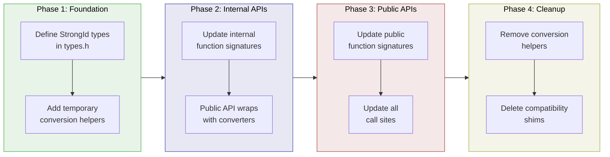
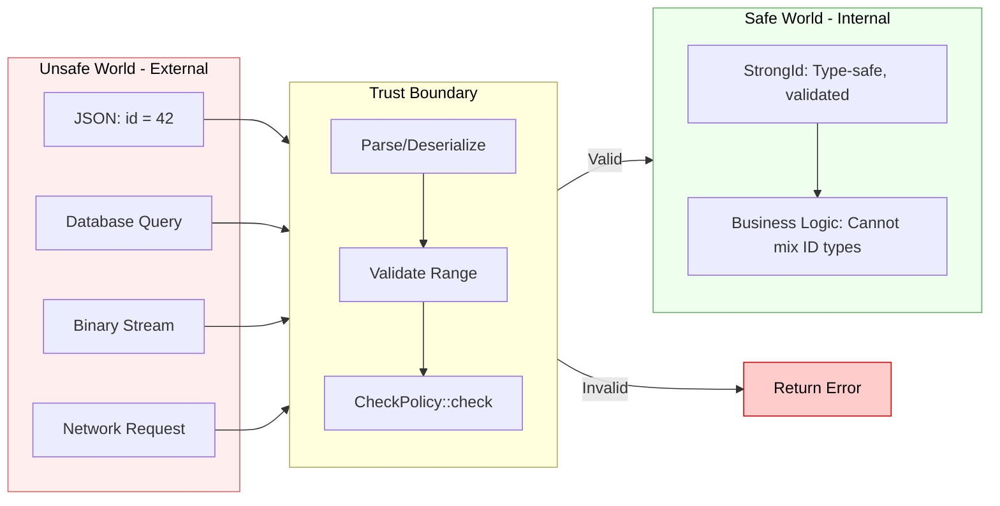

# StrongId User Manual

**Library:** fat_p C++ Utilities  
**Standard:** C++17 (C++20 enhanced)  
**Type:** Header-only

---

## Table of Contents

1. [What is Strong ID Typing?](#what-is-strong-id-typing)
   - [Understanding the Problem](#understanding-the-problem)
   - [The C++ ID Landscape](#the-c-id-landscape)
   - [Where StrongId Fits](#where-strongid-fits)
2. [Core Architecture](#core-architecture)
   - [Zero-Overhead Abstraction](#zero-overhead-abstraction)
   - [Policy-Based Design](#policy-based-design)
   - [Design Decisions](#design-decisions)
3. [Getting Started](#getting-started)
   - [Prerequisites](#prerequisites)
   - [Integration](#integration)
   - [First Program](#first-program)
4. [Creating Strong IDs](#creating-strong-ids)
   - [Basic Definition Pattern](#basic-definition-pattern)
   - [Multiple ID Types](#multiple-id-types)
   - [Construction](#construction)
   - [Accessors](#accessors)
5. [Policies](#policies)
   - [CheckPolicy (Validation)](#checkpolicy-validation)
   - [OpPolicy (Arithmetic)](#oppolicy-arithmetic)
   - [Custom Policies](#custom-policies)
6. [Operations](#operations)
   - [Comparison](#comparison)
   - [Arithmetic](#arithmetic-optional)
   - [Bitwise](#bitwise)
   - [Hashing](#hashing)
   - [Swap](#swap)
   - [Output](#output)
7. [Expected Integration](#expected-integration)
   - [Safe Creation](#safe-creation)
   - [Validation Chain](#validation-chain)
8. [Hashing and Containers](#hashing-and-containers)
   - [Standard Containers](#standard-containers)
   - [Custom Hash](#custom-hash)
   - [As Map Key](#as-map-key)
9. [Atomic Operations](#atomic-operations)
   - [AtomicStrongId](#atomicstrongid)
   - [Thread-Safe Patterns](#thread-safe-patterns)
10. [Performance Characteristics](#performance-characteristics)
    - [Benchmark Methodology](#benchmark-methodology)
    - [Benchmark Results](#benchmark-results)
    - [Interpreting the Results](#interpreting-the-results)
11. [Comparison with Other Approaches](#comparison-with-other-approaches)
    - [StrongId vs Raw Integers](#strongid-vs-raw-integers)
    - [StrongId vs enum class](#strongid-vs-enum-class)
    - [StrongId vs Boost.StrongTypedef](#strongid-vs-booststrongtypedef)
    - [StrongId vs type_safe Library](#strongid-vs-type_safe-library)
    - [StrongId vs Phantom Types](#strongid-vs-phantom-types)
12. [Migration Guide](#migration-guide)
    - [From Raw Integers](#from-raw-integers)
    - [From enum class](#from-enum-class)
    - [Incremental Adoption](#incremental-adoption)
13. [Best Practices](#best-practices)
    - [When to Use StrongId](#when-to-use-strongid)
    - [Naming Conventions](#naming-conventions)
    - [API Design](#api-design)
14. [Serialization](#serialization)
    - [JSON](#json)
    - [Binary](#binary)
    - [Database Integration](#database-integration)
15. [Troubleshooting](#troubleshooting)
    - [Common Issues](#common-issues)
    - [Compilation Errors](#compilation-errors)
    - [Runtime Errors](#runtime-errors)
16. [Summary](#summary)

---

## What is Strong ID Typing?

### Understanding the Problem

Consider this function signature:

```cpp
void assign_task(int user_id, int task_id, int project_id);
```

This compiles and runs:

```cpp
assign_task(task_id, user_id, project_id);  // WRONG ORDER - compiles fine!
```



The compiler cannot help you because all three parameters have the same type. This class of bug is insidious: it passes all type checks, may pass unit tests if values happen to be valid, and often only manifests in production with real data.

**Real-world consequences:**

- Database corruption from ID mixups
- Security vulnerabilities (accessing wrong user's data)
- Silent data loss
- Hours of debugging "impossible" bugs
- Audit failures in regulated industries

This is not a hypothetical concern. Studies of production bugs consistently find that parameter ordering errors are common, expensive, and preventable.

### The C++ ID Landscape

C++ developers have tried various approaches to this problem:

**Raw Integers (Status Quo):**
```cpp
using UserId = int;      // Just a type alias
using TaskId = int;      // Same underlying type
// No compile-time safety - these are interchangeable
```

**enum class (Partial Solution):**
```cpp
enum class UserId : int {};
enum class TaskId : int {};
// Type-safe, but: no arithmetic, awkward construction, no hashing
```

**Wrapper Classes (Manual):**
```cpp
struct UserId {
    int value;
    explicit UserId(int v) : value(v) {}
    // Must manually implement: ==, <, hash, <<, ...
    // Every ID type needs 50+ lines of boilerplate
};
```

**External Libraries:**
- **Boost.StrongTypedef**: Powerful but heavyweight, requires Boost
- **type_safe**: Feature-rich but external dependency
- **Various header-only solutions**: Often incomplete or poorly tested

**Common Problems with Existing Solutions:**

1. External dependencies (Boost, other libraries)
2. Incomplete feature sets (missing hash, comparison, arithmetic)
3. Runtime overhead from poor implementation
4. Verbose boilerplate for each ID type
5. Poor integration with standard containers
6. No validation/constraint support

### Where StrongId Fits

StrongId is designed for **safety-conscious C++ projects** where:

1. **Zero runtime overhead** is required
2. **Type safety** prevents ID mixing bugs at compile time
3. **Zero external dependencies** are mandated
4. **Header-only** deployment is preferred
5. **C++17 compliance** without cutting-edge features
6. **Full feature set** including hash, comparison, arithmetic, atomic
7. **Validation policies** can enforce invariants
8. **Integration** with Expected for safe error handling

**Key Features:**

- **Compile-time type safety**: Different ID types cannot be mixed
- **Zero overhead**: Compiles to identical code as raw integers
- **Complete operator set**: Comparison, arithmetic, bitwise, hashing
- **Policy-based validation**: Enforce positive-only, non-zero, custom constraints
- **Checked arithmetic**: Optional overflow detection
- **Atomic support**: Thread-safe ID counters via `std::atomic`
- **Expected integration**: Safe creation with error handling
- **Header-only**: Single include, no linking

**Trade-offs:**

- Requires C++17 (no C++11/14 support)
- Checked arithmetic has measurable overhead (~2x for multiply)
- Not as feature-rich as type_safe (no units, quantities)
- Tag types add minor cognitive overhead

**When to Use StrongId:**

- [YES] Any project using integer IDs across API boundaries
- [YES] Multi-entity systems (users, orders, products, etc.)
- [YES] Database-backed applications
- [YES] Projects with strict "no dependencies" policy
- [YES] Safety-critical systems
- [YES] Code requiring audit trails

**When to Use Something Else:**

- Need C++11/14 compatibility
- Already using Boost and comfortable with StrongTypedef
- Need dimensional analysis (quantities, units) -> use type_safe
- Single-entity system with one ID type

---

## Core Architecture

### Zero-Overhead Abstraction

StrongId is designed around C++'s zero-overhead principle: you don't pay for what you don't use, and what you do use is as efficient as hand-written code.

**How it works:**

```cpp
template <typename T, typename Tag, 
          typename CheckPolicy = NoCheckPolicy,
          template <typename> class OpPolicy = DefaultOpPolicy>
class StrongId {
    T m_value;  // Single member - no vtable, no metadata
public:
    constexpr T get() const noexcept { return m_value; }
    // ... operators delegate directly to m_value
};
```

**Why it compiles away:**

1. **Single data member**: `sizeof(StrongId<int, Tag>) == sizeof(int)`
2. **Inline everything**: All methods are `constexpr` and trivial
3. **No virtual functions**: No vtable pointer, no indirection
4. **Tag is zero-size**: Tag type exists only at compile time
5. **Operators delegate directly**: `a < b` becomes `a.m_value < b.m_value`



**Compiler optimization example:**

```cpp
// Source code
UserId id{42};
if (id < UserId{100}) { ... }

// After optimization (conceptual assembly)
mov eax, 42
cmp eax, 100
jge skip
...
```

The wrapper completely disappears. The generated code is identical to using raw integers.

### Policy-Based Design

StrongId uses policy classes to customize behavior without runtime cost:



**CheckPolicy** - Validates values at construction and after operations:
- `NoCheckPolicy`: Accept all values (default, zero cost)
- `PositiveCheckPolicy`: Require value > 0
- Custom: Any constraint you define

**OpPolicy** - Controls arithmetic behavior:
- `DefaultOpPolicy`: Checked arithmetic (detects overflow)
- Custom: Saturating, wrapping, unchecked

Both policies are evaluated at compile time when possible, eliminating runtime overhead for simple policies.

### Design Decisions

**Why require explicit construction?**

```cpp
UserId id = 42;        // Error: implicit conversion disabled
UserId id{42};         // OK: explicit construction
UserId id(42);         // OK: explicit construction
```

Implicit conversion would allow `assign_task(42, 43, 44)` to work, defeating the purpose. The minor inconvenience of explicit construction prevents subtle bugs.

**Why no implicit conversion to underlying type?**

```cpp
int x = user_id;                    // Error
int x = user_id.get();              // OK: explicit
int x = static_cast<int>(user_id);  // OK: explicit
```

If IDs implicitly converted to integers, you could accidentally pass them to functions expecting raw integers, losing type safety at API boundaries.

**Why checked arithmetic by default?**

Integer overflow is undefined behavior in C++. For ID types, overflow typically indicates a bug (counter wrapped, calculation error). The 2x overhead for multiplication is acceptable for the safety benefit. Projects needing raw speed can provide an unchecked OpPolicy.

**Why use tag types instead of strings?**

```cpp
// Tag approach (StrongId)
struct UserIdTag {};
using UserId = StrongId<int, UserIdTag>;

// String approach (some libraries)
using UserId = StrongId<int, "UserId">;
```

Tag types are:
- Zero runtime cost (strings might be stored)
- Work with C++17 (string template parameters need C++20)
- Enable ADL and specialization
- Familiar pattern (similar to iterator tags)

---

## Getting Started

### Prerequisites

**Compiler Requirements:**
- GCC 7+ with `-std=c++17`
- Clang 5+ with `-std=c++17`
- MSVC 19.14+ (VS 2017 15.7+) with `/std:c++17`

**C++20 Enhancements:**
- Three-way comparison (`<=>`) automatically available

**Dependencies:**
- `CppStandardDetection.h` - For C++ standard feature detection macros
- `CheckedArithmetic.h` - For safe arithmetic in DefaultOpPolicy
- `Expected.h` - For `create()` factory method
- `FatPTypeTraits.h` - For `is_strong_id_v<T>` trait

### Integration

**Header-only installation:**

```cpp
#include "StrongId.h"

// Define ID types with tag structs
struct UserIdTag {};
struct OrderIdTag {};

using UserId = fat_p::StrongId<int, UserIdTag>;
using OrderId = fat_p::StrongId<int, OrderIdTag>;
```

**Recommended compilation flags:**

```bash
# Debug build
g++ -std=c++17 -g -O0 main.cpp -o app

# Release build
g++ -std=c++17 -O3 -DNDEBUG main.cpp -o app
```

### First Program

```cpp
#include "StrongId.h"
#include <iostream>

// Define unique tag types
struct UserIdTag {};
struct OrderIdTag {};

// Create type-safe ID aliases
using UserId = fat_p::StrongId<int, UserIdTag>;
using OrderId = fat_p::StrongId<int, OrderIdTag>;

// Type-safe function
void process_order(UserId user, OrderId order) {
    std::cout << "Processing order " << order 
              << " for user " << user << "\n";
}

int main() {
    UserId user{42};
    OrderId order{1001};
    
    process_order(user, order);      // OK
    // process_order(order, user);   // Compile error!
    
    return 0;
}
```

**Output:**
```
Processing order 1001 for user 42
```

---

## Creating Strong IDs

### Basic Definition Pattern

The standard pattern for creating a StrongId type:

```cpp
// Step 1: Define a unique tag type
struct EntityIdTag {};

// Step 2: Create a type alias
using EntityId = fat_p::StrongId<int, EntityIdTag>;
```

Each ID type needs its own unique tag. The tag is an empty struct that exists only to differentiate types at compile time-it has zero runtime cost.

### Multiple ID Types

```cpp
// Define tags in a namespace for organization
namespace tags {
    struct UserId {};
    struct OrderId {};
    struct ProductId {};
    struct SessionId {};
}

// Create type aliases
using UserId = fat_p::StrongId<int, tags::UserId>;
using OrderId = fat_p::StrongId<int, tags::OrderId>;
using ProductId = fat_p::StrongId<int, tags::ProductId>;
using SessionId = fat_p::StrongId<uint64_t, tags::SessionId>;
```

### Different Underlying Types

```cpp
struct SmallIdTag {};
struct LargeIdTag {};
struct SignedIdTag {};

using SmallId = fat_p::StrongId<uint16_t, SmallIdTag>;    // 16-bit
using LargeId = fat_p::StrongId<uint64_t, LargeIdTag>;    // 64-bit
using SignedId = fat_p::StrongId<int32_t, SignedIdTag>;   // Signed 32-bit
```

### With Validation Policy

```cpp
struct PositiveIdTag {};

// Require value >= 0
using PositiveId = fat_p::StrongId<int64_t, PositiveIdTag, fat_p::PositiveCheckPolicy>;
```

### With Custom Policies

```cpp
struct CustomIdTag {};

// Custom check and operation policies
using CustomId = fat_p::StrongId<int, CustomIdTag, MyCheckPolicy, MyOpPolicy>;
```

### Construction

```cpp
// Default construction (value = 0)
UserId id1;                  // id1.get() == 0

// Explicit value construction
UserId id2{42};              // id2.get() == 42
UserId id3(42);              // id3.get() == 42

// Copy construction
UserId id4 = id2;            // id4.get() == 42
UserId id5{id2};             // id5.get() == 42

// Move construction (trivial for integral types)
UserId id6 = std::move(id2); // id6.get() == 42

// From Expected (safe creation with validation)
auto result = UserId::create(user_input);
if (result) {
    UserId id = *result;
}
```

**What doesn't work (by design):**

```cpp
UserId id = 42;              // Error: no implicit conversion
UserId id = OrderId{42};     // Error: different types
```

### Accessors

Three ways to retrieve the underlying value:

```cpp
UserId id{42};

// Method 1: get() - recommended
int v1 = id.get();           // v1 == 42

// Method 2: value() - alias for get()
int v2 = id.value();         // v2 == 42

// Method 3: explicit cast
int v3 = static_cast<int>(id);  // v3 == 42
```

All three are `constexpr` and `noexcept`. Use `get()` or `value()` for clarity; use explicit cast when interfacing with APIs requiring the raw type.

---

## Policies

### CheckPolicy (Validation)

CheckPolicy validates values at construction and after arithmetic operations.

#### NoCheckPolicy (Default)

Accepts all values with zero overhead:

```cpp
using RawId = StrongId<int, Tag, NoCheckPolicy>;

RawId id1{-1};           // OK
RawId id2{0};            // OK
RawId id3{INT_MAX};      // OK
```

#### PositiveCheckPolicy

Requires value >= 0 (rejects negative values):

```cpp
using PositiveId = StrongId<int, Tag, PositiveCheckPolicy>;

PositiveId good{0};      // OK
PositiveId good2{1};     // OK
PositiveId bad{-1};      // Throws std::invalid_argument
```

#### Custom Check Policy

Define your own validation:

```cpp
// Non-zero policy
struct NonZeroCheckPolicy {
    template <typename T>
    static constexpr void check(T value) {
        if (value == 0) {
            throw std::invalid_argument("ID cannot be zero");
        }
    }
};

// Range policy
template <int Min, int Max>
struct RangeCheckPolicy {
    template <typename T>
    static constexpr void check(T value) {
        if (value < Min || value > Max) {
            throw std::out_of_range("ID out of valid range");
        }
    }
};

// Usage
using NonZeroId = StrongId<int, Tag, NonZeroCheckPolicy>;
using BoundedId = StrongId<int, Tag, RangeCheckPolicy<1, 1000>>;
```

### OpPolicy (Arithmetic)

OpPolicy controls arithmetic operations (add, subtract, multiply, etc.).

#### DefaultOpPolicy (Default)

Uses checked arithmetic that detects overflow:

```cpp
struct MyIdTag {};
using SafeId = fat_p::StrongId<int, MyIdTag>;  // Uses DefaultOpPolicy

SafeId id{INT_MAX};
++id;                    // Throws std::overflow_error

SafeId a{1000000};
SafeId b{1000000};
auto c = a * b;          // Throws std::overflow_error (would overflow int)
```

**Performance note:** Checked multiplication has ~2x overhead compared to raw multiplication. Other operations (add, compare, increment) have negligible overhead.

#### UncheckedOpPolicy (Built-in)

For maximum performance when inputs are known to be safe:

```cpp
struct FastIdTag {};
using FastId = fat_p::StrongId<int, FastIdTag, fat_p::NoCheckPolicy, fat_p::UncheckedOpPolicy>;

FastId a{1000};
FastId b{2};
auto c = a * b;    // No overflow check - identical to raw int multiplication
```

**When to use UncheckedOpPolicy:**
- Profiling shows checked arithmetic is a bottleneck
- Inputs are validated elsewhere
- ID arithmetic is limited to safe operations (e.g., increment only)
- Performance-critical inner loops

**Caution:** Overflow with UncheckedOpPolicy is undefined behavior, same as raw integers.

#### Custom Op Policy

For specialized arithmetic semantics, define your own policy:

```cpp
// Saturating arithmetic - clamps at min/max instead of overflowing
template <typename U>
struct SaturatingOpPolicy {
    static constexpr U add(U a, U b) noexcept {
        if (b > 0 && a > std::numeric_limits<U>::max() - b)
            return std::numeric_limits<U>::max();
        if (b < 0 && a < std::numeric_limits<U>::min() - b)
            return std::numeric_limits<U>::min();
        return static_cast<U>(a + b);
    }
    static constexpr U mul(U a, U b) noexcept {
        // ... similar clamping logic
    }
    // ... other operations
};

struct ClampedIdTag {};
using ClampedId = fat_p::StrongId<int, ClampedIdTag, fat_p::NoCheckPolicy, SaturatingOpPolicy>;
```

### Custom Policies

**Best practices for custom policies:**

1. Make `check()` and operation functions `static constexpr`
2. Use `noexcept` where appropriate
3. Keep policies stateless (no data members)
4. Document invariants clearly

```cpp
// Good: Stateless, constexpr, documented
struct DatabaseIdCheckPolicy {
    // Database IDs must be positive 64-bit integers
    template <typename T>
    static constexpr void check(T value) {
        static_assert(std::is_integral_v<T>);
        if (value <= 0) {
            throw std::invalid_argument("Database ID must be positive");
        }
    }
};
```

---

## Operations

### Comparison

All comparison operators are supported:

```cpp
UserId a{1}, b{2}, c{1};

// Equality
a == c;   // true
a == b;   // false
a != b;   // true

// Ordering
a < b;    // true
a <= b;   // true
a <= c;   // true (equal)
b > a;    // true
b >= a;   // true

// C++20: Three-way comparison
auto cmp = a <=> b;  // std::strong_ordering::less
```

**Type safety:** Comparison between different ID types is a compile error:

```cpp
UserId user{1};
OrderId order{1};

user == order;   // Compile error: no operator== for these types
user < order;    // Compile error
```

### Arithmetic (Optional)

Arithmetic is available but optional - many ID use cases don't need it:

```cpp
UserId id{10};

// Increment/decrement
++id;           // id = 11
--id;           // id = 10
id++;           // returns 10, id = 11
id--;           // returns 11, id = 10

// Binary operations
auto next = id + UserId{5};   // UserId{15}
auto prev = id - UserId{3};   // UserId{7}

// Compound assignment
id += UserId{2};   // id = 12
id -= UserId{1};   // id = 11
id *= UserId{2};   // id = 22
id /= UserId{2};   // id = 11
id %= UserId{3};   // id = 2

// Scalar operations
id += 5;           // id = 7
id = id + 3;       // id = 10

// Unary
auto neg = -id;    // UserId{-10} (if signed)
auto pos = +id;    // UserId{10}
```

**Note:** Arithmetic uses checked operations by default. Overflow throws `std::overflow_error`. This includes unary negation: `-UserId{INT_MIN}` throws because negating the minimum signed value overflows.

### Bitwise

For bitmask-style IDs or flag manipulation:

```cpp
UserId id{0b1010};

// AND, OR, XOR
auto masked = id & 0b1100;    // UserId{0b1000}
auto combined = id | 0b0101;  // UserId{0b1111}
auto toggled = id ^ 0b1111;   // UserId{0b0101}

// NOT
auto inverted = ~id;          // All bits flipped

// Shifts
auto shifted = id << 2;       // UserId{0b101000}
auto right = id >> 1;         // UserId{0b0101}

// Compound
id &= 0b1100;
id |= 0b0001;
id ^= 0b0010;
id <<= 1;
id >>= 1;
```

### Hashing

StrongId provides `std::hash` specialization:

```cpp
UserId id{42};

// Direct hashing
std::hash<UserId> hasher;
size_t h = hasher(id);

// In unordered containers
std::unordered_set<UserId> ids;
std::unordered_map<UserId, std::string> names;
```

### Swap

Both member and non-member (ADL-compatible) swap are provided:

```cpp
UserId a{1}, b{2};

// Member swap
a.swap(b);          // a == 2, b == 1

// ADL swap (works with std::swap and generic code)
using std::swap;
swap(a, b);         // a == 1, b == 2

// Also works directly
std::swap(a, b);    // a == 2, b == 1
```

Both forms are `constexpr` and `noexcept`.

### Output

Stream output is enabled by default via `FATP_ENABLE_IOSTREAM`:

```cpp
UserId id{42};
std::cout << "User ID: " << id << "\n";  // Output: User ID: 42
```

To disable iostream support (reduces header weight, avoids `<iostream>` include):

```cpp
#define FATP_ENABLE_IOSTREAM 0
#include "StrongId.h"
```

### Operation Lifecycle

Under the hood, arithmetic operations follow this sequence, with the OpPolicy handling overflow detection and CheckPolicy validating the result:



---

## Expected Integration

### Safe Creation

The `create()` factory method returns `Expected<StrongId, std::string>`:

```cpp
// User input might be invalid
int user_input = get_user_input();

auto result = PositiveId::create(user_input);
if (!result) {
    std::cerr << "Invalid ID: " << result.error() << "\n";
    return;
}

PositiveId id = *result;
// Use id safely...
```

The following diagram shows the validation pipeline when using `create()` to safely construct a StrongId from untrusted input:



### Validation Chain

Combine with other validation:

```cpp
Expected<UserId, std::string> parse_user_id(const std::string& s) {
    // Parse string to integer
    int value;
    try {
        value = std::stoi(s);
    } catch (const std::exception&) {
        return make_unexpected("Invalid number format");
    }
    
    // Validate range
    if (value > 1000000) {
        return make_unexpected("User ID too large");
    }
    
    // Create with policy validation
    return UserId::create(value);
}

// Usage
auto result = parse_user_id(input);
if (result) {
    process_user(*result);
} else {
    log_error(result.error());
}
```

---

## Hashing and Containers

### Standard Containers

StrongId works with all standard containers:

```cpp
// Ordered containers (use operator<)
std::set<UserId> user_set;
std::map<UserId, UserData> user_map;
std::multiset<UserId> multi_users;

// Unordered containers (use std::hash)
std::unordered_set<UserId> user_hash_set;
std::unordered_map<UserId, UserData> user_hash_map;
std::unordered_multimap<UserId, Order> user_orders;

// Sequence containers
std::vector<UserId> user_vec;
std::deque<UserId> user_deque;
std::array<UserId, 10> user_array;
```

### Custom Hash

For specialized hashing needs:

```cpp
struct UserIdHash {
    size_t operator()(UserId id) const noexcept {
        // Custom hash combining
        size_t h = std::hash<int>{}(id.get());
        return h ^ (h >> 16) ^ 0x9e3779b9;
    }
};

std::unordered_set<UserId, UserIdHash> custom_set;
```

### As Map Key

Common pattern for caching:

```cpp
class UserCache {
    std::unordered_map<UserId, UserData> cache_;
    
public:
    void store(UserId id, UserData data) {
        cache_[id] = std::move(data);
    }
    
    std::optional<UserData> lookup(UserId id) const {
        auto it = cache_.find(id);
        if (it != cache_.end()) {
            return it->second;
        }
        return std::nullopt;
    }
    
    bool contains(UserId id) const {
        return cache_.count(id) > 0;
    }
    
    void remove(UserId id) {
        cache_.erase(id);
    }
};
```

---

## Atomic Operations

### AtomicStrongId

For thread-safe ID generation and access:

```cpp
// Type alias provided by library
template <typename T, typename Tag, ...>
using AtomicStrongId = std::atomic<StrongId<T, Tag, ...>>;

// Usage
using AtomicUserId = AtomicStrongId<int, UserIdTag>;

AtomicUserId counter{UserId{0}};
```

### Thread-Safe Patterns

**Atomic ID counter:**

```cpp
class IdGenerator {
    AtomicUserId next_id_{UserId{1}};
    
public:
    UserId generate() {
        UserId current = next_id_.load();
        while (!next_id_.compare_exchange_weak(
            current, UserId{current.get() + 1})) {
            // Retry on contention
        }
        return current;
    }
};
```

The compare-and-swap loop ensures thread-safety without locks. If another thread modifies the counter between load and exchange, the operation retries:



**Thread-safe lookup:**

```cpp
class ThreadSafeRegistry {
    std::shared_mutex mutex_;
    std::unordered_map<UserId, Data> data_;
    
public:
    void insert(UserId id, Data d) {
        std::unique_lock lock(mutex_);
        data_[id] = std::move(d);
    }
    
    std::optional<Data> lookup(UserId id) const {
        std::shared_lock lock(mutex_);
        auto it = data_.find(id);
        return it != data_.end() ? std::optional{it->second} : std::nullopt;
    }
};
```

**Atomic operations:**

```cpp
AtomicUserId id{UserId{42}};

// Load
UserId current = id.load();
UserId current_relaxed = id.load(std::memory_order_relaxed);

// Store
id.store(UserId{100});
id.store(UserId{100}, std::memory_order_release);

// Exchange
UserId old = id.exchange(UserId{200});

// Compare-exchange
UserId expected{100};
bool success = id.compare_exchange_strong(expected, UserId{150});
```

---

## Performance Characteristics

### Benchmark Methodology

**Test Environments:**

| Environment | CPU | RAM | Compiler | Flags |
|-------------|-----|-----|----------|-------|
| Windows Laptop | Intel i7-8850H @ 2.60 GHz | 32 GB | MSVC 2022 (vc143) | `/std:c++17 /O2 /EHsc /DNDEBUG` |
| Linux Container | x64 (4 cores) | 9 GB | GCC 13.3.0 | `-std=c++17 -O3 -DNDEBUG` |

**Methodology:**
- Iterations: 1,000,000 per operation
- Each operation measured in isolation with `volatile` to prevent optimization
- Multiple runs averaged to reduce noise
- Checked StrongId, Unchecked StrongId, and raw int tested under identical conditions

Note: Sub-nanosecond measurements approach timer resolution (~1ns), so variations of +/-0.1ns are measurement noise, not real differences. Timer resolution warnings in output confirm operations are extremely fast.

### Benchmark Results

**StrongId (Checked) vs StrongId (Unchecked) vs Raw int:**

| Operation | Checked | Unchecked | Raw int | Notes |
|-----------|---------|-----------|---------|-------|
| Construction | ~0.30 ns | ~0.30 ns | ~0.30 ns | Identical |
| Value access (`get()`) | ~0.30 ns | ~0.30 ns | ~0.30 ns | Identical |
| Comparison (`<`) | ~0.30 ns | ~0.30 ns | ~0.30 ns | Identical |
| Addition | ~0.30 ns | ~0.30 ns | ~0.30 ns | Identical |
| Multiplication | ~0.30-0.62 ns | ~0.30 ns | ~0.30 ns | Checked may have overhead* |
| Increment | ~0.30 ns | ~0.30 ns | ~0.30 ns | Identical |
| Hash calculation | ~0.31 ns | ~0.31 ns | ~0.31 ns | Identical |
| Set lookup (1000 elements) | ~1.2 ns | ~1.2 ns | ~1.2 ns | Identical |
| Atomic load | ~0.30 ns | ~0.30 ns | ~0.30 ns | Identical |
| Atomic store | ~6.3 ns | ~6.3 ns | ~6.3 ns | Identical |

*Checked multiplication overhead varies by compiler, optimization level, and value ranges. Often optimized away entirely.

### Interpreting the Results

**Key finding: All three versions often perform identically.**

Modern compilers are very good at optimizing checked arithmetic. In many cases, the overflow checks are either:
- Proven unnecessary and eliminated entirely
- So cheap relative to other overhead they don't measurably impact performance

The ~2x overhead for checked multiplication appears primarily when:
- The compiler cannot prove overflow is impossible
- Values are runtime-determined and potentially large
- Specific instruction sequences are generated

**When overhead does appear:**

In scenarios where checked multiplication overhead is measurable, switching to `UncheckedOpPolicy` eliminates it:

```cpp
struct FastIdTag {};
using FastId = fat_p::StrongId<int, FastIdTag, fat_p::NoCheckPolicy, fat_p::UncheckedOpPolicy>;
```

**Recommendation:**

| Situation | Policy |
|-----------|--------|
| Default choice | `DefaultOpPolicy` - safety with usually-zero cost |
| Profiler shows arithmetic bottleneck | Consider `UncheckedOpPolicy` |
| ID arithmetic is rare/absent | `DefaultOpPolicy` - overhead irrelevant |
| Safety-critical code | `DefaultOpPolicy` - catch bugs early |
| Proven-safe inner loops | `UncheckedOpPolicy` - maximum throughput |

---

## Comparison with Other Approaches

### StrongId vs Raw Integers

| Aspect | StrongId | Raw Integers |
|--------|----------|--------------|
| Type safety | Compile-time prevention of mixing | None |
| Runtime cost | Zero (same machine code) | N/A |
| Debugging | Type visible in debugger | Just "int" |
| Refactoring | Compiler catches misuse | Silent bugs |
| Container support | Full | Full |
| Arithmetic | Optional, checked | Always available |

**Migration effort:** Low - wrap existing int usage with StrongId

**Verdict:** StrongId is strictly better unless you need C++11/14 compatibility.

### StrongId vs enum class

```cpp
// enum class approach
enum class UserId : int {};
UserId id = static_cast<UserId>(42);
int raw = static_cast<int>(id);

// StrongId approach
struct UserIdTag {};
using UserId = fat_p::StrongId<int, UserIdTag>;
UserId id{42};
int raw = id.get();
```

| Aspect | StrongId | enum class |
|--------|----------|------------|
| Type safety | Yes | Yes |
| Construction | `UserId{42}` | `static_cast<UserId>(42)` |
| Value access | `id.get()` | `static_cast<int>(id)` |
| Arithmetic | Yes (all operators) | No |
| Comparison | All operators | Only == and != |
| Hashing | Yes (std::hash) | Need custom hash |
| Increment | Yes (`++id`) | No |
| Ordering | Yes (`<`, `>`) | No |

**Verdict:** StrongId for IDs that need arithmetic/ordering/hashing; enum class for simple tags or flags.

### StrongId vs Boost.StrongTypedef

```cpp
// Boost approach
#include <boost/serialization/strong_typedef.hpp>
BOOST_STRONG_TYPEDEF(int, UserId)

// StrongId approach
struct UserIdTag {};
using UserId = fat_p::StrongId<int, UserIdTag>;
```

| Aspect | StrongId | Boost.StrongTypedef |
|--------|----------|---------------------|
| Dependencies | None (header-only) | Boost libraries |
| Validation | Built-in policies | Manual |
| Checked arithmetic | Yes | No |
| Expected integration | Yes | No |
| Atomic support | Yes | Manual |
| Compile time | Fast | Slower (Boost headers) |

**Verdict:** StrongId if avoiding Boost; Boost if already using Boost ecosystem.

### StrongId vs type_safe Library

```cpp
// type_safe approach
#include <type_safe/strong_typedef.hpp>
struct UserId : type_safe::strong_typedef<UserId, int> {
    using strong_typedef::strong_typedef;
};

// StrongId approach
struct UserIdTag {};
using UserId = fat_p::StrongId<int, UserIdTag>;
```

| Aspect | StrongId | type_safe |
|--------|----------|-----------|
| Dependencies | None | External library |
| Feature set | IDs only | IDs, flags, integers, booleans |
| Validation | Policies | Constraints |
| Checked arithmetic | Default | Optional |
| Dimensional analysis | No | Yes (units, quantities) |
| Documentation | This manual | Extensive |

**Verdict:** type_safe for comprehensive strong typing; StrongId for focused ID handling with zero dependencies.

### StrongId vs Phantom Types

```cpp
// Phantom type approach (manual)
template <typename Tag>
struct Id {
    int value;
    explicit Id(int v) : value(v) {}
    // Must implement all operators manually...
};

struct UserTag {};
using UserId = Id<UserTag>;

// StrongId approach
struct UserIdTag {};
using UserId = fat_p::StrongId<int, UserIdTag>;  // All operators provided
```

| Aspect | StrongId | Phantom Types (Manual) |
|--------|----------|------------------------|
| Boilerplate | Two lines | 50+ lines per type |
| Operators | Complete | Manual implementation |
| Correctness | Tested | Must test yourself |
| Consistency | Guaranteed | Varies |
| Maintenance | Library-maintained | You maintain |

**Verdict:** StrongId eliminates phantom type boilerplate while providing the same type safety.

---

## Migration Guide

### From Raw Integers

**Step 1: Define ID types**

```cpp
// Before: scattered int usage
// user_service.h
void create_user(int user_id, const std::string& name);
int get_user_id(const User& user);

// After: define ID type in one place
// types.h
#include "StrongId.h"

struct UserIdTag {};
using UserId = fat_p::StrongId<int, UserIdTag>;
```

**Step 2: Update function signatures**

```cpp
// Before
void create_user(int user_id, const std::string& name);

// After
void create_user(UserId user_id, const std::string& name);
```

**Step 3: Update call sites**

```cpp
// Before
create_user(42, "Alice");

// After
create_user(UserId{42}, "Alice");
```

**Step 4: Update storage**

```cpp
// Before
std::unordered_map<int, User> users;
users[user_id] = user;

// After
std::unordered_map<UserId, User> users;
users[user_id] = user;  // Works unchanged if user_id is now UserId
```

### From enum class

```cpp
// Before
enum class UserId : int {};
UserId id = static_cast<UserId>(42);
int raw = static_cast<int>(id);

// After
struct UserIdTag {};
using UserId = fat_p::StrongId<int, UserIdTag>;
UserId id{42};
int raw = id.get();
```

**Breaking changes to handle:**
- `static_cast<UserId>(x)` -> `UserId{x}`
- `static_cast<int>(id)` -> `id.get()`
- May now use arithmetic: `++id`, `id + offset`
- Hash now works automatically

### Incremental Adoption

For large codebases, a phased migration minimizes disruption while progressively gaining type safety:



**Phase 1: Define types, maintain compatibility**

```cpp
// types.h
#include "StrongId.h"

struct UserIdTag {};
using UserId = fat_p::StrongId<int, UserIdTag>;

// Temporary conversion helpers
inline UserId to_user_id(int raw) { return UserId{raw}; }
inline int from_user_id(UserId id) { return id.get(); }
```

**Phase 2: Update internal APIs**

```cpp
// Internal functions use StrongId
void internal_process(UserId id);

// Public API still uses int (temporarily)
void public_process(int user_id) {
    internal_process(to_user_id(user_id));
}
```

**Phase 3: Update public APIs**

```cpp
// Remove compatibility layer
void public_process(UserId user_id);
```

**Phase 4: Remove conversion helpers**

Once all code is migrated, remove `to_user_id` and `from_user_id`.

---

## Best Practices

### When to Use StrongId

**Always use StrongId for:**

- Entity IDs (users, orders, products, sessions)
- Foreign keys and references
- Any ID passed across function boundaries
- IDs stored in containers
- IDs in public APIs

**Consider raw integers for:**

- Purely local loop counters
- Array indices (use `size_t`)
- Temporary calculations
- Performance-critical inner loops (profile first!)

### Naming Conventions

```cpp
// Good: Clear, consistent naming
namespace tags {
    struct UserId {};
    struct OrderId {};
    struct ProductId {};
}

using UserId = fat_p::StrongId<int, tags::UserId>;
using OrderId = fat_p::StrongId<int, tags::OrderId>;
using ProductId = fat_p::StrongId<int, tags::ProductId>;

// Good: Namespace organization for domain-specific types
namespace entity::tags {
    struct UserId {};
    struct SessionId {};
}

using UserId = fat_p::StrongId<uint64_t, entity::tags::UserId>;
using SessionId = fat_p::StrongId<uint64_t, entity::tags::SessionId>;

// Avoid: Ambiguous or inconsistent naming
struct IdTag {};                    // Which entity?
using Id = fat_p::StrongId<int, IdTag>;  // Too generic

struct UserIDTag {};               // Inconsistent casing (should be UserId)
struct user_id_tag {};             // Looks like a variable
```

### API Design

**Do:**

```cpp
// Use StrongId in function signatures
User find_user(UserId id);
void transfer(UserId from, UserId to, Money amount);

// Use StrongId in structs
struct Order {
    OrderId id;
    UserId customer;
    std::vector<ProductId> items;
};

// Use Expected for user input
fat_p::Expected<UserId, Error> parse_user_id(std::string_view input);

// Use appropriate underlying types
struct SmallIdTag {};
struct LargeIdTag {};
using SmallId = fat_p::StrongId<uint16_t, SmallIdTag>;   // Limited range
using LargeId = fat_p::StrongId<uint64_t, LargeIdTag>;   // Database IDs
```

**Don't:**

```cpp
// Don't expose raw values in APIs
int get_raw_id(UserId id);  // Defeats type safety

// Don't mix raw and strong IDs
void process(UserId user, int order_id);  // Inconsistent

// Don't construct from other ID types
OrderId order{user.get()};  // Bypasses type safety
```

---

## Serialization

StrongId creates a clear boundary between validated internal types and untrusted external data. All external input must pass through validation before becoming a StrongId:



### JSON

```cpp
#include "JsonLite.h"

// To JSON
Json to_json(UserId id) {
    return Json(id.get());
}

// From JSON (with validation)
Expected<UserId, std::string> from_json(const Json& j) {
    if (!j.is_number()) {
        return make_unexpected("Expected number for UserId");
    }
    return UserId::create(j.get<int>());
}

// In a larger object
Json user_to_json(const User& user) {
    return Json::object({
        {"id", user.id.get()},
        {"name", user.name}
    });
}
```

### Binary

```cpp
// Simple binary serialization
void serialize(std::ostream& os, UserId id) {
    int value = id.get();
    os.write(reinterpret_cast<const char*>(&value), sizeof(value));
}

UserId deserialize(std::istream& is) {
    int value;
    is.read(reinterpret_cast<char*>(&value), sizeof(value));
    return UserId{value};
}

// With validation
Expected<UserId, std::string> deserialize_safe(std::istream& is) {
    int value;
    if (!is.read(reinterpret_cast<char*>(&value), sizeof(value))) {
        return make_unexpected("Failed to read UserId");
    }
    return UserId::create(value);
}
```

### Database Integration

```cpp
// Example with a hypothetical DB library
class UserRepository {
    Database& db_;
    
public:
    void insert(UserId id, const std::string& name) {
        db_.execute(
            "INSERT INTO users (id, name) VALUES (?, ?)",
            id.get(), name
        );
    }
    
    std::optional<User> find(UserId id) {
        auto result = db_.query(
            "SELECT id, name FROM users WHERE id = ?",
            id.get()
        );
        if (result.empty()) return std::nullopt;
        
        return User{
            UserId{result[0].get<int>("id")},
            result[0].get<std::string>("name")
        };
    }
};
```

---

## Troubleshooting

### Common Issues

**1. "Cannot convert int to StrongId"**

```cpp
// Problem
UserId id = 42;  // Error!

// Solution: Use explicit construction
UserId id{42};
UserId id(42);
```

**2. "Cannot compare different StrongId types"**

```cpp
// Problem
UserId user{1};
OrderId order{1};
if (user == order) { }  // Error!

// Solution: This is by design. If you need to compare values:
if (user.get() == order.get()) { }  // Explicit, intentional
```

**3. "No matching function for std::hash"**

```cpp
// Problem: Using StrongId before including header
std::unordered_set<UserId> ids;  // Error if StrongId.h not included

// Solution: Ensure StrongId.h is included
#include "StrongId.h"
```

**4. "IDs look identical in debugger/logs"**

```cpp
// Problem: Can't tell ID types apart when debugging
UserId user{42};
OrderId order{42};
// Both show as "42" in debugger

// Solution: Include type in output
std::cout << "UserId: " << user << ", OrderId: " << order << "\n";

// Or create debug helper
template <typename Id>
std::string debug_id(const Id& id, const char* type_name) {
    return std::string(type_name) + "(" + std::to_string(id.get()) + ")";
}
```

### Compilation Errors

**1. "static_assert failed: StrongId can only wrap integral types"**

```cpp
// Problem
struct BadIdTag {};
using BadId = fat_p::StrongId<std::string, BadIdTag>;  // Error!

// Solution: Use integral types only
struct GoodIdTag {};
using GoodId = fat_p::StrongId<int, GoodIdTag>;
using GoodId64 = fat_p::StrongId<uint64_t, GoodIdTag>;
```

**2. "No member named 'get' in..."**

```cpp
// Problem: Wrong type or missing include
auto id = get_id();  // Returns int, not UserId
id.get();  // Error!

// Solution: Check return types, ensure StrongId is used consistently
```

**3. Template errors with custom policies**

```cpp
// Problem: Policy doesn't match expected signature
struct BadPolicy {
    void check(int value) { }  // Missing template, not constexpr
};

// Solution: Follow policy interface exactly
struct GoodPolicy {
    template <typename T>
    static constexpr void check(T value) { }
};
```

### Runtime Errors

**1. std::invalid_argument from PositiveCheckPolicy**

```cpp
// Problem
struct MyIdTag {};
using PositiveId = fat_p::StrongId<int, MyIdTag, fat_p::PositiveCheckPolicy>;
PositiveId id{-1};  // Throws!

// Solution: Validate input before construction
if (input >= 0) {
    PositiveId id{input};
} else {
    // Handle error
}

// Or use create() for Expected-based handling
auto result = PositiveId::create(input);
if (!result) {
    std::cerr << result.error() << "\n";
}
```

**2. std::overflow_error from checked arithmetic**

```cpp
// Problem
UserId id{INT_MAX};
++id;  // Throws overflow_error!

// Solution: Use appropriate underlying type
struct LargeIdTag {};
using LargeId = fat_p::StrongId<uint64_t, LargeIdTag>;  // Much larger range

// Or handle overflow explicitly
if (id.get() < INT_MAX) {
    ++id;
} else {
    // Handle overflow condition
}
```

---

## Summary

StrongId provides **compile-time type safety for integer IDs** with zero runtime overhead, preventing a common class of bugs where ID parameters are mixed up.

**Key Features:**

1. **Compile-time type safety** - Different ID types cannot be mixed
2. **Zero overhead** - Wrapper compiles away completely (~0.3ns operations)
3. **Policy-based validation** - Enforce constraints like positive-only
4. **Checked arithmetic** - Optional overflow detection
5. **Complete operator set** - Comparison, arithmetic, bitwise, hash
6. **Atomic support** - Thread-safe ID counters
7. **Expected integration** - Safe creation with error handling
8. **Header-only** - Single include, no linking, no dependencies

**Performance Profile:**

- Core operations (construct, compare, hash): **~0.3 ns** (same as raw int)
- Checked multiplication: **~0.6 ns** (2x raw int - safety cost)
- Container operations: **identical to raw int**
- Atomic operations: **identical to raw int**

**Best For:**

- Any project using integer IDs across API boundaries
- Multi-entity systems (users, orders, products)
- Database-backed applications
- Projects requiring audit trails
- Safety-critical systems
- Zero-dependency environments

**Not Ideal For:**

- C++11/14 compatibility required
- Dimensional analysis (quantities, units) -> use type_safe
- Already using Boost.StrongTypedef successfully

**Quick Start:**

```cpp
#include "StrongId.h"

// Define unique tag types
struct UserIdTag {};
struct OrderIdTag {};

// Create type-safe aliases
using UserId = fat_p::StrongId<int, UserIdTag>;
using OrderId = fat_p::StrongId<int, OrderIdTag>;

void process(UserId user, OrderId order) {
    // Type-safe: cannot mix up parameters
}

int main() {
    UserId user{42};
    OrderId order{1001};
    
    process(user, order);      // OK
    // process(order, user);   // Compile error!
}
```

**Related Components:**

- `CheckedArithmetic.h` - Safe arithmetic for ID operations
- `Expected.h` - Error handling for `create()`
- `FatPTypeTraits.h` - `is_strong_id_v<T>` trait

---

**Last Updated:** November 2025
