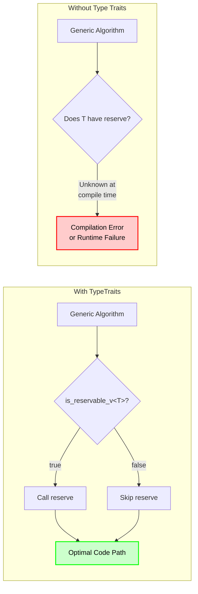
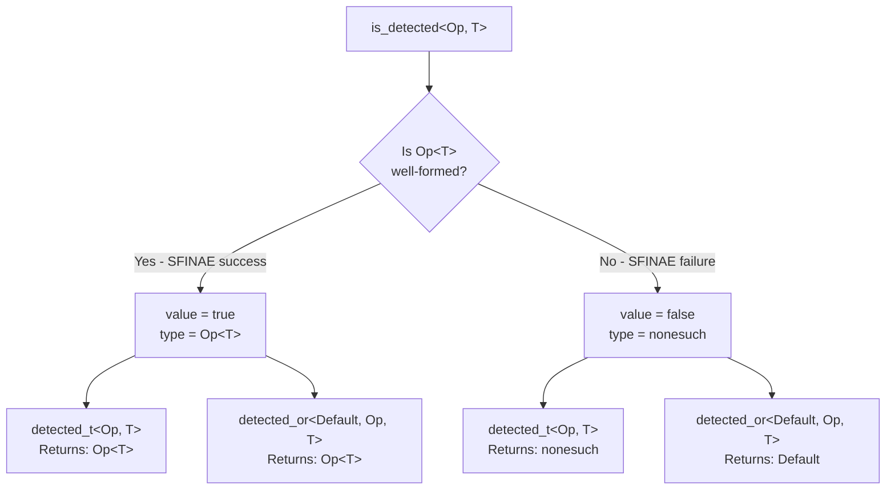

# TypeTraits User Manual

**Library:** fat_p C++ Utilities  
**Standard:** C++17 (C++20/23 enhanced)  
**Type:** Header-only

---

## Table of Contents

1. [What is Type Introspection?](#what-is-type-introspection)
   - [Understanding the Problem](#understanding-the-problem)
   - [The C++ Type Traits Landscape](#the-c-type-traits-landscape)
   - [Where TypeTraits Fits](#where-typetraits-fits)
2. [Core Architecture](#core-architecture)
   - [The Detection Idiom](#the-detection-idiom)
   - [Design Decisions](#design-decisions)
   - [Zero Runtime Overhead](#zero-runtime-overhead)
3. [Getting Started](#getting-started)
   - [Prerequisites](#prerequisites)
   - [Integration](#integration)
   - [First Program](#first-program)
4. [Detection Idiom](#detection-idiom)
   - [is_detected](#is_detected)
   - [detected_t and detected_or](#detected_t-and-detected_or)
   - [is_detected_exact and is_detected_convertible](#is_detected_exact-and-is_detected_convertible)
5. [Container Traits](#container-traits)
   - [Basic Container Traits](#basic-container-traits)
   - [Composite Container Traits](#composite-container-traits)
   - [Container Operations](#container-operations)
6. [Comparison Traits](#comparison-traits)
   - [Equality and Ordering](#equality-and-ordering)
   - [Hashability](#hashability)
   - [Comparator Validation](#comparator-validation)
7. [Callable Traits](#callable-traits)
   - [Invocability](#invocability)
   - [Function Objects](#function-objects)
8. [Specialized Traits](#specialized-traits)
   - [Serialization](#serialization)
   - [Allocators](#allocators)
   - [Tuple Protocol](#tuple-protocol)
   - [Optional and Variant](#optional-and-variant)
9. [Trait Composition](#trait-composition)
   - [Combining Traits](#combining-traits)
   - [Building Custom Traits](#building-custom-traits)
10. [Diagnostics](#diagnostics)
    - [Why-Not Helpers](#why-not-helpers)
    - [Runtime Diagnostics](#runtime-diagnostics)
11. [Design-by-Contract Helpers](#design-by-contract-helpers)
    - [Contract Enforcement](#contract-enforcement)
    - [Custom Contracts](#custom-contracts)
12. [C++20 Concepts](#cpp20-concepts)
    - [Available Concepts](#available-concepts)
    - [Migration from SFINAE](#migration-from-sfinae)
13. [Comparison with Other Libraries](#comparison-with-other-libraries)
    - [vs std::type_traits](#vs-stdtype_traits)
    - [vs Boost.TypeTraits](#vs-boosttypetraits)
    - [Summary Table](#summary-table)
14. [Migration Guide](#migration-guide)
    - [From Raw SFINAE](#from-raw-sfinae)
    - [From Boost](#from-boost)
    - [Incremental Adoption](#incremental-adoption)
15. [Best Practices](#best-practices)
    - [When to Use TypeTraits](#when-to-use-typetraits)
    - [Performance Tips](#performance-tips)
    - [Common Patterns](#common-patterns)
16. [Troubleshooting](#troubleshooting)
    - [Compilation Errors](#compilation-errors)
    - [Trait Misbehavior](#trait-misbehavior)
17. [Summary](#summary)

---

## What is Type Introspection?

### Understanding the Problem

Consider this generic algorithm that needs to optimize for different container types:

```cpp
template <typename Container>
void fill_container(Container& c, int count)
{
    // Does Container have reserve()? We don't know!
    // c.reserve(count);  // Might not compile
    
    for (int i = 0; i < count; ++i)
    {
        // Does Container have push_back()? emplace_back()? insert()?
        // c.push_back(i);  // Might not compile
    }
}
```

Without type introspection, you face these problems:

```cpp
// Attempt 1: Just call reserve() - fails for std::list
template <typename Container>
void fill_v1(Container& c, int count)
{
    c.reserve(count);  // ERROR: std::list has no reserve()
    for (int i = 0; i < count; ++i)
    {
        c.push_back(i);
    }
}

// Attempt 2: Write separate overloads - explosion of code
void fill_v2(std::vector<int>& c, int count) { /* vector version */ }
void fill_v2(std::list<int>& c, int count) { /* list version */ }
void fill_v2(std::deque<int>& c, int count) { /* deque version */ }
// ... 20 more overloads for every container type?
```



**Real-world consequences of not having type introspection:**

- Compilation failures when templates are instantiated with unexpected types
- Code duplication from writing explicit overloads
- Suboptimal performance from not exploiting container capabilities
- Poor error messages that point deep into template instantiation chains
- Maintenance burden when adding support for new types

### The C++ Type Traits Landscape

C++ developers have several options for type introspection:

**std::type_traits (C++11/14/17):**
```cpp
#include <type_traits>

// Good for fundamental type properties
static_assert(std::is_integral_v<int>);
static_assert(std::is_floating_point_v<double>);

// But no container detection!
// std::is_container_v<std::vector<int>>  // Does not exist!
```

**Raw SFINAE (manual):**
```cpp
// Detecting begin() manually - verbose and error-prone
template <typename T, typename = void>
struct has_begin : std::false_type {};

template <typename T>
struct has_begin<T, std::void_t<decltype(std::begin(std::declval<T&>()))>> 
    : std::true_type {};

// Must repeat this pattern for every trait - 20+ lines per trait!
```

**Boost.TypeTraits:**
```cpp
#include <boost/type_traits.hpp>
// Comprehensive but requires Boost dependency
// boost::has_less<T>, boost::is_container<T>, etc.
```

**C++20 Concepts:**
```cpp
#include <concepts>
#include <ranges>
// std::ranges::range, std::integral, etc.
// Excellent but requires C++20
```

**Common Problems:**

| Approach | Limitation |
|----------|------------|
| std::type_traits | No container/capability detection |
| Raw SFINAE | Verbose, error-prone, hard to maintain |
| Boost.TypeTraits | External dependency, heavy |
| C++20 Concepts | Requires C++20 compiler |

### Where TypeTraits Fits

TypeTraits is designed for **generic C++17 programming** where:

1. **Zero dependencies** are mandated beyond the standard library
2. **Container introspection** is needed (begin, end, size, reserve, etc.)
3. **Capability detection** drives algorithm optimization
4. **Clear diagnostics** help debug template failures
5. **C++20 concepts** should be used when available
6. **Design-by-Contract** validation is desired

**Key Features:**

- **80+ type traits** covering containers, comparison, callables, serialization
- **Detection idiom** for building custom traits
- **Trait composition** (all_of, any_of, none_of)
- **Diagnostic helpers** explaining why traits fail
- **DbC helpers** for compile-time contract enforcement
- **C++20 concepts** when `__cplusplus >= 202002L`
- **Header-only** with zero dependencies

**Trade-offs:**

- Requires C++17 minimum (no C++11/14 support)
- Not as comprehensive as Boost.Hana for type-level computation
- Container detection relies on duck typing (presence of methods)

**When to Use TypeTraits:**

- ✅ Writing generic algorithms that adapt to container capabilities
- ✅ Building libraries that work with user-defined types
- ✅ Projects with "no external dependencies" requirements
- ✅ Code needing clear compile-time error messages
- ✅ C++17 codebases wanting C++20 concept compatibility

**When to Use Something Else:**

- Need C++11/14 compatibility → use raw SFINAE or Boost
- Heavy metaprogramming → use Boost.Hana or Boost.Mp11
- Only need fundamental type properties → use std::type_traits
- C++20 only codebase → use std::ranges concepts directly

---

## Core Architecture

### The Detection Idiom

TypeTraits is built on the **detection idiom**, a technique for checking if expressions are valid at compile time.



**How it works internally:**

```cpp
namespace detail {
    // Sentinel type for detection failures
    struct nonesuch {
        ~nonesuch() = delete;
        nonesuch(nonesuch const&) = delete;
        void operator=(nonesuch const&) = delete;
    };

    // Primary template: detection failed
    template <typename Default, typename AlwaysVoid,
              template <typename...> class Op, typename... Args>
    struct detector {
        using value_t = std::false_type;
        using type = Default;
    };

    // Specialization: detection succeeded (Op<Args...> is valid)
    template <typename Default, template <typename...> class Op, typename... Args>
    struct detector<Default, void_t<Op<Args...>>, Op, Args...> {
        using value_t = std::true_type;
        using type = Op<Args...>;
    };
}
```

The key insight: `void_t<Op<Args...>>` triggers SFINAE. If `Op<Args...>` is ill-formed, substitution fails silently and the primary template is selected. If well-formed, the specialization is selected.

### Design Decisions

**1. Consistent Naming Convention:**
```cpp
// Every trait follows the pattern:
template <typename T>
struct trait_name : /* base */ {};

template <typename T>
inline constexpr bool trait_name_v = trait_name<T>::value;
```

**2. std::begin/std::end over member functions:**
```cpp
// We check std::begin(x), not x.begin()
// This correctly handles C arrays and ADL
template <typename T>
struct has_begin<T, void_t<decltype(std::begin(std::declval<T&>()))>> 
    : std::true_type {};
```

**3. Composite traits build on primitives:**
```cpp
// is_container requires both iteration AND size
template <typename T>
struct is_container : std::conjunction<is_iterable<T>, is_sized<T>> {};
```

**4. C++20 concepts in separate namespace (avoids conflicts with struct traits):**
```cpp
#if FATP_HAS_CPP20
namespace concepts {
    template<typename T>
    concept Container = Iterable<T> && Sized<T>;
}
#endif
// Struct-based traits always available for use with std::conjunction
```

### Zero Runtime Overhead

All TypeTraits operations resolve at compile time:

```cpp
// This code...
template <typename Container>
void fill(Container& c, int count)
{
    if constexpr (fat_p::is_reservable_v<Container>)
    {
        c.reserve(count);
    }
    for (int i = 0; i < count; ++i)
    {
        c.push_back(i);
    }
}

// ...generates identical assembly to this hand-written code for vector:
void fill_vector(std::vector<int>& c, int count)
{
    c.reserve(count);
    for (int i = 0; i < count; ++i)
    {
        c.push_back(i);
    }
}

// ...and this for list (no reserve call):
void fill_list(std::list<int>& c, int count)
{
    for (int i = 0; i < count; ++i)
    {
        c.push_back(i);
    }
}
```

The `if constexpr` branch not taken is discarded entirely - no dead code, no runtime check.

---

## Getting Started

### Prerequisites

| Requirement | Minimum | Recommended |
|-------------|---------|-------------|
| C++ Standard | C++17 | C++20 |
| GCC | 7.0+ | 11.0+ |
| Clang | 5.0+ | 14.0+ |
| MSVC | 19.14+ (VS 2017 15.7) | 19.29+ (VS 2022) |

**Dependencies:** None beyond the C++ standard library.

### Integration

```cpp
// Single include for general type traits
#include "TypeTraits.h"

// For fat_penelope library-specific type detection (optional)
#include "FatPTypeTraits.h"
```

No linking required. Both headers are self-contained.

**Compiler flags:**

```bash
# GCC/Clang
g++ -std=c++17 -O2 your_code.cpp

# MSVC
cl /std:c++17 /O2 your_code.cpp
```

### First Program

```cpp
#include "TypeTraits.h"
#include <vector>
#include <list>
#include <iostream>

template <typename Container>
void describe()
{
    std::cout << "Container analysis:\n";
    std::cout << "  Iterable:   " << fat_p::is_iterable_v<Container> << "\n";
    std::cout << "  Sized:      " << fat_p::is_sized_v<Container> << "\n";
    std::cout << "  Container:  " << fat_p::is_container_v<Container> << "\n";
    std::cout << "  Reservable: " << fat_p::is_reservable_v<Container> << "\n";
    std::cout << "  Contiguous: " << fat_p::is_contiguous_container_v<Container> << "\n";
    std::cout << "\n";
}

template <typename Container>
void fill_optimized(Container& c, int count)
{
    // Optimize if reserve() is available
    if constexpr (fat_p::is_reservable_v<Container>)
    {
        c.reserve(static_cast<typename Container::size_type>(count));
    }
    
    for (int i = 0; i < count; ++i)
    {
        c.push_back(i);
    }
}

int main()
{
    std::cout << "std::vector<int>:\n";
    describe<std::vector<int>>();
    
    std::cout << "std::list<int>:\n";
    describe<std::list<int>>();
    
    std::vector<int> vec;
    std::list<int> lst;
    
    fill_optimized(vec, 1000);  // Uses reserve()
    fill_optimized(lst, 1000);  // Skips reserve()
    
    std::cout << "Filled vector: " << vec.size() << " elements\n";
    std::cout << "Filled list: " << lst.size() << " elements\n";
    
    return 0;
}
```

**Output:**
```
std::vector<int>:
Container analysis:
  Iterable:   1
  Sized:      1
  Container:  1
  Reservable: 1
  Contiguous: 1

std::list<int>:
Container analysis:
  Iterable:   1
  Sized:      1
  Container:  1
  Reservable: 0
  Contiguous: 0

Filled vector: 1000 elements
Filled list: 1000 elements
```

---

## Detection Idiom

The detection idiom is the foundation for all other traits. Master it to build custom traits.

### is_detected

Checks if an expression is valid for given types.

```cpp
// Define what to detect
template <typename T>
using value_type_t = typename T::value_type;

// Check if type has value_type
static_assert(fat_p::is_detected_v<value_type_t, std::vector<int>>);  // true
static_assert(!fat_p::is_detected_v<value_type_t, int>);               // false
```

**Detecting methods:**

```cpp
// Detect if T has a foo() method
template <typename T>
using has_foo_t = decltype(std::declval<T&>().foo());

template <typename T>
inline constexpr bool has_foo_v = fat_p::is_detected_v<has_foo_t, T>;

struct WithFoo { void foo() {} };
struct NoFoo { };

static_assert(has_foo_v<WithFoo>);   // true
static_assert(!has_foo_v<NoFoo>);    // false
```

**Detecting members:**

```cpp
// Detect if T has a member named 'id'
template <typename T>
using has_id_t = decltype(T::id);

template <typename T>
inline constexpr bool has_id_v = fat_p::is_detected_v<has_id_t, T>;
```

### detected_t and detected_or

Get the detected type, or a default if detection fails.

```cpp
template <typename T>
using value_type_t = typename T::value_type;

// detected_t: returns the type or nonesuch
using vec_vt = fat_p::detected_t<value_type_t, std::vector<int>>;
// vec_vt is int

using int_vt = fat_p::detected_t<value_type_t, int>;
// int_vt is fat_p::detail::nonesuch

// detected_or: returns the type or a specified default
using vec_vt2 = fat_p::detected_or<void, value_type_t, std::vector<int>>;
// vec_vt2 is int

using int_vt2 = fat_p::detected_or<void, value_type_t, int>;
// int_vt2 is void (the default)
```

**Practical use - safe value_type extraction:**

```cpp
template <typename Container>
void process()
{
    // Safe: uses int as default if Container has no value_type
    using element_t = fat_p::detected_or<int, value_type_t, Container>;
    
    element_t buffer[100];
    // ...
}
```

### is_detected_exact and is_detected_convertible

Check if the detected type matches expectations.

```cpp
template <typename T>
using size_type_t = typename T::size_type;

// Exact match
static_assert(fat_p::is_detected_exact_v<std::size_t, size_type_t, std::vector<int>>);

// Convertible check
static_assert(fat_p::is_detected_convertible_v<unsigned long, size_type_t, std::vector<int>>);
```

---

## Container Traits

### Basic Container Traits

| Trait | Detects | Example True | Example False |
|-------|---------|--------------|---------------|
| `has_begin_v<T>` | `std::begin(t)` works | `std::vector<int>` | `int` |
| `has_end_v<T>` | `std::end(t)` works | `std::list<int>` | `double` |
| `has_size_v<T>` | `t.size()` exists | `std::string` | `int[5]` |
| `has_empty_v<T>` | `t.empty()` exists | `std::map<K,V>` | `int` |
| `has_reserve_v<T>` | `t.reserve(n)` exists | `std::vector<int>` | `std::list<int>` |
| `has_data_v<T>` | `t.data()` exists | `std::array<T,N>` | `std::deque<int>` |

```cpp
#include "TypeTraits.h"
#include <vector>
#include <list>

static_assert(fat_p::has_begin_v<std::vector<int>>);
static_assert(fat_p::has_end_v<std::vector<int>>);
static_assert(fat_p::has_size_v<std::vector<int>>);
static_assert(fat_p::has_reserve_v<std::vector<int>>);
static_assert(fat_p::has_data_v<std::vector<int>>);

static_assert(fat_p::has_begin_v<std::list<int>>);
static_assert(!fat_p::has_reserve_v<std::list<int>>);
static_assert(!fat_p::has_data_v<std::list<int>>);
```

### Composite Container Traits

| Trait | Definition | Description |
|-------|------------|-------------|
| `is_iterable_v<T>` | `has_begin && has_end` | Can be used in range-for |
| `is_sized_v<T>` | `has_size` | Has size() method |
| `is_container_v<T>` | `is_iterable && is_sized` | Standard container concept |
| `is_reservable_v<T>` | `has_reserve` | Can preallocate capacity |
| `is_contiguous_container_v<T>` | `is_container && has_data` | Elements in contiguous memory |
| `is_reverse_iterable_v<T>` | `has_rbegin && has_rend` | Supports reverse iteration |
| `is_map_like_v<T>` | `is_iterable && value_type is pair` | Key-value container |

```cpp
// Optimize based on container capabilities
template <typename Container, typename Value>
void safe_insert(Container& c, const Value& v)
{
    if constexpr (fat_p::is_reservable_v<Container>)
    {
        c.reserve(c.size() + 1);
    }
    
    if constexpr (fat_p::has_push_back_v<Container>)
    {
        c.push_back(v);
    }
    else if constexpr (fat_p::has_push_front_v<Container>)
    {
        c.push_front(v);
    }
    else
    {
        c.insert(c.end(), v);
    }
}
```

### Container Operations

| Trait | Detects | Typical Containers |
|-------|---------|-------------------|
| `has_clear_v<T>` | `t.clear()` | vector, list, map |
| `has_push_back_v<T>` | `t.push_back(v)` | vector, list, deque |
| `has_emplace_back_v<T>` | `t.emplace_back(...)` | vector, list, deque |
| `has_push_front_v<T>` | `t.push_front(v)` | list, deque, forward_list |

```cpp
// Generic batch insert
template <typename Container, typename InputIt>
void batch_insert(Container& c, InputIt first, InputIt last)
{
    auto count = std::distance(first, last);
    
    if constexpr (fat_p::is_reservable_v<Container>)
    {
        c.reserve(c.size() + static_cast<typename Container::size_type>(count));
    }
    
    if constexpr (fat_p::has_emplace_back_v<Container>)
    {
        for (; first != last; ++first)
        {
            c.emplace_back(*first);
        }
    }
    else if constexpr (fat_p::has_push_back_v<Container>)
    {
        for (; first != last; ++first)
        {
            c.push_back(*first);
        }
    }
    else
    {
        c.insert(c.end(), first, last);
    }
}
```

---

## Comparison Traits

### Equality and Ordering

| Trait | Detects | Description |
|-------|---------|-------------|
| `is_equality_comparable_v<T>` | `a == b` | Has operator== |
| `is_inequality_comparable_v<T>` | `a != b` | Has operator!= |
| `has_less_v<T>` | `a < b` | Has operator< |
| `has_less_equal_v<T>` | `a <= b` | Has operator<= |
| `has_greater_v<T>` | `a > b` | Has operator> |
| `has_greater_equal_v<T>` | `a >= b` | Has operator>= |
| `is_fully_ordered_v<T>` | All ordering ops | Has <, <=, >, >= |
| `is_three_way_comparable_v<T>` | `a <=> b` (C++20) | Has operator<=> |

```cpp
// Generic comparison function
template <typename T>
int compare(const T& a, const T& b)
{
    static_assert(fat_p::has_less_v<T>, "Type must support operator<");
    static_assert(fat_p::is_equality_comparable_v<T>, "Type must support operator==");
    
    if (a < b) return -1;
    if (a == b) return 0;
    return 1;
}
```

### Hashability

```cpp
// is_hashable_v<T> checks if std::hash<T> is defined

static_assert(fat_p::is_hashable_v<int>);
static_assert(fat_p::is_hashable_v<std::string>);
static_assert(!fat_p::is_hashable_v<std::vector<int>>);  // No default hash

// Use in generic code
template <typename Key, typename Value>
class Cache
{
    static_assert(fat_p::is_hashable_v<Key>, 
        "Cache key must be hashable for unordered_map");
    
    std::unordered_map<Key, Value> data_;
public:
    // ...
};
```

### Comparator Validation

```cpp
// is_valid_comparator_v<Comp, T> - checks if Comp can compare T objects
// is_transparent_v<Comp> - checks for heterogeneous lookup support

struct TransparentLess
{
    using is_transparent = void;  // Tag type
    
    template <typename T, typename U>
    bool operator()(const T& a, const U& b) const { return a < b; }
};

static_assert(fat_p::is_valid_comparator_v<std::less<int>, int>);
static_assert(fat_p::is_transparent_v<TransparentLess>);
static_assert(!fat_p::is_transparent_v<std::less<int>>);
```

---

## Callable Traits

### Invocability

| Trait | Description |
|-------|-------------|
| `is_invocable_v<F, Args...>` | Can call `F(args...)` |
| `is_invocable_r_v<R, F, Args...>` | `F(args...)` returns `R` |
| `is_nothrow_invocable_v<F, Args...>` | `F(args...)` is noexcept |

```cpp
auto add = [](int a, int b) { return a + b; };
auto greet = []() { std::cout << "Hello\n"; };

static_assert(fat_p::is_invocable_v<decltype(add), int, int>);
static_assert(!fat_p::is_invocable_v<decltype(add), int>);  // Missing argument
static_assert(fat_p::is_invocable_v<decltype(greet)>);

static_assert(fat_p::is_invocable_r_v<int, decltype(add), int, int>);
static_assert(!fat_p::is_invocable_r_v<std::string, decltype(add), int, int>);
```

### Function Objects

```cpp
// is_function_object_v<T> detects types with operator()

struct Functor
{
    int operator()(int x) const { return x * 2; }
};

static_assert(fat_p::is_function_object_v<Functor>);
static_assert(fat_p::is_function_object_v<std::less<int>>);
static_assert(!fat_p::is_function_object_v<int>);
static_assert(!fat_p::is_function_object_v<int(*)(int)>);  // Function pointer, not object
```

---

## Specialized Traits

### Serialization

```cpp
// has_serialize_v<T> - has serialize(std::ostream&) method
// has_deserialize_v<T> - has static deserialize(std::istream&) method
// is_serializable_v<T> - has both

struct Serializable
{
    int value;
    
    void serialize(std::ostream& os) const { os << value; }
    static Serializable deserialize(std::istream& is)
    {
        Serializable s;
        is >> s.value;
        return s;
    }
};

static_assert(fat_p::is_serializable_v<Serializable>);
static_assert(!fat_p::is_serializable_v<int>);
```

### Allocators

```cpp
// has_allocator_type_v<T> - has allocator_type member
// is_allocator_v<T> - satisfies allocator requirements
// has_rebind_v<T> - has rebind template

static_assert(fat_p::has_allocator_type_v<std::vector<int>>);
static_assert(fat_p::is_allocator_v<std::allocator<int>>);
static_assert(fat_p::has_rebind_v<std::allocator<int>>);
```

### Tuple Protocol

```cpp
// has_tuple_size_v<T> - std::tuple_size<T> works
// has_tuple_element_v<T> - std::tuple_element<0, T> works  
// has_get_v<T> - std::get<0>(t) works
// is_tuple_like_v<T> - all three above

static_assert(fat_p::is_tuple_like_v<std::tuple<int, double>>);
static_assert(fat_p::is_tuple_like_v<std::pair<int, int>>);
static_assert(fat_p::is_tuple_like_v<std::array<int, 5>>);
static_assert(!fat_p::is_tuple_like_v<std::vector<int>>);
```

### Optional and Variant

```cpp
// is_optional_like_v<T> - has has_value() and value() methods
// is_variant_like_v<T> - has index() method

static_assert(fat_p::is_optional_like_v<std::optional<int>>);
static_assert(fat_p::is_variant_like_v<std::variant<int, double>>);
```

---

## Trait Composition

### Combining Traits

The `trait_ops` namespace provides combinators:

```cpp
using namespace fat_p::trait_ops;

// all_of: ALL traits must be satisfied
static_assert(all_of_v<std::vector<int>, 
    fat_p::is_iterable, fat_p::is_sized, fat_p::has_reserve>);

// any_of: AT LEAST ONE trait must be satisfied  
static_assert(any_of_v<std::vector<int>,
    fat_p::has_reserve, fat_p::has_push_front>);  // has reserve

// none_of: trait must NOT be satisfied
static_assert(none_of_v<int, fat_p::is_iterable>);
static_assert(!none_of_v<std::vector<int>, fat_p::is_iterable>);
```

### Building Custom Traits

```cpp
// Composite trait: "efficient container" = contiguous + reservable
template <typename T>
struct is_efficient_container : std::conjunction<
    fat_p::is_contiguous_container<T>,
    fat_p::is_reservable<T>
> {};

template <typename T>
inline constexpr bool is_efficient_container_v = is_efficient_container<T>::value;

static_assert(is_efficient_container_v<std::vector<int>>);
static_assert(!is_efficient_container_v<std::list<int>>);
static_assert(!is_efficient_container_v<std::deque<int>>);  // Not contiguous
```

---

## Diagnostics

### Why-Not Helpers

When a trait fails, diagnostics explain why:

```cpp
using namespace fat_p::diagnostics;

// why_not_container<T>::reason provides explanation
static_assert(fat_p::is_container_v<MyType>, 
    why_not_container<MyType>::reason);

// Available diagnostics:
// why_not_container<T>::reason
// why_not_hashable<T>::reason
// why_not_serializable<T>::reason
// why_not_comparable<T>::reason
```

**Example error messages:**

| Type | Diagnostic |
|------|-----------|
| `int` | "Type lacks begin() method or std::begin support" |
| `std::forward_list<int>` | "Type lacks size() method" |
| Custom with begin/end but no size | "Type lacks size() method" |

### Runtime Diagnostics

For debugging at runtime:

```cpp
#include <iostream>
#include "TypeTraits.h"

template <typename T>
void debug_type()
{
    using namespace fat_p::diagnostics;
    
    std::cout << "Container: " << diagnose_container<T>() << "\n";
    std::cout << "Hashable:  " << diagnose_hashable<T>() << "\n";
    std::cout << "Serializable: " << diagnose_serializable<T>() << "\n";
}

int main()
{
    debug_type<int>();
    // Output:
    // Container: Type lacks begin() method or std::begin support
    // Hashable:  Type is hashable
    // Serializable: Type lacks serialize(std::ostream&) method
}
```

---

## Design-by-Contract Helpers

### Contract Enforcement

DbC helpers provide clear compile-time errors:

```cpp
template <typename Container>
void process(Container& c)
{
    // These trigger static_assert with clear messages if requirements not met
    fat_p::requires_container<Container>();
    fat_p::requires_hashable<typename Container::value_type>();
    
    // Implementation...
}
```

**Available helpers:**

| Helper | Enforces |
|--------|----------|
| `requires_iterable<T>()` | `is_iterable_v<T>` |
| `requires_sized<T>()` | `is_sized_v<T>` |
| `requires_container<T>()` | `is_container_v<T>` |
| `requires_hashable<T>()` | `is_hashable_v<T>` |
| `requires_comparable<T>()` | `has_less_than_v<T>` |
| `requires_invocable<F, Args...>()` | `is_invocable_v<F, Args...>` |
| `requires_allocator<T>()` | `is_allocator_v<T>` |
| `requires_serializable<T>()` | `is_serializable_v<T>` |
| `requires_contiguous<T>()` | `is_contiguous_container_v<T>` |

### Custom Contracts

Build your own contracts:

```cpp
template <typename T>
constexpr void requires_efficient_container()
{
    static_assert(fat_p::is_contiguous_container_v<T> && fat_p::is_reservable_v<T>,
        "[CONTRACT VIOLATION] Type must be contiguous and reservable");
}

template <typename Container>
void fast_process(Container& c)
{
    requires_efficient_container<Container>();
    // Now guaranteed: c.data() and c.reserve() are available
}
```

---

## C++20 Concepts

### Available Concepts

When compiled with C++20 (`__cplusplus >= 202002L`), TypeTraits provides native concepts in the `fat_p::concepts` namespace. These use PascalCase names to avoid conflicts with the struct-based traits:

```cpp
namespace fat_p::concepts {
    template<typename T>
    concept Iterable = requires(T val) {
        { std::begin(val) } -> std::input_or_output_iterator;
        { std::end(val) } -> std::input_or_output_iterator;
    };

    template<typename T>
    concept Sized = requires(T val) {
        { val.size() } -> std::integral;
    };

    template<typename T>
    concept Container = Iterable<T> && Sized<T>;
    
    template<typename T>
    concept ReverseIterable = requires(T val) {
        { std::rbegin(val) } -> std::input_or_output_iterator;
        { std::rend(val) } -> std::input_or_output_iterator;
    };

    template<typename T>
    concept Reservable = requires(T val) {
        val.reserve(std::size_t{});
    };

    template<typename T>
    concept ContiguousContainer = Container<T> && requires(T val) {
        { val.data() };
    };

    template<typename T>
    concept Hashable = requires(T val) {
        { std::hash<std::remove_cv_t<T>>{}(val) } -> std::convertible_to<std::size_t>;
    };

    template<typename T>
    concept EqualityComparable = requires(T a, T b) {
        { a == b } -> std::convertible_to<bool>;
    };

    template<typename T>
    concept FullyOrdered = requires(T a, T b) {
        { a < b } -> std::convertible_to<bool>;
        { a <= b } -> std::convertible_to<bool>;
        { a > b } -> std::convertible_to<bool>;
        { a >= b } -> std::convertible_to<bool>;
    };
}
```

**Note:** The struct-based traits (`is_iterable`, `is_container`, etc.) remain available in all C++ versions. The concepts provide cleaner syntax for template constraints while the structs work with `std::conjunction` and other metaprogramming utilities.

### Migration from SFINAE

```cpp
// C++17: SFINAE-based constraint
template <typename Container>
std::enable_if_t<fat_p::is_container_v<Container>, void>
process_v17(const Container& c)
{
    // ...
}

// C++20: Concept-based constraint (cleaner!)
template <fat_p::concepts::Container Container>
void process_v20(const Container& c)
{
    // ...
}

// C++20: Abbreviated function template (cleanest!)
void process_auto(fat_p::concepts::Container auto const& c)
{
    // ...
}

// C++20: requires clause
template <typename T>
    requires fat_p::concepts::Hashable<T>
void hash_it(const T& value)
{
    // ...
}
```

**Benefits of concepts:**

1. **Better error messages** - constraint violations reported at call site
2. **Cleaner syntax** - no `std::enable_if_t` gymnastics
3. **Overload resolution** - concepts participate in overload ranking
4. **Subsumption** - more specific concepts preferred automatically

---

## Comparison with Other Libraries

### vs std::type_traits

| Feature | std::type_traits | fat_p TypeTraits |
|---------|------------------|------------------|
| Fundamental types | ✅ `is_integral`, `is_floating_point` | ❌ Use std |
| Const/volatile | ✅ `is_const`, `remove_cv` | ❌ Use std |
| References | ✅ `is_reference`, `remove_reference` | ❌ Use std |
| Container detection | ❌ | ✅ `is_container_v` |
| Method detection | ❌ | ✅ `has_push_back_v` |
| Detection idiom | ❌ | ✅ `is_detected` |
| Diagnostics | ❌ | ✅ `why_not_container` |
| DbC helpers | ❌ | ✅ `requires_container` |

**Recommendation:** Use std::type_traits for fundamental properties, fat_p TypeTraits for capability detection.

### vs Boost.TypeTraits

| Feature | Boost.TypeTraits | fat_p TypeTraits |
|---------|------------------|------------------|
| Dependencies | Boost headers | None |
| C++ version | C++03+ | C++17+ |
| Container traits | Limited | Comprehensive |
| Detection idiom | ❌ | ✅ |
| Diagnostics | ❌ | ✅ |
| Header weight | Heavy | Light |

**Recommendation:** Use fat_p if you need C++17+ and want no dependencies. Use Boost if you need C++11/14 compatibility.

### Summary Table

| Scenario | Recommended Library |
|----------|---------------------|
| Fundamental type properties | `std::type_traits` |
| Container capability detection | `fat_p::TypeTraits` |
| C++11/14 codebase | `Boost.TypeTraits` |
| Zero-dependency requirement | `fat_p::TypeTraits` |
| Heavy metaprogramming | `Boost.Hana` |
| C++20 range concepts | `std::ranges` |
| Debugging template failures | `fat_p::TypeTraits` (diagnostics) |

---

## Migration Guide

### From Raw SFINAE

**Before (verbose):**
```cpp
template <typename T, typename = void>
struct has_begin : std::false_type {};

template <typename T>
struct has_begin<T, std::void_t<decltype(std::begin(std::declval<T&>()))>> 
    : std::true_type {};

template <typename T>
inline constexpr bool has_begin_v = has_begin<T>::value;

// Repeat for has_end, has_size, has_reserve, has_data...
// 100+ lines of boilerplate
```

**After (concise):**
```cpp
#include "TypeTraits.h"

// Just use directly:
static_assert(fat_p::has_begin_v<std::vector<int>>);
static_assert(fat_p::is_container_v<std::vector<int>>);
```

### From Boost

| Boost | fat_p Equivalent |
|-------|------------------|
| `boost::has_equal_to<T>::value` | `fat_p::is_equality_comparable_v<T>` |
| `boost::has_less<T>::value` | `fat_p::has_less_v<T>` |
| `boost::is_stateless<T>::value` | No direct equivalent |

### Incremental Adoption

1. **Add the header** - no build changes needed
2. **Replace one trait at a time** - they coexist with existing code
3. **Add diagnostics** - use `why_not_*` for debugging
4. **Add contracts** - use `requires_*` for validation

```cpp
// Phase 1: Add header, use alongside existing code
#include "TypeTraits.h"

// Phase 2: Replace manual traits
// OLD: my_has_begin_v<T>
// NEW: fat_p::has_begin_v<T>

// Phase 3: Add diagnostics for debugging
static_assert(fat_p::is_container_v<MyType>,
    fat_p::diagnostics::why_not_container<MyType>::reason);

// Phase 4: Add contracts for documentation
template <typename T>
void process(T& t)
{
    fat_p::requires_container<T>();
    // ...
}
```

---

## Best Practices

### When to Use TypeTraits

**DO use TypeTraits for:**
- Generic algorithms adapting to container capabilities
- Library code that must work with user-defined types
- Compile-time validation of template parameters
- Improving error messages for template instantiation failures

**DON'T use TypeTraits for:**
- Simple code with known concrete types
- Fundamental type properties (use std::type_traits)
- Runtime type checking (use virtual functions or std::any)

### Performance Tips

1. **Cache complex trait queries:**
```cpp
template <typename T>
class Processor
{
    // Evaluate once, use multiple times
    static constexpr bool is_fast = 
        fat_p::is_contiguous_container_v<T> && 
        fat_p::is_trivially_relocatable_v<typename T::value_type>;
};
```

2. **Use `if constexpr` not runtime branches:**
```cpp
// GOOD: Branch eliminated at compile time
if constexpr (fat_p::is_reservable_v<Container>) { c.reserve(n); }

// BAD: Runtime check (though optimizer might eliminate)
if (fat_p::is_reservable_v<Container>) { c.reserve(n); }
```

3. **Prefer `_v` suffix:**
```cpp
// GOOD: Direct boolean
if constexpr (fat_p::is_container_v<T>) { }

// VERBOSE: Extra ::value
if constexpr (fat_p::is_container<T>::value) { }
```

### Common Patterns

**Pattern 1: Capability-based dispatch**
```cpp
template <typename Container>
void fill(Container& c, int n)
{
    if constexpr (fat_p::is_reservable_v<Container>)
    {
        c.reserve(static_cast<typename Container::size_type>(n));
    }
    
    for (int i = 0; i < n; ++i)
    {
        if constexpr (fat_p::has_emplace_back_v<Container>)
        {
            c.emplace_back(i);
        }
        else
        {
            c.push_back(i);
        }
    }
}
```

**Pattern 2: Validated templates**
```cpp
template <typename Key, typename Value>
class HashMap
{
    static_assert(fat_p::is_hashable_v<Key>,
        "HashMap key type must be hashable");
    static_assert(fat_p::is_equality_comparable_v<Key>,
        "HashMap key type must support operator==");
    
    std::unordered_map<Key, Value> data_;
};
```

**Pattern 3: Overload selection**
```cpp
// Efficient path for contiguous containers
template <typename Container>
std::enable_if_t<fat_p::is_contiguous_container_v<Container>, void>
process(Container& c)
{
    // Use c.data() for direct memory access
}

// Fallback for non-contiguous containers
template <typename Container>
std::enable_if_t<!fat_p::is_contiguous_container_v<Container>, void>
process(Container& c)
{
    // Use iterators
}
```

---

## Troubleshooting

### Compilation Errors

**1. "no type named 'type' in 'std::enable_if<false, void>'"**

```cpp
// Problem: SFINAE failed, no matching overload
template <typename T>
std::enable_if_t<fat_p::is_container_v<T>, void>
process(T& t) { }

process(42);  // Error: int is not a container
```

```cpp
// Solution A: Provide a fallback overload
template <typename T>
std::enable_if_t<!fat_p::is_container_v<T>, void>
process(T& t) { /* handle non-containers */ }

// Solution B: Use static_assert for clear error
template <typename T>
void process(T& t)
{
    static_assert(fat_p::is_container_v<T>,
        "process() requires a container type");
}
```

**2. "incomplete type 'fat_p::detail::nonesuch'"**

```cpp
// Problem: Using detected_t when detection fails
template <typename T>
using value_type_t = typename T::value_type;

using vt = fat_p::detected_t<value_type_t, int>;  // nonesuch
vt x;  // Error: nonesuch is incomplete and unusable
```

```cpp
// Solution: Use detected_or with a sensible default
using vt = fat_p::detected_or<void, value_type_t, int>;  // void
```

**3. "static assertion failed: [CONTRACT VIOLATION]..."**

```cpp
// Problem: Contract not satisfied
fat_p::requires_container<int>();  // Error!
```

```cpp
// Solution: Pass a type that satisfies the contract
fat_p::requires_container<std::vector<int>>();  // OK
```

### Trait Misbehavior

**1. "My custom container isn't detected as a container"**

Check the requirements:
```cpp
struct MyContainer
{
    // REQUIRED for is_iterable:
    int* begin();  // Or provide std::begin overload
    int* end();    // Or provide std::end overload
    
    // REQUIRED for is_sized:
    std::size_t size() const;
    
    // REQUIRED for is_container: both above
};
```

**2. "is_hashable returns false for my type"**

You need a `std::hash` specialization:
```cpp
struct MyKey { int id; };

// Add this:
namespace std {
    template <>
    struct hash<MyKey>
    {
        std::size_t operator()(const MyKey& k) const noexcept
        {
            return std::hash<int>{}(k.id);
        }
    };
}

static_assert(fat_p::is_hashable_v<MyKey>);  // Now true
```

**3. "Trait gives different results in C++17 vs C++20"**

The struct-based traits (`is_iterable_v`, `is_container_v`, etc.) behave identically in C++17 and C++20. However, if you use C++20 concepts from `fat_p::concepts`, they may be stricter:
```cpp
// Struct traits: consistent across C++17/C++20
static_assert(fat_p::is_iterable_v<MyContainer>);  // Same in both

// C++20 concepts (stricter): require iterator concept satisfaction
template <fat_p::concepts::Iterable T>  // begin()/end() must return iterators
void process(T&&);
```

---

## Summary

TypeTraits provides **compile-time type introspection** for C++17+ with zero runtime overhead, enabling generic algorithms that adapt to container capabilities.

**Key Features:**

1. **80+ type traits** covering containers, comparison, callables, serialization
2. **Detection idiom** (`is_detected`, `detected_or`) for building custom traits
3. **Composite traits** (`is_container`, `is_contiguous_container`)
4. **Trait composition** (`all_of`, `any_of`, `none_of`)
5. **Diagnostics** (`why_not_container`, `diagnose_hashable`)
6. **DbC helpers** (`requires_container`, `requires_hashable`)
7. **C++20 concepts** in `fat_p::concepts` namespace when available
8. **Header-only** with zero dependencies

**Performance Profile:**

- All traits: **0 runtime cost** (compile-time only)
- Compile-time impact: **negligible** for typical usage
- Code generation: **identical to hand-written specializations**

**Best For:**

- Generic library code adapting to container capabilities
- Template parameter validation with clear error messages
- Projects with "no external dependencies" requirements
- C++17 codebases wanting C++20 concept compatibility

**Not Ideal For:**

- C++11/14 codebases (use Boost.TypeTraits)
- Fundamental type properties only (use std::type_traits)
- Heavy type-level computation (use Boost.Hana)

**Quick Start:**

```cpp
#include "TypeTraits.h"
#include <vector>
#include <list>

template <typename Container>
void fill_optimized(Container& c, int count)
{
    // Optimize if reserve() is available
    if constexpr (fat_p::is_reservable_v<Container>)
    {
        c.reserve(static_cast<typename Container::size_type>(count));
    }
    
    for (int i = 0; i < count; ++i)
    {
        c.push_back(i);
    }
}

int main()
{
    std::vector<int> vec;
    std::list<int> lst;
    
    fill_optimized(vec, 1000);  // Uses reserve()
    fill_optimized(lst, 1000);  // Skips reserve()
}
```

**Related Components:**

- `FatPTypeTraits.h` - fat_penelope library-specific type detection
- `CppStandardDetection.h` - C++ version detection macros

---

**Last Updated:** November 2025
