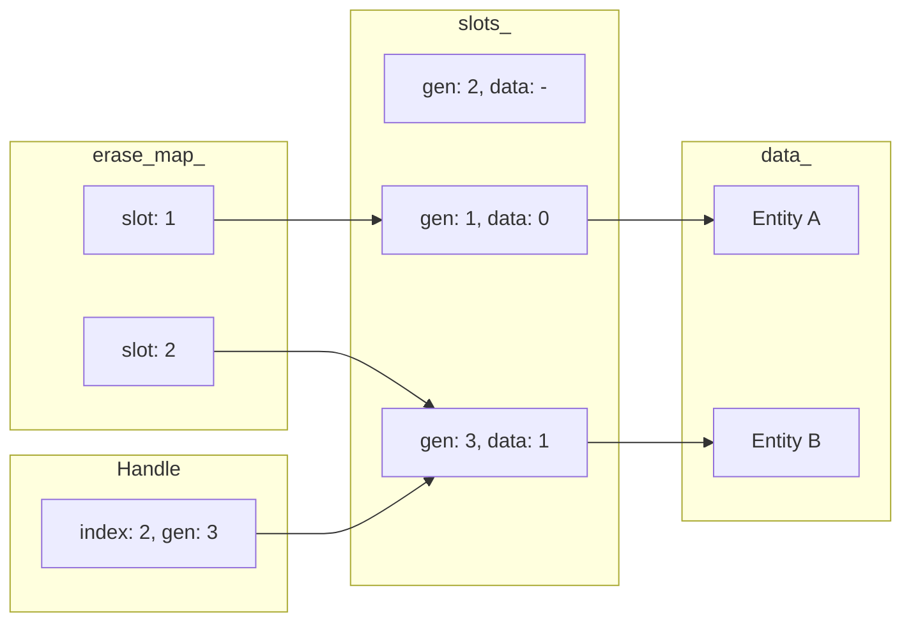

# SlotMap User Manual

**Library:** C++ Utilities Library (fat_p)  
**Standard:** C++17  
**Type:** Header-only

---

## Table of Contents

1. [What is SlotMap?](#what-is-slotmap)
2. [Core Architecture](#core-architecture)
3. [Getting Started](#getting-started)
4. [API Reference](#api-reference)
5. [Iteration](#iteration)
6. [Generational Safety](#generational-safety)
7. [Performance](#performance)
8. [Comparison with Alternatives](#comparison-with-alternatives)
9. [Best Practices](#best-practices)
10. [Troubleshooting](#troubleshooting)
11. [Summary](#summary)

---

## What is SlotMap?

### The Problem

Managing collections of objects with stable references is surprisingly difficult. Consider a game with entities that can be created and destroyed:

```cpp
// The naive approach - dangling pointers
std::vector<Entity> entities;

Entity* player = &entities[0];
Entity* enemy = &entities[5];

entities.erase(entities.begin() + 3);  // Reallocation!

player->update();  // Undefined behavior - pointer invalidated
enemy->update();   // Also invalid - indices shifted
```

Using indices doesn't fully solve it either:

```cpp
// The index approach - ABA problem
std::vector<Entity> entities;
size_t player_idx = 0;
size_t enemy_idx = 5;

entities.erase(entities.begin() + player_idx);

// Later: new entity spawns in slot 0
entities.insert(entities.begin(), new_entity);

// Bug: player_idx still points to slot 0, but it's a different entity!
process(entities[player_idx]);  // Processes wrong entity silently
```

This is the **ABA problem**: slot was A (player), became empty (B), became A again (new entity). Old references can't distinguish between the original and the replacement.

### The Solution

SlotMap uses **generational indices** to detect stale references:

```cpp
#include "SlotMap.h"

fat_p::SlotMap<Entity> entities;

auto player_handle = entities.insert(Entity{"Player", 100});
auto enemy_handle = entities.insert(Entity{"Goblin", 50});

// Access is safe
Entity* player = entities.get(player_handle);
player->health -= 10;

// Destroy the player
entities.erase(player_handle);

// New entity takes the same slot
auto new_entity = entities.insert(Entity{"Skeleton", 30});

// Old handle is INVALID - returns nullptr, never wrong data
Entity* ghost = entities.get(player_handle);  // nullptr!

// New handle works correctly
Entity* skeleton = entities.get(new_entity);  // Points to Skeleton
```

### How It Works

Each handle contains two parts:

```
Handle = { index: 42, generation: 3 }
           ▲              ▲
           │              └── "Which version of this slot"
           └── "Which slot in the array"
```

When a slot is reused, its generation counter increments. Old handles with outdated generations fail validation:

```cpp
// Insert: slot 0, generation 1
Handle player = { .index = 0, .generation = 1 };

// Erase: slot 0's generation becomes 2
// Insert new: slot 0, generation 2
Handle skeleton = { .index = 0, .generation = 2 };

// Validation:
is_valid(player);    // 1 != 2 → FALSE (stale handle)
is_valid(skeleton);  // 2 == 2 → TRUE (valid handle)
```

### The C++ Landscape

| Approach | Pros | Cons |
|----------|------|------|
| **Raw pointers** | Fast access | Invalidated by reallocation, no lifetime tracking |
| **std::shared_ptr** | Automatic lifetime | Reference counting overhead, shared ownership semantics |
| **Indices** | Stable across reallocation | ABA problem, no stale detection |
| **std::map** | Stable iterators | O(log n) access, poor cache locality |
| **SlotMap** | O(1) access, ABA-safe, cache-friendly iteration | Fixed to array storage |

SlotMap fills a specific niche: **high-performance, ABA-safe object pools** where you control the storage and need safe handles without shared ownership semantics.

### Architectural Honesty

Before reaching for SlotMap, an astute programmer should ask: *"Why do I have references I don't own to objects that can disappear?"*

The ABA problem exists because code holds references without controlling lifetime. Consider the proper alternatives:

**If code holds a reference, it should either:**

1. **Own it** — preventing deletion while held (RAII)
2. **Observe it** — be notified of deletion (observer pattern)
3. **Not exist** — reference scoped to guaranteed-valid lifetime

```cpp
// The RAII approach: ownership is explicit
class Entity
{
    fat_p::IdGuard<EntityId> id_guard_;  // Entity OWNS its ID
    
public:
    Entity(fat_p::IdGuard<EntityId> guard) 
        : id_guard_(std::move(guard)) {}
    
    EntityId id() const { return id_guard_.get(); }
    
    // When Entity dies, IdGuard dies, ID is released
    // No stale references possible - ownership is clear
};
```

Generational indices (SlotMap) represent a different philosophy: *"We accept that references leak everywhere, so let's detect staleness at runtime."* This is **capitulation to poor architecture**, not a solution.

**Why SlotMap exists anyway:**

Game engines and simulations often have:
- Cross-system communication with deferred processing
- Systems that cache entity references across frame boundaries
- Legacy codebases where rewriting ownership is prohibitive
- Performance requirements that outweigh architectural purity

```cpp
// Frame N: Physics system caches collision pairs
collision_pairs.push_back({entity_a, entity_b});

// Frame N+1: Gameplay deletes entity_b
entity_manager.destroy(entity_b);

// Frame N+2: Physics processes stale pair
// Without SlotMap: silent corruption or crash
// With SlotMap: get() returns nullptr, safely handled
```

**When to use what:**

| Situation | Recommendation |
|-----------|----------------|
| New codebase, clean architecture | Use RAII ownership (IdGuard) |
| References always short-lived | Scope references, don't store |
| Legacy code with leaked references | SlotMap is a reasonable workaround |
| Cross-system caching required | SlotMap detects staleness |
| Maximum performance, can't restructure | SlotMap adds runtime safety cheaply |

SlotMap is a **high-quality implementation of a workaround** for codebases that have lost control of reference lifetimes. If you're starting fresh, design with ownership in mind and you may not need it at all.

---

## Core Architecture

### Data Layout

SlotMap maintains four internal arrays:



| Array | Purpose | Indexing |
|-------|---------|----------|
| `data_` | Dense storage of actual values | Contiguous, no holes |
| `slots_` | Maps handle.index → {generation, data_index} | Sparse, may have free slots |
| `erase_map_` | Maps data_index → slot_index (for swap-and-pop) | Parallel to data_ |
| `free_list_` | Indices of reusable slots | Stack (LIFO reuse) |

### Why Four Arrays?

**Dense data storage** enables cache-friendly iteration. Unlike `std::map` or sparse arrays, iterating over `data_` touches contiguous memory with no holes.

**Indirection via slots** enables stable handles. When elements are erased, `data_` is compacted via swap-and-pop, but handles remain valid because they point to slots, not data indices.

**Erase map** enables O(1) erasure. When erasing, we need to update the swapped element's slot to point to its new data index. The erase map provides this reverse lookup.

**Free list** enables O(1) slot reuse. Erased slots are pushed onto the free list for LIFO reuse.

### Operation Complexity

| Operation | Time | Space | Notes |
|-----------|------|-------|-------|
| `insert()` | O(1) amortized | O(1) | May allocate if no free slots |
| `erase()` | O(1) | O(1) | Swap-and-pop, no shifting |
| `get()` | O(1) | O(1) | Two array lookups |
| `is_valid()` | O(1) | O(1) | One lookup + compare |
| Iteration | O(n) | O(1) | Dense, cache-friendly |

---

## Getting Started

### Prerequisites

- C++17 or later
- Header files: `SlotMap.h`, `FatPTypeTraits.h`

### Integration

Copy the header files to your project's include path. No compilation or linking required.

### First Program

```cpp
#include <iostream>
#include "SlotMap.h"

struct Player
{
    std::string name;
    int health;
    
    Player(std::string n, int h) : name(std::move(n)), health(h) {}
};

int main()
{
    fat_p::SlotMap<Player> players;
    
    // Insert returns a handle
    auto alice = players.insert("Alice", 100);
    auto bob = players.insert("Bob", 80);
    
    // Access via handle
    if (Player* p = players.get(alice))
    {
        std::cout << p->name << " has " << p->health << " HP\n";
    }
    
    // Erase by handle
    players.erase(bob);
    
    // Stale handle returns nullptr
    if (players.get(bob) == nullptr)
    {
        std::cout << "Bob is gone\n";
    }
    
    // Iterate over all players
    for (const Player& p : players)
    {
        std::cout << p.name << "\n";
    }
    
    return 0;
}
```

**Output:**
```
Alice has 100 HP
Bob is gone
Alice
```

---

## API Reference

### Types

```cpp
template<typename T>
class SlotMap
{
public:
    using value_type = T;
    using size_type = uint32_t;
    using generation_type = uint32_t;
    
    struct Handle;       // Opaque reference to an element
    struct Entry;        // Handle + value reference pair
    struct ConstEntry;   // Handle + const value reference pair
    
    class Iterator;           // Value iteration
    class ConstIterator;      // Const value iteration
    class EntryIterator;      // (Handle, value) iteration
    class ConstEntryIterator; // Const (Handle, value) iteration
};
```

### Handle

A handle is an opaque reference containing a slot index and generation counter.

```cpp
struct Handle
{
    size_type index{0};
    generation_type generation{0};
    
    constexpr bool is_null() const;      // True if default-constructed
    constexpr explicit operator bool() const;  // !is_null()
    
    constexpr bool operator==(const Handle&) const;
    constexpr bool operator!=(const Handle&) const;
};
```

**Important:** `is_null()` only checks if the handle was default-constructed. It does NOT check if the handle is valid in any SlotMap. Always use `map.is_valid(handle)` for that.

```cpp
SlotMap<int>::Handle h;           // Default: is_null() = true
auto h2 = map.insert(42);         // Assigned: is_null() = false
map.erase(h2);                    // h2.is_null() still false!
bool valid = map.is_valid(h2);    // FALSE - this is the real check
```

### Construction

```cpp
SlotMap();                           // Default constructor
SlotMap(const SlotMap&);             // Copy constructor
SlotMap(SlotMap&&) noexcept;         // Move constructor
SlotMap& operator=(const SlotMap&);  // Copy assignment
SlotMap& operator=(SlotMap&&) noexcept;  // Move assignment
```

SlotMap is copyable and movable. Handles from the original remain valid in copies.

### Modifiers

```cpp
template<typename... Args>
Handle insert(Args&&... args);
```

Inserts an element, constructing it in-place with the given arguments. Returns a handle to the new element.

```cpp
SlotMap<Player> players;

// Copy construction
Player p{"Alice", 100};
auto h1 = players.insert(p);

// Move construction
auto h2 = players.insert(Player{"Bob", 80});

// In-place construction (forwarding)
auto h3 = players.insert("Charlie", 60);
```

---

```cpp
bool erase(Handle handle);
```

Erases the element referenced by handle. Returns true if successful, false if handle was invalid.

```cpp
auto h = map.insert(42);
bool ok = map.erase(h);   // true
bool ok2 = map.erase(h);  // false (already erased)
```

---

```cpp
void clear();
```

Removes all elements. All handles become invalid.

---

```cpp
void reserve(size_type capacity);
```

Reserves storage for at least `capacity` elements, reducing allocations during insertion.

### Access

```cpp
[[nodiscard]] T* get(Handle handle);
[[nodiscard]] const T* get(Handle handle) const;
```

Returns a pointer to the element, or nullptr if the handle is invalid.

```cpp
if (Player* p = players.get(handle))
{
    p->health -= damage;
}
```

---

```cpp
[[nodiscard]] T& get_unchecked(Handle handle);
[[nodiscard]] const T& get_unchecked(Handle handle) const;
```

Returns a reference to the element **without validity checking**. Undefined behavior if the handle is invalid.

**Use case:** HPC tight loops where handles are known-valid and the ~3ns validation overhead matters.

```cpp
// Pre-validate handles once
std::vector<Handle> valid_handles;
for (auto h : all_handles)
{
    if (map.is_valid(h))
    {
        valid_handles.push_back(h);
    }
}

// Then use unchecked access in hot loop
for (auto h : valid_handles)
{
    map.get_unchecked(h).update();  // No validation, direct access
}
```

**Warning:** Using `get_unchecked()` with an invalid handle is undefined behavior. Only use when you can guarantee validity through surrounding logic.

---

```cpp
[[nodiscard]] bool is_valid(Handle handle) const;
```

Returns true if the handle refers to a valid element. This is the authoritative validity check.

### Capacity

```cpp
[[nodiscard]] size_type size() const;       // Number of elements
[[nodiscard]] size_type capacity() const;   // Current capacity
[[nodiscard]] bool empty() const;           // True if size == 0
[[nodiscard]] size_type slot_count() const; // Total slots allocated
[[nodiscard]] size_type free_slot_count() const;  // Reusable slots
```

---

## Iteration

### Value Iteration

The default iteration traverses values only, providing cache-friendly access to the dense data array:

```cpp
SlotMap<Enemy> enemies;
// ... insert enemies ...

// Range-based for (values only)
for (Enemy& enemy : enemies)
{
    enemy.update();
}

// Const iteration
for (const Enemy& enemy : enemies)
{
    std::cout << enemy.name << "\n";
}

// Iterator-based
for (auto it = enemies.begin(); it != enemies.end(); ++it)
{
    it->render();
}
```

### Entry Iteration

When you need both the handle and the value (e.g., to pass handles to other systems), use `entries()`:

```cpp
SlotMap<Enemy> enemies;
// ... insert enemies ...

// Iterate over (handle, value) pairs
for (auto entry : enemies.entries())
{
    collision_system.register_entity(entry.handle);
    entry.value.update();
}

// Const entry iteration
for (auto entry : const_enemies.entries())
{
    std::cout << "Handle index: " << entry.handle.index << "\n";
}
```

**Entry structure:**

```cpp
struct Entry
{
    Handle handle;  // Valid handle for this element
    T& value;       // Reference to the element
};

struct ConstEntry
{
    Handle handle;
    const T& value;
};
```

### Iteration Performance

| Method | Overhead | Use When |
|--------|----------|----------|
| `for (auto& x : map)` | Minimal | You only need values |
| `for (auto e : map.entries())` | ~40% more | You need handles + values |

The overhead comes from reconstructing handles from the erase_map during entries iteration.

---

## Generational Safety

### The ABA Problem Explained

```cpp
// Frame 1: Player exists at slot 0
Handle player = enemies.insert(Enemy{"Player", 100});
cached_target = player;  // AI caches this handle

// Frame 2: Player dies
enemies.erase(player);

// Frame 3: New enemy spawns, reuses slot 0
Handle goblin = enemies.insert(Enemy{"Goblin", 50});

// Frame 4: AI uses cached handle
Enemy* target = enemies.get(cached_target);
// WITHOUT generational indices: returns Goblin (WRONG!)
// WITH generational indices: returns nullptr (SAFE!)
```

### How Generations Prevent ABA

```cpp
// Insert: generation increments from 0 to 1
Handle player = { .index = 0, .generation = 1 };
// slots_[0].generation = 1

// Erase: generation increments from 1 to 2
enemies.erase(player);
// slots_[0].generation = 2

// Insert: generation increments from 2 to 3
Handle goblin = { .index = 0, .generation = 3 };
// slots_[0].generation = 3

// Validation:
enemies.is_valid(player);  // 1 != 3 → FALSE
enemies.is_valid(goblin);  // 3 == 3 → TRUE
```

### Generation Overflow

Generations are 32-bit unsigned integers. After 4 billion reuses of the same slot, the generation wraps to 0, potentially allowing an ancient handle to validate incorrectly.

**In practice, this is not a concern:**

| Scenario | Time to Overflow |
|----------|-----------------|
| 60 FPS, 1 reuse/frame | 2.3 years continuous |
| 1000 reuses/second | 49 days continuous |
| Same slot every time | Requires deliberate attack |

For truly paranoid applications, stop reusing slots at max generation (not implemented, would require code modification).

---

## Performance

### Benchmark Environment

| Component | Specification |
|-----------|---------------|
| Environment | Linux container (Ubuntu 24.04) |
| Compiler | GCC 13.3, `-O3` |
| CPU | Sandboxed (variable) |

### Benchmark Results

| Operation | Time | Notes |
|-----------|------|-------|
| Insert | ~99 ns | Amortized, may allocate |
| Get | ~3 ns | Two array lookups + validation |
| get_unchecked | ~3 ns | Two array lookups, no validation |
| is_valid | ~3 ns | One lookup + compare |
| Erase | ~11 ns | Swap-and-pop |
| Iteration (10k) | ~1.1 µs | Dense, cache-friendly |
| Entry iteration (10k) | ~1.6 µs | Handle reconstruction overhead |

**Note:** `get()` and `get_unchecked()` show similar times in benchmarks because branch prediction is perfect when all handles are valid. The difference appears when branches mispredict or in code-size-sensitive scenarios.

### Cache Efficiency

SlotMap's dense storage provides excellent cache behavior:

```cpp
// SlotMap: Linear memory access
for (auto& enemy : enemies)  // data_[0], data_[1], data_[2]...
{
    enemy.update();  // Prefetcher happy
}

// std::map: Pointer chasing
for (auto& [k, v] : map)  // node0->next->next->...
{
    v.update();  // Cache misses
}
```

### Memory Overhead

Per element:
- `data_`: sizeof(T)
- `slots_`: 8 bytes (generation + data_index)
- `erase_map_`: 4 bytes
- Total overhead: **12 bytes per element** + freed slot tracking

Compare to:
- `std::map`: ~32-48 bytes per node (pointers + color bit)
- `std::shared_ptr`: 16+ bytes control block per object

---

## Comparison with Alternatives

### SlotMap vs IdGenerator

Both are fat_p components with complementary purposes:

| Aspect | SlotMap | IdGenerator |
|--------|---------|-------------|
| **Owns data** | Yes | No |
| **Purpose** | Store objects with safe handles | Generate unique IDs for external resources |
| **ABA safety** | Built-in (generational) | Requires `is_active()` check |
| **Validation cost** | ~3 ns (array lookup) | ~30 ns (hash lookup) |
| **Iteration** | Dense, cache-friendly | N/A (doesn't store data) |
| **Use case** | Object pools, ECS | Network handles, file IDs, database keys |

**When to use which:**

```cpp
// SlotMap: You own the objects
SlotMap<Enemy> enemies;
auto h = enemies.insert(Enemy{...});
Enemy* ptr = enemies.get(h);

// IdGenerator: You reference external resources
IdGenerator<ConnectionId> conn_ids;
auto id = conn_ids.generate();
Connection& conn = socket_map[*id];  // External storage
```

### SlotMap vs std::unordered_map

| Aspect | SlotMap | std::unordered_map |
|--------|---------|-------------------|
| Key type | Fixed (Handle) | Any hashable type |
| Iteration | Dense, predictable | Sparse, bucket-dependent |
| Memory | ~12 bytes overhead/element | ~32+ bytes overhead/element |
| Stale detection | Built-in | Manual (key presence check) |
| Access | O(1) guaranteed | O(1) average, O(n) worst |

**Use SlotMap when:**
- Keys are opaque handles (not meaningful values)
- Iteration performance matters
- Memory efficiency matters
- ABA safety is needed

**Use unordered_map when:**
- Keys have semantic meaning (e.g., names, IDs from external systems)
- You need key lookup without a handle
- Key type is not a simple index

### SlotMap vs ECS Libraries (entt, flecs)

| Aspect | SlotMap | ECS Entity Handles |
|--------|---------|-------------------|
| Scope | Single container | Entire registry |
| Components | Single type T | Multiple component types |
| Complexity | Simple | Full ECS framework |
| Dependency | Header-only, standalone | Full library |

**Use SlotMap for:**
- Simple object pools
- When you don't need a full ECS
- Standalone safe handle semantics

**Use ECS libraries for:**
- Full entity-component-system architecture
- Complex game engines
- When you need queries, systems, archetypes

---

## Best Practices

### Do Store Handles, Not Pointers

```cpp
// WRONG: Pointer may be invalidated
Enemy* enemy = map.get(handle);
// ... other code that might erase elements ...
enemy->update();  // Potentially dangling!

// RIGHT: Re-fetch via handle
if (Enemy* enemy = map.get(handle))
{
    enemy->update();
}
```

### Do Check Validity Before Access

```cpp
// WRONG: Assumes handle is valid
process(map.get(handle)->data);  // Crash if invalid

// RIGHT: Check first
if (auto* ptr = map.get(handle))
{
    process(ptr->data);
}
```

### Do Use entries() When You Need Handles

```cpp
// WRONG: Can't get handle from value iteration
for (auto& enemy : enemies)
{
    // How do I get the handle for this enemy?
}

// RIGHT: Use entries()
for (auto entry : enemies.entries())
{
    register_for_collision(entry.handle);
    entry.value.update();
}
```

### Do Reserve Capacity Upfront

```cpp
SlotMap<Bullet> bullets;
bullets.reserve(10000);  // Avoid reallocations in hot loop

for (int i = 0; i < 10000; ++i)
{
    bullets.insert(Bullet{...});  // No allocations
}
```

### Don't Confuse is_null() with is_valid()

```cpp
SlotMap<int>::Handle h;

h.is_null();          // TRUE (default-constructed)
map.is_valid(h);      // FALSE (not in map)

auto h2 = map.insert(42);
h2.is_null();         // FALSE (assigned)
map.is_valid(h2);     // TRUE (in map)

map.erase(h2);
h2.is_null();         // FALSE (still assigned!)
map.is_valid(h2);     // FALSE (erased)
```

### Don't Erase During Value Iteration

```cpp
// WRONG: Modifying during iteration
for (auto& enemy : enemies)
{
    if (enemy.health <= 0)
    {
        enemies.erase(???);  // Can't get handle, and would invalidate iterator
    }
}

// RIGHT: Collect handles first, erase after
std::vector<Handle> to_remove;
for (auto entry : enemies.entries())
{
    if (entry.value.health <= 0)
    {
        to_remove.push_back(entry.handle);
    }
}
for (auto h : to_remove)
{
    enemies.erase(h);
}
```

---

## Troubleshooting

### Compilation Errors

#### Missing Headers

**Symptom:**
```
fatal error: FatPTypeTraits.h: No such file or directory
```

**Solution:** Ensure all required headers are in your include path:
- `SlotMap.h`
- `FatPTypeTraits.h`
- `TypeTraits.h`
- `CppStandardDetection.h`

#### C++ Standard Version

**Symptom:**
```
error: 'if constexpr' only available with '-std=c++17'
```

**Solution:** Enable C++17 or later:
- GCC/Clang: `-std=c++17`
- MSVC: `/std:c++17`

### Runtime Issues

#### get() Returns nullptr Unexpectedly

**Possible causes:**
1. Handle was erased
2. Handle was from a different SlotMap
3. Handle was default-constructed
4. SlotMap was cleared or moved-from

**Debugging:**
```cpp
if (!map.is_valid(handle))
{
    if (handle.is_null())
    {
        // Handle was never assigned
    }
    else
    {
        // Handle was assigned but is now stale
    }
}
```

#### Incorrect Element Accessed

**This should never happen with SlotMap.** If `get()` returns non-null, it's guaranteed to be the correct element. If you're seeing wrong data:

1. Check for memory corruption elsewhere
2. Verify you're not holding raw pointers across modifications
3. Ensure handles aren't being incorrectly copied/assigned

---

## Summary

### Key Features

- **Generational indices** prevent ABA bugs automatically
- **O(1) operations** for insert, erase, and access
- **Dense iteration** provides cache-friendly traversal
- **entries()** iteration for handle + value access
- **Header-only** with minimal dependencies
- **Zero-overhead validation** via generation comparison

### When to Use SlotMap

| Scenario | SlotMap Suitable? |
|----------|------------------|
| Object pools with safe handles | ✅ Yes |
| Game entity management | ✅ Yes |
| Resource tracking with deletion | ✅ Yes |
| Cross-system cached references | ✅ Yes (detects staleness) |
| New codebase, clean architecture | ⚠️ Consider RAII ownership first |
| Key-value lookup by semantic key | ❌ Use std::unordered_map |
| Distributed unique IDs | ❌ Use IdGenerator or UUIDs |
| Full ECS architecture | ❌ Use entt, flecs, etc. |

**Note:** SlotMap excels when references leak across system boundaries. If you control all reference lifetimes, RAII ownership (e.g., IdGuard) may be a cleaner solution.

### Quick Reference

```cpp
#include "SlotMap.h"

fat_p::SlotMap<MyType> map;

// Insert
auto handle = map.insert(args...);

// Access (safe)
if (MyType* ptr = map.get(handle)) { ... }

// Access (unchecked, HPC)
MyType& ref = map.get_unchecked(handle);  // UB if invalid!

// Erase
map.erase(handle);

// Check validity
if (map.is_valid(handle)) { ... }

// Value iteration
for (auto& value : map) { ... }

// Entry iteration (handle + value)
for (auto entry : map.entries())
{
    use(entry.handle, entry.value);
}
```

### Related Components

- **IdGenerator**: Unique ID generation without storage
- **StrongId**: Type-safe ID wrappers
- **Expected**: Error handling without exceptions

---

**End of SlotMap User Manual**
