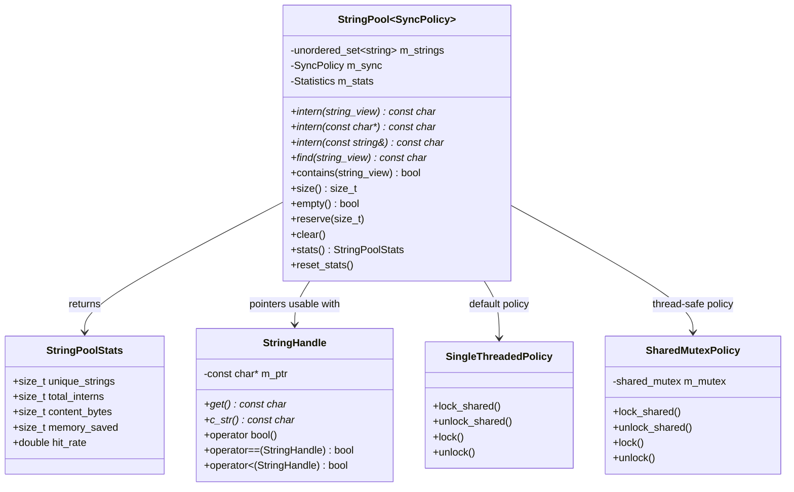
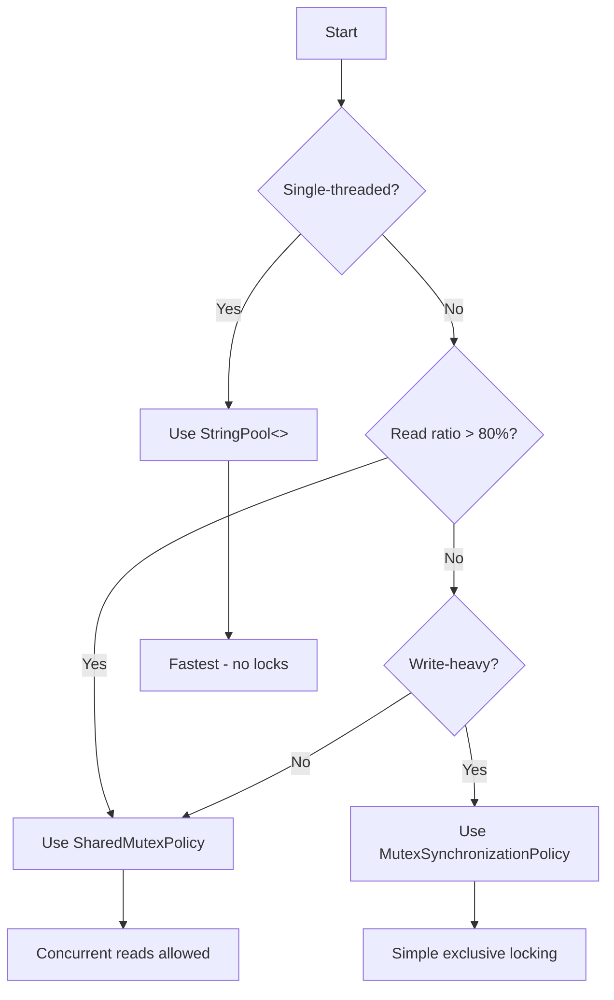

# StringPool User Manual

**Version:** 1.0  
**C++ Standard:** C++17 minimum, C++20 optimized  
**Thread Safety:** Policy-based (configurable)  
**Dependencies:** ConcurrencyPolicies.h only  
**License:** None required — free to use and modify

---

## Table of Contents

1. [What is String Pooling?](#what-is-string-pooling)
2. [Why Use a String Pool?](#why-use-a-string-pool)
3. [Getting Started](#getting-started)
4. [Core Architecture](#core-architecture)
5. [Interning Strings](#interning-strings)
6. [Querying the Pool](#querying-the-pool)
7. [Statistics and Monitoring](#statistics-and-monitoring)
8. [Pool Management](#pool-management)
9. [StringHandle: Safe Wrapper Class](#stringhandle-safe-wrapper-class)
10. [Thread Safety Policies](#thread-safety-policies)
11. [Performance Characteristics](#performance-characteristics)
12. [The C++ String Pooling Landscape](#the-c-string-pooling-landscape)
13. [Migration Guide](#migration-guide)
14. [Best Practices](#best-practices)
15. [Troubleshooting](#troubleshooting)
16. [Summary](#summary)

---

## What is String Pooling?

### The Problem: Death by a Thousand Copies

Consider a JSON parser processing thousands of objects:

```cpp
// Parsing 10,000 user records, each with keys "name", "email", "role"
for (const auto& record : json_array) {
    User user;
    user.name = record["name"].get<std::string>();   // Allocates "name"
    user.email = record["email"].get<std::string>(); // Allocates "email"  
    user.role = record["role"].get<std::string>();   // Allocates "role"
    users.push_back(user);
}
// Result: 30,000 string allocations for just 3 unique key names
```

Each `"name"` string is identical, yet we've allocated it 10,000 times. This wastes memory, 
pollutes the CPU cache, and makes string comparison needlessly slow.

### The Solution: String Interning

**String pooling** (also called **string interning**) stores only one copy of each distinct 
string. When you "intern" a string, the pool either:

- **Returns the existing pointer** if the string is already stored
- **Creates a new copy** and returns its pointer if it's new

```cpp
#include "StringPool.h"

fat_p::StringPool<> pool;

const char* s1 = pool.intern("hello");  // Creates "hello", returns pointer
const char* s2 = pool.intern("hello");  // Finds existing, returns SAME pointer
const char* s3 = pool.intern("world");  // Creates "world", returns new pointer

// s1 == s2 is TRUE - Identical pointers!
// s1 != s3 is TRUE - Different strings, different pointers
```

This single guarantee—identical strings yield identical pointers—unlocks three benefits:

| Benefit | Without Pool | With Pool |
|---------|--------------|-----------|
| **String equality** | O(n) character comparison | O(1) pointer comparison |
| **Memory usage** | N copies × string size | 1 copy × string size |
| **Cache efficiency** | Scattered copies | Single location |

### Where Does This Pattern Come From?

String interning isn't new. Java has had `String.intern()` since 1.0 (1996). Python interns 
small strings automatically. Lisp systems have used symbol tables since the 1960s. The pattern 
appears wherever programs manipulate many repeated string values: compilers (identifiers), 
databases (column names), game engines (entity tags), configuration systems (keys).

This implementation brings the pattern to modern C++ with zero external dependencies, 
policy-based thread safety, and HPC-appropriate performance characteristics.

---

## Why Use a String Pool?

### When String Pooling Helps

**High duplication scenarios:**

| Scenario | Unique Strings | Total Uses | Duplication | Verdict |
|----------|----------------|------------|-------------|---------|
| JSON keys | 20 | 50,000 | 99.96% | ✅ Excellent fit |
| Config keys | 50 | 10,000 | 99.5% | ✅ Excellent fit |
| Log categories | 10 | 100,000 | 99.99% | ✅ Excellent fit |
| Entity tags | 100 | 5,000 | 98% | ✅ Good fit |
| User IDs | 10,000 | 10,000 | 0% | ❌ No benefit |

**Rule of thumb:** If your hit rate (duplicate ratio) exceeds 50%, pooling helps. Below 20%, 
the overhead likely exceeds the benefit.

### Memory Savings: A Concrete Example

```cpp
// WITHOUT string pool
std::vector<std::string> tags;
for (int i = 0; i < 10000; ++i) {
    tags.push_back("active");  // 10,000 copies
}
// Memory: 10,000 × (32 bytes overhead + 7 bytes content) ≈ 390 KB

// WITH string pool  
fat_p::StringPool<> pool;
std::vector<const char*> tags;
for (int i = 0; i < 10000; ++i) {
    tags.push_back(pool.intern("active"));  // 1 copy, 10,000 pointers
}
// Memory: 1 × 40 bytes (string + overhead) + 10,000 × 8 bytes (pointers) ≈ 80 KB
// Savings: 310 KB (79% reduction)
```

### Fast Comparison: Why Pointers Beat strcmp

String comparison is surprisingly expensive:

```cpp
// Slow: O(n) character-by-character comparison
bool equal_slow(const char* a, const char* b) {
    return strcmp(a, b) == 0;  // Loops through every character
}

// Fast: O(1) pointer comparison
bool equal_fast(const char* a, const char* b) {
    return a == b;  // Single CPU instruction
}
```

For a 50-character string compared 1 million times:
- `strcmp`: ~50 million character comparisons
- Pointer equality: 1 million pointer comparisons

With interned strings, you get the fast path automatically—identical content means identical 
pointers.

### When NOT to Use a String Pool

String pooling adds overhead. Avoid it when:

- **Every string is unique:** UUIDs, timestamps, user-generated content
- **Strings are very large:** The pool's per-string overhead (~40 bytes) is negligible for 
  short strings but wasteful for multi-kilobyte content
- **String lifetime is ephemeral:** Pooled strings live until `clear()` is called; if you 
  need strings to be garbage-collected individually, use `std::string`
- **Memory isn't constrained:** If you have plenty of RAM and don't care about comparison 
  speed, the complexity isn't worth it

---

## Getting Started

### Prerequisites

- C++17 or later compiler (GCC 7+, Clang 5+, MSVC 2017+)
- `ConcurrencyPolicies.h` header (provides thread safety policies)

### Integration

StringPool is header-only. Copy the headers to your project:

```
your_project/
├── include/
│   ├── StringPool.h
│   └── ConcurrencyPolicies.h
└── src/
    └── main.cpp
```

### Your First Program

```cpp
#include <iostream>
#include "StringPool.h"

int main()
{
    // Create a string pool (single-threaded by default)
    fat_p::StringPool<> pool;
    
    // Intern some strings
    const char* greeting = pool.intern("Hello, World!");
    const char* duplicate = pool.intern("Hello, World!");
    const char* different = pool.intern("Goodbye!");
    
    // Verify deduplication
    std::cout << "Same pointer? " << (greeting == duplicate ? "Yes" : "No") << "\n";
    std::cout << "Different pointer? " << (greeting != different ? "Yes" : "No") << "\n";
    
    // Check statistics
    auto stats = pool.stats();
    std::cout << "Unique strings: " << stats.unique_strings << "\n";
    std::cout << "Total interns: " << stats.total_interns << "\n";
    std::cout << "Hit rate: " << (stats.hit_rate * 100) << "%\n";
    
    return 0;
}
```

**Compile and run:**
```bash
g++ -std=c++17 -O2 -I include src/main.cpp -o string_pool_demo
./string_pool_demo
```

**Output:**
```
Same pointer? Yes
Different pointer? Yes
Unique strings: 2
Total interns: 3
Hit rate: 33.3333%
```

### Multi-Threaded Usage

For thread-safe access, specify a synchronization policy:

```cpp
#include <iostream>
#include <string>
#include <thread>
#include <vector>
#include "StringPool.h"

int main()
{
    // Thread-safe pool with reader/writer locks
    fat_p::StringPool<fat_p::SharedMutexPolicy> pool;
    
    // Pre-allocate for expected load
    pool.reserve(1000);
    
    // Spawn worker threads
    std::vector<std::thread> workers;
    for (int i = 0; i < 4; ++i) {
        workers.emplace_back([&pool, i]() {
            for (int j = 0; j < 1000; ++j) {
                pool.intern("worker_" + std::to_string(i));
            }
        });
    }
    
    // Wait for completion
    for (auto& t : workers) {
        t.join();
    }
    
    std::cout << "Unique strings: " << pool.size() << "\n";
    return 0;
}
```

---

## Core Architecture

### Internal Structure

```
StringPool<SyncPolicy>
│
├── std::unordered_set<std::string>    ← Hash table storing unique strings
│   └── Uses std::hash<std::string>
│
├── SyncPolicy                          ← Template parameter for thread safety
│   ├── SingleThreadedPolicy (default)  ← No locks, no atomics
│   ├── SharedMutexPolicy               ← Reader/writer locks  
│   └── MutexSynchronizationPolicy      ← Exclusive locks
│
└── Statistics (conditional)            ← Atomic or plain integers
    ├── total_interns                   ← Count of intern() calls
    ├── content_bytes                   ← Sum of string lengths
    └── memory_saved                    ← Bytes saved by deduplication
```

### Class Diagram



### Why std::unordered_set?

The pool needs three operations:
1. **Find:** Check if a string exists → O(1) hash lookup
2. **Insert:** Add new string if missing → O(1) amortized
3. **Stable pointers:** Returned `const char*` must remain valid

`std::unordered_set<std::string>` provides all three. The standard guarantees that iterators 
(and thus `c_str()` pointers) remain valid unless the element is erased. Since we never erase 
individual strings, pointers are stable for the pool's lifetime.

### The C++17 vs C++20 Lookup Problem

In C++17, searching a `std::unordered_set<std::string>` requires a `std::string` key:

```cpp
// C++17: Must construct temporary string
std::string temp(str);           // Potential heap allocation!
auto it = m_strings.find(temp);  // Search with temporary
```

C++20 introduced "heterogeneous lookup" allowing direct `string_view` searches:

```cpp
// C++20: No temporary needed
auto it = m_strings.find(str);   // Search directly with string_view
```

StringPool detects C++20 automatically and uses the faster path when available. For HPC 
workloads with many lookups, **C++20 is strongly recommended** to avoid temporary allocations.

### Memory Lifetime Contract

**Critical rule:** Interned pointers are valid until `clear()` is called or the pool is 
destroyed.

```cpp
fat_p::StringPool<> pool;
const char* ptr = pool.intern("important");

use(ptr);        // ✅ Safe
pool.clear();    // ⚠️ Invalidates ALL pointers
use(ptr);        // ❌ Undefined behavior - dangling pointer!
```

This is a deliberate design choice. Tracking individual string lifetimes would require 
reference counting, adding overhead incompatible with HPC goals. If you need garbage 
collection, use `std::shared_ptr<std::string>` instead.

### Non-Copyable, Non-Movable

StringPool cannot be copied or moved:

```cpp
fat_p::StringPool<> pool1;
pool1.intern("test");

fat_p::StringPool<> pool2 = pool1;             // ❌ Compile error (deleted)
fat_p::StringPool<> pool3 = std::move(pool1);  // ❌ Compile error (deleted)
```

**Why no copy?** Copying would duplicate all strings, defeating the purpose of pooling.

**Why no move?** Two reasons:
1. `std::shared_mutex` (used by `SharedMutexPolicy`) is not movable
2. Moving would invalidate all outstanding pointers, creating silent dangling references

If you need to transfer ownership, wrap the pool in `std::unique_ptr<StringPool>`.

---

## Interning Strings

### What is Interning?

"Interning" means adding a string to the pool and receiving a stable pointer. The term comes 
from Java's `String.intern()` method, which has existed since Java 1.0.

The key guarantee: **calling `intern()` with identical content always returns the same pointer**.

```cpp
fat_p::StringPool<> pool;

const char* a = pool.intern("test");
const char* b = pool.intern("test");
const char* c = pool.intern(std::string("test"));
const char* d = pool.intern(std::string_view("test"));

// a == b && b == c && c == d - All identical pointers
```

### When to Use intern()

Use `intern()` when you want to:
- **Store a string** and get a stable pointer for later comparison
- **Deduplicate** strings you'll reference multiple times
- **Enable fast equality checks** via pointer comparison

```cpp
// Good: Strings will be compared many times
std::map<const char*, Value> cache;
cache[pool.intern(key)] = compute(key);

// Good: Many duplicates expected
for (const auto& record : large_dataset) {
    record.category = pool.intern(record.raw_category);
}
```

### The Three Overloads

StringPool accepts strings in any common format:

```cpp
fat_p::StringPool<> pool;

// From string_view (most efficient in C++20)
const char* s1 = pool.intern(std::string_view("hello"));

// From C-string
const char* s2 = pool.intern("hello");

// From std::string
std::string str = "hello";
const char* s3 = pool.intern(str);

// s1 == s2 && s2 == s3 - All return same pointer
```

**Which overload to prefer?**

| Input Type | C++17 Performance | C++20 Performance | Recommendation |
|------------|-------------------|-------------------|----------------|
| `string_view` | Temporary allocation | Zero-copy lookup | ✅ Prefer |
| `const char*` | Temporary allocation | Zero-copy lookup | ✅ Good |
| `std::string` | No extra allocation | No extra allocation | For existing strings |

### Handling nullptr

Passing `nullptr` to `intern()` returns an interned empty string, not null:

```cpp
fat_p::StringPool<> pool;

const char* s1 = pool.intern(nullptr);
const char* s2 = pool.intern("");

// s1 == s2 - Both point to interned ""
// s1 != nullptr - Never returns nullptr
// std::strlen(s1) == 0 - Empty string
```

This design prevents null pointer bugs. If you need to distinguish "no value" from "empty 
string", use `std::optional<const char*>` or a sentinel value.

---

## Querying the Pool

### find() vs intern(): What's the Difference?

Both methods search for a string, but they differ in what happens when the string is missing:

| Method | String Found | String Missing |
|--------|--------------|----------------|
| `intern()` | Returns pointer | **Inserts** string, returns pointer |
| `find()` | Returns pointer | Returns `nullptr` |

```cpp
fat_p::StringPool<> pool;
pool.intern("exists");

// find() - read-only lookup
const char* found = pool.find("exists");      // Returns pointer
const char* missing = pool.find("missing");   // Returns nullptr

// intern() - lookup with insertion
const char* also_found = pool.intern("exists");   // Returns same pointer
const char* now_exists = pool.intern("missing");  // INSERTS, then returns pointer
```

### When to Use find()

Use `find()` when you want to check existence without modifying the pool:

```cpp
// Pattern: Check if key is known before processing
const char* category = pool.find(input_category);
if (category) {
    process_known_category(category);
} else {
    handle_unknown_category(input_category);
}
```

Use `intern()` when you want the string in the pool regardless:

```cpp
// Pattern: Always store the string
const char* category = pool.intern(input_category);
process_category(category);  // Works whether new or existing
```

### contains(): Simple Existence Check

When you only need a boolean answer:

```cpp
if (pool.contains("admin")) {
    grant_elevated_access();
}
```

`contains()` is equivalent to `find() != nullptr` but expresses intent more clearly.

### size() and empty(): Pool State

```cpp
fat_p::StringPool<> pool;

// pool.empty() is true - no strings yet
// pool.size() == 0

pool.intern("first");
pool.intern("second");
pool.intern("first");        // Duplicate

// pool.empty() is false
// pool.size() == 2 - Only UNIQUE strings count
```

---

## Statistics and Monitoring

### Why Track Statistics?

String pooling is only beneficial when duplication is high. Built-in statistics let you 
verify the pool is actually helping:

```cpp
auto stats = pool.stats();

if (stats.hit_rate < 0.3) {
    std::cerr << "Warning: Only " << (stats.hit_rate * 100) 
              << "% hit rate. Pool may not be beneficial.\n";
}
```

### The StringPoolStats Structure

```cpp
struct StringPoolStats 
{
    size_t unique_strings;   // Number of distinct strings in pool
    size_t total_interns;    // Total intern() calls (hits + misses)
    size_t content_bytes;    // Sum of string lengths (chars + null terminators)
    size_t memory_saved;     // Bytes saved by deduplication
    double hit_rate;         // Fraction of intern() calls that found existing string
};
```

### Understanding Each Metric

**unique_strings:** Count of distinct strings stored. This is derived directly from the 
container's `size()` at query time for accuracy.

**total_interns:** How many times `intern()` was called. Includes both hits (found existing) 
and misses (inserted new).

**content_bytes:** Logical size of all string content. Note: this tracks `strlen + 1` for 
each string, not actual heap allocations. Due to Small String Optimization (SSO), strings 
under ~15-22 characters may use zero heap memory.

**memory_saved:** Estimated bytes saved by deduplication. Calculated as: for each duplicate 
intern, add `string_length + 1` to the total.

**hit_rate:** Fraction of intern() calls that found an existing string:
```
hit_rate = (total_interns - unique_strings) / total_interns
```

### Example: Interpreting Statistics

```cpp
fat_p::StringPool<> pool;

// Simulate parsing JSON with repeated keys
for (int i = 0; i < 1000; ++i) {
    pool.intern("name");
    pool.intern("email");
    pool.intern("role");
}

auto stats = pool.stats();
std::cout << "Unique strings: " << stats.unique_strings << "\n";   // 3
std::cout << "Total interns: " << stats.total_interns << "\n";     // 3000
std::cout << "Content bytes: " << stats.content_bytes << "\n";     // 16 (5+6+5)
std::cout << "Memory saved: " << stats.memory_saved << "\n";       // ~47,984
std::cout << "Hit rate: " << (stats.hit_rate * 100) << "%\n";      // 99.9%
```

This tells us: 3 unique strings were stored, `intern()` was called 3,000 times, and 99.9% 
of calls found an existing string. The pool saved ~48 KB of memory.

### reset_stats(): Starting Fresh

After a batch operation, you might want to measure the next phase separately:

```cpp
// Phase 1: Load configuration
load_config(pool);
auto phase1 = pool.stats();
log_stats("Config loading", phase1);

pool.reset_stats();  // Reset counters, keep strings

// Phase 2: Process requests  
process_requests(pool);
auto phase2 = pool.stats();
log_stats("Request processing", phase2);
```

`reset_stats()` sets `total_interns` to the current number of unique strings (`pool.size()`) 
and resets `memory_saved` to zero. The strings themselves remain in the pool.

---

## Pool Management

### reserve(): Avoiding Rehash Overhead

Hash tables periodically "rehash" when they grow, copying all elements to a larger table. 
For bulk loading, this creates spikes of latency.

`reserve()` pre-allocates buckets to avoid rehashing:

```cpp
fat_p::StringPool<> pool;

// Without reserve: Multiple rehashes during loading
// With reserve: Single allocation upfront
pool.reserve(10000);  // Expect ~10,000 unique strings

for (const auto& symbol : parse_symbol_table(file)) {
    pool.intern(symbol);  // No rehashing
}
```

**Performance impact:**

| Scenario | Time per Insert |
|----------|-----------------|
| Bulk insert (no reserve) | ~159 ns |
| Bulk insert (with reserve) | ~103 ns |
| **Improvement** | **35% faster** |

**When to use reserve():**
- Loading from files or databases
- Known approximate count of unique strings
- Performance-critical initialization

### clear(): Releasing Memory

`clear()` removes all strings and resets statistics:

```cpp
fat_p::StringPool<> pool;
const char* ptr = pool.intern("temporary");

// ... use ptr ...

pool.clear();  // Frees all strings

// ⚠️ WARNING: ptr is now dangling!
// Any use of ptr after clear() is undefined behavior
```

**Use cases for clear():**
- Processing independent batches
- Releasing memory between phases
- Resetting state for testing

**Alternatives if you can't invalidate pointers:**
- Create a new pool and let the old one destruct naturally
- Use separate pools for different lifetimes

---

## StringHandle: Safe Wrapper Class

### What is StringHandle?

`StringHandle` is a lightweight wrapper around `const char*` that provides:
- Type safety (distinct type from raw pointers)
- Container compatibility (`std::map`, `std::set`, `std::unordered_map`)
- Null safety (boolean conversion, safe `c_str()`)
- Comparison operators

### Why Use StringHandle Instead of Raw Pointers?

Raw `const char*` pointers work, but have limitations:

```cpp
// Problem 1: No type safety
void process(const char* interned_string);
void process(const char* regular_string);  // Same signature!

// Problem 2: Container comparison issues
std::map<const char*, int> map;
map["key"] = 1;
map["key"] = 2;  // May create duplicate entry! (different pointer)

// Problem 3: Null handling
const char* ptr = nullptr;
std::cout << ptr;  // Undefined behavior on some platforms
```

StringHandle solves all three:

```cpp
// Solution 1: Type safety
void process(fat_p::StringHandle interned_string);  // Clearly interned

// Solution 2: Correct container behavior
std::map<fat_p::StringHandle, int> map;
map[fat_p::StringHandle(pool.intern("key"))] = 1;
map[fat_p::StringHandle(pool.intern("key"))] = 2;  // Updates same entry

// Solution 3: Null safety
fat_p::StringHandle h;  // Default constructs to nullptr
std::cout << h.c_str();  // Prints "" (empty string), not crash
```

### Creating and Using StringHandle

```cpp
fat_p::StringPool<> pool;

// Create from interned pointer
fat_p::StringHandle h1(pool.intern("hello"));

// Create empty handle
fat_p::StringHandle h2;  // Wraps nullptr

// Access the string
const char* raw = h1.get();         // Returns raw pointer (may be nullptr)
const char* safe = h1.c_str();      // Returns "" if nullptr
std::string_view sv = h1;           // Implicit conversion
const char* also_raw = h1;          // Implicit conversion to const char*

// Check for null
if (h1) {
    std::cout << "h1 has value: " << h1.c_str() << "\n";
}
if (!h2) {
    std::cout << "h2 is empty\n";
}
```

### Comparison Semantics: A Critical Detail

**StringHandle uses pointer-based ordering, NOT alphabetical ordering.**

```cpp
fat_p::StringHandle h1(pool.intern("aaa"));
fat_p::StringHandle h2(pool.intern("bbb"));
fat_p::StringHandle h3(pool.intern("aaa"));

// Equality: pointer comparison
// h1 == h3 is TRUE - Same interned string → same pointer
// h1 != h2 is TRUE - Different strings → different pointers

// Ordering: also pointer comparison
// Order depends on memory addresses, NOT alphabetical order!
// (h1 < h2) could be true or false depending on allocation order
```

**Important:** Pointer ordering is arbitrary and depends on memory allocation. It is stable 
within a single program execution but **not stable across runs or recompilations**. Do not 
rely on specific ordering for correctness—only use it for container requirements.

**Why pointer-based ordering?**

1. **Consistency:** Both `==` and `<` use the same semantics (pointer comparison)
2. **Performance:** O(1) comparison instead of O(n) for `strcmp`
3. **Correctness:** Mixing pointer equality with lexicographic ordering breaks `std::map`

**If you need alphabetical ordering:**

```cpp
auto alphabetical = [](const fat_p::StringHandle& a, const fat_p::StringHandle& b) {
    return std::strcmp(a.c_str(), b.c_str()) < 0;
};

std::set<fat_p::StringHandle, decltype(alphabetical)> sorted_set(alphabetical);
sorted_set.insert(fat_p::StringHandle(pool.intern("banana")));
sorted_set.insert(fat_p::StringHandle(pool.intern("apple")));
sorted_set.insert(fat_p::StringHandle(pool.intern("cherry")));

// Iterates in alphabetical order: apple, banana, cherry
for (const auto& h : sorted_set) {
    std::cout << h.c_str() << "\n";
}
```

### Using StringHandle in Containers

**std::map (ordered by pointer address):**
```cpp
std::map<fat_p::StringHandle, int> scores;
scores[fat_p::StringHandle(pool.intern("alice"))] = 100;
scores[fat_p::StringHandle(pool.intern("bob"))] = 95;

// Lookup works correctly
fat_p::StringHandle key(pool.intern("alice"));
std::cout << scores[key] << "\n";  // Prints 100
```

**std::unordered_map (hash-based):**
```cpp
std::unordered_map<fat_p::StringHandle, int> cache;
cache[fat_p::StringHandle(pool.intern("key1"))] = 42;

// std::hash<StringHandle> is provided automatically
```

---

## Thread Safety Policies

### What is a Policy?

A "policy" is a template parameter that customizes behavior without runtime overhead. 
StringPool uses policies for thread safety, allowing you to pay only for what you need:

```cpp
// No synchronization (fastest, single-threaded only)
fat_p::StringPool<fat_p::SingleThreadedPolicy> fast_pool;

// Reader/writer locks (good for read-heavy multi-threaded)
fat_p::StringPool<fat_p::SharedMutexPolicy> concurrent_pool;

// Simple mutex (good for write-heavy multi-threaded)
fat_p::StringPool<fat_p::MutexSynchronizationPolicy> simple_pool;
```

### Policy Decision Flowchart



### SingleThreadedPolicy (Default)

**What:** No locks, no atomics—just raw speed.

**Why it exists:** Synchronization has overhead even when uncontended. For single-threaded 
applications, that overhead is pure waste.

**When to use:** Single-threaded applications, or when you provide external synchronization.

```cpp
fat_p::StringPool<> pool;  // Defaults to SingleThreadedPolicy

// Fastest possible operations
const char* s = pool.intern("key");  // ~11 ns
```

**⚠️ Warning:** Using `SingleThreadedPolicy` from multiple threads is **undefined behavior**. 
This includes data races that may corrupt the hash table, cause crashes, or produce 
inconsistent results.

### SharedMutexPolicy

**What:** Uses `std::shared_mutex` for reader/writer locking. Multiple threads can read 
simultaneously; writes are exclusive.

**Why it exists:** String pools are typically read-heavy (many lookups, few insertions). 
Reader/writer locks allow concurrent reads while still protecting writes.

**When to use:** Multi-threaded applications where most operations are lookups (`find`, 
`contains`) or hits on existing strings.

```cpp
fat_p::StringPool<fat_p::SharedMutexPolicy> pool;

// Multiple threads can call these concurrently:
pool.find("key");       // Shared lock (read)
pool.contains("key");   // Shared lock (read)
pool.intern("exists");  // Shared lock if found, exclusive if inserting

// These always take exclusive lock:
pool.intern("new");     // Exclusive lock (write)
pool.clear();           // Exclusive lock (write)
pool.reserve(1000);     // Exclusive lock (write)
```

**Performance:**

| Operation | SingleThreaded | SharedMutex (uncontended) |
|-----------|----------------|---------------------------|
| Intern (hit) | ~11 ns | ~33 ns |
| Intern (miss) | ~360 ns | ~400 ns |

### MutexSynchronizationPolicy

**What:** Uses `std::mutex` for simple exclusive locking. Only one thread can access the 
pool at a time.

**Why it exists:** Simpler than reader/writer locks; better for write-heavy workloads where 
shared locking overhead isn't justified.

**When to use:** Multi-threaded applications with balanced read/write patterns, or when 
`SharedMutexPolicy` shows poor performance due to contention.

```cpp
fat_p::StringPool<fat_p::MutexSynchronizationPolicy> pool;

// All operations take exclusive lock
pool.intern("key");  // Exclusive
pool.find("key");    // Exclusive (unlike SharedMutexPolicy)
```

### Choosing the Right Policy

| Scenario | Recommended Policy | Rationale |
|----------|-------------------|-----------|
| Single-threaded application | `SingleThreadedPolicy` | Zero overhead |
| Multi-threaded, mostly lookups (>80% reads) | `SharedMutexPolicy` | Concurrent reads |
| Multi-threaded, many inserts | `MutexSynchronizationPolicy` | Simpler locking |
| External synchronization provided | `SingleThreadedPolicy` | Avoid double-locking |

**How to decide:** Use `stats().hit_rate` to measure your read/write ratio. If hit rate 
exceeds 80%, `SharedMutexPolicy` is likely optimal. Otherwise, benchmark both policies 
with your actual workload.

---

## Performance Characteristics

### Benchmark Environment

| Component | Specification |
|-----------|---------------|
| **CPU** | Intel Core i7-8850H @ 2.60 GHz |
| **RAM** | 32 GB DDR4 |
| **OS** | 64-bit Linux |
| **Compiler** | GCC with `-O2 -std=c++17` |

> **Note:** Performance varies with hardware, compiler, and workload. These numbers are 
> representative but should be validated on your target platform.

### Operation Timings

#### Single-Threaded Performance (SingleThreadedPolicy)

| Operation | Time | Notes |
|-----------|------|-------|
| `intern()` - hit | ~11 ns | String already in pool |
| `intern()` - miss | ~360 ns | First time seeing a string |
| `contains()` | ~14 ns | Check existence |
| `find()` | ~9 ns | Lookup without insert |

#### Multi-Threaded Performance (SharedMutexPolicy)

| Operation | Threads | Time | Notes |
|-----------|---------|------|-------|
| `intern()` - hit | 1 | ~33 ns | Lock overhead |
| `intern()` - hit | 4 | ~243 ns/op | Shared lock contention |
| `intern()` - miss | 4 | ~3,383 ns/op | Exclusive lock contention |

#### reserve() Impact

| Scenario | Time per Insert |
|----------|-----------------|
| Bulk insert (no reserve) | ~159 ns |
| Bulk insert (with reserve) | ~103 ns |
| **Improvement** | **35% faster** |

### Memory Overhead

**Per unique string:**
```
Overhead = sizeof(std::string) + hash bucket entry
         ≈ 32 bytes + 8 bytes
         = ~40 bytes
```

**Break-even calculation:**
```
For pooling to save memory:
  (copies × string_size) > (string_size + 40 + copies × 8)

Simplified:
  copies > (40 + string_size) / (string_size - 8)

Examples:
  10-byte string: break-even at 6 copies
  20-byte string: break-even at 5 copies  
  50-byte string: break-even at 3 copies
```

---

## The C++ String Pooling Landscape

### Understanding Your Options

Before choosing StringPool, it helps to understand what alternatives exist and why you might 
prefer one over another.

### Comprehensive Comparison

| Aspect | StringPool | Boost.Flyweight | DIY unordered_set | Java String.intern() |
|--------|------------|-----------------|-------------------|----------------------|
| **Dependencies** | None | Boost libraries | None | JVM built-in |
| **Thread safety** | Configurable | Always synchronized | Manual | Always safe |
| **Return type** | `const char*` | Wrapper object | `const char*` | `String` reference |
| **Statistics** | Built-in | None | Manual | None |
| **C++20 optimization** | Automatic | Manual | Manual | N/A |
| **Performance (hit)** | ~11 ns | ~30-50 ns | ~15-20 ns | ~50-100 ns |
| **Memory control** | Full (`clear()`) | Reference counted | Full | GC-managed |
| **Learning curve** | Simple | Moderate | DIY | Simple |

### Boost.Flyweight

**Background:** Boost.Flyweight is part of the Boost C++ Libraries, a collection of 
peer-reviewed, portable libraries that extend the C++ standard library. Flyweight implements 
the Gang of Four "Flyweight" design pattern for sharing common data. It's been available 
since Boost 1.38 (2009) and is battle-tested in production systems.

**How it works:** Flyweight wraps your type in a smart reference that automatically shares 
identical values. Unlike StringPool's raw `const char*` returns, Flyweight gives you a 
wrapper object.

```cpp
// Boost.Flyweight usage
#include <boost/flyweight.hpp>
boost::flyweight<std::string> s1("hello");
boost::flyweight<std::string> s2("hello");
// &s1.get() == &s2.get() - Same underlying string
```

**When to choose Boost.Flyweight:**
- You're already using Boost
- You want automatic reference counting
- You need to flyweight non-string types

**When to choose StringPool:**
- You want zero dependencies
- You need configurable thread safety
- You prefer raw pointer semantics
- You want built-in statistics

### DIY: std::unordered_set<std::string>

**Background:** Many developers roll their own string pool using standard containers:

```cpp
class SimplePool {
    std::unordered_set<std::string> strings;
public:
    const char* intern(const std::string& s) {
        return strings.insert(s).first->c_str();
    }
};
```

**When DIY makes sense:**
- You need custom behavior not supported by StringPool
- You're learning how string interning works
- Your use case is extremely simple

**When StringPool is better:**
- Production code requiring reliability
- Multi-threaded usage
- When you value not reinventing wheels

### Java's String.intern()

**Background:** Java has built-in string interning via `String.intern()`. All string literals 
are automatically interned. The intern pool is managed by the JVM and participates in garbage 
collection (since Java 7, it moved from PermGen to the main heap).

```java
String s1 = "hello";
String s2 = new String("hello").intern();
// s1 == s2 is true - same reference
```

**Key insight:** C++ gives you control; Java gives you convenience. StringPool follows the 
C++ philosophy of "don't pay for what you don't use."

---

## Migration Guide

### From Raw std::string Storage

**Before:**
```cpp
class OldSystem {
    std::vector<std::string> tags;
public:
    void add_tag(const std::string& tag) {
        tags.push_back(tag);
    }
    bool has_tag(const std::string& tag) {
        return std::find(tags.begin(), tags.end(), tag) != tags.end();
    }
};
```

**After:**
```cpp
#include <unordered_set>
#include "StringPool.h"

class NewSystem {
    fat_p::StringPool<> pool;
    std::unordered_set<const char*> tags;
public:
    void add_tag(const std::string& tag) {
        tags.insert(pool.intern(tag));
    }
    bool has_tag(const std::string& tag) {
        const char* interned = pool.find(tag);
        return interned && tags.count(interned);
    }
};
```

**Migration steps:**
1. Add `StringPool` member to your class
2. Change string storage from `std::string` to `const char*`
3. Replace string insertion with `pool.intern()`
4. Replace string lookup with `pool.find()` + pointer comparison

### From std::unordered_set<std::string>

**Before:**
```cpp
std::unordered_set<std::string> symbol_table;

void register_symbol(const std::string& name) {
    symbol_table.insert(name);
}

bool is_symbol(const std::string& name) {
    return symbol_table.count(name) > 0;
}
```

**After:**
```cpp
fat_p::StringPool<> symbol_pool;

const char* register_symbol(const std::string& name) {
    return symbol_pool.intern(name);
}

bool is_symbol(const std::string& name) {
    return symbol_pool.contains(name);
}
```

**Benefits gained:**
- Built-in statistics
- Thread safety option
- Transparent C++20 lookup
- Safe nullptr handling

### From Boost.Flyweight

**Before:**
```cpp
#include <boost/flyweight.hpp>
using InternedString = boost::flyweight<std::string>;

InternedString s1("hello");
InternedString s2("hello");
bool equal = (s1 == s2);
```

**After:**
```cpp
#include "StringPool.h"
fat_p::StringPool<> pool;

const char* s1 = pool.intern("hello");
const char* s2 = pool.intern("hello");
bool equal = (s1 == s2);  // Pointer comparison
```

**Differences to note:**
- Raw pointers instead of wrapper objects
- Explicit pool management (no automatic cleanup)
- Must keep pool alive while using pointers

### Incremental Migration Strategy

For large codebases, migrate incrementally:

1. **Phase 1:** Add StringPool alongside existing code
   ```cpp
   fat_p::StringPool<> pool;  // New
   std::string old_way = get_string();
   const char* new_way = pool.intern(old_way);  // Bridge
   ```

2. **Phase 2:** Migrate hot paths first (measure hit rates)
   ```cpp
   auto stats = pool.stats();
   if (stats.hit_rate > 0.8) {
       // This code path benefits from pooling
   }
   ```

3. **Phase 3:** Replace string storage with pointers where beneficial

4. **Phase 4:** Remove legacy string storage

---

## Best Practices

### DO: Check Your Hit Rate

```cpp
void periodic_health_check(const fat_p::StringPool<>& pool) {
    auto stats = pool.stats();
    
    if (stats.hit_rate < 0.5) {
        log_warning("String pool hit rate is only {}%. "
                    "Consider if pooling is appropriate for this workload.",
                    stats.hit_rate * 100);
    }
    
    log_info("Pool stats: {} unique strings, {} total interns, "
             "{:.1f}% hit rate, {} bytes saved",
             stats.unique_strings, stats.total_interns,
             stats.hit_rate * 100, stats.memory_saved);
}
```

### DO: Use reserve() for Bulk Loading

```cpp
// Good: Pre-allocate for known size
fat_p::StringPool<> pool;
pool.reserve(expected_count);
for (const auto& item : large_dataset) {
    pool.intern(item.name);
}

// Bad: Repeated rehashing
fat_p::StringPool<> pool;
for (const auto& item : large_dataset) {
    pool.intern(item.name);  // May trigger multiple rehashes
}
```

### DO: Choose the Right Policy

```cpp
// Single-threaded: maximum performance
fat_p::StringPool<> local_pool;

// Multi-threaded, read-heavy: shared mutex
fat_p::StringPool<fat_p::SharedMutexPolicy> global_cache;

// Multi-threaded, write-heavy: simple mutex
fat_p::StringPool<fat_p::MutexSynchronizationPolicy> write_heavy_pool;
```

### DON'T: Pool Unique Strings

```cpp
// Bad: Every string is unique, no benefit
fat_p::StringPool<> uuid_pool;
for (int i = 0; i < 10000; ++i) {
    uuid_pool.intern(generate_uuid());  // 0% hit rate
}

// Good: UUIDs don't benefit from pooling
std::vector<std::string> uuids;
for (int i = 0; i < 10000; ++i) {
    uuids.push_back(generate_uuid());
}
```

### DON'T: Use Pointers After clear()

```cpp
// DANGEROUS
fat_p::StringPool<> pool;
const char* ptr = pool.intern("important");
pool.clear();
use(ptr);  // ❌ Undefined behavior!

// SAFE: Keep pool alive
fat_p::StringPool<> pool;
const char* ptr = pool.intern("important");
use(ptr);  // ✅ Pool still exists
// pool destructs here, after we're done with ptr
```

### DON'T: Assume Alphabetical Ordering

```cpp
// WRONG: Assuming StringHandle sorts alphabetically
std::map<fat_p::StringHandle, int> scores;
// Iteration order is by pointer address, not alphabetical!

// RIGHT: Use custom comparator for alphabetical order
auto alpha = [](const fat_p::StringHandle& a, const fat_p::StringHandle& b) {
    return std::strcmp(a.c_str(), b.c_str()) < 0;
};
std::map<fat_p::StringHandle, int, decltype(alpha)> sorted_scores(alpha);
```

---

## Troubleshooting

### Compilation Errors

#### "No matching function for call to 'intern'"

**Symptom:**
```
error: no matching function for call to 'StringPool<>::intern(MyString&)'
```

**Cause:** Passing a type that doesn't convert to `std::string_view`, `const char*`, or 
`std::string`.

**Solution:**
```cpp
// Convert your type to a standard string type
MyString my_str = ...;
pool.intern(my_str.to_string());  // or .c_str(), .data(), etc.
```

#### "Use of deleted function 'StringPool(const StringPool&)'"

**Symptom:**
```
error: use of deleted function 'StringPool<>::StringPool(const StringPool&)'
```

**Cause:** Attempting to copy a StringPool.

**Solution:**
```cpp
// Wrong: copying
void process(fat_p::StringPool<> pool);  // Takes by value = copy

// Right: reference
void process(fat_p::StringPool<>& pool);  // Takes by reference

// Right: move into unique_ptr if you need ownership transfer
auto pool = std::make_unique<fat_p::StringPool<>>();
```

#### "SharedMutexPolicy not found"

**Symptom:**
```
error: 'SharedMutexPolicy' was not declared in this scope
```

**Cause:** Missing include or namespace.

**Solution:**
```cpp
#include "ConcurrencyPolicies.h"

// Use fully qualified name or using directive
fat_p::StringPool<fat_p::SharedMutexPolicy> pool;

// Or with using directive (in function scope)
void foo() {
    using namespace fat_p;
    StringPool<SharedMutexPolicy> pool;
}
```

### Runtime Issues

#### Crash When Accessing String After clear()

**Symptom:** Segmentation fault or garbage data when using a previously valid pointer.

**Cause:** Using a pointer after `clear()` was called.

**Solution:**
```cpp
// Track pointer validity
fat_p::StringPool<> pool;
const char* ptr = pool.intern("data");
// ... later ...
pool.clear();
ptr = nullptr;  // Mark as invalid

// Or use StringHandle for null-safety
fat_p::StringHandle handle(pool.intern("data"));
pool.clear();
handle = fat_p::StringHandle();  // Reset to empty
```

#### Low Hit Rate Despite Expected Duplicates

**Symptom:** `stats().hit_rate` is low even though you expect many duplicates.

**Possible causes:**

1. **Whitespace differences:**
   ```cpp
   pool.intern("hello");
   pool.intern("hello ");  // Different! (trailing space)
   ```

2. **Case sensitivity:**
   ```cpp
   pool.intern("Hello");
   pool.intern("hello");  // Different! (case sensitive)
   ```

3. **Encoding differences:**
   ```cpp
   pool.intern("café");  // UTF-8
   pool.intern("cafe\xcc\x81");  // Different encoding of same text
   ```

**Solution:** Normalize strings before interning:
```cpp
#include <algorithm>
#include <cctype>

std::string normalize(const std::string& s) {
    std::string result = s;
    // Trim whitespace
    result.erase(result.find_last_not_of(" \t\n\r") + 1);
    result.erase(0, result.find_first_not_of(" \t\n\r"));
    // Lowercase (if appropriate)
    std::transform(result.begin(), result.end(), result.begin(), 
                   [](unsigned char c) { return std::tolower(c); });
    return result;
}

pool.intern(normalize(input));
```

#### High Memory Usage Despite Pooling

**Symptom:** Memory usage is higher than expected.

**Possible causes:**

1. **Too many unique strings:** Check `stats().unique_strings`
2. **Pool never cleared:** Strings accumulate over application lifetime
3. **Multiple pools:** Each pool stores its own copies

**Solution:**
```cpp
// Monitor pool size
auto stats = pool.stats();
if (stats.unique_strings > threshold) {
    log_warning("Pool has {} unique strings, consider clearing",
                stats.unique_strings);
}

// Periodic cleanup if appropriate
if (batch_complete) {
    pool.clear();
}
```

#### Data Race with SingleThreadedPolicy

**Symptom:** Crashes, corrupted data, or inconsistent results in multi-threaded code.

**Cause:** Using `SingleThreadedPolicy` from multiple threads.

**Solution:**
```cpp
// Wrong: single-threaded policy with multiple threads
fat_p::StringPool<> pool;  // SingleThreadedPolicy
std::thread t1([&]() { pool.intern("a"); });
std::thread t2([&]() { pool.intern("b"); });  // Data race!

// Right: use thread-safe policy
fat_p::StringPool<fat_p::SharedMutexPolicy> pool;
std::thread t1([&]() { pool.intern("a"); });
std::thread t2([&]() { pool.intern("b"); });  // Safe
```

#### Wrong Policy for Workload

**Symptom:** Poor multi-threaded performance despite using a thread-safe policy.

**Cause:** Using `MutexSynchronizationPolicy` for read-heavy workloads, or 
`SharedMutexPolicy` for write-heavy workloads.

**Diagnosis:**
```cpp
auto stats = pool.stats();
double read_ratio = static_cast<double>(stats.total_interns - stats.unique_strings) 
                  / stats.total_interns;

if (read_ratio > 0.8) {
    // Read-heavy: SharedMutexPolicy is optimal
} else {
    // Write-heavy: MutexSynchronizationPolicy may be better
}
```

**Solution:** Benchmark both policies with your actual workload:
```cpp
// Option A: SharedMutexPolicy (better for reads)
fat_p::StringPool<fat_p::SharedMutexPolicy> pool_a;

// Option B: MutexSynchronizationPolicy (simpler locking)
fat_p::StringPool<fat_p::MutexSynchronizationPolicy> pool_b;

// Measure and compare throughput under realistic conditions
```

---

## Summary

### Key Features

| Feature | Benefit |
|---------|---------|
| **String deduplication** | Store each unique string only once |
| **O(1) equality** | Pointer comparison instead of strcmp |
| **Policy-based thread safety** | Zero overhead for single-threaded use |
| **Built-in statistics** | Monitor effectiveness with hit rate |
| **reserve()** | 35% faster bulk loading |
| **Header-only** | No linking, just `#include` |
| **Zero dependencies** | Standard library only (+ ConcurrencyPolicies.h) |

### Performance Profile

| Operation | Time |
|-----------|------|
| Intern (hit) | ~11 ns |
| Intern (miss) | ~360 ns |
| contains() | ~14 ns |
| find() | ~9 ns |

### Quick Start

```cpp
#include <iostream>
#include "StringPool.h"

int main() {
    // 1. Create pool
    fat_p::StringPool<> pool;
    
    // 2. Optionally reserve for bulk operations
    pool.reserve(1000);
    
    // 3. Intern strings
    const char* s1 = pool.intern("key");
    const char* s2 = pool.intern("key");
    
    // 4. Fast comparison
    if (s1 == s2) {  // Same pointer = same string
        std::cout << "Deduplicated!\n";
    }
    
    // 5. Monitor effectiveness
    auto stats = pool.stats();
    std::cout << "Hit rate: " << (stats.hit_rate * 100) << "%\n";
    
    return 0;
}
```

### Decision Guide

| Situation | Recommendation |
|-----------|----------------|
| Many duplicate strings | ✅ Use StringPool |
| All strings unique | ❌ Use std::string |
| Single-threaded | Use `StringPool<>` |
| Multi-threaded, read-heavy | Use `StringPool<SharedMutexPolicy>` |
| Multi-threaded, write-heavy | Use `StringPool<MutexSynchronizationPolicy>` |
| Need alphabetical ordering | Use custom comparator with StringHandle |
| Bulk loading | Call `reserve()` first |

### Related Components

**ConcurrencyPolicies.h** — Provides the thread safety policies used by StringPool:
- `SingleThreadedPolicy`: No-op locking for single-threaded use
- `SharedMutexPolicy`: Reader/writer locks via `std::shared_mutex`
- `MutexSynchronizationPolicy`: Simple exclusive locks via `std::mutex`

**FatPTest.h** — Testing framework used for StringPool's comprehensive test suite (32 tests 
covering basic operations, edge cases, thread safety, and performance benchmarks).

---

**End of Manual**
