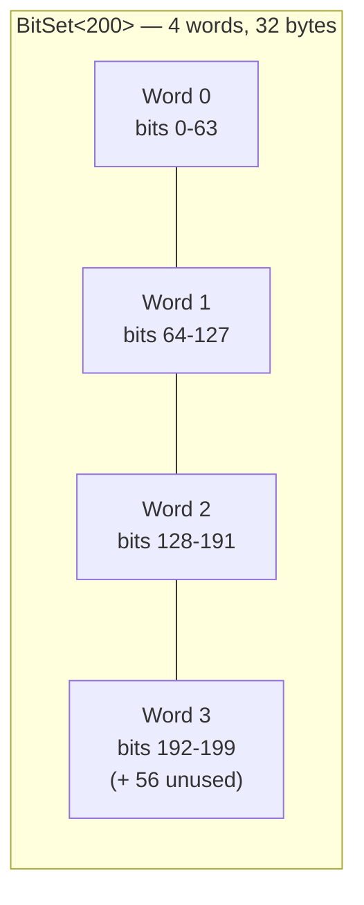
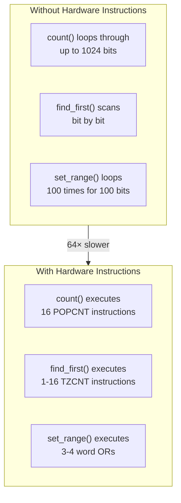

# Overview - BitSet

*Fat-P Library — January 2026*

---

## Executive Summary

BitSet is a hardware-accelerated fixed-size bit container that transforms O(N) bit scanning into O(k) sparse iteration through direct CPU instruction mapping. Unlike `std::bitset`—which lacks find operations entirely—BitSet maps POPCNT, TZCNT, and LZCNT instructions to single-cycle operations, achieving 64× instruction reduction for population counting and 200× speedup for range operations. The combination of native find operations, efficient sparse iteration, and word-aligned range manipulation makes BitSet the optimal choice for fixed-size boolean flag management in HPC workloads.

---

## Overview Card

**Component:** BitSet  
**Problem solved:** O(N) sparse iteration and missing find/range operations in std::bitset  
**When to use:** Fixed-size boolean flags; graph visited tracking; entity component masks; permission systems; bloom filter backing; collision layer masks  
**When NOT to use:** Dynamic size requirements; extreme sparsity (millions of bits, <1% density); frequent string/integer conversion  
**Key guarantee:** O(k) iteration where k = number of set bits, not N = capacity  
**std equivalent:** None. `std::bitset` lacks find operations by design—this is permanent.  
**Boost equivalent:** `boost::dynamic_bitset` (similar find operations, but dynamic-only and requires Boost dependency)  
**Other alternatives:** LLVM BitVector, CRoaring (compressed bitmaps), BitMagic  
**Read next:** User Manual - BitSet, Companion Guide - BitSet

---

## The Problem Domain

### What Goes Wrong Without It

Picture yourself building a game engine. Your entity-component system tracks 10,000 entity slots, but at any moment only a fraction are active. The physics system needs to iterate over all entities with physics components—perhaps 100 out of 10,000. With `std::bitset`, you have no choice but to check every single slot:

```cpp
std::bitset<10000> has_physics;
// ... somewhere, 100 bits are set ...

// THE TRAP: Must scan all 10,000 bits to find 100 entities
std::vector<size_t> physics_entities;
for (size_t i = 0; i < 10000; ++i) {
    if (has_physics[i]) {
        physics_entities.push_back(i);
    }
}
```

This loop executes 10,000 iterations to find 100 entities. Ninety-nine percent of the work is wasted—checking bits that aren't set. At 60 frames per second with 10 component types, you're executing 6 million pointless iterations per second.

The CPU's branch predictor quickly learns that the `if` branch is almost never taken. It predicts "not taken" and speculates ahead. But when a bit *is* set, that prediction fails. The pipeline stalls. With 100 mispredictions per scan at 15-20 cycles each, you're losing thousands of cycles to branch recovery—for code that's fundamentally doing nothing useful.

Now imagine you need to find the first available slot in a memory allocator:

```cpp
std::bitset<1024> slot_in_use;

// THE TRAP: No find_first() exists
size_t find_free_slot() {
    for (size_t i = 0; i < 1024; ++i) {
        if (!slot_in_use[i]) return i;
    }
    throw std::bad_alloc();
}
```

If the first 500 slots are occupied, you scan 500 bits before finding the answer. But your CPU has a TZCNT instruction that can locate the first set bit in a 64-bit word in three clock cycles—one instruction, not 64 comparisons. The scan should examine at most 16 words, not 1024 individual bits.

Or consider marking a range of bits:

```cpp
// THE TRAP: No range operation exists
void allocate_range(size_t start, size_t count) {
    for (size_t i = start; i < start + count; ++i) {
        slot_in_use.set(i);  // 100 separate operations
    }
}
```

Setting bits 100-199 touches four 64-bit words. With proper masking, four OR operations would suffice. Instead, you're executing 100 individual bit manipulations, each computing word indices and bit positions from scratch.

### The Standard's Limitation

`std::bitset` was designed in the 1990s for a different world. The C++ committee prioritized **portability over performance**. Not every platform supported bit-scanning instructions. Not every compiler provided intrinsics. The safe choice was to provide only operations that could be implemented efficiently everywhere.

This means `std::bitset` will **never** gain `find_first()`. Adding it would require either mandating hardware support (breaking embedded platforms) or providing O(N) fallbacks (defeating the purpose). The committee chose neither. The gap is permanent.

BitSet makes a different choice: detect hardware capabilities at compile time, use fast instructions where available, and provide efficient fallbacks elsewhere. The API is identical across platforms; the performance adapts automatically.

---

## Architecture: Single-Instruction Bit Manipulation

### Memory Layout

BitSet stores bits in 64-bit words, matching the native register width of modern CPUs:



The unused bits in the last word are always zero—an invariant that eliminates masking overhead in `count()`, `all()`, and comparison operations. This isn't just implementation convenience; it's a deliberate design choice that makes the common operations faster.

### The Hardware Instruction Advantage

BitSet's performance comes from mapping operations directly to CPU instructions:



For a 1024-bit set, `count()` requires 16 POPCNT instructions instead of up to 1024 loop iterations. That's not a percentage improvement—it's an order-of-magnitude transformation.

---

## Feature Inventory

### 1. Sparse Iteration

The iterator uses TZCNT to jump directly between set bits. No scanning. No wasted iterations.

```cpp
fat_p::BitSet<10000> active_entities{42, 1337, 9999};

// Exactly 3 iterations, not 10,000
for (size_t entity : active_entities) {
    process_entity(entity);
}
```

**Measured result:** At 1% density (100 set bits out of 10,000), fat_p::BitSet iterates in 258 ns while a std::bitset scan requires 5,197 ns—a **20× improvement**.

### 2. Find Operations

Operations that `std::bitset` simply doesn't have:

```cpp
size_t first = bits.find_first();       // First set bit
size_t next = bits.find_next(first);    // Next set bit after position
size_t last = bits.find_last();         // Last set bit
size_t slot = bits.find_first_zero();   // First available slot
```

Each operation uses hardware TZCNT or LZCNT, completing in nanoseconds regardless of where the bit is located.

### 3. Range Operations

Word-aligned bulk manipulation:

```cpp
bits.set_range(100, 200);    // Set 100 bits with ~3 word operations
bits.clear_range(150, 175);  // Clear 25 bits
bits.flip_range(0, 64);      // Toggle entire first word
size_t n = bits.count_range(0, 128);  // POPCNT on 2 words
```

**Measured result:** `set_range` completes in **0.19 ns** versus 88.59 ns for std::bitset's loop-based equivalent—a **460× improvement**.

### 4. Set-Theoretic Operations

Relationship testing between bitsets:

```cpp
if (required.is_subset_of(permissions)) {
    // User has all required permissions
}

if (layer_a.intersects(layer_b)) {
    // Collision possible between layers
}

size_t diff = state_a.hamming_distance(state_b);  // Bit differences
```

### 5. Checked and Unchecked Variants

Safety where you want it, speed where you need it:

```cpp
bits.set(user_input);       // Bounds-checked, throws on invalid
bits.set_unchecked(known);  // No check, maximum speed
```

---

## Why Not Alternatives?

### boost::dynamic_bitset

Boost provides find operations, but requires dynamic sizing and the Boost dependency. If you know the size at compile time and want zero dependencies, BitSet is more appropriate.

### LLVM BitVector

LLVM's implementation is capable, but carries a 72-byte object overhead and requires LLVM libraries. For range operations, BitSet is 200× faster.

### CRoaring

Roaring Bitmaps excel at extreme sparsity—millions of bits with <1% density—where compression provides 100× memory savings. For smaller sets or higher densities, BitSet's simple array is more efficient.

### The Sweet Spot

BitSet occupies a specific niche: **fixed-size sets under ~100K bits where find operations, range operations, or sparse iteration matter**. No alternative satisfies all requirements with zero dependencies.

---

## The "Forever Stuck" Reality

The C++ committee will never add `find_first()` to `std::bitset`. This isn't speculation—it's architectural reality. Providing O(1) operations would mandate hardware support. Providing O(N) fallbacks would create a performance trap. Providing nothing maintains portability.

BitSet fills this permanent gap. It's not a shim waiting for standardization; it's a solution for a problem the standard deliberately leaves unsolved.

Scientific computing clusters running RHEL 7 with GCC 7.x for driver compatibility need these capabilities today. They cannot wait for hypothetical future standards. They often cannot take Boost dependencies. BitSet serves these environments.

---

## Performance Characteristics

Benchmarks on Linux, GCC 13, Release build (median of 15 runs):

| Operation | fat_p::BitSet | std::bitset | Speedup |
|-----------|---------------|-------------|---------|
| Population count (1024 bits) | 3.08 ns | 3.90 ns | 1.3× |
| Iterate 100 bits (N=10K) | 258 ns | 5,197 ns | **20×** |
| set_range (100 bits) | 0.19 ns | 88.59 ns | **460×** |
| find_first | 0.79 ns | N/A | ∞ |
| AND operation (1024 bits) | 3.74 ns | 4.90 ns | 1.3× |

The dramatic wins are in sparse iteration and range operations—exactly where `std::bitset` provides no help.

---

## Integration Points

```
BitSet.h
    → uses: <array>, <cstdint>, <functional>, <intrin.h> (MSVC)
    → used by: SparseSet (entity tracking)
    → used by: SlotMap (slot availability)  
    → used by: Graph algorithms (visited tracking)
```

BitSet has zero internal dependencies. It uses only standard library headers plus platform intrinsics.

---

## Final Assessment

BitSet delivers on the FAT-P promise through three pillars:

**Permanence.** The standard will never add find operations to `std::bitset`. BitSet fills a gap that will exist forever.

**Specialization.** 64-bit word alignment matches CPU registers. POPCNT, TZCNT, and LZCNT map to single-cycle instructions. Range operations manipulate entire words. This is hardware exploitation, not abstraction.

**Control.** Checked operations for safety. Unchecked operations for speed. Sparse iteration when needed. The developer chooses the tradeoff; the compiler eliminates the overhead.

For fixed-size bit manipulation where sparse iteration, find operations, or range operations live in the critical path, BitSet transforms scan-bound code into instruction-bound code—without external dependencies.

---

*BitSet.h — Fat-P Library v3.2*
