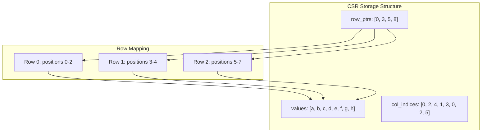
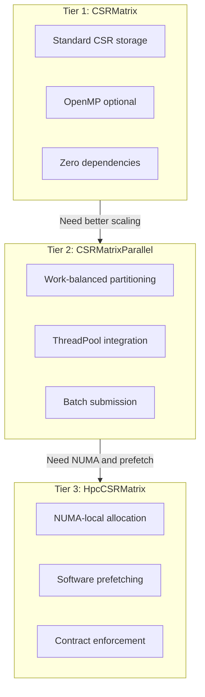
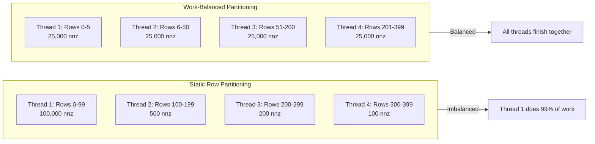
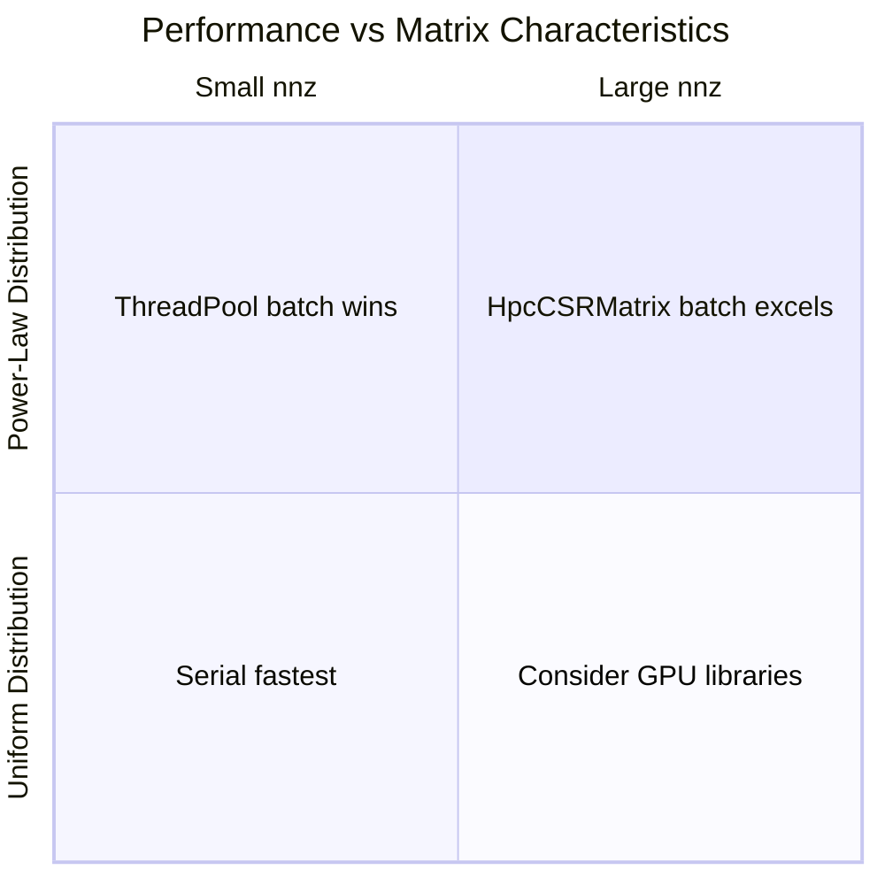
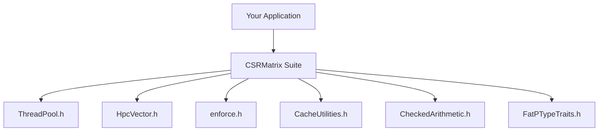

# CSRMatrix Suite: A Fat-P Library Showcase

## Executive Summary

The CSRMatrix suite delivers **production-hardened sparse matrix storage** using Compressed Sparse Row (CSR) format, optimized for sparse matrix-vector multiplication (SpMV)—the dominant kernel in iterative solvers, graph analytics, and machine learning. Unlike naive sparse representations that scatter data across memory, CSR achieves **cache-optimal row traversal** through contiguous value storage. The suite provides three variants—`CSRMatrix` for standard use, `CSRMatrixParallel` for ThreadPool-based parallelism, and `HpcCSRMatrix` with NUMA-aware allocation and software prefetching—delivering 2–5x speedups on multi-socket systems with irregular sparsity patterns.

---

## The Problem Domain

### What Goes Wrong Without It

```cpp
// Naive approach: dense matrix for sparse data
std::vector<std::vector<double>> matrix(1000000, std::vector<double>(1000000));
// Result: 8 TB of memory for a 0.001% dense matrix

// COO format: simple but slow
struct COO { std::vector<int> rows, cols; std::vector<double> vals; };
// Result: Random memory access destroys cache performance
```

Sparse matrices appear everywhere in scientific computing: finite element meshes, graph adjacency structures, recommendation systems, and neural network weight matrices. The fundamental challenge is **memory efficiency vs. computational efficiency**—and most formats sacrifice one for the other.

| Problem | HPC Impact |
|---------|------------|
| Dense storage | Impossible for billion-node graphs (memory exhaustion) |
| COO format | Random access pattern defeats CPU prefetchers |
| Row-only parallelism | Load imbalance with power-law distributions |
| NUMA-unaware allocation | Cross-socket memory traffic kills scaling |
| Unchecked index types | Silent overflow corruption on large matrices |

### The Standard's Limitation

C++ provides no sparse matrix facility. The standard library's `std::vector` and `std::array` assume dense storage. Third-party alternatives like Eigen require significant dependencies, and Intel MKL imposes licensing constraints. For HPC workloads requiring fine-grained control over memory placement, parallelism strategy, and numeric safety, a purpose-built solution is essential.

---

## Architecture: The CSR Memory Layout

The CSR format stores three arrays that work together to represent sparse data efficiently:



**The Mechanism:** CSR stores non-zero values contiguously by row. `row_ptrs[i]` indexes into `values[]` and `col_indices[]` for the start of row `i`. This transforms random-access SpMV into sequential memory streaming:

```cpp
// SpMV inner loop: sequential reads for values and col_indices
for (ptr_type j = row_ptrs[i]; j < row_ptrs[i + 1]; ++j)
{
    sum += values[j] * x[col_indices[j]];  // Only x[] is random access
}
```

**Complexity Guarantees:**

| Operation | Complexity | Mechanism |
|-----------|------------|-----------|
| SpMV (y = A·x) | O(nnz) | Single pass over non-zeros |
| Element access | O(row_nnz) | Linear scan within row |
| Transpose | O(nnz) | Two-pass counting sort |
| MatMul (SpGEMM) | O(nnz × avg_row_nnz) | Hash-based accumulator |
| Construction from COO | O(nnz log nnz) | Sort + merge duplicates |

---

## The Three-Tier Architecture



### Tier 1: CSRMatrix (Standard)

The foundation. Header-only, zero external dependencies, OpenMP-optional parallelism.

```cpp
#include "CSRMatrix.h"
using namespace fat_p;

// Construct from COO format
std::vector<int> rows = {0, 0, 1, 2};
std::vector<int> cols = {0, 1, 1, 2};
std::vector<double> vals = {1.0, 2.0, 3.0, 4.0};

CSRMatrix<double> A(3, 3, rows, cols, vals);

// SpMV: y = A * x
std::vector<double> x = {1.0, 1.0, 1.0};
std::vector<double> y = A * x;
```

### Tier 2: CSRMatrixParallel (ThreadPool)

Work-balanced parallelism without OpenMP dependency.

```cpp
#include "CSRMatrixParallel.h"
using namespace fat_p;

CSRMatrix<double> A = /* ... */;
ThreadPool pool(8);

// Work-balanced SpMV
std::vector<double> y = matvec_parallel(A, x, pool);
```

### Tier 3: HpcCSRMatrix (NUMA + Prefetch)

Maximum performance for multi-socket systems.

```cpp
#include "CSRMatrix_HPC.h"
using namespace fat_p;

HpcCSRMatrix<double> A(rows, cols, row_idx, col_idx, vals);

// SpMV with automatic prefetching
A.matvec(x.data(), y.data());
```

---

## Work-Balanced Partitioning

Traditional parallelism divides rows equally—catastrophic for power-law distributions:



CSRMatrixParallel partitions by **nnz count**, not row count, ensuring each thread receives approximately equal work.

---

## Why Not Alternatives?

| If You Need... | Why Not Eigen | Why Not MKL | Fat-P Advantage |
|----------------|---------------|-------------|-----------------|
| Header-only | Heavy template library | Binary distribution | Single header inclusion |
| Zero dependencies | Requires Eigen core | Intel runtime | Standard library only |
| NUMA control | No NUMA API | Limited control | Full policy-based NUMA |
| Duplicate policy | Sum-only | Sum-only | Sum/Keep/Error |
| ThreadPool integration | OpenMP or none | TBB dependency | Native ThreadPool |
| Compile-time config | Runtime format selection | Runtime dispatch | Template parameters |

---

## Performance Characteristics

**Benchmark Environment:** Intel Core i7-8850H @ 2.60 GHz, 32 GB RAM, MSVC 2022 Release (/O2)

### SpMV Performance (10K × 10K, ~1M non-zeros)

| Variant | Uniform 1% | Power-Law α=1.5 | Power-Law α=2.5 |
|---------|------------|-----------------|-----------------|
| CSRMatrix (serial) | 352 µs | 87 µs | 26 µs |
| CSRMatrix (OpenMP) | 630 µs (0.56x) | 154 µs (0.57x) | 83 µs (0.31x) |
| ThreadPool (per-task) | 506 µs (0.70x) | 154 µs (0.57x) | 83 µs (0.32x) |
| ThreadPool (batch) | **143 µs (2.45x)** | **49 µs (1.79x)** | 27 µs (0.99x) |
| HpcCSRMatrix (batch) | **127 µs (2.77x)** | **50 µs (1.74x)** | 38 µs (0.68x) |

### Where Fat-P Wins and Loses



**Where Fat-P loses:**
- **Dense matrices**: If density > 30%, dense BLAS wins
- **GPU workloads**: cuSPARSE dominates for nnz > 10M
- **Very small matrices**: Parallel overhead exceeds computation

---

## Integration Points



---

## Final Assessment

The CSRMatrix suite delivers on the fat_p promise:

1. **Permanence:** CSR format is industry-standard for SpMV; this implementation will remain relevant regardless of C++ standard evolution.

2. **Specialization:** Three-tier architecture lets users select exactly the performance/complexity trade-off they need.

3. **Control:** Policy-based design for duplicates, parallelism, NUMA allocation, and prefetching—all resolved at compile time with zero runtime dispatch overhead.

**The CSRMatrix suite transforms memory-bound sparse computations into compute-bound operations through cache-optimal storage, work-balanced parallelism, and NUMA-aware memory placement.**

---

*CSRMatrix.h, CSRMatrix_HPC.h, CSRMatrixParallel.h — Fat-P Library*
