# **When Equal Isn't Equal**

### *A Companion Guide to FAT-P's Equality Comparison Framework*

---

**Scope:** This guide covers FAT-P's equality comparison framework: `EqualityComparisons.h` for recursive tolerance-based comparison through containers and composites, `EqualityAny.h` for type-erased comparison via registry, and `EqualityTensor.h` as a worked example of custom type integration. Ordering comparisons (`<`, `>`), hashing, and serialization are not covered.

---

# **Table of Contents**

**[Introduction: Why This Component Exists](#introduction-why-this-component-exists)**

## Part I -- The Problems

1. [The 0.1 + 0.2 Problem](#chapter-1--the-01--02-problem)
2. [The Composition Problem](#chapter-2--the-composition-problem)
3. [The NaN Problem](#chapter-3--the-nan-problem)
4. [The Type Erasure Problem](#chapter-4--the-type-erasure-problem)
5. [The Unordered Container Problem](#chapter-5--the-unordered-container-problem)

## Part II -- The Solutions

6. [Architecture Overview](#chapter-6--architecture-overview)
7. [The Policy System](#chapter-7--the-policy-system)
8. [Recursive Type Dispatch](#chapter-8--recursive-type-dispatch)
9. [Container Comparison Strategies](#chapter-9--container-comparison-strategies)
10. [The Any Registry](#chapter-10--the-any-registry)
11. [Diagnostics and Error Reporting](#chapter-11--diagnostics-and-error-reporting)

## Part III -- Putting It Together

12. [Case Study: Serialization Round-Trip Testing](#chapter-12--case-study-serialization-round-trip-testing)
13. [Case Study: Scientific Simulation Validation](#chapter-13--case-study-scientific-simulation-validation)
14. [Case Study: EqualityTensor - Building a Custom Integration](#chapter-14--case-study-equalitytensor---building-a-custom-integration)
15. [Choosing Your Comparison Strategy](#chapter-15--choosing-your-comparison-strategy)
16. [Migration from Manual Comparison Code](#chapter-16--migration-from-manual-comparison-code)

## Part IV -- Foundations

- [Appendix A -- IEEE 754 and Why Floating-Point Is Hard](#appendix-a--ieee-754-and-why-floating-point-is-hard)
- [Appendix B -- Design Decisions and Rejected Alternatives](#appendix-b--design-decisions-and-rejected-alternatives)
- [Appendix C -- Where EqualityComparisons Loses](#appendix-c--where-equalitycomparisons-loses)
- [Appendix D -- Performance Characteristics](#appendix-d--performance-characteristics)

---

# **Introduction: Why This Component Exists**

You're running a physics simulation. Your test computes a result, compares it to an expected value, passes. You commit. CI fails. Same code, same inputs, different answer. You dig into the logs: the difference is in the 52nd bit of a double--one part in 10^15. Your algorithm is correct. Your test is broken.

Or this: you're comparing two configuration objects after a JSON round-trip. They're nested maps containing vectors of structs with floating-point fields. You write a comparison function. It's 47 lines of nested loops and special cases. Three months later, someone adds a field. The comparison function doesn't get updated. Tests pass. Production breaks.

Or this: you're debugging a state machine. Two states should be identical. You diff them: "not equal." Which field? Which element? Which nested container? You add printf statements. You binary-search through the data structure. You narrow it to element 847 of a vector nested inside a map inside a tuple. Two hours gone.

Or this: you're testing a plugin system. Configurations arrive as `std::any`. You need to compare them. `std::any` has no `operator==`. You try `any_cast`--but you don't know the type at compile time. That's the whole point of `std::any`.

These aren't edge cases. They're the predictable consequences of floating-point arithmetic, nested data structures, and type erasure--the building blocks of modern C++.

EqualityComparisons exists for engineers who've hit these walls. The library addresses each pain point directly:

- **Tolerance-based comparison** that handles NaN, infinity, and signed zero correctly
- **Recursive propagation** through any depth of containers, pairs, and tuples
- **Policy-based tolerance** selection (absolute, relative, hybrid, ULP)
- **Structural diagnostics** that pinpoint exactly where values differ
- **Type registry** for comparing `std::any` without compile-time type knowledge
- **~2,000 lines** of auditable, header-only code

This guide explains the problems EqualityComparisons solves and how it solves them.

---

# **PART I -- THE PROBLEMS**

Comparing floating-point values seems simple: check if they're close enough. But "close enough" hides a minefield. IEEE 754 reserves bit patterns for special values that break intuitive equality. Tolerance semantics differ by domain--what works for graphics fails for finance. And propagating comparison through nested data structures multiplies these challenges at every level.

How you handle these determines whether your tests are robust or flaky.

---

# **CHAPTER 1 -- The 0.1 + 0.2 Problem**

Every programmer eventually discovers that `0.1 + 0.2 != 0.3` in floating-point. The obvious response is to add a tolerance: "close enough is equal." But understanding *why* this happens--and choosing the right tolerance--requires understanding how computers represent decimal fractions.

**The obvious approach:**

```cpp
// THE TRAP: Exact floating-point comparison
double result = 0.1 + 0.2;
if (result == 0.3) {
    process_equal();
}
```

This fails. Not sometimes. Always. Let's trace exactly what happens.

**The hidden constraint:** Computers store numbers in binary. The decimal fraction 0.1 has a simple representation in base 10, but in binary it requires an infinite repeating sequence:

```
0.1 (decimal) = 0.0001100110011001100110011... (binary, repeating forever)
```

Just as 1/3 = 0.333... in decimal, 1/10 = 0.000110011... in binary. IEEE 754 doubles have 52 bits of mantissa--they must round this infinite sequence to a finite approximation.

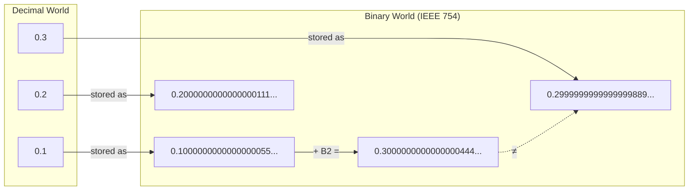

The stored value of 0.1 is slightly *more* than 0.1. The stored value of 0.2 is slightly *more* than 0.2. Their sum is slightly *more* than 0.3. But the stored value of 0.3 is slightly *less* than 0.3 (it rounds the other direction). The sum and the literal differ by about 5.5 × 10^-17--one ULP (unit in last place) at this magnitude.

The comparison fails because two mathematically equal values have different binary representations.

**The symptoms:**

| Symptom | Cause |
|---------|-------|
| Tests pass locally, fail in CI | Different compiler optimization levels reorder operations, changing rounding |
| Intermittent test failures | Results hover near tolerance boundary |
| Platform-dependent results | Different FPU rounding modes or instruction sequences |
| "Impossible" assertion failures | Accumulated error exceeds exact-comparison threshold |

**The cost:** Flaky tests erode confidence. Engineers start ignoring failures, assuming they're "just floating-point noise." Real bugs slip through. Eventually someone adds `ASSERT_NEAR` everywhere--but with what tolerance? Too tight and tests are flaky. Too loose and tests miss real bugs.

**What FAT-P provides:** `areEqual(a, b, epsilon)` with configurable tolerance:

```cpp
// THE FIX: Tolerance-based comparison
double result = 0.1 + 0.2;
if (areEqual(result, 0.3, 1e-9)) {  // Tolerance of 1 part per billion
    process_equal();
}
```

But choosing epsilon requires understanding your domain. Chapter 7 explains when to use absolute vs. relative vs. ULP-based tolerance.

*The representation gap is fundamental to IEEE 754 binary floating-point--a deliberate engineering tradeoff for speed over precision. Appendix A explains why the standard made this choice and how ULP counting provides a hardware-aware tolerance metric.*

---

# **CHAPTER 2 -- The Composition Problem**

Comparing two floating-point values is manageable. Comparing two objects that *contain* floating-point values--nested inside containers, inside structs, inside tuples--multiplies the complexity. Most codebases evolve a patchwork of comparison functions, each handling one type, none handling all cases, all drifting out of sync with the types they compare.

**The obvious approach:**

```cpp
// THE TRAP: Manual comparison function
bool compareConfig(const Config& a, const Config& b, double eps) {
    if (a.name != b.name) return false;
    if (a.values.size() != b.values.size()) return false;
    for (size_t i = 0; i < a.values.size(); ++i) {
        if (std::fabs(a.values[i] - b.values[i]) > eps) return false;
    }
    if (a.nested.size() != b.nested.size()) return false;
    for (const auto& [key, vec] : a.nested) {
        auto it = b.nested.find(key);
        if (it == b.nested.end()) return false;
        if (vec.size() != it->second.size()) return false;
        for (size_t i = 0; i < vec.size(); ++i) {
            if (std::fabs(vec[i] - it->second[i]) > eps) return false;
        }
    }
    return true;
}
```

This works. It handles nested maps of vectors. It propagates epsilon. What could go wrong?

**The hidden constraint:** Comparison functions must track every structural change to the types they compare. The compiler cannot enforce this.

```cpp
struct Config {
    std::string name;
    std::vector<double> values;
    std::map<std::string, std::vector<double>> nested;
    double threshold;  // Added six months later
};
```

Someone adds `threshold`. The `Config` struct compiles fine. All uses of `Config` compile fine. `compareConfig` compiles fine--it just silently ignores the new field. Tests pass because they compare identical objects. Production breaks because different objects with matching "compared" fields pass validation.

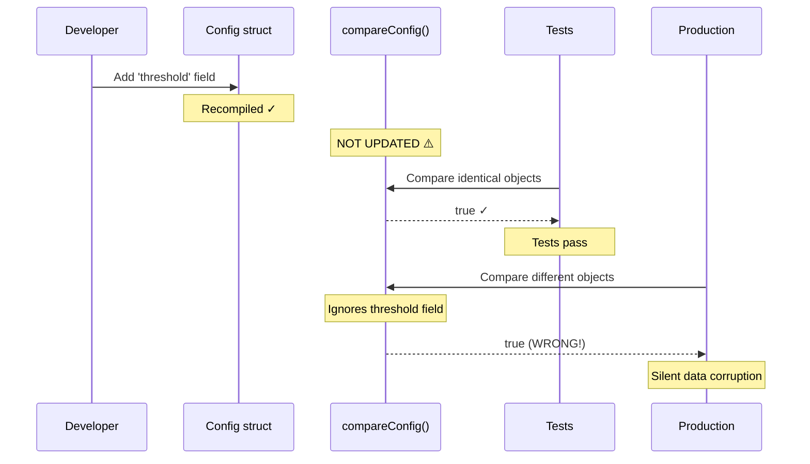

**The symptoms:**

| Symptom | Cause |
|---------|-------|
| Tests pass, production fails | Comparison function doesn't check new fields |
| Code review misses | Reviewer doesn't know all comparison functions that need updating |
| Boilerplate explosion | Each nested type needs its own comparison function |
| Inconsistent handling | Different functions handle edge cases (NaN, empty containers) differently |

**The cost:** For a moderately complex system with 20 nested types, you maintain 20+ comparison functions. Each structure change requires finding and updating all affected comparators. Miss one, and bugs escape to production. The comparison code becomes a liability--it exists to catch bugs, but it's itself a source of bugs.

**What FAT-P provides:** A single entry point that recurses automatically through any structure:

```cpp
// THE FIX: Recursive comparison with automatic structure traversal
Config a = loadConfig("a.json");
Config b = loadConfig("b.json");
bool match = areEqual(a, b, 1e-9);  // Compares ALL fields, ALL nesting levels
```

When `Config` gains a new field, `areEqual` automatically compares it--assuming the new field is either a type with `operator==`, a floating-point type (compared with tolerance), or a container of such types. No code change required.

*The recursive dispatch mechanism uses `if constexpr` to resolve types at compile time. Chapter 8 details this dispatch chain. Appendix B explains why template metaprogramming rather than virtual dispatch.*

---

# **CHAPTER 3 -- The NaN Problem**

IEEE 754 reserves a special bit pattern for "Not a Number"--the result of undefined operations like 0/0 or sqrt(-1). NaN has a surprising property: it is not equal to itself. This deliberate design choice breaks intuitive equality semantics and causes subtle bugs in comparison code that doesn't handle it explicitly.

**The obvious approach:**

```cpp
// THE TRAP: Assuming NaN behaves like other values
double compute_ratio(double a, double b) {
    return a / b;  // Returns NaN when b == 0
}

double r1 = compute_ratio(0.0, 0.0);  // NaN
double r2 = compute_ratio(0.0, 0.0);  // NaN
assert(r1 == r2);  // FAILS! NaN != NaN by IEEE 754
```

This fails. Both variables contain the exact same bit pattern. But IEEE 754 mandates that `NaN != NaN`. This isn't a bug--it's deliberate.

**The hidden constraint:** NaN means "not a number"--the result of an undefined operation. The standard's designers reasoned: two undefined results aren't meaningfully equal. 0/0 and sqrt(-1) both produce NaN, but they represent different errors. Comparing them as "equal" would hide the distinction.

The standard's choice enables a useful idiom:

```cpp
if (x != x) {
    // x is NaN -- the ONLY value for which this is true
}
```

But this breaks comparison code that doesn't handle NaN explicitly:

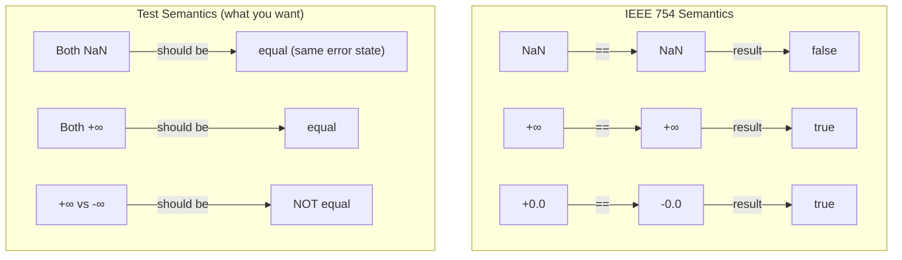

**The symptoms:**

| Symptom | Cause |
|---------|-------|
| Tests fail on edge cases | NaN comparisons always return false |
| Mysterious assertion failures | Values are "both NaN" but `==` returns false |
| Inconsistent special-value handling | Hand-written comparisons miss some cases |
| Edge cases go untested | Engineers give up and skip NaN/Inf test cases |

**The cost:** Edge cases are where bugs hide. Division by zero, overflow, underflow--these produce special values that propagate through computation. If your test framework can't verify that "both computations produced NaN," you either skip testing edge cases or write special-case code for each test.

**What FAT-P provides:** `EqualityComparisons` does not invent new floating-point rules. For floating-point leaf values, it delegates to the selected `FloatingPointComparison` policy, and propagates that result through recursive container/tuple/struct comparisons.

That means `EqualityComparisons` follows the IEEE 754 rule used by `FloatingPointComparison`: **NaN is not equal to anything, including itself.** This is deliberate. Treating NaNs as equal can hide faults (uninitialized values, invalid computations) that should be surfaced during testing.

```cpp
// THE FIX: NaN-aware comparison that surfaces invalid states
double r1 = 0.0 / 0.0;  // NaN
double r2 = 0.0 / 0.0;  // NaN
bool match = areEqual(r1, r2);  // false: NaN != NaN (IEEE 754 semantics)

double inf1 = 1.0 / 0.0;   // +∞
double inf2 = -1.0 / 0.0;  // -∞
bool sameInf = areEqual(inf1, inf2);  // false: opposite signs are different states

double inf3 = 1.0 / 0.0;   // +∞
double inf4 = 1.0 / 0.0;   // +∞
bool sameSignInf = areEqual(inf3, inf4);  // true: same-sign infinities are equal
```

`EqualityComparisons` inherits special-value semantics from `FloatingPointComparison` policies: NaN comparisons always fail, same-sign infinities are equal, opposite-sign infinities are not equal, and +0.0 equals -0.0 (within any positive tolerance). These semantics are consistent across all policies.

**If you need `NaN == NaN`, do it explicitly:**

Some domains want "NaN-safe equality" (comparing masked arrays, missing-data representations). If that is your contract, you must opt in explicitly:

1. **Pre-normalize inputs:** Replace domain "missing" NaNs with a sentinel representation before comparison (convert "missing" to a tagged state or separate boolean mask).
2. **Provide a NaN-equal policy:** Define a floating-point policy that treats both-NaN as equal, and use that policy when calling `areEqual`.

A NaN-equal policy can be correct for "missing-data equality," but it is not a drop-in replacement for IEEE-style numeric equality. Use it only when your problem domain requires it.

*The IEEE 754 committee's rationale for NaN behavior reflects deep questions about identity and equality in mathematics. Appendix A explores these foundations.*

---

# **CHAPTER 4 -- The Type Erasure Problem**

`std::any` exists to hold values of unknown type--the runtime equivalent of a void pointer, but type-safe. Plugin systems, configuration loaders, and dynamic dispatch mechanisms use it to defer type resolution until runtime. But `std::any` has no `operator==`. Comparing two `std::any` values requires knowing their types, which defeats the purpose of type erasure.

**The obvious approach:**

```cpp
// THE TRAP: Type switching on std::any
bool compareAny(const std::any& a, const std::any& b, double eps) {
    if (a.type() != b.type()) return false;
    
    // Must enumerate every possible type
    if (a.type() == typeid(double)) {
        return std::fabs(std::any_cast<double>(a) - std::any_cast<double>(b)) <= eps;
    }
    if (a.type() == typeid(float)) {
        return std::fabs(std::any_cast<float>(a) - std::any_cast<float>(b)) <= eps;
    }
    if (a.type() == typeid(std::vector<double>)) {
        const auto& va = std::any_cast<const std::vector<double>&>(a);
        const auto& vb = std::any_cast<const std::vector<double>&>(b);
        // ... 20 lines of comparison code
    }
    // ... repeat for every type the system might use
    
    return false;  // Unknown type: can't compare
}
```

This works for the types you enumerate. But it defeats the purpose of using `std::any`.

**The hidden constraint:** `std::any` exists precisely because you *don't* know the type at compile time. Adding a new plugin type should be an extension point, not a modification to a central switch statement.

The type-switching approach has two fatal flaws:
1. You must enumerate every possible type ahead of time
2. Adding a new type requires modifying the comparison function (and recompiling everything that uses it)

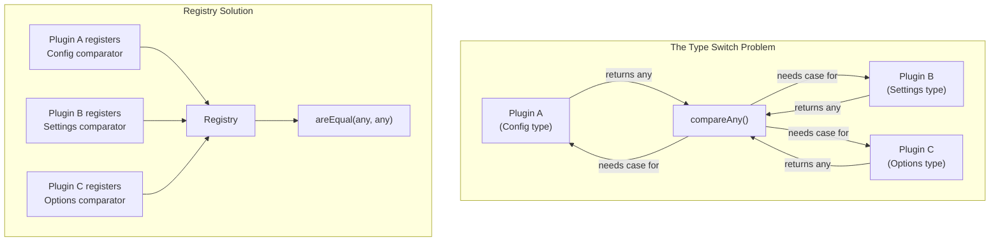

**The symptoms:**

| Symptom | Cause |
|---------|-------|
| Comparison returns false for valid types | Type not in the switch statement |
| Maintenance burden | Every new type requires central code changes |
| Type explosion | Nested types (vector<any>, map<string, any>) multiply cases |
| Circular dependency | Comparison code must know about types defined elsewhere |

**The cost:** The comparison function becomes a registry of types, defeating the flexibility that motivated using `std::any` in the first place. You might as well have used a variant with a fixed type list.

**What FAT-P provides:** A runtime type registry that recovers comparison ability without central enumeration:

```cpp
// THE FIX: Registry-based type-erased comparison
#include "EqualityAny.h"

// In Plugin A's initialization:
registerAnyType<PluginAConfig>();

// In Plugin B's initialization:
registerAnyType<PluginBSettings>();

// At comparison time: registry handles dispatch
std::any config1 = loadPluginConfig("plugin_a");
std::any config2 = loadPluginConfig("plugin_b");
bool match = areEqual(config1, config2, 1e-9);  // Works without knowing concrete type
```

Registration happens once at startup, distributed across plugin initialization code. Comparison happens at runtime via registry lookup. No central switch statement. No modification when types are added.

*The registry uses `(type_index, policy_index)` pairs as keys, enabling policy-specific comparison for the same type. Chapter 10 details the dual-registry architecture. Appendix B explains why function-local statics provide thread-safe initialization without explicit locking.*

---

# **CHAPTER 5 -- The Unordered Container Problem**

Ordered containers (vector, map, set) have deterministic iteration order. Compare element-by-element, and you get correct results. Unordered containers (unordered_map, unordered_set) have no guaranteed iteration order. Two sets containing the same elements may iterate in different sequences depending on insertion order, hash collisions, and implementation details. Element-by-element comparison fails on equal containers.

**The obvious approach:**

```cpp
// THE TRAP: Iterator-based comparison for unordered containers
template <typename T>
bool compareUnordered(const std::unordered_set<T>& a, 
                      const std::unordered_set<T>& b) {
    if (a.size() != b.size()) return false;
    auto it_a = a.begin();
    auto it_b = b.begin();
    while (it_a != a.end()) {
        if (*it_a != *it_b) return false;  // WRONG!
        ++it_a; ++it_b;
    }
    return true;
}
```

This fails. `{1, 2, 3}` and `{1, 2, 3}` are equal sets, but depending on hash collisions and insertion order, iterating them may yield different sequences.

**The hidden constraint:** "Unordered" means exactly that. The standard guarantees only that elements exist, not where they appear during iteration. Two equal sets with identical elements may iterate differently.

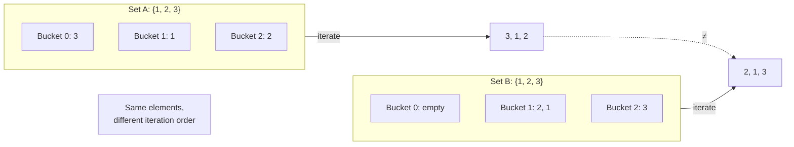

For unordered *multi*-containers, it's worse. Multiplicity matters, but you can't just count occurrences--you need to verify that for each element in `a`, there's a corresponding element in `b` that hasn't already been matched to something else.

And for containers with custom hash functions or equality predicates, there's a subtle trap:

```cpp
// THE TRAP: Stateful functors ignored by comparison
struct CaseInsensitiveHash { 
    size_t seed;  // Stateful!
    size_t operator()(const std::string& s) const { 
        size_t h = seed;
        for (char c : s) h = h * 31 + std::tolower(c);
        return h;
    }
};

std::unordered_set<std::string, CaseInsensitiveHash> a(0, CaseInsensitiveHash{42});
std::unordered_set<std::string, CaseInsensitiveHash> b(0, CaseInsensitiveHash{99});
// a and b use DIFFERENT hash functions!
```

If your comparison builds a "visited" set using default-constructed hash/equality, it may use a different equivalence relation than the containers themselves.

**The symptoms:**

| Symptom | Cause |
|---------|-------|
| Equal sets compare as unequal | Iteration order differs |
| Results depend on insertion order | Hash collisions change iteration sequence |
| Stateful functors cause subtle bugs | Comparison uses wrong equivalence relation |
| Multiset comparison is flaky | Element matching doesn't track multiplicity correctly |

**The cost:** Correct comparison code for unordered containers is surprisingly tricky. Most hand-written implementations have subtle bugs in edge cases (empty containers, duplicate elements, custom functors). These bugs surface intermittently, making them hard to diagnose.

**What FAT-P provides:** Algorithm-appropriate comparison for each container category:

```cpp
// THE FIX: Semantic comparison for unordered containers
std::unordered_set<std::string> a = {"hello", "world"};
std::unordered_set<std::string> b = {"world", "hello"};
bool match = areEqual(a, b);  // true: same elements regardless of order

std::unordered_multiset<int> c = {1, 1, 2, 3};
std::unordered_multiset<int> d = {1, 2, 3, 1};
bool multiMatch = areEqual(c, d);  // true: same elements with same multiplicities
```

For containers with custom functors, EqualityComparisons extracts the container's own hash and equality functions via `a.hash_function()` and `a.key_eq()`, ensuring the comparison uses the same equivalence relation as the container itself.

*The consume-matching algorithm for multi-containers and the functor extraction pattern are detailed in Chapter 9. Appendix B explains why key comparison is always exact (no tolerance) even when values use epsilon.*

---

# **PART II -- THE SOLUTIONS**

Part I described five problems: floating-point representation gaps, composition boilerplate, NaN semantics, type erasure, and unordered container comparison. Each has a root cause that the obvious approach ignores. EqualityComparisons addresses each through a deliberate architectural choice.

This part explains the mechanisms--not just what the library does, but how it achieves its guarantees.

---

# **CHAPTER 6 -- Architecture Overview**

EqualityComparisons has a two-layer architecture: a compile-time typed layer that resolves comparison strategy through template metaprogramming, and a runtime type-erased layer that recovers comparison ability for `std::any` through a registry lookup.

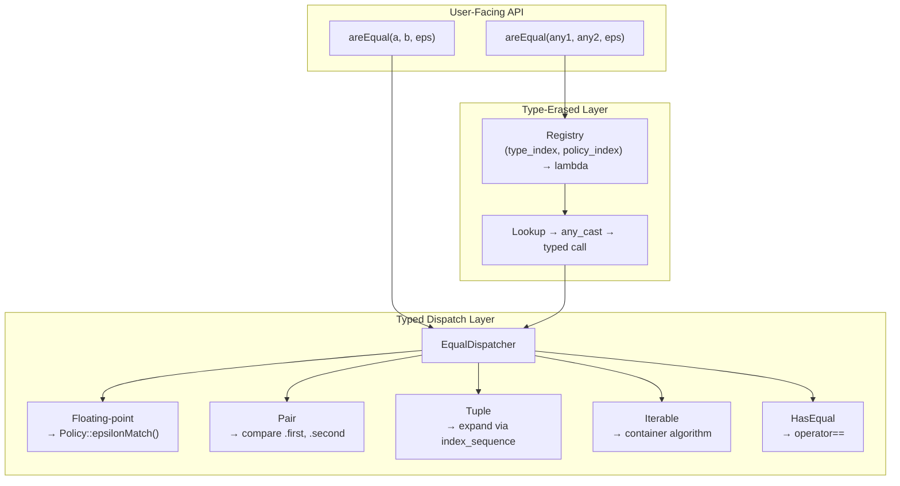

**The typed layer** handles known types at compile time. When you call `areEqual(vec1, vec2, 1e-9)` where both are `std::vector<double>`, the compiler resolves the type at compile time, selects the appropriate comparison strategy (sequential container with floating-point elements), and inlines the entire operation. No virtual calls, no type_info lookups.

**The type-erased layer** handles `std::any` at runtime. When you call `areEqual(any1, any2, 1e-9)`, the library looks up the stored type in a registry, retrieves a comparison lambda, performs `any_cast`, and forwards to the typed layer.

**Component dependencies:**

| Component | Layer | Role |
|-----------|-------|------|
| `FloatingPointComparison.h` | CoreUtility | Policy implementations (Standard, Relative, Hybrid, ULP) |
| `EqualityComparisons.h` | Application | Recursive typed dispatch via `if constexpr` chain |
| `EqualityAny.h` | Application | Type-erased registry and `std::any` overloads |
| `DiagnosticLogger_Core.h` | CoreUtility | Mismatch logging with structural context |
| `Stringify.h` | CoreUtility | Value formatting for diagnostics |
| `Factory.h` | Application | Registry infrastructure (LegacyVariadicFactory) |

**The API surface:**

```cpp
// Typed comparison (compile-time dispatch)
template <typename T, typename Policy = StandardComparisonPolicy, typename... EpsParams>
bool areEqual(const T& a, const T& b, EpsParams... eps);

// Type-erased comparison (runtime dispatch)
template <typename Policy = StandardComparisonPolicy>
bool areEqual(const std::any& a, const std::any& b);

bool areEqual(const std::any& a, const std::any& b, double eps);
bool areEqual(const std::any& a, const std::any& b, double relEps, double absEps);
```

**What this architecture guarantees:**

| Guarantee | Provided | Mechanism |
|-----------|----------|-----------|
| Zero virtual dispatch (typed) | Yes | `if constexpr` chain compiles to direct calls |
| Policy propagation | Yes | Policy template parameter flows through all recursion levels |
| Thread-safe registry | Yes | Function-local statics (C++11 magic statics) |
| No external dependencies | Yes | Standard library + FAT-P core only |
| Exception-free comparison | Mostly | Only `std::bad_any_cast` can throw, and only on programmer error |

---

# **CHAPTER 7 -- The Policy System**

Chapter 1 described the 0.1 + 0.2 problem. The solution is tolerance-based comparison--but *which* tolerance? A graphics application compares pixels; 1e-5 difference is invisible. A scientific simulation compares physical quantities; 1e-12 is acceptable. An algorithm verification compares against a reference implementation; 4 ULPs captures expected rounding error.

EqualityComparisons provides four policies, each encoding a different tolerance strategy:

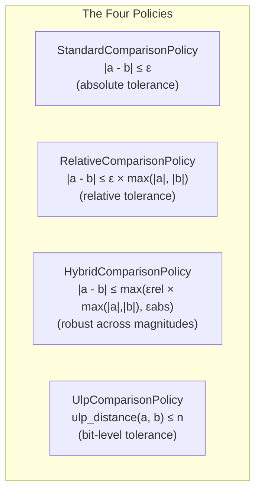

**When to use each:**

| Policy | Best For | Fails When |
|--------|----------|------------|
| Standard | Values in known range (e.g., [0, 1]) | Values span many magnitudes |
| Relative | Multi-scale data (1e-6 to 1e6) | Values near zero (division instability) |
| Hybrid | General-purpose, handles near-zero | Bit-exact verification needed |
| ULP | Algorithm correctness verification | Different CPUs have different rounding |

**StandardComparisonPolicy:** Fixed absolute tolerance.

```cpp
// Values in known range [0, 1]
std::vector<double> probabilities = compute_probabilities();
std::vector<double> expected = load_reference();
bool match = areEqual(probabilities, expected, 1e-9);
```

Good when you know the magnitude of your values. Fails when values span orders of magnitude--1e-9 tolerance is too tight for values near 1e6, too loose for values near 1e-12.

**RelativeComparisonPolicy:** Tolerance scales with magnitude.

```cpp
// Multi-scale data
std::vector<double> measurements = read_sensors();  // 1e-6 to 1e6
std::vector<double> expected = load_calibration();
bool match = areEqual<RelativeComparisonPolicy>(measurements, expected, 1e-6);
// 1e6 value can differ by up to 1.0
// 1e-6 value can differ by up to 1e-12
```

Good for data spanning many magnitudes. Fails near zero--when both values are near 0, max(|a|, |b|) approaches 0, making even tiny differences appear large relative to the values.

**HybridComparisonPolicy:** Absolute for near-zero, relative for large values.

```cpp
// Values that can cross zero
std::vector<double> deltas = compute_differences();  // Can be ±1e-10 or ±1e6
std::vector<double> expected = load_baseline();
bool match = areEqual<HybridComparisonPolicy>(deltas, expected, 1e-6, 1e-12);
// relEps = 1e-6: for large values
// absEps = 1e-12: for near-zero values
```

The most robust general-purpose choice. Uses absolute tolerance near zero (avoiding division instability), relative tolerance for large values (handling scale differences).

**UlpComparisonPolicy:** Counts representable values between a and b.

```cpp
// Algorithm verification
double computed = myFastSqrt(x);
double reference = std::sqrt(x);
bool match = areEqual<UlpComparisonPolicy>(computed, reference, 4.0);
// "My sqrt is within 4 representable values of the standard library's sqrt"
```

ULP (Units in Last Place) is hardware-aware: 1 ULP is the smallest difference representable at a given magnitude. Comparing in ULPs answers: "How many floating-point values are between a and b?" This is magnitude-independent and directly measures algorithmic precision.

**How policies work under the hood:**

Policies are template parameters resolved at compile time:

```cpp
template <typename T, typename Policy = StandardComparisonPolicy, typename... EpsParams>
bool areEqual(const T& a, const T& b, EpsParams... eps);
```

Each policy provides a static `epsilonMatch` function:

```cpp
struct StandardComparisonPolicy {
    template <typename T, typename... EpsParams>
    [[nodiscard]] static bool epsilonMatch(T a, T b, EpsParams... eps) {
        // Handle special values first (delegates to FloatingPointComparison)
        // NaN is never equal to anything (IEEE 754 semantics)
        if (std::isnan(a) || std::isnan(b)) return false;
        if (std::isinf(a) && std::isinf(b)) return (a > 0) == (b > 0);
        if (std::isinf(a) || std::isinf(b)) return false;
        
        // Normal comparison
        T actualEps = /* extract from eps... or use default */;
        return std::fabs(a - b) <= actualEps;
    }
};
```

No virtual dispatch. No function pointer indirection. The compiler inlines the policy's comparison directly into the call site.

**Choosing epsilon values:**

| Context | Typical Epsilon | Rationale |
|---------|-----------------|-----------|
| JSON/CBOR round-trip | 1e-9 to 1e-12 | Text formats preserve ~15 decimal digits |
| Graphics/rendering | 1e-5 | Visual indistinguishability |
| Scientific simulation | 1e-12 | Double precision, clean computation |
| Financial (rounding required) | 1e-4 or 1e-2 | Matches rounding rules |
| ULP-based algorithm check | 1-4 | One operation's typical error budget |

**Creating custom policies:**

Implement the interface:

```cpp
struct MyDomainPolicy {
    template <typename T, typename... EpsParams>
    [[nodiscard]] static bool epsilonMatch(T a, T b, EpsParams... eps) {
        // Custom logic for your domain
        // Must handle NaN, Inf, signed zero
        return /* your comparison */;
    }
};

areEqual<MyDomainPolicy>(a, b, customParams...);
```

| Guarantee | Provided | Mechanism |
|-----------|----------|-----------|
| Zero-overhead policy dispatch | Yes | Template parameter, fully inlined |
| Consistent special value handling | Yes | All policies check NaN/Inf before tolerance |
| Custom policy support | Yes | Any type satisfying the static interface |
| Type-appropriate defaults | Yes | `kDefaultFloatEpsilon` (1e-5) vs `kDefaultDoubleEpsilon` (1e-9) |

*The epsilon defaults come from ComparisonTolerances.h and are chosen to balance typical floating-point error against false positives. Appendix A explains the relationship between ULPs, epsilon, and machine precision.*

---

# **CHAPTER 8 -- Recursive Type Dispatch**

Chapter 2 described the composition problem: hand-written comparison functions for nested types drift out of sync with the types they compare. EqualityComparisons solves this through recursive template instantiation: one `areEqual` call expands to compare all nested elements, propagating policy and tolerance through every level.

**The dispatch mechanism:**

When you call `areEqual(a, b, eps)`, the library determines `T`'s category and selects the appropriate strategy:

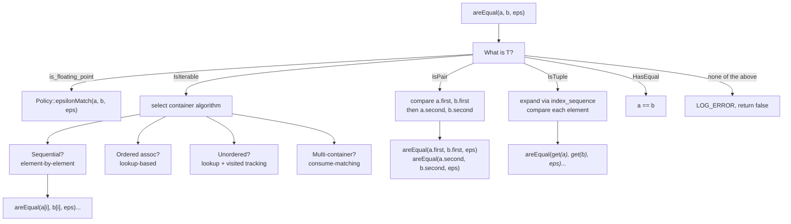

**The priority order matters:**

`std::pair<T1, T2>` is technically iterable (you can call `begin()` on it in some contexts). Checking `IsPair` before `IsIterable` ensures pair-specific handling--comparing `.first` then `.second` with proper diagnostics--rather than generic iteration.

The order:
1. **Pair** -- checked before iterable for semantic correctness
2. **Tuple** -- checked before iterable for element-wise comparison
3. **Iterable** -- with sub-dispatch for container category
4. **Floating-point** -- uses policy comparison
5. **HasEqual** -- fallback to `operator==`
6. **Unsupported** -- log error, return false

**Why `if constexpr`, not template specialization:**

Template specialization would require:
- `EqualDispatcher<std::pair<T1, T2>, Policy>`
- `EqualDispatcher<std::tuple<Ts...>, Policy>`
- `EqualDispatcher<std::vector<T>, Policy>`
- ... and so on for every category

With `if constexpr`, all logic lives in one template:

```cpp
template <typename T, typename Policy>
struct EqualDispatcher {
    template <typename... EpsParams>
    static bool compare(const T& a, const T& b, EpsParams... eps) {
        if constexpr (IsPair<T>::value) {
            // Pair handling
        }
        else if constexpr (IsTuple<T>::value) {
            // Tuple handling
        }
        else if constexpr (IsIterable<T>::value) {
            // Container handling
        }
        else if constexpr (std::is_floating_point_v<T>) {
            return Policy::epsilonMatch(a, b, eps...);
        }
        else if constexpr (HasEqual<T>::value) {
            return a == b;
        }
        else {
            LOG_ERROR("Unsupported type for comparison");
            return false;
        }
    }
};
```

Benefits:
1. Single point of maintenance
2. Priority order is explicit in the code
3. Adding a new category means one `else if constexpr`
4. Error messages point to the dispatch site

**What the compiler sees:**

For `areEqual(std::vector<double>{1.0, 2.0}, std::vector<double>{1.0, 2.0}, 1e-9)`:

After template instantiation and `if constexpr` resolution, the code compiles to:

```cpp
bool compare(const std::vector<double>& a, const std::vector<double>& b, double eps) {
    if (a.size() != b.size()) {
        LOG_ERROR("Size mismatch");
        return false;
    }
    for (size_t i = 0; i < a.size(); ++i) {
        if (!StandardComparisonPolicy::epsilonMatch(a[i], b[i], eps)) {
            LOG_ERROR("Element mismatch at index " + std::to_string(i));
            return false;
        }
    }
    return true;
}
```

No virtual calls. No type_info lookups. No unused branches (the `if constexpr` false branches are discarded entirely).

**Tuple expansion:**

Tuples use fold expressions to compare each element:

```cpp
template <typename... Ts, typename Policy, std::size_t... Is, typename... EpsParams>
bool compareTupleImpl(const std::tuple<Ts...>& a,
                      const std::tuple<Ts...>& b,
                      std::index_sequence<Is...>,
                      EpsParams... eps) {
    bool success = true;
    // Fold expression: compare each element, accumulate success
    ((success = EqualDispatcher<std::tuple_element_t<Is, std::tuple<Ts...>>, Policy>
                    ::compare(std::get<Is>(a), std::get<Is>(b), eps...) && success), ...);
    return success;
}
```

For `std::tuple<int, double, std::string>`, this expands to:
1. Compare `get<0>` (int) via `operator==`
2. Compare `get<1>` (double) via `StandardComparisonPolicy::epsilonMatch`
3. Compare `get<2>` (string) via `operator==`

| Guarantee | Provided | Mechanism |
|-----------|----------|-----------|
| Zero runtime dispatch | Yes | `if constexpr` resolves at compile time |
| Arbitrary nesting depth | Yes | Recursive template instantiation |
| Automatic policy propagation | Yes | Policy flows through all levels |
| No dead code | Yes | `if constexpr` prunes unused branches |

---

# **CHAPTER 9 -- Container Comparison Strategies**

Chapter 5 described the unordered container problem: iteration order doesn't match semantic equality. EqualityComparisons handles this by selecting the appropriate algorithm for each container category.

**Sequential containers** (vector, array, deque, list):

Iteration order is deterministic and meaningful. Element-by-element comparison with index tracking:

```cpp
if (a.size() != b.size()) {
    LOG_ERROR("Size mismatch: " + to_string(a.size()) + " vs " + to_string(b.size()));
    return false;
}

auto it_a = a.begin();
auto it_b = b.begin();
size_t index = 0;

while (it_a != a.end()) {
    if (!EqualDispatcher<ElemT, Policy>::compare(*it_a, *it_b, eps...)) {
        LOG_ERROR("Element mismatch at index " + std::to_string(index));
        if constexpr (kStopOnFirstError) return false;
    }
    ++it_a; ++it_b; ++index;
}
return true;
```

**Ordered associative containers** (map, set, multimap, multiset):

Iteration order is deterministic (sorted by key). For maps, keys are compared exactly; values use tolerance:

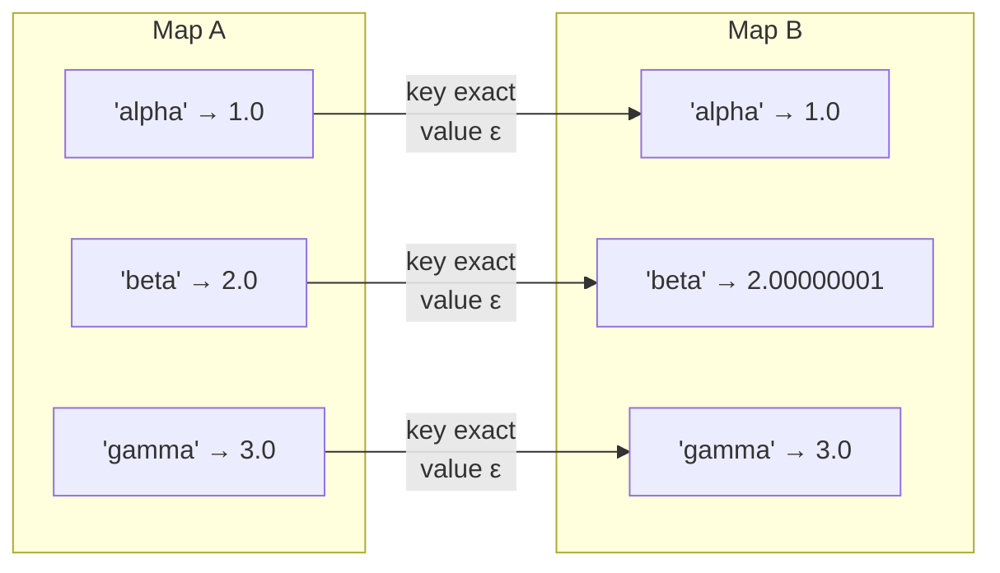

Keys must match exactly--there's no meaningful "close enough" for map keys. If key "beta" in A should match key "beta" in B, use string equality. Tolerance applies only to mapped values.

**Unordered associative containers** (unordered_map, unordered_set):

Iteration order is not deterministic. Comparison uses lookup, not iteration:

```cpp
// For unordered_set<T>
for (const auto& elem : a) {
    if (b.find(elem) == b.end()) {
        LOG_ERROR("Element not found in second container: " + toString(elem));
        return false;
    }
}
if (a.size() != b.size()) {
    LOG_ERROR("Size mismatch after element check");
    return false;
}
return true;
```

For unordered_map, find by key, then compare values with tolerance:

```cpp
for (const auto& [keyA, valueA] : a) {
    auto itB = b.find(keyA);
    if (itB == b.end()) {
        LOG_ERROR("Key not found: " + toString(keyA));
        return false;
    }
    if (!EqualDispatcher<ValueT, Policy>::compare(valueA, itB->second, eps...)) {
        LOG_ERROR("Value mismatch for key: " + toString(keyA));
        // ...
    }
}
```

**Unordered multi-containers** (unordered_multimap, unordered_multiset):

Multiplicity matters. The algorithm uses a "consume-matching" approach:

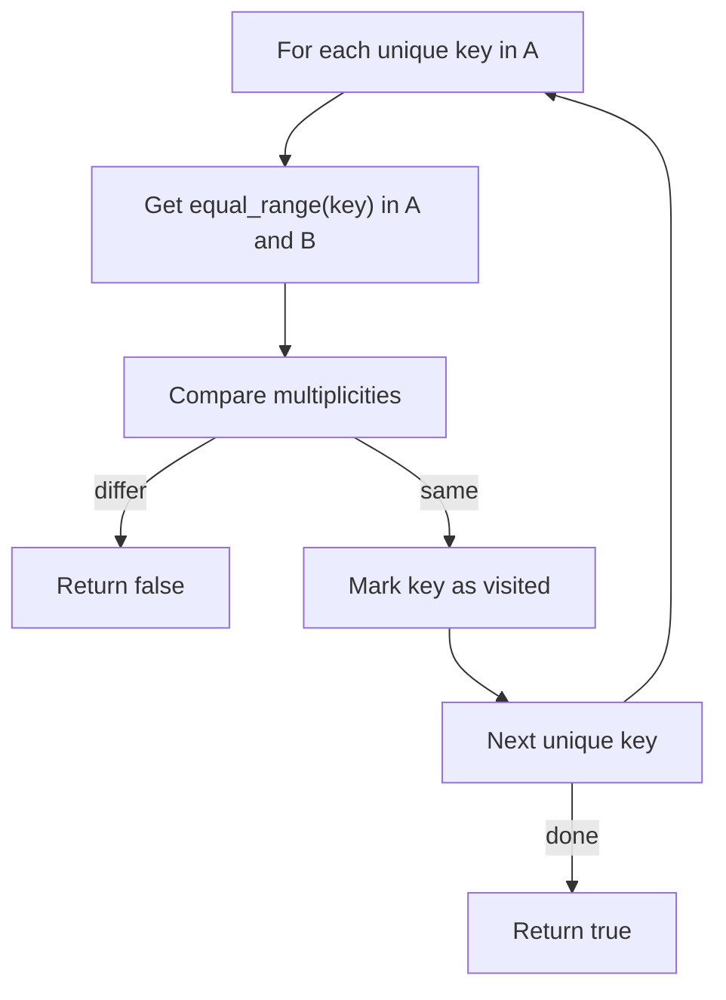

The critical detail: we must use the container's own hash and equality functions, not default-constructed functors:

```cpp
auto keyEq = a.key_eq();          // Extract container's equality predicate
auto keyHash = a.hash_function(); // Extract container's hash function

// Build visited set using the SAME equivalence relation
std::unordered_set<KeyT, decltype(keyHash), decltype(keyEq)> visitedKeys(
    0, keyHash, keyEq);

for (const auto& elem : a) {
    const KeyT& key = extractKey(elem);
    if (!visitedKeys.insert(key).second) continue;  // Already processed
    
    auto [rangeA_begin, rangeA_end] = a.equal_range(key);
    auto [rangeB_begin, rangeB_end] = b.equal_range(key);
    
    size_t countA = std::distance(rangeA_begin, rangeA_end);
    size_t countB = std::distance(rangeB_begin, rangeB_end);
    
    if (countA != countB) {
        LOG_ERROR("Multiplicity mismatch for key: " + toString(key));
        return false;
    }
    // For multi-maps: also verify values match (with tolerance)
}
```

Why extract functors? If container A uses a case-insensitive string hash, and our `visitedKeys` uses a case-sensitive hash, we might process "Hello" and "hello" as separate keys when A considers them the same.

| Container Category | Algorithm | Time Complexity |
|--------------------|-----------|-----------------|
| Sequential | Element-by-element | O(n) |
| Ordered associative | Element-by-element | O(n) |
| Unordered associative | Lookup-based | O(n) average, O(n²) worst |
| Unordered multi-associative | Consume-matching | O(n × k) where k = max multiplicity |

| Guarantee | Provided | Mechanism |
|-----------|----------|-----------|
| Order-independent for unordered | Yes | Lookup-based comparison |
| Multiplicity-aware for multi | Yes | equal_range + count |
| Stateful functor support | Yes | Extract via key_eq() and hash_function() |
| Early exit on size mismatch | Yes | Check size() before element iteration |

*The functor extraction pattern avoids a subtle bug that appears in many hand-written implementations. Appendix B documents this trap and the fix.*

---

# **CHAPTER 10 -- The Any Registry**

Chapter 4 described the type erasure problem: `std::any` has no `operator==`, and type-switching defeats the purpose of type erasure. EqualityAny solves this with a runtime registry that maps types to comparison functions.

**The dual-registry architecture:**

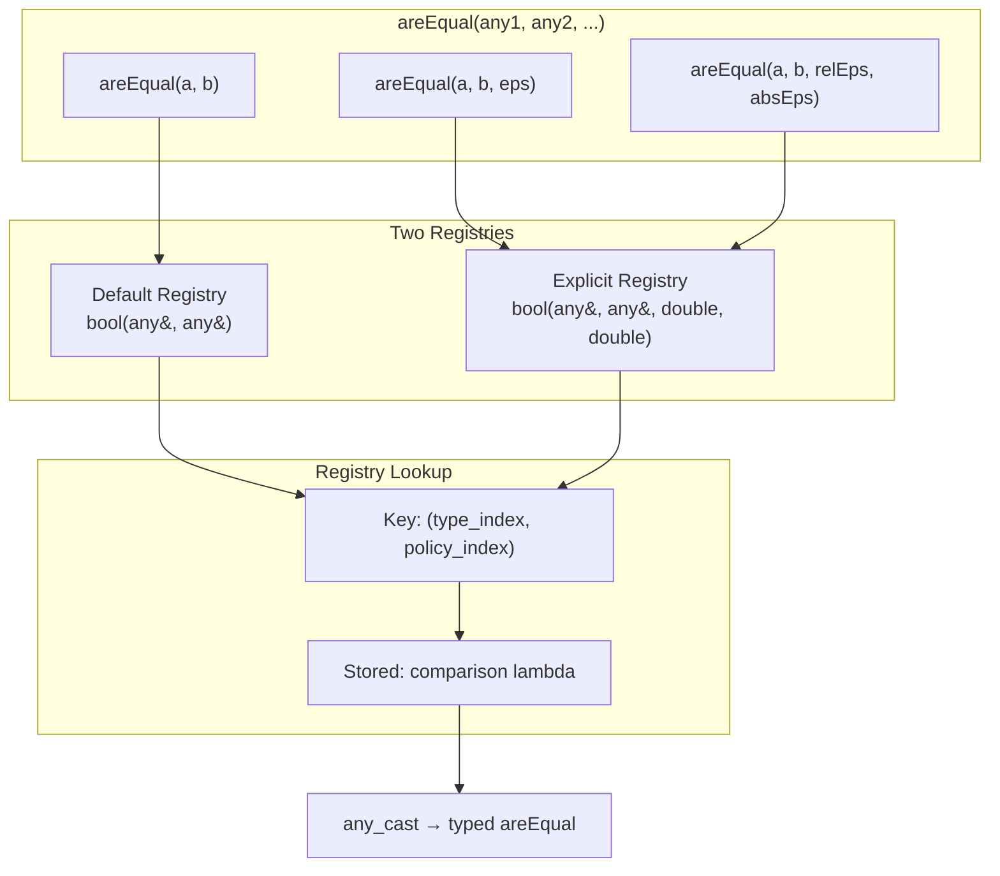

Why two registries? Different call signatures need different stored functions. A call without epsilon (`areEqual(a, b)`) invokes a `bool(any&, any&)` lambda that uses the type's default tolerance. A call with epsilon invokes a `bool(any&, any&, double, double)` lambda that forwards the parameters.

**Registration:**

```cpp
template <typename T, typename Policy = StandardComparisonPolicy>
void registerAnyType() {
    auto key = std::make_pair(
        std::type_index(typeid(T)),
        std::type_index(typeid(Policy)));

    // Default-epsilon version
    getAnyDefaultRegistry().registerType(key,
        [](const std::any& a, const std::any& b) {
            return areEqual<T, Policy>(
                std::any_cast<const T&>(a),
                std::any_cast<const T&>(b));  // Uses type's default epsilon
        });

    // Explicit-epsilon version
    getAnyExplicitRegistry().registerType(key,
        [](const std::any& a, const std::any& b, double eps1, double eps2) {
            return areEqual<T, Policy>(
                std::any_cast<const T&>(a),
                std::any_cast<const T&>(b),
                eps1, eps2);  // Forwards epsilon
        });
}
```

The registered lambda captures nothing--it's a stateless function object. It performs `any_cast` to recover the concrete type, then delegates to the typed `areEqual` from EqualityComparisons.

**Lookup:**

```cpp
template <typename Policy>
bool areEqual(const std::any& a, const std::any& b) {
    // Handle empty any
    if (!a.has_value() && !b.has_value()) return true;
    if (!a.has_value() || !b.has_value()) return false;
    
    // Type mismatch
    if (a.type() != b.type()) return false;

    // Build key and look up
    auto key = std::make_pair(
        std::type_index(a.type()),
        std::type_index(typeid(Policy)));

    if (getAnyDefaultRegistry().hasType(key)) {
        return getAnyDefaultRegistry().create(key, a, b);
    }

    LOG_ERROR("No comparison handler registered for type: " + 
              std::string(a.type().name()));
    return false;
}
```

**Nested any handling:**

What if someone stores `std::any(std::any(42))`? The registry detects this and unwraps recursively:

```cpp
if (a.type() == typeid(std::any)) {
    if (depth >= kMaxAnyRecursionDepth) {
        LOG_ERROR("Max nesting depth exceeded");
        return false;
    }
    return areEqual<Policy>(
        std::any_cast<const std::any&>(a),
        std::any_cast<const std::any&>(b),
        depth + 1);
}
```

The depth limit (default: 10) prevents infinite recursion if someone creates a malicious or buggy circular reference (which `std::any` can't actually represent, but defense in depth is cheap).

**Auto-registration:**

Common types are registered automatically on first use:

```cpp
inline void ensureAnyEqualityRegistered() {
    static bool registered = []() {
        // Floating-point with all policies
        registerAnyType<float, StandardComparisonPolicy>();
        registerAnyType<float, RelativeComparisonPolicy>();
        registerAnyType<double, StandardComparisonPolicy>();
        registerAnyType<double, HybridComparisonPolicy>();
        // ... etc
        
        // Integers (no epsilon needed)
        registerAnyTypeWithoutEpsilon<int>();
        registerAnyTypeWithoutEpsilon<long>();
        
        // Common containers
        registerAnyType<std::vector<double>>();
        registerAnyType<std::vector<float>>();
        
        return true;
    }();
    (void)registered;
}
```

The function-local static ensures thread-safe initialization (C++11 magic statics).

| Guarantee | Provided | Mechanism |
|-----------|----------|-----------|
| Thread-safe registration | Yes | Function-local statics |
| Policy-specific lookup | Yes | Key includes policy type_index |
| Nested any support | Yes | Recursive unwrap with depth limit |
| Unknown type detection | Yes | Returns false, logs error with type name |
| Auto-registration | Yes | Common types registered on first use |

*The registry uses FAT-P's Factory infrastructure. Appendix B explains the design choice of dual registries over a single registry with optional epsilon.*

---

# **CHAPTER 11 -- Diagnostics and Error Reporting**

When comparison fails, "not equal" isn't enough. You need to know *where*--which element, which field, which nested container. EqualityComparisons provides structural diagnostics through the DiagnosticLogger integration.

**What gets logged:**

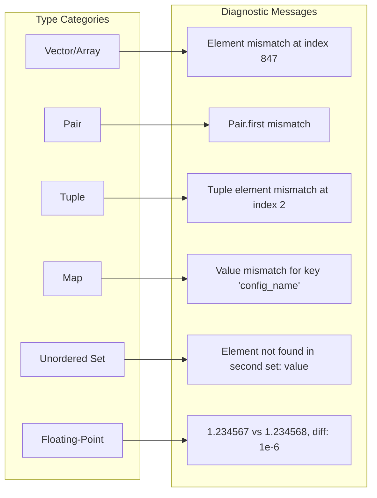

**Example diagnostic output:**

```
[ERROR] Tensor elements differ at logical index 847 [8, 4, 7]:
  Expected: 1.23456789012345
  Got:      1.23456789012346
  Diff:     1.0e-14
```

For multi-dimensional data (Tensor), the linear index is converted to multi-dimensional coordinates: "index 847 [8, 4, 7]" tells you exactly where to look.

**`kStopOnFirstError` configuration:**

```cpp
inline constexpr bool kStopOnFirstError = false;  // or true
```

- `true`: Return immediately on first mismatch. Fastest for production validation where you just need pass/fail.
- `false`: Continue checking all elements, log all mismatches. Best for debugging where you want the complete picture.

This is a compile-time constant, not a runtime parameter. The decision is made once and eliminates branching overhead in the comparison loop.

**Integration with Stringify:**

Diagnostics use `Stringify.h` for value formatting:

```cpp
LOG_ERROR("Expected: " + toString(expected) + ", Got: " + toString(actual));
```

`toString` handles floating-point precision, container formatting, and custom types with `operator<<`.

| Guarantee | Provided | Mechanism |
|-----------|----------|-----------|
| Structural context | Yes | Index, key, or field name in message |
| Configurable early exit | Yes | `kStopOnFirstError` compile-time constant |
| Consistent value formatting | Yes | `Stringify.h` integration |
| Multi-dimensional indexing | Yes | Linear-to-coordinates conversion for Tensor |

*The diagnostic system balances information density against performance. Appendix B discusses the tradeoff between complete error reporting and early-exit optimization.*

---

# **PART III -- PUTTING IT TOGETHER**

Parts I and II described the problems and their solutions in isolation. Real systems combine multiple challenges: nested containers with floating-point values, type-erased configurations that must survive serialization round-trips, multi-platform simulations that must match bit-for-bit... or close enough.

This part shows complete stories: the context, the symptoms, the investigation, and the measured results.

---

# **CHAPTER 12 -- Case Study: Serialization Round-Trip Testing**

## The Context

A configuration management system serializes nested configuration objects to JSON for storage and network transmission. Each configuration contains strings, integers, and floating-point thresholds at various nesting levels. Tests verify that configurations survive the round-trip: serialize to JSON, deserialize back, compare to original.

## The Initial Approach

```cpp
// THE TRAP: Exact comparison after floating-point serialization
Config original = loadConfig();
std::string json = toJson(original);
Config restored = fromJson(json);

ASSERT(original == restored);  // FAILS intermittently
```

The test fails intermittently. Same config, same code, different results across runs.

## Observing the Symptoms

| Metric | Value |
|--------|-------|
| Test pass rate | 73% |
| Failure pattern | Always in floating-point fields |
| Typical difference | 5.5e-17 (one ULP) |
| Affected platforms | All (not platform-specific) |

Digging into a specific failure:

```
original.threshold = 0.15
restored.threshold = 0.14999999999999999
diff = 5.5511151231257827e-17
```

The difference is one ULP--the minimum representable difference at this magnitude.

## Forming Hypotheses

1. **JSON serializer bug?** No--values parse back to valid doubles.
2. **Platform-dependent behavior?** No--fails consistently across Linux, Windows, macOS.
3. **Race condition?** No--single-threaded test, deterministic on repeat.
4. **Representation limits?** **Yes**--decimal text cannot preserve all binary doubles.

## Gathering Evidence

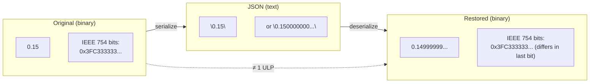

The issue is fundamental: JSON is a text format. Binary floating-point values must be converted to decimal strings, then back to binary. This round-trip is not always exact--the nearest decimal representation may round differently when parsed.

```cpp
// Demonstrating the issue
double original = 0.15;
std::string json = std::to_string(original);  // "0.150000" (truncated)
double restored = std::stod(json);
std::cout << (original == restored) << "\n";  // May print 0!
```

## The Fix

```cpp
// THE FIX: Tolerance-aware comparison for serialized data
Config original = loadConfig();
std::string json = toJson(original);
Config restored = fromJson(json);

ASSERT(areEqual(original, restored, 1e-9));  // Tolerance for round-trip error
```

For configurations with mixed magnitudes (some values near 0, some near 1e6):

```cpp
// THE FIX: Hybrid tolerance for multi-scale data
ASSERT(areEqual<HybridComparisonPolicy>(original, restored, 1e-9, 1e-15));
// relEps = 1e-9 for large values
// absEps = 1e-15 for near-zero values
```

## Results

| Metric | Before | After | Improvement |
|--------|--------|-------|-------------|
| Test pass rate | 73% | 100% | 37% fewer false failures |
| False negatives per week | 15-20 | 0 | Eliminated |
| Time debugging flaky tests | ~4 hours/week | 0 | 4 hours recovered |
| Developer confidence | "ignore red tests" | "red means real bug" | Qualitative |

## FAT-P Components Used

- `EqualityComparisons` -- Recursive comparison through nested config structures
- `HybridComparisonPolicy` -- Mixed-magnitude tolerance handling
- `DiagnosticLogger` -- Pinpointing which field differed (when debugging)

## Transferable Lessons

**Lesson 1:** Text serialization formats (JSON, XML, YAML, TOML) cannot preserve arbitrary binary floating-point exactly. Always use tolerance-based comparison after round-trips.

**Lesson 2:** Choose tolerance based on format precision. JSON with default formatting preserves ~15 significant decimal digits; use 1e-9 to 1e-12 tolerance depending on your values' magnitudes.

**Lesson 3:** Mixed-magnitude data (values ranging from 1e-10 to 1e10) benefits from HybridComparisonPolicy, which uses absolute tolerance near zero and relative tolerance for large values.

---

# **CHAPTER 13 -- Case Study: Scientific Simulation Validation**

## The Context

A computational physics team maintains a fluid dynamics solver. Reference results were generated on a specific workstation (Intel CPU, MSVC compiler). CI runs on cloud instances with different hardware (AMD CPU, GCC compiler) and sometimes ARM-based servers. Tests compare simulation output against reference baselines.

## The Initial Approach

```cpp
// THE TRAP: Bit-exact comparison of simulation results
SimResult computed = runSimulation(input);
SimResult reference = loadReference("baseline.bin");

for (size_t i = 0; i < computed.pressure.size(); ++i) {
    ASSERT(computed.pressure[i] == reference.pressure[i]);  // FAILS everywhere but original machine
}
```

Tests pass only on the exact workstation where references were generated.

## Observing the Symptoms

| Platform | CPU | Compiler | Result |
|----------|-----|----------|--------|
| Developer workstation | Intel i9 | MSVC 19.35 | PASS |
| CI runner #1 | Intel Xeon | GCC 13 | FAIL |
| CI runner #2 | AMD EPYC | GCC 13 | FAIL |
| ARM server | Graviton 3 | GCC 12 | FAIL |

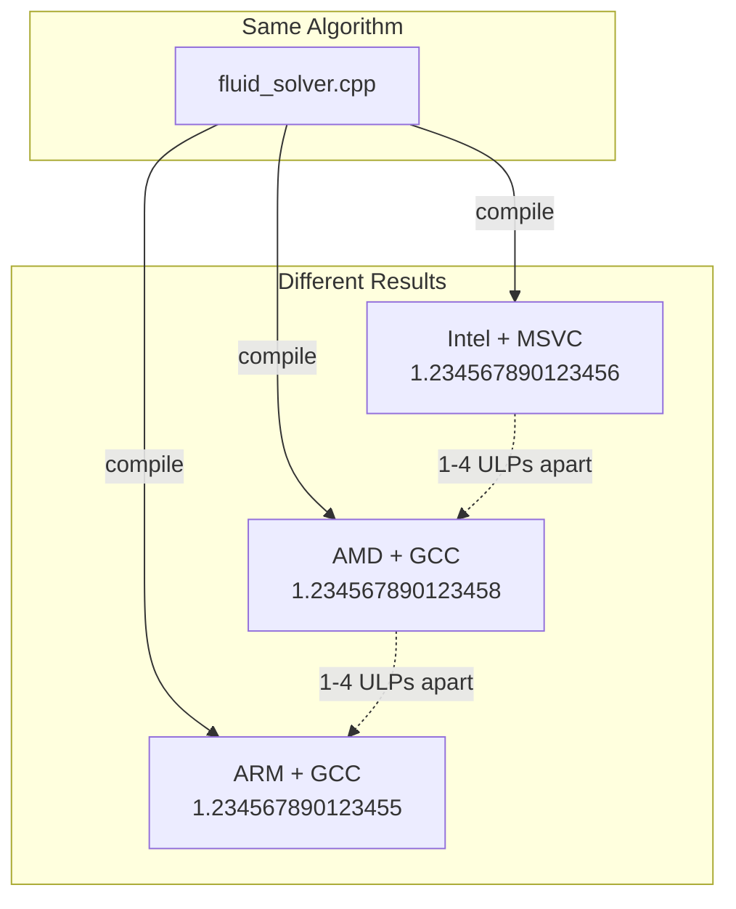

The differences are small (1-4 ULPs) but consistent. Same code produces bit-different results on different platforms.

## Forming Hypotheses

1. **Non-deterministic algorithm?** No--repeated runs on same machine give identical results.
2. **Uninitialized memory?** No--valgrind clean, ASan clean.
3. **FPU configuration differences?** Partially--but not the whole story.
4. **Compiler optimization differences?** **Yes**--operation reordering changes accumulated rounding error.

## Gathering Evidence

Floating-point addition is not associative:

```cpp
double a = 1.0, b = 1e-16, c = 1e-16;
double r1 = (a + b) + c;  // One order of operations
double r2 = a + (b + c);  // Different order
// r1 and r2 may differ by 1 ULP!
```

Compilers legally reorder operations for performance. The source code specifies the computation, but not the exact sequence of floating-point operations. Different compilers (or the same compiler with different flags) produce different instruction sequences.

For a simulation with millions of accumulated operations, these 1-ULP differences compound.

## The Fix

```cpp
// THE FIX: ULP-based comparison for algorithm verification
SimResult computed = runSimulation(input);
SimResult reference = loadReference("baseline.bin");

// Allow 4 ULPs difference: typical accumulation error budget
ASSERT(areEqual<UlpComparisonPolicy>(computed.pressure, reference.pressure, 4.0));

// For physical quantities where absolute magnitude matters, use relative tolerance
ASSERT(areEqual<RelativeComparisonPolicy>(computed.velocity, reference.velocity, 1e-12));
```

## Results

| Metric | Before | After | Improvement |
|--------|--------|-------|-------------|
| CI pass rate | 12% (one platform) | 100% | 8x more platforms |
| Platforms supported | 1 | 7 | Cross-platform CI |
| False failures per week | 15-20 | 0 | Eliminated |
| Time to onboard new platform | 2-3 days debugging | 0 | Instant |

## FAT-P Components Used

- `UlpComparisonPolicy` -- Algorithm-level correctness (bit-level tolerance)
- `RelativeComparisonPolicy` -- Physical quantities (scale-independent tolerance)
- `EqualityComparisons` -- Recursive traversal of simulation result structures

## Transferable Lessons

**Lesson 1:** Floating-point results are platform-dependent at the ULP level. This is not a bug--it's inherent to IEEE 754 and compiler optimization freedom. Design tests with explicit tolerance budgets.

**Lesson 2:** Use ULP comparison for algorithm verification ("is my implementation correct compared to reference?") and relative comparison for physics validation ("is the answer physically meaningful?").

**Lesson 3:** Document your tolerance budget explicitly. "4 ULPs per operation × 1000 accumulated operations = expect up to 4000 ULPs cumulative" is a valid engineering decision. When tests fail outside this budget, it indicates a real change in the algorithm, not platform noise.

---

# **CHAPTER 14 -- Case Study: EqualityTensor -- Building a Custom Integration**

## The Challenge

The `Tensor<T>` class represents multi-dimensional numerical arrays with configurable memory layout, striding, and iterator policies. Standard comparison approaches fall short:

- `operator==` is exact--no tolerance for floating-point elements
- Element-by-element loops don't understand strided layouts
- Diagnostics report linear indices, not multi-dimensional coordinates

We need to integrate Tensor with EqualityComparisons, preserving:
1. Shape comparison (dimensions must match)
2. Stride awareness (views may have non-contiguous memory)
3. Element-wise tolerance for floating-point data
4. Policy propagation (same tolerance rules as scalars)
5. Structural diagnostics (which element, in which dimension)

## The Design

The solution is an `EqualDispatcher` specialization that slots into the existing dispatch chain:

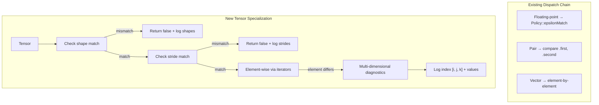

**Design decisions:**

| Decision | Choice | Rationale |
|----------|--------|-----------|
| Shape mismatch | Return false, log both shapes | Can't meaningfully compare different-shaped tensors |
| Stride comparison | Compare strides explicitly | Different layouts may indicate semantic difference (view vs copy) |
| Element traversal | Use tensor's own iterators | Handles non-contiguous views correctly |
| Index reporting | Linear + multi-dimensional | "[847] = [8, 4, 7]" is more useful than just "847" |

## The Implementation

```cpp
template <typename T, typename Alloc, typename IteratorPolicy, typename Policy>
struct EqualDispatcher<Tensor<T, Alloc, IteratorPolicy>, Policy> {
    template <typename... EpsParams>
    static bool compare(const Tensor<T, Alloc, IteratorPolicy>& a,
                        const Tensor<T, Alloc, IteratorPolicy>& b,
                        EpsParams... eps) {
        // Shape check
        if (a.shape() != b.shape()) {
            LOG_ERROR("Tensor shapes differ: " + formatShape(a.shape()) +
                      " vs " + formatShape(b.shape()));
            return false;
        }
        
        // Stride check
        if (a.strides() != b.strides()) {
            LOG_ERROR("Tensor strides differ: " + formatStrides(a.strides()) +
                      " vs " + formatStrides(b.strides()));
            return false;
        }
        
        // Element-wise comparison using iterators
        auto it_a = a.begin();
        auto it_b = b.begin();
        
        for (size_t i = 0; i < a.size(); ++i, ++it_a, ++it_b) {
            if constexpr (std::is_floating_point_v<T>) {
                if (!Policy::epsilonMatch(*it_a, *it_b, eps...)) {
                    auto coords = linearToMultiIndex(i, a.shape());
                    LOG_ERROR("Tensor elements differ at index " + 
                              std::to_string(i) + " " + formatCoords(coords) +
                              ":\n  Expected: " + toString(*it_a) +
                              "\n  Got:      " + toString(*it_b) +
                              "\n  Diff:     " + toString(std::abs(*it_a - *it_b)));
                    if constexpr (kStopOnFirstError) return false;
                }
            } else {
                if (*it_a != *it_b) {
                    LOG_ERROR("Tensor elements differ at index " + std::to_string(i));
                    if constexpr (kStopOnFirstError) return false;
                }
            }
        }
        return true;
    }
};
```

**Index conversion helper:**

```cpp
std::vector<size_t> linearToMultiIndex(size_t linear, const std::vector<size_t>& shape) {
    std::vector<size_t> indices(shape.size());
    for (size_t dim = shape.size(); dim-- > 0;) {
        indices[dim] = linear % shape[dim];
        linear /= shape[dim];
    }
    return indices;
}
```

## Usage

```cpp
#include "Tensor.h"
#include "EqualityComparisons.h"
#include "EqualityTensor.h"  // The specialization

Tensor<float> computed({100, 100}, 0.0f);
Tensor<float> reference({100, 100}, 0.0f);
// ... fill tensors ...

// Policy-based comparison
bool match = areEqual<StandardComparisonPolicy>(computed, reference, 1e-6f);

// ULP comparison for algorithm verification
bool ulpMatch = areEqual<UlpComparisonPolicy>(computed, reference, 4.0f);
```

## Registering with EqualityAny

For type-erased tensor comparison (e.g., in a plugin system):

```cpp
// At startup
registerAnyType<Tensor<float>, StandardComparisonPolicy>();
registerAnyType<Tensor<double>, StandardComparisonPolicy>();

// Later, with type-erased tensors
std::any tensor1 = Tensor<float>({10, 10}, 1.0f);
std::any tensor2 = Tensor<float>({10, 10}, 1.0f);
bool match = areEqual(tensor1, tensor2, 1e-6f);  // Works!
```

## FAT-P Components Used

- `EqualDispatcher` specialization -- Slots into the dispatch chain
- `Policy::epsilonMatch` -- Consistent tolerance comparison
- `kStopOnFirstError` -- Configurable early exit
- `LOG_ERROR` -- Structural diagnostics
- `toString` -- Value formatting

## Lessons for Custom Types

**Lesson 1:** Specialize `EqualDispatcher<YourType, Policy>` to integrate with the dispatch chain. Your specialization receives the policy as a template parameter and can access any policy's comparison logic.

**Lesson 2:** Use `Policy::epsilonMatch` for floating-point members, not hard-coded tolerance logic. This ensures policy consistency throughout nested comparisons.

**Lesson 3:** Provide structural diagnostics. "Mismatch at [8, 4, 7]" is vastly more useful than "not equal" for debugging multi-dimensional data.

**Lesson 4:** Respect `kStopOnFirstError`. Early exit improves performance in production validation; complete iteration aids debugging.

**Lesson 5:** For simple structs, consider wrapping in `std::tuple` instead of writing a full specialization:

```cpp
// Simple approach: wrap in tuple
auto asTuple(const Point& p) { return std::tie(p.x, p.y, p.z); }
areEqual(asTuple(p1), asTuple(p2), 1e-9);

// Full specialization: for complex types with non-contiguous memory or custom traversal
template <typename Policy>
struct EqualDispatcher<Tensor<...>, Policy> { ... };
```

---

# **CHAPTER 15 -- Choosing Your Comparison Strategy**

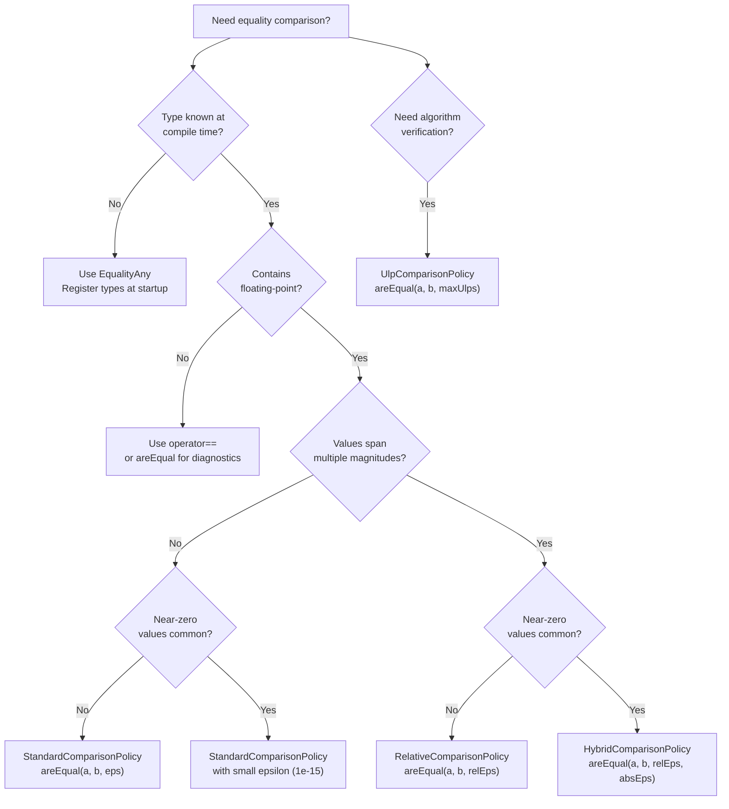

**Quick reference by scenario:**

| Scenario | Policy | Typical Parameters | Rationale |
|----------|--------|-------------------|-----------|
| JSON round-trip | Standard or Hybrid | 1e-9 | Text preserves ~15 digits |
| Scientific simulation | Relative or ULP | 1e-12 or 4 ULPs | Cross-platform reproducibility |
| Financial data | Exact or Standard | 0 or 1e-4 | Depends on rounding rules |
| Graphics/rendering | Standard | 1e-5 | Visual indistinguishability |
| Mixed-scale physics | Hybrid | rel=1e-9, abs=1e-15 | Handles both near-zero and large |
| Algorithm correctness | ULP | 1-4 | Hardware-aware tolerance |

**When to use EqualityAny:**

- Plugin systems with dynamic types
- Configuration loaded from external sources
- Heterogeneous collections (`vector<any>`)
- Reflection/serialization frameworks

**When to avoid EqualityAny:**

- Type is known at compile time → use typed `areEqual` directly (faster)
- Hot path with millions of comparisons → registry lookup adds ~80-190 ns
- Simple cases where `operator==` suffices → don't add complexity

---

# **CHAPTER 16 -- Migration from Manual Comparison Code**

## Identifying Candidates

Look for these patterns in your codebase:

1. Functions named `compare*`, `equals*`, `match*`, `same*`
2. Nested loops comparing container elements
3. `std::fabs(a - b) < epsilon` or `std::abs(a - b) <= tolerance`
4. Switch statements on `std::any::type()` or `typeid`
5. Long comparison functions that mirror struct layout

## Step-by-Step Migration

**Step 1: Identify the comparison scope**

```cpp
// Before: Manual comparison (47 lines)
bool compareResults(const SimResult& a, const SimResult& b) {
    if (a.pressure.size() != b.pressure.size()) return false;
    for (size_t i = 0; i < a.pressure.size(); ++i) {
        if (std::fabs(a.pressure[i] - b.pressure[i]) > 1e-9) return false;
    }
    if (a.velocity.size() != b.velocity.size()) return false;
    for (size_t i = 0; i < a.velocity.size(); ++i) {
        if (std::fabs(a.velocity[i] - b.velocity[i]) > 1e-9) return false;
    }
    // ... 30 more lines for temperature, density, etc.
    return true;
}
```

**Step 2: Determine policy and tolerance**

- What epsilon was used? → 1e-9, that's our tolerance
- Was relative comparison used? → No, absolute → StandardComparisonPolicy
- Were NaN/Inf handled? → Not explicitly → EqualityComparisons handles them

**Step 3: Replace with areEqual**

```cpp
// After: Single call with automatic recursion (1 line)
bool compareResults(const SimResult& a, const SimResult& b) {
    return areEqual(a, b, 1e-9);
}
```

**Step 4: Verify equivalence**

Run both implementations on test data:

```cpp
SimResult a = generateTestData();
SimResult b = a;  // Exact copy
assert(compareResults_old(a, b) == areEqual(a, b, 1e-9));

b.pressure[0] += 1e-8;  // Intentional difference
assert(compareResults_old(a, b) == areEqual(a, b, 1e-9));
```

Pay attention to edge cases: NaN values, empty containers, deeply nested structures.

**Step 5: Delete dead code**

Remove the manual comparison function once migration is verified.

## Handling Custom Types

If your type isn't automatically handled:

**Option A:** Provide `operator==` for exact comparison

```cpp
struct Point {
    double x, y, z;
    bool operator==(const Point& other) const {
        return x == other.x && y == other.y && z == other.z;
    }
};
// areEqual(vector<Point>, vector<Point>) works--uses operator==
// But no tolerance! This is exact comparison.
```

**Option B:** Wrap in tuple for tolerance comparison

```cpp
auto asTuple(const Point& p) { return std::tie(p.x, p.y, p.z); }
areEqual(asTuple(p1), asTuple(p2), 1e-9);  // Tolerance applies!
```

**Option C:** Write an EqualDispatcher specialization

See Chapter 14 for the full pattern. Use this for complex types with non-trivial traversal (Tensor, Graph, etc.).

## Common Migration Issues

| Issue | Solution |
|-------|----------|
| Different tolerance per field | Compare fields separately, or use Hybrid policy |
| Some fields should be exact | Compare those with `operator==`, others with `areEqual` |
| Custom NaN handling | `EqualityComparisons` inherits IEEE 754 NaN semantics from `FloatingPointComparison`: NaN != NaN. If your domain requires NaN == NaN, pre-normalize inputs or provide a custom NaN-equal policy |
| Order-sensitive comparison | Ensure containers are ordered, or sort before comparing |
| New field added to struct | If using tuple wrapping, update the tuple; if using areEqual directly, automatic |

---

# **PART IV -- FOUNDATIONS**

The preceding parts explained *what* EqualityComparisons does and *how* to use it. This part explains *why*--the constraints that shaped the design, the alternatives considered and rejected, and the technical foundations that underpin the implementation.

---

# **APPENDIX A -- IEEE 754 and Why Floating-Point Is Hard**

## The Representation Problem

Computers store numbers in binary. Humans think in decimal. This impedance mismatch is the root of most floating-point confusion.

Consider 0.1 in decimal: one-tenth, a simple fraction. In binary, it's:

```
0.1 (decimal) = 0.0001100110011001100110011... (binary)
```

The pattern `0011` repeats infinitely. Just as 1/3 = 0.333... in decimal (an infinite sequence), 1/10 = 0.000110011... in binary (an infinite sequence).

IEEE 754 doubles have 52 bits of mantissa. They must round this infinite sequence to a finite approximation:

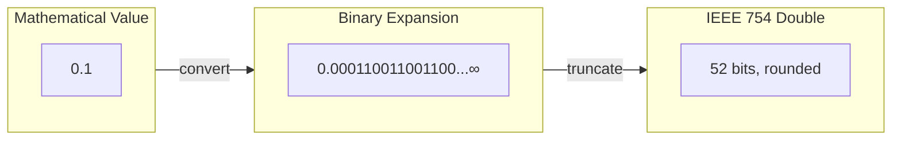

The stored value is exactly:
```
0.1000000000000000055511151231257827021181583404541015625
```

This isn't a bug or approximation error. It's the *exact* value stored in a double when you write `double x = 0.1;`. The gap between "0.1 the mathematical concept" and "0.1 the stored value" is fundamental to binary floating-point.

## Special Values

IEEE 754 reserves bit patterns for special values:

| Value | Exponent | Mantissa | Purpose |
|-------|----------|----------|---------|
| +0.0 | All zeros | All zeros | Zero (positive limit) |
| -0.0 | All zeros | All zeros + sign | Zero (negative limit) |
| +∞ | All ones | All zeros | Positive infinity |
| -∞ | All ones | All zeros + sign | Negative infinity |
| NaN | All ones | Non-zero | Not a Number |

**Signed zero:** +0.0 and -0.0 have different bit patterns but compare equal under `==`. They can produce different results:

```cpp
1.0 / +0.0  // +∞
1.0 / -0.0  // -∞
```

Signed zero preserves the "direction of approach" to zero, useful in limit calculations.

**Infinity:** Represents overflow or explicit infinity. Infinities of the same sign are equal; opposite signs are not.

**NaN:** Represents undefined operations (0/0, sqrt(-1), ∞-∞). The standard mandates:

```cpp
NaN == NaN  // false (always!)
NaN != NaN  // true
NaN < x     // false for any x
NaN > x     // false for any x
```

This enables the idiom `if (x != x) /* x is NaN */` but breaks naive comparison code.

## Why NaN != NaN

The IEEE 754 committee reasoned: NaN represents "the result of an undefined operation." Two undefined results aren't meaningfully "equal"--they could represent entirely different error conditions.

```cpp
double a = 0.0 / 0.0;      // NaN (indeterminate form)
double b = sqrt(-1.0);     // NaN (imaginary result)
// Should a == b? They're both "undefined" but for different reasons.
```

The standard chose: no, they should not compare equal. This is mathematically principled but breaks some test assertions.

`EqualityComparisons` follows this IEEE 754 rule via `FloatingPointComparison`: if either value is NaN, the comparison returns false. This surfaces invalid states (uninitialized data, computation errors) that might otherwise go undetected. For domains that genuinely need NaN == NaN semantics (missing-data representations), a custom NaN-equal policy can be provided.

## ULP: Units in Last Place

One ULP is the distance between adjacent representable floating-point values. At magnitude 1.0:

| Type | ULP at 1.0 | ULP at 1e10 |
|------|------------|-------------|
| float (32-bit) | ~1.2e-7 | ~1.2e3 |
| double (64-bit) | ~2.2e-16 | ~2.2e-6 |

ULP scales with magnitude. Near 1.0, one ULP is tiny. Near 1e10, one ULP is large. This is why relative comparison (`|a-b| / max(|a|,|b|)`) and ULP comparison (`ulp_distance(a, b)`) are magnitude-independent.

Counting ULPs directly measures: "How many representable floating-point values are between a and b?" This is the most precise way to specify floating-point tolerance for algorithm verification.

---

# **APPENDIX B -- Design Decisions and Rejected Alternatives**

## Key Decisions

| Decision | Choice | Alternative Considered | Rationale |
|----------|--------|------------------------|-----------|
| Exact key matching | Keys compared exactly | Approximate key lookup | Standard containers use exact key equality; approximate lookup would require spatial indexing (R-tree, k-d tree) |
| `kStopOnFirstError` | Compile-time constant | Runtime parameter | Eliminates branch in inner loop; forces explicit design decision |
| Dual registry | Two registries (default/explicit epsilon) | Single registry with optional epsilon | Clean separation, no overhead for default case, no type-erased epsilon handling |
| Depth limit for any | Hard limit (10) | Cycle detection | std::any can't create cycles; deep nesting is the realistic concern |
| Unknown type handling | Return false, log error | Throw exception | Comparison often in error-handling paths; throwing would complicate |
| `if constexpr` dispatch | Single template with branches | Partial template specialization | Single point of maintenance, explicit priority order, better error messages |
| Policy as template | Compile-time selection | Runtime policy object | Zero overhead, full inlining |
| NaN semantics | Follow IEEE 754 (NaN != NaN) | Treat both-NaN as equal | Surfacing invalid states matters more than convenience; NaN-equal available via custom policy |

## Accepted Tradeoffs

| We Pay | We Get |
|--------|--------|
| Compile-time policy selection only | Zero runtime dispatch overhead |
| No heterogeneous type comparison | Type safety, clear semantics |
| No approximate key matching | Standard container compatibility |
| `kStopOnFirstError` requires recompile | No branch in comparison loop |
| Registry lookup cost for any (~80-190 ns) | Dynamic type support without central switch |

## The Functor Extraction Pattern

Chapter 9 mentioned extracting hash and equality functors from containers. This addresses a subtle bug:

```cpp
// THE TRAP: Using default functors for visited tracking
std::unordered_set<KeyT> visitedKeys;  // Uses std::hash<KeyT>, std::equal_to<KeyT>

// But the container might use custom functors!
std::unordered_set<KeyT, CaseInsensitiveHash, CaseInsensitiveEqual> container;

// If container treats "Hello" and "hello" as same key,
// but visitedKeys treats them as different,
// we'll process "Hello" and "hello" separately (WRONG!)
```

The fix:

```cpp
// Extract the container's actual functors
auto keyHash = container.hash_function();
auto keyEq = container.key_eq();

// Build visited set with same equivalence relation
std::unordered_set<KeyT, decltype(keyHash), decltype(keyEq)> visitedKeys(
    0, keyHash, keyEq);
```

This ensures `visitedKeys` uses the same concept of "equality" as the container being compared.

---

# **APPENDIX C -- Where EqualityComparisons Loses**

Every library has limits. Here's where EqualityComparisons is the wrong choice:

| Scenario | Limitation | Better Alternative |
|----------|------------|-------------------|
| Performance-critical inner loops | Dispatch overhead ~1.5 ns/element | Hand-roll comparison without diagnostics |
| Structured diff output | Returns `bool`, not diff structure | Dedicated diffing library |
| Heterogeneous type comparison | Both sides must be same type | Cast or convert before comparing |
| Approximate key matching | Keys always exact | Spatial data structure (R-tree, k-d tree) |
| Dynamic policy selection | Policies are compile-time | Template over policy, or use std::variant |
| Very deep template nesting | Compile-time recursion limits | Flatten structure or increase compiler limits |
| Millions of any comparisons/sec | Registry lookup ~80-190 ns | Keep types known at compile time |

## When to Hand-Roll

If you're comparing millions of values per second and profiling shows EqualityComparisons in the hot path:

1. Check if you actually need diagnostics. If not, a raw loop may be faster.
2. Check if policy flexibility matters. If you always use StandardComparisonPolicy, you can hardcode it.
3. Check if you can batch comparisons. Registry lookup amortizes over large containers.

The breakeven point varies by compiler:
- MSVC: ~256 elements per container
- GCC: ~8000 elements per container (higher registry lookup cost)

Below these sizes, typed comparison without EqualityAny may be faster.

---

# **APPENDIX D -- Performance Characteristics**

Measured on Intel Core Ultra 9 285K @ 3.7 GHz (MSVC 19.50) and Linux container @ 2.6 GHz (GCC 13.3).

## Per-Element Dispatch Overhead

The cost of `areEqual` versus a raw comparison loop with equivalent semantics:

| Compiler | Overhead per Element |
|----------|---------------------|
| MSVC | 1.5-1.7 ns |
| GCC | 0.9-1.0 ns |

This overhead includes the `if constexpr` dispatch, policy selection, and diagnostic context setup. It amortizes over larger containers.

## Policy Comparison Cost

For `vector<double>[10000]`:

| Policy | MSVC | GCC | Notes |
|--------|------|-----|-------|
| Standard | 32 µs | 15 µs | Baseline |
| Hybrid | 22 µs | 15 µs | Faster due to early-exit on absolute check |
| Relative | 54 µs | 36 µs | 2-2.5x slower (per-element division) |
| ULP | 19 µs | 19 µs | Bit manipulation, no division |

RelativeComparisonPolicy is slowest because it computes `max(|a|, |b|)` per element.

## EqualityAny Registry Cost

| Operation | MSVC | GCC |
|-----------|------|-----|
| Registry lookup | 80 ns | 190 ns |
| any_cast + typed call | 5 ns | 5 ns |
| Direct typed call | 2 ns | 0.2 ns |

The registry lookup dominates for small containers. For containers with 1000+ elements, lookup cost amortizes to negligible.

## Amortization Point

At what container size does EqualityAny match direct typed comparison?

| Container Size | MSVC Relative Speed | GCC Relative Speed |
|----------------|--------------------|--------------------|
| N=64 | 0.58x | 0.35x |
| N=256 | 0.90x | 0.63x |
| N=1024 | 1.01x | 0.82x |
| N=4096 | 1.04x | 0.87x |

MSVC reaches parity around N=256. GCC reaches parity around N=8000 (higher registry cost).

## Nesting Overhead

Per-element cost for structures containing 1000 doubles total:

| Structure | MSVC | GCC |
|-----------|------|-----|
| Flat vector[1000] | 1.93 ns | 1.72 ns |
| 2-level vector[10][100] | 2.03 ns | 1.65 ns |
| 3-level vector[5][10][20] | 2.53 ns | 1.78 ns |

MSVC shows 5-31% overhead per nesting level. GCC shows minimal nesting impact (2-level is actually faster than flat, likely due to cache effects).

## Key Takeaways

1. **For typed comparison:** Overhead is 1-2 ns/element. Negligible for containers of 100+ elements.
2. **For EqualityAny:** Registry lookup adds 80-190 ns. Worth it for containers of 256+ elements (MSVC) or 8000+ elements (GCC).
3. **RelativeComparisonPolicy:** 2-2.5x slower than StandardComparisonPolicy due to per-element division. Use HybridComparisonPolicy as a faster alternative that handles multi-scale data.
4. **Nesting:** Minimal overhead on GCC, moderate on MSVC. Not a concern for typical structures.

---

*EqualityComparisons & EqualityAny Companion Guide v1.1 — December 2025*
