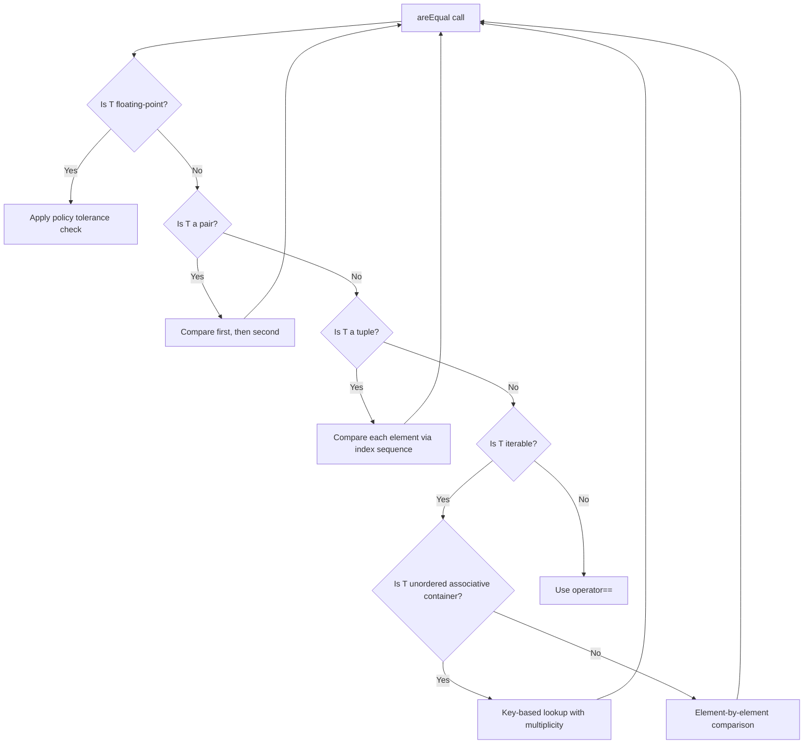
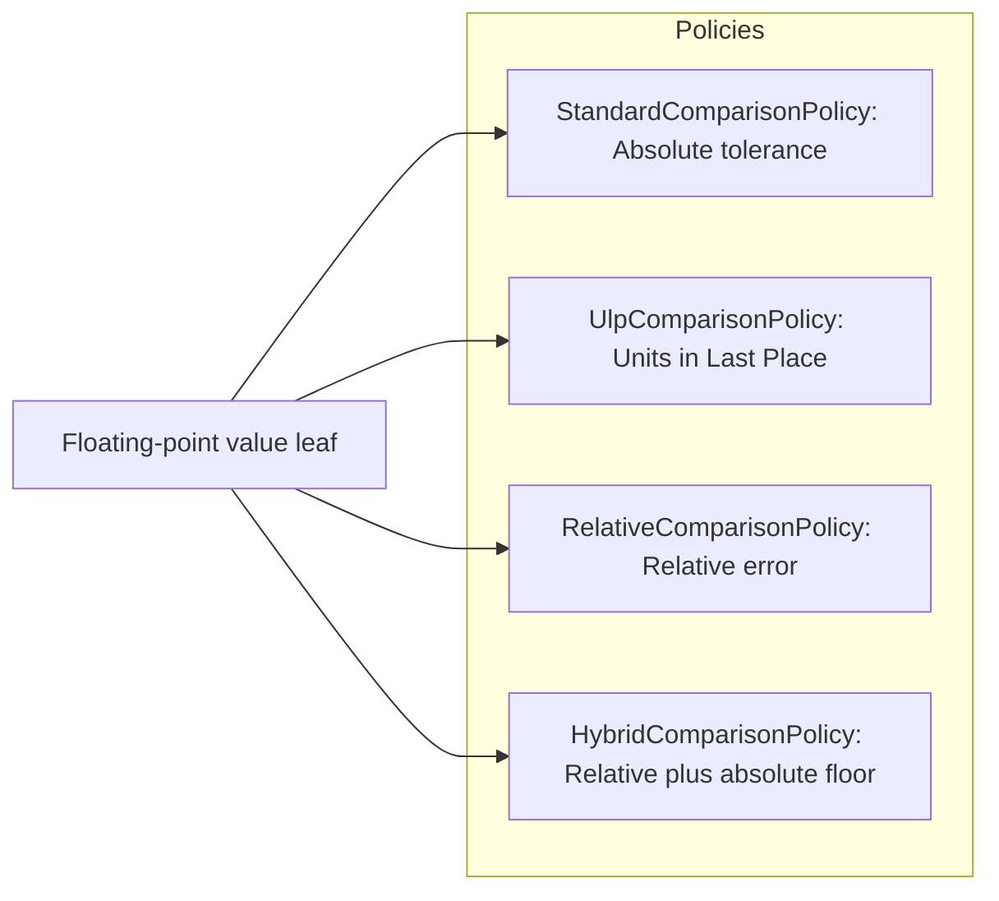
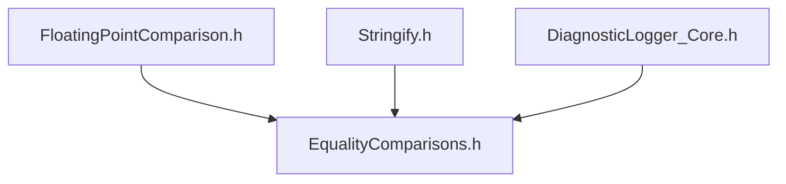

# EqualityComparisons User Manual

*Fat-P Library — December 2025*

*Document type: User Manual (teaching document, not API reference)*

## Table of Contents

1. [The Floating-Point Comparison Problem](#the-floating-point-comparison-problem)
2. [How EqualityComparisons Works](#how-equalitycomparisons-works)
3. [Getting Started](#getting-started)
4. [Comparison with Alternatives](#comparison-with-alternatives)
5. [Container Comparison in Depth](#container-comparison-in-depth)
6. [The Policy System](#the-policy-system)
7. [Floating-Point Edge Cases](#floating-point-edge-cases)
8. [Type-Erased Comparison with EqualityAny](#type-erased-comparison-with-equalityany)
9. [Benchmarking EqualityComparisons](#benchmarking-equalitycomparisons)
10. [Best Practices: When to Use EqualityComparisons](#best-practices-when-to-use-equalitycomparisons)
11. [Migration Guide](#migration-guide)
12. [Troubleshooting](#troubleshooting)
13. [API Reference](#api-reference)
14. [Summary](#summary)
15. [Appendix A: History of Numeric Tolerance](#appendix-a-history-of-numeric-tolerance)
16. [Appendix B: Design Space (Extended)](#appendix-b-design-space-extended)

---

## The Floating-Point Comparison Problem

*Note: Code snippets in this section omit includes and surrounding code for brevity. Complete, compilable examples appear in [Getting Started](#getting-started).*

### The Bug Everyone Has Written

Every programmer who works with floating-point numbers has written this bug at least once:

```cpp
double result = complex_computation();
double expected = 1.0;
if (result == expected) {
    std::cout << "Test passed!\n";
}
```

The code compiles. It runs. And it fails, even when the computation is correct, because `result` is `0.9999999999999998` instead of `1.0`. The programmer stares at the output, confused. The numbers look the same when printed. The algorithm is mathematically correct. But `operator==` disagrees, because floating-point arithmetic accumulates tiny rounding errors at every step.

This is the first lesson every numerical programmer learns: never compare floating-point numbers with `==`. Use a tolerance:

```cpp
bool close_enough = std::fabs(result - expected) < epsilon;
```

But this solution immediately creates new problems. What should `epsilon` be? A fixed value like `1e-9` works for numbers near 1.0 but fails catastrophically for numbers near `1e-20` or `1e+20`. The tolerance needs to scale with the magnitude of the values being compared.

And that's just for scalars. What about a vector of doubles? You write a loop:

```cpp
bool vectors_match(const std::vector<double>& a, const std::vector<double>& b, double eps) {
    if (a.size() != b.size()) return false;
    for (size_t i = 0; i < a.size(); ++i) {
        if (std::fabs(a[i] - b[i]) > eps) return false;
    }
    return true;
}
```

Then you need to compare a `map<string, vector<double>>`. You write another function with nested loops. Then `vector<tuple<double, double, double>>`. Another function. Then someone asks about `unordered_multiset<double>` and you realize you've been handling element multiplicity wrong this whole time.

Six months later, your codebase has fifteen comparison functions. Each has slightly different epsilon handling. None correctly handles NaN (which should never equal anything, including itself). One has a subtle bug where it returns `true` for empty containers of different types. Another doesn't handle the case where both containers are empty.

### The Composition Problem

The fundamental issue isn't that epsilon comparison is difficult. The issue is that **epsilon comparison doesn't compose**.

When you compare two doubles, you apply a tolerance. When you compare two vectors of doubles, you apply the same tolerance to each element pair. When you compare two maps of string to vector of double, you need to match keys, then compare the vector values, then apply tolerance at each floating-point value leaf. Every level of nesting requires manual traversal code. Every container type requires specialized logic.

This is not a problem that test frameworks solve. Google Test provides `EXPECT_NEAR`, but it only works on scalars. Catch2's `Approx` only works on scalars. You can use `EXPECT_TRUE` with a custom comparison function, but you still have to write that function—and write it correctly.

The standard library provides `std::equal` with a custom predicate, but the predicate receives individual elements. For nested containers, you'd need to write a recursive predicate that somehow knows when it's comparing doubles vs. comparing inner containers. This quickly becomes unmanageable.

What you actually need is a single entry point that:

- Traverses nested structures (pairs, tuples, all standard containers)
- Applies tolerance comparison at floating-point value leaves
- Uses exact comparison for non-floating-point leaves (strings, integers, associative keys)
- Handles unordered containers without relying on iteration order
- Validates multiplicity for multi-containers
- Provides optional mismatch diagnostics

That's EqualityComparisons.

---

## How EqualityComparisons Works

### Compile-Time Type Dispatch

When you call `areEqual(a, b, epsilon)`, the compiler instantiates a template that examines the type of `a` (and `b`, which must be the same type). Based on type traits, it selects one of several comparison strategies:



Each arrow that loops back to `areEqual` represents a recursive call. When comparing a `vector<pair<string, double>>`, the library recognizes `vector<...>` as iterable (not an unordered associative container), compares sizes (if unequal, returns `false`), and for each element pair, recursively calls `areEqual` on the `pair<string, double>`. For each pair, it compares `first` (a string, using `operator==`) and `second` (a double, using epsilon comparison).

All of this is determined at compile time. The generated code contains no runtime type checks for dispatch—just the nested loops and comparisons you would write by hand.

### The EqualDispatcher Template

The core of the library is the `EqualDispatcher` template, specialized for different type categories:

```cpp
template <typename T, typename Policy>
struct EqualDispatcher {
    template <typename... EpsParams>
    static bool compare(const T& a, const T& b, EpsParams... eps) {
        if constexpr (std::is_floating_point_v<T>) {
            return Policy::epsilonMatch(a, b, eps...);
        }
        else if constexpr (IsPair<T>::value) {
            // Compare first and second recursively
        }
        else if constexpr (IsTuple<T>::value) {
            // Compare each tuple element recursively
        }
        else if constexpr (IsIterable<T>::value) {
            // Compare as container (ordered or unordered)
        }
        else {
            return a == b;  // Fall back to operator==
        }
    }
};
```

The `if constexpr` branches are evaluated at compile time. Only the branch that matches the type is compiled; the others are discarded. This means there's no runtime branching for type dispatch—the compiler selects the right path and generates only that code.

### Policy-Based Tolerance

At floating-point value leaves, comparison is delegated to a policy class. The policy is a template parameter, defaulting to `StandardComparisonPolicy`:

```cpp
template <typename T, typename Policy = StandardComparisonPolicy, typename... EpsParams>
bool areEqual(const T& a, const T& b, EpsParams... eps);
```

Each policy implements an `epsilonMatch` static method that defines how tolerance comparison works:



Because the policy is a template parameter, it's resolved at compile time. There's no virtual dispatch, no function pointer indirection. Changing policies changes the generated code at each leaf, but the traversal logic remains the same.

### Handling Unordered Containers

Ordered containers (`vector`, `map`, `set`) are straightforward: compare in iteration order, element by element. Unordered containers require more care.

For `unordered_set` and `unordered_map`, the library uses key-based lookup: for each key in the first container, look it up in the second container. If found, compare the associated values (for maps) or just confirm presence (for sets). If any key is missing, the containers aren't equal.

For multi-containers (`unordered_multiset`, `unordered_multimap`), multiplicity matters. The containers `{1, 1, 2}` and `{1, 2, 2}` have the same elements but different multiplicities, so they're not equal. The library tracks which elements have been "consumed" by matches to ensure correct multiplicity validation.

**Implementation note:** When comparing **multi-maps** where a key has repeated mapped values and those values use tolerance (e.g., `std::unordered_multimap<K, double>`), the value pairing is **greedy**: each value from the first container is matched to the first unused value in the second container that compares equal under the policy. This can produce false negatives in pathological cases where a different global matching (e.g., bipartite matching) could succeed. In practice, this rarely matters, but it can show up with high multiplicities and values clustered near the tolerance boundary.

### Semantic Contract

These rules define equality for all comparison operations:

- **NaN**: Never equal to anything, including itself (IEEE 754 compliant)
- **Infinity**: Same-sign infinities are equal; `+∞ ≠ -∞`
- **Signed zero**: `+0.0` equals `-0.0`
- **Floating-point tolerance**: Applied only to floating-point **value** leaves; integers and strings use exact equality; associative keys are always exact
- **Associative identity (keys and set/multiset elements)**: Matched exactly, no tolerance. Tolerance applies only to mapped values
- **User-defined types**: If `T` is not a recognized pair, tuple, or iterable, comparison falls back to `operator==`; tolerance does not propagate into the type's members unless `operator==` itself uses `areEqual`
- **EqualityAny registration**: Unregistered `(type, policy)` pairs return `false` without throwing

---

## Getting Started

### Prerequisites and Integration

EqualityComparisons requires C++17 or later. It's header-only and depends only on the standard library plus three Fat-P headers (all are required; `EqualityComparisons.h` includes them directly):



Copy these headers to your project, ensure your compiler is in C++17 mode, and you're ready to go. There are no libraries to link, no build system integration required.

### Your First Comparison

The most common use case is comparing two values of the same type:

```cpp
#include "EqualityComparisons.h"
#include <vector>
#include <map>
#include <string>
#include <iostream>

int main() {
    using fat_p::areEqual;
    
    // Scalar comparison with explicit tolerance
    double a = 1.0;
    double b = 1.0 + 1e-10;
    
    bool match = areEqual(a, b, 1e-9);  // true: difference is within 1e-9
    
    // Vector comparison
    std::vector<double> v1 = {1.0, 2.0, 3.0};
    std::vector<double> v2 = {1.0 + 1e-10, 2.0, 3.0 - 1e-10};
    
    match = areEqual(v1, v2, 1e-9);  // true: each element within 1e-9
    
    // Nested structure
    std::map<std::string, std::vector<double>> data1 = {
        {"sensor_a", {1.0, 2.0}},
        {"sensor_b", {3.0, 4.0}}
    };
    std::map<std::string, std::vector<double>> data2 = {
        {"sensor_a", {1.0 + 1e-10, 2.0}},
        {"sensor_b", {3.0, 4.0 - 1e-10}}
    };
    
    match = areEqual(data1, data2, 1e-9);  // true: tolerance propagates to every double
    
    std::cout << "All comparisons passed: " << match << '\n';
    return 0;
}
```

In the last example, the library automatically traverses the map, compares string keys exactly, descends into each vector, and applies the specified tolerance to each double. No manual traversal code required.

### Specifying Tolerance

The default tolerance is `100 × std::numeric_limits<T>::epsilon()`—roughly `2.2e-14` for doubles and `1.2e-5` for floats. This default handles typical accumulated rounding errors from a chain of arithmetic operations. For differences introduced by external sources (sensor noise, numerical algorithms with known error bounds), specify an explicit tolerance:

To specify a custom tolerance, pass it as an additional argument:

```cpp
areEqual(a, b);          // Default tolerance (~2.2e-14 for double)
areEqual(a, b, 1e-9);    // Custom tolerance: 1e-9
areEqual(a, b, 1e-6);    // Looser tolerance: 1e-6
areEqual(a, b, 0.0);     // Exact match only (no tolerance)
```

The tolerance propagates through the entire structure. When you write `areEqual(data1, data2, 1e-9)`, every floating-point value leaf uses `1e-9` as the tolerance, no matter how deeply nested (associative keys are always matched exactly).

---

## Comparison with Alternatives

Before choosing EqualityComparisons, consider how it compares to other approaches for floating-point comparison:

| Approach | Nested Structures | Tolerance Semantics | Production Use | Diagnostics |
|----------|-------------------|---------------------|----------------|-------------|
| `operator==` / `std::equal` | Manual traversal required | Exact only | Yes | None |
| Test framework macros (`EXPECT_NEAR`, `Approx`) | Scalars only | Absolute | Test-time only | Test failure messages |
| Math library comparisons (Eigen, Armadillo) | Library types only | Library-specific | Yes | Varies |
| Hand-written traversal functions | Per-type functions | Per-function | Yes | Per-function |
| **EqualityComparisons** | Automatic recursion | Policy-selectable | Yes | Mismatch logging |

### Where EqualityComparisons Fits

EqualityComparisons occupies a specific niche: recursive traversal with policy-based tolerance for standard containers and types, usable in both tests and production. 

It doesn't replace `operator==` for exact comparison—if you don't need tolerance, don't use EqualityComparisons. It doesn't compete with math libraries for domain-specific types like `Eigen::Matrix`—those libraries know their types better. And it doesn't provide the rich assertion output of test frameworks—use `EXPECT_TRUE(areEqual(...))` to get the best of both.

What it eliminates is the need for hand-written traversal functions. If your codebase has accumulated comparison functions like `compareVectorOfMaps()` and `compareNestedConfig()`, each with slightly different epsilon handling and edge-case bugs, EqualityComparisons replaces all of them with one generic, tested implementation.

### What You Give Up

No solution is free. With EqualityComparisons, you give up:

**Per-element tolerance customization.** The library applies uniform tolerance to all floating-point value leaves. If your `Config` struct has a `highPrecisionField` that needs `1e-15` tolerance and a `noisyMeasurement` that needs `1e-3`, you need custom code.

**Approximate key matching.** Associative container keys (ordered and unordered) are matched exactly. EqualityComparisons will not treat `1.0` and `1.0 + 1e-10` as "the same key," because that breaks ordering and hash invariants.

**Structured diff output.** The library returns `bool`. It can log where the first mismatch occurred, but it doesn't produce a structured diff showing all differences with their magnitudes.

**Maximum throughput on flat vectors.** A hand-written loop over `vector<double>` can be tighter and may auto-vectorize better. The library's generic dispatch adds overhead—typically small, but measurable in tight loops.

If these limitations matter for your use case, EqualityComparisons may not be the right choice. See the appendix for extended discussion of the design space.

---

## Container Comparison in Depth

### Sequences: vector, array, deque, list, forward_list

Sequential containers are compared element-by-element in iteration order. The algorithm first checks sizes (if the container supports `size()`); if sizes differ, the containers aren't equal. Then it iterates through both containers in lockstep, comparing corresponding elements.

```cpp
std::vector<double> v1 = {1.0, 2.0, 3.0};
std::vector<double> v2 = {1.0, 2.0, 3.0};
std::vector<double> v3 = {1.0, 2.0, 4.0};
std::vector<double> v4 = {1.0, 2.0};

areEqual(v1, v2);  // true: identical
areEqual(v1, v3);  // false: third element differs
areEqual(v1, v4);  // false: different sizes
```

For containers without `size()` (like `std::forward_list`), the library determines size mismatch by iterator exhaustion—if one iterator reaches the end before the other, the containers have different sizes.

The element type can be anything the library knows how to compare: scalars, pairs, tuples, or nested containers. For non-floating-point elements, the library uses `operator==`.

### Ordered Associative Containers: map, set, multimap, multiset

Ordered associative containers are compared in iteration order, like sequences. For maps and multimaps, both keys and values must match. For sets and multisets, only elements must match.

```cpp
std::map<std::string, double> m1 = {{"a", 1.0}, {"b", 2.0}};
std::map<std::string, double> m2 = {{"a", 1.0 + 1e-10}, {"b", 2.0}};
std::map<std::string, double> m3 = {{"a", 1.0}, {"c", 2.0}};

areEqual(m1, m2, 1e-9);  // true: keys match exactly, values within tolerance
areEqual(m1, m3);        // false: different keys
```

For multisets and multimaps, iteration order includes duplicates. The containers `{1, 1, 2}` and `{1, 2, 2}` have the same elements in different multiplicities, and they iterate in different orders, so they compare as unequal.

**Key note:** For associative containers, the key/element identity is exact. For `set`/`multiset`, the element *is* the key, so tolerance does not apply. For `map`/`multimap`, keys are exact and tolerance applies only to mapped values.

### Unordered Associative Containers: unordered_map, unordered_set

Unordered containers have no defined iteration order. The library compares them by key lookup: for each element in the first container, it looks up the corresponding key in the second container.

```cpp
std::unordered_set<int> s1 = {1, 2, 3};
std::unordered_set<int> s2 = {3, 1, 2};  // Same elements, different order

areEqual(s1, s2);  // true: same elements regardless of iteration order
```

For unordered maps, the library first compares sizes, then for each key-value pair in the first map, looks up the key in the second map and compares values.

### Unordered Multi-Containers: unordered_multiset, unordered_multimap

Multi-containers can have duplicate keys. The library must validate that multiplicities match—`{1, 1, 2}` and `{1, 2, 2}` are different even though they contain the same values.

For `unordered_multiset<T>`, multiplicity validation is exact: every element occurrence must be matched 1:1 under the container's `key_equal` semantics (no tolerance, since elements are keys).

```cpp
std::unordered_multiset<int> ums1 = {1, 1, 2, 3};
std::unordered_multiset<int> ums2 = {3, 1, 2, 1};

areEqual(ums1, ums2);  // true: same elements with same multiplicities (exact match)
```

For `unordered_multimap<K, V>`, the library matches keys exactly, then compares the multiset of mapped values for each key (respecting multiplicity). When the mapped type is floating-point and a tolerance policy is used, value pairing is **greedy**: each value from the first container matches the first unused tolerant-equal value in the second container. This can produce false negatives in pathological cases where a different global matching (e.g., bipartite matching) could succeed, but works correctly for typical data.

### Key Semantics in Associative Containers

This "keys are exact" rule applies to both ordered and unordered associative containers. Keys are matched using exact equality (for ordered containers) or the container's `key_equal` (for unordered containers), not with epsilon tolerance. Epsilon applies only to **mapped values**, not keys.

```cpp
std::unordered_map<double, int> m1 = {{1.0, 100}};
std::unordered_map<double, int> m2 = {{1.0 + 1e-10, 100}};

areEqual(m1, m2);  // false! Keys don't match (no approximate key lookup)
```

This is by design. Approximate key lookup would require a fundamentally different data structure—associative containers rely on ordering or hash functions that must be consistent. If you need approximate key matching, consider using string or integer keys, or a different container type.

### Pairs and Tuples

`std::pair` and `std::tuple` are compared element-by-element, recursively:

```cpp
std::pair<std::string, double> p1 = {"key", 1.0};
std::pair<std::string, double> p2 = {"key", 1.0 + 1e-10};

areEqual(p1, p2, 1e-9);  // true: string matches exactly, double within tolerance

std::tuple<int, double, std::string> t1 = {42, 3.14, "hello"};
std::tuple<int, double, std::string> t2 = {42, 3.14 + 1e-10, "hello"};

areEqual(t1, t2, 1e-9);  // true: int exact, double within tolerance, string exact
```

Mixed-type tuples work correctly. Integer and string elements use `operator==`, floating-point elements use epsilon comparison. The library figures out which is which at compile time.

---

## The Policy System

### Why Multiple Policies?

Different problem domains have different tolerance requirements. Scientific computing often uses relative tolerance to handle multi-scale data. Numerical analysis uses ULP comparison to verify algorithm correctness. Financial applications might need exact comparison for some values and tolerance for others.

Rather than hardcode one tolerance strategy, EqualityComparisons uses a policy-based design. The policy is a template parameter that defines how floating-point comparison works at the leaves. The traversal logic is independent of the policy—you can swap policies without changing how containers are traversed.

### StandardComparisonPolicy (Default)

The standard policy uses absolute tolerance:

```
|a - b| <= epsilon
```

Special handling ensures correct IEEE 754 edge-case behavior: NaN is never equal to anything (including itself), same-sign infinities are equal, and signed zeros (`+0.0` and `-0.0`) are equal.

```cpp
areEqual(a, b);           // Uses StandardComparisonPolicy
areEqual(a, b, 1e-9);     // Explicit epsilon, still StandardComparisonPolicy
```

This is the right choice for most applications. It uses a single tolerance parameter, produces deterministic results, and handles the common cases correctly.

### UlpComparisonPolicy

ULP (Units in Last Place) comparison counts the number of representable floating-point values between two numbers. If two values are within N ULPs, they are separated by at most N representable values in the floating-point number line.

```cpp
areEqual<double, UlpComparisonPolicy>(a, b, 4);  // Within 4 ULPs
```

The parameter for ULP comparison is the maximum allowed ULP difference. A difference of 4 ULPs means the values are within 4 representable floating-point values of each other.

ULP comparison is often used for algorithm verification because it measures error in terms of representable precision. However, ULP distance does not map directly to the number of arithmetic operations—the relationship depends on the specific computation. ULP comparison also behaves unexpectedly near zero, where the spacing between representable values is extremely fine. Use `HybridComparisonPolicy` if your data includes values near zero.

### RelativeComparisonPolicy

Relative comparison uses a tolerance that scales with magnitude:

```
|a - b| <= epsilon * max(|a|, |b|)
```

This is scale-independent: comparing `1e10` and `1e10 + 1e4` uses the same relative tolerance as comparing `1e-10` and `1e-10 + 1e-16`.

```cpp
areEqual<double, RelativeComparisonPolicy>(a, b, 1e-6);  // 0.0001% relative error
```

Relative comparison fails near zero. The relative error between `1e-100` and `0` is infinite (or undefined), even though both values are effectively zero for most purposes. Use `HybridComparisonPolicy` for data that includes values near zero.

### HybridComparisonPolicy

The hybrid policy combines relative and absolute tolerance:

```
|a - b| <= relativeEps * max(|a|, |b|) + absoluteEps
```

The relative term handles scale-independence for large values. The absolute term provides a floor for values near zero.

```cpp
areEqual<double, HybridComparisonPolicy>(a, b, 1e-6, 1e-12);
// 1e-6 relative tolerance, 1e-12 absolute floor
```

This is often the best choice for production validation where data spans many orders of magnitude. The two parameters require tuning, but the policy is robust across a wide range of values.

### Choosing a Policy

The following table summarizes when to use each policy:

| Scenario | Recommended Policy | Rationale |
|----------|-------------------|-----------|
| General-purpose comparison | `StandardComparisonPolicy` | Single parameter, deterministic, handles common cases |
| Algorithm verification | `UlpComparisonPolicy` | Bounds error in representable steps (ULPs) |
| Multi-scale data (no zeros) | `RelativeComparisonPolicy` | Scale-independent |
| Multi-scale data (with zeros) | `HybridComparisonPolicy` | Robust across all magnitudes |
| Exact comparison | `StandardComparisonPolicy` with epsilon=0 | Exact numeric equality with IEEE semantics |

If you're unsure, start with `StandardComparisonPolicy` (the default). Move to `HybridComparisonPolicy` if you encounter issues with multi-scale data or values near zero.

---

## Floating-Point Edge Cases

### NaN: Not a Number

IEEE 754 specifies that NaN is not equal to anything, including itself. EqualityComparisons preserves this semantics:

```cpp
double nan = std::numeric_limits<double>::quiet_NaN();

areEqual(nan, nan);  // false (correct per IEEE 754)
areEqual(nan, 1.0);  // false
areEqual(1.0, nan);  // false
```

This applies recursively. A vector containing NaN is never equal to any vector, even one with NaN at the same position:

```cpp
std::vector<double> v1 = {1.0, nan, 3.0};
std::vector<double> v2 = {1.0, nan, 3.0};

areEqual(v1, v2);  // false (NaN != NaN at index 1)
```

If you need NaN to equal NaN, you'll need a custom comparator. This is an unusual requirement—NaN typically represents "something went wrong" and shouldn't be compared for equality.

### Infinity

Same-sign infinities are equal; opposite-sign infinities are not:

```cpp
double inf = std::numeric_limits<double>::infinity();

areEqual(inf, inf);    // true (both +∞)
areEqual(-inf, -inf);  // true (both -∞)
areEqual(inf, -inf);   // false (different signs)
areEqual(inf, 1e308);  // false (infinity vs. finite)
```

This matches mathematical intuition and IEEE 754 semantics.

### Signed Zero

IEEE 754 distinguishes between `+0.0` and `-0.0`, but they compare equal:

```cpp
areEqual(0.0, -0.0);   // true
areEqual(-0.0, 0.0);   // true
```

The sign of zero is usually an artifact of how a result was computed, not a meaningful distinction. EqualityComparisons treats signed zeros as equal.

### Denormals (Subnormals)

Denormalized numbers are very small values near zero that sacrifice precision for range. EqualityComparisons compares them normally, but be aware that some platforms flush denormals to zero (FTZ/DAZ modes). If your platform uses these modes, comparisons involving denormals may behave unexpectedly.

### Default Tolerance Values

The default tolerance is `100 × std::numeric_limits<T>::epsilon()`:

| Type | Machine Epsilon | Default Tolerance |
|------|-----------------|-------------------|
| `float` | ~1.19e-7 | ~1.19e-5 |
| `double` | ~2.22e-16 | ~2.22e-14 |
| `long double` | platform-dependent | platform-dependent |

This is deliberately loose enough to absorb accumulated rounding errors from typical computations while tight enough to catch real differences. Override it when you need tighter or looser tolerance.

---

## Type-Erased Comparison with EqualityAny

### When Type Information Is Lost

Most code knows its types at compile time. But some architectures erase types at runtime:

```cpp
// Plugin systems
std::any result = plugin->compute(input);

// Heterogeneous configuration
std::map<std::string, std::any> config;

// Serialization round-trips
std::any deserialized = deserialize(bytes);
```

In these cases, you can't call `areEqual<SpecificType>(...)` because you don't know `SpecificType` at the call site. You need a way to compare `std::any` values with tolerance.

### The EqualityAny Solution

`EqualityAny.h` extends the comparison system to handle `std::any`:

```cpp
#include "EqualityAny.h"

std::any a = std::vector<double>{1.0, 2.0, 3.0};
std::any b = std::vector<double>{1.0 + 1e-10, 2.0, 3.0};

bool match = areEqual(a, b, 1e-9);  // true: epsilon propagates into the vector
```

Under the hood, EqualityAny maintains a **type registry** that maps runtime type information to comparison functions. When comparing two `std::any` objects, it checks if both are empty (equal) or one is empty (not equal), compares `type()` information (different types are never equal), looks up the `(type, policy)` pair in the registry, and dispatches to the registered comparator with epsilon propagation.

### Pre-Registered Types

Common types are pre-registered by the library. Registration occurs on first use via lazy initialization. This table shows a representative subset:

| Category | Types |
|----------|-------|
| Primitives | `int`, `double`, `float`, `bool`, `std::string` |
| Containers | `vector<int>`, `vector<double>`, `vector<float>`, `deque<double>` |
| Structural | `pair<double, double>`, `pair<int, double>`, common tuple types |

See `ensureAnyEqualityRegistered()` in `EqualityAny.h` for the authoritative list of pre-registered types.

All four policies are registered for most types. One exception: `long double` does not support `UlpComparisonPolicy` due to platform-dependent representation. Use `StandardComparisonPolicy` or `HybridComparisonPolicy` for `long double` in type-erased contexts.

### Registering Custom Types

If your type isn't pre-registered, register it during program initialization, before any comparisons:

```cpp
struct MyData {
    double x, y, z;
    
    bool operator==(const MyData& other) const {
        return fat_p::areEqual(x, other.x) &&
               fat_p::areEqual(y, other.y) &&
               fat_p::areEqual(z, other.z);
    }
};

// At startup:
fat_p::registerAnyType<MyData, fat_p::StandardComparisonPolicy>();
fat_p::registerAnyType<MyData, fat_p::HybridComparisonPolicy>();
// ... other policies as needed
```

Registration should happen during program initialization, before any comparisons.

### Nested std::any

`std::any` containing `std::any` is handled via recursive unwrapping:

```cpp
std::any outer;
outer.emplace<std::any>(42);

std::any outer2;
outer2.emplace<std::any>(42);

areEqual(outer, outer2);  // true: unwraps and compares inner values
```

A depth limit (default 10) prevents stack overflow on pathological input.

### Limitations

EqualityAny adds runtime overhead that typed comparison avoids: registry lookup, function pointer invocation, and type checking. For performance-critical code, use typed comparison when possible.

Unregistered `(type, policy)` pairs return `false` without throwing. This is silent failure by design—it prevents crashes but can mask missing registrations. Ensure all types you compare are registered.

---

## Benchmarking EqualityComparisons

### Methodology

When benchmarking, report:

- Compiler and version, optimization flags
- CPU model and frequency/turbo behavior
- OS and standard library implementation
- Dataset size and value distribution
- Whether comparisons are equal (worst case: full traversal) or mismatch early (best case: short-circuit)

Use the Fat-P benchmark harness with median of 1000+ iterations after warmup. Compare equal vectors to measure worst-case traversal cost.

### Results

**Environment:** [COMPILER], [FLAGS], [CPU], [OS]

**Dataset:** 10,000 `double` elements, vectors are equal (worst case)

| Operation | Time (µs) | Relative | Notes |
|-----------|-----------|----------|-------|
| `areEqual` with default epsilon | XX | 1.00× | Baseline |
| `areEqual` with explicit epsilon | XX | XX× | Same traversal, explicit parameter |
| Hand-written epsilon loop | XX | XX× | Minimal loop, no generic dispatch |
| `std::equal` (exact) | XX | XX× | No tolerance arithmetic |
| `EqualityAny` (type-erased) | XX | XX× | Registry lookup + indirect call |

*Relative column is normalized to `areEqual` with default epsilon (1.00×). Lower is better.*

### Performance Characteristics

**Tolerance comparison performs more work than exact equality.** Every floating-point value leaf requires `fabs(a - b)` and a tolerance check. Exact comparison (`operator==`) requires only exact numeric equality. This gap is fundamental and cannot be eliminated by any library.

**Generic dispatch adds overhead compared to hand-written loops.** Template instantiation and type-trait traversal produce slightly larger code than a minimal hand-written loop. For flat `vector<double>`, a specialized loop may also auto-vectorize better.

**Type-erased comparison (EqualityAny) adds lookup and indirection overhead.** Registry lookup and function pointer dispatch are slower than compile-time dispatch. Use typed `areEqual` when types are known.

**Profile before optimizing.** In most applications, comparison overhead is negligible compared to the computations that produce the values being compared. Measure on your target platform before assuming performance is a problem.

### Where EqualityComparisons Wins

The library excels in scenarios where correctness and maintainability matter more than throughput.

**Nested structures** require complex traversal code that's tedious to write and error-prone. EqualityComparisons generates correct traversal automatically. A 20% overhead on a millisecond operation is irrelevant when the alternative is spending hours debugging incorrect hand-written code.

**Multiplicity validation** for unordered multi-containers is subtle. Most hand-written comparisons get it wrong on first attempt. The library handles it correctly.

**Edge cases** (NaN, infinity, empty containers, size mismatches) are often overlooked in hand-written code. The library handles them systematically.

### Where EqualityComparisons Loses

In tight inner loops over flat `vector<double>` where every nanosecond matters, a hand-written loop avoids template instantiation overhead and may auto-vectorize better. If profiling shows `areEqual` is a bottleneck, consider hand-writing that specific comparison.

For exact comparison (no epsilon), `std::equal` or `operator==` avoids the `fabs` and tolerance arithmetic. Don't use EqualityComparisons when you don't need tolerance.

---

## Best Practices: When to Use EqualityComparisons

### Use EqualityComparisons When

**Comparing nested structures containing floating-point data.** This is the core use case. If you have `vector<map<string, vector<double>>>` or similar, one `areEqual` call replaces dozens of lines of hand-written traversal.

**You need consistent tolerance semantics across your codebase.** The default tolerance (100 × machine epsilon) and policy system ensure all comparisons use the same rules, eliminating per-function tolerance drift.

**Production code requires the same comparison logic as tests.** Unlike test framework macros, `areEqual` works anywhere—unit tests, integration tests, runtime validation, checkpoint comparison.

**Correctness matters more than micro-optimization.** The library handles edge cases (NaN, infinity, empty containers, multiset multiplicity) that hand-written code often misses.

**You want mismatch diagnostics.** When enabled, the diagnostic logger reports where comparisons fail—useful for debugging without stepping through traversal code.

### Avoid EqualityComparisons When

**You don't need tolerance.** For integer, string, or exact comparison, use `operator==` or `std::equal`. Adding epsilon overhead for exact comparison is wasteful.

**You need per-element tolerance variation.** The library applies uniform tolerance to all floating-point value leaves. If different fields need different tolerances, write custom code.

**You need approximate key matching in associative containers.** Keys are matched exactly; tolerance applies only to mapped values.

**You need structured difference reports.** The library returns `bool` and can log mismatch locations, but doesn't produce detailed diff output showing all differences with magnitudes.

**Inner-loop performance is critical.** For tight loops over flat `vector<double>` where every cycle counts, a hand-written loop avoids generic dispatch overhead. Profile first—the overhead is often negligible.

## Migration Guide

### From Hand-Written Comparison Functions

If your codebase has accumulated hand-written comparison functions like this:

```cpp
bool compareData(const std::map<std::string, std::vector<double>>& a,
                 const std::map<std::string, std::vector<double>>& b,
                 double eps) {
    if (a.size() != b.size()) return false;
    for (const auto& [key, vec_a] : a) {
        auto it = b.find(key);
        if (it == b.end()) return false;
        const auto& vec_b = it->second;
        if (vec_a.size() != vec_b.size()) return false;
        for (size_t i = 0; i < vec_a.size(); ++i) {
            if (std::fabs(vec_a[i] - vec_b[i]) > eps) return false;
        }
    }
    return true;
}
```

Replace them with:

```cpp
#include "EqualityComparisons.h"

// The entire function body becomes:
bool match = fat_p::areEqual(a, b, eps);
```

Delete the hand-written function. You don't need it anymore.

### From Test Framework Macros

Test frameworks provide scalar comparison that you've been using with loops:

```cpp
// Before: loop with EXPECT_NEAR
for (size_t i = 0; i < result.size(); ++i) {
    EXPECT_NEAR(result[i], expected[i], 1e-9);
}
```

Replace with:

```cpp
// After: single assertion
EXPECT_TRUE(fat_p::areEqual(result, expected, 1e-9)) 
    << "Result differs from expected";
```

The same pattern works with any test framework. Here are examples for the most common frameworks:

**Google Test:**

```cpp
#include <gtest/gtest.h>
#include "EqualityComparisons.h"

TEST(MyTest, VectorsMatch) {
    std::vector<double> result = compute();
    std::vector<double> expected = {1.0, 2.0, 3.0};
    
    EXPECT_TRUE(fat_p::areEqual(result, expected, 1e-9))
        << "Result differs from expected";
}
```

**Catch2:**

```cpp
#include <catch2/catch.hpp>
#include "EqualityComparisons.h"

TEST_CASE("Vectors match within tolerance") {
    std::vector<double> result = compute();
    std::vector<double> expected = {1.0, 2.0, 3.0};
    
    REQUIRE(fat_p::areEqual(result, expected, 1e-9));
}
```

**Boost.Test:**

```cpp
#define BOOST_TEST_MODULE MyTest
#include <boost/test/unit_test.hpp>
#include "EqualityComparisons.h"

BOOST_AUTO_TEST_CASE(vectors_match) {
    std::vector<double> result = compute();
    std::vector<double> expected = {1.0, 2.0, 3.0};
    
    BOOST_CHECK(fat_p::areEqual(result, expected, 1e-9));
}
```

**Fat-P Test Harness:**

```cpp
#include "FatPTest.h"
#include "EqualityComparisons.h"

TEST_CASE(vectors_match) {
    std::vector<double> result = compute();
    std::vector<double> expected = {1.0, 2.0, 3.0};
    
    ASSERT_TRUE(fat_p::areEqual(result, expected, 1e-9), 
                "Result differs from expected");
    return true;
}
```

### Semantic Differences to Note

When migrating, be aware of these semantic differences between typical hand-written code and EqualityComparisons:

| Aspect | Typical Hand-Written | EqualityComparisons |
|--------|---------------------|---------------------|
| Empty containers | Often buggy | Both-empty equals true; empty vs non-empty equals false |
| NaN handling | Often missing | IEEE 754 compliant: NaN never equals anything |
| Infinity handling | Often missing | Same-sign infinities equal |
| Signed zero | Often ignored | +0.0 equals -0.0 |
| Multiset multiplicity | Often wrong | Correctly validated |
| Default tolerance | Arbitrary per-function | Consistent: 100 × machine epsilon |

---

## Troubleshooting

### Compilation Errors

**"no matching function for call to 'areEqual'"**

The types of the two arguments don't match, or the type isn't supported. Common causes:

```cpp
// Different types:
std::vector<float> vf;
std::vector<double> vd;
areEqual(vf, vd);  // Error: different element types

// Unsupported type without operator==:
struct NoEquals { int x; };
areEqual(NoEquals{1}, NoEquals{1});  // Error: no operator==
```

Solution: ensure both arguments have the same type, and the type is either iterable, a pair/tuple, arithmetic, or has `operator==`.

**Specifying a non-default policy has no effect on non-floating-point types**

Using a different policy with containers of non-floating types compiles but has no effect—policy parameters apply only at floating-point value leaves:

```cpp
// This compiles but the policy has no effect on int comparison
fat_p::areEqual<std::vector<int>, fat_p::UlpComparisonPolicy>(v1, v2, 4);
```

Solution: only specify policies when comparing structures that contain floating-point values.

### Unexpected Results

**Comparison returns `false` when values look equal**

Several possible causes:

1. **NaN in the data**: Check with `std::isnan()`. NaN never equals anything, including itself.

2. **Tolerance too tight**: The actual difference exceeds your epsilon. Print the values with full precision to see the actual difference (requires `<iomanip>`):
   ```cpp
   std::cout << std::setprecision(17) << a << " vs " << b << '\n';
   ```

3. **Type mismatch in containers**: If a container's element type doesn't match expectations, comparison may fail unexpectedly.

**Comparison returns `true` when values look different**

Your tolerance is too loose:

```cpp
areEqual(1.0, 2.0, 10.0);  // true! Epsilon of 10.0 is huge
```

Review your epsilon value. The default (~2.2e-14 for double) is quite tight; explicit values should also be tight unless you have a specific reason for loose tolerance.

**Unordered container comparison seems wrong**

Remember that keys use exact matching, not epsilon tolerance:

```cpp
std::unordered_map<double, int> m1 = {{1.0, 100}};
std::unordered_map<double, int> m2 = {{1.0 + 1e-10, 100}};
areEqual(m1, m2);  // false: keys don't match exactly
```

If you need approximate key matching, use a different key type (string, integer) or a custom container.

### Performance Issues

**Comparison is slower than expected**

Possible causes:

1. **Comparing in a tight loop**: Cache results where possible.

2. **Using EqualityAny when types are known**: Use typed `areEqual` for better performance.

3. **Debug build**: Ensure you're benchmarking release builds with optimizations.

**Comparison completes quickly on large data**

Short-circuit evaluation: comparison stops at the first mismatch. If your data differs early, comparison returns quickly without traversing the entire structure.

---

## API Reference

### Primary Function

```cpp
template <typename T, typename Policy = StandardComparisonPolicy, typename... EpsParams>
bool areEqual(const T& a, const T& b, EpsParams... eps);
```

Compares two values of the same type with floating-point tolerance. Returns `true` if equal within tolerance.

| Parameter | Description |
|-----------|-------------|
| `T` | Type to compare (deduced from arguments) |
| `Policy` | Comparison policy for floating-point values (default: `StandardComparisonPolicy`) |
| `a`, `b` | Values to compare (must be same type) |
| `eps...` | Tolerance parameters (policy-dependent; optional with defaults) |

### Policies

| Policy | Parameters | Comparison Logic |
|--------|------------|------------------|
| `StandardComparisonPolicy` | `(epsilon)` or none | `|a - b| <= epsilon` |
| `UlpComparisonPolicy` | `(maxUlps)` | ULP difference <= maxUlps |
| `RelativeComparisonPolicy` | `(relativeEps)` | `|a - b| <= relativeEps * max(|a|, |b|)` |
| `HybridComparisonPolicy` | `(relativeEps, absoluteEps)` | `|a - b| <= relativeEps * max(|a|, |b|) + absoluteEps` |

### Default Tolerances

When no epsilon is specified, the default is `100 * std::numeric_limits<T>::epsilon()`:

| Type | Default Epsilon |
|------|-----------------|
| `float` | ~1.19e-5 |
| `double` | ~2.22e-14 |
| `long double` | platform-dependent (consult `std::numeric_limits<long double>::epsilon()`) |

### EqualityAny Functions

```cpp
// Type-erased comparison
template <typename Policy = StandardComparisonPolicy, typename... EpsParams>
bool areEqual(const std::any& a, const std::any& b, EpsParams... eps);

// Type registration
template <typename T, typename Policy = StandardComparisonPolicy>
void registerAnyType();
```

---

## Summary

EqualityComparisons solves the composition problem for floating-point tolerance comparison. Instead of writing separate comparison functions for each nested type in your codebase, you write one call:

```cpp
bool match = areEqual(expected, actual, epsilon);
```

The library handles arbitrary nesting, all standard container types, correct edge-case handling, and policy-based tolerance semantics. It works in tests and production alike, with no external dependencies.

When you need type-erased comparison for `std::any` values, EqualityAny extends the same capabilities through a runtime type registry.

The library doesn't replace hand-written code in every scenario. For exact comparison, use `operator==`. For performance-critical inner loops, consider specialized code. For custom per-element tolerance, write custom logic. But for the common case—comparing nested structures with uniform tolerance—EqualityComparisons eliminates boilerplate and bugs.

---

*EqualityComparisons.h — Fat-P Library*

## Appendix A: History of Numeric Tolerance

### The Dawn of Numerical Analysis

The problem of comparing computed results to expected values is as old as numerical computing itself. In the 1940s, when John von Neumann and colleagues were developing the first electronic computers, they quickly discovered that floating-point arithmetic didn't behave like the real numbers they'd learned in mathematics.

Early numerical analysts developed rules of thumb: never trust the last few digits of a computation, always check results against known solutions, be suspicious of subtracting nearly-equal quantities. These rules were passed down through generations of scientists and engineers, often as oral tradition rather than formal methodology.

### The IEEE 754 Revolution

In 1985, the IEEE 754 standard brought order to floating-point chaos. Before IEEE 754, every computer vendor implemented floating-point arithmetic differently. The same program could produce different results on different machines. Debugging was a nightmare.

IEEE 754 specified exactly how floating-point numbers should be represented (sign, exponent, mantissa) and exactly how operations should round their results. It also specified special values: positive and negative infinity, signed zeros, and the infamous NaN (Not a Number).

NaN has a peculiar property that surprises many programmers: it's not equal to anything, including itself. `NaN == NaN` returns `false`. This isn't a bug; it's the IEEE 754 specification. NaN represents an undefined or unrepresentable value—the result of `0.0/0.0` or `sqrt(-1.0)`. Comparing undefined values for equality is meaningless, so the standard defined NaN as unequal to everything.

This has implications for tolerance comparison. A naive implementation might compute `fabs(a - b)` and compare it to epsilon. But if either `a` or `b` is NaN, `a - b` is NaN, `fabs(NaN)` is NaN, and `NaN <= epsilon` is `false`. The comparison correctly returns "not equal"—but only by accident, not by design.

### Tolerance Strategies

Over the decades, practitioners developed several tolerance strategies, each suited to different problems.

**Absolute tolerance** is the most direct strategy: two values are equal if their difference is below a fixed threshold. This works well when all values are roughly the same magnitude, but fails when values span multiple orders of magnitude. An absolute tolerance of `1e-9` is too loose for comparing values near `1e-15` and too tight for values near `1e+6`.

**Relative tolerance** scales with the magnitude of the values: two values are equal if their difference is below some fraction of their magnitudes. This handles varying scales but fails near zero—the relative error between `1e-100` and `0` is infinite, even though both are effectively zero for most purposes.

**ULP comparison** (Units in Last Place) counts the number of representable floating-point values between two numbers. This measures error in terms of representable steps between values. It's often used for algorithm verification, but it doesn't map cleanly to the number of arithmetic operations. ULP comparison also behaves unexpectedly near zero, where the spacing between representable values is extremely fine.

**Hybrid tolerance** combines relative and absolute: `|a - b| <= relativeEps * max(|a|, |b|) + absoluteEps`. This handles both the scale-independence of relative tolerance and the near-zero behavior of absolute tolerance. It's the most robust general-purpose strategy, though it requires two tuning parameters instead of one.

EqualityComparisons supports all four strategies through a compile-time policy system, letting you choose the right tolerance semantics for your problem.

---

## Appendix B: Design Space (Extended)

### What Existing Solutions Provide

Before examining EqualityComparisons' design, it's worth understanding what existing solutions offer and where they fall short.

**Test frameworks** (Google Test, Catch2, Boost.Test) provide scalar tolerance comparison. `EXPECT_NEAR(a, b, tolerance)` compares two floating-point values. But test frameworks are designed for testing, not production validation. Their macros often don't compile outside test contexts. And none of them handle containers—if you want to compare two vectors within tolerance, you write a loop.

**Standard library algorithms** provide `std::equal` with a custom predicate. This works for flat containers but doesn't recurse into nested structures. Comparing a `vector<vector<double>>` requires a nested predicate that's awkward to write and maintain.

**Math libraries** (Eigen, Armadillo, Blaze) provide tolerance comparison for their own matrix and vector types. But these are domain-specific. They don't help with `std::map<std::string, std::vector<double>>` or `std::tuple<int, double, std::string>`.

**Hand-written comparison functions** are what most projects end up with. Each nested type gets its own function. Over time, the codebase accumulates dozens of these functions, each with slightly different semantics, each a potential source of bugs.

### The EqualityComparisons Approach

EqualityComparisons takes a different approach: generic, recursive, compile-time dispatch. Instead of writing a comparison function for each type, you write one call:

```cpp
bool match = areEqual(expected, actual, epsilon);
```

The library determines at compile time what `expected` and `actual` are—scalars, pairs, tuples, sequences, associative containers, or any combination thereof. It generates exactly the traversal code you would write by hand, but correct and tested.

This approach has several key properties.

**Compile-time dispatch** means no runtime overhead for type determination. When you call `areEqual` on a `vector<map<string, double>>`, the compiler generates code that iterates the vector, iterates each map, compares string keys exactly, and compares double values with tolerance. There's no virtual dispatch, no RTTI, no type-erased function pointers.

**Recursive propagation** means epsilon flows to every floating-point value leaf automatically. You don't need to remember to pass the tolerance through each level of nesting. The library handles it.

**Policy-based tolerance** means you can choose how floating-point comparison works without modifying the traversal logic. Swap `StandardComparisonPolicy` for `HybridComparisonPolicy` and the same traversal code applies different tolerance semantics at the leaves.

**Production-ready** means no dependency on test frameworks. The same `areEqual` call works in unit tests, integration tests, and production validation layers. You can compare checkpoint data, verify solver convergence, or validate cross-platform results without pulling in Google Test.

### What EqualityComparisons Is Not

EqualityComparisons is a comparison library, not a differencing library. It returns `bool`, but can log mismatch locations (indices, keys, values) via the diagnostic logger when enabled. For structured difference reports or detailed magnitude analysis, you need additional tooling.

EqualityComparisons doesn't modify the types it compares. It works with standard containers, standard pairs and tuples, and any type that provides `operator==` or is iterable. It doesn't require deriving from a base class or implementing a comparison interface.

EqualityComparisons doesn't handle approximate key matching for associative containers. When comparing `unordered_map<double, int>` or `map<double, int>`, keys are matched exactly, and only the mapped values receive tolerance comparison. If you need approximate key matching, you need a different data structure.

---


Before choosing EqualityComparisons, consider how it compares to other approaches:

| Approach | Nested Structures | Tolerance Semantics | Production Use | Diagnostics |
|----------|-------------------|---------------------|----------------|-------------|
| `operator==` / `std::equal` | Manual traversal | Exact only | Yes | None |
| Test framework macros (`EXPECT_NEAR`) | Scalars only | Absolute | Test-time only | Test failure messages |
| Math library comparisons (Eigen, etc.) | Library types only | Library-specific | Yes | Varies |
| Hand-written traversal | Per-type functions | Per-function | Yes | Per-function |
| **EqualityComparisons** | Automatic recursion | Policy-selectable | Yes | Mismatch logging |

EqualityComparisons occupies a specific niche: recursive traversal with policy-based tolerance for standard containers and types, usable in both tests and production. It doesn't replace `operator==` for exact comparison, doesn't compete with math libraries for domain-specific types, and doesn't provide the rich assertion output of test frameworks. It eliminates the need for hand-written traversal functions for nested standard containers.

---

