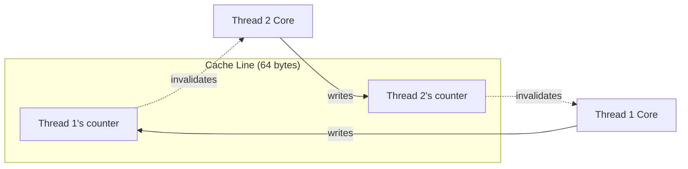

# CacheUtilities User Manual

## Table of Contents

1. [Why Cache-Aware Programming Matters](#why-cache-aware-programming-matters)
2. [Core Concepts](#core-concepts)
3. [Getting Started](#getting-started)
4. [Cache Information and Constants](#cache-information-and-constants)
5. [Prefetching: Hiding Memory Latency](#prefetching-hiding-memory-latency)
6. [Cache Flushing and Invalidation](#cache-flushing-and-invalidation)
7. [Streaming Stores: Bypassing the Cache](#streaming-stores-bypassing-the-cache)
8. [Preventing False Sharing](#preventing-false-sharing)
9. [Memory Barriers and Fences](#memory-barriers-and-fences)
10. [Cache-Aware Blocking](#cache-aware-blocking)
11. [Alignment Utilities](#alignment-utilities)
12. [Integration with Fat-P Components](#integration-with-fat-p-components)
13. [Platform-Specific Behavior](#platform-specific-behavior)
14. [Performance Measurement](#performance-measurement)
15. [Common Patterns and Recipes](#common-patterns-and-recipes)
16. [Troubleshooting](#troubleshooting)
17. [Summary](#summary)

---

## Why Cache-Aware Programming Matters

### The Memory Wall

Modern CPUs execute instructions at billions of operations per second, but main memory (DRAM) hasn't kept pace. The result is a massive speed gap:

| Component | Latency | Relative Speed |
|-----------|---------|----------------|
| CPU Register | ~1 cycle | 1x |
| L1 Cache | ~4 cycles | 4x slower |
| L2 Cache | ~12 cycles | 12x slower |
| L3 Cache | ~40 cycles | 40x slower |
| Main Memory | ~200 cycles | **200x slower** |

When your code accesses memory that isn't in cache, the CPU stalls for 200+ cycles waiting for data. In a tight loop processing millions of elements, these stalls dominate execution time.

### What Caches Do

CPU caches are small, fast memory buffers that store recently accessed data. When you read memory location X, the CPU automatically loads an entire **cache line** (typically 64 bytes) containing X and its neighbors. If you access X+4 next, it's already in cache—a **cache hit**. If you access Y far from X, the CPU must fetch another cache line—a **cache miss**.

```
Memory access pattern matters enormously:

Sequential access (cache-friendly):
  data[0] → data[1] → data[2] → data[3]
  Cache line loaded once, 4 hits
  
Random access (cache-hostile):
  data[1000] → data[50] → data[7500] → data[200]
  Each access potentially a cache miss
```

### What CacheUtilities Provides

CacheUtilities gives you explicit control over cache behavior:

**Prefetching:** Tell the CPU to load data *before* you need it, hiding memory latency.

**Cache Line Awareness:** Know the cache line size so you can align data and avoid straddling lines.

**Streaming Stores:** Write data directly to memory without polluting the cache (useful for write-once data).

**False Sharing Prevention:** Ensure independent data accessed by different threads doesn't share cache lines.

**Cache Blocking:** Process data in cache-sized chunks to maximize reuse.

---

## Core Concepts

### Cache Line Size

A **cache line** is the unit of transfer between cache levels and memory. On most modern processors:

| Platform | L1 Cache Line | Destructive Interference |
|----------|---------------|--------------------------|
| x86/x64 (Intel, AMD) | 64 bytes | 64 bytes |
| ARM Cortex-A series | 64 bytes | 64 bytes |
| Apple Silicon (M1/M2/M3) | 128 bytes | 128 bytes |

**Destructive interference size** is the minimum spacing needed between independently-accessed data to prevent false sharing. On Apple Silicon, this is 128 bytes even though the L1 line size is 64 bytes, because the coherency protocol operates on larger granules.

### Temporal vs Non-Temporal Access

**Temporal access** means you'll use the data again soon. The cache should keep it.

**Non-temporal access** means you'll use the data once and never again. Loading it into cache just evicts other useful data.

```cpp
// Temporal: processing data multiple times
for (int pass = 0; pass < 10; ++pass) {
    for (int i = 0; i < n; ++i) {
        process(data[i]);  // Keep in cache
    }
}

// Non-temporal: write-once streaming output
for (int i = 0; i < n; ++i) {
    output[i] = compute(input[i]);  // Don't pollute cache with output
}
```

### False Sharing

**False sharing** occurs when two threads access different variables that happen to be on the same cache line. Even though they're logically independent, the cache coherency protocol treats them as shared, causing expensive cross-core communication.



This can cause 10-100x slowdowns in multithreaded code. The solution is to ensure each thread's data occupies its own cache line(s).

---

## Getting Started

### Include the Header

```cpp
#include "CacheUtilities.h"

using namespace fat_p::perf;
```

### Basic Usage Examples

**Query cache parameters:**
```cpp
std::cout << "L1 line size: " << CacheInfo::l1_line_size() << " bytes\n";
std::cout << "Destructive interference: " 
          << CacheInfo::destructive_interference_size() << " bytes\n";
```

**Prefetch data before use:**
```cpp
std::vector<float> data(10000);

for (size_t i = 0; i < data.size(); ++i) {
    // Prefetch 8 iterations ahead
    if (i + 8 < data.size()) {
        prefetch(&data[i + 8]);
    }
    process(data[i]);
}
```

**Prevent false sharing between threads:**
```cpp
// Bad: counters on same cache line
std::atomic<int> counters[4];  // 4 bytes each, all on one line!

// Good: each counter on its own cache line
CacheAligned<std::atomic<int>> counters[4];  // 64+ bytes each
```

**Stream large writes:**
```cpp
// Writing large output buffer that won't be read again soon
alignas(32) float output[10000];

for (size_t i = 0; i < 10000; ++i) {
    float result = expensive_computation(i);
    stream_store(&output[i], result);  // Bypass cache
}
store_fence();  // Ensure all streams complete
```

---

## Cache Information and Constants

### Compile-Time Constants

CacheUtilities provides compile-time constants for use in `alignas`, template parameters, and array sizing:

```cpp
namespace cache_constants {
    inline constexpr size_t l1_line_size_v;                    // 64 or 128
    inline constexpr size_t destructive_interference_size_v;   // 64 or 128
    inline constexpr size_t constructive_interference_size_v;  // 64
}
```

These are true `constexpr` values, safe to use anywhere a constant expression is required:

```cpp
// Use in alignas
alignas(cache_constants::destructive_interference_size_v) int shared_data[16];

// Use in templates
template<size_t N = cache_constants::l1_line_size_v>
struct CacheBlock { char data[N]; };

// Use in array sizing
constexpr size_t elements_per_line = 
    cache_constants::l1_line_size_v / sizeof(double);  // 8 doubles per line
```

### CacheInfo Class

For consistency with older code, `CacheInfo` provides the same values as `constexpr` functions:

```cpp
class CacheInfo {
public:
    static constexpr size_t l1_line_size() noexcept;
    static constexpr size_t l2_line_size() noexcept;  // Usually same as L1
    static constexpr size_t l3_line_size() noexcept;  // Usually same as L1
    static constexpr size_t destructive_interference_size() noexcept;
    static constexpr size_t constructive_interference_size() noexcept;
};
```

### Platform Detection

CacheUtilities automatically detects the platform at compile time:

| Macro | Meaning |
|-------|---------|
| `CACHE_X86` | x86 or x86-64 processor |
| `CACHE_X86_64` | 64-bit x86 specifically |
| `CACHE_X86_32` | 32-bit x86 specifically |
| `CACHE_ARM` | ARM processor (including Apple Silicon) |

Apple Silicon (M1/M2/M3) is detected via `__APPLE__ && __aarch64__` and uses 128-byte cache lines.

---

## Prefetching: Hiding Memory Latency

### The Prefetch Concept

Prefetching tells the CPU to start loading data *before* you need it. By the time your code reaches that data, it's already in cache.

```
Without prefetch:
  Time: ----[wait 200 cycles]----[process]----[wait 200 cycles]----[process]
  
With prefetch:
  Time: [prefetch]----[process]----[prefetch]----[process]
                    ↑                          ↑
               Data arrives              Data arrives
               (we're ready!)            (we're ready!)
```

### Basic Prefetch

```cpp
template<PrefetchLocality Locality = PrefetchLocality::High,
         PrefetchOp Op = PrefetchOp::Read>
void prefetch(const void* addr) noexcept;
```

**Locality hints** tell the CPU how long to keep data in cache:

| Locality | Meaning | Use Case |
|----------|---------|----------|
| `None` | Non-temporal, use once | Streaming through large arrays |
| `Low` | Keep in L3 only | Data reused occasionally |
| `Moderate` | Keep in L2 | Data reused several times |
| `High` | Keep in L1 | Data reused frequently (default) |

**Operation type** indicates read vs write access:

| Op | Meaning |
|----|---------|
| `Read` | Prefetch for reading (shared state) |
| `Write` | Prefetch for writing (exclusive state) |

```cpp
// Prefetch for reading with high locality (default)
prefetch(data_ptr);

// Prefetch for writing
prefetch<PrefetchLocality::High, PrefetchOp::Write>(output_ptr);

// Prefetch streaming data (non-temporal)
prefetch<PrefetchLocality::None>(stream_ptr);
```

### Prefetch Range

Prefetch a contiguous block of memory:

```cpp
template<PrefetchLocality Locality = PrefetchLocality::High>
void prefetch_range(const void* addr, size_t size) noexcept;
```

This issues prefetch instructions for each cache line in the range:

```cpp
// Prefetch entire array
std::vector<double> data(1000);
prefetch_range(data.data(), data.size() * sizeof(double));

// Prefetch subset
prefetch_range(&data[500], 100 * sizeof(double));
```

### Prefetch Ahead in Loops

The most common pattern is prefetching ahead during iteration:

```cpp
template<typename T, PrefetchLocality Locality = PrefetchLocality::High>
void prefetch_ahead(const T* base, size_t index, 
                    size_t stride = 1, size_t distance = 8) noexcept;
```

```cpp
std::vector<float> data(100000);

// Simple loop with prefetch
for (size_t i = 0; i < data.size(); ++i) {
    prefetch_ahead(data.data(), i);  // Prefetch 8 elements ahead
    process(data[i]);
}

// Custom stride (e.g., processing every 4th element)
for (size_t i = 0; i < data.size(); i += 4) {
    prefetch_ahead(data.data(), i, 4, 16);  // 16 iterations = 64 elements ahead
    process(data[i]);
}
```

The distance parameter should be tuned based on:
- Processing time per element (longer processing → larger distance)
- Memory bandwidth (slower memory → larger distance)
- Typical values: 4-16 for simple operations, 32-64 for complex processing

### Prefetch Best Practices

**Do:**
- Prefetch 100-500 cycles ahead of use
- Use for predictable access patterns
- Measure actual benefit (prefetching has overhead)

**Don't:**
- Prefetch random access patterns (wastes bandwidth)
- Prefetch too close (data won't arrive in time)
- Prefetch too far (data evicted before use)

---

## Cache Flushing and Invalidation

### When to Flush Cache

Cache flushing is rarely needed in normal code. Use cases include:

- **Benchmarking:** Ensure cold cache for realistic measurements
- **Persistent memory:** Force data to non-volatile storage
- **DMA transfers:** Ensure memory is consistent for hardware
- **Security:** Clear sensitive data from cache

### Flush Functions

```cpp
// Flush single cache line
void flush_cache_line(const void* addr) noexcept;

// Flush range of cache lines
void flush_cache_range(const void* addr, size_t size) noexcept;

// Flush and invalidate (stronger)
void flush_invalidate(const void* addr) noexcept;
```

```cpp
// Flush before benchmark
alignas(64) float data[10000];
initialize(data);
flush_cache_range(data, sizeof(data));
store_fence();  // Ensure flushes complete

auto start = now();
process(data);  // Measure cold-cache performance
auto end = now();
```

### Flush vs Invalidate

| Operation | Effect | Use Case |
|-----------|--------|----------|
| Flush | Write dirty data to memory | Persist changes |
| Invalidate | Mark cache line invalid | Force re-read from memory |
| Flush+Invalidate | Both | Full cache line eviction |

---

## Streaming Stores: Bypassing the Cache

### When to Use Streaming Stores

Streaming stores write directly to memory without reading the cache line first or storing the result in cache. This is beneficial when:

- Writing data that won't be read again soon
- Writing large sequential buffers
- Avoiding cache pollution from output data

```cpp
// Normal store: read cache line, modify, write back, keep in cache
data[i] = value;

// Streaming store: write directly to memory, don't cache
stream_store(&data[i], value);
```

### stream_store Function

```cpp
template<typename T>
void stream_store(T* dest, const T& value) noexcept;
```

Requirements:
- `T` must be trivially copyable
- Best performance when `dest` is aligned (4/8/16/32 bytes depending on size)
- Falls back to memcpy if alignment requirements aren't met

```cpp
// Streaming store single value
alignas(32) float output[1000];
for (int i = 0; i < 1000; ++i) {
    float result = compute(i);
    stream_store(&output[i], result);
}
store_fence();  // Required after streaming stores
```

### stream_copy Function

For bulk streaming copies:

```cpp
void stream_copy(void* dest, const void* src, size_t size) noexcept;
```

```cpp
// Copy large buffer without polluting cache
alignas(32) char dest[1000000];
const char* src = get_large_input();

stream_copy(dest, src, 1000000);
store_fence();
```

Note: `dest` should be 32-byte aligned for AVX streaming stores. If not aligned, falls back to `memcpy`.

### Important: Store Fence

Streaming stores are weakly ordered. You **must** call `store_fence()` after streaming stores before:
- Reading the data
- Assuming the write is visible to other threads/cores
- Using the data in DMA or I/O operations

```cpp
// Correct usage
for (int i = 0; i < n; ++i) {
    stream_store(&output[i], compute(i));
}
store_fence();  // Now safe to read output
verify(output);

// WRONG: data may not be visible yet
for (int i = 0; i < n; ++i) {
    stream_store(&output[i], compute(i));
}
verify(output);  // Undefined behavior!
```

---

## Preventing False Sharing

### The Problem

When threads access independent data on the same cache line, the cache coherency protocol constantly invalidates and transfers the line between cores:

```cpp
// Disaster: all counters on same cache line
struct SharedCounters {
    std::atomic<int> thread0_count;  // bytes 0-3
    std::atomic<int> thread1_count;  // bytes 4-7
    std::atomic<int> thread2_count;  // bytes 8-11
    std::atomic<int> thread3_count;  // bytes 12-15
};  // Total: 16 bytes, all in one cache line

// Every increment by any thread invalidates the line for all others!
```

### CacheAligned<T>

Aligns T to a cache line boundary:

```cpp
template<typename T>
struct alignas(destructive_interference_size_v) CacheAligned {
    T value;
    
    T& get() noexcept;
    const T& get() const noexcept;
    operator T&() noexcept;
    operator const T&() const noexcept;
};
```

```cpp
// Each counter on its own cache line
CacheAligned<std::atomic<int>> counters[4];

// Thread 0
counters[0].get()++;

// Thread 1 (no false sharing with thread 0)
counters[1].get()++;
```

Size: `sizeof(CacheAligned<T>)` is at least `destructive_interference_size` bytes.

### CacheLinePadded<T>

Pads T to **exactly** one cache line:

```cpp
template<typename T>
struct alignas(destructive_interference_size_v) CacheLinePadded {
    T value;
    // Padding to fill cache line
    
    T& get() noexcept;
    const T& get() const noexcept;
};
```

This ensures:
- Adjacent `CacheLinePadded` objects are on different cache lines
- No other data can share the cache line

```cpp
// Array of padded counters
CacheLinePadded<std::atomic<long>> counters[8];

// Each element is exactly 64 (or 128) bytes
static_assert(sizeof(CacheLinePadded<std::atomic<long>>) == 
              CacheInfo::destructive_interference_size());
```

Note: T must fit within a cache line (`sizeof(T) <= destructive_interference_size`). For larger types, use `CacheAligned`.

### Choosing Between CacheAligned and CacheLinePadded

| Use Case | Choice |
|----------|--------|
| Prevent false sharing in array | `CacheAligned<T>` |
| Guarantee exact cache line size | `CacheLinePadded<T>` |
| T is larger than cache line | `CacheAligned<T>` |
| Embedded in other structs | `CacheLinePadded<T>` |

```cpp
// CacheAligned: prevents false sharing, may be larger than needed
CacheAligned<int> a;  // 64 bytes (or 128 on Apple Silicon)

// CacheLinePadded: exactly one cache line
CacheLinePadded<int> b;  // Exactly 64 bytes (or 128)

// For large types, only CacheAligned works
struct LargeData { double values[10]; };  // 80 bytes
CacheAligned<LargeData> large;  // OK: 128 bytes on x86
// CacheLinePadded<LargeData> fails;  // static_assert: too large
```

---

## Memory Barriers and Fences

### Why Barriers Matter

Modern CPUs and compilers reorder memory operations for performance. This is invisible to single-threaded code but causes subtle bugs in multithreaded or hardware-interacting code.

```cpp
// Intended order
data = 42;
data_ready = true;

// CPU might execute as
data_ready = true;  // Other thread sees this
data = 42;          // ...but data isn't ready yet!
```

### Available Barriers

```cpp
void memory_barrier() noexcept;  // Full fence (serializes everything)
void store_fence() noexcept;     // Stores complete before continuing
void load_fence() noexcept;      // Prior stores visible before loads
```

### When to Use Each

| Barrier | Use Case |
|---------|----------|
| `memory_barrier()` | Strongest guarantee; use sparingly |
| `store_fence()` | After streaming stores; producer-consumer publish |
| `load_fence()` | Before reading data another thread wrote |

```cpp
// Producer thread
data[0] = result;
data[1] = result2;
store_fence();
ready_flag.store(true, std::memory_order_release);

// Consumer thread
while (!ready_flag.load(std::memory_order_acquire)) { }
load_fence();
use(data[0], data[1]);
```

### Relationship to std::atomic

The barriers in CacheUtilities are lower-level than `std::atomic` memory orders. Use `std::atomic` for most synchronization; use these barriers for:

- After streaming stores (required for correctness)
- Performance-critical paths where atomic overhead matters
- Hardware/DMA interactions

---

## Cache-Aware Blocking

### The Blocking Concept

When processing data larger than cache, access patterns matter enormously. **Cache blocking** (or **tiling**) divides work into cache-sized chunks:

```
Without blocking (cache thrashing):
  Process row 0 of A → row 0 of B → row 0 of C
  Process row 1 of A → row 1 of B → row 1 of C
  ...
  By row 100, row 0's data is evicted!

With blocking (cache-friendly):
  Process block (0-15, 0-15) of A, B, C  ← Fits in cache!
  Process block (0-15, 16-31) of A, B, C
  ...
  Each block's data stays hot
```

### optimal_block_size Function

```cpp
size_t optimal_block_size(size_t elements, size_t element_size, 
                          size_t cache_size = 32 * 1024) noexcept;
```

Returns a power-of-2 block size that fits in ~80% of the specified cache:

```cpp
// For 32KB L1 cache, 8-byte doubles
size_t block = optimal_block_size(10000, sizeof(double), 32768);
// Returns 2048 (2048 * 8 = 16KB, fits in 80% of 32KB)

// Process in blocks
for (size_t i = 0; i < data.size(); i += block) {
    size_t end = std::min(i + block, data.size());
    process_block(data.data() + i, end - i);
}
```

### BlockIterator2D for Matrix Operations

For 2D data (matrices), use `BlockIterator2D`:

```cpp
struct BlockIterator2D {
    BlockIterator2D(size_t rows, size_t cols, 
                    size_t block_rows, size_t block_cols) noexcept;
    
    bool has_next() const noexcept;
    void next_block() noexcept;
    
    size_t block_start_i() const noexcept;
    size_t block_start_j() const noexcept;
    size_t block_end_i() const noexcept;
    size_t block_end_j() const noexcept;
};
```

Example: Matrix multiplication with blocking:

```cpp
void matmul_blocked(const double* A, const double* B, double* C,
                    size_t M, size_t N, size_t K) {
    constexpr size_t BLOCK = 64;  // Tune for your cache
    
    BlockIterator2D blocks(M, N, BLOCK, BLOCK);
    
    while (blocks.has_next()) {
        size_t i0 = blocks.block_start_i();
        size_t i1 = blocks.block_end_i();
        size_t j0 = blocks.block_start_j();
        size_t j1 = blocks.block_end_j();
        
        // Process block [i0:i1, j0:j1]
        for (size_t i = i0; i < i1; ++i) {
            for (size_t j = j0; j < j1; ++j) {
                double sum = 0.0;
                for (size_t k = 0; k < K; ++k) {
                    sum += A[i * K + k] * B[k * N + j];
                }
                C[i * N + j] = sum;
            }
        }
        
        blocks.next_block();
    }
}
```

---

## Alignment Utilities

### Checking Alignment

```cpp
bool is_aligned(const void* ptr, size_t alignment) noexcept;
```

```cpp
int* p = new int[100];
if (is_aligned(p, 32)) {
    // Can use AVX instructions safely
} else {
    // Need unaligned fallback
}
```

### Aligning Pointers

```cpp
void* align_up(void* ptr, size_t alignment) noexcept;
void* align_down(void* ptr, size_t alignment) noexcept;
const void* align_up(const void* ptr, size_t alignment) noexcept;
const void* align_down(const void* ptr, size_t alignment) noexcept;
```

```cpp
char buffer[1024];
char* p = buffer + 7;  // Unaligned

// Align up to 64 bytes
char* aligned = static_cast<char*>(align_up(p, 64));
// aligned is now at offset 64 within buffer

// Align down
char* aligned_down = static_cast<char*>(align_down(p, 64));
// aligned_down is now at offset 0 (buffer start)
```

### Computing Alignment Offset

```cpp
size_t alignment_offset(const void* ptr, size_t alignment) noexcept;
```

Returns bytes needed to align ptr up:

```cpp
char* p = buffer + 7;
size_t offset = alignment_offset(p, 64);  // Returns 57
// p + offset is 64-byte aligned
```

---

## Integration with Fat-P Components

### With AlignedVector

AlignedVector guarantees alignment for SIMD operations. CacheUtilities complements it with prefetching and cache control:

```cpp
#include "AlignedVector.h"
#include "CacheUtilities.h"

using namespace fat_p;

AlignedVector<float, 64> data(100000);

// Prefetch ahead while processing
for (size_t i = 0; i < data.size(); ++i) {
    perf::prefetch_ahead(data.data(), i, 1, 16);
    process(data[i]);
}
```

### With HpcVector

HpcVector provides NUMA-aware allocation. CacheUtilities adds cache-level optimization:

```cpp
#include "HpcVector.h"
#include "CacheUtilities.h"

HpcVector<double> data(1000000);

// Process in cache-friendly blocks
size_t block = perf::optimal_block_size(data.size(), sizeof(double));
for (size_t i = 0; i < data.size(); i += block) {
    size_t end = std::min(i + block, data.size());
    
    // Prefetch next block while processing current
    if (i + block < data.size()) {
        perf::prefetch_range(&data[i + block], block * sizeof(double));
    }
    
    process_block(&data[i], end - i);
}
```

### With SimdVector

SimdVector handles SIMD operations; CacheUtilities ensures data is ready:

```cpp
#include "SimdVector.h"
#include "CacheUtilities.h"

using Vec = SimdVector<float>;
constexpr size_t LANES = Vec::size();

std::vector<float> input(100000);
alignas(32) float output[100000];

for (size_t i = 0; i < input.size(); i += LANES) {
    // Prefetch input
    perf::prefetch(&input[i + LANES * 8]);
    
    Vec v = Vec::load(&input[i]);
    Vec result = v * v + v;  // Some computation
    
    // Stream store output (won't be read again)
    for (size_t j = 0; j < LANES; ++j) {
        perf::stream_store(&output[i + j], result[j]);
    }
}
perf::store_fence();
```

### With NumaAllocator

For NUMA systems, combine NUMA placement with cache optimization:

```cpp
#include "NumaAllocator.h"
#include "CacheUtilities.h"

std::vector<double, NumaLocalAllocator<double>> local_data(1000000);
std::vector<double, NumaInterleavedAllocator<double>> shared_data(1000000);

// Per-thread counters without false sharing
std::vector<perf::CacheAligned<std::atomic<long>>> counters(num_threads);
```

---

## Platform-Specific Behavior

### x86/x64 (Intel, AMD)

| Feature | Implementation |
|---------|----------------|
| Prefetch | `_mm_prefetch` with locality hints |
| Cache line | 64 bytes |
| Streaming stores | `_mm_stream_si32/64/128`, `_mm256_stream_si256` |
| Barriers | `_mm_mfence`, `_mm_sfence`, `_mm_lfence` |

AVX streaming stores require 32-byte alignment and `__AVX__` compiler flag.

### ARM (including Apple Silicon)

| Feature | Implementation |
|---------|----------------|
| Prefetch | `__builtin_prefetch` (portable) |
| Cache line | 64 bytes (128 on Apple Silicon) |
| Streaming stores | Falls back to memcpy |
| Barriers | `dmb sy`, `dmb st`, `dmb ld` |

Apple Silicon (M1/M2/M3) uses 128-byte destructive interference size for false sharing prevention.

### Fallback (Other Architectures)

For unknown architectures:
- Prefetch uses `__builtin_prefetch` if available, else no-op
- Cache line assumed 64 bytes
- Streaming stores use regular memcpy
- Barriers use `std::atomic_thread_fence`

---

## Performance Measurement

### Benchmarking with Cold Cache

```cpp
void benchmark_with_flush() {
    alignas(64) float data[10000];
    std::iota(data, data + 10000, 0.0f);
    
    // Warm run (ignore)
    volatile float sum = 0;
    for (int i = 0; i < 10000; ++i) sum += data[i];
    
    // Flush cache
    flush_cache_range(data, sizeof(data));
    store_fence();
    
    // Measure cold cache
    auto start = high_resolution_clock::now();
    sum = 0;
    for (int i = 0; i < 10000; ++i) sum += data[i];
    auto end = high_resolution_clock::now();
    
    std::cout << "Cold cache: " << (end - start).count() << " ns\n";
}
```

### Measuring Prefetch Benefit

```cpp
void compare_prefetch() {
    std::vector<float> data(1000000);
    std::iota(data.begin(), data.end(), 0.0f);
    
    // Without prefetch
    flush_cache_range(data.data(), data.size() * sizeof(float));
    store_fence();
    
    auto t0 = now();
    float sum = 0;
    for (size_t i = 0; i < data.size(); ++i) {
        sum += data[i];
    }
    auto t1 = now();
    DoNotOptimize(sum);
    
    // With prefetch
    flush_cache_range(data.data(), data.size() * sizeof(float));
    store_fence();
    
    auto t2 = now();
    sum = 0;
    for (size_t i = 0; i < data.size(); ++i) {
        prefetch_ahead(data.data(), i, 1, 16);
        sum += data[i];
    }
    auto t3 = now();
    DoNotOptimize(sum);
    
    std::cout << "Without prefetch: " << (t1 - t0).count() << " ns\n";
    std::cout << "With prefetch: " << (t3 - t2).count() << " ns\n";
}
```

---

## Common Patterns and Recipes

### Pattern 1: Streaming Write

Write large output without polluting cache:

```cpp
void generate_output(float* output, size_t n) {
    for (size_t i = 0; i < n; ++i) {
        float value = compute(i);
        stream_store(&output[i], value);
    }
    store_fence();  // Critical!
}
```

### Pattern 2: Prefetch Pipeline

Overlap computation with memory access:

```cpp
void process_pipeline(const Data* input, Result* output, size_t n) {
    constexpr size_t AHEAD = 8;
    
    for (size_t i = 0; i < n; ++i) {
        // Prefetch future input
        if (i + AHEAD < n) {
            prefetch<PrefetchLocality::High>(&input[i + AHEAD]);
        }
        
        // Process current
        output[i] = expensive_process(input[i]);
    }
}
```

### Pattern 3: Thread-Local Counters

Accumulate per-thread, merge at end:

```cpp
void parallel_count(const int* data, size_t n, int target) {
    std::vector<CacheAligned<std::atomic<long>>> counts(num_threads);
    
    #pragma omp parallel
    {
        int tid = omp_get_thread_num();
        #pragma omp for
        for (size_t i = 0; i < n; ++i) {
            if (data[i] == target) {
                counts[tid].get()++;
            }
        }
    }
    
    long total = 0;
    for (auto& c : counts) {
        total += c.get().load();
    }
}
```

### Pattern 4: Cache-Blocked Matrix Operations

Process matrices in cache-friendly tiles:

```cpp
void transpose_blocked(const double* src, double* dst, 
                       size_t rows, size_t cols) {
    constexpr size_t BLOCK = 32;
    
    for (size_t i = 0; i < rows; i += BLOCK) {
        for (size_t j = 0; j < cols; j += BLOCK) {
            // Transpose block [i:i+BLOCK, j:j+BLOCK]
            size_t i_end = std::min(i + BLOCK, rows);
            size_t j_end = std::min(j + BLOCK, cols);
            
            for (size_t ii = i; ii < i_end; ++ii) {
                for (size_t jj = j; jj < j_end; ++jj) {
                    dst[jj * rows + ii] = src[ii * cols + jj];
                }
            }
        }
    }
}
```

---

## Troubleshooting

### Problem: Prefetch Has No Effect

**Symptoms:** Timing shows no improvement with prefetch.

**Causes and solutions:**
- **Too late:** Increase prefetch distance
- **Too early:** Decrease distance (data evicted before use)
- **CPU already prefetching:** Modern CPUs have hardware prefetchers; your prefetch may be redundant
- **Memory-bound:** If computation is trivial, memory bandwidth is the limit regardless of latency

### Problem: Streaming Store Slower Than Regular Store

**Symptoms:** `stream_store` is slower than `*p = v`.

**Causes:**
- **Unaligned pointer:** Falls back to memcpy
- **Small writes:** Overhead dominates
- **Will read soon:** Normal store is better if you'll access data again

**Solution:** Use streaming stores only for large, aligned, write-once buffers.

### Problem: False Sharing Still Occurring

**Symptoms:** Multithreaded performance doesn't improve with CacheAligned.

**Check:**
- Verify `sizeof(CacheAligned<T>)` is >= cache line size
- On Apple Silicon, ensure using 128-byte spacing
- Check for indirect false sharing (pointers to shared data)

### Problem: flush_cache_range Not Working

**Symptoms:** Benchmarks show warm cache despite flushing.

**Causes:**
- Missing `store_fence()` after flush
- Data in L1 but flushed only from L2/L3
- CPU re-prefetched data during flush

**Solution:** Add `store_fence()` and ensure sufficient delay before measurement.

---

## Summary

### Quick Reference

| Task | Function |
|------|----------|
| Get cache line size | `CacheInfo::l1_line_size()` |
| Prefetch for read | `prefetch<PrefetchLocality::High>(ptr)` |
| Prefetch for write | `prefetch<..., PrefetchOp::Write>(ptr)` |
| Prefetch range | `prefetch_range(ptr, size)` |
| Prefetch in loop | `prefetch_ahead(base, index)` |
| Stream store | `stream_store(&dest, value)` |
| Stream copy | `stream_copy(dest, src, size)` |
| Store fence | `store_fence()` |
| Prevent false sharing | `CacheAligned<T>` or `CacheLinePadded<T>` |
| Check alignment | `is_aligned(ptr, alignment)` |
| Align pointer | `align_up(ptr, alignment)` |
| Block size | `optimal_block_size(n, sizeof(T))` |
| 2D blocking | `BlockIterator2D(rows, cols, br, bc)` |

### Key Guidelines

1. **Prefetch predictable patterns** 8-16 iterations ahead
2. **Use streaming stores** for large, write-once, aligned buffers
3. **Always call store_fence()** after streaming stores
4. **Use CacheAligned** for thread-local data in arrays
5. **Block large data** into L1/L2-sized chunks
6. **Measure actual benefit** — cache optimization is empirical

### Related Components

| Component | Relationship |
|-----------|--------------|
| AlignedVector.h | Aligned storage for SIMD |
| HpcVector.h | NUMA-aware + cache-aware storage |
| SimdVector.h | SIMD operations on cached data |
| NumaAllocator.h | NUMA memory placement |

---

*CacheUtilities.h — Low-level cache control for high-performance C++*
