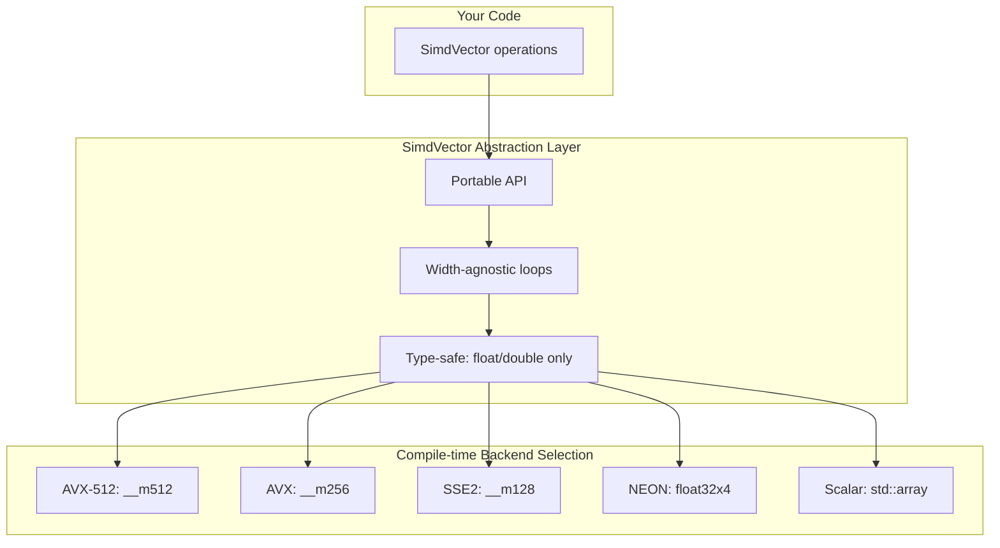

# SimdVector User Manual

## Table of Contents

1. [What is SIMD and Why SimdVector?](#what-is-simd-and-why-simdvector)
2. [Core Architecture](#core-architecture)
3. [Getting Started](#getting-started)
4. [SimdVector Fundamentals](#simdvector-fundamentals)
5. [Loading and Storing Data](#loading-and-storing-data)
6. [Arithmetic Operations](#arithmetic-operations)
7. [Comparisons and Masks](#comparisons-and-masks)
8. [Conditional Logic with select()](#conditional-logic-with-select)
9. [Math Operations](#math-operations)
10. [Horizontal Reductions](#horizontal-reductions)
11. [Special Value Detection](#special-value-detection)
12. [Complete Processing Patterns](#complete-processing-patterns)
13. [Integration with Fat-P Components](#integration-with-fat-p-components)
14. [Performance Characteristics](#performance-characteristics)
15. [Platform-Specific Behavior](#platform-specific-behavior)
16. [Comparison with Other Libraries](#comparison-with-other-libraries)
17. [Use Case Guide](#use-case-guide)
18. [Troubleshooting](#troubleshooting)
19. [Known Limitations](#known-limitations)
20. [Summary](#summary)

---

## What is SIMD and Why SimdVector?

### The SIMD Revolution

In the early days of computing, processors executed one operation at a time: add two numbers, store the result, repeat. This worked fine when programs were simple, but as applications grew more demanding—3D graphics, audio processing, scientific simulation—this one-at-a-time approach became a bottleneck.

The solution was **SIMD: Single Instruction, Multiple Data**. Instead of adding two numbers, a SIMD instruction adds eight numbers simultaneously. The CPU contains wide registers (128, 256, or 512 bits) that hold multiple values, and SIMD instructions operate on all values in parallel.

**Scalar approach (4 cycles for 4 results):**
```cpp
result[0] = a[0] + b[0];  // 1 cycle
result[1] = a[1] + b[1];  // 1 cycle
result[2] = a[2] + b[2];  // 1 cycle
result[3] = a[3] + b[3];  // 1 cycle
```

**SIMD approach (1 cycle for 4 results):**
```cpp
// All four additions happen in parallel
__m128 va = _mm_load_ps(a);
__m128 vb = _mm_load_ps(b);
__m128 vr = _mm_add_ps(va, vb);
_mm_store_ps(result, vr);
```

Modern CPUs have gone through several SIMD generations:

| Era | x86 | ARM | Register Width | floats/op |
|-----|-----|-----|----------------|-----------|
| 1997 | MMX | — | 64-bit | 2 |
| 1999 | SSE | — | 128-bit | 4 |
| 2011 | AVX | — | 256-bit | 8 |
| 2011 | — | NEON | 128-bit | 4 |
| 2016 | AVX-512 | — | 512-bit | 16 |

Today, every desktop, laptop, and smartphone CPU has SIMD capability. Not using it means leaving 4-16x performance on the table for vectorizable code.

### The C++ SIMD Landscape

C++ provides no standard way to use SIMD. Your options:

**Raw Intrinsics:** Direct access to SIMD instructions through compiler-provided functions.

```cpp
#include <immintrin.h>  // x86 only!

__m256 va = _mm256_loadu_ps(a);
__m256 vb = _mm256_loadu_ps(b);
__m256 vc = _mm256_add_ps(va, vb);
_mm256_storeu_ps(result, vc);
```

This works, but it's platform-locked (different intrinsics for x86 vs ARM), verbose (every operation needs explicit load/store), fragile (wrong alignment crashes with SIGBUS/SIGSEGV), and unmaintainable (`#ifdef` forests for cross-platform code).

**Compiler Auto-Vectorization:** Let the compiler figure it out.

```cpp
// Hope the compiler vectorizes this
for (int i = 0; i < n; ++i) {
    result[i] = a[i] + b[i];
}
```

This sometimes works, but it's unpredictable—small code changes disable vectorization. You have no control over which instructions are used, poor diagnostics when vectorization fails, and can't express complex patterns (masks, reductions).

**std::simd (C++26):** The upcoming standard solution—but not available today and incomplete implementations exist only experimentally.

**SIMD Libraries (Highway, Vc, xsimd):** These provide portable SIMD abstraction, but require external dependencies, are heavy (thousands of lines), and don't integrate with Fat-P.

### Where SimdVector Fits

SimdVector is a **lightweight, portable SIMD abstraction** designed for Fat-P's HPC ecosystem:

```cpp
#include "SimdVector.h"

using namespace fat_p;

// Same code on x86 and ARM
auto va = SimdVector<float>::load_aligned(a);
auto vb = SimdVector<float>::load_aligned(b);
auto vc = va + vb;
vc.store_aligned(result);

// Check for numerical issues
if (vc.has_nan()) {
    // Handle error
}
```

**Key characteristics:**

| Feature | SimdVector |
|---------|------------|
| Lines of code | ~1200 (single header) |
| Dependencies | Standard library + enforce.h |
| Platforms | x86 (SSE2-AVX512), ARM (NEON), scalar fallback |
| Types | float, double only |
| Safety | NaN/Inf detection, alignment checks |
| Integration | Works with AlignedVector, HpcVector |

SimdVector doesn't try to be everything. It provides the 80% of SIMD functionality you need for HPC with 20% of the complexity. For the other 20%—gather/scatter, permutations, exotic instructions—you can drop to raw intrinsics.

---

## Core Architecture

### The Abstraction Model

SimdVector wraps architecture-specific SIMD registers behind a portable interface:



The key insight: **width varies, but operations don't.** `va + vb` compiles to `_mm512_add_ps` on AVX-512, `_mm256_add_ps` on AVX, or `vaddq_f32` on NEON. Your code doesn't change.

### Architecture Detection

SimdVector detects the target architecture at compile time:

```cpp
// Compile-time detection (from SimdVector.h)
#if defined(__AVX512F__)
    #define SIMD_AVX512
#elif defined(__AVX2__)
    #define SIMD_AVX2
#elif defined(__AVX__)
    #define SIMD_AVX
#elif defined(__SSE2__)
    #define SIMD_SSE2
#elif defined(__aarch64__)
    #define SIMD_NEON
    #define SIMD_NEON_AARCH64 1
#elif defined(__ARM_NEON)
    #define SIMD_NEON
    #define SIMD_NEON_AARCH64 0
#endif
```

**Query the detected architecture at runtime:**

```cpp
#include "SimdVector.h"

void print_simd_info()
{
    using namespace fat_p;
    
    std::cout << "Architecture: " << SimdArchitecture::name << "\n";
    std::cout << "Has AVX-512: " << SimdArchitecture::has_avx512 << "\n";
    std::cout << "Has AVX: " << SimdArchitecture::has_avx << "\n";
    std::cout << "Has SSE: " << SimdArchitecture::has_sse << "\n";
    std::cout << "Has NEON: " << SimdArchitecture::has_neon << "\n";
    std::cout << "Preferred alignment: " << SimdArchitecture::preferred_alignment << "\n";
    
    std::cout << "SimdVector<float>::width = " << SimdVector<float>::width << "\n";
    std::cout << "SimdVector<double>::width = " << SimdVector<double>::width << "\n";
}
```

### Width and Alignment

Each architecture determines how many values fit in a SIMD register:

| Architecture | float width | double width | Alignment |
|--------------|-------------|--------------|-----------|
| AVX-512 | 16 | 8 | 64 bytes |
| AVX/AVX2 | 8 | 4 | 32 bytes |
| SSE2 | 4 | 2 | 16 bytes |
| NEON (AArch64) | 4 | 2 | 16 bytes |
| NEON (ARM32) | 4 | **1** (scalar) | 16 bytes |
| Scalar fallback | 1 | 1 | alignof(T) |

**Important:** On 32-bit ARM, double-precision NEON doesn't exist. SimdVector falls back to scalar operations for `SimdVector<double>` with width=1.

Access these values in your code:

```cpp
using SV = fat_p::SimdVector<float>;

constexpr size_t width = SV::width;       // 4, 8, or 16 depending on arch
constexpr size_t align = SV::alignment;   // 16, 32, or 64 bytes

// Use width for loop strides
for (size_t i = 0; i < n; i += SV::width) {
    auto v = SV::load_aligned(data + i);
    // ...
}
```

### Design Decisions

**Why float and double only?**

Integer SIMD has a fundamental problem: overflow semantics vary by architecture. x86 integer SIMD saturates or wraps depending on the instruction. ARM NEON has different saturation behavior. There's no universal "correct" behavior for integer overflow.

For floating-point, IEEE-754 defines universal semantics: overflow produces infinity, invalid operations produce NaN. This makes it possible to detect numerical issues portably.

For integer SIMD with overflow detection, use `CheckedArithmetic.h` which provides `checked_add_vec`, `checked_mul_vec` with architecture-specific overflow detection.

**Why not runtime dispatch?**

Some libraries detect CPU features at runtime and dispatch to different code paths. SimdVector uses compile-time detection for two reasons:

1. **Zero overhead:** No runtime feature checks, no indirect calls
2. **Predictability:** You know exactly which instructions will be generated
3. **HPC focus:** Clusters have homogeneous nodes—compile for the target

---

## Getting Started

### Prerequisites

SimdVector requires:

- **C++17 or later** (for `if constexpr`, `std::is_same_v`)
- A compiler with SIMD support: GCC 7+, Clang 5+, MSVC 2017+
- Fat-P's `enforce.h` for alignment checks

### Compilation

Enable the SIMD instruction set you want to target:

**GCC/Clang on x86:**
```bash
# SSE2 (default on x86-64)
g++ -std=c++17 -O3 main.cpp

# AVX2 + FMA
g++ -std=c++17 -O3 -mavx2 -mfma main.cpp

# AVX-512
g++ -std=c++17 -O3 -mavx512f main.cpp

# Native (auto-detect CPU features)
g++ -std=c++17 -O3 -march=native main.cpp
```

**GCC/Clang on ARM:**
```bash
# NEON (usually enabled by default on AArch64)
g++ -std=c++17 -O3 main.cpp

# Explicit NEON for ARM32
g++ -std=c++17 -O3 -mfpu=neon main.cpp
```

**MSVC:**
```bash
# AVX2
cl /std:c++17 /O2 /arch:AVX2 main.cpp

# AVX-512 (VS2019+)
cl /std:c++17 /O2 /arch:AVX512 main.cpp
```

### First Program

```cpp
#include <iostream>
#include "SimdVector.h"
#include "AlignedVector.h"

int main()
{
    using namespace fat_p;
    using SV = SimdVector<float>;
    
    // Print architecture info
    std::cout << "SIMD Architecture: " << SimdArchitecture::name << "\n";
    std::cout << "Vector width: " << SV::width << " floats\n";
    std::cout << "Required alignment: " << SV::alignment << " bytes\n\n";
    
    // Create aligned data
    const size_t n = 16;
    AlignedVector<float, SV::alignment> a(n), b(n), result(n);
    
    // Initialize
    for (size_t i = 0; i < n; ++i) {
        a[i] = static_cast<float>(i);
        b[i] = static_cast<float>(i * 2);
    }
    
    // SIMD addition
    for (size_t i = 0; i < n; i += SV::width) {
        auto va = SV::load_aligned(a.assume_aligned() + i);
        auto vb = SV::load_aligned(b.assume_aligned() + i);
        auto vc = va + vb;
        vc.store_aligned(result.data() + i);
    }
    
    // Print results
    std::cout << "a + b = result\n";
    for (size_t i = 0; i < n; ++i) {
        std::cout << a[i] << " + " << b[i] << " = " << result[i] << "\n";
    }
    
    return 0;
}
```

---

## SimdVector Fundamentals

### Creating Vectors

There are several ways to create a SimdVector:

```cpp
// Default construction (uninitialized)
SimdVector<float> v;  // Contents undefined—use with care

// Broadcast a scalar to all lanes
SimdVector<float> v(3.14f);  // [3.14, 3.14, 3.14, ...]

// From memory (most common)
float data[8] = {0, 1, 2, 3, 4, 5, 6, 7};
auto v = SimdVector<float>::load_aligned(data);   // If data is aligned
auto v = SimdVector<float>::load_unaligned(data); // If alignment unknown
```

### Factory Methods

SimdVector provides factory methods for common values:

```cpp
using SV = fat_p::SimdVector<float>;

auto zeros = SV::zero();          // [0, 0, 0, ...]
auto ones = SV::ones();           // [1, 1, 1, ...]
auto inf = SV::infinity();        // [+inf, +inf, +inf, ...]
auto neg_inf = SV::neg_infinity();// [-inf, -inf, -inf, ...]
```

### Type Aliases

```cpp
namespace fat_p {
    using SimdVectorF = SimdVector<float>;   // Short name for float
    using SimdVectorD = SimdVector<double>;  // Short name for double
}

// Type trait
static_assert(fat_p::is_simd_vector_v<fat_p::SimdVector<float>>);  // true
static_assert(!fat_p::is_simd_vector_v<std::vector<float>>);       // false
```

---

## Loading and Storing Data

### Aligned Operations

Aligned loads and stores are the fastest, but require the pointer to be aligned to `SimdVector<T>::alignment` bytes:

```cpp
using SV = fat_p::SimdVector<float>;

// Requires: data is 32-byte aligned (AVX) or 16-byte aligned (SSE/NEON)
auto v = SV::load_aligned(data);
v.store_aligned(result);
```

**What happens if the pointer isn't aligned?**

In debug builds, `enforce()` triggers an assertion failure. In release builds, behavior is undefined—use `AlignedVector` or `HpcVector` to guarantee alignment.

### Unaligned Operations

Unaligned operations work with any pointer:

```cpp
float data[100];  // May not be aligned

// Always safe
auto v = SimdVector<float>::load_unaligned(data);
v.store_unaligned(result);
```

### Partial Operations

When processing arrays that aren't multiples of the SIMD width:

```cpp
using SV = fat_p::SimdVector<float>;

void process(float* data, size_t n)
{
    size_t i = 0;
    
    // Full vectors
    for (; i + SV::width <= n; i += SV::width) {
        auto v = SV::load_aligned(data + i);
        v.store_aligned(data + i);
    }
    
    // Tail: fewer than width elements remain
    if (i < n) {
        size_t remaining = n - i;
        auto v = SV::load_partial(data + i, remaining);
        v.store_partial(data + i, remaining);
    }
}
```

---

## Arithmetic Operations

### Element-wise Operations

```cpp
SimdVector<float> a, b;

auto sum = a + b;   // Element-wise addition
auto diff = a - b;  // Element-wise subtraction
auto prod = a * b;  // Element-wise multiplication
auto quot = a / b;  // Element-wise division
auto neg = -a;      // Unary negation
```

### Compound Assignment

```cpp
SimdVector<float> v(1.0f);

v += SimdVector<float>(2.0f);  // v = v + 2
v -= SimdVector<float>(1.0f);  // v = v - 1
v *= SimdVector<float>(3.0f);  // v = v * 3
v /= SimdVector<float>(2.0f);  // v = v / 2
```

### Fused Multiply-Add

FMA computes `a * b + c` in a single operation with only one rounding:

```cpp
auto result = SimdVector<float>::fma(a, b, c);  // a * b + c
auto result = SimdVector<float>::fms(a, b, c);  // a * b - c
```

**Why FMA matters:**
1. **Higher accuracy:** One rounding error instead of two
2. **Better performance:** One instruction instead of two
3. **Numerical stability:** Critical for dot products, polynomials, Newton-Raphson

---

## Comparisons and Masks

### SimdMask Basics

When you compare two SimdVectors, you get a `SimdMask`—a vector of boolean results:

```cpp
SimdVector<float> a, b;
SimdMask<float> mask = (a > b);
// mask[i] = true where a[i] > b[i]
```

### Comparison Operators

```cpp
auto eq = (a == b);   // Equal
auto ne = (a != b);   // Not equal
auto gt = (a > b);    // Greater than
auto lt = (a < b);    // Less than
auto ge = (a >= b);   // Greater or equal
auto le = (a <= b);   // Less or equal
```

### Mask Queries

```cpp
SimdMask<float> mask = (a > b);

if (mask.any())   { /* At least one lane is true */ }
if (mask.all())   { /* Every lane is true */ }
if (mask.none())  { /* No lane is true */ }

size_t count = mask.popcount();  // Number of true lanes
```

### Mask Logic

```cpp
SimdMask<float> m1 = (a > zero);
SimdMask<float> m2 = (b > zero);

auto both = m1 & m2;       // AND
auto either = m1 | m2;     // OR
auto inverted = ~m1;       // NOT
```

---

## Conditional Logic with select()

### The Branchless Pattern

SIMD code can't have per-lane branches. Use `select()` to choose values based on a mask:

```cpp
auto va = SimdVector<float>::load_aligned(a);
auto vb = SimdVector<float>::load_aligned(b);
auto mask = va > vb;
auto result = SimdVector<float>::select(mask, va, vb);  // No branches
```

**How select works:**
```cpp
select(mask, if_true, if_false)
// result[i] = mask[i] ? if_true[i] : if_false[i]
```

### Common select() Patterns

```cpp
// Maximum of two vectors
auto max_val = SimdVector<float>::select(a > b, a, b);
// Or: a.max(b)

// Absolute value
auto abs_val = SimdVector<float>::select(v >= zero, v, -v);
// Or: v.abs()

// Replace negative values with zero
auto clamped = SimdVector<float>::select(v < zero, zero, v);

// Safe division (avoid divide by zero)
auto safe_recip = SimdVector<float>::select(
    v != zero,
    SimdVector<float>::ones() / v,
    SimdVector<float>::zero()
);
```

---

## Math Operations

```cpp
auto root = v.sqrt();     // Square root
auto abs_v = v.abs();     // Absolute value
auto maximum = a.max(b);  // Element-wise max
auto minimum = a.min(b);  // Element-wise min
auto clamped = v.clamp(lo, hi);  // Clamp to range
```

---

## Horizontal Reductions

### Horizontal Sum

Sum all lanes into a single scalar:

```cpp
auto v = SimdVector<float>::load_aligned(data);
float total = v.horizontal_sum();
```

### Horizontal Max and Min

```cpp
float max_val = v.horizontal_max();
float min_val = v.horizontal_min();
```

### When to Use Reductions

**Horizontal operations are expensive.** Use them only for final results, not inside inner loops:

```cpp
// GOOD: Accumulate in SIMD, reduce once at the end
SV accumulator = SV::zero();
for (size_t i = 0; i < n; i += SV::width) {
    accumulator += SV::load_aligned(data + i);
}
float total = accumulator.horizontal_sum();  // One reduction
```

---

## Special Value Detection

```cpp
auto v = SimdVector<float>::load_aligned(data);

if (v.has_nan()) {
    // NaN detected
}

if (v.has_inf()) {
    // Infinity detected
}

if (v.all_finite()) {
    // All values are normal floats
}
```

---

## Complete Processing Patterns

### Loop with Tail Handling

```cpp
void scale_array(float* data, size_t n, float factor)
{
    using SV = fat_p::SimdVector<float>;
    SV scale(factor);
    
    size_t i = 0;
    
    // Main loop: full vectors
    for (; i + SV::width <= n; i += SV::width) {
        auto v = SV::load_aligned(data + i);
        v *= scale;
        v.store_aligned(data + i);
    }
    
    // Tail: partial vector
    if (i < n) {
        size_t remaining = n - i;
        auto v = SV::load_partial(data + i, remaining);
        v *= scale;
        v.store_partial(data + i, remaining);
    }
}
```

### Accumulator Pattern

```cpp
float dot_product(const float* a, const float* b, size_t n)
{
    using SV = fat_p::SimdVector<float>;
    
    SV sum = SV::zero();
    size_t i = 0;
    
    for (; i + SV::width <= n; i += SV::width) {
        auto va = SV::load_aligned(a + i);
        auto vb = SV::load_aligned(b + i);
        sum = SV::fma(va, vb, sum);
    }
    
    float result = sum.horizontal_sum();
    
    for (; i < n; ++i) {
        result += a[i] * b[i];
    }
    
    return result;
}
```

---

## Integration with Fat-P Components

### With AlignedVector

```cpp
#include "AlignedVector.h"
#include "SimdVector.h"

using SV = fat_p::SimdVector<float>;

fat_p::AlignedVector<float, SV::alignment> data(1000);
const float* ptr = data.assume_aligned();

for (size_t i = 0; i < data.size(); i += SV::width) {
    auto v = SV::load_aligned(ptr + i);
    // ...
}
```

### With HpcVector

```cpp
#include "HpcVector.h"
#include "SimdVector.h"

using SV = fat_p::SimdVector<float>;

fat_p::HpcVector<float> data(1000000);  // NUMA-local, cache-aligned
const float* ptr = data.assume_aligned();

for (size_t i = 0; i < data.size(); i += SV::width) {
    auto v = SV::load_aligned(ptr + i);
}
```

### With CheckedArithmetic

```cpp
#include "CheckedArithmeticInt.h"

std::vector<int32_t> a = {1, 2, INT_MAX, 4};
std::vector<int32_t> b = {1, 1, 1, 1};

// Throws if any element overflows
auto result = fat_p::checked_add_vec<fat_p::ThrowOnErrorPolicy>(a, b);
```

---

## Performance Characteristics

| Operation | Latency | Throughput |
|-----------|---------|------------|
| Load (aligned) | 4-7 cycles | 2/cycle |
| Add/Sub | 3-4 cycles | 2/cycle |
| Multiply | 4-5 cycles | 2/cycle |
| Divide | 10-20 cycles | 0.5/cycle |
| FMA | 4-5 cycles | 2/cycle |
| Sqrt | 12-20 cycles | 0.5/cycle |
| Horizontal sum | 5-10 cycles | 0.5/cycle |

**Key insight:** Division and sqrt are 3-5x slower than add/multiply. Avoid them in inner loops.

---

## Platform-Specific Behavior

### x86 (SSE2/AVX/AVX-512)

- SSE2: 4 floats, 2 doubles
- AVX/AVX2: 8 floats, 4 doubles
- AVX-512: 16 floats, 8 doubles
- FMA requires AVX2 + FMA flag (`-mfma`)

### ARM (NEON)

- AArch64: 4 floats, 2 doubles
- ARM32: 4 floats, **1 double** (scalar fallback)
- FMA always available on AArch64

### Scalar Fallback

When no SIMD is detected, SimdVector uses `std::array<T, 1>` with width = 1.

---

## Comparison with Other Libraries

| Aspect | SimdVector | Raw Intrinsics | std::simd | Highway |
|--------|------------|----------------|-----------|---------|
| Portability | x86 + ARM | Platform-specific | C++26+ | x86, ARM, WASM |
| Lines of code | ~1200 | Many | Standard | ~50,000 |
| Safety checks | Yes | No | No | No |
| Fat-P integration | Yes | No | No | No |

---

## Troubleshooting

### Compilation Errors

- **"static_assert: SimdVector only supports float and double"** — Use `CheckedArithmetic.h` for integers
- **"undefined reference to _mm256_..."** — Add `-mavx2` to compile flags

### Runtime Errors

- **"misaligned pointer"** — Use `AlignedVector` or `HpcVector`
- **SIGBUS on ARM** — Use `load_unaligned()` or fix alignment

---

## Known Limitations

1. **Floating-point only** — Use `CheckedArithmetic.h` for integers
2. **ARM32 double** — Falls back to scalar (width=1)
3. **No gather/scatter** — Use raw intrinsics if needed

---

## Summary

SimdVector is a **lightweight, portable SIMD abstraction** for floating-point computation:

- Single header, ~1200 lines
- Supports x86 (SSE2/AVX/AVX-512) and ARM (NEON)
- Clean operator syntax: `+`, `-`, `*`, `/`, comparisons
- Mask-based conditional logic via `select()`
- NaN/Inf detection for safety-critical code
- Integrates with AlignedVector, HpcVector, CheckedArithmetic

**Quick Start:**
```cpp
#include "SimdVector.h"
#include "AlignedVector.h"

using SV = fat_p::SimdVector<float>;

fat_p::AlignedVector<float, SV::alignment> data(1000);

for (size_t i = 0; i < data.size(); i += SV::width) {
    auto v = SV::load_aligned(data.assume_aligned() + i);
    v = v * SV(2.0f) + SV(1.0f);
    v.store_aligned(data.data() + i);
}
```

**Related Components:** `AlignedVector.h`, `HpcVector.h`, `CheckedArithmetic.h`, `CacheUtilities.h`

---

*SimdVector.h (1242 lines) — Fat-P Library v1.2.2*
