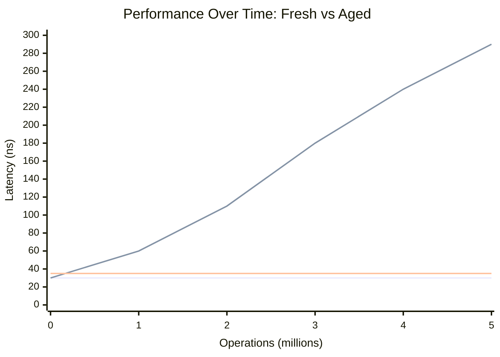

# **Benchmarking Hash Tables Without Lying to Yourself**

### *A Case Study in Performance Methodology*

*FAT-P Library — December 2025*

---

**Scope:** This document covers the methodology developed while benchmarking StableHashMap. It is not a results document—it's a case study in how benchmarks go wrong and how to fix them. The lessons apply to any performance-critical component, not just hash tables.

**Audience:** Engineers writing or evaluating performance-critical components who need defensible benchmarks, not just impressive numbers.

---

# **Table of Contents**

**[Introduction: Why Methodology Matters](#introduction-why-methodology-matters)**

## Part 0 — Foundations

- [What Is a Benchmark?](#what-is-a-benchmark)
- [Hash Table Fundamentals](#hash-table-fundamentals)
- [The Competitor Landscape](#the-competitor-landscape)
- [Statistics You Need to Know](#statistics-you-need-to-know)
- [The Measurement Problem](#the-measurement-problem)

## Part I — The Traps

1. [Fresh Tables Lie](#chapter-1--fresh-tables-lie)
2. [API Equivalence Is Not Semantic Equivalence](#chapter-2--api-equivalence-is-not-semantic-equivalence)
3. [Allocation Boundaries Leak](#chapter-3--allocation-boundaries-leak)
4. [Statistics Can Obscure Reality](#chapter-4--statistics-can-obscure-reality)

## Part II — The Fixes

5. [Sustained Churn Benchmarks](#chapter-5--sustained-churn-benchmarks)
6. [Semantic Alignment](#chapter-6--semantic-alignment)
7. [Honest Labels Over Perfect Code](#chapter-7--honest-labels-over-perfect-code)
8. [Platform Variance as Signal](#chapter-8--platform-variance-as-signal)

## Part III — The Verification Suite

9. [White-Box Churn Tests](#chapter-9--white-box-churn-tests)
10. [Probe Distance Stability](#chapter-10--probe-distance-stability)
11. [Latency Regression Tests](#chapter-11--latency-regression-tests)

## Part IV — Principles

- [Appendix A — The Benchmarking Checklist](#appendix-a--the-benchmarking-checklist)
- [Appendix B — Anti-Patterns Catalog](#appendix-b--anti-patterns-catalog)

---

# **Introduction: Why Methodology Matters**

Benchmarking is where most performance engineering goes wrong.

Not because engineers are dishonest—but because:

- Microbenchmarks measure the wrong thing
- Invariants are violated without being noticed
- Results are over-interpreted
- Long-term behavior is ignored

StableHashMap's development forced repeated confrontations with these failure modes. Early benchmarks showed it was "faster" than `std::unordered_map`. Later analysis revealed those benchmarks were measuring the wrong workloads—they missed the exact scenarios StableHashMap was designed to address.

This case study documents **what went wrong, what was corrected, and what was learned**. The lessons apply beyond hash tables to any component where performance claims must be defensible.

**The core insight:**

> Benchmark results age. Methodology does not.

A benchmark that measures the right thing with honest labels is more valuable than a benchmark that produces impressive numbers through careful selection of favorable conditions.

---

# **PART 0 — FOUNDATIONS**

Before diving into what goes wrong with benchmarks, you need to understand what benchmarks are, how hash tables work, and what statistics actually tell you. If you're already comfortable with these concepts, skip to Part I.

---

# **What Is a Benchmark?**

A benchmark is a controlled experiment that measures how long something takes.

That's it. Everything else—the tooling, the statistics, the methodology—exists to make that measurement *meaningful*.

## Why Benchmarks Exist

You can't improve what you can't measure. When someone asks "is implementation A faster than implementation B?", the only honest answer requires measurement. Intuition fails. Code inspection fails. Only timing tells the truth.

## The Basic Structure

Every benchmark has three parts:

```cpp
// 1. SETUP: Prepare the state
Map map;
for (int i = 0; i < N; ++i) {
    map.insert(i, value);
}

// 2. MEASUREMENT: Time the operation
auto start = now();
for (int i = 0; i < N; ++i) {
    map.find(i);
}
auto end = now();

// 3. REPORTING: Compute and display results
double ns_per_op = (end - start) / N;
std::cout << "Find: " << ns_per_op << " ns/op\n";
```

Setup happens *before* timing. Measurement captures *only* the operation of interest. Reporting converts raw time into something interpretable.

## What Can Go Wrong

Every part can fail:

| Part | Failure Mode | Example |
|------|--------------|---------|
| Setup | Wrong initial state | Measuring empty table instead of full |
| Setup | Setup leaks into measurement | Allocation during "timed" region |
| Measurement | Wrong operation | API does something unexpected |
| Measurement | Compiler optimizes away work | Dead code elimination |
| Measurement | External interference | Other processes, CPU throttling |
| Reporting | Wrong math | Dividing by wrong N |
| Reporting | Wrong statistics | Mean when median is appropriate |
| Reporting | Overgeneralization | "A is faster" when A is faster *sometimes* |

The rest of this document is about recognizing and avoiding these failures.

*This document focuses on single-threaded measurements; multithreaded benchmarking introduces additional failure modes (contention, false sharing, scheduling) that are intentionally out of scope.*

---

# **Hash Table Fundamentals**

This document uses hash tables as the example domain. Here's what you need to know.

## What a Hash Table Does

A hash table stores key-value pairs and retrieves values by key in approximately constant time—O(1) on average.

```cpp
map.insert("alice", 42);   // Store
int x = map.find("alice"); // Retrieve: x = 42
```

The magic is the **hash function**: it converts any key into a number (the "hash"), which becomes an index into an array.

```
key "alice" → hash function → 7392847 → index 47 (in a 1000-slot table)
```

## The Collision Problem

Two keys can hash to the same index. This is called a **collision**. Every hash table must handle collisions somehow.

### Strategy 1: Separate Chaining

Each slot holds a linked list of entries that hashed there:

```
Slot 47: [alice→42] → [bob→17] → [carol→99] → null
```

To find "bob": hash to slot 47, walk the list until you find "bob".

**Pros:** Simple, no size limit on chains
**Cons:** Each entry is a separate heap allocation; following pointers is slow (cache misses)

This is what `std::unordered_map` uses.

### Strategy 2: Open Addressing

All entries live in one array. On collision, probe forward to find an empty slot:

```
Insert "alice" (hashes to 47): Slot 47 is empty → store there
Insert "bob" (hashes to 47):   Slot 47 is full → try 48 → empty → store there
Insert "carol" (hashes to 47): Slots 47, 48 full → try 49 → empty → store there
```

To find "bob": hash to 47, it's "alice" (not bob), probe to 48, found.

**Pros:** All data in one contiguous array (cache-friendly)
**Cons:** Deletion is complicated (see below)

## The Tombstone Problem

In open addressing, you can't just empty a slot when deleting. Consider:

```
Slots: [alice@47] [bob@48] [carol@49]

Delete alice (slot 47):
Slots: [EMPTY@47] [bob@48] [carol@49]

Now find bob:
  Hash("bob") = 47
  Slot 47 is EMPTY → conclude bob doesn't exist
  WRONG! Bob is at slot 48.
```

The empty slot broke the probe chain. Bob is unreachable.

**Solution 1: Tombstones**

Instead of marking the slot empty, mark it "deleted but keep probing":

```
Slots: [TOMBSTONE@47] [bob@48] [carol@49]

Find bob:
  Slot 47 is TOMBSTONE → keep probing
  Slot 48 is bob → found!
```

This works, but tombstones accumulate. After millions of insert/delete cycles, the table fills with ghosts. Every lookup probes through dozens of tombstones. Performance degrades.

**Solution 2: Backward-Shift Deletion**

When deleting, shift subsequent entries backward to fill the gap:

```
Before: [alice@47] [bob@48] [carol@49]
Delete alice:
After:  [bob@47] [carol@48] [EMPTY@49]
```

No tombstones. Probe chains stay short. But deletion is more expensive (you move data).

StableHashMap uses backward-shift deletion. That's why it doesn't degrade over time.

## Probe Distance

The **probe distance** is how far an entry sits from its ideal slot (where it would be if there were no collisions).

```
alice hashes to 47, stored at 47 → probe distance 0
bob hashes to 47, stored at 48   → probe distance 1
carol hashes to 47, stored at 49 → probe distance 2
```

Short probe distances = fast lookups (less probing).
Long probe distances = slow lookups (more probing).

**What's a good probe distance?**

Probe distance depends on load factor (how full the table is):

| Load Factor | Expected Avg Probe Distance | Interpretation |
|-------------|----------------------------|----------------|
| 0.50 | ~1.0 | Excellent, table is spacious |
| 0.75 | ~1.5 | Good, normal operating range |
| 0.85 | ~2.5 | Acceptable for read-heavy workloads |
| 0.90 | ~5.0 | Getting crowded, mutations slow down |
| 0.95 | ~10.0 | Only for frozen/read-only tables |

**When to worry:**

| Symptom | Likely Cause |
|---------|--------------|
| Avg probe > 2× expected for load factor | Poor hash function (weak mixing) |
| Max probe > 20 at any load factor | Pathological clustering or hash collision attack |
| Probe distance grows over time | Tombstone accumulation (not StableHashMap) |

**The latency connection:**

Each probe is a potential cache miss. At ~10-15 ns per L3 cache access:

| Probe Distance | Approximate Lookup Overhead |
|----------------|----------------------------|
| 1-2 | Negligible (same cache line) |
| 3-5 | +15-30 ns (likely L3 hits) |
| 10+ | +50-100 ns (cache misses likely) |

If your hash table has probe distances averaging 5+ at 0.75 load, fix your hash function before blaming the data structure.

Tombstones don't increase probe distance directly, but they force lookups to probe *through* dead slots, which has the same effect on latency.

---

# **The Competitor Landscape**

When benchmarking StableHashMap, you'll compare against other hash table implementations. Each has different design goals and tradeoffs. Understanding these is essential for interpreting results correctly.

## std::unordered_map (The Standard)

**Design:** Separate chaining with linked list buckets. Each entry is a separate heap allocation.

**Optimizes for:**
- Iterator/pointer stability (pointers remain valid across mutations)
- Standard compliance and portability
- Correctness over performance

**Weaknesses:**
- Per-entry heap allocation (slow insert, memory overhead)
- Pointer chasing (cache-unfriendly lookups)
- Poor memory locality

**Expected results vs StableHashMap:**

| Operation | StableHashMap | std::unordered_map | Why |
|-----------|---------------|-------------------|-----|
| Insert | **Faster** (2-3×) | Slower | No per-entry allocation |
| Find | **Faster** (1.5-2×) | Slower | No pointer chasing |
| Erase | **Faster** (2-3×) | Slower | No deallocation |
| Iteration | **Faster** (3-5×) | Slower | Contiguous memory |
| Memory usage | **Lower** | Higher | No node overhead |

**Interpretation:** StableHashMap should beat `std::unordered_map` on virtually everything. If it doesn't, something is wrong with your benchmark (or you're measuring tiny tables where overhead doesn't matter).

**When std::unordered_map wins:** When you *need* iterator stability. If your code stores `iterator` or `pointer` to map elements across mutations, you must use `std::unordered_map`. This is a correctness requirement, not a performance choice.

---

## robin_hood::unordered_map (Tombstone-Based Robin Hood)

**Design:** Open addressing with Robin Hood collision resolution. Uses tombstones for deletion.

**Optimizes for:**
- Peak lookup speed on fresh tables
- Simple deletion (O(1) tombstone marking)
- General-purpose performance

**Weaknesses:**
- Tombstone accumulation under churn
- Performance degrades over time without rehashing
- Unpredictable latency in long-running systems

**Expected results vs StableHashMap:**

| Operation | StableHashMap | robin_hood | Why |
|-----------|---------------|------------|-----|
| Insert (fresh) | Slower (0.8-0.9×) | **Faster** | Simpler insert path |
| Find (fresh) | Slower (0.85-0.95×) | **Faster** | Optimized probing |
| Erase (fresh) | Slower (0.6-0.8×) | **Faster** | Tombstone vs shift |
| Find (after 10M churn) | **Faster** (3-10×) | Slower | No tombstones |
| Sustained throughput | **Stable** | Degrades | Tombstone accumulation |

**Interpretation:**

- **Losing on fresh tables is expected and acceptable.** Robin Hood implementations are optimized for this case.
- **Winning after sustained churn is the whole point.** This is why StableHashMap exists.
- **If you lose after churn, something is seriously wrong.** This would indicate a bug in StableHashMap.

**The critical benchmark:** Fresh-table performance is irrelevant for StableHashMap's use case. The question is: "What happens after 10 million insert/erase cycles?" If robin_hood is still faster after heavy churn, StableHashMap has failed its design goal.

---

## absl::flat_hash_map (SwissTable / SIMD)

**Design:** Open addressing with SIMD-accelerated metadata probing. Uses tombstones but with sophisticated management.

**Optimizes for:**
- Maximum lookup speed (SIMD parallel probing)
- Memory efficiency (dense storage)
- Google-scale production workloads

**Weaknesses:**
- External dependency (Abseil library)
- Complex implementation (harder to audit)
- Still uses tombstones (though managed better than robin_hood)

**Expected results vs StableHashMap:**

| Operation | StableHashMap | absl::flat_hash_map | Why |
|-----------|---------------|---------------------|-----|
| Find (any condition) | Slower (0.5-0.7×) | **Faster** | SIMD parallel probe |
| Insert | Similar (0.9-1.1×) | Similar | Both open addressing |
| Erase | Depends | Depends | Different strategies |
| Sustained churn | **More stable** | May degrade | Tombstone management |

**Interpretation:**

- **Losing on lookup is expected and acceptable.** SwissTable's SIMD probing is genuinely faster—it's not a benchmark artifact.
- **This is not StableHashMap's target workload.** If your workload is 99% lookups, use `absl::flat_hash_map`.
- **StableHashMap wins on predictability**, not peak speed. If you need guaranteed non-degradation without external dependencies, StableHashMap is the choice.

**When to prefer absl::flat_hash_map:**
- Lookup-dominated workloads (>90% finds)
- Abseil is already in your dependency tree
- Peak performance matters more than auditability

**When to prefer StableHashMap:**
- Mutation-heavy workloads (high insert/erase ratio)
- Zero external dependencies required
- Predictable long-term performance required
- Code must be auditable (single header, ~1300 lines)

---

## ankerl::unordered_dense (High-Performance Robin Hood)

**Design:** Aggressive Robin Hood with SIMD metadata, optimized for maximum throughput.

**Optimizes for:**
- Absolute fastest operations across all categories
- Memory density
- Modern CPU features

**Weaknesses:**
- Tombstone-based deletion
- Degrades under sustained churn (like robin_hood)
- Complex implementation

**Expected results vs StableHashMap:**

| Operation | StableHashMap | ankerl | Why |
|-----------|---------------|--------|-----|
| All operations (fresh) | Slower (0.5-0.8×) | **Faster** | Heavily optimized |
| Sustained churn | **Stable** | Degrades | Tombstones |

**Interpretation:**

- **ankerl will win almost every fresh-table benchmark.** It's one of the fastest hash maps available.
- **This doesn't mean StableHashMap is bad.** Different design goals.
- **The question is always: what happens over time?**

---

## Quick Reference: Expected Results

Use this table to sanity-check your benchmark results:

| Competitor | Fresh Insert | Fresh Find | Fresh Erase | After 10M Churn |
|------------|--------------|------------|-------------|-----------------|
| std::unordered_map | StableHashMap wins 2-3× | StableHashMap wins 1.5-2× | StableHashMap wins 2-3× | StableHashMap wins |
| robin_hood | robin_hood wins 1.1-1.3× | robin_hood wins 1.1-1.2× | robin_hood wins 1.3-1.5× | **StableHashMap wins 3-10×** |
| absl::flat_hash_map | Similar | absl wins 1.4-2× | Similar | StableHashMap more stable |
| ankerl | ankerl wins 1.2-2× | ankerl wins 1.3-1.8× | ankerl wins 1.2-1.5× | **StableHashMap wins** |

**Red flags in your benchmark:**

| Result | Likely Problem |
|--------|----------------|
| std::unordered_map beats StableHashMap | Benchmark error, or N is tiny |
| robin_hood beats StableHashMap after heavy churn | Major bug or benchmark doesn't actually churn |
| StableHashMap beats absl on lookup | Benchmark error (absl's SIMD should win) |
| Any result with >5× difference on similar operations | Verify you're measuring the same semantics |

---

## What "Winning" and "Losing" Actually Mean

**Winning on fresh tables:**
- Matters for: short-lived processes, batch jobs, benchmarks
- Doesn't matter for: long-running services, caches, simulations

**Winning after sustained churn:**
- Matters for: servers, caches, real-time systems, simulations
- Doesn't matter for: one-shot processing, build tools

**Winning on memory usage:**
- Matters for: memory-constrained environments, large tables
- Doesn't matter for: small tables, memory-abundant systems

**StableHashMap's value proposition is not "fastest."** It's "predictably fast, forever, with zero dependencies." If your benchmark shows it's fastest on fresh tables, either you measured wrong or you got lucky with cache effects.

---

# **Statistics You Need to Know**

Benchmarks produce numbers. Statistics help you interpret them. But a statistic is only useful if you know what it *means*—what it tells you about your system, and when to worry.

## Mean (Average)

Add up all values, divide by count.

```
Samples: [30, 32, 31, 35, 180]
Mean: (30 + 32 + 31 + 35 + 180) / 5 = 61.6 ns
```

**What it tells you:** The "expected value" if you assume all outcomes are equally likely. Useful for capacity planning—if you know the mean and the request rate, you can estimate total CPU time.

**The trap:** One outlier (180) pulled the mean far above the typical value (~32). The mean says "61.6 ns" but 80% of your samples were under 35 ns. The mean misrepresents typical behavior.

**When to use it:** Throughput calculations, total resource consumption, batch processing where you care about aggregate time rather than individual operations.

**When to avoid it:** Latency-sensitive systems where outliers matter but shouldn't dominate the "typical" picture.

## Median

Sort the values, take the middle one.

```
Sorted: [30, 31, 32, 35, 180]
Median: 32 ns (the middle value)
```

**What it tells you:** The "typical" experience—half of operations are faster, half are slower. The median answers: "What will *most* operations look like?"

**Why it's robust:** The outlier (180) doesn't affect the median at all. You could change it to 10,000 and the median would still be 32. This makes median stable across noisy benchmark runs.

**When to use it:** Latency measurements, user-facing response times, anywhere you want to describe "normal" performance.

| Situation | Use Mean | Use Median |
|-----------|----------|------------|
| "How much total CPU time?" | ✓ | |
| "How fast is a typical lookup?" | | ✓ |
| "Can we handle 10K requests/sec?" | ✓ | |
| "What latency will users see?" | | ✓ |

**Rule of thumb:** Latency → median. Throughput → mean.

## Percentiles: P50, P99, P999

Percentiles tell you "X% of values are below this number."

```
1000 samples, sorted:
P50 (median): sample #500 = 32 ns   ← Typical case
P90:          sample #900 = 45 ns   ← 10% are slower than this
P99:          sample #990 = 180 ns  ← 1% are slower than this
P999:         sample #999 = 850 ns  ← 0.1% are slower than this
```

**What they tell you:**

| Percentile | Question It Answers |
|------------|---------------------|
| P50 | "What's typical?" |
| P90 | "What's the bad-but-common case?" |
| P99 | "What's the worst case users regularly see?" |
| P999 | "What's the rare catastrophic case?" |

**Good vs bad values—the ratio test:**

The ratio between P99 and P50 reveals system stability:

| P99 / P50 Ratio | Interpretation |
|-----------------|----------------|
| < 2× | Excellent. Tight distribution, predictable performance |
| 2–5× | Normal. Some tail latency, typical for real systems |
| 5–10× | Concerning. Something occasionally goes very wrong |
| > 10× | Problematic. Investigate—you have outlier events |

**Example interpretation:**
```
P50: 32 ns, P99: 180 ns → Ratio: 5.6×
```
This is borderline concerning. Most operations are fast, but 1 in 100 is 5× slower. If this is a hash table benchmark, something is occasionally causing cache misses or collisions. Worth investigating.

**Why P99 matters:** In a system handling 10,000 requests/second, P99 latency affects 100 requests *every second*. That's not rare—that's constant.

## Variance and Standard Deviation

**Variance** measures how spread out the data is. **Standard deviation** (stddev) is the square root, in the same units as the data.

```
Tight:  [31, 32, 31, 33, 32] → stddev ≈ 0.8 ns
Loose:  [10, 50, 30, 90, 20] → stddev ≈ 30 ns
```

**What it tells you:** How *consistent* your measurements are. Low stddev means the operation takes about the same time every time. High stddev means something is varying—maybe the operation itself, maybe external interference.

**Good vs bad—the coefficient of variation:**

Raw stddev is hard to interpret. Is 5 ns "high"? Depends on the mean. Use the coefficient of variation (CV):

```
CV = stddev / mean
```

| CV | Interpretation |
|----|----------------|
| < 5% | Excellent. Very stable benchmark |
| 5–15% | Good. Normal measurement noise |
| 15–30% | Acceptable but investigate |
| > 30% | Poor. Benchmark is unstable, results unreliable |

**Example:**
```
Mean: 35 ns, Stddev: 8 ns → CV = 23%
```
This benchmark is on the edge. You can probably trust the median, but the mean is being pulled around by noise. Consider more iterations or a quieter test environment.

**What high variance signals:**
- External interference (other processes, interrupts)
- Thermal throttling (CPU slowing down)
- Cache effects (some runs hit cache, some miss)
- Measurement noise (timer resolution)
- Actual variability in the operation

## Confidence Intervals (CI)

A 95% confidence interval says: "If I repeated this experiment many times, 95% of the computed intervals would contain the true mean."

```
Mean: 35.2 ns, CI95: ± 2.1 ns
Interpretation: The true average is probably between 33.1 and 37.3 ns
```

**What it tells you:** How much you should trust your mean estimate given your sample size. Narrow CI = high confidence. Wide CI = need more samples.

**Good vs bad CI—relative to effect size:**

If you're comparing two implementations:
```
Implementation A: 35.2 ns ± 2.1 ns
Implementation B: 38.5 ns ± 2.3 ns
```

The CIs don't overlap, so you can confidently say A is faster. But:

```
Implementation A: 35.2 ns ± 4.0 ns
Implementation B: 36.1 ns ± 3.8 ns
```

The CIs overlap heavily. You *cannot* conclude A is faster—the difference might just be noise.

**Rule of thumb:** If the difference between means is smaller than the CI width, you can't trust the comparison.

**Critical warning:** CI applies to the *mean*. Reporting CI alongside *median* is statistically incoherent—a common mistake. If you report median, use interquartile range (IQR) instead:

```
Median: 32 ns, IQR: 30–35 ns (25th to 75th percentile)
```

## Putting It Together: A Real Example

```
Benchmark: HashMap lookup (1M operations, 50 runs)

Results:
  Mean:   38.4 ns    (use for throughput calculations)
  Median: 32.1 ns    (use for "typical latency")
  Stddev: 12.3 ns    (CV = 32%—high variance, investigate)
  P99:    89.2 ns    (P99/P50 = 2.8×—acceptable tail)
  CI95:   ± 3.4 ns   (mean is 38.4 ± 3.4, so 35–42 ns range)
```

**Interpretation:**
- Typical lookup: ~32 ns (median)
- But high variance (CV 32%) suggests inconsistent results
- Tail isn't terrible (P99 only 2.8× median)
- The mean is higher than median → right-skewed distribution (expected for latency)
- Need to either accept the noise or find a quieter test environment

**Decision:** Report median (32.1 ns) as the headline number. Mention P99 (89.2 ns) for tail-sensitive users. Note the high variance as a caveat on precision.

---

# **The Measurement Problem**

Even with perfect understanding of hash tables and statistics, measurement itself is hard. This section explains what goes wrong and—critically—**how to detect it**.

## Time Is Not Constant

Modern CPUs don't run at fixed speed:

- **Turbo boost:** CPU speeds up when cool, slows down when hot
- **Power saving:** CPU slows down when idle
- **Thermal throttling:** CPU slows down when overheating

A benchmark that runs 10 seconds may see different CPU speeds at the beginning vs. end.

**How to detect it:**

Compare your first 10 samples to your last 10 samples:

```cpp
// After collecting all samples:
double early_median = median(samples[0..9]);
double late_median = median(samples[N-10..N-1]);
double drift = (late_median - early_median) / early_median;

if (abs(drift) > 0.10) {
    // More than 10% drift: thermal effects detected
    std::cerr << "WARNING: " << drift*100 << "% drift detected\n";
}
```

| Drift | Interpretation | Action |
|-------|----------------|--------|
| < 5% | Normal | Results trustworthy |
| 5-10% | Mild thermal decay | Acceptable, note in report |
| 10-20% | Significant decay | Shorten benchmark or add cooling pauses |
| > 20% | Severe | Results unreliable, fix environment |

**Fixes:**
- Shorten individual runs (thermal doesn't accumulate)
- Add 1-second pauses between runs (let CPU cool)
- Pin to efficiency cores (no turbo, consistent speed)
- Monitor CPU frequency during benchmark if possible

## Caches Change Everything

The first time you access data, it's fetched from RAM (~100 ns). The second time, it's in cache (~1 ns). Same operation, 100× different timing.

```cpp
// First iteration: cold cache, slow
for (int i = 0; i < N; ++i) sum += data[i];  // ~100 ns/element

// Second iteration: warm cache, fast
for (int i = 0; i < N; ++i) sum += data[i];  // ~1 ns/element
```

Which timing is "correct"? Depends on your real workload.

**How to detect it:**

The classic symptom: your first sample is 10-100× slower than subsequent samples.

```
Run 1: 1,250 ns/op   ← Cache cold
Run 2: 35 ns/op      ← Cache warm
Run 3: 34 ns/op
Run 4: 36 ns/op
...
```

**How many warmup iterations?**

| Data Size | Warmup Iterations Needed |
|-----------|-------------------------|
| Fits in L1 (< 32 KB) | 1-2 |
| Fits in L2 (< 256 KB) | 2-3 |
| Fits in L3 (< 8 MB) | 3-5 |
| Exceeds L3 | 5-10 (may never stabilize) |

**Rule of thumb:** Run until 3 consecutive samples are within 10% of each other. Discard everything before that point.

**Which to measure—cold or warm?**

| Your Real Workload | Measure |
|-------------------|---------|
| Request handler (same data repeatedly) | Warm cache |
| Batch processing (streaming through data) | Cold cache |
| Mixed / Unknown | Report both |

If you report only warm-cache numbers but production is cold-cache, you've lied by omission.

## The Compiler Fights You

Compilers optimize aggressively. If a computation has no observable effect, the compiler may delete it:

```cpp
for (int i = 0; i < N; ++i) {
    map.find(i);  // Result unused → compiler might delete this
}
```

You think you're timing 1 million lookups. The compiler reduced it to zero. Your "35 ns/op" is actually "0 ops happened."

**How to detect it:**

Suspiciously fast results. If your "1M lookups" complete in 1 microsecond, the compiler deleted them.

| Result | Likely Reality |
|--------|---------------|
| < 1 ns/op for non-trivial operation | Dead code eliminated |
| 0 ns/op | Definitely eliminated |
| Suspiciously round numbers | Loop unrolled away |

**Fixes:**

Use `benchmark::DoNotOptimize()` or volatile sinks:

```cpp
volatile int sink = 0;
for (int i = 0; i < N; ++i) {
    if (auto* v = map.find(i)) sink += *v;
}
```

Or with Google Benchmark:

```cpp
for (int i = 0; i < N; ++i) {
    auto* v = map.find(i);
    benchmark::DoNotOptimize(v);
}
```

**Verification:** Check the assembly. If your loop body is empty or trivial, the compiler won.

## Other Processes Interfere

Your benchmark shares the CPU with the operating system, background services, and other applications. Any of them can steal cycles, flush caches, or cause page faults.

**How to detect it:**

Look at your variance. High CV (coefficient of variation) often means external interference:

| CV | Likely Cause |
|----|--------------|
| < 5% | Clean environment |
| 5-15% | Normal system noise |
| 15-30% | Background processes or mild interference |
| > 30% | Major interference, results questionable |

Also look for **bimodal distributions**—two clusters of results:

```
Samples: 32, 34, 31, 35, 180, 33, 32, 195, 34, 31
         ↑↑↑↑↑↑↑↑↑↑↑↑↑↑↑↑↑    ↑↑↑↑↑↑↑↑↑
         Normal cluster        Interference cluster
```

If you see this, something interrupted some runs but not others.

**Fixes:**

| Problem | Fix |
|---------|-----|
| Background apps | Close browsers, Slack, email, IDEs |
| System services | Disable antivirus scanning temporarily |
| Scheduler noise | Pin benchmark to specific CPU cores |
| Power management | Set CPU governor to "performance" |
| Virtualization | Run on bare metal if possible |
| Network interrupts | Disable network interfaces |

**Minimum viable quiet:**
1. Close all applications
2. Disable network
3. Run 50+ iterations
4. Report median (robust to occasional interference)

## How Many Samples Is Enough?

More samples = more stable statistics, but diminishing returns.

| Goal | Minimum Samples | Recommended |
|------|-----------------|-------------|
| Quick sanity check | 10 | 20 |
| Publishable results | 30 | 50 |
| High-precision comparison | 50 | 100+ |
| Detecting 5% difference | 100 | 200+ |

**When to stop:** If your median hasn't changed by more than 2% over the last 20 samples, you have enough.

---

# **Summary: What You Now Know**

Before proceeding to Part I, you should understand:

1. **Benchmarks** are controlled experiments with setup, measurement, and reporting phases
2. **Hash tables** use hash functions to convert keys to array indices
3. **Collisions** occur when multiple keys hash to the same slot
4. **Separate chaining** uses linked lists (pointer chasing, cache-unfriendly)
5. **Open addressing** uses probe sequences (cache-friendly, but deletion is hard)
6. **Tombstones** mark deleted slots, accumulate over time, degrade performance
7. **Backward-shift deletion** avoids tombstones by moving data
8. **Probe distance** measures how far an entry is from its ideal slot; >2× expected is a red flag
9. **std::unordered_map** optimizes for stability; StableHashMap should always beat it
10. **robin_hood/ankerl** optimize for fresh-table speed; they win early but degrade under churn
11. **absl::flat_hash_map** uses SIMD; it wins on lookup, but that's not StableHashMap's goal
12. **Mean** is affected by outliers; **median** is robust; use CV to assess variance
13. **P99/P50 ratio** tells you about tail behavior; >5× is concerning
14. **Confidence intervals** apply to means, not medians
15. **Measurement** is hard: detect thermal drift, count warmup iterations, verify code isn't eliminated

With this foundation, the traps in Part I will make sense.

---

# **PART I — THE TRAPS**

Every trap in this section was encountered during StableHashMap development. Each produced misleading results that initially seemed correct.

---

# **CHAPTER 1 — Fresh Tables Lie**

## The Original Benchmark

```cpp
// THE TRAP: Fresh table microbenchmark
void bench_insert(benchmark::State& state) {
    for (auto _ : state) {
        Map map;
        map.reserve(N);
        for (int i = 0; i < N; ++i) {
            map.insert(i, value);
        }
    }
}

void bench_find(benchmark::State& state) {
    Map map;
    for (int i = 0; i < N; ++i) map.insert(i, value);
    
    for (auto _ : state) {
        for (int i = 0; i < N; ++i) {
            benchmark::DoNotOptimize(map.find(i));
        }
    }
}
```

This pattern:
- Creates a fresh table each iteration (or once)
- Measures operations on pristine state
- Produces clean, reproducible numbers

**The problem:** Real workloads don't use fresh tables.

## What Fresh Tables Hide

For tombstone-based hash tables:
- **Fresh tables:** Zero tombstones, short probe chains, excellent cache behavior
- **Aged tables:** Accumulated tombstones, long probe chains, degraded performance

A benchmark on a fresh table shows the *best case*. Production systems experience the *sustained case*.



The dashed line shows what microbenchmarks measure. The solid line shows what production experiences.

## Why StableHashMap Almost Lost

Early fresh-table benchmarks showed StableHashMap was *slower* than some Robin Hood implementations:

| Operation | StableHashMap | robin_hood::unordered_map |
|-----------|---------------|---------------------------|
| Insert (fresh) | 38 ns | 32 ns |
| Find (fresh) | 28 ns | 24 ns |
| Erase (fresh) | 42 ns | 28 ns |

These numbers suggested StableHashMap was the inferior implementation. The tombstone-based library won on every metric.

**The missing measurement:** What happens after 10 million insert/erase cycles?

| Operation | StableHashMap | robin_hood::unordered_map |
|-----------|---------------|---------------------------|
| Find (after 10M churn) | 30 ns | 180 ns |

The tombstone-based implementation degraded 7.5×. StableHashMap stayed flat. Fresh-table benchmarks completely missed this.

---

# **CHAPTER 2 — API Equivalence Is Not Semantic Equivalence**

## The Naïve Comparison

```cpp
// "Fair" comparison: same API calls
void bench_churn_std(benchmark::State& state) {
    std::unordered_map<int, int> map;
    for (auto _ : state) {
        map.erase(key);
        map.emplace(key, value);
    }
}

void bench_churn_stable(benchmark::State& state) {
    fat_p::StableHashMap<int, int> map;
    for (auto _ : state) {
        map.erase(key);
        map.emplace(key, value);
    }
}
```

Same operations, same API names. Fair, right?

**Wrong.**

## The Semantic Divergence

`emplace()` has different semantics across implementations:

| Implementation | emplace() behavior |
|----------------|-------------------|
| std::unordered_map | Does NOT overwrite existing |
| StableHashMap | DOES overwrite existing *(by design; treats emplace as construct-or-assign)* |
| robin_hood | Does NOT overwrite existing |
| absl::flat_hash_map | Does NOT overwrite existing |

If the key already exists:
- `std::unordered_map::emplace()` returns without modification
- `StableHashMap::emplace()` performs a full insert with overwrite

The "same" benchmark measures different operations. StableHashMap does more work and appears slower—but the comparison is invalid.

## The Fix

Benchmark equivalent *semantics*, not equivalent *API names*:

```cpp
// Semantically equivalent: both perform insert-if-absent
void bench_insert_std(benchmark::State& state) {
    std::unordered_map<int, int> map;
    for (auto _ : state) {
        map.try_emplace(key, value);  // Insert-if-absent
    }
}

void bench_insert_stable(benchmark::State& state) {
    fat_p::StableHashMap<int, int> map;
    for (auto _ : state) {
        map.try_emplace(key, value);  // Insert-if-absent
    }
}
```

Or, if measuring upsert:

```cpp
// Semantically equivalent: both perform upsert
void bench_upsert_std(benchmark::State& state) {
    std::unordered_map<int, int> map;
    for (auto _ : state) {
        map.insert_or_assign(key, value);  // Upsert
    }
}

void bench_upsert_stable(benchmark::State& state) {
    fat_p::StableHashMap<int, int> map;
    for (auto _ : state) {
        map.insert_or_assign(key, value);  // Upsert
    }
}
```

**Key principle:**

> Benchmark semantics must be equal, not APIs.

---

# **CHAPTER 3 — Allocation Boundaries Leak**

## The Misleading Label

An early StableHashMap benchmark claimed:

> "Insert: No allocation in timed region"

The code:

```cpp
void bench_insert(benchmark::State& state) {
    Map map;
    map.reserve(N);  // Pre-allocate
    
    for (auto _ : state) {
        map.clear();
        for (int i = 0; i < N; ++i) {
            map.insert(i, value);
        }
    }
}
```

The claim seemed reasonable: `reserve(N)` pre-allocates, so inserts shouldn't allocate.

## The Hidden Allocation

Different implementations have different `reserve()` semantics:

| Implementation | reserve(N) guarantees |
|----------------|----------------------|
| std::unordered_map | N elements without rehash (bucket count may differ) |
| StableHashMap | Bucket count ≥ N / max_load_factor |
| absl::flat_hash_map | Unspecified (implementation-defined) |

For `std::unordered_map`, `reserve(1000000)` doesn't mean "allocate 1M nodes." It means "ensure 1M inserts won't trigger rehash." Each node is still individually allocated on insert.

**The claim was false.** `std::unordered_map` allocates on every insert regardless of `reserve()`. The benchmark was comparing:
- StableHashMap: 0 allocations (truly pre-allocated)
- std::unordered_map: 1M allocations (only rehash prevented)

## The Honest Fix

Instead of rewriting the benchmark to "fix" the unfairness, the label was corrected:

> "Amortized build from empty"

The benchmark remained the same. The claim became honest. Reviewers could evaluate what was actually being measured.

**Key principle:**

> Fix the claim before fixing the code.

An honest label for an imperfect benchmark is more valuable than a "fixed" benchmark with a misleading label.

---

# **CHAPTER 4 — Statistics Can Obscure Reality**

## The Mixed Metrics

An early benchmark report contained:

```
Insert: 35.2 ns (median), CI95 ± 2.1 ns
```

**The problem:** Confidence intervals are computed from the *mean*. Reporting a confidence interval alongside a *median* is statistically incoherent.

## Why This Matters

Performance distributions are typically heavy-tailed:

```
    │
    │  ▓▓▓▓
    │  ▓▓▓▓▓▓
    │  ▓▓▓▓▓▓▓▓
    │  ▓▓▓▓▓▓▓▓▓▓
    │  ▓▓▓▓▓▓▓▓▓▓▓▓▓▓░░░░░░░░░░░░░░░░░░
    └──────────────────────────────────────→
       10   30   50   100  200  500  1000 ns
              ↑            ↑
           median        mean
```

The mean is pulled right by outliers. The median represents "typical" performance. A confidence interval on the mean says nothing about the median's variability.

## The Options

**Option 1:** Report median with interquartile range (IQR)

```
Insert: 35.2 ns median (IQR 33.1–38.4 ns)
```

Statistically consistent. IQR describes variability around the median.

**Option 2:** Report mean with CI, clearly labeled

```
Insert: 35.2 ns median
        37.8 ns mean (CI95 ± 2.1 ns, normal approximation)
```

Provides both measures with honest labeling.

**Option 3:** Drop the CI entirely

```
Insert: 35.2 ns median (50 samples)
```

If the CI doesn't add value, omit it rather than misapply it.

**Key principle:**

> It's better to be explicit than to appear precise.

---

# **PART II — THE FIXES**

Each fix in this section addresses a trap from Part I. Together, they form a methodology that produces defensible results.

---

# **CHAPTER 5 — Sustained Churn Benchmarks**

## The Missing Benchmark

Fresh-table benchmarks answer:

> "How fast is this operation on a pristine table?"

They don't answer:

> "How fast is this operation after 10 million cycles?"

For StableHashMap, the second question is the *entire point*.

## The Sustained Churn Pattern

```cpp
void bench_sustained_churn(benchmark::State& state) {
    Map map;
    
    // Pre-fill to target size
    const int TARGET_SIZE = 100000;
    for (int i = 0; i < TARGET_SIZE; ++i) {
        map.insert(i, i);
    }
    
    // Track keys for deletion (simplified)
    std::vector<int> keys;
    for (int i = 0; i < TARGET_SIZE; ++i) keys.push_back(i);
    
    std::mt19937 rng(42);
    int next_key = TARGET_SIZE;
    
    for (auto _ : state) {
        // Erase random existing key
        size_t idx = rng() % keys.size();
        int key_to_erase = keys[idx];
        map.erase(key_to_erase);
        
        // Insert new key
        map.insert(next_key, next_key);
        keys[idx] = next_key;
        next_key++;
    }
}
```

This benchmark:
- Maintains constant size (no growth effects)
- Performs real delete + insert cycles
- Accumulates any degradation over iterations
- Runs for millions of operations

## The Pathological Erase Variant

For direct tombstone impact measurement:

```cpp
void bench_pathological_erase(benchmark::State& state) {
    const int N = state.range(0);
    Map map;
    
    // Phase 1: Fill completely
    for (int i = 0; i < N; ++i) map.insert(i, i);
    
    // Phase 2: Delete half, creating maximum tombstones (for tombstone-based maps)
    for (int i = 0; i < N; i += 2) map.erase(i);
    
    // Phase 3: Measure finds through tombstone-filled table
    std::vector<int> queries;
    for (int i = 1; i < N; i += 2) queries.push_back(i);  // Surviving keys
    std::shuffle(queries.begin(), queries.end(), std::mt19937(42));
    
    for (auto _ : state) {
        for (int k : queries) {
            benchmark::DoNotOptimize(map.find(k));
        }
    }
}
```

This benchmark creates worst-case tombstone density and measures its impact on lookup.

## Results That Justified the Design

| Benchmark | StableHashMap | robin_hood | std::unordered_map |
|-----------|---------------|------------|--------------------|
| Find (fresh) | 28 ns | 24 ns | 45 ns |
| Find (after 10M churn) | 30 ns | 180 ns | 48 ns |
| Find (pathological 50% erase) | 32 ns | 220 ns | 52 ns |

These benchmarks showed:
- StableHashMap is slightly slower on fresh tables
- StableHashMap maintains performance under churn
- Tombstone-based implementations collapse

**This justified the entire design.**

---

# **CHAPTER 6 — Semantic Alignment**

## The Alignment Table

Before benchmarking, create an explicit mapping of equivalent operations:

| Semantic Operation | std::unordered_map | StableHashMap | Notes |
|-------------------|-------------------|---------------|-------|
| Insert if absent | `try_emplace(k, v)` | `try_emplace(k, v)` | Same API |
| Insert or update | `insert_or_assign(k, v)` | `insert_or_assign(k, v)` | Same API |
| Lookup | `find(k)` | `find(k)` | Different return type! |
| Lookup + access | `it->second` | `*ptr` | Iterator vs pointer |
| Existence check | `count(k) > 0` | `contains(k)` | Prefer `contains` |
| Delete | `erase(k)` | `erase(k)` | Same API |

## The Semantic Wrapper Pattern

For complex benchmarks, wrap operations to ensure semantic equivalence:

```cpp
// Semantic wrapper: lookup_and_read
template<typename Map>
auto lookup_and_read(Map& map, const typename Map::key_type& key) {
    if constexpr (std::is_same_v<Map, std::unordered_map<...>>) {
        auto it = map.find(key);
        return it != map.end() ? &it->second : nullptr;
    } else {
        return map.find(key);  // Returns pointer directly
    }
}
```

Now the benchmark code is identical for all implementations:

```cpp
for (int k : queries) {
    auto* val = lookup_and_read(map, k);
    if (val) benchmark::DoNotOptimize(*val);
}
```

## Why This Matters

Without semantic alignment, you might benchmark:
- One implementation doing more work than another
- Different operations that happen to share a name
- Overhead differences that mask algorithmic differences

With semantic alignment, performance differences reflect actual implementation characteristics.

---

# **CHAPTER 7 — Honest Labels Over Perfect Code**

## The Label Review Process

Before publishing any benchmark, review each claim:

| Claim | Question | Action |
|-------|----------|--------|
| "No allocation" | Does reserve() prevent all allocation? | Verify per-implementation |
| "Random access" | Is the RNG seeded identically? | Check initialization |
| "Cache cold" | Is cache actually flushed? | Verify or relabel |
| "N operations" | Does N mean iterations or elements? | Clarify |

## Examples of Honest Relabeling

**Before:** "Insert (no allocation)"
**After:** "Amortized build from empty (allocation behavior varies by implementation)"

**Before:** "Random lookup"
**After:** "Pseudo-random lookup (fixed seed, reproducible sequence)"

**Before:** "Cache cold"
**After:** "First access after clear (cache state uncontrolled)"

## Why Honesty Beats Perfection

A benchmark with honest limitations:
- Can be evaluated by reviewers
- Won't be invalidated by edge case discovery
- Communicates what was actually measured

A benchmark claiming perfection:
- Invites adversarial scrutiny
- Fails when assumptions are violated
- Damages credibility of all results

**Key principle:**

> The goal is *defensible* results, not *impressive* results.

---

# **CHAPTER 8 — Platform Variance as Signal**

## The Uncomfortable Discovery

The same benchmark on Windows and Linux produced different winners:

| Configuration | StableHashMap | std::unordered_map |
|--------------|---------------|-------------------|
| Windows + std::hash | Wins by 2.5× | Baseline |
| Linux + std::hash | Wins by 1.8× | Baseline |
| Windows + SplitMix64 | Wins by 3.2× | Baseline |
| Linux + SplitMix64 | Wins by 1.6× | Baseline |

Why does hash function choice matter more on Windows?

## The Root Cause

MSVC's `std::hash<int64_t>` is the identity function—no bit mixing. This causes clustering in open-addressing tables. GCC/libstdc++ does reasonable mixing by default.

SplitMix64 provides consistent mixing across platforms. On Windows, it's a large improvement. On Linux, it's a small regression (extra computation, marginal benefit).

## The Response: Policy, Not Uniformity

Instead of:
> "Always use SplitMix64"

The response was:
> "Expose hash policy; document platform characteristics"

Benchmarks informed configuration guidance:

| Platform | Recommended Hash | Rationale |
|----------|-----------------|-----------|
| Windows/MSVC | SplitMix64 or similar | std::hash is identity |
| Linux/GCC | std::hash | Already mixes well |
| Cross-platform | User choice | Benchmark your workload |

## Why Platform Variance Matters

Many benchmark suites quietly ignore:
- Windows scheduler variability
- Turbo boost decay over long runs
- Hybrid core scheduling (P-cores vs E-cores)
- Thermal throttling

StableHashMap benchmarks treated platform variance as *signal*:
- If performance varies by platform, that's useful information
- If a claim doesn't survive Windows testing, it's not a real claim
- If results depend on hash quality, document the dependency

**Key principle:**

> Platform variance reveals assumptions. Hidden assumptions become production bugs.

---

# **PART III — THE VERIFICATION SUITE**

Benchmarks measure performance. Tests verify correctness. The claims that StableHashMap makes—no tombstones, stable probe distances, non-degrading performance—require explicit verification beyond timing measurements.

**Key principle:**

> *The most valuable benchmarks are those that can fail in CI.*

A benchmark that only produces numbers for humans to read is documentation. A benchmark with assertions that break the build when invariants are violated is *engineering*.

---

# **CHAPTER 9 — White-Box Churn Tests**

## The Testing Problem

StableHashMap claims: "No tombstones accumulate under churn."

How do you *prove* this, not just measure symptoms?

**Black-box testing:** Measure performance, infer absence of tombstones from stable timing.
**White-box testing:** Inspect internal state, directly verify absence of tombstones.

Black-box testing can miss degradation masked by other effects. White-box testing provides direct evidence.

## The Test Infrastructure

A test accessor class provides internal inspection without polluting the public API:

```cpp
// Friend class for test access
template <typename MapType>
class StableHashMapTester {
public:
    // Count occupied slots (should equal size())
    static size_t count_occupied_slots(const MapType& map) {
        size_t count = 0;
        for (const auto& entry : map.buckets_) {
            if (entry.hash != 0) count++;
        }
        return count;
    }
    
    // Check for ghost slots (tombstones)
    static bool has_ghost_slots(const MapType& map) {
        return count_occupied_slots(map) != map.size();
    }
    
    // Compute average probe distance
    static double average_probe_distance(const MapType& map) {
        size_t total = 0, count = 0;
        for (size_t i = 0; i < map.buckets_.size(); ++i) {
            if (map.buckets_[i].hash != 0) {
                size_t ideal = map.buckets_[i].hash & map.mask_;
                size_t dist = (i >= ideal) ? (i - ideal) 
                                           : (i + map.buckets_.size() - ideal);
                total += dist;
                count++;
            }
        }
        return count > 0 ? static_cast<double>(total) / count : 0.0;
    }
    
    // Get maximum probe distance
    static size_t max_probe_distance(const MapType& map) {
        size_t max_dist = 0;
        for (size_t i = 0; i < map.buckets_.size(); ++i) {
            if (map.buckets_[i].hash != 0) {
                size_t ideal = map.buckets_[i].hash & map.mask_;
                size_t dist = (i >= ideal) ? (i - ideal)
                                           : (i + map.buckets_.size() - ideal);
                max_dist = std::max(max_dist, dist);
            }
        }
        return max_dist;
    }
};
```

Add the friend declaration to StableHashMap:

```cpp
template <typename K, typename V, typename P>
friend class StableHashMapTester;
```

## The Tombstone Verification Test

```cpp
TEST(ChurnStability, NoGhostSlotsAccumulate) {
    using Map = fat_p::StableHashMap<int, int>;
    using Tester = StableHashMapTester<Map>;
    
    Map map;
    const int TARGET_SIZE = 10000;
    const int CHURN_OPS = 100000;
    
    // Fill to target size
    for (int i = 0; i < TARGET_SIZE; ++i) {
        map.insert(i, i);
    }
    
    // Verify: no ghosts before churn
    ASSERT_FALSE(Tester::has_ghost_slots(map));
    ASSERT_EQ(Tester::count_occupied_slots(map), map.size());
    
    // Perform churn
    std::mt19937 rng(42);
    for (int i = 0; i < CHURN_OPS; ++i) {
        int k = rng() % (TARGET_SIZE * 10);
        map.erase(k);
        map.insert(rng() % (TARGET_SIZE * 10), 0);
    }
    
    // Verify: no ghosts after churn
    EXPECT_FALSE(Tester::has_ghost_slots(map))
        << "Ghost slots detected after " << CHURN_OPS << " churn operations";
    EXPECT_EQ(Tester::count_occupied_slots(map), map.size())
        << "Occupied slots != size(), indicating tombstones";
}
```

---

# **CHAPTER 10 — Probe Distance Stability**

## The Claim

> "Probe distances remain bounded after arbitrary churn."

This is stronger than "no tombstones." Even without tombstones, poor deletion handling could cause probe chains to grow.

## The Baseline Test

```cpp
TEST(ChurnStability, ProbeDistanceDoesNotDegrade) {
    using Map = fat_p::StableHashMap<int, int>;
    using Tester = StableHashMapTester<Map>;
    
    Map map;
    const int TARGET_SIZE = 10000;
    const int CHURN_OPS = 500000;  // 50× the size
    
    // Fill and measure baseline
    std::vector<int> keys;
    std::mt19937 rng(42);
    for (int i = 0; i < TARGET_SIZE; ++i) {
        int k = rng();
        map.insert(k, k);
        keys.push_back(k);
    }
    
    double baseline_avg = Tester::average_probe_distance(map);
    size_t baseline_max = Tester::max_probe_distance(map);
    
    // Perform churn (maintain constant size)
    int next_key = INT_MAX / 2;
    for (int i = 0; i < CHURN_OPS; ++i) {
        // Erase random existing key
        size_t idx = rng() % keys.size();
        map.erase(keys[idx]);
        
        // Insert new key
        map.insert(next_key, next_key);
        keys[idx] = next_key;
        next_key++;
    }
    
    double aged_avg = Tester::average_probe_distance(map);
    size_t aged_max = Tester::max_probe_distance(map);
    
    // Assertions
    // Average should stay within small tolerance
    EXPECT_NEAR(aged_avg, baseline_avg, 0.5)
        << "Average probe distance degraded: " << baseline_avg << " -> " << aged_avg;
    
    // Maximum should not grow unboundedly
    EXPECT_LT(aged_max, baseline_max + 10)
        << "Maximum probe distance grew excessively: " << baseline_max << " -> " << aged_max;
}
```

## Interpreting Results

| Result | Interpretation |
|--------|---------------|
| avg stays within ±0.5 | Probe distribution stable ✓ |
| avg increases by 2×+ | Degradation detected ✗ |
| max stays within +10 | Worst case bounded ✓ |
| max doubles or more | Unbounded growth ✗ |

For tombstone-based implementations, aged_avg typically grows 3-10× after heavy churn.

---

# **CHAPTER 11 — Latency Regression Tests**

## The Claim

> "Lookup performance after 10M operations equals lookup performance on a fresh table."

This is the user-visible consequence of no tombstones and stable probe distances.

## The Latency Comparison Test

```cpp
TEST(ChurnStability, LatencyIsStable) {
    using Map = fat_p::StableHashMap<int, int>;
    
    Map map;
    const int TARGET_SIZE = 50000;
    const int LOOKUPS = 1000000;
    const int CHURN_OPS = 200000;
    
    std::mt19937 rng(42);
    
    // Fill
    for (int i = 0; i < TARGET_SIZE; ++i) {
        map.insert(rng(), i);
    }
    
    // Generate lookup keys (mix of hits and misses)
    std::vector<int> queries;
    queries.reserve(LOOKUPS);
    for (int i = 0; i < LOOKUPS; ++i) {
        queries.push_back(rng() % (TARGET_SIZE * 20));
    }
    
    // Measure fresh performance
    volatile int sink = 0;
    auto start_fresh = std::chrono::high_resolution_clock::now();
    for (int k : queries) {
        if (auto* v = map.find(k)) sink += *v;
    }
    auto end_fresh = std::chrono::high_resolution_clock::now();
    auto fresh_us = std::chrono::duration_cast<std::chrono::microseconds>(
        end_fresh - start_fresh).count();
    
    // Churn
    for (int i = 0; i < CHURN_OPS; ++i) {
        map.erase(rng() % (TARGET_SIZE * 10));
        map.insert(rng() % (TARGET_SIZE * 20), 0);
    }
    
    // Measure aged performance
    auto start_aged = std::chrono::high_resolution_clock::now();
    for (int k : queries) {
        if (auto* v = map.find(k)) sink += *v;
    }
    auto end_aged = std::chrono::high_resolution_clock::now();
    auto aged_us = std::chrono::duration_cast<std::chrono::microseconds>(
        end_aged - start_aged).count();
    
    // Allow 15% variance for system noise
    double ratio = static_cast<double>(aged_us) / fresh_us;
    EXPECT_LT(ratio, 1.15)
        << "Lookup degraded by " << ((ratio - 1.0) * 100) << "% after churn\n"
        << "Fresh: " << fresh_us << " us, Aged: " << aged_us << " us";
}
```

## Expected Results by Implementation

| Implementation | Expected Ratio |
|----------------|---------------|
| StableHashMap | 0.95–1.10 (stable) |
| Tombstone-based Robin Hood | 1.5–3.0 (degraded) |
| std::unordered_map | 0.95–1.10 (no tombstones, but slow baseline) |

---

# **PART IV — PRINCIPLES**

The traps and fixes in this document distill into reusable principles. This part codifies them for future benchmark development.

---

# **APPENDIX A — The Benchmarking Checklist**

Use this checklist before publishing any performance claim.

## Before Writing Code

- [ ] Define the semantic operation being measured (not just API name)
- [ ] Identify which implementations will be compared
- [ ] Document allocation behavior differences
- [ ] Document threading/concurrency differences
- [ ] Plan for both fresh and aged measurements

## During Implementation

- [ ] Use identical RNG seeds across implementations
- [ ] Use semantic wrappers if APIs differ
- [ ] Measure setup time separately from operation time
- [ ] Include warmup iterations (discarded)
- [ ] Run sufficient iterations for stable measurements

## Before Publishing

- [ ] Review all claims against actual measurement
- [ ] Relabel any claim that overstates guarantees
- [ ] Include platform information (OS, compiler, hardware)
- [ ] Report variability (IQR, stddev, or CI with proper labeling)
- [ ] Acknowledge known limitations

## For Long-Term Validity

- [ ] Document methodology, not just results
- [ ] Include reproduction instructions
- [ ] Version control benchmark code alongside component
- [ ] Re-run benchmarks after significant changes

---

# **APPENDIX B — Anti-Patterns Catalog**

## Fresh Table Fallacy

**Pattern:** Measure only fresh tables
**Failure:** Misses degradation under sustained use
**Fix:** Include sustained churn benchmarks

## API Name Matching

**Pattern:** Use same API names across implementations
**Failure:** APIs with same names may have different semantics
**Fix:** Align by semantics, use wrappers if needed

## Allocation Boundary Assumption

**Pattern:** Assume `reserve()` prevents all allocation
**Failure:** Different implementations have different reserve semantics
**Fix:** Verify per-implementation, or label honestly

## Precise-Looking Statistics

**Pattern:** Report CI with median, or use inappropriate distributions
**Failure:** Statistical measures don't match metric reported
**Fix:** Use consistent statistics (median + IQR, or mean + CI)

## Single-Platform Generalization

**Pattern:** Benchmark on one platform, claim general results
**Failure:** Platform differences affect results significantly
**Fix:** Test multiple platforms, report differences

## Favorable-Condition Selection

**Pattern:** Choose benchmark parameters that favor your implementation
**Failure:** Real workloads have different parameters
**Fix:** Include adversarial benchmarks, acknowledge limitations

## Result Optimization

**Pattern:** Tune benchmark until your implementation wins
**Failure:** Optimizes measurement, not implementation
**Fix:** Fix methodology first, accept honest results

---

*End of Case Study*

---

## Summary

StableHashMap didn't just produce a hash table. It produced a methodology for honestly evaluating hash tables.

The principles in this document apply beyond hash tables:

1. **Fresh state lies.** Measure aged state.
2. **APIs lie.** Align semantics, not names.
3. **Labels lie.** Make claims match measurements.
4. **Statistics lie.** Use appropriate measures consistently.
5. **Platforms lie.** Variance is signal, not noise.

The goal is never "my implementation wins." The goal is "my claims are defensible."

Defensible claims survive scrutiny. Defensible claims inform real decisions. Defensible claims are worth publishing.

---

*FAT-P Library Documentation — December 2025*
