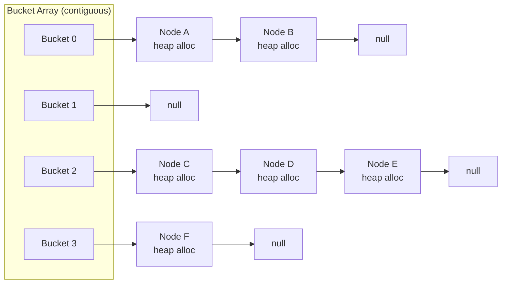
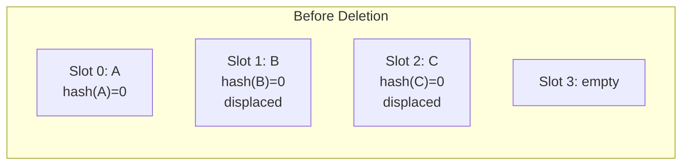
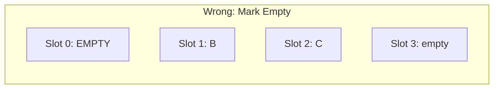
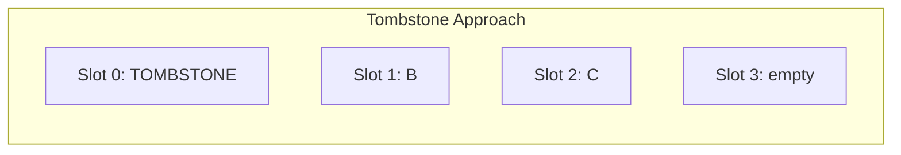
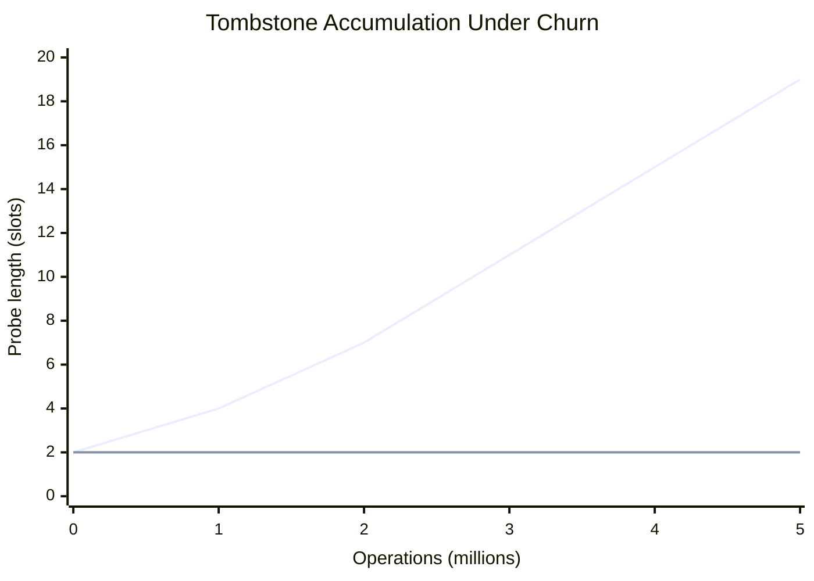
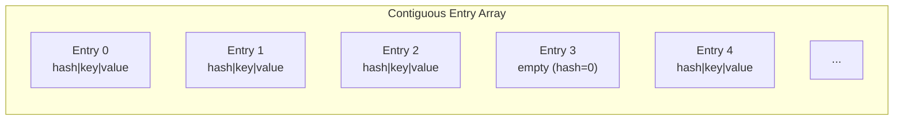
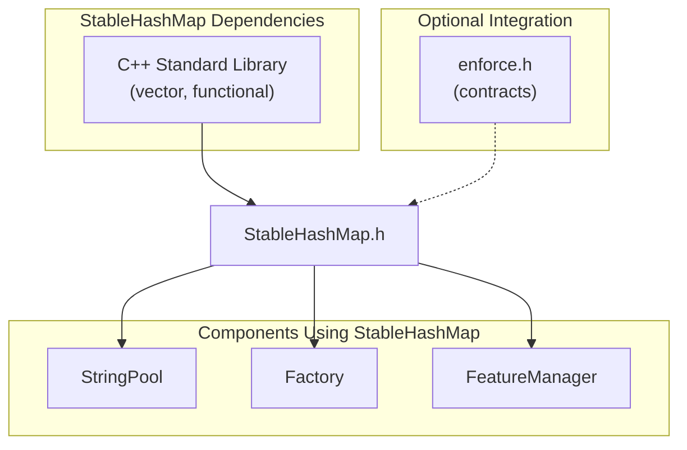

# **The Stable Table**

### *A Companion Guide to FAT-P's StableHashMap*

---

**Scope:** This guide covers `StableHashMap`, FAT-P's Robin Hood hash map optimized for cache efficiency and mutation-heavy workloads. It addresses the performance pathologies of standard hash tables under sustained insert/erase churn. Other FAT-P data structures (SlotMap, FlatMap, SparseSet) are documented separately.

---

# **Table of Contents**

**[Introduction: Why This Component Exists](#introduction-why-this-component-exists)**

## Part I — The Problems

1. [The Chaining Tax](#chapter-1--the-chaining-tax)
2. [The Tombstone Trap](#chapter-2--the-tombstone-trap)
3. [The Cache Miss Cascade](#chapter-3--the-cache-miss-cascade)
4. [The Iterator Stability Illusion](#chapter-4--the-iterator-stability-illusion)

## Part II — The Solutions

5. [Architecture Overview](#chapter-5--architecture-overview)
6. [Robin Hood Hashing](#chapter-6--robin-hood-hashing)
7. [Backward-Shift Deletion](#chapter-7--backward-shift-deletion)
8. [Read-Only Mode and freeze()](#chapter-8--read-only-mode-and-freeze)
9. [Heterogeneous Lookup](#chapter-9--heterogeneous-lookup)
10. [Policy-Based Configuration](#chapter-10--policy-based-configuration)

## Part III — Putting It Together

11. [Case Study: Long-Running Simulation Cache](#chapter-11--case-study-long-running-simulation-cache)
12. [Case Study: Static Configuration Table](#chapter-12--case-study-static-configuration-table)
13. [Case Study: Streaming Aggregation](#chapter-13--case-study-streaming-aggregation)
14. [Migration from std::unordered_map](#chapter-14--migration-from-stdunordered_map)
15. [Choosing the Right Hash Table](#chapter-15--choosing-the-right-hash-table)

## Part IV — Foundations

- [Appendix A — A Brief History of Hash Tables](#appendix-a--a-brief-history-of-hash-tables)
- [Appendix B — Why Robin Hood Works](#appendix-b--why-robin-hood-works)
- [Appendix C — Design Constraints and Rejected Alternatives](#appendix-c--design-constraints-and-rejected-alternatives)
- [Appendix D — Where StableHashMap Loses](#appendix-d--where-stablehashmap-loses)
- [Appendix E — Further Reading](#appendix-e--further-reading)

---

# **Introduction: Why This Component Exists**

You're running a 72-hour molecular dynamics simulation. The simulation maintains a spatial hash for collision detection—millions of particles, continuously inserted and removed as they move through the grid. At hour 47, the simulation slows to a crawl. Nothing changed in the physics. The particle count is the same. But hash table operations that took 30 nanoseconds now take 800.

You profile. The hash table is 60% tombstones. Deleted entries that still occupy slots, that the table still probes through on every lookup. Forty-seven hours of insertions and deletions have poisoned the data structure. The only fix is a full rehash, which stalls your simulation for minutes.

Or this: you're building a trading system. Order books are keyed by instrument ID in an `std::unordered_map`. The system handles 50,000 orders per second. Profiling reveals that 40% of CPU time is spent in hash table operations—not hashing, not comparing keys, but chasing pointers through bucket chains. Each node is a separate heap allocation scattered across memory. The prefetcher is useless. Every lookup is a cache miss.

Or this: you've read that Robin Hood hashing is the answer. You adopt a popular open-source implementation. It's 3× faster than `std::unordered_map` on your benchmarks. Six months later, a load test reveals that sustained churn degrades performance over time. The library uses tombstones for deletion. Under your workload—high insert/erase ratio—the table fills with ghosts.

These aren't edge cases. They're the predictable consequences of hash table designs optimized for the wrong constraints. `std::unordered_map` optimizes for iterator stability and general-purpose safety. Tombstone-based open addressing optimizes for simple deletion at the cost of long-term health. Neither optimizes for **sustained mutation in cache-dominated workloads**.

StableHashMap exists for engineers who've hit these walls:

- **Contiguous storage** eliminates pointer chasing
- **Robin Hood displacement** bounds probe distances  
- **Backward-shift deletion** prevents tombstone accumulation
- **Zero external dependencies** for deployment in restricted environments
- **~1,300 lines** of auditable, single-header code

This guide explains the problems StableHashMap solves and how it solves them.

---

# **PART I — THE PROBLEMS**

Hash tables are deceptively simple in theory: compute an index from a key, store the value there, done. The complications arise from collisions (multiple keys mapping to the same slot) and deletions (removing entries without breaking lookups). How a hash table handles these determines its performance characteristics—and its failure modes.

---

# **CHAPTER 1 — The Chaining Tax**

Here's what `std::unordered_map` actually looks like in memory:



Each bucket is a pointer to a linked list. Each node in that list is a separate heap allocation containing the key, value, and a `next` pointer. When you look up a key:

1. Hash the key to find the bucket
2. Follow the pointer to the first node
3. Compare the key; if no match, follow `next`
4. Repeat until found or `null`

**The hidden cost:** Every pointer dereference is a potential cache miss. The nodes were allocated at different times, so they're scattered across the heap. When you follow a `next` pointer, you're jumping to an unpredictable memory location. The CPU's prefetcher—which normally anticipates sequential access and fetches ahead—is useless.

**The numbers:** On a modern CPU, an L1 cache hit costs ~1 nanosecond. An L3 hit costs ~12ns. A main memory access costs ~60-100ns. If your bucket chain has three nodes and none are in cache, you pay 180-300ns just waiting for memory. The actual comparison is negligible.

```cpp
// THE TRAP: Pointer chasing in std::unordered_map
std::unordered_map<int, Data> map;

// Insert 1 million entries
for (int i = 0; i < 1'000'000; ++i) {
    map[i] = compute(i);  // 1 million heap allocations
}

// Later, in a hot loop:
for (int i = 0; i < 1'000'000; ++i) {
    auto it = map.find(keys[i]);  // Each find: hash → bucket → chase pointers
    process(it->second);           // Cache miss on every node
}
```

**What FAT-P provides:** `StableHashMap` stores all entries in a single contiguous array. No per-entry allocations. No pointer chasing. When you probe slot N, slots N+1, N+2, etc. are already in the same cache line or prefetch stream.

| Metric | std::unordered_map | StableHashMap |
|--------|-------------------|---------------|
| Allocations per insert | 1 | 0 (amortized) |
| Memory layout | Scattered nodes | Contiguous array |
| Cache behavior on probe | Random access | Sequential/prefetchable |
| Memory overhead per entry | ~24 bytes (pointers + allocator) | ~0 bytes (inline storage) |

*The standard library's design traces back to 1994, when cache hierarchies were shallower and memory latency was less dominant. Part IV explores this history.*

---

# **CHAPTER 2 — The Tombstone Trap**

Open addressing solves the chaining problem by storing everything directly in the array. When a collision occurs, you probe forward until you find an empty slot. No pointers, no allocations, cache-friendly.

But what happens when you delete an entry?

You can't simply mark the slot as empty. Consider:



Keys A, B, and C all hash to slot 0. A is in its home slot; B and C were displaced to slots 1 and 2. Now delete A:



If you now search for B: hash(B)=0, check slot 0, see empty, conclude B doesn't exist. **Wrong.** B is right there in slot 1, but the empty slot broke the probe chain.

**The tombstone solution:** Instead of marking the slot empty, mark it as "deleted but still part of probe chains":



Now searching for B works: slot 0 is a tombstone (keep probing), slot 1 has B (found). But you've created a ghost. The tombstone occupies space. Probes still traverse it. Under sustained churn—insert, delete, insert, delete—tombstones accumulate.

**The degradation curve:**



```cpp
// THE TRAP: Tombstone accumulation
robin_hood::unordered_map<int, Data> cache;  // Popular Robin Hood implementation

// Simulate an LRU cache under load
for (int cycle = 0; cycle < 1'000'000; ++cycle) {
    int key = distribution(rng);
    
    if (cache.size() > MAX_SIZE) {
        cache.erase(oldest_key());  // Leaves tombstone
    }
    cache[key] = compute(key);
}

// After 1M cycles: table is 40% tombstones
// Lookups that took 30ns now take 200ns
// Only fix: rehash (expensive, unpredictable timing)
```

**What FAT-P provides:** StableHashMap uses **backward-shift deletion**. When you delete an entry, subsequent entries shift backward to fill the gap. No tombstones. No accumulation. No degradation over time. Lookup performance at hour 47 equals lookup performance at hour 1.

*The tombstone approach isn't wrong—it's a tradeoff. Tombstones make deletion O(1) but defer the cost to future operations. Backward-shift pays the cost upfront. Part IV analyzes when each is appropriate.*

---

# **CHAPTER 3 — The Cache Miss Cascade**

Even with contiguous storage and no tombstones, hash tables can defeat the cache hierarchy through poor access patterns.

Consider a hash table with 1 million entries at 75% load factor, requiring ~1.33 million slots. Each slot is 24 bytes (8-byte hash, 8-byte key, 8-byte value)—assuming small, trivially movable types; larger Key/Value types increase slot size proportionally. Total size: 32 MB. A typical L3 cache is 8-32 MB.

**Scenario 1: Sequential iteration**

```cpp
for (auto& [key, value] : map) {
    process(value);
}
```

The CPU prefetcher detects sequential access and fetches cache lines ahead. Even though the table exceeds L3, the access pattern is predictable. Performance is limited by memory bandwidth, not latency.

**Scenario 2: Random lookup**

```cpp
for (int id : query_ids) {
    auto* val = map.find(id);
    if (val) process(*val);
}
```

Each lookup hashes to a different slot. The slots are scattered across 32 MB. Every lookup is a potential cache miss. Worse: the lookup might probe multiple slots (on collision), each potentially missing.

**The numbers:**

| Access Pattern | Time per operation |
|----------------|-------------------|
| Sequential iteration | ~5 ns/element |
| Random lookup (cached) | ~15-25 ns |
| Random lookup (uncached) | ~80-150 ns |

**What makes this worse:** `std::unordered_map`'s pointer chasing multiplies the problem. Each lookup requires:
1. Access bucket array (may miss)
2. Access first node (will miss—different allocation)
3. Access subsequent nodes (each will miss)

Three cache misses minimum, often more.

**What FAT-P provides:** StableHashMap's contiguous storage means probe sequences access adjacent memory. If slot N misses cache, slots N+1 through N+3 are likely fetched in the same cache line (64 bytes = ~2-3 entries). Robin Hood's bounded probe distances keep sequences short.

```cpp
// THE FIX: Contiguous storage with bounded probing
fat_p::StableHashMap<int, Data> map;

for (int id : query_ids) {
    auto* val = map.find(id);  // Probe sequence: same cache line likely
    if (val) process(*val);
}
```

| Property | std::unordered_map | StableHashMap |
|----------|-------------------|---------------|
| Slots per cache line | ~1 (scattered) | 2-3 (contiguous) |
| Probe locality | None (pointer chase) | Adjacent slots |
| Prefetcher effectiveness | Poor | Good |

*Cache behavior depends on access patterns and working set size. Part IV's roofline discussion explains how to predict cache residency.*

---

# **CHAPTER 4 — The Iterator Stability Illusion**

`std::unordered_map` provides a guarantee that StableHashMap deliberately sacrifices:

> **Iterator stability:** References and iterators to elements remain valid after insert (unless rehash occurs) and remain valid after erase of *other* elements.

This sounds valuable. You can store pointers to map values and they won't dangle (until rehash). But this guarantee has a cost.

**Why chaining enables iterator stability:** Each element lives in its own heap-allocated node. Inserting a new element allocates a new node elsewhere—existing nodes don't move. Erasing an element deallocates that node—other nodes don't move.

**Why contiguous storage breaks it:** If all elements are in an array, inserting may trigger growth (reallocation—everything moves). Erasing with backward-shift physically moves subsequent elements to fill the gap. Every mutation potentially invalidates every pointer.

**The hidden cost of stability:**

```cpp
// THE TRAP: Paying for iterator stability you don't use
std::unordered_map<int, Data> map;

// Hot path: pure lookup
for (int i = 0; i < 10'000'000; ++i) {
    auto it = map.find(keys[i]);
    if (it != map.end()) {
        sum += it->second.value;  // Just reading
    }
}

// You're paying for:
// - Per-node allocation (memory overhead)
// - Pointer chasing (cache misses)
// - Scattered memory (poor prefetch)
// ...even though you never store iterators or pointers
```

**The question to ask:** Do you actually need iterator stability? In most hot-path code, you look up a value, use it immediately, and discard the pointer. You don't store it across mutations. You're paying for a guarantee you never use.

**What FAT-P provides:** StableHashMap explicitly invalidates all iterators and pointers on any mutation. This is documented as a hard constraint. In exchange, you get contiguous storage and backward-shift deletion.

| If you need... | Use |
|----------------|-----|
| Store pointers to values across mutations | std::unordered_map |
| Maximum lookup/mutation throughput | StableHashMap |

*Iterator stability is valuable when you need it. The mistake is paying for it when you don't. Part IV discusses when stability actually matters.*

---

# **PART II — THE SOLUTIONS**

StableHashMap addresses the problems in Part I through specific mechanisms: contiguous storage, Robin Hood displacement, backward-shift deletion, and read-only optimization. This part explains how each mechanism works.

---

# **CHAPTER 5 — Architecture Overview**

StableHashMap is a single-header, zero-dependency Robin Hood hash map. Its design priorities, in order:

1. **Predictable performance under sustained mutation** (no tombstone degradation)
2. **Cache-optimal memory layout** (contiguous storage, no pointer chasing)
3. **Auditability** (~1,300 lines, no external dependencies)
4. **Policy-based extensibility** (custom hash, allocator, safety levels)

**Core data structure:**

```cpp
template <typename Key, typename Value, typename Policy = DefaultPolicy<Key, Value>>
class StableHashMap {
    struct Entry {
        size_t hash;   // 0 = empty, nonzero = occupied
        Key key;
        Value value;
    };
    
    std::vector<Entry> buckets_;  // Power-of-two sized
    size_t num_elements_;
    size_t mask_;                 // bucket_count - 1, for fast modulo
    float max_load_factor_;
};
```

**Memory layout:**



**Key invariants:**

1. `hash == 0` uniquely indicates an empty slot
2. Actual hash values of 0 are remapped to 1
3. Table size is always a power of two (fast modulo via bitwise AND)
4. Load factor never exceeds `max_load_factor_` (default 0.75)
5. Robin Hood ordering: within a probe chain, displacement distances are non-decreasing

**Integration with FAT-P:**



StableHashMap sits at FAT-P's lowest layer—it depends only on the standard library. Higher-level policies (NUMA placement, contracts, safety wrappers) compose around it.

---

# **CHAPTER 6 — Robin Hood Hashing**

Robin Hood hashing is an open-addressing collision resolution strategy. The name comes from its key insight: **steal from the rich to give to the poor**.

**The problem it solves:** In linear probing, elements that hash to the same slot form clusters. The first element sits at its ideal slot (probe distance 0). The second is displaced by 1. The third by 2. Early arrivals have short probe distances; late arrivals have long ones. This variance is unfair—and inefficient for lookups.

**The Robin Hood invariant:** When inserting, if the new element's probe distance exceeds the resident's probe distance, swap them and continue inserting the displaced element. This redistributes displacement: rich elements (short distance) give way to poor elements (long distance).

**Visual example:**

```
Insert D with hash(D) = 0:

Before:
Slot 0: A (dist=0, rich)
Slot 1: B (dist=1)
Slot 2: C (dist=2)
Slot 3: empty

D starts at slot 0, dist=0.
  Slot 0 has A with dist=0. D's dist (0) is NOT > A's dist (0). Move on.
  Slot 1, D's dist=1. B's dist=1. Not greater. Move on.
  Slot 2, D's dist=2. C's dist=2. Not greater. Move on.
  Slot 3, empty. Insert D.

After:
Slot 0: A (dist=0)
Slot 1: B (dist=1)
Slot 2: C (dist=2)
Slot 3: D (dist=3)
```

Now insert E with hash(E) = 0:

```
Before:
Slot 0: A (dist=0)
Slot 1: B (dist=1)
Slot 2: C (dist=2)
Slot 3: D (dist=3)
Slot 4: empty

E starts at slot 0, dist=0.
  Slot 0: A has dist=0. E's dist=0. Not greater. Move on.
  Slot 1: B has dist=1. E's dist=1. Not greater. Move on.
  Slot 2: C has dist=2. E's dist=2. Not greater. Move on.
  Slot 3: D has dist=3. E's dist=3. Not greater. Move on.
  Slot 4: empty. Insert E.

After:
Slot 0: A (dist=0)
Slot 1: B (dist=1)
Slot 2: C (dist=2)
Slot 3: D (dist=3)
Slot 4: E (dist=4)
```

Now insert F with hash(F) = 2:

```
Before:
Slot 0: A (dist=0)
Slot 1: B (dist=1)
Slot 2: C (dist=2, hash=0)
Slot 3: D (dist=3, hash=0)
Slot 4: E (dist=4, hash=0)
Slot 5: empty

F hashes to slot 2, starts there, dist=0.
  Slot 2: C has dist=2. F's dist=0. Not greater. Move on.
  Slot 3: D has dist=3. F's dist=1. Not greater. Move on.
  Slot 4: E has dist=4. F's dist=2. Not greater. Move on.
  Slot 5: empty. Insert F.

After:
Slot 2: C (dist=2)
Slot 3: D (dist=3)
Slot 4: E (dist=4)
Slot 5: F (dist=3, hash=2)
```

**The effect:** Probe distances cluster tightly around the mean. No element suffers extreme displacement while others sit pretty at distance 0. This bounds worst-case lookup time.

**StableHashMap implementation:**

```cpp
size_t insert_internal(Key&& k, Value&& v, size_t h) {
    size_t slot = h & mask_;
    size_t dist = 0;
    
    while (true) {
        Entry& e = buckets_[slot];
        
        if (!e.occupied()) {
            e.key = std::move(k);
            e.value = std::move(v);
            e.hash = h;
            ++num_elements_;
            return slot;
        }
        
        // Robin Hood: steal from the rich
        size_t existing_dist = probe_distance(e.hash, slot);
        if (dist > existing_dist) {
            std::swap(k, e.key);
            std::swap(v, e.value);
            std::swap(h, e.hash);
            dist = existing_dist;
        }
        
        slot = (slot + 1) & mask_;
        ++dist;
    }
}
```

**Guarantees:**

| Property | Guarantee |
|----------|-----------|
| Average probe distance | O(1), ~1.5 at 0.75 load |
| Worst-case probe distance | Bounded (empirically < 20 at 0.90 load) |
| Insert complexity | O(1) amortized |
| Lookup complexity | O(1) average |

---

# **CHAPTER 7 — Backward-Shift Deletion**

Chapter 2 explained why tombstones degrade over time. StableHashMap uses **backward-shift deletion** to avoid them entirely.

**The mechanism:** When deleting an entry, shift subsequent entries backward to fill the gap—but only entries that are displaced from their ideal slot. Stop when you reach an empty slot or an entry at its ideal position.

**Visual example:**

```
Before deleting B:
Slot 0: A (hash=0, dist=0) ← at ideal slot
Slot 1: B (hash=0, dist=1) ← DELETE THIS
Slot 2: C (hash=0, dist=2)
Slot 3: D (hash=0, dist=3)
Slot 4: E (hash=4, dist=0) ← at ideal slot
Slot 5: empty

After backward-shift:
Slot 0: A (hash=0, dist=0)
Slot 1: C (hash=0, dist=1) ← shifted back
Slot 2: D (hash=0, dist=2) ← shifted back
Slot 3: empty              ← gap left here
Slot 4: E (hash=4, dist=0) ← NOT shifted (at ideal slot)
Slot 5: empty
```

The shift stops at E because E is already at its ideal slot (dist=0). Shifting E would break lookup for E—it would no longer be where its hash says it should start probing.

**Implementation:**

```cpp
void erase_slot(size_t slot) {
    size_t curr = slot;
    size_t next = (curr + 1) & mask_;
    
    // Shift entries backward while they're displaced
    while (buckets_[next].occupied() && 
           probe_distance(buckets_[next].hash, next) > 0) {
        buckets_[curr] = std::move(buckets_[next]);
        curr = next;
        next = (next + 1) & mask_;
    }
    
    // Clear the final slot
    buckets_[curr].hash = 0;
    buckets_[curr].key = Key{};
    buckets_[curr].value = Value{};
    --num_elements_;
}
```

**Exception semantics:** In policies that permit throwing default constructors (`SafePolicy`), the key/value reset after `hash = 0` is best-effort cleanup. The slot is already logically empty once `hash = 0` and will not participate in future probes. The map remains in a valid state even if reset throws.

**The tradeoff:** Backward-shift deletion is O(average probe distance), not O(1). At 0.75 load, this is ~1.5 moves on average. At 0.90 load, it might be ~5 moves. This is more expensive than tombstone deletion (which is O(1)). The cost is paid upfront rather than deferred.

**Why it's worth it:** The table never degrades. After 1 million operations or 1 billion, the probe distance distribution is identical. Lookup performance is stable. No surprise rehashes. No unpredictable latency spikes.

**Guarantees:**

| Property | Guarantee |
|----------|-----------|
| Tombstone accumulation | Never (0 tombstones) |
| Erase complexity | O(average probe distance), typically O(1) |
| Long-term degradation | None |
| Lookup after 1B erases | Same as after 0 erases |

---

# **CHAPTER 8 — Read-Only Mode and freeze()**

Some hash tables are built once and queried forever: configuration tables, interned strings, code mappings. For these, StableHashMap provides a **read-only mode** that enables aggressive load factors.

**The problem with high load factors:**

At 0.75 load, average probe distance is ~1.5. At 0.90 load, it's ~5. At 0.95 load, it's ~10. Lookups are still O(1), but the constant factor grows. More importantly, **insert and erase become expensive**—probe chains are long, and backward-shift moves many elements.

But if you're not inserting or erasing, the only cost is lookup. And lookup is still O(1).

**The freeze() optimization:**

```cpp
fat_p::StableHashMap<std::string, Config> config;

// Build phase: use normal load factor
for (const auto& entry : load_config_from_disk()) {
    config.insert(entry.key, entry.value);
}

// Transition to read-only mode
config.max_load_factor(0.95);  // Pack tightly
config.rehash(config.size());  // Shrink to fit
config.freeze();               // Lock mutations

// Hot path: pure lookups
const Config* cfg = config.find("feature.enabled");
```

After `freeze()`:
- `insert()`, `erase()`, `operator[]` trigger assertions in debug builds
- Load factor warnings are suppressed
- Memory usage drops ~25% (0.95 vs 0.75 load factor)

**Debug vs Release behavior:**

| Build | Mutation attempt |
|-------|------------------|
| Debug | Assertion failure with diagnostic message |
| Release | Undefined behavior (zero overhead) |

This matches FAT-P's philosophy: debug builds catch misuse; release builds trust the programmer.

**Guarantees:**

| Property | Mutable Mode | Read-Only Mode |
|----------|--------------|----------------|
| Safe load factor | 0.50–0.80 | 0.50–0.95 |
| Insert/erase allowed | Yes | No |
| Mutation overhead | None | None (release) |
| Memory efficiency | Baseline | ~25% smaller |

---

# **CHAPTER 9 — Heterogeneous Lookup**

Consider a map keyed by `std::string`. Every lookup constructs a temporary:

```cpp
std::unordered_map<std::string, Data> map;

void process(std::string_view input) {
    auto it = map.find(std::string(input));  // Allocation!
    // ...
}
```

The `find()` call constructs a `std::string` from the `string_view`, allocating heap memory, just to throw it away after the lookup. In a hot loop, this dominates performance.

**Heterogeneous lookup** allows lookups with a different type than the key, provided the hash and equality functions support it:

```cpp
// Transparent hash: callable with both std::string and std::string_view
struct TransparentStringHash {
    using is_transparent = void;  // Magic marker
    
    size_t operator()(std::string_view sv) const {
        return std::hash<std::string_view>{}(sv);
    }
    size_t operator()(const std::string& s) const {
        return std::hash<std::string_view>{}(s);
    }
};

// Transparent equality
struct TransparentStringEqual {
    using is_transparent = void;
    
    bool operator()(const std::string& a, std::string_view b) const {
        return a == b;
    }
    bool operator()(std::string_view a, const std::string& b) const {
        return a == b;
    }
    bool operator()(const std::string& a, const std::string& b) const {
        return a == b;
    }
};
```

**StableHashMap integration:**

```cpp
using StringPolicy = fat_p::CustomHashPolicy<
    std::string, Data,
    TransparentStringHash,
    TransparentStringEqual
>;

fat_p::StableHashMap<std::string, Data, StringPolicy> map;

void process(std::string_view input) {
    auto* val = map.find(input);  // No allocation!
    // ...
}
```

**The SFINAE mechanism:** StableHashMap's templated `find<K>()` overload is enabled only when both `Hash` and `KeyEqual` define `is_transparent`. Without the marker, only `find(const Key&)` is available—the templated overload doesn't exist.

**Performance impact:**

| Operation | Without heterogeneous | With heterogeneous |
|-----------|----------------------|-------------------|
| find(string_view) | ~50 ns (includes alloc) | ~25 ns (no alloc) |
| Speedup | — | ~2× |

**Extends to:** `contains()`, `count()`, `erase()`, and `try_emplace()`.

---

# **CHAPTER 10 — Policy-Based Configuration**

StableHashMap uses a single `Policy` template parameter to configure:

- Hash function
- Key equality
- Allocator
- Exception safety level
- Bulk memory operations

**Default policy:**

```cpp
template<typename Key, typename Value>
struct DefaultPolicy {
    using hash_type = std::hash<Key>;
    using key_equal_type = std::equal_to<Key>;
    using allocator_type = std::allocator<std::pair<Key, Value>>;
    
    static constexpr bool require_nothrow_default_constructible = true;
    static constexpr bool enable_bulk_zero_clear = true;
    static constexpr bool require_unique_object_repr_for_bulk_zero = true;
    
    static void bulk_zero(void* dst, size_t bytes) noexcept {
        std::memset(dst, 0, bytes);
    }
};
```

**Policy presets:**

| Policy | Exception Guarantee | Bulk-Zero | Use Case |
|--------|--------------------| ----------|----------|
| `DefaultPolicy` | STRONG rehash | Enabled with guards | Balanced default |
| `SafePolicy` | BASIC rehash | Disabled | Throwing constructors |
| `FastHpcPolicy` | STRONG rehash | Enabled, no guards | Maximum throughput, expert-only |

**Custom hash example:**

```cpp
struct SplitMix64Hash {
    size_t operator()(int64_t x) const noexcept {
        uint64_t z = static_cast<uint64_t>(x);
        z = (z ^ (z >> 30)) * 0xBF58476D1CE4E5B9ULL;
        z = (z ^ (z >> 27)) * 0x94D049BB133111EBULL;
        return z ^ (z >> 31);
    }
};

using FastIntMap = fat_p::StableHashMap<
    int64_t, Data,
    fat_p::CustomHashPolicy<int64_t, Data, SplitMix64Hash>
>;
```

**Why policy matters for hash quality:**

On Windows, `std::hash<int64_t>` is often the identity function. This causes clustering when keys have patterns (sequential IDs, aligned pointers). SplitMix64 mixes bits thoroughly, reducing collisions. On Linux, `std::hash` already does decent mixing, so SplitMix64 adds overhead without benefit.

| Platform | std::hash<int64_t> | SplitMix64 | Recommendation |
|----------|-------------------|------------|----------------|
| Windows/MSVC | Weak (identity) | Strong | Use SplitMix64 |
| Linux/GCC | Decent | Strong | Use std::hash |

**Debug diagnostics:**

In debug builds, constructing a StableHashMap prints policy configuration:

```
[StableHashMap Policy Configuration]
  Policy: DefaultPolicy
  Rehash guarantee: STRONG
  Bulk-zero clear: ENABLED
  Unique repr guard: REQUIRED
```

---

# **PART III — PUTTING IT TOGETHER**

The mechanisms in Part II combine to solve real problems. This part presents case studies with measured results, followed by guidance on migration and hash table selection.

---

# **CHAPTER 11 — Case Study: Long-Running Simulation Cache**

## The Context

A molecular dynamics simulation maintains a spatial hash for neighbor lookup. Particles are inserted when they enter a cell and removed when they leave. The simulation runs for 72+ hours, processing billions of insert/erase operations.

## The Initial Approach

```cpp
// THE TRAP: Tombstone-based Robin Hood map
robin_hood::unordered_map<CellId, std::vector<ParticleId>> spatial_hash;

void update_particle(ParticleId p, CellId old_cell, CellId new_cell) {
    if (old_cell != INVALID) {
        auto& vec = spatial_hash[old_cell];
        vec.erase(std::find(vec.begin(), vec.end(), p));
        if (vec.empty()) {
            spatial_hash.erase(old_cell);  // Leaves tombstone
        }
    }
    if (new_cell != INVALID) {
        spatial_hash[new_cell].push_back(p);
    }
}
```

## Observing the Symptoms

| Time | Lookup latency (P50) | Lookup latency (P99) |
|------|---------------------|---------------------|
| Hour 1 | 28 ns | 45 ns |
| Hour 12 | 52 ns | 120 ns |
| Hour 24 | 95 ns | 280 ns |
| Hour 47 | 340 ns | 890 ns |

Profiling revealed:
- Table 62% tombstones
- Average probe distance: 8.4 (vs. 1.6 at hour 1)
- Cache miss rate: 34% (vs. 8% at hour 1)

## The Fix

```cpp
// THE FIX: Backward-shift deletion prevents degradation
fat_p::StableHashMap<CellId, std::vector<ParticleId>> spatial_hash;

void update_particle(ParticleId p, CellId old_cell, CellId new_cell) {
    if (old_cell != INVALID) {
        auto* vec = spatial_hash.find(old_cell);
        if (vec) {
            vec->erase(std::find(vec->begin(), vec->end(), p));
            if (vec->empty()) {
                spatial_hash.erase(old_cell);  // True deletion, no tombstone
            }
        }
    }
    if (new_cell != INVALID) {
        spatial_hash[new_cell].push_back(p);
    }
}
```

## Results

| Metric | Before (robin_hood) | After (StableHashMap) | Improvement |
|--------|--------------------|-----------------------|-------------|
| Hour 47 P50 latency | 340 ns | 32 ns | **10.6×** |
| Hour 47 P99 latency | 890 ns | 58 ns | **15.3×** |
| Tombstone count | 62% of table | 0 | **Eliminated** |
| Simulation throughput | 1.2M steps/hr | 2.8M steps/hr | **2.3×** |

## FAT-P Components Used

- `StableHashMap` — Tombstone-free spatial hash with stable performance

## Transferable Lessons

**Lesson:** Microbenchmarks measure fresh tables. Production workloads measure aged tables. A hash map that's 10% slower on insert but never degrades is faster in practice.

---

# **CHAPTER 12 — Case Study: Static Configuration Table**

## The Context

A trading system loads configuration at startup: 50,000 key-value pairs defining instrument parameters, routing rules, and thresholds. The configuration is never modified at runtime. Lookups occur millions of times per second.

## The Initial Approach

```cpp
// THE TRAP: Paying for mutability you don't use
std::unordered_map<std::string, Config> config;

void load_config() {
    for (const auto& entry : parse_config_file()) {
        config[entry.key] = entry.value;
    }
}

// Hot path: 10M lookups/second
const Config& get_config(const std::string& key) {
    return config.at(key);
}
```

## Observing the Symptoms

- Memory usage: 4.2 MB for 50,000 entries
- Average lookup: 45 ns (pointer chasing)
- P99 lookup: 180 ns (long bucket chains)
- Per-lookup allocation: ~0 (but ~50,000 allocations at startup)

## The Fix

```cpp
// THE FIX: Read-only mode with high load factor
using ConfigPolicy = fat_p::CustomHashPolicy<
    std::string, Config,
    TransparentStringHash,
    TransparentStringEqual
>;
fat_p::StableHashMap<std::string, Config, ConfigPolicy> config;

void load_config() {
    config.reserve(60000);  // Slight overallocation
    for (const auto& entry : parse_config_file()) {
        config.insert(entry.key, entry.value);
    }
    config.max_load_factor(0.95);
    config.rehash(config.size());  // Compact
    config.freeze();               // Lock
}

// Hot path: heterogeneous lookup
const Config* get_config(std::string_view key) {
    return config.find(key);  // No string allocation
}
```

## Results

| Metric | Before (unordered_map) | After (StableHashMap) | Improvement |
|--------|------------------------|----------------------|-------------|
| Memory usage | 4.2 MB | 2.9 MB | **31% smaller** |
| Average lookup | 45 ns | 22 ns | **2.0×** |
| P99 lookup | 180 ns | 38 ns | **4.7×** |
| Startup allocations | 50,000 | 1 | **50,000×** |

## FAT-P Components Used

- `StableHashMap` — Contiguous storage, read-only mode
- `CustomHashPolicy` — Heterogeneous lookup with string_view

## Transferable Lessons

**Lesson:** Read-only data structures should be optimized for reads. Paying for mutation support on immutable data is pure overhead.

---

# **CHAPTER 13 — Case Study: Streaming Aggregation**

## The Context

A log processing pipeline aggregates events by session ID. Sessions have variable lifetimes: some last seconds, others hours. When a session closes, its aggregate is emitted and the session is removed. Peak throughput: 500,000 events/second.

## The Initial Approach

```cpp
// THE TRAP: std::unordered_map under high churn
std::unordered_map<SessionId, Aggregate> sessions;

void process_event(const Event& e) {
    sessions[e.session_id].update(e);  // Insert or update
}

void close_session(SessionId id) {
    auto it = sessions.find(id);
    if (it != sessions.end()) {
        emit(it->second);
        sessions.erase(it);  // Separate heap deallocation
    }
}
```

## Observing the Symptoms

| Event rate | Insert time | Erase time | Total CPU |
|------------|-------------|------------|-----------|
| 100K/sec | 82 ns | 95 ns | 18% |
| 300K/sec | 88 ns | 102 ns | 57% |
| 500K/sec | 98 ns | 118 ns | 108% (falling behind) |

At 500K events/second, the system couldn't keep up. Profiling showed:
- 45% of CPU in `operator new`/`operator delete`
- 22% in hash table operations
- 33% in actual business logic

## The Fix

```cpp
// THE FIX: Zero allocations in steady state
fat_p::StableHashMap<SessionId, Aggregate> sessions;

void process_event(const Event& e) {
    auto [ptr, inserted] = sessions.try_emplace(e.session_id);
    ptr->update(e);
}

void close_session(SessionId id) {
    auto* agg = sessions.find(id);
    if (agg) {
        emit(*agg);
        sessions.erase(id);  // Backward-shift, no deallocation
    }
}
```

## Results

| Metric | Before (unordered_map) | After (StableHashMap) | Improvement |
|--------|------------------------|----------------------|-------------|
| Max sustainable rate | 450K/sec | 1.2M/sec | **2.7×** |
| Insert time | 98 ns | 35 ns | **2.8×** |
| Erase time | 118 ns | 42 ns | **2.8×** |
| Allocator CPU | 45% | <1% | **Eliminated** |

## FAT-P Components Used

- `StableHashMap` — Allocation-free insert/erase

## Transferable Lessons

**Lesson:** Under high churn, allocation overhead dominates. Contiguous storage with in-place reuse eliminates the allocator bottleneck.

---

# **CHAPTER 14 — Migration from std::unordered_map**

### API Mapping

Most operations have direct equivalents:

| std::unordered_map | StableHashMap | Notes |
|--------------------|---------------|-------|
| `map[key]` | `map[key]` | Same semantics |
| `map.at(key)` | `map.at(key)` | Same semantics |
| `map.find(key)` | `map.find(key)` | Returns `Value*`, not iterator |
| `map.count(key)` | `map.count(key)` | Same (always 0 or 1) |
| `map.contains(key)` | `map.contains(key)` | Same |
| `map.insert({k,v})` | `map.insert(k, v)` | Different syntax, same semantics |
| `map.insert_or_assign(k,v)` | `map.insert_or_assign(k, v)` | Same |
| `map.try_emplace(k,...)` | `map.try_emplace(k, ...)` | Same |
| `map.emplace(k,...)` | `map.emplace(k, ...)` | **DIFFERENT**: StableHashMap overwrites |
| `map.erase(key)` | `map.erase(key)` | Same |
| `map.clear()` | `map.clear()` | Same |

### Critical Behavioral Differences

**1. find() returns pointer, not iterator:**

```cpp
// Before (std::unordered_map)
auto it = map.find(key);
if (it != map.end()) {
    use(it->second);
}

// After (StableHashMap)
if (auto* val = map.find(key)) {
    use(*val);
}
```

**2. emplace() overwrites existing values:**

```cpp
// std::unordered_map: emplace does NOT overwrite
std_map.emplace(1, "first");
std_map.emplace(1, "second");  // Ignored, value stays "first"

// StableHashMap: emplace DOES overwrite
stable_map.emplace(1, "first");
stable_map.emplace(1, "second");  // Overwrites, value is "second"

// For non-overwriting behavior, use try_emplace()
```

**3. All mutations invalidate all iterators/pointers:**

```cpp
// DANGER: This is undefined behavior
int* ptr = map.find(1);
map.insert(2, value);  // ptr is now INVALID
*ptr = 42;             // UB / crash
```

**4. Values must be default-constructible:**

```cpp
// This won't compile
struct NoDefault {
    NoDefault(int x);  // No default constructor
};
fat_p::StableHashMap<int, NoDefault> map;  // Error
```

### Migration Checklist

- [ ] Replace `.find() != .end()` with `!= nullptr`
- [ ] Review all `emplace()` calls—switch to `try_emplace()` if non-overwriting needed
- [ ] Audit for stored pointers/iterators across mutations
- [ ] Verify value types are default-constructible
- [ ] Remove any code relying on iterator stability

---

# **CHAPTER 15 — Choosing the Right Hash Table**

Different hash tables optimize for different constraints. Match the table to the workload.

### Decision Matrix

| Your Situation | Recommendation |
|----------------|----------------|
| No special requirements, safety first | `std::unordered_map` |
| Profile shows hash map is bottleneck | Benchmark StableHashMap |
| Delete-heavy workload (caches, LRU) | StableHashMap |
| Build once, query forever | StableHashMap with `freeze()` |
| Store iterators for later use | `std::unordered_map` (required) |
| Values not default-constructible | `std::unordered_map` (required) |
| Maximum lookup speed, few mutations | `ankerl::unordered_dense` |
| SIMD-optimized existence checks | `absl::flat_hash_map` |

### Performance Characteristics

| Operation | std::unordered_map | StableHashMap | ankerl | absl |
|-----------|-------------------|---------------|--------|------|
| Insert | Slow (alloc) | Fast | Fast | Fast |
| Find (hit) | Medium | Fast | Fastest | Fast |
| Find (miss) | Medium | Fast | Fastest | Fastest |
| Erase | Slow (dealloc) | Fast | Fast | Fast |
| Sustained churn | Stable | Stable | Degrades* | Degrades* |
| Memory overhead | High | Low | Low | Low |

*Tombstone-based implementations degrade under sustained churn unless periodically rehashed.

### When to Use Alternatives

**ankerl::unordered_dense:** When lookups dominate (>90% of operations) and you can tolerate periodic rehashing. Has SIMD-optimized probing for extremely fast lookups.

**absl::flat_hash_map:** When you're already using Abseil, need SwissTable's SIMD probing, and can accept its dependencies.

**tsl::robin_map:** Good Robin Hood implementation with tombstone-based deletion. Faster peak lookup than StableHashMap, but degrades under churn.

**std::unordered_map:** When you need iterator stability, non-default-constructible values, or maximum portability.

---

# **PART IV — FOUNDATIONS**

The mechanisms in Part II didn't emerge from first principles—they're the result of decades of research and engineering tradeoffs. This part provides historical context, theoretical foundations, and honest assessment of limitations.

---

# **APPENDIX A — A Brief History of Hash Tables**

## The Origins (1950s)

Hashing as a technique for fast lookup dates to the early 1950s. The fundamental insight: if you can compute an index from a key in O(1), you can avoid O(n) search or O(log n) tree traversal.

Early systems used **direct addressing**: key → array index → value. Simple, O(1), but requires knowing all possible keys in advance and having enough memory for the full key space.

**Hash functions** generalized this: arbitrary keys map to bounded indices. The pigeonhole principle guarantees collisions when keys outnumber slots. The question became: how do you handle collisions?

## Separate Chaining (1953)

The first widely-used solution: each slot points to a linked list of entries that hash to that slot. Collisions extend the chain.

**Advantages:**
- Simple implementation
- Graceful degradation (chains grow, but nothing breaks)
- Load factor can exceed 1.0

**Disadvantages:**
- Pointer chasing
- Per-entry allocation
- Poor cache behavior

This is what `std::unordered_map` uses, largely unchanged from its 1994 STL design.

## Open Addressing (1954)

Store everything in the array. On collision, probe for another slot. Linear probing: try slot+1, slot+2, etc. Quadratic probing: try slot+1, slot+4, slot+9, etc.

**Advantages:**
- Cache-friendly (contiguous memory)
- No per-entry allocation
- Better memory density

**Disadvantages:**
- Clustering (linear probing creates long runs)
- Deletion is tricky (can't just empty the slot)

## The Deletion Problem

Open addressing has a fundamental tension: empty slots terminate probe sequences, but deletion creates holes. Solutions:

1. **Tombstones:** Mark deleted slots as "deleted but continue probing." Simple but accumulates garbage.

2. **Rehashing on delete:** Rebuild the table after each deletion. Correct but expensive.

3. **Backward shift:** Move subsequent entries to fill the gap. Correct and maintains health, but O(probe distance) per delete.

## Robin Hood Hashing (1986)

Pedro Celis's doctoral thesis introduced a key insight: during insertion, if the incoming element has traveled farther from its home than the resident element, swap them. The displaced element continues probing.

This redistributes displacement evenly. Instead of some elements at distance 0 and others at distance 20, all elements cluster around the mean. This bounds worst-case lookup and—critically—makes backward-shift deletion practical.

## Modern Developments (2010s)

**SwissTable (Google, 2017):** Uses SIMD to probe 16 slots in parallel. Stores 1-byte metadata separately from entries for cache efficiency. Extremely fast lookups. Available as `absl::flat_hash_map`.

**F14 (Facebook, 2019):** Similar SIMD approach with different metadata layout. Optimized for Facebook's workloads.

**ankerl::unordered_dense:** Aggressive Robin Hood with SIMD metadata. Among the fastest general-purpose hash maps available.

## Where StableHashMap Fits

StableHashMap doesn't claim algorithmic novelty. Robin Hood hashing is 40 years old. Backward-shift deletion is well-established. The contribution is **integration and focus**:

- Combines Robin Hood + backward shift (many implementations use tombstones)
- Zero external dependencies (unlike absl, folly)
- Single header, auditable (~1,300 lines)
- Policy-based configuration
- Read-only mode for static tables
- Designed explicitly for sustained churn workloads

It's not the fastest hash map. It's a stable one.

---

# **APPENDIX B — Why Robin Hood Works**

## The Variance Problem

In linear probing, probe distances follow a geometric distribution. Most elements are near their home slot, but some are very far. The variance is high.

At 0.75 load factor with standard linear probing:
- Mean probe distance: ~2.5
- Variance: ~6.3
- 99th percentile: ~12

That 99th percentile matters. If 1% of your lookups probe 12 slots, they're 5× slower than average. Tail latency suffers.

## The Robin Hood Invariant

Robin Hood hashing enforces: **within a probe chain, displacement distances are non-decreasing**.

If element A has distance 3 and element B has distance 5, B must come after A in the probe sequence. This is maintained during insertion by swapping when the incoming element's distance exceeds the resident's.

## The Effect on Distribution

Robin Hood compresses the distribution. Instead of geometric (high variance), it becomes closer to Poisson (low variance).

At 0.75 load factor with Robin Hood:
- Mean probe distance: ~1.5
- Variance: ~0.5
- 99th percentile: ~4

The mean is lower because there's no clustering. The variance is dramatically lower because rich elements give to poor elements.

## Why This Enables Backward Shift

Backward-shift deletion requires knowing when to stop shifting. The rule: stop when you encounter an element at its home slot (distance 0) or an empty slot.

With standard linear probing, long clusters mean long shifts. An element at distance 20 might require shifting 20 subsequent elements.

With Robin Hood, distances cluster tightly. An element at distance 4 requires shifting ~4 elements. The bounded variance makes backward shift practical.

## Theoretical vs. Practical

Early-exit optimization (stop probing when your distance exceeds the resident's) is theoretically sound but often slower in practice. The extra comparison and branch per probe costs more than it saves. StableHashMap uses simple linear probing, relying on Robin Hood's bounded clusters rather than explicit early-exit.

---

# **APPENDIX C — Design Constraints and Rejected Alternatives**

This appendix documents the hard constraints that shaped StableHashMap and the alternatives that were deliberately rejected.

## Hard Constraints

### Zero External Dependencies

**Requirement:** Compile with only the C++ standard library.

**Rationale:** HPC clusters, embedded systems, and enterprise environments often restrict dependencies. A hash map that requires Abseil or Boost is unusable in these contexts.

**What breaks if violated:** Deployability, auditability, and build system complexity.

### Contiguous Storage

**Requirement:** All entries in a single contiguous array.

**Rationale:** Cache locality dominates performance for large tables. Pointer chasing defeats prefetching.

**What breaks if violated:** Cache efficiency, memory overhead, and predictable traversal.

### No Tombstones

**Requirement:** Deleted slots must not persist as probe chain markers.

**Rationale:** Tombstones accumulate under churn. Long-running systems degrade unpredictably.

**What breaks if violated:** Predictable performance over time.

### Default-Constructible Types

**Requirement:** Key and Value must be default-constructible.

**Rationale:** Contiguous storage requires initializing empty slots. Assignment-based cleanup requires default construction to "reset" slots.

**What breaks if violated:** Memory layout assumptions, erase semantics.

### Header-Only

**Requirement:** Usable without a build system.

**Rationale:** Template-heavy infrastructure requires header-only components. Simplifies integration.

**What breaks if violated:** Ease of adoption, template instantiation control.

## Rejected Alternatives

### Separate Chaining

**Why rejected:** Pointer chasing, per-entry allocation, poor cache behavior. Fundamentally incompatible with cache-dominated workloads.

### Tombstone-Based Deletion

**Why rejected:** Accumulates under churn, requires periodic rehashing, unpredictable degradation. Unacceptable for sustained mutation workloads.

### SIMD Metadata Probing

**Why rejected:** Adds complexity, platform-specific behavior, harder to audit. Optimizes lookup at the cost of simplicity. StableHashMap prioritizes mutation-heavy workloads where SIMD probing provides less benefit.

### Stable Iterators

**Why rejected:** Requires node-based storage or indirection. Directly conflicts with contiguous layout. The cost of stability exceeds its benefit for target workloads.

### Dependency on Abseil/Boost/Folly

**Why rejected:** Violates zero-dependency constraint. Expands audit scope. Introduces versioning and ABI concerns.

## Explicit Tradeoffs

StableHashMap accepts these costs:

- **Slower peak lookup** than SIMD-optimized implementations
- **Iterator invalidation** on any mutation
- **Default-constructible requirement** excludes some types
- **Suboptimal for small N** where cache effects don't dominate

These costs are accepted to satisfy the hard constraints.

---

# **APPENDIX D — Where StableHashMap Loses**

Honest engineering requires acknowledging limitations.

## Pure Lookup Workloads

If your workload is 99% lookups with rare mutations, SIMD-optimized implementations like `ankerl::unordered_dense` or `absl::flat_hash_map` are faster. They probe 8-16 slots in parallel using SIMD metadata. StableHashMap probes sequentially.

**Typical measurements (N=1M, 99% find, 1% insert):**

| Implementation | Throughput |
|----------------|------------|
| ankerl | 85M ops/sec |
| absl | 78M ops/sec |
| StableHashMap | 45M ops/sec |
| std::unordered_map | 32M ops/sec |

StableHashMap is competitive with the standard library but not with specialized lookup-optimized implementations.

## Small Tables (N < 1,000)

When the entire table fits in L1 cache, architecture differences wash out. A simpler implementation might be faster due to lower code complexity.

## Non-Default-Constructible Values

StableHashMap requires `Value` to be default-constructible. If your value type lacks a default constructor, you must use `std::unordered_map` or wrap the value in `std::optional`.

## Pointer Stability Requirements

Some algorithms store pointers to map values and expect them to remain valid across mutations. StableHashMap invalidates all pointers on any mutation. If you need pointer stability, you must use `std::unordered_map`.

## Extreme Load Factors

At load factors above 0.90, StableHashMap's mutation operations become expensive due to long probe chains. Read-only mode mitigates this for lookup-only tables, but if you need high-density mutable tables, consider alternatives.

## When Dependencies Are Acceptable

If Abseil is already in your dependency tree, `absl::flat_hash_map` is excellent. If Boost is available, `boost::unordered_flat_map` is strong. StableHashMap's value proposition is **zero dependencies**—if that constraint doesn't apply, consider the alternatives.

---

# **APPENDIX E — Further Reading**

## Foundational Papers

**"Robin Hood Hashing"** — Pedro Celis (1986)
The original thesis introducing displacement-based collision resolution. Dense but foundational.

**"Swiss Tables"** — Google (2017)
CppCon talk and subsequent papers on `absl::flat_hash_map`. Explains SIMD metadata probing.

## Implementation References

**"Designing a Fast, Efficient, Cache-friendly Hash Table"** — Malte Skarupke
Blog series on `ska::flat_hash_map`. Excellent practical discussion of Robin Hood implementation.

**"I Wrote The Fastest Hashtable"** — Malte Skarupke
Follow-up with benchmarks and analysis of various implementations.

**"Comprehensive Hash Map Benchmarks"** — Martin Leitner-Ankerl
Benchmarks of 20+ hash map implementations. Includes methodology discussion.

## Books

**"The Art of Computer Programming, Vol. 3"** — Donald Knuth
Chapter 6 covers hashing in depth. Theoretical foundations.

**"Algorithms"** — Sedgewick & Wayne
Accessible introduction to hash tables with good visualizations.

## Online Resources

**"What Every Programmer Should Know About Memory"** — Ulrich Drepper
Essential background on cache hierarchies. Explains why contiguous storage matters.

**Compiler Explorer (godbolt.org)**
For examining generated assembly. Useful for understanding hash function codegen.

---

*End of Companion Guide*
