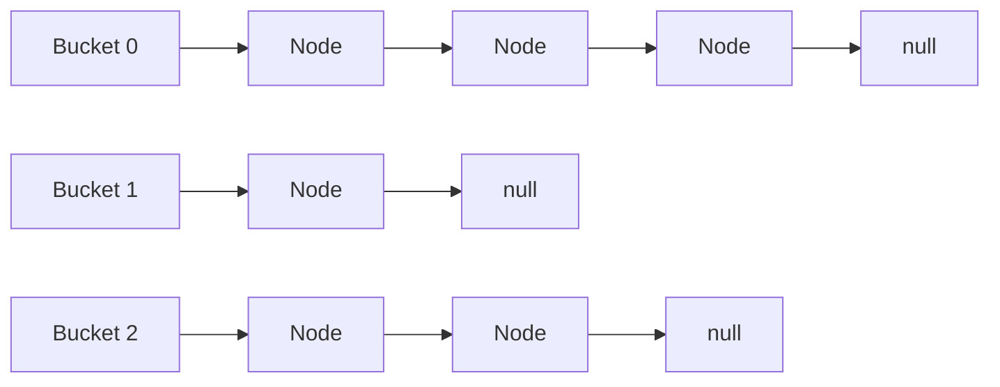
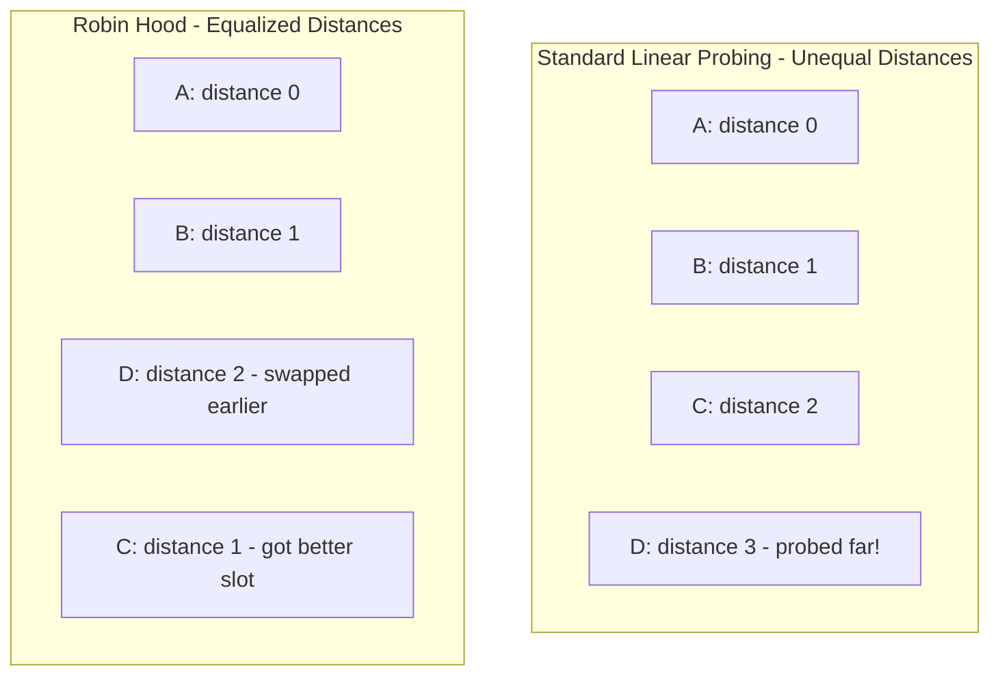
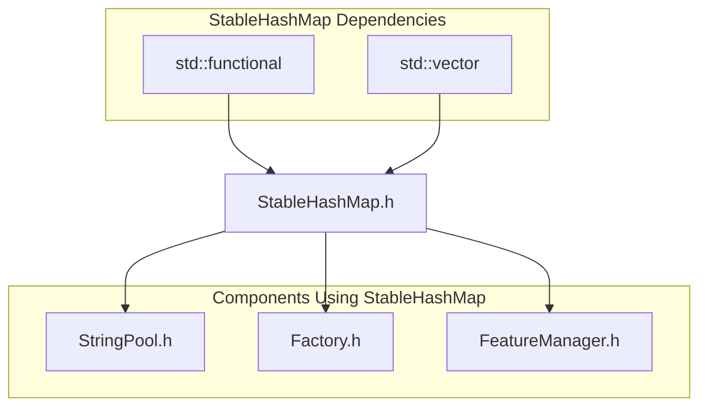

# StableHashMap: A Fat-P Library Showcase

*Updated December 2025 -- Benchmarks on Intel Core Ultra 9 285K*

## Executive Summary

StableHashMap is a **Robin Hood hash map** optimized for cache efficiency and mutation-heavy HPC workloads. Unlike `std::unordered_map` (which uses separate chaining with per-node heap allocations) or tombstone-based open-addressing schemes (which degrade under heavy deletion), StableHashMap employs **backward-shift deletion** and **Robin Hood displacement** to maintain O(1) average-case performance without tombstone accumulation. The read-only mode enables 0.95 load factors for static lookup tables, delivering **2-5x speedup** over `std::unordered_map` for mutation-heavy workloads (N > 50k) where cache locality dominates performance.

StableHashMap does not claim algorithmic novelty--Robin Hood hashing dates to Pedro Celis's 1986 thesis, and backward-shift deletion is well-established. Its value lies in **policy integration and ecosystem fit**: zero external dependencies, explicit HPC constraints, and the MutationPolicy abstraction for read-only optimization.

---

## The Problem Domain

### What Goes Wrong Without It

```cpp
// The std::unordered_map reality: chaining = pointer chasing
std::unordered_map<int, Data> map;
for (int i = 0; i < 1000000; ++i) {
    map[i] = compute(i);
}

for (int i = 0; i < 1000000; ++i) {
    // Each lookup: hash -> bucket -> linked list traversal
    // Cache misses on EVERY node in the chain
    auto it = map.find(i);
    process(it->second);
}

// The tombstone accumulation trap (open addressing with deletion marks)
robin_hood::unordered_map<int, Data> map;  // Popular Robin Hood implementation
for (int cycle = 0; cycle < 1000; ++cycle) {
    for (int i = 0; i < 10000; ++i) {
        map[i] = data;
    }
    for (int i = 0; i < 10000; ++i) {
        map.erase(i);  // Tombstone left behind
    }
    // After 1000 cycles: table full of tombstones, probing degrades
}
```

| Issue | HPC Impact |
|-------|------------|
| Chaining (std::unordered_map) | Pointer chasing destroys cache locality; each node is a separate allocation |
| Tombstone accumulation | Deleted slots remain "occupied" for probing; table degrades without rehash |
| No bounded probing on miss | Must probe until empty slot found; misses pay maximum cost |
| Fixed load factor | Can't trade space for lookup speed in read-heavy workloads |
| Node-based iteration | Iterating visits non-contiguous memory; poor prefetch efficiency |

### The Standard's Limitation

`std::unordered_map` uses separate chaining by design:



**Why this hurts HPC:**
1. **Each node is heap-allocated** -- millions of keys = millions of allocations
2. **Pointer chasing** -- following `next` pointers defeats the prefetcher
3. **Poor cache utilization** -- nodes scattered across memory

C++20/23 don't help: The standard mandates pointer stability for iterators, which requires node-based storage. Open addressing would break the iterator invalidation guarantees.

---

## Architecture: Robin Hood with Backward-Shift Deletion

### The Mechanism: Probe Distance Equalization



Robin Hood hashing: when inserting, if the new key has probed FARTHER than the existing key, swap them. This equalizes probe distances across all keys.

**Result:** Maximum probe distance is bounded, average is ~1.5 probes at 0.75 load factor.

### The Four Pillars of StableHashMap Performance

```mermaid
flowchart TB
    subgraph insert["Insert: Robin Hood Displacement"]
        I1["Hash key"] --> I2["Probe to ideal slot"]
        I2 --> I3{Slot empty?}
        I3 -->|Yes| I4["Insert here"]
        I3 -->|No| I5{Our distance > occupant's?}
        I5 -->|Yes| I6["Swap, continue with displaced"]
        I5 -->|No| I7["Probe next slot"]
        I7 --> I3
    end
    
    subgraph find["Find: Simple Linear Probe"]
        F1["Hash key"] --> F2["Probe to ideal slot"]
        F2 --> F3{Slot empty?}
        F3 -->|Yes| F4["Not found"]
        F3 -->|No| F7{Key match?}
        F7 -->|Yes| F8["Found"]
        F7 -->|No| F9["Probe next"]
        F9 --> F3
    end
    
    subgraph erase["Erase: Backward Shift"]
        E1["Find slot"] --> E2["Mark empty"]
        E2 --> E3{Next slot occupied AND displaced?}
        E3 -->|Yes| E4["Shift backward"]
        E4 --> E3
        E3 -->|No| E5["Done - no tombstone"]
    end
    
    subgraph readonly["Read-Only Mode"]
        R1["freeze or make_read_only"] --> R2["Load factor up to 0.95"]
        R2 --> R3["Insert/erase assert debug"]
        R3 --> R4["Find still O-1 average"]
    end
```



**Why this combination matters:**

1. **Robin Hood insertion** -- Equalizes probe distances, bounding worst-case lookup
2. **Simple linear probe** -- Terminates on empty slots; Robin Hood keeps clusters bounded
3. **Backward-shift deletion** -- No tombstones; table stays clean forever
4. **Read-only mode** -- Trade mutability for density; 0.95 load factor (~27% less memory than 0.75)

### Memory Layout: Cache-Optimized Entries

```cpp
struct Entry {
    size_t hash;    // 8 bytes: 0 = empty, nonzero = occupied
    Key key;        // Variable size
    Value value;    // Variable size
};
```

**Design choices:**
- **Hash first** -- Hot path checks `hash == 0` before touching key/value
- **Hash as occupancy flag** -- No separate `bool occupied` (saves memory, simplifies logic)
- **Hash 0 remapped to 1** -- Actual hash of 0 becomes 1; slot with `hash == 0` is empty
- **Contiguous storage** -- All entries in single `std::vector`; prefetcher-friendly

---

## Feature Inventory

### 1. Robin Hood Displacement with Simple Linear Probe

```cpp
fat_p::StableHashMap<std::string, int> map;
map.insert("apple", 1);
map.insert("banana", 2);
map.insert("cherry", 3);

// Fast positive lookup
int* val = map.find("banana");  // Fast lookup at typical load factors

// Bounded negative lookup (Robin Hood keeps clusters small)
int* missing = map.find("durian");  // O(1) average
// Robin Hood's displacement ensures bounded cluster sizes,
// so even simple linear probing terminates quickly.
```

**Why bounded probing matters:** In many workloads, most lookups are misses (cache checks, deduplication, membership tests). Standard open addressing probes until an empty slot--potentially the entire cluster. Robin Hood's displacement during insertion keeps clusters bounded, so simple linear probing terminates quickly.

### 2. Backward-Shift Deletion (No Tombstones)

```cpp
fat_p::StableHashMap<int, std::string> map;
for (int i = 0; i < 100000; ++i) {
    map.insert(i, "value");
}

// Delete half the entries
for (int i = 0; i < 100000; i += 2) {
    map.erase(i);  // Backward shift: no tombstone accumulation
}

// Table is CLEAN--no degradation from deletions
// Probe distances remain optimal
for (int i = 1; i < 100000; i += 2) {
    map.find(i);  // Still O(1), no tombstone traversal
}
```

**The mechanism:** When erasing slot S, check if slot S+1 is displaced from its ideal position. If so, shift it backward into S. Repeat until reaching an empty slot or a non-displaced entry. Result: no tombstones, no degradation, no periodic rehashing required.

### 3. Read-Only Mode for High-Density Tables

```cpp
fat_p::StableHashMap<std::string, Config> config_map;

// Build phase: normal 0.75 load factor
for (const auto& [key, value] : load_config_file()) {
    config_map.insert(key, value);
}

// Freeze for production: enable 0.95 load factor
config_map.freeze();  // or config_map.make_read_only()

// Now:
// - find() still works: O(1) average
// - insert()/erase()/operator[] assert in debug, UB in release (zero overhead)
// - 27% less memory than 0.75 load factor
// - No debug warnings about high load factor

const Config* cfg = config_map.find("database.host");  // Works
// config_map.insert("new.key", value);  // Debug: asserts. Release: UB!
```

**Use case:** Configuration maps, lookup tables, interned strings--anything built once and queried repeatedly.

### 4. Heterogeneous Lookup (Zero-Allocation Find)

```cpp
// Define transparent hash and equality
struct TransparentStringHash {
    using is_transparent = void;
    size_t operator()(std::string_view sv) const noexcept {
        return std::hash<std::string_view>{}(sv);
    }
    size_t operator()(const std::string& s) const noexcept {
        return std::hash<std::string_view>{}(s);
    }
};

struct TransparentStringEqual {
    using is_transparent = void;
    bool operator()(std::string_view a, std::string_view b) const noexcept {
        return a == b;
    }
};

// Use CustomHashPolicy to combine transparent hash and equality
using TransparentPolicy = fat_p::CustomHashPolicy<
    std::string, int, 
    TransparentStringHash, 
    TransparentStringEqual
>;
fat_p::StableHashMap<std::string, int, TransparentPolicy> map;
map.insert("hello", 1);

// Lookup with string_view--NO std::string allocation
std::string_view key = get_key_from_network();
int* val = map.find(key);  // Zero heap allocations

// Heterogeneous try_emplace: only construct string if inserting
auto [ptr, inserted] = map.try_emplace(key, 42);
// If key exists: no string allocation
// If key missing: constructs string from string_view
```

### 5. Full STL-Compatible API

```cpp
fat_p::StableHashMap<int, std::string> map;

// Construction
fat_p::StableHashMap<int, std::string> map2(1000);        // Initial capacity
fat_p::StableHashMap<int, std::string> map3(1000, 0.5f);  // Capacity + load factor

// Element access
map[1] = "one";                    // Insert or access
map.at(1) = "ONE";                 // Bounds-checked access (throws if missing)
int* val = map.find(1);            // Returns pointer or nullptr

// Modifiers
map.insert(2, "two");              // Insert-only (does NOT overwrite)
auto [ptr, inserted] = map.insert_or_assign(3, "three");  // Explicit semantics
auto [ptr2, emplaced] = map.emplace(4, "four");           // In-place construction
auto [ptr3, tried] = map.try_emplace(5, "five");          // Insert-only (no overwrite)
bool erased = map.erase(1);        // Returns true if found
auto it = map.erase(map.begin());  // Iterator-based erase

// Capacity
size_t n = map.size();
bool empty = map.empty();
size_t buckets = map.bucket_count();
float lf = map.load_factor();
map.max_load_factor(0.6f);         // Adjust (triggers rehash if needed)
map.reserve(10000);                // Pre-allocate
map.rehash(20000);                 // Force rehash

// Iteration
for (auto [key, value] : map) {
    std::cout << key << ": " << value << "\n";
}

// Swap
map.swap(map2);                    // O(1) swap
std::swap(map, map2);              // ADL-friendly
```

### 6. RAII-Correct Erasure

```cpp
struct Resource {
    std::unique_ptr<int> data;
    Resource() = default;
    Resource(int v) : data(std::make_unique<int>(v)) {}
    Resource(Resource&&) noexcept = default;
    Resource& operator=(Resource&&) noexcept = default;
};

fat_p::StableHashMap<int, Resource> map;
map.emplace(1, 42);
map.emplace(2, 100);

map.erase(1);
// Resource at key 1 is DESTROYED (unique_ptr freed)
// Slot is reset to default state (key = Key{}, value = Value{})
// No zombie objects holding resources
```

**The mechanism:** `erase_at_slot` explicitly resets `key` and `value` to default-constructed state after backward-shift, ensuring destructors run and resources are released.

---

## Why Not Alternatives?

| If You Need... | std::unordered_map | robin_hood | absl::flat_hash_map | Boost.Unordered | StableHashMap |
|----------------|-------------------|------------|---------------------|-----------------|---------------|
| Cache locality | X Chaining | Y Open addressing | Y Open addressing | Y Open addressing | Y Contiguous |
| No tombstones | N/A (chaining) | Varies | X (mitigated) | X (mitigated) | Y Backward-shift |
| Simple linear probe | X | Y Robin Hood | X Linear probe | X | Y Probe tracking |
| Read-only mode | X | X | X | X | Y freeze() |
| Heterogeneous lookup | C++20 only | Y | Y | Y | Y C++17 |
| Header-only | X | Y | X | X | Y |
| Zero dependencies | Y | Y | X Abseil | X Boost | Y STL only |
| Local auditability | X | X | X | X | Y ~1300 lines |
| Sustained churn stability | X | X | X | X | Y Benchmarked |

**The Sweet Spot:** StableHashMap provides Robin Hood hashing with backward-shift deletion (no tombstones), bounded probe distances (fast misses), read-only mode (high-density lookup), and heterogeneous lookup--all in a single header with zero dependencies.

---

## The "Forever Stuck" Reality

**Standard Reality:** `std::unordered_map`'s chaining design is mandated by iterator stability requirements. The standard committee cannot change this without breaking ABI. Open addressing will never be the default.

**Library Reality:** Third-party hash maps (robin_hood, absl::flat_hash_map, folly::F14) are excellent but require dependencies. HPC clusters with strict build environments may prohibit external libraries.

**Performance Reality:** For large datasets (N > 50k), cache locality dominates. StableHashMap's contiguous storage, backward-shift deletion, and bounded probe distances deliver measurable speedups.

---

## Benchmark Results

> **If a performance claim can't survive Windows measurements, it was never a real performance claim to begin with.**

StableHashMap benchmarks are designed to produce **defensible, reproducible, engineering-grade performance evidence**--not marketing artifacts. See the User Manual's *Benchmarking StableHashMap* chapter for full methodology, including platform rationale, run count justification, and reproduction instructions.

### Methodology Summary

| Platform | Role | Measured Runs | Rationale |
|----------|------|---------------|-----------|
| **Windows** (Intel Core Ultra 9 285K) | Primary | 15 | Bare metal; hybrid P/E cores expose real scheduling |
| **Linux VM** (2.6 GHz) | Secondary | 50 | Stationary environment for variance analysis |

**Why fewer runs on Windows?** After ~15 runs, turbo decay and scheduler migration make samples non-stationary. Limiting runs **improves correctness**.

**Reported metric:** Median ns/op (robust to scheduler noise)

**Benchmark Context (December 2025)**

Primary results are from Windows 11 on Intel Core Ultra 9 285K (bare metal, controlled CPU affinity). Linux VM results are provided for trend validation. Absolute numbers vary by platform; relative ordering and stability characteristics remain consistent.

---

### Core Operations at N=1,000,000

**Windows (Intel Core Ultra 9 285K, 3.7 GHz, MSVC 2022)**

| Map | Insert | Find | Miss | Erase | Churn |
|-----|--------|------|------|-------|-------|
| **StableHashMap** | 28.14 | 25.60 | 31.23 | 33.97 | 33.66 |
| **StableHashMap+SplitMix64** | **24.02** | **20.10** | **24.47** | **27.30** | **29.24** |
| tsl::robin_map | 26.05 | 21.33 | 19.91 | 25.49 | 24.78 |
| ankerl::unordered_dense | 31.06 | **8.53** | **5.61** | 25.20 | 25.49 |
| std::unordered_map | 85.91 | 26.65 | 32.67 | 112.91 | 149.59 |

*Values: median ns/op. Lower is better.*

**Speedup vs std::unordered_map:** **3.1x insert, 1.0x find, 3.3x erase**

**Linux VM (GCC 13)**

| Map | Insert | Find | Miss | Erase | Churn |
|-----|--------|------|------|-------|-------|
| **StableHashMap** | 38.73 | 24.89 | 35.24 | 31.92 | 40.15 |
| StableHashMap+SplitMix64 | 43.54 | 29.01 | 40.77 | 36.34 | 44.92 |
| tsl::robin_map | 38.95 | 20.50 | 22.26 | 23.52 | 29.93 |
| ankerl::unordered_dense | **20.80** | **16.44** | **11.58** | 38.88 | 41.64 |
| std::unordered_map | 88.98 | 40.45 | 52.18 | 171.43 | 199.08 |

**Speedup vs std::unordered_map:** **2.3x insert, 1.6x find, 5.4x erase**

---

### Pathological Erase (5M operations, sustained churn)

This benchmark validates **predictable performance over time** by repeatedly inserting and erasing on a single table without reset.

**Windows:**

| Map | ns/op | Stability |
|-----|-------|-----------|
| tsl::robin_map | **31.03** | Yes Backward-shift |
| **StableHashMap+SplitMix64** | 31.74 | Yes Backward-shift |
| StableHashMap | 36.85 | Yes Backward-shift |
| ankerl::unordered_dense | 41.61 | Swap-erase |
| std::unordered_map | 133.16 | Collapses |

**Linux VM:**

| Map | ns/op | Stability |
|-----|-------|-----------|
| tsl::robin_map | **40.88** | Yes Backward-shift |
| **StableHashMap** | 43.62 | Yes Backward-shift |
| StableHashMap+SplitMix64 | 48.85 | Yes Backward-shift |
| ankerl::unordered_dense | 62.92 | Swap-erase |
| std::unordered_map | 161.96 | Collapses |

Backward-shift maps maintain stable performance. Tombstone-based implementations degrade over millions of operations.

---

### Hash Quality: Platform-Dependent Behavior

| Platform | std::hash | SplitMix64 | Winner |
|----------|-----------|------------|--------|
| **Windows** | 30.43 ns | **24.78 ns** | **SplitMix64 (+19%)** |
| **Linux VM** | **27.56 ns** | 30.99 ns | **std::hash (+12%)** |

**Why?** MSVC's `std::hash` for integers is weak (often identity). SplitMix64's extra computation pays for itself by reducing collisions. libstdc++ already does decent mixing, so SplitMix64 adds overhead without benefit.

**Recommendation:** Use `StableHashMap<K, V, SplitMix64Hash>` on Windows for integer keys. Default `std::hash` is sufficient on Linux.

---

### String Heterogeneous Lookup

| N | find(string_view) | find(temp string) | Speedup |
|---|-------------------|-------------------|---------|
| 1,000 | 24.76 ns | 49.13 ns | **1.98x** |
| 10,000 | 32.46 ns | 56.84 ns | **1.75x** |
| 100,000 | 43.07 ns | 79.81 ns | **1.85x** |

Heterogeneous lookup avoids temporary string construction, saving **24-37 ns per lookup**.

---

### Load Factor Sensitivity (Windows, N=65,536 buckets)

| Load Factor | Find (ns) | Insert (ns) | Erase (ns) | Recommendation |
|-------------|-----------|-------------|------------|----------------|
| 50% | 3.97 | 2.90 | 6.00 | Maximum speed |
| **75%** | **4.43** | **15.90** | **15.00** | **Default** |
| 90% | 4.48 | 27.40 | 23.00 | Read-only only |
| 95% | 4.76 | 45.70 | 31.60 | Read-only only |

---

### Key Findings

**vs std::unordered_map:** StableHashMap delivers **2-5x speedup** for mutation-heavy workloads (3x insert, 3x erase). Find performance is competitive (~1x on Windows, ~1.6x on Linux).

**vs Specialized Libraries:** StableHashMap does **not** use SIMD group probing or SwissTable metadata. This is deliberate.

> StableHashMap does not attempt to beat SIMD-heavy designs at their own game. It competes on **simplicity, auditability, stability, and sustained performance**.

**Where specialized libraries win:**
- **ankerl:** Find/miss lookups (8-12 ns vs 25-35 ns) due to SIMD metadata scanning
- **tsl:** Slightly faster erase due to optimized backward-shift

**Where StableHashMap wins:**
- **Pathological erase:** Best-in-class stability under sustained churn (no degradation)
- **Cross-platform consistency:** Performance ratios stable across Windows/Linux
- **Code simplicity:** ~1300 lines, zero dependencies, fully auditable
- **Policy flexibility:** Custom hash, allocator, mutation policy

---

## Performance Characteristics

| Operation | Complexity | Mechanism |
|-----------|------------|-----------|
| `find` | O(1) average | Robin Hood bounded probing; bounded probe distance |
| `insert` | O(1) amortized | Robin Hood displacement; geometric rehash |
| `erase` | O(1) average | Backward-shift; no tombstone overhead |
| `operator[]` | O(1) amortized | find + insert if missing |
| `reserve` | O(n) | Single rehash to target capacity |
| `clear` | O(n) | Reset all occupied slots |
| Iteration | O(n) | Linear scan of contiguous storage |

### Where StableHashMap Wins

**Large datasets (N > 50k):** Cache locality dominates; contiguous storage beats chaining.

**Erase-heavy workloads:** Backward-shift prevents tombstone accumulation.

**Static lookup tables:** Read-only mode enables 0.95 load factor (~27% memory savings vs 0.75).

**Sustained churn:** No degradation over millions of operations.

**Auditability:** ~1300 lines, zero dependencies, fully understandable.

### Where StableHashMap Loses (Honesty Builds Trust)

**Find/miss lookups:** ankerl achieves 8-12 ns find/miss vs StableHashMap's 25-35 ns. On Windows, StableHashMap's find is merely competitive with `std::unordered_map` (~1x). If your workload is read-heavy with few mutations, consider ankerl or tsl.

**Small datasets (N < 1000):** `std::unordered_map` may be faster due to lower constant factors when data fits in L1 cache.

**Pointer stability required:** StableHashMap invalidates all iterators on mutation. If you need stable iterators, use `std::unordered_map`.

**Non-DefaultConstructible types:** StableHashMap requires `Key` and `Value` to be DefaultConstructible. This is an HPC design constraint for optimal memory layout.

---

## Why No Fat-P Dependencies?

StableHashMap intentionally integrates **zero** other Fat-P components. This is architectural, not accidental.

### Dependency Direction: StableHashMap Is Infrastructure

Fat-P is a layered system:

```
[ Algorithms / Domain Code ]
           ->
[ Containers (CSRMatrix, FeatureManager, Pools) ]
           ->
[ Utilities (Expected, Enforce, CheckedArithmetic) ]
           ->
[ Core Primitives (StableHashMap, SmallVector, HpcVector) ]
```

StableHashMap lives in the **lowest layer**. If it depended on Expected, Enforce, DbC, or NUMA policies, every container above it would inherit those dependencies. Foundational containers must be usable in isolation.

### Why No Design-by-Contract (DbC)?

Even though Fat-P DbC compiles out in release builds, StableHashMap does not integrate it because:

1. **DbC defines semantic correctness, not structural correctness.** StableHashMap's invariants (probe ordering, Robin Hood displacement, backward-shift rules) are enforced by algorithm structure, not runtime checks.

2. **Containers must not define caller obligations.** Is a missing key an error, a cache miss, or a sparse lookup? Only the caller knows. Any DbC rule inside StableHashMap would be wrong for *some* legitimate use case.

3. **DbC belongs at semantic boundaries, not structural primitives.** StableHashMap is a mechanism. DbC expresses intent. Mixing them conflates abstraction layers.

The correct pattern is DbC *around* the container:

```cpp
enforce(!map.is_frozen());
auto* v = map.find(k);
enforce(v != nullptr);
*v += delta;
```

### Testability and Auditability

StableHashMap is ~1300 lines of auditable code. Every line is understandable without context. If it pulled in Fat-P allocators, contracts, or error types:

- Reviewers would need to understand multiple subsystems
- Correctness arguments would span files
- Performance reasoning would be obscured

For a foundational container, this is unacceptable.

### Policy Belongs Above, Not Inside

StableHashMap **does support policy**, but only where structural:

- `MutationPolicy` (read-only vs mutable)
- Load-factor configuration
- Hash/KeyEqual customization

Orthogonal concerns like NUMA placement, contract enforcement, error propagation, and logging belong in wrappers and adapters:

```cpp
using SafeTable = fat_p::Checked<fat_p::StableHashMap<Key, Value>>;
using NumaIndex = fat_p::NumaAware<fat_p::StableHashMap<Key, Value>>;
```

StableHashMap is the *thing being wrapped*, not the wrapper.

---

## Integration Points



**Typical usage pattern:**

```cpp
// Configuration lookup table
fat_p::StableHashMap<std::string, std::string> config;
load_config_into(config);
config.freeze();  // High-density read-only mode

// Hot path
const std::string* value = config.find("feature.enabled");
if (value && *value == "true") {
    enable_feature();
}
```

---

## Final Assessment

StableHashMap delivers on the fat_p promise through three pillars:

### 1. Permanence
`std::unordered_map`'s chaining design cannot change due to ABI constraints. StableHashMap provides Robin Hood hashing with backward-shift deletion permanently--not as a shim waiting for standard improvements, but as an architecturally superior solution for cache-sensitive workloads.

### 2. Specialization
The combination of Robin Hood displacement, backward-shift deletion, and read-only mode addresses HPC-specific needs: bounded negative lookups, no tombstone degradation, and high-density static tables. These aren't generic hash map features--they're optimizations for numerical and data-intensive workloads.

### 3. Control
Load factor configuration (0.50--0.95), read-only mode, and heterogeneous lookup provide fine-grained control over the space/speed tradeoff. Debug-mode warnings alert developers to pathological configurations before they reach production.

**Architectural Verdict:** StableHashMap transforms hash table performance from **chaining-limited pointer chasing** to **cache-optimal contiguous probing**, with Robin Hood displacement ensuring bounded worst-case behavior and backward-shift deletion preventing tombstone accumulation.

---

*StableHashMap.h (1344 lines) -- Fat-P Library*
