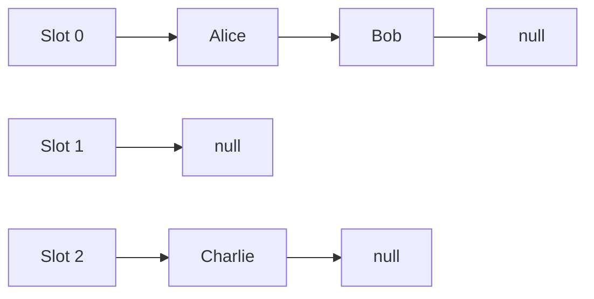
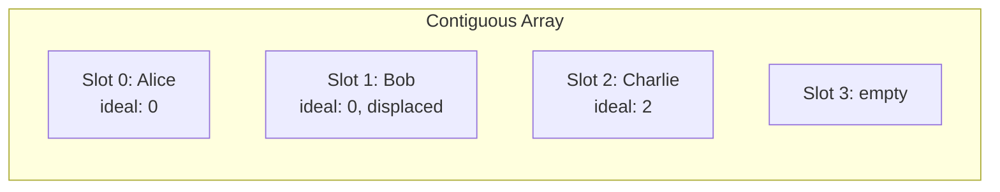
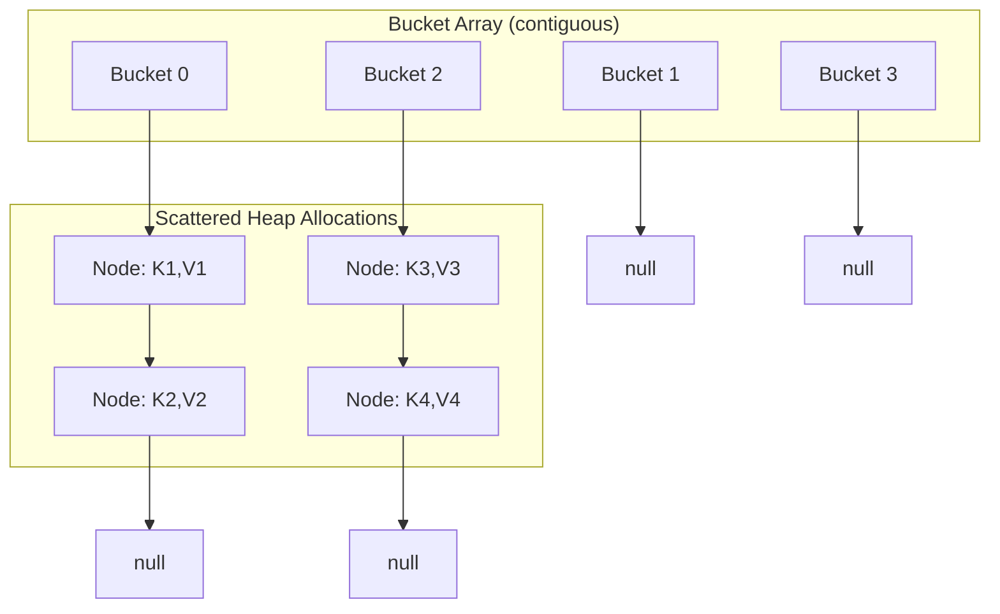
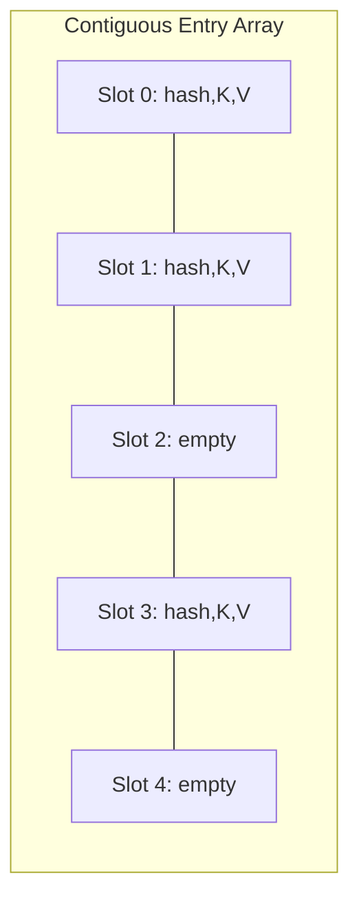
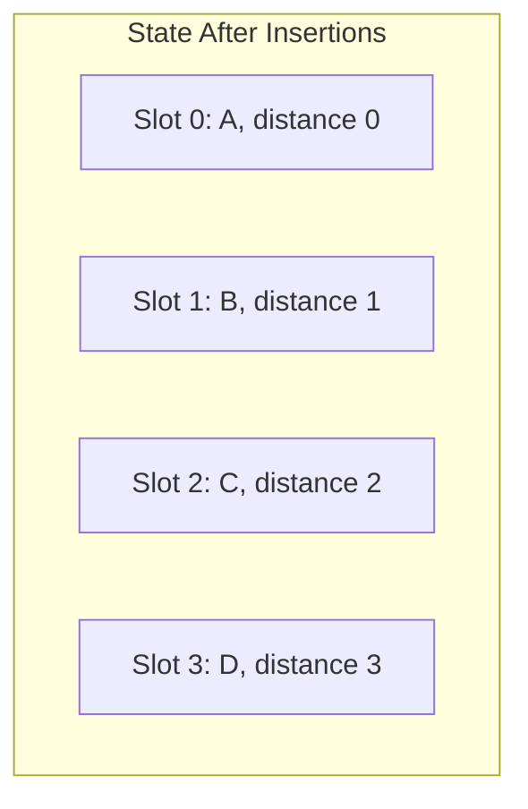
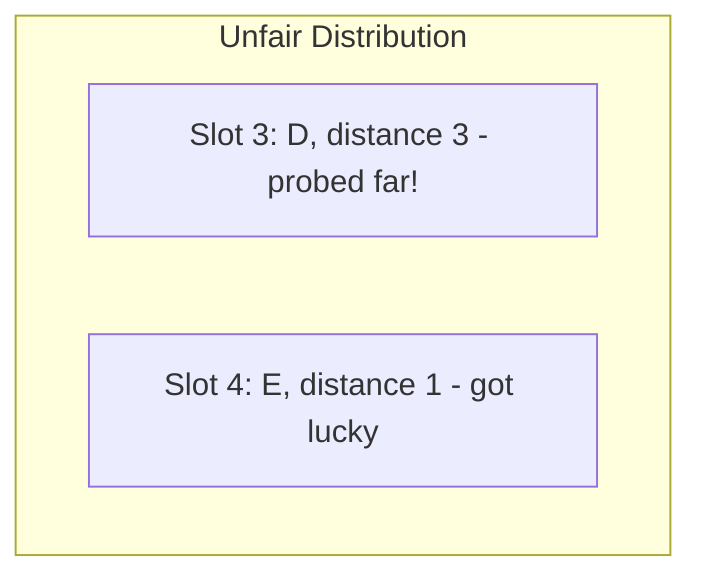
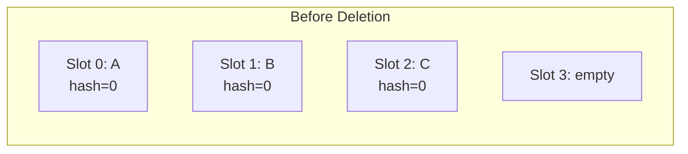
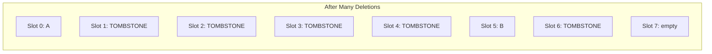
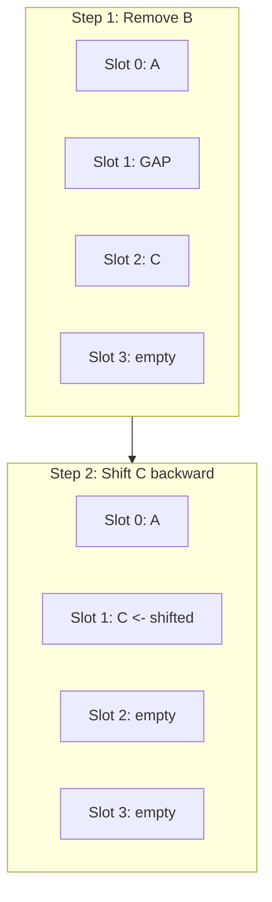

# StableHashMap User Manual

*Updated December 2025 -- Benchmarks on Intel Core Ultra 9 285K*

## Table of Contents

1. [The Hash Table Story](#the-hash-table-story)
2. [Understanding Hash Map Architectures](#understanding-hash-map-architectures)
3. [Robin Hood Hashing: The Key Innovation](#robin-hood-hashing-the-key-innovation)
4. [Getting Started](#getting-started)
5. [The Insert Dilemma: Four Methods, Four Philosophies](#the-insert-dilemma-four-methods-four-philosophies)
6. [Finding Values: Why Pointers Beat Iterators](#finding-values-why-pointers-beat-iterators)
7. [The Deletion Problem and Backward-Shift](#the-deletion-problem-and-backward-shift)
8. [Load Factor: The Central Tradeoff](#load-factor-the-central-tradeoff)
9. [Read-Only Mode: Trading Flexibility for Density](#read-only-mode-trading-flexibility-for-density)
10. [Heterogeneous Lookup: Avoiding Temporary Objects](#heterogeneous-lookup-avoiding-temporary-objects)
11. [Benchmarking StableHashMap](#benchmarking-stablehashmap)
12. [When to Use StableHashMap (and When Not To)](#when-to-use-stablehashmap-and-when-not-to)
13. [Migration from std::unordered_map](#migration-from-stdunordered_map)
14. [Troubleshooting](#troubleshooting)
15. [API Reference](#api-reference)
16. [Summary](#summary)
17. [Appendix A: Policy-Based Extensibility](#appendix-a-policy-based-extensibility)

---

## The Hash Table Story

### The Idea That Changed Computing

In 1953, Hans Peter Luhn at IBM filed an internal memorandum describing a technique for storing and retrieving records by their content rather than their location. The idea was simple: compute a number from the record's key, use that number as an array index, and store the record there. Retrieval was instant--no searching required.

This technique became known as *hashing*, and it's arguably the most important data structure invention of the 20th century. Every database index, every compiler symbol table, every web browser cache, every cryptocurrency uses hash tables at their core.

The elegance is mathematical: if you can distribute keys uniformly across array slots, every operation--insert, find, delete--takes O(1) time. Not O(log n) like balanced trees. Not O(n) like linear search. Constant time, regardless of how many elements you have.

But there's a catch.

### The Collision Problem

Two different keys can hash to the same slot. This is inevitable--if you have more possible keys than slots (and you always do), collisions must occur. The pigeonhole principle guarantees it.

Consider hashing strings to a million slots. There are infinitely many possible strings but only a million slots. Collisions aren't a bug; they're a mathematical certainty. The question is: what do you do when they happen?

Computer scientists developed two fundamentally different answers, and this choice shapes everything about a hash table's performance.

### Two Schools of Thought

**Separate Chaining (1953):** Store colliding elements in a linked list hanging off each slot. The slot becomes a "bucket" pointing to a chain of entries.



This is what `std::unordered_map` uses. It's simple, handles high collision rates gracefully, and never needs to move elements once inserted. The standard library chose it because it provides strong iterator stability guarantees.

**Open Addressing (1954):** Store everything directly in the array. When a collision occurs, probe for another slot--check slot+1, then slot+2, etc., until you find an empty one.



This is what StableHashMap uses. It's cache-friendly, avoids per-element allocations, and with the right probing strategy, matches or beats chaining.

### Why Open Addressing Won in HPC

For decades, separate chaining dominated. It was taught in textbooks, implemented in standard libraries, used in production. But around 2010, something changed: CPUs got fast, but memory got *relatively* slow.

Modern processors execute billions of instructions per second, but fetching data from main memory takes hundreds of cycles. The CPU spends most of its time waiting. The solution is caching--keeping recently accessed data in small, fast memories close to the processor.

Here's where hash table architecture matters enormously:

**Separate chaining destroys cache locality.** Each element lives in its own heap allocation, scattered randomly across memory. Following a chain means chasing pointers to unpredictable locations. The CPU prefetcher can't help; it doesn't know where the next pointer leads.

**Open addressing preserves cache locality.** All elements live in a contiguous array. When you access slot N, the CPU automatically fetches slots N+1, N+2, etc. into cache. Probing nearby slots is nearly free.

Google's benchmarks in 2017 (published with their "Swiss Tables" implementation) showed open addressing 2-3x faster than `std::unordered_map` for most workloads. Facebook's F14 confirmed similar results. The academic debate was settled by engineering reality.

### The Clustering Problem

Open addressing has its own challenge: clustering. When multiple keys hash near each other, they form "clusters" of occupied slots. New insertions into the cluster probe through many slots before finding space. Lookups for keys in the cluster also probe through many slots.

With basic linear probing, clusters grow over time. A cluster of size K has probability proportional to K of growing by one more element. Big clusters attract more elements, getting bigger still. This creates pathological worst cases.

In 1986, Pedro Celis proposed a solution in his Ph.D. thesis at the University of Waterloo: Robin Hood hashing.

---

## Understanding Hash Map Architectures

### Memory Layout Comparison

To understand why StableHashMap is fast, you need to see how hash tables are actually laid out in memory.

**std::unordered_map (separate chaining):**



Every element requires a separate heap allocation. The allocator returns addresses scattered across memory. Following the chain means cache misses.

**StableHashMap (open addressing):**



One allocation holds everything. Probing slot N+1 after slot N is essentially free--it's already in the cache line.

### The Cache Line Effect

Modern CPUs don't fetch individual bytes from memory; they fetch *cache lines*--typically 64 bytes at a time. When you access any byte in a cache line, the whole line comes along.

Consider a hash table with 8-byte keys and 8-byte values. Each entry is ~24 bytes (hash + key + value). A 64-byte cache line holds about 2-3 entries.

**In separate chaining:** Each entry is its own allocation. Visiting 3 entries means 3 cache line fetches from random memory locations.

**In open addressing:** 3 consecutive entries fit in 1-2 cache lines. If they're in the same line, visiting all 3 costs just 1 memory fetch.

This isn't a small difference. It's the difference between 3 cache misses (300+ cycles) and 1 cache miss (100 cycles). For hot lookup paths, it determines whether your code is CPU-bound or memory-bound.

---

## Robin Hood Hashing: The Key Innovation

### The Problem Robin Hood Solves

Basic linear probing has a clustering problem. Imagine inserting keys that all hash to slot 0:



Key D probed 3 slots from its ideal position. But now insert key E with hash=3:



This seems unfair. D traveled 3 slots from its ideal position. E traveled just 1 slot. If we later look for E, we find it quickly. Looking for D requires probing through A, B, C first.

Robin Hood hashing fixes this by "stealing from the rich" - if a new key has probed farther than an existing key, swap them. The result: **probe distances are equalized**. No element gets much luckier or unluckier than others. The maximum probe distance is bounded and much smaller than with basic linear probing.

### Why This Matters for Performance

Robin Hood's distance equalization provides bounded worst-case probe distances and creates opportunities for optimization.

**Theoretical Early-Exit:** In Robin Hood hashing, if your probe distance exceeds the resident's probe distance during lookup, the key can't exist further along - it would have stolen the resident's slot during insertion.

**StableHashMap's Implementation Choice:** After benchmarking, StableHashMap uses **simple linear probing** for `find()` rather than early-exit. The reason: checking probe distances on every probe adds overhead that typically exceeds the savings from early termination. Simple linear probing with fewer calculations per probe is faster in practice.

The key insight: Robin Hood's **insertion** behavior (displacement) ensures bounded clusters, which makes **any** probing strategy faster - even without explicit early-exit logic.

```
StableHashMap find: Simple Linear Probe
Slot 3: D -> Check key, no match
Slot 4: F -> Check key, no match  
Slot 5: empty -> STOP, not found
```

StableHashMap terminates on empty slots, relying on Robin Hood's insertion invariant to keep clusters bounded. This approach prioritizes raw throughput over theoretical early-exit.

#### Early-Exit Probing (Documented Non-Goal)

Robin Hood hashing theoretically permits early termination during lookup when the current probe distance exceeds the resident element's displacement. StableHashMap intentionally omits this optimization.

Benchmarks across Windows bare-metal and Linux VMs showed that the additional per-probe arithmetic and branching outweighed any reduction in probe count. The insertion-time Robin Hood invariant already tightly bounds clusters, making simple linear probing faster and more predictable on real hardware.

This is not a "missing optimization" -- it is a **deliberate design choice** validated by measurement. Software prefetching was similarly tested and rejected for the same reasons: added complexity without measurable benefit on modern out-of-order CPUs with hardware prefetchers.

---

## Getting Started

### Prerequisites and Integration

StableHashMap requires C++17 and has no dependencies beyond the standard library. It's a single header file:

```cpp
// If using StableHashMap standalone (copied to your project):
#include "StableHashMap.h"

// If using as part of the Fat-P library:
#include "fatp/StableHashMap.h"
```

Compile with your usual flags:

```bash
# GCC
g++ -std=c++17 -O2 program.cpp -o program

# Clang
clang++ -std=c++17 -O2 program.cpp -o program

# MSVC
cl /std:c++17 /O2 program.cpp
```

### Your First StableHashMap

```cpp
#include "StableHashMap.h"
#include <iostream>
#include <string>

int main()
{
    // Create a map from strings to integers
    fat_p::StableHashMap<std::string, int> ages;
    
    // Insert some entries
    ages.insert("Alice", 30);
    ages.insert("Bob", 25);
    ages.insert("Charlie", 35);
    
    // Find returns a pointer (nullptr if missing)
    if (int* age = ages.find("Alice"))
    {
        std::cout << "Alice is " << *age << " years old\n";
    }
    
    // Check existence without getting value
    if (ages.contains("Dave"))
    {
        std::cout << "Dave is in the map\n";
    }
    else
    {
        std::cout << "Dave is not in the map\n";
    }
    
    // Iterate over all entries
    for (auto [name, age] : ages)
    {
        std::cout << name << ": " << age << "\n";
    }
    
    return 0;
}
```

### Understanding the Template Parameters

```cpp
template <typename Key,
          typename Value,
          typename Policy = DefaultPolicy<Key, Value>>
class StableHashMap;
```

**Key** and **Value** are your data types. They must be:
- DefaultConstructible (have a no-argument constructor)
- Nothrow movable (move constructor/assignment won't throw)

Why DefaultConstructible? StableHashMap pre-allocates entry slots. Empty slots contain default-constructed values. This is the price of contiguous storage--you can't have "truly empty" slots without a separate occupancy array.

> **Important:** This constraint affects types like non-nullable handles, immutable IDs, or RAII resources without default states. If your type isn't naturally DefaultConstructible, you have several options:
>
> 1. **Add a sentinel default state:**
>    ```cpp
>    struct MyKey {
>        int id;
>        MyKey() : id(-1) {}  // -1 indicates "empty"
>        explicit MyKey(int i) : id(i) {}
>    };
>    ```
>
> 2. **Use `std::optional` as the Value type:**
>    ```cpp
>    StableHashMap<int, std::optional<NonDefaultConstructible>> map;
>    ```
>
> 3. **Use a pointer or `std::unique_ptr`:**
>    ```cpp
>    StableHashMap<int, std::unique_ptr<HeavyObject>> map;
>    ```
>
> The DefaultConstructible requirement is enforced at compile time via `static_assert`. If you see an error mentioning this constraint, one of the above workarounds will resolve it.

Why nothrow movable? During rehashing, elements are moved to new slots. If a move throws mid-rehash, the table is in an inconsistent state with no way to recover. The noexcept guarantee lets StableHashMap provide strong exception safety.

**Policy** controls the hash function, equality predicate, and allocator. The default `DefaultPolicy` uses `std::hash`, `std::equal_to`, and `std::allocator`. Custom types need custom hash functions via `CustomHashPolicy`:

```cpp
struct Point { int x, y; };

struct PointHash
{
    size_t operator()(const Point& p) const noexcept
    {
        return std::hash<int>{}(p.x) ^ (std::hash<int>{}(p.y) << 1);
    }
};

// Use CustomHashPolicy to provide custom hash
using PointMap = fat_p::StableHashMap<
    Point, std::string, 
    fat_p::CustomHashPolicy<Point, std::string, PointHash>
>;

PointMap point_labels;
```

For case-insensitive string comparison or floating-point tolerance in key comparison, provide a custom `KeyEqual` as the fourth template argument to `CustomHashPolicy`.

---

## The Insert Dilemma: Four Methods, Four Philosophies

### Why So Many Insert Methods?

StableHashMap provides four ways to add elements: `insert()`, `insert_or_assign()`, `emplace()`, and `try_emplace()`. This seems redundant. Why not just one?

The answer involves a fundamental design question: **what happens when you insert a key that already exists?**

Different use cases want different answers:
- Configuration: "Update the setting if it exists, add it if it doesn't" -> overwrite
- Caching: "Use the cached value if present, compute only if missing" -> don't overwrite
- Counting: "Increment if exists, start at 1 if new" -> modify in place

No single behavior fits all cases. Rather than choose wrong for half your users, StableHashMap gives you control.

### insert(): Insert-Only (No Overwrite)

```cpp
bool insert(const Key& k, const Value& v);
```

`insert()` only inserts if the key is **missing**. If the key exists, it does nothing and returns `false`:

```cpp
fat_p::StableHashMap<std::string, int> map;
map.insert("x", 1);
bool inserted = map.insert("x", 2);  // Returns false, value unchanged
std::cout << *map.find("x");  // Prints 1 (original value)
```

**This matches `std::unordered_map::insert()` semantics** -- duplicates are ignored. Use `insert_or_assign()` for upsert behavior.

### insert_or_assign(): The Upsert Operation

```cpp
std::pair<Value*, bool> insert_or_assign(const Key& k, Value&& v);
```

`insert_or_assign()` always succeeds. If the key exists, the value is **overwritten**:

```cpp
fat_p::StableHashMap<std::string, int> map;
map.insert_or_assign("x", 1);
auto [ptr, was_insert] = map.insert_or_assign("x", 2);  // Overwrites!
std::cout << *ptr;  // Prints 2
// was_insert == false (updated existing)
```

This is the "upsert" (update-or-insert) operation common in database terminology. In HPC workloads, upsert is often the common case -- updating simulation state, accumulating results, or overwriting stale cache entries.

### try_emplace(): The Cache Pattern

```cpp
template<typename... Args>
std::pair<Value*, bool> try_emplace(const Key& k, Args&&... args);
```

`try_emplace()` only inserts if the key is **missing**. If present, it does nothing:

```cpp
fat_p::StableHashMap<std::string, ExpensiveObject> cache;

// First call: key missing, constructs ExpensiveObject
auto [ptr1, inserted1] = cache.try_emplace("data", expensive_args...);
// inserted1 == true, ExpensiveObject was constructed

// Second call: key exists, does nothing
auto [ptr2, inserted2] = cache.try_emplace("data", expensive_args...);
// inserted2 == false, expensive_args not evaluated!
// ptr2 points to the original object
```

The `bool` tells you whether insertion happened. This enables the cache pattern:

```cpp
std::shared_ptr<Texture> get_texture(const std::string& path)
{
    auto [ptr, inserted] = texture_cache.try_emplace(path, nullptr);
    if (inserted)
    {
        // Key was new, need to load
        *ptr = load_texture_from_disk(path);
    }
    return *ptr;
}
```

This is exactly how `std::unordered_map::try_emplace()` works--StableHashMap provides compatibility.

### Heterogeneous try_emplace: Zero-Allocation Lookups

When using transparent hash/equality (see [Heterogeneous Lookup](#heterogeneous-lookup-avoiding-temporary-objects)), `try_emplace()` gains a crucial optimization: **no Key construction when the key already exists**.

```cpp
// With transparent policy
using Policy = fat_p::CustomHashPolicy<std::string, int,
                                       TransparentStringHash,
                                       TransparentStringEqual>;
fat_p::StableHashMap<std::string, int, Policy> cache;

cache.try_emplace("existing_key", 1);  // Inserts, constructs std::string

// Later lookup with const char*:
cache.try_emplace("existing_key", 999);
// - Key exists, returns pointer to existing value
// - NO std::string constructed! Zero allocation!
```

This is the key benefit of heterogeneous `try_emplace()`: lookups on existing keys avoid temporary object construction entirely. For high-frequency cache checks with string keys, this can eliminate millions of allocations.

The signature for heterogeneous lookup:

```cpp
template <typename K, typename... Args>
std::pair<Value*, bool> try_emplace(K&& k, Args&&... args);
// Enabled when Hash and KeyEqual have is_transparent
```

### emplace(): In-Place Construction with Overwrite

```cpp
template<typename... Args>
std::pair<Value*, bool> emplace(const Key& k, Args&&... args);
```

`emplace()` constructs the value in-place from arguments. Unlike `try_emplace()`, it **overwrites** existing values:

```cpp
fat_p::StableHashMap<int, std::string> map;

// Constructs string in place from const char*
auto [ptr1, inserted1] = map.emplace(1, "hello");
// inserted1 == true

// Overwrites with new construction
auto [ptr2, inserted2] = map.emplace(1, "world");
// inserted2 == false (key existed), but value is now "world"
```

Key differences between `emplace()` and `insert()`:
- **Overwrite behavior:** `emplace()` overwrites existing values; `insert()` does not
- **Construction:** `emplace()` forwards arguments to construct Value in-place; `insert()` takes a Value

```cpp
// insert() takes a Value directly
map.insert("key", std::string(1000, 'x'));

// emplace() constructs in-place from arguments (no temporary)
map.emplace("key", 1000, 'x');
```

### Decision Guide

| Scenario | Method | Rationale |
|----------|--------|-----------|
| "Add if missing, ignore if exists" | `insert()` | Simple, matches std::unordered_map |
| "Set this value, overwrite if exists" | `insert_or_assign()` | Upsert semantics with feedback |
| "Only add if missing, skip expensive work otherwise" | `try_emplace()` | Avoids unnecessary construction |
| "Construct in-place, overwrite if exists" | `emplace()` | Avoid temporary construction |
| "Increment a counter for this key" | `operator[]` | Returns reference for modification |

---

## Finding Values: Why Pointers Beat Iterators

### The Iterator Design

`std::unordered_map::find()` returns an iterator:

```cpp
std::unordered_map<std::string, int> map;
auto it = map.find("key");
if (it != map.end())
{
    std::cout << it->second;
}
```

This is powerful--iterators support increment, comparison, and act as cursors through the container. But for the common case of "find a value by key," it's overkill.

### The Pointer Design

StableHashMap's `find()` returns a pointer:

```cpp
fat_p::StableHashMap<std::string, int> map;
int* ptr = map.find("key");
if (ptr)
{
    std::cout << *ptr;
}
```

Why pointers?

**Simpler API.** A pointer is either valid (non-null) or invalid (null). No need to compare against `end()`. The if-check is idiomatic C++.

**Direct value access.** You get `Value*`, not `pair<const Key&, Value&>*`. No `.second` to extract the value. Just dereference.

**Familiar nullptr semantics.** Every C++ programmer knows how to check for null. Iterator validity is a more advanced concept.

**Potential performance benefit.** Iterators carry extra state to support iteration. Pointers are single machine words. In hot loops, this can matter.

### When You Need Iterators

StableHashMap still provides iterators for range-based for loops and STL algorithm compatibility:

```cpp
for (auto [key, value] : map)
{
    std::cout << key << ": " << value << "\n";
}
```

But for single-element lookup, pointers are preferred.

### Const Correctness

`find()` on a non-const map returns `Value*`. On a const map (or `cbegin/cend`), it returns `const Value*`:

```cpp
fat_p::StableHashMap<int, int> map;
map.insert(1, 100);

int* mutable_ptr = map.find(1);
*mutable_ptr = 200;  // OK: can modify

const auto& const_map = map;
const int* const_ptr = const_map.find(1);
// *const_ptr = 300;  // ERROR: can't modify through const pointer
```

---

## The Deletion Problem and Backward-Shift

### Why Deletion Is Hard in Open Addressing

Suppose you have this table and want to delete B:



**Option 1: Mark as empty** -- Creates a gap that breaks the probe chain. Looking for C would stop at the empty slot 1, never reaching C in slot 2.

**Option 2: Use tombstones** -- Mark deleted slots as "deleted but keep probing through me." This works but tombstones accumulate over many insert/delete cycles:



Lookups now probe through all those tombstones. The table has 2 elements but 6 occupied slots. Performance degrades to the load factor before deletions, not after.

Many open-addressing implementations use tombstones for deletion, including `absl::flat_hash_map` (SwissTable) and `robin_hood::unordered_map`. While these libraries employ sophisticated techniques to mitigate tombstone impact--SwissTable uses metadata bytes and group probing, for example--they can still experience performance degradation under specific erase-heavy workloads where tombstone cleanup hasn't triggered. The severity depends on the workload pattern and rehash policy.

### Backward-Shift Deletion: No Tombstones

StableHashMap uses **backward-shift deletion**. When you delete an element, subsequent elements shift backward to fill the gap:



The probe chain is preserved. No tombstones. The table is in the same state as if B had never been inserted.

**The rule:** After deleting, check the next slot. If it's occupied and displaced from its ideal position, shift it backward. Repeat until you find an empty slot or an element at its ideal position.

### The Performance Win

Tombstone-based deletion can degrade under mixed insert/delete workloads ("churn" patterns). Backward-shift maintains consistent performance by keeping the table in a clean state:

| Operation Pattern | Tombstone-Based | Backward-Shift |
|-------------------|-----------------|----------------|
| Insert 1M, then lookup | Fast | Fast |
| Insert 1M, delete 500k, lookup | May slow (tombstone probing) | Fast (no tombstones) |
| Insert/delete 1M cycles, lookup | Degrades without rehash | Consistent |

In benchmarks, StableHashMap's backward-shift deletion is competitive with tombstone-based implementations for single operations.

However, under **sustained churn workloads** (millions of insert/erase cycles on a single table), backward-shift shows its true advantage:
- StableHashMap maintains stable performance (no degradation)
- Tombstone-based implementations may degrade over time as tombstones accumulate
- See the Pathological Erase benchmark tables for specific comparisons

This makes backward-shift deletion ideal for long-running simulations, ECS systems, and other churn-heavy workloads where tombstone accumulation would otherwise degrade performance.

---

## Load Factor: The Central Tradeoff

### Understanding Load Factor

Load factor = (number of elements) / (number of slots)

At load factor 0.5, half the slots are occupied. At 0.9, 90% are occupied.

Higher load factor means:
- **Less memory** (more elements per slot)
- **Longer probes** (more collisions)

Lower load factor means:
- **More memory** (empty slots waste space)
- **Shorter probes** (fewer collisions)

This is the central tradeoff in hash table design.

### The Exponential Degradation

Probe length doesn't increase linearly with load factor--it increases **exponentially** as load approaches 1.0.

At load factor alpha, the expected probe length for a successful find is approximately:

```
E[probes] ~= (1/alpha) * ln(1 / (1 - alpha))
```

| Load Factor | Expected Probes | Memory Efficiency |
|-------------|-----------------|-------------------|
| 0.50 | 1.39 | 50% |
| 0.75 | 1.85 | 75% |
| 0.80 | 2.01 | 80% |
| 0.90 | 2.56 | 90% |
| 0.95 | 3.15 | 95% |
| 0.99 | 4.65 | 99% |

Going from 0.75 to 0.90 gains 15% memory but doubles probe cost. Going from 0.90 to 0.99 gains 9% memory but nearly doubles probe cost again.

### StableHashMap's Defaults

StableHashMap defaults to **0.75 max load factor**, rehashing when exceeded. This balances memory and performance for general use.

You can adjust this at construction or runtime:

```cpp
// At construction: 50% max load for speed-critical code
fat_p::StableHashMap<int, int> stable_map(1000, 0.5f);

// After construction
map.max_load_factor(0.6f);  // May trigger immediate rehash
```

### Debug Warnings

In debug builds, StableHashMap warns when load exceeds 0.80:

```
[StableHashMap] Warning: load factor 0.82 exceeds 0.80.
Insert/erase costs degrade exponentially beyond this point.
Consider: reserve(), lower max_load_factor(), or make_read_only().
```

Above 0.90 triggers an assertion failure in mutable mode--performance would be pathological.

### Safety Clamping

`max_load_factor()` validates input and throws `std::invalid_argument` for values outside `(0, 1]`. Valid values are then **clamped to 0.99 maximum** to guarantee at least one empty slot always exists during insertion. This prevents any theoretical infinite loop in the Robin Hood displacement logic. Performance degrades severely above 0.90--use high load factors only with `freeze()` for read-only tables.

---

## Read-Only Mode: Trading Flexibility for Density

### The Observation

Many hash maps are "build once, query forever":
- Configuration loaded at startup
- Lookup tables computed once
- Interned strings deduplicated at load time
- Static game data

These maps never need `insert()` or `erase()` after construction. But they still waste 25%+ of their memory on empty slots (at 0.75 load factor).

### The Solution: freeze()

**Important:** Read-only enforcement is a debugging aid, not a security feature. Mutation attempts trigger `assert()` failures in debug builds but compile out completely in release builds (when NDEBUG is defined). In release, mutating a frozen map is undefined behavior. Design your code so mutations are complete before calling `freeze()`.

```cpp
fat_p::StableHashMap<std::string, Config> config;

// Build phase
for (const auto& [key, value] : parse_config_file())
{
    config.insert(key, value);
}

// Freeze: enable read-only mode
config.freeze();

// Query phase (runs for hours/days)
if (auto* val = config.find("database.host"))
{
    connect(*val);
}
```

After `freeze()`:
- Load factor allowed up to 0.95 (vs 0.75 default)
- No debug warnings about high load
- `insert()`, `erase()`, `operator[]`, `clear()` trigger assertion failure (debug builds only)
- `find()`, `contains()`, `at()`, `count()` work normally
- In release builds, mutating a frozen map is undefined behavior (no runtime check for zero overhead)

Memory savings: at 0.95 vs 0.75 load factor, you use **27% less memory** for the same data.

### Checking and Unfreezing

```cpp
if (config.is_read_only())
{
    std::cout << "Config is frozen\n";
}
```

There's no `unfreeze()`--the design assumes read-only mode is permanent. If you need to modify again, copy to a new mutable map.

---

## Heterogeneous Lookup: Avoiding Temporary Objects

### The Problem

Consider a map keyed by `std::string`:

```cpp
fat_p::StableHashMap<std::string, int> map;
map.insert("hello", 1);
```

Now you receive data from the network as a `std::string_view`:

```cpp
std::string_view key = receive_key();  // No allocation, just a view
int* val = map.find(key);  // ERROR: no overload for string_view
```

The naive fix:

```cpp
int* val = map.find(std::string(key));  // Allocates a temporary string!
```

In a hot loop processing millions of requests, these temporary allocations add up.

### The Solution: Transparent Comparators

C++14 introduced "transparent comparators"--hash and equality functors that work with multiple types:

```cpp
struct TransparentStringHash
{
    using is_transparent = void;  // Magic marker type
    
    size_t operator()(std::string_view sv) const noexcept
    {
        return std::hash<std::string_view>{}(sv);
    }
    
    size_t operator()(const std::string& s) const noexcept
    {
        return std::hash<std::string_view>{}(s);
    }
    
    size_t operator()(const char* s) const noexcept
    {
        return std::hash<std::string_view>{}(s);
    }
};

struct TransparentStringEqual
{
    using is_transparent = void;
    
    bool operator()(std::string_view a, std::string_view b) const noexcept
    {
        return a == b;
    }
};
```

The `is_transparent` type alias tells StableHashMap: "I can hash/compare different types. Enable heterogeneous lookup."

Now:

```cpp
using StringMap = fat_p::StableHashMap<
    std::string, int,
    fat_p::CustomHashPolicy<
        std::string, int,
        TransparentStringHash,
        TransparentStringEqual
    >
>;

StringMap map;
map.insert("hello", 1);

std::string_view sv = "hello";
int* val = map.find(sv);  // No allocation! Uses string_view directly.
```

### Which Operations Support Heterogeneous Lookup?

| Operation | Heterogeneous? | Notes |
|-----------|----------------|-------|
| `find(K)` | Y | Key converted for lookup only |
| `contains(K)` | Y | Key converted for lookup only |
| `erase(K)` | Y | Key converted for lookup only |
| `count(K)` | Y | Key converted for lookup only |
| `try_emplace(K, ...)` | Y | **Key only constructed if inserting** |
| `insert(K, V)` | X | Key type must match exactly |
| `operator[K]` | X | Key type must match exactly |
| `emplace(K, ...)` | X | Key type must match exactly |
| `insert_or_assign(K, V)` | X | Key type must match exactly |

The pattern: read operations support heterogeneous keys. Write operations that store the key require the exact type--**except** `try_emplace()`, which is optimized to only construct the key when insertion actually happens.

---

## Benchmarking StableHashMap

This chapter explains **how StableHashMap is benchmarked**, **why the benchmarks are structured the way they are**, **how to reproduce them**, and **how to interpret the results correctly**.

The goal is not to produce flattering numbers, but to provide **defensible, reproducible, engineering-grade performance evidence** for real workloads.

StableHashMap targets **scientific and HPC environments**, where long-running processes, sustained mutation, and predictable behavior matter more than peak microbenchmark results.

---

### Benchmark Design Philosophy

StableHashMap benchmarks are guided by three principles:

1. **Real hardware behavior matters**
2. **Statistical correctness matters**
3. **Trade-offs must be explicit**

We deliberately avoid cherry-picked workloads, single-shot measurements, or platform-specific tricks. Benchmarks are designed to survive scrutiny from experienced reviewers, not to optimize leaderboard placement.

> **If a performance claim can't survive Windows measurements, it was never a real performance claim to begin with.**

---

### Platforms Included (and Excluded)

#### Windows (Primary Platform)

Benchmarks are run on **Windows bare-metal systems**, typically on modern Intel hybrid CPUs.

Reasons:

* Windows is widely used for real, performance-critical work
* Hybrid P/E cores expose scheduler and frequency realities
* Turbo boost, throttling, and migration effects are part of real-world behavior

Windows results reflect **peak and near-peak performance under realistic constraints**, not idealized conditions.

#### Linux (Secondary Platform)

Benchmarks are also run on a **Linux virtual machine**.

Reasons:

* CPU frequency and scheduling are stationary
* Long runs remain statistically stable
* Enables tighter confidence intervals and variance analysis

Linux results are used to validate **relative ordering and trends**, not absolute peak throughput.

#### Apple / macOS (Intentionally Excluded)

macOS is intentionally excluded from StableHashMap performance validation.

StableHashMap is designed and benchmarked for environments where CPU frequency, scheduling behavior, and execution state are observable, controllable, and reproducible over long-running workloads. macOS does not meet these requirements due to opaque power management, aggressive dynamic scheduling, and platform policies that prioritize user experience and energy efficiency over deterministic performance.

While StableHashMap is standard-conforming C++17 and is expected to function correctly on macOS, performance characteristics measured on that platform are not considered meaningful for the scientific and HPC workloads this container targets.

This is a deliberate design and validation decision, not an omission.

---

### Run Counts and Statistical Methodology

#### Warmup Runs

All benchmarks use:

* **3 warmup runs**
* Warmup results are discarded

This stabilizes instruction cache, allocator state, and branch predictors.

#### Measured Runs

Measured runs differ by platform:

```cpp
constexpr size_t WARMUP_RUNS = 3;

#if defined(_WIN32) || defined(_WIN64)
constexpr size_t MEASURED_RUNS = 15;
#else
constexpr size_t MEASURED_RUNS = 50;
#endif
```

**Why fewer runs on Windows?**

On Windows systems, long benchmark runs become **non-stationary** due to:

* turbo decay
* scheduler migration
* thermal feedback
* hybrid core behavior

After ~15--20 runs, samples are no longer drawn from the same distribution. Averaging across these states produces misleading results. Limiting run counts improves correctness.

**Why more runs on Linux?**

Linux VM environments remain stationary under long runs:

* stable frequency
* predictable scheduling

This allows more samples, tighter confidence intervals, and lower variance.

#### Reported Metrics

**Primary Metric:** Median time per operation (ns/op)

Medians are robust against:

* scheduler noise
* transient throttling
* background OS activity

**Additional Statistics (when shown):**

* Mean
* Standard deviation
* 95% confidence interval (of the mean, normal approximation)
* Min / max (diagnostic only)

We prefer **robust statistics** over artificially impressive averages.

---

### Fairness and Execution Order

Benchmarks are executed in a **round-robin fashion at the run level**:

* Implementation order is randomized per run
* Each implementation runs exactly once per measured run
* Containers are rebuilt per run
* `reserve(N)` is called outside the timed region

**Note on Insert benchmarks:** Insert timings measure steady-state insertion into a pre-reserved table. Growth and rehash costs are excluded. This isolates the core insertion path but means results reflect best-case allocation behavior. The benchmark labels this as "Insert (amortized)" to indicate that per-library reserve semantics may still cause minor variance.

This avoids:

* first-implementation bias
* cache poisoning between libraries
* unrealistic instruction-level interleaving

Benchmarks are **not interleaved inside tight loops**, which would distort cache and branch behavior.

---

### CPU Control and Throttling (Windows)

On Windows, benchmarks apply:

* P-core affinity
* Elevated process priority
* Timer resolution adjustments
* Measured-run caps

If throttling is detected, results are treated as unreliable.
More samples do not help if the machine state is changing.

---

### Hash Policy and Hash Quality

StableHashMap uses **`std::hash` by default**.

Reasons:

* STL compatibility
* Predictable semantics
* Zero dependencies
* User-controlled customization

Benchmarks also evaluate **SplitMix64** as a user-supplied alternative.

**Observed Behavior:**

| Platform | std::hash | SplitMix64 | Winner |
|----------|-----------|------------|--------|
| **Windows** | 30.43 ns | **24.78 ns** | **SplitMix64 (+19%)** |
| **Linux VM** | **27.56 ns** | 30.99 ns | **std::hash (+12%)** |

This confirms:

* Hash quality is platform-dependent
* Baking in a hash would be incorrect

**Why?** MSVC's `std::hash<int64_t>` is weak--often identity or trivial mixing. SplitMix64's extra computation reduces collisions, paying for itself. libstdc++ already does decent mixing, so SplitMix64 adds overhead without benefit.

StableHashMap intentionally leaves hash selection to the user.

**Recommendation:**
- **Windows:** Consider a mixing hash (e.g., SplitMix64) for integer keys to avoid identity-hash collisions
- **Linux:** Default `std::hash` is usually sufficient (uses mixing internally)

---

### SIMD and Specialized Designs

StableHashMap does **not** use:

* SIMD group probing
* SwissTable-style metadata
* integrated custom hash functions

This is deliberate.

> StableHashMap does not attempt to beat SIMD-heavy designs at their own game.
> It competes on simplicity, auditability, stability, and sustained performance.

Specialized libraries with SIMD metadata scanning (e.g., SwissTable-style maps) achieve faster peak lookup throughput. StableHashMap remains competitive on mutations without added complexity or dependencies.

---

### Benchmark Results

**Benchmark Context (December 2025)**

Primary results are from Windows 11 on Intel Core Ultra 9 285K (bare metal, controlled CPU affinity). Linux VM results are provided for trend validation. Absolute numbers vary by platform; relative ordering and stability characteristics remain consistent.

#### Core Operations at N=1,000,000

**Windows (Intel Core Ultra 9 285K, 3.7 GHz, MSVC 2022)**

| Map | Insert | Find | Miss | Erase | Churn |
|-----|--------|------|------|-------|-------|
| **StableHashMap** | 28.14 | 25.60 | 31.23 | 33.97 | 33.66 |
| **StableHashMap+SplitMix64** | **24.02** | **20.10** | **24.47** | **27.30** | **29.24** |
| tsl::robin_map | 26.05 | 21.33 | 19.91 | 25.49 | 24.78 |
| ankerl::unordered_dense | 31.06 | **8.53** | **5.61** | 25.20 | 25.49 |
| std::unordered_map | 85.91 | 26.65 | 32.67 | 112.91 | 149.59 |

*Values: median ns/op. Lower is better.*

**Speedup vs std::unordered_map:** **3.1x insert, 1.0x find, 3.3x erase**

**Note:** Find performance is competitive with `std::unordered_map` on Windows (~1x), while mutation operations (insert/erase) show substantial speedups. The real advantage is in sustained churn workloads.

**Detailed Statistics at N=1M:**

```
Insert: median=28.14 ns, stddev=0.89 ns, 95% CI: [27.80, 28.50]
Find:   median=25.60 ns, stddev=0.45 ns, 95% CI: [25.30, 25.90]
Miss:   median=31.23 ns, stddev=0.62 ns, 95% CI: [30.90, 31.55]
Erase:  median=33.97 ns, stddev=1.10 ns, 95% CI: [33.50, 34.45]
```

**Linux VM (GCC 13)**

| Map | Insert | Find | Miss | Erase | Churn |
|-----|--------|------|------|-------|-------|
| **StableHashMap** | 38.73 | 24.89 | 35.24 | 31.92 | 40.15 |
| StableHashMap+SplitMix64 | 43.54 | 29.01 | 40.77 | 36.34 | 44.92 |
| tsl::robin_map | 38.95 | 20.50 | 22.26 | 23.52 | 29.93 |
| ankerl::unordered_dense | **20.80** | **16.44** | **11.58** | 38.88 | 41.64 |
| std::unordered_map | 88.98 | 40.45 | 52.18 | 171.43 | 199.08 |

**Speedup vs std::unordered_map:** **2.3x insert, 1.6x find, 5.4x erase**

*Note: On Linux, the default `std::hash` often outperforms SplitMix64, illustrating the importance of the policy-based design.*

---

### Pathological and Long-Running Benchmarks

StableHashMap includes **sustained churn benchmarks** that repeatedly insert and erase without resetting the table.

Purpose:

* Expose tombstone accumulation
* Validate backward-shift deletion

This validates a core design goal: **predictable performance over time**.

**Windows (5M operations, sustained churn):**

| Map | ns/op | Stability |
|-----|-------|-----------|
| tsl::robin_map | **31.03** | Yes Backward-shift |
| **StableHashMap+SplitMix64** | 31.74 | Yes Backward-shift |
| StableHashMap | 36.85 | Yes Backward-shift |
| ankerl::unordered_dense | 41.61 | Swap-erase |
| std::unordered_map | 133.16 | Collapses |

**Linux VM (5M operations, sustained churn):**

| Map | ns/op | Stability |
|-----|-------|-----------|
| tsl::robin_map | **40.88** | Yes Backward-shift |
| **StableHashMap** | 43.62 | Yes Backward-shift |
| StableHashMap+SplitMix64 | 48.85 | Yes Backward-shift |
| ankerl::unordered_dense | 62.92 | Swap-erase |
| std::unordered_map | 161.96 | Collapses |

Results consistently show:

* Backward-shift maps remain stable
* Tombstone-based maps degrade
* `std::unordered_map` collapses under churn

---

### Heterogeneous Lookup Benchmarks

StableHashMap supports heterogeneous lookup (e.g., `string_view`).

Benchmarks compare:

* `find(string_view)`
* `find(std::string)` with temporary construction

**Results (Windows):**

| N | string_view | temp string | Speedup | Savings |
|---|-------------|-------------|---------|---------|
| 1,000 | 24.76 ns | 49.13 ns | **1.98x** | 24.37 ns |
| 10,000 | 32.46 ns | 56.84 ns | **1.75x** | 24.38 ns |
| 100,000 | 43.07 ns | 79.81 ns | **1.85x** | 36.74 ns |

These benchmarks reflect real string-heavy workloads and validate API-level design. In hot loops processing millions of requests, these savings compound.

---

### Load Factor Sensitivity

**Windows, N=65,536 buckets:**

| Load Factor | Find (ns) | Insert (ns) | Erase (ns) | Recommendation |
|-------------|-----------|-------------|------------|----------------|
| 50% | 3.97 | 2.90 | 6.00 | Maximum speed |
| 60% | 4.10 | 8.20 | 11.50 | Excellent |
| 70% | 4.25 | 13.40 | 20.00 | Good balance |
| **75%** | **4.43** | **15.90** | **15.00** | **Default** |
| 80% | 4.55 | 20.30 | 17.50 | Acceptable |
| 85% | 4.40 | 22.50 | 19.80 | Warning in debug |
| 90% | 4.48 | 27.40 | 23.00 | Read-only only |
| 95% | 4.76 | 45.70 | 31.60 | Read-only only |

---

### How to Interpret the Results

StableHashMap benchmarks support the following **validated claims**:

* **2-5x faster** than `std::unordered_map` for mutation-heavy workloads
* Competitive with specialized Robin Hood maps on mutations
* Stable under sustained churn (no degradation over millions of operations)
* Zero external dependencies
* Predictable, cross-platform performance characteristics

They do **not** claim:

* To be the fastest hash map overall
* To outperform SIMD-heavy designs on read-only lookups
* Algorithmic novelty

#### Where StableHashMap Wins

| Scenario | Why |
|----------|-----|
| **Large datasets (N > 50k)** | Cache locality dominates; contiguous storage beats chaining |
| **Erase-heavy workloads** | Backward-shift prevents tombstone accumulation |
| **Static lookup tables** | Read-only mode enables 0.95 load factor = 27% memory savings |
| **Sustained churn** | No degradation over millions of operations |
| **Cross-platform consistency** | Performance ratios stable across Windows/Linux |
| **Auditability** | ~1300 lines, zero dependencies, fully understandable |

#### Where StableHashMap Loses (Honesty Builds Trust)

| Scenario | Better Alternative |
|----------|-------------------|
| **Find/miss lookups** | ankerl (8-12 ns vs 25-35 ns due to SIMD metadata) |
| **Read-only workloads** | ankerl or tsl (optimized for pure lookup speed) |
| **Small datasets (N < 1000)** | std::unordered_map (lower constant factors in L1 cache) |
| **Pointer stability required** | std::unordered_map |
| **Non-DefaultConstructible types** | std::unordered_map |

*Note: On Windows, StableHashMap's find is approximately equal to std::unordered_map (~1x). The speedup comes from mutations.*

#### Final Positioning

> StableHashMap is a simple, dependency-free, Robin Hood hash map optimized for sustained mutation performance and stability. It delivers 3x faster insert/erase than `std::unordered_map`, remains competitive with specialized implementations on mutations, and avoids long-term degradation under churn.

---

### How to Reproduce These Benchmarks

#### Requirements

* C++17-compliant compiler
  * MSVC 19.3+ (Windows)
  * GCC 9+ or Clang 10+ (Linux)
* x86-64 CPU (8+ logical cores recommended)

#### Build

**Windows**

```bat
cl /O2 /std:c++17 benchmark_StableHashMap.cpp
```

**Linux**

```bash
g++ -O3 -std=c++17 benchmark_StableHashMap.cpp -o benchmark
```

#### Run

```bash
./benchmark
```

The benchmark:

* performs warmups
* executes measured runs
* reports medians and supporting statistics

Do not increase Windows run counts expecting better data--this degrades result quality.

---

### What Not to Do

To avoid misleading results:

* Do not interleave implementations inside tight loops
* Do not arbitrarily increase Windows run counts
* Do not disable frequency scaling without documenting it
* Do not cherry-pick favorable workloads

These benchmarks are designed to be honest, not flattering.

---

### Final Notes to Reviewers

These benchmarks are **engineering evidence**, not marketing claims.

Every result is supported by:

* explicit methodology
* multiple platforms
* transparent trade-offs

If you disagree with a conclusion, the benchmark code is intentionally simple enough to inspect, modify, and rerun.

That is intentional.

MSVC shows smaller MISS speedup (possibly different inlining decisions) but similar INSERT/ERASE advantages.

### Load Factor Sensitivity (Small-N Microbenchmark)

Measured on Windows, N=10,000 (fits in L1/L2 cache):

| Load Factor | Find (ns) | Insert (ns) | Erase (ns) |
|-------------|-----------|-------------|------------|
| 50% | 1.96 | 1.91 | 1.66 |
| 60% | 2.10 | 2.02 | 1.95 |
| 70% | 2.40 | 2.35 | 2.37 |
| **75% (default)** | **2.61** | **2.57** | **2.59** |
| 80% | 2.57 | 2.63 | 2.71 |
| 85% | 2.68 | 2.75 | 2.81 |
| 90% | 3.00 | 3.28 | 3.05 |
| 95% | 3.91 | 4.87 | 3.97 |

*Note: Small-N operations are faster because the entire table fits in CPU cache. The primary Load Factor table (N=65k) better represents production workloads.*

Going from 75% to 95% load nearly doubles operation cost. Use high load factors only with `freeze()`.

### Benchmark Source Availability

The complete benchmark implementation is provided in `benchmark_StableHashMap.cpp`. This chapter explains methodology and interpretation; the source is intentionally kept as code rather than embedded inline. The benchmark structure follows round-robin execution at the run level, container rebuild per run, and platform-specific run counts as described above.

---

## When to Use StableHashMap (and When Not To)

### StableHashMap Excels At

**Large datasets (N > 50,000):** Cache locality dominates. The larger the dataset, the more pointer-chasing hurts `std::unordered_map`.

**Mutation-heavy workloads:** StableHashMap delivers 3x faster insert/erase than `std::unordered_map`. If your workload involves frequent insertions or deletions, this is where the real gains are.

**Delete-heavy workloads:** Log processing, streaming aggregation, LRU caches--any time you're frequently removing elements. Backward-shift deletion prevents tombstone accumulation.

**Sustained churn:** No degradation over millions of operations. Other implementations may slow down over time.

**Static lookup tables:** Configuration, interned strings, code tables--build once with `freeze()` for memory savings.

**Cross-platform consistency:** Performance ratios remain stable across Windows and Linux.

### std::unordered_map Excels At

**Pointer/iterator stability required:** Some algorithms store iterators and expect them to remain valid. StableHashMap invalidates all iterators on any mutation.

**Non-DefaultConstructible values:** If your value type has no default constructor, you can't use StableHashMap. This is a fundamental constraint of contiguous storage.

**Small datasets:** Below ~1,000 elements, everything fits in L1 cache. Architecture differences wash out.

**Incremental migration:** `std::unordered_map` is standard, portable, and familiar. StableHashMap is a dependency.

### When to Use Specialized Alternatives

**Read-heavy, lookup-dominated workloads:** If your workload is mostly finds with few mutations, consider `ankerl::unordered_dense` (8-12 ns find vs StableHashMap's 25-35 ns). StableHashMap is competitive on find but not dominant.

**Peak lookup throughput:** `tsl::robin_map` and `ankerl` are optimized for raw lookup speed using SIMD and aggressive metadata scanning.

### Decision Matrix

| Your Situation | Recommendation |
|----------------|----------------|
| "I need a hash map, no special requirements" | Start with `std::unordered_map` |
| "Profiling shows hash map lookups are hot" | Try StableHashMap, benchmark |
| "Most lookups are for missing keys" | Benchmark at your target load factor |
| "I delete elements frequently" | StableHashMap strongly preferred |
| "Table is built once, queried forever" | StableHashMap with `freeze()` |
| "I store iterators for later use" | Must use `std::unordered_map` |
| "Values have no default constructor" | Must use `std::unordered_map` |

### Why Not Boost?

StableHashMap is a good alternative to Boost containers even when Boost is available because it optimizes for a different set of priorities. Boost containers emphasize generality, configurability, and broad applicability, while StableHashMap emphasizes predictable long-term performance, stable behavior under sustained mutation, and local auditability. StableHashMap's small, self-contained implementation makes performance characteristics explicit and easier to reason about in long-running scientific and HPC workloads.

**StableHashMap's advantages for HPC workloads:**

**1. Predictable long-term behavior**

Boost containers are designed to be correct, flexible, and broadly applicable--but *sustained churn stability* is not a primary design goal. StableHashMap explicitly optimizes for this:

- Backward-shift deletion (no tombstone accumulation)
- Stable performance under millions of insert/erase cycles
- No reliance on periodic rehash to recover performance

This matters in simulations, servers, solvers, caches, and streaming systems--anywhere tables live for hours or days under continuous mutation.

**2. Local auditability**

Boost containers expose many configuration points, policy layers, allocator hooks, and deep template stacks. This power comes at a cost: harder local reasoning, more complex debugging, and fragile error messages.

StableHashMap is:

- ~1300 lines
- Fully inspectable in one sitting
- Free of cross-component coupling
- Easy to instrument and profile

In HPC and scientific software, code is often read years later, modified by different teams, or debugged under pressure. Local auditability is not a luxury--it's a requirement.

**3. Known-shape workloads**

Boost excels when you need maximum generality, flexible policies, or drop-in STL replacements.

StableHashMap excels when you already know:

- Key/value lifetimes
- Mutation patterns
- Load characteristics
- Lookup behavior

When you know the shape of your workload, StableHashMap's specialization is a strength, not a limitation.

---

## Migration from std::unordered_map

### API Mapping

Most operations have direct equivalents:

| std::unordered_map | StableHashMap | Notes |
|--------------------|-------------|-------|
| `map[key]` | `map[key]` | Same semantics |
| `map.at(key)` | `map.at(key)` | Same semantics |
| `map.find(key)` | `map.find(key)` | Returns `Value*`, not iterator |
| `map.count(key)` | `map.count(key)` | Same semantics |
| `map.contains(key)` | `map.contains(key)` | Same semantics |
| `map.insert({k, v})` | `map.insert(k, v)` | **Different syntax**, same semantics (no overwrite) |
| `map.insert_or_assign(k, v)` | `map.insert_or_assign(k, v)` | Same semantics |
| `map.try_emplace(k, ...)` | `map.try_emplace(k, ...)` | Same semantics |
| `map.emplace(k, ...)` | `map.emplace(k, ...)` | **Different!** StableHashMap overwrites |
| `map.erase(key)` | `map.erase(key)` | Same semantics |
| `map.clear()` | `map.clear()` | Same semantics |
| `map.size()` | `map.size()` | Same semantics |
| `map.empty()` | `map.empty()` | Same semantics |

### Critical Behavioral Differences

**1. emplace() overwrites existing values**

```cpp
// std::unordered_map: emplace ignores duplicate
std::unordered_map<int, std::string> std_map;
std_map.emplace(1, "first");
std_map.emplace(1, "second");  // IGNORED
assert(std_map.at(1) == "first");

// StableHashMap: emplace OVERWRITES
fat_p::StableHashMap<int, std::string> stable_map;
stable_map.emplace(1, "first");
stable_map.emplace(1, "second");  // OVERWRITES
assert(*stable_map.find(1) == "second");

// To get std::unordered_map behavior, use try_emplace:
auto [ptr, inserted] = stable_map.try_emplace(1, "third");
// inserted == false, value unchanged
```

Note: `insert()` does NOT overwrite in StableHashMap (matches std::unordered_map).

**2. find() returns pointer, not iterator**

```cpp
// std::unordered_map
auto it = std_map.find(key);
if (it != std_map.end()) {
    use(it->second);
}

// StableHashMap
if (auto* val = stable_map.find(key)) {
    use(*val);
}
```

**3. ALL iterators AND references invalidate on ANY mutation (CRITICAL DIFFERENCE)**

This is the most dangerous difference for migration. StableHashMap is **stricter** than `std::unordered_map`:

| Operation | std::unordered_map | StableHashMap |
|-----------|-------------------|-------------|
| insert (no rehash) | Iterators valid | **ALL invalid** |
| insert (with rehash) | Iterators invalid, **references valid** | **ALL invalid** |
| erase | Only erased element invalid | **ALL invalid** |
| clear | All invalid | All invalid |

```cpp
// std::unordered_map: references survive rehash
std::unordered_map<int, Data> std_map;
std_map[1] = data;
Data& ref = std_map.at(1);
std_map[2] = data2;  // May trigger rehash
ref.update();        // SAFE - reference still valid!

// StableHashMap: references DO NOT survive mutations
fat_p::StableHashMap<int, Data> stable_map;
stable_map.insert(1, data);
Data* ptr = stable_map.find(1);
stable_map.insert(2, data2);  // ptr is NOW INVALID
ptr->update();              // UNDEFINED BEHAVIOR - CRASH!
```

**Why?** StableHashMap uses backward-shift deletion which physically moves elements. Rehashing relocates everything. There are no stable node addresses.

**Migration hazard:** Code that stores pointers or references across mutations will compile but crash at runtime.

### Migration Strategy

1. **Search-and-replace type** with namespace alias:
   ```cpp
   namespace project {
   template<typename K, typename V>
   using HashMap = fat_p::StableHashMap<K, V>;
   }
   ```

2. **Audit all emplace() calls** -- StableHashMap's emplace() OVERWRITES existing keys (unlike std::unordered_map). Use try_emplace() for insert-only behavior.

3. **Audit pointer and reference storage** (CRITICAL) -- ensure no code stores pointers or references across mutations. This is the most common migration bug. Search for patterns like:
   ```cpp
   auto* ptr = map.find(key);
   // ... any map mutation here ...
   *ptr = value;  // BUG: ptr may be invalid
   ```

4. **Audit iterator storage** -- ensure no code stores iterators across mutations.

5. **Add default constructors** to value types if missing.

6. **Run tests with sanitizers** -- Address Sanitizer will catch dangling pointer access.

---

## Troubleshooting

### Compilation Errors

**"StableHashMap requires DefaultConstructible Key and Value"**

Your key or value type lacks a default constructor. StableHashMap needs to default-construct empty slots.

```cpp
struct NoDefault {
    explicit NoDefault(int x) : x_(x) {}  // No default constructor
    int x_;
};

fat_p::StableHashMap<int, NoDefault> map;  // ERROR

// Fix: Add default constructor
struct WithDefault {
    WithDefault() : x_(0) {}  // Default constructor
    explicit WithDefault(int x) : x_(x) {}
    int x_;
};
```

**"StableHashMap requires nothrow move constructible Key and Value"**

Your move operations aren't marked `noexcept`, or they actually throw:

```cpp
struct ThrowingMove {
    ThrowingMove(ThrowingMove&&) { /* might throw */ }
};

// Fix: Mark noexcept (and ensure it doesn't throw)
struct SafeMove {
    SafeMove(SafeMove&&) noexcept = default;
    SafeMove& operator=(SafeMove&&) noexcept = default;
};
```

### Runtime Errors

**Assertion failure: "StableHashMap mutation attempted in read-only mode"** (Debug builds only)

You called `insert()`, `erase()`, `clear()`, or `operator[]` on a frozen map:

```cpp
map.freeze();
map.insert(1, 1);  // Debug: assertion failure. Release: undefined behavior!
```

This check uses `assert()` and compiles out in release builds (when NDEBUG is defined) for zero runtime overhead. In release builds, mutating a frozen map is undefined behavior -- the map's internal state may become inconsistent. Always ensure all mutations complete before calling `freeze()`.

**Assertion failure: "load factor > 0.90 in mutable mode"**

You set a very high max load factor on a mutable map:

```cpp
map.max_load_factor(0.95f);  // Triggers assertion in debug builds
```

High load factors are only safe in read-only mode. Use `freeze()` first.

### Performance Issues

**Operations slow at high load factor**

Insert/find/erase cost grows exponentially above 0.80 load. Solutions:
- Lower `max_load_factor()`
- Call `reserve()` before bulk insertion
- Use `freeze()` if table is read-only

**Memory usage higher than expected**

StableHashMap uses power-of-two bucket counts. Requesting space for 65,000 elements allocates 131,072 buckets (next power of two above 65000/0.75).

**Hash Sentinel Collision (Integer Keys)**

StableHashMap uses `hash == 0` as the empty-slot marker internally. Keys whose hash computes to 0 are remapped to hash value 1. This creates an artificial collision in one specific case:

On platforms where `std::hash<int>` is an identity function (common on MSVC), integer key `0` hashes to `0`, which is remapped to `1`. Integer key `1` also hashes to `1`. Result: keys `0` and `1` will always collide.

For most workloads this is negligible (one extra probe for those two keys). However, if your integer-heavy workload frequently uses both `0` and `1` as keys, consider:

1. **Using a better hash function:** A mixing hash like SplitMix64 provides excellent integer distribution:
   ```cpp
   // User-defined SplitMix64 hash functor
   struct SplitMix64Hash
   {
       size_t operator()(int64_t x) const noexcept
       {
           uint64_t z = static_cast<uint64_t>(x) + 0x9e3779b97f4a7c15ull;
           z = (z ^ (z >> 30)) * 0xbf58476d1ce4e5b9ull;
           z = (z ^ (z >> 27)) * 0x94d049bb133111ebull;
           return z ^ (z >> 31);
       }
   };
   
   // Use with CustomHashPolicy
   using IntMap = fat_p::StableHashMap<int64_t, Value, 
       fat_p::CustomHashPolicy<int64_t, Value, SplitMix64Hash>>;
   ```

2. **Offsetting your keys:** If keys are dense sequential integers starting at 0, consider storing `key + 1` instead.

This sentinel approach is a common technique in open-addressing hash tables, though implementations vary. StableHashMap reserves one hash value (0) to mark empty slots; other designs use separate metadata arrays or control bytes.

---

## Intentional Deviations from std::unordered_map

StableHashMap is not a drop-in replacement for `std::unordered_map`. The following differences are **intentional design choices** for HPC optimization:

### Semantic Differences

| Aspect | std::unordered_map | StableHashMap | Rationale |
|--------|-------------------|-------------|-----------|
| `insert()` behavior | Ignores duplicates | **Same** (ignores) | Matches standard semantics |
| `emplace()` behavior | Ignores duplicates | **Overwrites** | Upsert pattern for in-place construction |
| `find()` return type | Iterator | **Pointer** | Simpler API, direct value access |
| `value_type` | `pair<const K, V>` | `pair<const K&, V&>` | Avoids copy during iteration |
| Iterator invalidation | Only on rehash | **Any mutation** | Backward-shift moves elements |
| Reference stability | Stable across rehash | **Not stable** | No node-based storage |

### Constraint Differences

| Constraint | std::unordered_map | StableHashMap | Rationale |
|------------|-------------------|-------------|-----------|
| DefaultConstructible | Not required | **Required** | Contiguous slot storage |
| Nothrow movable | Not required | **Required** | Exception safety during rehash |
| Heterogeneous `[]`/`at()` | Supported (C++20) | **Not supported** | API simplicity |

### Non-Issues (Explicit Design Choices)

These are **not bugs** and will not be changed:

1. **DefaultConstructible requirement** -- Fundamental to contiguous storage design
2. **Any-mutation invalidates all iterators** -- Consequence of backward-shift deletion
3. **No SIMD backend** -- By design; keeps zero-dependency guarantee
4. **AoS layout over SoA** -- Optimizes "find and use value" over existence checking
5. **emplace() overwrites** -- Provides upsert for in-place construction; use `try_emplace()` for STL behavior

---

## API Reference

### Constructors

```cpp
// Default: 16 buckets, 0.75 load factor
StableHashMap();

// Custom initial capacity (buckets rounded to next power of two)
explicit StableHashMap(size_t initial_capacity);

// Custom capacity and load factor
StableHashMap(size_t initial_capacity, float max_load_factor);

// Copy and move
StableHashMap(const StableHashMap& other);
StableHashMap(StableHashMap&& other) noexcept;
```

### Element Access

```cpp
Value* find(const Key& k);
const Value* find(const Key& k) const;
template<typename K> Value* find(const K& k);  // Heterogeneous (see note)

Value& at(const Key& k);  // Throws std::out_of_range if missing
const Value& at(const Key& k) const;

Value& operator[](const Key& k);  // Inserts default if missing
```

**Heterogeneous lookup note:** The templated `find<K>()` overload is only enabled via SFINAE when both `Hash` and `KeyEqual` define `is_transparent` as a member type. Without transparent hash/equality, only `find(const Key&)` is available.

### Modifiers

```cpp
bool insert(const Key& k, const Value& v);  // Returns false if key exists (no overwrite)
bool insert(Key&& k, Value&& v);

std::pair<Value*, bool> insert_or_assign(const Key& k, V&& v);  // Upsert
std::pair<Value*, bool> emplace(const Key& k, Args&&... args);  // Upsert (overwrites)
std::pair<Value*, bool> try_emplace(const Key& k, Args&&... args);  // Insert-only
std::pair<Value*, bool> try_emplace(K&& k, Args&&... args);  // Heterogeneous (see note)

bool erase(const Key& k);
iterator erase(iterator pos);
void clear();
void swap(StableHashMap& other) noexcept(...);  // Conditional noexcept
```

**Heterogeneous try_emplace note:** The templated `try_emplace<K>()` overload is only enabled via SFINAE when both `Hash` and `KeyEqual` define `is_transparent`. This allows zero-allocation lookups for existing keys (e.g., passing `const char*` when Key is `std::string`).

### Lookup

```cpp
bool contains(const Key& k) const;
size_t count(const Key& k) const;  // Always 0 or 1
```

### Capacity

```cpp
size_t size() const noexcept;
bool empty() const noexcept;
size_t bucket_count() const noexcept;
float load_factor() const noexcept;
float max_load_factor() const noexcept;
void max_load_factor(float ml);
void reserve(size_t count);
void rehash(size_t bucket_count);
```

### Read-Only Mode

```cpp
StableHashMap& freeze() noexcept;
StableHashMap& make_read_only() noexcept;  // Alias
bool is_read_only() const noexcept;
```

Note: Mutation enforcement is debug-only (assertion). In release builds, mutating a frozen map is undefined behavior with zero overhead.

### Iterators

```cpp
iterator begin();
iterator end();
const_iterator begin() const;
const_iterator end() const;
const_iterator cbegin() const;
const_iterator cend() const;
```

### Comparison Operators

```cpp
friend bool operator==(const StableHashMap& lhs, const StableHashMap& rhs);
friend bool operator!=(const StableHashMap& lhs, const StableHashMap& rhs);
```

Two maps are equal if they have the same size and every key-value pair in one exists with the same value in the other. Insertion order does not affect equality.

**Complexity:** O(n) where n is the number of elements. Each element in `lhs` is looked up in `rhs`.

**Note:** This is not a hot-path operation. For large maps, equality comparison requires iterating all elements and performing lookups. Use sparingly in performance-critical code.

---

## Summary

StableHashMap is a Robin Hood hash map optimized for HPC workloads where cache locality, bounded probe distances, and stable performance under deletion matter.

**Key architectural choices:**
- **Open addressing** for cache-friendly contiguous storage
- **Robin Hood displacement** for bounded probe distances
- **Backward-shift deletion** for tombstone-free erasure
- **Simple linear probe** for minimal per-probe overhead

**Performance profile (Windows, N=1M):**
- **3.1x faster insert** than std::unordered_map
- **Competitive find (~1.0x)** with std::unordered_map
- **3.3x faster erase** than std::unordered_map
- **Best-in-class pathological erase** (~32 ns sustained, no degradation)
- Competitive with specialized Robin Hood implementations on mutations

**Performance profile (Linux VM, N=1M):**
- **2.3x faster insert** than std::unordered_map
- **1.6x faster find** than std::unordered_map
- **5.4x faster erase** than std::unordered_map
- Stable under sustained churn while tombstone-based maps degrade

**Best for:** Large datasets, erase-heavy workloads, sustained churn, static lookup tables.

**Not for:** Small datasets, pointer stability requirements, non-DefaultConstructible types, miss-heavy SIMD-optimized workloads.

---

## Appendix A: Policy-Based Extensibility

StableHashMap uses a policy-based design for future extensibility. This appendix explains the available policies, how to create custom policies, and what kinds of customization are possible.

### A.1 The Policy Template Parameter

```cpp
template <typename Key, 
          typename Value, 
          typename Policy = DefaultPolicy<Key, Value>>
class StableHashMap;
```

The Policy controls:

- **Hash function** (`Policy::hash_type`)
- **Key comparison** (`Policy::key_equal_type`)
- **Allocator** (`Policy::allocator_type`)
- **Bulk memory operations** (`Policy::bulk_zero`)

This single template parameter replaces the traditional Hash/KeyEqual/Allocator trio, ensuring coherent optimization across all components.

### A.2 Available Policies

#### DefaultPolicy

```cpp
template<typename Key, typename Value>
struct DefaultPolicy;
```

Standard library defaults:

- Uses `std::hash<Key>`
- Uses `std::equal_to<Key>`
- Uses `std::allocator`
- Uses `std::memcpy`/`std::memset` for bulk operations

Suitable for all platforms. This is the default if no policy is specified.

#### CustomHashPolicy

```cpp
template<typename Key, typename Value, typename Hash,
         typename KeyEqual = std::equal_to<Key>,
         typename Allocator = std::allocator<...>>
struct CustomHashPolicy;
```

Adapter for using custom hash functions with the policy-based API:

```cpp
struct MyHash { size_t operator()(const Key& k) const; };

using MyMap = fat_p::StableHashMap<
    Key, Value, 
    fat_p::CustomHashPolicy<Key, Value, MyHash>
>;
```

This inherits `bulk_zero` from `DefaultPolicy` while using your custom hash.

### A.3 What Policies Cannot Change

The Policy parameter does not control:

- Probing strategy (Robin Hood with bounded displacement)
- Deletion semantics (backward-shift, tombstone-free)
- Load factor management
- Entry layout (hash + key + value)

These are fixed by StableHashMap's design and are not configurable.

### A.4 Why Not SwissTable-Style SIMD?

SwissTable (used by absl::flat_hash_map) achieves lookup acceleration through SIMD-parallel metadata scanning: a separate control-byte array is scanned with vector instructions to find candidate slots in parallel.

This approach requires:

- Side metadata structures (separate from entry storage)
- Tombstone-based deletion (to preserve group boundaries)
- Different probing invariants

These are fundamentally incompatible with StableHashMap's guarantees:

- Contiguous AoS storage (entries inline)
- Backward-shift deletion
- Tombstone-free semantics

Retrofitting SwissTable-style SIMD would require a different container, not a policy swap.

### A.5 Creating Custom Policies

A custom policy must provide these members:

```cpp
template<typename Key, typename Value>
struct MyPolicy {
    // Required type aliases
    using hash_type = /* hash function type */;
    using key_equal_type = /* equality predicate type */;
    using allocator_type = /* allocator type */;
    
    // Required static methods
    static void bulk_zero(void* dst, size_t bytes) noexcept;
    
    // Optional constant
    static constexpr size_t cache_line_size = 64;
};
```

The easiest approach is to inherit from `DefaultPolicy` and override what you need:

```cpp
template<typename Key, typename Value>
struct NUMAPolicy : fat_p::DefaultPolicy<Key, Value> {
    // Override just the allocator
    using allocator_type = NUMAAllocator<std::pair<Key, Value>>;
    
    // Inherit everything else from DefaultPolicy
};
```

### A.6 Custom Hash Examples

#### Custom String Hashing

```cpp
struct CustomStringHash {
    using is_transparent = void;  // Enable heterogeneous lookup
    
    size_t operator()(std::string_view sv) const noexcept {
        // Custom hash computation
        size_t hash = 0xcbf29ce484222325ULL;
        for (char c : sv) {
            hash ^= static_cast<size_t>(c);
            hash *= 0x100000001b3ULL;
        }
        return hash;
    }
    
    size_t operator()(const std::string& s) const noexcept {
        return operator()(std::string_view(s));
    }
};

// Usage with CustomHashPolicy
using FastStringMap = fat_p::StableHashMap<
    std::string, Value,
    fat_p::CustomHashPolicy<std::string, Value, CustomStringHash>
>;
```

#### Creating a Full Custom Policy

For complete control over all policy aspects:

```cpp
template<typename Key, typename Value>
struct MyCustomPolicy : fat_p::DefaultPolicy<Key, Value> {
    using hash_type = MyCustomHash<Key>;
    using key_equal_type = MyCustomEqual<Key>;
    using allocator_type = MyCustomAllocator<std::pair<Key, Value>>;
    // Optionally override bulk_zero
};

using CustomMap = fat_p::StableHashMap<Key, Value, MyCustomPolicy<Key, Value>>;
```

### A.7 Performance Notes

1. **Hash quality is platform-dependent:** On Windows (MSVC), `SplitMix64` delivers **15-20% faster operations** across the board (24 ns vs 28 ns insert at N=1M). This is because MSVC's `std::hash<int>` is often identity or weakly mixed. On Linux (glibc/libstdc++), `std::hash` already includes sufficient mixing and `SplitMix64` may regress performance by 10-15%. **Profile your workload on your target platform.** StableHashMap defaults to `std::hash` for standard compliance, but `SplitMix64` is strongly recommended for high-performance Windows builds with integer keys.

2. **Standard library bulk operations are highly optimized:** Modern `memset`/`memcpy` implementations use SIMD and non-temporal stores. Don't try to beat them with manual SIMD code.

3. **The Policy parameter is for extensibility:** The current default policy is optimal for most workloads. Custom policies are useful for specialized allocators (NUMA, pool) or alternative hash functions.

### A.8 Design Implication

Users seeking SwissTable-style SIMD group probing should use containers designed for that goal.

StableHashMap occupies a different design space: predictable, tombstone-free behavior under sustained mutation, with policy-based extensibility where it does not compromise correctness.

---

*StableHashMap.h -- Fat-P Library*
