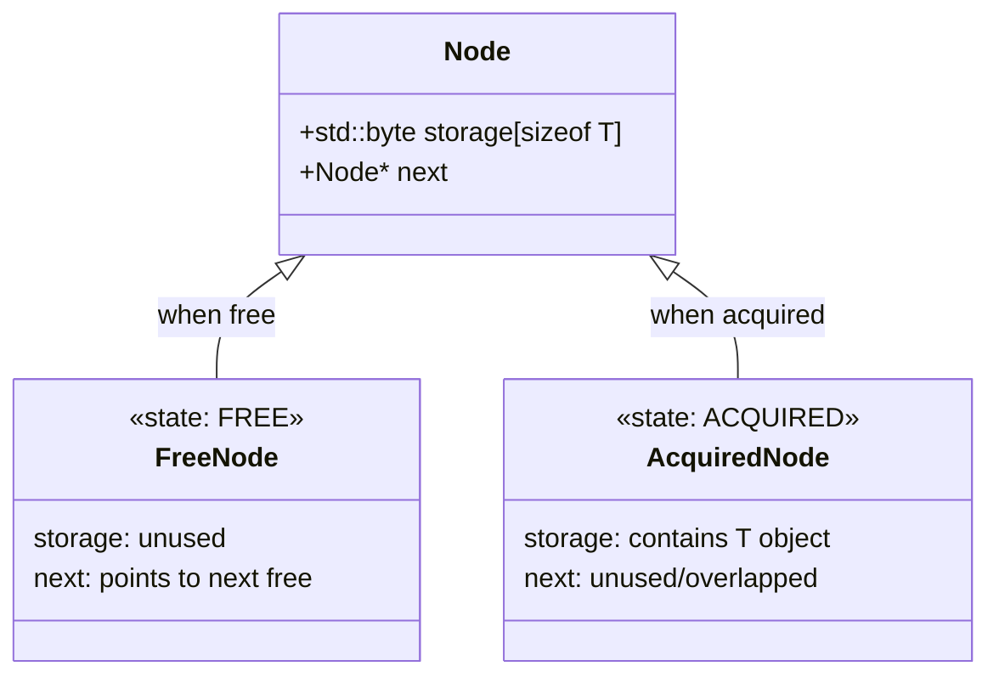
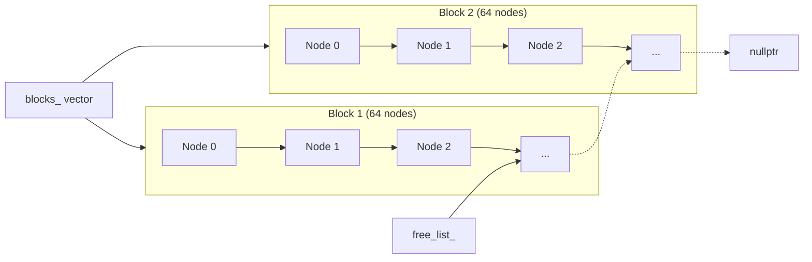
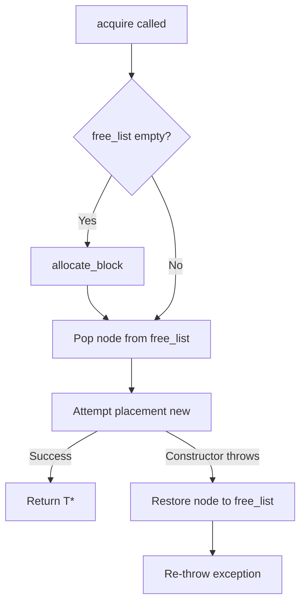

# ObjectPool User Manual

## What is ObjectPool?

### The Problem: Allocation in Hot Paths

Consider a network server processing thousands of requests per second:

```cpp
void handle_requests(std::span<Request> requests)
{
    for (const auto& req : requests)
    {
        auto* handler = new RequestHandler(req);  // Heap allocation
        handler->process();
        delete handler;                            // Heap deallocation
    }
}
```

This pattern has severe performance implications:

1. **Heap contention:** In multi-threaded environments, heap allocations typically acquire a global mutex. Four threads allocating simultaneously serialize on this lock.

2. **Fragmentation:** Thousands of small allocations interleaved with deallocations fragment the heap. Over hours or days, this can lead to allocation failures despite adequate free memory.

3. **Cache destruction:** Each `new` potentially returns memory from anywhere in the address space. The CPU's prefetcher, which anticipates sequential access patterns, provides no benefit.

4. **Destructor not called on exception:** If `process()` throws, the handler leaks.

### Why does ObjectPool exist?

The C++ standard allocator model provides raw memory, not managed objects. `std::pmr::polymorphic_allocator` lets you customize *where* memory comes from, but you still must manually:
- Call placement `new` to construct objects
- Wrap construction in try-catch for exception safety
- Call destructors before returning memory

ObjectPool fills this gap by treating **object lifecycle as part of the allocation contract**. You call `acquire()`, you get a constructed object. You call `release()`, the destructor runs and memory is recycled. Exception safety is built in.

### When should I use ObjectPool?

**Use ObjectPool when:**
- You allocate/deallocate the same object type frequently in hot paths
- You need bounded memory growth (pre-allocate everything at startup)
- Exception safety matters and manual try-catch is error-prone
- You want RAII-based automatic cleanup

**Don't use ObjectPool when:**
- Objects are acquired once and held for the program's lifetime (use `std::make_unique`)
- You need polymorphic storage (different types in the same pool)
- Memory must be reclaimed after usage spikes (blocks are never deallocated)

### The Solution: Object Pooling

Object pooling pre-allocates a block of memory and recycles objects within it:

```cpp
fat_p::ObjectPool<RequestHandler> pool(256);  // Pre-allocate 256 slots

void handle_requests(std::span<Request> requests)
{
    for (const auto& req : requests)
    {
        RequestHandler* handler = pool.acquire(req);  // Reuse from pool
        handler->process();
        pool.release(handler);                         // Return to pool
    }
}
```

After the initial block allocation, `acquire()` and `release()` are O(1) pointer operations with no heap interaction.

### Where ObjectPool Fits in the C++ Ecosystem

| Approach | Lifecycle | Thread Safety | Dependencies |
|----------|-----------|---------------|--------------|
| `new`/`delete` | Manual | Thread-safe but slow | None |
| `std::pmr::polymorphic_allocator` | Manual (raw memory) | Configurable | C++17 |
| `boost::object_pool` | Manual | Single-threaded | Boost headers |
| **fat_p::ObjectPool** | Managed (RAII option) | Policy-based | None (STL only) |

ObjectPool provides:
- Constructor/destructor management (not just raw memory)
- Transactional acquisition (exception-safe by design)
- Optional RAII wrapper for automatic release
- Policy-based thread safety
- Debug-mode leak detection

---

## Core Architecture

### Free-List Design

ObjectPool uses a singly-linked free list embedded in the storage nodes themselves:

```cpp
struct Node
{
    alignas(T) std::byte storage[sizeof(T)];  // Space for one T
    Node* next = nullptr;                      // Free list link
};
```

When a node is free, `next` points to the next free node. When acquired, `storage` holds a constructed T object and `next` is unused (the T object may overlap it).

#### Node Memory Layout



**Why this layout?**

The `storage` field is first (offset 0), enabling a zero-overhead cast between `T*` and `Node*`:

```cpp
// In release():
Node* node = reinterpret_cast<Node*>(obj);  // Valid because storage is at offset 0
```

This layout is verified at compile time:

```cpp
static_assert(offsetof(Node, storage) == 0,
              "Node layout assumption violated: storage must be at offset 0");
```

### Block-Based Growth

Rather than allocating individual nodes, ObjectPool allocates them in blocks:



```cpp
void allocate_block()
{
    auto block = std::make_unique<Node[]>(block_size_);  // 64 nodes at once

    // Link all nodes into free list
    for (size_t i = 0; i < block_size_; ++i)
    {
        Node* node = &block[i];
        node->next = free_list_;
        free_list_ = node;
    }

    blocks_.push_back(std::move(block));  // Keep block alive
}
```

**Benefits:**
- Single allocation for many objects
- Contiguous memory improves cache locality
- Block ownership via `unique_ptr` ensures cleanup

### Exception Safety

ObjectPool provides **transactional exception safety** for `acquire()`:



```cpp
template <typename... Args>
T* acquire(Args&&... args)
{
    if (!free_list_)
    {
        allocate_block();  // May throw std::bad_alloc
    }

    Node* node = free_list_;
    free_list_ = node->next;

    try
    {
        T* obj = new (node->storage) T(std::forward<Args>(args)...);
        return obj;
    }
    catch (...)
    {
        // Constructor threw - restore node to free list
        node->next = free_list_;
        free_list_ = node;
        throw;  // Re-throw after cleanup
    }
}
```

If T's constructor throws, the pool state is restored before the exception propagates. No memory is leaked, no invariants are violated.

### Synchronization Policy

Thread safety is controlled by a template parameter:

```cpp
template <typename T, typename SyncPolicy = SingleThreadedPolicy>
class ObjectPool;
```

- `SingleThreadedPolicy`: Zero overhead—no locking
- `MutexSynchronizationPolicy`: Mutex-based thread safety

The policy is resolved at compile time with no virtual dispatch. Single-threaded code compiles to raw pointer operations; thread-safe code includes mutex acquisition but uses the identical interface.

```cpp
// Single-threaded (zero synchronization overhead)
fat_p::ObjectPool<Particle> pool(1024);

// Thread-safe (mutex-protected)
fat_p::ObjectPool<Task, fat_p::MutexSynchronizationPolicy> pool(256);

// Using type alias
fat_p::ThreadSafeObjectPool<Task> pool(256);
```

---

## Getting Started

### Prerequisites

- C++17 or later
- Standard library only (no external dependencies)
- fat_p headers: `ObjectPool.h`, `ConcurrencyPolicies.h`, `FatPTypeTraits.h`

### First Program

```cpp
#include <iostream>
#include "ObjectPool.h"

struct Message
{
    int id;
    std::string content;

    Message(int i, std::string c)
        : id(i)
        , content(std::move(c))
    {
        std::cout << "Message " << id << " constructed\n";
    }

    ~Message()
    {
        std::cout << "Message " << id << " destroyed\n";
    }
};

int main()
{
    // Create pool with 4 objects per block
    fat_p::ObjectPool<Message> pool(4);

    // Acquire an object (constructor called)
    Message* msg = pool.acquire(1, "Hello, Pool!");
    std::cout << "Content: " << msg->content << "\n";

    // Release back to pool (destructor called)
    pool.release(msg);

    // Acquire again - reuses the same memory
    Message* msg2 = pool.acquire(2, "Reused memory");
    std::cout << "Same address: " << (msg == msg2 ? "yes" : "no") << "\n";

    pool.release(msg2);

    return 0;
}
```

**Output:**
```
Message 1 constructed
Content: Hello, Pool!
Message 1 destroyed
Message 2 constructed
Same address: yes
Message 2 destroyed
```

---

## Migration Guide

### From new/delete

**Before:**
```cpp
void process_batch(const std::vector<Task>& tasks)
{
    for (const auto& task : tasks)
    {
        Worker* w = new Worker(task.config());
        try
        {
            w->execute();
            delete w;
        }
        catch (...)
        {
            delete w;  // Must remember cleanup in exception path
            throw;
        }
    }
}
```

**After (Step 1 - Direct replacement):**
```cpp
fat_p::ObjectPool<Worker> worker_pool(64);

void process_batch(const std::vector<Task>& tasks)
{
    for (const auto& task : tasks)
    {
        Worker* w = worker_pool.acquire(task.config());
        try
        {
            w->execute();
            worker_pool.release(w);
        }
        catch (...)
        {
            worker_pool.release(w);
            throw;
        }
    }
}
```

**After (Step 2 - RAII for exception safety):**
```cpp
fat_p::ObjectPool<Worker> worker_pool(64);

void process_batch(const std::vector<Task>& tasks)
{
    for (const auto& task : tasks)
    {
        auto w = fat_p::make_pooled(worker_pool, task.config());
        w->execute();
        // Automatic release on scope exit, even if execute() throws
    }
}
```

### From boost::object_pool

**Before (Boost):**
```cpp
#include <boost/pool/object_pool.hpp>

boost::object_pool<Connection> pool;

Connection* conn = pool.construct("host", 8080);
// ... use conn ...
pool.destroy(conn);
```

**After (fat_p):**
```cpp
#include "ObjectPool.h"

fat_p::ObjectPool<Connection> pool(64);

Connection* conn = pool.acquire("host", 8080);
// ... use conn ...
pool.release(conn);
```

**Key differences:**
- fat_p requires explicit block size (Boost grows one object at a time)
- fat_p provides thread-safe variant via template parameter
- fat_p offers `try_acquire()` for non-allocating paths
- fat_p includes debug-mode leak detection

### From std::pmr

**Before (pmr):**
```cpp
#include <memory_resource>

std::pmr::monotonic_buffer_resource pool_resource;
std::pmr::polymorphic_allocator<Widget> alloc(&pool_resource);

Widget* w = alloc.allocate(1);
try
{
    std::construct_at(w, args...);
}
catch (...)
{
    alloc.deallocate(w, 1);
    throw;
}
// ... use w ...
std::destroy_at(w);
alloc.deallocate(w, 1);
```

**After (fat_p):**
```cpp
#include "ObjectPool.h"

fat_p::ObjectPool<Widget> pool(64);

Widget* w = pool.acquire(args...);  // Construction + exception safety built in
// ... use w ...
pool.release(w);  // Destruction + deallocation in one call
```

**Key differences:**
- fat_p combines allocation + construction in single call
- Exception safety is automatic, not manual
- No allocator threading through container types

---

## Core Operations

### acquire()

Acquires an object from the pool, constructing it with the provided arguments.

```cpp
template <typename... Args>
[[nodiscard]] T* acquire(Args&&... args);
```

**Behavior:**
- Returns a pointer to a newly constructed T
- If pool is empty, allocates a new block
- Never returns nullptr
- Arguments are forwarded to T's constructor

**Exception safety:**
- If block allocation fails: throws `std::bad_alloc`
- If T's constructor throws: node is restored to free list, exception re-thrown

**Example:**
```cpp
fat_p::ObjectPool<std::string> pool(16);

std::string* s1 = pool.acquire();                    // Default construction
std::string* s2 = pool.acquire("Hello");             // From const char*
std::string* s3 = pool.acquire(10, 'x');             // 10 copies of 'x'
std::string* s4 = pool.acquire(s2->begin(), s2->end());  // From iterators

pool.release(s1);
pool.release(s2);
pool.release(s3);
pool.release(s4);
```

### release()

Returns an object to the pool, calling its destructor.

```cpp
void release(T* obj);
```

**Behavior:**
- Calls `obj->~T()`
- Returns node to free list
- No-op if `obj` is nullptr

**Debug mode checks:**
- Asserts `obj` belongs to this pool
- Asserts `obj` hasn't been double-released

**Example:**
```cpp
fat_p::ObjectPool<Resource> pool(16);

Resource* r = pool.acquire("connection_string");
r->use();
pool.release(r);  // Destructor called, memory recycled

pool.release(nullptr);  // No-op (does not crash)
```

**Warning:** Releasing an object not from this pool, or releasing the same object twice, is undefined behavior (assertion failure in debug builds).

### try_acquire()

Attempts to acquire without allocating new blocks.

```cpp
template <typename... Args>
T* try_acquire(Args&&... args) noexcept(std::is_nothrow_constructible_v<T, Args...>);
```

**Behavior:**
- Returns pointer to constructed T if pool has free nodes
- Returns nullptr if pool is empty (does not allocate)
- Conditionally noexcept based on T's constructor

**Use case:** Real-time or bounded-memory systems where allocation is forbidden after initialization.

```cpp
fat_p::ObjectPool<AudioBuffer> pool(64);
pool.reserve_blocks(10);  // Pre-allocate 640 buffers

void audio_callback(float* output)
{
    // Cannot allocate here - would cause audio glitch
    AudioBuffer* buf = pool.try_acquire();
    if (!buf)
    {
        output_silence(output);
        return;
    }

    process_audio(buf, output);
    pool.release(buf);
}
```

---

## RAII Wrapper: PooledObject

Manual `acquire()`/`release()` pairs are error-prone, especially with exceptions:

```cpp
void risky_function(ObjectPool<Handler>& pool)
{
    Handler* h = pool.acquire();
    process(h);      // What if this throws?
    pool.release(h); // Never reached on exception - leak!
}
```

`PooledObject` provides automatic release:

```cpp
void exception_safe_function(ObjectPool<Handler>& pool)
{
    auto h = fat_p::make_pooled(pool);
    process(h.get());
    // ~PooledObject() releases automatically, even on exception
}
```

### Creating PooledObjects

```cpp
fat_p::ObjectPool<Connection> pool(32);

// Via factory function (recommended)
auto conn1 = fat_p::make_pooled(pool, "host", 8080);

// Direct construction
fat_p::PooledObject<Connection> conn2(&pool, pool.acquire("host", 8080));
```

### Smart Pointer Interface

PooledObject provides familiar smart-pointer operations:

```cpp
auto obj = fat_p::make_pooled(pool, args...);

obj->method();          // operator->
(*obj).method();        // operator*
T* raw = obj.get();     // Raw pointer access
if (obj) { ... }        // Boolean conversion
```

### Move Semantics

PooledObject is move-only (not copyable):

```cpp
auto obj1 = fat_p::make_pooled(pool, 42);

// Move construction
auto obj2 = std::move(obj1);
assert(obj1.get() == nullptr);  // obj1 is now empty

// Move assignment
auto obj3 = fat_p::make_pooled(pool, 100);
obj3 = std::move(obj2);  // obj3's old object released first
```

### Manual Control

```cpp
auto obj = fat_p::make_pooled(pool, 42);

// Release early (without waiting for destructor)
obj.reset();
assert(!obj);  // Now empty

// Take ownership (disable automatic release)
auto obj2 = fat_p::make_pooled(pool, 42);
T* raw = obj2.release();  // obj2 is now empty
// Caller must call pool.release(raw) manually
```

### Accessing the Pool

```cpp
auto obj = fat_p::make_pooled(pool, 42);
ObjectPool<T>* p = obj.get_pool();  // Returns owning pool
```

---

## Specialized Acquisition

For trivial types (POD-like structs), ObjectPool offers optimized acquisition methods.

### acquire_uninitialized()

Returns raw storage without construction. Available only for trivially destructible types.

```cpp
struct Point { float x, y, z; };  // Trivially destructible

fat_p::ObjectPool<Point> pool(256);

Point* p = pool.acquire_uninitialized();
// p->x, p->y, p->z contain garbage
p->x = 1.0f;
p->y = 2.0f;
p->z = 3.0f;

pool.release(p);
```

**When to use:** When you'll immediately overwrite all fields anyway, skipping construction saves time.

**SFINAE protection:** Attempting to call this on non-trivially-destructible types is a compile error.

### acquire_zeroed()

Returns zero-initialized storage. Available only for trivially constructible types.

```cpp
struct Counters { int a, b, c, d; };  // Trivially constructible

fat_p::ObjectPool<Counters> pool(64);

Counters* c = pool.acquire_zeroed();
assert(c->a == 0 && c->b == 0 && c->c == 0 && c->d == 0);

pool.release(c);
```

**Implementation:** Uses `memset` for potentially more efficient initialization than a constructor loop.

---

## Capacity Management

### reserve_blocks()

Pre-allocates blocks to avoid runtime growth.

```cpp
void reserve_blocks(size_t n);
```

```cpp
fat_p::ObjectPool<Particle> pool(1024);  // 1 block of 1024

pool.reserve_blocks(10);  // Ensure at least 10 blocks exist
// Now have 10,240 particles pre-allocated

for (int i = 0; i < 10000; ++i)
{
    Particle* p = pool.acquire();  // Guaranteed no allocation
    // ...
    pool.release(p);
}
```

### Capacity Queries

```cpp
size_t block_size() const;   // Objects per block (constructor arg)
size_t num_blocks() const;   // Current number of blocks
size_t capacity() const;     // Total slots: num_blocks() * block_size()
size_t available() const;    // Free slots (O(n) - traverses free list)
size_t active_count() const; // Acquired objects (debug mode only, 0 in release)
```

### Statistics

For detailed monitoring:

```cpp
struct Stats
{
    size_t total_capacity;    // Total objects pool can hold
    size_t available;         // Objects in free list
    size_t acquired;          // Objects currently in use
    size_t num_blocks;        // Number of allocated blocks
    size_t block_size;        // Objects per block
#ifndef NDEBUG
    size_t lifetime_acquires; // Total acquire() calls (debug only)
    size_t lifetime_releases; // Total release() calls (debug only)
#endif
};

Stats stats() const;
```

```cpp
auto s = pool.stats();
std::cout << "Pool utilization: " << s.acquired << "/" << s.total_capacity
          << " (" << (100.0 * s.acquired / s.total_capacity) << "%)\n";
```

---

## Thread Safety

### Single-Threaded (Default)

```cpp
fat_p::ObjectPool<Task> pool(64);  // No synchronization overhead
// or
fat_p::SimpleObjectPool<Task> pool(64);
```

Use when:
- Pool is only accessed from one thread
- External synchronization is already in place

### Thread-Safe

```cpp
fat_p::ObjectPool<Task, fat_p::MutexSynchronizationPolicy> pool(64);
// or
fat_p::ThreadSafeObjectPool<Task> pool(64);
```

All operations (acquire, release, stats, etc.) are protected by a mutex.

```cpp
fat_p::ThreadSafeObjectPool<WorkItem> pool(256);

// Concurrent access from multiple threads
std::vector<std::thread> workers;
for (int i = 0; i < 4; ++i)
{
    workers.emplace_back([&pool]()
    {
        for (int j = 0; j < 1000; ++j)
        {
            WorkItem* item = pool.acquire(j);
            item->process();
            pool.release(item);
        }
    });
}

for (auto& t : workers)
{
    t.join();
}
```

---

## Debug Mode Features

When compiled without `NDEBUG` (debug builds), ObjectPool provides additional safety checks.

### Foreign Pointer Detection

```cpp
fat_p::ObjectPool<int> pool1(16);
fat_p::ObjectPool<int> pool2(16);

int* obj = pool1.acquire(42);
pool2.release(obj);  // ASSERTION FAILURE: pointer not from this pool
```

### Double Release Detection

```cpp
int* obj = pool.acquire(42);
pool.release(obj);
pool.release(obj);  // ASSERTION FAILURE: double release detected
```

### Leak Detection

```cpp
{
    fat_p::ObjectPool<Resource> pool(16);
    Resource* r = pool.acquire();
    // Forgot to release...
}  // ASSERTION FAILURE: ObjectPool destroyed with unreleased objects
```

### [[nodiscard]] Warning

The `acquire()` method is marked `[[nodiscard]]`. Ignoring the return value generates a compiler warning:

```cpp
pool.acquire(42);  // Warning: ignoring return value of [[nodiscard]] function
```

---

## Performance Considerations

### Block Size Selection

Block size affects memory efficiency and cache behavior:

| Block Size | Trade-off |
|------------|-----------|
| Small (8-32) | Less wasted memory if pool underutilized; more block allocations during growth |
| Medium (64-256) | Good balance for most workloads |
| Large (1024+) | Fewer allocations; better cache locality; more memory if underutilized |

**Rule of thumb:** Use expected peak usage divided by 4-8 as block size.

### Pre-allocation

For latency-sensitive code, pre-allocate everything:

```cpp
fat_p::ObjectPool<Frame> pool(256);
pool.reserve_blocks(100);  // 25,600 frames ready

// Real-time loop - no allocations possible
while (running)
{
    Frame* f = pool.try_acquire();  // O(1), no allocation
    if (f) process_and_release(pool, f);
}
```

### Memory Is Never Reclaimed

Once a block is allocated, it remains until the pool is destroyed. Design implications:

- Peak memory usage is retained for pool lifetime
- Call `reserve_blocks()` based on expected peak, not average
- Consider pool-per-thread to avoid mutex contention

### Where ObjectPool Loses

ObjectPool is not universally superior. These scenarios favor alternatives:

| Scenario | Better Alternative | Why |
|----------|-------------------|-----|
| Objects held for program lifetime | `std::make_unique<T>()` | No recycling benefit; pool overhead is pure waste |
| Polymorphic storage needed | Separate pools per type | ObjectPool is monomorphic |
| Memory must shrink after spikes | Custom allocator with shrink | Blocks are never deallocated |
| Objects accessed infrequently | Standard allocation | Cache locality benefit is wasted |
| Single allocation, single use | `new`/`delete` | Pool infrastructure unnecessary |

---

## Common Patterns

### Pool as Member

```cpp
class Server
{
    fat_p::ObjectPool<Connection> connection_pool_{128};

public:
    void accept_connection()
    {
        Connection* conn = connection_pool_.acquire();
        // ...
    }
};
```

### Pool with RAII Everywhere

```cpp
class ConnectionHandle
{
    fat_p::PooledObject<Connection> conn_;

public:
    ConnectionHandle(fat_p::ObjectPool<Connection>& pool, const std::string& host)
        : conn_(fat_p::make_pooled(pool, host))
    {
    }

    Connection& operator*() { return *conn_; }
};
```

### Multiple Pools by Size

```cpp
fat_p::ObjectPool<SmallBuffer<64>> small_pool(256);
fat_p::ObjectPool<SmallBuffer<256>> medium_pool(128);
fat_p::ObjectPool<SmallBuffer<1024>> large_pool(32);

template <size_t N>
SmallBuffer<N>* get_buffer();

template <>
SmallBuffer<64>* get_buffer<64>() { return small_pool.acquire(); }
// etc.
```

---

## Troubleshooting

### "ObjectPool destroyed with unreleased objects"

**Symptom:** Assertion failure in destructor (debug builds only).

**Cause:** Not all acquired objects were released before pool destruction.

**Why this happens:** Every `acquire()` increments an internal counter; every `release()` decrements it. When the pool destructor runs, if the counter is non-zero, objects were leaked.

**Solutions:**
1. Use `PooledObject` for automatic release
2. Ensure all code paths (including exceptions) release objects
3. Check `stats().acquired` before destruction

### Pool grows unexpectedly

**Symptom:** More blocks than expected.

**Causes:**
- Objects held too long before release
- Peak concurrent usage higher than expected
- Objects leaked (use debug mode to detect)

**Solutions:**
- Use `stats()` to monitor utilization
- Pre-allocate with `reserve_blocks()` based on measured peak
- Ensure timely release of objects

### Thread-safety issues

**Symptom:** Crashes, corruption, or assertion failures in multi-threaded code.

**Cause:** Using `SingleThreadedPolicy` (default) with multiple threads.

**Why this happens:** The default policy performs no synchronization. Concurrent `acquire()`/`release()` calls corrupt the free list.

**Solution:** Use `ThreadSafeObjectPool<T>` or `ObjectPool<T, MutexSynchronizationPolicy>`.

### Compiler error on acquire_uninitialized()

**Symptom:** SFINAE error—method not available.

**Cause:** T is not trivially destructible.

**Why this restriction:** Uninitialized storage with a non-trivial destructor would cause undefined behavior when `release()` calls the destructor on uninitialized memory.

**Solution:** Use regular `acquire()` for non-trivial types.

---

## Summary

### Key Features

- O(1) acquire/release via free-list
- Block-based growth for memory efficiency
- Transactional acquire (exception-safe by design)
- RAII wrapper with `PooledObject`
- Non-allocating `try_acquire()` for HPC
- Debug-mode leak and misuse detection
- Policy-based thread safety with zero virtual dispatch

### Quick Reference

```cpp
#include "ObjectPool.h"

// Create pool
fat_p::ObjectPool<T> pool(block_size);
fat_p::ThreadSafeObjectPool<T> pool(block_size);

// Acquire/release
T* obj = pool.acquire(args...);
pool.release(obj);

// RAII
auto obj = fat_p::make_pooled(pool, args...);

// Pre-allocation
pool.reserve_blocks(n);

// Non-allocating
T* obj = pool.try_acquire(args...);  // nullptr if empty

// Trivial types
T* obj = pool.acquire_uninitialized();
T* obj = pool.acquire_zeroed();

// Monitoring
auto s = pool.stats();
```

### Related Components

- `ConcurrencyPolicies.h` — Synchronization policies
- `FatPTypeTraits.h` — Type trait `is_object_pool<T>`
- `Signal.h` — Uses pooled storage for slots
- `ThreadPool.h` — Task object pooling

---

*ObjectPool.h — Fat-P Library v3.2*
