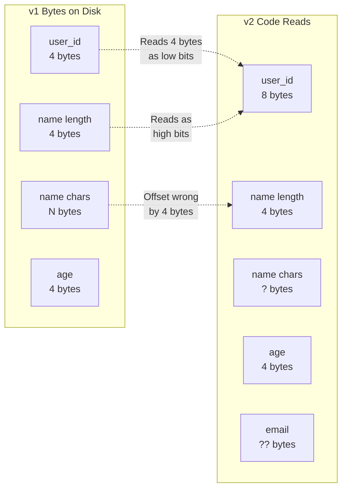
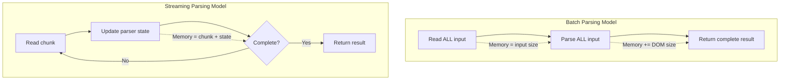
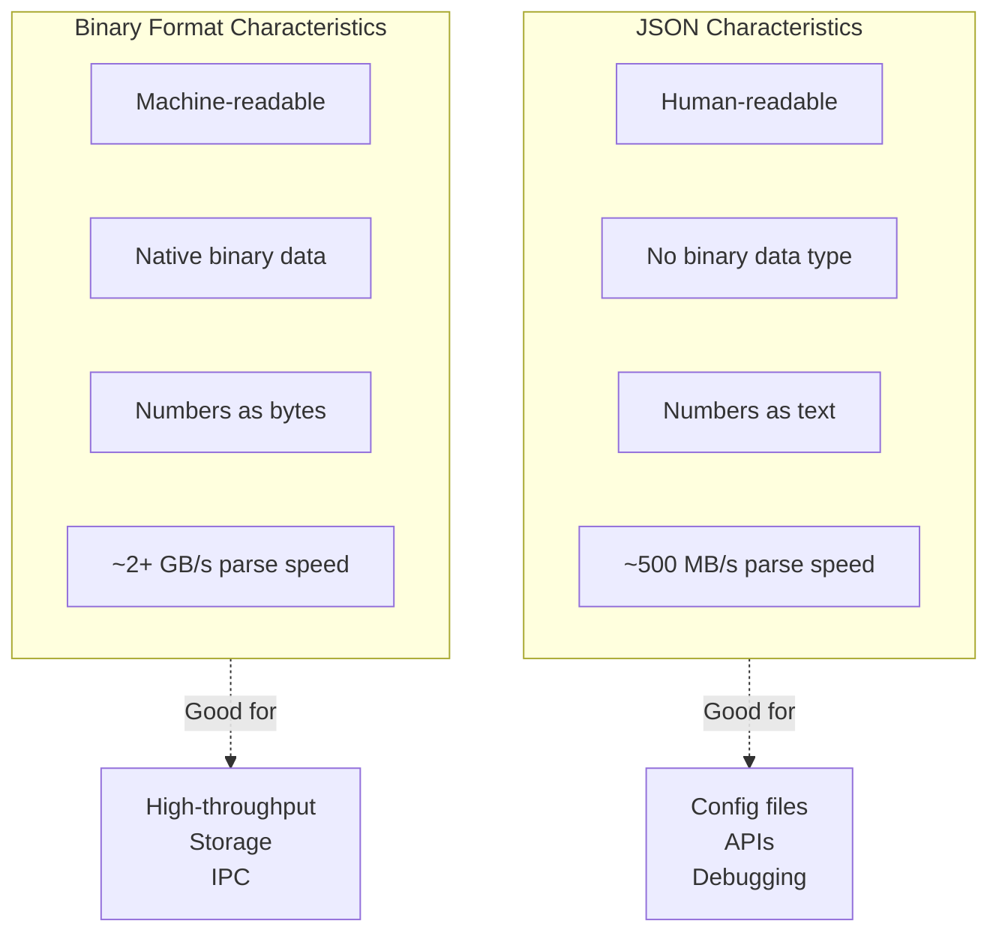
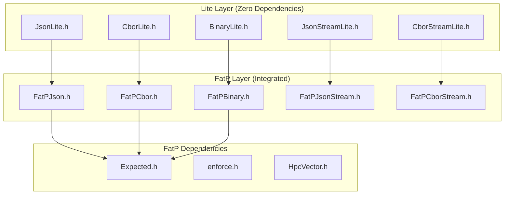
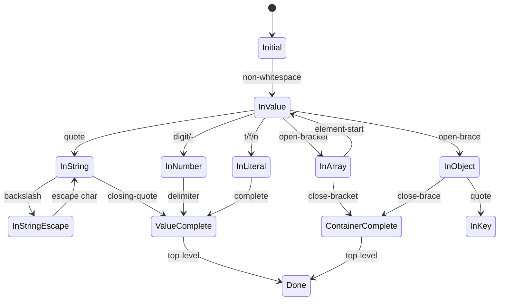
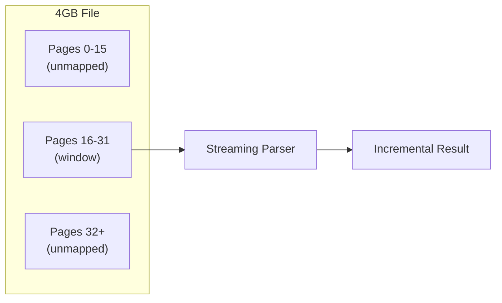
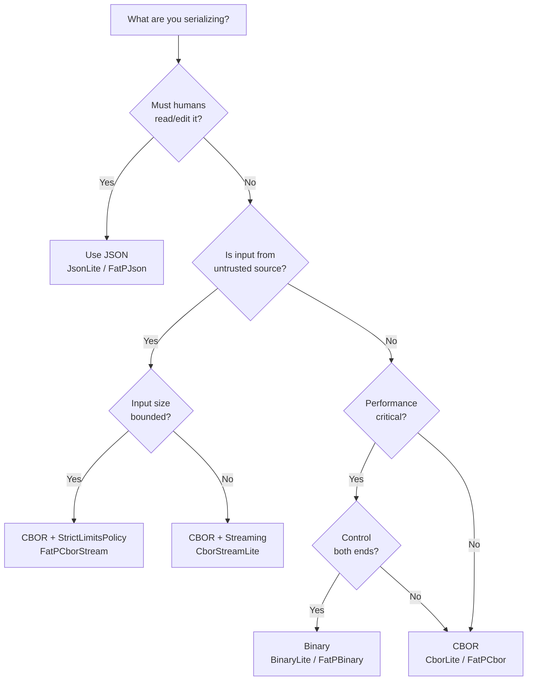

# **The Data Boundary**

### *A Companion Guide to FAT-P's Serialization Components*

---

**Scope:** This guide covers FAT-P's serialization utilities: JSON parsing and generation (JsonLite, FatPJson, JsonStreamLite, FatPJsonStream), CBOR binary encoding (CborLite, FatPCbor, CborStreamLite, FatPCborStream), raw binary serialization (BinaryLite, FatPBinary), and file access primitives (MemoryMappedFile, SlidingFileWindow). Network protocols, compression, encryption, and the DiagnosticLogger (which uses these components) are documented separately.

---

# **Table of Contents**

**[Introduction: The Boundaries Where Data Dies](#introduction-the-boundaries-where-data-dies)**

## Part I — The Problems

1. [The Schema Drift Problem](#chapter-1--the-schema-drift-problem)
2. [The Allocation Tax](#chapter-2--the-allocation-tax)
3. [The Streaming Gap](#chapter-3--the-streaming-gap)
4. [The Format Fragmentation](#chapter-4--the-format-fragmentation)
5. [The Silent Corruption](#chapter-5--the-silent-corruption)

## Part II — The Solutions

6. [Library Architecture](#chapter-6--library-architecture)
7. [JsonLite and FatPJson](#chapter-7--jsonlite-and-fatpjson)
8. [CborLite and FatPCbor](#chapter-8--cborlite-and-fatpcbor)
9. [BinaryLite and FatPBinary](#chapter-9--binarylite-and-fatpbinary)
10. [Streaming Parsers](#chapter-10--streaming-parsers)
11. [File Access Primitives](#chapter-11--file-access-primitives)

## Part III — Putting It Together

12. [Case Study: Configuration Hot Path](#chapter-12--case-study-configuration-hot-path)
13. [Case Study: Network Protocol Parsing](#chapter-13--case-study-network-protocol-parsing)
14. [Case Study: Large File Processing](#chapter-14--case-study-large-file-processing)
15. [Format Selection Guide](#chapter-15--format-selection-guide)
16. [Error Handling Patterns](#chapter-16--error-handling-patterns)

## Part IV — Foundations and Futures

- [Appendix A — A Brief History of Serialization](#appendix-a--a-brief-history-of-serialization)
- [Appendix B — The Anatomy of a JSON Parser](#appendix-b--the-anatomy-of-a-json-parser)
- [Appendix C — Why CBOR Exists](#appendix-c--why-cbor-exists)
- [Appendix D — The Lite/FatP Architecture](#appendix-d--the-litefatp-architecture)
- [Appendix E — When FAT-P Loses](#appendix-e--when-fat-p-loses)
- [Appendix F — Further Reading](#appendix-f--further-reading)
- [Appendix G — Recent Fixes and Improvements](#appendix-g--recent-fixes-and-improvements)

---

# **Introduction: The Boundaries Where Data Dies**

Every interesting program has boundaries. Data crosses from disk to memory, from one process to another, from this machine to that one, from yesterday's code to today's. At each crossing, something can go wrong.

You've got a working system. Clients and servers exchange JSON messages. Configuration files load at startup. Tensors serialize to disk between training runs. The tests pass. Then one day, silently, the data starts lying to you.

A field changes type—a `uint32_t` becomes `uint64_t` because someone needed larger values. The old serialized files still contain 4-byte integers. The deserializer reads 4 bytes where it expects 8, interprets the next field's data as the high bits of this one, and produces a number that looks plausible. No error. No exception. The system continues with corrupted state. You discover the problem three weeks later when an audit fails and you spend four days tracing the corruption back to a deployment that happened before anyone noticed.

Or this: your service handles 10,000 requests per second. Each request parses a 2KB JSON blob. The parser you're using—a popular, well-tested library—allocates memory for every string, every array, every nested object. That's 50,000 heap allocations per second *just for parsing*. The allocator fragments. Latency spikes to 50ms. Users complain. You profile and discover that 30% of your CPU time is spent not in your business logic, but in memory management triggered by your JSON parser.

Or this: you need to process a 4GB log file. You try to load it into memory for parsing. The process crashes with an out-of-memory error on your 8GB machine. You try a streaming approach, but your JSON library requires the entire input before it produces any output. You're stuck choosing between buying more RAM and rewriting your pipeline from scratch.

These scenarios share a common thread: **data crosses a boundary**, and the crossing fails. The boundary might be between processes (serialization), between versions (schema evolution), between memory and disk (file I/O), or between systems (network protocols). Every boundary is an opportunity for corruption, performance collapse, or resource exhaustion.

The C++ standard library provides nothing for these problems. `std::fstream` reads files but doesn't understand formats. `std::string` holds bytes but doesn't parse them. The STL's philosophy is to provide building blocks, not solutions—which means every project re-solves the same serialization problems, usually badly, usually in ways that work until they catastrophically don't.

Third-party libraries exist, of course. nlohmann/json is beloved for its clean API. RapidJSON offers high throughput. Protocol Buffers handle schema evolution. But each makes trade-offs that may not match your constraints. nlohmann/json prioritizes ergonomics over allocation control—fine for scripts, problematic for hot paths. RapidJSON offers high throughput but requires complexity. Protocol Buffers require code generation and external tooling.

The FAT-P serialization components exist for engineers who've hit these walls and need libraries that expose mechanisms rather than hiding them. When you need to parse JSON without heap allocation in the hot path, validate CBOR from untrusted sources with strict resource limits, process files larger than available memory, or evolve binary formats without breaking old data—these components provide the control you need.

This guide explains the problems in depth and shows how FAT-P's components address them.

---

# **PART I — THE PROBLEMS**

Data serialization seems straightforward: convert structures to bytes, bytes back to structures. The complexity hides in edge cases that surface only in production—version mismatches, resource exhaustion, malicious input, performance cliffs. This part exposes five failure modes that standard approaches ignore, not because the engineers who built those approaches were careless, but because the trade-offs they made optimize for different constraints than yours.

---

# **CHAPTER 1 — The Schema Drift Problem**

Here's a scenario that has burned every engineer who works with persistent data at least once.

You define a struct to represent user records. You serialize instances to disk or send them over the network. The system works. Months pass. Requirements change. Someone—maybe you, maybe a colleague—modifies the struct. A field changes type. A field gets added. A field gets removed.

The code that writes new records uses the new struct definition. The code that reads old records also uses the new struct definition. But the old records on disk were written with the *old* definition. The bytes don't match the expectations.

```cpp
// THE TRAP: Schema drift without detection

// Version 1, deployed January
struct UserRecord {
    uint32_t user_id;
    std::string name;
    uint32_t age;
};

// Version 2, deployed March
struct UserRecord {
    uint64_t user_id;    // Changed: needed larger IDs
    std::string name;
    uint32_t age;
    std::string email;   // Added: new requirement
};
```

What happens when March's code reads January's data? The deserializer expects 8 bytes for `user_id` and reads 8 bytes. But the file contains only 4 bytes for `user_id`, followed by the string length for `name`. Those 4 bytes of string metadata get interpreted as the high 32 bits of `user_id`. The value looks valid—it's an integer, after all—but it's garbage.

The deserializer continues. It's now 4 bytes off from where it should be. Every subsequent field read lands in the wrong place. The `name` string starts reading from the middle of the actual name data, producing truncated garbage. The `age` field reads bytes that were part of the name. The `email` field doesn't exist in the old data, but the deserializer doesn't know that—it reads whatever bytes come next and interprets them as a string length, potentially reading megabytes of garbage or crashing with an out-of-bounds access.



The insidious part: **no error occurs**. The bytes parse. The types match. The values are within valid ranges for their types. Unit tests pass because they use current-version data. Integration tests pass because they don't span months of schema changes. The corruption surfaces only when a human notices that user 12345 has user_id 2^40 and their email address is binary garbage.

This is the schema drift problem. It's not a bug in any single component—it's a failure mode that emerges from the interaction between serialization (which preserves bytes) and code evolution (which changes interpretations). Every system that persists data or communicates across version boundaries faces this problem.

**The cost is measured in debugging hours and data corruption incidents.** When you discover the problem, you face ugly choices: write migration scripts that understand both old and new formats, restore from backups and lose intervening data, or accept that some historical data is now garbage.

**What FAT-P provides:** The `FatPBinary` component embeds version numbers in serialized streams. On deserialization, it compares the stream's version against the expected version. Mismatch produces an explicit error via `Expected<T, Error>` rather than silent corruption. You can then handle the mismatch explicitly—migrate the data, reject it, or route it to version-specific handling code.

The `FatPJson` and `FatPCbor` components take a different approach: they preserve field names in the serialized format. When you deserialize, you're matching named fields, not positional bytes. A missing field can have a default value. An extra field can be ignored. This makes schema evolution possible without version numbers, at the cost of larger serialized size.

*Schema evolution is a distributed systems problem disguised as a serialization problem. The difficulty isn't technical—it's organizational. Different machines run different code versions. Old data outlives the code that wrote it. Appendix A traces how the industry has approached this problem over decades, from ASN.1 to Protocol Buffers to the solutions FAT-P provides.*

---

# **CHAPTER 2 — The Allocation Tax**

Every heap allocation has a cost. The allocator must find a suitable free block, update its bookkeeping structures, and return a pointer. When you free memory, the allocator must update bookkeeping again, possibly coalescing adjacent free blocks. On modern systems with multiple threads, allocations often require synchronization—a thread acquiring a lock or performing atomic operations on shared allocator state.

For most code, this cost is negligible. You allocate a few objects, use them, free them. The nanoseconds spent in the allocator vanish into measurement noise.

But serialization is different. Parsing a JSON document means constructing a tree of values. Each string might be a separate allocation. Each array needs storage for its elements. Each object needs storage for its key-value pairs. A 2KB JSON document might trigger 20 allocations. A 200KB document might trigger 2,000.

```cpp
// THE TRAP: Allocation-heavy parsing in hot path

void handle_request(const std::string& json_body)
{
    // A typical DOM-style JSON parser allocates:
    // - The root object node
    // - Each string key (copied from input)
    // - Each string value (copied from input)
    // - Each array's element storage
    // - Each nested object node
    // - Internal bookkeeping (string hash tables, etc.)
    
    auto doc = some_json_library::parse(json_body);
    
    std::string action = doc["action"];  // Another allocation (string copy)
    int priority = doc["priority"];
    
    process(action, priority);
}
```

Consider a service handling 10,000 requests per second, where each request includes a JSON payload. If parsing allocates 20 objects per request, that's 200,000 allocations per second—just for parsing. Add in allocations for your actual business logic, and you're stressing the allocator heavily.

The symptoms are subtle at first. Median latency looks fine. Then you check P99 and discover it's 10x higher than P50. The profiler shows time spent in `malloc` and `free`, but the call stacks are scattered across your codebase. Memory usage creeps up over time as fragmentation reduces the allocator's efficiency. Eventually, you hit a cliff: latency spikes unpredictably, GC pauses (if you're using a garbage-collected language for parts of your system) become noticeable, and your service starts missing SLOs.

The root cause is the **allocation tax**—the cumulative cost of many small allocations in a tight loop. This tax compounds: allocations fragment memory, fragmentation slows future allocations, slower allocations increase latency variance, variance compounds under load.


Most JSON libraries are designed for convenience, not allocation control. nlohmann/json, for instance, provides a beautiful API where `json j = json::parse(input)` gives you a fully-navigable document. But that beauty has a cost: every string is copied into a `std::string`, every array into a `std::vector`, every object into a `std::map`. The library optimizes for "it just works," not "it allocates minimally."

**What FAT-P provides:** JsonLite and CborLite are designed with allocation awareness. String values can reference the input buffer directly rather than copying (for read-only access). The DOM uses a contiguous memory layout where possible, reducing the number of allocations from O(nodes) toward O(1) for typical documents. The streaming parsers go further: they build the result incrementally, and you can provide your own buffer for the result storage.

The FatP variants integrate with `HpcVector`, FAT-P's high-performance vector type that provides explicit control over allocation strategy. You can parse into a pre-allocated buffer, reuse parser state across calls, and keep the hot path allocation-free.

*The allocation patterns of popular libraries reflect design decisions made for different constraints. nlohmann/json optimizes for ergonomics because most JSON usage isn't performance-critical. RapidJSON optimizes for speed but adds complexity. FAT-P optimizes for control—you decide where allocations happen. Part IV explains these trade-offs in detail.*

---

# **CHAPTER 3 — The Streaming Gap**

There's an assumption buried in most parsing libraries: the input fits in memory. You call `parse(input)` where `input` is a string or buffer containing the entire document. The parser reads from beginning to end, constructs a result, and returns it.

This assumption fails when files get large.

A 4GB log file on an 8GB machine seems like it should work—there's twice as much RAM as data. But parsing isn't free. The parser reads the input (4GB in memory), constructs a DOM tree (perhaps 2-6GB depending on the data and the parser's overhead), and might need working space for intermediate results. Suddenly you need 10GB to parse a 4GB file, and your process dies with an out-of-memory error.

```cpp
// THE TRAP: Loading unbounded input

JsonValue parse_log_file(const std::string& path)
{
    // Step 1: Read entire file into memory
    std::ifstream file(path);
    std::stringstream buffer;
    buffer << file.rdbuf();
    std::string content = buffer.str();  // 4GB string allocation
    
    // Step 2: Parse into DOM
    return json_parse(content);  // 4GB input + multi-GB DOM
    
    // OOM before you get here
}
```

Even when files fit in memory, loading them entirely has costs beyond memory usage. You can't start processing until the entire file is loaded and parsed—latency equals file size divided by disk bandwidth plus parse time. You can't reject malformed input early; a syntax error on the last line isn't detected until you've read and parsed gigabytes of valid data. And you can't handle data that arrives incrementally over a network connection; you must buffer everything before parsing begins.

The problem is fundamental to how most parsers work. A JSON parser that sees `{"name": "...` can't know if `name` is a complete key-value pair or the start of something longer. It can't produce partial results. It must wait for the closing `}` before it knows the object is complete. This all-or-nothing behavior is intrinsic to the batch parsing model.



Streaming parsers take a different approach. Instead of `parse(entire_input)`, they expose `feed(chunk)`. You provide data incrementally—a buffer at a time, a byte at a time if necessary. The parser maintains state between calls, updating its understanding of the document structure as data arrives. When the document is complete, you retrieve the result.

This model inverts the memory equation. Instead of memory proportional to input size, you need memory proportional to parse *depth*—the maximum nesting level of arrays and objects. A 4GB file of shallow JSON (low nesting) might parse with megabytes of state. The input bytes flow through without accumulating.

**What FAT-P provides:** `JsonStreamLite` and `CborStreamLite` are byte-at-a-time state machines. You can literally feed one byte at a time if your data arrives that slowly. The parser maintains state—current position in the grammar, stack of open containers, accumulated string buffers—and updates it with each byte. When a value completes, it's added to the result. When the document completes, you take the result and the parser can be reset for the next document.

Combined with `SlidingFileWindow`, which provides a memory-mapped sliding view over large files, you can process files of any size with bounded memory. The window advances through the file; the parser consumes bytes as they pass; the OS reclaims pages behind the window. Memory usage stays constant regardless of file size.

*Streaming parsers for JSON are more complex than for binary formats because JSON lacks length prefixes. When you see `"hello` in JSON, you don't know how long the string is until you find the closing quote. CBOR, by contrast, encodes lengths upfront: the bytes `65 68 65 6C 6C 6F` mean "5-byte text string: hello." Appendix B explores the state machine design that makes JSON streaming possible despite this challenge.*

---

# **CHAPTER 4 — The Format Fragmentation**

JSON won. For web APIs, configuration files, and data interchange, JSON is the default choice. It's human-readable, widely supported, and minimal enough that you can write a parser in an afternoon.

But JSON's victory came with trade-offs that matter in specific contexts.

JSON is text. Numbers are decimal strings: `42` takes two bytes, `3.141592653589793` takes eighteen bytes. A float that should be 4 bytes becomes 15+ bytes when rendered as decimal digits. Arrays of numbers—common in scientific computing—bloat dramatically.

JSON has no binary data type. If you need to embed a cryptographic signature or a compressed blob, you must encode it as Base64—33% size overhead plus encoding/decoding time.

JSON is ambiguous about numbers. The spec says numbers have arbitrary precision, but implementations use IEEE 754 doubles, which can't exactly represent integers beyond 2^53. Send `9007199254740993` over JSON, and the receiver might interpret it as `9007199254740992`.

JSON parsing is slow compared to binary formats. Every number must be converted from decimal string to binary representation. Every string must be scanned for escape sequences. The parser can't know the type of an upcoming value until it sees the first character. These constraints limit parsing throughput to roughly 500MB-1GB per second on modern hardware—high-throughput by human standards, slow compared to memory bandwidth.



For configuration files that humans edit, JSON's verbosity is a feature. For high-throughput data pipelines, it's a liability. For network protocols between systems you control, Base64-encoding binary data is wasteful. For log files that might be grepped, human-readability matters. For inter-process communication on the same machine, it doesn't.

The result is format fragmentation: teams choose different formats for different purposes, then struggle to integrate systems that speak different serialization languages. Or they choose one format everywhere and pay inappropriate costs—JSON for everything means bloated network traffic; binary for everything means undebuggable config files.

**What FAT-P provides:** Three format families with a consistent programming model.

**JSON** (JsonLite, FatPJson, JsonStreamLite, FatPJsonStream) for human-readable interchange. Use for configuration files, REST APIs, debug output, and any context where a human might need to read or edit the data.

**CBOR** (CborLite, FatPCbor, CborStreamLite, FatPCborStream) for compact self-describing binary. CBOR is semantically equivalent to JSON—the same data model of nulls, booleans, numbers, strings, arrays, and maps—but encoded in bytes rather than text. A number is stored as binary, not decimal string. Strings are length-prefixed, not quote-delimited. Parsing is 2-4x higher throughput than JSON, and typical data is 30-50% smaller. Use for storage, network protocols, and any context where humans don't need to read the raw bytes.

**Binary** (BinaryLite, FatPBinary) for maximum performance when you control both ends. No field names, no type tags, just bytes in struct order. Parsing is trivial—essentially memcpy plus bounds checking. Use for inter-process communication, memory-mapped files shared between processes, and contexts where every microsecond matters.

The three formats share the same struct serialization macros. Define your struct once, serialize to any format:

```cpp
struct Measurement {
    uint64_t timestamp;
    std::string sensor_id;
    std::vector<float> readings;
};
CPP_JSON_DEFINE_TYPE_NON_INTRUSIVE(Measurement, timestamp, sensor_id, readings)

// Same struct works with all three formats
Measurement m = {...};
std::string json = json_dump(m);                   // JSON text
std::vector<uint8_t> cbor = cbor_encode(m);        // CBOR bytes
std::vector<uint8_t> binary = binary_encode(m);   // Raw bytes
```

This lets you choose format per-context without redefining your data structures. Parse JSON from an external API, store as CBOR, export as binary for analysis tools—one struct definition, three wire formats.

*The history of serialization formats is a history of trade-offs. ASN.1 (1984) prioritized formal specification. XDR (1987) prioritized simplicity. XML (1998) prioritized human readability and extensibility. JSON (2001) prioritized simplicity and web compatibility. Protocol Buffers (2008) prioritized schema evolution and compactness. CBOR (2013) tried to combine JSON's data model with binary efficiency. Appendix C traces this history and explains why CBOR exists.*

---

# **CHAPTER 5 — The Silent Corruption**

Parsing validates syntax, not semantics. If the bytes form a valid JSON document, the parser succeeds. Whether the contents make sense for your application is a separate question—one that parsers don't answer.

This creates a gap between "parses successfully" and "is valid input." Attackers and bugs both exploit this gap.

Consider a configuration parser:

```cpp
// THE TRAP: Parsing without validation

void load_config(const std::string& json)
{
    auto config = json_parse(json);
    
    int port = config["port"].as_int();
    std::string host = config["host"].as_string();
    
    bind_server(host, port);
}
```

This code assumes `port` exists, is a number, and is a valid port (1-65535). It assumes `host` exists, is a string, and is a valid hostname. None of these assumptions are checked. If `port` is -1 or 999999, the bind fails in a confusing way. If `host` is an empty string or contains null bytes, behavior is undefined. If either field is missing, you get a runtime error or exception from the JSON library, probably with a generic message like "key not found."

For trusted input—configuration files you write yourself—this might be acceptable. For untrusted input—data from external clients, user uploads, network protocols—it's a security vulnerability.

Malicious input can exploit resource limits. A deeply nested structure exhausts the parser's stack—either the call stack (if the parser uses recursion) or an explicit stack data structure. A thousand levels might overflow the call stack, crashing your process. A multi-gigabyte string exhausts memory during parsing. Even without huge strings, a huge array exhausts memory as the parser accumulates elements.

These attacks work because parsers, by default, have no limits. They'll parse whatever you give them, trusting that the input is reasonable. This trust is misplaced when input comes from untrusted sources.

**What FAT-P provides:** Configurable limits enforced during parsing, not after.

```cpp
JsonStreamParser parser;
parser.set_max_depth(32);               // Reject nesting > 32 levels
parser.set_max_string_size(64 * 1024);  // Reject strings > 64KB
parser.set_max_total_size(1024 * 1024); // Reject input > 1MB
parser.set_max_array_elements(10000);   // Reject arrays > 10K elements
parser.set_max_object_members(10000);   // Reject objects > 10K members
```

With these limits, the deeply nested attack fails at level 33—not by crashing, but by returning an error that you can handle. The giant string attack fails after 64KB—not by exhausting memory, but by returning an error. The parser never allocates more than your limits allow.

The FatP variants go further with compile-time policy configuration:

```cpp
// StrictLimitsPolicy: 32 depth, 64KB strings, 1MB total, 10K elements
// For network input from untrusted clients
StrictJsonStreamParser network_parser;

// RelaxedLimitsPolicy: 256 depth, 1GB strings, 4GB total
// For local files you trust
RelaxedJsonStreamParser file_parser;
```

The policy approach means limits are enforced automatically—you can't forget to set them. Different parser types for different trust levels make the security posture explicit in the code.

*Input validation is defense in depth. The parser catches structural attacks; you must still validate semantic constraints. A syntactically valid JSON object with "port": -5 will parse fine—your code must check that the port is in a valid range. FAT-P's parsers protect against resource exhaustion; your application logic protects against invalid data. Appendix D explains how the Lite/FatP layering enables policy-based configuration without runtime overhead.*

---

# **PART II — THE SOLUTIONS**

The problems in Part I aren't inevitable. They arise from specific design decisions—assumptions about trust, resource availability, and usage patterns—that don't match your constraints. FAT-P's serialization components make different decisions, exposing the mechanisms you need to handle edge cases correctly.

This part explains the library architecture and each component family in detail.

---

# **CHAPTER 6 — Library Architecture**

FAT-P's serialization components follow a layered architecture that balances two competing needs: **zero-dependency simplicity** for minimal-friction adoption and **rich integration** for productive use within larger systems.

## The Lite Layer

Every serialization component exists in a "Lite" version: JsonLite, CborLite, BinaryLite, JsonStreamLite, CborStreamLite. These are single-header, zero-dependency implementations. You can copy one header into any C++17 project and start using it immediately—no build system configuration, no transitive dependencies, no version conflicts.

The Lite components handle errors with exceptions. When parsing fails, they throw an exception with an error message. This matches the dominant C++ pattern and integrates naturally with exception-based error handling.

```cpp
#include "JsonLite.h"

try
{
    auto doc = fat_p::json_parse(input);
    // Use doc...
}
catch (const fat_p::JsonException& e)
{
    std::cerr << "Parse error: " << e.what() << "\n";
}
```

The zero-dependency constraint is strict. JsonLite includes only standard library headers. No Boost, no other FAT-P headers, nothing that would create transitive dependencies. This makes the Lite components suitable for embedding in any project, including those with strict dependency policies.

## The FatP Layer

For each Lite component, there's a FatP wrapper: FatPJson, FatPCbor, FatPBinary, FatPJsonStream, FatPCborStream. These add three capabilities:

**Expected-based errors** instead of exceptions. Functions return `Expected<T, Error>`, which either contains a success value or an error. This enables exception-free code paths, which matter in contexts where exceptions are disabled (embedded systems, some game engines) or where error handling must be explicit (safety-critical code).

**Policy-based configuration** via template parameters. Instead of runtime configuration, you select behaviors at compile time. A `StrictJsonStreamParser` has different limits than a `RelaxedJsonStreamParser`, enforced by the type system. The compiler generates specialized code for each policy combination, eliminating runtime checks.

**Integration with FAT-P utilities** like `HpcVector` (high-performance vector with allocation control), `enforce` (design-by-contract assertions), and the broader FAT-P ecosystem.

```cpp
#include "FatPJson.h"

auto result = fat_p::json_parse_expected(input);
if (!result)
{
    std::cerr << "Parse error: " << result.error().message << "\n";
    return;
}
auto doc = *result;  // Use doc...
```

## When to Use Which

**Use Lite when:**
- You want minimal dependencies
- You're adding serialization to an existing codebase gradually
- Exception-based errors are acceptable
- You don't need FAT-P's other utilities

**Use FatP when:**
- You're building a system on FAT-P foundations
- You want exception-free error handling
- You need policy-based compile-time configuration
- You want integration with HpcVector and other FAT-P types

The layers share core algorithms. JsonLite and FatPJson parse JSON the same way—FatPJson just wraps JsonLite with Expected-based error handling. You can mix them in the same project, using Lite for quick scripts and FatP for production code.



---

# **CHAPTER 7 — JsonLite and FatPJson**

Chapter 2 described the allocation tax—the cumulative cost of many small heap allocations during parsing. JsonLite and FatPJson address this while providing a clean API for JSON manipulation.

## Design Principles

JsonLite makes two key decisions differently from libraries like nlohmann/json:

**Variant-based values instead of pointer-based trees.** A `JsonValue` is a `std::variant` that directly holds its content—null, bool, int64, double, string, array, or object. Small values (numbers, bools, null) require no allocation. Only strings, arrays, and objects allocate, and those use the standard library containers which manage their own memory with minimal overhead.

This contrasts with pointer-based designs where every value is heap-allocated and navigation requires pointer chasing. The variant approach keeps related data contiguous, improving cache locality during traversal.

**String view for read-only access.** When you parse JSON and only need to read values (not modify them), string values can reference the original input buffer rather than copying. This eliminates allocations for string-heavy documents like configuration files.

The trade-off: if you modify the DOM or the input buffer is freed, string views become invalid. JsonLite provides both modes—string_view for read-only, string for ownership—and the choice is explicit in the API.

## The JsonValue Type

JsonValue is the currency of JSON manipulation. You can construct it from any JSON-compatible type, query its type, and extract values:

```cpp
// Construction from C++ types
JsonValue null_val;                      // null
JsonValue bool_val = true;               // boolean
JsonValue int_val = 42;                  // int64_t
JsonValue float_val = 3.14;              // double
JsonValue str_val = "hello";             // string
JsonArray arr = {1, 2, 3};               // array
JsonObject obj;                          // object
obj["key"] = "value";

// Type queries
if (val.is_object())
{
    const auto& obj = val.as_object();
    for (const auto& [key, value] : obj)
{
        process(key, value);
    }
}

// Safe access with default
int port = config.value_or("port", 8080);
std::string host = config.value_or("host", "localhost");
```

The implementation stores values inline where possible. A `JsonValue` holding `true` is just the variant tag plus a bool—no heap allocation. A `JsonValue` holding `42` stores the integer directly. Only strings longer than the small-string optimization threshold, arrays, and objects allocate heap memory.

## Struct Serialization

Manual JSON manipulation is tedious and error-prone. The `CPP_JSON_DEFINE_TYPE_NON_INTRUSIVE` macro generates serialization code for structs:

```cpp
struct Server {
    std::string host;
    int port;
    std::optional<int> timeout_ms;
};
CPP_JSON_DEFINE_TYPE_NON_INTRUSIVE(Server, host, port, timeout_ms)

// Now you can convert between Server and JsonValue:
Server srv{"localhost", 8080, 30000};
JsonValue j = to_json(srv);
// j == {"host": "localhost", "port": 8080, "timeout_ms": 30000}

Server loaded;
from_json(j, loaded);
// loaded == srv
```

The macro generates `to_json` and `from_json` overloads that iterate through the listed fields. It handles `std::optional` (serialized only when has_value, absent when nullopt), `std::vector` (serialized as JSON array), `std::map` with string keys (serialized as JSON object), and nested structs that also have the macro defined.

The "non-intrusive" in the macro name means it works without modifying the struct definition. You can add serialization to third-party types or types in headers you don't control.

## FatPJson: Expected-Based API

FatPJson wraps JsonLite with Expected-based error handling and adds file I/O:

```cpp
// Parse with explicit error handling
auto result = fat_p::json_parse_expected(input);
if (!result)
{
    const auto& err = result.error();
    log_error("JSON parse failed at position {}: {}", 
              err.position, err.message);
    return std::nullopt;
}
auto doc = *result;

// File I/O with error handling
auto loaded = fat_p::json_load_file<Config>("config.json");
if (!loaded)
{
    // File doesn't exist, isn't readable, or doesn't parse
    return Config::defaults();
}
Config cfg = *loaded;

auto save_result = fat_p::json_save_file("output.json", cfg, 2);
if (!save_result)
{
    log_error("Failed to save config: {}", save_result.error());
}
```

The file I/O functions handle the common pattern of load-parse-convert in a single call, with errors aggregated into the Expected result. No separate error handling for file access versus parse errors.

## Guarantees

| Guarantee | Provided | Notes |
|-----------|----------|-------|
| Thread-safe parsing | ✗ | Single-threaded; create parser per thread |
| Zero heap allocation (small values) | ✓ | Nulls, bools, numbers stored inline via SSO |
| Round-trip fidelity (integers) | ✓ | int64_t values preserved exactly |
| Round-trip fidelity (floats) | ✓ | double values preserved via IEEE 754 |
| UTF-8 validation | ✓ | Invalid UTF-8 in strings rejected |
| Unicode escape parsing | ✓ | `\uXXXX` sequences decoded correctly |
| Streaming partial results | ✗ | Use JsonStreamLite for streaming |
| Deterministic output | ✓ | Same input produces identical JSON string |

**Integration:** JsonLite integrates with `Expected<T, E>` for error handling via the FatPJson wrapper. Parsed documents can be converted to typed structs via the `CPP_JSON_DEFINE_TYPE_NON_INTRUSIVE` macro.

---

# **CHAPTER 8 — CborLite and FatPCbor**

Chapter 4 described format fragmentation—JSON everywhere doesn't work. CBOR (Concise Binary Object Representation, RFC 8949) fills the gap between human-readable JSON and application-specific binary formats.

## Why CBOR?

CBOR was designed by the IETF as "binary JSON." It represents the same values—null, booleans, numbers, strings, arrays, maps—but encoded as bytes rather than text characters.

Consider the number 1000000. In JSON, that's 7 ASCII characters: `1`, `0`, `0`, `0`, `0`, `0`, `0`. In CBOR, it's 5 bytes: `1a 00 0f 42 40` (a type/length byte indicating "4-byte unsigned integer" followed by the big-endian bytes of 1000000).

The savings compound for data with many numbers. A vector of 1000 floats in JSON might be 12KB (10-15 characters per number plus commas). In CBOR, it's 4KB (4 bytes per float plus small overhead). The parsing also achieves higher throughput: JSON parsing must convert decimal strings to binary; CBOR parsing just reads bytes.

CBOR also supports **byte strings**—raw binary data without Base64 encoding. If you need to embed a cryptographic signature, a compressed blob, or any binary payload, CBOR represents it directly. No encoding overhead, no decoding step.

## The CBOR Data Model

CBOR's data model extends JSON:

| JSON Type | CBOR Types |
|-----------|------------|
| null | null |
| boolean | true, false |
| number | unsigned int, negative int, float16, float32, float64 |
| string | text string (UTF-8) |
| array | array (with optional length) |
| object | map (with optional length) |
| — | **byte string** (raw bytes) |
| — | **tagged value** (semantic annotation) |

Byte strings are the key addition for systems work. Tagged values provide extensibility—tag 0 means "this text string is an ISO 8601 datetime," tag 2 means "this byte string is a positive bignum." You can define application-specific tags for your own semantic types.

## CborValue and Encoding

CborLite provides `CborValue`, analogous to `JsonValue` but with CBOR's extended type system:

```cpp
// CBOR supports everything JSON does
CborValue null_val;                      // null
CborValue bool_val = CborBool{true};     // boolean
CborValue int_val = CborUInt{42};        // unsigned integer
CborValue neg_val = CborNegInt{-1};      // negative integer
CborValue float_val = CborFloat{3.14};   // float64
CborValue str_val = CborText{"hello"};   // text string (UTF-8)

// Plus binary data and tags
CborValue binary = CborBytes{0x01, 0x02, 0x03};  // byte string
CborValue tagged = CborTagged{0, CborText{"2023-11-15"}};  // tagged value

// Encode to bytes
std::vector<uint8_t> bytes = cbor_encode(val);

// Decode from bytes
CborValue decoded = cbor_decode(bytes);
```

## Struct Serialization

The same macro that works with JSON works with CBOR:

```cpp
struct Packet {
    uint64_t sequence;
    std::string sender;
    std::vector<uint8_t> payload;  // Binary data!
};
CPP_JSON_DEFINE_TYPE_NON_INTRUSIVE(Packet, sequence, sender, payload)

// Serialize to CBOR
Packet pkt{12345, "node-1", {0xDE, 0xAD, 0xBE, 0xEF}};
auto bytes = cbor_encode_struct(pkt);

// Deserialize from CBOR
auto loaded = cbor_decode_struct<Packet>(bytes);
```

When serializing to CBOR, `std::vector<uint8_t>` becomes a CBOR byte string, preserving binary data without Base64 encoding. This is one of CBOR's key advantages over JSON for data that includes binary payloads.

## When to Choose CBOR

A reasonable pattern for many systems: accept JSON from external sources (web APIs, user uploads, configuration files), convert to CBOR for internal storage and inter-service communication, convert back to JSON for external output and debugging.

This gives you human-readability at system boundaries where humans interact, and efficiency internally where only machines interact.

## Guarantees

| Guarantee | Provided | Notes |
|-----------|----------|-------|
| Thread-safe encoding/decoding | ✗ | Single-threaded; create encoder/decoder per thread |
| INT64_MIN encoding | ✓ | Full int64_t range including INT64_MIN handled correctly |
| Byte string support | ✓ | Raw binary data without Base64 overhead |
| Tagged values | ✓ | Semantic tags (datetime, bignum, etc.) preserved |
| Indefinite-length items | ✗ | Only definite-length arrays/maps/strings |
| 32-bit platform safety | ✓ | Lengths exceeding SIZE_MAX rejected with error |
| Round-trip fidelity | ✓ | All CBOR types preserved exactly |
| RFC 8949 compliance | ✓ | Core deterministic encoding profile |

**Integration:** CborLite integrates with `Expected<T, E>` via FatPCbor. Uses same `CPP_JSON_DEFINE_TYPE_NON_INTRUSIVE` macro as JsonLite for struct serialization.

---

# **CHAPTER 9 — BinaryLite and FatPBinary**

JSON and CBOR are self-describing: the format encodes type information alongside values. A CBOR decoder can read any CBOR document without knowing the schema in advance.

Self-description has costs. Every value carries type information. Strings carry length prefixes. Maps carry key-value pair counts. This overhead—small per value, significant in aggregate—exists because the format must be interpretable without external schema.

When you control both the encoder and decoder, self-description is unnecessary. You know the schema because you wrote the code. The bytes can be pure data, no metadata, maximum density.

## BinaryLite: Raw Byte Serialization

BinaryLite provides `BinaryWriter` and `BinaryReader` for direct byte manipulation:

```cpp
// Write values to a buffer
std::vector<uint8_t> buffer;
BinaryWriter writer(buffer);

writer.write_u32(0x12345678);        // 4 bytes, native endian
writer.write_u32_le(0x12345678);     // 4 bytes, little-endian
writer.write_u32_be(0x12345678);     // 4 bytes, big-endian
writer.write_f64(3.14159);           // 8 bytes, IEEE 754
writer.write_string("hello");        // 4-byte length + chars
writer.write_bytes({0x01, 0x02});    // 4-byte length + bytes

// Read values back
BinaryReader reader(buffer);

uint32_t a = reader.read_u32();
uint32_t b = reader.read_u32_le();
uint32_t c = reader.read_u32_be();
double d = reader.read_f64();
std::string s = reader.read_string();
std::vector<uint8_t> v = reader.read_bytes();
```

The format is minimal: values written in order, no type tags, lengths only for variable-size data. Parsing is essentially `memcpy` with bounds checking. The reader validates that enough bytes remain before each read; exceeding the buffer produces an error rather than undefined behavior.

## Endianness Control

Binary formats must specify byte order. BinaryLite provides explicit control:

```cpp
// Little-endian (default on x86/x64, ARM)
writer.write_u32_le(value);
uint32_t le = reader.read_u32_le();

// Big-endian (network byte order, many file formats)
writer.write_u32_be(value);
uint32_t be = reader.read_u32_be();

// Native endian (fastest, but not portable)
writer.write_u32(value);
uint32_t native = reader.read_u32();
```

For inter-process communication on the same machine, native endian is fastest—no byte swapping needed. For network protocols or file formats, explicit endianness ensures portability.

## FatPBinary: Versioned Serialization

Chapter 1 described the schema drift problem. BinaryLite doesn't solve it—if you change your struct, old data becomes garbage. FatPBinary adds version headers:

```cpp
struct SensorData {
    static constexpr uint32_t VERSION = 2;  // Increment when struct changes
    
    uint64_t timestamp;
    std::array<float, 1024> samples;
    uint8_t flags;
};

// Write with version header
auto bytes = fat_p::binary_encode_versioned(data);
// Bytes: [magic][version=2][data...]

// Read with version check
auto result = fat_p::binary_decode_versioned<SensorData>(bytes);
if (!result)
{
    if (result.error().code == BinaryError::VersionMismatch)
{
        // bytes contain version 1 data, code expects version 2
        // Handle migration or rejection
    }
}
```

The version check transforms silent corruption into explicit error. You can then handle the mismatch—migrate old data, reject incompatible versions, or dispatch to version-specific readers.

## Performance Characteristics

Binary serialization achieves high throughput because there's almost nothing to do:

```cpp
// Writing a struct of primitives compiles to essentially:
memcpy(buffer + offset, &data, sizeof(data));
offset += sizeof(data);

// Reading compiles to essentially:
memcpy(&data, buffer + offset, sizeof(data));
offset += sizeof(data);
```

No parsing, no type dispatch, no string-to-number conversion. The compiler can inline and optimize these operations aggressively.

## Guarantees

| Guarantee | Provided | Notes |
|-----------|----------|-------|
| Thread-safe read/write | ✗ | Single-threaded; create reader/writer per thread |
| Bounds checking | ✓ | Reads beyond buffer produce error, not UB |
| 32-bit platform safety | ✓ | Lengths exceeding SIZE_MAX rejected |
| Endianness control | ✓ | Explicit `_le`/`_be` suffixes; native default |
| Version detection | ✓ | FatPBinary embeds version header |
| Zero-copy reads | ✗ | Data copied to output types |
| Maximum string length | ✓ | 16MB default limit (configurable) |
| Maximum array/map length | ✓ | Validated against SIZE_MAX |

**Integration:** BinaryLite provides the foundation for FatPBinary's versioned serialization. Works with `Expected<T, E>` for error propagation.

---

# **CHAPTER 10 — Streaming Parsers**

Chapter 3 described the streaming gap: traditional parsers require complete input before producing output. The streaming parsers—JsonStreamLite, CborStreamLite, and their FatP variants—break this assumption.

## The State Machine Approach

A streaming parser is a state machine. It maintains state between calls to `feed()`: where it is in the grammar, what containers are open, what partial values it's accumulating. Each byte advances the state machine. When a value completes, it's added to the result. When the document completes, parsing is done.



The state machine processes bytes individually. You can feed one byte at a time—useful for data arriving over slow connections—or feed large chunks. The parser doesn't care; it just advances state with each byte.

## Using the Streaming Parser

```cpp
JsonStreamParser parser;

// Feed data in chunks (any size)
for (auto chunk : data_source)
{
    auto status = parser.feed(chunk.data(), chunk.size());
    
    if (status == ParseStatus::Error)
{
        std::cerr << "Parse error: " << parser.error_message() << "\n";
        return;
    }
    
    if (status == ParseStatus::Done)
{
        break;  // Complete JSON received
    }
    
    // status == ParseStatus::NeedMoreData
    // Continue feeding
}

JsonValue result = parser.take_result();
```

## Configurable Limits

The streaming parsers enforce limits during parsing, not after:

```cpp
JsonStreamParser parser;
parser.set_max_depth(32);
parser.set_max_string_size(64 * 1024);
parser.set_max_total_size(1024 * 1024);
parser.set_max_array_elements(10000);
parser.set_max_object_members(10000);

// If limits are exceeded, feed() returns Error immediately
// No memory exhaustion, no stack overflow
```

When a limit is exceeded, parsing stops immediately with an error. The parser doesn't continue allocating memory or recursing deeper—it fails immediately, protecting your process from resource exhaustion.

## FatP Streaming: Policies and Progress

The FatP streaming parsers add compile-time policies and runtime callbacks:

```cpp
// StrictLimitsPolicy for untrusted input
StrictJsonStreamParser parser;  // 32 depth, 64KB strings, 1MB total

// Progress callback for long-running parses
parser.set_progress_callback([](size_t bytes, size_t depth, size_t values)
{
    log_debug("Parsed {} bytes, depth {}, {} values", bytes, depth, values);
});
parser.set_progress_interval(1024 * 1024);  // Callback every 1MB

auto result = parser.parse(large_input);
```

The progress callback enables monitoring and cancellation. For multi-gigabyte files, you might want to log progress, update a progress bar, or check a cancellation flag.

## Guarantees

| Guarantee | Provided | Notes |
|-----------|----------|-------|
| Bounded memory usage | ✓ | Memory proportional to depth, not input size |
| Incremental feeding | ✓ | Process input in arbitrary chunks |
| Depth limiting | ✓ | Configurable via policy (default 32 for strict) |
| String length limiting | ✓ | Configurable via policy (default 64KB for strict) |
| Total size limiting | ✓ | Configurable via policy (default 1MB for strict) |
| Resource exhaustion protection | ✓ | Limits enforced before allocation |
| Progress monitoring | ✓ | Callback at configurable intervals |
| Thread-safe parsing | ✗ | Single-threaded; create parser per thread |

**Integration:** Streaming parsers combine with `MemoryMappedFile` and `SlidingFileWindow` for zero-copy large-file processing. Use `Expected<T, E>` wrappers for structured error handling.

---

# **CHAPTER 11 — File Access Primitives**

Streaming parsers bound memory usage during parsing. But if you read file chunks with `fread()` into malloc'd buffers, you're still allocating. And if you read the entire file into a string before feeding it to the streaming parser, you've defeated the purpose.

FAT-P provides two file access primitives designed for large-file processing: `MemoryMappedFile` and `SlidingFileWindow`.

## Memory-Mapped Files

Memory mapping makes a file appear as a region of memory. Instead of reading bytes into a buffer, you get a pointer into the file's contents. The operating system handles the actual reading, loading pages on demand as you access them.

```cpp
MemoryMappedFile file("large_data.bin");
if (!file.is_open())
{
    throw std::runtime_error("Cannot open file");
}

const uint8_t* data = file.data();  // Pointer to file contents
size_t size = file.size();          // File size

// Access like a byte array
uint32_t header = *reinterpret_cast<const uint32_t*>(data);
```

The magic is in the implementation. When you first access `data[1000000]`, the OS intercepts the memory access (a page fault), reads the relevant 4KB page from disk, maps it into your address space, and resumes your code. From your perspective, the access just worked. From the OS perspective, it loaded exactly the pages you touched.

Benefits over traditional file I/O:
- **No explicit read calls.** Access the memory; the OS reads for you.
- **Automatic caching.** Pages stay in RAM until memory pressure evicts them.
- **No double-buffering.** The OS buffer is your buffer; no copy needed.
- **Files larger than RAM.** The OS pages in and out as needed.

## Sliding File Window

For streaming parsers, you want to process a file sequentially with bounded memory. `SlidingFileWindow` provides this:

```cpp
SlidingFileWindow window("huge.json", 64 * 1024);  // 64KB window

JsonStreamParser parser;

while (window.has_more())
{
    auto chunk = window.current_view();  // string_view into current window
    
    auto status = parser.feed(chunk.data(), chunk.size());
    if (status == ParseStatus::Error)
{
        throw std::runtime_error(parser.error_message());
    }
    
    window.advance();  // Slide window forward
}
```

Under the hood, `SlidingFileWindow` uses memory mapping. The "window" is just a view into the mapped file. Advancing the window updates the view; the OS handles page management. Memory usage stays bounded regardless of file size.



## Guarantees

| Guarantee | Provided | Notes |
|-----------|----------|-------|
| Files larger than RAM | ✓ | OS pages in/out as needed |
| Zero-copy access | ✓ | Data accessed directly from OS buffer cache |
| Bounds-checked access | ✓ | `span::at()` throws on out-of-bounds |
| Cross-platform support | ✓ | Windows (CreateFileMapping) and POSIX (mmap) |
| Empty file handling | ✓ | `is_open()` returns true, `size()` returns 0 |
| Read-only mapping | ✓ | Default mode; write modes available |
| Thread-safe reads | ✓ | Multiple threads can read concurrently |
| Automatic cleanup | ✓ | RAII unmaps on destruction |

**Integration:** MemoryMappedFile works with streaming parsers via `SlidingFileWindow`. The custom `span` implementation provides STL-compatible iteration.

---

# **PART III — PUTTING IT TOGETHER**

The components make sense individually; this part shows how they combine to solve complete problems.

---

# **CHAPTER 12 — Case Study: Configuration Hot Path**

## The Context

A high-frequency trading system routes orders through a decision engine. Each order triggers a configuration lookup: what's the maximum position size for this symbol? What fee tier applies? Which exchange should receive the order?

The system processes 50,000 orders per second. Each lookup retrieves a symbol-specific JSON blob from a cache and extracts relevant parameters.

## The Initial Approach

The team used a popular JSON library for its clean API:

```cpp
void route_order(const Order& order)
{
    std::string config_json = config_cache.get(order.symbol);
    auto config = nlohmann::json::parse(config_json);
    
    int max_size = config["limits"]["max_order_size"];
    double fee_rate = config["fees"]["taker_rate"];
    std::string exchange = config["routing"]["primary_exchange"];
    
    if (order.size > max_size)
{ reject(order); return; }
    // ... continue routing
}
```

## Observing the Symptoms

Latency monitoring revealed a troubling pattern:
- P50 latency: 85 microseconds
- P90 latency: 320 microseconds
- P99 latency: 850 microseconds

The P99 was 10x the P50—far outside acceptable variance for a trading system where microseconds matter.

## The Investigation

The profiler pointed at unexpected places. Not the order matching logic. Not the network stack. The allocator. Memory allocation accounted for 22% of CPU time. JSON parsing accounted for another 15%.

Walking through the hot path: each `json::parse()` call allocates memory for the parsed document. With 50,000 orders per second and roughly 15 allocations per parse (keys, values, containers), the system performed 750,000 heap allocations per second—just for configuration lookups.

The variance came from allocator behavior under fragmentation. Most allocations were fast (free list lookup), but periodically the allocator had to coalesce free blocks or request memory from the OS. These slow allocations created the P99 spikes.

## The Fix

The insight: **configuration is read-only in the hot path**. Parsing should happen once, at config load time, not on every order.

```cpp
struct SymbolConfig {
    int max_order_size;
    double taker_fee_rate;
    std::string primary_exchange;
};
CPP_JSON_DEFINE_TYPE_NON_INTRUSIVE(SymbolConfig, max_order_size, 
                                    taker_fee_rate, primary_exchange)

class ConfigCache {
    std::unordered_map<std::string, SymbolConfig> cache_;
    
public:
    void load(const std::string& symbol, const std::string& json)
{
        // Parse once, at load time
        auto doc = fat_p::json_parse(json);
        SymbolConfig cfg;
        cfg.max_order_size = doc["limits"]["max_order_size"].as_int();
        cfg.taker_fee_rate = doc["fees"]["taker_rate"].as_double();
        cfg.primary_exchange = doc["routing"]["primary_exchange"].as_string();
        cache_[symbol] = std::move(cfg);
    }
    
    const SymbolConfig& get(const std::string& symbol) const {
        return cache_.at(symbol);  // No parsing, no allocation
    }
};

void route_order(const Order& order)
{
    const auto& cfg = config_cache.get(order.symbol);
    
    if (order.size > cfg.max_order_size)
{ reject(order); return; }
    // ... continue routing with direct struct access
}
```

## Results

| Metric | Before | After | Improvement |
|--------|--------|-------|-------------|
| P50 latency | 85 us | 12 us | 7.1x |
| P99 latency | 850 us | 45 us | 18.9x |
| Hot-path allocations | 750K/sec | ~0 | eliminated |
| CPU in allocation | 22% | <1% | >22x |

The variance collapsed because the hot path no longer allocates. P99 approached P50 because every order follows the same allocation-free code path.

## Transferable Lessons

**Parse at the boundary, not in the hot path.** Serialization formats are for data interchange. Once data enters your system, convert it to typed structures and work with those. The parsing cost is paid once; the structured access is free.

**Profile allocation behavior, not just CPU time.** The profiler showed allocation as expensive, but the real cost was variance—occasional slow allocations creating latency spikes. In latency-sensitive systems, P99 matters more than average.

## FAT-P Components Used

- `JsonLite` — Core JSON parsing with minimal allocations
- `CPP_JSON_DEFINE_TYPE_NON_INTRUSIVE` — Macro for struct-to-JSON mapping
- `FatPJson` — Expected-based file I/O wrappers

---

# **CHAPTER 13 — Case Study: Network Protocol Parsing**

## The Context

A distributed database accepts queries from client applications. The query protocol uses CBOR encoding—compact and fast to parse. Clients range from trusted internal services to untrusted third-party integrations.

## The Initial Approach

The team used straightforward CBOR decoding:

```cpp
void handle_query(const std::vector<uint8_t>& data)
{
    try
{
        auto msg = cbor_decode(data);
        auto query = msg["query"].as_string();
        auto params = msg["params"].as_array();
        execute_query(query, params);
    }
catch (const CborException& e)
{
        send_error(e.what());
    }
}
```

## Observing the Symptoms

A security audit found multiple vulnerabilities:
- Deeply nested CBOR (1000+ levels) caused stack overflow
- Large strings (multi-GB) exhausted memory before parsing completed
- Large arrays caused the process to hang as it allocated millions of elements
- Malformed CBOR sometimes crashed instead of throwing cleanly

The code assumed well-formed, reasonable input. Attackers provided neither.

## The Fix

Replace the unlimited parser with policy-enforced limits:

```cpp
void handle_query(const std::vector<uint8_t>& data, bool trusted)
{
    // Choose parser based on trust level
    auto result = trusted 
        ? fat_p::cbor_stream_parse<RelaxedLimitsPolicy>(data)
        : fat_p::cbor_stream_parse<StrictLimitsPolicy>(data);
    
    if (!result)
{
        const auto& err = result.error();
        
        // Structured logging for security monitoring
        log_security_event({
            {"event", "cbor_parse_failed"},
            {"error_code", static_cast<int>(err.code)},
            {"byte_position", err.byte_position},
            {"client_id", current_client_id()},
        });
        
        // Generic error to client (don't leak internal details)
        send_error("Invalid request format");
        return;
    }
    
    auto msg = *result;
    // ... continue with validated input
}
```

The `StrictLimitsPolicy` enforces:
- Maximum depth: 32 (prevents stack exhaustion)
- Maximum string: 64KB (prevents memory exhaustion from single values)
- Maximum total: 1MB (prevents memory exhaustion from cumulative data)
- Maximum array/map elements: 10,000 (prevents CPU exhaustion from huge containers)

Any limit violation returns an error immediately—no crash, no hang, no resource exhaustion.

## Results

| Attack Vector | Before | After |
|---------------|--------|-------|
| Deep nesting (1000 levels) | Stack overflow crash | Rejected at level 32 |
| Giant string (1GB) | OOM crash | Rejected at 64KB |
| Huge array (10M elements) | Process hangs | Rejected at 10K elements |
| Malformed CBOR | Inconsistent behavior | Consistent Expected error |

## Transferable Lessons

**Trust level should determine parse limits.** Internal services can use relaxed limits; external clients need strict limits. Make the trust decision explicit in the code—different parser types for different sources.

**Fail closed, not open.** When limits are exceeded, reject the input entirely. Don't try to parse what you can, hoping the rest is okay. Partial parsing of malicious input is still dangerous.

## FAT-P Components Used

- `CborStreamLite` — Streaming CBOR parser with bounded memory
- `FatPCborStream` — Expected-based wrapper with policy support
- `StrictLimitsPolicy` — Resource limits for untrusted input (depth 32, string 64KB, total 1MB)
- `RelaxedLimitsPolicy` — Higher limits for trusted internal services
- `Expected<T, E>` — Structured error handling without exceptions

---

# **CHAPTER 14 — Case Study: Large File Processing**

## The Context

A data analytics pipeline processes daily log exports from production systems. Each export is a JSON Lines file—one JSON object per line, newline-separated. Files range from 100MB to 50GB depending on system activity.

## The Initial Approach

Load the file, split into lines, parse each line:

```cpp
void process_logs(const std::string& path)
{
    std::ifstream file(path);
    std::string line;
    
    while (std::getline(file, line))
{
        auto entry = fat_p::json_parse(line);
        aggregate(entry);
    }
}
```

## Observing the Symptoms

The 50GB files failed with out-of-memory errors. Investigation revealed that while the line-by-line approach seemed memory-bounded, the aggregation accumulated results in memory. For 50GB of input, the aggregated results exceeded available RAM.

Worse, processing took 12 hours for a 50GB file—longer than the 8-hour window before the next export arrived.

Profiling showed:
- 80% of time in file I/O (`std::getline` reading character by character)
- 15% in JSON parsing
- 5% in aggregation logic

## The Fix

Memory-mapped I/O for zero-copy reads, incremental aggregation with checkpointing:

```cpp
void process_logs(const std::string& path)
{
    MemoryMappedFile file(path);
    const char* data = reinterpret_cast<const char*>(file.data());
    const char* end = data + file.size();
    
    // Find line boundaries (single-pass scan, no parsing)
    std::vector<std::pair<const char*, size_t>> lines;
    const char* line_start = data;
    for (const char* p = data; p < end; ++p)
{
        if (*p == '\n')
{
            lines.emplace_back(line_start, p - line_start);
            line_start = p + 1;
        }
    }
    
    // Parallel processing with thread-local state
    Aggregator global;
    
    #pragma omp parallel
    {
        JsonStreamParser parser;  // Thread-local parser
        Aggregator local;         // Thread-local aggregation
        
        #pragma omp for schedule(dynamic, 1000)
        for (size_t i = 0; i < lines.size(); ++i)
{
            parser.reset();
            auto [ptr, len] = lines[i];
            
            auto status = parser.feed(ptr, len);
            if (status == ParseStatus::Done)
{
                local.add(parser.result());
            }
            
            // Periodic checkpoint to bound memory
            if (local.size() > 100000)
{
                #pragma omp critical
                global.merge(local);
                local.clear();
            }
        }
        
        #pragma omp critical
        global.merge(local);
    }
    
    global.finalize();
}
```

## Results

| Metric | Before | After | Improvement |
|--------|--------|-------|-------------|
| Memory usage | OOM at 50GB | 2GB constant | works vs crashes |
| Processing time | 12 hours | 45 minutes | 16x |
| CPU utilization | ~12% | ~90% | 7.5x |

## Transferable Lessons

**Memory mapping transforms I/O patterns.** Replacing byte-at-a-time `std::ifstream` with memory mapping eliminated most I/O overhead. The OS handles buffering and prefetching better than userspace code typically does.

**Bound aggregation, not just parsing.** Streaming parsing bounds parse memory, but if you accumulate unbounded results, you still run out of memory. Checkpoint intermediate results to storage or merge incrementally.

## FAT-P Components Used

- `MemoryMappedFile` — Zero-copy file access via OS virtual memory
- `JsonStreamParser` — Incremental JSON parsing with bounded memory
- `SlidingFileWindow` — Memory-bounded view over large files (alternative approach)
- Thread-local parsers — Each OpenMP thread uses its own parser instance

---

# **CHAPTER 15 — Format Selection Guide**

After three case studies, patterns emerge for when to use which format.



## Quick Reference

| Context | Format | Component | Rationale |
|---------|--------|-----------|-----------|
| Config files | JSON | FatPJson | Human-editable |
| REST APIs | JSON | JsonStreamLite | Universal compatibility |
| Internal storage | CBOR | FatPCbor | Compact, self-describing |
| Network protocols | CBOR | FatPCborStream | Compact, streaming, limits |
| Inter-process | Binary | FatPBinary | Maximum speed |
| Sensor data | Binary | BinaryLite | Dense numeric data |
| Log files | JSON Lines | JsonStreamLite | Grep-able, streamable |
| Untrusted input | Any | Stream + Strict | Resource protection |

---

# **CHAPTER 16 — Error Handling Patterns**

The FatP components use `Expected<T, E>` for error handling. This section shows patterns for composing Expected-returning functions.

## Pattern 1: Early Return

The most common pattern—check each operation, return early on error:

```cpp
Expected<Config, Error> load_config(const std::string& path)
{
    auto file_content = read_file(path);
    if (!file_content)
{
        return make_unexpected(file_content.error());
    }
    
    auto parsed = json_parse_expected(*file_content);
    if (!parsed)
{
        return make_unexpected(parsed.error());
    }
    
    auto config = from_json_expected<Config>(*parsed);
    if (!config)
{
        return make_unexpected(config.error());
    }
    
    return *config;
}
```

## Pattern 2: Error Context Enrichment

Add context as errors propagate upward:

```cpp
Expected<Data, RichError> process(const std::string& input)
{
    auto result = json_parse_expected(input);
    if (!result)
{
        return make_unexpected(RichError{
            .stage = "json_parse",
            .input_preview = input.substr(0, 100),
            .underlying = result.error().message
        });
    }
    
    auto transformed = transform(*result);
    if (!transformed)
{
        return make_unexpected(RichError{
            .stage = "transform",
            .context = "after successful parse",
            .underlying = transformed.error().message
        });
    }
    
    return *transformed;
}
```

## Pattern 3: Fallback Chain

Try multiple sources, use the first that succeeds:

```cpp
Config load_with_fallbacks()
{
    // Try primary location
    if (auto cfg = json_load_file<Config>("/etc/app/config.json"))
{
        return *cfg;
    }
    
    // Try user location
    if (auto cfg = json_load_file<Config>("~/.config/app/config.json"))
{
        log_info("Using user config");
        return *cfg;
    }
    
    // Fall back to defaults
    log_warn("No config found, using defaults");
    return Config::defaults();
}
```

## Pattern 4: Validation Pipeline

Separate parsing from validation, compose both:

```cpp
Expected<ValidatedOrder, ValidationError> validate(const std::string& json)
{
    // Stage 1: Syntactic (does it parse?)
    auto parsed = json_parse_expected(json);
    if (!parsed)
{
        return make_unexpected(ValidationError::MalformedJson);
    }
    
    // Stage 2: Structural (does it have required fields?)
    Order order;
    auto from_result = from_json_expected(*parsed, order);
    if (!from_result)
{
        return make_unexpected(ValidationError::MissingFields);
    }
    
    // Stage 3: Semantic (are values sensible?)
    if (order.quantity <= 0)
{
        return make_unexpected(ValidationError::InvalidQuantity);
    }
    if (order.price < 0)
{
        return make_unexpected(ValidationError::InvalidPrice);
    }
    
    return ValidatedOrder{std::move(order)};
}
```

---

# **PART IV — FOUNDATIONS AND FUTURES**

---

# **APPENDIX A — A Brief History of Serialization**

*This appendix expands on the schema drift problem described in Chapter 1. The history of serialization formats is fundamentally a history of solving—and sometimes recreating—the version mismatch problem.*

The problem of converting in-memory structures to bytes and back is as old as networking and persistent storage. The solutions have evolved through several eras, each responding to the limitations of the last.

## The Ad-Hoc Era (1960s-1980s)

Early systems used custom binary formats. Each protocol defined its own byte layout—field order, sizes, endianness. Interoperability meant reverse-engineering formats or negotiating custom agreements.

The PDP-10's 36-bit words couldn't directly share data with the IBM 360's 32-bit words. VAX used little-endian; most others used big-endian. Character sets varied: EBCDIC on IBM mainframes, ASCII elsewhere. Every boundary between systems required translation code, written by hand, tested by trial and error.

This era produced robust systems—the code that worked was battle-tested—but the approach didn't scale. Every new protocol meant new serialization code. Every new system meant new translation layers.

## The Standardization Era (1980s-1990s)

ASN.1 (Abstract Syntax Notation One, 1984) attempted to solve interoperability through formal specification. You defined your data structures in ASN.1 notation, and tools generated encoding/decoding code. The encoding rules (BER, DER, PER) handled byte ordering and representation.

ASN.1 succeeded in specific domains—X.509 certificates still use it, as do SNMP, LDAP, and telecom protocols. But its complexity limited broader adoption. The notation was arcane, requiring specialized knowledge. The encoding rules were numerous and error-prone. Implementations had different quirks, creating interoperability problems despite the standard.

Sun's XDR (External Data Representation, 1987) took a simpler approach: define a small set of types with fixed representations. Four-byte big-endian integers. IEEE 754 floats. Length-prefixed strings. XDR powered Sun's RPC and NFS. It was less flexible than ASN.1 but much simpler to implement and verify.

## The XML Era (1998-2008)

XML promised human-readable, self-describing, extensible data interchange. And it delivered—XML is all of those things. You could look at an XML document and understand its structure. Tools could process XML without prior schema knowledge. New fields could be added without breaking old parsers.

But XML's verbosity became a liability. A basic key-value pair like `{"name": "test"}` in JSON becomes `<name>test</name>` in XML—more than twice the bytes. Complex documents with many attributes and namespaces became walls of angle brackets.

SOAP built enterprise services on XML, creating elaborate ceremonies around basic function calls. Configuration files became XML, trading editability for consistency. The XML ecosystem grew complex: XPath for queries, XSLT for transformations, XSD for schemas, namespaces for disambiguation. The tools matured, but developers started to resent the overhead.

## The JSON Era (2001-present)

Douglas Crockford didn't invent JSON—JavaScript object literals existed since 1995. He recognized that the syntax worked outside JavaScript, gave it a name, wrote a specification, and advocated for its use as an interchange format.

JSON offered XML's self-description with radically simpler syntax. No namespaces. No schemas (optional). No CDATA sections or entity references. Just values: null, booleans, numbers, strings, arrays, objects. The syntax was simple enough to write by hand, parse in an afternoon, and debug by reading.

JSON won the web. REST APIs standardized on JSON. Configuration files migrated from XML. The simplicity that XML advocates criticized—no namespaces! no schemas!—turned out to be features for most use cases.

But JSON carries JavaScript's quirks. Numbers are IEEE 754 doubles, losing precision for integers beyond 2^53. There's no binary data type—embed a JPEG and you're Base64-encoding it. No comments, though many implementations accept them unofficially. The very simplicity that made JSON accessible made it limited.

## The Binary Revival (2008-present)

Google's Protocol Buffers (2008) brought binary serialization back with modern tooling. You define schemas in `.proto` files; a compiler generates code for your target language. The format is compact (field tags instead of field names), fast (binary numbers, length-prefixed strings), and handles schema evolution gracefully (field numbers are stable across versions).

Protocol Buffers influenced a generation of alternatives. Thrift (Facebook, 2007) added service definitions. Avro (Hadoop ecosystem, 2009) embedded schemas in files for self-description. Cap'n Proto (2013) enabled zero-copy access—the serialized bytes are the in-memory representation. FlatBuffers (Google, 2014) did similar for games.

Each made different trade-offs: schema required versus self-describing, code generation versus reflection, zero-copy versus standard containers, compact versus fast-to-parse.

## CBOR (2013)

CBOR emerged from IETF work on constrained networks. IoT devices and sensor networks needed something more compact than JSON but simpler than Protocol Buffers. The solution: binary encoding for the JSON data model.

CBOR represents the same values as JSON—null, booleans, numbers, strings, arrays, maps—but encoded in bytes. No schema required, no code generation, just a binary format that can represent anything JSON can. Plus byte strings for binary data and tags for semantic annotation.

CBOR became the encoding for COSE (CBOR Object Signing and Encryption), CoAP (Constrained Application Protocol), and FIDO2/WebAuthn. It's not as compact as Protocol Buffers or as fast as Cap'n Proto, but it hits a sweet spot: self-describing like JSON, compact like binary, simple to implement.

## Where FAT-P Fits

FAT-P doesn't try to replace Protocol Buffers or define new formats. It provides clean implementations of existing formats—JSON, CBOR, raw binary—with the control that C++ performance engineers need.

The Lite components give you JSON and CBOR parsing without dependencies. The FatP components add policy-based limits and Expected-based errors for production robustness. The binary components fill the gap when you need maximum performance and control both ends.

The formats are standard; the implementations prioritize control.

---

# **APPENDIX B — The Anatomy of a JSON Parser**

*This appendix provides the technical foundation for understanding the streaming gap described in Chapter 3 and the allocation patterns in Chapter 2. The parser architecture directly determines memory behavior and streaming capability.*

JSON looks straightforward. The grammar fits on an index card:

```
value   = null / true / false / number / string / array / object
number  = ["-"] int ["." frac] [exp]
string  = '"' *char '"'
array   = "[" [value *("," value)] "]"
object  = "{" [member *("," member)] "}"
member  = string ":" value
```

But parsing JSON correctly—handling all edge cases, reporting good errors, performing well—requires more care than the grammar suggests.

## Number Parsing

JSON numbers are decimal strings: `-123.456e-78`. Parsing means converting to binary representation. But which representation?

JavaScript uses IEEE 754 double-precision floats for all numbers. This is fine for most uses but loses precision for integers beyond 2^53. The integer `9007199254740993` becomes `9007199254740992.0` when stored as a double—silently, without error.

FAT-P takes a hybrid approach: detect integer syntax (no decimal point, no exponent) and store as `int64_t`; otherwise store as `double`. This preserves integer precision up to 2^63-1 while handling floating-point normally.

The edge cases are numerous. Leading zeros aren't allowed (`01` is invalid). Positive sign isn't allowed (`+1` is invalid). Trailing decimal without digits isn't allowed (`1.` is invalid). Exponential notation must have digits after `e` (`1e` is invalid). Each requires explicit handling in the parser.

## String Parsing

JSON strings are double-quoted with backslash escapes:
- `\"` - literal quote
- `\\` - literal backslash
- `\/` - literal slash (optional escape)
- `\b`, `\f`, `\n`, `\r`, `\t` - control characters
- `\uXXXX` - Unicode code point in hex

The `\uXXXX` escape is particularly subtle. It represents a UTF-16 code unit, not a Unicode code point. For code points above U+FFFF, JSON uses surrogate pairs: `\uD83D\uDE00` represents the grinning face emoji (U+1F600).

A compliant parser must:
1. Recognize `\uD800`-`\uDBFF` as high surrogates
2. Expect `\uDC00`-`\uDFFF` as the following low surrogate
3. Combine them into a single code point
4. Encode that code point as UTF-8

What about lone surrogates? A `\uD800` not followed by a low surrogate is technically invalid UTF-16. Some parsers reject it; others pass it through. FAT-P follows WTF-8 conventions, preserving lone surrogates for round-trip fidelity with data that might contain them.

## Streaming Challenges

A batch parser reads the entire input, then parses. It knows where strings end (scan for closing quote), how long arrays are (count to closing bracket), the total structure before returning anything.

A streaming parser sees bytes one at a time. When it encounters `"hel`, it doesn't know if this is the complete string `"hel"` or the start of `"hello"` or `"hello world"`. It must buffer partial input and wait for more.

The parser maintains state:
- Current position in the grammar (expecting value? in string? in number?)
- Stack of open containers (array containing object containing array...)
- Partial value buffers (string so far, number digits so far)
- Position tracking for error messages (byte offset, line, column)

Each byte updates this state. Some bytes complete values (closing quote finishes string). Some bytes complete containers (closing bracket finishes array). Some bytes are just accumulated (another character in a string).

The state machine has roughly 15 states with transitions for each byte class (digit, letter, quote, brace, bracket, whitespace, etc.). It's not complex in principle—a few hundred lines of careful code—but it's 10-20× more code than the grammar suggests.

## Error Recovery

What should a parser do with invalid input?

Strict parsers reject at the first error. This is safest but provides minimal information. "Parse error at byte 1547" doesn't help when you're looking at a 10KB file.

Lenient parsers try to continue after errors. This provides more context but risks misinterpreting the data. If you skip a malformed value and continue, you might mis-nest containers.

FAT-P takes the strict approach for safety but provides detailed error information: byte position, line and column numbers, description of what was expected versus what was found. The streaming parsers can also report partial progress—"parsed 5000 values successfully before error"—which helps locate problems in large files.

---

# **APPENDIX C — Why CBOR Exists**

*This appendix expands on the format fragmentation problem described in Chapter 4. CBOR addresses a specific gap: when JSON is too verbose but Protocol Buffers add unwanted complexity.*

CBOR emerged from a specific problem: the IETF needed a data format for constrained environments—IoT devices, sensor networks, embedded systems—where JSON's text overhead was unacceptable but Protocol Buffers' complexity was unnecessary.

## Design Goals

The CBOR designers set explicit goals:

**Unambiguous encoding.** Unlike JSON (where `1` and `1.0` might be the same value), CBOR distinguishes integers from floats at the encoding level. This enables round-trip fidelity: encode then decode produces exactly the original value.

**Compact representation.** Common values should be small. The integer `1` is one byte. Small strings have one-byte length prefixes. The boolean `false` is one byte. This matters on constrained networks where every byte costs power.

**No schema required.** Like JSON, CBOR is self-describing. A decoder can read any CBOR document without external schema. This contrasts with Protocol Buffers, where you need the schema to decode.

**Extensible via tags.** CBOR tags annotate values with semantic meaning. Tag 0 means "this text string is an ISO 8601 datetime." Tag 2 means "this byte string is a positive bignum." Applications can define their own tags.

**Deterministic encoding available.** For cryptographic applications (signing, hashing), you need identical input to produce identical output. CBOR's deterministic encoding rules ensure the same logical value always produces the same bytes.

## How CBOR Encodes Data

Every CBOR value starts with a byte that encodes both type and length information:

```
Initial byte: | major type (3 bits) | additional info (5 bits) |
```

Major types:
- 0: Unsigned integer
- 1: Negative integer  
- 2: Byte string
- 3: Text string (UTF-8)
- 4: Array
- 5: Map
- 6: Tag
- 7: Simple values and floats

The additional info field handles length:
- 0-23: The value itself (for small integers) or the length (for strings/arrays/maps)
- 24: Next byte is uint8 length/value
- 25: Next two bytes are uint16 length/value
- 26: Next four bytes are uint32 length/value
- 27: Next eight bytes are uint64 length/value

This encoding is clever. The integer `1` is a single byte: `0x01`. The integer `1000000` is five bytes: `0x1a 0x00 0x0f 0x42 0x40`. Small values are tiny; large values pay for their size.

## CBOR vs. Alternatives

| Feature | JSON | CBOR | Protocol Buffers |
|---------|------|------|------------------|
| Human-readable | Yes | No | No |
| Self-describing | Yes | Yes | No (needs schema) |
| Binary data | Base64 | Native | Native |
| Integer precision | 53 bits | 64 bits | 64 bits |
| Compact | No | Yes | Very |
| Code generation | No | No | Required |
| Deterministic | No | Optional | No |

CBOR occupies a middle ground. It's not as compact as Protocol Buffers (field names are included), but it doesn't require schema management. It's not human-readable like JSON, but it's simple enough to debug with a hex editor and a reference table.

For FAT-P's use cases—internal storage, network protocols between systems you control, binary data embedding—CBOR's trade-offs are often ideal.

---

# **APPENDIX D — The Lite/FatP Architecture**

*This appendix explains the design decisions behind policy-based configuration referenced in Chapter 5 (silent corruption) and the integration capabilities described in Chapter 6 (library architecture).*

The dual-layer architecture reflects a design philosophy: **provide both standalone simplicity and integrated power**, letting users choose based on their constraints.

## The Problem with Monolithic Libraries

Consider a developer evaluating FAT-P for JSON parsing. If the only option is FatPJson, they must also adopt Expected.h, enforce.h, and potentially other headers. Even though these are header-only, it's cognitive overhead. The evaluation becomes "should I adopt this ecosystem?" rather than "does this JSON parser solve my problem?"

Many excellent libraries suffer from this. Boost's component interdependencies mean you often pull in far more than you wanted. Even "lightweight" libraries accumulate dependencies over time as features are added.

## The Two-Layer Solution

FAT-P separates concerns:

**Lite layer:** Zero dependencies. Copy one header, parse JSON. Each Lite component is entirely self-contained—no includes beyond the standard library. You can evaluate JsonLite in isolation, adopt it without commitment, and upgrade to FatPJson later if you want.

**FatP layer:** Integrated power. Expected-based errors, policy-based configuration, HpcVector integration. These require other FAT-P headers, but the dependency is explicit and bounded.

The layers share algorithms. FatPJson doesn't reimplement JSON parsing; it wraps JsonLite:

```cpp
// In FatPJson.h

Expected<JsonValue, JsonError> json_parse_expected(const std::string& input)
{
    try
{
        return json_parse(input);  // Calls JsonLite
    }
catch (const JsonException& e)
{
        return make_unexpected(JsonError{
            e.code(), 
            e.position(), 
            e.what()
        });
    }
}
```

The wrapping is thin—convert exceptions to Expected, add policy checks, integrate with FAT-P types. No algorithm duplication.

## Policy-Based Configuration

The FatP streaming parsers use template parameters for configuration:

```cpp
template <typename LimitsPolicy = DefaultLimitsPolicy,
          typename ValidationPolicy = NoValidationPolicy>
class FatPJsonStreamParser;
```

Policies are compile-time constants. `StrictLimitsPolicy::max_depth` is `32`, resolved at compile time. The compiler generates specialized code for each policy combination, eliminating runtime branches.

This approach:
- Documents constraints in the type system (a function taking `StrictJsonStreamParser&` visibly requires strict parsing)
- Eliminates runtime overhead for policy checks
- Catches misconfiguration at compile time

The cost is code bloat—different template instantiations generate different code. In practice, most programs use one or two configurations, so the cost is minimal.

## Extension Points

FAT-P's serialization components are designed for customization:

**Custom Limit Policies:** Define your own policy struct to set limits matching your domain:

```cpp
struct MyAppPolicy
{
    static constexpr std::size_t max_depth = 64;
    static constexpr std::size_t max_string_length = 256 * 1024;  // 256KB
    static constexpr std::size_t max_total_size = 10 * 1024 * 1024;  // 10MB
    static constexpr std::size_t max_array_elements = 50000;
};

using MyAppJsonParser = fat_p::JsonStreamParser<MyAppPolicy>;
```

**Custom CBOR Tags:** Extend CBOR with application-specific semantic types:

```cpp
// Define a custom tag for your domain type
constexpr uint64_t MY_TIMESTAMP_TAG = 1001;

fat_p::cbor::CborValue encode_timestamp(MyTimestamp ts)
{
    return fat_p::cbor::CborTagged{MY_TIMESTAMP_TAG, 
                                    fat_p::cbor::CborUInt{ts.epoch_micros()}};
}
```

**Custom Allocators:** Integrate with `HpcVector` for allocation control:

```cpp
// Use pre-allocated buffer for parse results
fat_p::HpcVector<char, fat_p::StackAllocator<char, 4096>> buffer;
auto result = fat_p::json_parse_into(input, buffer);
```

**Custom Error Handlers:** Replace exception-based errors with your logging/metrics:

```cpp
auto result = fat_p::json_parse_expected(input);
if (!result)
{
    my_metrics::increment("json_parse_failures");
    my_logger::warn("Parse failed at position {}: {}", 
                    result.error().position, 
                    result.error().message);
}
```

---

# **APPENDIX E — When FAT-P Loses**

*No library wins in all contexts. This appendix provides honest assessment of where alternatives outperform FAT-P's serialization components—addressing the allocation concerns from Chapter 2, the throughput considerations from Chapter 4, and the schema evolution needs from Chapter 1.*

FAT-P's serialization components optimize for control and production robustness. Other libraries optimize for different properties. Here's when alternatives might serve you better.

## Maximum JSON Speed: simdjson

simdjson uses SIMD instructions to parse JSON at 2-4 GB/s—roughly 4-10x higher throughput than FAT-P. It processes multiple bytes per instruction, exploiting the parallelism in modern CPUs.

If your bottleneck is JSON parsing throughput—ingesting massive log files, processing high-volume API responses—simdjson is worth evaluating.

The trade-offs: simdjson is more complex (requires understanding its tape-based API), larger (SIMD implementations for multiple architectures), and provides a different programming model (on-demand parsing rather than full DOM construction).

## Schema-First Development: Protocol Buffers / FlatBuffers

If your workflow centers on shared schema definitions, Protocol Buffers provides:
- Cross-language consistency from shared `.proto` files
- Schema evolution with field numbering
- Mature tooling (formatters, linters, documentation generators, RPC frameworks)
- Validation at compile time

FAT-P doesn't do code generation. Its struct serialization works from C++ struct definitions, not external schema files. If you need to share schemas across languages or enforce schema compliance, Protocol Buffers is the mature choice.

## Zero-Copy Access: Cap'n Proto / FlatBuffers

Cap'n Proto and FlatBuffers enable zero-copy access: the serialized bytes *are* the in-memory representation. You don't parse into separate structures; you access fields directly from the buffer through accessor methods.

For very large messages where parse/copy overhead matters, this is a significant advantage. You can map a file into memory and immediately access its fields without any parsing step.

FAT-P builds DOM structures that copy data from input. For typical message sizes (KB to low MB), this is fast enough. For GB-scale data with random access patterns, zero-copy formats may be better.

## Beautiful API: nlohmann/json

nlohmann/json provides arguably the cleanest JSON API in C++:

```cpp
nlohmann::json j = {{"pi", 3.14}, {"happy", true}};
j["answer"] = 42;
std::string s = j.dump(4);  // Pretty-printed
```

The library heavily uses operator overloading and implicit conversions to make JSON manipulation feel native. If you're writing tools, scripts, or applications where allocation overhead doesn't matter and you want the most ergonomic API, nlohmann/json is delightful.

FAT-P optimizes for different constraints. When those constraints don't apply, simpler libraries may serve you better.

---

# **APPENDIX F — Further Reading**

## Standards

**RFC 8259 — The JSON Data Interchange Format**
https://datatracker.ietf.org/doc/html/rfc8259

The definitive JSON specification. Short, readable, and precise. Worth reading once to understand exactly what is and isn't valid JSON.

**RFC 8949 — Concise Binary Object Representation (CBOR)**
https://datatracker.ietf.org/doc/html/rfc8949

The CBOR specification. More complex than JSON but well-organized. The encoding table in Section 3 is essential reference.

## Books

**"Designing Data-Intensive Applications"** — Martin Kleppmann

The best treatment of data systems, including serialization, schema evolution, and format selection. Kleppmann explains not just how formats work but why they make the trade-offs they do. Essential reading for anyone building systems that persist or exchange data.

**"Computer Networks"** — Tanenbaum & Wetherall

Classic networking textbook with good coverage of data representation, encoding, and the challenges of heterogeneous systems exchanging data.

## Libraries

**nlohmann/json** — https://github.com/nlohmann/json

The most popular C++ JSON library. Clean API, good documentation, active maintenance. Use when ergonomics matter more than allocation control.

**simdjson** — https://github.com/simdjson/simdjson

SIMD-accelerated JSON parsing at GB/s speeds. Use when parsing throughput is the bottleneck.

**RapidJSON** — https://github.com/Tencent/rapidjson

Fast JSON with SAX and DOM APIs, allocation control, and good documentation. Middle ground between nlohmann (ergonomic) and simdjson (fast).

**Protocol Buffers** — https://protobuf.dev

Google's schema-first binary serialization. Use when you need cross-language schema management and evolution.

## Online Tools

**cbor.me** — https://cbor.me

Encode and decode CBOR interactively. Useful for debugging and understanding the format.

**JSON Formatter** — https://jsonformatter.org

Pretty-print, validate, and minify JSON. Useful for debugging malformed input.

---

# **Appendix G — Recent Fixes and Improvements**

This appendix documents fixes made during code review to address edge cases and improve safety.

## CborLite: INT64_MIN Encoding Fix

**Issue:** The original `write_int()` implementation used `-value - 1` to compute the CBOR encoding for negative integers. When `value == INT64_MIN`, the expression `-value` causes signed integer overflow—undefined behavior in C++.

**Fix:** Use bitwise complement instead:

```cpp
// Before (undefined behavior for INT64_MIN):
const auto n = static_cast<std::uint64_t>(-value - 1);

// After (correct for all values):
const auto n = static_cast<std::uint64_t>(~value);
```

The bitwise complement `~value` is mathematically equivalent to `-value - 1` for two's complement integers, but without the intermediate overflow.

## CborLite and BinaryLite: 32-bit Platform Safety

**Issue:** Functions that read lengths from serialized data cast `uint64_t` values directly to `size_t`. On 32-bit platforms, `size_t` is 32 bits. If a malicious or corrupted stream contains a length exceeding 2^32, silent truncation occurs, leading to under-allocation and buffer overflow.

**Fix:** Added `safe_to_size_t()` helper that validates the length before casting:

```cpp
inline std::size_t safe_to_size_t(std::uint64_t value, const char* context)
{
    if (value > std::numeric_limits<std::size_t>::max())
{
        throw std::runtime_error(std::string("CBOR: ") + context +
                                 " length exceeds platform limits");
    }
    return static_cast<std::size_t>(value);
}
```

Applied to: `read_text()`, `read_bytes()`, `read_array_length()`, `read_map_length()` in both CborLite and BinaryLite.

## BinaryLite: Reduced Default String Limit

**Issue:** `MAX_STRING_LENGTH` was set to 1GB (1,000,000,000 bytes). For untrusted input, this allows memory exhaustion attacks.

**Fix:** Reduced to 16MB to match the streaming parsers' default limit:

```cpp
static constexpr std::size_t MAX_STRING_LENGTH = 16 * 1024 * 1024;  // 16MB
```

Applications requiring larger strings can use the policy-based configuration.

## JsonLite: Unicode Escape Boundary Check

**Issue:** The boundary check for `\uXXXX` escapes used `pos + 4 < size` instead of `pos + 5 <= size`. At position `pos` (the 'u'), we need 4 hex digits at positions `pos+1` through `pos+4`. The original check was off by one.

**Fix:** Corrected the boundary check:

```cpp
// Before (off by one):
json_enforce(pos + 4 < s.size(), ...);

// After (correct):
json_enforce(pos + 5 <= s.size(), ...);
```

## MemoryMappedFile: Bounds-Checked Access

**Issue:** The custom `span` implementation (for C++17 compatibility) provided only unchecked `operator[]`. While matching `std::span` behavior, a safety-focused library should offer checked access.

**Fix:** Added `at()` method with bounds checking:

```cpp
constexpr reference at(size_type idx) const {
    if (idx >= m_size)
{
        throw std::out_of_range("span::at: index out of bounds");
    }
    return m_data[idx];
}
```

## Summary of Changes

| Component | Issue | Severity | Status |
|-----------|-------|----------|--------|
| CborLite | INT64_MIN overflow | Critical | Fixed |
| CborLite | 64→32 bit truncation | High | Fixed |
| BinaryLite | 64→32 bit truncation | High | Fixed |
| BinaryLite | 1GB string limit | High | Reduced to 16MB |
| JsonLite | Unicode escape check | Medium | Fixed |
| MemoryMappedFile | No bounds-checked accessor | Medium | Added `at()` |

All fixes are backward-compatible and do not change the API for correct usage.

---

*End of Guide*
