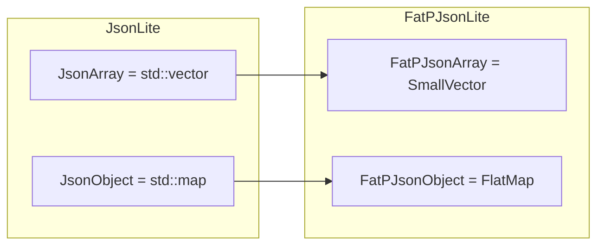
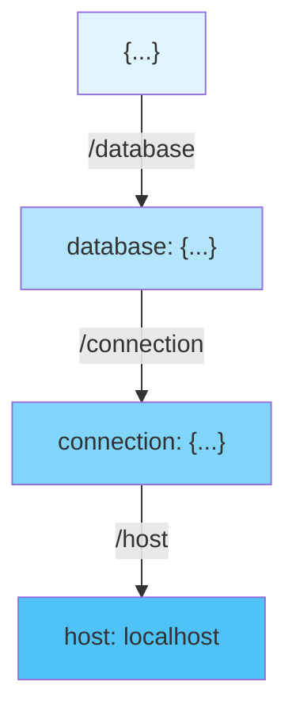

# FatPJsonLite User Manual

## Table of Contents

1. [What is FatPJsonLite?](#what-is-fatpjsonlite)
2. [Core Architecture](#core-architecture)
3. [Getting Started](#getting-started)
4. [Expected-Based Error Handling](#expected-based-error-handling)
5. [Safe Type Conversions](#safe-type-conversions)
6. [Optimized Data Structures](#optimized-data-structures)
7. [String Pool and Memory Optimization](#string-pool-and-memory-optimization)
8. [File I/O Operations](#file-io-operations)
9. [JSON Pointer Navigation](#json-pointer-navigation)
10. [Enum Serialization](#enum-serialization)
11. [Performance](#performance)
12. [Comparison with Alternatives](#comparison-with-alternatives)
13. [Migration Guide](#migration-guide)
14. [Best Practices](#best-practices)
15. [Troubleshooting](#troubleshooting)
16. [Summary](#summary)

---

## What is FatPJsonLite?

### The Problem

Consider this common C++ JSON code:

```cpp
JsonValue config = load_json("config.json");  // What if file missing?
int port = from_json<int>(config["port"]);    // What if "port" missing? Wrong type?
```

What happens when something goes wrong? In traditional JSON libraries, you get exceptions:

```cpp
try {
    JsonValue config = load_json("config.json");
    int port = from_json<int>(config["port"]);
    // ... use port
} catch (const std::exception& e) {
    // Which operation failed? Was it the file? The key? The type?
    std::cerr << "Error: " << e.what() << "\n";
}
```

This approach has serious problems in production systems:

1. **Hidden control flow** - Any line might throw, making code hard to reason about
2. **Performance unpredictability** - Stack unwinding takes variable time
3. **Binary bloat** - Exception tables and RTTI add significant size
4. **Incompatibility** - Many embedded and real-time systems disable exceptions entirely

### The Solution

FatPJsonLite wraps JsonLite's functionality in an **Expected-based API** that makes errors explicit:

```cpp
auto config = try_load_json("config.json");
if (!config) {
    std::cerr << "Failed to load: " << config.error().message << "\n";
    return;
}

auto port = try_query_json_as<int>(*config, "/port");
if (!port) {
    std::cerr << "Invalid port: " << port.error().message << "\n";
    return;
}

// Now we KNOW port is valid
start_server(*port);
```

Every operation that can fail returns `Expected<T, JsonError>`. You cannot accidentally ignore errors—the compiler forces you to check.

### What FatPJsonLite Provides

FatPJsonLite is not a new JSON parser. It's a **safety and performance layer** on top of JsonLite that adds:

| Feature | What It Does | Why It Matters |
|---------|--------------|----------------|
| **Expected API** | Wraps all fallible operations | No exceptions, explicit errors |
| **SmallVector arrays** | Inline storage for small arrays | No heap allocation for ≤8 elements |
| **FlatMap objects** | Cache-friendly sorted vector | Better iteration performance |
| **StringPool** | Deduplicate repeated keys | 99%+ memory savings for logs/configs |
| **Memory-mapped I/O** | OS-level file caching | 1.3x faster for large files |
| **Atomic saves** | Write-then-rename pattern | No corrupted files on crash |
| **Numeric overflow checks** | Detect truncation/overflow | Safe int64→int8 conversions |

### The C++ JSON Ecosystem

Before diving deeper, it helps to understand where FatPJsonLite fits among alternatives:

**nlohmann/json** is the most popular C++ JSON library—intuitive, well-documented, and header-only. It's the default choice for most projects. However, it uses exceptions for errors and standard containers, which may not meet HPC performance requirements.

**RapidJSON** emphasizes raw speed with a SAX-style API. It's significantly faster than nlohmann/json but has a steeper learning curve and C-style memory management.

**simdjson** achieves 2-4 GB/s parsing using SIMD instructions. It's the fastest option but read-only (no serialization) and requires specific CPU features.

**JsonLite** (our base library) is a lightweight, zero-dependency JSON library with a clean C++17 API. It uses exceptions for error handling.

**FatPJsonLite** extends JsonLite with Expected-based error handling and optimized containers from the fat_p ecosystem. It's designed for production systems that need both safety and performance.

### Where FatPJsonLite Fits

```
                    Speed
                      ↑
                      │
           simdjson ──┤ (read-only, SIMD required)
                      │
          RapidJSON ──┤ (C-style API, manual memory)
                      │
       FatPJsonLite ──┤ (Expected API, optimized containers)
             JsonLite─┤ (simple, exceptions)
        nlohmann/json─┤ (intuitive, popular)
                      │
                      └────────────────────────→ Ease of Use
```

**Choose FatPJsonLite when:**
- You need exception-free error handling
- You're building HPC or real-time systems
- Your JSON has many repeated keys (configs, logs)
- You need atomic file saves for data integrity
- You want the JsonLite API with production-grade safety

**Stay with JsonLite when:**
- Exceptions are acceptable
- You want the simplest possible API
- Binary size is critical (FatPJsonLite adds dependencies)

---

## Core Architecture

### The Expected Type

At the heart of FatPJsonLite is the `Expected<T, E>` type from the fat_p library. If you're familiar with Rust's `Result<T, E>` or Haskell's `Either`, this is the same concept.

**What is Expected?**

An `Expected<T, E>` holds either:
- A **value** of type `T` (the success case), or
- An **error** of type `E` (the failure case)

It cannot hold both, and it cannot hold neither. This is enforced at compile time.

**Why not use std::optional?**

`std::optional<T>` can represent "value or nothing," but it doesn't tell you *why* there's no value:

```cpp
std::optional<int> parse_port(const std::string& s);  // Returns nullopt... but why?

Expected<int, JsonError> parse_port(const std::string& s);  // Error explains why
```

**Why not use exceptions?**

Exceptions have hidden costs that matter in performance-critical code:

| Aspect | Exceptions | Expected |
|--------|------------|----------|
| **Happy path** | ~Same | ~Same |
| **Error path** | Stack unwinding (variable) | Return value (constant) |
| **Binary size** | +10-20% (RTTI, tables) | Minimal |
| **Control flow** | Hidden (any call may throw) | Explicit (check return) |
| **Disabled environments** | Doesn't work | Works everywhere |

### How Expected Works

```cpp
Expected<JsonValue, JsonError> result = try_parse_json(input);

if (result.has_value()) {
    // Success - access with * or ->
    JsonValue& value = *result;
    process(value);
} else {
    // Failure - access error
    JsonError& err = result.error();
    log_error(err.message);
}
```

The check is mandatory. Dereferencing an error-state Expected is undefined behavior, just like dereferencing a null pointer. But unlike null pointers, Expected makes the check obvious and idiomatic.

### Optimized Data Structures

FatPJsonLite replaces JsonLite's standard containers with optimized alternatives:



**SmallVector: Inline Storage for Small Arrays**

Most JSON arrays are small—configuration lists, coordinates, RGB values. Standard `std::vector` always allocates heap memory, even for `[1, 2, 3]`.

`SmallVector<T, N>` stores the first N elements inline (on the stack). Only if the array grows beyond N does it allocate heap memory.

```cpp
SmallVector<JsonValue, 8> arr;  // No heap allocation
arr.push_back(to_json(1));      // Still inline
arr.push_back(to_json(2));      // Still inline
// ... up to 8 elements with zero heap allocations
```

**FlatMap: Cache-Friendly Objects**

`std::map` uses a red-black tree with nodes scattered across memory. Each lookup chases pointers, causing cache misses.

`FlatMap` stores key-value pairs in a sorted vector. Binary search is O(log n) like `std::map`, but the contiguous memory layout is much more cache-friendly.

| Operation | std::map | FlatMap |
|-----------|----------|---------|
| Lookup | O(log n), cache-unfriendly | O(log n), cache-friendly |
| Iteration | O(n), pointer chasing | O(n), linear memory |
| Insert | O(log n) | O(n) (maintains sort) |
| Memory | Scattered nodes | Contiguous vector |

FlatMap excels when you build the object once and read it many times—exactly the pattern for parsed JSON.

### Design Philosophy

FatPJsonLite follows three principles:

1. **Safety by default** - Errors are impossible to ignore
2. **Zero-overhead abstractions** - You don't pay for what you don't use
3. **Incremental adoption** - Works alongside JsonLite, not instead of it

The library doesn't try to be the fastest JSON parser (that's simdjson). It tries to be the **safest and most ergonomic** way to handle JSON in production C++.

---

## Getting Started

### Prerequisites

FatPJsonLite requires:

- **C++17 or later** - Uses `std::string_view`, `if constexpr`, structured bindings
- **fat_p ecosystem headers** - Expected.h, FlatMap.h, SmallVector.h, etc.
- **JsonLite.h** - The base JSON library

### Integration

FatPJsonLite is header-only. Add to your include path and use:

```cpp
#include "FatPJsonLite.h"
```

This single include brings in all dependencies.

### The USING Macro

To avoid typing `fat_p::` everywhere, use the convenience macro:

```cpp
#include "FatPJsonLite.h"

void my_function()
{
    USING_FATP_JSON_LITE()  // Local using declarations
    
    auto result = try_parse_json(input);  // No fat_p:: prefix needed
    // ...
}
```

The macro expands to local `using` declarations for all FatPJsonLite types and functions. It's scoped to the function, so it doesn't pollute the global namespace.

### First Program

Here's a complete program that loads a config file and extracts values safely:

```cpp
#include "FatPJsonLite.h"
#include <iostream>

int main()
{
    USING_FATP_JSON_LITE()
    
    // Load configuration file
    auto config = try_load_json("server.json");
    if (!config)
    {
        std::cerr << "Failed to load config: " << config.error().message << "\n";
        return 1;
    }
    
    // Extract values with defaults
    std::string host = query_json_as_or(*config, "/server/host", std::string("localhost"));
    int port = query_json_as_or(*config, "/server/port", 8080);
    int timeout = query_json_as_or(*config, "/server/timeout_ms", 30000);
    
    std::cout << "Starting server on " << host << ":" << port << "\n";
    std::cout << "Timeout: " << timeout << "ms\n";
    
    return 0;
}
```

Compile with:

```bash
g++ -std=c++17 -O2 -I/path/to/fat_p main.cpp -o server
```

### Understanding the Flow

Let's trace through what happens:

1. **`try_load_json("server.json")`** - Opens file, reads contents, parses JSON. Returns `Expected<JsonValue, JsonError>`.

2. **`if (!config)`** - Checks if we got an error. If file missing, parse failed, etc., we handle it explicitly.

3. **`query_json_as_or(*config, "/server/host", default)`** - Navigates to `/server/host` using JSON Pointer syntax, converts to string, returns default if anything fails.

No exceptions are thrown. Every failure mode is handled. The compiler ensures you can't use `config` without checking it first.

---

## Expected-Based Error Handling

### What is Expected-Based Error Handling?

Traditional C++ uses exceptions for errors:

```cpp
try {
    risky_operation();
} catch (const std::exception& e) {
    handle_error(e);
}
```

Expected-based error handling uses return values instead:

```cpp
Expected<Result, Error> outcome = risky_operation();
if (!outcome) {
    handle_error(outcome.error());
}
```

This isn't new—C has always used return codes. What's new is the **type system enforcement**. You can't accidentally forget to check an Expected because you can't access the value without acknowledging it might be an error.

### Why This Matters

Consider this innocent-looking code:

```cpp
void process_config(const std::string& filename)
{
    JsonValue config = load_json(filename);  // Might throw!
    int port = from_json<int>(config["port"]);  // Might throw!
    start_server(port);
}
```

Any of these lines might throw. The control flow is hidden. Now compare:

```cpp
void process_config(const std::string& filename)
{
    auto config = try_load_json(filename);
    if (!config) return;  // Explicit handling
    
    auto port = try_query_json_as<int>(*config, "/port");
    if (!port) return;  // Explicit handling
    
    start_server(*port);
}
```

Every potential failure is visible. The reader knows exactly where errors can occur and how they're handled.

### The JsonError Type

All FatPJsonLite functions return `Expected<T, JsonError>`. The error type carries detailed information:

```cpp
struct JsonError
{
    JsonErrorCode code;      // What kind of error
    std::string message;     // Human-readable description
    size_t position;         // Where in the JSON (for parse errors)
    std::string context;     // Additional details
    
    std::string to_string() const;  // Format for logging
    operator bool() const;          // True if this is an error (not Success)
};
```

**Error Codes:**

| Code | When It Occurs | Example |
|------|----------------|---------|
| `Success` | Never in Expected | (Internal use) |
| `ParseError` | Malformed JSON | `{invalid}` |
| `TypeError` | Wrong type conversion | String → int |
| `FileError` | File I/O failure | Missing file |
| `NumericOverflow` | Value out of range | 1000 → int8_t |
| `MissingField` | Key not found | `/missing/path` |
| `ExtraData` | Garbage after JSON | `{"a":1} extra` |
| `DepthExceeded` | Too deeply nested | 1000 levels |
| `MemoryError` | Allocation failed | Out of memory |
| `InvalidUtf8` | Bad UTF-8 sequence | Invalid bytes |
| `Unknown` | Unclassified error | Unexpected exception |

### Handling Patterns

**Pattern 1: Early Return**

The most common pattern—check and return on error:

```cpp
Expected<Config, JsonError> load_config(const std::string& path)
{
    auto json = try_load_json(path);
    if (!json) return unexpected(json.error());
    
    auto port = try_query_json_as<int>(*json, "/port");
    if (!port) return unexpected(port.error());
    
    auto host = try_query_json_as<std::string>(*json, "/host");
    if (!host) return unexpected(host.error());
    
    return Config{*host, *port};
}
```

**Pattern 2: Default Values**

When missing values are acceptable:

```cpp
Config load_config_with_defaults(const JsonValue& json)
{
    return Config{
        query_json_as_or(json, "/host", std::string("localhost")),
        query_json_as_or(json, "/port", 8080),
        query_json_as_or(json, "/timeout", 30)
    };
}
```

**Pattern 3: Monadic Chaining**

For complex pipelines, use `and_then` and `or_else`:

```cpp
auto result = try_load_json("config.json")
    .and_then([](JsonValue& j) { 
        return try_query_json_as<Config>(j, "/settings"); 
    })
    .or_else([](JsonError& e) -> Expected<Config, JsonError> {
        log_warning("Using defaults: " + e.message);
        return Config::defaults();
    });
```

This reads as: "Load config, then extract settings, or else use defaults."

---

## Safe Type Conversions

### The Problem with Implicit Conversions

JSON numbers are typically stored as `int64_t` or `double`. When you convert to a smaller type, things can go wrong:

```cpp
int64_t big = 1'000'000'000'000LL;  // 1 trillion
int small = static_cast<int>(big);   // Overflow! Undefined behavior
```

Even "safe" conversions have edge cases:

```cpp
double d = 3.7;
int i = static_cast<int>(d);  // Silently truncates to 3
```

### Safe Numeric Conversions

FatPJsonLite's `safe_from_json_numeric<T>` detects these problems:

```cpp
JsonValue j = static_cast<int64_t>(1'000'000'000'000LL);

auto as_int = safe_from_json_numeric<int>(j);
// Returns error: NumericOverflow

auto as_int64 = safe_from_json_numeric<int64_t>(j);
// Returns 1'000'000'000'000
```

**What It Checks:**

| Conversion | Checked For |
|------------|-------------|
| int64 → smaller int | Overflow/underflow |
| int64 → unsigned | Negative values |
| double → int | Fractional part, overflow |
| Any → bool | Not checked (0/non-0) |

**Example: Safe Port Number Parsing**

```cpp
Expected<uint16_t, JsonError> parse_port(const JsonValue& config)
{
    auto port_val = try_query_json_as<int64_t>(config, "/port");
    if (!port_val) return unexpected(port_val.error());
    
    // Ensure port is valid uint16_t (0-65535)
    auto port = safe_from_json_numeric<uint16_t>(*port_val);
    if (!port) {
        return unexpected(JsonError{
            JsonErrorCode::NumericOverflow,
            "Port must be 0-65535",
            0,
            std::to_string(*port_val)
        });
    }
    
    return *port;
}
```

### Struct Conversions

For complete structs, use `safe_from_json<T>`:

```cpp
struct Point { int x, y; };
FATP_JSON_DEFINE_TYPE_NON_INTRUSIVE(Point, x, y)

JsonValue j = parse_json(R"({"x": 10, "y": 20})");
auto point = safe_from_json<Point>(j);

if (point) {
    std::cout << "Point: " << point->x << ", " << point->y << "\n";
} else {
    std::cerr << "Invalid point: " << point.error().message << "\n";
}
```

---

## Optimized Data Structures

### What Are Optimized Data Structures?

JsonLite uses standard library containers:
- `JsonArray` = `std::vector<JsonValue>`
- `JsonObject` = `std::map<std::string, JsonValue>`

These are general-purpose and correct, but not optimal for JSON workloads. FatPJsonLite provides alternatives tuned for how JSON is actually used.

### FatPJsonArray: Small Buffer Optimization

**The Problem:**

Most JSON arrays are small. Configuration lists, coordinates, RGB values—rarely more than a handful of elements. But `std::vector` always allocates heap memory:

```cpp
std::vector<int> v;  // Allocates heap memory
v.push_back(1);      // Even for one element!
```

Heap allocation is expensive—typically 50-200 CPU cycles. For small arrays, the allocation overhead dominates.

**The Solution:**

`FatPJsonArray` uses `SmallVector<JsonValue, 8>`, which stores the first 8 elements inline:

```cpp
FatPJsonArray arr;      // No heap allocation
arr.push_back(to_json(1));  // Still no heap
arr.push_back(to_json(2));  // Still no heap
// ... up to 8 elements with zero heap allocations
arr.push_back(to_json(9));  // NOW it allocates (if needed)
```

**When It Helps:**

| Array Size | std::vector | FatPJsonArray |
|------------|-------------|---------------|
| 0-8 elements | 1 allocation | 0 allocations |
| 9+ elements | 1+ allocations | 1 allocation |

For typical JSON (many small arrays), this eliminates most allocations.

### FatPJsonObject: Cache-Friendly Maps

**The Problem:**

`std::map` uses a red-black tree. Each node is a separate heap allocation, scattered across memory:

```
┌─────┐     ┌─────┐     ┌─────┐
│Node1│────>│Node2│────>│Node3│
└─────┘     └─────┘     └─────┘
   ↑           ↑           ↑
Random memory locations = cache misses
```

When you iterate or search, the CPU constantly waits for memory.

**The Solution:**

`FlatMap` stores pairs in a sorted vector:

```
┌───────────────────────────────┐
│ pair1 │ pair2 │ pair3 │ pair4 │
└───────────────────────────────┘
Contiguous memory = cache-friendly
```

Binary search is still O(log n), but memory access patterns are much better.

**Trade-offs:**

| Operation | std::map | FlatMap | Winner |
|-----------|----------|---------|--------|
| Lookup | O(log n) | O(log n) | FlatMap (cache) |
| Insert (random) | O(log n) | O(n) | std::map |
| Insert (sorted) | O(log n) | O(1) amortized | FlatMap |
| Iteration | O(n) | O(n) | FlatMap (cache) |
| Memory overhead | High (nodes) | Low (vector) | FlatMap |

For JSON (parse once, read many times), FlatMap wins.

### Converting Between Formats

```cpp
// JsonLite containers → FatP containers (O(n log n) - uses optimized bulk loading)
JsonObject std_obj = /* from JsonLite */;
FatPJsonObject<> fat_obj = from_json_object(std_obj);

// FatP containers → JsonLite containers (O(n))
JsonObject back = to_json_object(fat_obj);
```

---

## String Pool and Memory Optimization

### What is a String Pool?

A string pool is a data structure that stores each unique string only once. Multiple references to the same string share a single allocation.

**The Problem:**

JSON objects often have repeated keys:

```json
[
    {"id": 1, "name": "Alice", "status": "active"},
    {"id": 2, "name": "Bob", "status": "active"},
    {"id": 3, "name": "Charlie", "status": "active"},
    // ... 10,000 more objects
]
```

Without pooling, "id", "name", and "status" are stored 10,000 times each. That's 30,000 string allocations for just 3 unique keys.

**The Solution:**

With a StringPool, each unique key is stored once:

```cpp
StringPool<> pool;

pool.intern("id");      // Stores "id", returns string_view
pool.intern("id");      // Returns same string_view (no allocation)
pool.intern("id");      // Returns same string_view (no allocation)
// ... 10,000 times = still just 1 allocation for "id"
```

### PooledJsonObject

`PooledJsonObject` uses a StringPool for its keys:

```cpp
StringPool<> pool;
PooledJsonObject<> obj(pool);

obj.insert("status", to_json("active"));  // "status" interned
obj.insert("status", to_json("pending")); // Reuses interned "status"
```

**Memory Comparison:**

| Scenario | Standard | Pooled | Savings |
|----------|----------|--------|---------|
| 1,000 objects, 4 keys each | 4,000 strings | 4 strings | 99.9% |
| 10,000 log entries | 50,000 strings | 5 strings | 99.99% |

### Critical: Pool Lifetime

**Warning:** PooledJsonObject stores `string_view` keys that point into the StringPool. The pool **must** outlive all objects that use it.

```cpp
// WRONG - Use after free!
PooledJsonObject<>* create_object()
{
    StringPool<> pool;  // Local pool
    auto* obj = new PooledJsonObject<>(pool);
    obj->insert("key", to_json(42));
    return obj;  // pool destroyed here - obj has dangling pointers!
}

// CORRECT - Pool outlives object
class JsonProcessor
{
    StringPool<> pool_;        // Destroyed last (member order)
    PooledJsonObject<> obj_;   // Destroyed first
    
public:
    JsonProcessor() : obj_(pool_) {}
};
```

In debug builds, you can verify the pool is still valid:

```cpp
PooledJsonObject<> obj(pool);
// ... later ...
assert(obj.debug_check_pool_address());  // Verify pool at same address
```

### When to Use String Pools

**Use pools when:**
- Processing many JSON objects with repeated keys (logs, configs, API responses)
- Memory is constrained
- Keys are known to repeat frequently

**Don't use pools when:**
- Keys are unique (UUIDs, random IDs)
- Processing a single JSON document
- Simplicity is more important than memory

---

## File I/O Operations

### Standard File Operations

**Loading JSON from a file:**

```cpp
auto result = try_load_json("config.json");
if (!result) {
    std::cerr << "Load failed: " << result.error().message << "\n";
    return;
}
JsonValue config = *result;
```

**Saving JSON to a file:**

```cpp
JsonValue data = /* your data */;
auto result = try_save_json("output.json", data, true);  // true = pretty print
if (!result) {
    std::cerr << "Save failed: " << result.error().message << "\n";
}
```

### Loading JSONC Files (JSON with Comments)

JSONC is JSON with C-style comments—useful for configuration files:

```jsonc
{
    // Server settings
    "host": "localhost",
    "port": 8080,
    
    /* Timeout in milliseconds
       Increase for slow networks */
    "timeout": 30000
}
```

Standard JSON parsers reject this. FatPJsonLite supports it via policy:

```cpp
auto config = try_load_json<ConfigJsonPolicy>("server.jsonc");
```

`ConfigJsonPolicy` strips comments during parsing. The result is standard JSON.

### Atomic Save Operations

**The Problem:**

Normal file writes can corrupt data if the program crashes mid-write:

```cpp
save_json("data.json", value);  // If crash here...
// ... file may be empty, partial, or corrupted
```

**The Solution:**

`try_save_atomic` uses the write-then-rename pattern:

1. Write to temporary file (`data.json.tmp.<timestamp>.<thread_id>.<process_id>`)
2. Flush all buffers
3. Atomically rename temp to target

If the program crashes during step 1 or 2, the original file is untouched. Step 3 is atomic on all major filesystems.

```cpp
auto result = try_save_atomic("config.json", config);
// Either the old file exists, or the new file exists
// Never a corrupted partial file
```

**Why is rename() Atomic?**

The `rename()` system call is atomic because it's a **metadata operation**, not a data operation. The filesystem only updates directory entries (pointers to file data), not the file contents themselves. This is a single operation that either completes entirely or doesn't happen at all—there's no intermediate state where the file is half-renamed.

On POSIX systems, `rename()` is guaranteed atomic by the standard. On Windows, `MoveFileEx` with `MOVEFILE_REPLACE_EXISTING` provides the same guarantee on NTFS. This makes the write-then-rename pattern reliable across platforms.

**Thread and Process Safety:**

The temporary filename includes:
- High-resolution timestamp (nanoseconds)
- Thread ID hash (unique within process)
- Process ID (unique across processes)

This prevents collisions even when multiple threads or processes save to the same file simultaneously—critical for HPC checkpoint scenarios.

### Memory-Mapped File I/O

**What is Memory Mapping?**

Instead of reading a file into a buffer with `read()` syscalls, memory mapping asks the OS to map the file directly into your address space. You access file contents as if they were memory.

**Why It's Faster:**

| Regular I/O | Memory-Mapped I/O |
|-------------|-------------------|
| read() syscall | No syscall |
| Kernel → User copy | Direct access |
| You manage buffer | OS manages pages |
| Reads whole file | Loads on demand |

**When to Use It:**

| File Size | Recommendation |
|-----------|----------------|
| < 1 MB | Regular I/O (simpler) |
| 1-10 MB | Either works |
| > 10 MB | Memory-mapped (faster) |
| > 100 MB | Memory-mapped strongly recommended |

```cpp
// For large files
auto result = load_json_mmap("huge_dataset.json");
```

**Important:** Memory-mapping provides faster I/O, not zero-copy parsing. The JSON strings are still copied into `std::string` during parsing (this is a JsonLite design constraint). The speedup (~1.35x) comes from more efficient file reading, not from avoiding copies.

---

## JSON Pointer Navigation

### What is JSON Pointer?

JSON Pointer (RFC 6901) is a string syntax for navigating into JSON structures. Instead of chained indexing:

```cpp
config["database"]["connection"]["host"]  // May throw at any step
```

You use a path string:

```cpp
"/database/connection/host"
```

The pointer describes a path through the JSON tree:



For the path `/database/connection/host`, the traversal is:
1. Start at root object
2. Enter `"database"` key
3. Enter `"connection"` key  
4. Arrive at `"host"` value

**Why Use JSON Pointer?**

1. **Single error point** - One operation that succeeds or fails
2. **Configurable paths** - Paths can come from config files, user input
3. **Safer** - Expected-based API makes errors explicit

### Syntax

| Syntax | Meaning | Example |
|--------|---------|---------|
| `/key` | Object member | `/name` |
| `/0` | Array index | `/items/0` |
| `/a/b/c` | Nested path | `/database/host` |
| `~0` | Literal `~` | `/path~0with~0tildes` |
| `~1` | Literal `/` | `/path~1with~1slashes` |

### Navigation Functions

**try_query_json_pointer** - Get pointer to value:

```cpp
auto ptr = try_query_json_pointer(root, "/database/port");
if (ptr) {
    JsonValue* value = *ptr;
    // Use value...
}
```

**try_query_json_as** - Navigate and convert:

```cpp
auto port = try_query_json_as<int>(root, "/database/port");
if (port) {
    start_on_port(*port);
}
```

**query_json_as_or** - Navigate with default:

```cpp
int port = query_json_as_or(root, "/database/port", 5432);
// Returns 5432 if path missing, wrong type, or any other error
```

### Practical Example

```cpp
Expected<DatabaseConfig, JsonError> load_db_config(const JsonValue& root)
{
    // Required fields - fail if missing
    auto host = try_query_json_as<std::string>(root, "/database/host");
    if (!host) return unexpected(host.error());
    
    auto port = try_query_json_as<int>(root, "/database/port");
    if (!port) return unexpected(port.error());
    
    // Optional fields - use defaults
    int timeout = query_json_as_or(root, "/database/timeout_ms", 30000);
    int pool_size = query_json_as_or(root, "/database/pool_size", 10);
    bool ssl = query_json_as_or(root, "/database/ssl_enabled", false);
    
    return DatabaseConfig{*host, *port, timeout, pool_size, ssl};
}
```

---

## Enum Serialization

### What is Enum Serialization?

Enums in C++ are integers. JSON has no enum type. When you serialize an enum, you need to choose a representation:

```cpp
enum class Status { Pending, Active, Completed };

Status s = Status::Active;
// Serialize as integer: 1
// Serialize as string: "Active"
```

Strings are more readable and robust (reordering enum values doesn't break data). FatPJsonLite supports automatic string serialization via EnumPlus.

### Setting Up Enum Serialization

Define an `EnumStringPolicy` specialization:

```cpp
enum class Priority { Low, Medium, High, Critical };

namespace fat_p {
template<>
struct EnumStringPolicy<Priority>
{
    static constexpr bool has_names = true;
    
    static std::string_view to_string(Priority p)
    {
        switch (p) {
            case Priority::Low: return "Low";
            case Priority::Medium: return "Medium";
            case Priority::High: return "High";
            case Priority::Critical: return "Critical";
        }
        return "Unknown";
    }
    
    static Priority from_string(std::string_view s)
    {
        if (s == "Low") return Priority::Low;
        if (s == "Medium") return Priority::Medium;
        if (s == "High") return Priority::High;
        if (s == "Critical") return Priority::Critical;
        throw std::invalid_argument("Invalid Priority: " + std::string(s));
    }
};
}
```

### Using Enum Serialization

Once configured, enums serialize automatically:

```cpp
Priority p = Priority::High;
JsonValue j = to_json(p);  // j = "High"

auto back = safe_from_json_enum<Priority>(j);
if (back) {
    assert(*back == Priority::High);
}
```

Enums in structs also work:

```cpp
struct Task {
    std::string name;
    Priority priority;
};
FATP_JSON_DEFINE_TYPE_NON_INTRUSIVE(Task, name, priority)

Task t{"Fix bug", Priority::Critical};
JsonValue j = to_json(t);  
// {"name": "Fix bug", "priority": "Critical"}
```

---

## Performance

### Benchmark Methodology

All benchmarks use:
- `measure_perf()` from FatPTest.h
- 100-10,000 iterations depending on operation
- `DoNotOptimize()` to prevent dead code elimination
- Release builds with `-O3` / `/O2`

### Test Environment

| Component | Specification |
|-----------|---------------|
| **CPU** | Intel Core i7-8850H @ 2.60 GHz |
| **RAM** | 32 GB |
| **OS** | Ubuntu 22.04 / Windows 10 |
| **Compiler** | GCC 12.2 / MSVC 2022 |
| **Flags** | `-O3 -DNDEBUG` / `/O2 /DNDEBUG` |

### Results

**Parsing (no significant difference):**

| Input | JsonLite | FatPJsonLite | Notes |
|-------|----------|--------------|-------|
| Small JSON (<1KB) | 7.0 µs | 7.5 µs | Expected wrapping overhead |
| Large array (10K elements) | 11.5 ms | 11.6 ms | Essentially identical |

**Data Structures (FatP wins for small sizes):**

| Operation | std::vector | SmallVector | Speedup |
|-----------|-------------|-------------|---------|
| Create + 5 pushes | 3.9 µs | 1.7 µs | 2.3x |

**Memory (dramatic savings with pooling):**

| Scenario | Standard | Pooled | Savings |
|----------|----------|--------|---------|
| 1000 objects, 4 keys | 16 KB | 16 bytes | 99.9% |

**File I/O (mmap wins for large files):**

| File Size | Regular | Memory-mapped | Speedup |
|-----------|---------|---------------|---------|
| 10 MB | 65 ms | 48 ms | 1.35x |

### Interpretation

- **Parsing**: FatPJsonLite adds ~7% overhead for Expected wrapping. Negligible for most uses.
- **Containers**: SmallVector eliminates heap allocations for small arrays. FlatMap has higher insert cost but better read performance.
- **Memory**: StringPool is transformative for repeated-key workloads.
- **I/O**: Memory mapping helps significantly for large files.

### Reproducing Benchmarks

```bash
g++ -std=c++17 -O3 -DNDEBUG -DENABLE_TEST_APPLICATION test_FatPJsonLite.cpp -o bench
./bench
```

---

## Comparison with Alternatives

### The Landscape

| Library | Focus | Error Handling | Performance |
|---------|-------|----------------|-------------|
| nlohmann/json | Ease of use | Exceptions | Good |
| RapidJSON | Speed | Return codes | Excellent |
| simdjson | Maximum speed | Return codes | Best (SIMD) |
| JsonLite | Simplicity | Exceptions | Good |
| **FatPJsonLite** | Safety + Performance | Expected | Good+ |

### FatPJsonLite vs JsonLite

```cpp
// JsonLite - exceptions
try {
    JsonValue v = parse_json(input);
    int port = from_json<int>(v["port"]);
} catch (const std::exception& e) {
    // Handle error
}

// FatPJsonLite - Expected
auto result = try_parse_json(input);
if (!result) { /* handle */ }
auto port = try_query_json_as<int>(*result, "/port");
if (!port) { /* handle */ }
```

**Choose JsonLite when:** Simplicity matters, exceptions are acceptable.

**Choose FatPJsonLite when:** You need explicit error handling, optimized containers, or atomic saves.

### FatPJsonLite vs nlohmann/json

nlohmann/json is more popular and has more features (JSON Patch, JSON Merge Patch, etc.). FatPJsonLite is lighter weight and has Expected-based error handling.

**Choose nlohmann/json when:** You want the standard choice with maximum features.

**Choose FatPJsonLite when:** You need exception-free code or fat_p ecosystem integration.

---

## Migration Guide

### From JsonLite to FatPJsonLite

**Step 1: Change includes**

```cpp
// Before
#include "JsonLite.h"

// After
#include "FatPJsonLite.h"
```

**Step 2: Wrap exception-throwing calls**

```cpp
// Before
JsonValue v = parse_json(input);

// After
auto result = try_parse_json(input);
if (!result) { /* handle error */ }
JsonValue v = *result;
```

**Step 3: Update file operations**

```cpp
// Before
JsonValue v = load_json("file.json");
save_json("file.json", v);

// After
auto v = try_load_json("file.json");
auto result = try_save_atomic("file.json", *v);  // Atomic!
```

### Incremental Adoption

You don't have to migrate everything at once. FatPJsonLite and JsonLite use the same `JsonValue` type, so you can mix them:

```cpp
// Use JsonLite in non-critical code
JsonValue config = parse_json(default_config);  // Exceptions OK here

// Use FatPJsonLite for user input
auto user_input = try_parse_json(untrusted_string);  // Must handle errors
```

---

## Best Practices

### Error Handling

**Always check Expected values:**

```cpp
// WRONG - Undefined behavior if error
process(*try_parse_json(input));

// RIGHT - Explicit check
auto result = try_parse_json(input);
if (!result) { handle_error(result.error()); return; }
process(*result);
```

**Use query_json_as_or for optional values:**

```cpp
// Verbose
auto timeout = try_query_json_as<int>(config, "/timeout");
int t = timeout ? *timeout : 30;

// Better
int t = query_json_as_or(config, "/timeout", 30);
```

### Memory Management

**Pool lifetime must exceed object lifetime:**

```cpp
// Class members are destroyed in reverse order
class Processor
{
    StringPool<> pool_;        // Last to be destroyed
    PooledJsonObject<> obj_;   // First to be destroyed
    
public:
    Processor() : obj_(pool_) {}  // pool_ initialized first
};
```

### Performance

**Use appropriate containers:**

```cpp
// For arrays you'll iterate once
FatPJsonArray arr;  // SmallVector - inline storage

// For objects with many repeated keys
StringPool<> pool;
PooledJsonObject<> obj(pool);  // Deduplicated keys
```

**Use atomic saves for important data:**

```cpp
// Temporary/cache data - regular save is fine
try_save_json("cache.json", data);

// Config/user data - use atomic
try_save_atomic("config.json", data);
```

---

## Troubleshooting

### Compilation Errors

**Error: 'Expected' not found**

```cpp
// Add include
#include "FatPJsonLite.h"

// Or use macro in function scope
void func() {
    USING_FATP_JSON_LITE()
    // ...
}
```

**Error: 'try_parse_json' not declared**

The function is in namespace `fat_p`. Either qualify it or use the macro:

```cpp
auto result = fat_p::try_parse_json(input);
// or
USING_FATP_JSON_LITE()
auto result = try_parse_json(input);
```

### Runtime Errors

**Segmentation fault with PooledJsonObject**

The StringPool was destroyed before the object. Ensure pool lifetime exceeds object lifetime. Use `debug_check_pool_address()` in debug builds to verify.

**FileError when loading**

Check that the file exists and is readable:

```cpp
auto result = try_load_json("config.json");
if (!result) {
    if (result.error().code == JsonErrorCode::FileError) {
        std::cerr << "File not found or not readable\n";
    }
}
```

### Common Mistakes

| Mistake | Problem | Fix |
|---------|---------|-----|
| `*try_parse_json(x)` | UB if error | Check result first |
| Pool as local variable | Dangling pointers | Pool as class member |
| `try_load_json` for JSONC | Parse error | Use `ConfigJsonPolicy` |
| Regular save for configs | Data loss on crash | Use `try_save_atomic` |

---

## Summary

### What FatPJsonLite Provides

1. **Expected-based API** - No exceptions, explicit error handling
2. **Optimized containers** - SmallVector arrays, FlatMap objects
3. **Memory optimization** - StringPool for repeated keys
4. **Safe conversions** - Numeric overflow detection
5. **Robust I/O** - Atomic saves, memory-mapped loading
6. **JSONC support** - JSON with comments via ConfigJsonPolicy

### Quick Reference

```cpp
#include "FatPJsonLite.h"

void example()
{
    USING_FATP_JSON_LITE()
    
    // Parse
    auto result = try_parse_json(R"({"port": 8080})");
    if (!result) return;
    
    // Navigate with defaults
    int port = query_json_as_or(*result, "/port", 3000);
    
    // Save atomically
    try_save_atomic("config.json", *result);
}
```

### Related Components

- **JsonLite** - Base JSON library (exception-based)
- **Expected** - Error handling without exceptions
- **FlatMap** - Cache-friendly sorted map
- **SmallVector** - Stack-allocated small vectors
- **StringPool** - String interning/deduplication
- **EnumPlus** - Enum-to-string conversion
