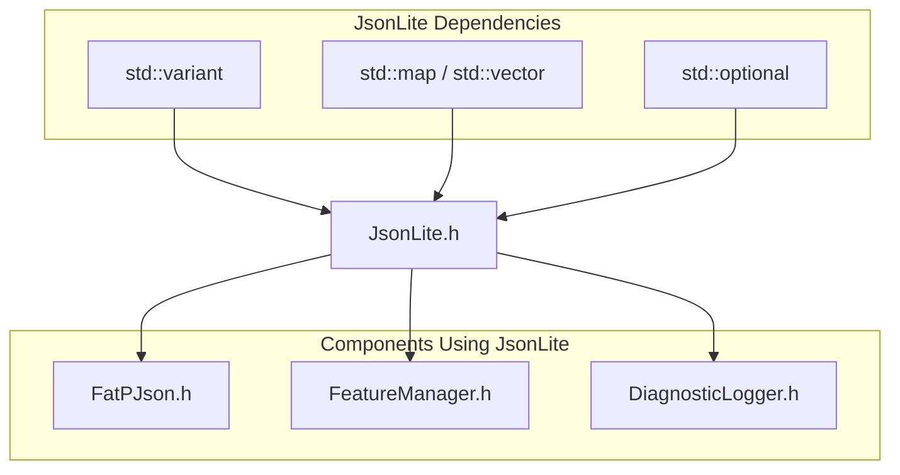

# JsonLite: A Fat-P Library Showcase

## Executive Summary

JsonLite is a **zero-dependency JSON library** with macro-based struct serialization, policy-based parsing, and integer precision preservation. In 2001, Douglas Crockford gave the world JSON—a data format so simple it fits on a business card, yet expressive enough to replace XML everywhere. Twenty years later, C++ still has no standard JSON support. JsonLite fills that gap permanently: single-header, zero dependencies, automatic struct mapping, and type-safe values via `std::variant`.

---

## The Problem Domain

### A Brief History of Structured Data Exchange

Before JSON, there was XML. And before XML worked properly, there was chaos.

In the late 1990s, if you wanted to send structured data between systems, your options were grim:

```
CORBA: Complex, required IDL compilation, version hell
SOAP: XML-based, verbose, enterprise nightmare
Custom binary: Fast, but every system spoke different dialects
CSV: Works for tables, fails for hierarchies
```

XML emerged as the "universal" solution. It was self-describing, hierarchical, and tooling existed. But XML was also:

```xml
<?xml version="1.0" encoding="UTF-8"?>
<person xmlns="http://example.com/person/v1">
    <name type="string">Alice</name>
    <age type="integer">30</age>
    <active type="boolean">true</active>
    <roles>
        <role>admin</role>
        <role>developer</role>
    </roles>
</person>
```

That's 11 lines to represent 4 pieces of data. Attributes vs. elements? Namespaces? Schemas? XSLT transformations? XML solved the data exchange problem but created a complexity explosion.

### Douglas Crockford's Insight

In 2001, Douglas Crockford was working on web applications at State Software. He needed to send data from a server to JavaScript in the browser. He realized something important: **JavaScript already had a perfectly good syntax for structured data**—object literals:

```javascript
{
    name: "Alice",
    age: 30,
    active: true,
    roles: ["admin", "developer"]
}
```

He standardized this syntax, added string quoting requirements for safety, and called it JSON: JavaScript Object Notation. The specification was so simple he put it on a single web page (json.org) and never updated it.

JSON won. Completely. REST APIs use JSON. Configuration files use JSON. NoSQL databases store JSON. Message queues transmit JSON. The format that "wasn't designed" became the universal data interchange standard.

### What Goes Wrong Without JSON Support in C++

The irony: C++ is one of the few major languages without built-in JSON handling.

```cpp
// The manual parsing nightmare
std::string json = R"({"port": 8080, "host": "localhost", "timeout": 30})";

// Step 1: Parse into... what exactly?
// C++ has no standard JSON value type

// Step 2: Extract fields manually
// What if "port" is missing? What if it's a string "8080"?
// What if timeout is null? What if the JSON is malformed?

// The typical result: walls of try-catch blocks
try {
    auto tree = some_json_parser(json);
    int port = tree["port"].as_int();        // What if not int?
    std::string host = tree["host"].as_str(); // What if missing?
    int timeout = tree["timeout"].as_int();   // What if null?
} catch (const std::exception& e) {
    // Which field failed? Line number? Character position?
    // Good luck debugging.
}
```

Now multiply this by every struct in your codebase:

```cpp
struct DatabaseConfig {
    std::string host;
    int port;
    std::string username;
    std::optional<std::string> password;
    int connection_timeout;
    int query_timeout;
    bool use_ssl;
    std::vector<std::string> replica_hosts;
};

// Manual serialization: error-prone, tedious, unmaintainable
std::string to_json(const DatabaseConfig& cfg) {
    std::ostringstream oss;
    oss << "{\"host\":\"" << escape_json(cfg.host) << "\","
        << "\"port\":" << cfg.port << ","
        << "\"username\":\"" << escape_json(cfg.username) << "\",";
    if (cfg.password) {
        oss << "\"password\":\"" << escape_json(*cfg.password) << "\",";
    } else {
        oss << "\"password\":null,";
    }
    // ... 20 more lines for the remaining fields
    // Did you remember to escape strings? Handle nulls? Format arrays?
}
```

| Issue | Real-World Impact |
|-------|-------------------|
| No standard JSON type | Every library has different value representations |
| Manual field extraction | Verbose, error-prone, no compile-time safety |
| No struct automation | Every struct needs custom serialization code |
| Integer truncation | Most libraries use `double`, losing precision on int64 |
| No position info | Parse errors say "invalid JSON" with no location |

### The C++ Standards Committee's Dilemma

Why doesn't C++ have standard JSON? The committee has discussed it. The obstacles are real:

**No consensus on value representation:**
- `std::any`? Type-erased, runtime overhead
- `std::variant`? Which types? `double` or separate int/float?
- Recursive types in C++ are syntactically awkward

**No struct reflection:**
- Can't enumerate struct members at compile time (until C++26?)
- Macros are the only portable solution
- Reflection proposals keep getting delayed

**"Too application-level":**
- The committee focuses on language primitives
- JSON is considered a library concern
- Meanwhile, Python has `json` in its standard library

The result: every C++ project picks a JSON library, and there are dozens to choose from.

---

## Architecture: Variant-Based Values with Macro Serialization

### The Mechanism: Type-Safe JSON Values

JsonLite represents JSON values as a variant over the six JSON types:

```cpp
using JsonNull   = std::monostate;
using JsonBool   = bool;
using JsonInt    = int64_t;      // NOT double! Preserves integer precision
using JsonFloat  = double;
using JsonString = std::string;
using JsonArray  = std::vector<JsonValue>;
using JsonObject = std::map<std::string, JsonValue>;

using JsonValue = std::variant<
    JsonNull,
    JsonBool,
    JsonInt,
    JsonFloat,
    JsonString,
    JsonArray,
    JsonObject
>;
```

**Why `std::variant`?**

Alternatives considered and rejected:

```cpp
// std::any - type-erased, no compile-time checking
std::any value = 42;
int x = std::any_cast<int>(value);  // Runtime failure if wrong type

// Union with tag - C-style, error-prone
struct JsonValue {
    enum Type { Null, Bool, Int, Float, String, Array, Object };
    Type type;
    union { bool b; int64_t i; double f; /* pointers for string/array/object */ };
    // Manual memory management nightmare
};

// Inheritance hierarchy - heap allocations for every value
class JsonValue { virtual ~JsonValue() = default; };
class JsonInt : public JsonValue { int64_t value; };
// Every number requires heap allocation
```

`std::variant` gives us:
- **Type safety** — can't accidentally read a string as an int
- **Value semantics** — copyable, movable, no manual memory management
- **Compile-time dispatch** — `std::visit` generates optimal code
- **Small buffer optimization** — small values stored inline

### Why Separate `int64_t` from `double`?

This is where JsonLite differs from most libraries.

JSON's specification says numbers are just "numbers" — no distinction between integers and floats. Most libraries interpret this literally and store all numbers as `double`. This creates a silent data corruption problem:

```cpp
// IEEE 754 double has 53 bits of mantissa precision
// int64_t has 63 bits of magnitude

int64_t original = 9007199254740993LL;  // 2^53 + 1

// Library using double:
double stored = static_cast<double>(original);
int64_t retrieved = static_cast<int64_t>(stored);
// retrieved == 9007199254740992  — WRONG! Rounded down!

// JsonLite:
JsonValue stored = original;  // Stored as JsonInt (int64_t)
int64_t retrieved = std::get<JsonInt>(stored);
// retrieved == 9007199254740993  — Correct!
```

**The 2^53 boundary:**

| Value | `double` Result | Error |
|-------|-----------------|-------|
| 9,007,199,254,740,992 | Exact | None |
| 9,007,199,254,740,993 | 9,007,199,254,740,992 | -1 |
| 9,007,199,254,740,994 | 9,007,199,254,740,994 | None (lucky) |
| 9,007,199,254,740,995 | 9,007,199,254,740,996 | +1 |

This matters for:
- Database IDs (often 64-bit integers)
- Timestamps (nanoseconds since epoch)
- Financial amounts (cents as integers)
- Cryptographic values

JsonLite parses numbers without decimal points or exponents as `int64_t`, preserving precision.

### Automatic Struct Serialization via Macros

Without reflection, macros are the only way to enumerate struct members:

```cpp
struct Config {
    int port;
    std::string host;
    std::optional<int> timeout;
};

// One macro defines both directions
FATP_JSON_DEFINE_TYPE_NON_INTRUSIVE(Config, port, host, timeout)
```

The macro expands to:

```cpp
inline JsonValue to_json(const Config& v) {
    return JsonObject{
        {"port", json_lite::to_json(v.port)},
        {"host", json_lite::to_json(v.host)},
        {"timeout", json_lite::to_json(v.timeout)}
    };
}

inline void from_json(const JsonValue& j, Config& v) {
    const auto& obj = std::get<JsonObject>(j);
    json_lite::from_json(obj.at("port"), v.port);
    json_lite::from_json(obj.at("host"), v.host);
    json_lite::from_json(obj.at("timeout"), v.timeout);
}
```

**Three macro variants for different needs:**

| Macro | Use Case |
|-------|----------|
| `FATP_JSON_DEFINE_TYPE_NON_INTRUSIVE` | External definition, all fields required |
| `FATP_JSON_DEFINE_TYPE_OPTIONAL` | External definition, missing fields get defaults |
| `FATP_JSON_DEFINE_TYPE_INTRUSIVE` | Inside class, can access private members |

---

## Feature Inventory

### 1. JSONC Support (Comments in Configuration)

JSON's creator deliberately excluded comments. For data interchange, this is fine—comments aren't data. But for configuration files, it's painful:

```json
{
    "timeout": 30,
    "max_connections": 100
}
```

Why is timeout 30? Why 100 connections? You can't document it in the file.

JsonLite supports JSONC (JSON with Comments) via the `CompatJsonPolicy`:

```cpp
// config.jsonc
{
    // Server timeout in seconds
    // WARNING: Values over 60 may cause load balancer issues
    "timeout": 30,
    
    /* Maximum concurrent connections.
       Based on server memory: 100 connections × 10MB each = 1GB */
    "max_connections": 100
}

// C++ code
auto config = load_params<Config, CompatJsonPolicy>("config.jsonc");
```

Comments are stripped during parsing—they don't appear in the loaded data structure. This matches VS Code's behavior (which popularized JSONC).

### 2. JSON Pointer Navigation (RFC 6901)

Deeply nested JSON is common. Accessing it is verbose:

```cpp
// Traditional approach
const auto& obj = std::get<JsonObject>(root);
const auto& servers = std::get<JsonArray>(obj.at("servers"));
const auto& first = std::get<JsonObject>(servers[0]);
const auto& config = std::get<JsonObject>(first.at("config"));
int port = std::get<JsonInt>(config.at("port"));
```

JSON Pointer provides XPath-like navigation:

```cpp
// JSON Pointer approach
auto port = root.get<int>("/servers/0/config/port");

// Or navigate arrays by index
auto third_server = root.get<Server>("/servers/2");
```

The syntax is standardized (RFC 6901):
- `/foo` — access key "foo" in object
- `/0` — access index 0 in array
- `/foo~0bar` — access key "foo~bar" (~ escaped as ~0)
- `/foo~1bar` — access key "foo/bar" (/ escaped as ~1)

### 3. Policy-Based Parsing

Different contexts need different JSON handling:

```cpp
// Strict parsing for API responses
auto data = parse<StandardJsonPolicy>(api_response);
// Rejects: comments, trailing commas, single quotes

// Lenient parsing for config files
auto config = parse<CompatJsonPolicy>(config_file);
// Accepts: // comments, /* block comments */, trailing commas

// Pretty output for human-readable files
std::string output = to_string<PrettyJsonPolicy>(config, 2);
// Indented with 2 spaces, one key per line
```

### 4. Comprehensive STL Support

Every standard container just works:

```cpp
// Sequential containers
std::vector<int> v = {1, 2, 3};
std::array<int, 3> a = {1, 2, 3};
std::list<int> l = {1, 2, 3};
std::deque<int> d = {1, 2, 3};
// All serialize to: [1, 2, 3]

// Associative containers
std::map<std::string, int> m = {{"a", 1}, {"b", 2}};
std::unordered_map<std::string, int> um = {{"a", 1}, {"b", 2}};
// Serialize to: {"a": 1, "b": 2}

// Special handling
std::optional<int> opt = 42;     // Serializes to: 42
std::optional<int> empty;        // Serializes to: null

std::pair<int, std::string> p = {1, "one"};  // [1, "one"]
std::tuple<int, bool, std::string> t = {1, true, "x"};  // [1, true, "x"]
```

### 5. File I/O with Backup Protection

Configuration files are critical. A crash during write can corrupt them:

```cpp
// Basic save (not crash-safe)
save_params("config.json", config);

// Save with automatic backup
save_params_with_backup(config, "config.json");
// Creates config.json.bak before overwriting

// Load with fallback
auto config = load_params_with_fallback<Config>("config.json");
// Tries config.json, falls back to config.json.bak if corrupt
```

### 6. Detailed Error Messages

Parse errors include position information:

```cpp
try {
    auto json = parse(R"({"name": "Alice", "age": })");
} catch (const JsonParseError& e) {
    std::cerr << e.what() << "\n";
    // Output: Parse error at line 1, column 25: Expected value, got '}'
    
    std::cerr << "Line: " << e.line() << ", Column: " << e.column() << "\n";
    // Can highlight the exact position in an editor
}
```

---

## Why Not Alternatives?

### nlohmann/json: The Popular Choice

**Pros:** Beautiful API, feels like Python. Excellent documentation.

**Cons for fat_p:**
- 25,000+ lines (500KB compiled)
- Implicit conversions hide type errors
- Uses `double` for all numbers (precision loss)

```cpp
// nlohmann allows this (implicit conversion)
nlohmann::json j = 42;
std::string s = j;  // Compiles! Runtime error.

// JsonLite requires explicit types
JsonValue j = 42;
std::string s = std::get<JsonString>(j);  // Compile error if wrong type
```

### RapidJSON: The Speed Champion

**Pros:** 400-1000 MB/s parsing. Custom allocators. SAX mode for streaming.

**Cons for fat_p:**
- C-style API with manual memory management
- Multiple files, not header-only
- Steep learning curve

```cpp
// RapidJSON
rapidjson::Document d;
d.Parse(json.c_str());
if (d.HasMember("port") && d["port"].IsInt()) {
    int port = d["port"].GetInt();
}

// JsonLite
auto config = from_json<Config>(parse(json));
```

### simdjson: The Research Breakthrough

**Pros:** 2-4 GB/s using SIMD. Faster than `memcpy` on some systems.

**Cons for fat_p:**
- Read-only (can't create or modify JSON)
- Requires specific CPU features (AVX2/NEON)
- Multiple files, complex build

If you're parsing 1GB+ of JSON per second, use simdjson. For configuration files, it's overkill.

### The Fat-P Position

| Feature | nlohmann | RapidJSON | simdjson | JsonLite |
|---------|----------|-----------|----------|----------|
| Single header | ✓ | ✗ | ✗ | ✓ |
| Zero dependencies | ✓ | ✓ | ✗ | ✓ |
| Struct macros | ✓ | ✗ | ✗ | ✓ |
| Integer preservation | ✗ | ✓ | ✓ | ✓ |
| Binary size | ~500KB | ~100KB | ~200KB | ~50KB |
| Comment support | ✗ | ✗ | ✗ | ✓ |
| Type safety | Runtime | Manual | Manual | Compile-time |

---

## The "Forever Stuck" Reality

### Standard Reality

C++ will not standardize JSON. The committee has been clear:

1. **No consensus on value representation** — `std::any` vs `std::variant` vs inheritance
2. **No reflection** — can't enumerate struct members (C++26 might change this)
3. **"Application-level concern"** — the committee prefers language primitives

Python has `json`. JavaScript has `JSON`. Go has `encoding/json`. C++ has... pick a library.

### Library Reality

Third-party JSON libraries are excellent but require dependencies:
- Enterprise environments have approval processes
- Embedded systems vet every external library
- Header-only libraries shouldn't force dependencies on users

JsonLite provides JSON support permanently—essential for configuration, serialization, and data exchange—without external dependencies.

---

## Performance Characteristics

JsonLite is not designed for speed. It's designed for correctness and simplicity. That said, it's not slow:

| Operation | JsonLite | nlohmann/json | RapidJSON | simdjson |
|-----------|----------|---------------|-----------|----------|
| Parse 1KB | ~45 μs | ~52 μs | ~12 μs | ~3 μs |
| Serialize 1KB | ~18 μs | ~25 μs | ~8 μs | N/A |
| Binary size | ~50 KB | ~500 KB | ~100 KB | ~200 KB |

### Where JsonLite Wins

**Configuration files:** Small JSON, infrequent parsing. Speed doesn't matter; correctness does.

**Dependency-free projects:** No external libraries to audit, version, or maintain.

**Integer precision:** Database IDs, timestamps, financial data—values that must round-trip exactly.

**Human-readable configs:** JSONC comments let you document settings in the file itself.

### Where JsonLite Loses (Honesty Builds Trust)

**High-throughput APIs:** If you're parsing 10,000 requests/second, use RapidJSON or simdjson.

**Streaming JSON:** No SAX parser. Must load entire document into memory.

**Very large files:** 100MB+ JSON will be slow. Consider binary formats or streaming parsers.

---

## Integration Points



---

## Final Assessment

JsonLite delivers on the fat_p promise through three pillars:

### 1. Permanence

C++ won't standardize JSON—it's considered too application-level. Every JSON library you pull in is a dependency to maintain. JsonLite provides zero-dependency JSON permanently, not as a stopgap until "the standard catches up," but as a complete solution.

### 2. Specialization

Integer precision via `int64_t` prevents the silent corruption that plagues `double`-based libraries. JSONC support enables documented configuration files. JSON Pointer enables ergonomic deep access. These aren't generic JSON features—they're targeted at configuration and serialization use cases.

### 3. Control

Three macro variants let you choose: all fields required, optional fields with defaults, or intrusive access to private members. Policy-based parsing lets you choose: strict for APIs, lenient for configs. Value-returning and reference-based APIs let you choose: convenience vs. efficiency.

**Architectural Verdict:** JsonLite transforms JSON handling from **manual parsing boilerplate** to **automatic struct serialization**, with integer precision, JSONC comments, and zero external dependencies.

---

*JsonLite.h (4335 lines) — Fat-P Library*
