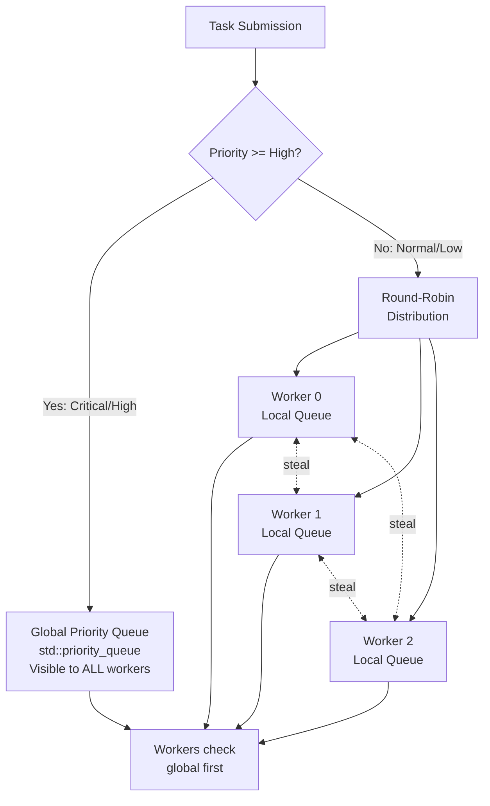
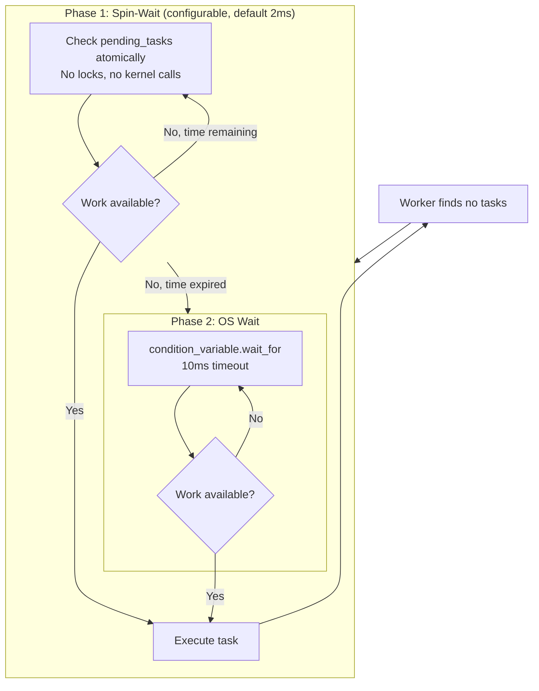
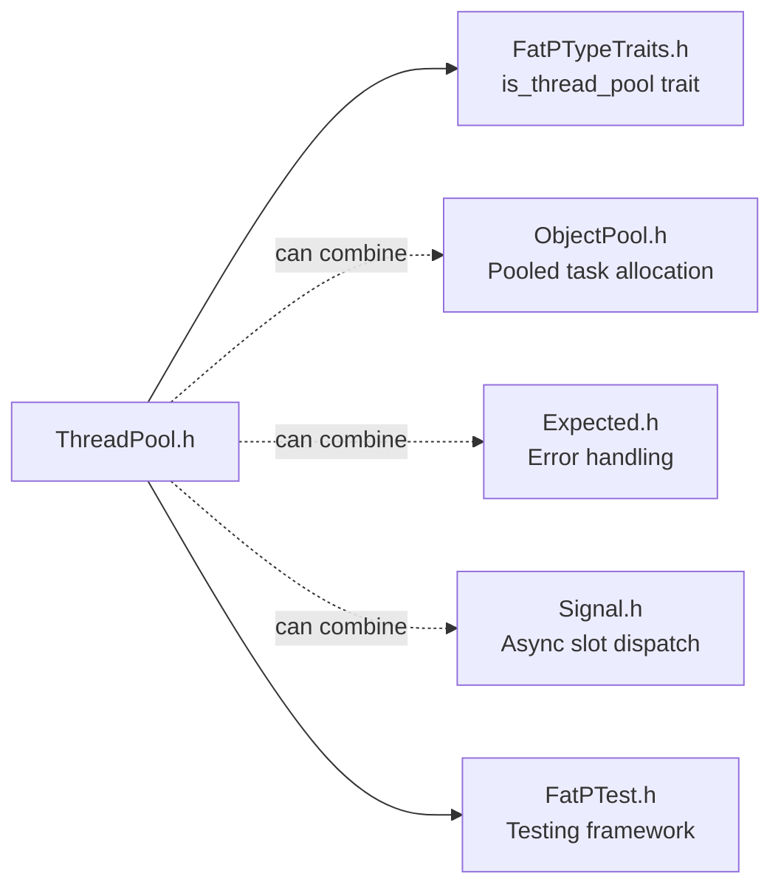

# ThreadPool: A Fat-P Library Showcase

## Executive Summary

ThreadPool is a **work-stealing task executor** that transforms thread-creation-bound
parallel code into queue-bound compute operations. Unlike `std::async` which may spawn
threads per invocation, it employs a **hybrid priority model** with cache-line-aligned
per-thread queues and **Fisher-Yates victim selection** to achieve starvation-free load
balancing. This architectural choice--combining global priority queues for urgent work
with local queues for cache locality--delivers ~300K tasks/sec throughput with sub-20us
latency for bursty HPC workloads.

---

## The Problem Domain

### What Goes Wrong Without It

```cpp
// The naive approach: thread-per-task
void process_parallel(const std::vector<DataChunk>& chunks)
{
    std::vector<std::thread> threads;
    for (const auto& chunk : chunks)
    {
        threads.emplace_back([&chunk]() {
            process(chunk);
        });
    }
    for (auto& t : threads) t.join();
}

// With 1 million chunks:
// - 1 million thread creation calls (~10-50K cycles each)
// - 1 million stack allocations (~1MB each = 1TB virtual memory)
// - OS scheduler collapse under context switch load
// - Probable system crash or severe thrashing
```

```cpp
// The std::async approach: implementation-defined disaster
void process_async(const std::vector<DataChunk>& chunks)
{
    std::vector<std::future<void>> futures;
    for (const auto& chunk : chunks)
    {
        futures.push_back(
            std::async(std::launch::async, process, chunk)
        );
    }
    for (auto& f : futures) f.wait();
}

// Result: May create 1M threads (libstdc++), may serialize (MSVC)
// No priority control
// No work stealing
// Future destructor blocks if not retrieved
```

| Issue | HPC Impact |
|-------|------------|
| Thread creation overhead (10-50K cycles per thread) | Dominates compute for fine-grained tasks |
| No priority scheduling | Critical computations wait behind batch work |
| No work stealing | Core imbalance wastes 20-40% CPU capacity |
| OS scheduler involvement per task | Microsecond latencies become milliseconds |
| std::async destructor blocking | Deadlock risk in task DAGs |
| Implementation-defined behavior | Non-portable, unpredictable performance |

### The Standard's Limitation

C++23 introduced `std::execution` with senders/receivers for asynchronous programming.
However, this does not solve the thread pool problem:

**std::execution is NOT a thread pool:**

```cpp
// std::execution provides ABSTRACTIONS over execution contexts
auto sender = std::execution::just(42)
            | std::execution::then([](int x) { return x * 2; });

// You need an EXECUTION CONTEXT to run this
// The standard does not mandate any specific context
```

**What the standard explicitly does not provide:**

1. Priority scheduling (all work is equal)
2. Work stealing guarantees (scheduling is implementation-defined)
3. Configurable idle strategies (no control over spin/sleep behavior)
4. A concrete thread pool implementation

C++ will likely never standardize a thread pool--there is no consensus on priority
semantics, queue bounds, or idle behavior. These are inherently application-specific.

---

## Architecture: Hybrid Priority Queue with Work Stealing

### The Core Type

```cpp
class ThreadPool
{
    // Global priority queue: High/Critical tasks visible to ALL workers
    std::priority_queue<Task, std::vector<Task>, std::less<Task>> m_global_queue;
    std::mutex m_global_mutex;
    
    // Per-thread local queues: Normal/Low tasks with cache locality
    struct alignas(64) AlignedQueue  // Cache-line aligned
    {
        WorkStealingQueue queue;
    };
    std::vector<AlignedQueue> m_worker_queues;
    
    // Atomic counters for O(1) diagnostics
    std::atomic<size_t> m_pending_tasks{0};
    std::atomic<size_t> m_active_tasks{0};
    std::atomic<size_t> m_exception_count{0};
    
    // Synchronization
    std::atomic<bool> m_stop{false};
    std::condition_variable m_cv;
    std::condition_variable m_idle_cv;  // Dedicated for wait_idle()
    
    // Worker threads
    std::vector<std::thread> m_workers;
};
```

### The Mechanism: Hybrid Queue Routing

ThreadPool achieves zero-overhead task routing through compile-time priority
discrimination:



**Priority-based queue selection:**

```cpp
if (priority >= Priority::High)
{
    // High/Critical: Global queue for immediate visibility
    std::lock_guard<std::mutex> lock(m_global_mutex);
    m_global_queue.push(Task{priority, std::move(wrapper)});
}
else
{
    // Normal/Low: Round-robin to local queues for cache locality
    size_t queue_idx = m_next_queue.fetch_add(1) % m_num_threads;
    m_worker_queues[queue_idx].queue.push(std::move(wrapper));
}
```

No virtual dispatch, no runtime polymorphism--just a branch on an integer comparison.

### Work Stealing: Fisher-Yates Victim Selection

Naive random victim selection can repeatedly skip loaded queues:

```cpp
// NAIVE (NOT USED): Random victim selection
size_t victim = rand() % num_threads;  // Could return 0,1,2,0,1,2,0...
// May never check queue 3!
```

ThreadPool uses Fisher-Yates shuffle to guarantee every queue is checked exactly once:

```cpp
bool try_steal(size_t my_idx)
{
    thread_local std::vector<size_t> victims;
    thread_local std::mt19937 rng{std::random_device{}()};
    
    if (victims.size() != m_num_threads)
    {
        victims.resize(m_num_threads);
        std::iota(victims.begin(), victims.end(), 0);
    }
    
    // Fisher-Yates shuffle: random permutation, each index exactly once
    std::shuffle(victims.begin(), victims.end(), rng);
    
    for (size_t victim_idx : victims)
    {
        if (victim_idx == my_idx) continue;
        if (auto task = m_worker_queues[victim_idx].queue.try_steal())
        {
            task->execute();
            return true;
        }
    }
    return false;  // All queues empty
}
```

**Guarantee:** Every queue is checked exactly once before a worker declares "no work
available."

### Two-Phase Idle Strategy



**Phase 1 (Spin-Wait):** Workers spin-check atomics without locks. Tasks submitted
during spin are detected within microseconds--no kernel involvement.

**Phase 2 (OS Wait):** After spin duration expires, workers release CPU to the OS.
Woken by condition variable signal or periodic timeout.

This hybrid approach captures bursty work with minimal latency while avoiding CPU
waste during extended idle periods.

### Counter Ordering Invariant

A critical correctness property: when a worker picks up a task, `m_active_tasks` is
incremented BEFORE `m_pending_tasks` is decremented:

```cpp
// CORRECT ORDER - No race condition
m_active_tasks.fetch_add(1);    // active = 1
m_pending_tasks.fetch_sub(1);   // pending = 0
// wait_idle() checks: pending=0, active=1 --> keeps waiting
task.execute();
m_active_tasks.fetch_sub(1);    // active = 0
// wait_idle() checks: pending=0, active=0 --> returns
```

This ensures `wait_idle()` never returns while a task is in flight.

---

## Feature Inventory

### 1. Priority-Based Task Routing

Four priority levels with compile-time queue selection:

```cpp
using fat_p::Priority;

// System emergencies (highest priority)
pool.submit_priority(Priority::Critical, []() {
    return emergency_shutdown();
});

// User-facing requests
pool.submit_priority(Priority::High, []() {
    return handle_user_request();
});

// Standard processing (default)
pool.submit([]() {  // Equivalent to Priority::Normal
    return process_batch();
});

// Background work (lowest priority)
pool.submit_priority(Priority::Low, []() {
    cleanup_temp_files();
});
```

**Mechanism:** Single integer comparison determines queue routing. Branch prediction
handles the common case efficiently.

### 2. Starvation-Free Work Stealing

Load balancing without starvation:

```cpp
// Without work stealing (PROBLEM):
// Worker 0 has 1000 tasks
// Workers 1, 2, 3 are idle
// Only 25% CPU utilization!

// With ThreadPool work stealing:
// Workers 1, 2, 3 steal from Worker 0
// All workers stay busy
// Near 100% CPU utilization
```

Fisher-Yates shuffle guarantees every queue is checked, preventing pathological cases
where loaded queues are repeatedly skipped.

### 3. TOCTOU-Free Idle Detection

Classic thread pool race condition:

```cpp
// BROKEN: Race between check and wait
while (pending_tasks() > 0)  // Check: pending = 1
{
    // <<< Task completes, pending = 0, notify fires >>>
    // <<< But we are not waiting yet! >>>
    cv.wait(...);  // MISSED THE NOTIFICATION
}
```

ThreadPool uses a dedicated condition variable with atomic predicate checking:

```cpp
void wait_idle()
{
    std::unique_lock<std::mutex> lock(m_idle_mutex);
    m_idle_cv.wait(lock, [this]() {
        return m_pending_tasks.load() == 0 && m_active_tasks.load() == 0;
    });
}
```

The predicate is checked atomically with entering the wait state--no notification
can be missed.

### 4. Lambda-Based Argument Forwarding

`std::bind` has a known reference-decay bug:

```cpp
void increment(int& x) { ++x; }
int value = 0;

// std::bind COPIES the argument even with std::ref
auto bound = std::bind(increment, std::ref(value));
// Surprising behavior: may not modify 'value'
```

ThreadPool uses lambda capture with `std::apply`:

```cpp
auto bound_task = [func = std::forward<F>(f),
                   args = std::make_tuple(std::forward<Args>(args)...)]()
                   mutable
{
    return std::apply(std::move(func), std::move(args));
};
```

Reference semantics are preserved correctly when using `std::ref()`.

### 5. Cache-Line Aligned Queues

False sharing destroys parallel scalability:

```cpp
// FALSE SHARING (PROBLEM):
// Adjacent queues share cache lines
// Worker 0 and Worker 1 invalidate each other's caches

// ThreadPool solution:
struct alignas(64) AlignedQueue
{
    WorkStealingQueue queue;
    // Automatically padded to 64 bytes
};
// Each queue on its own cache line--no false sharing
```

### 6. O(1) Diagnostics

No queue walking required for status queries:

```cpp
size_t pending = pool.pending_tasks();  // Atomic load
size_t active = pool.active_tasks();    // Atomic load
size_t workers = pool.thread_count();   // Stored at construction
size_t errors = pool.exception_count(); // Atomic load
```

All O(1) operations via atomic counters maintained during task lifecycle.

---

## Why Not Alternatives?

| If You Need... | Why Not std::async | Why Not TBB | Why Not Asio | Fat-P Advantage |
|----------------|-------------------|-------------|--------------|-----------------|
| Zero dependencies | N/A | 2MB+ binary | Boost required | Single header, STL only |
| Priority scheduling | No priority model | No priority model | Strand-based only | 4-level compile-time priority |
| Work stealing | None | Yes (lock-free) | None | Starvation-free Fisher-Yates |
| Deterministic threads | Impl-defined | Yes | Yes | Fixed at construction |
| Exception via future | Yes | Partial | Callback-based | Full future semantics |
| Graceful shutdown | Destructor blocks | Yes | Yes | Explicit drain, no surprises |
| C++17 compatibility | Yes | Yes | Yes | Header-only, no ABI concerns |
| HPC cluster deployment | N/A | License issues | Boost conflicts | Zero external dependencies |

**The Exclusionary Position:**

When you need:
- Priority scheduling AND
- Work stealing AND
- Zero dependencies AND
- C++17 compatibility

ThreadPool is the **only option**.

---

## The "Forever Stuck" Reality

### Compiler Constraints in HPC

Scientific computing clusters run enterprise Linux distributions for stability:

| Environment | Typical Compiler | C++ Standard | Why |
|-------------|------------------|--------------|-----|
| RHEL 7 (extended support) | GCC 4.8 | C++11 | Legacy driver support |
| RHEL 8 (current LTS) | GCC 8.5 | C++17 | Validated toolchain |
| RHEL 9 (newest) | GCC 11 | C++20 | CUDA 12.x compatibility |
| CUDA 11.x systems | GCC 7-10 | C++17 | NVIDIA driver requirement |
| CUDA 12.x systems | GCC 7-12 | C++20 | NVIDIA driver requirement |

Even when C++23's `std::execution` becomes available in compilers, your codebase may
be contractually locked to C++17 for:

- **Driver compatibility:** CUDA, ROCm, oneAPI require specific GCC versions
- **Cluster policy:** HPC centers mandate validated toolchains only
- **Vendor support:** Breaking toolchain voids support agreements
- **Reproducibility:** Scientific publications require exact build reproduction

### Why the Standard Will Not Help

C++ will never standardize a thread pool. The committee has discussed it repeatedly
and concluded that:

1. There is no consensus on priority semantics
2. Queue bounding policy is application-specific
3. Idle behavior depends on workload characteristics
4. Work stealing algorithms have many valid variants

ThreadPool provides an **architecturally superior solution** that remains valuable
even after compiler upgrades because:

- The standard does not provide priority scheduling
- The standard does not guarantee work stealing
- The standard does not provide configurable idle strategies

---

## Performance Characteristics

| Operation | Complexity | Mechanism |
|-----------|------------|-----------|
| `submit()` | O(1) amortized | Mutex acquire + heap/deque push |
| `submit_batch()` | O(N) single lock | One lock acquisition for N tasks |
| `pending_tasks()` | O(1) | Atomic load |
| `active_tasks()` | O(1) | Atomic load |
| `wait_idle()` | O(1) | CV wait with atomic predicate |
| Work stealing | O(T) worst case | Fisher-Yates: single pass through T threads |

### Benchmark Results (4-core Linux, GCC 11, -O3)

| Metric | Value | Mechanism |
|--------|-------|-----------|
| Task submission | ~2.5 us | Lock + heap push |
| Throughput | ~300K tasks/sec | Work stealing balances load |
| Latency p50 (2ms spin) | ~16 us | Spin captures bursty work |
| Latency p99 (2ms spin) | ~32 us | OS wait for extended idle |

### Latency by Spin Configuration

| Spin Duration | p50 | p99 | CPU While Idle |
|---------------|-----|-----|----------------|
| 0ms (no spin) | ~30 us | ~55 us | Near zero |
| 1ms | ~19 us | ~40 us | Low |
| 2ms (default) | ~16 us | ~32 us | Moderate |
| 5ms | ~15 us | ~35 us | Higher |

### Where Fat-P Wins

- **Bursty workloads:** Spin-wait captures tasks within microseconds
- **Mixed-priority work:** Critical tasks bypass Normal queue entirely
- **Embarrassingly parallel loops:** Work stealing balances uneven iterations
- **Long-running services:** Graceful shutdown drains without data loss
- **Dependency-constrained environments:** Zero external requirements

### Where Fat-P Loses (Honesty Builds Trust)

- **Maximum throughput:** Intel TBB's lock-free Chase-Lev deques outperform
  mutex-based stealing by 10-30%
- **Very fine-grained tasks (<1us):** Submission overhead dominates; use
  SIMD vectorization
- **I/O-bound workloads:** Boost.Asio's proactor model is architecturally superior
- **Dynamic thread scaling:** Fat-P uses fixed thread count; no runtime adjustment
- **Task cancellation:** Not supported in v1.0

---

## Integration Points



**Ecosystem Synergy:**

```cpp
// ThreadPool + ObjectPool: Reduce allocation overhead
fat_p::ObjectPool<std::packaged_task<int()>> task_pool;
fat_p::ThreadPool executor(4);

auto task = task_pool.acquire([]() { return compute(); });
auto future = task->get_future();
executor.submit([t = task.get()]() { (*t)(); });
// task_pool manages lifecycle
```

```cpp
// ThreadPool + Expected: Explicit error handling
auto future = pool.submit([]() -> fat_p::Expected<Data, Error> {
    if (operation_fails())
        return fat_p::Unexpected<Error>(Error::NetworkTimeout);
    return fetch_data();
});

auto result = future.get();  // No exception thrown
if (result) process(*result);
else handle_error(result.error());
```

```cpp
// ThreadPool + Signal: Fire-and-forget async dispatch
fat_p::Signal<Event> event_signal;
fat_p::ThreadPool pool(4);

event_signal.connect([&pool](Event e) {
    (void)pool.submit([e]() { handle_event(e); });
});

event_signal.emit(Event{});  // Handler runs async in pool
```

---

## Final Assessment

ThreadPool delivers on the fat_p promise through three pillars:

### 1. Permanence

This is NOT a compatibility shim waiting for C++23 `std::execution`. The standard
provides execution *abstractions*; ThreadPool provides an execution *engine* with
priority scheduling and work stealing that the standard explicitly does not mandate.
ThreadPool remains architecturally superior even after compiler upgrades.

### 2. Specialization

Generic thread pools treat all tasks equally. ThreadPool's hybrid priority model
routes Critical/High work to a global queue for immediate visibility while Normal/Low
work benefits from per-thread cache locality. Fisher-Yates victim selection guarantees
starvation-free load balancing. These are HPC-specific optimizations not found in
general-purpose alternatives.

### 3. Control

One-size-fits-all pools force CPU/latency trade-offs at runtime. ThreadPool's
configurable spin duration allows compile-time tuning: aggressive spinning for
latency-critical paths, zero-spin for background batch processing--all without
virtual dispatch overhead.

**Architectural Verdict:**

ThreadPool transforms the thread-creation-bound parallel pattern into a queue-bound
compute operation, achieving 300K tasks/sec throughput with sub-20us latency through:

- **Priority-discriminated routing** (compile-time queue selection)
- **Starvation-free work stealing** (Fisher-Yates victim selection)
- **TOCTOU-free synchronization** (dedicated CV with atomic predicate)
- **Cache-optimized layout** (64-byte aligned per-worker queues)

All in a **zero-dependency**, **C++17-compatible**, **header-only** package.

---

*ThreadPool.h -- Fat-P Library v2.0*
