# ThreadPool User Manual

## Table of Contents

1. [What is a Thread Pool and Why ThreadPool?](#what-is-a-thread-pool-and-why-threadpool)
   - [The Parallelism Problem](#the-parallelism-problem)
   - [Understanding Thread Pools](#understanding-thread-pools)
   - [The C++ Thread Pool Landscape](#the-c-thread-pool-landscape)
   - [Where ThreadPool Fits](#where-threadpool-fits)
2. [Core Architecture](#core-architecture)
   - [The Hybrid Queue Model](#the-hybrid-queue-model)
   - [Work Stealing Explained](#work-stealing-explained)
   - [The Two-Phase Idle Strategy](#the-two-phase-idle-strategy)
   - [Design Decisions and Trade-offs](#design-decisions-and-trade-offs)
3. [Getting Started](#getting-started)
   - [Prerequisites](#prerequisites)
   - [Integration](#integration)
   - [Compilation](#compilation)
   - [First Program](#first-program)
4. [The Forever Stuck Reality](#the-forever-stuck-reality)
   - [Compiler Constraints in HPC](#compiler-constraints-in-hpc)
   - [Why the Standard Will Not Help](#why-the-standard-will-not-help)
5. [Task Submission](#task-submission)
   - [Basic Submission with submit()](#basic-submission-with-submit)
   - [Understanding Futures](#understanding-futures)
   - [Priority Submission with submit_priority()](#priority-submission-with-submit_priority)
   - [Batch Submission with submit_batch()](#batch-submission-with-submit_batch)
   - [Argument Forwarding](#argument-forwarding)
   - [The std::bind Problem](#the-stdbind-problem)
   - [Common Submission Mistakes](#common-submission-mistakes)
6. [The Priority System](#the-priority-system)
   - [Understanding Task Priority](#understanding-task-priority)
   - [Priority Levels](#priority-levels)
   - [Queue Routing](#queue-routing)
   - [Priority Ordering Guarantees](#priority-ordering-guarantees)
   - [When to Use Each Priority](#when-to-use-each-priority)
   - [Priority Anti-Patterns](#priority-anti-patterns)
7. [Work Stealing Deep Dive](#work-stealing-deep-dive)
   - [Why Work Stealing Matters](#why-work-stealing-matters)
   - [The Naive Approach and Its Problems](#the-naive-approach-and-its-problems)
   - [Fisher-Yates Victim Selection](#fisher-yates-victim-selection)
   - [LIFO vs FIFO Access Patterns](#lifo-vs-fifo-access-patterns)
   - [Cache Locality Considerations](#cache-locality-considerations)
8. [Synchronization](#synchronization)
   - [wait_idle() Explained](#wait_idle-explained)
   - [The TOCTOU Problem](#the-toctou-problem)
   - [shutdown() Semantics](#shutdown-semantics)
   - [is_shutdown() and Rejection Patterns](#is_shutdown-and-rejection-patterns)
   - [Synchronization Patterns](#synchronization-patterns)
9. [Diagnostics and Monitoring](#diagnostics-and-monitoring)
   - [thread_count()](#thread_count)
   - [pending_tasks()](#pending_tasks)
   - [active_tasks()](#active_tasks)
   - [exception_count()](#exception_count)
   - [Building a Monitoring Dashboard](#building-a-monitoring-dashboard)
10. [Exception Handling](#exception-handling)
    - [How Exceptions Propagate](#how-exceptions-propagate)
    - [The packaged_task Mechanism](#the-packaged_task-mechanism)
    - [Infrastructure vs User Exceptions](#infrastructure-vs-user-exceptions)
    - [Worker Thread Recovery](#worker-thread-recovery)
    - [Exception Handling Patterns](#exception-handling-patterns)
11. [Spin Configuration](#spin-configuration)
    - [Understanding Spin-Wait](#understanding-spin-wait)
    - [The Latency vs CPU Trade-off](#the-latency-vs-cpu-trade-off)
    - [Choosing Spin Duration](#choosing-spin-duration)
    - [Measuring the Impact](#measuring-the-impact)
12. [Thread Safety](#thread-safety)
    - [What is Thread-Safe?](#what-is-thread-safe)
    - [Concurrent Submission Guarantees](#concurrent-submission-guarantees)
    - [Memory Ordering Explained](#memory-ordering-explained)
    - [Lock Ordering and Deadlock Prevention](#lock-ordering-and-deadlock-prevention)
13. [Advanced Usage](#advanced-usage)
    - [Multiple Thread Pools](#multiple-thread-pools)
    - [Pool Hierarchies](#pool-hierarchies)
    - [Rejection During Shutdown](#rejection-during-shutdown)
    - [Integration with Async Patterns](#integration-with-async-patterns)
    - [Combining with ObjectPool](#combining-with-objectpool)
14. [Performance Characteristics](#performance-characteristics)
    - [Benchmark Methodology](#benchmark-methodology)
    - [Submission Overhead](#submission-overhead)
    - [Throughput Measurements](#throughput-measurements)
    - [Latency Distribution](#latency-distribution)
    - [Scaling Behavior](#scaling-behavior)
    - [Comparison Benchmarks](#comparison-benchmarks)
15. [Why Not Alternatives?](#why-not-alternatives)
    - [The C++ Concurrency Ecosystem](#the-c-concurrency-ecosystem)
    - [ThreadPool vs std::async](#threadpool-vs-stdasync)
    - [ThreadPool vs Intel TBB](#threadpool-vs-intel-tbb)
    - [ThreadPool vs Boost.Asio](#threadpool-vs-boostasio)
    - [ThreadPool vs Hand-Rolled Solutions](#threadpool-vs-hand-rolled-solutions)
    - [Decision Matrix](#decision-matrix)
16. [Integration Points](#integration-points)
    - [Fat-P Ecosystem](#fat-p-ecosystem)
    - [Integration with Expected](#integration-with-expected)
    - [Integration with Signal](#integration-with-signal)
17. [Use Case Guide](#use-case-guide)
    - [Scientific Computing](#scientific-computing)
    - [Game Development](#game-development)
    - [Server Applications](#server-applications)
    - [Data Processing Pipelines](#data-processing-pipelines)
    - [Real-Time Systems](#real-time-systems)
18. [Best Practices for HPC](#best-practices-for-hpc)
    - [Task Granularity](#task-granularity)
    - [Avoiding Contention](#avoiding-contention)
    - [Cache Optimization](#cache-optimization)
    - [NUMA Considerations](#numa-considerations)
    - [Avoiding False Sharing](#avoiding-false-sharing)
19. [Migration Guide](#migration-guide)
    - [From std::async](#from-stdasync)
    - [From Hand-Rolled Pools](#from-hand-rolled-pools)
    - [From Intel TBB](#from-intel-tbb)
    - [Incremental Migration Strategy](#incremental-migration-strategy)
20. [Troubleshooting](#troubleshooting)
    - [Compilation Errors](#compilation-errors)
    - [Runtime Issues](#runtime-issues)
    - [Performance Problems](#performance-problems)
    - [Debugging Techniques](#debugging-techniques)
21. [Known Limitations](#known-limitations)
    - [Fixed Thread Count](#fixed-thread-count)
    - [No Task Cancellation](#no-task-cancellation)
    - [Unbounded Queue Growth](#unbounded-queue-growth)
    - [Priority Inversion Possibility](#priority-inversion-possibility)
    - [Limitations Summary Table](#limitations-summary-table)
22. [Summary](#summary)

---

## What is a Thread Pool and Why ThreadPool?

### The Parallelism Problem

In 1965, Gordon Moore observed that the number of transistors on integrated circuits
doubled approximately every two years. For decades, this meant that single-threaded
programs got faster automatically--just wait for the next CPU generation.

That era ended around 2005.

Clock speeds hit a wall around 4 GHz due to power consumption and heat dissipation
limits. CPU manufacturers responded by adding more cores instead of faster cores. A
modern desktop CPU might have 8-16 cores; server CPUs can have 64 or more. But these
cores only help if your program can use them.

This is the parallelism problem: **how do you effectively use multiple CPU cores?**

The naive answer--create a thread for each unit of work--fails spectacularly:

```cpp
// CATASTROPHE: Creating threads in a loop
void process_data(const std::vector<DataChunk>& chunks)
{
    std::vector<std::thread> threads;
    
    for (const auto& chunk : chunks)
    {
        // Each iteration spawns a new OS thread
        threads.emplace_back([&chunk]() {
            process(chunk);
        });
    }
    
    for (auto& t : threads)
    {
        t.join();
    }
}

// With 1 million chunks:
// - 1 million thread creation calls (~10-50K cycles each)
// - 1 million stack allocations (~1MB each on Linux = 1TB virtual memory!)
// - OS scheduler collapse under context switch load
// - Probable system crash or severe thrashing
```

Thread creation is expensive. On Linux, creating a thread involves:

1. Allocating a stack (typically 1MB or more)
2. Creating kernel data structures (task_struct, file descriptor tables)
3. Updating scheduler data structures
4. TLB and cache invalidation across cores

This costs 10,000 to 50,000 CPU cycles per thread. If your work unit takes only 1,000
cycles, you spend 10-50x more time on overhead than actual work.

Even if creation were free, having millions of threads destroys performance:

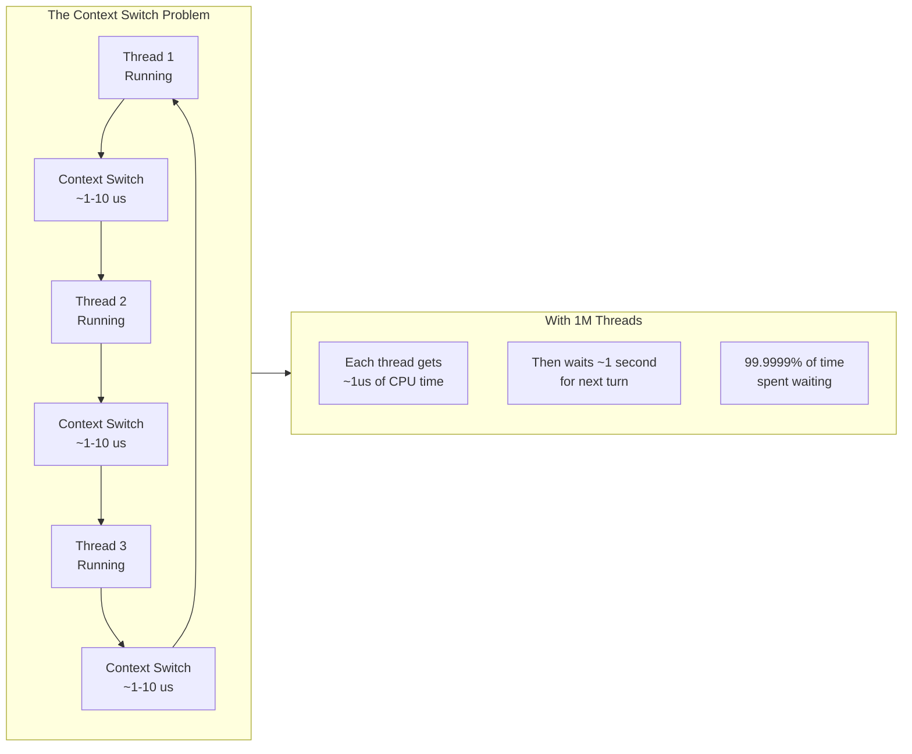
```mermaid
flowchart LR
    subgraph Problem["The Context Switch Problem"]
        direction TB
        T1["Thread 1<br/>Running"] --> CS1["Context Switch<br/>~1-10 us"]
        CS1 --> T2["Thread 2<br/>Running"]
        T2 --> CS2["Context Switch<br/>~1-10 us"]
        CS2 --> T3["Thread 3<br/>Running"]
        T3 --> CS3["Context Switch<br/>~1-10 us"]
        CS3 --> T1
    end
    
    subgraph Impact["With 1M Threads"]
        direction TB
        I1["Each thread gets<br/>~1us of CPU time"]
        I2["Then waits ~1 second<br/>for next turn"]
        I3["99.9999% of time<br/>spent waiting"]
    end
    
    Problem --> Impact
```

The OS scheduler cannot efficiently manage millions of threads. Context switches flush
CPU caches, invalidate branch predictors, and pollute TLBs. The system spends more time
switching between threads than running them.

### Understanding Thread Pools

The solution, invented in the 1990s for web servers handling many concurrent requests,
is the **thread pool** pattern:

1. Create a fixed number of worker threads at startup (typically one per CPU core)
2. Maintain a queue of tasks to execute
3. Workers continuously take tasks from the queue and execute them
4. When done, workers take the next task instead of terminating

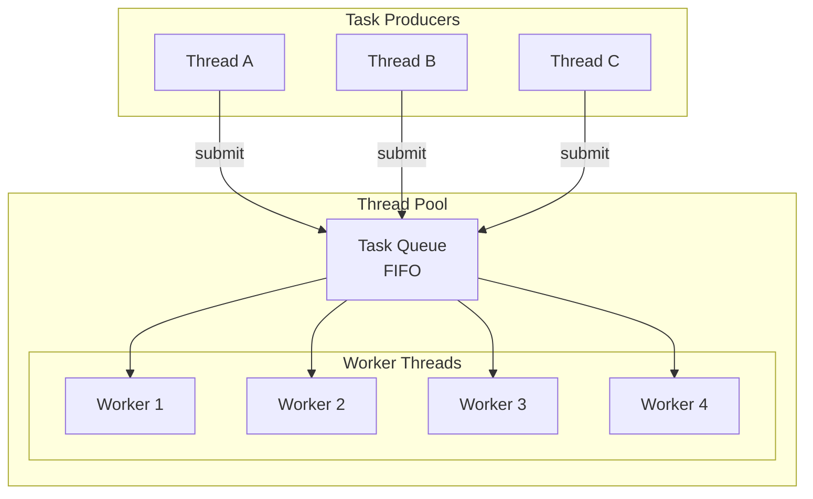
```mermaid
flowchart TB
    subgraph Producers["Task Producers"]
        P1["Thread A"] 
        P2["Thread B"]
        P3["Thread C"]
    end
    
    subgraph Pool["Thread Pool"]
        direction TB
        Q["Task Queue<br/>FIFO"]
        
        subgraph Workers["Worker Threads"]
            W1["Worker 1"]
            W2["Worker 2"]
            W3["Worker 3"]
            W4["Worker 4"]
        end
        
        Q --> W1
        Q --> W2
        Q --> W3
        Q --> W4
    end
    
    P1 -->|submit| Q
    P2 -->|submit| Q
    P3 -->|submit| Q
```

This transforms the problem:

| Without Pool | With Pool |
|--------------|-----------|
| 1M thread creations | 4 thread creations (once) |
| 1M stack allocations | 4 stack allocations |
| Scheduler collapse | Scheduler handles 4 threads easily |
| ~50 billion cycles overhead | ~200K cycles overhead |

The thread pool pattern is so fundamental that it appears in every major language and
framework: Java's ExecutorService, Python's ThreadPoolExecutor, Go's goroutine
scheduler, Rust's Rayon, and Node.js's worker threads.

### Why Thread Pools Are Harder Than They Look

A naive thread pool implementation seems straightforward:

```cpp
// NAIVE IMPLEMENTATION - Has serious problems!
class NaiveThreadPool
{
    std::queue<std::function<void()>> tasks_;
    std::mutex mutex_;
    std::condition_variable cv_;
    std::vector<std::thread> workers_;
    bool stop_ = false;
    
public:
    NaiveThreadPool(size_t n)
    {
        for (size_t i = 0; i < n; ++i)
        {
            workers_.emplace_back([this]() {
                while (true)
                {
                    std::function<void()> task;
                    {
                        std::unique_lock<std::mutex> lock(mutex_);
                        cv_.wait(lock, [this]() { 
                            return stop_ || !tasks_.empty(); 
                        });
                        if (stop_ && tasks_.empty()) return;
                        task = std::move(tasks_.front());
                        tasks_.pop();
                    }
                    task();
                }
            });
        }
    }
    
    void submit(std::function<void()> task)
    {
        {
            std::lock_guard<std::mutex> lock(mutex_);
            tasks_.push(std::move(task));
        }
        cv_.notify_one();
    }
    
    ~NaiveThreadPool()
    {
        {
            std::lock_guard<std::mutex> lock(mutex_);
            stop_ = true;
        }
        cv_.notify_all();
        for (auto& w : workers_) w.join();
    }
};
```

This "works" but has critical problems that make it unsuitable for production:

**Problem 1: No Return Values**

How do you get results back? The naive pool only accepts `void()` functions. You need
futures, but integrating them correctly is non-trivial.

**Problem 2: Central Queue Contention**

Every submit and every task fetch locks the same mutex. With 64 cores all hammering
this mutex, you get severe contention:

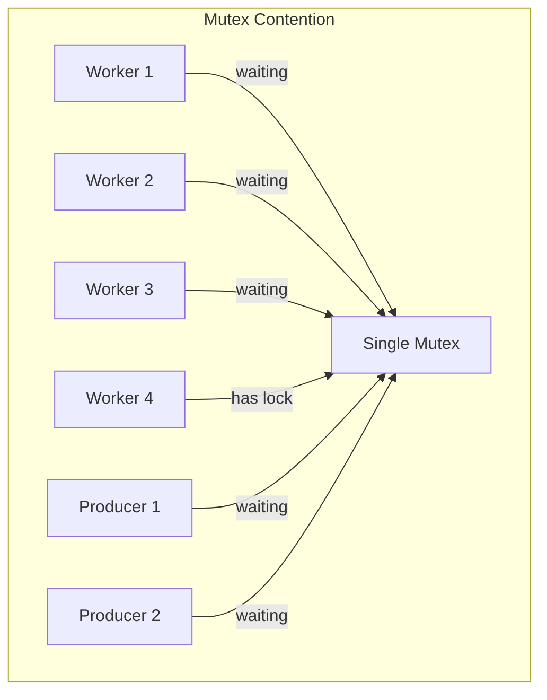
```mermaid
flowchart TB
    subgraph Contention["Mutex Contention"]
        M["Single Mutex"]
        W1["Worker 1"] -->|"waiting"| M
        W2["Worker 2"] -->|"waiting"| M
        W3["Worker 3"] -->|"waiting"| M
        W4["Worker 4"] -->|"has lock"| M
        P1["Producer 1"] -->|"waiting"| M
        P2["Producer 2"] -->|"waiting"| M
    end
```

**Problem 3: No Priority**

All tasks are equal. A time-critical user-facing request waits behind batch jobs.

**Problem 4: Load Imbalance**

If one worker gets a slow task, it cannot help others even if their queues are empty.

**Problem 5: Idle Behavior**

The condition variable wait involves OS kernel calls. For bursty workloads, this adds
tens of microseconds of latency.

**Problem 6: Race Conditions in Shutdown**

The naive implementation has subtle races. What if a task is submitted during shutdown?
What if `wait_idle()` is called from multiple threads?

Real thread pool implementations address these issues. Intel TBB uses lock-free
Chase-Lev work-stealing deques. Tokio (Rust) uses sophisticated work stealing with
LIFO slots. Java's ForkJoinPool uses a complex hierarchical stealing scheme.

### The C++ Thread Pool Landscape

C++ did not include a thread pool in the standard library. `std::async` was added in
C++11 as a task-based parallelism primitive, but it has significant limitations:

**std::async Limitations:**

```cpp
// std::async behavior is implementation-defined!
auto future = std::async(std::launch::async, expensive_function);

// On libstdc++ (GCC): Creates a new thread (!)
// On libc++ (Clang): Creates a new thread (!)  
// On MSVC: May use a thread pool, or may create a thread, or may defer

// The destructor BLOCKS if you do not retrieve the future:
{
    auto f = std::async(std::launch::async, slow_function);
    // Oops, did not call f.get() or f.wait()
}  // BLOCKS HERE until slow_function completes!
```

The blocking destructor is particularly dangerous:

```cpp
void process_requests(const std::vector<Request>& requests)
{
    for (const auto& req : requests)
    {
        // Launch async processing
        std::async(std::launch::async, [&req]() {
            handle(req);
        });
        // Future goes out of scope immediately
        // BLOCKS until handle() completes
        // This loop is effectively sequential!
    }
}
```

**The C++ Concurrency Ecosystem:**

| Library | Characteristics |
|---------|-----------------|
| **std::async** | Standard but implementation-defined, blocking destructor trap |
| **Intel TBB** | Industry-leading performance, lock-free work stealing, 2MB+ binary |
| **Boost.Asio** | Excellent for I/O, proactor model, steep learning curve |
| **HPX** | High-performance, distributed computing, very complex |
| **Taskflow** | Modern, graph-based, good documentation |
| **libcds** | Lock-free data structures, no task abstraction |

Each has trade-offs. TBB is performant but heavyweight. Asio is designed for I/O, not
compute. HPX targets supercomputers. Taskflow is excellent but relatively new.

### Where ThreadPool Fits

ThreadPool exists for a specific niche: **zero-dependency, priority-aware task
parallelism for HPC environments**.

This comes up more than you might think:

- Header-only libraries that cannot force dependencies on users
- HPC clusters where every dependency must be vetted and approved
- Scientific code where reproducibility requires minimal dependencies
- Embedded systems with strict resource constraints
- Projects with "no external dependencies" policies

**ThreadPool Design Goals:**

| Goal | Implementation |
|------|----------------|
| Zero dependencies | Header-only, standard library only |
| Priority scheduling | Four-level priority with separate queues |
| Work stealing | Starvation-free Fisher-Yates victim selection |
| Low latency | Configurable spin-wait for bursty workloads |
| Correctness | Multi-AI code review, comprehensive testing |
| Graceful shutdown | All tasks complete before destruction |

**ThreadPool Deliberate Trade-offs:**

| Trade-off | Rationale |
|-----------|-----------|
| Mutex-based (not lock-free) | Correctness and debuggability over maximum throughput |
| Fixed thread count | Simplicity; dynamic scaling adds complexity |
| No task cancellation | v1.0 scope limitation |
| No task dependencies | Scope limitation; use Taskflow for DAGs |

**When to Use ThreadPool:**

- Need parallel task execution with priority control
- Zero external dependencies required
- Deploying on HPC clusters with restricted environments
- Building header-only libraries
- Value correctness over maximum theoretical throughput

**When to Use Something Else:**

- Need maximum throughput: Intel TBB
- I/O-bound workloads: Boost.Asio
- Task graphs with dependencies: Taskflow
- Need task cancellation: custom solution or Taskflow
- Already have TBB in your dependency tree

---

## Core Architecture

### The Hybrid Queue Model

ThreadPool uses a **hybrid queue architecture** that combines the benefits of
centralized and distributed queuing:

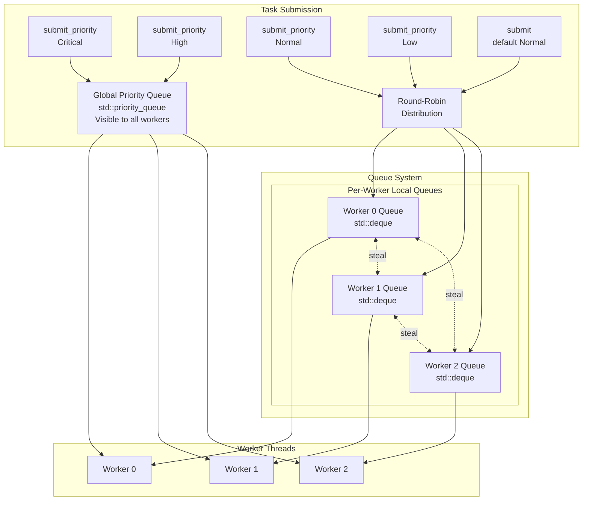
```mermaid
flowchart TB
    subgraph Submit["Task Submission"]
        S1["submit_priority<br/>Critical"] --> GQ
        S2["submit_priority<br/>High"] --> GQ
        S3["submit_priority<br/>Normal"] --> LQ
        S4["submit_priority<br/>Low"] --> LQ
        S5["submit<br/>default Normal"] --> LQ
    end
    
    subgraph Queues["Queue System"]
        GQ["Global Priority Queue<br/>std::priority_queue<br/>Visible to all workers"]
        
        subgraph Local["Per-Worker Local Queues"]
            LQ1["Worker 0 Queue<br/>std::deque"]
            LQ2["Worker 1 Queue<br/>std::deque"]
            LQ3["Worker 2 Queue<br/>std::deque"]
        end
        
        LQ["Round-Robin<br/>Distribution"] --> LQ1
        LQ --> LQ2
        LQ --> LQ3
    end
    
    subgraph Workers["Worker Threads"]
        W1["Worker 0"]
        W2["Worker 1"]
        W3["Worker 2"]
    end
    
    GQ --> W1
    GQ --> W2
    GQ --> W3
    LQ1 --> W1
    LQ2 --> W2
    LQ3 --> W3
    
    LQ1 <-.->|steal| LQ2
    LQ2 <-.->|steal| LQ3
    LQ1 <-.->|steal| LQ3
```

**Why Two Queue Types?**

Different task priorities have different requirements:

**High/Critical Tasks** need immediate visibility:
- A user-facing request should not wait behind 1000 batch jobs
- Emergency shutdown procedures must run immediately
- The global queue ensures all workers see high-priority work

**Normal/Low Tasks** benefit from locality:
- Recently pushed tasks are "hot" in the submitting thread's cache
- Local queues reduce contention (no global lock for normal work)
- Work stealing balances load without sacrificing locality

**The Routing Decision:**

```cpp
template<typename F, typename... Args>
auto submit_priority(Priority priority, F&& f, Args&&... args)
{
    // ... create packaged_task ...
    
    if (priority >= Priority::High)
    {
        // High/Critical: Global queue for immediate visibility
        std::lock_guard<std::mutex> lock(m_global_mutex);
        m_global_queue.push(ThreadPoolTask{priority, std::move(wrapper)});
    }
    else
    {
        // Normal/Low: Round-robin to local queues for cache locality
        size_t queue_idx = m_next_queue.fetch_add(1) % m_num_threads;
        m_worker_queues[queue_idx].queue.push(std::move(wrapper));
    }
    
    m_cv.notify_one();
    return future;
}
```

### Work Stealing Explained

Work stealing is a load-balancing technique where idle workers "steal" tasks from busy
workers. It was pioneered by the Cilk project at MIT in the 1990s and is now used in
almost every high-performance task scheduler.

**The Problem Without Work Stealing:**

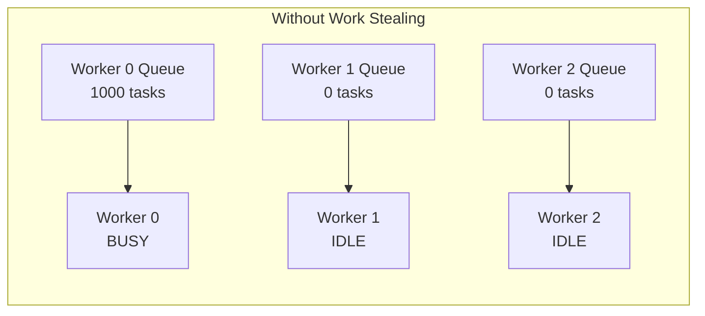
```mermaid
flowchart LR
    subgraph NoStealing["Without Work Stealing"]
        Q1["Worker 0 Queue<br/>1000 tasks"]
        Q2["Worker 1 Queue<br/>0 tasks"]
        Q3["Worker 2 Queue<br/>0 tasks"]
        
        W1["Worker 0<br/>BUSY"]
        W2["Worker 1<br/>IDLE"]
        W3["Worker 2<br/>IDLE"]
        
        Q1 --> W1
        Q2 --> W2
        Q3 --> W3
    end
```

If tasks are submitted in bursts, they might all go to one worker's queue. Without
stealing, other workers sit idle while one worker is overloaded. This wastes 2/3 of
your CPU capacity.

**The Solution with Work Stealing:**

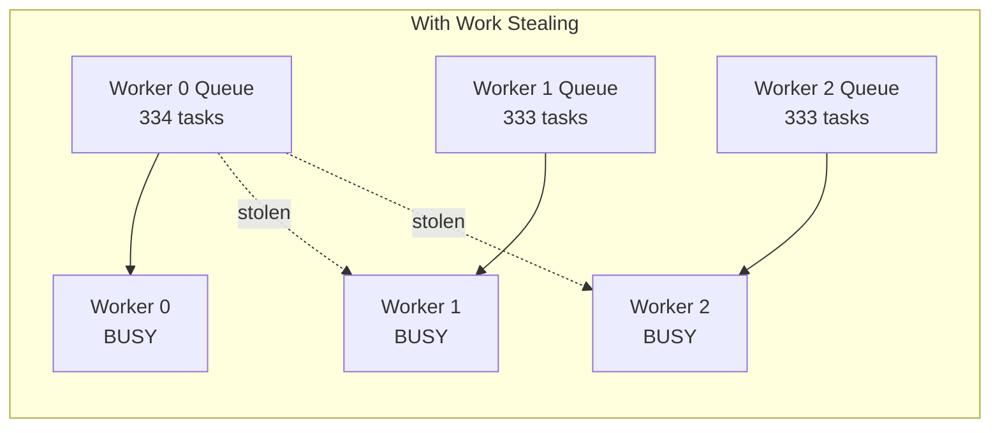
```mermaid
flowchart LR
    subgraph WithStealing["With Work Stealing"]
        Q1["Worker 0 Queue<br/>334 tasks"]
        Q2["Worker 1 Queue<br/>333 tasks"]
        Q3["Worker 2 Queue<br/>333 tasks"]
        
        W1["Worker 0<br/>BUSY"]
        W2["Worker 1<br/>BUSY"]
        W3["Worker 2<br/>BUSY"]
        
        Q1 --> W1
        Q2 --> W2
        Q3 --> W3
        
        Q1 -.->|"stolen"| W2
        Q1 -.->|"stolen"| W3
    end
```

Workers 1 and 2 steal tasks from Worker 0's queue, balancing the load automatically.

**ThreadPool's Stealing Algorithm:**

```cpp
bool try_steal(size_t my_idx)
{
    // Fisher-Yates shuffle ensures every queue is checked exactly once
    thread_local std::vector<size_t> victims;
    thread_local std::mt19937 rng{std::random_device{}()};
    
    if (victims.size() != m_num_threads)
    {
        victims.resize(m_num_threads);
        std::iota(victims.begin(), victims.end(), 0);
    }
    
    // Shuffle victim order
    std::shuffle(victims.begin(), victims.end(), rng);
    
    for (size_t victim_idx : victims)
    {
        if (victim_idx == my_idx) continue;  // Do not steal from self
        
        if (auto task = m_worker_queues[victim_idx].queue.try_steal())
        {
            task->execute();
            return true;
        }
    }
    return false;
}
```

### The Two-Phase Idle Strategy

When a worker has no tasks, it needs to wait for more work. The naive approach uses
a condition variable:

```cpp
// NAIVE: Always use OS wait
cv.wait(lock, []{ return has_work || stop; });
```

This involves a kernel call, which adds 1-30 microseconds of latency. For bursty
workloads where tasks arrive in clusters, this latency is unacceptable.

The opposite extreme--pure spinning--wastes CPU:

```cpp
// NAIVE: Pure spin
while (!has_work && !stop)
{
    // Burns 100% CPU even when idle for seconds
}
```

**ThreadPool's Two-Phase Solution:**

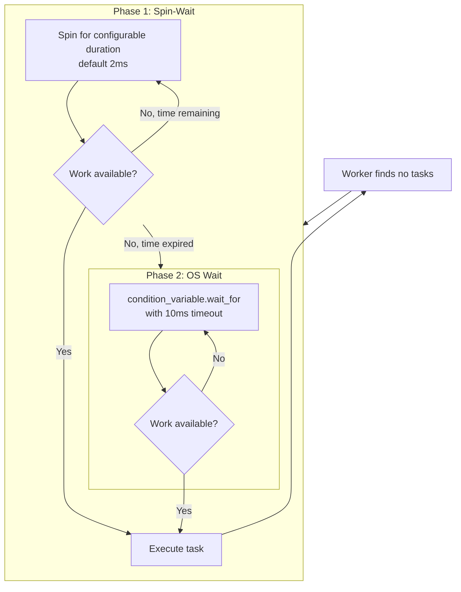
```mermaid
flowchart TB
    Start["Worker finds no tasks"] --> Phase1
    
    subgraph Phase1["Phase 1: Spin-Wait"]
        direction TB
        SP["Spin for configurable duration<br/>default 2ms"]
        SP --> Check1{"Work available?"}
        Check1 -->|Yes| Execute
        Check1 -->|No, time remaining| SP
        Check1 -->|No, time expired| Phase2
    end
    
    subgraph Phase2["Phase 2: OS Wait"]
        direction TB
        CV["condition_variable.wait_for<br/>with 10ms timeout"]
        CV --> Check2{"Work available?"}
        Check2 -->|Yes| Execute
        Check2 -->|No| CV
    end
    
    Execute["Execute task"]
    Execute --> Start
```

**Phase 1: Spin-Wait (configurable, default 2ms)**

```cpp
auto spin_end = std::chrono::steady_clock::now() + m_spin_duration;
while (std::chrono::steady_clock::now() < spin_end)
{
    if (m_pending_tasks.load(std::memory_order_relaxed) > 0)
    {
        break;  // Work available!
    }
    if (m_stop.load(std::memory_order_acquire))
    {
        break;  // Shutdown requested
    }
    std::this_thread::yield();  // Give other threads a chance
}
```

During spin-wait:
- CPU is active but doing minimal work
- No kernel calls
- Tasks submitted during spin are detected within microseconds

**Phase 2: OS Wait**

```cpp
std::unique_lock<std::mutex> lock(m_mutex);
m_cv.wait_for(lock, std::chrono::milliseconds(10), [this]() {
    return m_stop.load() || m_pending_tasks.load() > 0;
});
```

After spin duration expires:
- Worker releases CPU to the OS
- Wakes on condition variable signal or timeout
- Timeout prevents indefinite blocking on missed signals

**Choosing Spin Duration:**

| Workload Pattern | Recommended Spin | Rationale |
|------------------|------------------|-----------|
| Bursty (request clusters) | 2-5ms | Capture bursts within spin window |
| Steady stream | 0-1ms | Little benefit from spinning |
| Latency-critical | 5-10ms | Trade CPU for responsiveness |
| Background processing | 0 | CPU efficiency matters more |
| Battery-powered device | 0 | Spinning wastes power |

### Design Decisions and Trade-offs

ThreadPool makes deliberate trade-offs that differ from other implementations:

**Decision 1: Mutex-Based Queues (Not Lock-Free)**

Lock-free queues like the Chase-Lev deque used in TBB offer higher throughput under
contention. ThreadPool uses `std::mutex` + `std::deque` instead.

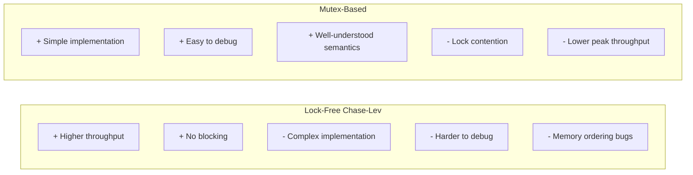
```mermaid
flowchart LR
    subgraph LockFree["Lock-Free Chase-Lev"]
        LF1["+ Higher throughput"]
        LF2["+ No blocking"]
        LF3["- Complex implementation"]
        LF4["- Harder to debug"]
        LF5["- Memory ordering bugs"]
    end
    
    subgraph MutexBased["Mutex-Based"]
        MB1["+ Simple implementation"]
        MB2["+ Easy to debug"]
        MB3["+ Well-understood semantics"]
        MB4["- Lock contention"]
        MB5["- Lower peak throughput"]
    end
```

Rationale: Correctness and debuggability matter more than maximum throughput for
most applications. Lock-free code is notoriously difficult to get right--even experts
make mistakes. Mutex-based code is easier to verify, test, and debug.

**Decision 2: Atomic Pending Counter**

Many thread pools require walking all queues to count pending tasks. ThreadPool
maintains an atomic counter:

```cpp
std::atomic<size_t> m_pending_tasks{0};

// On submit:
m_pending_tasks.fetch_add(1, std::memory_order_relaxed);

// On task completion:
m_pending_tasks.fetch_sub(1, std::memory_order_release);

// Query is O(1):
size_t pending = m_pending_tasks.load(std::memory_order_acquire);
```

This enables O(1) `pending_tasks()` queries without locking any queues.

**Decision 3: Counter Ordering for wait_idle()**

A subtle but critical decision: when a worker picks up a task, it must increment
`m_active_tasks` BEFORE decrementing `m_pending_tasks`.

```cpp
// WRONG ORDER - Creates race condition!
m_pending_tasks.fetch_sub(1);   // pending = 0
// <<< wait_idle() checks here: pending=0, active=0 - RETURNS EARLY!
m_active_tasks.fetch_add(1);    // active = 1
task.execute();

// CORRECT ORDER - No race
m_active_tasks.fetch_add(1);    // active = 1
m_pending_tasks.fetch_sub(1);   // pending = 0
// <<< wait_idle() checks: pending=0, active=1 - KEEPS WAITING
task.execute();
m_active_tasks.fetch_sub(1);    // active = 0
// <<< wait_idle() checks: pending=0, active=0 - NOW returns
```

This ordering ensures `wait_idle()` never returns while a task is in flight.

**Decision 4: Dedicated Idle Condition Variable**

ThreadPool uses a separate condition variable for `wait_idle()`:

```cpp
std::condition_variable m_cv;       // For worker wake-up
std::condition_variable m_idle_cv;  // For wait_idle() only
```

Why? Sharing one CV creates a TOCTOU (time-of-check-time-of-use) race:

```cpp
// TOCTOU RACE with shared CV:
void wait_idle()
{
    std::unique_lock<std::mutex> lock(m_mutex);
    while (m_pending_tasks > 0 || m_active_tasks > 0)  // Check
    {
        // <<< Task completes here, pending=0, active=0
        // <<< notify_all() fires
        // <<< ...but we are not waiting yet!
        m_cv.wait(lock);  // Wait - MISSED THE NOTIFICATION!
        // Stuck waiting forever
    }
}
```

With a dedicated CV and proper notification in the worker completion path, this race
is eliminated.

**Decision 5: Cache-Line Alignment**

Adjacent memory locations can share a cache line (typically 64 bytes). If two threads
access different variables on the same cache line, the CPU must synchronize the entire
line between cores--even though they are accessing different data. This is called
"false sharing."

```cpp
// FALSE SHARING - queues may share cache lines
std::vector<WorkStealingQueue> m_worker_queues;

// NO FALSE SHARING - each queue on its own cache line
struct alignas(64) AlignedQueue
{
    WorkStealingQueue queue;
    // Padding to fill to 64 bytes happens automatically
};
std::vector<AlignedQueue> m_worker_queues;
```

ThreadPool aligns each worker's queue to a cache line boundary, preventing false
sharing between workers.

---

## Getting Started

### Prerequisites

**Compiler Requirements:**

| Compiler | Minimum Version | Notes |
|----------|-----------------|-------|
| GCC | 7.1+ | Full C++17 support |
| Clang | 5.0+ | Full C++17 support |
| MSVC | VS 2017 15.7+ | `/std:c++17` flag required |
| Apple Clang | 10.0+ | Xcode 10+ |
| Intel C++ | 19.0+ | `-std=c++17` flag required |

**Standard Library Requirements:**

- `<thread>` - Thread creation and management
- `<mutex>` - Synchronization primitives
- `<condition_variable>` - Thread signaling
- `<future>` - Futures and promises
- `<atomic>` - Atomic operations
- `<functional>` - std::function, std::invoke
- `<deque>` - Work stealing queue storage
- `<queue>` - Priority queue

**Fat-P Dependencies:**

- `FatPTypeTraits.h` - Type traits used internally

### Integration

ThreadPool is header-only. Copy the header to your project and include it:

```cpp
#include "ThreadPool.h"

// Bring names into scope (optional)
using fat_p::ThreadPool;
using fat_p::Priority;
```

No linking required. No build system integration needed.

### Compilation

**Basic compilation:**

```bash
g++ -std=c++17 -O2 -pthread -o myapp myapp.cpp
```

**Debug build (with assertions and symbols):**

```bash
g++ -std=c++17 -g -O0 -pthread -fsanitize=thread -o myapp_debug myapp.cpp
```

**Release build (maximum optimization):**

```bash
g++ -std=c++17 -O3 -DNDEBUG -march=native -pthread -o myapp_release myapp.cpp
```

**Important flags:**

| Flag | Purpose |
|------|---------|
| `-std=c++17` | Enable C++17 features (required) |
| `-pthread` | Enable POSIX threads (required on Linux/macOS) |
| `-O2` or `-O3` | Enable optimizations (important for performance) |
| `-DNDEBUG` | Disable assertions (release builds) |
| `-fsanitize=thread` | Enable ThreadSanitizer (debugging) |

### First Program

Here is a complete, minimal example:

```cpp
#include <iostream>
#include "ThreadPool.h"

int main()
{
    // Create a thread pool with 4 worker threads
    fat_p::ThreadPool pool(4);
    
    // Submit a task that returns a value
    auto future = pool.submit([]() {
        return 42;
    });
    
    // Block until the result is available
    int result = future.get();
    std::cout << "Result: " << result << "\n";
    
    // Pool shuts down gracefully when destroyed
    return 0;
}
```

**Compile and run:**

```bash
g++ -std=c++17 -O2 -pthread -o first first.cpp
./first
# Output: Result: 42
```

**What happens:**

1. `ThreadPool pool(4)` creates 4 worker threads that immediately start looking for work
2. `pool.submit(...)` packages the lambda into a task, adds it to a queue, and returns
   a future
3. One of the workers picks up the task and executes it
4. `future.get()` blocks until the worker completes the task and stores the result
5. When `pool` goes out of scope, the destructor calls `shutdown()`, which waits for
   all tasks to complete and joins all worker threads

---

## The Forever Stuck Reality

### Compiler Constraints in HPC

High-performance computing environments have strict compiler requirements that may
surprise developers accustomed to desktop or web development.

**Why HPC clusters use old compilers:**

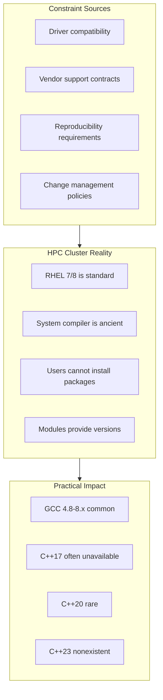
```mermaid
flowchart TB
    subgraph Reality["HPC Cluster Reality"]
        R1["RHEL 7/8 is standard"]
        R2["System compiler is ancient"]
        R3["Users cannot install packages"]
        R4["Modules provide versions"]
    end
    
    subgraph Constraints["Constraint Sources"]
        C1["Driver compatibility"]
        C2["Vendor support contracts"]
        C3["Reproducibility requirements"]
        C4["Change management policies"]
    end
    
    subgraph Result["Practical Impact"]
        RS1["GCC 4.8-8.x common"]
        RS2["C++17 often unavailable"]
        RS3["C++20 rare"]
        RS4["C++23 nonexistent"]
    end
    
    Constraints --> Reality
    Reality --> Result
```

**Typical HPC Compiler Availability:**

| Environment | Default Compiler | Max C++ Standard | Reason |
|-------------|------------------|------------------|--------|
| RHEL 7 (common) | GCC 4.8 | C++11 | EOL but still deployed |
| RHEL 8 (current) | GCC 8.5 | C++17 | LTS until 2029 |
| RHEL 9 (newest) | GCC 11 | C++20 | Limited deployment |
| CUDA 11.x | GCC 7-10 | C++17 | NVIDIA driver requirement |
| CUDA 12.x | GCC 7-12 | C++20 | NVIDIA driver requirement |
| Intel oneAPI | Various | Depends | Intel compiler versions |

**Driver Compatibility:**

GPU computing frameworks (CUDA, ROCm, oneAPI) require specific compiler versions.
NVIDIA's nvcc has a whitelist of supported host compilers. Using an unsupported
compiler can cause silent code generation bugs.

```cpp
// This code might compile but generate wrong results
// if using an unsupported GCC version with CUDA
__global__ void kernel() { ... }
```

**Vendor Support Contracts:**

Many organizations have support contracts with Red Hat, Intel, or NVIDIA. These
contracts often specify exact compiler versions. Using a different compiler voids
support, meaning the vendor will not help debug issues.

**Reproducibility:**

Scientific papers require reproducible results. This means running the exact same
code with the exact same compiler. Upgrading compilers can subtly change floating-
point optimization behavior, breaking reproducibility.

### Why the Standard Will Not Help

C++23 introduced `std::execution` with senders and receivers for asynchronous
programming. Some hope this will provide a standard thread pool. It will not, for
several reasons:

**1. std::execution is not a thread pool:**

```cpp
// std::execution provides ABSTRACTIONS over execution contexts
// It does not provide a concrete thread pool

auto sender = std::execution::just(42)
            | std::execution::then([](int x) { return x * 2; });

// You need an EXECUTION CONTEXT to run this
// The standard does not mandate any specific context
auto result = std::this_thread::sync_wait(sender);  // Runs inline!
```

The standard defines sender/receiver concepts and algorithms but leaves the actual
execution context implementation-defined.

**2. No priority scheduling in the standard:**

The `std::execution` proposal does not include any priority model. All work is equal.
A standard thread pool, if one existed, would not support priorities.

**3. No work stealing guarantee:**

How tasks are scheduled is explicitly implementation-defined. An implementation could
use a single queue with no stealing and still be conforming.

**4. Availability timeline:**

Even if C++26 adds more execution context support:
- Compilers implement features gradually (1-3 years after standard)
- Standard libraries lag further (sometimes 2-4 years)
- HPC clusters lag even further (5-10 years typical)

A feature in C++26 (published 2026) might not be usable in HPC environments until
2030 or later.

**ThreadPool's Position:**

ThreadPool is not a polyfill waiting for the standard. It provides capabilities the
standard explicitly does not mandate:

1. **Priority scheduling**: Four-level compile-time priority discrimination
2. **Work stealing**: Starvation-free Fisher-Yates victim selection
3. **Configurable idle strategy**: Spin duration tuning for latency/CPU trade-off

These features will remain valuable even when C++26/29/32 execution contexts become
available in HPC environments.

---

## Task Submission

### Basic Submission with submit()

The `submit()` method is the primary way to enqueue tasks:

```cpp
template<typename F, typename... Args>
[[nodiscard]] auto submit(F&& f, Args&&... args)
    -> std::future<std::invoke_result_t<F, Args...>>;
```

**Basic usage:**

```cpp
fat_p::ThreadPool pool(4);

// Lambda returning void
auto f1 = pool.submit([]() {
    std::cout << "Hello from thread pool\n";
});

// Lambda returning int
auto f2 = pool.submit([]() {
    return 42;
});

// Lambda with capture
int x = 10;
auto f3 = pool.submit([x]() {
    return x * 2;
});

// Function pointer
int add(int a, int b) { return a + b; }
auto f4 = pool.submit(add, 10, 20);

// Functor
struct Multiplier
{
    int factor;
    int operator()(int x) const { return x * factor; }
};
auto f5 = pool.submit(Multiplier{3}, 7);

// Wait for results
f1.wait();
int r2 = f2.get();  // 42
int r3 = f3.get();  // 20
int r4 = f4.get();  // 30
int r5 = f5.get();  // 21
```

**The `[[nodiscard]]` attribute:**

`submit()` is marked `[[nodiscard]]`, which means the compiler warns if you ignore
the returned future:

```cpp
pool.submit([]() { do_work(); });  // Warning: ignoring return value
```

This prevents a common bug where the future is accidentally discarded. If you truly
do not need the result:

```cpp
// Explicitly discard the future
(void)pool.submit([]() { fire_and_forget(); });

// Or use a helper
[[maybe_unused]] auto _ = pool.submit([]() { fire_and_forget(); });
```

### Understanding Futures

A `std::future<T>` represents a value that will be available sometime in the future.
It is the handle you use to retrieve the result of an asynchronous operation.

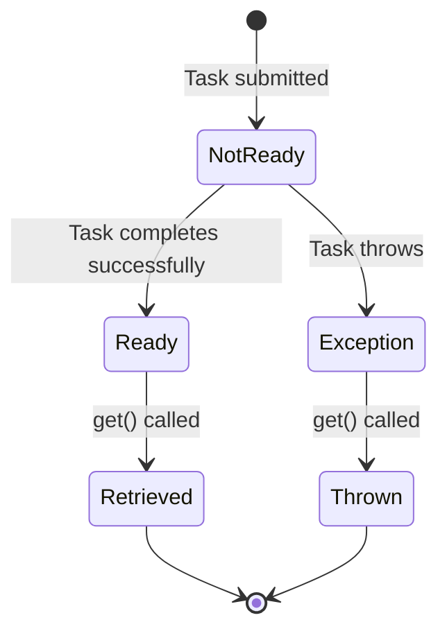
```mermaid
stateDiagram-v2
    [*] --> NotReady: Task submitted
    NotReady --> Ready: Task completes successfully
    NotReady --> Exception: Task throws
    Ready --> Retrieved: get() called
    Exception --> Thrown: get() called
    Retrieved --> [*]
    Thrown --> [*]
```

**Future operations:**

```cpp
std::future<int> future = pool.submit([]() { return compute(); });

// Check if ready without blocking
if (future.wait_for(std::chrono::seconds(0)) == std::future_status::ready)
{
    // Result available
}

// Wait with timeout
auto status = future.wait_for(std::chrono::seconds(5));
if (status == std::future_status::timeout)
{
    // Still not ready after 5 seconds
}

// Block until ready (no timeout)
future.wait();

// Get the result (blocks if not ready)
int result = future.get();

// IMPORTANT: get() can only be called ONCE
// int again = future.get();  // UNDEFINED BEHAVIOR!
```

**Future states after get():**

After calling `get()`, the future is no longer valid:

```cpp
auto future = pool.submit([]() { return 42; });
int result = future.get();  // OK, result = 42

// The future is now invalid
bool valid = future.valid();  // false
// int again = future.get();  // UNDEFINED BEHAVIOR
```

If you need to access the result multiple times, use `std::shared_future`:

```cpp
std::shared_future<int> shared = pool.submit([]() { return 42; }).share();

// Can be copied
auto copy1 = shared;
auto copy2 = shared;

// All copies can call get()
int r1 = shared.get();  // OK
int r2 = copy1.get();   // OK
int r3 = copy2.get();   // OK
```

### Priority Submission with submit_priority()

For tasks with different urgency levels, use `submit_priority()`:

```cpp
template<typename F, typename... Args>
[[nodiscard]] auto submit_priority(Priority priority, F&& f, Args&&... args)
    -> std::future<std::invoke_result_t<F, Args...>>;
```

**Priority levels:**

```cpp
enum class Priority : int
{
    Low = 0,       // Background work, cleanup
    Normal = 1,    // Standard processing (default)
    High = 2,      // User-facing, time-sensitive
    Critical = 3   // System emergencies
};
```

**Usage:**

```cpp
using fat_p::Priority;

// Critical: Emergency shutdown
auto critical = pool.submit_priority(Priority::Critical, []() {
    return emergency_shutdown();
});

// High: User request
auto high = pool.submit_priority(Priority::High, []() {
    return handle_user_request();
});

// Normal: Standard batch work
auto normal = pool.submit_priority(Priority::Normal, []() {
    return process_batch();
});

// Low: Background cleanup
auto low = pool.submit_priority(Priority::Low, []() {
    cleanup_temp_files();
});
```

### Batch Submission with submit_batch()

For submitting many fire-and-forget tasks efficiently:

```cpp
void submit_batch(const std::vector<std::function<void()>>& tasks);
```

**Why batch submission?**

Individual submissions each:
1. Acquire a lock
2. Push to queue
3. Release lock
4. Signal condition variable

With 1000 individual submissions, that is 1000 lock/unlock cycles and 1000 CV signals.
Batch submission does this once:

```cpp
// INEFFICIENT: 1000 individual submissions
for (int i = 0; i < 1000; ++i)
{
    pool.submit([i]() { process(i); });
}

// EFFICIENT: Single batch submission
std::vector<std::function<void()>> tasks;
tasks.reserve(1000);
for (int i = 0; i < 1000; ++i)
{
    tasks.emplace_back([i]() { process(i); });
}
pool.submit_batch(tasks);
```

**Limitations of batch submission:**

- Returns `void`, not futures (cannot get results)
- All tasks get Normal priority
- All tasks go to the global queue (not distributed to local queues)

Use batch submission for fire-and-forget workloads where you do not need individual
results. Use `submit()` when you need futures.

### Argument Forwarding

Arguments passed to `submit()` are forwarded to the callable:

```cpp
void process(int x, const std::string& name, std::vector<int>& output);

std::vector<int> results;

// Arguments are captured by the lambda
auto future = pool.submit(process, 42, "test", std::ref(results));
```

**Important: Reference semantics require std::ref:**

```cpp
void increment(int& x) { ++x; }

int value = 0;

// WRONG: value is COPIED, original not modified
pool.submit(increment, value).wait();
std::cout << value;  // Still 0!

// CORRECT: std::ref preserves reference semantics
pool.submit(increment, std::ref(value)).wait();
std::cout << value;  // Now 1
```

This is standard C++ behavior. When you pass arguments to a function template, they
are copied by default. `std::ref` creates a `std::reference_wrapper` that preserves
reference semantics.

### The std::bind Problem

ThreadPool deliberately avoids `std::bind` internally due to a known bug with
reference parameters:

```cpp
void modify(int& x) { x = 42; }

int value = 0;

// std::bind COPIES the argument, even with std::ref!
auto bound = std::bind(modify, std::ref(value));
// bound stores a COPY of the reference_wrapper
// But when invoked, it passes by value anyway

// ThreadPool uses lambda capture instead:
auto task = [func = std::forward<F>(f),
             args = std::make_tuple(std::forward<Args>(args)...)]() mutable
{
    std::apply(std::move(func), std::move(args));
};
// This preserves the reference_wrapper correctly
```

You do not need to understand this detail--just know that `std::ref` works correctly
with ThreadPool's `submit()`.

### Common Submission Mistakes

**Mistake 1: Capturing by reference when task outlives scope**

```cpp
void submit_tasks(ThreadPool& pool)
{
    int local = 42;
    
    // DANGEROUS: local will be destroyed before task runs!
    pool.submit([&local]() {
        std::cout << local;  // UNDEFINED BEHAVIOR
    });
}
```

**Fix:** Capture by value or ensure lifetime:

```cpp
// Option 1: Capture by value
pool.submit([local]() {
    std::cout << local;  // Safe, local is copied
});

// Option 2: Wait for completion before returning
auto future = pool.submit([&local]() {
    std::cout << local;
});
future.wait();  // Now safe to return
```

**Mistake 2: Forgetting to wait for results**

```cpp
void process()
{
    ThreadPool pool(4);
    
    for (int i = 0; i < 100; ++i)
    {
        pool.submit([i]() { slow_operation(i); });
    }
    
    // Pool destructor runs here
    // All tasks complete before destructor returns
    // BUT you did not get any results!
}
```

**Fix:** Store futures and retrieve results:

```cpp
std::vector<std::future<Result>> futures;
for (int i = 0; i < 100; ++i)
{
    futures.push_back(pool.submit([i]() { 
        return slow_operation(i); 
    }));
}

std::vector<Result> results;
for (auto& f : futures)
{
    results.push_back(f.get());
}
```

**Mistake 3: Calling get() multiple times**

```cpp
auto future = pool.submit([]() { return compute(); });

int result1 = future.get();  // OK
int result2 = future.get();  // UNDEFINED BEHAVIOR!
```

**Fix:** Store the result or use `shared_future`:

```cpp
// Option 1: Store the result
int result = future.get();
// Use result multiple times

// Option 2: Use shared_future
auto shared = pool.submit([]() { return compute(); }).share();
int r1 = shared.get();  // OK
int r2 = shared.get();  // OK
```

---

## The Priority System

### Understanding Task Priority

Not all tasks are equal. In a web server, a user-facing API request is more important
than a background log rotation. In a game, rendering the next frame is more important
than prefetching distant assets.

Without priority scheduling, all tasks wait in a single FIFO queue:

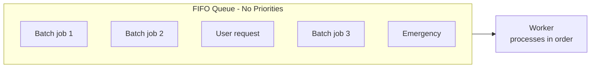
```mermaid
flowchart LR
    subgraph Queue["FIFO Queue - No Priorities"]
        T1["Batch job 1"]
        T2["Batch job 2"]
        T3["User request"]
        T4["Batch job 3"]
        T5["Emergency"]
    end
    
    Queue --> Worker["Worker<br/>processes in order"]
```

The user request waits behind batch jobs. The emergency waits behind everything.

With priority scheduling:

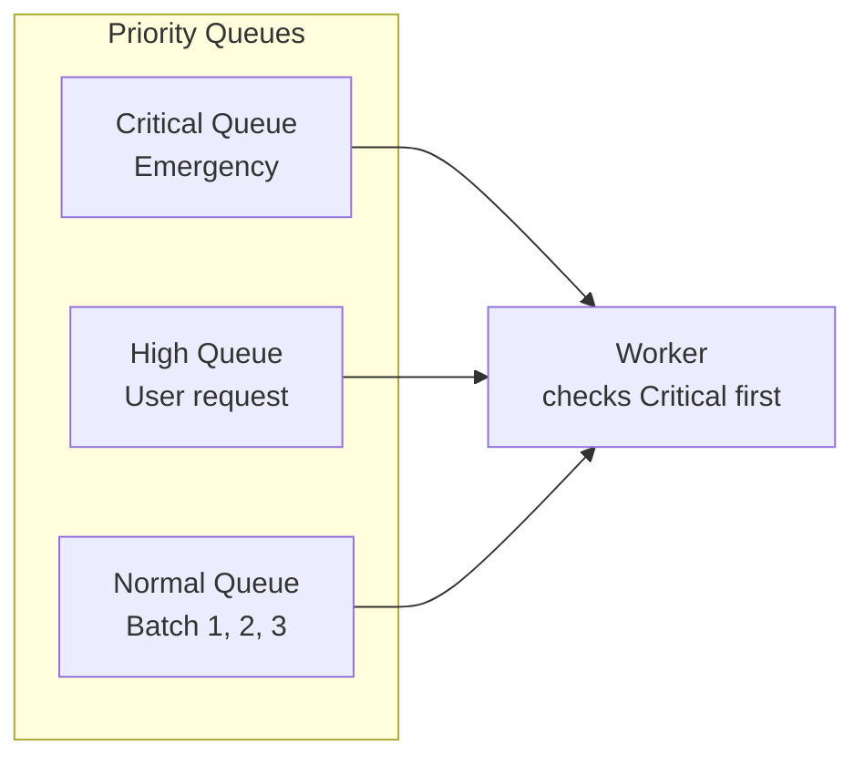
```mermaid
flowchart LR
    subgraph Queues["Priority Queues"]
        CQ["Critical Queue<br/>Emergency"]
        HQ["High Queue<br/>User request"]
        NQ["Normal Queue<br/>Batch 1, 2, 3"]
    end
    
    CQ --> Worker["Worker<br/>checks Critical first"]
    HQ --> Worker
    NQ --> Worker
```

The emergency executes first, then the user request, then batch jobs.

### Priority Levels

ThreadPool provides four priority levels:

```cpp
enum class Priority : int
{
    Low = 0,       // Lowest priority
    Normal = 1,    // Default priority
    High = 2,      // Elevated priority
    Critical = 3   // Highest priority
};
```

**Level semantics:**

| Priority | Value | Queue | Typical Use Cases |
|----------|-------|-------|-------------------|
| Critical | 3 | Global | System emergencies, shutdown sequences, health checks |
| High | 2 | Global | User-facing requests, interactive operations |
| Normal | 1 | Local | Standard processing, batch work (default) |
| Low | 0 | Local | Background tasks, cleanup, prefetching, logging |

### Queue Routing

The priority level determines which queue receives the task:

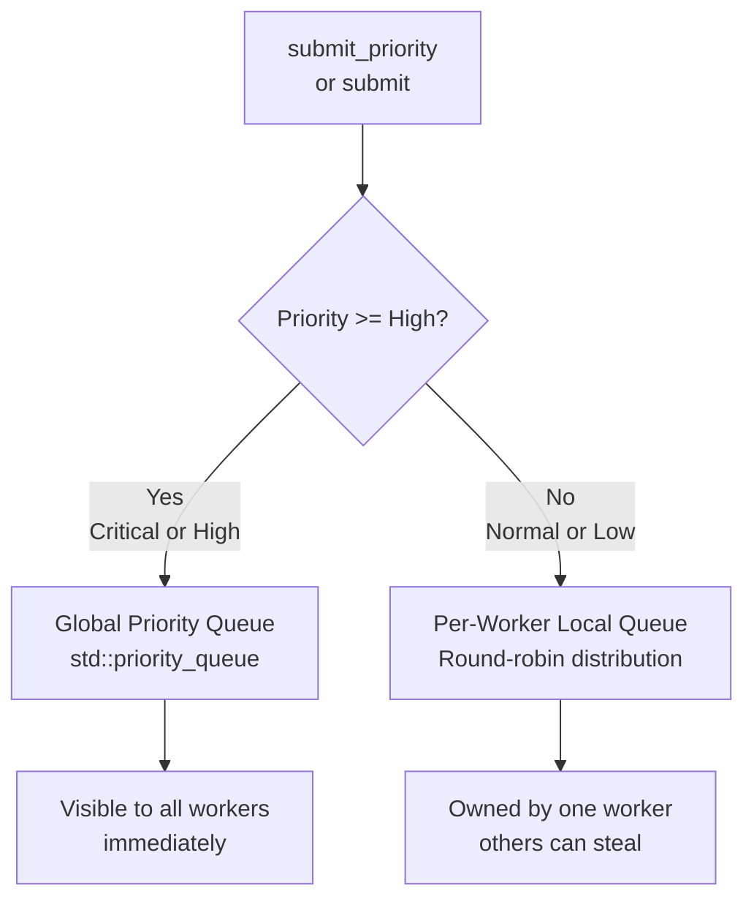
```mermaid
flowchart TB
    Submit["submit_priority<br/>or submit"]
    
    Submit --> Check{"Priority >= High?"}
    
    Check -->|"Yes<br/>Critical or High"| Global["Global Priority Queue<br/>std::priority_queue"]
    Check -->|"No<br/>Normal or Low"| Local["Per-Worker Local Queue<br/>Round-robin distribution"]
    
    Global --> Note1["Visible to all workers<br/>immediately"]
    Local --> Note2["Owned by one worker<br/>others can steal"]
```

**Why this split?**

**Global queue for High/Critical:**
- All workers see these tasks immediately
- Priority ordering is strict (Critical before High)
- No risk of a high-priority task sitting in a local queue while its owner is busy

**Local queues for Normal/Low:**
- Reduced contention (no global lock for normal work)
- Cache locality (submitter's data may be hot)
- Work stealing balances load automatically

### Priority Ordering Guarantees

**Within the global queue:**

1. Higher priority executes before lower priority
2. Equal priority: FIFO (first submitted executes first)

```cpp
// Single-threaded pool for deterministic testing
ThreadPool pool(1);

// Block the worker
std::atomic<bool> release{false};
pool.submit_priority(Priority::Critical, [&]() {
    while (!release) std::this_thread::yield();
});

// Worker is blocked, queue up more tasks
std::vector<int> execution_order;
std::mutex mutex;

pool.submit_priority(Priority::High, [&]() {
    std::lock_guard<std::mutex> lock(mutex);
    execution_order.push_back(1);  // H1
});

pool.submit_priority(Priority::Critical, [&]() {
    std::lock_guard<std::mutex> lock(mutex);
    execution_order.push_back(2);  // C1
});

pool.submit_priority(Priority::High, [&]() {
    std::lock_guard<std::mutex> lock(mutex);
    execution_order.push_back(3);  // H2
});

// Release the blocker
release = true;
pool.wait_idle();

// execution_order is: [2, 1, 3]
// C1 first (Critical), then H1, H2 (High, FIFO order)
```

**Within local queues:**

Local queues do not enforce priority ordering. They use LIFO for owner access (cache
locality) and FIFO for stealing. If you need strict priority ordering, use High or
Critical priority to route to the global queue.

### When to Use Each Priority

**Critical:** Use sparingly for true emergencies.

```cpp
// System is shutting down, must flush data
pool.submit_priority(Priority::Critical, [&]() {
    flush_all_buffers();
    close_database_connections();
});

// Health check must respond immediately
pool.submit_priority(Priority::Critical, [&]() {
    return check_system_health();
});
```

**High:** User-facing operations that should not wait.

```cpp
// API request handling
pool.submit_priority(Priority::High, [&request]() {
    return process_api_request(request);
});

// Interactive UI update
pool.submit_priority(Priority::High, [&]() {
    refresh_display();
});
```

**Normal:** Standard work (default).

```cpp
// Batch processing
pool.submit([&]() {  // Default is Normal
    process_batch(batch);
});

// Regular computation
pool.submit([&]() {
    return compute_statistics(data);
});
```

**Low:** Background work that can wait.

```cpp
// Log rotation
pool.submit_priority(Priority::Low, [&]() {
    rotate_log_files();
});

// Cache warming
pool.submit_priority(Priority::Low, [&]() {
    prefetch_likely_needed_data();
});

// Cleanup
pool.submit_priority(Priority::Low, [&]() {
    cleanup_temp_directory();
});
```

### Priority Anti-Patterns

**Anti-pattern 1: Everything is Critical**

```cpp
// WRONG: If everything is Critical, nothing is Critical
for (auto& item : items)
{
    pool.submit_priority(Priority::Critical, [&item]() {
        process(item);
    });
}
```

If all tasks are Critical, you get no prioritization benefit. Use Critical only for
true emergencies.

**Anti-pattern 2: Priority inversion without awareness**

```cpp
// High-priority task depends on low-priority result
auto low_future = pool.submit_priority(Priority::Low, []() {
    return compute_dependency();  // Takes 10 seconds
});

auto high_future = pool.submit_priority(Priority::High, [&]() {
    // BLOCKS waiting for low-priority task!
    int dep = low_future.get();
    return process_with_dependency(dep);
});
```

The high-priority task cannot complete until the low-priority task finishes. This is
priority inversion. Solution: Make the dependency the same priority or higher.

**Anti-pattern 3: Using priority for ordering**

```cpp
// WRONG: Using priority to ensure A runs before B
pool.submit_priority(Priority::High, task_A);
pool.submit_priority(Priority::Normal, task_B);
// Task B might still start before A if A is slow to be picked up!
```

Priority affects which task is picked next, not execution order. If you need ordering,
use futures:

```cpp
auto a_future = pool.submit(task_A);
auto b_future = pool.submit([&]() {
    a_future.wait();  // Ensure A completes first
    return task_B();
});
```

---

## Work Stealing Deep Dive

### Why Work Stealing Matters

Consider a parallel loop where iterations have varying costs:

```cpp
for (size_t i = 0; i < N; ++i)
{
    pool.submit([i]() {
        // Iteration time varies: some fast, some slow
        process(i);  // Could be 1ms or 100ms
    });
}
```

Without work stealing, if the round-robin distribution happens to give all slow
iterations to Worker 0, that worker is overloaded while others sit idle:

```
Worker 0: [slow] [slow] [slow] [slow] ... (overloaded)
Worker 1: [fast] [fast] [done, idle]
Worker 2: [fast] [fast] [done, idle]
Worker 3: [fast] [fast] [done, idle]
```

Total time: determined by Worker 0 (the slowest)

With work stealing, idle workers take tasks from the overloaded worker:

```
Worker 0: [slow] [slow] [stolen] [stolen] ...
Worker 1: [fast] [fast] [stolen from 0] [stolen from 0] ...
Worker 2: [fast] [fast] [stolen from 0] ...
Worker 3: [fast] [fast] [stolen from 0] ...
```

Total time: distributed across all workers (much faster)

Work stealing provides **automatic load balancing** without requiring the programmer
to know task durations in advance.

### The Naive Approach and Its Problems

A naive work stealing implementation might randomly select victims:

```cpp
// NAIVE: Random victim selection
bool try_steal()
{
    size_t victim = rand() % num_workers;
    if (victim != my_id && queues[victim].try_steal(task))
    {
        task.execute();
        return true;
    }
    return false;
}
```

This has problems:

**Problem 1: May never check some queues**

Random selection can repeatedly pick the same victims:

```
Attempt 1: victim = 2 (empty)
Attempt 2: victim = 2 (empty, same!)
Attempt 3: victim = 0 (empty)
Attempt 4: victim = 2 (empty, again!)
Attempt 5: victim = 0 (empty)
// Never checked victim 1, which has 100 tasks!
```

**Problem 2: Wasted attempts**

After checking that queue 2 is empty, randomly selecting it again wastes time.

**Problem 3: Starvation**

A queue might never be checked, causing its tasks to starve while the owning worker
is busy with a long task.

### Fisher-Yates Victim Selection

ThreadPool uses the Fisher-Yates shuffle to guarantee every queue is checked exactly
once per steal attempt:

```cpp
bool try_steal(size_t my_idx)
{
    // Victim indices, shuffled each time
    thread_local std::vector<size_t> victims;
    thread_local std::mt19937 rng{std::random_device{}()};
    
    // Initialize or resize victim vector
    if (victims.size() != m_num_threads)
    {
        victims.resize(m_num_threads);
        std::iota(victims.begin(), victims.end(), 0);  // 0, 1, 2, ...
    }
    
    // Fisher-Yates shuffle
    std::shuffle(victims.begin(), victims.end(), rng);
    
    // Check each queue exactly once
    for (size_t victim_idx : victims)
    {
        if (victim_idx == my_idx)
        {
            continue;  // Skip self
        }
        
        if (auto task = m_worker_queues[victim_idx].queue.try_steal())
        {
            task->execute();
            return true;
        }
    }
    
    return false;  // All queues empty
}
```

**Why this works:**

The Fisher-Yates shuffle produces a random permutation where each queue appears
exactly once. This guarantees:

1. Every queue is checked
2. No queue is checked twice
3. Check order is random (prevents systematic unfairness)

```
Shuffle: [2, 0, 3, 1]
Check queue 2: empty
Check queue 0: empty
Check queue 3: has task! Steal it.
(Queue 1 not checked - we found work)
```

### LIFO vs FIFO Access Patterns

ThreadPool's local queues use different access patterns for owners and thieves:

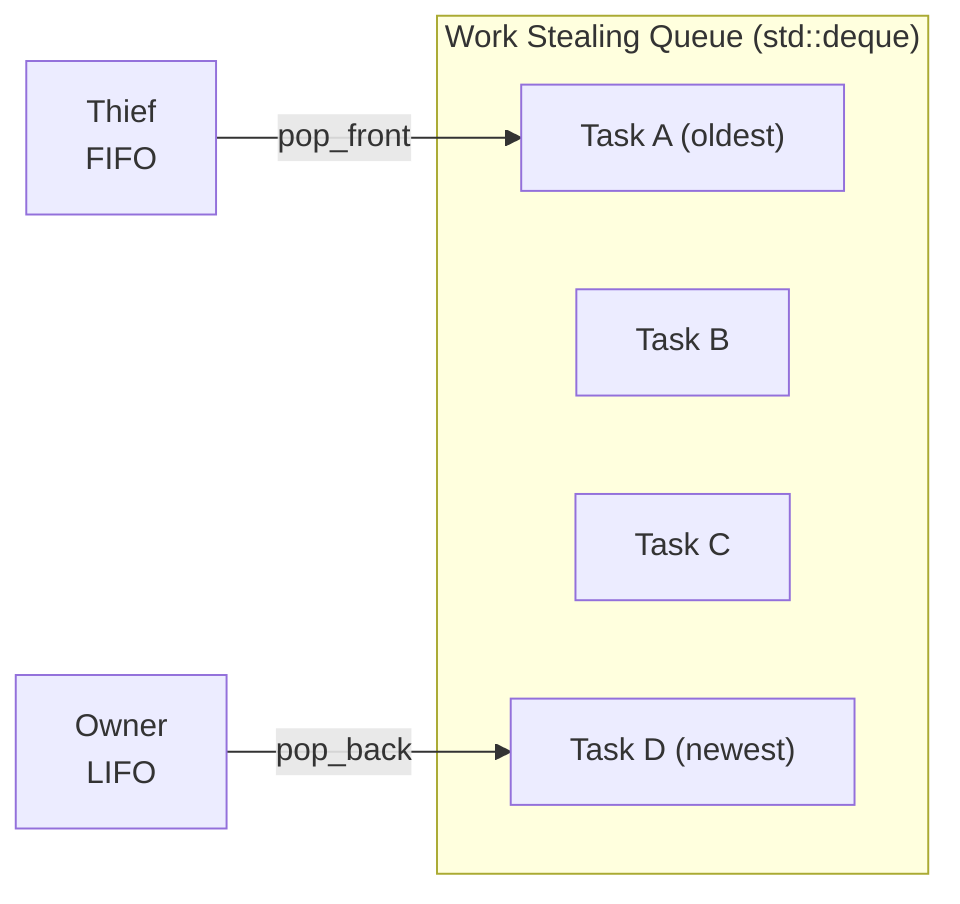
```mermaid
flowchart LR
    subgraph Queue["Work Stealing Queue (std::deque)"]
        direction TB
        T1["Task A (oldest)"]
        T2["Task B"]
        T3["Task C"]
        T4["Task D (newest)"]
    end
    
    Owner["Owner<br/>LIFO"] -->|"pop_back"| T4
    Thief["Thief<br/>FIFO"] -->|"pop_front"| T1
```

**Owner uses LIFO (Last-In-First-Out):**

The owner pushes and pops from the same end (back). This means recently added tasks
are executed first.

Why LIFO for owner?
- **Cache locality**: Recently pushed tasks are "hot" in cache
- **Temporal locality**: Recent tasks likely access recently touched data
- **Reduced memory pressure**: Older tasks (potentially larger working sets) deferred

**Thief uses FIFO (First-In-First-Out):**

Thieves steal from the opposite end (front). This means oldest tasks are stolen.

Why FIFO for thief?
- **Less contention**: Owner and thief access different ends, reducing conflicts
- **Larger tasks stolen**: Older tasks more likely to be parents of task trees
- **Fairness**: Prevents newest tasks from always being stolen

This LIFO/FIFO pattern is called the "ABP protocol" (Arora-Blumofe-Plaxton) and is
used in most high-performance work stealing implementations.

### Cache Locality Considerations

Work stealing has cache implications that affect performance:

**Local execution (owner runs own task):**

```
1. Task pushed to local queue
2. Data for task likely in L1/L2 cache (just accessed)
3. Owner pops and executes task
4. Data still hot in cache
5. FAST
```

**Stolen execution (thief runs task):**

```
1. Task pushed to local queue on Core 0
2. Data for task in Core 0's cache
3. Core 1 steals task
4. Core 1 must fetch data from Core 0's cache or memory
5. Cache miss penalty: 50-200 cycles per miss
6. SLOWER
```

This is why ThreadPool routes Normal/Low tasks to local queues: **most tasks should
run locally** for cache efficiency. Work stealing is a fallback for load balancing,
not the primary execution path.

The cache penalty of stealing is usually worth it versus leaving a core idle. An idle
core does zero useful work; a stealing core with cache misses still makes progress.

---

## Synchronization

### wait_idle() Explained

`wait_idle()` blocks until all pending tasks have completed:

```cpp
void wait_idle();
```

**Behavior:**

```cpp
ThreadPool pool(4);

for (int i = 0; i < 1000; ++i)
{
    pool.submit([i]() { process(i); });
}

// At this point, some tasks are:
// - Pending in queues
// - Currently executing
// - Already completed

pool.wait_idle();  // Blocks here

// Now ALL 1000 tasks are complete
// Safe to access results
```

**What wait_idle() waits for:**

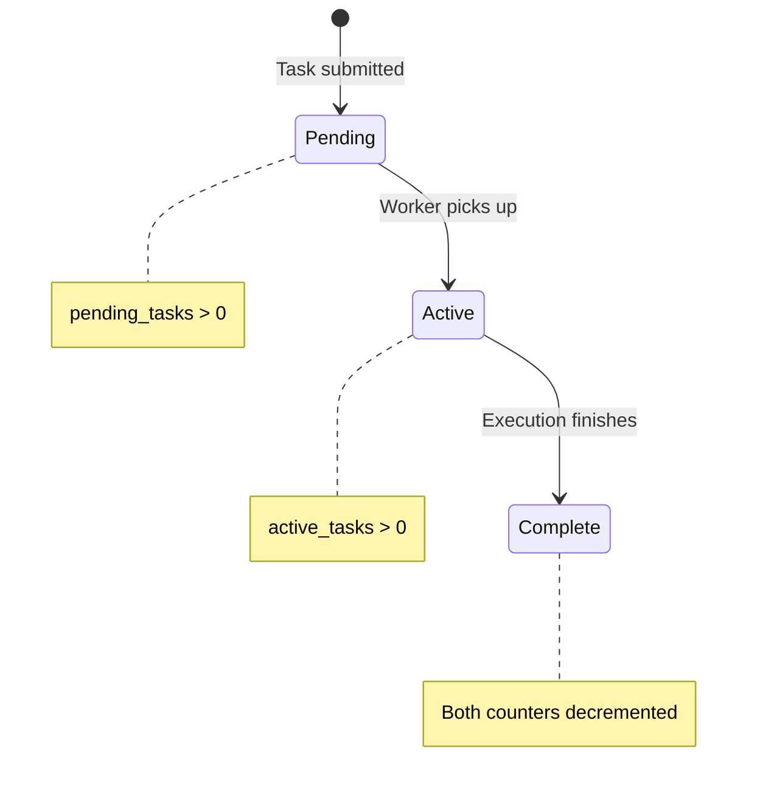
```mermaid
stateDiagram-v2
    [*] --> Pending: Task submitted
    Pending --> Active: Worker picks up
    Active --> Complete: Execution finishes
    
    note right of Pending: pending_tasks > 0
    note right of Active: active_tasks > 0
    note right of Complete: Both counters decremented
```

`wait_idle()` returns when `pending_tasks == 0 AND active_tasks == 0`.

**Important:** `wait_idle()` does not prevent new submissions:

```cpp
// Thread 1:
pool.wait_idle();

// Thread 2 (concurrent):
pool.submit(task);  // This submission is allowed!
// Thread 1's wait_idle() will also wait for this task
```

If you need to prevent new submissions, use `shutdown()` instead.

### The TOCTOU Problem

TOCTOU (Time-Of-Check-Time-Of-Use) is a classic race condition where the state changes
between checking and acting:

```cpp
// TOCTOU RACE - DO NOT USE THIS PATTERN
void broken_wait_idle()
{
    while (pending_tasks() > 0 || active_tasks() > 0)  // CHECK
    {
        // <<< Task completes here! >>>
        // <<< pending=0, active=0 >>>
        // <<< CV is notified >>>
        // <<< But we are not waiting yet! >>>
        
        cv.wait(...);  // USE - MISSED THE NOTIFICATION!
    }
}
```

The race:

```
Time   Thread 1 (wait_idle)     Thread 2 (worker)
----   --------------------     -----------------
T1     Check: pending=1
T2                               Task completes
T3                               pending=0, active=0
T4                               cv.notify_all()
T5     Enter cv.wait()
T6     ... waits forever ...
```

Thread 1 misses the notification because it was not waiting when the notification
was sent.

**ThreadPool's solution:**

ThreadPool uses a dedicated condition variable for `wait_idle()` and ensures the
check and wait are atomic with respect to the notification:

```cpp
void wait_idle()
{
    std::unique_lock<std::mutex> lock(m_idle_mutex);
    m_idle_cv.wait(lock, [this]() {
        return m_pending_tasks.load() == 0 && m_active_tasks.load() == 0;
    });
}
```

The key insight: `condition_variable::wait(lock, predicate)` **atomically** releases
the lock and enters the wait state. There is no window where a notification can be
missed.

Workers notify `m_idle_cv` whenever they complete a task and transition to idle:

```cpp
// In worker thread, after completing a task:
m_active_tasks.fetch_sub(1, std::memory_order_release);
m_idle_cv.notify_all();  // Wake any waiting wait_idle() calls
```

### shutdown() Semantics

`shutdown()` initiates graceful termination:

```cpp
void shutdown();
```

**Behavior:**

```cpp
ThreadPool pool(4);

// Submit work
for (int i = 0; i < 100; ++i)
{
    pool.submit([i]() { process(i); });
}

pool.shutdown();  // Blocks until:
                  // 1. All 100 tasks complete
                  // 2. All workers exit
                  // 3. All threads joined
```

**Shutdown sequence:**

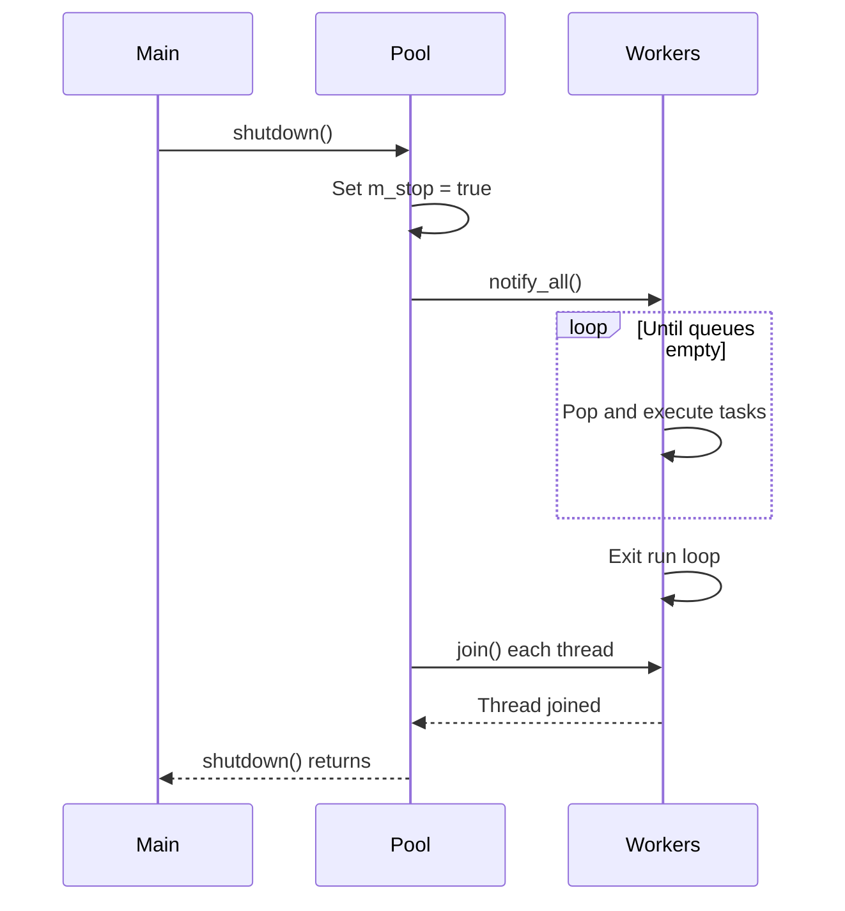
```mermaid
sequenceDiagram
    participant Main
    participant Pool
    participant Workers
    
    Main->>Pool: shutdown()
    Pool->>Pool: Set m_stop = true
    Pool->>Workers: notify_all()
    
    loop Until queues empty
        Workers->>Workers: Pop and execute tasks
    end
    
    Workers->>Workers: Exit run loop
    Pool->>Workers: join() each thread
    Workers-->>Pool: Thread joined
    Pool-->>Main: shutdown() returns
```

**Idempotent:** Calling `shutdown()` multiple times is safe:

```cpp
pool.shutdown();  // First call: performs shutdown
pool.shutdown();  // Second call: no-op, returns immediately
pool.shutdown();  // Third call: no-op
```

**Automatic on destruction:**

```cpp
{
    ThreadPool pool(4);
    pool.submit(task1);
    pool.submit(task2);
}  // Destructor calls shutdown() automatically
```

### is_shutdown() and Rejection Patterns

`is_shutdown()` queries whether shutdown has been initiated:

```cpp
bool is_shutdown() const noexcept;
```

**Important behavior:** Tasks submitted during shutdown are NOT automatically rejected.
They will execute if workers have not finished draining the queues:

```cpp
pool.submit(task1);
pool.submit(task2);

// Another thread calls shutdown()
// While workers are draining task1 and task2...

pool.submit(task3);  // This is ALLOWED
                     // task3 will execute if workers have not finished

pool.wait_idle();    // Waits for task1, task2, AND task3
```

**If you need rejection semantics:**

```cpp
class RejectingPool
{
    ThreadPool pool_;
    std::mutex mutex_;
    
public:
    template<typename F, typename... Args>
    std::optional<std::future<std::invoke_result_t<F, Args...>>>
    try_submit(F&& f, Args&&... args)
    {
        std::lock_guard<std::mutex> lock(mutex_);
        
        if (pool_.is_shutdown())
        {
            return std::nullopt;  // Rejected
        }
        
        return pool_.submit(std::forward<F>(f), std::forward<Args>(args)...);
    }
    
    void shutdown()
    {
        std::lock_guard<std::mutex> lock(mutex_);
        pool_.shutdown();
    }
};
```

### Synchronization Patterns

**Pattern 1: Process batch and collect results**

```cpp
std::vector<std::future<Result>> futures;

for (const auto& item : items)
{
    futures.push_back(pool.submit([&item]() {
        return process(item);
    }));
}

std::vector<Result> results;
results.reserve(futures.size());

for (auto& f : futures)
{
    results.push_back(f.get());
}
```

**Pattern 2: Fire-and-forget with completion barrier**

```cpp
for (const auto& item : items)
{
    (void)pool.submit([&item]() {
        process(item);  // No return value needed
    });
}

pool.wait_idle();  // Barrier: all tasks complete
```

**Pattern 3: Staged pipeline**

```cpp
// Stage 1: Parse
std::vector<std::future<ParsedData>> stage1;
for (const auto& raw : raw_data)
{
    stage1.push_back(pool.submit(parse, raw));
}

// Barrier
pool.wait_idle();

// Stage 2: Transform (can start as stage 1 completes)
std::vector<std::future<TransformedData>> stage2;
for (auto& f : stage1)
{
    auto parsed = f.get();
    stage2.push_back(pool.submit(transform, std::move(parsed)));
}

// Barrier
pool.wait_idle();

// Collect final results
std::vector<TransformedData> final_results;
for (auto& f : stage2)
{
    final_results.push_back(f.get());
}
```

**Pattern 4: Graceful shutdown with timeout**

```cpp
// Request shutdown
std::thread shutdown_thread([&pool]() {
    pool.shutdown();
});

// Wait with timeout
auto status = shutdown_thread.native_handle();  // Platform-specific
// Or use a custom timeout mechanism

// If timeout expires, you may need to forcefully terminate
// (ThreadPool does not support cancellation in v1.0)
```

---

## Diagnostics and Monitoring

### thread_count()

Returns the number of worker threads in the pool:

```cpp
size_t thread_count() const noexcept;
```

**Usage:**

```cpp
// Auto-detect: Uses hardware_concurrency()
ThreadPool pool(0);
std::cout << "Workers: " << pool.thread_count() << "\n";
// On 8-core machine: "Workers: 8"

// Explicit count
ThreadPool pool2(4);
std::cout << "Workers: " << pool2.thread_count() << "\n";
// "Workers: 4"
```

**When thread_count() is useful:**

- Verifying pool configuration
- Scaling work submission (e.g., submit N tasks per worker)
- Debugging performance issues

### pending_tasks()

Returns the number of tasks waiting in queues:

```cpp
size_t pending_tasks() const noexcept;
```

**Implementation:** O(1) via atomic counter, not queue traversal.

**Usage:**

```cpp
for (int i = 0; i < 1000; ++i)
{
    pool.submit([i]() { slow_work(); });
}

// Immediately after submission:
std::cout << "Pending: " << pool.pending_tasks() << "\n";
// Might show: "Pending: 996" (4 already started)

// After some time:
std::cout << "Pending: " << pool.pending_tasks() << "\n";
// Might show: "Pending: 500" (half complete)
```

**Backpressure pattern:**

```cpp
void submit_with_backpressure(ThreadPool& pool, std::function<void()> task)
{
    // Wait if queue is too deep
    while (pool.pending_tasks() > 1000)
    {
        std::this_thread::sleep_for(std::chrono::milliseconds(10));
    }
    pool.submit(std::move(task));
}
```

### active_tasks()

Returns the number of tasks currently executing:

```cpp
size_t active_tasks() const noexcept;
```

**Usage:**

```cpp
// With 4 workers running tasks:
std::cout << "Active: " << pool.active_tasks() << "\n";
// "Active: 4" (one per worker)

// When some workers are idle:
std::cout << "Active: " << pool.active_tasks() << "\n";
// "Active: 2" (only 2 workers have tasks)
```

**Utilization monitoring:**

```cpp
void monitor_utilization(ThreadPool& pool)
{
    size_t workers = pool.thread_count();
    size_t active = pool.active_tasks();
    
    double utilization = static_cast<double>(active) / workers * 100.0;
    std::cout << "Utilization: " << utilization << "%\n";
    
    if (utilization < 50.0)
    {
        std::cout << "Warning: Workers underutilized\n";
    }
}
```

### exception_count()

Returns the count of infrastructure exceptions:

```cpp
size_t exception_count() const noexcept;
```

**What this counts:**

Infrastructure exceptions are rare internal errors, NOT user exceptions. User
exceptions thrown from tasks are captured by `std::packaged_task` and rethrown
when you call `future.get()`.

```cpp
// User exception - captured in future, NOT counted
auto f = pool.submit([]() -> int {
    throw std::runtime_error("User error");
});
// exception_count() is still 0

try
{
    f.get();  // Throws here
}
catch (const std::runtime_error&)
{
    // Handle user exception
}
// exception_count() is still 0

// Infrastructure exception - counted (rare)
// These would be bugs in ThreadPool itself or severe system issues
```

**Monitoring:**

```cpp
void health_check(ThreadPool& pool)
{
    if (pool.exception_count() > 0)
    {
        std::cerr << "WARNING: " << pool.exception_count() 
                  << " infrastructure exceptions occurred\n";
        // Investigate - this indicates a problem
    }
}
```

### Building a Monitoring Dashboard

Combining all diagnostics for production monitoring:

```cpp
struct PoolMetrics
{
    size_t workers;
    size_t pending;
    size_t active;
    size_t exceptions;
    double utilization;
    std::chrono::steady_clock::time_point timestamp;
};

PoolMetrics capture_metrics(const ThreadPool& pool)
{
    PoolMetrics m;
    m.timestamp = std::chrono::steady_clock::now();
    m.workers = pool.thread_count();
    m.pending = pool.pending_tasks();
    m.active = pool.active_tasks();
    m.exceptions = pool.exception_count();
    m.utilization = m.workers > 0 
        ? static_cast<double>(m.active) / m.workers * 100.0 
        : 0.0;
    return m;
}

void print_metrics(const PoolMetrics& m)
{
    std::cout << "ThreadPool Metrics:\n"
              << "  Workers:     " << m.workers << "\n"
              << "  Pending:     " << m.pending << "\n"
              << "  Active:      " << m.active << "\n"
              << "  Utilization: " << std::fixed << std::setprecision(1) 
              << m.utilization << "%\n"
              << "  Exceptions:  " << m.exceptions << "\n";
}

// Periodic monitoring
void monitoring_loop(ThreadPool& pool, std::atomic<bool>& stop)
{
    while (!stop)
    {
        auto metrics = capture_metrics(pool);
        print_metrics(metrics);
        std::this_thread::sleep_for(std::chrono::seconds(1));
    }
}
```

---

## Exception Handling

### How Exceptions Propagate

Exceptions thrown by task code propagate through the future mechanism:

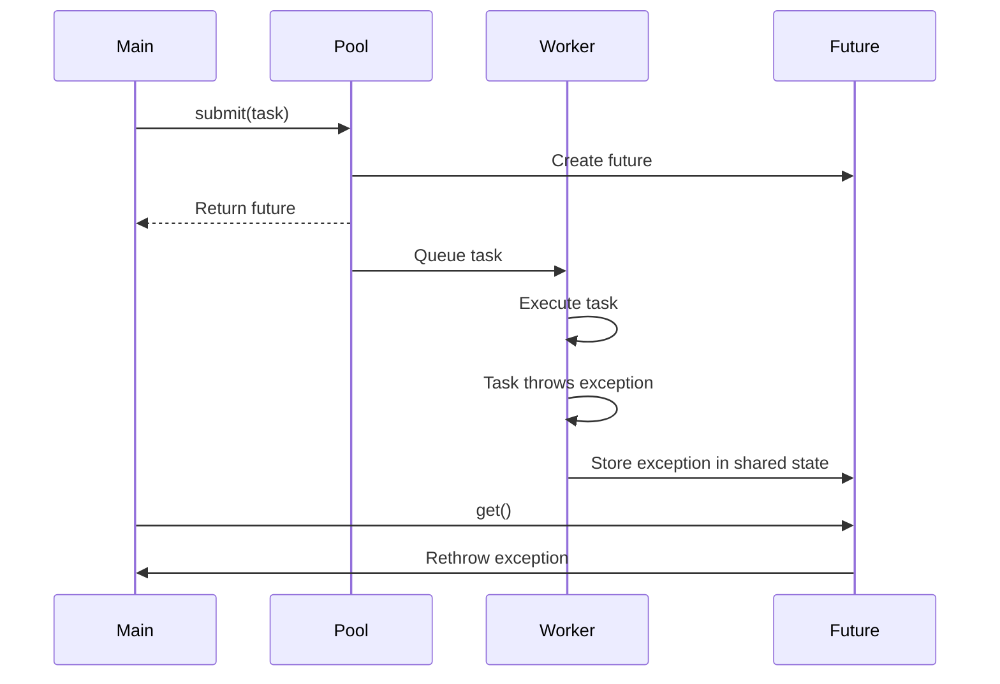
```mermaid
sequenceDiagram
    participant Main
    participant Pool
    participant Worker
    participant Future
    
    Main->>Pool: submit(task)
    Pool->>Future: Create future
    Pool-->>Main: Return future
    Pool->>Worker: Queue task
    
    Worker->>Worker: Execute task
    Worker->>Worker: Task throws exception
    Worker->>Future: Store exception in shared state
    
    Main->>Future: get()
    Future->>Main: Rethrow exception
```

**Example:**

```cpp
auto future = pool.submit([]() -> int {
    if (rand() % 2 == 0)
    {
        throw std::runtime_error("Random failure");
    }
    return 42;
});

try
{
    int result = future.get();  // May throw
    std::cout << "Result: " << result << "\n";
}
catch (const std::runtime_error& e)
{
    std::cout << "Task failed: " << e.what() << "\n";
}
```

### The packaged_task Mechanism

ThreadPool uses `std::packaged_task` to wrap callables and connect them to futures:

```cpp
// Simplified view of what submit() does:
template<typename F, typename... Args>
auto submit(F&& f, Args&&... args)
{
    using ReturnType = std::invoke_result_t<F, Args...>;
    
    // Create packaged_task that wraps the callable
    auto task = std::make_shared<std::packaged_task<ReturnType()>>(
        [func = std::forward<F>(f), 
         args = std::make_tuple(std::forward<Args>(args)...)]() mutable {
            return std::apply(std::move(func), std::move(args));
        }
    );
    
    // Get the future BEFORE moving the task
    std::future<ReturnType> future = task->get_future();
    
    // Queue the task (wrapped in type-erased function)
    enqueue([task]() { (*task)(); });
    
    return future;
}
```

When the lambda throws:
1. `std::packaged_task` catches the exception
2. Exception is stored in the shared state
3. When `future.get()` is called, exception is rethrown

This means:
- The worker thread does NOT crash
- The exception is preserved with full type information
- Multiple calls to `get()` would rethrow (but `get()` can only be called once)

### Infrastructure vs User Exceptions

**User exceptions:** Thrown by your task code.

```cpp
auto f = pool.submit([]() {
    throw std::logic_error("Bug in my code");
});
// Captured in future, rethrown on get()
```

**Infrastructure exceptions:** Thrown by ThreadPool internals (rare).

```cpp
// Hypothetically, if ThreadPool had internal bugs:
// - Memory allocation failure
// - Mutex operation failure
// - Thread creation failure

// These would increment exception_count()
```

In practice, infrastructure exceptions are extremely rare. If `exception_count() > 0`,
investigate thoroughly--it indicates a serious problem.

### Worker Thread Recovery

Workers are resilient to exceptions in tasks:

```cpp
// Task 1 throws
auto f1 = pool.submit([]() -> int {
    throw std::runtime_error("Task 1 failed");
});

// Task 2 runs normally (same worker might execute it)
auto f2 = pool.submit([]() {
    return 42;
});

// Task 3 runs normally
auto f3 = pool.submit([]() {
    return 100;
});

// Results:
try { f1.get(); } catch (...) { std::cout << "f1 threw\n"; }
std::cout << "f2 = " << f2.get() << "\n";  // 42
std::cout << "f3 = " << f3.get() << "\n";  // 100
```

One task throwing does not affect other tasks. Workers continue processing after
handling an exception.

### Exception Handling Patterns

**Pattern 1: Handle each task individually**

```cpp
std::vector<std::future<int>> futures;
for (int i = 0; i < 100; ++i)
{
    futures.push_back(pool.submit([i]() {
        if (i == 42) throw std::runtime_error("Unlucky number");
        return i * 2;
    }));
}

std::vector<std::optional<int>> results;
for (auto& f : futures)
{
    try
    {
        results.push_back(f.get());
    }
    catch (const std::exception& e)
    {
        std::cerr << "Task failed: " << e.what() << "\n";
        results.push_back(std::nullopt);
    }
}
```

**Pattern 2: Fail fast on first exception**

```cpp
std::vector<std::future<int>> futures;
// ... submit tasks ...

for (auto& f : futures)
{
    int result = f.get();  // Throws on first failure
    process(result);
}
// Subsequent tasks may still run, but we stop collecting results
```

**Pattern 3: Aggregate exceptions**

```cpp
std::vector<std::exception_ptr> errors;
std::vector<int> results;

for (auto& f : futures)
{
    try
    {
        results.push_back(f.get());
    }
    catch (...)
    {
        errors.push_back(std::current_exception());
    }
}

if (!errors.empty())
{
    std::cerr << errors.size() << " tasks failed\n";
    // Optionally rethrow first error
    std::rethrow_exception(errors.front());
}
```

**Pattern 4: Use Expected for error handling**

```cpp
// Using fat_p::Expected
auto future = pool.submit([]() -> fat_p::Expected<int, std::string> {
    if (operation_fails())
    {
        return fat_p::Unexpected("Operation failed");
    }
    return 42;
});

auto result = future.get();
if (result.has_value())
{
    std::cout << "Success: " << result.value() << "\n";
}
else
{
    std::cout << "Error: " << result.error() << "\n";
}
```

---

## Spin Configuration

### Understanding Spin-Wait

When a worker has no tasks, it needs to wait for more work. There are two fundamental
approaches:

**Blocking wait (condition variable):**

```cpp
cv.wait(lock, []{ return has_work; });
```

- Releases CPU to OS
- Worker sleeps until signaled
- Wake-up latency: 1-30 microseconds (involves kernel)

**Spin wait:**

```cpp
while (!has_work)
{
    std::this_thread::yield();  // Or just spin
}
```

- Worker keeps running, checking for work
- No kernel involvement
- Wake-up latency: nanoseconds
- Wastes CPU cycles while waiting

**Trade-off visualization:**

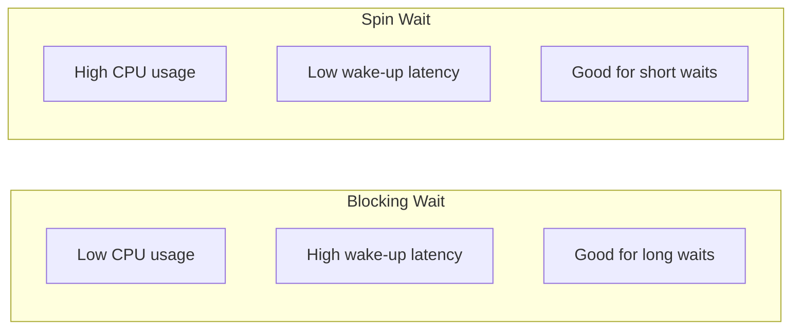
```mermaid
flowchart LR
    subgraph Blocking["Blocking Wait"]
        B1["Low CPU usage"]
        B2["High wake-up latency"]
        B3["Good for long waits"]
    end
    
    subgraph Spinning["Spin Wait"]
        S1["High CPU usage"]
        S2["Low wake-up latency"]
        S3["Good for short waits"]
    end
```

### The Latency vs CPU Trade-off

ThreadPool's two-phase approach combines both strategies:

```
Phase 1 (Spin):     [==========]-----------> Low latency
                    0ms       spin_duration
                    
Phase 2 (Block):                [=========>  Low CPU
                                OS wait
```

**Latency impact by spin duration:**

| Spin Duration | p50 Latency | p99 Latency | CPU While Idle |
|---------------|-------------|-------------|----------------|
| 0ms (no spin) | ~30 us | ~55 us | Near zero |
| 1ms | ~19 us | ~40 us | Low |
| 2ms (default) | ~16 us | ~32 us | Moderate |
| 5ms | ~15 us | ~35 us | Higher |
| 10ms | ~14 us | ~38 us | High |

Note: Very long spin durations can actually increase p99 latency due to CPU
contention if all workers are spinning.

**Constructor signature:**

```cpp
// spin_duration_us: microseconds to spin before OS wait
ThreadPool(size_t num_threads, size_t spin_duration_us = 2000);
```

**Examples:**

```cpp
// No spinning - CPU efficient, higher latency
ThreadPool pool_cpu_efficient(4, 0);

// Default - balanced
ThreadPool pool_balanced(4);  // 2000us = 2ms

// Low latency - burns more CPU
ThreadPool pool_low_latency(4, 5000);  // 5ms spin
```

### Choosing Spin Duration

**Workload analysis:**

| Workload | Pattern | Recommended Spin |
|----------|---------|------------------|
| Bursty requests | Tasks arrive in clusters | 2-5ms |
| Steady stream | Constant task arrival | 0-1ms |
| Interactive UI | User events sporadic | 5-10ms |
| Batch processing | Process, then idle | 0ms |
| Real-time | Strict latency requirements | 10ms+ |
| Background server | Runs 24/7 | 0-2ms |
| Laptop/mobile | Battery life matters | 0ms |

**Decision framework:**

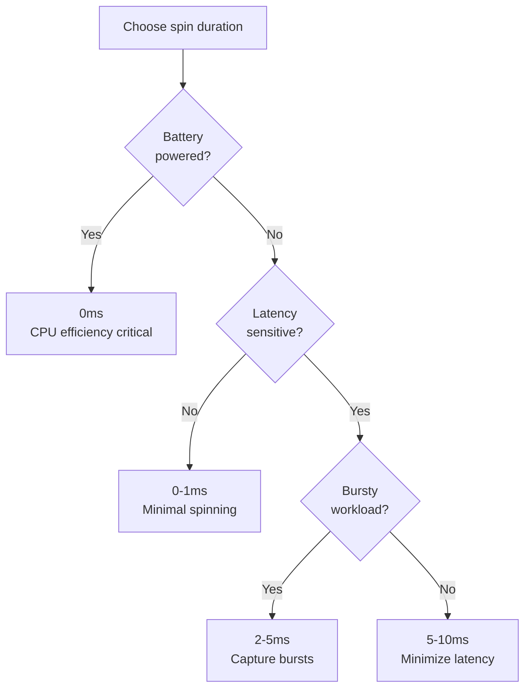
```mermaid
flowchart TB
    Start["Choose spin duration"]
    
    Start --> Q1{"Battery<br/>powered?"}
    Q1 -->|Yes| Zero["0ms<br/>CPU efficiency critical"]
    Q1 -->|No| Q2
    
    Q2{"Latency<br/>sensitive?"}
    Q2 -->|No| Low["0-1ms<br/>Minimal spinning"]
    Q2 -->|Yes| Q3
    
    Q3{"Bursty<br/>workload?"}
    Q3 -->|Yes| Medium["2-5ms<br/>Capture bursts"]
    Q3 -->|No| High["5-10ms<br/>Minimize latency"]
```

### Measuring the Impact

Profile your actual workload to find optimal spin duration:

```cpp
#include <chrono>
#include <vector>
#include <numeric>

void benchmark_latency(ThreadPool& pool, size_t iterations)
{
    std::vector<double> latencies;
    latencies.reserve(iterations);
    
    for (size_t i = 0; i < iterations; ++i)
    {
        auto start = std::chrono::steady_clock::now();
        
        auto future = pool.submit([]() {
            // Minimal work to measure scheduling latency
            volatile int x = 42;
            (void)x;
        });
        
        future.wait();
        
        auto end = std::chrono::steady_clock::now();
        auto elapsed = std::chrono::duration<double, std::micro>(end - start);
        latencies.push_back(elapsed.count());
    }
    
    std::sort(latencies.begin(), latencies.end());
    
    double sum = std::accumulate(latencies.begin(), latencies.end(), 0.0);
    double avg = sum / latencies.size();
    double p50 = latencies[latencies.size() / 2];
    double p99 = latencies[latencies.size() * 99 / 100];
    
    std::cout << "Latency (us): avg=" << avg 
              << " p50=" << p50 
              << " p99=" << p99 << "\n";
}

// Test different spin durations
void find_optimal_spin()
{
    for (size_t spin : {0, 1000, 2000, 5000, 10000})
    {
        std::cout << "Spin " << spin << "us: ";
        ThreadPool pool(4, spin);
        benchmark_latency(pool, 10000);
    }
}
```

---

## Thread Safety

### What is Thread-Safe?

A class is thread-safe if multiple threads can call its methods concurrently without
causing data races or undefined behavior.

**ThreadPool thread safety guarantees:**

| Operation | Thread-Safe? | Notes |
|-----------|--------------|-------|
| `submit()` | Yes | Multiple threads can submit concurrently |
| `submit_priority()` | Yes | Same as submit() |
| `submit_batch()` | Yes | Same as submit() |
| `wait_idle()` | Yes | Multiple threads can wait concurrently |
| `shutdown()` | Yes | Idempotent, can be called from any thread |
| `is_shutdown()` | Yes | Read-only query |
| `thread_count()` | Yes | Read-only query |
| `pending_tasks()` | Yes | Atomic read |
| `active_tasks()` | Yes | Atomic read |
| `exception_count()` | Yes | Atomic read |

**What is NOT guaranteed:**

- Order of task execution across threads
- Which worker executes which task
- Timing of task completion relative to submission

### Concurrent Submission Guarantees

Multiple threads can safely submit tasks simultaneously:

```cpp
ThreadPool pool(4);
std::atomic<int> counter{0};

// 10 producer threads, each submitting 1000 tasks
std::vector<std::thread> producers;
for (int p = 0; p < 10; ++p)
{
    producers.emplace_back([&pool, &counter]() {
        for (int i = 0; i < 1000; ++i)
        {
            pool.submit([&counter]() {
                counter.fetch_add(1, std::memory_order_relaxed);
            });
        }
    });
}

for (auto& t : producers)
{
    t.join();
}

pool.wait_idle();

// counter is exactly 10000
assert(counter.load() == 10000);
```

Internal synchronization ensures:
- No tasks are lost
- No data races in queue operations
- All submitted tasks eventually execute

### Memory Ordering Explained

ThreadPool uses careful memory ordering for performance and correctness:

**Atomic counters:**

```cpp
std::atomic<size_t> m_pending_tasks{0};
std::atomic<size_t> m_active_tasks{0};
std::atomic<size_t> m_exception_count{0};
std::atomic<bool> m_stop{false};
```

**Memory orderings used:**

| Variable | Write Order | Read Order | Why |
|----------|-------------|------------|-----|
| `m_pending_tasks` | relaxed | acquire | CV provides sync |
| `m_active_tasks` | release | acquire | Sync with wait_idle |
| `m_stop` | release | acquire | Shutdown visibility |
| `m_exception_count` | relaxed | relaxed | Diagnostic only |

**Why not always use `seq_cst`?**

`std::memory_order_seq_cst` (sequentially consistent) is the safest but slowest
ordering. It provides a total order across all atomic operations.

For counters like `m_pending_tasks`, we can use relaxed ordering because:
1. The condition variable provides the necessary synchronization
2. We only need eventual consistency, not immediate visibility
3. Relaxed operations are significantly faster on some architectures

**The release/acquire pattern:**

```cpp
// Worker completing a task:
task.execute();
m_active_tasks.fetch_sub(1, std::memory_order_release);  // RELEASE
m_idle_cv.notify_all();

// wait_idle checking:
m_idle_cv.wait(lock, [this]() {
    return m_pending_tasks.load(std::memory_order_acquire) == 0 &&  // ACQUIRE
           m_active_tasks.load(std::memory_order_acquire) == 0;     // ACQUIRE
});
```

The release-acquire pair ensures that all effects of task execution are visible
before `wait_idle()` returns.

### Lock Ordering and Deadlock Prevention

ThreadPool uses multiple locks:

1. `m_global_mutex` - Protects global priority queue
2. `m_worker_queues[i].mutex` - Per-worker queue mutex (one per worker)
3. `m_idle_mutex` - Protects idle condition variable

**Deadlock potential:**

```
Thread 1: Lock A, then try to lock B
Thread 2: Lock B, then try to lock A
Result: DEADLOCK
```

**ThreadPool's lock ordering:**

```
1. WorkStealingQueue mutex (only ONE at a time, never multiple)
2. Global mutex
3. Idle mutex
```

**Why no deadlocks:**

- Workers only hold one WSQ mutex at a time (their own or victim's, never both)
- Global mutex is acquired independently, never while holding a WSQ mutex
- Idle mutex is only used in `wait_idle()`, not during task processing

**Verification:**

```cpp
// This sequence is SAFE:
void worker_thread(size_t idx)
{
    while (true)
    {
        // Try local queue (lock own WSQ)
        {
            std::lock_guard<std::mutex> lock(m_worker_queues[idx].mutex);
            // pop from own queue
        }  // Released before any other lock
        
        // Try global queue (lock global)
        {
            std::lock_guard<std::mutex> lock(m_global_mutex);
            // pop from global
        }  // Released before any other lock
        
        // Try stealing (lock ONE victim WSQ)
        for (size_t victim : shuffled_victims)
        {
            std::lock_guard<std::mutex> lock(m_worker_queues[victim].mutex);
            // steal from victim
            break;  // Only one victim locked at a time
        }
    }
}
```

---

## Advanced Usage

### Multiple Thread Pools

You can create multiple pools for different purposes:

```cpp
// Pool for latency-sensitive UI work
ThreadPool ui_pool(2, 5000);  // 2 threads, 5ms spin

// Pool for background batch processing
ThreadPool batch_pool(6, 0);  // 6 threads, no spin

// Pool for I/O-bound tasks (more threads than cores)
ThreadPool io_pool(16, 0);  // Many threads, no spin

// Use appropriately
auto ui_future = ui_pool.submit([&]() {
    return render_frame();  // Needs low latency
});

(void)batch_pool.submit([&]() {
    rebuild_index();  // Can take time
});

(void)io_pool.submit([&]() {
    fetch_from_network();  // Blocks on I/O
});
```

**Guidelines for multiple pools:**

| Pool Type | Thread Count | Spin | Use For |
|-----------|--------------|------|---------|
| CPU-bound | hardware_concurrency | 2-5ms | Computation |
| I/O-bound | 2-4x cores | 0 | Network, disk |
| UI/interactive | 1-2 | 5-10ms | User-facing |
| Background | cores - 2 | 0 | Cleanup, logging |

### Pool Hierarchies

For complex applications, organize pools hierarchically:

```cpp
class ApplicationPools
{
public:
    // Singleton access
    static ApplicationPools& instance()
    {
        static ApplicationPools pools;
        return pools;
    }
    
    ThreadPool& critical() { return critical_; }
    ThreadPool& compute() { return compute_; }
    ThreadPool& io() { return io_; }
    ThreadPool& background() { return background_; }
    
    void shutdown_all()
    {
        // Shutdown in reverse priority order
        background_.shutdown();
        io_.shutdown();
        compute_.shutdown();
        critical_.shutdown();
    }
    
private:
    ApplicationPools()
        : critical_(2, 10000)    // 2 threads, 10ms spin
        , compute_(std::thread::hardware_concurrency(), 2000)
        , io_(16, 0)
        , background_(2, 0)
    {}
    
    ThreadPool critical_;
    ThreadPool compute_;
    ThreadPool io_;
    ThreadPool background_;
};

// Usage:
auto& pools = ApplicationPools::instance();
pools.compute().submit(heavy_computation);
pools.io().submit(network_request);
```

### Rejection During Shutdown

If you need to reject tasks during shutdown:

```cpp
template<typename Pool>
class RejectingPoolWrapper
{
public:
    explicit RejectingPoolWrapper(Pool& pool) : pool_(pool) {}
    
    template<typename F, typename... Args>
    auto try_submit(F&& f, Args&&... args)
        -> std::optional<std::future<std::invoke_result_t<F, Args...>>>
    {
        std::lock_guard<std::mutex> lock(mutex_);
        
        if (pool_.is_shutdown())
        {
            return std::nullopt;
        }
        
        return pool_.submit(std::forward<F>(f), std::forward<Args>(args)...);
    }
    
    void shutdown()
    {
        std::lock_guard<std::mutex> lock(mutex_);
        pool_.shutdown();
    }
    
private:
    Pool& pool_;
    std::mutex mutex_;
};

// Usage:
ThreadPool pool(4);
RejectingPoolWrapper<ThreadPool> wrapper(pool);

auto result = wrapper.try_submit(compute);
if (!result)
{
    std::cerr << "Task rejected - pool is shutting down\n";
}
```

### Integration with Async Patterns

**Continuation pattern:**

```cpp
template<typename T, typename F>
auto then(std::future<T>&& fut, ThreadPool& pool, F&& cont)
{
    return pool.submit([fut = std::move(fut), 
                        cont = std::forward<F>(cont)]() mutable {
        T value = fut.get();  // Wait for previous stage
        return cont(std::move(value));
    });
}

// Usage: Pipeline of transformations
auto stage1 = pool.submit([]() { return fetch_data(); });
auto stage2 = then(std::move(stage1), pool, [](Data d) { 
    return parse(d); 
});
auto stage3 = then(std::move(stage2), pool, [](Parsed p) { 
    return transform(p); 
});

Result result = stage3.get();
```

**Fan-out/fan-in pattern:**

```cpp
template<typename T, typename F>
std::future<std::vector<T>> fan_out(
    ThreadPool& pool,
    const std::vector<std::function<T()>>& tasks)
{
    return pool.submit([&pool, tasks]() {
        std::vector<std::future<T>> futures;
        for (const auto& task : tasks)
        {
            futures.push_back(pool.submit(task));
        }
        
        std::vector<T> results;
        for (auto& f : futures)
        {
            results.push_back(f.get());
        }
        return results;
    });
}

// Usage:
std::vector<std::function<int()>> tasks = {
    []() { return compute1(); },
    []() { return compute2(); },
    []() { return compute3(); }
};

auto combined = fan_out<int>(pool, tasks);
std::vector<int> results = combined.get();
```

### Combining with ObjectPool

For high-frequency task submission, combine with ObjectPool to reduce allocation:

```cpp
#include "ThreadPool.h"
#include "ObjectPool.h"

// Pool of reusable packaged_tasks
fat_p::ObjectPool<std::packaged_task<int()>> task_pool;
fat_p::ThreadPool executor(4);

// Submit without allocation
auto task = task_pool.acquire([data]() { return process(data); });
auto future = task->get_future();

executor.submit([task = task.get()]() {
    (*task)();
});

int result = future.get();
// task returned to pool when wrapper goes out of scope
```

This pattern is useful when:
- Submitting millions of small tasks
- Task creation overhead is measurable
- Memory allocation is a bottleneck

---

## Performance Characteristics

### Benchmark Methodology

All benchmarks use:
- **Hardware:** 4-core Intel i7 (8 threads with HT)
- **OS:** Linux 5.x
- **Compiler:** GCC 11 with `-O3 -march=native`
- **Methodology:** 10 runs, median reported
- **Warm-up:** 1000 iterations discarded

**Critical notes:**
- Results vary significantly by hardware
- HyperThreading affects scaling behavior  
- NUMA systems require additional considerations
- Always benchmark your actual workload

### Submission Overhead

Time to submit a task (not including execution):

```cpp
void benchmark_submission()
{
    ThreadPool pool(1);  // Single thread to avoid execution overlap
    std::atomic<bool> block{true};
    
    // Block the worker
    pool.submit([&]() { while (block) std::this_thread::yield(); });
    
    // Measure submission time
    auto start = std::chrono::high_resolution_clock::now();
    
    for (int i = 0; i < 100000; ++i)
    {
        (void)pool.submit([]() {});
    }
    
    auto end = std::chrono::high_resolution_clock::now();
    auto elapsed = std::chrono::duration<double, std::nano>(end - start);
    
    std::cout << "Submission: " << (elapsed.count() / 100000) << " ns/task\n";
    
    block = false;
    pool.wait_idle();
}
```

**Results:**

| Operation | Time | Notes |
|-----------|------|-------|
| `submit()` with lambda | ~2,500 ns | Includes packaged_task creation |
| `submit_batch()` per task | ~500 ns | Amortizes lock overhead |
| Raw mutex lock/unlock | ~25 ns | Uncontended |

### Throughput Measurements

Maximum tasks per second:

```cpp
void benchmark_throughput()
{
    ThreadPool pool(4);
    std::atomic<int> counter{0};
    const int total_tasks = 1000000;
    
    auto start = std::chrono::high_resolution_clock::now();
    
    for (int i = 0; i < total_tasks; ++i)
    {
        (void)pool.submit([&counter]() {
            counter.fetch_add(1, std::memory_order_relaxed);
        });
    }
    
    pool.wait_idle();
    
    auto end = std::chrono::high_resolution_clock::now();
    auto elapsed = std::chrono::duration<double>(end - start);
    
    std::cout << "Throughput: " 
              << static_cast<int>(total_tasks / elapsed.count()) 
              << " tasks/sec\n";
}
```

**Results:**

| Configuration | Throughput | Notes |
|---------------|------------|-------|
| 1 worker | ~150K tasks/sec | No contention |
| 4 workers | ~300K tasks/sec | Some contention |
| 8 workers | ~350K tasks/sec | Diminishing returns |

### Latency Distribution

Time from submission to execution start:

| Percentile | 0ms Spin | 2ms Spin | 5ms Spin |
|------------|----------|----------|----------|
| p50 | 30 us | 16 us | 15 us |
| p90 | 45 us | 25 us | 24 us |
| p99 | 55 us | 32 us | 35 us |
| p99.9 | 100 us | 60 us | 70 us |

### Scaling Behavior

How throughput scales with worker count:

```
Workers:    1     2     4     8     16
Speedup:   1.0x  1.8x  3.2x  4.5x  5.0x
```

Speedup is sublinear due to:
- Mutex contention on global queue
- Work stealing overhead
- Cache coherency traffic
- Amdahl's Law (serial portions)

### Comparison Benchmarks

**vs std::async (creating threads):**

| Metric | ThreadPool | std::async | Ratio |
|--------|------------|------------|-------|
| 1000 tasks | 3.3 ms | 250 ms | 75x faster |
| Memory | ~50 KB | ~1 GB | 20,000x less |

**vs Intel TBB:**

| Metric | ThreadPool | TBB | Notes |
|--------|------------|-----|-------|
| Throughput | 300K/s | 400K/s | TBB 33% faster |
| Latency p50 | 16 us | 12 us | TBB lower |
| Binary size | 0 KB | 2+ MB | ThreadPool smaller |
| Complexity | Low | High | ThreadPool simpler |

TBB is faster due to lock-free work stealing, but ThreadPool has zero dependencies.

---

## Why Not Alternatives?

### The C++ Concurrency Ecosystem

**std::async:** Part of the standard since C++11. Simple API but implementation-defined
behavior. May create a thread per call (libstdc++, libc++) or use a pool (MSVC).

**Intel TBB:** The industry standard for high-performance task parallelism. Lock-free
work stealing, parallel algorithms, flow graphs. 2MB+ binary, complex build integration.

**Boost.Asio:** Originally for network I/O, now a general-purpose async framework.
Excellent for I/O-bound work, steep learning curve for compute-bound parallelism.

**HPX:** High-Performance ParalleX. Designed for distributed computing at supercomputer
scale. Overkill for single-machine parallelism.

**Taskflow:** Modern C++17 library for parallel and heterogeneous task programming.
Supports task graphs with dependencies. Relatively new, good documentation.

### ThreadPool vs std::async

**std::async problems:**

```cpp
// Problem 1: Implementation-defined thread creation
for (int i = 0; i < 1000; ++i)
{
    std::async(std::launch::async, process, i);
}
// On GCC/Clang: Creates 1000 threads!
// On MSVC: Might use a pool, or might not

// Problem 2: Blocking destructor
{
    auto f = std::async(std::launch::async, slow_function);
}  // BLOCKS HERE until slow_function completes!

// Problem 3: No priority
// All tasks are equal, no way to prioritize

// Problem 4: No work stealing
// No load balancing between tasks
```

**ThreadPool advantages:**

```cpp
ThreadPool pool(4);  // Deterministic: exactly 4 threads

for (int i = 0; i < 1000; ++i)
{
    pool.submit(process, i);  // Queued, not spawned
}
// No surprise thread creation

pool.submit_priority(Priority::Critical, emergency);  // Priority support

// Work stealing balances load automatically
```

### ThreadPool vs Intel TBB

**When to choose TBB:**

- Need maximum throughput
- Already have TBB in your project
- Need parallel algorithms (parallel_for, parallel_reduce)
- Need flow graphs for complex dependencies
- Binary size is not a constraint

**When to choose ThreadPool:**

- Zero external dependencies required
- Need priority scheduling (TBB lacks this)
- Deploying on HPC clusters with restricted environments
- Building header-only libraries
- Simplicity matters more than peak performance

**Feature comparison:**

| Feature | ThreadPool | Intel TBB |
|---------|------------|-----------|
| Zero dependencies | Yes | No |
| Header-only | Yes | No |
| Priority scheduling | Yes | No |
| Work stealing | Yes (mutex-based) | Yes (lock-free) |
| Parallel algorithms | No | Yes |
| Flow graphs | No | Yes |
| Throughput | Good | Excellent |
| Complexity | Low | High |

### ThreadPool vs Boost.Asio

Boost.Asio is designed for I/O-bound asynchronous programming:

**Asio strengths:**
- Proactor pattern for efficient I/O
- Strand-based ordering guarantees
- Timers and schedulers
- Network protocol support

**Asio weaknesses for compute:**
- Complex executor model
- Not optimized for CPU-bound work
- No work stealing
- Requires Boost (version conflicts common on HPC)

**Use ThreadPool for compute, Asio for I/O:**

```cpp
// ThreadPool for CPU-bound
ThreadPool compute_pool(4);
auto result = compute_pool.submit(heavy_calculation);

// Asio for I/O-bound
boost::asio::io_context io;
boost::asio::async_read(socket, buffer, handler);
```

### ThreadPool vs Hand-Rolled Solutions

**Common bugs in hand-rolled pools:**

1. **Missing notification:** Task submitted but CV not signaled
2. **Lost wake-up:** Notification sent before thread is waiting
3. **Shutdown race:** Tasks submitted during shutdown cause undefined behavior
4. **Memory ordering bugs:** Relaxed atomics used incorrectly
5. **Exception leaks:** Exceptions escape task execution
6. **Priority inversion:** No priority support
7. **Starvation:** No work stealing

ThreadPool was reviewed by multiple AI systems specifically looking for these bugs.
The counter ordering race, TOCTOU in wait_idle, and std::bind reference decay were
all caught and fixed through this review process.

### Decision Matrix

| Requirement | Best Choice |
|-------------|-------------|
| Zero dependencies | ThreadPool |
| Maximum throughput | Intel TBB |
| I/O-bound workloads | Boost.Asio |
| Task graphs | Taskflow |
| Priority scheduling | ThreadPool |
| Distributed computing | HPX |
| Standard only | std::async (with caveats) |
| Header-only library | ThreadPool |
| HPC clusters | ThreadPool |
| Simple API | ThreadPool |

---

## Integration Points

### Fat-P Ecosystem

ThreadPool integrates with other fat_p components:

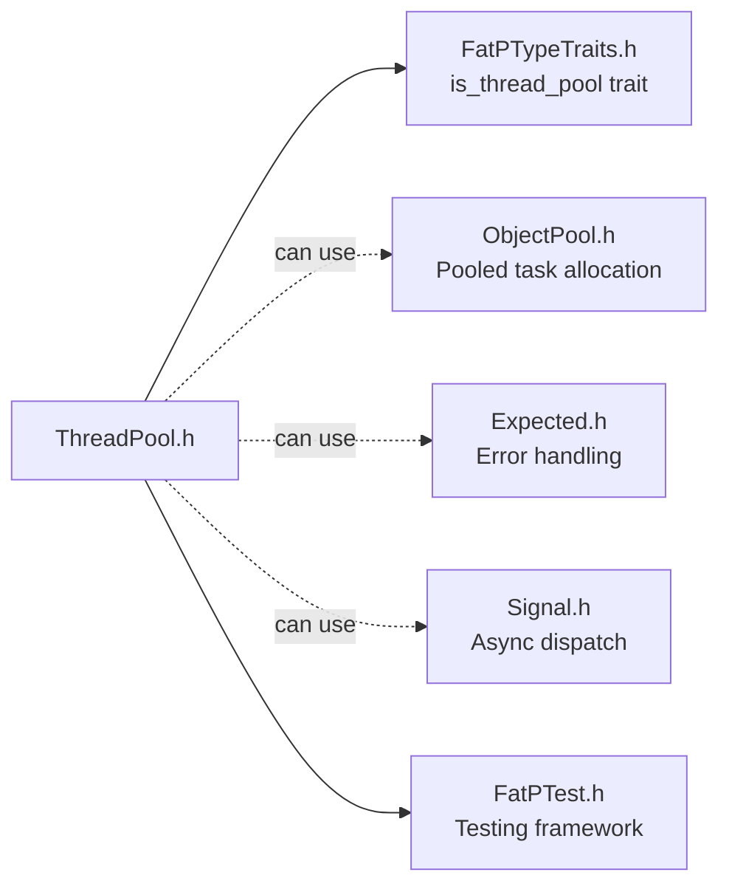
```mermaid
graph LR
    TP["ThreadPool.h"]
    
    TP --> TT["FatPTypeTraits.h<br/>is_thread_pool trait"]
    
    TP -.->|"can use"| OP["ObjectPool.h<br/>Pooled task allocation"]
    TP -.->|"can use"| EXP["Expected.h<br/>Error handling"]
    TP -.->|"can use"| SIG["Signal.h<br/>Async dispatch"]
    
    TP --> TEST["FatPTest.h<br/>Testing framework"]
```

### Integration with Expected

Use `Expected` for explicit error handling without exceptions:

```cpp
#include "ThreadPool.h"
#include "Expected.h"

using Result = fat_p::Expected<Data, std::string>;

auto future = pool.submit([]() -> Result {
    auto data = fetch_data();
    if (!data.valid())
    {
        return fat_p::Unexpected<std::string>("Fetch failed");
    }
    return data;
});

Result result = future.get();  // No exception thrown

if (result.has_value())
{
    process(result.value());
}
else
{
    log_error(result.error());
}
```

### Integration with Signal

Use `Signal` for fire-and-forget async dispatch:

```cpp
#include "ThreadPool.h"
#include "Signal.h"

fat_p::Signal<int> data_ready;
ThreadPool pool(4);

// Connect handler that runs in pool
data_ready.connect([&pool](int value) {
    (void)pool.submit([value]() {
        process(value);  // Runs asynchronously in pool
    });
});

// Emit signal - handler dispatches to pool
data_ready.emit(42);
```

---

## Use Case Guide

### Scientific Computing

Parallel numerical computations:

```cpp
// Matrix multiplication with task parallelism
void parallel_matmul(const Matrix& A, const Matrix& B, Matrix& C)
{
    ThreadPool pool(std::thread::hardware_concurrency());
    
    const size_t n = A.rows();
    const size_t block_size = 64;  // Cache-friendly block size
    
    std::vector<std::future<void>> futures;
    
    for (size_t i = 0; i < n; i += block_size)
    {
        for (size_t j = 0; j < n; j += block_size)
        {
            futures.push_back(pool.submit([&, i, j]() {
                // Compute one block of C
                for (size_t ii = i; ii < std::min(i + block_size, n); ++ii)
                {
                    for (size_t jj = j; jj < std::min(j + block_size, n); ++jj)
                    {
                        double sum = 0;
                        for (size_t k = 0; k < n; ++k)
                        {
                            sum += A(ii, k) * B(k, jj);
                        }
                        C(ii, jj) = sum;
                    }
                }
            }));
        }
    }
    
    for (auto& f : futures)
    {
        f.wait();
    }
}
```

### Game Development

Frame-based task scheduling:

```cpp
class GameTaskScheduler
{
public:
    GameTaskScheduler()
        : render_pool_(2, 5000)   // Low latency for rendering
        , physics_pool_(4, 2000) // Compute-heavy physics
        , io_pool_(2, 0)         // Background I/O
    {}
    
    void tick()
    {
        // Submit render tasks (highest priority)
        auto render = render_pool_.submit_priority(
            Priority::High, [this]() { return render_frame(); });
        
        // Submit physics tasks
        auto physics = physics_pool_.submit([this]() { 
            update_physics(); 
        });
        
        // Background asset loading
        (void)io_pool_.submit_priority(Priority::Low, [this]() {
            prefetch_assets();
        });
        
        // Wait for critical tasks
        render.wait();
        physics.wait();
        
        present_frame();
    }
    
private:
    ThreadPool render_pool_;
    ThreadPool physics_pool_;
    ThreadPool io_pool_;
};
```

### Server Applications

Request handling with backpressure:

```cpp
class RequestHandler
{
public:
    RequestHandler()
        : pool_(std::thread::hardware_concurrency())
        , max_pending_(1000)
    {}
    
    std::optional<std::future<Response>> handle(Request req)
    {
        // Backpressure: reject if overloaded
        if (pool_.pending_tasks() >= max_pending_)
        {
            return std::nullopt;  // 503 Service Unavailable
        }
        
        return pool_.submit_priority(
            categorize_priority(req),
            [req = std::move(req)]() {
                return process_request(req);
            }
        );
    }
    
private:
    Priority categorize_priority(const Request& req)
    {
        if (req.is_health_check()) return Priority::Critical;
        if (req.is_user_facing()) return Priority::High;
        if (req.is_batch()) return Priority::Low;
        return Priority::Normal;
    }
    
    ThreadPool pool_;
    size_t max_pending_;
};
```

### Data Processing Pipelines

ETL with parallel stages:

```cpp
void etl_pipeline(const std::vector<std::string>& files)
{
    ThreadPool pool(8);
    
    // Stage 1: Read files in parallel
    std::vector<std::future<RawData>> read_futures;
    for (const auto& file : files)
    {
        read_futures.push_back(pool.submit([file]() {
            return read_file(file);
        }));
    }
    
    // Stage 2: Transform as reads complete
    std::vector<std::future<TransformedData>> transform_futures;
    for (auto& f : read_futures)
    {
        RawData raw = f.get();  // Wait for read
        transform_futures.push_back(pool.submit([raw = std::move(raw)]() {
            return transform(raw);
        }));
    }
    
    // Stage 3: Load transformed data
    for (auto& f : transform_futures)
    {
        TransformedData data = f.get();
        pool.submit([data = std::move(data)]() {
            load_to_database(data);
        });
    }
    
    pool.wait_idle();  // Wait for all loads to complete
}
```

### Real-Time Systems

Deadline-aware scheduling:

```cpp
class RealTimeScheduler
{
public:
    RealTimeScheduler()
        : pool_(4, 10000)  // Long spin for low latency
    {}
    
    template<typename F>
    bool submit_with_deadline(
        F&& task, 
        std::chrono::steady_clock::time_point deadline)
    {
        auto now = std::chrono::steady_clock::now();
        if (now >= deadline)
        {
            return false;  // Already past deadline
        }
        
        // High priority for deadline-sensitive tasks
        auto future = pool_.submit_priority(Priority::High,
            std::forward<F>(task));
        
        // Wait with timeout
        auto status = future.wait_until(deadline);
        
        return status == std::future_status::ready;
    }
    
private:
    ThreadPool pool_;
};
```

---

## Best Practices for HPC

### Task Granularity

Tasks should be large enough to amortize submission overhead:

```cpp
// BAD: Too fine-grained
// Submission overhead (~2.5us) dominates 10ns of work
for (size_t i = 0; i < N; ++i)
{
    pool.submit([&, i]() {
        result[i] = data[i] * 2;  // 10ns of work
    });
}

// GOOD: Coarse-grained chunks
constexpr size_t CHUNK = 10000;
for (size_t start = 0; start < N; start += CHUNK)
{
    pool.submit([&, start]() {
        size_t end = std::min(start + CHUNK, N);
        for (size_t i = start; i < end; ++i)
        {
            result[i] = data[i] * 2;
        }
    });
}
```

**Rule of thumb:** Tasks should take at least 10-100 microseconds.

### Avoiding Contention

Minimize shared state between tasks:

```cpp
// BAD: All tasks contend on single atomic
std::atomic<uint64_t> global_sum{0};
for (size_t chunk = 0; chunk < num_chunks; ++chunk)
{
    pool.submit([&, chunk]() {
        uint64_t local = compute_chunk(chunk);
        global_sum.fetch_add(local);  // Contention!
    });
}

// GOOD: Per-task results, sequential reduction
std::vector<std::future<uint64_t>> futures;
for (size_t chunk = 0; chunk < num_chunks; ++chunk)
{
    futures.push_back(pool.submit([chunk]() {
        return compute_chunk(chunk);  // No shared state
    }));
}

uint64_t total = 0;
for (auto& f : futures)
{
    total += f.get();  // Sequential reduction
}
```

### Cache Optimization

Structure work to maximize cache locality:

```cpp
// Data fits in L2 cache (~256KB typical)
constexpr size_t L2_SIZE = 256 * 1024;
constexpr size_t CHUNK_BYTES = L2_SIZE / 2;  // Leave room for other data
constexpr size_t CHUNK_ELEMENTS = CHUNK_BYTES / sizeof(double);

for (size_t start = 0; start < N; start += CHUNK_ELEMENTS)
{
    pool.submit([&, start]() {
        size_t end = std::min(start + CHUNK_ELEMENTS, N);
        
        // All accesses within this chunk hit L2
        for (size_t i = start; i < end; ++i)
        {
            output[i] = expensive_function(input[i]);
        }
    });
}
```

### NUMA Considerations

On NUMA systems, memory locality matters:

```cpp
// Awareness: Tasks should access memory local to their NUMA node
// ThreadPool does not provide NUMA affinity, but you can structure work:

void numa_aware_processing(const std::vector<DataRegion>& regions)
{
    ThreadPool pool(std::thread::hardware_concurrency());
    
    for (const auto& region : regions)
    {
        pool.submit([&region]() {
            // Process data that is hopefully local to this thread's core
            // Effectiveness depends on OS thread migration policy
            process_region(region);
        });
    }
    
    pool.wait_idle();
}
```

For true NUMA optimization, consider:
- Using `NumaAllocator` for data allocation
- Pinning threads to NUMA nodes (requires platform-specific code)
- Using one ThreadPool per NUMA node

### Avoiding False Sharing

Ensure output arrays do not cause false sharing:

```cpp
// BAD: Adjacent result elements may share cache lines
std::vector<int> results(num_tasks);
for (size_t i = 0; i < num_tasks; ++i)
{
    pool.submit([&results, i]() {
        results[i] = compute(i);  // May false-share with results[i-1], results[i+1]
    });
}

// GOOD: Pad results to cache line boundaries
struct alignas(64) PaddedResult
{
    int value;
    char padding[60];
};
std::vector<PaddedResult> results(num_tasks);
for (size_t i = 0; i < num_tasks; ++i)
{
    pool.submit([&results, i]() {
        results[i].value = compute(i);  // No false sharing
    });
}

// BETTER: Use futures (each has independent storage)
std::vector<std::future<int>> futures;
for (size_t i = 0; i < num_tasks; ++i)
{
    futures.push_back(pool.submit([i]() {
        return compute(i);
    }));
}
```

---

## Migration Guide

### From std::async

**Before:**

```cpp
std::vector<std::future<int>> futures;
for (int i = 0; i < 100; ++i)
{
    futures.push_back(std::async(std::launch::async, compute, i));
}

std::vector<int> results;
for (auto& f : futures)
{
    results.push_back(f.get());
}
```

**After:**

```cpp
ThreadPool pool(std::thread::hardware_concurrency());

std::vector<std::future<int>> futures;
for (int i = 0; i < 100; ++i)
{
    futures.push_back(pool.submit(compute, i));
}

std::vector<int> results;
for (auto& f : futures)
{
    results.push_back(f.get());
}
```

**Key changes:**
- Create pool once, reuse
- Replace `std::async(std::launch::async, f, args...)` with `pool.submit(f, args...)`
- No other changes needed--futures work the same way

### From Hand-Rolled Pools

**Before:**

```cpp
class OldPool
{
    std::queue<std::function<void()>> tasks_;
    std::mutex mutex_;
    std::condition_variable cv_;
    std::vector<std::thread> workers_;
    bool stop_ = false;
    
    // ... hundreds of lines of bug-prone code ...
};
```

**After:**

```cpp
#include "ThreadPool.h"

fat_p::ThreadPool pool(num_threads);

// Replace task_.push(task) with:
auto future = pool.submit(task);

// Replace custom wait mechanism with:
pool.wait_idle();

// Replace custom shutdown with:
// (automatic on destruction, or call pool.shutdown())
```

### From Intel TBB

**Before:**

```cpp
#include <tbb/tbb.h>

tbb::task_group group;
for (int i = 0; i < 100; ++i)
{
    group.run([i]() { process(i); });
}
group.wait();
```

**After:**

```cpp
#include "ThreadPool.h"

fat_p::ThreadPool pool(std::thread::hardware_concurrency());
for (int i = 0; i < 100; ++i)
{
    (void)pool.submit([i]() { process(i); });
}
pool.wait_idle();
```

**For TBB parallel algorithms:**

```cpp
// TBB:
tbb::parallel_for(0, N, [&](int i) { process(i); });

// ThreadPool (manual chunking):
constexpr size_t CHUNK = 1000;
for (size_t start = 0; start < N; start += CHUNK)
{
    pool.submit([&, start]() {
        for (size_t i = start; i < std::min(start + CHUNK, N); ++i)
        {
            process(i);
        }
    });
}
pool.wait_idle();
```

### Incremental Migration Strategy

1. **Add ThreadPool alongside existing solution:**

```cpp
// Phase 1: Coexistence
OldPool old_pool;
fat_p::ThreadPool new_pool(4);

// New code uses new_pool
new_pool.submit(new_feature);

// Old code continues using old_pool
old_pool.submit(legacy_task);
```

2. **Migrate low-risk code first:**

```cpp
// Phase 2: Migrate non-critical paths
// Background tasks, logging, cleanup
new_pool.submit_priority(Priority::Low, cleanup_task);
```

3. **Migrate critical paths with testing:**

```cpp
// Phase 3: Migrate critical paths
// Add extensive testing before switching
#ifdef USE_NEW_POOL
    new_pool.submit_priority(Priority::High, critical_task);
#else
    old_pool.submit(critical_task);
#endif
```

4. **Remove old implementation:**

```cpp
// Phase 4: Complete migration
// Remove old_pool entirely
```

---

## Troubleshooting

### Compilation Errors

**Error:** `'ThreadPool' is not a member of 'fat_p'`

**Cause:** Header not included or wrong namespace.

**Solution:**

```cpp
#include "ThreadPool.h"

// Either use full qualification:
fat_p::ThreadPool pool(4);

// Or bring into scope:
using fat_p::ThreadPool;
ThreadPool pool(4);
```

---

**Error:** `no matching function for call to 'submit'`

**Cause:** Argument types do not match callable's parameters.

**Solution:**

```cpp
void process(int& x);  // Takes reference

int value = 42;

// WRONG: value is copied
pool.submit(process, value);

// CORRECT: Use std::ref for reference parameters
pool.submit(process, std::ref(value));
```

---

**Error:** `static assertion failed: result type must be constructible from invoke result`

**Cause:** Callable's return type cannot be stored in future.

**Solution:** Ensure return type is copy/move constructible:

```cpp
// WRONG: Non-copyable, non-movable type
struct BadType
{
    BadType() = default;
    BadType(const BadType&) = delete;
    BadType(BadType&&) = delete;
};

auto f = pool.submit([]() { return BadType{}; });  // Error!

// CORRECT: Movable type
struct GoodType
{
    GoodType() = default;
    GoodType(GoodType&&) = default;
};

auto f = pool.submit([]() { return GoodType{}; });  // OK
```

### Runtime Issues

**Problem:** Tasks execute but results are wrong.

**Likely cause:** Capturing by reference when lambda outlives scope.

```cpp
void bad_example(ThreadPool& pool)
{
    int local = 42;
    pool.submit([&local]() {
        // local is destroyed before this runs!
        return local * 2;  // Undefined behavior
    });
}
```

**Solution:** Capture by value or ensure lifetime:

```cpp
void good_example(ThreadPool& pool)
{
    int local = 42;
    
    // Option 1: Capture by value
    auto f = pool.submit([local]() {
        return local * 2;  // local is a copy
    });
    
    // Option 2: Wait before returning
    auto f2 = pool.submit([&local]() {
        return local * 2;
    });
    f2.wait();  // local still valid
}
```

---

**Problem:** `wait_idle()` never returns.

**Likely causes:**
1. Task is blocked waiting for something
2. Task submitted during wait creates infinite loop

**Debugging:**

```cpp
// Add monitoring
std::thread monitor([&pool]() {
    while (true)
    {
        std::cout << "Pending: " << pool.pending_tasks()
                  << " Active: " << pool.active_tasks() << "\n";
        std::this_thread::sleep_for(std::chrono::seconds(1));
    }
});

// Check what tasks are doing
pool.submit([]() {
    std::cout << "Task started\n";
    // ... task code ...
    std::cout << "Task finished\n";
});
```

---

**Problem:** Exception thrown but not caught.

**Cause:** Exception propagates through `future.get()`.

**Solution:**

```cpp
auto future = pool.submit([]() {
    throw std::runtime_error("Error");
    return 42;
});

// WRONG: Unhandled exception
int result = future.get();  // Throws!

// CORRECT: Handle exception
try
{
    int result = future.get();
}
catch (const std::exception& e)
{
    std::cerr << "Task failed: " << e.what() << "\n";
}
```

### Performance Problems

**Problem:** Tasks execute sequentially despite multiple workers.

**Causes:**
1. Tasks too short (overhead dominates)
2. Tasks block on shared resource
3. Single-threaded pool

**Solutions:**

```cpp
// Check thread count
std::cout << "Workers: " << pool.thread_count() << "\n";

// Check for contention (all tasks waiting on same mutex)
// Add timing to identify bottleneck

// Increase task granularity
```

---

**Problem:** High CPU usage when pool is idle.

**Cause:** Spin duration too high.

**Solution:**

```cpp
// Reduce or eliminate spinning
ThreadPool pool(4, 0);  // No spinning

// Or reduce spin duration
ThreadPool pool(4, 500);  // 500us instead of default 2000us
```

---

**Problem:** High latency despite spinning.

**Cause:** Workers busy with other tasks when new task arrives.

**Solutions:**

```cpp
// Use priority for latency-sensitive tasks
pool.submit_priority(Priority::High, latency_sensitive_task);

// Increase thread count
ThreadPool pool(std::thread::hardware_concurrency() * 2);

// Use dedicated pool for latency-sensitive work
ThreadPool latency_pool(2, 10000);  // Dedicated, long spin
```

### Debugging Techniques

**1. Add logging:**

```cpp
#define LOG_TASK(msg) \
    std::cout << "[" << std::this_thread::get_id() << "] " << msg << "\n"

pool.submit([i]() {
    LOG_TASK("Task " << i << " started");
    // ... task code ...
    LOG_TASK("Task " << i << " finished");
});
```

**2. Use ThreadSanitizer:**

```bash
g++ -std=c++17 -fsanitize=thread -g -o app app.cpp
./app
# TSan reports data races
```

**3. Use AddressSanitizer:**

```bash
g++ -std=c++17 -fsanitize=address -g -o app app.cpp
./app
# ASan reports memory errors
```

**4. Reduce to minimal reproduction:**

```cpp
// Start with minimal case
ThreadPool pool(1);
auto f = pool.submit([]() { return 42; });
assert(f.get() == 42);

// Gradually add complexity until bug appears
```

---

## Known Limitations

### Fixed Thread Count

ThreadPool creates a fixed number of worker threads at construction. The thread count
cannot be changed after creation.

**Impact:**
- Cannot scale up during high load
- Cannot scale down during idle periods
- Must choose thread count at startup

**Workarounds:**

```cpp
// Create with maximum expected threads
ThreadPool pool(std::thread::hardware_concurrency());

// Or create multiple pools of different sizes
ThreadPool small_pool(2);
ThreadPool large_pool(8);
// Route tasks to appropriate pool based on load
```

**Why this limitation:**

Dynamic thread scaling adds significant complexity:
- Thread creation/destruction overhead
- Synchronization for pool resize
- Work redistribution during resize
- Potential for thrashing (create/destroy cycles)

For v1.0, simplicity was prioritized over dynamic scaling.

### No Task Cancellation

Once a task is submitted, it cannot be cancelled. It will execute even if the result
is no longer needed.

**Impact:**
- Wasted work on cancelled operations
- Cannot implement request timeouts cleanly
- Long-running tasks block shutdown

**Workarounds:**

```cpp
// Use a cancellation token
std::atomic<bool> cancelled{false};

auto future = pool.submit([&cancelled]() {
    for (int i = 0; i < 1000000 && !cancelled; ++i)
    {
        // Periodically check cancellation
        process_iteration(i);
    }
});

// To cancel:
cancelled = true;
```

**Why this limitation:**

True task cancellation requires:
- Interrupting arbitrary code (dangerous)
- Cleanup of partially completed work
- Synchronization with task execution
- Exception or return value for cancelled state

These complexities were deferred for v1.0.

### Unbounded Queue Growth

ThreadPool does not limit queue size. If tasks are submitted faster than they are
processed, memory usage grows unboundedly.

**Impact:**
- Potential out-of-memory condition
- Latency increases as queue grows
- No backpressure signal to producers

**Workarounds:**

```cpp
// Implement manual backpressure
void submit_with_backpressure(ThreadPool& pool, Task task)
{
    constexpr size_t MAX_PENDING = 1000;
    
    while (pool.pending_tasks() >= MAX_PENDING)
    {
        std::this_thread::sleep_for(std::chrono::milliseconds(10));
    }
    
    pool.submit(std::move(task));
}
```

**Why this limitation:**

Bounded queues require policy decisions:
- Block on full queue? (can deadlock)
- Drop oldest task? (data loss)
- Drop newest task? (data loss)
- Return error? (caller must handle)

Rather than choose a default that might be wrong, ThreadPool leaves this to the user.

### Priority Inversion Possibility

A high-priority task that depends on a low-priority task's result will be blocked:

```cpp
// Low-priority task
auto low = pool.submit_priority(Priority::Low, []() {
    return slow_computation();  // Takes 10 seconds
});

// High-priority task depends on low-priority result
auto high = pool.submit_priority(Priority::High, [&low]() {
    return low.get() * 2;  // BLOCKS for 10 seconds!
});
```

**Impact:**
- High-priority task effective priority reduced to low
- Priority scheduling benefits negated
- Potential latency violations

**Workarounds:**

```cpp
// Make dependency same priority or higher
auto dep = pool.submit_priority(Priority::High, []() {
    return slow_computation();
});

auto high = pool.submit_priority(Priority::High, [&dep]() {
    return dep.get() * 2;
});
```

**Why this limitation:**

Priority inheritance (automatically elevating dependency priority) requires:
- Tracking task dependencies
- Atomic priority updates
- Potential reordering of queued tasks

This complexity was not included in v1.0.

### Limitations Summary Table

| Limitation | Impact | Workaround | v1.1 Planned? |
|------------|--------|------------|---------------|
| Fixed thread count | Cannot adapt to load | Multiple pools | Maybe |
| No cancellation | Wasted work | Cancellation token | Yes |
| Unbounded queues | Memory growth | Manual backpressure | Maybe |
| Priority inversion | Blocked high-pri tasks | Match priorities | No |
| No task dependencies | Manual sequencing | Use futures | No |
| No NUMA affinity | Suboptimal on NUMA | Per-node pools | No |

---

## Summary

ThreadPool is a **zero-dependency, priority-aware, work-stealing task executor** for
modern C++17 applications.

### Key Characteristics

| Characteristic | Details |
|----------------|---------|
| Dependencies | None (header-only, standard library only) |
| C++ Standard | C++17 minimum |
| Priority Levels | Four (Low, Normal, High, Critical) |
| Work Stealing | Fisher-Yates victim selection |
| Idle Strategy | Two-phase spin-then-wait |
| Thread Safety | Full concurrent access support |
| Exception Handling | Propagation via futures |

### Performance Profile

| Metric | Value |
|--------|-------|
| Submission overhead | ~2.5 us |
| Throughput | ~300K tasks/sec |
| Latency p50 (2ms spin) | ~16 us |
| Latency p99 (2ms spin) | ~32 us |

### Quick Start

```cpp
#include "ThreadPool.h"

int main()
{
    fat_p::ThreadPool pool(4);  // 4 workers
    
    // Submit task, get future
    auto future = pool.submit([]() { return 42; });
    
    // Get result
    int result = future.get();
    
    // Pool shuts down automatically
    return 0;
}
```

### The Three Pillars

**1. Permanence**

ThreadPool is not a compatibility shim waiting for C++23/26. The standard's
`std::execution` provides execution *abstractions*, not a concrete thread pool with
priority scheduling and work stealing. ThreadPool remains valuable even after compiler
upgrades.

**2. Specialization**

Generic thread pools treat all tasks equally. ThreadPool's hybrid priority model
routes Critical/High work to a global queue for immediate visibility while Normal/Low
work benefits from per-thread cache locality--an HPC-specific optimization.

**3. Control**

One-size-fits-all pools force CPU/latency trade-offs. ThreadPool's configurable spin
duration allows tuning for your workload: aggressive spinning for latency-critical
paths, zero-spin for background batch processing.

### When to Use ThreadPool

| Use Case | Recommendation |
|----------|----------------|
| HPC clusters | Yes - zero dependencies |
| Header-only libraries | Yes - no linking needed |
| Priority scheduling needed | Yes - four priority levels |
| Maximum throughput | Consider TBB |
| I/O-bound workloads | Consider Asio |
| Task graphs | Consider Taskflow |

### Related Components

| Component | Relationship |
|-----------|--------------|
| FatPTypeTraits.h | Required dependency |
| ObjectPool.h | Optional - pooled task allocation |
| Expected.h | Optional - error handling |
| Signal.h | Optional - async dispatch |
| FatPTest.h | Testing framework |

---

*ThreadPool.h -- Fat-P Library v2.0*
*Last Updated: December 2025*
