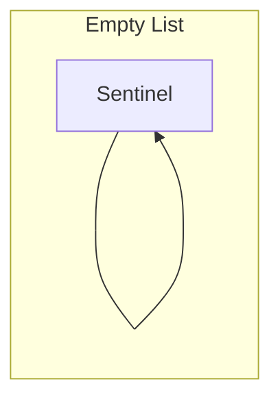
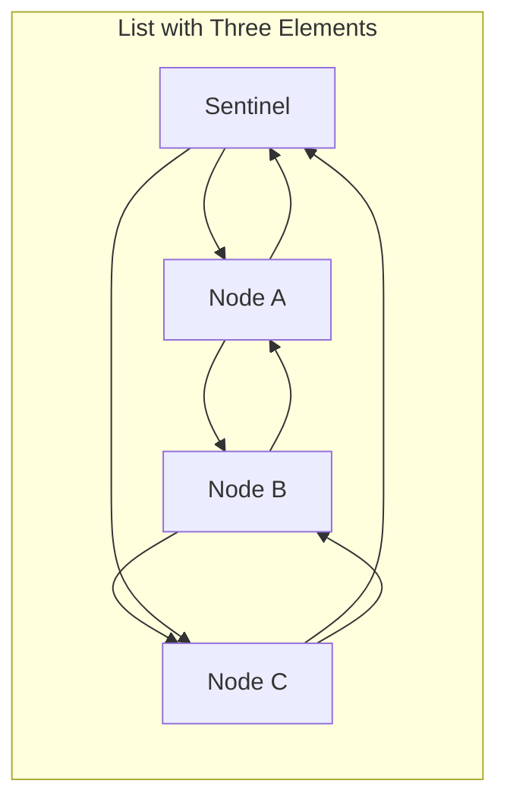
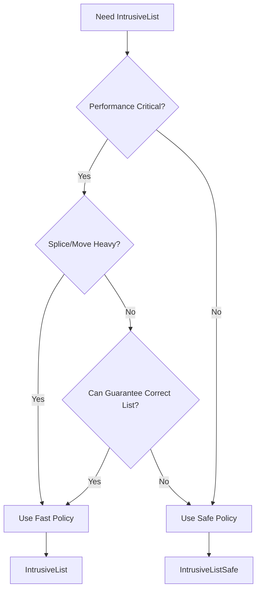

# Overview - IntrusiveList

*Fat-P Library — January 2026*

---

## Executive Summary

IntrusiveList is a doubly-linked list where link pointers are embedded directly in user objects through CRTP inheritance. This architectural choice eliminates all heap allocation for list operations—no node wrappers, no allocator involvement, just pointer manipulation on objects you already own. The result is predictable O(1) performance for insert, remove, and membership testing, with zero memory management overhead.

The library provides two variants through policy-based design: a **fast policy** (default) that minimizes per-node overhead with O(1) splice operations, and a **safe policy** that adds ownership tracking for safe cross-list removal at the cost of O(N) splice. The sentinel-based circular design enables full bidirectional iterator support including correct `--end()` and reverse iteration.

For systems where allocation latency is unacceptable—real-time audio, game engines, embedded controllers, network packet processing—IntrusiveList transforms what would be allocation-bound code into pure computation.

---

## Overview Card

**Component:** IntrusiveList  
**Problem solved:** Heap allocation overhead and unpredictable latency in linked list operations  
**When to use:** Hot loops with frequent list membership changes; real-time systems requiring bounded latency; object pools and free lists; embedded systems with no heap  
**When NOT to use:** Objects need membership in multiple lists simultaneously; polymorphic storage needs; sequential access patterns where std::vector suffices  
**Key guarantee:** Zero allocation for all list operations after object construction  
**std equivalent:** None. No standard intrusive container exists or is planned.  
**Boost equivalent:** `boost::intrusive::list` (similar concept, different ownership model)  
**Other alternatives:** EASTL intrusive_list, LLVM ilist, Linux kernel list.h  
**Read next:** User Manual - IntrusiveList

---

## The Problem Domain

### The Hidden Cost of std::list

Consider a game engine managing active game objects. Every frame, objects spawn, die, and change state. The engine maintains lists of objects by category—renderable objects, physics objects, AI-controlled entities:

```cpp
void GameEngine::update_frame() {
    // Thousands of objects change state every frame
    for (auto& obj : all_objects_) {
        if (obj.became_visible()) {
            renderable_list_.push_back(&obj);  // Hidden allocation
        }
        if (obj.became_invisible()) {
            renderable_list_.remove(&obj);     // Hidden deallocation + O(n) search
        }
    }
}
```

This code looks innocent. It's also killing your frame rate.

Every `push_back` calls `malloc`. Every `remove` calls `free`. With 10,000 active objects and 500 state changes per frame at 60 FPS, that's 30,000 allocations and 30,000 deallocations per second. Each allocation:

1. Acquires a mutex (or contends on lock-free structures)
2. Searches free lists for a suitable block
3. Updates allocator metadata
4. Returns a pointer scattered somewhere in heap space

The visible cost is 50-200 nanoseconds per operation. The hidden cost is worse: cache pollution, memory fragmentation, and latency spikes when the allocator reorganizes its internal structures.

After an hour of play, the heap is fragmented. Allocations that took 50ns now take 500ns as the allocator searches through fragmented free lists. Players notice: the frame rate stutters, the audio glitches, the game feels "janky."

### The Real-Time Constraint

Real-time systems make this problem absolute. An audio callback has 2.9 milliseconds to fill a buffer at 44.1 kHz. A single allocation that takes 100 microseconds—unremarkable in normal code—consumes 3% of your budget. A memory allocator lock contention spike of 500 microseconds causes an audible glitch.

```cpp
// Audio callback - allocation is FORBIDDEN
void AudioEngine::process_callback(float* buffer, size_t frames) {
    // You have 2.9ms. Every microsecond counts.
    
    for (auto& voice : active_voices_) {  // Cannot use std::list here
        voice.render(buffer, frames);
    }
    
    // Voices that finished must be moved to free list
    // std::list would allocate here - UNACCEPTABLE
}
```

The audio industry learned this lesson decades ago. Professional audio software never allocates in the audio thread. Game engines learned it too. Network servers processing millions of packets per second learned it. The pattern is universal: in performance-critical paths, allocation is the enemy.

---

## Architecture: Sentinel-Based Circular Design

IntrusiveList uses a **sentinel-based circular list** architecture that provides correct bidirectional iteration while maintaining zero allocation for all operations.

### The Sentinel Node

Every IntrusiveList contains a sentinel node that serves as both the beginning and end marker of the circular chain:





**Key Invariants:**

- **Empty list:** `sentinel.prev == &sentinel` and `sentinel.next == &sentinel`
- **Linked node:** `node.prev != nullptr` (participates in circular chain)
- **Unlinked node:** `node.prev == nullptr` and `node.next == nullptr`

### Why Sentinel-Based?

The original head/tail pointer design had a fundamental problem: `--end()` was undefined behavior because `end()` was `nullptr`. This violated the BidirectionalIterator concept and prevented reverse iteration from working correctly.

The sentinel-based design solves this:

```cpp
// Now works correctly:
auto it = list.end();
--it;  // Points to last element (sentinel.prev)

// Reverse iteration works:
for (auto it = list.rbegin(); it != list.rend(); ++it) {
    process(*it);
}
```

The sentinel is stored inside the list object itself—no allocation required. The cost is a small increase in list object size (one Hook worth of storage), but this is typically negligible compared to the nodes themselves.

---

## Policy-Based Ownership Tracking

IntrusiveList provides two ownership policies that let you choose between performance and safety:

### FastOwnerPolicy (Default)

```cpp
struct Task : fat_p::IntrusiveListNode<Task> { int id; };
fat_p::IntrusiveList<Task> queue;  // Uses FastOwnerPolicy by default
```

**Properties:**
- Smallest node footprint: 16 bytes (2 pointers: prev/next)
- O(1) splice operations (no ownership updates needed)
- O(1) move construction/assignment
- `isLinked()` checks if `prev != nullptr`

**Contract:**
- Removing a node from the wrong list is **undefined behavior** in Release
- Debug builds assert if node not in list
- You must know which list contains each node

### SafeOwnerPolicy (Opt-in)

```cpp
struct Task : fat_p::IntrusiveListNode<Task, fat_p::intrusive_list::SafeOwnerPolicy> { 
    int id; 
};
fat_p::IntrusiveListSafe<Task> queue;  // Explicitly uses SafeOwnerPolicy
```

**Properties:**
- Per-node owner pointer: 24 bytes (3 pointers: prev/next/owner)
- O(N) splice operations (must update owner for each transferred node)
- O(N) move construction/assignment (must update owner for all nodes)
- `isLinked()` checks if `prev != nullptr`

**Contract:**
- Removing a node from the wrong list is a **safe no-op**
- Iterator provenance can be validated in O(1)
- Safe for scenarios where callers might accidentally remove from wrong list

### Choosing a Policy



**Use Fast Policy (default) when:**
- Free-list / object pool patterns
- Per-thread queues where ownership is clear
- Splice-heavy workloads
- Maximum performance is required

**Use Safe Policy when:**
- APIs where callers may accidentally remove from wrong list
- Debugging complex list interactions
- Safety is more important than O(1) splice

---

## Performance Characteristics

Benchmarks on Linux, GCC 13, 2.1 GHz (median of 50 runs):

| Operation | std::list<T*> | IntrusiveList (Fast) | Speedup |
|-----------|--------------|----------------------|---------|
| push_back (N=10k) | 18.6 ns/op | **2.1 ns/op** | **8.9×** |
| remove with known reference | 28.9 ns/op | **1.7 ns/op** | **17×** |
| Iteration sum (N=10k) | 19.7 µs | 21.7 µs | 0.9× |
| splice (N=10k) | 239 µs | **91 µs** | **2.6×** |
| isLinked() check | N/A | **<1 ns** | - |

**Note on Iteration:** The iteration benchmark shows comparable performance because IntrusiveList nodes contain embedded payload accessed directly, while std::list stores separate pointers requiring indirection. For iteration-dominated workloads, actual performance depends on your memory layout.

### Memory Overhead Comparison

| Implementation | Per-Node Overhead | Notes |
|----------------|------------------|-------|
| fat_p (Fast) | 16 bytes | prev + next only |
| fat_p (Safe) | 24 bytes | prev + next + owner |
| boost::intrusive (default) | 16 bytes | prev + next |
| boost::intrusive (safe_link) | 24 bytes | prev + next + owner |
| std::list | 16 bytes + allocation overhead | Node wrapper allocations |
| EASTL intrusive_list | 16 bytes | prev + next |

### Complexity Summary

| Operation | Fast Policy | Safe Policy | std::list |
|-----------|-------------|-------------|-----------|
| push_back | O(1) | O(1) | O(1) + alloc |
| push_front | O(1) | O(1) | O(1) + alloc |
| remove(node) | O(1)† | O(1) | O(n) search |
| erase(iterator) | O(1) | O(1) | O(1) + free |
| splice(all) | O(1) | O(n) | O(1) |
| isLinked() | O(1) | O(1) | N/A |
| size() | O(1) | O(1) | O(1) |

†In debug mode, assertions validate ownership

---

## Why Not Alternatives?

### boost::intrusive::list

Boost.Intrusive is the most mature C++ intrusive container library:

| Aspect | boost::intrusive::list | FAT-P IntrusiveList |
|--------|----------------------|---------------------|
| **Default ownership** | None | None (Fast policy) |
| **Safe mode** | safe_link option | SafeOwnerPolicy |
| **--end() support** | Depends on sentinel option | Always (sentinel-based) |
| **Dependencies** | Boost headers (~50+ headers) | None (single header) |
| **Hook options** | Many (base_hook, member_hook, etc.) | CRTP inheritance only |
| **Splice complexity** | O(1) default, O(n) safe_link | O(1) Fast, O(n) Safe |

**When to use Boost:** You need hook flexibility, you're already using Boost, or you need advanced features like auto_unlink.

**When to use FAT-P:** You want zero dependencies, a simpler mental model, or guaranteed correct bidirectional iteration.

### LLVM ilist

LLVM's `ilist` and `simple_ilist` are designed for compiler infrastructure:

| Aspect | LLVM ilist | FAT-P IntrusiveList |
|--------|-----------|---------------------|
| **Sentinel design** | Heap-allocated or embedded | Always embedded |
| **--end() support** | Yes | Yes |
| **Callbacks** | ilist_traits for customization | None |
| **Use case** | Compiler IR manipulation | General intrusive lists |

**When to use LLVM ilist:** You're building compiler infrastructure or need ilist_traits callbacks.

**When to use FAT-P:** You want simpler API without callback machinery.

---

## API at a Glance

### Type Aliases

```cpp
// Fast policy (default) - O(1) splice, wrong-list remove is UB
template <typename T>
using IntrusiveListFast = IntrusiveList<T, intrusive_list::FastOwnerPolicy>;

// Safe policy - O(n) splice, wrong-list remove is safe no-op
template <typename T>
using IntrusiveListSafe = IntrusiveList<T, intrusive_list::SafeOwnerPolicy>;
```

### Quick Example

```cpp
#include <fat_p/IntrusiveList.h>

// Fast policy (default)
struct Task : fat_p::IntrusiveListNode<Task> {
    int priority;
    std::string name;
};

fat_p::IntrusiveList<Task> ready_queue;
Task task1{5, "render"};
Task task2{10, "physics"};

ready_queue.push_back(task1);
ready_queue.push_back(task2);

for (Task& t : ready_queue) {
    std::cout << t.name << std::endl;
}

// Reverse iteration works correctly
for (auto it = ready_queue.rbegin(); it != ready_queue.rend(); ++it) {
    std::cout << it->name << std::endl;
}

// O(1) membership check and removal
if (task1.isLinked()) {
    ready_queue.remove(task1);
}
```

### Safe Policy Example

```cpp
// Safe policy - for APIs where wrong-list removal might happen
struct SafeTask : fat_p::IntrusiveListNode<SafeTask, fat_p::intrusive_list::SafeOwnerPolicy> {
    int id;
};

fat_p::IntrusiveListSafe<SafeTask> listA, listB;
SafeTask task{42};

listA.push_back(task);

// Wrong-list removal is safe no-op (not UB)
listB.remove(task);  // Does nothing, task still in listA

// Correct removal
listA.remove(task);  // Actually removes
```

---

## Integration Points

```
IntrusiveList.h
    → uses: <cassert> (debug assertions)
    → pattern: Free list in any pool/cache structure
    → pattern: Observer/subscriber lists
    → pattern: Task queues and work stealing
```

IntrusiveList is a foundation pattern for zero-allocation data structures. Any time objects need O(1) add/remove without heap allocation, IntrusiveList is the appropriate tool.

---

## Final Assessment

IntrusiveList delivers on the FAT-P promise:

**Permanence.** The standard will never provide intrusive containers. The design philosophies are incompatible. IntrusiveList fills a permanent gap.

**Specialization.** Policy-based ownership, correct bidirectional iteration, sentinel-based design—these address real correctness issues that simpler implementations ignore.

**Control.** Zero dependencies. Single header. Predictable performance. No hidden allocations. You know exactly what every operation costs.

For systems where allocation is the enemy—real-time audio, game engines, embedded systems, high-frequency trading, network packet processing—IntrusiveList transforms allocation-bound code into compute-bound code.

**The tradeoff is clear:**
- Fast policy: 16 bytes per node, O(1) everything, wrong-list remove is UB
- Safe policy: 24 bytes per node, O(n) splice, wrong-list remove is safe no-op

Choose your policy based on your constraints. Both guarantee zero allocation in hot paths.

---

*IntrusiveList.h — Fat-P Library v3.3*
