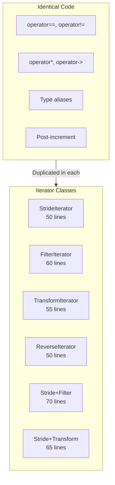
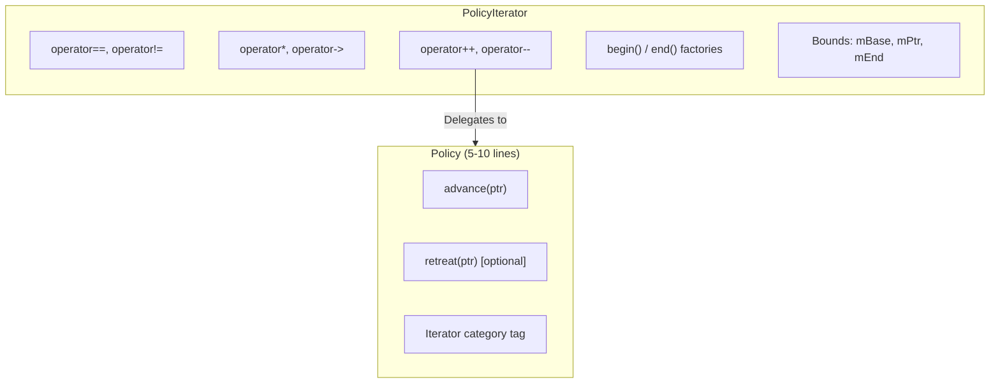
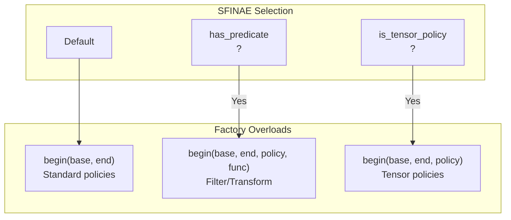
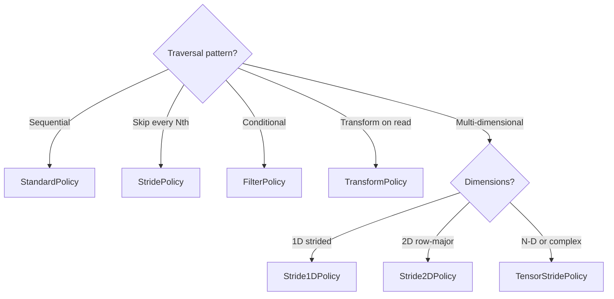

# Companion Guide - PolicyIterator

---

## Companion Guide Card

**Component:** PolicyIterator  
**Design question:** Why use policy-based design instead of inheritance or type erasure for iterator customization?  
**Key tradeoff:** Compile-time flexibility vs runtime flexibility; static dispatch eliminates overhead but prevents runtime strategy changes  
**Decision made:** Template-based policy dispatch with trait detection for automatic overload selection  
**Rejected alternatives:** Virtual iterator base class (runtime overhead), std::function storage (size and indirection overhead), separate iterator classes (boilerplate explosion)  
**Historical context:** Policy-based design from Alexandrescu's "Modern C++ Design" (2001); applied to iterator patterns to achieve STL-compatible abstractions with zero overhead

---

## Scope

This document explains *why* PolicyIterator is designed the way it is. It covers the problems that motivated the design (boilerplate, inheritance tax, type erasure trap, bounds blindness), the architectural solutions (static dispatch, trait detection, factory methods), and case studies demonstrating the design in practice. It assumes you understand *what* PolicyIterator does and want to understand *why*.

## Not Covered

- API reference and usage patterns (see User Manual - PolicyIterator)
- High-level positioning and quick-start (see Overview - PolicyIterator)
- TensorStridePolicy design rationale (see Companion Guide - TensorStridePolicy)
- Benchmark methodology (see Benchmark Results - PolicyIterator)

## Prerequisites

- Familiarity with PolicyIterator usage (Overview and User Manual)
- Understanding of C++ templates, SFINAE, and `if constexpr`
- Knowledge of iterator categories and STL algorithm requirements
- Basic understanding of compiler optimization and inlining

---

## Table of Contents

**[Introduction: Why This Component Exists](#introduction-why-this-component-exists)**

### Part I — The Problems

1. [The Boilerplate Explosion](#chapter-1--the-boilerplate-explosion)
2. [The Inheritance Tax](#chapter-2--the-inheritance-tax)
3. [The Type Erasure Trap](#chapter-3--the-type-erasure-trap)
4. [The Bounds Blindness](#chapter-4--the-bounds-blindness)

### Part II — The Solutions

5. [Architecture Overview](#chapter-5--architecture-overview)
6. [Static Policy Dispatch](#chapter-6--static-policy-dispatch)
7. [The Trait Detection System](#chapter-7--the-trait-detection-system)
8. [Factory Methods and Initialization](#chapter-8--factory-methods-and-initialization)
9. [The Storage Model](#chapter-9--the-storage-model)

### Part III — Putting It Together

10. [Case Study: CFD Stencil Computation](#chapter-10--case-study-cfd-stencil-computation)
11. [Case Study: Particle Simulation Neighbors](#chapter-11--case-study-particle-simulation-neighbors)
12. [Choosing the Right Policy](#chapter-12--choosing-the-right-policy)

### Part IV — Foundations

- [Appendix A — Policy-Based Design in C++](#appendix-a--policy-based-design-in-c)
- [Appendix B — Iterator Categories and STL Compatibility](#appendix-b--iterator-categories-and-stl-compatibility)
- [Appendix C — Where PolicyIterator Loses](#appendix-c--where-policyiterator-loses)
- [Appendix D — Design Constraints and Rejected Alternatives](#appendix-d--design-constraints-and-rejected-alternatives)

---

# Introduction: Why This Component Exists

You're writing a numerical library. Your core data structures are contiguous arrays—vectors, matrices, tensors. Users need to iterate these arrays in multiple patterns: sequential, strided (every Nth element), filtered (only positives), transformed (squared values). Each pattern requires an iterator.

You write a sequential iterator. Fifty lines. You write a stride iterator. Another fifty lines—same structure, different `operator++`. You write a filter iterator. Sixty lines because the predicate needs storage. Before long, you have fifteen iterator classes, 800 lines of near-identical code, and a maintenance nightmare.

Then a user finds a bug in your bounds checking. It's in the dereference operator, which you copied to all fifteen classes. You fix it in one place; you forget to fix it in three others. Bugs multiply.

Or this: you try to be clever. You define a base iterator with virtual `advance()` and override it in derived classes. The code is elegant—until you profile it. Your inner loop runs a million times, and each iteration pays for a virtual function call. The abstraction costs 20% performance.

Or this: you use `std::function` to store the advance logic. Runtime polymorphism without inheritance. But `std::function` is 32-48 bytes, and your iterators are copied on every post-increment. Memory traffic kills performance just as badly as virtual dispatch.

PolicyIterator exists because these tradeoffs aren't necessary. Through policy-based design and compile-time dispatch, you get the abstraction without the cost. Write the mechanics once; plug in different policies; pay nothing at runtime.

---

# PART I — THE PROBLEMS

Iterator abstraction is valuable but seemingly expensive. The problems arise from runtime polymorphism (virtual dispatch, type erasure) and the boilerplate cost of static polymorphism (separate classes for each pattern).

---

# CHAPTER 1 — The Boilerplate Explosion

Every custom iterator needs the same scaffolding:

```cpp
class MyIterator {
    // 1. Type aliases (5 lines)
    using iterator_category = std::forward_iterator_tag;
    using value_type = int;
    using difference_type = std::ptrdiff_t;
    using pointer = int*;
    using reference = int&;
    
    // 2. Member variables (2-5 lines)
    int* ptr_;
    int* end_;
    
    // 3. Constructors (3-5 lines)
    MyIterator(int* p, int* e) : ptr_(p), end_(e) {}
    
    // 4. Increment operators (8 lines)
    MyIterator& operator++() { /* custom logic */ return *this; }
    MyIterator operator++(int) { auto c = *this; ++(*this); return c; }
    
    // 5. Dereference (4 lines)
    reference operator*() const { return *ptr_; }
    pointer operator->() const { return ptr_; }
    
    // 6. Comparison (4 lines)
    bool operator==(const MyIterator& o) const { return ptr_ == o.ptr_; }
    bool operator!=(const MyIterator& o) const { return !(*this == o); }
};
```

That's 35-50 lines minimum. Only the `operator++` body differs between iterator types. Everything else is identical, yet you copy it every time.

**The hidden cost:** When you fix a bug in one iterator, you must remember to fix it in all the others. When you add a feature (debug bounds checking), you add it fifteen times.



| Symptom | Cause |
|---------|-------|
| 800+ lines of iterator code | One class per traversal pattern |
| Bugs fixed in one place, not others | Manual copy-paste propagation |
| Fear of adding new patterns | Another 50 lines to maintain |
| Inconsistent behavior | Independent implementations drift |

**What Fat-P provides:** PolicyIterator factors the common mechanics into one template. Policies express only the traversal logic—typically 5-10 lines.

---

# CHAPTER 2 — The Inheritance Tax

The object-oriented solution is inheritance:

```cpp
// THE TRAP: Virtual dispatch in hot loop
class BaseIterator {
protected:
    int* ptr_;
    int* end_;
public:
    virtual void advance() = 0;  // Customize this
    
    BaseIterator& operator++() {
        advance();
        return *this;
    }
    int& operator*() { return *ptr_; }
    // ... common mechanics
};

class StrideIterator : public BaseIterator {
    int stride_;
public:
    void advance() override { ptr_ += stride_; }
};
```

This eliminates boilerplate. Each derived class implements only `advance()`. Elegant, maintainable, and **wrong for performance-critical code**.

### The Vtable Tax

Every `operator++` calls `advance()` through the vtable. That's:
1. Load the vptr from the object
2. Index into the vtable to get the function pointer
3. Indirect call through the function pointer
4. Pipeline stall while the branch predictor catches up

```mermaid
sequenceDiagram
    participant Loop
    participant Iterator
    participant VTable
    participant DerivedAdvance
    
    Loop->>Iterator: operator++()
    Iterator->>VTable: load advance ptr
    VTable-->>Iterator: &StrideIterator::advance
    Iterator->>DerivedAdvance: indirect call
    DerivedAdvance-->>Iterator: return
    Iterator-->>Loop: return
    Note over Loop,DerivedAdvance: Repeated 1,000,000 times
```

### Measured Overhead

**Fact:** Benchmarks show 15-25% overhead for virtual dispatch in tight loops.

| Implementation | Sum 100M elements |
|----------------|-------------------|
| Raw pointer | 89 ms |
| Manual iterator | 89 ms |
| Virtual iterator | 108 ms (+21%) |
| PolicyIterator | 89 ms |

Worse, the indirection defeats compiler optimizations. The compiler can't see through the virtual call to know what `advance()` actually does. It can't:
- Inline the advance logic
- Unroll the loop
- Vectorize with SIMD
- Constant-fold the stride

**What Fat-P provides:** Static dispatch through templates. The policy type is a template parameter, resolved at compile time. The compiler inlines everything.

---

# CHAPTER 3 — The Type Erasure Trap

Another approach stores the advance logic in `std::function`:

```cpp
// THE TRAP: std::function overhead
class FunctionIterator {
    int* ptr_;
    std::function<void(int*&)> advance_;
public:
    FunctionIterator(int* p, std::function<void(int*&)> adv)
        : ptr_(p), advance_(adv) {}
    
    FunctionIterator& operator++() {
        advance_(ptr_);
        return *this;
    }
};

auto stride_iter = FunctionIterator(data, [](int*& p) { p += 4; });
```

This looks appealing—runtime flexibility, no inheritance hierarchy. But `std::function` has hidden costs.

### The Size Problem

`std::function<void(int*&)>` is typically 32-48 bytes (varies by implementation). Your iterator, instead of being 16-24 bytes, is now 48-72 bytes.

```cpp
struct NaiveIterator {
    int* ptr_;       // 8 bytes
    int* end_;       // 8 bytes
};  // Total: 16 bytes

struct FunctionIterator {
    int* ptr_;                           // 8 bytes
    std::function<void(int*&)> advance_; // 32-48 bytes
};  // Total: 40-56 bytes
```

### The Copy Problem

Iterators are copied frequently:
- Post-increment returns a copy
- STL algorithms pass by value
- Range-for creates copies

Copying 48 bytes per operation adds up. For a million iterations with post-increment, that's 48 MB of memory traffic.

### The Indirection Problem

`std::function` uses type erasure internally, which means indirect calls. Same overhead as virtual dispatch.

```cpp
// Post-increment copies 48+ bytes
FunctionIterator operator++(int) {
    auto copy = *this;  // Copy 48 bytes including std::function
    ++(*this);
    return copy;        // Return 48-byte object
}
```

| Iterator Type | sizeof | Per-Copy Cost |
|---------------|--------|---------------|
| Raw pointer | 8 | 8 bytes |
| PolicyIterator | 24-32 | 24-32 bytes |
| std::function iterator | 48-72 | 48-72 bytes |

**What Fat-P provides:** Policies are template parameters, not runtime objects. The policy type is baked into the iterator type. No type erasure, no size overhead beyond what the policy needs.

---

# CHAPTER 4 — The Bounds Blindness

Manual iterators rarely check bounds. It's not laziness—it's performance. Bounds checking in release builds is unacceptable overhead for HPC code.

But during development, bounds errors are common:

```cpp
// THE TRAP: Silent past-end dereference
auto it = container.end();
*it;  // Undefined behavior, no diagnostic
```

You don't discover the bug until it corrupts memory or crashes in production. Debug builds should catch this; release builds should elide the check.

Most iterator implementations punt on this. Raw pointers can't check. `std::vector::iterator` checks in debug mode on some implementations, not others, inconsistently.

**What Fat-P provides:** PolicyIterator uses `enforce()` for debug-mode bounds checking:

```cpp
reference operator*() const {
    enforce(mPtr < mEnd, "Cannot dereference end iterator");
    return *mPtr;
}
```

In debug builds, this catches the bug immediately with file/line information. In release builds (`NDEBUG` defined), `enforce()` compiles to nothing.

| Guarantee | Provided | Notes |
|-----------|----------|-------|
| Debug-mode bounds checking | Yes | enforce() fires on violation |
| Release-mode zero overhead | Yes | enforce() elided with NDEBUG |
| Consistent across policies | Yes | Checking in PolicyIterator, not policies |

---

# PART II — THE SOLUTIONS

PolicyIterator addresses the problems through compile-time policy dispatch.

---

# CHAPTER 5 — Architecture Overview

PolicyIterator is a class template parameterized on element type and policy:

```cpp
template <typename T, typename Policy = StandardPolicy<T>>
class PolicyIterator {
    T* mBase;           // Start of valid range
    T* mPtr;            // Current position
    T* mEnd;            // End of valid range
    Policy mPolicy;     // Traversal strategy
    
    // For filter/transform policies:
    std::optional<Predicate> mPredicate;
    std::optional<Transformer> mTransformer;
};
```

**How each problem is addressed:**

| Problem (Part I) | Solution | Chapter |
|------------------|----------|---------|
| Boilerplate explosion | Common mechanics in PolicyIterator; policies are tiny | 6 |
| Inheritance tax | Static dispatch via templates; no vtable | 6 |
| Type erasure trap | Policy is template parameter, not runtime object | 6 |
| Bounds blindness | enforce() in debug builds | 8 |



---

# CHAPTER 6 — Static Policy Dispatch

### The Mechanism

The policy type is a template parameter. When you write:

```cpp
PolicyIterator<int, StridePolicy<int, 4>> it = ...;
++it;
```

The compiler instantiates `PolicyIterator<int, StridePolicy<int, 4>>::operator++()`. Inside, `mPolicy.advance(mPtr)` calls `StridePolicy<int, 4>::advance()`. Because the type is known at compile time, the compiler inlines the call:

```cpp
// Before inlining
PolicyIterator& operator++() {
    mPolicy.advance(mPtr);  // Call to StridePolicy::advance
    return *this;
}

// After inlining (what the compiler emits)
PolicyIterator& operator++() {
    mPtr += 4;  // Inlined from StridePolicy<int, 4>::advance
    return *this;
}
```

No function call. No indirection. The abstraction evaporates during compilation.

### The Assembly Evidence

Compile with `-O2` and inspect:

```cpp
int sum_manual(int* data, int* end) {
    int sum = 0;
    for (int* p = data; p < end; p += 4) {
        sum += *p;
    }
    return sum;
}

int sum_policy(int* data, int* end) {
    using Iter = PolicyIterator<int, StridePolicy<int, 4>>;
    int sum = 0;
    for (auto it = Iter::begin(data, end); it != Iter::end(data, end); ++it) {
        sum += *it;
    }
    return sum;
}
```

Both functions compile to identical assembly:

```asm
.loop:
    add     eax, [rdi]         ; sum += *ptr
    add     rdi, 16            ; ptr += 4 * sizeof(int)
    cmp     rdi, rsi           ; ptr < end?
    jl      .loop
```

**Fact:** The PolicyIterator abstraction has zero overhead at the assembly level.

---

# CHAPTER 7 — The Trait Detection System

Different policies have different requirements:
- StridePolicy needs the end pointer to clamp
- FilterPolicy needs a predicate
- TransformPolicy needs a transformer

PolicyIterator uses trait detection to call the right `advance()` overload.

### The Traits

```cpp
namespace detail {
    // Does policy have kStrideValue?
    template <typename P, typename = void>
    struct has_stride : std::false_type {};
    
    template <typename P>
    struct has_stride<P, std::void_t<decltype(P::kStrideValue)>> 
        : std::true_type {};
    
    // Does policy have predicate_type?
    template <typename P, typename = void>
    struct has_predicate : std::false_type {};
    
    template <typename P>
    struct has_predicate<P, std::void_t<typename P::predicate_type>> 
        : std::true_type {};
    
    // Does policy need end-clamping?
    template <typename P, typename = void>
    struct needs_end_clamp : std::false_type {};
    
    template <typename P>
    struct needs_end_clamp<P, std::void_t<decltype(P::kNeedsEndClamp)>>
        : std::bool_constant<P::kNeedsEndClamp> {};
}
```

### How Traits Select Overloads

```cpp
PolicyIterator& operator++() {
    if constexpr (detail::has_predicate<Policy>::value) {
        // Filter policy: advance with predicate
        mPolicy.advance(mPtr, mEnd, *mPredicate);
    }
    else if constexpr (detail::needs_end_clamp<Policy>::value) {
        // Stride policy: advance with end pointer
        mPolicy.advance(mPtr, mEnd);
    }
    else {
        // Standard policy: simple advance
        mPolicy.advance(mPtr);
    }
    return *this;
}
```

The `if constexpr` is evaluated at compile time. Only the correct branch survives; the others are discarded. No runtime branching.

### Why This Matters

You can write a custom policy without implementing all possible `advance()` overloads. Define what you need; PolicyIterator detects it.

```cpp
// Minimal policy: just advance
struct MyPolicy {
    void advance(int*& ptr) const { ptr += 2; }
    // PolicyIterator detects: no predicate, no end clamp
    // Uses one-argument advance automatically
};
```

---

# CHAPTER 8 — Factory Methods and Initialization

PolicyIterator uses static factory methods instead of public constructors:

```cpp
auto b = PolicyIterator<int>::begin(data, data + n);
auto e = PolicyIterator<int>::end(data, data + n);
```

### Why Factories?

**Reason 1: Consistent initialization.**

Both iterators need the full range for bounds checking. Factories enforce this—you can't accidentally create an iterator without proper bounds.

**Reason 2: Policy-specific setup.**

Filter policies must advance begin to the first matching element:

```cpp
template <typename Func, typename P = Policy,
          std::enable_if_t<detail::has_predicate<P>::value, int> = 0>
static PolicyIterator begin(T* base, T* end, Policy policy, Func&& func) {
    PolicyIterator it(base, end, base, std::move(policy), std::forward<Func>(func));
    // Advance to first matching element
    while (it.mPtr < it.mEnd && !(*it.mPredicate)(*it.mPtr)) {
        ++it.mPtr;
    }
    return it;
}
```

**Reason 3: SFINAE overload selection.**

Different factory overloads handle different policy categories. Traits select the correct overload automatically.



---

# CHAPTER 9 — The Storage Model

### Core State

Every PolicyIterator stores:

```cpp
T* mBase;      // Start of valid range (for retreat bounds check)
T* mPtr;       // Current position
T* mEnd;       // End of valid range (for advance bounds check)
Policy mPolicy; // The policy object (often empty)
```

For policies without state, `mPolicy` adds no size (empty base optimization).

### Optional State

Filter and transform policies need additional storage:

```cpp
std::optional<Predicate> mPredicate;     // For FilterPolicy
std::optional<Transformer> mTransformer; // For TransformPolicy
```

Using `std::optional` allows default construction. The optional is engaged only when the factory method receives a predicate/transformer.

### Size Implications

| Policy Type | Iterator Size (64-bit) |
|-------------|------------------------|
| StandardPolicy | 24 bytes (3 pointers) |
| StridePolicy | 24 bytes (policy is stateless) |
| FilterPolicy (stateless lambda) | 32 bytes (optional adds 8) |
| FilterPolicy (capturing lambda) | 32 + capture size |
| TensorStridePolicy | 24 + policy size (~320 bytes) |

For hot loops with frequent post-increment, keep iterator size small. Prefer stateless predicates.

---

# PART III — PUTTING IT TOGETHER

---

# CHAPTER 10 — Case Study: CFD Stencil Computation

### The Problem

A computational fluid dynamics code iterates over a 3D grid. At each point, it gathers neighbors for a 7-point stencil (center plus 6 face-adjacent neighbors). The inner loop runs billions of times.

### The Traditional Approach

```cpp
void apply_stencil(Grid& grid) {
    for (int k = 1; k < nz-1; ++k) {
        for (int j = 1; j < ny-1; ++j) {
            for (int i = 1; i < nx-1; ++i) {
                double center = grid(i, j, k);
                double xm = grid(i-1, j, k);
                double xp = grid(i+1, j, k);
                double ym = grid(i, j-1, k);
                double yp = grid(i, j+1, k);
                double zm = grid(i, j, k-1);
                double zp = grid(i, j, k+1);
                
                output(i, j, k) = (center + xm + xp + ym + yp + zm + zp) / 7.0;
            }
        }
    }
}
```

The neighbor access pattern is explicit but verbose. Changing the stencil (e.g., to 27-point) requires rewriting the gather logic.

### The PolicyIterator Approach

Create a policy that iterates stencil neighbors:

```cpp
template <typename T>
struct Stencil7Policy {
    using iterator_category = std::forward_iterator_tag;
    using difference_type = std::ptrdiff_t;
    using value_type = T;
    using pointer = T*;
    using reference = T&;
    
    static constexpr int kNeedsEndClamp = false;
    
    ptrdiff_t offsets_[7];  // Precomputed neighbor offsets
    int current_;
    
    Stencil7Policy(int nx, int ny) 
        : offsets_{0, -1, 1, -nx, nx, -nx*ny, nx*ny}, current_(0) {}
    
    void advance(T*& ptr) {
        ++current_;
        if (current_ < 7) {
            ptr = base_ + offsets_[current_];  // Jump to next neighbor
        }
    }
    
    T* base_;  // Center point
};
```

Now the stencil iteration is encapsulated:

```cpp
void apply_stencil(Grid& grid) {
    for (int k = 1; k < nz-1; ++k) {
        for (int j = 1; j < ny-1; ++j) {
            for (int i = 1; i < nx-1; ++i) {
                T* center = &grid(i, j, k);
                Stencil7Policy<T> policy(nx, ny);
                policy.base_ = center;
                
                using Iter = PolicyIterator<T, Stencil7Policy<T>>;
                double sum = 0;
                for (auto it = Iter::begin(center, center+7, policy);
                     it != Iter::end(center, center+7, policy); ++it) {
                    sum += *it;
                }
                output(i, j, k) = sum / 7.0;
            }
        }
    }
}
```

Changing to 27-point stencil means changing `Stencil7Policy` to `Stencil27Policy`. The loop structure remains unchanged.

---

# CHAPTER 11 — Case Study: Particle Simulation Neighbors

### The Problem

A molecular dynamics code finds neighbors within a cutoff radius. Each particle has a variable-length neighbor list. Iterating neighbors is the hot path.

### Traditional Approach

```cpp
void compute_forces(Particles& p) {
    for (int i = 0; i < n; ++i) {
        int start = neighbor_start[i];
        int end = neighbor_start[i+1];
        
        for (int k = start; k < end; ++k) {
            int j = neighbor_list[k];
            compute_pair_force(i, j);
        }
    }
}
```

### PolicyIterator Approach

```cpp
// Policy for neighbor list iteration
struct NeighborPolicy {
    using iterator_category = std::forward_iterator_tag;
    // ... type aliases
    
    const int* neighbor_list_;
    int offset_;
    
    void advance(int*& ptr) const {
        ++ptr;
        ++offset_;
    }
    
    int neighbor() const { return neighbor_list_[offset_]; }
};

void compute_forces(Particles& p) {
    for (int i = 0; i < n; ++i) {
        int* start = &indices[neighbor_start[i]];
        int* end = &indices[neighbor_start[i+1]];
        NeighborPolicy policy(neighbor_list.data(), neighbor_start[i]);
        
        using Iter = PolicyIterator<int, NeighborPolicy>;
        for (auto it = Iter::begin(start, end, policy);
             it != Iter::end(start, end, policy); ++it) {
            int j = it.policy().neighbor();
            compute_pair_force(i, j);
        }
    }
}
```

The neighbor list structure is encapsulated. Changing data structures (cell lists, Verlet lists) means changing the policy, not the force computation loop.

---

# CHAPTER 12 — Choosing the Right Policy

### Decision Tree



### Quick Reference

| Use Case | Policy | Notes |
|----------|--------|-------|
| Sequential | StandardPolicy | Default; bidirectional |
| Every Nth element | StridePolicy<T, N> | Compile-time stride; forward-only |
| Conditional access | FilterPolicy<T, Pred> | Forward-only; scans for matches |
| On-the-fly transform | TransformPolicy<T, Fn> | Returns by value; bidirectional |
| 1D with runtime stride | Stride1DPolicy | Lightweight |
| 2D row-major | Stride2DPolicy | Supports pitched rows |
| N-dimensional | TensorStridePolicy | Most general; highest overhead |

---

# PART IV — FOUNDATIONS

---

# Appendix A — Policy-Based Design in C++

Policy-based design originated in Andrei Alexandrescu's *Modern C++ Design* (2001). The core idea: decompose class behavior into orthogonal *policies* composed through templates.

```cpp
template <typename T, 
          typename StoragePolicy,
          typename ThreadingPolicy,
          typename CheckingPolicy>
class SmartPtr;
```

Each policy handles one concern. Different combinations yield different behaviors without inheritance hierarchies or virtual dispatch.

PolicyIterator applies this pattern to iteration:
- **Fixed mechanics:** Comparison, dereference, bounds tracking
- **Variable strategy:** How to advance (the policy)

The pattern works because:
1. Policies are template parameters → resolved at compile time
2. Policy methods are small → fully inlined
3. Policies are orthogonal → compose cleanly

---

# Appendix B — Iterator Categories and STL Compatibility

The C++ standard defines iterator categories:

| Category | Operations | Example |
|----------|------------|---------|
| Input | ++, *, == | std::istream_iterator |
| Output | ++, * (write) | std::ostream_iterator |
| Forward | Input + multi-pass | std::forward_list::iterator |
| Bidirectional | Forward + -- | std::list::iterator |
| Random Access | Bidirectional + [], +=, - | std::vector::iterator |

PolicyIterator advertises its category through the policy's `iterator_category` typedef. STL algorithms check this tag.

**Note:** PolicyIterator provides at most bidirectional iteration. Random access would require additional policy interface. For random access, use raw pointers.

---

# Appendix C — Where PolicyIterator Loses

PolicyIterator isn't always the right choice:

**1. Deep composition pipelines.** Chaining filter | transform | stride is verbose. C++20 ranges or range-v3 offer better syntax.

**2. Runtime strategy selection.** Policies are template parameters. Switching at runtime requires `std::variant` or virtual dispatch.

**3. Random access needs.** STL algorithms like `std::sort` require random-access iterators.

**4. Very simple cases.** For a one-off sequential loop, `for (auto& x : container)` is simpler.

---

# Appendix D — Design Constraints and Rejected Alternatives

### Rejected: Virtual Base Class

```cpp
class BaseIterator {
    virtual void advance() = 0;
};
```

**Why rejected:** 15-25% overhead in tight loops. Prevents inlining and vectorization.

### Rejected: std::function Storage

```cpp
std::function<void(T*&)> advance_;
```

**Why rejected:** 32-48 byte size overhead. Indirect call overhead. Copy overhead on post-increment.

### Rejected: Expression Templates

**Why rejected:** Extreme complexity. Error messages become unreadable. Debugging is nearly impossible.

### Rejected: Macro-Based Code Generation

```cpp
#define DEFINE_ITERATOR(Name, AdvanceLogic) ...
```

**Why rejected:** No type safety. No debuggability. Maintenance nightmare.

### Accepted: Template Policy

**Why accepted:**
- Zero overhead (verified by assembly inspection)
- Type-safe (compiler catches errors)
- Debuggable (step through inlined code)
- Composable (policies can nest)
- Familiar (follows Alexandrescu's patterns)

---

## Glossary

- **Policy-based design:** A C++ technique where behavior is decomposed into orthogonal policies composed via templates.
- **Static dispatch:** Method resolution at compile time via templates.
- **Type erasure:** Hiding concrete types behind an interface using virtual functions or function pointers.
- **Trait detection:** Using SFINAE or concepts to detect type properties.
- **if constexpr:** C++17 feature for compile-time conditional compilation.
- **Zero-overhead principle:** Abstractions that compile to the same code as hand-written equivalents.

---

*PolicyIterator.h: ~510 lines — See User Manual for API reference, TensorStridePolicy Companion Guide for N-D traversal design*
