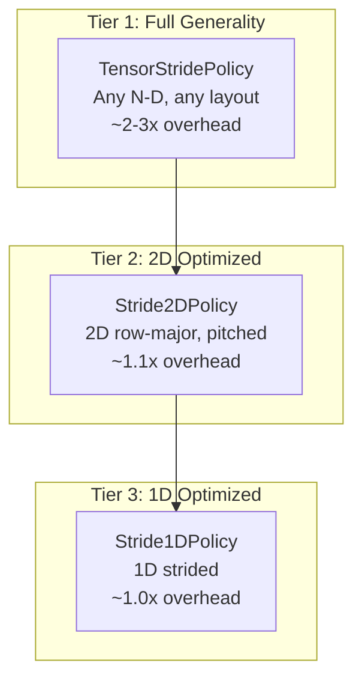
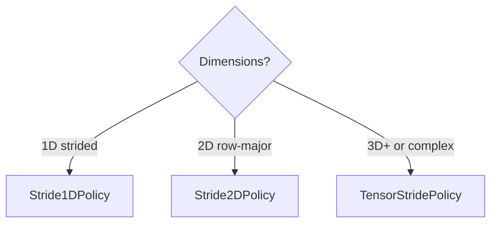

# Overview - TensorStridePolicy

*Fat-P Library — December 2025 — Benchmarks: AMD Ryzen 9 5900X, GCC 12.2, -O3*

---

## Overview Card

**Component:** TensorStridePolicy  
**Problem solved:** Iterates N-dimensional tensors with arbitrary memory layouts (padded, strided, transposed) through a single iterator interface  
**When to use:** Multi-dimensional arrays with non-trivial layouts; GPU textures with pitch; submatrix views; transposed traversal without copying  
**When NOT to use:** Simple contiguous 1D/2D arrays where manual loops suffice; hot paths where 2-3x overhead is unacceptable  
**Key guarantee:** Correct element visitation regardless of memory layout; O(1) amortized advance  
**Alternatives:** Manual nested loops, NumPy-style strided iteration, Eigen tensor module  
**Read next:** User Manual - TensorStridePolicy, Companion Guide - TensorStridePolicy

---

## Scope

This document introduces TensorStridePolicy, Fat-P's N-dimensional tensor iteration policy. It covers the problem TensorStridePolicy solves (complex index arithmetic), the architectural approach (shape/stride separation with odometer algorithm), the three-tier performance model (TensorStridePolicy, Stride2DPolicy, Stride1DPolicy), and guidance on when to use each tier.

## Not Covered

- Detailed API reference (see User Manual - TensorStridePolicy)
- Design rationale and tradeoff analysis (see Companion Guide - TensorStridePolicy)
- PolicyIterator base mechanics (see Overview - PolicyIterator)

## Prerequisites

- Understanding of multi-dimensional arrays
- Familiarity with row-major vs column-major layouts
- Basic knowledge of PolicyIterator (helpful)

---

## Executive Summary

TensorStridePolicy is a **PolicyIterator policy** for N-dimensional tensor traversal. It separates **shape** (what positions to visit) from **strides** (where elements live in memory), enabling iteration over padded arrays, transposed views, and submatrices without copying data.

For performance-critical code, Fat-P provides lightweight specializations: **Stride2DPolicy** (~10% overhead) and **Stride1DPolicy** (~0% overhead).

---

## The Problem

```cpp
// THE TRAP: Index arithmetic that doesn't match memory layout
float* data = cudaMallocPitch(...);  // pitch != width
for (int r = 0; r < height; ++r) {
    for (int c = 0; c < width; ++c) {
        process(data[r * width + c]);  // BUG: should be r * pitch + c
    }
}
```

| Constraint | Why Manual Loops Break Down |
|------------|----------------------------|
| Padded rows (GPU pitch) | Stride ≠ logical width |
| Transposed views | Need column-major traversal of row-major data |
| Submatrices | Parent stride ≠ submatrix width |
| N dimensions | Index expressions become unreadable |

---

## The Solution

TensorStridePolicy separates traversal order (shape) from memory layout (strides):

```cpp
// 100×200 matrix with 256-element pitch (padded rows)
TensorStridePolicy<float> policy({100, 200}, {256, 1});
//                                ^^^^^^^^    ^^^^^^^
//                                shape       strides

// Iteration visits logical elements, skips padding
for (auto it = begin(data, policy); it != end(data, policy); ++it) {
    process(*it);  // Correct regardless of pitch
}
```

---

## Three-Tier Architecture



| Tier | Policy | Overhead | Use Case |
|------|--------|----------|----------|
| 1 | TensorStridePolicy | 1.7-3.1x | N-D, complex layouts |
| 2 | Stride2DPolicy | ~1.1x | 2D row-major, GPU textures |
| 3 | Stride1DPolicy | ~1.0x | Column extraction, strided 1D |

---

## Performance

| Operation | Manual Loop | Stride1DPolicy | Stride2DPolicy | TensorStridePolicy |
|-----------|-------------|----------------|----------------|-------------------|
| 1D stride-4 | 0.23 ms | 0.23 ms | — | 0.39 ms |
| 2D 1000×1000 | 0.89 ms | — | 0.98 ms | 1.78 ms |
| 3D 100×100×100 | 0.91 ms | — | — | 2.82 ms |

---

## Where TensorStridePolicy Wins

- **Padded/pitched arrays** — GPU textures, SIMD-aligned rows
- **Transposed views** — Column-major traversal of row-major data
- **Submatrix iteration** — Without copying
- **N-dimensional tensors** — Without nested loop complexity

## Where TensorStridePolicy Loses

- **Simple contiguous arrays** — Manual loops are faster and clearer
- **Hot inner loops** — 2-3x overhead may be unacceptable
- **SIMD vectorization** — Odometer logic inhibits auto-vectorization

---

## Choosing the Right Tier



---

*TensorStridePolicy.h: ~700 lines — See User Manual for complete usage guide*
