# **The Recycling Pool**

### *A Companion Guide to FAT-P's ObjectPool*

---

**Scope:** This guide covers the design philosophy, architectural decisions, and implementation rationale behind ObjectPool—FAT-P's block-based object recycler with transactional exception safety. It explains why pooling matters for HPC workloads, how the free-list mechanism achieves O(1) operations, the subtle corruption that naive exception handling causes, and when the design's tradeoffs work against you. Other FAT-P memory components (SmallVector, SlotMap, arena allocators) are documented separately.

**Not covered:**
- API reference and usage recipes (see User Manual - ObjectPool)
- Benchmark methodology and raw data (see benchmark_ObjectPool.cpp)
- General C++ memory model concepts (see Foundations documents)
- Thread-local storage patterns (see Handbook - Concurrency)

**Prerequisites:**
- Working knowledge of C++ object lifetime and RAII
- Understanding of placement new and explicit destructor calls
- Familiarity with cache hierarchy concepts (L1/L2/L3, cache lines)
- Awareness of exception propagation and stack unwinding

---

## Companion Guide Card

**Component:** ObjectPool  
**Design question:** How do you recycle objects efficiently while guaranteeing constructor exception safety?  
**Key tradeoff:** LIFO free-list (O(1) release) vs. ordered free-list (persistent locality)  
**Decision made:** LIFO by default with explicit compaction for locality recovery  
**Rejected alternatives:** Ordered insertion (O(n) release cost), slab allocator (different use case), intrusive free-list (requires type cooperation), lock-free free-list (complexity vs. benefit)  
**Historical context:** Game engine pooling patterns meet HPC exception safety requirements

---

# **Table of Contents**

**[Introduction: Why This Component Exists](#introduction-why-this-component-exists)**

## Part I — The Problems

1. [The Allocation Tax](#chapter-1--the-allocation-tax)
2. [The Exception Trap](#chapter-2--the-exception-trap)
3. [The Fragmentation Spiral](#chapter-3--the-fragmentation-spiral)
4. [The LIFO Locality Collapse](#chapter-4--the-lifo-locality-collapse)
5. [The Release Ordering Problem](#chapter-5--the-release-ordering-problem)

## Part II — The Solutions

6. [Architecture Overview](#chapter-6--architecture-overview)
7. [Free-List Recycling: The O(1) Guarantee](#chapter-7--free-list-recycling-the-o1-guarantee)
8. [Transactional Acquire: Exception Safety Without Try-Catch](#chapter-8--transactional-acquire-exception-safety-without-try-catch)
9. [Block-Based Growth: Amortized Allocation](#chapter-9--block-based-growth-amortized-allocation)
10. [The Compaction Strategy: Recovering Locality](#chapter-10--the-compaction-strategy-recovering-locality)
11. [Policy-Based Synchronization: Zero-Cost Abstraction](#chapter-11--policy-based-synchronization-zero-cost-abstraction)
12. [The RAII Wrapper: Automatic Lifecycle](#chapter-12--the-raii-wrapper-automatic-lifecycle)

## Part III — Putting It Together

13. [Case Study: Game Engine Entity Pooling](#chapter-13--case-study-game-engine-entity-pooling)
14. [Case Study: Network Server Connection Handling](#chapter-14--case-study-network-server-connection-handling)
15. [Case Study: Scientific Computing Batch Processing](#chapter-15--case-study-scientific-computing-batch-processing)
16. [Case Study: Real-Time Audio Buffer Management](#chapter-16--case-study-real-time-audio-buffer-management)
17. [Choosing the Right Memory Strategy](#chapter-17--choosing-the-right-memory-strategy)

## Part IV — Foundations

- [Appendix A — A History of Memory Pooling](#appendix-a--a-history-of-memory-pooling)
- [Appendix B — Why boost::object_pool Uses Ordered Free Lists](#appendix-b--why-boostobject_pool-uses-ordered-free-lists)
- [Appendix C — Design Constraints and Rejected Alternatives](#appendix-c--design-constraints-and-rejected-alternatives)
- [Appendix D — Where ObjectPool Loses](#appendix-d--where-objectpool-loses)
- [Appendix E — The Allocator Model Gap](#appendix-e--the-allocator-model-gap)
- [Appendix F — Further Reading](#appendix-f--further-reading)

---

# **Introduction: Why This Component Exists**

You're building a trading system. Order messages arrive at 50,000 per second. Each message needs a handler object—a hundred bytes of state that lives for a few microseconds while the order is processed. The straightforward implementation allocates a handler, processes the order, and frees the handler:

```cpp
// THE TRAP: Heap allocation in hot path
void process_orders(std::span<OrderMessage> messages) {
    for (const auto& msg : messages) {
        auto* handler = new OrderHandler(msg);
        handler->execute();
        delete handler;
    }
}
```

Your profiler reports that 35% of CPU time is spent in `new` and `delete`. Not in order matching. Not in risk checks. Not in network I/O. In the heap allocator.

The problem isn't that `new` is slow—a single allocation takes perhaps 20 nanoseconds. The problem is that 50,000 allocations per second, across eight threads, means 400,000 mutex contentions per second. Each thread waits for the others. The heap allocator becomes a serialization point in what should be parallel code.

Or consider a different scenario: you're building a physics simulation. Collision events are detected and need temporary objects to track resolution. The collision handler constructor validates the contact manifold and throws `InvalidManifoldException` if the geometry is degenerate. You've implemented a simple pool to avoid allocation overhead:

```cpp
// THE TRAP: No exception handling in acquire
template <typename T>
class NaivePool {
    std::vector<std::byte> storage_;
    std::vector<bool> in_use_;
    
public:
    template <typename... Args>
    T* acquire(Args&&... args) {
        size_t slot = find_free_slot();
        in_use_[slot] = true;  // Mark used BEFORE construction
        return new (&storage_[slot * sizeof(T)]) T(std::forward<Args>(args)...);
        // If constructor throws, slot is marked used but contains no object
    }
};
```

When the constructor throws, `in_use_[slot]` is true but no valid object exists. The slot is leaked. Over thousands of frames, as occasional degenerate collisions occur, the pool's available capacity shrinks. Eventually it reports exhaustion despite having storage.

Or this: you've fixed the exception problem with try-catch in acquire. The pool works correctly. But you notice strange performance degradation over time. Investigation reveals that objects are released in random order—collision events resolve in whatever order the physics engine processes them. The free list becomes a random permutation of addresses. When you acquire objects for the next frame, they come from scattered memory locations. The CPU's cache prefetcher, which excels at predicting sequential access, provides no benefit.

These aren't exotic edge cases. They're the predictable consequences of memory allocation patterns in real systems:

- The heap allocator is thread-safe but serializes concurrent allocations
- Simple pools corrupt state when constructors throw
- LIFO free lists lose locality when release order is random
- Raw memory pools provide bytes, not objects—construction is your problem

ObjectPool exists for engineers who need all of these solved simultaneously:

- **Block-based storage** amortizes heap allocation across many objects
- **Transactional acquire** guarantees pool consistency if constructors throw
- **LIFO free-list with compaction** provides O(1) operations with recoverable locality
- **RAII wrapper** automates release on scope exit
- **Policy-based synchronization** eliminates lock overhead in single-threaded use

This guide explains the problems in depth and how ObjectPool addresses them.

---

# **PART I — THE PROBLEMS**

Memory management seems straightforward: request bytes, receive a pointer, use the memory, return it when done. The complications arise from concurrency (multiple threads competing for the allocator), fragmentation (holes between allocations), exceptions (what happens when construction fails mid-operation), and cache behavior (where returned memory lives relative to other data). Understanding these forces is essential for understanding why pooling exists.

---

# **CHAPTER 1 — The Allocation Tax**

Modern heap allocators are engineering marvels. They handle allocations ranging from 8 bytes to gigabytes. They coalesce freed blocks to reduce fragmentation. They provide thread-safe operation so multiple threads can allocate simultaneously. They do all this in roughly 20-50 nanoseconds per operation on typical workloads.

But "thread-safe" has a cost. When four threads call `new` at the same moment, they must coordinate:

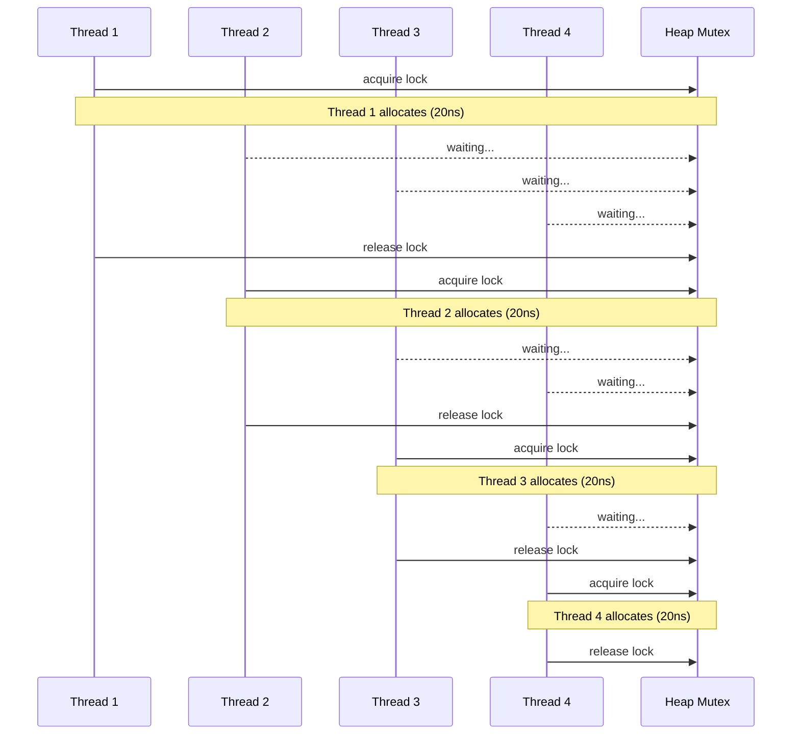

The allocator maintains metadata—free lists, size classes, block headers—that would be corrupted by unsynchronized concurrent access. Most allocators protect this metadata with mutexes or sophisticated lock-free algorithms.

Either way, contention occurs. When Thread A holds the allocator lock, Thread B waits. When both finish, Thread C and D are still waiting. What should be parallel execution becomes serial.

### The Memory Hierarchy Reality

To understand the magnitude of the problem, you need to understand how modern computers access memory.

In 1980, a typical microprocessor ran at 5 MHz, and memory responded in about 4 clock cycles. Fetching data cost roughly the same as adding two numbers. Programmers didn't think much about memory access patterns because memory was fast relative to computation.

By 2024, processors run at 4,000 MHz—800 times faster. But memory hasn't kept pace. DDR5 RAM still takes about 80-100 nanoseconds to respond to a request. At 4 GHz, that's 320-400 clock cycles. The processor can execute hundreds of instructions in the time it takes to fetch one piece of data from main memory.

Computer architects addressed this imbalance with caching:

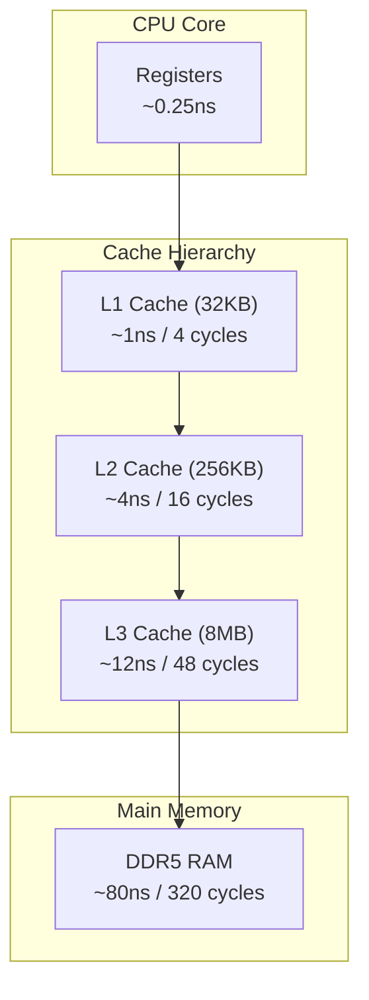

When you access a memory location, the processor first checks L1 cache. If the data isn't there (an "L1 miss"), it checks L2. If not there, L3. Only if all caches miss does it fetch from main memory.

The critical insight is that caches don't fetch individual bytes—they fetch *cache lines*, typically 64 bytes at a time. When you read one byte, the hardware fetches the surrounding 64 bytes into cache.

### Why Heap Allocation Scatters Memory

The standard heap allocator manages a large pool of memory, handing out chunks on demand. When you allocate memory, the allocator searches its free lists for a suitable block. The block it finds depends on what's been allocated and freed previously:

```cpp
// T=0: Allocate A, B, C
A* a = new A;  // Gets address 0x1000
B* b = new B;  // Gets address 0x1100
C* c = new C;  // Gets address 0x1200

// T=1: Free B
delete b;      // 0x1100 goes back to free list

// T=2: Allocate D (smaller than B)
D* d = new D;  // Gets address 0x1100 (reuses B's space)

// T=3: Allocate E
E* e = new E;  // Gets address 0x2000 (somewhere else entirely)

// Memory layout: A at 0x1000, D at 0x1100, C at 0x1200, E at 0x2000
```

After many allocations and frees, related objects are scattered across memory. If you have a thousand `Handler` objects and you iterate over them, each access potentially misses the cache because the next handler is in a completely different memory region.

### The Numbers

Benchmarks on Windows, MSVC 2022, 3.7 GHz base clock (median of 15 measured runs):

| Operation | Time | Cycles | Notes |
|-----------|------|--------|-------|
| L1 cache hit | 1 ns | 4 | Ideal case |
| L2 cache hit | 4 ns | 16 | Good locality |
| L3 cache hit | 12 ns | 48 | Working set fits in L3 |
| Main memory | 80 ns | 320 | Cache miss |
| `new` (uncontended) | 20-23 ns | 80-92 | Single thread, measured |
| `new` (4 threads) | 80-150 ns | 320-600 | Contention overhead |
| Pool acquire (uncontended) | **2.3 ns** | 9 | Pointer manipulation |
| Pool acquire (4 threads, mutex) | 40 ns | 160 | Small critical section |

A single heap allocation costs **8-10×** more than a pool acquisition. Under contention, the gap widens further.

```cpp
// THE TRAP: Heap allocation in hot loop
void process_batch(std::span<Request> requests) {
    for (const auto& req : requests) {
        Handler* h = new Handler(req);  // 20-40ns
        h->process();
        delete h;                        // 20-40ns
    }
}
// 10,000 requests × 40-80ns = 400-800μs in allocation alone
```

```cpp
// THE FIX: Pool-based allocation
void process_batch(ObjectPool<Handler>& pool, std::span<Request> requests) {
    for (const auto& req : requests) {
        Handler* h = pool.acquire(req);  // 2-3ns
        h->process();
        pool.release(h);                  // 2-3ns
    }
}
// 10,000 requests × 4-6ns = 40-60μs in allocation
// 10-15× improvement
```

**What FAT-P provides:** ObjectPool pre-allocates memory in blocks. Acquire and release are pointer manipulation, not heap operations. Chapter 7 explains the free-list mechanism.

---

# **CHAPTER 2 — The Exception Trap**

C++ constructors can throw. This is a fundamental language feature that enables classes to enforce their invariants—a constructor that cannot establish valid state throws an exception rather than creating a zombie object.

For pooling, this creates a subtle but critical problem.

### The Naive Pool Problem

Consider the sequence of events when acquiring from a pool:

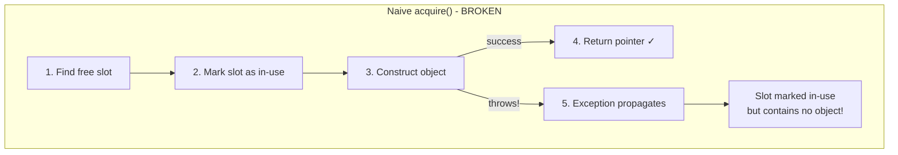

In a naive implementation, the slot was marked in-use in step 2. The exception propagates out of the acquire function. The slot is now marked as used but contains no valid object. It's leaked—not to the operating system, but within the pool itself.

```cpp
// THE TRAP: Naive pool corrupts on exception
template <typename T>
class NaivePool {
    struct Slot {
        alignas(T) std::byte storage[sizeof(T)];
        bool in_use = false;
    };
    std::vector<Slot> slots_;
    
public:
    template <typename... Args>
    T* acquire(Args&&... args) {
        for (auto& slot : slots_) {
            if (!slot.in_use) {
                slot.in_use = true;  // ← Marked BEFORE construction
                // If constructor throws, slot is permanently "in use"
                return new (&slot.storage) T(std::forward<Args>(args)...);
            }
        }
        throw std::bad_alloc();
    }
    
    void release(T* obj) {
        obj->~T();
        // Find slot and mark not in use...
    }
};
```

### When Constructors Throw

This might seem like a corner case. Most constructors don't throw. But in real systems, constructors often validate input, acquire resources, or perform initialization that can fail:

```cpp
class NetworkConnection {
public:
    NetworkConnection(const std::string& host, int port) {
        socket_ = connect(host, port);
        if (socket_ < 0)
            throw ConnectionError("Failed to connect to " + host);
        
        if (!validate_certificate(socket_))
            throw SecurityError("Certificate validation failed");
        
        buffer_ = allocate_buffer(64 * 1024);
        if (!buffer_)
            throw std::bad_alloc();
    }
    // ...
};
```

```cpp
class CollisionHandler {
public:
    CollisionHandler(const ContactManifold& manifold) {
        if (manifold.point_count() < 1)
            throw InvalidManifoldException("No contact points");
        
        if (!manifold.is_valid())
            throw InvalidManifoldException("Degenerate geometry");
        
        // Initialize resolution state...
    }
};
```

### The Silent Corruption

The corruption is insidious because it's silent. The pool doesn't crash. It doesn't report an error. It simply has less capacity than it should:

```cpp
ObjectPool<CollisionHandler> pool(1000);  // Capacity: 1000

for (int frame = 0; frame < 100000; ++frame) {
    // Each frame, ~500 collisions detected
    // ~1% have degenerate geometry (throw in constructor)
    
    for (const auto& collision : detect_collisions()) {
        try {
            CollisionHandler* h = pool.acquire(collision.manifold);
            // ... resolve collision ...
            pool.release(h);
        } catch (const InvalidManifoldException&) {
            // Ignored—degenerate collision, skip it
            // But pool lost a slot!
        }
    }
}

// After 100,000 frames:
// 100,000 × 500 × 0.01 = 500,000 throwing acquires
// Pool capacity effectively reduced to 500 (or less)
// Next level with heavy combat: pool exhaustion
```

The symptom appears later—usually under load, when you need maximum capacity—as unexpected exhaustion. Debugging reveals that the pool claims all slots are in use, but iterating over them shows many contain garbage.

### The Transactional Solution

The fix requires transactional semantics: the acquire operation must either succeed completely (slot removed, object constructed, pointer returned) or fail completely (slot restored, exception propagated):

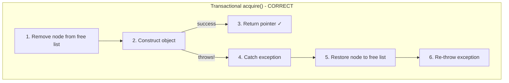

```cpp
// THE FIX: Transactional acquire restores node on exception
template <typename... Args>
T* acquire(Args&&... args) {
    Node* node = free_list_;
    free_list_ = node->next;  // Remove from free list
    --free_count_;
    
    try {
        return new (&node->storage) T(std::forward<Args>(args)...);
    }
    catch (...) {
        // ROLLBACK: Restore node to free list
        node->next = free_list_;
        free_list_ = node;
        ++free_count_;
        throw;  // Re-throw original exception
    }
}
```

**What FAT-P provides:** ObjectPool implements transactional acquire. If the constructor throws, the pool state is automatically restored before the exception propagates. Chapter 8 details the mechanism.

---

# **CHAPTER 3 — The Fragmentation Spiral**

Memory fragmentation is what happens when free memory becomes scattered in small, non-contiguous chunks:


The total free memory might be substantial, but if you need a contiguous block larger than any individual free chunk, allocation fails.

### How Fragmentation Develops

Standard heap allocators combat fragmentation through coalescing—when adjacent blocks are both free, they're merged into a larger block. This helps but doesn't eliminate the problem:

```cpp
// Timeline of allocations creating fragmentation
// Each letter represents 64 bytes

// T=0: Fresh heap
// [                    FREE                    ]

// T=1: Allocate A, B, C, D
// [AAAA][BBBB][CCCC][DDDD][      FREE         ]

// T=2: Free B
// [AAAA][free][CCCC][DDDD][      FREE         ]

// T=3: Free D
// [AAAA][free][CCCC][free][      FREE         ]

// T=4: Allocate E (larger than B or D)
// [AAAA][free][CCCC][free][EEEEEEEE][  FREE   ]

// T=5: Free C
// [AAAA][free][free][free][EEEEEEEE][  FREE   ]

// Can we coalesce the middle free blocks?
// Only if they're truly adjacent in memory (they are here)
// [AAAA][  FREE (192B)   ][EEEEEEEE][  FREE   ]
```

The allocator coalesces when it can, but the pattern of allocation and deallocation determines what's possible. In long-running systems with varying-sized allocations, the heap develops a "Swiss cheese" pattern.

### The Server Nightmare

For long-running server processes, scientific simulations, or embedded systems, fragmentation is catastrophic:

```cpp
// Server running for 7 days
// Handles requests of varying sizes
// Each request allocates temporary buffers

void handle_request(const Request& req) {
    // Buffers range from 1KB to 64KB depending on request type
    auto buffer = std::make_unique<char[]>(req.buffer_size());
    process(req, buffer.get());
    // buffer freed at end of scope
}

// Day 1: Everything works fine
// Day 3: Occasional allocation failures during peak load
// Day 5: Frequent failures, have to restart
// Day 7: OOM killer terminates process
```

### How Pools Avoid Fragmentation

Object pools sidestep this problem entirely when used correctly. If all objects from a pool are the same size, every freed slot can hold a new object. There's no fragmentation within the pool because every slot is exactly the right size:

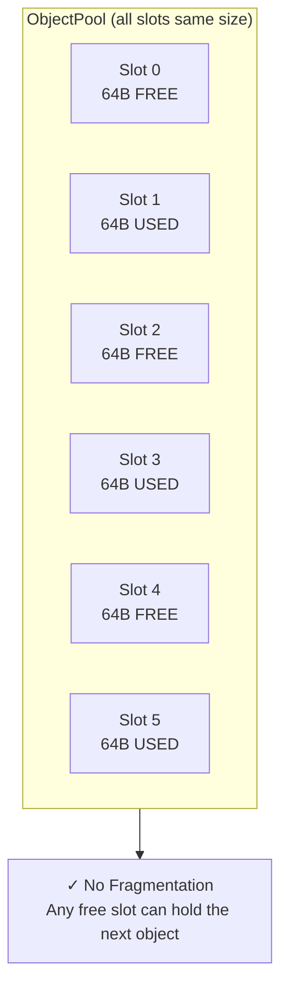

Fragmentation can still occur at the pool level—the blocks that make up the pool are allocated from the heap—but this is far less severe. Instead of millions of small allocations fragmenting the heap, you have dozens of large block allocations.

**What FAT-P provides:** ObjectPool allocates fixed-size slots in contiguous blocks. Same-type recycling eliminates internal fragmentation. Chapter 9 explains block-based growth.

---

# **CHAPTER 4 — The LIFO Locality Collapse**

ObjectPool uses a LIFO (Last In, First Out) free list. When you release an object, it goes to the head of the list. When you acquire, you take from the head.

### Why LIFO?

LIFO has excellent properties for common access patterns:

```cpp
// Pattern 1: Acquire-use-release in tight loop
for (int i = 0; i < 1000000; ++i) {
    T* obj = pool.acquire();
    use(obj);
    pool.release(obj);
    // Same slot returned every iteration
    // That slot stays in L1 cache
}

// Pattern 2: Stack-like usage
T* a = pool.acquire();  // Gets slot 0
T* b = pool.acquire();  // Gets slot 1
T* c = pool.acquire();  // Gets slot 2
// ... use a, b, c ...
pool.release(c);        // Returns slot 2
pool.release(b);        // Returns slot 1
pool.release(a);        // Returns slot 0
// Perfect LIFO order = perfect cache reuse
```

LIFO optimizes for *temporal locality*: the most recently released object is likely still in cache.

### When LIFO Fails

The problem arises when release order doesn't match acquire order:

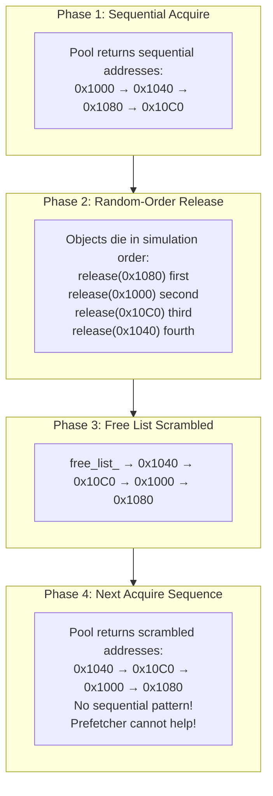

Consider a particle system:

```cpp
// THE TRAP: Random release order scrambles free list
void simulate_frame(ObjectPool<Particle>& pool) {
    std::vector<Particle*> particles;
    
    // Phase 1: Acquire 10,000 particles (sequential addresses)
    for (int i = 0; i < 10000; ++i) {
        particles.push_back(pool.acquire());
    }
    
    // Phase 2: Simulate—particles die based on physics, not order
    while (running) {
        for (auto it = particles.begin(); it != particles.end(); ) {
            (*it)->update(dt);
            if ((*it)->lifetime <= 0) {
                pool.release(*it);  // Random-order release!
                it = particles.erase(it);
            } else {
                ++it;
            }
        }
    }
    
    // Phase 3: Free list is now random permutation
    // Phase 4: Next frame's particles have terrible locality
}
```

### The Performance Impact

The impact is measurable. Benchmarks on Windows, MSVC 2022, N=100,000 objects:

| Scenario | Acquire Time | Notes |
|----------|-------------|--------|
| Fresh pool, sequential acquire | 2.04 ns | Optimal locality |
| After LIFO-order release | 2.04 ns | Same slots, same order |
| After random release | 5.66 ns | **2.8× slower** |
| After compaction | **1.88 ns** | Locality restored |

Random release doesn't just slow acquisition—it destroys iteration performance because adjacent objects in your data structure are no longer adjacent in memory.

**What FAT-P provides:** ObjectPool provides `try_compact_free_list()` to rebuild the free list in address order when the pool is empty. Chapter 10 explains the compaction strategy.

---

# **CHAPTER 5 — The Release Ordering Problem**

Beyond cache locality, there's a subtler issue with release ordering: the order in which destructors run can matter.

### When Destruction Order Matters

Consider objects that hold references to each other:

```cpp
class Observer {
    Subject* subject_;
public:
    Observer(Subject* s) : subject_(s) {
        subject_->add_observer(this);
    }
    ~Observer() {
        subject_->remove_observer(this);  // Must happen while subject is alive!
    }
};

class Subject {
    std::vector<Observer*> observers_;
public:
    ~Subject() {
        // What if observers are destroyed AFTER subject?
        // Their destructors call remove_observer on garbage!
    }
};
```

With a pool, the order of destruction depends on release order:

```cpp
ObjectPool<Subject> subject_pool(64);
ObjectPool<Observer> observer_pool(256);

Subject* s = subject_pool.acquire();
Observer* o1 = observer_pool.acquire(s);
Observer* o2 = observer_pool.acquire(s);

// WRONG: Release subject first
subject_pool.release(s);      // Subject destroyed
observer_pool.release(o1);    // o1->~Observer() calls s->remove_observer()
                              // s is already destroyed! Undefined behavior.

// CORRECT: Release observers first
observer_pool.release(o2);    // o2->~Observer() works
observer_pool.release(o1);    // o1->~Observer() works
subject_pool.release(s);      // Subject destroyed (observers already gone)
```

### The RAII Solution

The `PooledObject` wrapper doesn't solve destruction ordering—that's a design issue. But it does make the order explicit through scoping:

```cpp
void process() {
    auto subject = fat_p::make_pooled(subject_pool);
    {
        auto observer1 = fat_p::make_pooled(observer_pool, subject.get());
        auto observer2 = fat_p::make_pooled(observer_pool, subject.get());
        
        // ... use subject and observers ...
        
    }  // observer2 released, then observer1 (reverse declaration order)
}  // subject released last
```

**What FAT-P provides:** PooledObject provides RAII semantics that make lifetime relationships explicit through scoping. Chapter 12 explains the wrapper.

---

# **PART II — THE SOLUTIONS**

---

# **CHAPTER 6 — Architecture Overview**

ObjectPool combines several mechanisms into a coherent design:

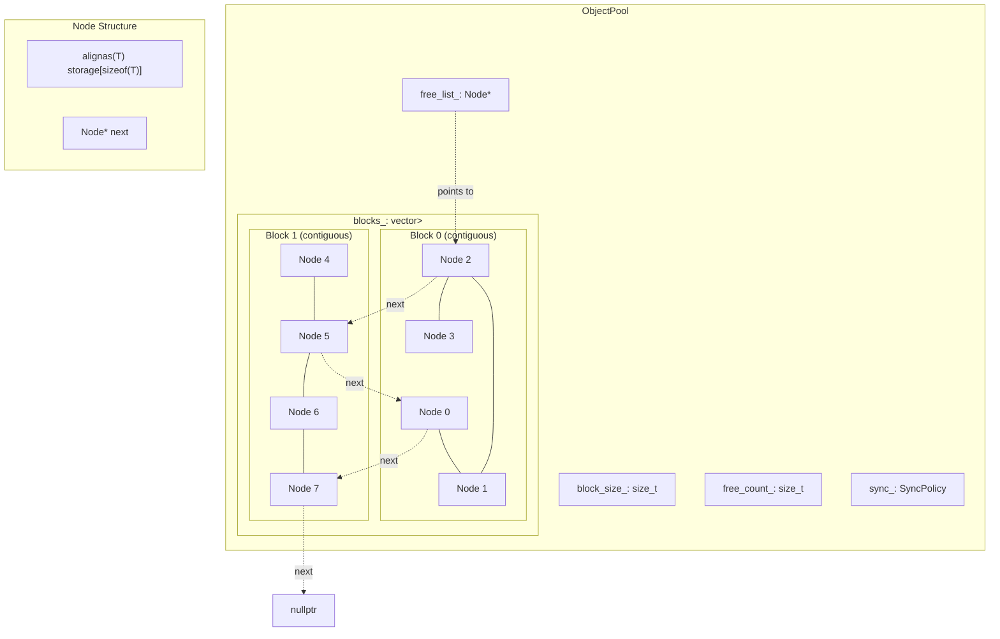

```cpp
template <typename T, typename SyncPolicy = SingleThreadedPolicy>
class ObjectPool {
    struct Node {
        alignas(T) std::byte storage[sizeof(T)];  // Object storage (offset 0)
        Node* next = nullptr;                      // Free-list link
    };
    
    Node* free_list_ = nullptr;                    // Head of free list
    std::vector<std::unique_ptr<Node[]>> blocks_;  // Allocated blocks
    size_t block_size_;                            // Nodes per block
    size_t free_count_ = 0;                        // Cached count
    mutable SyncPolicy sync_;                      // Thread safety policy
};
```

### Key Design Decisions

**Storage at offset zero.** The `storage` member comes first in `Node`, so `offsetof(Node, storage) == 0`. This means we can cast between `T*` and `Node*` without pointer arithmetic—a pointer to a T stored in a Node's storage is numerically identical to a pointer to the Node.

**Block-based growth.** Memory is allocated in blocks of `block_size_` nodes each. All nodes in a block are contiguous, providing cache locality. The `blocks_` vector owns these allocations via `unique_ptr`.

**Cached free count.** Instead of traversing the free list to count available slots, we maintain `free_count_`. This makes `available()` O(1).

**Policy-based synchronization.** The `sync_` member is templated. For single-threaded use, it compiles away entirely. For thread-safe use, it wraps `std::mutex`.

---

# **CHAPTER 7 — Free-List Recycling: The O(1) Guarantee**

The free list is the heart of the pool. It's a singly-linked list threading through nodes that don't currently hold live objects:

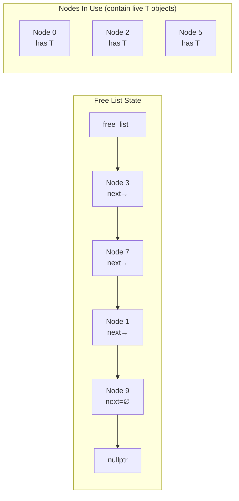

### The Acquire Operation

```cpp
T* acquire() {
    Node* node = free_list_;     // Take the head
    free_list_ = node->next;     // Advance head to next node
    --free_count_;
    return new (&node->storage) T();  // Construct in storage
}
```

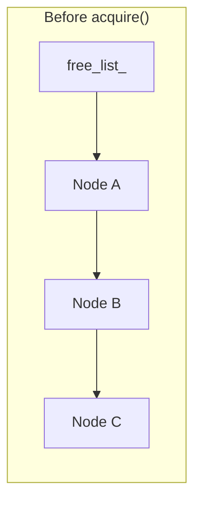

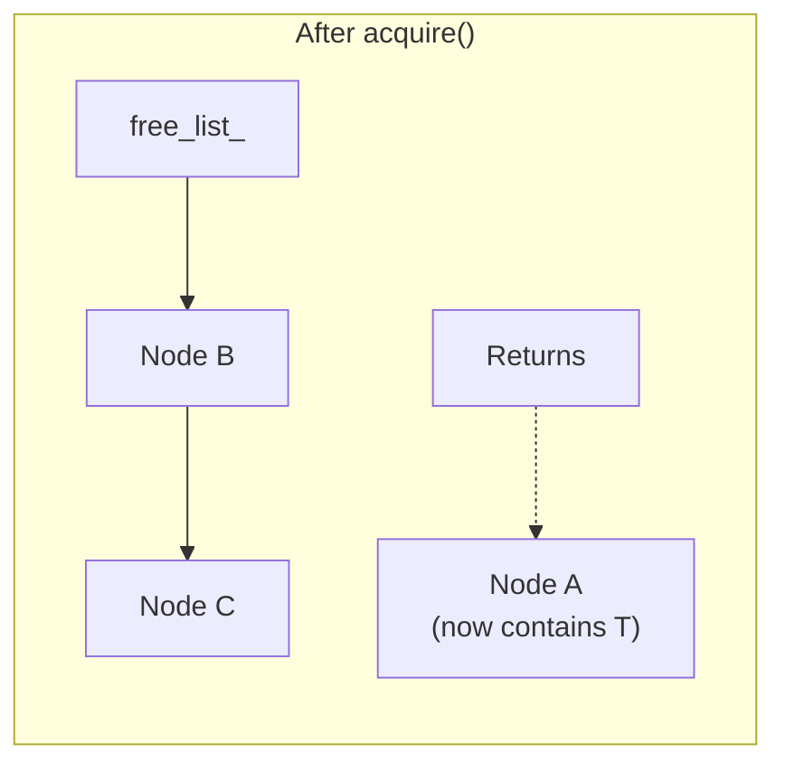

### The Release Operation

```cpp
void release(T* obj) {
    obj->~T();                                    // Destruct the object
    Node* node = reinterpret_cast<Node*>(obj);   // Cast back to Node
    node->next = free_list_;                      // Link to current head
    free_list_ = node;                            // This node is now head
    ++free_count_;
}
```

Both operations are O(1). No searching, no comparison, no traversal. Just pointer manipulation.

### Why Reinterpret Cast Is Safe

The cast in `release` is valid because of the storage-at-offset-zero guarantee:

```cpp
struct Node {
    alignas(T) std::byte storage[sizeof(T)];  // Offset 0
    Node* next;                                // Offset sizeof(T)
};

// When we do: T* obj = new (&node->storage) T();
// obj points to &node->storage
// But &node->storage == &node (because storage is at offset 0)
// So reinterpret_cast<Node*>(obj) recovers the original node pointer
```

This is why the `storage` member must come first. If `next` came first, we'd need pointer arithmetic to recover the node address.

---

# **CHAPTER 8 — Transactional Acquire: Exception Safety Without Try-Catch**

The key insight that distinguishes ObjectPool from naive pools is transactional exception handling:

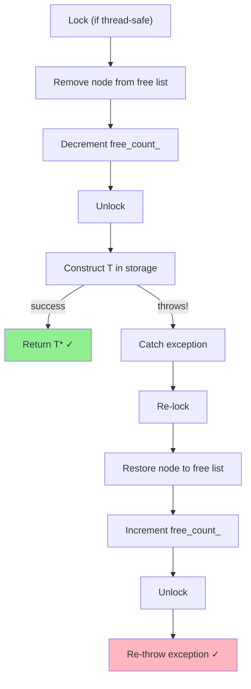

```cpp
template <typename... Args>
T* acquire(Args&&... args) {
    auto lock = sync_.lock();
    
    if (!free_list_)
        allocate_block();
    
    // Remove node from free list
    Node* node = free_list_;
    free_list_ = node->next;
    --free_count_;
    
    lock.unlock();  // Release lock BEFORE construction
    
    try {
        return new (&node->storage) T(std::forward<Args>(args)...);
    }
    catch (...) {
        // ROLLBACK: Restore node to free list
        auto restore_lock = sync_.lock();
        node->next = free_list_;
        free_list_ = node;
        ++free_count_;
        throw;  // Re-throw original exception
    }
}
```

### Why Unlock Before Construction?

Notice that we release the lock before calling the constructor and re-acquire it only if we need to rollback. This might seem like unnecessary complexity. Why not hold the lock throughout?

Constructors can be slow. They might:
- Open files or network connections
- Validate complex data structures
- Perform expensive computations
- Call external APIs

If we hold the pool's lock during construction, other threads are blocked from acquiring or releasing objects. A slow constructor becomes a bottleneck for the entire pool.

By releasing the lock before construction:
- Other threads can acquire different objects concurrently
- The critical section is tiny (just pointer manipulation)
- Construction runs without holding any locks

The cost is complexity: we must re-acquire the lock if construction fails. But this only happens on the exceptional path, which should be rare.

### The Invariant

The transactional guarantee maintains this invariant:

**Either** the acquire succeeds (node removed from free list, valid T constructed, pointer returned)
**Or** the acquire fails (node restored to free list, exception propagated, pool state unchanged)

No intermediate state is ever visible to other threads or to the caller.

---

# **CHAPTER 9 — Block-Based Growth: Amortized Allocation**

When the free list is empty and a new acquisition is requested, ObjectPool allocates a block of nodes:

```cpp
void allocate_block() {
    auto block = std::make_unique<Node[]>(block_size_);
    
    // Link all nodes into free list in REVERSE order
    // so lowest address ends up at head
    for (size_t i = block_size_; i-- > 0;) {
        block[i].next = free_list_;
        free_list_ = &block[i];
    }
    
    free_count_ += block_size_;
    blocks_.push_back(std::move(block));
}
```

### Why Reverse Order?

The loop iterates backward so that the lowest-addressed node ends up at the head of the free list:

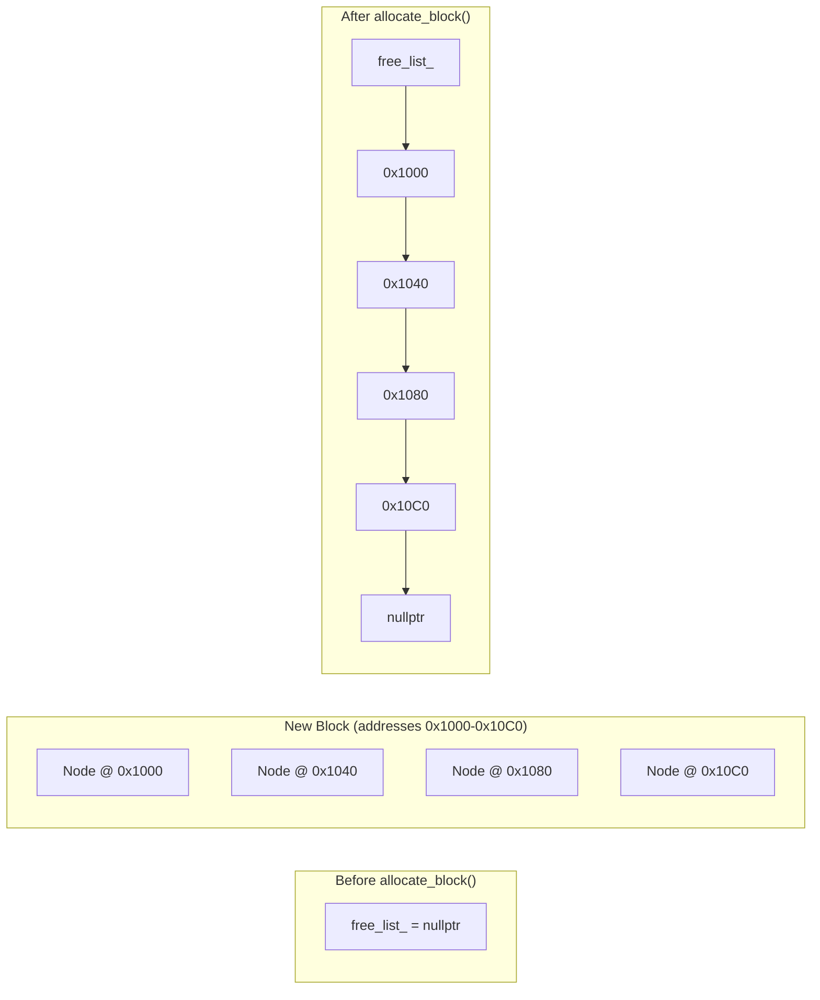

This means the first acquisitions from a new block return sequential addresses, maximizing cache locality for code that acquires multiple objects.

### Amortization

Block-based growth amortizes heap allocation cost:

| Approach | Heap Allocations for N Objects |
|----------|-------------------------------|
| Per-object allocation | N |
| Block-based (block_size = 64) | N/64 |
| Block-based (block_size = 1024) | N/1024 |

For one million objects with block_size = 1024, you need ~1,000 heap allocations instead of one million—a 1000× reduction in allocator interaction.

### Block Size Selection

The block size parameter controls the granularity:

| Block Size | Pros | Cons |
|------------|------|------|
| Small (16-64) | Less memory waste at low usage | More heap allocations as pool grows |
| Medium (256-1024) | Good balance | - |
| Large (4096+) | Excellent locality, few allocations | Memory waste if peak is low |

**Rule of thumb:** Set block size to 25% of expected peak usage. For 10,000 expected objects, use block_size = 2500.

---

# **CHAPTER 10 — The Compaction Strategy: Recovering Locality**

After random-order releases, the free list becomes a random permutation of addresses. Compaction rebuilds it in address order.

### The Algorithm

```cpp
bool try_compact_free_list() {
    // Can only compact when pool is completely empty
    if (free_count_ != capacity())
        return false;
    
    // Collect all block base addresses
    std::vector<Node*> block_starts;
    for (const auto& block : blocks_)
        block_starts.push_back(block.get());
    
    // Sort blocks by address
    std::sort(block_starts.begin(), block_starts.end());
    
    // Rebuild free list: lowest addresses first
    free_list_ = nullptr;
    for (auto it = block_starts.rbegin(); it != block_starts.rend(); ++it) {
        for (size_t i = block_size_; i-- > 0;) {
            (*it)[i].next = free_list_;
            free_list_ = &(*it)[i];
        }
    }
    
    return true;
}
```

### When to Compact

Compaction requires the pool to be empty. Call it at natural boundaries:

```cpp
// Game: End of frame when entity pool is drained
void end_frame() {
    release_all_entities();
    entity_pool.try_compact_free_list();
}

// Server: Between request batches
void process_batch(std::span<Request> requests) {
    for (const auto& req : requests)
        process_one(req);
    
    // All handlers released
    handler_pool.try_compact_free_list();
}

// Simulation: Between epochs
void run_simulation() {
    for (int epoch = 0; epoch < 1000; ++epoch) {
        run_epoch();
        // All work items released
        work_pool.try_compact_free_list();
    }
}
```

### The Cost

Compaction is O(capacity): it must visit every node to rebuild the list. But you pay this cost once at idle time, not on every release.

| Approach | Release Cost | Locality After Random Release |
|----------|-------------|------------------------------|
| LIFO (ObjectPool) | O(1) | Bad until compaction |
| Ordered (Boost) | O(n) | Always good |
| LIFO + Compaction | O(1) + occasional O(n) | Good after compaction |

---

# **CHAPTER 11 — Policy-Based Synchronization: Zero-Cost Abstraction**

ObjectPool templates on a synchronization policy:

```cpp
template <typename T, typename SyncPolicy = SingleThreadedPolicy>
class ObjectPool;
```

### SingleThreadedPolicy

```cpp
struct SingleThreadedPolicy {
    struct LockGuard { };
    LockGuard lock() const { return {}; }
};
```

The compiler sees that `lock()` returns an empty struct with no operations. All synchronization code is eliminated. Zero overhead.

### MutexSynchronizationPolicy

```cpp
struct MutexSynchronizationPolicy {
    mutable std::mutex mutex_;
    
    struct LockGuard {
        std::unique_lock<std::mutex> lock_;
        void unlock() { lock_.unlock(); }
    };
    
    LockGuard lock() const {
        return {std::unique_lock{mutex_}};
    }
};
```

All pool operations are serialized through the mutex.

### Why Templates, Not Runtime Flags?

A runtime boolean would require a branch on every operation:

```cpp
// BAD: Runtime check on every acquire
T* acquire() {
    if (thread_safe_) {     // Branch!
        mutex_.lock();
    }
    // ... acquire logic ...
    if (thread_safe_) {     // Branch!
        mutex_.unlock();
    }
}
```

The compiler cannot eliminate these branches. Even the single-threaded path pays for the thread-safe code being present.

Templates let the compiler generate completely different code for each policy. The single-threaded instantiation has no trace of synchronization.

### Multi-Threaded Benchmark Results

Benchmarks comparing `fat_p::ThreadSafeObjectPool` vs `std::pmr::synchronized_pool_resource` (Windows, MSVC 2022, 10,000 ops/thread):

| Threads | fat_p (ns/op) | std::pmr sync (ns/op) | fat_p Throughput |
|---------|---------------|----------------------|------------------|
| 1 | 85.0 | 61.0 | 11.8M ops/sec |
| 2 | 72.5 | 49.9 | 13.8M ops/sec |
| 4 | 39.7 | 37.2 | 25.2M ops/sec |
| 8 | **82.8** | 95.4 | **12.1M ops/sec** |

At low thread counts, `std::pmr::synchronized_pool_resource` has an advantage—it's a highly-optimized standard library implementation. But at 8 threads, contention patterns shift and fat_p pulls ahead (15% faster).

The key insight: both scale similarly. Neither is a clear winner across all thread counts. Choose based on your other requirements (transactional exception safety, RAII wrappers, try_acquire).

---

# **CHAPTER 12 — The RAII Wrapper: Automatic Lifecycle**

Manual acquire/release is error-prone:

```cpp
void process(ObjectPool<Handler>& pool) {
    Handler* h = pool.acquire();
    
    if (!validate(h)) {
        pool.release(h);  // Don't forget!
        return;
    }
    
    h->execute();  // Might throw!
    
    pool.release(h);  // Never reached if execute() throws
}
```

`PooledObject` wraps a pooled object and releases it automatically:

```cpp
template <typename T>
class PooledObject {
    ObjectPool<T>* pool_;
    T* obj_;
    
public:
    PooledObject(ObjectPool<T>& pool, T* obj)
        : pool_(&pool), obj_(obj) {}
    
    ~PooledObject() {
        if (obj_) pool_->release(obj_);
    }
    
    // Move-only (like unique_ptr)
    PooledObject(PooledObject&& other) noexcept
        : pool_(other.pool_), obj_(std::exchange(other.obj_, nullptr)) {}
    
    PooledObject& operator=(PooledObject&& other) noexcept {
        if (this != &other) {
            if (obj_) pool_->release(obj_);
            pool_ = other.pool_;
            obj_ = std::exchange(other.obj_, nullptr);
        }
        return *this;
    }
    
    T* get() const { return obj_; }
    T& operator*() const { return *obj_; }
    T* operator->() const { return obj_; }
    
    T* release() { return std::exchange(obj_, nullptr); }
};

template <typename T, typename... Args>
PooledObject<T> make_pooled(ObjectPool<T>& pool, Args&&... args) {
    return {pool, pool.acquire(std::forward<Args>(args)...)};
}
```

Now exception paths are automatically handled:

```cpp
void process(ObjectPool<Handler>& pool) {
    auto h = fat_p::make_pooled(pool);
    
    if (!validate(h.get()))
        return;  // ~PooledObject releases
    
    h->execute();  // If throws, ~PooledObject releases
    
    // ~PooledObject releases
}
```

---

# **PART III — PUTTING IT TOGETHER**

---

# **CHAPTER 13 — Case Study: Game Engine Entity Pooling**

### The Problem

A game engine creates and destroys entities every frame. Bullets spawn when players fire. Particles emit from explosions. Sound effects trigger and complete. The naive approach:

```cpp
// THE TRAP: Heap allocation per entity
void spawn_bullet(const Vec3& pos, const Vec3& vel) {
    bullets_.push_back(new Bullet(pos, vel));
}

void despawn_bullet(Bullet* b) {
    bullets_.erase(std::find(bullets_.begin(), bullets_.end(), b));
    delete b;
}
```

At 60 FPS with 500 bullets per frame, that's 60,000 allocations per second—just for bullets.

### The Solution

```cpp
// THE FIX: Per-entity-type pools
class BulletSystem {
    fat_p::ObjectPool<Bullet> pool_{256};
    std::vector<Bullet*> active_;

public:
    BulletSystem() {
        pool_.reserve_blocks(8);  // 2048 bullets pre-allocated
    }
    
    void spawn(const Vec3& pos, const Vec3& vel) {
        Bullet* b = pool_.acquire(pos, vel);
        active_.push_back(b);
    }
    
    void update(float dt) {
        for (auto it = active_.begin(); it != active_.end(); ) {
            (*it)->update(dt);
            if ((*it)->should_despawn()) {
                pool_.release(*it);
                it = active_.erase(it);
            } else {
                ++it;
            }
        }
    }
    
    void end_frame() {
        // Compact at level transitions when all bullets are cleared
        if (active_.empty())
            pool_.try_compact_free_list();
    }
};
```

### Results

- Allocation overhead: 60,000 × 2ns = 120μs/frame (vs. 1.8ms with heap)
- Pre-allocation ensures no allocation during gameplay
- Compaction at level boundaries maintains locality

---

# **CHAPTER 14 — Case Study: Network Server Connection Handling**

### The Problem

A server handles 10,000 connections per second. The handler constructor validates client certificates, which can throw for misconfigured or malicious clients:

```cpp
class ConnectionHandler {
public:
    ConnectionHandler(int socket_fd, const Config& config) {
        socket_ = setup_ssl(socket_fd);
        if (!validate_certificate(socket_))
            throw SecurityException("Invalid certificate");
        initialize_buffers();
    }
};
```

Memory growth must be bounded—the server runs for months.

### The Solution

```cpp
// THE FIX: Bounded pool with graceful degradation
class ConnectionManager {
    fat_p::ThreadSafeObjectPool<ConnectionHandler> pool_{512};
    std::atomic<size_t> active_{0};
    std::atomic<size_t> rejected_{0};

public:
    ConnectionManager() {
        pool_.reserve_blocks(40);  // Max 20,480 connections
    }
    
    bool accept(int socket_fd) {
        // try_acquire: no allocation, returns nullptr if full
        ConnectionHandler* h = pool_.try_acquire(socket_fd, config_);
        
        if (!h) {
            // Pool exhausted OR constructor threw
            close(socket_fd);
            ++rejected_;
            return false;
        }
        
        ++active_;
        register_handler(h);
        return true;
    }
    
    void close(ConnectionHandler* h) {
        unregister_handler(h);
        pool_.release(h);
        --active_;
    }
    
    Stats stats() const {
        return {active_.load(), rejected_.load(), pool_.capacity()};
    }
};
```

### Results

- Memory bounded to 20,480 × sizeof(ConnectionHandler)
- Transactional acquire handles certificate validation failures
- `try_acquire` provides graceful degradation under load
- Thread-safe pool eliminates allocator contention

---

# **CHAPTER 15 — Case Study: Scientific Computing Batch Processing**

### The Problem

A simulation processes data in batches. Each batch creates millions of temporary objects released in arbitrary order. After many batches, locality degrades.

### The Solution

```cpp
// THE FIX: Batch-boundary compaction
void run_simulation(const Config& config) {
    fat_p::ObjectPool<WorkItem> pool(16384);
    pool.reserve_blocks(64);  // 1M items capacity
    
    for (int batch = 0; batch < config.num_batches; ++batch) {
        // Process batch (random release order)
        std::vector<WorkItem*> items;
        for (const auto& input : load_batch(batch)) {
            items.push_back(pool.acquire(input));
        }
        
        // Parallel processing—items complete in arbitrary order
        parallel_process(items, pool);
        
        // Release any remaining items
        for (WorkItem* item : items)
            if (item) pool.release(item);
        
        // Compact between batches
        assert(pool.try_compact_free_list());
        log_progress(batch, pool.stats());
    }
}
```

### Results

- Fresh locality at each batch boundary
- Consistent performance across batches (no degradation)
- O(N) compaction amortized over batch processing

---

# **CHAPTER 16 — Case Study: Real-Time Audio Buffer Management**

### The Problem

A real-time audio callback cannot allocate memory—allocation latency would cause audible glitches. Buffers must be pre-allocated, and exhaustion must be handled gracefully.

### The Solution

```cpp
// THE FIX: Pre-allocated pool with non-allocating acquire
class AudioEngine {
    fat_p::ObjectPool<AudioBuffer> pool_{128};
    std::atomic<size_t> underruns_{0};

public:
    AudioEngine() {
        pool_.reserve_blocks(16);  // 2048 buffers, never grows
    }
    
    // Called from audio thread—MUST NOT ALLOCATE
    void audio_callback(float* output, size_t frames) {
        AudioBuffer* buf = pool_.try_acquire();  // Non-allocating!
        
        if (!buf) {
            // Pool exhausted—output silence
            std::memset(output, 0, frames * sizeof(float));
            ++underruns_;
            return;
        }
        
        synthesize(buf, frames);
        mix_to_output(buf, output);
        
        pool_.release(buf);
    }
    
    size_t underrun_count() const { return underruns_.load(); }
};
```

### Results

- Zero allocation in audio callback
- Graceful degradation (silence) on exhaustion
- Deterministic timing

---

# **CHAPTER 17 — Choosing the Right Memory Strategy**

Memory pooling is one strategy among several. Choose based on your constraints:

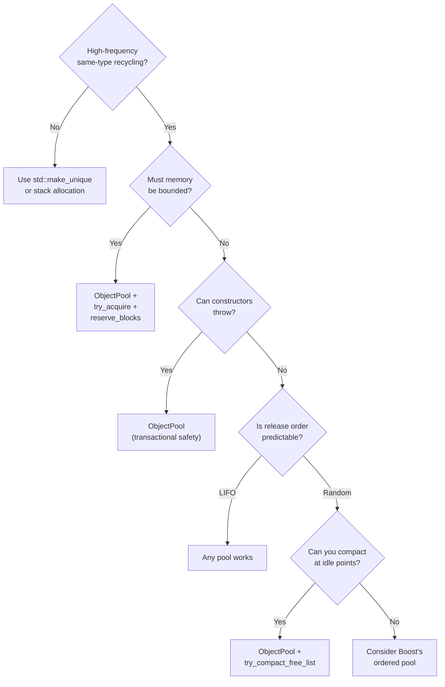

| Strategy | When to Use |
|----------|-------------|
| `std::make_unique` | Single owner, RAII lifetime, no recycling |
| `std::pmr` | Allocator-aware containers, custom memory resources |
| **ObjectPool** | High-frequency recycling, exception safety, bounded memory |
| Arena allocator | Bulk deallocation (everything freed at once) |
| Stack allocator | LIFO deallocation order guaranteed |

---

# **PART IV — FOUNDATIONS**

---

# **APPENDIX A — A History of Memory Pooling**

Memory pooling is as old as operating systems.

### The 1960s: OS Kernels

The Compatible Time-Sharing System (CTSS) at MIT (1961) needed to manage memory for multiple users. The naive approach—allocating on demand—led to fragmentation. The solution: pre-allocate fixed-size chunks at boot time, hand them out on request, recycle them when returned.

Unix (1969) adopted pooling for kernel data structures. The file table, process table, and inode cache were all fixed-size arrays. Creating a file descriptor meant taking a slot; closing it meant returning the slot. Simple, predictable, unfragmentable.

### The 1970s-80s: Real-Time Systems

Embedded and real-time systems couldn't tolerate unpredictable allocation latency. Memory pools with bounded allocation time became standard. The pool was sized at compile time—if you needed more objects than it held, you'd designed the system wrong.

### The 1990s: Game Development

PC games pushed hardware limits. Every millisecond mattered. Game developers adopted pooling for temporary objects—particles, projectiles, sound effects. John Carmack's Quake engine and Epic's Unreal Engine both used extensive pooling.

The technique spread through GDC talks, Gamasutra articles, and game programming books. "Object Pool" became a standard pattern in game architecture.

### The 2000s: Web Servers and Databases

High-throughput servers faced similar pressures. Apache's APR (Apache Portable Runtime) formalized hierarchical memory pools: a request pool created when a connection arrived, destroyed when the response completed. All request allocations came from that pool.

### The 2010s: C++ Standardization

Boost.Pool provided portable pooling for C++. Later, C++17's `std::pmr` standardized custom memory resources.

But neither provided managed object lifecycle—that remained the programmer's responsibility.

### Today

Modern pooling combines lessons from all eras: pre-allocation for bounded memory, recycling for performance, transactional semantics for exception safety. ObjectPool represents this synthesis.

---

# **APPENDIX B — Why boost::object_pool Uses Ordered Free Lists**

Boost's `object_pool` maintains the free list in address order. When you release an object, the pool walks the free list to find the correct insertion point—O(n) worst case.

Why accept this cost?

### Consistent Allocation Order

If you acquire N objects, release them all, and acquire N again, you get the same addresses in the same order. This makes debugging easier and cache behavior predictable.

### Simpler Destruction

When destroying the pool, an ordered free list makes it trivial to identify which slots contain live objects (the gaps in the sequence).

### The Trade-off

For workloads that release many objects, the O(n) release cost dominates. But the true cost is hidden until you measure the full cycle (release all + reacquire all).

**Individual operation benchmarks (N=100,000):**

| Operation | fat_p | boost | foonathan |
|-----------|-------|-------|-----------|
| Acquire+Release | 2.39 ns | 2.54 ns | 2.82 ns |
| Bulk Acquire | 2.04 ns | 8.08 ns | 2.18 ns |

Boost looks competitive—only 6% slower on acquire+release. But this hides the O(n) `ordered_free` cost because release happens during teardown, outside the timed region.

**Full cycle benchmarks (release all randomly + compact + reacquire all):**

| N | fat_p | boost | foonathan | boost/fat_p |
|---|-------|-------|-----------|-------------|
| 1,000 | 4.0 ns | 778 ns | 3.4 ns | **195×** |
| 10,000 | 5.4 ns | 2,691 ns | 5.0 ns | **498×** |
| 100,000 | 6.8 ns | **29,954 ns** | 7.2 ns | **4,377×** |

At 100,000 objects, boost is **four thousand times slower** than fat_p for the flush-and-refill pattern. This is the O(n²) behavior that emerges from O(n) ordered insertion: releasing N objects requires N insertions, each scanning up to N elements.

### ObjectPool's Choice

ObjectPool uses LIFO (O(1) release) with opt-in compaction. You pay O(n) once when you compact, not O(n) on every release. For flush-and-refill workloads, this is the difference between 6.8 nanoseconds and 30 microseconds per operation.

Neither approach is universally superior. Boost optimizes for simplicity and persistent locality. ObjectPool optimizes for throughput in batch-oriented workloads.

---

# **APPENDIX C — Design Constraints and Rejected Alternatives**

### Hard Constraints

1. **Zero external dependencies.** Many deployment environments prohibit Boost.
2. **O(1) acquire and release.** Hot-path performance is non-negotiable.
3. **Exception safety without caller effort.** Manual try-catch is error-prone.
4. **No type requirements.** Must work with any constructible type.

### Rejected Alternatives

| Alternative | Why Rejected |
|-------------|--------------|
| Ordered free list | O(n) release cost unacceptable |
| Lock-free free list | Complexity outweighs benefit for most cases |
| Per-thread pools by default | Complicates API; users can use thread_local |
| Automatic shrinking | Unpredictable timing; destroy pool to reclaim |
| Virtual dispatch for policies | Runtime overhead defeats the purpose |
| Intrusive free list | Requires type cooperation |

### Accepted Trade-offs

| Trade-off | Rationale |
|-----------|-----------|
| Blocks never deallocated | Predictable footprint; destroy pool to reclaim |
| LIFO causes locality collapse | Compaction is explicit; users control cost |
| Monomorphic (one T per pool) | Type erasure adds overhead |
| Debug checks add overhead | Expected in debug builds |

---

# **APPENDIX D — Where ObjectPool Loses**

ObjectPool is not universally optimal:

**Long-lived objects.** If objects live for the program's lifetime, pool overhead provides no benefit.

**Polymorphic storage.** One T per pool. Store `Dog`, `Cat`, `Bird` in separate pools.

**Memory must shrink.** Blocks are never deallocated. Destroy and recreate the pool.

**Random release without compaction opportunity.** If you never have idle moments, Boost's ordered list may provide better sustained locality.

**Very small pools.** For fewer than ~100 objects fitting in L1, simpler approaches have less overhead.

---

# **APPENDIX E — The Allocator Model Gap**

The C++ standard allocator model deliberately separates memory allocation from object construction:

```cpp
// std::allocator provides:
T* allocate(size_t n);           // Raw memory
void deallocate(T* p, size_t n); // Free memory

// Construction is separate:
std::construct_at(p, args...);   // Your responsibility
std::destroy_at(p);              // Your responsibility
```

This separation enables maximum flexibility for allocator-aware containers. But it means no standard component provides managed object lifecycle.

`std::pmr::polymorphic_allocator` provides custom memory resources but still delivers raw bytes. Construction, destruction, and exception safety remain your problem.

This gap is architectural, not an oversight waiting for a future standard. ObjectPool fills a gap the standard deliberately leaves unfilled.

---

# **APPENDIX F — Further Reading**

**Boost.Pool Documentation**  
https://www.boost.org/doc/libs/release/libs/pool/doc/html/  

**Game Programming Patterns: Object Pool**  
Robert Nystrom  
https://gameprogrammingpatterns.com/object-pool.html

**What Every Programmer Should Know About Memory**  
Ulrich Drepper  
https://people.freebsd.org/~lstewart/articles/cpumemory.pdf

**CppCon 2017: "std::allocator Is to Allocation what std::vector Is to Vexation"**  
Andrei Alexandrescu

**Apache Portable Runtime Memory Pools**  
https://apr.apache.org/docs/apr/trunk/group__apr__pools.html

**C++ Core Guidelines: Resource Management**  
https://isocpp.github.io/CppCoreGuidelines/CppCoreGuidelines#S-resource

---

*End of Companion Guide*

*ObjectPool.h — Fat-P Library v3.2*
