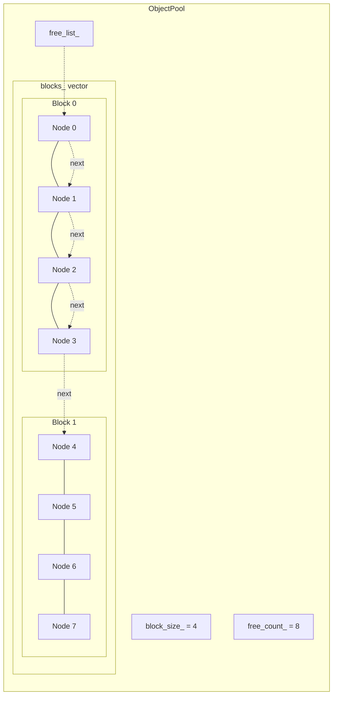

# Overview - ObjectPool

*Fat-P Library — January 2026*

---

## Executive Summary

ObjectPool is a block-based memory recycler that eliminates heap allocation overhead in hot paths while providing managed object lifecycle. Unlike raw memory pools that hand back uninitialized bytes and leave construction to the caller, ObjectPool delivers fully constructed objects with transactional exception safety—if a constructor throws, the pool state is automatically restored. The combination of pre-allocated block storage, LIFO free-list recycling, and RAII wrappers transforms allocation-bound loops into compute-bound operations, delivering 8-10× throughput improvements over `new`/`delete` in benchmark measurements.

---

## Overview Card

**Component:** ObjectPool  
**Problem solved:** Heap allocation overhead and constructor exception safety in high-frequency object recycling  
**When to use:** Hot loops creating and destroying same-type objects; real-time systems requiring bounded memory; exception-rich code where manual try-catch is error-prone  
**When NOT to use:** Long-lived objects; polymorphic storage needs; memory must shrink after usage spikes  
**Key guarantee:** Transactional acquire—if constructor throws, pool state is unchanged  
**std equivalent:** None. No standard equivalent exists or is planned.  
**Boost equivalent:** `boost::object_pool` (similar concept, different guarantees)  
**Other alternatives:** foonathan/memory, EASTL fixed pools  
**Read next:** User Manual - ObjectPool, Companion Guide - ObjectPool

---

## The Problem Domain

### What Goes Wrong Without It

Consider a network server handling 10,000 requests per second. Each request needs a handler object:

```cpp
void process_requests(std::span<Request> requests) {
    for (const auto& req : requests) {
        auto* handler = new RequestHandler(req);
        handler->execute();
        delete handler;
    }
}
```

This code spends 25-40% of its time in memory allocation. Each `new` contends for the heap mutex. Each `delete` does the same. With four threads processing requests simultaneously, they serialize on this contention point. The business logic—the actual request handling—runs in the gaps between allocation waits.

The problem compounds over time. Thousands of small allocations interleaved with deallocations fragment the heap. After days of operation, the allocator struggles to find contiguous blocks. Latency spikes appear as the allocator reorganizes its free lists.

Now consider a game engine's particle system. Particles spawn when emitters fire and die when their lifetime expires. The particle constructor validates initialization data and can throw if values are out of range. A naive pool implementation removes a slot from availability before construction. When the constructor throws, that slot is lost—not in the free list, not returned to the caller. The pool slowly "leaks" internally until it reports exhaustion despite having capacity.

| Issue | Impact |
|-------|--------|
| Per-object heap allocation | 20-40 ns overhead per new/delete pair; mutex contention under load |
| Memory fragmentation | Latency spikes after long runtime; eventual allocation failures |
| Constructor exceptions | Naive pools corrupt state; lose track of available slots |
| Manual release management | Forgotten release calls; exception paths leak objects |

### The Standard's Limitation

The C++ standard provides two approaches, neither satisfactory:

**`std::pmr::polymorphic_allocator`** offers customizable memory resources but provides raw bytes, not objects. Construction, destruction, and exception safety remain your responsibility:

```cpp
std::pmr::monotonic_buffer_resource pool;
std::pmr::polymorphic_allocator<Handler> alloc(&pool);

Handler* h = alloc.allocate(1);
try {
    std::construct_at(h, args...);  // Your problem if this throws
} catch (...) {
    alloc.deallocate(h, 1);         // Don't forget cleanup
    throw;
}
// ... use handler ...
std::destroy_at(h);                  // Don't forget destruction
alloc.deallocate(h, 1);
```

This is correct but verbose and error-prone. Every allocation site requires careful try-catch handling.

**`std::allocator`** and its traits provide construction helpers but no pooling. You're back to per-object heap allocation.

No standard component combines pooled allocation with managed object lifecycle. This gap is permanent—the allocator model deliberately separates memory acquisition from object construction.

---

## Architecture: Transactional Acquire with Free-List Recycling

ObjectPool combines three mechanisms:

### Block-Based Storage

Memory is allocated in contiguous blocks, not one object at a time:



```cpp
template <typename T>
class ObjectPool {
    struct Node {
        alignas(T) std::byte storage[sizeof(T)];  // Object lives here
        Node* next;                                // Free-list link
    };
    
    std::vector<std::unique_ptr<Node[]>> blocks_;  // Contiguous blocks
    size_t block_size_;                            // Nodes per block
};
```

When the pool needs capacity, it allocates an entire block of nodes. All nodes in a block are contiguous in memory, providing cache locality for sequential access patterns.

### Free-List Recycling

Available nodes are linked through their `next` pointers:

```
free_list_ → [Node 0] → [Node 5] → [Node 2] → ... → nullptr
```

Acquiring an object pops from the front (O(1)). Releasing pushes to the front (O(1)). No heap interaction after the pool is warmed up.

### Transactional Construction

The critical innovation is exception-safe construction:

```cpp
template <typename... Args>
T* acquire(Args&&... args) {
    Node* node = free_list_;
    free_list_ = node->next;      // Remove from free list
    
    try {
        return new (&node->storage) T(std::forward<Args>(args)...);
    } catch (...) {
        node->next = free_list_;  // RESTORE: put it back
        free_list_ = node;
        throw;
    }
}
```

If construction succeeds, the caller gets a valid object. If construction throws, the node is restored to the free list before the exception propagates. The pool never observes an inconsistent state.

---

## Feature Inventory

### 1. Managed Object Lifecycle

`acquire()` constructs objects in-place with perfect forwarding. `release()` destructs and recycles. No manual placement new, no manual destructor calls:

```cpp
ObjectPool<Connection> pool(64);

Connection* conn = pool.acquire("host", 443, options);
// conn is fully constructed, ready to use

conn->send(data);

pool.release(conn);  // Destructor called, storage recycled
```

### 2. RAII Wrapper

`PooledObject<T>` provides automatic release on scope exit:

```cpp
void handle_request(ObjectPool<Handler>& pool, const Request& req) {
    auto handler = fat_p::make_pooled(pool, req);
    handler->process();  // Can throw safely
    // ~PooledObject() releases automatically
}
```

No manual release needed. No exception paths to audit.

### 3. Non-Allocating Acquisition

`try_acquire()` returns nullptr instead of growing when empty:

```cpp
pool.reserve_blocks(100);  // Pre-allocate maximum capacity

// In real-time callback (allocation forbidden)
Handler* h = pool.try_acquire();
if (!h) return;  // Graceful degradation
```

Guaranteed bounded memory. Deterministic timing.

### 4. Specialized Acquisition

For trivial types where construction overhead matters:

```cpp
// Skip constructor entirely (caller initializes)
ParticleData* p = pool.acquire_uninitialized();

// Zero-initialize via memset
Counters* c = pool.acquire_zeroed();
```

SFINAE-protected: only available when the type constraints allow.

### 5. Free-List Compaction

After random-order releases scatter the free list, restore sequential allocation order:

```cpp
// End of frame—pool is empty
if (pool.try_compact_free_list()) {
    // Next frame's acquisitions return sequential addresses
}
```

Recovers cache locality for the next batch of operations.

### 6. Policy-Based Thread Safety

Compile-time selection of synchronization strategy:

```cpp
// Single-threaded: zero overhead
fat_p::ObjectPool<T> pool(64);

// Thread-safe: mutex-protected
fat_p::ThreadSafeObjectPool<T> pool(64);
```

No virtual dispatch. No runtime flag checking.

---

## Why Not Alternatives?

### boost::object_pool

| Aspect | boost::object_pool | FAT-P ObjectPool |
|--------|-------------------|------------------|
| **Thread safety** | Single-threaded only | Policy-based (single or mutex) |
| **Exception safety** | Caller's responsibility | Transactional acquire |
| **RAII wrapper** | None | PooledObject |
| **Allocation pattern** | Per-object or simple_segregated | Block-based |
| **Free-list order** | Ordered (O(n) release) | LIFO (O(1) release) + optional compaction |
| **Dependencies** | Boost headers | None (STL only) |
| **Debug support** | Limited | Leak detection, double-release detection |

**When to use boost::object_pool:** You're already using Boost; you need ordered allocation; exception safety is handled externally.

**When to use FAT-P ObjectPool:** You need thread safety options, transactional exception safety, RAII wrappers, or zero dependencies.

### std::pmr Memory Resources

| Aspect | std::pmr | FAT-P ObjectPool |
|--------|----------|------------------|
| **Provides** | Raw memory | Constructed objects |
| **Construction** | Manual | Automatic with forwarding |
| **Exception safety** | Manual try-catch | Automatic restoration |
| **RAII** | Manual | PooledObject wrapper |
| **Standardized** | Yes (C++17) | No |

**When to use std::pmr:** You need raw memory for custom layouts; you want standard library compatibility; you're building allocator-aware containers.

**When to use FAT-P ObjectPool:** You want managed object lifecycle; you want exception safety without boilerplate; you want RAII automation.

### The Exclusionary Argument

| If You Need... | Why Not boost | Why Not std::pmr | FAT-P Advantage |
|----------------|---------------|------------------|-----------------|
| Thread-safe pooling | Single-threaded only | Not a pool | Policy-based sync |
| Exception-safe acquire | Manual handling | Manual handling | Transactional restore |
| RAII release | Not provided | Not provided | PooledObject wrapper |
| Zero dependencies | Requires Boost | Standard but raw memory | STL-only |
| Debug diagnostics | Limited | None | Full debug mode |

When you need **all of these simultaneously**, ObjectPool is the only option.

---

## The "Forever Stuck" Reality

The C++ standard allocator model deliberately separates memory allocation from object construction. This is by design—it enables maximum flexibility for allocator-aware containers. But it means no standard component will ever provide managed object pooling with constructor forwarding and exception safety.

`std::pmr` provides the "where" of memory (custom resources). It does not address the "what" of object lifecycle. This gap is architectural, not an oversight waiting for a future standard.

Scientific computing clusters running RHEL 7/8 with GCC 7.x for driver compatibility need this capability today. They cannot wait for hypothetical future standards. They often cannot take Boost dependencies due to deployment constraints.

ObjectPool is not a shim waiting for standardization. It fills a gap the standard deliberately leaves unfilled.

---

## Performance Characteristics

Benchmarks on Windows, MSVC 2022, 3.7 GHz base clock (median of 15 runs):

| Operation | fat_p | boost | foonathan | new/delete |
|-----------|-------|-------|-----------|------------|
| Acquire+Release (N=100k) | **2.39 ns** | 2.54 ns | 2.82 ns | 20.18 ns |
| Bulk Acquire (N=100k) | **2.04 ns** | 8.08 ns | 2.18 ns | 22.82 ns |
| After Random Release | 5.66 ns | 2.29 ns | 4.32 ns | N/A |
| After Compact | **1.88 ns** | 2.34 ns | 4.48 ns | N/A |

**Speedup vs new/delete:** 8.4× for acquire+release cycles, 11.2× for bulk acquire.

### The Full Cycle Test: Where Boost Falls Apart

The "Pool Reuse Full Cycle" benchmark measures the true cost of flush-and-refill patterns (release all randomly, compact, reacquire all). Boost's O(n) `ordered_free` becomes catastrophic:

| N | fat_p | boost | foonathan | Ratio (boost/fat_p) |
|---|-------|-------|-----------|---------------------|
| 1,000 | 4.0 ns | 778 ns | 3.4 ns | 195× slower |
| 10,000 | 5.4 ns | 2,691 ns | 5.0 ns | 498× slower |
| 100,000 | **6.8 ns** | **29,954 ns** | 7.2 ns | **4,377× slower** |

This is why ObjectPool uses LIFO with explicit compaction rather than ordered insertion.

### Where FAT-P Wins

**High-frequency recycling.** Hot loops that create and destroy thousands of objects per frame.

**Bounded memory systems.** Real-time audio, embedded systems, trading infrastructure.

**Exception-rich code.** Constructors that validate, connect, or initialize and can fail.

**Flush-and-refill workloads.** Batch processing where compaction at batch boundaries recovers locality. This is where boost's O(n) ordered_free becomes catastrophic (4,377× slower at N=100k).

### Where FAT-P Loses

**Long-lived objects.** If objects live for the program's lifetime, pool overhead is pure waste.

**Random release without compaction.** If you can never compact (pool never empties), boost's ordered free list provides better sustained locality.

**Memory must shrink.** Pool blocks are never deallocated. Destroy the pool to reclaim memory.

**Polymorphic storage.** One T per pool. Use separate pools for different types.

### Feature Comparison

| Allocator | O(1) Ops | Thread-Safe | Auto-Grow | RAII Wrapper | try_acquire |
|-----------|----------|-------------|-----------|--------------|-------------|
| **fat_p::ObjectPool** | ✓ | Optional | ✓ | ✓ | ✓ |
| boost::object_pool | ✓ | ✗ | ✓ | ✗ | ✗ |
| foonathan::memory | ✓ | Optional | ✓ | ✗ | ✗ |
| EASTL::fixed_pool | ✓ | ✗ | **✗** | ✗ | ✓ |
| std::pmr::unsync_pool | ✓ | ✗ | ✓ | ✗ | ✗ |
| std::pmr::sync_pool | ✓ | ✓ | ✓ | ✗ | ✗ |

Note: EASTL::fixed_pool is fixed-capacity (no auto-grow)—a fundamentally different contract.

---

## Integration Points

```
ObjectPool.h
    → uses: ConcurrencyPolicies.h (SingleThreadedPolicy, MutexSynchronizationPolicy)
    → uses: FatPTypeTraits.h (is_object_pool trait)
    → used by: Signal.h (pooled slot storage)
    → used by: ThreadPool.h (task object recycling)
```

---

## Final Assessment

ObjectPool delivers on the FAT-P promise:

**Permanence.** The standard allocator model excludes managed object lifecycle by design. No future standard will change this. ObjectPool fills a permanent gap.

**Specialization.** Transactional exception safety, RAII wrappers, block-based locality, debug instrumentation—these address HPC and real-time requirements that general-purpose allocators ignore.

**Control.** Policy-based thread safety at compile time. SFINAE-protected specialized acquisition. Debug-only tracking that vanishes in release. Fine-grained control without runtime overhead.

For high-frequency object recycling with exception safety and bounded memory, ObjectPool transforms allocation-bound code into compute-bound code—without external dependencies.

---

*ObjectPool.h — Fat-P Library v3.2*
