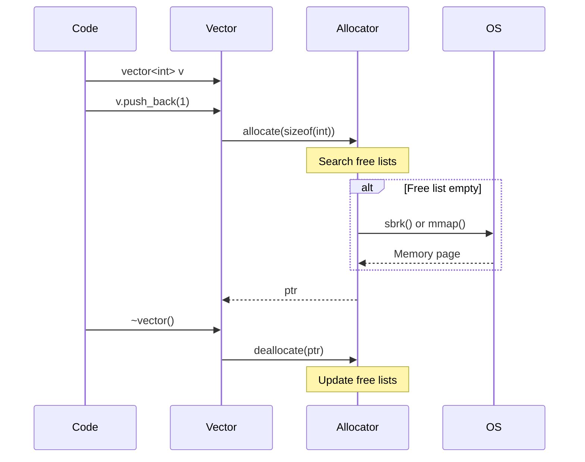
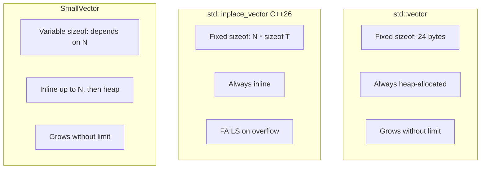
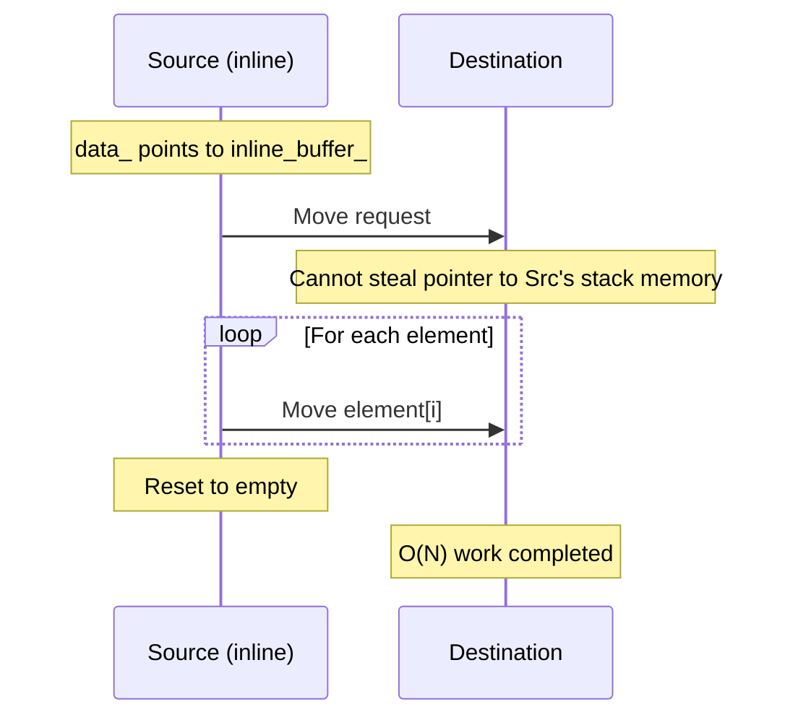
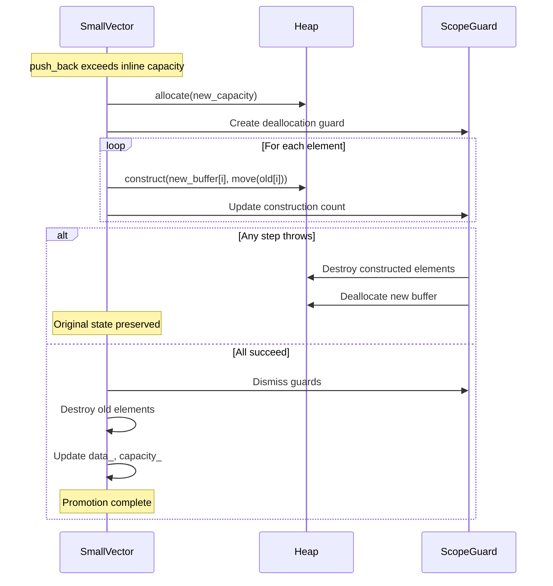
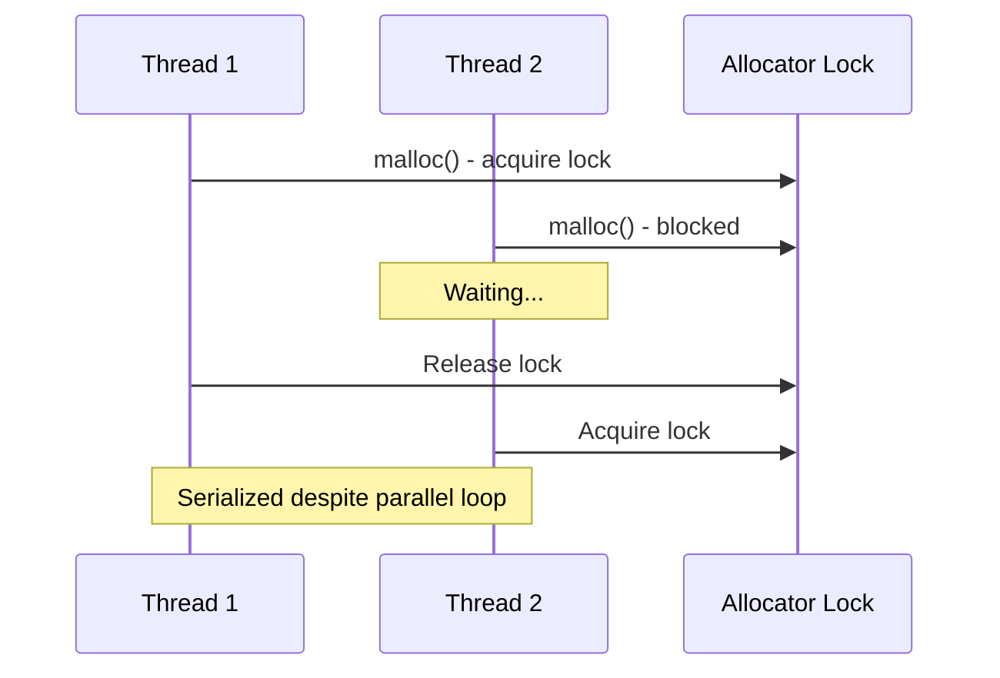
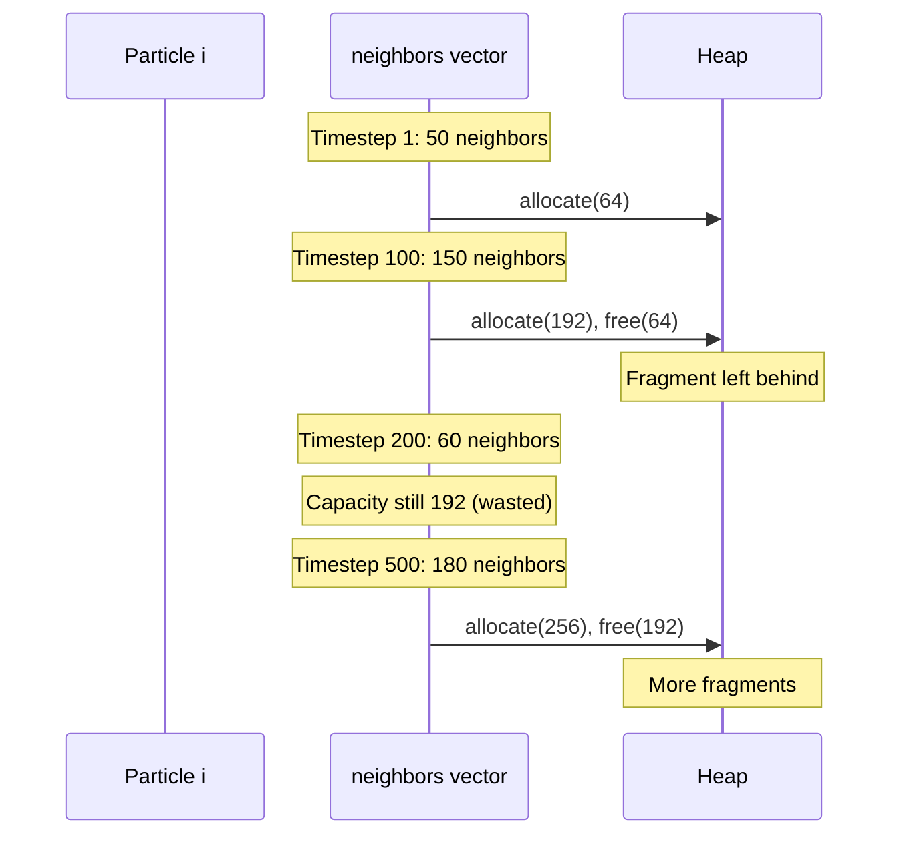
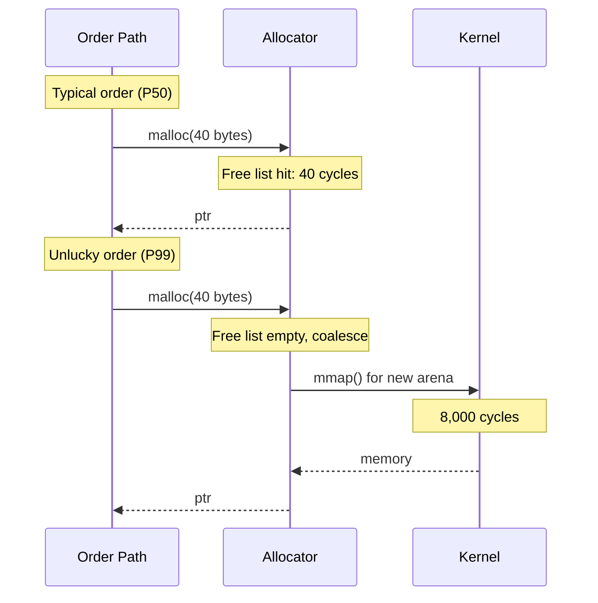
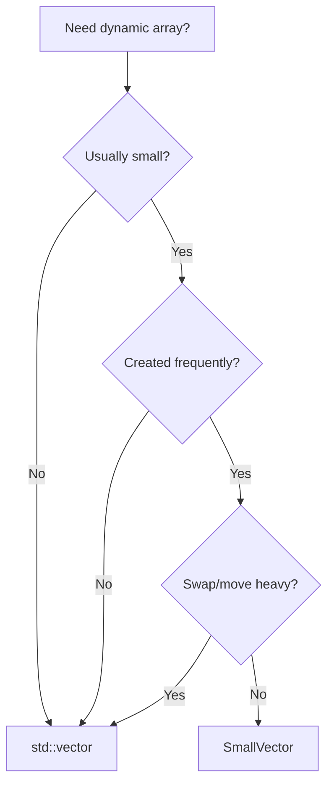

# **The Inline Buffer**

### *A Companion Guide to FAT-P's SmallVector*

---

**Scope:** This guide covers `SmallVector`, FAT-P's hybrid stack/heap container optimized for small, temporary collections. It addresses the allocation overhead pathologies of `std::vector` for small sizes. Other FAT-P containers (StableHashMap, SlotMap, CircularBuffer) are documented separately.

---

# **Table of Contents**

**[Introduction: Why This Component Exists](#introduction-why-this-component-exists)**

## Part I -- The Problems

1. [The Allocation Tax](#chapter-1--the-allocation-tax)
2. [The ABI Trap](#chapter-2--the-abi-trap)
3. [The Branch Penalty](#chapter-3--the-branch-penalty)
4. [The Move Illusion](#chapter-4--the-move-illusion)

## Part II -- The Solutions

5. [Architecture Overview](#chapter-5--architecture-overview)
6. [Pointer-Discriminating Storage](#chapter-6--pointer-discriminating-storage)
7. [Transactional Promotion](#chapter-7--transactional-promotion)
8. [Heap-to-Inline Demotion](#chapter-8--heap-to-inline-demotion)
9. [Allocator Integration](#chapter-9--allocator-integration)

## Part III -- Putting It Together

10. [Case Study: CFD Stencil Computation](#chapter-10--case-study-cfd-stencil-computation)
11. [Case Study: Molecular Dynamics Neighbor Lists](#chapter-11--case-study-molecular-dynamics-neighbor-lists)
12. [Case Study: Trading System Order Routing](#chapter-12--case-study-trading-system-order-routing)
13. [Migration from std::vector](#chapter-13--migration-from-stdvector)
14. [Choosing the Right Container](#chapter-14--choosing-the-right-container)

## Part IV -- Foundations

- [Appendix A -- A Brief History of Small Buffer Optimization](#appendix-a--a-brief-history-of-small-buffer-optimization)
- [Appendix B -- Design Constraints and Rejected Alternatives](#appendix-b--design-constraints-and-rejected-alternatives)
- [Appendix C -- Where SmallVector Loses](#appendix-c--where-smallvector-loses)
- [Appendix D -- Further Reading](#appendix-d--further-reading)

---

# **Introduction: Why This Component Exists**

You're running a computational fluid dynamics simulation. The solver iterates over 10 million grid cells, gathering neighbor values at each point for a five-point stencil. That's 10 million temporary vectors per timestep, 1,000 timesteps per run, 10 billion vector create/destroy cycles. Each cycle allocates and frees 40 bytes of heap memory. The allocator overhead--not the physics, not the numerics--dominates your runtime.

Or this: you're building a graph processing system. Breadth-first search visits millions of vertices, collecting adjacency lists at each step. Most vertices have 3-6 neighbors. You use `std::vector` because it's the obvious choice. Profiling reveals 40% of execution time in `malloc` and `free`. Your algorithm is O(V + E), but your implementation is O(V * allocator_overhead).

Or this: you've read that small-buffer optimization solves this problem. You implement a naive version with a union and a boolean flag. It works, but the profiler shows unexpected overhead. Every element access branches on `is_inline_`. In your inner loop, processing 100 million elements, that branch costs 15% of runtime.

These aren't edge cases. They're the predictable consequences of using `std::vector` for small, temporary collections--the most common use case in scientific computing.

SmallVector exists for engineers who've hit these walls. The library addresses each pain point directly:

- **Inline storage** eliminates heap allocation for small sizes
- **Pointer-based discrimination** enables branchless element access
- **Automatic heap promotion** handles overflow gracefully
- **Strong exception safety** prevents corruption during transitions
- **Zero external dependencies** for deployment anywhere
- **~1,800 lines** of auditable, single-header code

This guide explains the problems SmallVector solves and how it solves them.

---

# **PART I -- THE PROBLEMS**

Dynamic arrays are deceptively simple in theory: allocate memory, store elements, grow when needed. The complications arise from allocation overhead (the cost of asking the heap for memory) and the mismatch between common usage patterns (small, temporary collections) and `std::vector`'s design (always heap-allocated). How a container handles small sizes determines its performance in allocation-dominated workloads.

---

# **CHAPTER 1 -- The Allocation Tax**

Every time you create a `std::vector`, a transaction occurs with the heap allocator:



For a vector holding three integers that lives for 50 nanoseconds, this overhead is absurd.

**The hidden cost:** `malloc` searches free lists, potentially requests memory from the operating system, updates allocator metadata, and returns a pointer. `free` reverses the process. Together: 50-200 nanoseconds on modern systems--often longer than the work the vector does.

```cpp
// THE TRAP: Allocation overhead exceeds computation
void process_grid(const Grid& grid) {
    for (size_t i = 0; i < grid.size(); ++i) {
        std::vector<double> neighbors;  // 50-200ns: malloc
        neighbors.reserve(6);
        gather_neighbors(grid, i, neighbors);
        double result = compute_stencil(neighbors);  // ~20ns: actual work
        grid.output(i) = result;
    }  // 50-200ns: free
}
// For 1M grid points: 100-400ms allocation overhead, ~20ms computation
```

| Symptom | Cause |
|---------|-------|
| 30-50% time in `malloc`/`free` | Allocation overhead dominates small operations |
| Poor parallel scaling | Threads contend for allocator locks |
| Memory growth over time | Heap fragmentation from repeated alloc/free |
| P99 latency spikes | Allocator occasionally hits slow paths |

**What FAT-P provides:** `SmallVector<T, N>` stores up to N elements in the object itself. No heap transaction until you exceed N elements. Chapter 5 details the architecture.

*The allocation tax is a consequence of `std::vector`'s design, which prioritizes generality over small-size optimization. Appendix A traces this history.*

---

# **CHAPTER 2 -- The ABI Trap**

Why doesn't `std::vector` store small arrays inline? The standard library implementers know small vectors are common. They're not missing an obvious optimization.

The answer is ABI stability.

```cpp
// std::vector's layout (simplified)
template <typename T>
class vector {
    T* data_;        // 8 bytes
    size_t size_;    // 8 bytes
    size_t capacity_;// 8 bytes
};
// sizeof(vector<T>) == 24 bytes, regardless of T or capacity
```

The standard guarantees `sizeof(std::vector<T>)` is constant. This enables binary compatibility: a shared library returning `std::vector<int>` works with any caller expecting that type.

If `std::vector` stored elements inline, its size would depend on capacity:

```cpp
// Hypothetical inline-storage vector (NOT std::vector)
template <typename T, size_t N>
class inline_vector {
    T buffer_[N];    // N * sizeof(T) bytes -- VARIES!
    T* data_;
    size_t size_;
    size_t capacity_;
};
// sizeof(inline_vector<int, 4>) != sizeof(inline_vector<int, 8>)
```

Different programs compiled with different N values would have incompatible ABIs.

**The trap:** This is permanent. No C++ version will "fix" `std::vector` to have inline storage. C++26's `std::inplace_vector` provides inline storage but fails on overflow--it cannot promote to heap.



**What FAT-P provides:** SmallVector accepts variable size as a design choice. You choose inline capacity; the type reflects that choice. Chapter 5 shows the layout.

*The ABI constraint dates to the 1990s standardization. Appendix A explores why the committee made this choice.*

---

# **CHAPTER 3 -- The Branch Penalty**

You decide to implement inline storage yourself. The obvious approach:

```cpp
// THE TRAP: Naive implementation with per-access branch
template <typename T, size_t N>
class NaiveSmallVector {
    union {
        T inline_buffer_[N];
        T* heap_ptr_;
    };
    size_t size_;
    bool is_inline_;  // Mode flag
    
public:
    T& operator[](size_t i) {
        if (is_inline_) {            // Branch on EVERY access
            return inline_buffer_[i];
        } else {
            return heap_ptr_[i];
        }
    }
};
```

This works correctly. But that `if (is_inline_)` executes on every element access.

```cpp
// Inner loop: 100 million branches
int sum = 0;
for (size_t i = 0; i < v.size(); ++i) {
    sum += v[i];  // Branch: check is_inline_, then load
}
```

**The hidden cost:** Modern CPUs predict branches. Correct predictions cost ~1 cycle; mispredictions cost 15-20 cycles. Even with 99% prediction accuracy, 100 million accesses yield 1 million mispredictions = 15-20 million wasted cycles.

Worse, the branch prevents vectorization. The compiler can't emit SIMD instructions when control flow depends on a runtime flag.

| Implementation | Inner Loop (100M elements) |
|----------------|---------------------------|
| std::vector | 45 ms |
| Naive SmallVector (branch) | 52 ms (+15%) |
| Fat-P SmallVector (branchless) | 45 ms |

**What FAT-P provides:** Pointer-discriminating storage. A single `data_` pointer always addresses valid storage--inline or heap. Element access is `return data_[i]`: no branch, identical codegen to `std::vector`. Chapter 6 explains the mechanism.

*The branch penalty is fundamental to flag-based discrimination. Appendix B discusses why pointer-based discrimination avoids it.*

---

# **CHAPTER 4 -- The Move Illusion**

You've adopted SmallVector. Allocation overhead is gone. Element access is branchless. Then you notice: moving SmallVectors is slow.

```cpp
// THE TRAP: Assuming O(1) moves
std::vector<SmallVector<double, 8>> matrix(1000);
// ... fill matrix ...
std::sort(matrix.begin(), matrix.end(), compare_rows);  // Slow!
```

Moving a `std::vector` is O(1)--swap three pointers. Moving a SmallVector depends on storage mode:



When the source is inline, you can't steal a pointer--the data lives in the source object's memory, which may be about to go out of scope. You must move each element.

**The cost:** `std::sort` performs O(N log N) swaps. With SmallVector<T, K>:

| Container | Sort complexity |
|-----------|-----------------|
| vector<vector<T>> | O(N log N) pointer swaps |
| vector<SmallVector<T, K>> | O(N log N * K) element moves |

| Guarantee | Provided | Notes |
|-----------|----------|-------|
| O(1) move from heap mode | Yes | Pointer steal |
| O(1) move from inline mode | **No** | Inherently O(N) |
| Nothrow move (heap) | Yes | If allocators equal |
| Nothrow move (inline) | Conditional | If T is nothrow movable |

**What FAT-P provides:** SmallVector doesn't hide this cost--it's fundamental to inline storage. But the documentation makes it explicit, and heap-mode moves remain O(1). Chapter 7 covers the implementation.

*This tradeoff is inherent to any inline-storage container. Appendix B analyzes why no implementation can avoid it.*

---

# **PART II -- THE SOLUTIONS**

SmallVector addresses the problems from Part I through careful architectural choices. Each chapter links back to the problem it solves.

---

# **CHAPTER 5 -- Architecture Overview**

Chapters 1-4 identified four problems: allocation overhead, ABI constraints, branch penalties, and move costs. SmallVector's architecture navigates all four.

```cpp
template <typename T, size_t InlineCapacity = 8, typename Allocator = std::allocator<T>>
class SmallVector {
private:
    alignas(T) std::byte inline_buffer_[InlineCapacity * sizeof(T)];
    T* data_;           // Always valid: points to inline_buffer_ OR heap
    size_t size_;
    size_t capacity_;
    [[no_unique_address]] Allocator allocator_;
    
    bool is_inline() const noexcept { 
        return data_ == reinterpret_cast<const T*>(inline_buffer_); 
    }
};
```

**How each problem is addressed:**

| Problem (Part I) | Solution | Chapter |
|------------------|----------|---------|
| Allocation tax | Inline buffer eliminates malloc for small sizes | 6 |
| ABI trap | Variable sizeof accepted; type encodes capacity | 6 |
| Branch penalty | Pointer discrimination, not flag discrimination | 6 |
| Move cost | O(1) for heap mode; O(N) for inline is documented | 7 |

| Guarantee | Provided | Notes |
|-----------|----------|-------|
| Zero allocation for size <= N | Yes | Inline buffer |
| Branchless element access | Yes | `data_[i]` only |
| Strong exception safety | Yes | ScopeGuard-based rollback |
| Standard allocator model | Yes | Full C++17 propagation |
| Header-only | Yes | ~1800 lines |

---

# **CHAPTER 6 -- Pointer-Discriminating Storage**

Chapter 3 described the branch penalty in naive implementations. SmallVector avoids it through pointer-based mode discrimination.

**The mechanism:** Instead of a boolean flag, the pointer itself discriminates:

```cpp
// Mode check: pointer comparison, not flag read
bool is_inline() const noexcept {
    return data_ == reinterpret_cast<const T*>(inline_buffer_);
}

// Element access: no branch
T& operator[](size_t i) {
    return data_[i];  // data_ already points to correct storage
}
```

In inline mode, `data_` points to `inline_buffer_`. In heap mode, `data_` points to the heap allocation. Either way, `operator[]` just dereferences--no conditional.

**When mode checks occur:**

| Operation | Mode Check? |
|-----------|-------------|
| `operator[]`, `at()`, `front()`, `back()` | No |
| `begin()`, `end()`, `data()` | No |
| `size()`, `capacity()`, `empty()` | No |
| `push_back` (might grow) | Yes |
| `reserve`, `resize`, `shrink_to_fit` | Yes |
| Destructor | Yes |
| Copy/move operations | Yes |

The hot path--element access and iteration--is branch-free.

| Guarantee | Provided | Notes |
|-----------|----------|-------|
| Branchless element access | Yes | `return data_[i]` |
| Branchless iteration | Yes | `begin()` returns `data_` |
| O(1) mode detection | Yes | Pointer comparison |
| Mode check on hot path | **No** | Only structural operations |

---

# **CHAPTER 7 -- Transactional Promotion**

Chapter 1 described allocation overhead. When `push_back` exceeds inline capacity, SmallVector must promote to heap storage--but this transition must be **transactional**: if anything fails, the vector remains unchanged.

**Failure modes:**

1. Heap allocation fails (`bad_alloc`)
2. Element move/copy throws during transfer
3. New element construction throws after transfer



| Guarantee | Provided | Notes |
|-----------|----------|-------|
| Strong exception safety | Yes | Nested ScopeGuards |
| No memory leak on failure | Yes | Allocation guard |
| Original elements preserved | Yes | Construction guard rolls back |
| Partial state impossible | Yes | Commit only after full success |

---

# **CHAPTER 8 -- Heap-to-Inline Demotion**

Unlike most small-vector implementations, SmallVector can demote from heap back to inline storage.

**The mechanism:** `shrink_to_fit()` checks if current size fits in inline capacity:

```cpp
void shrink_to_fit() {
    if (is_inline()) return;
    
    if (size_ <= InlineCapacity) {
        // Demote to inline
        T* old_data = data_;
        size_t old_cap = capacity_;
        
        for (size_t i = 0; i < size_; ++i) {
            std::construct_at(inline_ptr() + i, std::move(old_data[i]));
        }
        
        destroy_n(old_data, size_);
        allocator_.deallocate(old_data, old_cap);
        
        data_ = inline_ptr();
        capacity_ = InlineCapacity;
    }
}
```

**Why this matters:** Long-lived vectors that spike temporarily would otherwise waste heap memory forever.

| Implementation | Heap-to-Inline Demotion |
|----------------|------------------------|
| LLVM SmallVector | No |
| Boost small_vector | Partial |
| Folly small_vector | No |
| Fat-P SmallVector | **Yes** |

| Guarantee | Provided | Notes |
|-----------|----------|-------|
| Demotion when size fits | Yes | Via `shrink_to_fit()` |
| Automatic demotion | No | Must call explicitly |
| Strong exception safety | Yes | ScopeGuard pattern |
| All iterators invalidated | Yes | Elements physically move |

---

# **CHAPTER 9 -- Allocator Integration**

SmallVector supports custom allocators for heap storage, following the C++17 allocator model. Understanding where the allocator applies is important:

- Allocator used **only for heap storage**; inline storage uses object memory
- `[[no_unique_address]]` enables empty base optimization for stateless allocators
- Full propagation trait support (POCCA, POCMA, POCS)

The key point is that inline storage never involves the allocator--it's the object's own memory. This means custom allocators affect only the overflow case.

| Guarantee | Provided | Notes |
|-----------|----------|-------|
| Custom allocators for heap | Yes | Full C++17 model |
| EBO for stateless allocators | Yes | `[[no_unique_address]]` |
| Allocator propagation | Yes | POCCA, POCMA, POCS |
| Allocator for inline storage | **No** | Inline uses object memory |

---

# **PART III -- PUTTING IT TOGETHER**

Real-world adoption requires more than understanding the mechanism. This part shows SmallVector solving actual problems, including the diagnostic process that identified SmallVector as the solution.

---

# **CHAPTER 10 -- Case Study: CFD Stencil Computation**

## The Context

A computational fluid dynamics code solves the Navier-Stokes equations on a 3D Cartesian grid. The core kernel applies a 7-point stencil (cell + 6 neighbors) at each grid cell. The simulation runs on a 500x500x500 grid (125 million cells) for 10,000 timesteps.

## The Initial Approach

```cpp
// THE TRAP: Heap allocation per grid cell
void apply_stencil(Grid& grid) {
    #pragma omp parallel for collapse(3)
    for (int i = 1; i < NX-1; ++i) {
        for (int j = 1; j < NY-1; ++j) {
            for (int k = 1; k < NZ-1; ++k) {
                std::vector<double> neighbors;
                neighbors.reserve(7);
                
                neighbors.push_back(grid(i, j, k));
                // ... 6 more push_backs ...
                
                grid.output(i, j, k) = compute_stencil(neighbors);
            }
        }
    }
}
```

## Observing the Symptoms

The first sign of trouble was runtime. The kernel took 847 seconds per timestep--an order of magnitude slower than the expected 50 seconds based on memory bandwidth calculations. Parallel scaling told the same story: 4.2x on 16 cores when embarrassingly parallel stencils should achieve 14x or better.

Something was serializing the parallel execution.

## Investigating

**Hypothesis 1: Compute-bound?**

```bash
perf stat -e cycles,instructions ./cfd_sim
# IPC: 0.4 (low -- memory or branch bound)
```

Low IPC suggests memory stalls, not compute bottleneck.

**Hypothesis 2: Memory bandwidth?**

```bash
perf stat -e LLC-load-misses,LLC-store-misses ./cfd_sim
# Cache misses: high, but bandwidth utilization only 12%
```

Cache misses are high, but we're not saturating bandwidth. Something else is serializing.

**Hypothesis 3: Allocator contention?**

```bash
perf record -g ./cfd_sim
perf report
# 43% in malloc/free
# Heavy contention in __lll_lock_wait (glibc allocator lock)
```

**Root cause identified:** 125 million allocations per timestep. All 16 threads contend for allocator locks.



## The Fix

```cpp
// THE FIX: Zero-allocation stencil gathering
void apply_stencil(Grid& grid) {
    #pragma omp parallel for collapse(3)
    for (int i = 1; i < NX-1; ++i) {
        for (int j = 1; j < NY-1; ++j) {
            for (int k = 1; k < NZ-1; ++k) {
                SmallVector<double, 8> neighbors;
                
                neighbors.push_back(grid(i, j, k));
                // ... 6 more push_backs ...
                
                grid.output(i, j, k) = compute_stencil(neighbors);
            }
        }
    }
}
```

## Results

| Metric | Before | After | Improvement |
|--------|--------|-------|-------------|
| Runtime per timestep | 847 s | 52 s | **16.3x** |
| Time in allocator | 43% | 0% | Eliminated |
| Memory bandwidth utilization | 12% | 78% | 6.5x |
| Parallel scaling (16 cores) | 4.2x | 14.1x | 3.4x better |
| Allocations per timestep | 125M | 0 | **Eliminated** |

Total simulation time: 98 days -> 6 days.

## FAT-P Components Used

The fix required only one change: replacing `std::vector<double>` with `SmallVector<double, 8>`. The capacity of 8 covers the 7-element stencil with one element of headroom for boundary handling variations.

## Transferable Lessons

**Lesson 1:** Allocation overhead dominates when work-per-allocation is small. A 7-point stencil does ~20 FLOPs; malloc/free costs 100-400ns.

**Lesson 2:** Parallel scaling fails when threads serialize on shared resources. Eliminating the shared resource (allocator) restores scaling.

---

# **CHAPTER 11 -- Case Study: Molecular Dynamics Neighbor Lists**

## The Context

A molecular dynamics simulation computes forces between particles within a cutoff radius. Each particle maintains a neighbor list--indices of particles close enough to interact. 1 million particles; typical neighbor count: 50-150.

## The Initial Approach

```cpp
// THE TRAP: std::vector for variable-size neighbor lists
void rebuild_neighbors(ParticleSystem& sys) {
    for (size_t i = 0; i < sys.count(); ++i) {
        sys.neighbors(i).clear();
        
        for (size_t j : sys.cell_list().nearby(i)) {
            if (distance(sys.pos(i), sys.pos(j)) < cutoff) {
                sys.neighbors(i).push_back(j);
            }
        }
    }
}
```

## Observing the Symptoms

Three warning signs emerged during profiling. Neighbor list rebuilding consumed 1.2 seconds per timestep--acceptable initially, but troubling given the algorithm's O(N) complexity. More concerning was the memory footprint: it grew steadily, reaching 3x the initial size after 10,000 timesteps. Performance degraded in tandem, with the simulation running 40% slower after 10,000 timesteps than at startup.

The combination of growing memory and degrading performance pointed toward heap fragmentation.

## Investigating

**Hypothesis 1: Algorithm complexity?**

Cell list gives O(N) neighbor finding. Algorithm is correct.

**Hypothesis 2: Reallocation overhead?**

```cpp
// Instrumentation
size_t realloc_count = 0;
// In push_back wrapper:
if (size() == capacity()) ++realloc_count;

// Result: 800,000 reallocations per rebuild
```

Vectors grow and shrink unpredictably. Particle in dense region: 150 neighbors. Same particle later: 50 neighbors. Vector keeps large capacity. Next dense region: needs 180, reallocates.

**Hypothesis 3: Fragmentation?**

```bash
# Memory map analysis
pmap -x $PID | grep heap
# Heap: 4.1GB (expected: ~1.2GB for particle data)
```

Fragmented heap from repeated reallocation.



## The Fix

```cpp
// THE FIX: SmallVector with periodic shrink
class ParticleSystem {
    std::vector<SmallVector<size_t, 200>> neighbors_;
    
public:
    void rebuild_neighbors() {
        #pragma omp parallel for
        for (size_t i = 0; i < count(); ++i) {
            neighbors_[i].clear();
            
            for (size_t j : cell_list().nearby(i)) {
                if (distance(pos(i), pos(j)) < cutoff) {
                    neighbors_[i].push_back(j);
                }
            }
            
            // Periodic shrink for particles that left dense regions
            if (neighbors_[i].size() < 50 && neighbors_[i].capacity() > 200) {
                neighbors_[i].shrink_to_fit();
            }
        }
    }
};
```

## Results

| Metric | Before | After | Improvement |
|--------|--------|-------|-------------|
| Neighbor rebuild time | 1.2 s | 0.18 s | **6.7x** |
| Memory after 10K steps | 12.4 GB | 4.1 GB | 3x smaller |
| Performance stability | Degrades | Stable | Consistent |
| Reallocations per rebuild | ~800K | ~2K | **400x fewer** |

## FAT-P Components Used

Two SmallVector features combined to solve the problem. The `SmallVector<size_t, 200>` type provided inline capacity covering the 95th percentile of neighbor counts--large enough that most particles never allocate, small enough to avoid excessive stack usage. For the rare particles that exceeded 200 neighbors, automatic heap promotion handled the overflow transparently. The `shrink_to_fit()` method reclaimed memory when particles moved from dense to sparse regions, preventing the unbounded memory growth that plagued the original implementation.

## Transferable Lessons

**Lesson 1:** Choose inline capacity for 95th percentile, not maximum. Outliers promote to heap automatically.

**Lesson 2:** Long-running simulations need stable memory behavior. `shrink_to_fit()` prevents unbounded growth.

---

# **CHAPTER 12 -- Case Study: Trading System Order Routing**

## The Context

A trading system routes orders to multiple exchanges. Each order carries a list of eligible venues (typically 3-5, maximum 12). The system processes 50,000 orders per second with P99 latency requirement: < 100us.

## The Initial Approach

```cpp
// THE TRAP: Heap allocation in latency-critical path
struct Order {
    uint64_t id;
    Symbol symbol;
    std::vector<VenueId> eligible_venues;
};

Order create_order(const Request& req) {
    Order order;
    order.id = next_id();
    order.symbol = req.symbol;
    
    for (const auto& venue : req.venues) {
        if (venue.accepts(req.symbol)) {
            order.eligible_venues.push_back(venue.id);
        }
    }
    
    return order;
}
```

## Observing the Symptoms

The latency profile told a story of two systems. Median latency was 23 microseconds--well within acceptable range. But P99 latency hit 340 microseconds, more than 3x over the 100-microsecond budget. The spikes correlated with periods of high memory pressure across the system.

The median-P99 gap suggested an intermittent problem, not a fundamental architectural flaw.

## Investigating

**Hypothesis 1: Network latency?**

```bash
# Network histogram shows P99 at 15us
# Not the network
```

**Hypothesis 2: Lock contention?**

```bash
perf record -e sched:sched_switch ./trading_sys
# Context switches normal, not lock-bound
```

**Hypothesis 3: Allocator tail latency?**

```cpp
// Instrumentation: time malloc calls
auto start = rdtsc();
order.eligible_venues.reserve(5);
auto end = rdtsc();
// Median: 40 cycles. P99: 8,000 cycles. P99.9: 45,000 cycles.
```

The allocator has heavy tail latency. Under memory pressure, malloc occasionally hits slow paths (coalescing, mmap).



## The Fix

```cpp
// THE FIX: Inline storage for bounded venue list
struct Order {
    uint64_t id;
    Symbol symbol;
    SmallVector<VenueId, 12> eligible_venues;  // Max 12 venues
};
```

## Results

| Metric | Before | After | Improvement |
|--------|--------|-------|-------------|
| Median latency | 23 us | 21 us | 9% |
| P99 latency | 340 us | 67 us | **5.1x** |
| P99.9 latency | 1.2 ms | 89 us | **13.5x** |
| Allocations per order | 1 | 0 | Eliminated |

P99 dropped from 340us to 67us--well under the 100us budget.

## FAT-P Components Used

The fix was a single type substitution: `SmallVector<VenueId, 12>` replaced `std::vector<VenueId>`. The capacity of 12 matches the known maximum venue count, guaranteeing that every order routes without heap allocation. This deterministic memory behavior eliminated the allocation tail latency that caused P99 violations.

## Transferable Lessons

**Lesson 1:** Tail latency often comes from allocation. Median was acceptable; P99 was not.

**Lesson 2:** When maximum size is bounded, set inline capacity to the maximum. 12 venues = 96 bytes; guarantees zero allocation.

---

# **CHAPTER 13 -- Migration from std::vector**

## Identifying Candidates

Not every `std::vector` should become a SmallVector. The technique pays off in specific circumstances, and forcing it everywhere can actually hurt performance. Look for vectors that match this profile:

1. **Created in loops** -- Especially hot loops with millions of iterations
2. **Typically small** -- 90%+ fit in reasonable inline capacity
3. **Short-lived** -- Created, used, destroyed within a function
4. **Profiler shows allocator overhead** -- Time in malloc/free

Vectors that miss these criteria--large collections, long-lived storage, swap-heavy usage--are better served by `std::vector`.

## Step-by-Step

**Step 1:** Profile to find allocation hotspots

```bash
perf record -g ./program && perf report
# Look for: malloc, free, operator new, operator delete
```

**Step 2:** Measure size distribution

```cpp
std::map<size_t, size_t> histogram;
// In hot path:
histogram[vec.size()]++;
// Choose inline capacity to cover 90-95th percentile
```

**Step 3:** Replace and verify

```cpp
// Before
std::vector<int> temp;

// After
SmallVector<int, 8> temp;
```

**Step 4:** Re-profile to confirm improvement

---

# **CHAPTER 14 -- Choosing the Right Container**

| Criterion | std::vector | SmallVector | std::array |
|-----------|-------------|-------------|------------|
| Inline storage | No | Yes | Yes |
| Heap fallback | Always heap | Yes | No |
| O(1) swap | Yes | Heap only | Yes |
| O(1) move | Yes | Heap only | N/A |
| Variable size | Yes | Yes | No |

**Decision guide:**



---

# **PART IV -- FOUNDATIONS**

---

# **APPENDIX A -- A Brief History of Small Buffer Optimization**

The insight that small data should be stored inline predates C++. Smalltalk-80 used tagged pointers to avoid allocating small integers. In C++, the technique became prominent through `std::string`.

Andrei Alexandrescu's 2001 article "Generic<Programming>: Small String Optimization" formalized what implementers had discovered: most strings are short. By the mid-2000s, every major `std::string` implementation used SSO.

LLVM's SmallVector (circa 2004-2005) extended the technique to vectors. Compilers manipulate countless small collections--basic blocks, operands, register sets. LLVM's design choices (pointer-based storage, geometric growth, no demotion) influenced all subsequent implementations.

The proliferation followed: Boost.Container (2011), EASTL, Folly, Abseil. Each made different tradeoffs. Boost emphasized configurability; Folly emphasized space efficiency; Abseil provided InlinedVector with no heap fallback.

The C++ committee has discussed `std::small_vector` for years. C++26's `std::inplace_vector` is a conservative step--inline only, no heap promotion--leaving room for a future full small_vector.

*For detailed implementation comparisons, see the User Manual's "Design Space" chapter.*

---

# **APPENDIX B -- Design Constraints and Rejected Alternatives**

## Hard Constraints

| Constraint | Rationale |
|------------|-----------|
| Zero external dependencies | HPC clusters restrict dependencies |
| Branchless element access | Inner loops access elements millions of times |
| Strong exception safety | Scientific codes cannot tolerate data loss |
| Standard allocator model | Integration with arena/pool/tracking allocators |
| Header-only | Ease of adoption |

## Rejected Alternatives

| Alternative | Why Rejected |
|-------------|--------------|
| Union-based storage | Branch on every element access |
| No heap fallback | Fails on overflow; unacceptable for general use |
| No demotion support | Long-lived vectors waste memory forever |
| Packed size/capacity | Complexity exceeds benefit for HPC workloads |
| Non-standard allocator model | Integration friction |

## Accepted Tradeoffs

| Cost | Rationale |
|------|-----------|
| Larger sizeof in heap mode | Branchless access justifies wasted inline buffer |
| O(N) move from inline | Fundamental to inline storage |
| O(N) inline-inline swap | Fundamental to inline storage |
| Variable sizeof | Type encodes capacity; acceptable for non-ABI contexts |

---

# **APPENDIX C -- Where SmallVector Loses**

| Scenario | Recommendation |
|----------|----------------|
| Collections always exceed inline capacity | `std::vector` + `reserve()` |
| Swap-heavy algorithms (sort, partition) | `std::vector` |
| Pass-by-value through deep call stacks | Pass by reference, or `std::vector` |
| Storing millions of vectors | `std::vector` (avoid inline buffer overhead) |
| Need maximum performance | LLVM or Folly (more micro-optimized) |

---

# **APPENDIX D -- Further Reading**

For readers wanting to explore small buffer optimization more deeply, these resources provide valuable context.

The foundational article on the technique is Alexandrescu's "Generic<Programming>: Small String Optimization" from 2001, which established the vocabulary and tradeoff analysis that all subsequent work builds upon. The LLVM Project Blog contains design notes on SmallVector's evolution over two decades of production use.

For understanding the memory hierarchy effects that make SBO valuable, Drepper's "What Every Programmer Should Know About Memory" remains essential reading. Intel's Performance Analysis Guide provides practical methodology for measuring allocation overhead.

To compare implementation approaches, examine the source code directly: LLVM SmallVector for the canonical pointer-based design, Boost.Container small_vector for configurability, and Folly small_vector for aggressive space optimization.

---

*End of Companion Guide*
